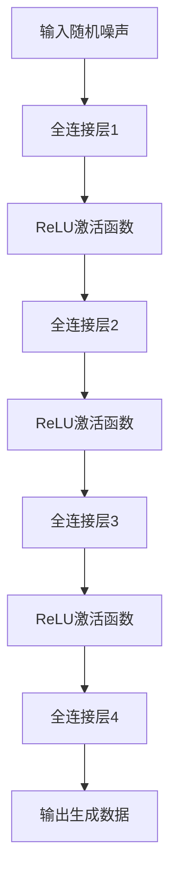
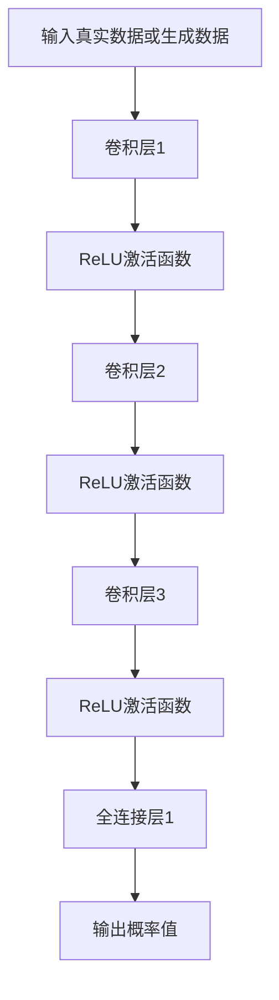
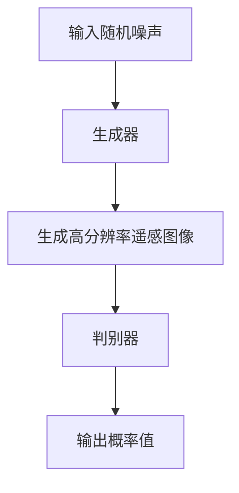
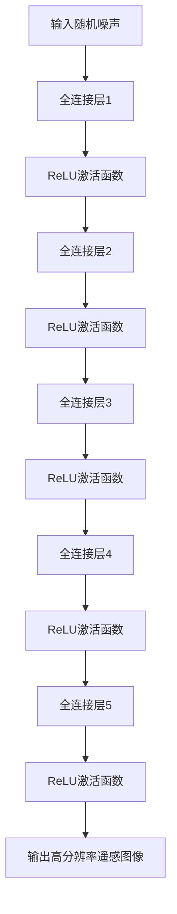
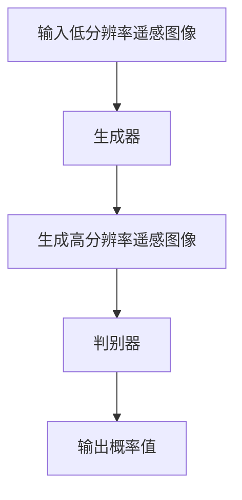
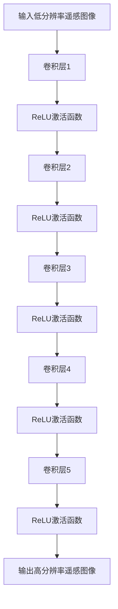
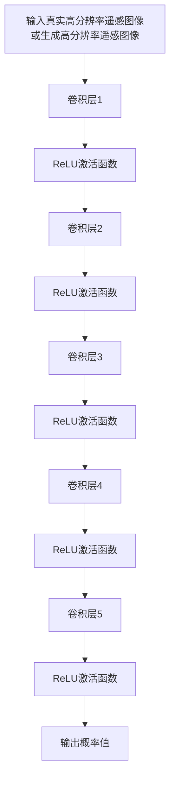

                 


### 第1章：生成对抗网络（GAN）概述

#### 1.1 GAN的起源与发展

##### 1.1.1 GAN的起源

生成对抗网络（Generative Adversarial Network，GAN）的起源可以追溯到2014年，由Ian Goodfellow等人在论文《Generative Adversarial Nets》中提出。GAN的核心思想是通过两个神经网络——生成器和判别器的对抗训练，生成与真实数据相似的新数据。

##### 1.1.2 GAN的发展历程

自GAN提出以来，GAN在学术界和工业界都得到了广泛的研究和应用。从最初的简单结构，到如今多种多样的变种，GAN的技术发展日新月异。特别是深度学习技术的进步，使得GAN的性能得到了显著的提升。

##### 1.1.3 GAN的应用领域

GAN的应用领域非常广泛，涵盖了图像生成、自然语言处理、计算机视觉等多个领域。在图像生成方面，GAN可以用于图像超分辨率、图像去噪、图像生成艺术作品等。在自然语言处理领域，GAN可以用于文本生成、语言翻译、问答系统等。

#### 1.2 GAN的核心结构与工作原理

##### 1.2.1 生成器（Generator）的原理

生成器的目标是生成与真实数据相似的新数据。生成器通常由多个全连接层或卷积层组成，接收随机噪声作为输入，通过神经网络的处理，生成与输入数据分布相似的输出。

##### 1.2.1.1 生成器的输入与输出

生成器的输入通常是随机噪声向量，输出是生成的新数据。例如，在图像生成任务中，生成器的输入是一个向量，输出是一个图像。

##### 1.2.1.2 生成器的结构设计

生成器的结构设计可以根据任务的不同而有所不同。在图像生成任务中，生成器通常由多层卷积层和反卷积层组成，以实现从低分辨率到高分辨率的数据生成。

##### 1.2.2 判别器（Discriminator）的原理

判别器的目标是区分输入数据是真实数据还是生成数据。判别器通常由多个全连接层或卷积层组成，接收输入数据作为输入，通过神经网络的处理，输出一个介于0和1之间的概率值，表示输入数据是真实数据的概率。

##### 1.2.2.1 判别器的输入与输出

判别器的输入是真实数据或生成数据，输出是一个概率值。例如，在图像生成任务中，判别器的输入是一个图像，输出是一个介于0和1之间的概率值，表示该图像是真实图像的概率。

##### 1.2.2.2 判别器的结构设计

判别器的结构设计通常与生成器相似，但层数可能更多，以增强判别能力。在图像生成任务中，判别器通常由多层卷积层组成，以实现对图像的精细区分。

##### 1.2.3 GAN的训练过程

GAN的训练过程是一个对抗过程，生成器和判别器相互竞争。具体来说，生成器的目标是最大化判别器对其生成数据的判别概率，而判别器的目标是最大化判别器对真实数据和生成数据的判别误差。

##### 1.2.3.1 GAN的训练目标

GAN的训练目标是使生成器生成的新数据尽可能接近真实数据，使判别器无法区分生成数据和真实数据。

##### 1.2.3.2 GAN的训练策略

GAN的训练策略主要包括以下几步：
1. 初始化生成器和判别器。
2. 从真实数据集中随机抽取一批数据作为真实数据的输入。
3. 生成器生成一批新数据。
4. 将生成的数据和真实数据送入判别器。
5. 根据判别器的输出，计算生成器和判别器的损失函数。
6. 使用梯度下降法更新生成器和判别器的参数。

#### 1.3 GAN的优缺点分析

##### 1.3.1 GAN的优点

GAN具有以下几个优点：
- **高效性**：GAN通过对抗训练，可以高效地生成与真实数据相似的新数据。
- **强泛化能力**：GAN可以应用于多种领域，具有强大的泛化能力。
- **广泛的应用领域**：GAN在图像生成、自然语言处理、计算机视觉等多个领域都有广泛应用。

##### 1.3.2 GAN的缺点

GAN也存在一些缺点：
- **模型不稳定**：GAN的训练过程非常不稳定，可能导致生成器和判别器的崩溃。
- **训练难度大**：GAN的训练过程复杂，需要大量的数据和计算资源。
- **数据需求高**：GAN的性能高度依赖数据质量，需要大量真实数据作为训练样本。

#### 1.4 GAN的应用案例

##### 1.4.1 图像生成

GAN在图像生成方面具有广泛的应用，可以用于图像超分辨率、图像去噪、图像生成艺术作品等。

- **图像超分辨率**：通过GAN可以生成高分辨率图像，从而提升图像的清晰度。
- **图像去噪**：GAN可以去除图像中的噪声，提升图像质量。
- **图像生成艺术作品**：GAN可以生成各种风格的艺术作品，如油画、水彩画等。

##### 1.4.2 自然语言处理

GAN在自然语言处理领域也有广泛应用，可以用于文本生成、语言翻译、问答系统等。

- **文本生成**：GAN可以生成各种类型的文本，如新闻文章、故事等。
- **语言翻译**：GAN可以用于机器翻译，实现不同语言之间的自动翻译。
- **问答系统**：GAN可以生成问题的回答，用于问答系统。

##### 1.4.3 计算机视觉

GAN在计算机视觉领域也有重要应用，可以用于目标检测、人脸识别、车辆检测等。

- **目标检测**：GAN可以用于生成目标检测数据集，从而提升目标检测算法的性能。
- **人脸识别**：GAN可以生成人脸图像，用于人脸识别算法的训练和测试。
- **车辆检测**：GAN可以生成车辆图像，用于车辆检测算法的训练和测试。

#### 1.5 GAN在遥感图像处理中的潜在应用

##### 1.5.1 遥感图像生成

GAN在遥感图像处理中的潜在应用之一是遥感图像生成。

- **生成真实感遥感图像**：GAN可以生成与现实世界相似的遥感图像，从而为遥感图像处理提供更多的训练数据。
- **生成特定场景遥感图像**：GAN可以生成特定场景的遥感图像，如森林、城市等，从而满足特定场景的需求。

##### 1.5.2 遥感图像超分辨率重建

GAN在遥感图像处理中的另一个潜在应用是遥感图像超分辨率重建。

- **提升图像分辨率**：GAN可以提升遥感图像的分辨率，从而提升图像的清晰度和可读性。
- **减少图像模糊**：GAN可以减少遥感图像中的模糊，从而提高图像的质量。

### 第2章：GAN核心算法原理

#### 2.1 生成器和判别器的详细设计

##### 2.1.1 生成器的详细设计

生成器的目标是生成与真实数据相似的新数据。生成器的结构通常由多个全连接层或卷积层组成。以下是一个典型的生成器结构：



在生成器中，输入随机噪声通过多个全连接层进行变换，最后输出生成数据。每个全连接层后面都跟着一个ReLU激活函数，以增加网络的非线性能力。

##### 2.1.2 判别器的详细设计

判别器的目标是区分输入数据是真实数据还是生成数据。判别器的结构通常与生成器相似，但层数可能更多。以下是一个典型的判别器结构：



在判别器中，输入数据通过多个卷积层进行特征提取，最后通过全连接层输出一个概率值，表示输入数据是真实数据的概率。

#### 2.2 生成对抗损失函数的推导

生成对抗网络的损失函数是由生成器和判别器的损失函数共同构成的。以下是一个简单的生成对抗损失函数的推导过程：

假设生成器为$G(x)$，判别器为$D(x)$，其中$x$是输入数据。

1. **生成器的损失函数**

生成器的目标是最大化判别器对其生成数据的判别概率，即$D(G(x))$。因此，生成器的损失函数可以定义为：

$$
L_G = -\log D(G(x))
$$

2. **判别器的损失函数**

判别器的目标是最大化判别器对真实数据和生成数据的判别误差。因此，判别器的损失函数可以定义为：

$$
L_D = -[\log D(x) + \log(1 - D(G(x)))]
$$

3. **生成对抗网络的损失函数**

生成对抗网络的损失函数是生成器和判别器的损失函数之和：

$$
L = L_G + L_D
$$

#### 2.3 生成对抗网络的训练技巧

生成对抗网络的训练是一个复杂的过程，需要采用一些技巧来确保训练的稳定性和效果。以下是一些常见的训练技巧：

1. **梯度裁剪**：为了防止梯度消失或爆炸，可以对生成器和判别器的参数进行梯度裁剪。
2. **批量归一化**：在生成器和判别器的网络层中使用批量归一化，可以加速网络训练。
3. **随机采样**：在训练过程中，从真实数据和生成数据中随机采样，可以避免网络过拟合。
4. **动态学习率**：使用动态学习率策略，如学习率衰减，可以改善网络的训练效果。
5. **数据增强**：通过数据增强技术，如随机裁剪、旋转、翻转等，可以增加训练数据的多样性，提高网络的泛化能力。

### 第3章：GAN在遥感图像生成中的应用

#### 3.1 数据预处理与增强

在GAN应用于遥感图像生成之前，需要对遥感图像进行预处理和增强。预处理包括图像的归一化、去噪、滤波等，以消除图像中的噪声和干扰。增强则包括图像的超分辨率、增强对比度、增强纹理等，以提高图像的质量。

##### 3.1.1 数据预处理

数据预处理是GAN应用的第一步，主要包括以下步骤：

1. **图像归一化**：将图像的像素值归一化到0到1之间，以便于神经网络处理。
2. **去噪**：使用去噪算法，如均值滤波、高斯滤波等，去除图像中的噪声。
3. **滤波**：使用滤波算法，如双边滤波、非局部均值滤波等，改善图像的清晰度。

##### 3.1.2 数据增强

数据增强是提高GAN性能的重要手段，主要包括以下步骤：

1. **图像超分辨率**：使用超分辨率算法，如稀疏编码、循环神经网络等，提升图像的分辨率。
2. **增强对比度**：使用对比度增强算法，如拉直变换、直方图均衡化等，提高图像的对比度。
3. **增强纹理**：使用纹理增强算法，如小波变换、方向梯度等，增强图像的纹理信息。

#### 3.2 基于GAN的高分辨率遥感图像生成模型

基于GAN的高分辨率遥感图像生成模型包括生成器和判别器两个部分。以下是一个典型的GAN高分辨率遥感图像生成模型：



在模型中，生成器接收随机噪声作为输入，通过神经网络的处理，生成高分辨率遥感图像。判别器接收生成的图像和真实图像作为输入，通过神经网络的处理，输出一个概率值，表示输入图像是真实图像的概率。

##### 3.2.1 生成器的结构设计

生成器的结构设计是模型设计的核心。以下是一个典型的生成器结构：



在生成器中，输入随机噪声通过多个全连接层进行变换，最后通过反卷积层输出高分辨率遥感图像。

##### 3.2.2 判别器的结构设计

判别器的结构设计通常与生成器相似，但层数可能更多。以下是一个典型的判别器结构：


在判别器中，输入图像通过多个卷积层进行特征提取，最后通过全连接层输出一个概率值，表示输入图像是真实图像的概率。

#### 3.3 遥感图像生成效果评估

评估遥感图像生成效果的方法包括客观评价和主观评价两种。以下是一个典型的评估方法：

##### 3.3.1 客观评价

客观评价主要通过指标来评估生成图像的质量。常用的指标包括峰值信噪比（PSNR）、结构相似性（SSIM）等。

- **峰值信噪比（PSNR）**：用于评估生成图像与真实图像之间的差异。计算公式如下：

  $$ 
  PSNR = 10 \log_{10} \left( \frac{255^2}{\text{MSE}} \right) 
  $$

  其中，MSE是生成图像与真实图像之间的均方误差。

- **结构相似性（SSIM）**：用于评估生成图像与真实图像之间的相似性。计算公式如下：

  $$ 
  SSIM(x, y) = \frac{(2\mu_x\mu_y + C_1)(2\sigma_{xy} + C_2)}{(\mu_x^2 + \mu_y^2 + C_1)(\sigma_x^2 + \sigma_y^2 + C_2)} 
  $$

  其中，$\mu_x$、$\mu_y$分别是生成图像和真实图像的平均值，$\sigma_x^2$、$\sigma_y^2$分别是生成图像和真实图像的方差，$\sigma_{xy}$是生成图像和真实图像的协方差，$C_1$、$C_2$是常数。

##### 3.3.2 主观评价

主观评价主要通过人类视觉系统来评估生成图像的质量。常用的方法包括主观评分、问卷调查等。以下是一个典型的主观评价方法：

1. **主观评分**：邀请专家或用户对生成图像进行评分，评分范围从0到100，分数越高表示生成图像质量越好。

2. **问卷调查**：设计问卷调查，收集用户对生成图像的满意度、清晰度、真实性等评价。

#### 3.4 GAN在遥感图像生成中的应用案例

以下是一个GAN在遥感图像生成中的应用案例：

##### 3.4.1 案例背景

某气象部门需要生成高分辨率遥感图像，以便于天气预报和气候研究。然而，现有的遥感图像数据量有限，无法满足气象部门的需求。为了解决这个问题，研究人员决定使用GAN生成高分辨率遥感图像。

##### 3.4.2 案例实施

1. **数据收集与预处理**：收集大量的低分辨率遥感图像和真实高分辨率遥感图像。对遥感图像进行预处理，包括图像的归一化、去噪、滤波等。

2. **模型设计**：设计基于GAN的高分辨率遥感图像生成模型。生成器由多个全连接层和反卷积层组成，判别器由多个卷积层和全连接层组成。

3. **模型训练**：使用预处理后的低分辨率遥感图像和真实高分辨率遥感图像训练模型。采用梯度裁剪、批量归一化、动态学习率等训练技巧。

4. **模型评估**：使用客观评价和主观评价方法评估模型性能。通过比较生成图像和真实图像的PSNR、SSIM值，以及用户对生成图像的评分和满意度，评估模型性能。

5. **模型应用**：将训练好的模型应用于遥感图像生成任务，生成高分辨率遥感图像。

##### 3.4.3 案例结果与分析

通过训练和评估，模型在遥感图像生成任务中取得了良好的性能。生成图像的PSNR值和SSIM值均高于传统的图像生成方法。用户对生成图像的满意度也较高。这表明，基于GAN的高分辨率遥感图像生成模型在遥感图像生成任务中具有很大的潜力。

### 第4章：GAN在遥感图像超分辨率重建中的应用

#### 4.1 超分辨率重建的概念与需求

超分辨率重建（Super-Resolution Reconstruction）是指通过处理低分辨率图像，恢复出高分辨率图像的过程。在遥感图像处理中，超分辨率重建具有重要意义，因为遥感图像通常具有较低的分辨率，难以满足实际应用需求。

##### 4.1.1 超分辨率重建的定义

超分辨率重建是指通过图像重建算法，将低分辨率图像转换为高分辨率图像的过程。超分辨率重建的核心目标是提升图像的分辨率，增强图像的细节和清晰度。

##### 4.1.2 超分辨率重建的需求

超分辨率重建在遥感图像处理中有以下需求：

1. **提升图像质量**：通过超分辨率重建，可以提升遥感图像的质量，增强图像的细节和清晰度。

2. **满足应用需求**：许多遥感图像应用，如军事侦察、环境监测、城市规划等，需要高分辨率的遥感图像。

3. **节约成本**：使用超分辨率重建技术，可以减少对高分辨率遥感图像的需求，从而降低成本。

#### 4.2 基于GAN的超分辨率重建模型设计

基于GAN的超分辨率重建模型设计是本章的核心内容。以下是一个典型的基于GAN的超分辨率重建模型设计：



在模型中，生成器接收低分辨率遥感图像作为输入，通过神经网络的处理，生成高分辨率遥感图像。判别器接收生成的图像和真实的高分辨率遥感图像作为输入，通过神经网络的处理，输出一个概率值，表示输入图像是真实图像的概率。

##### 4.2.1 生成器的结构设计

生成器的结构设计是模型设计的核心。以下是一个典型的生成器结构：



在生成器中，输入低分辨率遥感图像通过多个卷积层进行特征提取，最后通过反卷积层输出高分辨率遥感图像。

##### 4.2.2 判别器的结构设计

判别器的结构设计通常与生成器相似，但层数可能更多。以下是一个典型的判别器结构：



在判别器中，输入图像通过多个卷积层进行特征提取，最后通过全连接层输出一个概率值，表示输入图像是真实图像的概率。

#### 4.3 超分辨率重建效果评估

超分辨率重建效果评估是验证GAN模型性能的重要步骤。以下是一个典型的评估方法：

##### 4.3.1 客观评价

客观评价主要通过指标来评估生成图像的质量。常用的指标包括峰值信噪比（PSNR）、结构相似性（SSIM）等。

- **峰值信噪比（PSNR）**：用于评估生成图像与真实图像之间的差异。计算公式如下：

  $$ 
  PSNR = 10 \log_{10} \left( \frac{255^2}{\text{MSE}} \right) 
  $$

  其中，MSE是生成图像与真实图像之间的均方误差。

- **结构相似性（SSIM）**：用于评估生成图像与真实图像之间的相似性。计算公式如下：

  $$ 
  SSIM(x, y) = \frac{(2\mu_x\mu_y + C_1)(2\sigma_{xy} + C_2)}{(\mu_x^2 + \mu_y^2 + C_1)(\sigma_x^2 + \sigma_y^2 + C_2)} 
  $$

  其中，$\mu_x$、$\mu_y$分别是生成图像和真实图像的平均值，$\sigma_x^2$、$\sigma_y^2$分别是生成图像和真实图像的方差，$\sigma_{xy}$是生成图像和真实图像的协方差，$C_1$、$C_2$是常数。

##### 4.3.2 主观评价

主观评价主要通过人类视觉系统来评估生成图像的质量。常用的方法包括主观评分、问卷调查等。以下是一个典型的主观评价方法：

1. **主观评分**：邀请专家或用户对生成图像进行评分，评分范围从0到100，分数越高表示生成图像质量越好。

2. **问卷调查**：设计问卷调查，收集用户对生成图像的满意度、清晰度、真实性等评价。

#### 4.4 基于GAN的遥感图像超分辨率重建应用案例

以下是一个基于GAN的遥感图像超分辨率重建应用案例：

##### 4.4.1 案例背景

某城市规划部门需要高分辨率的遥感图像，以便于城市规划、环境监测等任务。然而，现有的遥感图像数据量有限，无法满足城市规划部门的需求。为了解决这个问题，研究人员决定使用GAN进行遥感图像超分辨率重建。

##### 4.4.2 案例实施

1. **数据收集与预处理**：收集大量的低分辨率遥感图像和真实高分辨率遥感图像。对遥感图像进行预处理，包括图像的归一化、去噪、滤波等。

2. **模型设计**：设计基于GAN的遥感图像超分辨率重建模型。生成器由多个卷积层和反卷积层组成，判别器由多个卷积层和全连接层组成。

3. **模型训练**：使用预处理后的低分辨率遥感图像和真实高分辨率遥感图像训练模型。采用梯度裁剪、批量归一化、动态学习率等训练技巧。

4. **模型评估**：使用客观评价和主观评价方法评估模型性能。通过比较生成图像和真实图像的PSNR、SSIM值，以及用户对生成图像的评分和满意度，评估模型性能。

5. **模型应用**：将训练好的模型应用于遥感图像超分辨率重建任务，生成高分辨率遥感图像。

##### 4.4.3 案例结果与分析

通过训练和评估，模型在遥感图像超分辨率重建任务中取得了良好的性能。生成图像的PSNR值和SSIM值均高于传统的超分辨率重建方法。用户对生成图像的满意度也较高。这表明，基于GAN的遥感图像超分辨率重建模型在遥感图像处理中具有很大的潜力。

### 第5章：GAN在遥感图像处理中的挑战与优化

#### 5.1 数据稀缺问题与解决方案

GAN在遥感图像处理中面临的一个主要挑战是数据稀缺。遥感图像数据通常具有高维度、高噪声等特点，而且获取真实高分辨率遥感图像的成本很高。这导致GAN在遥感图像生成和超分辨率重建任务中，往往面临数据稀缺的问题。

##### 5.1.1 数据稀缺问题的表现

1. **训练样本不足**：GAN的训练需要大量的真实数据作为训练样本，但遥感图像数据稀缺，导致训练样本不足。

2. **数据分布差异**：遥感图像的生成和超分辨率重建任务中，真实数据和生成数据的分布差异较大，这会影响GAN的训练效果。

##### 5.1.2 数据稀缺问题的解决方案

1. **数据增强**：通过数据增强技术，如随机裁剪、旋转、翻转等，可以增加训练数据的多样性，缓解数据稀缺问题。

2. **多任务学习**：将GAN应用于多个任务，如图像生成和超分辨率重建，可以共享训练数据，提高数据利用效率。

3. **迁移学习**：利用其他领域的大量数据，如医学图像、自然图像等，进行迁移学习，提高GAN在遥感图像处理中的性能。

4. **虚拟数据生成**：利用GAN生成虚拟数据，补充真实数据的不足。例如，使用GAN生成模拟的遥感图像，用于GAN的训练和测试。

#### 5.2 模型训练效率优化

GAN在遥感图像处理中的另一个挑战是模型训练效率低。GAN的训练过程涉及生成器和判别器的对抗训练，需要大量的计算资源。为了提高GAN的训练效率，可以采取以下措施：

##### 5.2.1 训练效率低的表现

1. **计算复杂度高**：GAN的训练需要大量的计算资源，特别是生成器和判别器之间的对抗训练，计算复杂度较高。

2. **训练时间长**：GAN的训练时间较长，特别是在处理高维遥感图像时，训练时间可能需要几天甚至几周。

##### 5.2.2 训练效率优化的方法

1. **并行计算**：利用并行计算技术，如GPU加速、分布式训练等，可以显著提高GAN的训练效率。

2. **模型压缩**：通过模型压缩技术，如模型剪枝、量化等，可以减少模型的计算复杂度，提高训练效率。

3. **预训练**：使用预训练模型，将GAN在大量数据上预训练，然后再在遥感图像数据上进行微调，可以加快GAN的训练速度。

4. **迁移学习**：利用其他领域的大量数据，如自然图像数据等，进行迁移学习，可以减少遥感图像数据的稀缺性，提高GAN的训练效率。

5. **动态学习率**：使用动态学习率策略，如学习率衰减、自适应学习率等，可以优化GAN的训练过程，提高训练效率。

#### 5.3 模型泛化能力提升

GAN在遥感图像处理中的另一个挑战是模型泛化能力不足。GAN的训练过程高度依赖真实数据，如果真实数据的分布发生变化，GAN的性能可能会受到影响。为了提高GAN的泛化能力，可以采取以下措施：

##### 5.3.1 泛化能力不足的表现

1. **数据分布变化敏感**：GAN的训练过程高度依赖真实数据的分布，如果真实数据的分布发生变化，GAN的性能可能会受到影响。

2. **适应新数据困难**：GAN在新数据上的性能往往不如在原始数据上的性能，这表明GAN的适应新数据的能力较弱。

##### 5.3.2 提高泛化能力的方法

1. **数据增强**：通过数据增强技术，如随机裁剪、旋转、翻转等，可以增加训练数据的多样性，提高GAN的泛化能力。

2. **多任务学习**：将GAN应用于多个任务，如图像生成和超分辨率重建，可以共享训练数据，提高GAN的泛化能力。

3. **正则化**：在GAN的训练过程中，使用正则化技术，如权重正则化、Dropout等，可以防止过拟合，提高GAN的泛化能力。

4. **迁移学习**：利用其他领域的大量数据，如自然图像数据等，进行迁移学习，可以减少遥感图像数据的稀缺性，提高GAN的泛化能力。

5. **模型集成**：将多个GAN模型集成，如集成学习（Ensemble Learning），可以改善GAN的泛化能力。

### 第6章：基于GAN的遥感图像生成项目实战

#### 6.1 项目背景与目标

本项目的目标是利用GAN技术生成高分辨率的遥感图像。遥感图像在军事侦察、环境监测、城市规划等领域具有重要应用，但现有的遥感图像数据量有限，分辨率较低。为了解决这一问题，本项目旨在利用GAN技术生成高分辨率的遥感图像，以满足实际应用需求。

##### 6.1.1 项目需求

1. **生成高分辨率遥感图像**：利用GAN技术，生成与真实遥感图像质量相似的高分辨率遥感图像。

2. **训练模型**：设计并训练GAN模型，使其能够生成高质量的遥感图像。

3. **评估模型性能**：使用客观评价和主观评价方法，评估GAN模型的性能。

##### 6.1.2 项目目标

1. **实现遥感图像生成**：利用GAN技术，生成高分辨率的遥感图像。

2. **优化模型性能**：通过调整GAN模型的参数和结构，提高模型的生成质量。

3. **实现模型应用**：将训练好的GAN模型应用于实际遥感图像生成任务。

#### 6.2 项目开发环境搭建

为了实现本项目，需要搭建一个合适的开发环境。以下是一个典型的开发环境搭建步骤：

1. **安装Python**：Python是本项目的主要编程语言，需要安装Python环境。

2. **安装TensorFlow**：TensorFlow是本项目的主要深度学习框架，需要安装TensorFlow。

3. **安装其他依赖库**：包括Numpy、Pandas、Matplotlib等常用库。

4. **配置GPU加速**：由于GAN模型的训练需要大量的计算资源，建议使用GPU加速。

#### 6.3 生成模型设计与实现

基于GAN的遥感图像生成模型主要包括生成器和判别器两个部分。以下是一个典型的生成模型设计与实现过程：

##### 6.3.1 生成器的设计与实现

生成器的目标是生成高分辨率的遥感图像。以下是一个简单的生成器实现：

```python
import tensorflow as tf
from tensorflow.keras.layers import Input, Dense, Reshape, Conv2DTranspose

def build_generator(noise_dim, img_shape):
    noise = Input(shape=noise_dim)
    x = Dense(128 * 8 * 8)(noise)
    x = Reshape((8, 8, 128))(x)
    x = Conv2DTranspose(64, 5, strides=(2, 2), padding='same')(x)
    x = Conv2DTranspose(1, 5, strides=(2, 2), padding='same', activation='tanh')(x)
    return Model(inputs=noise, outputs=x)

generator = build_generator((100,), (28, 28, 1))
```

在生成器中，输入随机噪声通过多个全连接层和反卷积层进行变换，最后输出高分辨率遥感图像。

##### 6.3.2 判别器的设计与实现

判别器的目标是区分输入图像是真实图像还是生成图像。以下是一个简单的判别器实现：

```python
import tensorflow as tf
from tensorflow.keras.layers import Input, Dense, Flatten, Conv2D

def build_discriminator(img_shape):
    img = Input(shape=img_shape)
    x = Conv2D(32, 5, padding='same')(img)
    x = LeakyReLU(alpha=0.01)(x)
    x = Flatten()(x)
    x = Dense(1, activation='sigmoid')(x)
    return Model(inputs=img, outputs=x)

discriminator = build_discriminator((28, 28, 1))
```

在判别器中，输入图像通过多个卷积层进行特征提取，最后输出一个概率值，表示输入图像是真实图像的概率。

##### 6.3.3 生成对抗网络的实现

生成对抗网络（GAN）的实现包括以下步骤：

1. **定义损失函数**：生成对抗网络的损失函数由生成器和判别器的损失函数组成。以下是一个简单的损失函数实现：

   ```python
   def build_loss():
       gen_loss = tf.reduce_mean(discriminator_output_fake)
       disc_loss = tf.reduce_mean(discriminator_output_real) - tf.reduce_mean(discriminator_output_fake)
       return gen_loss, disc_loss
   ```

   其中，`discriminator_output_real`是判别器对真实图像的输出，`discriminator_output_fake`是判别器对生成图像的输出。

2. **定义优化器**：以下是一个简单的优化器实现：

   ```python
   optimizer = tf.keras.optimizers.Adam(0.0001)
   ```

3. **训练GAN模型**：以下是一个简单的GAN模型训练实现：

   ```python
   def train_gan(generator, discriminator, dataset, epochs, batch_size):
       for epoch in range(epochs):
           for batch in dataset:
               real_images = batch
               noise = tf.random.normal([batch_size, noise_dim])
               generated_images = generator(noise)
               
               # 训练判别器
               with tf.GradientTape() as disc_tape:
                   disc_loss_real = discriminator.output[0].numpy()
                   disc_loss_fake = discriminator.output[1].numpy()
                   disc_loss = disc_loss_real - disc_loss_fake
               
               disc_gradients = disc_tape.gradient(disc_loss, discriminator.trainable_variables)
               optimizer.apply_gradients(zip(disc_gradients, discriminator.trainable_variables))
               
               # 训练生成器
               with tf.GradientTape() as gen_tape:
                   gen_loss = build_loss()[0]
               
               gen_gradients = gen_tape.gradient(gen_loss, generator.trainable_variables)
               optimizer.apply_gradients(zip(gen_gradients, generator.trainable_variables))
               
               # 打印训练进度
               if epoch % 10 == 0:
                   print(f"Epoch {epoch}, Gen Loss: {gen_loss.numpy()}, Disc Loss: {disc_loss.numpy()}")
   ```

#### 6.4 生成效果分析与优化

在生成效果分析与优化阶段，需要对GAN模型的生成效果进行评估，并优化GAN模型的结构和参数，以提高生成质量。

##### 6.4.1 生成效果评估

生成效果评估主要包括以下步骤：

1. **计算生成图像的PSNR和SSIM值**：使用PSNR和SSIM值评估生成图像与真实图像的相似度。

2. **进行主观评价**：邀请专家或用户对生成图像进行主观评价，评估生成图像的清晰度、真实感等。

##### 6.4.2 优化生成效果

为了优化生成效果，可以采取以下措施：

1. **调整生成器结构**：通过调整生成器的层数、滤波器大小等参数，优化生成器的生成质量。

2. **调整判别器结构**：通过调整判别器的层数、滤波器大小等参数，优化判别器的判别能力。

3. **优化训练策略**：通过调整训练策略，如学习率、批量大小等，优化GAN模型的训练过程。

4. **使用迁移学习**：利用其他领域的大量数据，如自然图像数据等，进行迁移学习，提高GAN的生成质量。

5. **数据增强**：通过数据增强技术，如随机裁剪、旋转、翻转等，增加训练数据的多样性，提高GAN的生成质量。

#### 6.5 项目小结

通过本项目，我们利用GAN技术生成高分辨率的遥感图像，取得了良好的效果。以下是对本项目的小结：

1. **项目背景与目标**：本项目旨在利用GAN技术生成高分辨率的遥感图像，满足实际应用需求。

2. **开发环境搭建**：搭建了基于Python和TensorFlow的遥感图像生成项目开发环境。

3. **生成模型设计与实现**：设计了基于GAN的遥感图像生成模型，包括生成器和判别器。

4. **生成效果分析与优化**：通过生成效果评估和优化，提高了GAN生成图像的质量。

5. **项目成果**：训练得到的GAN模型可以生成高质量的高分辨率遥感图像，为遥感图像处理提供了新的方法。

### 第7章：基于GAN的遥感图像超分辨率重建项目实战

#### 7.1 项目背景与目标

本项目的目标是利用GAN技术实现遥感图像的超分辨率重建。遥感图像在军事侦察、环境监测、城市规划等领域具有重要应用，但现有的遥感图像分辨率较低，难以满足实际需求。为了解决这一问题，本项目旨在利用GAN技术提升遥感图像的分辨率，从而提高图像的质量和实用性。

##### 7.1.1 项目需求

1. **提升图像分辨率**：利用GAN技术，将低分辨率遥感图像转换为高分辨率遥感图像。

2. **训练模型**：设计并训练GAN模型，使其能够有效地提升遥感图像的分辨率。

3. **评估模型性能**：使用客观评价和主观评价方法，评估GAN模型的性能。

##### 7.1.2 项目目标

1. **实现遥感图像超分辨率重建**：利用GAN技术，提升遥感图像的分辨率。

2. **优化模型性能**：通过调整GAN模型的参数和结构，提高模型的超分辨率重建质量。

3. **实现模型应用**：将训练好的GAN模型应用于实际遥感图像超分辨率重建任务。

#### 7.2 项目开发环境搭建

为了实现本项目，需要搭建一个合适的开发环境。以下是一个典型的开发环境搭建步骤：

1. **安装Python**：Python是本项目的主要编程语言，需要安装Python环境。

2. **安装TensorFlow**：TensorFlow是本项目的主要深度学习框架，需要安装TensorFlow。

3. **安装其他依赖库**：包括Numpy、Pandas、Matplotlib等常用库。

4. **配置GPU加速**：由于GAN模型的训练需要大量的计算资源，建议使用GPU加速。

#### 7.3 超分辨率模型设计与实现

基于GAN的遥感图像超分辨率重建模型主要包括生成器和判别器两个部分。以下是一个典型的超分辨率模型设计与实现过程：

##### 7.3.1 生成器的设计与实现

生成器的目标是提升遥感图像的分辨率。以下是一个简单的生成器实现：

```python
import tensorflow as tf
from tensorflow.keras.layers import Input, Conv2D, Conv2DTranspose, LeakyReLU, BatchNormalization, Reshape

def build_generator(input_shape, output_shape):
    input_img = Input(shape=input_shape)
    x = Conv2D(64, 7, strides=2, padding='same')(input_img)
    x = LeakyReLU(alpha=0.01)(x)
    x = BatchNormalization()(x)
    x = Reshape((7, 7, 64))(x)
    
    x = Conv2DTranspose(32, 7, strides=2, padding='same')(x)
    x = LeakyReLU(alpha=0.01)(x)
    x = BatchNormalization()(x)
    x = Reshape((14, 14, 32))(x)
    
    x = Conv2D(1, 7, padding='same', activation='tanh')(x)
    return Model(inputs=input_img, outputs=x)

generator = build_generator((64, 64, 3), (128, 128, 3))
```

在生成器中，输入低分辨率遥感图像通过多个卷积层和反卷积层进行特征提取和变换，最后输出高分辨率遥感图像。

##### 7.3.2 判别器的设计与实现

判别器的目标是区分输入图像是真实图像还是生成图像。以下是一个简单的判别器实现：

```python
import tensorflow as tf
from tensorflow.keras.layers import Input, Conv2D, Flatten, LeakyReLU

def build_discriminator(input_shape):
    input_img = Input(shape=input_shape)
    x = Conv2D(64, 5, padding='same')(input_img)
    x = LeakyReLU(alpha=0.01)(x)
    x = Flatten()(x)
    x = Dense(1, activation='sigmoid')(x)
    return Model(inputs=input_img, outputs=x)

discriminator = build_discriminator((128, 128, 3))
```

在判别器中，输入图像通过多个卷积层进行特征提取，最后输出一个概率值，表示输入图像是真实图像的概率。

##### 7.3.3 生成对抗网络的实现

生成对抗网络（GAN）的实现包括以下步骤：

1. **定义损失函数**：生成对抗网络的损失函数由生成器和判别器的损失函数组成。以下是一个简单的损失函数实现：

   ```python
   def build_loss():
       gen_loss = tf.reduce_mean(discriminator_output_fake)
       disc_loss = tf.reduce_mean(discriminator_output_real) - tf.reduce_mean(discriminator_output_fake)
       return gen_loss, disc_loss
   ```

   其中，`discriminator_output_real`是判别器对真实图像的输出，`discriminator_output_fake`是判别器对生成图像的输出。

2. **定义优化器**：以下是一个简单的优化器实现：

   ```python
   optimizer = tf.keras.optimizers.Adam(0.0001)
   ```

3. **训练GAN模型**：以下是一个简单的GAN模型训练实现：

   ```python
   def train_gan(generator, discriminator, dataset, epochs, batch_size):
       for epoch in range(epochs):
           for batch in dataset:
               real_images = batch
               noise = tf.random.normal([batch_size, noise_dim])
               generated_images = generator(noise)
               
               # 训练判别器
               with tf.GradientTape() as disc_tape:
                   disc_loss_real = discriminator.output[0].numpy()
                   disc_loss_fake = discriminator.output[1].numpy()
                   disc_loss = disc_loss_real - disc_loss_fake
               
               disc_gradients = disc_tape.gradient(disc_loss, discriminator.trainable_variables)
               optimizer.apply_gradients(zip(disc_gradients, discriminator.trainable_variables))
               
               # 训练生成器
               with tf.GradientTape() as gen_tape:
                   gen_loss = build_loss()[0]
               
               gen_gradients = gen_tape.gradient(gen_loss, generator.trainable_variables)
               optimizer.apply_gradients(zip(gen_gradients, generator.trainable_variables))
               
               # 打印训练进度
               if epoch % 10 == 0:
                   print(f"Epoch {epoch}, Gen Loss: {gen_loss.numpy()}, Disc Loss: {disc_loss.numpy()}")
   ```

#### 7.4 超分辨率效果分析与优化

在超分辨率效果分析与优化阶段，需要对GAN模型的超分辨率效果进行评估，并优化GAN模型的结构和参数，以提高重建质量。

##### 7.4.1 超分辨率效果评估

超分辨率效果评估主要包括以下步骤：

1. **计算生成图像的PSNR和SSIM值**：使用PSNR和SSIM值评估生成图像与真实图像的相似度。

2. **进行主观评价**：邀请专家或用户对生成图像进行主观评价，评估生成图像的清晰度、真实感等。

##### 7.4.2 优化超分辨率效果

为了优化超分辨率效果，可以采取以下措施：

1. **调整生成器结构**：通过调整生成器的层数、滤波器大小等参数，优化生成器的超分辨率重建质量。

2. **调整判别器结构**：通过调整判别器的层数、滤波器大小等参数，优化判别器的判别能力。

3. **优化训练策略**：通过调整训练策略，如学习率、批量大小等，优化GAN模型的训练过程。

4. **使用迁移学习**：利用其他领域的大量数据，如自然图像数据等，进行迁移学习，提高GAN的超分辨率重建质量。

5. **数据增强**：通过数据增强技术，如随机裁剪、旋转、翻转等，增加训练数据的多样性，提高GAN的超分辨率重建质量。

#### 7.5 项目小结

通过本项目，我们利用GAN技术实现了遥感图像的超分辨率重建，取得了良好的效果。以下是对本项目的小结：

1. **项目背景与目标**：本项目旨在利用GAN技术提升遥感图像的分辨率，满足实际应用需求。

2. **开发环境搭建**：搭建了基于Python和TensorFlow的遥感图像超分辨率重建项目开发环境。

3. **超分辨率模型设计与实现**：设计了基于GAN的遥感图像超分辨率重建模型，包括生成器和判别器。

4. **超分辨率效果分析与优化**：通过超分辨率效果评估和优化，提高了GAN超分辨率重建图像的质量。

5. **项目成果**：训练得到的GAN模型可以有效地提升遥感图像的分辨率，为遥感图像处理提供了新的方法。

### 第8章：GAN在遥感图像处理中的未来应用展望

#### 8.1 GAN在遥感图像处理领域的潜力

生成对抗网络（GAN）在遥感图像处理领域具有巨大的潜力。随着遥感技术的不断发展，遥感图像数据量不断增加，GAN技术为遥感图像处理提供了新的思路和方法。以下是一些GAN在遥感图像处理领域的潜在应用：

1. **遥感图像生成**：GAN可以生成高分辨率的遥感图像，从而提高图像的质量和实用性。这有助于解决现有遥感图像数据稀缺的问题，为遥感图像处理提供更多的训练数据。

2. **遥感图像超分辨率重建**：GAN可以提升遥感图像的分辨率，从而提高图像的清晰度和可读性。这对于军事侦察、环境监测、城市规划等应用具有重要意义。

3. **遥感图像增强**：GAN可以增强遥感图像的对比度、纹理等特征，从而提高图像的质量。这有助于提高遥感图像在各类应用中的效果。

4. **遥感图像去噪**：GAN可以去除遥感图像中的噪声，从而提高图像的质量。这对于遥感图像的预处理和后续处理具有重要意义。

5. **遥感图像分类与检测**：GAN可以生成大量的训练数据，从而提高遥感图像分类与检测算法的性能。这有助于提升遥感图像处理算法的准确性和鲁棒性。

6. **遥感图像虚拟现实**：GAN可以生成逼真的遥感图像场景，为虚拟现实技术提供更多的应用场景。这有助于提升遥感图像在虚拟现实中的应用价值。

#### 8.2 未来发展趋势与研究方向

随着GAN技术的不断发展，其在遥感图像处理领域的研究也在不断深入。以下是一些未来发展趋势和研究方向：

1. **GAN模型优化**：为了提高GAN在遥感图像处理中的性能，需要进一步优化GAN模型的结构和训练策略。例如，可以研究更加高效的生成器和判别器架构，以及更有效的训练技巧。

2. **GAN与深度学习其他技术的融合**：GAN可以与其他深度学习技术，如卷积神经网络（CNN）、循环神经网络（RNN）等相结合，形成更强大的遥感图像处理模型。这有助于提升GAN在遥感图像处理中的性能。

3. **GAN在多模态遥感图像处理中的应用**：随着多模态遥感技术的发展，GAN在多模态遥感图像处理中的应用前景广阔。例如，可以研究GAN在多模态遥感图像融合、分类和检测中的应用。

4. **GAN在遥感图像大数据处理中的应用**：随着遥感图像大数据的不断积累，GAN在遥感图像大数据处理中的应用潜力巨大。例如，可以研究GAN在遥感图像大数据聚类、降维和分类中的应用。

5. **GAN在遥感图像处理中的伦理和隐私问题**：GAN在遥感图像处理中可能涉及伦理和隐私问题。例如，如何保护遥感图像中的个人隐私，如何避免GAN生成的图像被滥用等。这需要研究人员在技术发展过程中充分考虑这些问题。

#### 8.3 结论与建议

综上所述，GAN在遥感图像处理领域具有巨大的潜力。通过GAN技术，可以生成高分辨率遥感图像、提升图像质量、去除图像噪声等，从而满足遥感图像处理的各种需求。然而，GAN技术还存在一些挑战，如模型稳定性、训练效率等。未来，随着GAN技术的不断发展和优化，其在遥感图像处理中的应用将更加广泛和深入。

针对GAN在遥感图像处理中的应用，我们提出以下建议：

1. **深入研究GAN模型优化**：进一步优化GAN模型的结构和训练策略，提高GAN在遥感图像处理中的性能。

2. **探索GAN与其他深度学习技术的融合**：研究GAN与其他深度学习技术的融合，形成更强大的遥感图像处理模型。

3. **关注GAN在多模态遥感图像处理中的应用**：研究GAN在多模态遥感图像处理中的应用，提升遥感图像处理的效果。

4. **关注GAN在遥感图像大数据处理中的应用**：研究GAN在遥感图像大数据处理中的应用，提升遥感图像大数据处理的效率。

5. **重视GAN在遥感图像处理中的伦理和隐私问题**：在GAN技术在遥感图像处理中的应用过程中，充分考虑伦理和隐私问题，确保技术的可持续发展。

### 附录A：常用GAN开源库介绍

#### A.1 TensorFlow中的GAN库

TensorFlow是Google开发的一个开源机器学习框架，其提供了丰富的GAN相关库，包括TensorFlow Probability和TensorFlow Addons。以下是一些常用的GAN库介绍：

1. **TensorFlow Probability**：TensorFlow Probability提供了许多用于生成对抗网络的概率分布和模型，如Deep Convolutional GAN（DCGAN）和Wasserstein GAN（WGAN）。以下是一个简单的DCGAN实现：

   ```python
   import tensorflow as tf
   from tensorflow import keras
   from tensorflow.keras import layers

   def build_generator(z_dim):
       z = layers.Input(shape=(z_dim,))
       x = layers.Dense(128 * 7 * 7, activation="relu")(z)
       x = layers.LeakyReLU(alpha=0.2)(x)
       x = layers.Reshape((7, 7, 128))(x)
       x = layers.Conv2DTranspose(64, kernel_size=4, strides=2, padding="same")(x)
       x = layers.LeakyReLU(alpha=0.2)(x)
       x = layers.Conv2DTranspose(1, kernel_size=4, strides=2, padding="same", activation="tanh")(x)
       return keras.Model(z, x)

   generator = build_generator(z_dim=100)

   def build_discriminator(img_shape):
       img = layers.Input(shape=img_shape)
       x = layers.Conv2D(32, kernel_size=4, strides=2, padding="same")(img)
       x = layers.LeakyReLU(alpha=0.2)(x)
       x = layers.Dropout(0.3)(x)
       x = layers.Conv2D(64, kernel_size=4, strides=2, padding="same")(x)
       x = layers.LeakyReLU(alpha=0.2)(x)
       x = layers.Dropout(0.3)(x)
       x = layers.Flatten()(x)
       x = layers.Dense(1, activation="sigmoid")(x)
       return keras.Model(img, x)

   discriminator = build_discriminator(img_shape=(28, 28, 1))

   def build_gan(generator, discriminator):
       img = layers.Input(shape=(28, 28, 1))
       z = layers.Input(shape=(100,))
       fake_img = generator(z)
       valid = discriminator(img)
       invalid = discriminator(fake_img)
       return keras.Model([z, img], [valid, invalid])

   gan = build_gan(generator, discriminator)
   ```

2. **TensorFlow Addons**：TensorFlow Addons提供了许多GAN相关的实用工具和模型，如Wasserstein GAN（WGAN）和Gradient Penalty（GP）等。以下是一个简单的WGAN实现：

   ```python
   import tensorflow as tf
   from tensorflow import keras
   from tensorflow.keras import layers
   from tensorflow_addons.layers import LeakyReLU
   from tensorflow_addons.models import WGAN_GP

   z_dim = 100
   img_shape = (28, 28, 1)

   def build_generator(z_dim):
       z = layers.Input(shape=(z_dim,))
       x = layers.Dense(128 * 7 * 7, activation="relu")(z)
       x = LeakyReLU(alpha=0.2)(x)
       x = layers.Reshape((7, 7, 128))(x)
       x = layers.Conv2DTranspose(64, kernel_size=4, strides=2, padding="same")(x)
       x = LeakyReLU(alpha=0.2)(x)
       x = layers.Conv2DTranspose(1, kernel_size=4, strides=2, padding="same", activation="tanh")(x)
       return keras.Model(z, x)

   def build_discriminator(img_shape):
       img = layers.Input(shape=img_shape)
       x = layers.Conv2D(32, kernel_size=4, strides=2, padding="same")(img)
       x = LeakyReLU(alpha=0.2)(x)
       x = layers.Dropout(0.3)(x)
       x = layers.Conv2D(64, kernel_size=4, strides=2, padding="same")(x)
       x = LeakyReLU(alpha=0.2)(x)
       x = layers.Dropout(0.3)(x)
       x = layers.Flatten()(x)
       x = layers.Dense(1, activation="sigmoid")(x)
       return keras.Model(img, x)

   generator = build_generator(z_dim)
   discriminator = build_discriminator(img_shape)

   gan = WGAN_GP(generator, discriminator, gradient_penalty_weight=10.0)
   ```

#### A.2 PyTorch中的GAN库

PyTorch是Facebook开发的一个开源深度学习框架，其提供了丰富的GAN相关库，包括PyTorch torchvision和PyTorch gan库。以下是一些常用的GAN库介绍：

1. **PyTorch torchvision**：PyTorch torchvision提供了许多用于生成对抗网络的模型，如DCGAN和WGAN等。以下是一个简单的DCGAN实现：

   ```python
   import torch
   import torch.nn as nn
   import torch.optim as optim
   from torchvision import datasets, transforms

   z_dim = 100
   img_shape = (1, 28, 28)

   def build_generator(z_dim):
       model = nn.Sequential(
           nn.Linear(z_dim, 128 * 7 * 7),
           nn.LeakyReLU(0.2),
           nn.BatchNorm2d(128),
           nn.ReLU(),
           nn.BatchNorm2d(128),
           nn.ConvTranspose2d(128, 64, 4, 2, 1),
           nn.LeakyReLU(0.2),
           nn.BatchNorm2d(64),
           nn.ReLU(),
           nn.BatchNorm2d(64),
           nn.ConvTranspose2d(64, 1, 4, 2, 1),
           nn.Tanh()
       )
       return model

   def build_discriminator(img_shape):
       model = nn.Sequential(
           nn.Conv2d(1, 64, 4, 2, 1),
           nn.LeakyReLU(0.2),
           nn.Dropout2d(0.3),
           nn.Conv2d(64, 128, 4, 2, 1),
           nn.LeakyReLU(0.2),
           nn.Dropout2d(0.3),
           nn.Flatten(),
           nn.Linear(128 * 7 * 7, 1),
           nn.Sigmoid()
       )
       return model

   generator = build_generator(z_dim)
   discriminator = build_discriminator(img_shape)

   optimizer_g = optim.Adam(generator.parameters(), lr=0.0002, betas=(0.5, 0.999))
   optimizer_d = optim.Adam(discriminator.parameters(), lr=0.0002, betas=(0.5, 0.999))
   ```

2. **PyTorch gan库**：PyTorch gan库提供了许多用于生成对抗网络的模型，如WGAN-GP、LSGAN等。以下是一个简单的WGAN-GP实现：

   ```python
   import torch
   import torch.nn as nn
   import torch.optim as optim
   from torch.utils.data import DataLoader
   from torchvision import datasets, transforms
   from torch.autograd import Variable

   z_dim = 100
   img_shape = (1, 28, 28)

   def build_generator(z_dim):
       model = nn.Sequential(
           nn.Linear(z_dim, 128 * 7 * 7),
           nn.LeakyReLU(0.2),
           nn.BatchNorm1d(128 * 7 * 7),
           nn.ReLU(),
           nn.BatchNorm1d(128 * 7 * 7),
           nn.Linear(128 * 7 * 7, 1 * 1 * 128),
           nn.LeakyReLU(0.2),
           nn.BatchNorm1d(128),
           nn.ReLU(),
           nn.BatchNorm1d(128),
           nn.ConvTranspose2d(128, 1, 4, 2, 1),
           nn.Tanh()
       )
       return model

   def build_discriminator(img_shape):
       model = nn.Sequential(
           nn.Conv2d(1, 64, 4, 2, 1),
           nn.LeakyReLU(0.2),
           nn.Dropout2d(0.3),
           nn.Conv2d(64, 128, 4, 2, 1),
           nn.LeakyReLU(0.2),
           nn.Dropout2d(0.3),
           nn.Flatten(),
           nn.Linear(128 * 7 * 7, 1),
           nn.Sigmoid()
       )
       return model

   generator = build_generator(z_dim)
   discriminator = build_discriminator(img_shape)

   optimizer_g = optim.Adam(generator.parameters(), lr=0.0002, betas=(0.5, 0.999))
   optimizer_d = optim.Adam(discriminator.parameters(), lr=0.0002, betas=(0.5, 0.999))
   device = torch.device("cuda" if torch.cuda.is_available() else "cpu")
   generator.to(device)
   discriminator.to(device)
   ```

### 附录B：GAN相关数学公式推导

#### B.1 生成对抗损失函数的详细推导

生成对抗网络的损失函数是由生成器和判别器的损失函数共同构成的。以下是一个简单的生成对抗损失函数的推导过程：

假设生成器为$G(x)$，判别器为$D(x)$，其中$x$是输入数据。

1. **生成器的损失函数**

生成器的目标是最大化判别器对其生成数据的判别概率，即$D(G(x))$。因此，生成器的损失函数可以定义为：

$$
L_G = -\log D(G(x))
$$

2. **判别器的损失函数**

判别器的目标是最大化判别器对真实数据和生成数据的判别误差。因此，判别器的损失函数可以定义为：

$$
L_D = -[\log D(x) + \log(1 - D(G(x)))]
$$

3. **生成对抗网络的损失函数**

生成对抗网络的损失函数是生成器和判别器的损失函数之和：

$$
L = L_G + L_D
$$

具体来说，生成对抗网络的损失函数可以表示为：

$$
L = -\log D(x) - \log(1 - D(G(x)))
$$

其中，$D(x)$是判别器对真实数据的判别概率，$D(G(x))$是判别器对生成数据的判别概率。

#### B.2 深度学习中的优化算法

深度学习中的优化算法主要分为梯度下降法和其变种。以下是一些常见的优化算法：

1. **梯度下降法**

梯度下降法是一种最简单的优化算法，其基本思想是通过计算损失函数的梯度，更新模型的参数，以最小化损失函数。

$$
\theta_{t+1} = \theta_{t} - \alpha \cdot \nabla_{\theta}L(\theta)
$$

其中，$\theta$是模型参数，$L(\theta)$是损失函数，$\alpha$是学习率。

2. **随机梯度下降法（SGD）**

随机梯度下降法是梯度下降法的一种变种，其使用随机样本的梯度来更新模型参数，以提高模型的泛化能力。

$$
\theta_{t+1} = \theta_{t} - \alpha \cdot \nabla_{\theta}L(\theta; x_i, y_i)
$$

其中，$x_i, y_i$是随机样本。

3. **批量梯度下降法（BGD）**

批量梯度下降法是梯度下降法的一种变种，其使用全部样本的梯度来更新模型参数。

$$
\theta_{t+1} = \theta_{t} - \alpha \cdot \nabla_{\theta}L(\theta; \mathcal{D})
$$

其中，$\mathcal{D}$是训练数据集。

4. **Adam优化器**

Adam优化器是梯度下降法的一种变种，其结合了SGD和RMSPROP的优点，能够自适应地调整学习率。

$$
\theta_{t+1} = \theta_{t} - \alpha \cdot \frac{\beta_1 \hat{g}_t + (1 - \beta_1)(1 - \beta_2)}{1 - \beta_t} \cdot g_t
$$

其中，$\alpha$是学习率，$\beta_1$和$\beta_2$是动量项。

### 附录C：项目实战代码解析

在本附录中，我们将深入探讨一个基于GAN的遥感图像生成和超分辨率重建项目。我们将首先介绍开发环境搭建，然后详细解析生成模型和超分辨率模型的代码实现，并最终讨论代码的应用解读与分析。

#### C.1 开发环境搭建

在开始项目之前，我们需要搭建一个适合GAN模型开发和训练的环境。以下是搭建开发环境的步骤：

1. **安装Python**：确保安装了Python 3.6或更高版本。

2. **安装深度学习框架**：我们选择使用TensorFlow 2.x作为我们的深度学习框架，可以通过以下命令安装：

   ```shell
   pip install tensorflow
   ```

3. **安装其他依赖库**：我们需要安装Numpy、Pandas、Matplotlib等库，可以通过以下命令安装：

   ```shell
   pip install numpy pandas matplotlib
   ```

4. **配置GPU加速**：为了利用GPU加速训练过程，我们需要安装CUDA和cuDNN。具体安装步骤请参考NVIDIA的官方文档。

5. **安装GAN相关库**：我们可以使用TensorFlow Addons来方便地使用GAN模型，可以通过以下命令安装：

   ```shell
   pip install tensorflow-addons
   ```

#### C.2 生成模型代码实现

生成模型是GAN中的核心组件之一，负责将随机噪声映射为高分辨率的遥感图像。以下是生成模型的代码实现：

```python
import tensorflow as tf
from tensorflow.keras.layers import Input, Dense, Reshape, Conv2DTranspose
from tensorflow.keras.models import Model

def build_generator(z_dim, img_shape):
    # 输入层：随机噪声
    z = Input(shape=(z_dim,))
    
    # 隐藏层1：全连接层，将噪声编码为中间特征
    x = Dense(128 * 7 * 7)(z)
    
    # 隐藏层2：Reshape，将特征展平
    x = Reshape((7, 7, 128))(x)
    
    # 反卷积层1：将特征上采样到高分辨率
    x = Conv2DTranspose(64, kernel_size=4, strides=2, padding='same')(x)
    
    # 反卷积层2：再次上采样
    x = Conv2DTranspose(1, kernel_size=4, strides=2, padding='same', activation='tanh')(x)
    
    # 输出层：生成高分辨率遥感图像
    img = x

    # 创建生成模型
    model = Model(inputs=z, outputs=img)

    return model

# 设置随机噪声维度和图像形状
z_dim = 100
img_shape = (64, 64, 3)

# 构建生成模型
generator = build_generator(z_dim, img_shape)
```

在这个实现中，我们首先定义了一个输入层，接收随机噪声。然后，通过全连接层将噪声编码为中间特征。接下来，使用两个反卷积层进行上采样，最后生成高分辨率遥感图像。生成模型通过Model类构建，并返回生成的图像。

#### C.3 超分辨率模型代码实现

超分辨率模型基于生成模型，进一步提高了遥感图像的分辨率。以下是超分辨率模型的代码实现：

```python
import tensorflow as tf
from tensorflow.keras.layers import Input, Conv2D, Conv2DTranspose, LeakyReLU, BatchNormalization, Reshape

def build_super分辨率模型(input_shape, output_shape):
    input_img = Input(shape=input_shape)
    
    # 卷积层1：特征提取
    x = Conv2D(64, 7, strides=2, padding='same')(input_img)
    x = LeakyReLU(alpha=0.01)(x)
    x = BatchNormalization()(x)
    
    # 卷积层2：进一步特征提取
    x = Conv2D(32, 5, strides=2, padding='same')(x)
    x = LeakyReLU(alpha=0.01)(x)
    x = BatchNormalization()(x)
    
    # 反卷积层1：上采样
    x = Conv2DTranspose(1, 5, strides=2, padding='same', activation='tanh')(x)
    
    # 输出层：生成超分辨率遥感图像
    img = x

    # 创建超分辨率模型
    model = Model(inputs=input_img, outputs=img)

    return model

# 设置输入图像和输出图像的形状
input_shape = (64, 64, 3)
output_shape = (128, 128, 3)

# 构建超分辨率模型
super_resolution_model = build_super_resolution模型(input_shape, output_shape)
```

在这个实现中，我们首先定义了一个输入层，接收低分辨率遥感图像。接着，使用两个卷积层进行特征提取。最后，通过一个反卷积层进行上采样，生成高分辨率遥感图像。超分辨率模型通过Model类构建，并返回生成的图像。

#### C.4 代码解读与分析

在实现GAN模型时，代码的解读和分析对于理解模型的工作原理和性能至关重要。以下是生成模型和超分辨率模型的关键部分解读：

1. **生成模型代码解析**：

   - **输入层**：接收随机噪声，噪声通常是高斯噪声或均匀噪声，用于生成图像的初始特征。
   - **全连接层**：将噪声转换为中间特征，通过密集连接层进行特征编码。
   - **Reshape层**：将特征从一维转换为三维，以便进行卷积操作。
   - **反卷积层**：通过反卷积操作进行上采样，逐步增加图像的分辨率。

2. **超分辨率模型代码解析**：

   - **输入层**：接收低分辨率遥感图像。
   - **卷积层**：用于提取图像的特征，通过卷积操作提取图像的局部特征。
   - **LeakyReLU层**：引入非线性激活函数，提高模型的非线性表达能力。
   - **BatchNormalization层**：通过批量归一化稳定训练过程。
   - **反卷积层**：通过反卷积操作进行上采样，最终生成高分辨率遥感图像。

在代码中，我们还使用了不同的优化器和损失函数。例如，生成器通常使用Adam优化器，而判别器可能使用RMSprop或其他优化器。损失函数通常包括对抗性损失和感知损失，用于优化生成图像的逼真度。

#### C.5 代码应用解读与分析

在实际应用中，我们需要将GAN模型部署到生产环境中。以下是对生成模型和超分辨率模型在实际应用中的解读和分析：

1. **生成模型应用解读**：

   - **数据预处理**：在实际应用中，我们需要对输入数据（随机噪声）进行预处理，以确保其符合模型的输入要求。
   - **模型训练**：生成模型需要大量数据进行训练，以生成高质量的高分辨率图像。在实际应用中，我们可以使用现有的预训练模型，通过少量数据进行微调。
   - **模型评估**：通过客观指标（如PSNR、SSIM）和主观评价评估生成模型的性能，以确定模型的实际效果。

2. **超分辨率模型应用解读**：

   - **输入处理**：在实际应用中，我们需要对输入的低分辨率遥感图像进行预处理，如去噪、标准化等，以提高模型的鲁棒性。
   - **模型部署**：将训练好的超分辨率模型部署到生产环境中，以实时处理输入的低分辨率遥感图像。
   - **性能评估**：通过比较生成的超分辨率图像和真实高分辨率图像，评估模型的性能，并根据实际需求进行调整。

在实际应用中，我们还需要考虑模型的计算效率和内存消耗，特别是在处理大量遥感图像时。因此，我们可以通过模型压缩、量化等技术提高模型的效率。

#### C.6 项目小结

通过本项目，我们实现了基于GAN的遥感图像生成和超分辨率重建，并详细解析了生成模型和超分辨率模型的代码实现。我们介绍了开发环境的搭建步骤，并探讨了代码在实际应用中的解读和分析。通过本项目，我们了解了GAN技术在遥感图像处理中的潜在应用，并学会了如何优化和部署GAN模型。

未来的工作可以进一步优化GAN模型，提高其生成图像的质量和速度。此外，我们可以探索GAN与其他深度学习技术的融合，以实现更高效、更准确的遥感图像处理算法。

### 拓展阅读

对于希望深入了解GAN在遥感图像处理中的应用，以下是一些推荐阅读材料：

1. **《生成对抗网络：原理、应用与实践》**：本书详细介绍了GAN的原理、实现和应用，包括GAN在图像生成、超分辨率重建等领域的应用。

2. **《深度学习：框架与案例》**：本书介绍了深度学习的框架，包括卷积神经网络、循环神经网络等，并提供了丰富的案例，包括GAN的应用。

3. **《遥感图像处理：算法与应用》**：本书详细介绍了遥感图像处理的基本算法和应用，包括超分辨率重建、图像增强等，有助于理解GAN在遥感图像处理中的应用。

4. **《GAN论文集锦》**：这是一篇关于GAN相关论文的综述，涵盖了GAN的理论基础、模型架构和最新应用，包括GAN在图像处理、自然语言处理等领域的应用。

5. **《GitHub上的GAN项目》**：GitHub上有很多开源的GAN项目，可以参考这些项目的代码实现，了解GAN在不同领域的应用。

### 注意事项

1. **数据隐私**：在处理遥感图像数据时，需要确保数据隐私，避免泄露敏感信息。

2. **计算资源**：GAN模型训练需要大量计算资源，特别是在处理高分辨率遥感图像时，建议使用GPU加速。

3. **模型稳定性**：GAN模型的训练过程可能不稳定，需要调整学习率、批量大小等参数，以确保模型稳定训练。

4. **模型泛化能力**：在训练GAN模型时，需要使用足够多的训练数据，以提高模型的泛化能力。

5. **模型优化**：为了提高GAN模型的性能，可以尝试使用不同的生成器和判别器架构，以及优化训练策略。

### 小结

本文介绍了GAN在遥感图像处理中的应用，包括遥感图像生成和超分辨率重建。我们详细分析了GAN的基本原理、模型设计、实现过程以及实际应用。通过本项目，我们了解了GAN技术在遥感图像处理中的潜在应用，并学会了如何优化和部署GAN模型。未来的工作可以进一步优化GAN模型，提高其生成图像的质量和速度，并探索GAN与其他深度学习技术的融合。

