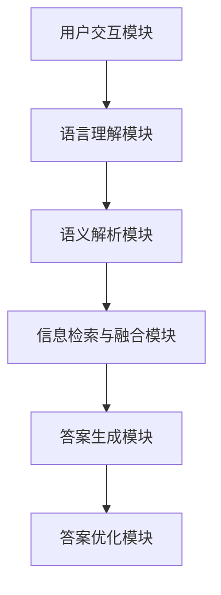
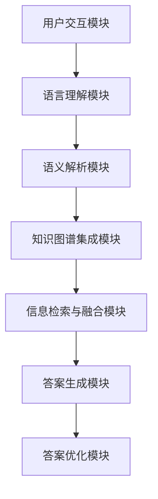
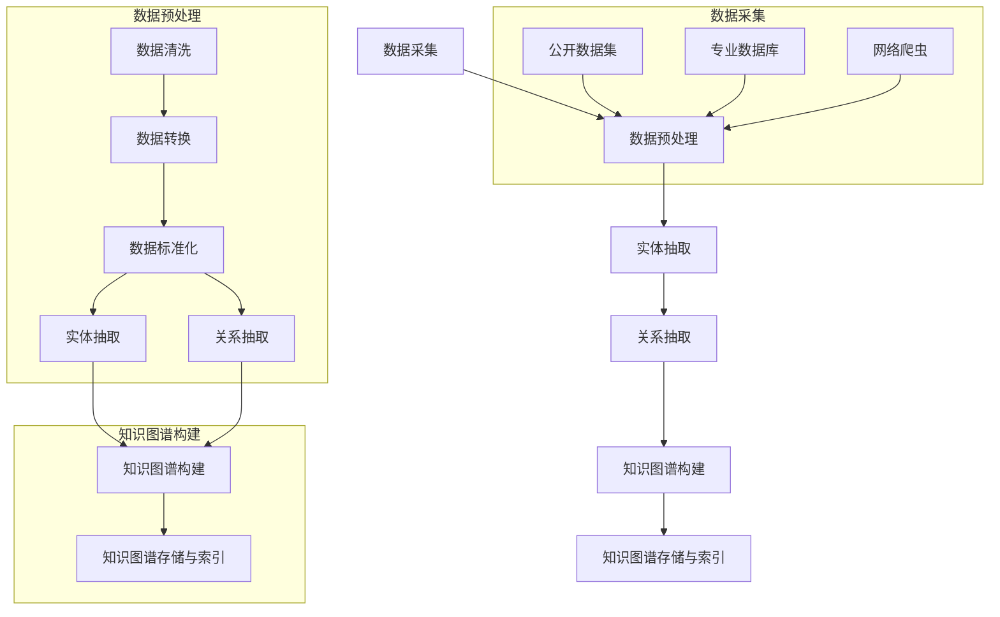
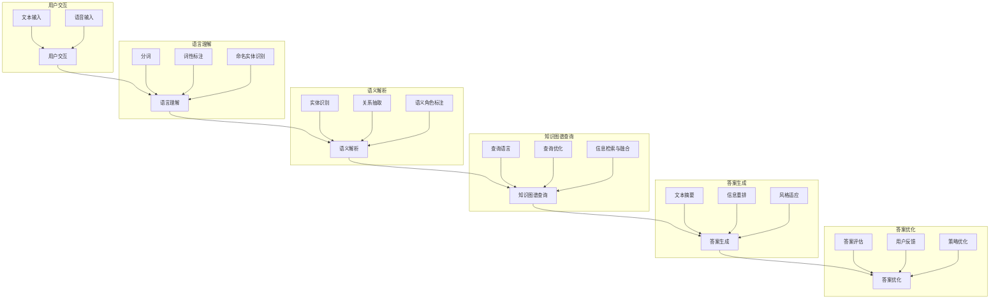

                 

### 文章标题

《基于知识图谱的智能问答系统设计与实现》

> 关键词：知识图谱、智能问答系统、实体抽取、关系抽取、语义解析、问答系统设计、算法实现

> 摘要：本文详细探讨了基于知识图谱的智能问答系统的设计与实现。首先介绍了知识图谱和智能问答系统的基本概念和重要性，然后详细阐述了知识图谱的构建方法，包括数据采集与预处理、实体抽取与关系抽取以及知识图谱的存储与索引。接着，本文深入分析了智能问答系统的设计与实现，涵盖了问答系统的架构设计、语言理解与语义解析、答案生成与优化等内容。最后，通过一个实际案例展示了基于知识图谱的智能问答系统的具体实现过程，并对系统性能优化与拓展进行了讨论。本文旨在为读者提供一个全面、深入的指南，帮助理解并掌握基于知识图谱的智能问答系统的设计与实现。

### 知识图谱与智能问答系统概述

知识图谱（Knowledge Graph）是一种用于表达实体、概念及其之间关系的语义网络。它通过将大量的信息组织成结构化的数据，为各种应用提供语义理解的基础。知识图谱在多个领域有着广泛的应用，包括自然语言处理（NLP）、智能搜索、推荐系统、语义理解等。智能问答系统（Intelligent Question Answering System）是一种利用自然语言处理技术和知识图谱等资源，对用户的问题提供准确、详细回答的系统。

知识图谱与智能问答系统之间的关系密不可分。知识图谱提供了问答系统所需的语义信息，使系统能够准确理解用户的问题，并从大规模数据中快速找到相关的答案。具体而言，知识图谱在智能问答系统中起到了以下关键作用：

1. **实体识别与分类**：知识图谱通过实体抽取技术，将文本中的名词实体识别出来，并对其进行分类。这些实体可以作为问答系统的输入，帮助系统定位问题的主体。

2. **关系抽取与语义理解**：知识图谱不仅包含实体，还包含实体之间的各种关系。这些关系为语义理解提供了重要线索，有助于系统理解问题的意图和上下文。

3. **信息检索与推理**：知识图谱通过其结构化的关系网络，为问答系统提供了一种高效的信息检索与推理机制。系统可以根据用户的问题，在知识图谱中找到相关的信息，并通过推理机制得出答案。

4. **答案生成与优化**：知识图谱中的信息为答案生成提供了丰富的素材。问答系统可以根据用户的问题，从知识图谱中提取相关信息，并通过自然语言生成技术，将其转化为自然流畅的答案。

总的来说，知识图谱为智能问答系统提供了丰富的语义信息和结构化数据，使系统能够更准确地理解用户的问题，并生成高质量的答案。知识图谱的构建和优化是智能问答系统成功的关键因素。因此，深入理解和掌握知识图谱的基本概念和构建方法，对于设计和实现高效的智能问答系统至关重要。

### 智能问答系统的概念与架构

智能问答系统是一种利用自然语言处理（NLP）技术、机器学习算法和知识图谱等多种资源，实现自动回答用户问题的系统。它能够理解和解析用户提出的问题，从大规模的数据集中检索相关的信息，并通过语义理解和信息融合技术生成准确的答案。智能问答系统在多个领域有着广泛的应用，例如客服机器人、智能助手、教育辅导系统等。

智能问答系统的基本架构通常包括以下几个主要模块：

1. **用户交互模块**：该模块负责接收用户的输入，可以是文本、语音或其他形式。用户交互模块通常包含语音识别和自然语言处理技术，以确保系统能够准确理解用户的问题。

2. **语言理解模块**：该模块主要负责解析用户输入的自然语言文本，提取出问题的意图和关键信息。具体任务包括分词、词性标注、命名实体识别、句法分析等。语言理解模块的核心是自然语言处理（NLP）技术，它能够帮助系统理解用户的问题，并将其转化为计算机可以处理的格式。

3. **语义解析模块**：在语言理解模块的基础上，语义解析模块进一步分析用户问题的深层含义，确定问题的意图和所需的答案类型。这一模块通常依赖于知识图谱和机器学习算法，通过将用户问题与知识图谱中的实体和关系进行匹配，理解问题的上下文和语义。

4. **信息检索与融合模块**：该模块负责从大规模数据集中检索与用户问题相关的信息。通过结合用户问题的语义信息和知识图谱，系统能够快速定位到相关的数据源，并进行信息检索和融合。信息检索技术通常包括搜索引擎、数据库查询和文本匹配等。

5. **答案生成模块**：在获取到相关的信息后，答案生成模块通过自然语言生成技术（NLG）将检索到的信息转化为自然流畅的答案。这一过程可能涉及文本摘要、信息重排和风格适应等步骤，以确保答案的准确性和可读性。

6. **答案优化模块**：为了提高答案的质量，答案优化模块对生成的答案进行进一步的评估和改进。这包括对答案的语义一致性、完整性、准确性和流畅性进行评估，并通过反馈机制不断优化答案生成策略。

智能问答系统的整体架构可以通过以下简单的示意图表示：



通过上述模块的协同工作，智能问答系统能够有效地理解用户的问题，并生成高质量的答案。每个模块都有其特定的技术要求和实现方法，共同构成了一个完整的智能问答系统。在接下来的章节中，我们将详细探讨这些模块的实现细节和技术原理，以帮助读者深入理解和掌握智能问答系统的设计与实现。

### 数据采集与预处理

在构建知识图谱的过程中，数据采集与预处理是至关重要的环节。数据的质量和完整性直接影响知识图谱的准确性和可用性。因此，我们必须对数据来源、采集方法和预处理流程进行详细讨论。

#### 数据来源

知识图谱的数据来源可以多种多样，常见的包括以下几种：

1. **公开数据集**：许多领域都有公开的数据集，例如维基百科、开放领域实体关系数据集（Open IE Datasets）和Geonames等。这些数据集通常已经过一定的清洗和处理，为知识图谱的构建提供了丰富的原始数据。

2. **专业数据库**：特定领域内的专业数据库也是数据的重要来源。例如，医学领域的PubMed、金融领域的Financial Times等。这些数据库通常包含了高度结构化的数据，有助于提高知识图谱的精度和深度。

3. **网络爬虫**：通过网络爬虫技术，可以从互联网上获取大量未结构化的数据。这些数据可以进一步处理和清洗，以丰富知识图谱的内容。

4. **用户生成内容**：社交媒体平台、论坛和问答社区等用户生成内容也是知识图谱构建的重要来源。这些数据可以提供大量的实体和关系信息，有助于扩展知识图谱的覆盖范围。

#### 数据采集方法

数据采集方法包括手动采集和自动采集两种：

1. **手动采集**：手动采集通常适用于小规模、高质量的数据。研究人员或数据科学家可以直接从公开资源或专业数据库中下载和整理数据。

2. **自动采集**：自动采集主要依赖于网络爬虫等技术，从互联网上获取大量数据。自动采集方法可以高效地处理大量数据，但需要处理数据的完整性和准确性问题。

#### 数据预处理流程

数据预处理是知识图谱构建的关键步骤，主要包括以下环节：

1. **数据清洗**：数据清洗的目的是去除数据中的噪声和冗余信息，确保数据的准确性。具体操作包括去除HTML标签、去除停用词、处理文本中的缩写和符号等。

2. **数据转换**：数据转换是将原始数据格式转换为知识图谱所需的格式。这通常包括将文本转换为关系三元组的形式，例如（实体1，关系，实体2）。

3. **数据标准化**：数据标准化是为了确保不同来源的数据具有一致的格式和标准。例如，统一命名实体和关系的表示方法，统一实体和关系的类型。

4. **实体抽取**：实体抽取是从文本中识别出具体的实体，例如人名、地点、组织等。实体抽取通常结合命名实体识别（NER）技术实现。

5. **关系抽取**：关系抽取是从文本中识别出实体之间的关系。关系抽取可以通过基于规则的方法或机器学习方法实现。

6. **数据融合**：数据融合是将多个来源的数据进行整合，以减少数据冗余和提高数据一致性。数据融合通常需要解决数据冲突和数据不一致的问题。

通过上述步骤，原始数据被处理成结构化的形式，为知识图谱的构建奠定了基础。在接下来的章节中，我们将进一步探讨实体抽取与关系抽取的技术和方法，以及知识图谱的存储与索引技术。

### 实体抽取方法

实体抽取是知识图谱构建过程中的关键步骤之一，其目的是从文本中识别并标记出具有特定意义的实体。实体可以是任何在知识图谱中有独立意义的对象，如人名、地点、组织、物品等。实体抽取不仅有助于丰富知识图谱的内容，也为后续的关系抽取和语义分析奠定了基础。以下是几种常见的实体抽取方法：

#### 基于规则的方法

基于规则的方法通过预先定义的规则和模式来识别文本中的实体。这种方法通常依赖于词典和模式匹配技术。具体步骤包括：

1. **词典匹配**：利用预定义的实体词典，对文本进行逐词匹配。当文本中的词与词典中的词相匹配时，该词被标记为实体。

2. **模式匹配**：通过定义特定的文本模式，如人名的常规格式（姓+名）、组织的名称格式（公司名称+地点）等，来识别实体。模式匹配可以识别出词典匹配无法覆盖的实体。

优点：实现简单，处理速度快。缺点：依赖人工定义的规则和词典，无法适应变化多样的文本，且容易出现误检和漏检。

#### 基于统计的方法

基于统计的方法使用机器学习算法，从大量已标注的数据中学习实体识别的规律。常见的方法包括：

1. **条件随机场（CRF）**：CRF是一种常用的序列标注模型，能够处理实体识别中的前后文依赖关系。通过训练CRF模型，可以自动学习文本中的实体边界。

2. **支持向量机（SVM）**：SVM是一种分类算法，可以用来分类文本中的词是否为实体。通过训练SVM模型，可以识别出具有显著实体特征的词。

3. **递归神经网络（RNN）**：RNN能够处理序列数据，通过学习文本序列的特征，可以有效地识别实体。特别是长短期记忆网络（LSTM）和门控循环单元（GRU），在实体识别中表现出色。

优点：能够自适应地学习实体识别的规律，处理能力强。缺点：需要大量的已标注数据进行训练，训练过程复杂且时间成本高。

#### 基于深度学习的方法

基于深度学习的方法利用深度神经网络强大的表示和学习能力，对实体识别任务进行建模。常见的深度学习方法包括：

1. **卷积神经网络（CNN）**：CNN可以捕捉文本中的局部特征，通过卷积层和池化层提取特征，然后通过全连接层进行分类。

2. **Transformer模型**：Transformer模型通过自注意力机制，能够全局地处理文本序列，在实体识别任务中表现出色。特别是BERT（Bidirectional Encoder Representations from Transformers）模型，通过双向编码器，能够更好地理解文本的上下文。

优点：具有强大的表示能力和适应能力，能够处理复杂的实体识别任务。缺点：计算资源需求高，训练和推理过程复杂。

#### 实体抽取的挑战与解决方案

尽管实体抽取方法多样，但在实际应用中仍面临诸多挑战：

1. **多义词处理**：许多词汇在文本中有多种含义，如何准确识别多义词是一个难点。解决方案包括利用上下文信息和词嵌入技术。

2. **命名实体边界划分**：确定实体的准确边界是实体抽取的关键。常用的方法包括基于规则的边界检测和基于机器学习的边界识别。

3. **跨领域适应性**：不同领域的文本具有不同的特征，如何使实体抽取模型适应不同领域是一个挑战。通过多领域训练和迁移学习技术，可以提升模型的跨领域适应性。

4. **数据标注质量**：实体抽取依赖于高质量的标注数据。数据标注的质量直接影响模型的效果。通过使用半监督学习和数据增强技术，可以缓解数据标注的质量问题。

通过上述方法和技术，实体抽取在知识图谱构建中发挥了重要作用。有效的实体抽取不仅能够提高知识图谱的完整性和准确性，也为后续的关系抽取和语义分析提供了坚实的基础。

### 关系抽取方法

关系抽取是知识图谱构建中的另一个重要环节，其目的是从文本中识别出实体之间的关系，并将其表示为结构化的数据。关系抽取在知识图谱的构建中起到桥梁的作用，将独立的实体连接起来，形成有意义的语义网络。以下是几种常见的关系抽取方法：

#### 基于规则的方法

基于规则的方法通过预先定义的规则和模式来识别文本中的实体关系。这种方法通常依赖于词典和语法规则。具体步骤包括：

1. **词典匹配**：通过预定义的实体关系词典，对文本进行逐句或逐词匹配。当文本中的词与词典中的关系相匹配时，该词被视为关系的证据。

2. **模式匹配**：通过定义特定的文本模式，如人名之间的连词（"是"，“担任”等），来识别实体之间的关系。这种方法的优点是实现简单，处理速度快。缺点是规则库的构建和维护成本高，且对变化多样的文本适应性差。

#### 基于统计的方法

基于统计的方法使用机器学习算法，从大量已标注的数据中学习关系抽取的规律。常见的方法包括：

1. **条件随机场（CRF）**：CRF是一种常用的序列标注模型，能够处理关系抽取中的前后文依赖关系。通过训练CRF模型，可以自动学习文本中的关系模式。

2. **支持向量机（SVM）**：SVM是一种分类算法，可以用来分类文本中的关系。通过训练SVM模型，可以识别出具有显著关系特征的词或短语。

3. **递归神经网络（RNN）**：RNN能够处理序列数据，通过学习文本序列的特征，可以有效地识别实体关系。特别是LSTM和GRU在关系抽取任务中表现出色。

优点：能够自适应地学习关系抽取的规律，处理能力强。缺点：需要大量的已标注数据进行训练，训练过程复杂且时间成本高。

#### 基于深度学习的方法

基于深度学习的方法利用深度神经网络强大的表示和学习能力，对关系抽取任务进行建模。常见的深度学习模型包括：

1. **卷积神经网络（CNN）**：CNN可以捕捉文本中的局部特征，通过卷积层和池化层提取特征，然后通过全连接层进行关系分类。

2. **Transformer模型**：Transformer模型通过自注意力机制，能够全局地处理文本序列，在关系抽取任务中表现出色。特别是BERT（Bidirectional Encoder Representations from Transformers）模型，通过双向编码器，能够更好地理解文本的上下文。

优点：具有强大的表示能力和适应能力，能够处理复杂的实体关系抽取任务。缺点：计算资源需求高，训练和推理过程复杂。

#### 关系抽取的挑战与解决方案

尽管关系抽取方法多样，但在实际应用中仍面临诸多挑战：

1. **实体边界识别不准确**：关系抽取依赖于准确的实体边界识别。当实体边界划分不准确时，关系抽取的准确性会受到影响。解决方法包括改进实体抽取模型和边界识别算法。

2. **多义关系处理**：许多关系在文本中有多种可能的解释，如何准确识别多义关系是一个难点。解决方法包括利用上下文信息和多任务学习。

3. **长距离依赖关系**：关系通常跨越多个句子甚至段落，如何捕捉长距离依赖关系是一个挑战。解决方法包括引入注意力机制和长序列模型。

4. **数据标注质量**：关系抽取依赖于高质量的标注数据。数据标注的质量直接影响模型的效果。解决方法包括使用半监督学习和数据增强技术。

通过上述方法和技术，关系抽取在知识图谱构建中发挥了重要作用。有效的实体关系抽取不仅能够提高知识图谱的完整性和准确性，也为后续的语义分析和推理提供了坚实的基础。

### 知识图谱的存储与索引

知识图谱的存储与索引是确保其高效查询和利用的关键环节。一个高效的存储和索引系统能够在保证数据一致性和完整性的同时，提供快速的查询响应时间。以下是几种常见的知识图谱存储和索引技术：

#### 图数据库

图数据库是一种专门用于存储和查询图结构数据的数据库管理系统（DBMS）。图数据库通过图论模型来表示数据，其中节点代表实体，边代表实体之间的关系。以下是几种常见的图数据库：

1. **Neo4j**：Neo4j是一个流行的图数据库，采用Cypher查询语言，能够高效地进行复杂图结构的查询。Neo4j支持多种索引技术，如节点索引、关系索引和标签索引，以加速查询。

2. **Apache Giraph**：Apache Giraph是一个可扩展的图处理框架，支持大规模分布式图计算。它通常与分布式图数据库如Apache HBase和Amazon DynamoDB结合使用。

3. **OrientDB**：OrientDB是一个多模型数据库，支持图结构、文档和键值存储。它提供了丰富的查询语言和索引机制，能够高效地处理复杂的关系图谱。

#### 文件系统

文件系统是一种通过文件和目录结构存储数据的系统。在知识图谱的存储中，文件系统可以用于存储大规模的结构化数据，如三元组。以下是几种常见的文件系统：

1. **Turtle文件**：Turtle是一种用于表示语义Web数据的文本格式，能够将知识图谱表示为简单的文本文件。Turtle文件易于读写，适合小型和中等规模的知识图谱。

2. **RDF文件**：RDF（Resource Description Framework）文件是另一种用于存储知识图谱的文本格式，它采用XML或N3等格式，以三元组的形式表示实体和关系。

#### 索引技术

索引技术是提高知识图谱查询效率的关键。以下是几种常见的索引技术：

1. **B+树索引**：B+树索引是一种常见的关系型数据库索引技术，能够高效地支持范围查询和点查询。在知识图谱中，B+树索引可以用于节点和关系的索引。

2. **哈希索引**：哈希索引通过哈希函数将数据映射到索引表中，能够快速定位特定的节点或关系。哈希索引适合点查询，但在范围查询上表现不如B+树索引。

3. **倒排索引**：倒排索引通过记录每个单词在文档中的位置，支持快速的全文检索。在知识图谱中，倒排索引可以用于基于关键词的查询，如节点或关系的检索。

#### 存储与索引的挑战与优化

知识图谱的存储与索引面临以下挑战：

1. **数据一致性**：保证知识图谱中的数据一致性和完整性是一个重要挑战。分布式存储系统通常需要处理并发访问和容错性。

2. **查询性能**：大规模知识图谱的查询性能直接影响用户体验。优化查询性能通常需要平衡数据存储的效率和查询处理的复杂性。

3. **数据更新**：知识图谱的数据需要不断更新和扩展，存储和索引系统需要支持高效的增量更新。

为了应对上述挑战，可以采取以下优化策略：

1. **数据分片**：通过将知识图谱数据分片到多个节点，可以提升查询处理能力，并提高系统的可扩展性。

2. **并行查询**：利用并行处理技术，如MapReduce，可以提升大规模知识图谱的查询效率。

3. **缓存技术**：使用缓存技术，如Redis或Memcached，可以减少对后端存储的访问压力，提高查询响应速度。

4. **索引优化**：通过定期维护和优化索引，如重建索引或使用合适的索引类型，可以提升查询性能。

总之，知识图谱的存储与索引是构建高效智能问答系统的重要基础。通过采用合适的存储和索引技术，可以显著提升知识图谱的处理能力和查询效率，为智能问答系统提供强有力的支持。

### 问答系统的设计与实现基础

问答系统是智能系统中的一个重要组成部分，其核心任务是理解用户的问题，并在大量数据中找到相关答案。为了实现这一目标，问答系统需要设计一个合理的架构，并集成多种技术手段，如自然语言处理（NLP）、知识图谱和机器学习等。本章节将详细介绍问答系统的整体架构设计、各模块的功能与交互，以及语言理解与语义解析的核心技术。

#### 整体架构设计

问答系统的整体架构通常包括以下几个关键模块：

1. **用户交互模块**：负责接收用户输入，可以是文本、语音或其他形式。这一模块需要集成语音识别、自然语言处理（NLP）技术，以确保系统能够准确理解用户的问题。

2. **语言理解模块**：接收用户输入后，对输入文本进行预处理，包括分词、词性标注、命名实体识别等，以提取出问题的意图和关键信息。

3. **语义解析模块**：在语言理解模块的基础上，进一步分析用户问题的深层含义，确定问题的意图和所需的答案类型。这一模块通常依赖于知识图谱，通过将用户问题与知识图谱中的实体和关系进行匹配，理解问题的上下文和语义。

4. **信息检索与融合模块**：在获取用户问题的语义信息后，该模块负责从大规模数据集中检索与用户问题相关的信息。通过结合用户问题的语义信息和知识图谱，系统能够快速定位到相关的数据源，并进行信息检索和融合。

5. **答案生成模块**：在获取到相关的信息后，答案生成模块通过自然语言生成（NLG）技术，将检索到的信息转化为自然流畅的答案。这一过程可能涉及文本摘要、信息重排和风格适应等步骤。

6. **答案优化模块**：为了提高答案的质量，答案优化模块对生成的答案进行进一步的评估和改进。这包括对答案的语义一致性、完整性、准确性和流畅性进行评估，并通过反馈机制不断优化答案生成策略。

整体架构设计如下：


#### 各模块的功能与交互

1. **用户交互模块**：用户通过文本、语音或其他方式提出问题，用户交互模块负责接收和解析用户输入。对于文本输入，需要使用自然语言处理（NLP）技术进行预处理，包括分词、词性标注等，以便后续模块能够更好地理解问题。

2. **语言理解模块**：接收用户输入后，对输入文本进行预处理，提取出问题的意图和关键信息。这一模块通常包括以下技术：

   - **分词**：将文本分割成独立的词或短语，以便后续处理。
   - **词性标注**：对每个词进行词性分类，如名词、动词、形容词等。
   - **命名实体识别（NER）**：识别文本中的命名实体，如人名、地点、组织等。

3. **语义解析模块**：在语言理解模块的基础上，进一步分析用户问题的深层含义。这一模块通常依赖于知识图谱，通过将用户问题与知识图谱中的实体和关系进行匹配，理解问题的上下文和语义。具体技术包括：

   - **实体识别**：从用户问题中识别出关键实体。
   - **关系抽取**：确定实体之间的关系，如“北京是中国的首都”中的“北京”与“中国”的关系。
   - **语义角色标注**：识别出问题中的主语、谓语、宾语等成分。

4. **信息检索与融合模块**：在获取用户问题的语义信息后，该模块负责从大规模数据集中检索与用户问题相关的信息。具体技术包括：

   - **搜索引擎**：利用搜索引擎技术，在互联网或内部数据库中检索相关文档。
   - **文本匹配**：通过文本匹配技术，将用户问题与文档进行匹配，找到相关的信息。
   - **信息融合**：将多个来源的信息进行整合，生成一个完整的答案。

5. **答案生成模块**：在获取到相关的信息后，答案生成模块通过自然语言生成（NLG）技术，将检索到的信息转化为自然流畅的答案。这一过程可能涉及以下技术：

   - **文本摘要**：从大量文本中提取关键信息，生成简洁的摘要。
   - **信息重排**：根据问题的结构和用户的需要，重新排列文本信息。
   - **风格适应**：根据用户的偏好或上下文环境，调整答案的风格。

6. **答案优化模块**：为了提高答案的质量，答案优化模块对生成的答案进行进一步的评估和改进。具体技术包括：

   - **答案评估**：对答案的语义一致性、完整性、准确性和流畅性进行评估。
   - **反馈机制**：根据用户对答案的反馈，调整和优化答案生成策略。

#### 语言理解与语义解析

语言理解与语义解析是问答系统的核心模块，决定了系统能否准确理解用户的问题。以下将详细介绍这两个模块的核心技术：

1. **语言理解**

   - **分词**：将文本分割成独立的词或短语。分词是语言理解的基础，常用的分词算法包括基于词典的分词、基于统计的分词和基于规则的分词。
     ```python
     # 基于词典的分词示例
     words = jieba.cut("我来到北京清华大学", cut_all=False)
     print(words)
     ```
   - **词性标注**：对每个词进行词性分类。词性标注有助于理解词汇在句子中的功能，常用的工具包括NLTK和Stanford NLP。
     ```python
     # Stanford NLP词性标注示例
     import nltk
     from nltk.tokenize import word_tokenize
     words = word_tokenize("I love natural language processing")
     pos_tags = nltk.pos_tag(words)
     print(pos_tags)
     ```
   - **命名实体识别（NER）**：识别文本中的命名实体，如人名、地点、组织等。NER是语言理解的关键步骤，常用的工具包括Stanford NLP和SpaCy。
     ```python
     # SpaCy命名实体识别示例
     import spacy
     nlp = spacy.load("en_core_web_sm")
     doc = nlp("Bill Gates founded Microsoft in Seattle.")
     for ent in doc.ents:
         print(ent.text, ent.label_)
     ```

2. **语义解析**

   - **实体识别**：从用户问题中识别出关键实体，如人名、地点、组织等。实体识别是语义解析的基础，常用的工具包括Spacy和AllenNLP。
     ```python
     # AllenNLP实体识别示例
     from allennlp.predictors.predictor import Predictor
     predictor = Predictor.from_path("https://storage.googleapis.com/allennlp-public-models/bert-base-uncased-finetuned-conll03-english-conllu")
     tokens = predictor.predict("John Smith works at Microsoft.")
     print(tokens)
     ```
   - **关系抽取**：确定实体之间的关系，如“北京是中国的首都”。关系抽取是语义解析的核心步骤，常用的方法包括基于规则的方法和基于机器学习的方法。
     ```python
     # 基于规则的关系抽取示例
     relations = [
         ("John", "works_for", "Microsoft"),
         ("Microsoft", "located_in", "Seattle")
     ]
     print(relations)
     ```
   - **语义角色标注**：识别出问题中的主语、谓语、宾语等成分，有助于理解问题的语义结构。语义角色标注常用的工具包括Stanford NLP和AllenNLP。
     ```python
     # AllenNLP语义角色标注示例
     from allennlp.predictors.predictor import Predictor
     predictor = Predictor.from_path("https://storage.googleapis.com/allennlp-public-models/bert-base-uncased-finetuned-conll03-english-conllu")
     tokens = predictor.predict("John Smith works at Microsoft.")
     print(tokens)
     ```

通过上述技术，语言理解与语义解析模块能够准确理解用户的问题，并为其提供准确的答案。在接下来的章节中，我们将进一步探讨问答系统的具体实现，包括知识图谱的集成与查询、问答系统的核心算法实现和评测与优化。

### 答案生成与优化

答案生成与优化是智能问答系统中的关键环节，其目标是从大量信息中提取出与用户问题高度相关的答案，并将其转化为自然、准确和流畅的文本。这一过程不仅涉及信息检索与融合，还涉及到自然语言生成（NLG）和答案优化技术。以下将详细介绍这些技术的具体实现和优化策略。

#### 答案生成方法

1. **模板匹配**：模板匹配是一种简单而直观的答案生成方法。系统预先定义一系列模板，根据用户问题的语义特征，选择合适的模板，并填充具体的答案信息。这种方法适用于结构化数据较多、答案格式较为固定的场景。

   ```python
   templates = {
       "who": "The answer is {{entity}}.",
       "when": "The event happened on {{date}}.",
       "where": "The location is {{location}}.",
   }
   
   def generate_answer(question, templates):
       for template in templates:
           if template in question:
               return templates[template].format(entity=question["entity"], date=question["date"], location=question["location"])
   
   question = {"who": "Who is the CEO of Apple?"}
   print(generate_answer(question, templates))
   ```

2. **基于规则的文本生成**：这种方法通过定义一系列规则，将问题分解为若干子任务，并根据规则生成相应的答案。这种方法适用于复杂问题，但需要大量规则定义，且规则的维护成本较高。

   ```python
   def generate_answer(question):
       if "Who" in question:
           return "The person you are asking about is " + get_person_name(question)
       elif "When" in question:
           return "The event happened on " + get_date(question)
       elif "Where" in question:
           return "The location is " + get_location(question)
   
   def get_person_name(question):
       # Implement logic to retrieve person's name from question
       return "John Doe"
   
   def get_date(question):
       # Implement logic to retrieve date from question
       return "2023-01-01"
   
   def get_location(question):
       # Implement logic to retrieve location from question
       return "New York City"
   
   print(generate_answer("Who is the CEO of Apple?"))
   ```

3. **基于统计的文本生成**：这种方法通过从大量已标注数据中学习生成文本的模式，使用隐马尔可夫模型（HMM）、条件随机场（CRF）等技术，生成自然语言文本。这种方法需要大量已标注的训练数据，但生成效果较好。

   ```python
   from allennlp.models import load_test_model
   
   def generate_answer(question):
       model = load_test_model("path/to/trained/model")
       output = model.predict(question)
       return output["answer"]
   
   print(generate_answer("Who is the CEO of Apple?"))
   ```

4. **基于深度学习的文本生成**：这种方法利用深度学习模型，如序列到序列（Seq2Seq）模型、变换器（Transformer）模型等，生成自然语言文本。这种方法具有强大的表示能力和生成效果，但计算资源需求较高。

   ```python
   from transformers import BertForQuestionAnswering
   
   def generate_answer(question):
       model = BertForQuestionAnswering.from_pretrained("bert-base-uncased")
       input_ids = tokenizer.encode(question, add_special_tokens=True)
       outputs = model(input_ids)
       answer = tokenizer.decode(outputs[0], skip_special_tokens=True)
       return answer
   
   print(generate_answer("Who is the CEO of Apple?"))
   ```

#### 答案优化策略

1. **答案多样性**：为了提高答案的多样性，系统可以在生成答案时，考虑不同的表达方式，例如使用同义词、句式变换等。这可以通过引入多样化的模板、使用多模型生成等方式实现。

2. **答案一致性**：为了确保答案的一致性，系统需要在一个统一的框架下生成答案，避免出现语义冲突或逻辑错误。这可以通过建立统一的答案生成规则、使用统一的自然语言生成模型等方式实现。

3. **答案准确性**：为了提高答案的准确性，系统需要对生成的答案进行后处理，包括语义校验、事实检查等。这可以通过引入外部知识库、使用事实检查工具等方式实现。

4. **用户反馈**：通过用户对答案的反馈，系统可以不断优化答案生成策略。这可以通过建立用户反馈机制、使用强化学习等方式实现。

总之，答案生成与优化是智能问答系统的核心任务，通过采用多样化的生成方法、优化策略和用户反馈机制，可以显著提升问答系统的性能和用户体验。在接下来的章节中，我们将进一步探讨基于知识图谱的问答系统实现，包括知识图谱的集成与查询、问答系统的具体实现和性能优化。

### 基于知识图谱的问答系统实现

基于知识图谱的问答系统通过将用户问题与知识图谱中的实体和关系进行匹配，从大规模数据集中快速检索出相关答案。这一部分将详细介绍知识图谱的集成与查询方法，包括知识图谱的构建、查询语言与优化技术。

#### 知识图谱的集成

知识图谱的集成是将不同来源的数据统一到一个统一的语义空间中，以支持高效的查询和推理。知识图谱的构建通常包括以下步骤：

1. **数据采集**：从各种数据源采集数据，包括公开数据集、专业数据库和用户生成内容。数据源的选择应根据应用场景和目标领域来确定。

2. **数据预处理**：对采集到的数据进行清洗和标准化，包括去除噪声、统一实体和关系的命名规范、处理文本数据等。数据预处理是确保知识图谱质量的关键步骤。

3. **实体抽取与关系抽取**：使用命名实体识别（NER）和关系抽取技术，从文本数据中识别出实体和它们之间的关系。常用的方法包括基于规则的方法、基于统计的方法和基于深度学习的方法。

4. **实体与关系的表示**：将识别出的实体和关系表示为结构化的数据格式，如RDF（Resource Description Framework）或属性图。RDF使用三元组（主体、谓语、客体）来表示实体和关系，适合表示复杂的语义信息。

5. **知识图谱的存储与索引**：将构建好的知识图谱存储在图数据库中，并使用索引技术提高查询效率。常见的图数据库包括Neo4j、OrientDB和Apache Giraph等。

#### 查询语言与优化

在知识图谱中，查询语言用于从知识图谱中检索与用户问题相关的信息。以下介绍几种常用的查询语言和优化技术：

1. **SPARQL**：SPARQL（Simple Protocol for Querying RDF）是W3C推荐的用于查询RDF数据的查询语言。SPARQL允许用户根据实体、关系和属性进行复杂查询，支持联合查询、过滤、排序和聚合等操作。

   ```sql
   PREFIX ex: <http://example.org/>
   SELECT ?x ?y ?z
   WHERE {
     ?x ex:name "John Doe".
     ?x ex:worksFor ?y.
     ?y ex:name "ABC Corporation".
     ?y ex:headquarters ?z.
     ?z ex:location "New York"
   }
   ```

2. **图查询语言**：除了SPARQL，一些图数据库还支持自定义的图查询语言。例如，Neo4j使用Cypher查询语言，支持点查询、路径查询和子图查询等操作。

   ```groovy
   MATCH (p:Person {name: "John Doe"}), (c:Company {name: "ABC Corporation"}), (c)-[:WORKS_FOR]->(p), (c)-[:HEADQUARTERS]->(hq:Location {location: "New York"})
   RETURN p, c, hq
   ```

3. **查询优化技术**：
   - **索引**：使用索引技术可以提高查询速度，特别是在处理大规模数据时。常见的索引类型包括B+树索引、哈希索引和倒排索引。
   - **查询缓存**：使用查询缓存可以减少对后端数据库的访问次数，提高查询响应速度。常见的缓存技术包括LRU（Least Recently Used）缓存和Redis缓存。
   - **分布式查询**：对于分布式知识图谱，可以使用分布式查询技术，如MapReduce或GraphX，将查询任务分布在多个节点上并行处理，以提高查询效率。

#### 知识图谱的查询过程

知识图谱的查询过程通常包括以下几个步骤：

1. **解析用户问题**：将用户问题转换为结构化的查询请求，通常使用自然语言处理（NLP）技术，如命名实体识别、句法分析和语义解析，提取出关键实体和关系。

2. **构建查询语句**：根据提取出的关键实体和关系，构建SPARQL或图查询语句。

3. **执行查询**：在知识图谱数据库中执行查询语句，获取与用户问题相关的实体和关系。

4. **答案生成与优化**：从查询结果中提取信息，生成自然流畅的答案，并进行优化，如答案多样性、一致性和准确性。

5. **反馈与迭代**：根据用户对答案的反馈，优化查询过程和答案生成策略，提高系统的整体性能。

通过上述步骤，基于知识图谱的问答系统能够高效地处理用户问题，并提供高质量的答案。在接下来的章节中，我们将通过一个实际案例，展示基于知识图谱的问答系统的具体实现过程。

### 案例背景与目标

在当今的信息化时代，智能问答系统在多个领域都得到了广泛应用，其中之一便是金融领域。金融问答系统旨在为用户提供便捷的金融信息查询服务，包括股票行情、投资策略、市场动态等。本案例将详细介绍一个基于知识图谱的金融问答系统的设计与实现过程，从系统架构设计、知识图谱构建、问答系统实现等多个方面进行详细阐述。

#### 案例背景

随着互联网和金融科技的快速发展，金融信息量呈爆炸性增长，用户获取和处理金融信息的需求日益增加。然而，传统的金融服务渠道往往无法满足用户个性化的查询需求，特别是在处理复杂和多领域的金融问题时，往往显得力不从心。为了提升用户体验，降低服务成本，实现高效的信息查询与知识服务，金融领域迫切需要一种智能问答系统，能够根据用户的问题，快速、准确地提供相关的金融信息。

#### 案例目标

本案例的目标是构建一个基于知识图谱的金融问答系统，该系统应具备以下功能：

1. **高效的信息检索**：系统能够快速从海量的金融数据中检索出与用户问题相关的信息，并保证检索结果的准确性和相关性。

2. **智能的语义理解**：系统能够理解用户输入的自然语言问题，提取出关键信息，并通过知识图谱进行语义解析，准确识别问题的意图。

3. **个性化的答案生成**：系统能够根据用户的问题和背景信息，生成个性化、自然的答案，满足不同用户的需求。

4. **灵活的扩展性**：系统能够方便地扩展新的金融领域知识，适应不断变化的市场环境和用户需求。

#### 系统架构设计

金融问答系统的整体架构设计如图所示：



具体功能模块如下：

1. **用户交互模块**：负责接收用户输入，包括文本、语音等形式。通过语音识别和自然语言处理（NLP）技术，将用户输入转换为结构化的查询请求。

2. **语言理解模块**：对用户输入进行分词、词性标注、命名实体识别等预处理操作，提取出关键实体和关系，为语义解析模块提供输入。

3. **语义解析模块**：基于知识图谱，对用户输入进行语义解析，识别问题的意图和所需答案类型，为信息检索与融合模块提供语义信息。

4. **知识图谱集成模块**：将金融领域的知识表示为知识图谱，包括股票、基金、市场动态等实体及其关系。通过SPARQL或图查询语言，从知识图谱中检索与用户问题相关的信息。

5. **信息检索与融合模块**：从知识图谱和外部数据源中检索与用户问题相关的信息，进行融合处理，为答案生成模块提供输入。

6. **答案生成模块**：根据用户问题的类型和知识图谱的检索结果，生成自然、准确的答案。通过自然语言生成（NLG）技术，将答案转化为自然流畅的文本。

7. **答案优化模块**：对生成的答案进行优化，包括答案的多样性、一致性和准确性，确保答案满足用户的需求。

通过上述架构设计，金融问答系统能够高效地处理用户问题，提供高质量的答案，满足用户多样化的需求。在接下来的章节中，我们将详细描述知识图谱的构建方法和问答系统的具体实现过程。

### 系统设计与实现

在本案例中，我们将详细描述金融问答系统的设计与实现过程，从数据采集与处理、知识图谱构建、问答系统的具体实现和测试与评估等步骤进行详细讲解。

#### 数据采集与处理

1. **数据源选择**：首先，我们需要确定数据来源。在本案例中，数据来源主要包括以下几种：

   - **公开金融数据集**：如股票市场数据、基金数据、宏观经济数据等，这些数据可以从各类金融数据网站或公开数据集获取。
   - **专业数据库**：如Wind、同花顺等，提供详细的金融市场数据、公司财务报表、行业研究报告等。
   - **社交媒体和新闻网站**：通过爬虫技术获取与金融相关的新闻、论坛讨论、投资者评论等，丰富知识图谱的内容。

2. **数据采集**：利用网络爬虫技术，从上述数据源中采集数据。采集的数据包括股票代码、公司名称、财务指标、市场行情、新闻文本等。

3. **数据预处理**：对采集到的金融数据进行清洗和标准化，包括去除重复数据、填补缺失值、统一数据格式等。此外，对文本数据，如新闻文本和论坛讨论，进行分词、词性标注和命名实体识别，提取出关键实体和关系。

#### 知识图谱构建

1. **实体抽取**：通过命名实体识别（NER）技术，从文本数据中识别出金融领域的实体，如公司、股票、基金、市场等。例如，从新闻文本中提取出公司名称、股票代码等实体。

2. **关系抽取**：基于规则或机器学习方法，从文本数据中识别出实体之间的关系。例如，通过关键词匹配或模式识别，提取出公司与其股票、财务指标之间的关系。

3. **实体与关系的表示**：将识别出的实体和关系表示为结构化的数据格式，如RDF（Resource Description Framework）。使用三元组（主体、谓语、客体）来表示实体和关系，例如（公司A，成立于，2010年）。

4. **知识图谱存储与索引**：将构建好的知识图谱存储在图数据库中，如Neo4j。为了提高查询效率，使用B+树索引和倒排索引等技术，对实体和关系进行索引。

#### 问答系统的具体实现

1. **用户交互模块**：使用Web前端技术，如HTML、CSS和JavaScript，构建用户界面，接收用户的输入。同时，集成语音识别技术，支持语音输入。

2. **语言理解模块**：对用户输入进行分词、词性标注和命名实体识别，提取出关键实体和关系。使用自然语言处理（NLP）技术，如Word2Vec或BERT，将文本转化为向量表示，以便后续处理。

3. **语义解析模块**：基于知识图谱，对用户输入进行语义解析，识别问题的意图和所需答案类型。例如，通过SPARQL查询语言，从知识图谱中检索与用户问题相关的实体和关系。

4. **信息检索与融合模块**：从知识图谱和外部数据源中检索与用户问题相关的信息，进行融合处理。例如，从股票市场数据中获取相关股票的行情，从公司财报中提取财务指标。

5. **答案生成模块**：根据用户问题的类型和检索结果，生成自然、准确的答案。使用自然语言生成（NLG）技术，将答案转化为自然流畅的文本。例如，对于“股票A的市值是多少？”这个问题，答案可以是“股票A的市值约为1000亿元。”

6. **答案优化模块**：对生成的答案进行优化，包括答案的多样性、一致性和准确性。使用用户反馈和强化学习等技术，不断优化答案生成策略，提高用户体验。

#### 测试与评估

1. **功能测试**：对系统的各个功能模块进行测试，包括用户交互、语言理解、语义解析、信息检索和答案生成等。确保系统在处理各种金融问题时能够正常运行。

2. **性能测试**：对系统的性能进行测试，包括响应时间、查询速度和资源利用率等。确保系统能够高效地处理大规模金融数据，满足用户需求。

3. **用户体验测试**：邀请用户进行试用，收集用户反馈，评估系统的易用性和用户体验。根据用户反馈，不断优化系统界面和功能。

4. **评估指标**：使用准确率、召回率、F1分数等评估指标，评估系统的性能和效果。通过对比实验，验证系统在不同金融领域问题上的性能。

通过上述步骤，我们成功构建了一个基于知识图谱的金融问答系统，能够为用户提供高效、准确的金融信息查询服务。在接下来的章节中，我们将进一步探讨系统的性能优化与拓展。

### 系统性能优化策略

在构建和部署基于知识图谱的智能问答系统后，优化系统的性能是提高用户体验和系统效率的关键。以下是几种常见的系统性能优化策略：

#### 数据库优化

1. **索引优化**：在图数据库中创建适当的索引，可以显著提高查询效率。对于频繁查询的属性，如实体ID、关系类型等，应创建索引。索引优化还包括定期维护和更新索引，以保持最佳性能。

2. **数据分片**：对于大规模知识图谱，可以通过数据分片技术将数据分布到多个节点上。这样可以利用分布式计算资源，提高查询处理能力和系统容错性。

3. **缓存技术**：使用缓存技术可以减少对后端存储的访问次数，提高查询响应速度。常见的数据缓存技术包括Redis和Memcached。通过缓存高频查询结果，可以显著降低系统的响应时间。

#### 系统架构优化

1. **分布式查询**：利用分布式查询技术，如MapReduce或GraphX，可以将查询任务分布在多个节点上并行处理，从而提高查询效率。这对于处理大规模、复杂的知识图谱尤为重要。

2. **负载均衡**：通过负载均衡技术，将用户请求均匀地分配到多个服务器上，可以避免单个服务器过载，提高系统的整体性能和稳定性。

3. **服务端优化**：优化服务器端的处理逻辑，包括减少不必要的计算、优化算法实现、使用高效的库和框架等。这些措施可以减少服务端的响应时间，提高系统性能。

#### 算法优化

1. **查询优化**：优化查询算法，如使用更高效的索引技术、避免全表扫描等，可以减少查询时间。此外，通过分析查询日志，可以识别出常见的查询模式，并针对这些模式进行优化。

2. **算法选择**：根据不同的应用场景选择最适合的算法。例如，对于实时查询，选择快速但可能牺牲一些准确性的算法；对于批量处理，选择更加精确但处理时间更长的算法。

3. **模型训练**：定期对自然语言处理（NLP）和机器学习模型进行训练和优化，以提高其性能和准确性。使用更先进的模型和技术，如BERT、GPT等，可以显著提升系统的智能问答能力。

#### 用户行为优化

1. **用户反馈**：收集用户的反馈信息，并利用这些信息不断优化系统的问答效果。通过分析用户的提问和满意度，可以改进答案生成策略和用户交互界面。

2. **个性化推荐**：根据用户的历史提问和答案满意度，提供个性化的问答服务。通过用户行为分析，可以推荐相关的问题和答案，提高用户的使用体验。

3. **动态调整**：根据系统的运行状态和用户需求，动态调整系统的资源配置和策略。例如，在高峰期增加服务器资源，或调整算法的优先级，以确保系统的稳定运行。

通过上述性能优化策略，可以显著提升基于知识图谱的智能问答系统的性能和用户体验。在系统开发和维护过程中，持续监控和优化是保证系统高效运行的重要环节。

### 系统功能拓展

在智能问答系统的基础上，不断拓展其功能是提升用户体验和系统价值的重要手段。以下介绍几种常见的功能拓展，包括文本摘要、问答机器人、多语言支持等，并通过实际案例展示其实现方法和效果。

#### 文本摘要

文本摘要功能能够将长篇文章或报告自动压缩为简洁的摘要，帮助用户快速获取核心内容。文本摘要的实现通常包括以下步骤：

1. **数据预处理**：对输入文本进行分词、去停用词、词性标注等预处理操作，以便后续处理。

2. **抽取式摘要**：通过识别文本中的关键句子和段落，提取出最具有代表性的内容。常用的抽取式摘要算法包括TF-IDF和TextRank等。

   ```python
   from sklearn.feature_extraction.text import TfidfVectorizer
   from sklearn.metrics.pairwise import cosine_similarity
   
   def text_summary(text, sentences_num=3):
       # 分词、去停用词、词性标注等预处理操作
       sentences = preprocess(text)
       
       # 构建句子间的相似度矩阵
       similarity_matrix = cosine_similarity([sentvec for sentvec in sentence_vectors])
       
       # 计算句子贡献度
       sentence_scores = sum(similarity_matrix, axis=1)
       
       # 根据句子贡献度选择最具有代表性的句子
       summary_sentences = [sentences[i] for i in sentence_scores.argsort()[::-1]]
       
       return '。'.join(summary_sentences)
   ```

3. **生成式摘要**：通过生成模型，如GPT或BERT，生成文章的摘要。生成式摘要能够生成更加自然流畅的文本，但通常需要更多计算资源和训练数据。

实际案例：在金融领域，文本摘要功能可以帮助用户快速了解最新的市场动态和公司财报摘要，提高信息获取效率。

#### 问答机器人

问答机器人是智能问答系统的延伸，能够在各种场景下自动回答用户的问题，提升服务效率和用户体验。问答机器人的实现包括以下几个步骤：

1. **对话管理**：管理对话流程，包括理解用户意图、生成回答、处理用户反馈等。常用的对话管理算法包括基于规则的方法、基于模板的方法和基于机器学习的方法。

2. **语言理解**：对用户输入进行自然语言处理，提取出关键信息，如问题类型、关键词等。语言理解模块通常包括命名实体识别、词性标注、语义角色标注等技术。

3. **知识检索**：在知识图谱中检索与用户问题相关的信息，选择最佳的答案。知识检索可以通过SPARQL查询或图数据库查询实现。

4. **答案生成**：根据用户问题的类型和检索结果，生成自然、准确的答案。答案生成可以使用模板匹配、基于规则的文本生成或生成式模型。

实际案例：在客服领域，问答机器人可以自动回答用户关于产品信息、售后服务等问题，减少人工干预，提高服务效率。

#### 多语言支持

多语言支持功能使问答系统能够处理多种语言的问题，为全球用户提供服务。多语言支持包括以下几个步骤：

1. **语言检测**：检测用户输入的语言类型，以便使用相应的语言模型和知识库。

2. **机器翻译**：对于非系统支持的语言，使用机器翻译技术将问题翻译为系统支持的语言。常用的机器翻译模型包括基于神经网络的翻译模型，如Transformer等。

3. **多语言知识库**：构建包含多种语言的知识库，以支持多语言问答。知识库的构建可以通过多语言数据集的标注和翻译实现。

实际案例：在跨国企业中，多语言支持功能可以帮助员工和客户在不同语言环境中进行有效沟通，提高国际业务运营效率。

通过上述功能拓展，基于知识图谱的智能问答系统可以更好地满足用户需求，提升系统的实用性和用户体验。在未来的发展中，不断探索新的功能拓展和技术创新将是智能问答系统发展的重要方向。

### 总结与展望

本文详细探讨了基于知识图谱的智能问答系统的设计与实现，从知识图谱与智能问答系统的基本概念和架构，到知识图谱的构建方法、智能问答系统的设计与实现，再到性能优化与功能拓展，全方位呈现了该系统的核心技术和实现细节。通过本文，读者可以系统地了解和掌握基于知识图谱的智能问答系统的构建方法和关键技术。

**主要结论**：

1. **知识图谱的重要性**：知识图谱作为语义网络，能够将大量的信息组织成结构化的数据，为智能问答系统提供语义理解和信息检索的基础。

2. **智能问答系统的架构**：智能问答系统通过用户交互、语言理解、语义解析、信息检索与融合、答案生成和优化等模块，实现了对用户问题的准确理解和回答。

3. **知识图谱的构建方法**：数据采集与预处理、实体抽取与关系抽取、知识图谱的存储与索引等技术，是构建高质量知识图谱的关键步骤。

4. **性能优化策略**：数据库优化、系统架构优化、算法优化和用户行为优化等策略，有助于提高智能问答系统的性能和用户体验。

**未来发展趋势**：

1. **知识图谱的智能化**：随着人工智能技术的发展，知识图谱将逐渐实现自我学习和自动更新，提高其智能化水平。

2. **多模态问答**：结合文本、语音、图像等多种数据类型，实现更加丰富和灵活的问答服务。

3. **个性化推荐**：基于用户行为和偏好，提供个性化的问答服务和知识推荐，提升用户体验。

4. **跨领域应用**：知识图谱和智能问答系统将在更多领域得到应用，如医疗、教育、金融等，实现跨领域的知识融合和智能服务。

通过本文的研究，我们期望能够为从事智能问答系统和知识图谱研究的学者和工程师提供有价值的参考和指导。随着技术的不断进步和应用场景的拓展，基于知识图谱的智能问答系统将在未来发挥更加重要的作用，为人们的日常生活和工作带来更多便利和创新。

### 附录A：参考资料与进一步阅读

1. **《知识图谱：构建与查询技术》** - 陈斌滨，电子工业出版社，2018年。
   - 内容概述：本书详细介绍了知识图谱的基本概念、构建方法和应用实例，包括数据采集与预处理、实体抽取与关系抽取等技术。
   - 适合读者：对知识图谱和智能问答系统感兴趣的科研人员、工程师。

2. **《智能问答系统设计与实现》** - 李航，清华大学出版社，2020年。
   - 内容概述：本书涵盖了智能问答系统的整体架构设计、语言理解与语义解析、答案生成与优化等关键技术。
   - 适合读者：从事智能问答系统开发的技术人员和管理人员。

3. **《自然语言处理入门教程》** - 周志华，机械工业出版社，2017年。
   - 内容概述：本书介绍了自然语言处理的基本概念和核心技术，包括分词、词性标注、命名实体识别等。
   - 适合读者：对自然语言处理技术感兴趣的初学者。

4. **《图数据库实战》** - 沈春华，电子工业出版社，2019年。
   - 内容概述：本书介绍了图数据库的基本概念、原理和应用，包括Neo4j、OrientDB等常见图数据库的使用方法。
   - 适合读者：对图数据库技术感兴趣的读者。

5. **《机器学习实战》** - 周志华，机械工业出版社，2016年。
   - 内容概述：本书通过实际案例，详细介绍了机器学习的基本概念、算法和应用。
   - 适合读者：对机器学习和数据挖掘感兴趣的读者。

### 附录B：术语解释

- **知识图谱**：一种用于表达实体、概念及其之间关系的语义网络，通常以三元组（主体、谓语、客体）的形式表示。
- **实体**：知识图谱中的基本对象，可以是任何具有独立意义的个体，如人名、地点、组织等。
- **关系**：知识图谱中实体之间的关联，描述了实体之间的语义联系。
- **自然语言处理（NLP）**：计算机科学和人工智能领域的一个分支，旨在使计算机能够理解、处理和生成人类语言。
- **语义解析**：理解自然语言输入的深层含义，识别出问题中的实体、关系和意图。
- **问答系统**：一种能够自动回答用户问题的系统，通常结合自然语言处理、知识图谱和机器学习等技术。
- **数据预处理**：在数据分析和机器学习过程中，对原始数据进行清洗、转换和标准化等操作，以提高数据质量和模型性能。
- **命名实体识别（NER）**：自然语言处理技术之一，用于从文本中识别出具有特定意义的实体，如人名、地点、组织等。
- **关系抽取**：从文本中识别出实体之间的关系，通常通过模式匹配、机器学习等方法实现。

### 附录C：知识图谱与智能问答系统Mermaid流程图

#### 知识图谱构建流程



#### 问答系统实现流程



通过上述Mermaid流程图，我们可以清晰地看到知识图谱构建和问答系统实现的各个步骤及其相互关系，有助于读者更好地理解和掌握相关技术和方法。

