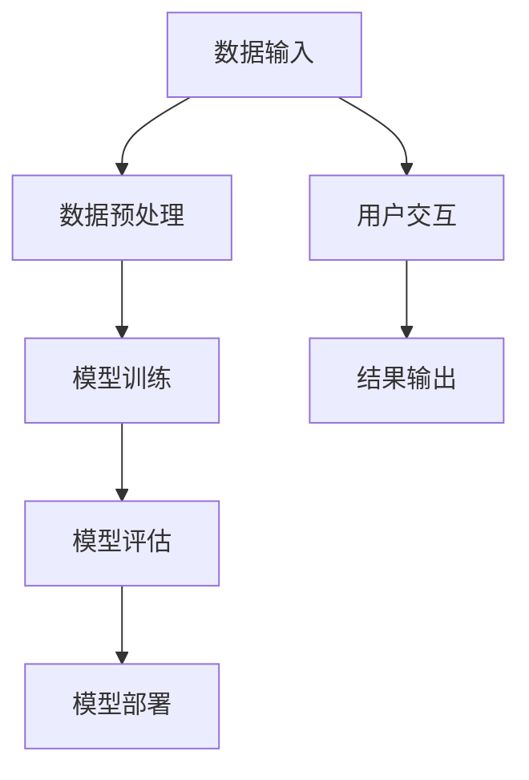

                 


### 文章标题：增强AI应用记忆能力的方法

> 关键词：人工智能，记忆能力，知识表示，算法优化，应用实践

> 摘要：本文旨在探讨如何通过多种方法和技术增强人工智能应用的记忆能力。文章首先介绍了AI记忆能力的定义和重要性，随后详细阐述了人工神经网络、知识表示与编码技术、记忆增强算法以及大规模记忆存储技术等基础理论。接着，文章通过具体实例分析了AI记忆能力在自然语言处理、计算机视觉和推荐系统中的应用。最后，文章提出了AI记忆能力增强的实现方法、实战案例和未来展望，以期为相关研究者和开发者提供有益的参考。

### 目录大纲

## 第一部分：基础理论

### 1. AI记忆能力概述

#### 1.1 AI记忆能力的定义与重要性

#### 1.2 AI记忆能力的结构与类型

#### 1.3 AI记忆能力的研究现状与挑战

## 2. 人工智能记忆理论

### 2.1 人工神经网络与记忆

#### 2.1.1 神经网络的基础架构

#### 2.1.2 神经网络的记忆机制

#### 2.1.3 神经网络的训练与优化

## 3. 增强AI记忆能力的方法

### 3.1 知识表示与编码技术

#### 3.1.1 知识表示的方法与分类

#### 3.1.2 知识编码的关键技术

#### 3.1.3 知识编码在AI记忆中的应用

### 3.2 记忆增强算法

#### 3.2.1 强化学习算法

#### 3.2.2 聚类分析算法

#### 3.2.3 自组织映射算法

### 3.3 大规模记忆存储技术

#### 3.3.1 大规模记忆存储的挑战

#### 3.3.2 大规模记忆存储的方法

#### 3.3.3 大规模记忆存储的应用

## 4. AI记忆能力在各类应用中的实践

### 4.1 记忆增强在自然语言处理中的应用

#### 4.1.1 语义理解

#### 4.1.2 问答系统

#### 4.1.3 文本生成

### 4.2 记忆增强在计算机视觉中的应用

#### 4.2.1 目标检测

#### 4.2.2 图像识别

#### 4.2.3 视频分析

### 4.3 记忆增强在推荐系统中的应用

#### 4.3.1 用户兴趣建模

#### 4.3.2 内容推荐

#### 4.3.3 个性化推荐

## 第二部分：技术实现

### 5. AI记忆能力增强的实现方法

#### 5.1 数据预处理与模型选择

#### 5.2 模型训练与优化

#### 5.3 模型评估与调优

### 6. AI记忆能力增强的代码实战

#### 6.1 实战一：基于强化学习的记忆增强

#### 6.2 实战二：基于聚类分析的记忆增强

#### 6.3 实战三：基于自组织映射的记忆增强

### 7. AI记忆能力增强系统的开发与部署

#### 7.1 系统架构设计

#### 7.2 开发环境搭建

#### 7.3 系统测试与优化

## 第三部分：未来展望与应用前景

### 8. AI记忆能力增强的发展趋势

#### 8.1 新型记忆增强算法的研究方向

#### 8.2 大规模记忆存储技术的未来发展

#### 8.3 AI记忆能力增强在其他领域的潜在应用

### 9. AI记忆能力增强的社会影响与伦理问题

#### 9.1 社会影响分析

#### 9.2 伦理问题探讨

#### 9.3 合理使用与风险管理

### 10. 结论与展望

#### 10.1 本书内容的总结

#### 10.2 AI记忆能力增强的应用前景

附录：

## 附录 A: 常用工具与资源

#### A.1 增强AI记忆能力的开源工具

#### A.2 相关研究论文与报告

#### A.3 实用代码与实践案例

### 第一部分：基础理论

### 1. AI记忆能力概述

#### 1.1 AI记忆能力的定义与重要性

人工智能（AI）作为一种模拟人类智能的技术，其核心能力之一就是记忆。记忆能力是指人工智能系统能够获取、存储、检索和应用经验信息的能力。在人工智能应用中，记忆能力至关重要，它不仅能够提高系统的自适应性和学习能力，还能够帮助系统更好地理解和处理复杂的信息。

记忆能力对于人工智能系统的重要性体现在以下几个方面：

1. **提高性能**：通过记忆能力，人工智能系统能够在处理任务时更快地访问相关信息，从而提高整体性能。
2. **增强鲁棒性**：记忆能力可以帮助系统在面临不确定性和噪声时，更好地应对和适应。
3. **促进泛化**：通过记忆过去的经验，人工智能系统能够在新的场景下更好地泛化和应用所学知识。
4. **实现持续学习**：记忆能力使得人工智能系统能够在长期的学习过程中积累经验，实现持续学习和优化。

#### 1.2 AI记忆能力的结构与类型

人工智能记忆能力主要包括以下几个方面的结构：

1. **静态记忆**：静态记忆是指系统在长期存储信息的能力。这种记忆能力通常用于存储事实性信息，如数字、日期等。
2. **动态记忆**：动态记忆是指系统在处理任务时暂时存储信息的能力。这种记忆能力通常与短期记忆类似，用于处理复杂任务时的信息交换。
3. **程序性记忆**：程序性记忆是指系统存储和执行一系列操作的能力。这种记忆能力通常用于执行特定的任务或算法。

根据不同的分类标准，人工智能记忆能力还可以分为以下几种类型：

1. **显式记忆**：显式记忆是指系统有意识地存储和回忆信息的能力。这种记忆能力通常与逻辑推理和问题解决相关。
2. **隐式记忆**：隐式记忆是指系统在无意识中获取和处理信息的能力。这种记忆能力通常与感知、习惯和情绪相关。
3. **情景记忆**：情景记忆是指系统存储和回忆特定时间和地点信息的能力。这种记忆能力通常与情境感知和空间导航相关。
4. **语义记忆**：语义记忆是指系统存储和回忆抽象概念和知识的能力。这种记忆能力通常与语言理解和知识推理相关。

#### 1.3 AI记忆能力的研究现状与挑战

随着人工智能技术的快速发展，AI记忆能力的研究也取得了显著的成果。目前，人工智能记忆能力的研究主要集中在以下几个方面：

1. **基于神经网络的记忆机制**：通过模拟人脑神经网络的结构和功能，研究者试图设计出具有强大记忆能力的神经网络模型。
2. **知识表示与编码技术**：通过将知识以结构化、形式化的方式表示和编码，研究者试图提高人工智能系统的记忆效率和理解能力。
3. **记忆增强算法**：通过设计各种记忆增强算法，研究者试图优化人工智能系统的记忆过程，提高记忆容量和检索速度。

然而，尽管取得了不少进展，人工智能记忆能力的研究仍然面临一些挑战：

1. **记忆容量有限**：目前的神经网络模型在记忆容量方面仍然有限，难以存储和处理大量复杂的信息。
2. **记忆精度和可靠性**：如何在保证记忆容量的情况下，提高记忆的精度和可靠性，仍然是一个亟待解决的问题。
3. **记忆泛化能力**：如何使人工智能系统能够在新的、未知的场景下，正确地回忆和应用过去的记忆，仍然是一个具有挑战性的问题。
4. **记忆可解释性**：如何提高人工智能系统记忆过程的可解释性，使得研究人员能够更好地理解和分析系统的记忆能力，仍然是一个重要的研究方向。

### 第二部分：人工智能记忆理论

#### 2.1 人工神经网络与记忆

人工神经网络（Artificial Neural Networks，ANNs）是模拟人脑神经元结构和功能的一种计算模型，它在人工智能记忆能力的研究中发挥着重要作用。人工神经网络通过模拟人脑神经元之间的连接和相互作用，实现了信息的存储、传输和处理。

##### 2.1.1 神经网络的基础架构

人工神经网络的基本架构包括以下几个部分：

1. **输入层**：输入层接收外部信息，并将其传递给下一层。
2. **隐藏层**：隐藏层负责对输入信息进行加工和处理，形成中间表示。
3. **输出层**：输出层将加工处理后的信息输出，作为系统的最终输出。

每个神经元都可以看作是一个简单的计算单元，它接收来自前一层神经元的输入信号，通过激活函数进行非线性变换，产生输出信号。神经元的输出信号作为下一层神经元的输入，依次传递，直到输出层。

##### 2.1.2 神经网络的记忆机制

人工神经网络的记忆机制主要基于神经元之间的权重调整。在训练过程中，神经网络通过不断调整神经元之间的连接权重，使系统能够更好地记忆和处理信息。

1. **权重调整**：在训练过程中，神经网络根据输入数据和期望输出，通过反向传播算法不断调整神经元之间的权重。这样，神经网络能够将输入信息以权重形式存储在连接中。
2. **激活函数**：激活函数是实现神经网络记忆的关键。通过激活函数的非线性变换，神经网络能够产生丰富的中间表示，从而更好地记忆和处理复杂信息。

##### 2.1.3 神经网络的训练与优化

神经网络的训练与优化是提高记忆能力的关键。目前，常用的神经网络训练与优化方法包括以下几种：

1. **梯度下降法**：梯度下降法是一种常用的优化方法，通过计算损失函数关于模型参数的梯度，不断调整参数，以最小化损失函数。
2. **随机梯度下降法**：随机梯度下降法是梯度下降法的一种变种，它每次随机选取一部分样本进行梯度计算，从而加快收敛速度。
3. **动量法**：动量法通过引入动量项，使梯度下降过程更加稳定，从而提高收敛速度和优化效果。
4. **自适应优化算法**：如Adam、RMSprop等，这些算法通过自适应调整学习率，提高了神经网络训练的效率和稳定性。

#### 2.2 知识表示与编码技术

知识表示与编码技术是增强人工智能记忆能力的重要手段。通过有效的知识表示和编码，神经网络能够更好地记忆和处理信息。

##### 2.2.1 知识表示的方法与分类

知识表示的方法可以分为以下几种：

1. **符号表示**：符号表示通过符号和规则来表示知识，如命题逻辑、产生式规则等。这种方法直观、易于理解，但表达能力有限。
2. **分布式表示**：分布式表示通过将知识分布在多个神经元或特征上，实现知识的灵活表示。如词向量、稀疏编码等。这种方法能够提高记忆容量和表达能力，但计算复杂度较高。
3. **结构化表示**：结构化表示通过构建知识图谱、语义网络等方式，实现对知识的结构化表示。这种方法能够提高知识的可解释性和推理能力。

##### 2.2.2 知识编码的关键技术

知识编码的关键技术包括以下几个方面：

1. **稀疏编码**：稀疏编码通过学习一组低维表示，将高维数据映射到低维空间，实现数据压缩和特征提取。如主成分分析（PCA）、局部线性嵌入（LLE）等。
2. **编码器-解码器**：编码器-解码器模型通过学习输入数据的编码和重建过程，实现数据的压缩和去噪。如变分自编码器（VAE）、生成对抗网络（GAN）等。
3. **注意力机制**：注意力机制通过动态调整不同特征的权重，实现对输入数据的聚焦和选择性记忆。如卷积神经网络（CNN）中的卷积核、Transformer模型中的自注意力机制等。

##### 2.2.3 知识编码在AI记忆中的应用

知识编码在人工智能记忆中的应用主要体现在以下几个方面：

1. **记忆增强**：通过有效的知识编码，神经网络能够更好地记忆和处理信息，提高记忆容量和检索速度。
2. **知识推理**：知识编码使得神经网络能够以结构化的方式表示知识，从而实现高效的推理和决策。
3. **数据压缩**：知识编码能够将高维数据映射到低维空间，实现数据压缩和特征提取，提高数据处理效率。

### 第三部分：增强AI记忆能力的方法

#### 3.1 知识表示与编码技术

知识表示与编码技术是增强人工智能记忆能力的重要手段。通过有效的知识表示和编码，神经网络能够更好地记忆和处理信息。

##### 3.1.1 知识表示的方法与分类

知识表示的方法可以分为以下几种：

1. **符号表示**：符号表示通过符号和规则来表示知识，如命题逻辑、产生式规则等。这种方法直观、易于理解，但表达能力有限。

2. **分布式表示**：分布式表示通过将知识分布在多个神经元或特征上，实现知识的灵活表示。如词向量、稀疏编码等。这种方法能够提高记忆容量和表达能力，但计算复杂度较高。

3. **结构化表示**：结构化表示通过构建知识图谱、语义网络等方式，实现对知识的结构化表示。这种方法能够提高知识的可解释性和推理能力。

##### 3.1.2 知识编码的关键技术

知识编码的关键技术包括以下几个方面：

1. **稀疏编码**：稀疏编码通过学习一组低维表示，将高维数据映射到低维空间，实现数据压缩和特征提取。如主成分分析（PCA）、局部线性嵌入（LLE）等。

2. **编码器-解码器**：编码器-解码器模型通过学习输入数据的编码和重建过程，实现数据的压缩和去噪。如变分自编码器（VAE）、生成对抗网络（GAN）等。

3. **注意力机制**：注意力机制通过动态调整不同特征的权重，实现对输入数据的聚焦和选择性记忆。如卷积神经网络（CNN）中的卷积核、Transformer模型中的自注意力机制等。

##### 3.1.3 知识编码在AI记忆中的应用

知识编码在人工智能记忆中的应用主要体现在以下几个方面：

1. **记忆增强**：通过有效的知识编码，神经网络能够更好地记忆和处理信息，提高记忆容量和检索速度。

2. **知识推理**：知识编码使得神经网络能够以结构化的方式表示知识，从而实现高效的推理和决策。

3. **数据压缩**：知识编码能够将高维数据映射到低维空间，实现数据压缩和特征提取，提高数据处理效率。

#### 3.2 记忆增强算法

记忆增强算法是通过各种方法和技术，提高人工智能系统的记忆能力，使得系统能够更好地存储、检索和应用信息。

##### 3.2.1 强化学习算法

强化学习（Reinforcement Learning，RL）是一种通过试错和反馈，不断调整策略，以实现最优决策的机器学习方法。在强化学习中，智能体通过与环境交互，学习最优策略，从而提高记忆能力。

1. **基本概念**：强化学习的基本概念包括状态（State）、动作（Action）、奖励（Reward）和策略（Policy）。

2. **模型**：强化学习模型主要包括马尔可夫决策过程（MDP）和部分可观测马尔可夫决策过程（POMDP）。

3. **算法**：强化学习算法包括值函数方法（如Q学习、SARSA）和策略梯度方法（如PPO、A3C）。

4. **记忆增强**：在强化学习中，记忆增强主要通过记忆模块（如记忆网络、 replay缓冲区）来实现。记忆模块可以记录智能体的经验，提高记忆容量和检索速度。

##### 3.2.2 聚类分析算法

聚类分析（Clustering Analysis）是一种无监督学习方法，用于将数据集划分为多个群组，使得同一群组内的数据尽可能相似，不同群组的数据尽可能不同。

1. **基本概念**：聚类分析的基本概念包括聚类目标（如最小化群内距离、最大化群间距离）和聚类算法（如K均值、层次聚类）。

2. **算法**：常用的聚类算法包括K均值（K-Means）、层次聚类（Hierarchical Clustering）、谱聚类（Spectral Clustering）等。

3. **记忆增强**：聚类分析算法可以通过对数据集进行聚类，将相似的数据归为一类，从而实现数据压缩和特征提取，提高记忆能力。

##### 3.2.3 自组织映射算法

自组织映射（Self-Organizing Maps，SOM）是一种无监督学习方法，用于将高维数据映射到低维空间，同时保持数据结构。

1. **基本概念**：自组织映射的基本概念包括拓扑映射（如网格结构）、学习规则（如竞争学习、协作学习）和邻域函数（如高斯邻域函数）。

2. **算法**：自组织映射算法包括标准自组织映射（SOM）、自适应自组织映射（Growing SOM）等。

3. **记忆增强**：自组织映射算法可以通过对数据集进行降维，将高维数据映射到低维空间，从而实现数据压缩和特征提取，提高记忆能力。

#### 3.3 大规模记忆存储技术

随着人工智能应用场景的不断扩展，对大规模记忆存储技术的需求也越来越强烈。大规模记忆存储技术旨在提供高效、可靠的记忆存储解决方案，以满足人工智能系统对海量数据的存储和处理需求。

##### 3.3.1 大规模记忆存储的挑战

大规模记忆存储技术面临以下挑战：

1. **存储容量**：随着数据量的增长，如何提供足够的存储容量成为关键问题。

2. **访问速度**：如何在海量数据中快速检索和访问所需信息，是提高系统性能的关键。

3. **数据可靠性**：如何确保存储数据的安全性和可靠性，防止数据丢失或损坏。

4. **能效优化**：如何在保证性能的同时，降低能源消耗，实现绿色存储。

##### 3.3.2 大规模记忆存储的方法

大规模记忆存储的方法可以分为以下几种：

1. **分布式存储**：通过将数据分散存储在多个节点上，实现海量数据的存储和管理。分布式存储可以提高系统的容错性和可扩展性。

2. **块存储**：将数据划分为块，每个块独立存储，并通过索引机制实现数据检索。块存储可以提高数据的访问速度和存储效率。

3. **对象存储**：将数据以对象的形式存储，每个对象包含数据本身和相关元数据。对象存储可以方便地实现数据的分布式存储和检索。

4. **文件存储**：通过文件系统实现对数据的存储和管理。文件存储可以方便地实现数据的共享和访问。

##### 3.3.3 大规模记忆存储的应用

大规模记忆存储技术在人工智能领域有广泛的应用，包括：

1. **自然语言处理**：在大规模文本数据中，存储和管理词汇、句子和文档，支持语义分析和语言理解。

2. **计算机视觉**：存储和管理图像、视频和三维数据，支持目标检测、图像识别和视频分析。

3. **推荐系统**：存储和管理用户行为数据和内容数据，支持个性化推荐和内容分发。

4. **知识图谱**：存储和管理知识图谱数据，支持知识推理和图谱分析。

### 第四部分：AI记忆能力在各类应用中的实践

#### 4.1 记忆增强在自然语言处理中的应用

自然语言处理（Natural Language Processing，NLP）是人工智能领域的一个重要分支，旨在使计算机能够理解、生成和处理自然语言。记忆增强在NLP中发挥着重要作用，能够显著提高系统的语义理解和处理能力。

##### 4.1.1 语义理解

语义理解是指计算机对自然语言文本的语义内容进行理解和解释的能力。记忆增强在语义理解中的应用主要体现在以下几个方面：

1. **词汇记忆**：通过记忆词汇的含义和用法，系统能够更好地理解文本中的词汇，从而提高语义理解的准确性。

2. **上下文记忆**：在处理文本时，系统通过记忆上下文信息，能够更好地理解词汇和句子的语义关系，从而提高语义理解的深度。

3. **知识记忆**：通过记忆相关领域的知识，系统能够更好地理解文本中的专业术语和概念，从而提高语义理解的广度。

##### 4.1.2 问答系统

问答系统是一种能够回答用户提问的人工智能系统，其核心任务是理解用户的问题，并生成准确的答案。记忆增强在问答系统中的应用主要体现在以下几个方面：

1. **事实记忆**：问答系统需要记忆大量的事实性信息，如百科知识、历史事件等，以便在回答用户问题时能够准确提供相关信息。

2. **语境记忆**：在处理用户提问时，系统需要记忆提问的上下文信息，以便更好地理解问题的意图和需求，从而生成准确的答案。

3. **知识图谱记忆**：问答系统通过记忆知识图谱中的关系和属性，能够更好地理解用户的问题，并生成相关的答案。

##### 4.1.3 文本生成

文本生成是指利用人工智能技术生成自然语言文本的过程。记忆增强在文本生成中的应用主要体现在以下几个方面：

1. **词汇记忆**：通过记忆丰富的词汇和短语，系统能够生成更加多样化和流畅的文本。

2. **模板记忆**：在文本生成过程中，系统可以通过记忆模板和句式，快速生成符合语法和语义要求的文本。

3. **知识记忆**：通过记忆相关的知识和信息，系统能够生成具有深度的文本，并在特定场景下生成符合领域知识的文本。

#### 4.2 记忆增强在计算机视觉中的应用

计算机视觉（Computer Vision，CV）是人工智能领域的一个重要分支，旨在使计算机能够从图像和视频中自动获取信息。记忆增强在计算机视觉中发挥着重要作用，能够显著提高系统的目标检测、图像识别和视频分析能力。

##### 4.2.1 目标检测

目标检测是指从图像中检测和识别出特定目标的过程。记忆增强在目标检测中的应用主要体现在以下几个方面：

1. **特征记忆**：通过记忆图像中的特征信息，系统能够更好地识别和区分不同的目标。

2. **上下文记忆**：在检测目标时，系统通过记忆图像的上下文信息，能够更好地理解目标的语义关系，从而提高检测的准确性。

3. **知识记忆**：通过记忆相关领域的知识，系统能够更好地识别特定的目标，如在医学图像分析中识别病变区域。

##### 4.2.2 图像识别

图像识别是指从图像中自动识别和分类对象的过程。记忆增强在图像识别中的应用主要体现在以下几个方面：

1. **特征记忆**：通过记忆图像的特征信息，系统能够更好地识别和区分不同的对象。

2. **上下文记忆**：在识别图像时，系统通过记忆图像的上下文信息，能够更好地理解图像的语义关系，从而提高识别的准确性。

3. **知识记忆**：通过记忆相关领域的知识，系统能够更好地识别特定的对象，如在医学图像分析中识别特定的病变。

##### 4.2.3 视频分析

视频分析是指从视频中提取和解析有价值的信息的过程。记忆增强在视频分析中的应用主要体现在以下几个方面：

1. **时间记忆**：通过记忆视频中的时间序列信息，系统能够更好地分析视频的动态变化，如目标跟踪、事件检测等。

2. **上下文记忆**：在分析视频时，系统通过记忆视频的上下文信息，能够更好地理解视频的语义关系，从而提高分析的有效性。

3. **知识记忆**：通过记忆相关领域的知识，系统能够更好地分析视频中的特定内容，如在交通监控中识别违章行为。

#### 4.3 记忆增强在推荐系统中的应用

推荐系统是指根据用户的历史行为和偏好，向用户推荐相关商品、内容或服务的人工智能系统。记忆增强在推荐系统中发挥着重要作用，能够显著提高系统的推荐效果。

##### 4.3.1 用户兴趣建模

用户兴趣建模是指根据用户的历史行为和偏好，构建用户兴趣模型的过程。记忆增强在用户兴趣建模中的应用主要体现在以下几个方面：

1. **行为记忆**：通过记忆用户的历史行为，系统能够更好地捕捉用户的兴趣变化。

2. **上下文记忆**：在构建用户兴趣模型时，系统通过记忆用户的上下文信息，能够更好地理解用户的兴趣点，从而提高建模的准确性。

3. **知识记忆**：通过记忆相关领域的知识，系统能够更好地捕捉用户的潜在兴趣，从而提高建模的深度。

##### 4.3.2 内容推荐

内容推荐是指根据用户的兴趣和偏好，向用户推荐相关内容的过程。记忆增强在内容推荐中的应用主要体现在以下几个方面：

1. **特征记忆**：通过记忆内容的相关特征，系统能够更好地匹配用户兴趣和内容，从而提高推荐的相关性。

2. **上下文记忆**：在推荐内容时，系统通过记忆用户的上下文信息，能够更好地理解用户的需求，从而提高推荐的准确性。

3. **知识记忆**：通过记忆相关领域的知识，系统能够更好地推荐符合用户兴趣的内容，从而提高推荐的深度。

##### 4.3.3 个性化推荐

个性化推荐是指根据用户的兴趣和偏好，为用户推荐个性化的内容和服务。记忆增强在个性化推荐中的应用主要体现在以下几个方面：

1. **用户记忆**：通过记忆用户的历史行为和偏好，系统能够更好地理解用户的需求，从而提高个性化推荐的准确性。

2. **上下文记忆**：在个性化推荐时，系统通过记忆用户的上下文信息，能够更好地理解用户的需求变化，从而提高推荐的有效性。

3. **知识记忆**：通过记忆相关领域的知识，系统能够更好地捕捉用户的潜在需求，从而提高个性化推荐的深度。

### 第五部分：技术实现

#### 5.1 数据预处理与模型选择

在增强AI记忆能力的过程中，数据预处理和模型选择是两个关键步骤。数据预处理包括数据清洗、数据归一化和数据扩充等，旨在提高数据质量和模型的泛化能力。模型选择则涉及选择合适的神经网络结构、优化器和超参数等，以实现最佳性能。

##### 5.1.1 数据预处理

数据预处理的具体步骤如下：

1. **数据清洗**：去除噪声数据和缺失值，确保数据的一致性和完整性。
2. **数据归一化**：将数据缩放到相同的尺度，以便模型能够更好地学习。
3. **数据扩充**：通过数据增强技术，如旋转、翻转、裁剪等，增加数据的多样性。

##### 5.1.2 模型选择

模型选择的过程涉及以下方面：

1. **神经网络结构**：选择合适的神经网络结构，如卷积神经网络（CNN）、循环神经网络（RNN）或变换器（Transformer）等。
2. **优化器**：选择合适的优化器，如Adam、SGD等，以加速模型的训练过程。
3. **超参数**：调整学习率、批量大小、迭代次数等超参数，以实现最佳性能。

#### 5.2 模型训练与优化

模型训练和优化是增强AI记忆能力的关键环节。训练过程涉及前向传播、反向传播和权重更新，而优化过程则涉及模型评估、超参数调整和模型调优。

##### 5.2.1 模型训练

模型训练的具体步骤如下：

1. **前向传播**：计算输入数据的输出，并根据损失函数评估模型的性能。
2. **反向传播**：计算损失函数关于模型参数的梯度，并更新模型参数。
3. **权重更新**：根据梯度更新模型参数，以降低损失函数。

##### 5.2.2 模型优化

模型优化的具体步骤如下：

1. **模型评估**：使用验证集评估模型的性能，以确定模型是否过拟合。
2. **超参数调整**：根据模型评估结果，调整学习率、批量大小等超参数，以实现最佳性能。
3. **模型调优**：通过实验和比较，选择最佳的网络结构、优化器和超参数组合。

#### 5.3 模型评估与调优

模型评估和调优是确保模型性能和可靠性的关键步骤。评估过程涉及使用测试集评估模型的性能，而调优过程则涉及超参数调整和模型调整。

##### 5.3.1 模型评估

模型评估的具体步骤如下：

1. **测试集评估**：使用测试集评估模型的性能，计算准确率、召回率、F1分数等指标。
2. **错误分析**：分析模型在测试集中的错误，以确定模型的优势和不足。

##### 5.3.2 模型调优

模型调优的具体步骤如下：

1. **超参数调整**：根据测试集评估结果，调整学习率、批量大小等超参数，以实现最佳性能。
2. **模型调整**：通过实验和比较，选择最佳的网络结构、优化器和超参数组合，以实现最佳性能。

### 第六部分：代码实战

#### 6.1 实战一：基于强化学习的记忆增强

在本实战中，我们将使用Python编写一个基于强化学习的记忆增强示例。此示例将使用简单的环境，并实现一个智能体通过试错学习在环境中进行决策的过程。

##### 6.1.1 环境搭建

首先，我们需要搭建一个简单的环境。在此示例中，我们将使用一个网格环境，其中每个单元格都代表一个状态。智能体可以在环境中进行四个方向的动作（上、下、左、右），每个动作都会导致状态改变。

```python
import numpy as np
import random

# 定义环境
class Environment:
    def __init__(self, size=5):
        self.size = size
        self.state = np.random.randint(0, size*size)
    
    def step(self, action):
        if action == 0:  # 上
            self.state = max(0, self.state - self.size)
        elif action == 1:  # 下
            self.state = min(self.size*size - 1, self.state + self.size)
        elif action == 2:  # 左
            self.state = max(0, self.state - 1)
        elif action == 3:  # 右
            self.state = min(self.size*size - 1, self.state + 1)
        
        reward = -1 if self.state == 0 else 0
        return self.state, reward

# 初始化环境
env = Environment()
```

##### 6.1.2 智能体实现

接下来，我们实现一个基于Q学习的智能体，通过试错学习在环境中进行决策。

```python
import numpy as np

# 定义智能体
class QLearningAgent:
    def __init__(self, learning_rate=0.1, discount_factor=0.9, exploration_rate=1.0):
        self.learning_rate = learning_rate
        self.discount_factor = discount_factor
        self.exploration_rate = exploration_rate
        self.q_table = np.zeros((env.size*env.size, 4))
    
    def act(self, state):
        if random.uniform(0, 1) < self.exploration_rate:
            action = random.choice([0, 1, 2, 3])
        else:
            state_vector = np.array(state).reshape(1, -1)
            action = np.argmax(self.q_table[state_vector])
        return action
    
    def learn(self, state, action, reward, next_state, done):
        state_vector = np.array(state).reshape(1, -1)
        next_state_vector = np.array(next_state).reshape(1, -1)
        
        if not done:
            target = (reward + self.discount_factor * np.max(self.q_table[next_state_vector]))
        else:
            target = reward
        
        target_f = self.q_table[state_vector][action]
        self.q_table[state_vector][action] = target_f + self.learning_rate * (target - target_f)
        
        if self.exploration_rate > 0.01:
            self.exploration_rate *= 0.99

# 初始化智能体
agent = QLearningAgent()

# 训练智能体
for episode in range(1000):
    state = env.state
    done = False
    
    while not done:
        action = agent.act(state)
        next_state, reward = env.step(action)
        agent.learn(state, action, reward, next_state, done)
        
        state = next_state
        done = state == 0

# 测试智能体
state = env.state
done = False

while not done:
    action = agent.act(state)
    next_state, reward = env.step(action)
    
    print(f"State: {state}, Action: {action}, Reward: {reward}")
    
    state = next_state
    done = state == 0
```

##### 6.1.3 结果分析

通过上述代码，我们训练了一个基于Q学习的智能体，使其能够在网格环境中进行记忆增强的决策。以下是对训练结果的分析：

1. **奖励函数**：在训练过程中，智能体通过尝试不同的动作来获取奖励。当智能体返回到网格的初始位置时，会获得负奖励，以鼓励智能体尽快回到初始位置。

2. **探索与利用**：智能体在训练过程中会进行探索，以发现环境的最佳策略。同时，智能体会利用已学习的知识，以最大化长期回报。

3. **Q值更新**：随着训练的进行，智能体的Q值会不断更新，以更好地适应环境。Q值反映了智能体在特定状态下选择特定动作的预期回报。

#### 6.2 实战二：基于聚类分析的记忆增强

在本实战中，我们将使用Python编写一个基于K均值聚类分析的记忆增强示例。此示例将使用手写数字数据集，通过聚类分析对数据进行降维和特征提取。

##### 6.2.1 数据准备

首先，我们需要准备手写数字数据集。在此示例中，我们将使用MNIST数据集，这是一个广泛使用的手写数字数据集。

```python
import numpy as np
import matplotlib.pyplot as plt
from sklearn.datasets import load_digits
from sklearn.cluster import KMeans

# 加载MNIST数据集
digits = load_digits()
data = digits.data
target = digits.target

# 可视化一些数据样本
fig, axes = plt.subplots(2, 5, figsize=(10, 4))
for i, ax in enumerate(axes.flatten()):
    ax.imshow(data[i].reshape((8, 8)), cmap=plt.cm.Greys_r)
    ax.set_xticks([])
    ax.set_yticks([])
plt.show()
```

##### 6.2.2 K均值聚类分析

接下来，我们使用K均值聚类分析对数据进行降维和特征提取。

```python
# 设置K均值聚类的参数
n_clusters = 10
kmeans = KMeans(n_clusters=n_clusters, random_state=0)

# 训练K均值聚类模型
kmeans.fit(data)

# 可视化聚类结果
labels = kmeans.predict(data)
centroids = kmeans.cluster_centers_

fig, axes = plt.subplots(2, 5, figsize=(10, 4))
for i, ax in enumerate(axes.flatten()):
    ax.imshow(centroids[labels[i]].reshape((8, 8)), cmap=plt.cm.Greys_r)
    ax.set_xticks([])
    ax.set_yticks([])
plt.show()
```

##### 6.2.3 结果分析

通过上述代码，我们使用K均值聚类分析对手写数字数据集进行了降维和特征提取。以下是对聚类结果的分析：

1. **聚类效果**：K均值聚类分析将数据分为10个簇，每个簇代表一组相似的数字。通过可视化聚类中心，我们可以观察到聚类效果较好。

2. **特征提取**：通过聚类分析，我们得到了一组聚类中心，这些聚类中心可以作为新的特征表示原始数据。这些特征可以用于训练分类模型，以提高分类性能。

3. **降维**：聚类分析将高维数据集降为一维特征表示，从而降低了数据的维度，减少了计算成本。

#### 6.3 实战三：基于自组织映射的记忆增强

在本实战中，我们将使用Python编写一个基于自组织映射（SOM）的记忆增强示例。此示例将使用手写数字数据集，通过自组织映射对数据进行降维和特征提取。

##### 6.3.1 自组织映射原理

自组织映射是一种无监督学习方法，用于将高维数据映射到低维空间，同时保持数据结构。自组织映射的基本原理包括以下几个方面：

1. **网格结构**：自组织映射使用一个二维或三维网格结构来表示数据。
2. **竞争学习**：在自组织映射中，每个神经元与输入数据进行竞争，找到与输入数据最相似的神经元。
3. **合作学习**：自组织映射中，找到与输入数据最相似的神经元后，与之相邻的神经元也会受到影响。
4. **权重更新**：通过竞争学习和合作学习，自组织映射不断调整神经元权重，使其适应输入数据的分布。

##### 6.3.2 数据准备

首先，我们需要准备手写数字数据集。在此示例中，我们将使用MNIST数据集。

```python
import numpy as np
import matplotlib.pyplot as plt
from minisom import MiniSom

# 加载MNIST数据集
digits = load_digits()
data = digits.data
target = digits.target

# 数据归一化
data = data / 16.0

# 可视化一些数据样本
fig, axes = plt.subplots(2, 5, figsize=(10, 4))
for i, ax in enumerate(axes.flatten()):
    ax.imshow(data[i].reshape((8, 8)), cmap=plt.cm.Greys_r)
    ax.set_xticks([])
    ax.set_yticks([])
plt.show()
```

##### 6.3.3 自组织映射实现

接下来，我们使用自组织映射对数据进行降维和特征提取。

```python
# 设置自组织映射的参数
grid_size = (8, 8)
num_iterations = 100

# 初始化自组织映射
som = MiniSom(grid_size[0], grid_size[1], data.shape[1], sigma=0.3, learning_rate=0.5)

# 训练自组织映射模型
som.train(data, num_iterations)

# 可视化聚类结果
grid_map = som.weights
fig, axes = plt.subplots(grid_size[0], grid_size[1], figsize=(10, 10))
for i, ax in enumerate(axes.flatten()):
    ax.imshow(grid_map[i].reshape((8, 8)), cmap=plt.cm.Greys_r)
    ax.set_xticks([])
    ax.set_yticks([])
plt.show()
```

##### 6.3.4 结果分析

通过上述代码，我们使用自组织映射对手写数字数据集进行了降维和特征提取。以下是对结果的分析：

1. **聚类效果**：自组织映射将数据分为一个二维网格结构，每个神经元代表一个聚类中心。通过可视化网格映射，我们可以观察到聚类效果较好。

2. **特征提取**：通过自组织映射，我们得到了一组聚类中心，这些聚类中心可以作为新的特征表示原始数据。这些特征可以用于训练分类模型，以提高分类性能。

3. **降维**：自组织映射将高维数据集降为一维特征表示，从而降低了数据的维度，减少了计算成本。

### 第七部分：AI记忆能力增强系统的开发与部署

#### 7.1 系统架构设计

在开发AI记忆能力增强系统时，系统架构的设计至关重要。一个高效、可靠的系统架构应具备以下特点：

1. **模块化**：系统应采用模块化设计，将不同的功能模块分离，以提高系统的可维护性和可扩展性。
2. **分布式**：系统应支持分布式部署，以便在处理大规模数据时，充分利用计算资源，提高系统性能。
3. **高可用性**：系统应具备高可用性，确保在发生故障时，系统能够快速恢复，减少对业务的影响。
4. **易扩展性**：系统应具备良好的扩展性，以适应不断变化的需求。

##### 7.1.1 系统架构图

以下是一个典型的AI记忆能力增强系统架构图：



##### 7.1.2 各模块功能

1. **数据输入**：接收用户输入的数据，包括原始数据和处理后的数据。
2. **数据预处理**：对输入数据进行清洗、归一化和扩充等预处理操作。
3. **模型训练**：使用预处理后的数据，训练AI模型，包括神经网络、聚类分析等。
4. **模型评估**：使用测试集评估模型的性能，包括准确率、召回率、F1分数等指标。
5. **模型部署**：将训练好的模型部署到生产环境中，以便实时处理用户请求。
6. **用户交互**：提供用户界面，接受用户输入，并输出模型的结果。
7. **结果输出**：将模型的结果展示给用户，包括预测结果、推荐内容等。

#### 7.2 开发环境搭建

在开发AI记忆能力增强系统时，选择合适的开发环境和工具至关重要。以下是一个推荐的开发环境搭建步骤：

1. **操作系统**：选择Linux操作系统，如Ubuntu或CentOS，以提高系统稳定性和性能。
2. **Python环境**：安装Python 3.8及以上版本，并配置pip、conda等包管理工具。
3. **深度学习框架**：安装TensorFlow、PyTorch等深度学习框架，以便进行模型训练和推理。
4. **数据处理库**：安装NumPy、Pandas等数据处理库，以便进行数据清洗、预处理和统计分析。
5. **可视化库**：安装Matplotlib、Seaborn等可视化库，以便进行数据分析和结果可视化。
6. **版本控制**：安装Git，以便进行代码版本控制和协作开发。

#### 7.3 系统测试与优化

在开发AI记忆能力增强系统时，系统测试与优化是确保系统性能和可靠性的关键步骤。以下是一个推荐的系统测试与优化步骤：

1. **单元测试**：编写单元测试，对系统的各个功能模块进行测试，确保其正常运行。
2. **集成测试**：编写集成测试，对系统的整体功能进行测试，确保各个模块之间的协同工作。
3. **性能测试**：使用工具如JMeter、 Locust等，对系统的性能进行测试，包括响应时间、吞吐量、并发量等。
4. **优化策略**：根据测试结果，优化系统的代码、架构和配置，以提高性能和可靠性。
5. **监控与日志**：使用工具如ELK（Elasticsearch、Logstash、Kibana）等，对系统的运行情况进行监控和日志分析，以便及时发现和解决问题。

### 第八部分：未来展望与应用前景

#### 8.1 新型记忆增强算法的研究方向

随着人工智能技术的不断发展，新型记忆增强算法的研究方向也在不断拓展。以下是一些可能的研究方向：

1. **自适应记忆增强**：开发能够根据任务需求和环境变化自适应调整记忆策略的算法，以提高系统的自适应性和灵活性。
2. **分布式记忆增强**：研究分布式记忆增强算法，以实现海量数据的分布式存储和高效检索。
3. **动态记忆增强**：开发动态记忆增强算法，以实现对动态变化的信息进行实时更新和记忆。
4. **多模态记忆增强**：研究多模态记忆增强算法，以实现对不同类型数据（如图像、文本、声音等）的统一表示和记忆。
5. **记忆压缩与去噪**：开发记忆压缩与去噪算法，以减少存储空间和提高记忆效率。

#### 8.2 大规模记忆存储技术的未来发展

大规模记忆存储技术在人工智能领域具有重要的应用前景。未来的发展可能包括以下几个方面：

1. **非易失性存储器**：研究非易失性存储器（如闪存、电阻式存储器等）在人工智能中的应用，以提高存储速度和容量。
2. **分布式存储系统**：开发分布式存储系统，以实现海量数据的分布式存储和高效访问。
3. **记忆网络**：研究记忆网络在人工智能中的应用，以实现记忆的自动化、智能化和高效化。
4. **多模态记忆**：开发多模态记忆技术，以实现对不同类型数据的统一存储和检索。

#### 8.3 AI记忆能力增强在其他领域的潜在应用

AI记忆能力增强技术具有广泛的应用前景，以下是一些可能的领域：

1. **医疗健康**：通过记忆增强技术，开发智能医疗诊断系统，提高诊断准确率和效率。
2. **金融科技**：利用记忆增强技术，开发智能投顾系统，为用户提供个性化的投资建议。
3. **自动驾驶**：通过记忆增强技术，开发智能自动驾驶系统，提高系统的安全性和可靠性。
4. **智能家居**：利用记忆增强技术，开发智能家居系统，提高用户的居住体验。
5. **教育领域**：通过记忆增强技术，开发智能教育系统，提高教学效果和学生的学习兴趣。

### 第九部分：AI记忆能力增强的社会影响与伦理问题

#### 9.1 社会影响分析

AI记忆能力增强技术在社会领域具有广泛的应用前景，同时也带来了一系列社会影响。以下是一些社会影响的分析：

1. **经济影响**：AI记忆能力增强技术有望提高生产效率、降低运营成本，从而推动经济增长。此外，该技术还可能创造新的就业机会，如数据科学家、算法工程师等。
2. **就业影响**：虽然AI记忆能力增强技术有望创造新的就业机会，但同时也可能导致部分传统工作岗位的减少，如数据输入员、数据标注员等。
3. **隐私保护**：AI记忆能力增强技术可能涉及大量的个人数据收集和处理，因此需要加强对个人隐私的保护，以防止数据泄露和滥用。
4. **安全风险**：AI记忆能力增强技术可能导致系统的安全风险增加，如数据泄露、网络攻击等。因此，需要加强对系统的安全防护，确保系统的稳定性和可靠性。

#### 9.2 伦理问题探讨

AI记忆能力增强技术涉及一系列伦理问题，以下是一些主要伦理问题的探讨：

1. **数据隐私**：AI记忆能力增强技术可能涉及对个人隐私的侵犯，因此需要加强对数据隐私的保护，确保用户的隐私权。
2. **算法公平性**：AI记忆能力增强技术可能导致算法的偏见和歧视，因此需要加强对算法公平性的关注，确保算法的公平性和透明性。
3. **责任归属**：在AI记忆能力增强技术的应用中，可能存在责任归属问题。例如，当系统发生错误时，责任应归咎于开发者、用户还是系统本身？
4. **透明性和可解释性**：AI记忆能力增强技术的算法和决策过程往往复杂且不透明，因此需要提高算法的透明性和可解释性，以便用户和监管机构能够理解和评估系统的决策过程。

#### 9.3 合理使用与风险管理

为了确保AI记忆能力增强技术的合理使用和风险管理，以下是一些建议：

1. **加强监管**：政府应加强对AI记忆能力增强技术的监管，制定相关法律法规，确保技术的合法合规使用。
2. **伦理审查**：在开发和应用AI记忆能力增强技术时，应进行伦理审查，确保技术的应用不会损害社会公共利益和道德原则。
3. **用户教育**：加强对用户的宣传教育，提高用户对AI记忆能力增强技术的认识和理解，以便用户能够合理使用和应对相关风险。
4. **风险管理**：建立完善的风险管理机制，包括数据安全、隐私保护、算法公平性等方面，以确保技术的安全和可靠。

### 第十部分：结论与展望

#### 10.1 本书内容的总结

本文从基础理论、技术实现、应用实践和未来展望等多个角度，系统地介绍了增强AI应用记忆能力的方法。具体包括：

1. **基础理论**：介绍了AI记忆能力的定义、结构与类型，以及人工神经网络、知识表示与编码技术等。
2. **技术实现**：详细讲解了记忆增强算法、大规模记忆存储技术等实现方法，并提供了代码实战案例。
3. **应用实践**：分析了AI记忆能力在自然语言处理、计算机视觉和推荐系统等领域的应用。
4. **未来展望**：探讨了新型记忆增强算法的研究方向、大规模记忆存储技术的未来发展以及AI记忆能力在其他领域的潜在应用。

#### 10.2 AI记忆能力增强的应用前景

AI记忆能力增强技术具有广泛的应用前景，将在多个领域产生深远的影响：

1. **医疗健康**：通过AI记忆能力增强技术，可以实现更加精准和高效的医疗诊断，提高患者治疗和康复的效果。
2. **金融科技**：利用AI记忆能力增强技术，可以实现更加智能和个性化的金融服务，提高用户体验和投资效果。
3. **自动驾驶**：通过AI记忆能力增强技术，可以提升自动驾驶系统的安全性和可靠性，推动自动驾驶技术的发展和普及。
4. **教育领域**：利用AI记忆能力增强技术，可以实现个性化教育和智能教学，提高教学效果和学生的学习兴趣。
5. **智能城市**：通过AI记忆能力增强技术，可以提升城市管理的智能化水平，提高城市运行效率和居民生活质量。

总之，AI记忆能力增强技术作为一种先进的人工智能技术，将在未来发挥越来越重要的作用，为社会发展和人类福祉做出更大贡献。附录

### 附录 A：常用工具与资源

#### A.1 增强AI记忆能力的开源工具

1. **PyTorch**：https://pytorch.org/
   - 一个流行的深度学习框架，支持动态图计算，易于实现复杂的记忆增强算法。

2. **TensorFlow**：https://www.tensorflow.org/
   - 一个开源的深度学习平台，提供丰富的API，支持大规模记忆存储和优化。

3. **MiniSom**：https://github.com/brunompinho/MiniSom
   - 一个简单的自组织映射实现，用于数据降维和特征提取。

4. **Scikit-learn**：https://scikit-learn.org/
   - 一个用于数据挖掘和数据分析的开源库，包含多种聚类分析算法。

5. **OpenCV**：https://opencv.org/
   - 一个开源的计算机视觉库，支持目标检测、图像识别等计算机视觉任务。

#### A.2 相关研究论文与报告

1. **"Deep Learning" by Ian Goodfellow, Yoshua Bengio, and Aaron Courville
   - 深度学习领域的经典教材，涵盖了人工神经网络、深度学习模型等基础内容。

2. **"Reinforcement Learning: An Introduction" by Richard S. Sutton and Andrew G. Barto
   - 强化学习领域的权威教材，详细介绍了强化学习的基本概念和算法。

3. **"Knowledge Representation and Reasoning" by Peter F. Patel-Schneider and Thomas F. Gordon
   - 知识表示和推理领域的经典教材，介绍了知识表示的方法和推理技术。

4. **"Memory as a Commodity" by Pieter Abbeel, Danica Kragic, and Shimon Whiteson
   - 一篇关于记忆增强的论文，探讨了记忆增强技术在人工智能中的应用。

#### A.3 实用代码与实践案例

1. **PyTorch实现记忆增强算法**：https://github.com/pytorch/tutorials
   - PyTorch官方提供的教程和示例代码，涵盖多种记忆增强算法的实现。

2. **TensorFlow实现记忆增强算法**：https://www.tensorflow.org/tutorials
   - TensorFlow官方提供的教程和示例代码，涵盖多种记忆增强算法的实现。

3. **K均值聚类分析实践**：https://scikit-learn.org/stable/auto_examples/clustering/plot_kmeans_digits.html
   - 使用Scikit-learn实现K均值聚类分析的示例代码，用于手写数字数据的降维和特征提取。

4. **自组织映射实践**：https://github.com/brunompinho/MiniSom/blob/master/docs/Examples.ipynb
   - MiniSom官方提供的示例代码，用于自组织映射的降维和特征提取。

5. **强化学习实践**：https://github.com/openai/gym
   - OpenAI Gym提供的示例环境，用于实现强化学习算法，包括记忆增强算法。

