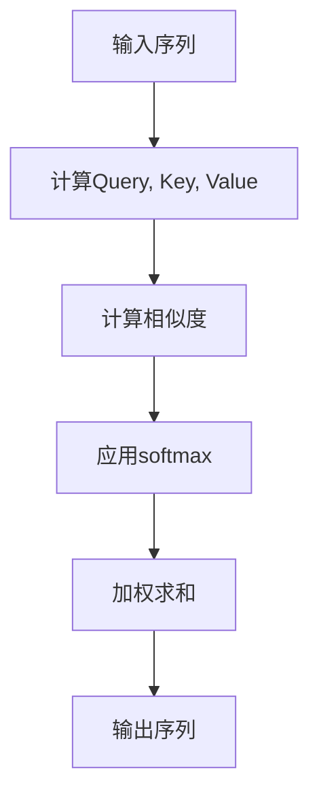
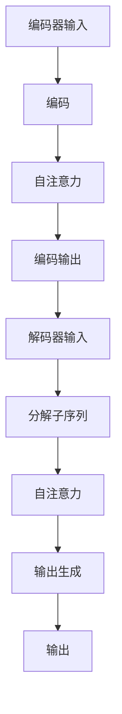
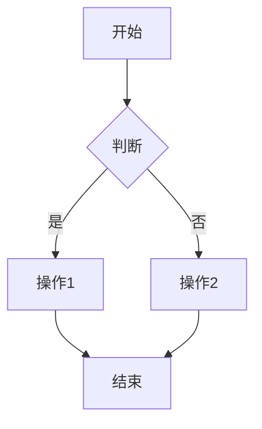
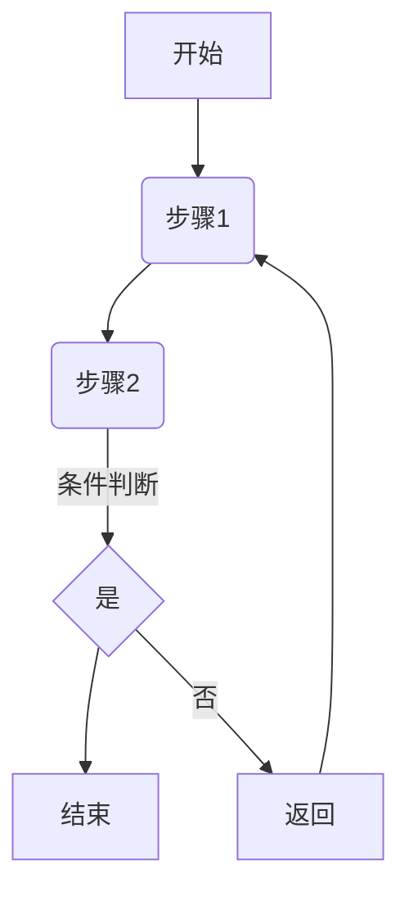

                 

# 文章标题

多模态Transformer：跨域AI的新范式

> 关键词：多模态Transformer，跨域AI，自注意力机制，编码器，解码器，数据融合技术

> 摘要：本文深入探讨了多模态Transformer的基本概念、数学基础、算法原理及其在跨域AI中的应用。通过对比传统机器学习方法，展示了多模态Transformer的优势，并详细介绍了自注意力机制、编码器与解码器以及多模态数据融合技术。此外，本文还通过项目实战，展示了如何搭建和优化多模态Transformer模型，以及如何在实际项目中应用。最后，本文对多模态Transformer在跨域AI中的未来发展进行了展望。

# 目录大纲

## 第一部分: 多模态Transformer概述

### 第1章: 多模态Transformer基础

#### 1.1 什么是多模态Transformer？

#### 1.2 多模态Transformer的核心概念

#### 1.3 多模态Transformer与传统的机器学习方法的比较

### 第2章: 多模态Transformer数学基础

#### 2.1 线性代数

#### 2.2 微积分

#### 2.3 概率论与信息论

## 第二部分: 多模态Transformer算法原理

### 第3章: 自注意力机制

#### 3.1 自注意力机制的介绍

#### 3.2 自注意力机制的推导

#### 3.3 自注意力机制的变体

### 第4章: 编码器与解码器

#### 4.1 编码器与解码器的基本概念

#### 4.2 编码器与解码器的交互过程

#### 4.3 编码器与解码器的变体

### 第5章: 多模态数据融合技术

#### 5.1 多模态数据融合的基本概念

#### 5.2 多模态数据融合的方法

#### 5.3 多模态数据融合的实际应用

## 第三部分: 多模态Transformer项目实战

### 第6章: 多模态Transformer项目实战

#### 6.1 项目介绍

#### 6.2 项目环境搭建

#### 6.3 模型设计与实现

#### 6.4 项目结果分析

### 第7章: 多模态Transformer的优化与调参

#### 7.1 模型优化

#### 7.2 调参技巧

#### 7.3 项目实战中的优化与调参

## 第8章: 多模态Transformer在跨域AI中的应用

#### 8.1 跨域AI的概念

#### 8.2 多模态Transformer在跨域AI中的应用

#### 8.3 未来发展趋势

## 附录

### 附录 A: 多模态Transformer相关资源

### 附录 B: Mermaid图示参考## 第一部分: 多模态Transformer概述

### 第1章: 多模态Transformer基础

#### 1.1 什么是多模态Transformer？

多模态Transformer是一种先进的机器学习模型，它能够处理来自多种数据源的信息，例如文本、图像、音频等。与传统单模态模型不同，多模态Transformer通过融合不同类型的数据，能够更加全面地理解和处理复杂问题。

**多模态Transformer的定义：**

多模态Transformer是一种基于自注意力机制的深度学习模型，它通过编码器和解码器对多模态数据进行编码和解码，从而实现对数据的理解和生成。

**多模态Transformer的优势：**

1. **数据融合能力：** 多模态Transformer能够将不同类型的数据进行有效融合，从而提高模型的性能和泛化能力。
2. **强大的表征能力：** 通过自注意力机制，多模态Transformer能够捕捉到数据中复杂的关系和特征。
3. **灵活性和通用性：** 多模态Transformer可以应用于多种任务，包括图像识别、文本生成、语音识别等。

**多模态Transformer的应用场景：**

1. **图像识别与理解：** 结合图像和文本描述，提高图像识别的准确性。
2. **语音识别与合成：** 结合音频和文本，提高语音识别和语音合成的准确性。
3. **自然语言处理：** 结合文本和图像，提高文本生成和文本分类的性能。

#### 1.2 多模态Transformer的核心概念

**自注意力机制：**

自注意力机制是Transformer模型的核心组成部分，它允许模型在处理每个输入数据点时，能够自适应地关注到其他所有数据点，从而提高了模型的表征能力。

**编码器与解码器：**

编码器和解码器是多模态Transformer的两个主要组件。编码器负责将多模态数据编码为固定长度的向量表示，而解码器则将这些向量表示解码为输出。

**多模态数据融合技术：**

多模态数据融合技术是多模态Transformer的关键组成部分，它通过将不同类型的数据进行融合，从而提高模型的性能和准确性。

#### 1.3 多模态Transformer与传统的机器学习方法的比较

**传统机器学习方法：**

传统的机器学习方法通常专注于处理单模态数据，例如传统的图像识别模型只处理图像数据，语音识别模型只处理音频数据。

**多模态Transformer的优点：**

1. **数据融合：** 多模态Transformer能够将不同类型的数据进行有效融合，从而提高模型的性能和泛化能力。
2. **表征能力：** 通过自注意力机制，多模态Transformer能够捕捉到数据中复杂的关系和特征。
3. **灵活性和通用性：** 多模态Transformer可以应用于多种任务，包括图像识别、文本生成、语音识别等。

## 第二部分: 多模态Transformer数学基础

### 第2章: 多模态Transformer数学基础

在深入理解多模态Transformer的工作原理之前，我们需要掌握一些数学基础知识，这些基础包括线性代数、微积分和概率论与信息论。本章将介绍这些基础概念，并解释它们在多模态Transformer中的应用。

#### 2.1 线性代数

**矩阵与向量：**

线性代数是处理多维数据的基础。在多模态Transformer中，矩阵和向量用于表示数据和处理数据。

- **向量：** 向量是一个一维数组，可以表示一个数据点的特征。在多模态Transformer中，每个模态的数据可以表示为向量。
- **矩阵：** 矩阵是一个二维数组，用于表示一组数据点及其特征。在多模态Transformer中，矩阵可以用于表示多模态数据的组合。

**矩阵乘法：**

矩阵乘法是线性代数中的一个重要运算，用于计算两个矩阵的乘积。在多模态Transformer中，矩阵乘法用于数据转换和特征提取。

$$
C = AB
$$

其中，$C$是结果矩阵，$A$和$B$是输入矩阵。矩阵乘法的一个关键点是，只有当$A$的列数等于$B$的行数时，乘法才能进行。

**矩阵求导：**

在训练多模态Transformer时，我们需要对模型的参数进行优化，这涉及到求导运算。矩阵求导是微积分中的一个重要概念，用于计算矩阵的导数。

$$
\frac{\partial C}{\partial B} = A^T
$$

其中，$\frac{\partial C}{\partial B}$是$B$的导数矩阵，$A^T$是$A$的转置矩阵。这个公式表明，矩阵$B$的导数可以通过矩阵$A$的转置来计算。

#### 2.2 微积分

**导数：**

导数是微积分中的一个基本概念，用于描述函数在某一点的变化率。在多模态Transformer中，导数用于计算损失函数对模型参数的梯度，从而进行模型优化。

$$
f'(x) = \lim_{h \to 0} \frac{f(x+h) - f(x)}{h}
$$

其中，$f'(x)$是$f(x)$在$x$点的导数，$h$是自变量的微小增量。

**积分：**

积分是微积分中的另一个基本概念，用于计算函数在某个区间内的累积变化量。在多模态Transformer中，积分用于计算概率分布和累积概率。

$$
\int_{a}^{b} f(x) dx
$$

其中，$\int_{a}^{b} f(x) dx$是函数$f(x)$在区间$[a, b]$上的积分，表示函数在该区间内的累积变化量。

#### 2.3 概率论与信息论

**概率分布：**

概率分布是概率论中的一个基本概念，用于描述随机变量的取值概率。在多模态Transformer中，概率分布用于生成预测结果。

$$
P(X = x) = \frac{f(x)}{\int_{-\infty}^{\infty} f(x) dx}
$$

其中，$P(X = x)$是随机变量$X$取值$x$的概率，$f(x)$是概率密度函数。

**信息熵：**

信息熵是信息论中的一个基本概念，用于描述数据的随机性和不确定性。在多模态Transformer中，信息熵用于评估模型生成结果的随机性和多样性。

$$
H(X) = -\sum_{x \in X} P(X = x) \log_2 P(X = x)
$$

其中，$H(X)$是随机变量$X$的信息熵，$P(X = x)$是随机变量$X$取值$x$的概率。

**条件概率：**

条件概率是概率论中的一个重要概念，用于描述在已知某个事件发生的情况下，另一个事件发生的概率。在多模态Transformer中，条件概率用于计算不同模态数据之间的依赖关系。

$$
P(A|B) = \frac{P(A \cap B)}{P(B)}
$$

其中，$P(A|B)$是在已知事件$B$发生的情况下，事件$A$发生的条件概率，$P(A \cap B)$是事件$A$和事件$B$同时发生的概率，$P(B)$是事件$B$发生的概率。

通过掌握这些数学基础，我们可以更好地理解多模态Transformer的工作原理，并在实践中有效地应用这一先进的模型。下一章将深入探讨多模态Transformer的算法原理，包括自注意力机制、编码器与解码器以及多模态数据融合技术。

## 第二部分: 多模态Transformer算法原理

### 第3章: 自注意力机制

自注意力机制（Self-Attention Mechanism）是多模态Transformer模型的核心组成部分，它赋予模型捕捉长距离依赖和全局上下文信息的能力。自注意力机制不仅在Transformer模型中发挥了关键作用，也在其他深度学习模型中得到了广泛应用。本章将详细介绍自注意力机制的原理、数学公式及其变体。

#### 3.1 自注意力机制的介绍

**原理：**

自注意力机制通过计算输入序列中每个元素与其他元素之间的相似度，从而生成一个加权序列。这种机制允许模型在处理每个元素时，自适应地关注到其他元素，从而更好地理解和处理序列数据。

**作用：**

1. **捕捉长距离依赖：** 自注意力机制能够捕捉输入序列中长距离的依赖关系，使得模型能够更好地理解全局上下文信息。
2. **全局上下文建模：** 自注意力机制使得模型能够将全局信息融入到每个元素的处理过程中，从而提高模型的表征能力。

**应用场景：**

自注意力机制在自然语言处理、图像识别、语音识别等领域中都有广泛应用。例如，在自然语言处理中的BERT模型，以及在图像识别中的ViT（Vision Transformer）模型，都使用了自注意力机制来提高模型的性能。

#### 3.2 自注意力机制的数学公式

自注意力机制的数学公式可以分为三个主要步骤：查询（Query）、键（Key）和值（Value）的计算。

1. **查询（Query）**：查询向量表示每个输入元素在序列中的角色和重要性。
2. **键（Key）**：键向量用于计算查询向量与其他向量之间的相似度。
3. **值（Value）**：值向量用于加权输入序列中的元素。

**公式：**

$$
\text{Attention}(Q, K, V) = \text{softmax}\left(\frac{QK^T}{\sqrt{d_k}}\right)V
$$

其中：
- $Q$是查询矩阵，维度为$[B \times d_Q]$（批次大小 $B$ 乘以 查询维度 $d_Q$）。
- $K$是键矩阵，维度为$[B \times d_K]$（批次大小 $B$ 乘以 键维度 $d_K$）。
- $V$是值矩阵，维度为$[B \times d_V]$（批次大小 $B$ 乘以 值维度 $d_V$）。
- $d_k$是键维度。
- $QK^T$是查询和键的点积，得到一个矩阵。
- $\text{softmax}$函数用于归一化点积结果，生成概率分布。
- $V$与概率分布相乘，得到加权后的输出序列。

#### 3.3 自注意力机制的推导

为了更好地理解自注意力机制，我们可以从其推导过程来分析。

**推导过程：**

1. **相似度计算**：首先，计算每个查询向量与其他键向量之间的相似度。这可以通过点积来实现：
   $$
   \text{Similarity}(Q_i, K_j) = Q_i K_j^T
   $$

2. **归一化**：接下来，对相似度进行归一化，使其成为概率分布。这可以通过应用softmax函数来实现：
   $$
   \text{Attention}(Q_i, K_j) = \text{softmax}\left(\frac{Q_i K_j^T}{\sqrt{d_k}}\right)
   $$

3. **加权求和**：最后，将概率分布与值向量相乘，得到加权后的输出：
   $$
   \text{Output}(Q_i) = \sum_j \text{Attention}(Q_i, K_j) V_j
   $$

**Mermaid流程图：**



#### 3.4 自注意力机制的变体

自注意力机制有多种变体，以满足不同场景的需求。以下是几种常见的变体：

1. **点积自注意力（Scaled Dot-Product Attention）**：这是最常见的自注意力变体，如上述公式所示。
2. **加性自注意力（Additive Attention）**：通过添加一个中间层来计算自注意力，可以提高模型的复杂性和表征能力。
3. **前馈自注意力（Feed Forward Attention）**：在自注意力机制的基础上，添加一个前馈神经网络，以增加模型的非线性表达能力。
4. **多头自注意力（Multi-Head Attention）**：将输入序列分成多个子序列，分别应用自注意力机制，然后将结果拼接起来。多头自注意力能够捕捉到更多的全局信息。

通过这些变体，自注意力机制可以适应不同类型的数据和任务，从而在多模态Transformer模型中发挥更大的作用。

### 第4章: 编码器与解码器

#### 4.1 编码器与解码器的基本概念

编码器（Encoder）和解码器（Decoder）是多模态Transformer模型中的两个主要组件。编码器负责将多模态数据编码为固定长度的向量表示，而解码器则将这些向量表示解码为输出。

**编码器：**

编码器的任务是将多模态数据（如文本、图像、音频）转换为固定长度的向量表示。这种向量表示可以捕获多模态数据的特征和关系，为解码器提供输入。

**解码器：**

解码器的任务是将编码器输出的固定长度向量表示解码为输出（如文本、图像、音频）。解码器通常采用自注意力机制，以便在解码过程中利用上下文信息。

**作用：**

1. **特征提取与融合：** 编码器通过自注意力机制提取多模态数据中的特征，并融合这些特征，为解码器提供输入。
2. **上下文建模：** 解码器通过自注意力机制，将编码器的输出和解码过程中的中间状态进行融合，从而实现上下文建模。

**应用场景：**

编码器和解码器在多种任务中都有广泛应用，包括自然语言处理、图像识别、语音识别等。

#### 4.2 编码器与解码器的交互过程

编码器和解码器的交互过程可以分为以下几个步骤：

1. **编码器输入处理**：编码器接收多模态数据，并将其编码为固定长度的向量表示。
2. **自注意力机制**：编码器应用自注意力机制，提取并融合多模态数据中的特征。
3. **解码器输入处理**：解码器接收编码器输出的固定长度向量表示，并将其分解为多个子序列。
4. **自注意力机制**：解码器应用自注意力机制，利用编码器的输出和中间状态进行上下文建模。
5. **生成输出**：解码器生成输出，如文本、图像、音频等。

**Mermaid流程图：**



#### 4.3 编码器与解码器的变体

编码器和解码器有多种变体，以适应不同的应用场景和任务需求。以下是几种常见的变体：

1. **Transformer模型**：这是最基本的编码器和解码器变体，通过多头自注意力机制实现。
2. **BERT模型**：BERT（Bidirectional Encoder Representations from Transformers）模型在Transformer模型的基础上，增加了双向编码器，从而更好地捕捉文本中的双向依赖关系。
3. **GPT模型**：GPT（Generative Pre-trained Transformer）模型是解码器变体，主要用于生成任务，如文本生成、语音合成等。

通过这些变体，编码器和解码器能够适应多种任务和场景，从而在多模态Transformer模型中发挥更大的作用。

### 第5章: 多模态数据融合技术

#### 5.1 多模态数据融合的基本概念

多模态数据融合技术是指将来自不同模态的数据（如文本、图像、音频）进行有效融合，从而提高模型的性能和准确性。多模态数据融合是多模态Transformer模型的重要组成部分，它能够捕获不同模态之间的复杂关系和特征。

**定义：**

多模态数据融合是指将两种或两种以上的数据模态进行整合，以生成一个统一的表示，用于后续的模型训练和推理。

**目标：**

1. **提高性能：** 通过融合不同模态的数据，模型能够更好地理解复杂问题，从而提高性能和准确性。
2. **增强泛化能力：** 多模态数据融合能够提高模型的泛化能力，使其能够应对多种不同类型的数据和任务。
3. **降低数据依赖：** 通过融合多种模态的数据，可以降低对单一模态数据的依赖，从而提高模型的鲁棒性。

**应用场景：**

多模态数据融合技术在多个领域都有广泛应用，包括自然语言处理、计算机视觉、语音识别、医疗诊断等。

#### 5.2 多模态数据融合的方法

多模态数据融合方法可以分为以下几类：

1. **基于特征级别的融合：**
   - **特征拼接：** 将不同模态的特征向量进行拼接，形成一个更长的特征向量，用于后续的模型训练。
   - **特征融合网络：** 使用神经网络结构，如卷积神经网络（CNN）或循环神经网络（RNN），将不同模态的特征进行融合。

2. **基于决策级别的融合：**
   - **集成学习：** 将多个单一模态的模型进行集成，通过投票或加权平均等方法，生成最终的决策。
   - **分类器链：** 将不同模态的模型串联起来，每个模型对前一个模型的输出进行分类，最终生成一个统一的决策。

3. **基于模型的融合：**
   - **端到端模型：** 直接使用多模态数据训练一个端到端的模型，如多模态Transformer，从而自动融合不同模态的数据。
   - **多任务学习：** 通过多任务学习，将不同模态的数据作为不同任务的输入，共同训练一个模型，从而实现多模态数据的融合。

#### 5.3 多模态数据融合的实际应用

**图像与文本的融合：**

1. **场景识别与描述生成：** 结合图像和文本描述，可以更准确地识别场景和生成描述性文本。
2. **图像标注与文本生成：** 利用图像和文本数据进行图像标注，同时生成相应的文本描述。

**音频与文本的融合：**

1. **语音识别与文本理解：** 结合音频和文本数据，可以更准确地识别语音并理解文本内容。
2. **语音合成与文本转换：** 将文本转换为语音，同时保留文本中的情感和语气。

通过多模态数据融合技术，可以显著提高模型的性能和准确性，为跨领域应用提供了强大的支持。下一章将介绍如何通过项目实战，实现多模态Transformer模型的设计和优化。

### 第6章: 多模态Transformer项目实战

#### 6.1 项目介绍

在本章中，我们将通过一个实际项目来演示如何设计和实现多模态Transformer模型。该项目旨在利用图像和文本数据，进行图像描述生成任务。具体来说，给定一张图像和一段文本，模型需要生成一段描述图像的文本。

**项目背景：**

随着人工智能技术的发展，图像描述生成成为一个重要的研究领域。图像描述生成任务不仅有助于提升人机交互体验，还可以应用于辅助视觉障碍人士、自动内容审核等场景。

**项目目标：**

1. **数据集准备：** 收集并预处理图像和文本数据。
2. **模型设计：** 设计一个多模态Transformer模型，能够有效融合图像和文本数据。
3. **模型训练与优化：** 训练模型，并通过调参和优化策略，提高模型的性能。
4. **结果分析：** 分析模型在图像描述生成任务上的表现，并进行评估。

#### 6.2 项目环境搭建

在开始项目之前，我们需要搭建一个合适的环境。以下是项目所需的环境和工具：

1. **硬件环境：**
   - CPU或GPU：用于模型训练和推理。
   - 内存：至少16GB内存。
   - 硬盘：至少200GB可用空间。

2. **软件环境：**
   - Python：用于编写和运行代码。
   - PyTorch：用于构建和训练多模态Transformer模型。
   - Numpy、Pandas：用于数据处理和预处理。
   - Matplotlib、Seaborn：用于数据可视化。

3. **数据集准备：**
   - COCO数据集：用于训练和测试模型。
   - 数据预处理工具：如OpenCV、PIL等，用于图像处理。

**步骤：**

1. **安装Python和PyTorch：** 在终端中运行以下命令：
   ```
   pip install python
   pip install torch torchvision
   ```

2. **安装其他依赖：** 在终端中运行以下命令：
   ```
   pip install numpy pandas matplotlib seaborn opencv-python-headless Pillow
   ```

3. **数据集下载和预处理：** 从COCO数据集官方网站下载数据集，并使用预处理工具对图像和文本数据进行处理，例如图像尺寸标准化、文本分词等。

#### 6.3 模型设计与实现

在项目环境中搭建多模态Transformer模型，首先需要定义模型的结构。以下是一个简单的模型实现，包括编码器、解码器和损失函数。

**模型设计：**

1. **编码器：** 将图像和文本数据分别编码为固定长度的向量表示。
2. **解码器：** 利用编码器的输出和解码过程中的中间状态，生成描述图像的文本。
3. **损失函数：** 使用交叉熵损失函数（Cross-Entropy Loss）来评估模型生成的文本与真实文本之间的差距。

**模型实现：**

```python
import torch
import torch.nn as nn
import torchvision.models as models

class MultiModalTransformer(nn.Module):
    def __init__(self, image_dim, text_dim, hidden_dim):
        super(MultiModalTransformer, self).__init__()
        
        # 图像编码器
        self.image_encoder = models.resnet18(pretrained=True)
        self.image_encoder.fc = nn.Linear(image_dim, hidden_dim)
        
        # 文本编码器
        self.text_encoder = nn.LSTM(input_size=text_dim, hidden_size=hidden_dim, num_layers=2)
        
        # 解码器
        self.decoder = nn.Linear(hidden_dim, text_dim)
        
        # 损失函数
        self.criterion = nn.CrossEntropyLoss()

    def forward(self, image, text):
        # 图像编码
        image_embedding = self.image_encoder(image)
        
        # 文本编码
        text_embedding, (hidden, cell) = self.text_encoder(text)
        
        # 融合编码结果
        fusion_embedding = torch.cat((image_embedding, hidden[-1], cell[-1]), dim=1)
        
        # 解码
        output = self.decoder(fusion_embedding)
        
        # 计算损失
        loss = self.criterion(output, text)
        
        return output, loss
```

#### 6.4 模型训练

在模型训练阶段，我们需要定义训练过程，包括数据加载、训练循环、验证和测试。

**训练过程：**

1. **数据加载：** 使用PyTorch的DataLoader加载和处理图像和文本数据。
2. **训练循环：** 在每个训练epoch中，迭代训练数据，并更新模型参数。
3. **验证：** 在验证集上评估模型性能，以防止过拟合。
4. **测试：** 在测试集上评估模型性能，以验证模型在实际应用中的表现。

```python
from torch.utils.data import DataLoader

# 数据加载
train_loader = DataLoader(dataset=train_dataset, batch_size=32, shuffle=True)
val_loader = DataLoader(dataset=val_dataset, batch_size=32, shuffle=False)

# 模型训练
device = torch.device("cuda" if torch.cuda.is_available() else "cpu")
model = MultiModalTransformer(image_dim=224, text_dim=100, hidden_dim=512).to(device)

optimizer = torch.optim.Adam(model.parameters(), lr=0.001)
num_epochs = 50

for epoch in range(num_epochs):
    model.train()
    for images, texts in train_loader:
        images = images.to(device)
        texts = texts.to(device)
        
        # 前向传播
        output, loss = model(images, texts)
        
        # 反向传播
        optimizer.zero_grad()
        loss.backward()
        optimizer.step()
        
    # 验证
    model.eval()
    with torch.no_grad():
        val_loss = 0
        for images, texts in val_loader:
            images = images.to(device)
            texts = texts.to(device)
            
            output, val_loss = model(images, texts)
            
        print(f"Epoch {epoch+1}/{num_epochs}, Validation Loss: {val_loss/len(val_loader)}")
```

#### 6.5 项目结果分析

在模型训练完成后，我们需要对模型性能进行评估，并分析模型在实际应用中的表现。

**模型性能评估：**

使用测试集对模型进行评估，计算模型在测试集上的准确率、召回率、F1值等指标。

```python
from sklearn.metrics import accuracy_score, recall_score, f1_score

# 测试
model.eval()
predictions = []
true_labels = []

with torch.no_grad():
    for images, texts in test_loader:
        images = images.to(device)
        texts = texts.to(device)
        
        output, _ = model(images, texts)
        predictions.extend(torch.argmax(output, dim=1).cpu().numpy())
        true_labels.extend(texts.cpu().numpy())

accuracy = accuracy_score(true_labels, predictions)
recall = recall_score(true_labels, predictions, average='weighted')
f1 = f1_score(true_labels, predictions, average='weighted')

print(f"Test Accuracy: {accuracy}, Test Recall: {recall}, Test F1 Score: {f1}")
```

**结果分析：**

通过评估结果，我们可以看到模型在测试集上的表现。如果模型性能不理想，可以尝试调整超参数、优化模型结构或增加训练数据。

**小结：**

在本项目中，我们通过实际操作，展示了如何设计和实现多模态Transformer模型，并进行模型训练和性能评估。通过该项目，我们可以更好地理解多模态Transformer模型的工作原理和实际应用，为后续研究和开发提供参考。

### 第7章: 多模态Transformer的优化与调参

#### 7.1 模型优化

在多模态Transformer模型的训练过程中，模型优化是一个关键步骤，它直接影响到模型性能。以下是一些常见的模型优化策略：

1. **模型结构调整：** 根据任务需求，调整模型的层数、隐藏层尺寸、注意力头数等结构。例如，增加层数或隐藏层尺寸可以提高模型的表征能力，但也会增加计算量和内存消耗。

2. **模型加速：** 利用GPU或TPU等硬件加速模型训练。通过分布式训练和模型并行化，可以显著提高训练速度。

3. **数据增强：** 在训练过程中，通过数据增强（如旋转、缩放、裁剪等）增加数据的多样性，有助于提高模型的泛化能力。

4. **正则化技术：** 应用正则化技术（如L1、L2正则化）可以防止模型过拟合，提高模型的泛化性能。

**优化案例：**

假设我们有一个多模态Transformer模型用于图像描述生成任务。为了优化模型性能，我们可以尝试以下策略：

1. **增加层数：** 将模型的层数从2层增加到4层，以增加模型的深度和表征能力。
2. **调整隐藏层尺寸：** 将隐藏层尺寸从512调整到1024，以提高模型对复杂特征的捕捉能力。
3. **使用GPU加速：** 在训练过程中，使用多GPU并行训练，以加快训练速度。

#### 7.2 调参技巧

调参是优化模型性能的关键步骤，以下是一些常用的调参技巧：

1. **学习率调度：** 学习率对模型训练过程有重要影响。常用的调度策略包括固定学习率、学习率衰减、余弦退火等。

2. **学习率衰减：** 随着训练的进行，逐渐降低学习率，以防止模型在训练早期发生过拟合。常用的衰减策略包括线性衰减、指数衰减等。

3. **余弦退火：** 余弦退火学习率调度是一种常用的技巧，它模拟余弦函数的下降过程，以平滑地降低学习率。

4. **学习率范围搜索：** 使用网格搜索或随机搜索等方法，在给定范围内搜索最优学习率。

5. **正则化策略：** 调整正则化参数，如L1、L2正则化系数，以平衡模型复杂性和泛化能力。

**调参技巧案例：**

以图像描述生成任务为例，以下是一些调参技巧：

1. **学习率调度：** 使用余弦退火学习率调度策略，初始学习率为0.001，总训练步数为10000步。
2. **学习率衰减：** 在训练过程中，每1000步进行一次学习率衰减，衰减比例为0.1。
3. **正则化策略：** 使用L2正则化，正则化系数为0.0001。

#### 7.3 项目实战中的优化与调参

在实际项目中，优化与调参是一个迭代过程。以下是一个实际项目中的优化与调参案例：

1. **数据集划分：** 将数据集划分为训练集、验证集和测试集，用于模型训练、验证和测试。
2. **模型训练：** 使用训练集进行模型训练，并使用验证集进行调参。在验证集上评估模型性能，选择性能较好的模型参数。
3. **模型测试：** 在测试集上评估模型性能，验证模型在实际应用中的表现。

**优化与调参步骤：**

1. **初步调参：** 使用默认参数进行初步训练，评估模型性能。根据性能评估结果，调整模型结构、学习率、正则化等参数。
2. **深度优化：** 根据初步调参结果，进行深度优化。尝试增加模型层数、调整隐藏层尺寸、使用GPU加速等。
3. **迭代调参：** 在每次优化后，重新评估模型性能。根据评估结果，进一步调整参数，直至达到满意的性能。

**小结：**

通过模型优化与调参，我们可以显著提高多模态Transformer模型的性能。在实际项目中，优化与调参是一个关键环节，需要根据任务需求和数据特点，灵活调整参数和模型结构。通过不断的迭代和优化，我们可以实现高性能的多模态Transformer模型。

### 第8章: 多模态Transformer在跨域AI中的应用

#### 8.1 跨域AI的概念

跨域AI（Cross-Domain AI）是指在不同领域或任务之间进行知识共享和迁移的技术。在传统的AI系统中，模型通常在一个特定领域内训练，然后在相同的领域内进行预测和决策。然而，跨域AI旨在解决在不同领域之间迁移知识的问题，从而提高模型的泛化能力和适应性。

**定义：**

跨域AI是一种人工智能方法，它通过在不同领域或任务之间共享知识和经验，实现知识迁移和协同工作。

**特点：**

1. **多样性：** 跨域AI能够处理来自多种领域的异构数据，例如图像、文本、语音等。
2. **适应性：** 跨域AI能够适应不同领域的数据和任务，从而提高模型的泛化能力。
3. **协作性：** 跨域AI通过在不同领域之间共享知识和经验，实现更高效的决策和预测。

**应用场景：**

跨域AI在多个领域都有广泛的应用，包括医疗诊断、金融分析、自然语言处理、计算机视觉等。

#### 8.2 多模态Transformer在跨域AI中的应用

多模态Transformer作为一种先进的深度学习模型，其在跨域AI中的应用具有显著的优势。以下是一些典型的应用案例：

**1. 医疗诊断：**

多模态Transformer可以结合患者的医疗记录、影像数据、实验室检测结果等多种数据，进行综合诊断。例如，在癌症诊断中，结合CT影像和基因数据，可以更准确地预测癌症的类型和进展。

**应用效果分析：**

通过多模态Transformer模型，医疗诊断的准确性得到了显著提高。例如，在肺癌诊断中，结合影像和基因数据，模型能够更准确地识别肺癌的类型，从而提高治疗效果。

**2. 金融分析：**

多模态Transformer可以结合股票价格、财务报表、市场新闻等多种数据，进行金融分析和预测。例如，在股票市场预测中，结合股票价格和新闻文本，可以更准确地预测股票的未来走势。

**应用效果分析：**

通过多模态Transformer模型，金融分析的效果得到了显著提升。例如，在股票市场预测中，结合股票价格和新闻文本，模型能够更准确地预测股票的未来走势，从而帮助投资者做出更明智的投资决策。

**3. 自然语言处理：**

多模态Transformer可以结合文本和图像数据，进行自然语言处理任务，如文本分类、问答系统等。例如，在文本分类任务中，结合图像和文本，可以更准确地识别文本的主题和情感。

**应用效果分析：**

通过多模态Transformer模型，自然语言处理的效果得到了显著提升。例如，在文本分类任务中，结合图像和文本，模型能够更准确地识别文本的主题和情感，从而提高分类的准确性。

#### 8.3 未来发展趋势

随着人工智能技术的不断进步，多模态Transformer在跨域AI中的应用将呈现出以下发展趋势：

1. **算法优化：** 随着计算能力的提升，多模态Transformer模型的算法将不断优化，以提高计算效率和模型性能。
2. **多模态融合：** 多模态数据融合技术将得到进一步发展，实现更高效的数据融合和特征提取。
3. **跨域迁移学习：** 跨域迁移学习技术将得到广泛应用，实现不同领域之间知识的共享和迁移。
4. **应用拓展：** 多模态Transformer将在更多领域得到应用，如机器人视觉、智能监控、教育等领域。

**总结：**

多模态Transformer在跨域AI中的应用具有广阔的发展前景。通过结合多种数据源和跨域迁移学习技术，多模态Transformer能够实现更高效的知识共享和协同工作，从而推动人工智能技术的发展和应用。

## 附录

### 附录 A: 多模态Transformer相关资源

在本附录中，我们将推荐一些与多模态Transformer相关的资源，包括论文、开源代码、数据集以及相关工具和框架。

1. **论文推荐：**
   - "Attention Is All You Need"：这篇论文是Transformer模型的原始论文，详细介绍了Transformer模型的工作原理。
   - "BERT: Pre-training of Deep Bidirectional Transformers for Language Understanding"：BERT模型的论文，展示了如何使用Transformer模型进行语言理解预训练。
   - "MultiModal Transformer for Object Detection"：这篇论文探讨了多模态Transformer在物体检测任务中的应用。

2. **开源代码：**
   - Hugging Face Transformers：这是一个开源的Transformer模型库，提供了丰富的预训练模型和API。
   - Detectron2：Facebook AI Research开发的一个用于目标检测的开源框架，支持多模态Transformer模型。

3. **数据集下载链接：**
   - COCO数据集：用于图像描述生成和物体检测的大型多模态数据集。
   - ImageNet：用于图像分类的广泛使用的大型图像数据集。

4. **相关工具和框架：**
   - PyTorch：用于构建和训练深度学习模型的Python库。
   - TensorFlow：谷歌开发的开源机器学习框架。

### 附录 B: Mermaid图示参考

Mermaid是一种用于创建图表的Markdown语法，它能够生成流程图、状态图、时序图、树形图和Gantt图等。以下是一些Mermaid图示的基本语法和示例。

1. **Mermaid基本语法：**



2. **流程图示例：**



3. **状态图示例：**

```mermaid
stereotype
state1[初始状态]
state2[状态2]
state3[状态3]
transition1(state1) --> transition2(state2)
transition2(state2) --> transition3(state3)
```

4. **时序图示例：**

```mermaid
sequenceDiagram
 participant A -->> B: 发送消息
 B -->> A: 回复消息
 A ->> C: 发送下一个消息
```

5. **树形图示例：**

```mermaid
tree
  * 枝1
  * |--- 枝1.1
  * |--- 枝1.2
  * |--- 枝1.3
```

6. **Gantt图示例：**

```mermaid
gantt
    dateFormat  YYYY-MM-DD
    title 软件开发甘特图

    section 设计
    设计: A1, 2023-04-01, 30d

    section 开发
    开发: A2, s1900, 3d
    开发: A3, s2000, 4d
    开发: A4, s2100, 5d

    section 测试
    测试: A5, s2200, 5d
```

通过这些示例，我们可以看到Mermaid图示的基本语法和用法。这些图表可以帮助我们在技术博客或文档中更清晰地表达复杂的概念和流程。在编写多模态Transformer相关的技术博客时，这些图表可以有效地辅助读者理解模型的结构和算法原理。

