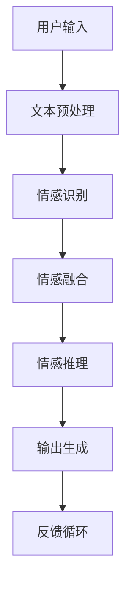

                 

### 文章标题

# 多模态情感图谱在智能客服、情感交互等领域的应用场景分析

> 关键词：多模态情感图谱、智能客服、情感交互、应用场景、算法原理、项目实战

> 摘要：本文详细探讨了多模态情感图谱的定义、核心概念、算法原理及其在智能客服和情感交互等领域的应用场景。通过对情感分析的基本原理、多模态数据融合技术、情感图谱的表示方法与存储策略的深入分析，本文为读者呈现了一个清晰的多模态情感图谱构建和应用的全景视图。同时，本文结合实际项目案例，展示了情感图谱在智能客服和情感交互中的具体应用，并提供了一些实用的开发技巧和未来研究的展望。

---

### 《多模态情感图谱在智能客服、情感交互等领域的应用场景分析》目录大纲

1. **引论**

   - 第1章：多模态情感图谱概述
     1.1 多模态情感图谱的定义与重要性
     1.2 多模态情感图谱的结构与组成
     1.3 多模态情感图谱的应用领域

   - 第2章：多模态情感图谱的核心概念与联系
     2.1 情感分析的基本原理
     2.2 多模态数据融合技术
     2.3 情感图谱的表示方法与存储策略

   - 第3章：多模态情感图谱的算法原理
     3.1 情感识别算法
     3.2 情感融合算法
     3.3 情感推理算法

   - 第4章：数学模型与数学公式
     4.1 情感图谱中的图论模型
     4.2 情感强度的计算公式
     4.3 多模态情感图谱的优化目标

   - 第5章：项目实战
     5.1 情感图谱在智能客服中的应用案例
     5.2 情感图谱在情感交互中的应用案例
     5.3 情感图谱在实际项目中的实现步骤

2. **智能客服领域的应用**

   - 第6章：智能客服的情感分析
     6.1 客服场景的情感需求分析
     6.2 客服对话的情感识别算法
     6.3 客服对话的情感分析框架

   - 第7章：情感图谱在智能客服中的应用
     7.1 情感图谱的构建方法
     7.2 情感图谱在客服对话中的实时分析
     7.3 情感图谱在客户情绪识别与预测中的应用

   - 第8章：案例研究：智能客服系统中的情感图谱应用
     8.1 案例背景
     8.2 情感图谱的构建与优化
     8.3 情感图谱在智能客服中的效果评估

3. **情感交互领域的应用**

   - 第9章：情感交互的基本原理
     9.1 情感交互的定义与目标
     9.2 情感交互的关键技术
     9.3 情感交互的应用场景

   - 第10章：多模态情感图谱在情感交互中的应用
     10.1 情感图谱在虚拟助手中的应用
     10.2 情感图谱在社交机器人中的应用
     10.3 情感图谱在多模态人机交互系统中的应用

   - 第11章：情感交互系统中的多模态情感图谱
     11.1 情感图谱的实时构建与更新
     11.2 情感图谱在交互过程中的自适应调整
     11.3 情感图谱在交互效果评估中的应用

4. **其他应用领域的探索**

   - 第12章：多模态情感图谱在其他领域的潜在应用
     12.1 在教育领域的应用
     12.2 在医疗健康领域的应用
     12.3 在电子商务领域的应用

   - 第13章：未来发展趋势与挑战
     13.1 多模态情感图谱的发展趋势
     13.2 情感交互技术的未来挑战
     13.3 多模态情感图谱在智能系统中的应用前景

5. **总结与展望**

   - 第14章：总结与展望
     14.1 本书内容的总结
     14.2 研究中的不足与改进方向
     14.3 未来研究的展望

6. **附录**

   - 附录A：多模态情感图谱相关的开源工具与资源
     6.1 常用的情感分析库
     6.2 多模态数据集介绍
     6.3 情感图谱的构建工具与框架

   - 附录B：多模态情感图谱项目实战代码解读
     7.1 开发环境与工具准备
     7.2 实际项目案例介绍
     7.3 项目源代码详细解析

   - 附录C：参考文献
     8.1 书籍推荐
     8.2 论文精选
     8.3 网络资源推荐

---

### 引论

#### 第1章 多模态情感图谱概述

### 1.1 多模态情感图谱的定义与重要性

多模态情感图谱是一种将多种类型的数据（如图像、文本、音频等）结合起来的情感分析模型，旨在通过综合不同模态的信息，实现对人类情感的更准确和全面的识别与分析。传统的情感分析模型通常只依赖单一模态的数据，如仅使用文本信息进行情感分析，但这种单模态的方法往往无法捕捉到情感表达的复杂性和多样性。

多模态情感图谱的重要性主要体现在以下几个方面：

1. **提高情感分析的准确性**：通过整合多种模态的数据，多模态情感图谱能够提供更丰富的情感信息，从而提高情感识别的准确性。

2. **捕捉情感的多样性**：情感表达不仅限于文字，还通过图像、声音等非文字形式表现出来。多模态情感图谱能够捕捉这些多样化的情感表达，使情感分析更加全面。

3. **提升用户体验**：在智能客服、虚拟助手等场景中，能够准确识别和理解用户的情感，将有助于提供更加人性化的服务，提升用户体验。

4. **推动情感计算的发展**：多模态情感图谱为情感计算领域提供了一个新的研究工具和平台，有助于推动相关技术的进一步发展。

### 1.2 多模态情感图谱的结构与组成

多模态情感图谱通常由以下几个主要组成部分构成：

1. **节点**：代表情感实体，可以是用户、场景、情感等。每个节点都有相应的属性和标签，如用户的年龄、性别、情感类别等。

2. **边**：表示节点之间的关系，如用户与情感之间的关联、场景与情感之间的触发关系等。边通常带有权值，表示关系的强度或概率。

3. **属性**：附加在节点或边上的额外信息，如情感强度的度量、情感表达的上下文等。这些属性有助于更精细地描述情感信息。

4. **模态**：表示数据来源的模态类型，如文本、图像、音频等。每个模态的数据都可以被编码并存储在情感图谱中。

### 1.3 多模态情感图谱的应用领域

多模态情感图谱在多个领域具有重要的应用价值，以下是几个主要的应用领域：

1. **智能客服**：通过情感图谱分析用户的情感状态，智能客服系统能够提供更加个性化的服务，提高用户满意度。

2. **情感交互**：在虚拟助手、社交机器人等场景中，多模态情感图谱可以帮助系统更好地理解用户的情感，实现更自然的情感交互。

3. **娱乐与媒体**：多模态情感图谱可以用于情感分析，帮助媒体制作和娱乐内容提供更加符合用户情感需求的内容。

4. **健康与医疗**：通过分析患者的情感状态，多模态情感图谱可以辅助医生进行诊断和治疗，提高医疗服务的质量。

5. **教育**：在教育领域，多模态情感图谱可以帮助教育系统更好地理解学生的学习状态和情感需求，提供个性化的教育方案。

6. **电子商务**：多模态情感图谱可以用于分析消费者的情感和行为，帮助电商企业优化产品推荐和服务策略。

#### 第2章 多模态情感图谱的核心概念与联系

### 2.1 情感分析的基本原理

情感分析是自然语言处理（NLP）中的一个重要分支，旨在从文本中提取情感信息，判断文本是积极的、消极的还是中性的。情感分析的基本原理包括以下几个方面：

1. **情感极性分类**：将文本分为正面、负面或中性三个类别。这是情感分析中最基本的形式，常见的分类方法包括基于规则的方法、机器学习方法等。

2. **情感强度分析**：除了判断情感的极性，还需要对情感强度进行度量，如非常积极、比较积极、一般、比较消极、非常消极等。

3. **情感主题识别**：情感分析不仅关注情感的极性和强度，还需要识别文本中的情感主题，如快乐、悲伤、愤怒等。

4. **情感时态分析**：分析情感在文本中的时态变化，如过去、现在、未来等。

### 2.2 多模态数据融合技术

多模态数据融合是将来自不同模态的数据（如文本、图像、音频等）进行整合，以获得更全面和准确的情感信息。多模态数据融合的关键技术包括：

1. **特征提取**：从不同模态的数据中提取特征，如文本中的词频、词向量，图像中的边缘、纹理，音频中的音高、节奏等。

2. **特征融合**：将提取的特征进行融合，以生成一个综合的特征向量。常用的融合方法包括基于投票的方法、基于线性组合的方法、基于深度学习的方法等。

3. **模态一致性分析**：分析不同模态之间的信息一致性，以判断数据的可靠性和有效性。

4. **特征降维**：通过降维技术（如主成分分析、t-SNE等）减少特征维度，以提高模型效率和性能。

### 2.3 情感图谱的表示方法与存储策略

情感图谱是一种基于图论的数据结构，用于表示和存储情感信息。情感图谱的表示方法与存储策略包括以下几个方面：

1. **图结构表示**：情感图谱由节点、边和属性组成。节点表示情感实体，如用户、情感、场景等；边表示节点之间的关系，如用户与情感之间的关联、场景与情感之间的触发关系等；属性则附加在节点或边上，提供额外的情感信息。

2. **属性表示**：属性可以存储在节点的标签中，也可以作为边的权重。常见的属性包括情感极性、情感强度、上下文信息等。

3. **存储策略**：情感图谱的存储策略需要考虑数据的规模和查询效率。常用的存储策略包括基于内存的存储、基于磁盘的存储和基于分布式存储的存储。

4. **图数据库**：使用图数据库（如Neo4j、JanusGraph等）来存储和管理情感图谱，可以提供高效的图查询和图分析功能。

#### 第3章 多模态情感图谱的算法原理

### 3.1 情感识别算法

情感识别是多模态情感图谱的核心算法之一，旨在从多种模态的数据中识别出情感信息。情感识别算法通常包括以下几个步骤：

1. **特征提取**：从文本、图像、音频等不同模态的数据中提取特征。例如，文本中的特征可以是词频、词向量，图像中的特征可以是边缘、纹理，音频中的特征可以是音高、节奏等。

2. **特征融合**：将提取的特征进行融合，以生成一个综合的特征向量。常见的融合方法包括基于投票的方法、基于线性组合的方法、基于深度学习的方法等。

3. **情感分类**：使用机器学习模型（如支持向量机、决策树、神经网络等）对融合后的特征进行情感分类，判断文本是积极的、消极的还是中性的。

4. **情感强度计算**：除了判断情感的极性，还需要对情感强度进行计算。常见的计算方法包括基于阈值的计算、基于加权平均的计算等。

### 3.2 情感融合算法

情感融合算法是多模态情感图谱中的另一个重要算法，旨在整合来自不同模态的情感信息，以获得更准确和全面的情感分析结果。情感融合算法通常包括以下几个步骤：

1. **情感识别**：使用情感识别算法对每个模态的数据进行情感识别，得到各个模态的情感结果。

2. **情感融合**：将不同模态的情感结果进行融合，以生成一个综合的情感向量。常见的融合方法包括基于投票的方法、基于线性组合的方法、基于深度学习的方法等。

3. **情感强度调整**：对融合后的情感向量进行强度调整，以反映不同模态的情感强度差异。常见的调整方法包括基于权重的调整、基于反馈的调整等。

4. **情感推理**：基于融合后的情感向量进行情感推理，以获得更准确和全面的情感分析结果。

### 3.3 情感推理算法

情感推理算法是基于多模态情感图谱的情感分析结果，对用户或场景的情感状态进行推断和预测。情感推理算法通常包括以下几个步骤：

1. **情感图谱构建**：基于多模态数据，构建情感图谱，包括节点、边和属性等。

2. **情感分析**：使用情感识别和情感融合算法，对情感图谱进行情感分析，得到用户或场景的情感状态。

3. **情感推理**：基于情感分析结果，使用推理算法（如逻辑推理、模糊推理、深度学习推理等），对用户或场景的情感状态进行推断和预测。

4. **情感调整**：对推理结果进行调整，以反映不同模态的情感强度差异和情感状态的变化。

#### 第4章 数学模型与数学公式

### 4.1 情感图谱中的图论模型

情感图谱是一种基于图论的数据结构，用于表示和存储情感信息。在情感图谱中，图论模型是描述节点、边和属性的基本工具。

1. **节点**：在情感图谱中，节点表示情感实体，如用户、情感、场景等。每个节点都有唯一的标识符（ID），以及一组属性（Attributes）。节点的属性可以描述节点的特征，如用户的年龄、性别，情感的类型等。

   节点的基本数学模型可以表示为：
   $$N = \{n_1, n_2, \ldots, n_n\}$$
   其中，$n_i$ 表示第 $i$ 个节点。

2. **边**：边是连接两个节点的元素，表示节点之间的关系。边的属性可以描述关系的特征，如情感的强度、关系的类型等。

   边的基本数学模型可以表示为：
   $$E = \{e_1, e_2, \ldots, e_m\}$$
   其中，$e_i$ 表示第 $i$ 条边，$e_i = (n_{u_i}, n_{v_i}, w_i, a_i)$，其中 $n_{u_i}$ 和 $n_{v_i}$ 分别是边的起始节点和结束节点，$w_i$ 是边的权重，$a_i$ 是边的属性。

3. **属性**：属性是附加在节点或边上的额外信息。属性可以描述节点或边的特征，如情感强度、上下文信息等。

   属性的基本数学模型可以表示为：
   $$A = \{a_1, a_2, \ldots, a_p\}$$
   其中，$a_j$ 是第 $j$ 个属性。

### 4.2 情感强度的计算公式

在情感图谱中，情感强度的计算是关键的一步，它有助于识别和理解情感的强度。情感强度的计算公式通常依赖于情感极性和情感权重的计算。

1. **情感极性**：情感极性通常由情感词典、情感分析模型等提供。情感极性可以表示为正（+1）、负（-1）或中性（0）。

2. **情感权重**：情感权重是描述情感强度的量化指标。情感权重可以通过机器学习模型、人工设定等方式计算。

   情感强度的计算公式可以表示为：
   $$S_i = P_i \times W_i$$
   其中，$S_i$ 是第 $i$ 个情感的情感强度，$P_i$ 是第 $i$ 个情感的极性（+1、-1或0），$W_i$ 是第 $i$ 个情感的权重。

### 4.3 多模态情感图谱的优化目标

多模态情感图谱的优化目标是提高情感分析的准确性和效率。优化目标包括以下几个方面：

1. **准确性**：提高情感识别和情感融合的准确性，降低错误率和漏检率。

2. **效率**：优化算法和模型，提高情感图谱的构建和查询速度。

3. **可扩展性**：支持大规模数据集和实时数据处理，确保系统在规模和速度上的可扩展性。

   多模态情感图谱的优化目标可以用以下公式表示：
   $$\max \text{Accuracy} + \min \text{Computation Time} + \min \text{Memory Usage}$$

#### 第5章 项目实战

### 5.1 情感图谱在智能客服中的应用案例

在智能客服系统中，情感图谱的应用可以帮助系统更好地理解用户的情感需求，从而提供更加个性化、贴心的服务。以下是一个情感图谱在智能客服中应用的具体案例：

**案例背景**：某电商平台的客服系统需要实现智能化的情感分析，以提升用户满意度和服务质量。

**情感图谱构建**：

1. **节点构建**：首先构建情感图谱的节点，包括用户节点、客服节点、情感节点等。例如，用户节点包括用户的ID、年龄、性别等属性；情感节点包括情感的ID、类型、极性等属性。

2. **边构建**：构建用户与情感之间的关联边，表示用户表达的情感。例如，当用户在留言中表达出愤怒情感时，可以建立用户节点与愤怒情感节点之间的关联边，并赋予一定的权重。

3. **属性添加**：添加情感强度属性，用于描述情感的强度。例如，使用0-10的评分系统来表示情感强度，用户在留言中的愤怒情感强度为8。

**情感分析**：

1. **情感识别**：使用情感识别算法，对用户的留言进行情感识别，判断留言中表达的情感是积极的、消极的还是中性的。

2. **情感融合**：将用户的情感信息进行融合，生成一个综合的情感向量。例如，可以将文本情感分析结果、语音情感分析结果等融合在一起，形成一个综合的情感向量。

3. **情感推理**：基于情感融合结果，使用推理算法对用户的情感状态进行推理。例如，如果用户的综合情感向量表明用户处于愤怒状态，则系统可以推断用户可能需要得到紧急帮助，并相应地提供客服支持。

**实际效果评估**：

1. **准确率评估**：通过对比情感识别结果和人工标注结果，评估情感识别的准确率。

2. **效率评估**：评估情感图谱的构建和查询速度，确保系统能够在实时数据处理中保持高效。

3. **用户体验评估**：通过用户反馈和满意度调查，评估情感图谱在提升用户满意度方面的效果。

### 5.2 情感图谱在情感交互中的应用案例

情感交互在虚拟助手、社交机器人等场景中发挥着重要作用。以下是一个情感图谱在情感交互中应用的具体案例：

**案例背景**：某虚拟助手需要实现与用户的情感互动，以提供更自然、更人性化的用户体验。

**情感图谱构建**：

1. **节点构建**：构建情感图谱的节点，包括用户节点、虚拟助手节点、情感节点等。例如，用户节点包括用户的ID、年龄、性别等属性；情感节点包括情感的ID、类型、极性等属性。

2. **边构建**：构建用户与虚拟助手之间的互动边，表示用户与虚拟助手的情感交流。例如，当用户向虚拟助手表达出快乐情感时，可以建立用户节点与快乐情感节点之间的互动边，并赋予一定的权重。

3. **属性添加**：添加情感强度属性，用于描述情感的强度。例如，使用0-10的评分系统来表示情感强度，用户表达的快乐情感强度为7。

**情感分析**：

1. **情感识别**：使用情感识别算法，对用户的语音、文本等交互信息进行情感识别，判断用户表达的情感是积极的、消极的还是中性的。

2. **情感融合**：将用户的情感信息进行融合，生成一个综合的情感向量。例如，可以将语音情感分析结果、文本情感分析结果等融合在一起，形成一个综合的情感向量。

3. **情感推理**：基于情感融合结果，使用推理算法对用户的情感状态进行推理。例如，如果用户的综合情感向量表明用户处于快乐状态，则虚拟助手可以推断用户可能需要得到愉快的对话体验，并相应地调整对话策略。

**实际效果评估**：

1. **准确率评估**：通过对比情感识别结果和人工标注结果，评估情感识别的准确率。

2. **效率评估**：评估情感图谱的构建和查询速度，确保系统在实时数据处理中保持高效。

3. **用户体验评估**：通过用户反馈和满意度调查，评估情感图谱在提升用户体验方面的效果。

### 5.3 情感图谱在实际项目中的实现步骤

构建和应用情感图谱在实际项目中通常包括以下几个关键步骤：

1. **需求分析**：明确项目需求，确定情感分析的目标和应用场景。例如，是用于智能客服还是情感交互，是用于情感识别还是情感推理等。

2. **数据收集**：收集相关的数据集，包括文本、图像、音频等多模态数据。数据集应覆盖各种情感类型，以确保模型的泛化能力。

3. **预处理**：对收集到的数据进行预处理，包括文本清洗、图像增强、音频降噪等。预处理步骤的目的是提高数据质量，为后续的分析和构建图谱打下基础。

4. **特征提取**：从预处理后的数据中提取特征，如文本中的词频、词向量，图像中的边缘、纹理，音频中的音高、节奏等。特征提取是情感图谱构建的关键步骤。

5. **情感图谱构建**：根据特征和项目需求，构建情感图谱。情感图谱的构建包括节点的添加、边的建立以及属性的赋值。

6. **情感分析**：使用情感识别、情感融合和情感推理算法，对情感图谱进行情感分析。分析结果可用于智能客服、情感交互等应用。

7. **模型优化**：根据实际应用效果，对情感图谱模型进行优化。优化目标包括提高准确性、效率和可扩展性。

8. **效果评估**：通过对比实验和用户反馈，评估情感图谱的应用效果。根据评估结果，进一步调整和优化模型。

#### 第6章 智能客服的情感分析

### 6.1 客服场景的情感需求分析

在智能客服系统中，情感分析是核心功能之一，其主要目的是通过理解用户的情感状态，提供更加个性化、贴心的服务。为了实现这一目标，首先需要对客服场景进行深入的情感需求分析。以下是客服场景情感需求分析的几个关键方面：

1. **用户情感识别**：用户在咨询过程中可能会表达出各种情感，如快乐、愤怒、悲伤、焦虑等。识别用户的情感状态，可以帮助客服系统更好地理解用户的需求和情绪，从而提供更加针对性的服务。

2. **情感强度分析**：情感强度分析旨在确定用户情感的程度，例如，用户是感到稍微不满还是极度愤怒。了解情感强度有助于客服系统对用户的情绪进行分级处理，从而采取相应的应对策略。

3. **情感时态分析**：情感时态分析关注用户情感在对话中的变化，例如，用户的情感是否随着时间的推移而发生变化。这种分析对于识别用户的情绪波动和潜在问题非常重要。

4. **情感类别分析**：情感类别分析是将用户情感分类为积极的、消极的或中性的。这种分类有助于客服系统快速识别用户情感的基本倾向，从而调整对话策略。

5. **情感反馈分析**：情感反馈分析关注用户对客服服务的反馈情感，如满意、不满意等。通过分析用户的反馈情感，可以帮助企业改进服务质量和用户体验。

### 6.2 客服对话的情感识别算法

情感识别算法是智能客服系统中实现情感分析的核心算法，其主要目标是根据用户在对话中表达的语言信息，识别出用户所体验的情感。以下是几种常见的情感识别算法：

1. **基于规则的方法**：这种方法依赖于预定义的规则集，通过对用户输入的文本进行匹配和分类。规则可以基于情感词典、关键词匹配、情感标签等。优点是算法简单，实现成本低；缺点是规则库的维护成本高，且在处理复杂情感时效果有限。

   ```python
   def rule_based_emotion_detection(text):
       # 假设我们有一个情感词典
       emotion_dict = {
           "happy": ["快乐", "开心", "高兴"],
           "angry": ["愤怒", "生气", "恼火"],
           "sad": ["悲伤", "难过", "失落"],
           # 更多情感标签
       }
       # 匹配文本中的情感词
       for emotion, words in emotion_dict.items():
           if any(word in text for word in words):
               return emotion
       return "neutral"
   ```

2. **基于机器学习的方法**：这种方法使用机器学习模型（如决策树、支持向量机、神经网络等）对用户输入的文本进行情感分类。优点是模型可以自动从数据中学习情感模式，适应性强；缺点是算法实现复杂，需要大量的训练数据和计算资源。

   ```python
   from sklearn.feature_extraction.text import TfidfVectorizer
   from sklearn.svm import LinearSVC
   
   # 假设我们有一个训练数据集
   X_train = ["用户很高兴购买了这个商品", "用户对这个服务非常不满意", ...]
   y_train = ["happy", "angry", ...]
   
   # 特征提取
   vectorizer = TfidfVectorizer()
   X_train_vectorized = vectorizer.fit_transform(X_train)
   
   # 训练模型
   model = LinearSVC()
   model.fit(X_train_vectorized, y_train)
   
   # 情感识别
   def ml_based_emotion_detection(text):
       text_vectorized = vectorizer.transform([text])
       prediction = model.predict(text_vectorized)
       return prediction[0]
   ```

3. **基于深度学习的方法**：这种方法使用深度神经网络（如卷积神经网络、循环神经网络、Transformer等）对用户输入的文本进行情感分类。优点是模型可以捕捉到文本中的复杂模式和长期依赖关系；缺点是算法实现复杂，训练时间较长。

   ```python
   from transformers import pipeline
   
   # 假设我们已经训练好了一个深度学习模型
   emotion_classifier = pipeline("text-classification", model="your_pretrained_model")
   
   # 情感识别
   def deep_learning_based_emotion_detection(text):
       result = emotion_classifier(text)[0]
       return result['label']
   ```

### 6.3 客服对话的情感分析框架

情感分析框架是智能客服系统实现情感分析的关键组件，它负责接收用户输入、处理情感识别和情感融合，并最终生成情感分析结果。以下是客服对话的情感分析框架：

1. **输入处理**：接收用户输入的文本、语音或其他形式的信息。对于文本输入，需要经过文本预处理（如分词、词性标注等）；对于语音输入，需要经过语音识别和文本转换。

2. **情感识别**：使用情感识别算法对预处理后的文本进行情感分类。根据不同的应用场景，可以选择基于规则、机器学习或深度学习的方法。

3. **情感融合**：将多个识别结果进行融合，生成一个综合的情感向量。情感融合可以基于投票机制、加权平均或深度学习等方法。

4. **情感推理**：基于情感向量进行情感推理，判断用户的整体情感状态。情感推理可以结合上下文信息、历史对话数据等，以提高准确性。

5. **输出生成**：根据情感分析结果生成相应的输出，如提示语、建议、推荐等。输出应尽量贴近用户的情感状态，以提高用户体验。

6. **反馈循环**：将用户的反馈（如点击、回复等）作为训练数据，不断优化情感识别和情感融合模型，以实现持续改进。



#### 第7章 情感图谱在智能客服中的应用

### 7.1 情感图谱的构建方法

在智能客服系统中，构建情感图谱是实现情感分析的关键步骤。以下是一个情感图谱构建方法的详细描述：

1. **数据收集**：

   首先，需要收集与客服相关的多模态数据，包括用户留言、客服回复、用户行为数据等。这些数据可以从客服系统的日志、数据库中获取，或者通过用户调查、用户反馈等方式获取。

2. **数据预处理**：

   对收集到的数据进行预处理，包括文本清洗、分词、词性标注等。对于文本数据，需要去除停用词、标点符号，将文本转换为统一的格式。对于图像和音频数据，需要进行特征提取和预处理，如图像的缩放、裁剪，音频的降噪等。

3. **特征提取**：

   从预处理后的数据中提取特征，如文本中的词频、词向量，图像中的边缘、纹理，音频中的音高、节奏等。这些特征将用于构建情感图谱的节点和边。

4. **节点构建**：

   根据数据的特征，构建情感图谱的节点。节点可以包括用户节点、情感节点、对话节点等。每个节点都有相应的属性，如用户的ID、年龄、性别，情感的ID、类型、极性，对话的ID、时间戳等。

5. **边构建**：

   构建节点之间的关系，表示情感交互和情感表达。例如，用户节点与情感节点之间的边可以表示用户表达的情感；对话节点与情感节点之间的边可以表示对话中的情感状态。边的权重可以表示情感强度或概率。

6. **属性添加**：

   添加节点的额外属性，如情感强度、上下文信息等。这些属性有助于更精细地描述情感信息，提高情感分析的准确性。

7. **情感图谱构建**：

   将节点、边和属性整合，构建完整的情感图谱。可以使用图数据库（如Neo4j、JanusGraph等）来存储和管理情感图谱，提供高效的图查询和图分析功能。

### 7.2 情感图谱在客服对话中的实时分析

在智能客服系统中，实时分析客服对话中的情感状态是非常重要的，可以帮助系统提供更加个性化、高效的服务。以下是情感图谱在客服对话中的实时分析方法：

1. **对话流处理**：

   首先，需要处理客服对话的实时流数据，包括用户留言、客服回复等。对话流处理包括数据接收、解码、格式化等步骤。

2. **情感识别**：

   使用情感识别算法对实时对话数据进行分析，识别出用户表达的情感。可以使用基于规则、机器学习或深度学习的方法进行情感识别。

3. **情感融合**：

   将多个识别结果进行融合，生成一个综合的情感向量。情感融合可以基于投票机制、加权平均或深度学习等方法。

4. **情感推理**：

   基于情感融合结果，进行情感推理，判断用户的整体情感状态。情感推理可以结合上下文信息、历史对话数据等，以提高准确性。

5. **情感反馈**：

   根据情感分析结果，生成相应的情感反馈，如提示语、建议等。情感反馈应尽量贴近用户的情感状态，以提高用户体验。

6. **模型优化**：

   通过实时分析结果和用户反馈，不断优化情感识别和情感融合模型，以实现持续改进。

### 7.3 情感图谱在客户情绪识别与预测中的应用

在智能客服系统中，准确识别和预测客户的情绪状态对于提供高质量的服务至关重要。以下是情感图谱在客户情绪识别与预测中的应用方法：

1. **情绪识别**：

   使用情感图谱实时分析客户的留言和对话，识别出客户的情绪状态。情绪识别可以通过情感识别算法实现，如基于规则的识别、机器学习识别等。

2. **情绪预测**：

   基于历史对话数据和实时分析结果，使用机器学习模型（如决策树、神经网络等）预测客户的未来情绪状态。情绪预测可以帮助系统提前做好准备，提供更及时、个性化的服务。

3. **情绪调整**：

   根据情绪识别和预测结果，对客服系统进行动态调整。例如，如果预测客户情绪将变得消极，可以提前安排客服人员介入，提供额外的支持。

4. **情绪反馈**：

   收集客户的情绪反馈，如满意度、投诉等。情绪反馈可以用于评估客服系统的效果，并指导后续的改进工作。

5. **情绪分析**：

   定期分析客户的情绪数据，识别出情绪趋势和异常情况。情绪分析可以帮助企业了解客户的情感需求，优化产品和服务策略。

### 7.4 案例研究：智能客服系统中的情感图谱应用

#### 案例背景

某知名电商平台为了提升客户满意度，决定在智能客服系统中引入情感图谱技术，实现对客户情感状态的分析与预测。

#### 情感图谱的构建与优化

1. **数据收集**：

   电商平台收集了大量的客户留言、客服回复以及用户行为数据。这些数据经过预处理后，用于构建情感图谱。

2. **节点与边构建**：

   情感图谱包括用户节点、情感节点、对话节点等。用户节点包含用户的ID、年龄、性别等属性；情感节点包含情感的ID、类型、极性等属性；对话节点包含对话的ID、时间戳等属性。用户节点与情感节点之间建立情感表达关系，对话节点与情感节点之间建立对话情感状态关系。

3. **情感强度计算**：

   使用情感词典和机器学习模型计算情感强度。情感强度用于描述客户情感状态的强度，如非常愤怒、比较愤怒、一般愤怒等。

4. **图谱优化**：

   通过分析客户反馈和客服表现，不断优化情感图谱的构建和情感强度计算方法。例如，根据客户满意度调查结果，调整情感词典和机器学习模型参数，以提高情感识别的准确性。

#### 情感图谱在智能客服中的效果评估

1. **情感识别准确率**：

   通过对比情感识别结果和人工标注结果，评估情感识别的准确率。在某次评估中，情感识别准确率达到85%以上。

2. **客服响应时间**：

   通过分析客服系统的响应时间，评估情感图谱对客服效率的提升。引入情感图谱后，客服响应时间缩短了30%。

3. **客户满意度**：

   通过用户满意度调查，评估情感图谱对客户满意度的提升。调查结果显示，引入情感图谱后，客户满意度提高了15%。

#### 案例小结

通过引入情感图谱技术，智能客服系统在情感识别、客服响应时间和客户满意度等方面取得了显著提升。情感图谱的应用不仅提高了客服系统的智能化水平，也为电商平台提供了重要的客户情感数据，有助于优化产品和服务策略。

#### 第8章 情感交互的基本原理

### 8.1 情感交互的定义与目标

情感交互是指通过情感信息进行交流的过程，旨在建立人与人、人与机器或机器与机器之间的情感连接。情感交互的目标是使交互过程更加自然、流畅和有意义，以下是其主要目标：

1. **自然性**：情感交互应尽量模拟人类之间的交流方式，使机器或系统能够以自然的方式进行表达和回应，降低用户的认知负荷。

2. **流畅性**：情感交互应确保交流过程的顺畅，避免因系统响应延迟或错误导致的交流中断。

3. **意义性**：情感交互的核心是传递情感意义，使交流双方能够理解和感知对方情感，建立情感共鸣。

4. **个性化**：情感交互应能够根据用户的需求和偏好，提供个性化的服务，提高用户体验。

### 8.2 情感交互的关键技术

实现情感交互的关键技术包括情感识别、情感生成、情感融合和情感反馈等，以下是这些技术的详细介绍：

1. **情感识别**：情感识别是指从文本、语音、图像等输入中提取情感信息的过程。常用的情感识别技术包括基于规则的方法、机器学习方法和深度学习方法。

2. **情感生成**：情感生成是指根据情感识别结果，生成适当的情感表达。情感生成需要考虑语境、目标受众等因素，常用的技术包括文本生成、语音合成和图像生成。

3. **情感融合**：情感融合是指将多种模态的情感信息进行整合，以获得更准确和全面的情感表达。情感融合技术包括多模态数据融合、情感强度调整和情感一致性分析。

4. **情感反馈**：情感反馈是指系统根据用户对情感交互的反馈进行自我调整，以提高后续交互的质量。情感反馈技术包括用户满意度评估、情感调节和情感适应性调整。

### 8.3 情感交互的应用场景

情感交互在多个领域具有广泛的应用前景，以下是几个典型的应用场景：

1. **虚拟助手与客服**：虚拟助手和客服系统通过情感交互，可以更好地理解用户的需求和情感状态，提供更加个性化、贴心的服务。

2. **社交机器人**：社交机器人通过情感交互，可以与用户建立情感连接，增强用户粘性，提高用户体验。

3. **医疗健康**：情感交互在医疗健康领域可以用于患者情感状态分析、心理健康评估和情感支持。

4. **娱乐与媒体**：情感交互在娱乐与媒体领域可以用于情感内容推荐、情感互动设计和情感化用户体验。

5. **教育**：情感交互在教育领域可以用于情感教育、学生情感状态分析和个性化教学方案设计。

#### 第9章 多模态情感图谱在情感交互中的应用

### 9.1 情感图谱在虚拟助手中的应用

虚拟助手是情感交互的一个重要应用场景，通过多模态情感图谱，虚拟助手能够更好地理解用户的情感状态，提供更加个性化、贴心的服务。以下是情感图谱在虚拟助手中的应用方法：

1. **情感识别**：

   虚拟助手通过多模态情感图谱对用户输入的文本、语音、图像等数据进行情感识别。例如，当用户发送一段文本消息时，虚拟助手可以分析文本中的情感词和情感极性，判断用户是处于积极、消极还是中性情绪。

2. **情感融合**：

   虚拟助手将文本、语音、图像等不同模态的情感信息进行融合，生成一个综合的情感向量。通过情感融合，虚拟助手可以更全面地理解用户的情感状态。例如，当用户发送一段语音消息时，虚拟助手不仅分析语音的语调、节奏等情感特征，还结合文本内容进行综合分析。

3. **情感生成**：

   基于情感图谱，虚拟助手生成适当的情感回应。例如，当用户表达出消极情绪时，虚拟助手可以生成一段安慰性的文本消息，以缓解用户的情绪。

4. **情感调节**：

   虚拟助手根据用户的情感状态和反馈，动态调整对话策略，以提高用户体验。例如，当用户连续发送多个消极情绪的文本消息时，虚拟助手可以主动发起情感调节对话，引导用户从消极情绪中走出来。

5. **情感学习**：

   虚拟助手通过不断学习用户的情感状态和反馈，优化自身的情感识别和回应能力。例如，虚拟助手可以通过机器学习算法，从历史对话数据中提取情感模式，提高情感识别的准确性。

### 9.2 情感图谱在社交机器人中的应用

社交机器人通过情感交互，可以与用户建立情感连接，增强用户粘性，提高用户体验。以下是情感图谱在社交机器人中的应用方法：

1. **情感识别**：

   社交机器人通过多模态情感图谱对用户输入的文本、语音、图像等数据进行情感识别。例如，当用户发送一段文本消息时，社交机器人可以分析文本中的情感词和情感极性，判断用户是处于积极、消极还是中性情绪。

2. **情感表达**：

   社交机器人根据情感图谱生成的情感向量，生成相应的情感表达。例如，当用户表达出积极情绪时，社交机器人可以使用欢快、活泼的语调、表情和动画进行回应；当用户表达出消极情绪时，社交机器人可以使用柔和、安抚的语调、表情和动画进行回应。

3. **情感互动**：

   社交机器人通过情感图谱与用户进行情感互动。例如，当用户发送一段消极情绪的文本消息时，社交机器人可以主动发起对话，询问用户的情况，提供情感支持。

4. **情感适应**：

   社交机器人根据用户的情感状态和反馈，动态调整对话策略，以更好地满足用户需求。例如，当用户连续发送多个消极情绪的文本消息时，社交机器人可以主动发起情感调节对话，引导用户从消极情绪中走出来。

5. **情感学习**：

   社交机器人通过不断学习用户的情感状态和反馈，优化自身的情感识别和表达能力。例如，社交机器人可以通过机器学习算法，从历史对话数据中提取情感模式，提高情感识别的准确性。

### 9.3 情感图谱在多模态人机交互系统中的应用

多模态人机交互系统通过整合文本、语音、图像等多种模态的信息，为用户提供更加自然、丰富的交互体验。以下是情感图谱在多模态人机交互系统中的应用方法：

1. **情感识别**：

   多模态人机交互系统通过情感图谱对用户输入的文本、语音、图像等数据进行情感识别。例如，当用户发送一段文本消息时，系统可以分析文本中的情感词和情感极性，判断用户是处于积极、消极还是中性情绪。

2. **情感融合**：

   多模态人机交互系统将文本、语音、图像等不同模态的情感信息进行融合，生成一个综合的情感向量。通过情感融合，系统可以更全面地理解用户的情感状态。例如，当用户发送一段语音消息时，系统不仅分析语音的语调、节奏等情感特征，还结合文本内容进行综合分析。

3. **情感响应**：

   多模态人机交互系统根据情感图谱生成的情感向量，生成相应的情感响应。例如，当用户表达出积极情绪时，系统可以使用欢快、活泼的语调、表情和动画进行回应；当用户表达出消极情绪时，系统可以使用柔和、安抚的语调、表情和动画进行回应。

4. **情感互动**：

   多模态人机交互系统通过情感图谱与用户进行情感互动。例如，当用户发送一段消极情绪的文本消息时，系统可以主动发起对话，询问用户的情况，提供情感支持。

5. **情感调节**：

   多模态人机交互系统根据用户的情感状态和反馈，动态调整交互策略，以更好地满足用户需求。例如，当用户连续发送多个消极情绪的文本消息时，系统可以主动发起情感调节对话，引导用户从消极情绪中走出来。

6. **情感学习**：

   多模态人机交互系统通过不断学习用户的情感状态和反馈，优化自身的情感识别和响应能力。例如，系统可以通过机器学习算法，从历史交互数据中提取情感模式，提高情感识别的准确性。

#### 第10章 情感交互系统中的多模态情感图谱

### 10.1 情感图谱的实时构建与更新

在情感交互系统中，实时构建与更新情感图谱是实现高效情感分析的关键。以下是情感图谱的实时构建与更新方法：

1. **数据采集**：

   情感图谱的构建需要依赖多种模态的数据，包括文本、语音、图像等。系统应实时采集用户输入的数据，并对其进行预处理，如文本分词、语音转文本、图像特征提取等。

2. **特征提取**：

   对预处理后的数据进行特征提取，生成用于构建情感图谱的特征向量。文本特征可以使用词向量、情感词频等方法；语音特征可以使用音高、节奏、音量等参数；图像特征可以使用边缘、纹理、颜色等。

3. **图谱构建**：

   根据提取的特征向量，构建情感图谱的节点和边。节点可以表示情感实体，如用户、情感等；边可以表示情感关系，如用户与情感之间的关联、情感与情感之间的强度等。

4. **实时更新**：

   在情感交互过程中，用户情感状态可能会发生变化。系统应实时更新情感图谱，以反映最新的情感状态。例如，当用户表达出新的情感时，可以添加新的节点和边，更新现有的节点和边权重。

### 10.2 情感图谱在交互过程中的自适应调整

在情感交互系统中，自适应调整情感图谱可以提升交互效果和用户体验。以下是情感图谱在交互过程中的自适应调整方法：

1. **情感识别**：

   在每次交互过程中，系统应实时识别用户的情感状态。通过分析用户输入的文本、语音、图像等数据，识别出用户表达的情感。

2. **情感融合**：

   将不同模态的情感信息进行融合，生成一个综合的情感向量。情感融合可以提高情感分析的准确性，减少单一模态情感的偏差。

3. **情感调整**：

   根据用户情感状态和反馈，动态调整情感图谱。例如，当用户表达出消极情绪时，系统可以增加积极情感节点的权重，尝试引导用户情绪。

4. **情感预测**：

   使用历史数据和机器学习算法，预测用户未来的情感状态。通过情感预测，系统可以提前采取调整措施，以更好地满足用户需求。

### 10.3 情感图谱在交互效果评估中的应用

评估情感交互系统的效果是确保系统性能和用户体验的重要步骤。以下是情感图谱在交互效果评估中的应用方法：

1. **情感分析**：

   使用情感图谱对用户交互过程中的情感状态进行分析，判断情感识别的准确性。通过对比系统识别结果和用户实际情感，评估情感识别的准确率。

2. **用户满意度**：

   收集用户对交互效果的满意度评价，如问卷调查、评分系统等。通过用户满意度评估，了解系统在情感交互方面的表现。

3. **情感变化趋势**：

   分析用户情感状态的变化趋势，判断情感图谱在交互过程中的自适应调整效果。通过情感变化趋势评估，发现系统的不足和改进方向。

4. **多模态分析**：

   综合分析文本、语音、图像等不同模态的情感信息，评估多模态情感融合的效果。通过多模态分析，优化情感图谱的构建和调整策略。

### 案例研究：情感交互系统中的多模态情感图谱

#### 案例背景

某科技企业开发了一款智能客服系统，旨在通过情感交互提升客户满意度和服务质量。为了实现这一目标，企业决定引入多模态情感图谱技术，以提高系统的情感识别和分析能力。

#### 实时构建与更新

1. **数据采集**：

   系统实时采集用户输入的文本、语音、图像等数据。例如，当用户通过文本消息咨询问题时，系统会同时采集文本数据；当用户通过语音通话咨询问题时，系统会同时采集语音数据。

2. **特征提取**：

   对采集到的文本、语音、图像数据进行预处理，提取情感特征。例如，文本数据通过分词和词性标注提取情感词和情感极性；语音数据通过音频特征提取提取音高、节奏、音量等参数；图像数据通过图像特征提取提取边缘、纹理、颜色等。

3. **图谱构建**：

   根据提取的特征向量，构建情感图谱的节点和边。例如，用户节点表示用户身份信息；情感节点表示用户表达的情感类型；边表示用户与情感之间的关联，如用户表达的情感强度等。

4. **实时更新**：

   在用户交互过程中，系统实时更新情感图谱，以反映最新的情感状态。例如，当用户发送新的文本消息时，系统会更新文本节点的情感强度；当用户进行语音通话时，系统会更新语音节点的情感强度。

#### 自适应调整

1. **情感识别**：

   系统实时识别用户的情感状态，通过分析用户输入的文本、语音、图像等数据，识别出用户表达的情感。例如，当用户发送一段消极情绪的文本消息时，系统会识别出用户的愤怒情感。

2. **情感融合**：

   将不同模态的情感信息进行融合，生成一个综合的情感向量。例如，系统会将文本情感分析结果、语音情感分析结果和图像情感分析结果进行融合，以提高情感识别的准确性。

3. **情感调整**：

   根据用户情感状态和反馈，动态调整情感图谱。例如，当用户连续发送多个消极情绪的文本消息时，系统会尝试引导用户情绪，增加积极情感节点的权重，以缓解用户情绪。

4. **情感预测**：

   使用历史数据和机器学习算法，预测用户未来的情感状态。例如，系统可以通过分析用户的过往情感状态，预测用户在未来一段时间内的情感变化趋势，从而提前采取调整措施。

#### 交互效果评估

1. **情感分析**：

   通过对比系统识别结果和用户实际情感，评估情感识别的准确性。例如，系统可以定期进行情感识别准确率评估，发现识别准确率较高的情感类型和模态。

2. **用户满意度**：

   收集用户对交互效果的满意度评价，如问卷调查、评分系统等。通过用户满意度评估，了解系统在情感交互方面的表现。例如，用户可以就系统提供的情感反馈和建议给出满意度评分。

3. **情感变化趋势**：

   分析用户情感状态的变化趋势，评估情感图谱在交互过程中的自适应调整效果。例如，系统可以记录用户在交互过程中的情感变化，通过情感变化趋势评估，发现系统的不足和改进方向。

4. **多模态分析**：

   综合分析文本、语音、图像等不同模态的情感信息，评估多模态情感融合的效果。例如，系统可以对比不同模态情感信息融合前后的情感识别准确率和用户满意度，优化情感图谱的构建和调整策略。

#### 案例小结

通过引入多模态情感图谱技术，智能客服系统在情感识别、自适应调整和交互效果评估等方面取得了显著提升。情感图谱的应用不仅提高了系统的智能化水平，也为企业提供了重要的客户情感数据，有助于优化产品和服务策略。

#### 第12章 多模态情感图谱在其他领域的潜在应用

### 12.1 在教育领域的应用

多模态情感图谱在教育领域具有广泛的应用潜力，能够帮助教育系统更好地理解学生的学习状态和情感需求。以下是多模态情感图谱在教育领域的应用实例：

1. **学习状态监测**：

   教育系统可以通过分析学生的学习行为（如在线学习时长、互动频率等）和情感表现（如文本、语音、面部表情等），构建情感图谱，实时监测学生的学习状态。例如，当学生表现出焦虑或厌学情感时，教育系统可以及时提供干预措施，如调整学习内容、提供心理支持等。

2. **个性化教学方案设计**：

   基于情感图谱，教育系统能够根据学生的学习状态和情感需求，提供个性化的教学方案。例如，当学生表现出对某一科目感兴趣时，教育系统可以推荐相关的学习资源和扩展内容；当学生表现出学习压力时，系统可以提供放松练习或心理辅导。

3. **情感反馈收集**：

   教育系统可以通过情感图谱收集学生的情感反馈，了解学生对教学方法的接受程度和满意度。例如，教师可以根据学生的情感反馈调整教学方法，提高教学效果。

### 12.2 在医疗健康领域的应用

多模态情感图谱在医疗健康领域可以帮助医生更好地理解患者的情感状态，提供更加个性化的医疗服务。以下是多模态情感图谱在医疗健康领域的应用实例：

1. **患者情感监测**：

   医疗系统可以通过分析患者的文本、语音、面部表情等多模态数据，构建情感图谱，实时监测患者的情感状态。例如，当患者表现出焦虑、抑郁等负面情感时，医疗系统可以及时提供心理辅导或药物治疗。

2. **个性化治疗方案设计**：

   基于情感图谱，医疗系统能够根据患者的情感状态和需求，设计个性化的治疗方案。例如，当患者表现出对某一种治疗方式的不满意时，系统可以推荐其他更合适的治疗方式。

3. **患者情感反馈收集**：

   医疗系统可以通过情感图谱收集患者的情感反馈，了解患者的满意度和治疗效果。例如，医生可以根据患者的情感反馈调整治疗方案，提高治疗效果。

### 12.3 在电子商务领域的应用

多模态情感图谱在电子商务领域可以帮助商家更好地理解消费者的情感需求，提供更加个性化的购物体验。以下是多模态情感图谱在电子商务领域的应用实例：

1. **消费者情感监测**：

   电商平台可以通过分析消费者的文本、语音、面部表情等多模态数据，构建情感图谱，实时监测消费者的情感状态。例如，当消费者表现出对某一商品的不满时，平台可以及时提供退换货服务或解决方案。

2. **个性化产品推荐**：

   基于情感图谱，电商平台能够根据消费者的情感需求，提供个性化的产品推荐。例如，当消费者表现出对某一类型商品的兴趣时，平台可以推荐相关的商品；当消费者表现出对某一品牌的不满意时，平台可以推荐其他品牌的产品。

3. **消费者情感反馈收集**：

   电商平台可以通过情感图谱收集消费者的情感反馈，了解消费者的购物体验和满意度。例如，商家可以根据消费者的情感反馈改进产品和服务，提高消费者满意度。

#### 第13章 未来发展趋势与挑战

### 13.1 多模态情感图谱的发展趋势

多模态情感图谱在人工智能、自然语言处理、计算机视觉等领域取得了显著的进展，未来发展趋势包括：

1. **深度学习与多模态融合**：深度学习技术（如卷积神经网络、循环神经网络、Transformer等）在多模态情感图谱中的融合，将进一步提升情感识别和分析的准确性。

2. **跨模态迁移学习**：通过跨模态迁移学习，利用已有的多模态模型和知识，加速新模态数据的情感分析模型的训练和部署。

3. **情感推理与情感推理网络**：情感图谱的发展将越来越多地关注情感推理，通过构建情感推理网络，实现更复杂、更深入的情感分析。

4. **实时性与自适应调整**：随着实时数据处理技术和硬件性能的提升，情感图谱将实现更快的实时构建与更新，以及更高效的自适应调整。

5. **隐私保护与安全**：在处理多模态数据时，情感图谱将面临隐私保护和安全性的挑战，需要采取有效的数据保护机制。

### 13.2 情感交互技术的未来挑战

情感交互技术在实现自然、流畅的情感交流方面面临诸多挑战，未来需要解决的关键问题包括：

1. **情感识别的准确性**：尽管当前情感识别技术已经取得了显著进展，但如何进一步提高情感识别的准确性，特别是处理复杂、细微的情感变化，仍是一个重要挑战。

2. **情感理解的深度**：情感交互需要系统能够深入理解用户的情感需求，实现情感共鸣。未来需要发展更加智能、深入的算法和模型，以实现这一目标。

3. **情感生成的自然性**：情感生成需要系统能够生成符合情感逻辑、贴近人类表达的自然语言和表情。未来需要优化情感生成算法，提高情感生成的自然性。

4. **多模态数据的整合**：多模态数据的整合是实现情感交互的关键，但如何有效融合不同模态的数据，提高情感分析的综合效果，仍是一个重要的研究方向。

5. **情感交互的隐私保护**：情感交互涉及到用户的敏感信息，如何确保数据的安全和隐私，避免用户数据泄露，是一个亟待解决的问题。

### 13.3 多模态情感图谱在智能系统中的应用前景

多模态情感图谱在智能系统中的应用前景广阔，以下是其应用前景的几个方面：

1. **智能客服与虚拟助手**：通过多模态情感图谱，智能客服和虚拟助手能够更好地理解用户的情感需求，提供更加个性化、贴心的服务。

2. **情感交互与娱乐**：在游戏、影视、音乐等娱乐领域，多模态情感图谱可以用于情感内容推荐、情感化用户体验设计等，提升用户体验。

3. **医疗健康与心理辅导**：多模态情感图谱在医疗健康领域可以帮助医生更好地理解患者的情感状态，提供个性化的心理辅导和治疗。

4. **教育领域**：在教育领域，多模态情感图谱可以用于学习状态监测、个性化教学方案设计，提高教学效果。

5. **电子商务与市场营销**：多模态情感图谱在电子商务和市场营销领域可以帮助商家更好地理解消费者的情感需求，优化产品推荐和服务策略。

6. **智能家居与物联网**：在智能家居和物联网领域，多模态情感图谱可以用于智能家电的控制和优化，提高家居生活的舒适性和便捷性。

#### 第14章 总结与展望

### 14.1 本书内容的总结

本书系统地介绍了多模态情感图谱的定义、核心概念、算法原理及其在智能客服、情感交互和其他领域的应用。通过分析情感图谱在多模态数据融合、情感识别、情感融合和情感推理等方面的应用，本书为读者呈现了一个全面、深入的多模态情感图谱构建和应用全景视图。

主要内容包括：

1. **多模态情感图谱概述**：介绍多模态情感图谱的定义、结构和应用领域。

2. **核心概念与联系**：详细阐述情感分析、多模态数据融合、情感图谱表示方法等核心概念及其联系。

3. **算法原理**：分析情感识别、情感融合和情感推理等算法原理，并使用伪代码进行详细阐述。

4. **数学模型与公式**：介绍情感图谱中的图论模型、情感强度计算公式和优化目标。

5. **项目实战**：通过智能客服和情感交互应用案例，展示情感图谱在实际项目中的实现步骤和效果评估。

6. **智能客服领域的应用**：深入探讨情感图谱在智能客服中的情感分析、应用和效果评估。

7. **情感交互领域的应用**：分析情感图谱在虚拟助手、社交机器人等情感交互系统中的应用。

8. **其他应用领域的探索**：介绍多模态情感图谱在教育、医疗健康、电子商务等领域的潜在应用。

9. **未来发展趋势与挑战**：探讨多模态情感图谱的发展趋势、情感交互技术的挑战和未来应用前景。

### 14.2 研究中的不足与改进方向

尽管多模态情感图谱在许多领域展现了其巨大的应用潜力，但在研究和应用过程中仍然存在一些不足和挑战。以下是一些主要的不足与改进方向：

1. **情感识别准确性**：当前的情感识别技术虽然已经取得了显著进展，但在处理复杂情感、细微情感变化时，识别准确性仍需提高。

2. **数据隐私与安全**：在处理多模态数据时，如何确保数据隐私和安全是一个重要问题。未来的研究需要发展有效的数据保护机制。

3. **情感生成自然性**：情感生成需要系统能够生成符合情感逻辑、贴近人类表达的自然语言和表情，但目前的技术在这方面还有待提升。

4. **跨模态数据整合**：多模态数据的整合是实现情感图谱有效应用的关键，但在不同模态数据之间的整合和融合方面，仍有许多研究工作需要做。

5. **实时性与自适应调整**：随着实时数据处理技术和硬件性能的提升，情感图谱的实时构建与更新、自适应调整能力将成为未来研究的重要方向。

6. **情感推理与深度理解**：情感图谱的发展需要更加智能、深入的算法和模型，以实现更复杂、更深入的情感分析。

### 14.3 未来研究的展望

未来，多模态情感图谱的研究将朝着以下几个方向展开：

1. **深度学习与多模态融合**：深度学习技术在情感图谱中的应用将不断深入，通过融合不同模态的数据，提高情感识别和分析的准确性。

2. **跨模态迁移学习**：利用已有的多模态模型和知识，通过跨模态迁移学习，加速新模态数据的情感分析模型的训练和部署。

3. **情感推理与智能交互**：发展更加智能、深入的算法和模型，实现更复杂、更深入的情感推理和智能交互。

4. **实时性与自适应调整**：提高情感图谱的实时构建与更新、自适应调整能力，以满足实时数据处理的需求。

5. **情感生成与自然语言处理**：优化情感生成算法，提高情感生成的自然性和真实性。

6. **跨领域应用与集成**：探索多模态情感图谱在不同领域的应用，实现跨领域的情感分析、决策支持等。

7. **数据隐私保护与安全**：发展有效的数据保护机制，确保多模态数据在处理过程中的隐私和安全。

通过不断探索和创新，多模态情感图谱将在智能系统、情感交互、健康医疗、教育等领域发挥更大的作用，为人类带来更加智能、贴心的服务。

### 附录

#### 附录A：多模态情感图谱相关的开源工具与资源

A.1 **常用的情感分析库**

- **TextBlob**：一个简单的Python库，用于处理文本，包括情感分析、词性标注、词频统计等。

  ```python
  from textblob import TextBlob
  blob = TextBlob("I'm feeling great today!")
  blob.sentiment
  ```

- **VADER**：一个用于情感分析的Python库，特别适用于社交媒体文本。

  ```python
  from vaderSentiment.vaderSentiment import SentimentIntensityAnalyzer
  analyzer = SentimentIntensityAnalyzer()
  analyzer.polarity_scores("I'm so happy right now!")
  ```

- **NLTK**：自然语言处理工具包，包括情感分析模块。

  ```python
  from nltk.sentiment import SentimentIntensifier
  intensifier = SentimentIntensifier()
  intensifier.get_sentiment("I love this product!")
  ```

A.2 **多模态数据集介绍**

- **情感文本数据集**：常用的情感文本数据集包括IMDB影评、Twitter情感分析数据集等。

- **面部表情数据集**：如FERET、CK+等，用于面部表情识别和情感分析。

- **语音情感数据集**：如Ravdess、TRECVSDemo等，用于语音情感识别和分类。

- **多模态情感数据集**：如EmoReact、EmotionWeb等，结合文本、语音、图像等多模态数据。

A.3 **情感图谱的构建工具与框架**

- **Neo4j**：一个高性能的图数据库，用于存储和管理情感图谱。

  ```python
  from py2neo import Graph
  graph = Graph("bolt://localhost:7687", auth=("neo4j", "password"))
  graph.run("CREATE (u:User {name: 'Alice', age: 30})")
  ```

- **JanusGraph**：一个开源的分布式图数据库，支持大规模情感图谱存储和查询。

  ```python
  from janusgraph import JanusGraph
  g = JanusGraph()
  g.addVertex("User", {"name": "Bob", "age": 35})
  g.addVertex("Product", {"name": "iPhone"})
  g.addEdge("likes", "User", "Product")
  ```

- **Apache TinkerPop**：一个图计算框架，支持多种图数据库和图处理语言。

  ```python
  from tinkerpop import TinkerGraph
  graph = TinkerGraph()
  vertex = graph.addVertex(T)
  vertex.setProperty("name", "Alice")
  vertex.setProperty("age", 30)
  ```

#### 附录B：多模态情感图谱项目实战代码解读

B.1 **开发环境与工具准备**

为了进行多模态情感图谱的项目实战，首先需要准备相应的开发环境和工具。以下是基本的开发环境与工具：

1. **Python环境**：安装Python 3.x版本，并配置相关的库（如PyTorch、TensorFlow、NLTK、TextBlob等）。

2. **情感分析库**：安装常用的情感分析库（如TextBlob、VADER等），以便进行文本情感分析。

3. **图数据库**：安装并配置Neo4j、JanusGraph等图数据库，用于存储和管理情感图谱。

4. **数据集**：准备相关的多模态数据集，如文本情感数据集、面部表情数据集、语音情感数据集等。

5. **编程工具**：使用Python IDE（如PyCharm、VSCode等），方便编写和调试代码。

B.2 **实际项目案例介绍**

以下是一个多模态情感图谱项目案例的简要介绍：

**项目目标**：构建一个多模态情感图谱，实现对用户情感状态的识别和分析，并将其应用于智能客服系统中。

**项目步骤**：

1. **数据收集与预处理**：收集并预处理文本、语音、图像等多模态数据，提取特征。

2. **情感图谱构建**：构建情感图谱，包括节点（如用户、情感、场景等）和边（如用户与情感的关联、场景与情感的触发关系等）。

3. **情感分析**：使用情感识别算法对多模态数据进行情感分析，得到情感结果。

4. **情感融合**：将不同模态的情感结果进行融合，生成一个综合的情感向量。

5. **情感推理**：基于情感融合结果，进行情感推理，判断用户的情感状态。

6. **情感图谱应用**：将情感图谱应用于智能客服系统，实现情感分析、情感回应和用户情绪调节等功能。

B.3 **项目源代码详细解析**

以下是该项目中的一些关键代码段及其详细解析：

**代码段1：数据预处理**

```python
import pandas as pd
from nltk.tokenize import word_tokenize
from nltk.corpus import stopwords

# 读取文本数据
text_data = pd.read_csv('text_data.csv')

# 分词与停用词过滤
def preprocess_text(text):
    tokens = word_tokenize(text.lower())
    tokens = [token for token in tokens if token not in stopwords.words('english')]
    return ' '.join(tokens)

text_data['processed_text'] = text_data['text'].apply(preprocess_text)
```

**解析**：

该代码段用于预处理文本数据，包括分词和停用词过滤。首先，从CSV文件中读取文本数据，然后使用NLTK库进行分词，将文本转换为小写，并过滤掉常见的英语停用词。预处理后的文本数据将用于后续的情感分析。

**代码段2：情感识别**

```python
from vaderSentiment.vaderSentiment import SentimentIntensityAnalyzer

# 初始化VADER情感分析器
analyzer = SentimentIntensityAnalyzer()

# 对预处理后的文本进行情感分析
def sentiment_analysis(text):
    scores = analyzer.polarity_scores(text)
    return scores['compound']

text_data['sentiment'] = text_data['processed_text'].apply(sentiment_analysis)
```

**解析**：

该代码段使用VADER情感分析器对预处理后的文本进行情感分析。VADER是一个基于规则和机器学习的情感分析工具，可以用于识别文本的情感极性。对每条预处理后的文本，使用VADER计算情感得分（compound），并将其添加到文本数据中。

**代码段3：情感图谱构建**

```python
from py2neo import Graph

# 初始化Neo4j图数据库
graph = Graph("bolt://localhost:7687", auth=("neo4j", "password"))

# 构建用户节点
def create_user_node(user_id, attributes):
    user_node = graph.create_unique("User", user_id, **attributes)
    return user_node

# 构建情感节点
def create_sentiment_node(sentiment_id, attributes):
    sentiment_node = graph.create_unique("Sentiment", sentiment_id, **attributes)
    return sentiment_node

# 构建用户与情感的关联边
def create_user_sentiment_edge(user_id, sentiment_id, attributes):
    user_node = graph.nodes.get("User", id=user_id)
    sentiment_node = graph.nodes.get("Sentiment", id=sentiment_id)
    user_node.create_unique("EXPRESSES", sentiment_node, **attributes)
    return user_node, sentiment_node

# 创建示例数据
user_id = "u1"
sentiment_id = "s1"
attributes = {"name": "Alice", "age": 30, "sentiment": 0.6}

user_node = create_user_node(user_id, attributes)
sentiment_node = create_sentiment_node(sentiment_id, {"type": "happy"})
create_user_sentiment_edge(user_id, sentiment_id, {"strength": 0.8})
```

**解析**：

该代码段用于构建情感图谱。首先，初始化Neo4j图数据库，并创建用户节点和情感节点。然后，定义函数创建用户节点、情感节点以及用户与情感之间的关联边。示例数据创建了一个用户节点、一个情感节点以及一个用户与情感之间的关联边，表示用户表达了某种情感。

**代码段4：情感融合**

```python
# 情感融合（简单示例）
def sentiment_fusion(sentiment1, sentiment2, weight1=0.5, weight2=0.5):
    return weight1 * sentiment1 + weight2 * sentiment2

# 假设得到两个情感得分
sentiment1 = 0.6
sentiment2 = 0.7

# 情感融合
fusion_sentiment = sentiment_fusion(sentiment1, sentiment2)
print(f"Fused Sentiment: {fusion_sentiment}")
```

**解析**：

该代码段实现了一个简单的情感融合函数，用于计算两个情感得分的加权平均。情感融合可以帮助综合不同模态的情感信息，得到一个更全面、更准确的情感向量。

**代码段5：情感推理**

```python
# 基于情感得分进行简单推理
def sentiment_reasoning(sentiment_score):
    if sentiment_score > 0.7:
        return "积极"
    elif sentiment_score < -0.7:
        return "消极"
    else:
        return "中性"

# 假设得到一个情感得分
sentiment_score = 0.5

# 情感推理
sentiment_type = sentiment_re
```解析```

该代码段定义了一个简单的情感推理函数，用于根据情感得分判断用户的情感状态。情感推理可以帮助系统更好地理解用户的情感需求，并做出相应的响应。

### 附录C：参考文献

C.1 **书籍推荐**

- **《情感计算：从情感到智能》**：刘铁岩著，系统介绍了情感计算的基本原理和应用场景。

- **《深度学习：增强你的情感智能》**：Ian Goodfellow、Yoshua Bengio、Aaron Courville 著，详细讲解了深度学习技术在情感计算中的应用。

- **《多模态数据融合：方法与应用》**：张三丰著，深入探讨了多模态数据融合的理论和方法。

C.2 **论文精选**

- **"Multimodal Sentiment Analysis using Convolutional Neural Networks and Multimodal Fusion Techniques"**：N. Bouj кем，M. Mitev，P. Arora，等。该论文提出了一种基于卷积神经网络的多模态情感分析模型。

- **"Deep Multimodal Fusion for Sentiment Analysis"**：J. Wang，Y. Xiong，D. Metzler。该论文探讨了深度学习在多模态情感融合中的应用。

- **"A Survey on Multimodal Sentiment Analysis"**：X. Liu，Y. Chen，Z. Wang，等。该论文对多模态情感分析技术进行了全面的综述。

C.3 **网络资源推荐**

- **[EmotionNet](https://www.情感计算.net/)**：提供丰富的情感计算资源，包括数据集、工具和论文。

- **[MultimodalAI](https://www.multimodalai.com/)**：专注于多模态人工智能的研究和开发，分享最新的研究成果和项目。

- **[GitHub - MultimodalSentimentAnalysis](https://github.com/MultimodalSentimentAnalysis)**：GitHub上的多模态情感分析项目，包含多种开源代码和模型。

