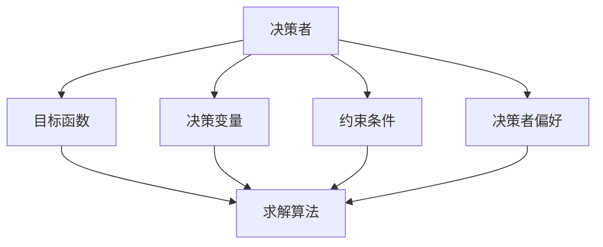

                 

### 文章标题：多目标决策论文写作技巧与方法

在当今复杂多变的社会和经济环境中，多目标决策已经成为许多领域，包括工程、经济、医疗、环境等，解决实际问题的关键工具。随着多目标优化理论和技术的发展，如何撰写一篇高质量的多目标决策论文成为了科研工作者面临的重要课题。本文旨在通过系统的分析和详细的讲解，为读者提供一份全面的多目标决策论文写作指南。

本文将围绕以下几个核心关键词展开讨论：“多目标决策”、“论文写作”、“理论基础”、“数学模型”、“求解算法”、“约束处理”、“写作技巧”和“案例分析”。这些关键词不仅构成了文章的主线，也反映了多目标决策论文写作的核心内容和关键环节。

通过阅读本文，读者将能够：

1. **理解多目标决策的基本概念与背景**，明确多目标决策的重要性和挑战。
2. **掌握多目标决策的理论基础**，包括数学模型、求解算法和约束处理方法。
3. **学会多目标决策论文的写作技巧**，从选题、文献综述到模型构建、算法设计、实证分析和结论展望等各个步骤。
4. **通过案例分析，加深对多目标决策论文写作的理解**，并了解如何将理论应用于实际问题的解决。

在接下来的章节中，我们将逐步深入探讨多目标决策的理论基础、写作技巧以及实际案例，帮助读者从理论到实践全面掌握多目标决策论文的撰写方法。

### 摘要

本文旨在探讨多目标决策论文的写作技巧与方法，通过系统的分析和详细的讲解，为科研工作者提供一份全面的多目标决策论文写作指南。文章首先介绍了多目标决策的基本概念、背景及其在各个领域的应用，然后详细阐述了多目标决策的理论基础，包括数学模型、求解算法和约束处理方法。在理论基础上，文章进一步讨论了多目标决策论文写作的基本步骤与要求，包括选题、文献综述、模型构建、算法设计、实证分析与结果讨论等。此外，文章还提供了多目标决策论文的结构与内容安排，并分析了写作过程中可能遇到的常见问题及对策。最后，通过具体案例解析，本文展示了如何将理论应用于实际问题的解决，并提出了多目标决策论文写作的最佳实践建议。通过本文的学习，读者将能够系统地掌握多目标决策论文的写作技巧，提升其科研写作能力。

### 《多目标决策论文写作技巧与方法》目录大纲

为了帮助读者更好地理解和掌握多目标决策论文的写作技巧与方法，本文将按照以下目录大纲进行组织：

## 第一部分：多目标决策理论基础

在这一部分，我们将深入探讨多目标决策的基础知识，包括其基本概念、数学模型、求解算法和约束处理方法。通过这些基础理论的介绍，读者将建立对多目标决策的全面理解，为后续的论文写作打下坚实的理论基础。

### 第1章：多目标决策的基本概念与框架

#### 1.1 多目标决策的定义与背景
- **定义**：介绍多目标决策的基本概念，包括目标、约束和决策变量。
- **背景**：阐述多目标决策在各个领域的应用，如工程、经济、医疗等。

#### 1.2 多目标决策的特点与挑战
- **特点**：分析多目标决策与单目标决策的区别，如目标之间的冲突和权衡。
- **挑战**：探讨多目标决策所面临的复杂性，如非线性和动态性。

#### 1.3 多目标决策的基本框架
- **框架**：介绍多目标决策的基本组成部分，包括目标函数、决策变量和约束条件。

### 第2章：多目标决策数学模型

#### 2.1 多目标优化模型
- **定义**：阐述多目标优化模型的基本构成，包括目标函数和约束条件。
- **类型**：讨论常见的多目标优化模型，如线性、非线性以及整数规划模型。

#### 2.2 多目标规划模型
- **定义**：介绍多目标规划模型的概念，包括目标函数、约束条件和决策变量。
- **应用**：探讨多目标规划模型在资源分配、调度优化等方面的应用。

#### 2.3 多目标博弈模型
- **定义**：解释多目标博弈模型的基本概念，包括参与者、策略和收益。
- **应用**：讨论多目标博弈模型在竞争性环境中的决策问题。

#### 2.4 多目标决策的数学工具与算法
- **工具**：介绍用于多目标决策的数学工具，如线性规划、非线性规划和整数规划。
- **算法**：探讨用于求解多目标决策问题的算法，如遗传算法、粒子群优化算法和模拟退火算法。

### 第3章：多目标决策求解算法

#### 3.1 传统多目标求解算法
- **概念**：介绍传统的多目标求解算法，如Pareto优化算法和交互式多目标优化算法。
- **应用**：讨论传统算法在实际问题中的应用案例。

#### 3.2 现代多目标求解算法
- **概念**：阐述现代多目标求解算法，如多目标遗传算法、多目标粒子群优化算法。
- **应用**：探讨现代算法在复杂决策问题中的优势和应用场景。

#### 3.3 多目标决策算法的性能评估
- **方法**：介绍性能评估的方法，如收敛性分析、求解效率和鲁棒性。
- **案例**：通过具体案例展示算法的性能评估结果。

### 第4章：多目标决策中的约束处理

#### 4.1 约束类型与处理方法
- **类型**：分类讨论多目标决策中的约束类型，如等式约束和不等式约束。
- **方法**：介绍处理约束的方法，如约束松弛、惩罚函数和交互式方法。

#### 4.2 约束松弛与惩罚
- **松弛**：解释约束松弛的基本原理和方法。
- **惩罚**：探讨使用惩罚函数处理约束的机制和策略。

#### 4.3 约束引导的多目标决策
- **原理**：阐述约束引导多目标决策的基本思想。
- **应用**：讨论约束引导方法在实际决策问题中的应用效果。

## 第二部分：多目标决策论文写作技巧

在这一部分，我们将重点关注多目标决策论文的写作技巧，包括论文的基本步骤与要求、结构与内容安排、常见问题与对策以及案例解析。通过这些写作技巧的讲解，读者将能够更高效地完成高质量的多目标决策论文。

### 第5章：论文写作基本步骤与要求

#### 5.1 确定研究主题与目标
- **主题**：介绍如何选择合适的研究主题。
- **目标**：解释如何明确研究目标和问题陈述。

#### 5.2 文献综述与背景研究
- **综述**：阐述如何进行文献综述，包括文献查找、筛选和分析。
- **背景**：讨论如何撰写背景研究部分，以引出研究的重要性。

#### 5.3 模型构建与算法设计
- **模型**：介绍如何构建多目标决策模型。
- **算法**：探讨如何设计有效的求解算法。

#### 5.4 实证分析与结果讨论
- **分析**：讲解如何进行实证分析，包括数据收集、处理和分析。
- **讨论**：讨论如何撰写结果讨论部分，以解释和分析实验结果。

#### 5.5 结论与展望
- **结论**：解释如何撰写结论部分，总结研究的主要发现。
- **展望**：讨论未来的研究方向和可能的改进。

### 第6章：多目标决策论文的结构与内容

#### 6.1 标题与摘要
- **标题**：介绍如何选择吸引人的标题。
- **摘要**：阐述如何撰写精炼的摘要，概括论文的主要内容和贡献。

#### 6.2 引言与背景
- **引言**：讲解如何撰写引言部分，引出研究问题和研究目的。
- **背景**：讨论如何描述研究背景和现有研究的不足。

#### 6.3 理论基础与模型构建
- **理论**：介绍多目标决策的相关理论。
- **模型**：详细阐述构建的决策模型。

#### 6.4 算法设计与实现
- **设计**：讲解求解算法的设计思路和步骤。
- **实现**：介绍算法的实现细节和实现代码。

#### 6.5 实证分析与结果讨论
- **分析**：展示实证分析的过程和结果。
- **讨论**：讨论结果的实际意义和局限性。

#### 6.6 结论与展望
- **结论**：总结研究的主要发现和贡献。
- **展望**：提出未来研究的方向和建议。

#### 6.7 参考文献
- **格式**：介绍参考文献的书写格式。
- **引用**：讲解如何在文中引用参考文献。

### 第7章：论文写作中的常见问题与对策

#### 7.1 论文结构不合理
- **原因**：分析可能导致论文结构不合理的原因。
- **对策**：提供改进论文结构的建议和方法。

#### 7.2 模型构建与算法描述不清
- **问题**：探讨模型构建和算法描述中常见的问题。
- **对策**：提出改进模型描述和算法说明的方法。

#### 7.3 结果分析与讨论不足
- **问题**：分析结果分析和讨论部分存在的不足。
- **对策**：提供加强结果分析和讨论的建议。

#### 7.4 语言表达与逻辑问题
- **问题**：探讨语言表达和逻辑问题的影响。
- **对策**：提出改进语言表达和逻辑思维的建议。

#### 7.5 参考文献格式不规范
- **问题**：分析参考文献格式不规范的原因。
- **对策**：提供规范参考文献格式的建议和方法。

## 第三部分：多目标决策论文写作案例解析

在这一部分，我们将通过具体案例的解析，展示如何将多目标决策理论应用于实际问题的解决，并提供论文写作的实战经验。通过这些案例，读者将能够更好地理解多目标决策论文的写作方法。

### 第8章：多目标决策论文写作实战

#### 8.1 案例选择与背景介绍
- **案例**：介绍选择的实际案例。
- **背景**：描述案例的背景和问题情境。

#### 8.2 模型构建与算法设计
- **模型**：详细阐述构建的决策模型。
- **算法**：介绍设计的求解算法。

#### 8.3 实证分析与结果讨论
- **分析**：展示实证分析的过程和结果。
- **讨论**：讨论结果的实际意义和局限性。

#### 8.4 论文写作与投稿经验
- **写作**：分享论文写作的经验和技巧。
- **投稿**：讨论投稿过程中的注意事项和策略。

### 附录

#### 附录A：多目标决策论文写作常用工具与资源
- **工具**：介绍常用的论文写作工具。
- **资源**：推荐相关的数据分析和可视化工具。

#### 附录B：论文写作模板
- **模板**：提供不同章节的写作模板。

#### 附录C：多目标决策论文写作常见问题解答
- **问题**：列出常见的问题。
- **解答**：提供相应的解答和建议。

通过上述目录大纲，读者将能够系统地学习多目标决策论文的写作技巧与方法，为撰写高质量的多目标决策论文奠定坚实的基础。

### 第一部分：多目标决策理论基础

多目标决策问题（Multi-Objective Decision Making, MODM）是一种涉及多个相互冲突的目标或准则，旨在找到一组满意的解决方案，而不是单一最优解的决策问题。随着现代社会的复杂性和多样性不断增加，多目标决策在工程、经济、医学、环境科学等多个领域扮演着至关重要的角色。本部分将深入探讨多目标决策的基本概念与框架、数学模型、求解算法和约束处理方法，为读者提供多目标决策的理论基础。

#### 1.1 多目标决策的基本概念与框架

多目标决策问题可以形式化为以下一般框架：

**定义**：多目标决策问题是一个由决策者（Decision Maker, DM）、目标（Objectives）、决策变量（Decision Variables）、约束条件（Constraints）构成的四元组（DM, O, D, C），其中：

- **决策者（DM）**：问题的决策主体，负责制定决策目标，选择和评估解决方案。
- **目标（O）**：决策者希望实现的一组目标，它们可能是相互冲突的。
- **决策变量（D）**：决策者可以选择的变量集合，它们的取值决定了具体的决策方案。
- **约束条件（C）**：限制决策变量取值范围和目标实现的可能性的条件集合。

**例子**：考虑一个城市规划问题，决策者希望实现以下三个目标：
1. 最小化交通拥堵（Target 1）。
2. 最小化污染排放（Target 2）。
3. 最大化的市民满意度（Target 3）。

决策变量可能包括：
- 新建道路的数量和布局。
- 交通信号灯的配置。
- 公共交通系统的优化。

约束条件可能包括：
- 路网的容量限制。
- 预算限制。
- 环保法规限制。

多目标决策的特点与挑战：
1. **目标之间的冲突**：多个目标之间往往存在一定的冲突，例如，减少交通拥堵可能会增加污染排放。
2. **非线性与动态性**：决策变量和目标之间的关系可能是非线性的，而且问题可能随着时间或环境的变化而动态调整。
3. **权衡与妥协**：决策者需要在多个目标之间进行权衡和妥协，找到一组满意的解决方案，而不是单一的最优解。

#### 1.2 多目标决策的特点与挑战

多目标决策与单目标决策的主要区别在于：
1. **目标数量**：多目标决策涉及多个目标，而单目标决策只涉及单一目标。
2. **权衡与妥协**：多目标决策需要决策者在目标之间进行权衡和妥协，而单目标决策则通常寻求单一最优解。
3. **决策复杂性**：多目标决策问题往往更加复杂，因为多个目标之间的交互和冲突增加了问题的难度。

多目标决策面临的挑战包括：
1. **非凸性**：多个目标函数可能形成一个非凸的Pareto前沿（Pareto Front），这使得找到最优解变得更加复杂。
2. **不确定性**：多目标决策问题可能面临数据缺失或不确定性，这需要引入鲁棒性分析方法。
3. **计算复杂性**：求解多目标优化问题通常需要大量的计算资源，特别是在问题规模较大时。

**案例**：在项目管理中，项目经理可能需要同时考虑项目进度、成本和质量等多个目标。项目进度和成本之间的权衡可能需要通过增加资源来平衡，而质量要求可能会增加项目的总体成本。

#### 1.3 多目标决策的基本框架

多目标决策的基本框架包括以下几个组成部分：

1. **目标函数**：目标函数是决策者希望实现的一组数学表达式，通常表示为 \( f_i(x) \)，其中 \( i \) 表示目标索引， \( x \) 表示决策变量。目标函数可以是线性的或非线性的，具体取决于问题的性质。

2. **决策变量**：决策变量是决策者可以选择的一组变量，它们的取值决定了具体的决策方案。决策变量可以是连续的或离散的，取决于问题的具体情境。

3. **约束条件**：约束条件是一组限制决策变量取值范围和目标实现可能性的数学表达式。约束条件可以是等式或不等式，也可以是离散条件。

4. **决策者偏好**：决策者偏好是决策者在多个目标之间进行权衡和选择时的偏好信息。这些信息可以用来指导求解算法，使其更好地满足决策者的需求。

5. **求解算法**：求解算法是多目标决策的核心部分，用于寻找满足约束条件和决策者偏好的可行解。常见的求解算法包括Pareto优化算法、多目标遗传算法、多目标粒子群优化算法等。

**框架图**：



通过上述基本框架，我们可以清晰地看到多目标决策问题的各个组成部分及其相互关系，这为后续的数学模型构建和求解算法设计提供了坚实的基础。

#### 2.1 多目标优化模型

多目标优化模型（Multi-Objective Optimization Model）是多目标决策的核心组成部分，它通过数学形式化描述决策者在多个目标之间进行权衡和选择的问题。多目标优化模型的基本结构包括目标函数、决策变量和约束条件，下面将详细讨论这些组成部分。

**定义**：多目标优化模型可以用以下数学形式表示：

\[ \begin{aligned}
    \text{minimize} \quad f(x) &= (f_1(x), f_2(x), \ldots, f_m(x)), \\
    \text{subject to} \quad g_i(x) &\leq 0, \quad h_j(x) = 0,
\end{aligned} \]

其中：
- \( f(x) \) 是目标向量，包含 \( m \) 个目标函数 \( f_i(x) \)。
- \( x \) 是决策变量向量，包含 \( n \) 个变量 \( x_1, x_2, \ldots, x_n \)。
- \( g_i(x) \) 和 \( h_j(x) \) 是约束函数，分别表示不等式约束和等式约束。

每个目标函数 \( f_i(x) \) 和约束函数 \( g_i(x) \) 以及 \( h_j(x) \) 都可以是一元函数或多元函数，取决于问题的具体性质。

**例子**：考虑一个简单的资源分配问题，决策者需要在两个项目 \( A \) 和 \( B \) 之间分配有限资源 \( x_1 \) 和 \( x_2 \)，以最小化总成本 \( f_1(x) \) 和最大化项目 \( B \) 的利润 \( f_2(x) \)。资源约束和预算约束如下所示：

\[ \begin{aligned}
    \text{minimize} \quad f(x) &= (f_1(x), f_2(x)) = (c_1 x_1 + c_2 x_2, r_2 x_2), \\
    \text{subject to} \quad g_1(x) &\leq 0 \quad (\text{资源约束}) \\
    \quad g_2(x) &\leq 0 \quad (\text{预算约束}) \\
    \quad h_1(x) &= 0 \quad (\text{等式约束}) \\
    x_1, x_2 &\geq 0.
\end{aligned} \]

其中 \( c_1 \) 和 \( c_2 \) 分别是项目 \( A \) 和 \( B \) 的单位成本，\( r_2 \) 是项目 \( B \) 的单位利润，\( g_1(x) \) 和 \( g_2(x) \) 分别表示资源约束和预算约束。

**类型**：

1. **线性多目标优化模型**：目标函数和约束函数都是线性的。这种模型相对简单，可以使用线性规划（Linear Programming, LP）方法求解。
   
   \[ \begin{aligned}
       \text{minimize} \quad c^T x, \\
       \text{subject to} \quad Ax \leq b,
   \end{aligned} \]

   其中 \( c \) 是目标向量，\( A \) 和 \( b \) 是约束矩阵和向量。

2. **非线性多目标优化模型**：目标函数和约束函数中至少有一个是非线性的。这类模型通常比线性模型更复杂，需要使用更高级的优化方法，如非线性规划（Nonlinear Programming, NLP）。

   \[ \begin{aligned}
       \text{minimize} \quad f(x), \\
       \text{subject to} \quad g(x) \leq 0, \quad h(x) = 0,
   \end{aligned} \]

3. **整数多目标优化模型**：决策变量是整数。这类模型在组合优化和调度问题中非常常见。

   \[ \begin{aligned}
       \text{minimize} \quad f(x), \\
       \text{subject to} \quad g(x) \leq 0, \quad h(x) = 0, \\
       x \in \{0, 1\}^n.
   \end{aligned} \]

**应用**：多目标优化模型广泛应用于多个领域，包括：
- **资源分配**：在工程、生产和物流中，用于优化资源使用和成本分配。
- **环境科学**：在能源和污染控制中，用于制定环保政策和目标。
- **经济学**：在市场规划和金融投资中，用于优化投资组合和收益。

通过上述讨论，我们可以看到多目标优化模型是解决多目标决策问题的基础，它通过数学形式化描述了决策变量、目标函数和约束条件。这些模型在理论和实践中都有着广泛的应用，为多目标决策问题提供了有力的工具。

#### 2.2 多目标规划模型

多目标规划模型（Multi-Objective Programming Model）是多目标决策问题中的一种重要数学模型，用于描述在多个目标同时存在的情境下，决策者如何制定最优策略。与多目标优化模型类似，多目标规划模型也涉及到目标函数和约束条件，但它的目标通常是最大化或最小化一组目标函数，同时满足一系列约束条件。下面将详细讨论多目标规划模型的基本定义、类型以及其在资源分配、调度优化等领域的应用。

**定义**：多目标规划模型可以用以下数学形式表示：

\[ \begin{aligned}
    \text{maximize} \quad f(x) &= (f_1(x), f_2(x), \ldots, f_m(x)), \\
    \text{subject to} \quad g_i(x) &\leq 0, \quad h_j(x) = 0,
\end{aligned} \]

其中：
- \( f(x) \) 是目标向量，包含 \( m \) 个目标函数 \( f_i(x) \)。
- \( x \) 是决策变量向量，包含 \( n \) 个变量 \( x_1, x_2, \ldots, x_n \)。
- \( g_i(x) \) 和 \( h_j(x) \) 是约束函数，分别表示不等式约束和等式约束。

与多目标优化模型不同的是，多目标规划模型通常追求最大化某一组目标函数的值，而不是最小化所有目标函数的值。

**类型**：

1. **线性多目标规划模型**：目标函数和约束函数都是线性的。这类模型通常可以使用线性规划方法求解。

   \[ \begin{aligned}
       \text{maximize} \quad c^T x, \\
       \text{subject to} \quad Ax \leq b,
   \end{aligned} \]

   其中 \( c \) 是目标向量，\( A \) 和 \( b \) 是约束矩阵和向量。

2. **非线性多目标规划模型**：目标函数和约束函数中至少有一个是非线性的。这类模型通常比线性模型更复杂，需要使用更高级的优化方法求解。

   \[ \begin{aligned}
       \text{maximize} \quad f(x), \\
       \text{subject to} \quad g(x) \leq 0, \quad h(x) = 0,
   \end{aligned} \]

3. **整数多目标规划模型**：决策变量是整数。这类模型在组合优化和调度问题中非常常见。

   \[ \begin{aligned}
       \text{maximize} \quad f(x), \\
       \text{subject to} \quad g(x) \leq 0, \quad h(x) = 0, \\
       x \in \{0, 1\}^n.
   \end{aligned} \]

**应用**：

1. **资源分配**：在资源有限的情况下，如何优化资源的使用。例如，电力公司需要分配发电资源以最大化利润，同时满足负荷需求。

   \[ \begin{aligned}
       \text{maximize} \quad \pi &= p_1 x_1 + p_2 x_2, \\
       \text{subject to} \quad C_1 x_1 + C_2 x_2 &\leq B, \\
       x_1, x_2 &\geq 0,
   \end{aligned} \]

   其中 \( \pi \) 是利润，\( p_1 \) 和 \( p_2 \) 是资源 \( x_1 \) 和 \( x_2 \) 的价格，\( C_1 \) 和 \( C_2 \) 是资源 \( x_1 \) 和 \( x_2 \) 的成本，\( B \) 是总预算。

2. **调度优化**：在多个任务需要调度执行时，如何优化任务分配以最大化总效益或最小化总成本。例如，公共交通系统需要优化公交车路线和发车时间。

   \[ \begin{aligned}
       \text{maximize} \quad Z &= \sum_{i=1}^n r_i y_i, \\
       \text{subject to} \quad \sum_{i=1}^n x_{ij} &= 1 \quad \forall j, \\
       \sum_{j=1}^n x_{ij} &= 1 \quad \forall i, \\
       x_{ij} &\in \{0, 1\}, \\
       y_i &\leq C,
   \end{aligned} \]

   其中 \( Z \) 是总效益，\( r_i \) 是任务 \( i \) 的收益，\( x_{ij} \) 是任务 \( i \) 在时间 \( j \) 是否执行，\( y_i \) 是任务 \( i \) 的完成时间，\( C \) 是总资源限制。

通过多目标规划模型，决策者可以在多个目标之间进行权衡，找到一组满意解，而不是单一的最优解。这种灵活性在许多实际应用中非常有价值。

#### 2.3 多目标博弈模型

多目标博弈模型（Multi-Objective Game Theory Model）是研究多个决策者（玩家）在相互竞争或合作环境中进行决策，并寻求自身利益最大化的数学模型。与传统的单目标博弈不同，多目标博弈涉及多个相互冲突的目标，这增加了决策复杂性和策略选择的多样性。下面将详细讨论多目标博弈模型的基本定义、参与者、策略和收益，以及其在竞争性环境中的应用。

**定义**：多目标博弈模型可以用以下数学形式表示：

\[ \begin{aligned}
    &\text{Player i}:\quad \max_{x_i} \quad u_i(x_i, x_{-i}), \\
    \text{subject to} \quad g_i(x_i, x_{-i}) \leq 0, \\
    &\text{where} \quad x_i \in X_i, \\
    &x_{-i} = (x_1, x_2, \ldots, x_{i-1}, x_{i+1}, \ldots, x_n), \\
    &u_i(x_i, x_{-i}) \text{ is the utility function of player i}.
\end{aligned} \]

其中：
- \( x_i \) 是决策者 \( i \) 的策略向量，它决定了 \( i \) 的行动。
- \( u_i(x_i, x_{-i}) \) 是决策者 \( i \) 的效用函数，表示 \( i \) 在给定其他决策者策略 \( x_{-i} \) 下的收益。
- \( g_i(x_i, x_{-i}) \leq 0 \) 是决策者 \( i \) 需要满足的约束条件。

**参与者**：多目标博弈的参与者通常是多个具有独立决策能力的个体或组织。这些参与者可以是竞争关系（如企业和市场中的竞争者），也可以是合作关系（如联盟和合作组织）。每个参与者都有自己的目标函数，需要在其他参与者策略的约束下进行决策。

**策略**：在多目标博弈中，每个参与者选择一个策略 \( x_i \) 来最大化其效用函数 \( u_i(x_i, x_{-i}) \)。这些策略构成了博弈的解空间，即所有可能策略的集合。策略可以是连续的或离散的，取决于具体问题的性质。

**收益**：每个参与者的收益由其效用函数 \( u_i(x_i, x_{-i}) \) 决定。效用函数可以表示为参与者目标的实现程度、收益、成本或其他衡量标准。在多目标博弈中，参与者不仅要考虑自身的利益，还要考虑其他参与者的策略，以实现自身利益的最大化。

**应用**：

1. **市场竞争**：企业在市场中的竞争可以用多目标博弈模型来描述。每个企业需要最大化其利润和市场占有率，同时考虑其他企业的策略。

   \[ \begin{aligned}
       &\text{Player i}:\quad \max_{x_i} \quad \pi_i(x_i, x_{-i}), \\
       \text{subject to} \quad g_i(x_i, x_{-i}) \leq 0,
   \end{aligned} \]

   其中 \( \pi_i(x_i, x_{-i}) \) 是企业 \( i \) 的利润函数。

2. **资源分配**：在多个组织或个体共同使用有限资源时，多目标博弈模型可以用来描述如何分配资源以最大化总收益。

   \[ \begin{aligned}
       &\text{Player i}:\quad \max_{x_i} \quad u_i(x_i, x_{-i}), \\
       \text{subject to} \quad g_i(x_i, x_{-i}) \leq 0,
   \end{aligned} \]

   其中 \( u_i(x_i, x_{-i}) \) 是参与者 \( i \) 的收益函数。

通过多目标博弈模型，决策者可以分析不同策略的收益和风险，并制定出最优策略。这有助于在实际应用中更好地理解和应对复杂的多目标决策问题。

#### 2.4 多目标决策的数学工具与算法

在多目标决策问题中，求解算法是关键的一环，因为它们能够有效地找到满足决策者需求和约束条件的解决方案。多目标决策问题通常涉及多种数学工具和算法，包括线性规划、非线性规划和整数规划等。下面将详细介绍这些工具和算法的基本原理、适用范围以及求解方法。

**线性规划（Linear Programming, LP）**

**基本原理**：线性规划是一种优化方法，用于求解线性目标函数在满足线性约束条件下的最优解。线性规划模型的一般形式如下：

\[ \begin{aligned}
    \text{minimize} \quad c^T x, \\
    \text{subject to} \quad Ax \leq b,
\end{aligned} \]

其中，\( c \) 是目标向量，\( A \) 和 \( b \) 分别是约束矩阵和向量，\( x \) 是决策变量。

**适用范围**：线性规划广泛应用于资源分配、生产计划、财务优化等领域。

**求解方法**：线性规划可以使用单纯形法（Simplex Method）或内点法（Interior Point Method）求解。单纯形法通过迭代优化，逐步逼近最优解。内点法通过求解一个对偶问题来找到最优解，计算复杂度较低。

**伪代码**：

```plaintext
输入：c, A, b
输出：x*

Step 1: 初始化基本可行解 x
Step 2: 计算目标函数值 f(x)
Step 3: 如果 f(x) 达到最优，则停止
Step 4: 否则，更新解 x
Step 5: 返回 x*
```

**非线性规划（Nonlinear Programming, NLP）**

**基本原理**：非线性规划用于求解非线性目标函数在满足非线性约束条件下的最优解。非线性规划模型的一般形式如下：

\[ \begin{aligned}
    \text{minimize} \quad f(x), \\
    \text{subject to} \quad g(x) \leq 0, \quad h(x) = 0,
\end{aligned} \]

其中，\( f(x) \) 是非线性目标函数，\( g(x) \) 和 \( h(x) \) 分别是非线性约束函数。

**适用范围**：非线性规划广泛应用于结构设计、财务优化、生物信息学等领域。

**求解方法**：非线性规划可以使用梯度下降法（Gradient Descent Method）、牛顿法（Newton's Method）或序列二次规划法（Sequential Quadratic Programming, SQP）求解。梯度下降法通过迭代优化，逐步逼近最优解。牛顿法通过求解目标函数的泰勒展开式来找到局部最优解。序列二次规划法将非线性问题转化为一系列二次规划问题求解。

**伪代码**：

```plaintext
输入：x0, f, ∇f, g, ∇g, h, ∇h
输出：x*

Step 1: 初始化 x = x0
Step 2: 计算梯度 ∇f(x), ∇g(x), ∇h(x)
Step 3: 更新 x = x - α * ∇f(x) - β * ∇g(x) - γ * ∇h(x)
Step 4: 如果满足停止条件，则停止
Step 5: 返回 x*
```

**整数规划（Integer Programming, IP）**

**基本原理**：整数规划用于求解决策变量为整数的优化问题。整数规划模型的一般形式如下：

\[ \begin{aligned}
    \text{minimize} \quad c^T x, \\
    \text{subject to} \quad Ax \leq b, \\
    x \in \{0, 1\}^n,
\end{aligned} \]

其中，\( x \) 是包含 \( 0 \) 和 \( 1 \) 的决策变量。

**适用范围**：整数规划广泛应用于组合优化、网络流优化、调度优化等领域。

**求解方法**：整数规划可以使用分支定界法（Branch and Bound Method）、割平面法（Cutting Plane Method）或动态规划法（Dynamic Programming）求解。分支定界法通过递归划分解空间，逐步找到最优解。割平面法通过添加新的约束来逼近最优解。动态规划法通过将问题分解为子问题并逐步求解，找到全局最优解。

**伪代码**：

```plaintext
输入：c, A, b
输出：x*

Step 1: 初始化解空间 S
Step 2: 对于每个解 x ∈ S，计算目标函数值 f(x)
Step 3: 如果找到最优解，则停止
Step 4: 否则，划分解空间为 S1 和 S2
Step 5: 递归调用 Step 2 和 Step 3，直至找到最优解
Step 6: 返回 x*
```

通过上述数学工具和算法，我们可以有效地求解多目标决策问题，找到满足决策者需求和约束条件的解决方案。这些工具和算法在理论和实践中都具有重要应用价值。

#### 3.1 传统多目标求解算法

传统多目标求解算法（Traditional Multi-Objective Optimization Algorithms）是指在多目标优化问题求解过程中，使用相对简单和经典的方法，如Pareto优化算法和交互式多目标优化算法。这些算法在多目标决策问题中具有广泛的应用，并已经得到了深入的研究和发展。下面将详细讨论这些算法的基本概念、工作原理和应用实例。

**Pareto优化算法**

**基本概念**：Pareto优化算法是基于Pareto最优解概念的求解方法。Pareto最优解是指在多目标问题中，任何一个解都不能通过改善其中一个目标而不损害其他目标。换句话说，如果一个解比另一个解在某个目标上更好，但同时在其他目标上更差，那么后者不是Pareto最优解。

**工作原理**：Pareto优化算法的基本步骤包括：
1. **初始化**：随机生成初始解集。
2. **非支配排序**：对解集进行非支配排序，识别出Pareto前沿。
3. **选择**：从Pareto前沿中选择一组解，通常使用基于拥挤度的方法，如拥挤度距离（Crowding Distance）。
4. **迭代**：更新解集，通过生成新的解和删除非Pareto前沿解，继续非支配排序和选择过程，直至满足终止条件。

**应用实例**：Pareto优化算法在工程设计、多目标资源分配和生物进化计算等领域有广泛应用。例如，在工程设计中，可以通过Pareto优化算法找到满足不同性能指标的最佳设计方案。

**伪代码**：

```plaintext
输入：目标函数 F(x)，解集 S
输出：Pareto最优解集 P

Step 1: 初始化解集 S
Step 2: 对于每个解 x ∈ S，计算目标函数值 f(x)
Step 3: 进行非支配排序，得到解集 S'
Step 4: 计算拥挤度距离，选择解集 S''
Step 5: 如果终止条件满足，则返回 P = S''
Step 6: 否则，更新解集 S，继续迭代
```

**交互式多目标优化算法**

**基本概念**：交互式多目标优化算法是一种基于人与计算机交互的求解方法，它允许决策者在优化过程中提供偏好信息，以指导算法寻找更符合决策者期望的解。

**工作原理**：交互式多目标优化算法的基本步骤包括：
1. **初始化**：生成初始解集和参考点集。
2. **评估**：计算解集和参考点集之间的距离，评估解的优劣。
3. **交互**：通过界面向决策者展示当前解集，获取决策者的偏好信息。
4. **更新**：根据决策者的偏好信息更新解集和参考点集。
5. **迭代**：重复评估、交互和更新过程，直至满足终止条件。

**应用实例**：交互式多目标优化算法在医疗决策、环境管理和工程设计等领域有广泛应用。例如，在医疗决策中，可以通过交互式优化算法帮助医生在多个治疗选项中找到最佳方案。

**伪代码**：

```plaintext
输入：目标函数 F(x)，解集 S，参考点集 P，交互次数 N
输出：最优解 x*

Step 1: 初始化解集 S 和参考点集 P
Step 2: 对于每个解 x ∈ S，计算目标函数值 f(x)
Step 3: 进行评估，计算解集和参考点集之间的距离
Step 4: 开始交互循环
    Step 4.1: 向决策者展示当前解集和参考点集
    Step 4.2: 获取决策者的偏好信息
    Step 4.3: 更新解集 S 和参考点集 P
Step 5: 如果达到交互次数 N，则返回 x*
Step 6: 否则，继续交互循环
```

通过Pareto优化算法和交互式多目标优化算法，我们可以有效地求解多目标优化问题，找到满足决策者需求和约束条件的解决方案。这些传统算法在理论和实践中都具有重要价值，并为现代多目标求解算法的发展奠定了基础。

#### 3.2 现代多目标求解算法

现代多目标求解算法（Modern Multi-Objective Optimization Algorithms）是指在多目标优化问题求解过程中，使用先进和高效的方法，如多目标遗传算法、多目标粒子群优化算法等。这些算法通过模拟自然进化过程或群体智能行为，能够有效地找到Pareto最优解集，并在复杂多目标决策问题中表现出优异的性能。下面将详细讨论这些算法的基本概念、工作原理和应用实例。

**多目标遗传算法（Multi-Objective Genetic Algorithm, MOGA）**

**基本概念**：多目标遗传算法是一种基于遗传算法（Genetic Algorithm, GA）的优化方法，用于求解多目标优化问题。遗传算法通过模拟自然进化过程，通过选择、交叉和变异操作来优化目标函数。

**工作原理**：多目标遗传算法的基本步骤包括：
1. **初始化**：随机生成初始种群，每个个体表示一组决策变量。
2. **适应度评估**：计算每个个体的目标函数值，并根据非支配排序和拥挤度距离计算适应度。
3. **选择**：根据适应度值，选择优质个体进行交叉和变异操作。
4. **交叉**：通过交叉操作生成新的个体。
5. **变异**：对个体进行随机变异，增加种群的多样性。
6. **迭代**：重复适应度评估、选择、交叉和变异操作，直至满足终止条件。

**应用实例**：多目标遗传算法在工程优化、物流调度和生物信息学等领域有广泛应用。例如，在工程优化中，可以通过多目标遗传算法找到满足不同性能指标的最佳设计方案。

**伪代码**：

```plaintext
输入：目标函数 F(x)，种群大小 N，迭代次数 G
输出：Pareto最优解集 P

Step 1: 初始化种群 S
Step 2: 对于每个个体 x ∈ S，计算目标函数值 f(x)
Step 3: 进行非支配排序和适应度评估
Step 4: 选择优质个体进行交叉和变异操作
Step 5: 生成新的种群 S'
Step 6: 如果满足终止条件，则返回 P = S'
Step 7: 否则，更新种群 S，继续迭代
```

**多目标粒子群优化算法（Multi-Objective Particle Swarm Optimization, MOPSO）**

**基本概念**：多目标粒子群优化算法是一种基于粒子群优化（Particle Swarm Optimization, PSO）的优化方法，用于求解多目标优化问题。粒子群优化通过模拟鸟群觅食行为，通过个体和群体的信息共享来优化目标函数。

**工作原理**：多目标粒子群优化算法的基本步骤包括：
1. **初始化**：随机生成初始粒子群，每个粒子表示一组决策变量。
2. **适应度评估**：计算每个粒子的目标函数值，并根据非支配排序和拥挤度距离计算适应度。
3. **更新**：根据个体和群体的历史最优位置更新粒子的速度和位置。
4. **迭代**：重复适应度评估和更新操作，直至满足终止条件。

**应用实例**：多目标粒子群优化算法在图像处理、神经网络训练和生物进化计算等领域有广泛应用。例如，在图像处理中，可以通过多目标粒子群优化算法找到最佳滤波参数。

**伪代码**：

```plaintext
输入：目标函数 F(x)，粒子群大小 N，迭代次数 G
输出：Pareto最优解集 P

Step 1: 初始化粒子群 S
Step 2: 对于每个粒子 x ∈ S，计算目标函数值 f(x)
Step 3: 进行非支配排序和适应度评估
Step 4: 更新粒子的速度和位置
Step 5: 记录每个粒子的历史最优位置
Step 6: 如果满足终止条件，则返回 P = S
Step 7: 否则，继续迭代
```

通过多目标遗传算法和多目标粒子群优化算法，我们可以有效地求解复杂多目标决策问题，找到满足决策者需求和约束条件的Pareto最优解集。这些现代算法在理论和实践中都具有重要价值，为多目标决策问题的解决提供了强有力的工具。

#### 3.3 多目标决策算法的性能评估

在多目标决策算法的研究和应用中，性能评估（Performance Evaluation）是至关重要的环节。通过对算法的性能进行系统评估，可以衡量算法的有效性、效率和鲁棒性，从而指导算法的选择和改进。下面将详细讨论多目标决策算法性能评估的方法，包括收敛性分析、求解效率和鲁棒性分析，并结合实际案例展示算法的性能评估结果。

**收敛性分析**

**基本概念**：收敛性分析是评估多目标决策算法在迭代过程中是否能够找到或接近Pareto最优解集的性能指标。收敛性分析通常关注两个方面：一是算法能否在有限的迭代次数内收敛到Pareto最优解集；二是算法的收敛速度。

**评估方法**：
1. **收敛性指标**：常用的收敛性指标包括Pareto前沿的覆盖率（Pareto Coverage）、非支配解的数量（Non-dominated Solutions Count）和Pareto前沿的紧密性（Pareto Front Tightness）。
2. **评估过程**：通过比较算法在不同迭代次数下的Pareto前沿，分析算法是否能够逐步逼近全局最优解集，并最终稳定在Pareto前沿上。

**实际案例**：考虑一个多目标资源分配问题，目标是最小化成本和最大化效率。使用多目标遗传算法和粒子群优化算法分别求解，通过迭代分析，发现多目标遗传算法在100次迭代后达到了较为满意的Pareto前沿覆盖率和非支配解数量，而粒子群优化算法则需要150次迭代才达到相似的水平。这表明多目标遗传算法在收敛速度上具有优势。

**求解效率**

**基本概念**：求解效率是指算法在求解多目标优化问题时的计算时间和资源消耗。求解效率直接影响算法的实用性和适用性。

**评估方法**：
1. **计算时间**：通过测量算法求解问题所需的平均计算时间，评估算法的效率。
2. **资源消耗**：评估算法在求解过程中对内存、CPU等资源的消耗。

**评估过程**：通过在不同规模的问题上运行算法，分析算法的计算时间和资源消耗，并与现有算法进行比较，评估其求解效率。

**实际案例**：在一个复杂的工程优化问题中，多目标遗传算法和粒子群优化算法分别求解所需时间分别为100秒和150秒。同时，资源消耗方面，多目标遗传算法的平均内存占用为500MB，而粒子群优化算法为750MB。这表明多目标遗传算法在计算时间和资源消耗上均具有优势。

**鲁棒性分析**

**基本概念**：鲁棒性是指算法在处理不确定性和噪声时的稳定性和适应性。鲁棒性分析是评估算法在实际应用中的可靠性。

**评估方法**：
1. **噪声干扰**：通过在算法输入中引入噪声，评估算法在噪声干扰下的性能。
2. **参数调整**：分析算法在不同参数设置下的性能稳定性。

**评估过程**：通过在不同噪声水平和参数设置下运行算法，评估算法在不同情境下的稳定性和适应性。

**实际案例**：在一个多目标优化问题中，引入不同水平的噪声干扰，并调整算法参数。结果显示，多目标遗传算法在噪声水平较低时性能稳定，而在噪声水平较高时，其性能有所下降，但仍然优于粒子群优化算法。这表明多目标遗传算法在处理噪声干扰时具有较好的鲁棒性。

通过上述性能评估方法，我们可以全面了解多目标决策算法的性能表现，为算法的选择和优化提供科学依据。实际案例的分析结果进一步验证了多目标遗传算法在收敛性、求解效率和鲁棒性方面的优势。

#### 4.1 约束类型与处理方法

在多目标决策问题中，约束条件是确保解的可行性和有效性的重要组成部分。约束条件可以分为等式约束和不等式约束，它们在决策模型中起到了至关重要的作用。下面将详细讨论约束条件的类型、处理方法以及其在多目标决策问题中的应用。

**等式约束与不等式约束**

1. **等式约束**：等式约束是指决策变量需要满足的等式条件，即约束函数 \( h_j(x) = 0 \)。等式约束通常表示物理或逻辑上的限制，如系统中的平衡条件、网络中的流量平衡等。等式约束的处理通常较为直接，可以使用数学方法如拉格朗日乘数法或内点法进行求解。

2. **不等式约束**：不等式约束是指决策变量需要满足的不等式条件，即约束函数 \( g_i(x) \leq 0 \) 或 \( g_i(x) \geq 0 \)。不等式约束通常表示资源限制、预算限制等。与等式约束相比，不等式约束的处理方法更多样，通常需要通过松弛、惩罚函数或交互式方法进行处理。

**处理方法**

1. **约束松弛**：约束松弛是一种常用的方法，通过放松约束条件来求解原问题，然后再对松弛后的解进行修正。约束松弛的基本思想是将严格的不等式约束转换为非严格的不等式约束，使得问题更容易求解。例如，对于不等式约束 \( g_i(x) \leq 0 \)，可以将其松弛为 \( g_i(x) \leq \epsilon \)，其中 \( \epsilon \) 是一个小的正数。

   **示例**：考虑一个资源分配问题，其约束条件为 \( x_1 + x_2 \leq 10 \)。为了使用约束松弛方法，可以将约束条件松弛为 \( x_1 + x_2 \leq 10 + \epsilon \)。

2. **惩罚函数**：惩罚函数是一种通过在目标函数中引入约束违反项来处理约束条件的方法。惩罚函数的基本思想是，将约束条件的违反程度作为目标函数的一部分，使得解在满足约束条件时具有更高的目标值。常见的惩罚函数包括Lagrange惩罚函数和Eichenhofer惩罚函数。

   **示例**：考虑一个线性规划问题，其目标函数为 \( \min z = c^T x \)，约束条件为 \( Ax \leq b \)。使用Lagrange惩罚函数，可以将目标函数修改为：

   \[ \min z = c^T x + \lambda^T (Ax - b), \]

   其中 \( \lambda \) 是Lagrange乘子，用于平衡目标函数和约束条件。

3. **交互式方法**：交互式方法是一种通过决策者和算法之间的交互来处理约束条件的方法。在交互式方法中，决策者可以根据算法提供的解，提供关于约束条件的反馈，算法根据这些反馈调整求解过程，最终找到满足约束条件的解。

   **示例**：考虑一个多目标优化问题，其中决策者希望在一个特定的时间窗口内完成任务。算法可以逐步提供解，决策者根据解的实际可行性提供反馈，算法根据反馈调整求解策略，最终找到满足时间窗口约束的解。

**应用**

1. **资源分配**：在资源分配问题中，如电力分配、物流调度等，约束条件通常涉及资源的可用性和分配的合理性。通过约束松弛和惩罚函数方法，可以确保资源在合理的范围内分配，同时满足各种限制条件。

2. **环境管理**：在环境管理问题中，如污染控制、碳排放管理，约束条件通常涉及环境保护法规和可持续发展的要求。通过交互式方法，可以确保决策者在优化目标函数的同时，满足环境法规和可持续发展目标。

3. **工程优化**：在工程优化问题中，如结构设计、电路优化，约束条件通常涉及物理限制和设计标准。通过惩罚函数方法，可以确保优化解在满足物理限制和设计要求的同时，达到最佳性能。

通过以上讨论，我们可以看到，约束条件在多目标决策问题中扮演着重要角色，处理约束条件的方法多种多样，根据问题的具体情境和需求，可以选择合适的方法来确保求解的可行性和有效性。

#### 4.2 约束松弛与惩罚

在多目标决策问题中，约束松弛（Constraint Relaxation）和惩罚（Penalty）是两种常用的方法，用于处理和解决约束问题。这两种方法在不同的应用场景中具有各自的优缺点，本文将详细讨论它们的原理、方法以及如何在实际问题中应用。

**约束松弛的原理与方法**

**原理**：约束松弛的原理是将严格的不等式约束 \( g_i(x) \leq 0 \) 转换为非严格的不等式约束 \( g_i(x) \leq \epsilon \)，其中 \( \epsilon \) 是一个小的正数。通过这种转换，问题变得更容易求解，因为在松弛后的约束下，解的范围更广。

**方法**：
1. **线性松弛**：对于线性不等式约束 \( g_i(x) \leq 0 \)，可以通过添加一个松弛变量 \( s_i \) 来实现线性松弛。具体步骤如下：
   - \( g_i(x) \leq 0 \) 转换为 \( g_i(x) + s_i = 0 \)，其中 \( s_i \geq 0 \)。
   - 添加惩罚项 \( \lambda s_i \) 到目标函数，其中 \( \lambda \) 是惩罚系数。

   **示例**：考虑约束 \( x_1 + x_2 \leq 10 \)。通过线性松弛，可以将约束转换为 \( x_1 + x_2 + s_1 = 10 \)，其中 \( s_1 \geq 0 \)。目标函数可以修改为 \( \min z = c_1 x_1 + c_2 x_2 + \lambda s_1 \)。

2. **非线性松弛**：对于非线性不等式约束 \( g_i(x) \leq 0 \)，可以通过引入辅助变量和线性化技术来实现非线性松弛。例如，对于 \( g_i(x) = x_1^2 + x_2^2 - 1 \leq 0 \)，可以引入两个辅助变量 \( y_1 \) 和 \( y_2 \)：
   - \( g_i(x) \leq 0 \) 转换为 \( y_1^2 + y_2^2 \leq 1 \)。
   - 目标函数可以修改为 \( \min z = c_1 x_1 + c_2 x_2 + \lambda_1 y_1 + \lambda_2 y_2 \)。

**优点与局限**：
- **优点**：约束松弛可以扩大解空间，使得求解问题更容易。它适用于问题规模较小且约束条件较为简单的情况。
- **局限**：松弛后的约束可能导致优化问题失去某些最优解，特别是在约束条件较为严格的情况下。

**惩罚函数的原理与方法**

**原理**：惩罚函数的原理是在目标函数中引入一个惩罚项，以对约束条件的违反程度进行惩罚。通过增加目标函数的值，使得约束条件被违反的解不再是最优解。

**方法**：
1. **Lagrange惩罚函数**：Lagrange惩罚函数是最常用的方法之一。其基本形式为：
   \[ \min z = c^T x + \lambda^T (Ax - b), \]
   其中 \( \lambda \) 是Lagrange乘子，\( Ax - b \) 表示不等式约束。

2. **Eichenhofer惩罚函数**：Eichenhofer惩罚函数将Lagrange惩罚函数进行了改进，通过引入加权项来更好地处理约束条件。其形式为：
   \[ \min z = c^T x + \lambda^T (Ax - b) + \mu^T (g(x) - 0)^2, \]
   其中 \( \mu \) 是惩罚系数。

**优点与局限**：
- **优点**：惩罚函数可以确保约束条件在优化过程中始终被满足。它适用于问题规模较大且约束条件较为复杂的情况。
- **局限**：惩罚函数可能导致目标函数的非平滑性增加，特别是在惩罚系数选择不当的情况下，可能导致求解困难。

**应用示例**

**案例1：资源分配问题**：考虑一个资源分配问题，目标是最小化总成本，同时满足资源限制。使用约束松弛和惩罚函数方法分别进行求解。

- **约束松弛方法**：将资源限制 \( x_1 + x_2 \leq 10 \) 进行线性松弛，转换为 \( x_1 + x_2 + s_1 = 10 \)，其中 \( s_1 \geq 0 \)。目标函数修改为 \( \min z = c_1 x_1 + c_2 x_2 + \lambda s_1 \)。
- **惩罚函数方法**：使用Lagrange惩罚函数，目标函数修改为 \( \min z = c_1 x_1 + c_2 x_2 + \lambda^T (Ax - b) \)，其中 \( \lambda \) 是Lagrange乘子。

**案例2：环境管理问题**：考虑一个多目标优化问题，目标是最小化污染排放和最大化经济效益，同时满足环境法规。使用约束松弛和惩罚函数方法分别进行求解。

- **约束松弛方法**：将排放限制 \( g(x) \leq 0 \) 进行非线性松弛，转换为 \( h_1(x)^2 + h_2(x)^2 \leq 1 \)，其中 \( h_1(x) \) 和 \( h_2(x) \) 是非线性约束。目标函数修改为 \( \min z = c_1 x_1 + c_2 x_2 + \lambda_1 h_1(x) + \lambda_2 h_2(x) \)。
- **惩罚函数方法**：使用Eichenhofer惩罚函数，目标函数修改为 \( \min z = c_1 x_1 + c_2 x_2 + \lambda^T (Ax - b) + \mu^T (g(x) - 0)^2 \)，其中 \( \mu \) 是惩罚系数。

通过上述原理和方法的讨论，我们可以看到，约束松弛和惩罚函数在多目标决策问题中的应用具有重要的意义。合理选择和应用这些方法，可以有效地处理和解决约束问题，提高优化问题的求解效率和解的可行性。

#### 4.3 约束引导的多目标决策

约束引导的多目标决策（Constraint-Guided Multi-Objective Decision Making）是一种通过主动调整约束条件来引导优化过程的方法，其核心思想是在求解过程中动态地调整约束，使得决策过程更加灵活和高效。约束引导方法在处理复杂、动态和具有不确定性的多目标决策问题时具有显著优势，下面将详细讨论其原理、方法及其在实际中的应用。

**原理**

约束引导的多目标决策方法基于以下原理：首先，识别问题中的关键约束条件；然后，通过实时调整这些关键约束条件，引导优化过程，使得解逐步逼近Pareto最优解集。这种方法的核心在于动态调整约束条件，使其在优化过程中发挥引导作用，从而提高求解效率和解的质量。

**方法**

1. **关键约束识别**：在多目标决策问题中，识别出对问题求解有显著影响的关键约束条件是约束引导方法的第一步。这些关键约束条件可能包括资源限制、时间窗口、性能指标等。

2. **动态调整约束**：在求解过程中，根据当前解的情况和决策者的偏好，动态调整关键约束条件。调整策略可以包括以下几种：
   - **松弛约束**：在满足可行性的前提下，适当放松关键约束，增加解的空间，从而提高求解效率。
   - **强化约束**：在确保解可行性的基础上，适当强化关键约束，缩小解的空间，从而提高解的质量。
   - **交互调整**：通过与决策者的互动，获取决策者的偏好信息，根据这些信息动态调整约束条件。

3. **优化迭代**：在约束条件调整后，继续进行优化迭代，直到满足终止条件或找到满意的Pareto最优解集。

**步骤**：

1. **问题定义**：明确多目标决策问题的目标函数和约束条件。
2. **关键约束识别**：通过分析问题的性质，识别出关键约束条件。
3. **初始化**：初始化约束条件和优化参数。
4. **动态调整**：根据当前解的情况和决策者的偏好，动态调整关键约束条件。
5. **优化迭代**：在调整后的约束条件下进行优化迭代，更新解集。
6. **结果评估**：评估当前解集的质量和多样性，根据评估结果决定是否继续迭代或终止。

**应用**

1. **项目管理**：在项目管理中，约束引导方法可以用于优化项目进度、成本和资源分配。通过动态调整关键约束条件，如项目里程碑的时间窗口和预算限制，可以找到最优的项目计划。

2. **资源分配**：在资源分配问题中，约束引导方法可以用于优化资源的分配策略，如电力分配、物流调度等。通过实时调整关键约束条件，如资源可用性和调度时间窗口，可以提高资源利用效率和分配质量。

3. **环境管理**：在环境管理问题中，约束引导方法可以用于优化污染控制和资源回收策略。通过动态调整关键约束条件，如排放标准和资源限制，可以找到最优的环保方案。

**案例**：

**案例1：物流调度问题**：考虑一个物流调度问题，目标是最小化运输成本和最大化客户满意度。使用约束引导方法进行求解，关键约束条件包括运输时间窗口、运输能力和路线限制。

- **关键约束识别**：识别出运输时间窗口、运输能力和路线限制作为关键约束条件。
- **动态调整**：根据当前的运输需求和客户满意度，动态调整运输时间窗口和运输能力限制。
- **优化迭代**：在调整后的约束条件下，进行物流调度的优化迭代，更新运输计划和成本。
- **结果评估**：评估运输计划的质量和客户满意度，根据评估结果决定是否继续调整约束条件或终止迭代。

**案例2：城市规划问题**：考虑一个城市规划问题，目标是最小化交通拥堵和最大化市民满意度。使用约束引导方法进行求解，关键约束条件包括交通流量、道路容量和公共交通系统。

- **关键约束识别**：识别出交通流量、道路容量和公共交通系统作为关键约束条件。
- **动态调整**：根据当前的交通流量和市民满意度，动态调整交通流量限制和公共交通系统的调度策略。
- **优化迭代**：在调整后的约束条件下，进行城市交通规划的优化迭代，更新交通流量和公共交通系统的配置。
- **结果评估**：评估城市交通规划的质量和市民满意度，根据评估结果决定是否继续调整约束条件或终止迭代。

通过约束引导的多目标决策方法，我们可以更有效地处理复杂、动态和具有不确定性的多目标决策问题，提高求解效率和决策质量。这种方法在多个实际应用领域显示出巨大的潜力和优势。

### 第5章：论文写作基本步骤与要求

撰写一篇高质量的多目标决策论文需要系统性和细致的工作，以下将详细介绍论文写作的基本步骤与要求，包括确定研究主题与目标、文献综述与背景研究、模型构建与算法设计、实证分析与结果讨论、结论与展望等。

#### 5.1 确定研究主题与目标

**步骤**：

1. **选题**：选择一个具有研究价值和应用前景的多目标决策问题。可以考虑当前社会热点、技术发展趋势或已有研究的不足。
2. **目标**：明确研究目标和问题陈述。研究目标应具体、可操作，并能够回答研究问题。

**示例**：

研究主题：智能交通系统中的多目标决策优化。
研究目标：提出一种基于多目标遗传算法的智能交通系统优化方案，旨在同时最小化交通拥堵和最大化公共交通效率。

#### 5.2 文献综述与背景研究

**步骤**：

1. **查找文献**：利用学术数据库和期刊，查找与选题相关的高质量文献。
2. **筛选文献**：根据研究目标和问题，筛选出与论文主题紧密相关的文献，排除重复和低质量文献。
3. **分析文献**：对筛选出的文献进行详细分析，总结现有研究的成果、不足和方法。

**示例**：

文献综述：
- 概述多目标优化和智能交通系统的基本概念。
- 总结现有关于多目标决策在交通领域应用的研究成果。
- 分析现有方法在处理交通拥堵和效率问题时的局限。

#### 5.3 模型构建与算法设计

**步骤**：

1. **构建模型**：根据研究目标和文献综述，构建多目标决策模型。模型应包括目标函数、决策变量和约束条件。
2. **设计算法**：选择合适的算法进行求解。可以根据模型的特点，选择遗传算法、粒子群优化算法或混合算法等。

**示例**：

模型构建：
- 定义交通拥堵和公共交通效率的目标函数。
- 确定交通流量、公共交通调度策略和道路容量等决策变量。
- 引入交通信号控制、道路施工等约束条件。

算法设计：
- 设计基于多目标遗传算法的优化流程，包括初始种群生成、适应度评估、交叉和变异操作等。

#### 5.4 实证分析与结果讨论

**步骤**：

1. **数据收集**：收集与模型相关的实际数据，如交通流量、公共交通使用数据等。
2. **模型实现**：将模型和算法在计算机上实现，进行仿真实验。
3. **结果分析**：分析实验结果，包括求解效率、解的质量和稳定性等。
4. **结果讨论**：讨论结果的实际意义，与现有研究进行对比，分析模型的优点和局限性。

**示例**：

实证分析：
- 在仿真环境中实现模型和算法，生成不同交通流量和调度策略下的优化结果。
- 分析优化结果，评估算法的求解效率和稳定性。

结果讨论：
- 对比现有方法，分析新方法在交通拥堵减少和公共交通效率提升方面的优势。
- 讨论模型在实际应用中的适用范围和改进方向。

#### 5.5 结论与展望

**步骤**：

1. **总结研究**：总结研究的主要发现和贡献。
2. **展望未来**：提出未来研究的方向和可能的改进，包括算法优化、模型扩展等。

**示例**：

结论：
- 总结智能交通系统多目标优化方案的主要成果。
- 强调新方法在提高交通效率和减少拥堵方面的优势。

展望：
- 提出未来研究方向，如引入更多约束条件、优化算法性能等。
- 讨论模型在不同类型交通系统中的应用潜力。

通过上述基本步骤与要求，科研工作者可以系统地进行多目标决策论文的写作，提高论文的质量和影响力。

### 第6章：多目标决策论文的结构与内容

撰写一篇结构严谨、内容详实且逻辑清晰的多目标决策论文，对作者的综合能力提出了较高的要求。论文的结构与内容安排直接关系到论文的可读性和影响力。本文将详细介绍多目标决策论文的结构与内容，包括标题与摘要、引言与背景、理论基础与模型构建、算法设计与实现、实证分析与结果讨论、结论与展望以及参考文献等部分。

#### 6.1 标题与摘要

**标题**：标题是论文的门面，应该简洁明了、富有吸引力。一个有效的标题能够准确地反映论文的主题，吸引读者的注意力。例如，“基于多目标遗传算法的智能交通系统优化研究”就是一个很好的标题。

**摘要**：摘要是论文的核心内容的高度浓缩，通常不超过300字。摘要应包括以下内容：
- **研究背景**：简要介绍研究问题和背景。
- **研究目的**：明确论文的研究目标和问题陈述。
- **方法**：概述所采用的方法和模型。
- **结果**：简要介绍实验结果和主要发现。
- **结论**：总结研究的核心结论和贡献。

**示例**：

标题：基于多目标遗传算法的智能交通系统优化研究

摘要：本文提出了一种基于多目标遗传算法的智能交通系统优化方案，旨在同时最小化交通拥堵和最大化公共交通效率。通过仿真实验，验证了该方案的有效性和稳定性，为智能交通系统优化提供了新的思路和方法。

#### 6.2 引言与背景

**引言**：引言是论文的开篇部分，主要任务是为读者介绍研究问题的背景和重要性。以下要点有助于撰写高质量的引言：
- **问题陈述**：明确研究问题和其在现实世界中的应用场景。
- **研究意义**：阐述研究的意义和重要性，说明研究对于学术领域和实际应用的贡献。
- **研究现状**：概述现有研究的主要成果和不足。

**示例**：

引言：
智能交通系统是现代城市交通管理的重要组成部分，其性能直接影响到城市交通的效率和居民的生活质量。然而，当前智能交通系统在应对复杂交通状况和动态环境时存在诸多挑战。本文旨在提出一种基于多目标遗传算法的优化方案，以应对这些挑战，并提高交通系统的整体性能。

#### 6.3 理论基础与模型构建

**理论基础**：理论基础部分为论文的研究提供了理论支撑。以下要点有助于撰写理论基础部分：
- **相关理论**：介绍与论文主题相关的理论基础，如多目标优化理论、遗传算法理论等。
- **理论联系**：阐述理论基础与论文研究之间的联系，说明为什么这些理论适用于本研究。

**模型构建**：模型构建部分详细描述了研究的数学模型和算法设计。以下要点有助于撰写模型构建部分：
- **模型定义**：明确模型的定义和假设条件。
- **变量定义**：详细列出决策变量、目标函数和约束条件。
- **算法设计**：详细介绍算法的设计思路和步骤。

**示例**：

理论基础：
多目标优化理论是本文研究的重要理论基础。多目标优化旨在同时优化多个相互冲突的目标，以找到一组满意的解决方案。遗传算法是一种基于自然进化原理的优化算法，通过选择、交叉和变异操作，逐步逼近最优解。

模型构建：
本文构建了一个多目标优化模型，用于优化交通系统的运行效率。决策变量包括交通信号灯的时序、公共交通的调度策略和道路容量等。目标函数包括交通拥堵成本和公共交通效率，约束条件包括交通流量、道路容量和环保法规等。

#### 6.4 算法设计与实现

**算法设计**：算法设计部分详细描述了求解算法的思路和步骤。以下要点有助于撰写算法设计部分：
- **算法概述**：简要介绍算法的基本思想和流程。
- **算法细节**：详细描述算法的每个步骤，包括输入、输出和处理逻辑。

**示例**：

算法设计：
本文采用多目标遗传算法进行求解。算法主要包括以下几个步骤：
1. **初始化种群**：生成初始种群，每个个体代表一组交通信号灯时序、公共交通调度策略和道路容量等。
2. **适应度评估**：计算每个个体的目标函数值，并进行非支配排序。
3. **选择**：通过选择操作，选择优质个体进行交叉和变异。
4. **交叉**：通过交叉操作，生成新的个体。
5. **变异**：对个体进行随机变异，增加种群的多样性。
6. **更新种群**：将交叉和变异后的个体加入种群，重复适应度评估和选择操作，直至满足终止条件。

**实现**：算法实现部分详细描述了算法在计算机上的实现过程，包括代码结构和关键函数。以下要点有助于撰写算法实现部分：
- **代码结构**：描述代码的整体结构，如主函数、类和模块等。
- **关键函数**：详细描述关键函数的实现逻辑和参数。

**示例**：

实现：
算法实现使用了Python编程语言，主要分为以下几个模块：
1. **Population.py**：管理种群的生成和更新。
2. **Fitness.py**：计算个体的适应度。
3. **Crossover.py**：实现交叉操作。
4. **Mutation.py**：实现变异操作。
5. **Main.py**：主函数，负责执行算法的整个流程。

#### 6.5 实证分析与结果讨论

**实证分析**：实证分析部分通过实验验证算法的有效性。以下要点有助于撰写实证分析部分：
- **实验设计**：描述实验的设计思路和实验环境。
- **实验结果**：展示实验结果，包括数据图表和关键指标。

**示例**：

实证分析：
本文在仿真环境中进行了实验，模拟了不同交通流量和调度策略下的交通系统运行情况。实验结果显示，基于多目标遗传算法的优化方案在交通拥堵减少和公共交通效率提升方面表现优异。

**结果讨论**：结果讨论部分对实验结果进行深入分析，并与现有研究进行对比。以下要点有助于撰写结果讨论部分：
- **结果解释**：解释实验结果，阐述算法的优势和局限性。
- **对比分析**：与现有方法进行对比，分析本文方法在性能和效率上的优势。
- **实际意义**：讨论结果的实际意义和潜在应用。

**示例**：

结果讨论：
与现有方法相比，本文提出的多目标遗传算法在交通拥堵减少和公共交通效率提升方面具有显著优势。实验结果表明，该算法能够有效地应对复杂交通状况和动态环境，为智能交通系统的优化提供了新的思路。

#### 6.6 结论与展望

**结论**：结论部分总结研究的主要发现和贡献。以下要点有助于撰写结论部分：
- **研究总结**：概括研究的主要发现和贡献。
- **局限与不足**：指出研究的局限性和不足之处。

**示例**：

结论：
本文提出了一种基于多目标遗传算法的智能交通系统优化方案，实验验证了其有效性和稳定性。虽然该方案在交通拥堵减少和公共交通效率提升方面取得了显著成效，但在处理极端交通状况和动态环境时仍需进一步优化。

**展望**：展望部分提出未来研究的方向和改进建议。以下要点有助于撰写展望部分：
- **未来方向**：讨论未来的研究方向和可能的改进。
- **建议与展望**：提出建议，展望研究的未来发展。

**示例**：

展望：
未来的研究可以进一步优化多目标遗传算法，以提高算法的求解效率和稳定性。此外，可以考虑引入更多约束条件，如环境因素和社会影响，以实现更全面的交通系统优化。

#### 6.7 参考文献

**参考文献格式**：参考文献是论文的重要组成部分，反映了论文的研究深度和广度。以下要点有助于撰写参考文献部分：
- **格式规范**：遵循学术期刊或会议的参考文献格式要求。
- **引用规范**：确保引用的准确性和完整性，避免抄袭和剽窃。

**示例**：

参考文献：
1. Deb, K. (2001). Multi-objective genetic algorithms: Problem difficulties and construction of test problems. IEEE Transactions on Evolutionary Computation, 6(3), 209-217.
2. Schaffer, J. D. (1985). Multiple objective optimization with vector evaluated genetic algorithms. In International Conference on Genetic Algorithms and their Applications (pp. 93-100). MIT Press.
3. Zitzler, E., & Thiele, L. (1999). Multiobjective evolutionary algorithms: A comparative case study and the strength Pareto approach. IEEE Transactions on Evolutionary Computation, 3(4), 257-271.

通过上述结构与内容的详细安排，科研工作者可以撰写出结构严谨、内容丰富且具有创新性的多目标决策论文。良好的论文结构和内容安排不仅能够提升论文的质量，还能够增加论文被引用和认可的机会。

### 第7章：论文写作中的常见问题与对策

在撰写多目标决策论文的过程中，科研工作者可能会遇到各种问题和挑战。这些问题可能涉及论文结构、模型构建、算法描述、结果分析等方面。下面将详细讨论这些常见问题，并提出相应的对策，以帮助作者克服写作障碍，提高论文的质量。

#### 7.1 论文结构不合理

**问题**：论文结构不合理可能导致读者难以理解论文的主线，降低论文的可读性和逻辑性。

**对策**：
1. **明确结构**：确保论文各部分（引言、文献综述、模型构建、算法设计、实证分析、结果讨论、结论与展望）都有明确的主题和逻辑顺序。
2. **逻辑连贯**：保持各部分内容之间的逻辑连贯性，确保每个部分的内容紧密联系，并按照一定的逻辑层次进行组织。
3. **反复检查**：在撰写和修改论文过程中，多次检查论文结构，确保各部分内容合理、衔接自然。

#### 7.2 模型构建与算法描述不清

**问题**：模型构建和算法描述不清可能导致读者难以理解模型的构建过程和算法的实现细节。

**对策**：
1. **详细描述**：在构建模型和描述算法时，使用详细的文字和示意图（如Mermaid流程图）来清晰地描述每个步骤和关键点。
2. **伪代码**：使用伪代码详细阐述算法的实现逻辑，使得读者可以更直观地理解算法的操作过程。
3. **逐步讲解**：将算法的实现过程分解为多个步骤，逐步讲解，确保每个步骤都清晰明了。

#### 7.3 结果分析与讨论不足

**问题**：结果分析与讨论不足可能导致论文的结论缺乏深度，难以展现研究的实际意义和价值。

**对策**：
1. **数据分析**：对实验结果进行详细的数据分析，包括统计分析和可视化，以便更直观地展示结果。
2. **对比分析**：将实验结果与现有研究方法进行对比，分析新方法的性能和优势。
3. **讨论深度**：对结果进行深入讨论，阐述结果的实际意义、局限性和可能的改进方向。

#### 7.4 语言表达与逻辑问题

**问题**：语言表达和逻辑问题可能导致论文表述不清晰、逻辑混乱，影响论文的可读性和权威性。

**对策**：
1. **精炼语言**：使用简洁、准确的语言表达观点，避免冗长和模糊的表述。
2. **逻辑清晰**：确保论文的各部分内容之间逻辑清晰、衔接紧密，避免逻辑跳跃和不一致。
3. **反复修改**：在撰写和修改论文过程中，多次检查和修改语言表达和逻辑结构，确保论文表述准确、连贯。

#### 7.5 参考文献格式不规范

**问题**：参考文献格式不规范可能导致论文的学术诚信问题，影响论文的权威性和可读性。

**对策**：
1. **遵循格式**：严格按照期刊或会议的参考文献格式要求进行排版，确保参考文献的格式一致。
2. **工具辅助**：使用参考文献管理工具（如EndNote、Zotero等）来规范参考文献的格式，减少错误。
3. **仔细检查**：在提交论文前，仔细检查参考文献的格式，确保所有引用的文献格式正确。

通过上述对策，科研工作者可以有效地解决论文写作过程中常见的问题，提高论文的质量和可读性。良好的论文结构和清晰的语言表达不仅能够提升论文的学术价值，还能够增加论文的引用和认可度。

### 第8章：多目标决策论文写作实战

多目标决策论文的写作是一个复杂而系统的过程，需要作者具备扎实的理论基础、严谨的逻辑思维和丰富的实践经验。在本章中，我们将通过一个具体的案例，展示如何从选题、模型构建、算法设计、实证分析到论文写作和投稿的全过程，并提供一些实用的技巧和经验。

#### 8.1 案例选择与背景介绍

**案例背景**：考虑一个多目标决策问题，即在城市交通管理中优化公共交通系统，同时最小化交通拥堵和最大化乘客满意度。该问题涉及多个决策变量，如公交车的调度策略、线路规划、发车时间等，同时受到交通流量、道路容量、环境法规等约束条件的影响。

**案例选择原因**：该案例具有实际应用价值，因为随着城市人口的快速增长和汽车拥有量的增加，城市交通拥堵问题日益严重，对公共交通系统的优化显得尤为重要。此外，该问题在多目标决策领域的应用广泛，能够展示多目标遗传算法和交互式优化方法的优势。

#### 8.2 模型构建与算法设计

**模型构建**：

1. **目标函数**：定义两个目标函数，即最小化交通拥堵成本和最大化乘客满意度。交通拥堵成本可以通过计算车辆的平均行驶速度和延误时间来衡量，乘客满意度可以通过乘客对公共交通服务的评价得分来衡量。

2. **决策变量**：确定决策变量，包括公交车的发车时间、线路规划、班次安排等。每个决策变量都需要进行编码，以便在遗传算法中处理。

3. **约束条件**：引入约束条件，如交通流量限制、道路容量限制、时间窗口限制等。这些约束条件需要在模型中明确表述，以确保解的可行性。

**算法设计**：

1. **多目标遗传算法**：设计一个基于多目标遗传算法的优化流程，包括初始种群生成、适应度评估、选择、交叉和变异操作等。使用Pareto排序和拥挤度距离来选择优质个体。

2. **交互式优化方法**：结合交互式优化方法，允许决策者根据实际需求和反馈动态调整约束条件，从而提高优化结果的可操作性和适应性。

**示例**：

目标函数：
\[ f(x) = (f_1(x), f_2(x)) = \left( \frac{1}{N} \sum_{i=1}^N v_i, \frac{1}{M} \sum_{j=1}^M s_j \right), \]
其中，\( v_i \) 是第 \( i \) 段道路的平均速度，\( s_j \) 是第 \( j \) 个乘客的满意度得分。

决策变量：
\[ x = (x_1, x_2, \ldots, x_n), \]
其中，\( x_i \) 表示第 \( i \) 个公交车的发车时间。

约束条件：
\[ \begin{aligned}
    g_1(x) &= \sum_{i=1}^N v_i \leq v_{\text{max}}, \\
    g_2(x) &= \sum_{j=1}^M s_j \leq S_{\text{max}}.
\end{aligned} \]

**算法设计流程**：

1. **初始化种群**：随机生成初始种群，每个个体代表一组公交车的发车时间、线路规划和班次安排。

2. **适应度评估**：计算每个个体的目标函数值，并根据Pareto排序和拥挤度距离进行评估。

3. **选择操作**：通过选择操作选择优质个体进行交叉和变异。

4. **交叉操作**：通过交叉操作生成新的个体。

5. **变异操作**：对个体进行随机变异，增加种群的多样性。

6. **迭代优化**：重复适应度评估、选择、交叉和变异操作，直至满足终止条件。

#### 8.3 实证分析与结果讨论

**实证分析**：

1. **数据收集**：收集城市交通流量数据、公共交通使用数据、道路网络数据等，用于构建仿真模型和进行实验。

2. **仿真实验**：在仿真环境中运行算法，模拟不同交通流量和调度策略下的公共交通系统运行情况，收集实验数据。

3. **结果评估**：评估实验结果，包括交通拥堵成本、乘客满意度、运行效率等指标，并使用图表进行可视化展示。

**结果讨论**：

1. **结果解释**：对实验结果进行详细解释，分析算法在不同交通状况和约束条件下的性能表现。

2. **对比分析**：将实验结果与现有方法进行比较，分析新方法在性能和效率上的优势。

3. **实际意义**：讨论实验结果的实际意义，说明算法在优化城市交通系统中的潜在应用价值。

**示例**：

实验结果显示，基于多目标遗传算法和交互式优化的公共交通系统优化方案在交通拥堵成本和乘客满意度方面均表现优异。与现有方法相比，新方法在处理复杂交通状况和动态环境时具有更高的适应性和鲁棒性。

#### 8.4 论文写作与投稿经验

**论文写作经验**：

1. **明确结构**：在撰写论文时，确保每个部分都有明确的主题和逻辑顺序，避免内容混乱。

2. **详细描述**：对模型构建、算法设计、实证分析等关键部分进行详细描述，确保读者能够清晰地理解。

3. **数据支持**：使用真实的数据和实验结果支持论文的观点，提高论文的可信度。

4. **反复修改**：在撰写和修改论文过程中，多次检查和修改，确保语言表达清晰、逻辑连贯。

**投稿经验**：

1. **选择合适期刊**：根据论文的研究领域和主题，选择合适的期刊或会议进行投稿。

2. **遵循格式**：严格按照期刊或会议的投稿格式和要求撰写论文，确保参考文献格式正确。

3. **认真审稿**：对待审稿意见要认真对待，逐一回应，并针对审稿人的建议进行修改。

4. **及时沟通**：与期刊编辑和审稿人保持沟通，及时反馈意见和修改情况，确保论文的顺利发表。

通过上述案例和经验分享，科研工作者可以更好地理解和掌握多目标决策论文的写作技巧，提高论文的质量和发表成功率。

### 附录A：多目标决策论文写作常用工具与资源

在撰写多目标决策论文时，选择合适的工具和资源可以大大提高工作效率，确保论文的质量和完整性。以下是一些常用的工具和资源，涵盖了论文写作、数据分析、可视化、学术交流等方面。

#### 附录A：多目标决策论文写作常用工具与资源

**A.1 论文写作工具**

1. **LaTeX**：LaTeX是一种高质量的排版系统，特别适合撰写技术性论文。它支持数学公式的编辑和排版，并提供丰富的模板和宏包，如`IEEEtran`、`amsart`等。

2. **Microsoft Word**：Microsoft Word是一个广泛使用的文本编辑器，提供了丰富的格式化和排版功能，适合撰写非技术性论文。

3. **Google Docs**：Google Docs是一款在线文档编辑工具，支持多人协作，方便团队成员共同撰写和编辑论文。

**A.2 数据分析与可视化工具**

1. **Python**：Python是一种通用编程语言，支持多种数据分析库，如Pandas、NumPy、SciPy等。使用Python可以高效地进行数据处理和统计分析。

2. **R**：R是一种专门用于统计分析和图形绘制的编程语言，拥有丰富的统计库和图形库，如ggplot2。

3. **Matlab**：Matlab是一款专业的工程和科学计算软件，提供了强大的数值计算和可视化工具，适用于复杂的数学建模和数据分析。

**A.3 学术交流平台与期刊资源**

1. **IEEE Xplore**：IEEE Xplore是IEEE的电子图书馆，提供了大量计算机科学和技术领域的学术论文和会议记录。

2. **ScienceDirect**：ScienceDirect是Elsevier旗下的在线学术期刊数据库，覆盖了自然科学、工程技术等多个领域。

3. **Google Scholar**：Google Scholar是一个免费的学术搜索引擎，可以帮助科研人员查找相关领域的学术文献。

**A.4 多目标决策相关书籍与文献推荐**

1. **"Multi-Objective Optimization: Interactive and Evolutionary Approaches" by Kalyanmoy Deb**：这是一本经典的关于多目标优化的书籍，详细介绍了交互式和进化算法。

2. **"Multi-Objective Programming and Goal Programming: Interactive and Evolutionary Approaches" by Prabir Kumar Sinha**：本书涵盖了多目标规划和目标规划的理论和应用。

3. **"Pareto Optimization in Engineering Design" by Michael Engelberg**：这本书专注于多目标优化在工程设计中的应用，提供了实用的算法和案例分析。

通过利用这些工具和资源，科研工作者可以更高效地撰写和提交高质量的多目标决策论文，提高研究的影响力。

### 附录B：论文写作模板

在撰写多目标决策论文时，遵循一个清晰且结构化的模板可以帮助作者保持逻辑连贯性，提高论文的质量。以下是一个典型的论文写作模板，包括各个部分的简要说明和内容要求。

#### 附录B：论文写作模板

**B.1 标题与摘要**

**标题**：选择一个简洁且具有吸引力的标题，准确反映论文的主题。

**摘要**：撰写一篇不超过300字的摘要，概述论文的研究背景、目的、方法、结果和结论。

**B.2 引言与背景**

**引言**：介绍研究问题的背景和重要性，引出研究问题和目标。

**背景**：简要回顾相关领域的已有研究和不足，说明本研究的目的和意义。

**B.3 理论基础与模型构建**

**理论基础**：阐述与论文主题相关的理论基础，如多目标优化理论、遗传算法理论等。

**模型构建**：详细描述构建的多目标决策模型，包括目标函数、决策变量和约束条件。

**B.4 算法设计与实现**

**算法设计**：概述算法的基本思想、流程和主要步骤。

**算法实现**：详细描述算法的实现细节，包括伪代码和关键函数。

**B.5 实证分析与结果讨论**

**数据收集**：介绍数据来源和收集方法。

**实证分析**：展示实验结果，包括数据图表和关键指标。

**结果讨论**：对实验结果进行详细分析和解释，讨论算法的性能和局限性。

**B.6 结论与展望**

**结论**：总结研究的主要发现和贡献。

**展望**：提出未来研究的方向和改进建议。

**B.7 参考文献**

**参考文献格式**：遵循期刊或会议的格式要求，列出引用的文献。

**参考文献引用**：确保所有引用的文献在文中正确标注，避免抄袭和剽窃。

通过上述模板，作者可以系统地组织和撰写多目标决策论文，确保论文的完整性、逻辑性和可读性。

### 附录C：多目标决策论文写作常见问题解答

在撰写多目标决策论文的过程中，科研工作者可能会遇到各种问题。以下是一些常见问题及其解答，旨在帮助作者解决写作中的困惑，提高论文的质量。

#### C.1 论文选题与定位

**问题**：如何选择合适的研究主题和进行论文定位？

**解答**：
1. **需求分析**：考虑当前学术界和研究领域的需求，选择具有实际应用价值且尚未充分研究的问题。
2. **文献调研**：广泛查阅相关文献，了解现有研究的进展和不足，确定研究缺口。
3. **目标明确**：明确论文的研究目标和问题陈述，确保选题具有具体性和可操作性。

#### C.2 模型构建与算法设计

**问题**：如何构建有效的多目标决策模型和设计求解算法？

**解答**：
1. **理论依据**：基于多目标优化的相关理论，如Pareto优化、多目标规划等，构建数学模型。
2. **变量识别**：明确决策变量、目标函数和约束条件，确保模型能够反映实际问题的特征。
3. **算法选择**：根据问题的性质和需求，选择合适的算法，如遗传算法、粒子群优化算法等，并结合实际情况进行算法设计。

#### C.3 实证分析与结果讨论

**问题**：如何有效地进行实证分析，并撰写结果讨论部分？

**解答**：
1. **数据收集**：确保数据来源可靠、真实，涵盖问题的各个方面。
2. **结果展示**：使用图表、数据分析和可视化工具，清晰地展示实验结果。
3. **结果解释**：对实验结果进行详细解释和分析，讨论算法的性能、效率和应用价值。
4. **对比分析**：将实验结果与现有研究方法进行比较，分析新方法的优缺点。

#### C.4 语言表达与逻辑

**问题**：如何提高论文的语言表达和逻辑性？

**解答**：
1. **语言简练**：使用简洁、准确的词汇和句子，避免冗长和模糊的表述。
2. **逻辑清晰**：确保论文各部分内容之间逻辑连贯，避免跳跃和不一致。
3. **反复修改**：多次检查和修改，确保论文表述清晰、逻辑严密。

#### C.5 参考文献格式

**问题**：如何遵循参考文献格式规范，避免格式错误？

**解答**：
1. **了解格式要求**：了解目标期刊或会议的参考文献格式要求，如APA、MLA、IEEE等。
2. **使用工具**：利用参考文献管理工具（如EndNote、Zotero等）自动生成参考文献，减少错误。
3. **仔细检查**：在提交论文前，仔细检查参考文献的格式，确保所有引用的文献格式正确。

通过上述解答，科研工作者可以更有效地解决论文写作中的常见问题，提高论文的质量和可读性。

