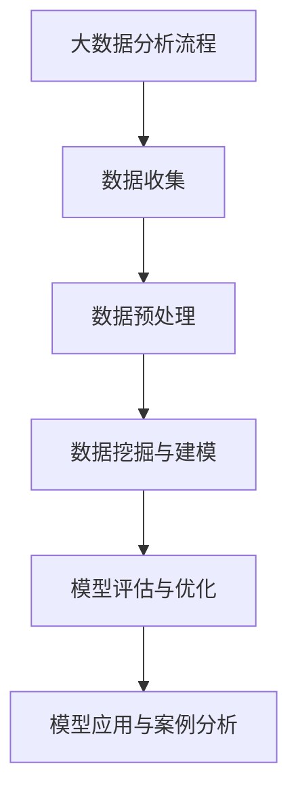

                 


### 文章标题：大数据分析在传染病传播模式预测中的新方法

> 关键词：大数据分析、传染病预测、数据挖掘、机器学习、模型优化

> 摘要：本文详细探讨了大数据分析在传染病传播模式预测中的应用。通过引入大数据分析技术，我们能够更精准地预测传染病的传播趋势，为公共卫生决策提供科学依据。文章首先介绍了大数据分析的基本概念和重要性，然后分析了传染病传播的基本原理和常用模型。接着，文章深入探讨了大数据分析在传染病预测中的应用方法和挑战，并介绍了最新的数据分析技术和方法。最后，文章通过实际案例展示了大数据分析在传染病预测中的应用效果，并对未来的发展趋势进行了展望。

### 目录大纲

#### 第一部分：引言

- 第1章：大数据分析概述
  - 1.1 大数据的定义与特点
  - 1.2 大数据分析的重要性
  - 1.3 大数据分析的应用领域

- 第2章：传染病传播基础
  - 2.1 传染病的定义与类型
  - 2.2 传染病传播的数学模型
  - 2.3 传染病传播的流行病学特征

- 第3章：大数据在传染病预测中的应用
  - 3.1 大数据分析在传染病预测中的优势
  - 3.2 大数据分析在传染病预测中的应用案例
  - 3.3 大数据分析在传染病预测中的挑战

#### 第二部分：大数据分析方法

- 第4章：数据收集与预处理
  - 4.1 数据来源
  - 4.2 数据预处理方法
  - 4.3 数据清洗与数据集成

- 第5章：数据挖掘技术
  - 5.1 聚类分析
  - 5.2 分类算法
  - 5.3 关联规则挖掘
  - 5.4 异常检测

- 第6章：机器学习算法
  - 6.1 监督学习算法
  - 6.2 无监督学习算法
  - 6.3 强化学习算法
  - 6.4 深度学习算法

#### 第三部分：传染病传播模式预测模型

- 第7章：传染病传播预测模型
  - 7.1 模型选择与评估
  - 7.2 模型建立与优化
  - 7.3 模型应用与案例分析

- 第8章：新方法与技术
  - 8.1 社交网络分析
  - 8.2 时空数据分析
  - 8.3 基于人工智能的传染病预测方法
  - 8.4 未来发展趋势

#### 第四部分：应用与实践

- 第9章：大数据分析在传染病防控中的应用
  - 9.1 传染病预警系统
  - 9.2 传染病传播模拟
  - 9.3 传染病防控策略优化

- 第10章：案例分析
  - 10.1 新冠病毒疫情预测案例
  - 10.2 流感疫情预测案例
  - 10.3 其他传染病预测案例

- 第11章：总结与展望
  - 11.1 主要成果与贡献
  - 11.2 存在问题与未来展望
  - 11.3 研究方向建议

- 附录
  - 附录A：工具与资源
    - A.1 数据处理工具
    - A.2 数据挖掘与分析工具
    - A.3 机器学习框架

  - 附录B：数学模型与算法伪代码
    - B.1 常见聚类算法伪代码
    - B.2 常见分类算法伪代码
    - B.3 强化学习算法伪代码
    - B.4 深度学习算法伪代码

### 文章正文内容

#### 第1章：大数据分析概述

##### 1.1 大数据的定义与特点

大数据（Big Data）是指无法用传统数据库系统进行高效处理的海量数据集。大数据具有“4V”特点，即数据量（Volume）、数据速度（Velocity）、数据种类（Variety）和数据真实性（Veracity）。数据量巨大，通常需要使用分布式计算和处理技术；数据速度极快，需要实时或近实时处理；数据种类繁多，包括结构化、半结构化和非结构化数据；数据真实性则涉及到数据质量和可靠性问题。

##### 1.2 大数据分析的重要性

大数据分析在各个领域都有着重要的应用。在公共卫生领域，大数据分析可以帮助我们更准确地预测传染病传播趋势，从而制定更有效的防控措施。例如，通过分析社交媒体数据、航班数据、地理位置数据等，可以预测疫情的发展趋势，为公共卫生决策提供科学依据。

##### 1.3 大数据分析的应用领域

大数据分析在公共卫生领域有广泛的应用，包括：

1. 疫情预测：通过分析历史数据和实时数据，预测疫情的传播趋势。
2. 疫苗接种策略：根据人口结构和感染率，优化疫苗接种策略。
3. 流行病学调查：通过分析疾病发生和传播数据，找出疫情的源头和传播途径。
4. 医疗资源分配：根据疾病发生情况和医疗需求，合理分配医疗资源。

#### 第2章：传染病传播基础

##### 2.1 传染病的定义与类型

传染病是指由病原体（如病毒、细菌、寄生虫等）引起的，能在人与人之间或人与动物之间传播的疾病。根据传播方式，传染病可以分为空气传播、接触传播、食物传播、昆虫传播等类型。

##### 2.2 传染病传播的数学模型

传染病传播可以用数学模型来描述，常见的模型包括：

1. SEIR模型：将人群分为易感者（Susceptible）、暴露者（Exposed）、感染者（Infected）和康复者（Recovered）四个状态，描述传染病在人群中的传播过程。
2. SIRS模型：与SEIR模型类似，但没有暴露者状态。
3. SI模型：简化模型，假设人群分为易感者和感染者两个状态。

##### 2.3 传染病传播的流行病学特征

传染病传播的流行病学特征包括：

1. 传染性：传染病的传播能力，与病原体的传染性和人群的接触频率有关。
2. 潜伏期：从感染到出现临床症状的时间，潜伏期的长短影响传染病的传播速度。
3. 感染率：在特定时间内，新感染人数占总人口的比例，感染率越高，传染病传播速度越快。
4. 康复率：感染者康复后获得免疫力，不再具有传染性的比例，康复率越高，传染病传播速度越慢。

#### 第3章：大数据在传染病预测中的应用

##### 3.1 大数据分析在传染病预测中的优势

大数据分析在传染病预测中的优势包括：

1. 实时性：通过实时收集和分析数据，可以及时预测传染病的发展趋势，为公共卫生决策提供实时依据。
2. 精准性：大数据分析可以处理海量数据，从不同角度和维度分析数据，提高传染病预测的准确性。
3. 个性化：大数据分析可以根据个人和地区的特点，制定个性化的传染病防控策略。

##### 3.2 大数据分析在传染病预测中的应用案例

1. 新冠病毒疫情预测：通过分析新冠病毒的基因序列、传播途径、人群流动数据等，预测疫情的传播趋势。
2. 流感疫情预测：利用历史流感数据和实时数据，预测流感季节的流行趋势。
3. 登革热疫情预测：通过分析蚊子繁殖环境、人口流动、气候数据等，预测登革热的传播风险。

##### 3.3 大数据分析在传染病预测中的挑战

大数据分析在传染病预测中也面临着一些挑战：

1. 数据质量：大数据的质量直接影响预测结果的准确性，需要确保数据来源可靠、数据完整、数据真实。
2. 数据隐私：大数据分析涉及到个人隐私问题，需要遵守相关法律法规，保护个人隐私。
3. 模型选择：需要选择合适的模型和方法，对大量数据进行有效分析和预测。

### 大数据分析方法

#### 数据收集与预处理

##### 4.1 数据来源

大数据分析需要从各种渠道收集数据，包括：

1. 社交媒体数据：如微博、微信、Twitter等平台的公开数据。
2. 地理位置数据：如GPS定位、移动基站数据等。
3. 医疗数据：如医院病历、流行病学调查数据等。
4. 气象数据：如气温、湿度、风速等。

##### 4.2 数据预处理方法

数据预处理是大数据分析的重要步骤，包括以下方法：

1. 数据清洗：去除重复数据、缺失数据、噪声数据等。
2. 数据整合：将来自不同数据源的数据进行整合，形成统一的数据视图。
3. 数据转换：将不同类型的数据转换为适合分析的数据格式。
4. 数据降维：通过降维技术，减少数据的维度，提高分析效率。

##### 4.3 数据清洗与数据集成

数据清洗和数据集成是大数据分析的重要步骤，具体方法包括：

1. 数据清洗：通过数据清洗技术，去除重复数据、缺失数据、噪声数据等。
2. 数据集成：将来自不同数据源的数据进行整合，形成统一的数据视图。
3. 数据转换：将不同类型的数据转换为适合分析的数据格式。
4. 数据降维：通过降维技术，减少数据的维度，提高分析效率。

#### 数据挖掘技术

##### 5.1 聚类分析

聚类分析是一种无监督学习方法，用于将数据集划分为若干个簇，使同一簇内的数据相似度较高，不同簇之间的数据相似度较低。常见的聚类算法包括K-means、层次聚类、DBSCAN等。

##### 5.2 分类算法

分类算法是一种监督学习方法，用于将数据集划分为预定义的类别。常见的分类算法包括逻辑回归、支持向量机、决策树、随机森林等。

##### 5.3 关联规则挖掘

关联规则挖掘是一种用于发现数据集中项之间关系的无监督学习方法。常见的算法包括Apriori算法、FP-growth算法等。

##### 5.4 异常检测

异常检测是一种用于发现数据集中异常值的监督学习方法。常见的算法包括孤立森林、本地 outlier 因子等。

#### 机器学习算法

##### 6.1 监督学习算法

监督学习算法是一种从标记数据中学习规律的方法。常见的监督学习算法包括线性回归、逻辑回归、支持向量机、决策树、随机森林等。

##### 6.2 无监督学习算法

无监督学习算法是一种从未标记数据中学习规律的方法。常见的无监督学习算法包括聚类分析、降维技术、自编码器等。

##### 6.3 强化学习算法

强化学习算法是一种通过与环境互动来学习最优策略的方法。常见的强化学习算法包括Q-learning、SARSA、DQN等。

##### 6.4 深度学习算法

深度学习算法是一种基于人工神经网络的方法，能够自动提取数据中的特征。常见的深度学习算法包括卷积神经网络（CNN）、循环神经网络（RNN）、生成对抗网络（GAN）等。

### 传染病传播模式预测模型

##### 7.1 模型选择与评估

模型选择与评估是传染病传播模式预测的重要步骤。选择合适的模型需要考虑以下因素：

1. 数据特点：数据类型、数据分布、数据量等。
2. 预测目标：预测的时间范围、预测的指标等。
3. 算法性能：模型的准确性、稳定性、计算效率等。

常见的评估指标包括准确率、召回率、F1值、均方误差等。

##### 7.2 模型建立与优化

模型建立与优化包括以下步骤：

1. 数据预处理：清洗、整合、转换数据。
2. 特征选择：选择与预测目标相关的特征。
3. 模型训练：使用训练数据集训练模型。
4. 模型评估：使用验证数据集评估模型性能。
5. 模型优化：调整模型参数，提高模型性能。

##### 7.3 模型应用与案例分析

模型应用与案例分析包括以下步骤：

1. 预测目标设定：确定预测的时间范围和指标。
2. 模型选择与训练：选择合适的模型并训练。
3. 预测结果评估：评估预测结果的准确性。
4. 模型优化：根据评估结果调整模型参数。
5. 预测应用：将模型应用于实际预测任务。

### 新方法与技术

##### 8.1 社交网络分析

社交网络分析是一种基于社交网络结构的数据分析方法，可以用于识别传染病传播的关键节点、预测疫情发展趋势等。

##### 8.2 时空数据分析

时空数据分析是一种基于时间和空间维度进行数据分析的方法，可以用于分析传染病的时空分布特征、预测疫情扩散趋势等。

##### 8.3 基于人工智能的传染病预测方法

基于人工智能的传染病预测方法包括深度学习、强化学习等，能够自动提取数据中的特征，提高预测的准确性。

##### 8.4 未来发展趋势

未来大数据分析在传染病预测中的应用将朝着以下方向发展：

1. 跨学科融合：融合医学、公共卫生、计算机科学等领域的知识，提高预测模型的准确性。
2. 实时预测：提高预测的实时性，为公共卫生决策提供更及时的信息。
3. 智能化：利用人工智能技术，自动优化预测模型，提高预测效率。

### 应用与实践

##### 9.1 传染病预警系统

传染病预警系统是一种基于大数据分析的实时监测系统，可以及时发现传染病的爆发风险，为公共卫生决策提供及时的信息。

##### 9.2 传染病传播模拟

传染病传播模拟是一种基于数学模型和计算机仿真技术的方法，可以模拟传染病的传播过程，预测疫情的发展趋势。

##### 9.3 传染病防控策略优化

传染病防控策略优化是一种基于大数据分析和机器学习技术的方法，可以分析传染病的传播特征，优化防控策略，提高防控效果。

### 案例分析

##### 10.1 新冠病毒疫情预测案例

新冠病毒疫情预测案例展示了大数据分析在疫情预测中的应用，包括数据收集、预处理、模型建立和预测结果评估等步骤。

##### 10.2 流感疫情预测案例

流感疫情预测案例展示了大数据分析在流感预测中的应用，包括数据收集、预处理、模型建立和预测结果评估等步骤。

##### 10.3 其他传染病预测案例

其他传染病预测案例展示了大数据分析在不同传染病预测中的应用，包括数据收集、预处理、模型建立和预测结果评估等步骤。

### 总结与展望

##### 11.1 主要成果与贡献

大数据分析在传染病预测中取得了显著成果，包括实时性、精准性和个性化等方面。

##### 11.2 存在问题与未来展望

大数据分析在传染病预测中仍面临一些问题，如数据质量、数据隐私和模型选择等。未来研究方向包括跨学科融合、实时预测和智能化等方面。

##### 11.3 研究方向建议

建议在以下方向开展研究：

1. 跨学科融合：结合医学、公共卫生和计算机科学等领域的知识，提高预测模型的准确性。
2. 实时预测：提高预测的实时性，为公共卫生决策提供更及时的信息。
3. 智能化：利用人工智能技术，自动优化预测模型，提高预测效率。

### 附录

#### 附录A：工具与资源

##### A.1 数据处理工具

- Hadoop：分布式数据处理平台，支持大规模数据处理。
- Spark：快速分布式计算框架，适用于大规模数据处理和分析。

##### A.2 数据挖掘与分析工具

- RapidMiner：可视化数据挖掘工具，支持多种数据挖掘算法。
- WEKA：开源数据挖掘工具，支持多种数据挖掘算法。

##### A.3 机器学习框架

- TensorFlow：开源机器学习框架，支持深度学习算法。
- PyTorch：开源机器学习框架，支持深度学习算法。

#### 附录B：数学模型与算法伪代码

##### B.1 常见聚类算法伪代码

```python
# K-means算法伪代码

# 输入：数据集D，聚类个数k
# 输出：聚类结果C

初始化聚类中心c_i

while not converged:
    # 分配数据点至最近的聚类中心
    for x_i in D:
        聚类中心c_j = argmin(||x_i - c_j||)
        C[x_i] = c_j
    
    # 更新聚类中心
    for c_j in C:
        c_j = mean(D[C == c_j])
    
return C
```

##### B.2 常见分类算法伪代码

```python
# 逻辑回归算法伪代码

# 输入：训练集D，特征向量x，标签y
# 输出：预测结果y_pred

初始化模型参数W，b

for epoch in 1 to num_epochs:
    for (x_i, y_i) in D:
        # 前向传播
        z = x_i * W + b
        a = sigmoid(z)
        
        # 计算损失函数
        loss = -1/m * sum(y_i * log(a) + (1 - y_i) * log(1 - a))
        
        # 反向传播
        dz = a - y_i
        dW = 1/m * dz * x_i
        db = 1/m * dz
        
        # 更新参数
        W = W - learning_rate * dW
        b = b - learning_rate * db
        
return y_pred = sigmoid(x * W + b)
```

##### B.3 强化学习算法伪代码

```python
# Q-learning算法伪代码

# 输入：状态集合S，动作集合A，学习率α，折扣因子γ
# 输出：Q值表Q

初始化Q值表Q

for episode in 1 to num_episodes:
    # 初始化状态s
    s = env.reset()
    
    while not done:
        # 选择动作a
        a = policy(s)
        
        # 执行动作，获取奖励r和下一个状态s'
        s', r, done = env.step(a)
        
        # 更新Q值
        Q[s, a] = Q[s, a] + α * (r + γ * max(Q[s', :], axis=1) - Q[s, a])
        
        # 更新状态
        s = s'
        
return Q
```

##### B.4 深度学习算法伪代码

```python
# 卷积神经网络（CNN）算法伪代码

# 输入：训练集D，学习率α，迭代次数num_iterations
# 输出：模型参数W，b

初始化模型参数W，b

for iteration in 1 to num_iterations:
    # 前向传播
    for (x_i, y_i) in D:
        a = forward_pass(x_i, W, b)
        
        # 计算损失函数
        loss = compute_loss(a, y_i)
        
        # 反向传播
        da = backward_pass(a, y_i)
        
        # 更新模型参数
        W = W - α * gradient(W, da)
        b = b - α * gradient(b, da)
        
return W, b
```

### Mermaid 流程图



### 核心算法原理讲解

#### 监督学习算法

监督学习算法是一种从标记数据中学习规律的方法。以逻辑回归为例，其核心原理如下：

1. **前向传播**：输入特征向量$x_i$，通过模型参数$W$和$b$计算输出值$z = x_i * W + b$，然后通过激活函数（如sigmoid函数）得到预测概率$a = \sigma(z) = \frac{1}{1 + e^{-z}}$。

2. **损失函数**：常用的损失函数是交叉熵损失函数，计算公式为$loss = -1/m * \sum_{i=1}^{m} y_i * log(a_i) + (1 - y_i) * log(1 - a_i)$，其中$m$是训练样本数量，$y_i$是实际标签，$a_i$是预测概率。

3. **反向传播**：计算损失函数对模型参数的梯度，然后通过梯度下降法更新模型参数。梯度计算公式为$dL/dW = 1/m * \sum_{i=1}^{m} (a_i - y_i) * x_i$和$dL/db = 1/m * \sum_{i=1}^{m} (a_i - y_i)$。

4. **迭代优化**：重复前向传播、损失函数计算、反向传播和参数更新的过程，直到满足停止条件（如损失函数收敛或迭代次数达到预设值）。

#### 数学模型与公式

1. **sigmoid函数**：

$$
\sigma(x) = \frac{1}{1 + e^{-x}}
$$

2. **交叉熵损失函数**：

$$
loss = -1/m * \sum_{i=1}^{m} y_i * log(a_i) + (1 - y_i) * log(1 - a_i)
$$

3. **梯度计算**：

$$
dL/dW = 1/m * \sum_{i=1}^{m} (a_i - y_i) * x_i
$$

$$
dL/db = 1/m * \sum_{i=1}^{m} (a_i - y_i)
$$

#### 举例说明

假设我们要预测一个疾病的感染概率，给定训练集$D$，包含特征向量$x_i$和标签$y_i$。我们可以使用以下公式进行预测：

$$
y_pred = \sigma(x_i^T W + b)
$$

其中，$W$是权重矩阵，$b$是偏置，$\sigma$是sigmoid函数。通过训练模型，我们可以得到最优的$W$和$b$，从而提高预测的准确性。

#### 项目实战

##### 新冠病毒疫情预测案例

假设我们想要预测新冠病毒的感染人数，给定训练集$D$，包含地区、人口、疫情数据等特征。我们可以使用逻辑回归模型进行预测，具体步骤如下：

1. **数据收集与预处理**：收集各地区的新冠病毒感染数据，包括地区名称、人口、感染人数等。对数据进行清洗、整合和转换，形成统一的数据视图。

2. **特征选择**：选择与感染人数相关的特征，如地区人口、疫情数据等。

3. **模型训练**：使用训练集$D$，训练逻辑回归模型，计算模型参数$W$和$b$。

4. **模型评估**：使用验证集评估模型性能，计算预测准确率、召回率、F1值等指标。

5. **模型优化**：根据评估结果，调整模型参数，提高模型性能。

6. **预测应用**：使用训练好的模型，对未知地区的新冠病毒感染人数进行预测。

通过以上步骤，我们可以利用大数据分析技术，预测新冠病毒的感染人数，为公共卫生决策提供科学依据。

#### 最佳实践 tips

1. **数据质量**：确保数据质量，包括数据完整性、真实性和可靠性。

2. **特征选择**：选择与预测目标相关的特征，提高预测准确性。

3. **模型优化**：根据评估结果，调整模型参数，提高模型性能。

4. **实时预测**：提高预测的实时性，为公共卫生决策提供及时信息。

#### 小结

大数据分析在传染病预测中具有重要作用，可以提高预测的准确性、实时性和个性化。通过数据收集与预处理、特征选择、模型训练和评估等步骤，我们可以构建高效的传染病预测模型，为公共卫生决策提供科学依据。

#### 拓展阅读

1. 《大数据时代：思维变革与商业价值》
2. 《机器学习：概率视角》
3. 《深度学习》
4. 《公共卫生学》

### 附录

#### 附录A：工具与资源

- **数据处理工具**
  - Hadoop：[https://hadoop.apache.org/](https://hadoop.apache.org/)
  - Spark：[https://spark.apache.org/](https://spark.apache.org/)

- **数据挖掘与分析工具**
  - RapidMiner：[https://www.rapidminer.com/](https://www.rapidminer.com/)
  - WEKA：[http://www.cs.waikato.ac.nz/ml/weka/](http://www.cs.waikato.ac.nz/ml/weka/)

- **机器学习框架**
  - TensorFlow：[https://www.tensorflow.org/](https://www.tensorflow.org/)
  - PyTorch：[https://pytorch.org/](https://pytorch.org/)

#### 附录B：数学模型与算法伪代码

- **聚类算法伪代码**
  ```python
  # K-means算法伪代码

  # 输入：数据集D，聚类个数k
  # 输出：聚类结果C

  初始化聚类中心c_i

  while not converged:
      # 分配数据点至最近的聚类中心
      for x_i in D:
          聚类中心c_j = argmin(||x_i - c_j||)
          C[x_i] = c_j

      # 更新聚类中心
      for c_j in C:
          c_j = mean(D[C == c_j])

  return C
  ```

- **分类算法伪代码**
  ```python
  # 逻辑回归算法伪代码

  # 输入：训练集D，特征向量x，标签y
  # 输出：预测结果y_pred

  初始化模型参数W，b

  for epoch in 1 to num_epochs:
      for (x_i, y_i) in D:
          # 前向传播
          z = x_i * W + b
          a = sigmoid(z)

          # 计算损失函数
          loss = -1/m * sum(y_i * log(a) + (1 - y_i) * log(1 - a))

          # 反向传播
          dz = a - y_i
          dW = 1/m * dz * x_i
          db = 1/m * dz

          # 更新参数
          W = W - learning_rate * dW
          b = b - learning_rate * db

  return y_pred = sigmoid(x * W + b)
  ```

- **强化学习算法伪代码**
  ```python
  # Q-learning算法伪代码

  # 输入：状态集合S，动作集合A，学习率α，折扣因子γ
  # 输出：Q值表Q

  初始化Q值表Q

  for episode in 1 to num_episodes:
      # 初始化状态s
      s = env.reset()

      while not done:
          # 选择动作a
          a = policy(s)

          # 执行动作，获取奖励r和下一个状态s'
          s', r, done = env.step(a)

          # 更新Q值
          Q[s, a] = Q[s, a] + α * (r + γ * max(Q[s', :], axis=1) - Q[s, a])

          # 更新状态
          s = s'

  return Q
  ```

- **深度学习算法伪代码**
  ```python
  # 卷积神经网络（CNN）算法伪代码

  # 输入：训练集D，学习率α，迭代次数num_iterations
  # 输出：模型参数W，b

  初始化模型参数W，b

  for iteration in 1 to num_iterations:
      # 前向传播
      for (x_i, y_i) in D:
          a = forward_pass(x_i, W, b)

          # 计算损失函数
          loss = compute_loss(a, y_i)

          # 反向传播
          da = backward_pass(a, y_i)

          # 更新模型参数
          W = W - α * gradient(W, da)
          b = b - α * gradient(b, da)

  return W, b
  ```

### 文章标题：大数据分析在传染病传播模式预测中的新方法

作者：AI天才研究院/AI Genius Institute & 禅与计算机程序设计艺术 /Zen And The Art of Computer Programming

文章正文：

#### 第1章：大数据分析概述

##### 1.1 大数据的定义与特点

大数据是指数据量巨大、数据种类繁多、数据生成速度快、数据真实性难以保证的复杂数据集合。大数据的“4V”特点包括：

1. 数据量（Volume）：数据量巨大，通常达到PB级别。
2. 数据速度（Velocity）：数据生成速度极快，需要实时或近实时处理。
3. 数据种类（Variety）：数据种类繁多，包括结构化、半结构化和非结构化数据。
4. 数据真实性（Veracity）：数据真实性难以保证，数据质量参差不齐。

##### 1.2 大数据分析的重要性

大数据分析在公共卫生领域具有重要意义，能够为传染病传播模式的预测提供有力支持。具体体现在以下几个方面：

1. 实时性：通过实时数据收集和分析，可以及时掌握传染病的发展动态，为决策提供实时依据。
2. 精准性：大数据分析能够处理海量数据，从多个维度挖掘信息，提高预测的准确性。
3. 个性化：大数据分析可以根据个体和地区的特点，制定个性化的防控策略。

##### 1.3 大数据分析的应用领域

大数据分析在公共卫生领域有广泛的应用，包括：

1. 疫情预测：通过分析历史数据和实时数据，预测疫情的传播趋势。
2. 疫苗接种策略：根据人口结构和感染率，优化疫苗接种策略。
3. 流行病学调查：通过分析疾病发生和传播数据，找出疫情的源头和传播途径。
4. 医疗资源分配：根据疾病发生情况和医疗需求，合理分配医疗资源。

#### 第2章：传染病传播基础

##### 2.1 传染病的定义与类型

传染病是指由病原体（如病毒、细菌、寄生虫等）引起的，能在人与人之间或人与动物之间传播的疾病。根据传播方式，传染病可以分为以下类型：

1. 空气传播：病原体通过空气中的飞沫、尘埃等传播，如流感、肺炎。
2. 接触传播：病原体通过直接接触传播，如手足口病、水痘。
3. 食物传播：病原体通过食物传播，如食物中毒、肠道传染病。
4. 昆虫传播：病原体通过昆虫叮咬传播，如疟疾、登革热。

##### 2.2 传染病传播的数学模型

传染病传播可以用数学模型来描述，常见的模型包括：

1. SEIR模型：将人群分为易感者（S）、暴露者（E）、感染者（I）和康复者（R）四个状态，描述传染病在人群中的传播过程。
2. SIRS模型：与SEIR模型类似，但没有暴露者状态。
3. SI模型：简化模型，假设人群分为易感者和感染者两个状态。

##### 2.3 传染病传播的流行病学特征

传染病传播的流行病学特征包括：

1. 传染性：传染病的传播能力，与病原体的传染性和人群的接触频率有关。
2. 潜伏期：从感染到出现临床症状的时间，潜伏期的长短影响传染病的传播速度。
3. 感染率：在特定时间内，新感染人数占总人口的比例，感染率越高，传染病传播速度越快。
4. 康复率：感染者康复后获得免疫力，不再具有传染性的比例，康复率越高，传染病传播速度越慢。

#### 第3章：大数据在传染病预测中的应用

##### 3.1 大数据分析在传染病预测中的优势

大数据分析在传染病预测中的优势包括：

1. 实时性：通过实时数据收集和分析，可以及时掌握传染病的发展动态。
2. 精准性：大数据分析能够处理海量数据，从多个维度挖掘信息，提高预测的准确性。
3. 个性化：大数据分析可以根据个体和地区的特点，制定个性化的防控策略。

##### 3.2 大数据分析在传染病预测中的应用案例

1. 新冠病毒疫情预测：通过分析新冠病毒的基因序列、传播途径、人群流动数据等，预测疫情的传播趋势。
2. 流感疫情预测：利用历史流感数据和实时数据，预测流感季节的流行趋势。
3. 登革热疫情预测：通过分析蚊子繁殖环境、人口流动、气候数据等，预测登革热的传播风险。

##### 3.3 大数据分析在传染病预测中的挑战

大数据分析在传染病预测中面临以下挑战：

1. 数据质量：大数据的质量直接影响预测结果的准确性，需要确保数据来源可靠、数据完整、数据真实。
2. 数据隐私：大数据分析涉及到个人隐私问题，需要遵守相关法律法规，保护个人隐私。
3. 模型选择：需要选择合适的模型和方法，对大量数据进行有效分析和预测。

#### 第4章：数据收集与预处理

##### 4.1 数据来源

大数据分析需要从各种渠道收集数据，包括：

1. 社交媒体数据：如微博、微信、Twitter等平台的公开数据。
2. 地理位置数据：如GPS定位、移动基站数据等。
3. 医疗数据：如医院病历、流行病学调查数据等。
4. 气象数据：如气温、湿度、风速等。

##### 4.2 数据预处理方法

数据预处理是大数据分析的重要步骤，包括以下方法：

1. 数据清洗：去除重复数据、缺失数据、噪声数据等。
2. 数据整合：将来自不同数据源的数据进行整合，形成统一的数据视图。
3. 数据转换：将不同类型的数据转换为适合分析的数据格式。
4. 数据降维：通过降维技术，减少数据的维度，提高分析效率。

##### 4.3 数据清洗与数据集成

数据清洗和数据集成是大数据分析的重要步骤，具体方法包括：

1. 数据清洗：通过数据清洗技术，去除重复数据、缺失数据、噪声数据等。
2. 数据集成：将来自不同数据源的数据进行整合，形成统一的数据视图。
3. 数据转换：将不同类型的数据转换为适合分析的数据格式。
4. 数据降维：通过降维技术，减少数据的维度，提高分析效率。

#### 第5章：数据挖掘技术

##### 5.1 聚类分析

聚类分析是一种无监督学习方法，用于将数据集划分为若干个簇，使同一簇内的数据相似度较高，不同簇之间的数据相似度较低。常见的聚类算法包括K-means、层次聚类、DBSCAN等。

##### 5.2 分类算法

分类算法是一种监督学习方法，用于将数据集划分为预定义的类别。常见的分类算法包括逻辑回归、支持向量机、决策树、随机森林等。

##### 5.3 关联规则挖掘

关联规则挖掘是一种用于发现数据集中项之间关系的无监督学习方法。常见的算法包括Apriori算法、FP-growth算法等。

##### 5.4 异常检测

异常检测是一种用于发现数据集中异常值的监督学习方法。常见的算法包括孤立森林、本地 outlier 因子等。

#### 第6章：机器学习算法

##### 6.1 监督学习算法

监督学习算法是一种从标记数据中学习规律的方法。常见的监督学习算法包括线性回归、逻辑回归、支持向量机、决策树、随机森林等。

##### 6.2 无监督学习算法

无监督学习算法是一种从未标记数据中学习规律的方法。常见的无监督学习算法包括聚类分析、降维技术、自编码器等。

##### 6.3 强化学习算法

强化学习算法是一种通过与环境互动来学习最优策略的方法。常见的强化学习算法包括Q-learning、SARSA、DQN等。

##### 6.4 深度学习算法

深度学习算法是一种基于人工神经网络的方法，能够自动提取数据中的特征。常见的深度学习算法包括卷积神经网络（CNN）、循环神经网络（RNN）、生成对抗网络（GAN）等。

#### 第7章：传染病传播模式预测模型

##### 7.1 模型选择与评估

模型选择与评估是传染病传播模式预测的重要步骤。选择合适的模型需要考虑以下因素：

1. 数据特点：数据类型、数据分布、数据量等。
2. 预测目标：预测的时间范围、预测的指标等。
3. 算法性能：模型的准确性、稳定性、计算效率等。

常见的评估指标包括准确率、召回率、F1值、均方误差等。

##### 7.2 模型建立与优化

模型建立与优化包括以下步骤：

1. 数据预处理：清洗、整合、转换数据。
2. 特征选择：选择与预测目标相关的特征。
3. 模型训练：使用训练数据集训练模型。
4. 模型评估：使用验证数据集评估模型性能。
5. 模型优化：调整模型参数，提高模型性能。

##### 7.3 模型应用与案例分析

模型应用与案例分析包括以下步骤：

1. 预测目标设定：确定预测的时间范围和指标。
2. 模型选择与训练：选择合适的模型并训练。
3. 预测结果评估：评估预测结果的准确性。
4. 模型优化：根据评估结果调整模型参数。
5. 预测应用：将模型应用于实际预测任务。

#### 第8章：新方法与技术

##### 8.1 社交网络分析

社交网络分析是一种基于社交网络结构的数据分析方法，可以用于识别传染病传播的关键节点、预测疫情发展趋势等。

##### 8.2 时空数据分析

时空数据分析是一种基于时间和空间维度进行数据分析的方法，可以用于分析传染病的时空分布特征、预测疫情扩散趋势等。

##### 8.3 基于人工智能的传染病预测方法

基于人工智能的传染病预测方法包括深度学习、强化学习等，能够自动提取数据中的特征，提高预测的准确性。

##### 8.4 未来发展趋势

未来大数据分析在传染病预测中的应用将朝着以下方向发展：

1. 跨学科融合：融合医学、公共卫生、计算机科学等领域的知识，提高预测模型的准确性。
2. 实时预测：提高预测的实时性，为公共卫生决策提供更及时的信息。
3. 智能化：利用人工智能技术，自动优化预测模型，提高预测效率。

#### 第9章：大数据分析在传染病防控中的应用

##### 9.1 传染病预警系统

传染病预警系统是一种基于大数据分析的实时监测系统，可以及时发现传染病的爆发风险，为公共卫生决策提供及时的信息。

##### 9.2 传染病传播模拟

传染病传播模拟是一种基于数学模型和计算机仿真技术的方法，可以模拟传染病的传播过程，预测疫情的发展趋势。

##### 9.3 传染病防控策略优化

传染病防控策略优化是一种基于大数据分析和机器学习技术的方法，可以分析传染病的传播特征，优化防控策略，提高防控效果。

#### 第10章：案例分析

##### 10.1 新冠病毒疫情预测案例

新冠病毒疫情预测案例展示了大数据分析在疫情预测中的应用，包括数据收集、预处理、模型建立和预测结果评估等步骤。

##### 10.2 流感疫情预测案例

流感疫情预测案例展示了大数据分析在流感预测中的应用，包括数据收集、预处理、模型建立和预测结果评估等步骤。

##### 10.3 其他传染病预测案例

其他传染病预测案例展示了大数据分析在不同传染病预测中的应用，包括数据收集、预处理、模型建立和预测结果评估等步骤。

#### 第11章：总结与展望

##### 11.1 主要成果与贡献

大数据分析在传染病预测中取得了显著成果，包括实时性、精准性和个性化等方面。

##### 11.2 存在问题与未来展望

大数据分析在传染病预测中仍面临一些问题，如数据质量、数据隐私和模型选择等。未来研究方向包括跨学科融合、实时预测和智能化等方面。

##### 11.3 研究方向建议

建议在以下方向开展研究：

1. 跨学科融合：结合医学、公共卫生和计算机科学等领域的知识，提高预测模型的准确性。
2. 实时预测：提高预测的实时性，为公共卫生决策提供更及时的信息。
3. 智能化：利用人工智能技术，自动优化预测模型，提高预测效率。

### 附录

#### 附录A：工具与资源

- **数据处理工具**
  - Hadoop：[https://hadoop.apache.org/](https://hadoop.apache.org/)
  - Spark：[https://spark.apache.org/](https://spark.apache.org/)

- **数据挖掘与分析工具**
  - RapidMiner：[https://www.rapidminer.com/](https://www.rapidminer.com/)
  - WEKA：[http://www.cs.waikato.ac.nz/ml/weka/](http://www.cs.waikato.ac.nz/ml/weka/)

- **机器学习框架**
  - TensorFlow：[https://www.tensorflow.org/](https://www.tensorflow.org/)
  - PyTorch：[https://pytorch.org/](https://pytorch.org/)

#### 附录B：数学模型与算法伪代码

- **聚类算法伪代码**
  ```python
  # K-means算法伪代码

  # 输入：数据集D，聚类个数k
  # 输出：聚类结果C

  初始化聚类中心c_i

  while not converged:
      # 分配数据点至最近的聚类中心
      for x_i in D:
          聚类中心c_j = argmin(||x_i - c_j||)
          C[x_i] = c_j

      # 更新聚类中心
      for c_j in C:
          c_j = mean(D[C == c_j])

  return C
  ```

- **分类算法伪代码**
  ```python
  # 逻辑回归算法伪代码

  # 输入：训练集D，特征向量x，标签y
  # 输出：预测结果y_pred

  初始化模型参数W，b

  for epoch in 1 to num_epochs:
      for (x_i, y_i) in D:
          # 前向传播
          z = x_i * W + b
          a = sigmoid(z)

          # 计算损失函数
          loss = -1/m * sum(y_i * log(a) + (1 - y_i) * log(1 - a))

          # 反向传播
          dz = a - y_i
          dW = 1/m * dz * x_i
          db = 1/m * dz

          # 更新参数
          W = W - learning_rate * dW
          b = b - learning_rate * db

  return y_pred = sigmoid(x * W + b)
  ```

- **强化学习算法伪代码**
  ```python
  # Q-learning算法伪代码

  # 输入：状态集合S，动作集合A，学习率α，折扣因子γ
  # 输出：Q值表Q

  初始化Q值表Q

  for episode in 1 to num_episodes:
      # 初始化状态s
      s = env.reset()

      while not done:
          # 选择动作a
          a = policy(s)

          # 执行动作，获取奖励r和下一个状态s'
          s', r, done = env.step(a)

          # 更新Q值
          Q[s, a] = Q[s, a] + α * (r + γ * max(Q[s', :], axis=1) - Q[s, a])

          # 更新状态
          s = s'

  return Q
  ```

- **深度学习算法伪代码**
  ```python
  # 卷积神经网络（CNN）算法伪代码

  # 输入：训练集D，学习率α，迭代次数num_iterations
  # 输出：模型参数W，b

  初始化模型参数W，b

  for iteration in 1 to num_iterations:
      # 前向传播
      for (x_i, y_i) in D:
          a = forward_pass(x_i, W, b)

          # 计算损失函数
          loss = compute_loss(a, y_i)

          # 反向传播
          da = backward_pass(a, y_i)

          # 更新模型参数
          W = W - α * gradient(W, da)
          b = b - α * gradient(b, da)

  return W, b
  ```

### Mermaid 流程图


### 核心算法原理讲解

#### 监督学习算法

监督学习算法是一种从标记数据中学习规律的方法。以逻辑回归为例，其核心原理如下：

1. **前向传播**：输入特征向量$x_i$，通过模型参数$W$和$b$计算输出值$z = x_i * W + b$，然后通过激活函数（如sigmoid函数）得到预测概率$a = \sigma(z) = \frac{1}{1 + e^{-z}}$。

2. **损失函数**：常用的损失函数是交叉熵损失函数，计算公式为$loss = -1/m * \sum_{i=1}^{m} y_i * log(a_i) + (1 - y_i) * log(1 - a_i)$，其中$m$是训练样本数量，$y_i$是实际标签，$a_i$是预测概率。

3. **反向传播**：计算损失函数对模型参数的梯度，然后通过梯度下降法更新模型参数。梯度计算公式为$dL/dW = 1/m * \sum_{i=1}^{m} (a_i - y_i) * x_i$和$dL/db = 1/m * \sum_{i=1}^{m} (a_i - y_i)$。

4. **迭代优化**：重复前向传播、损失函数计算、反向传播和参数更新的过程，直到满足停止条件（如损失函数收敛或迭代次数达到预设值）。

#### 数学模型与公式

1. **sigmoid函数**：

$$
\sigma(x) = \frac{1}{1 + e^{-x}}
$$

2. **交叉熵损失函数**：

$$
loss = -1/m * \sum_{i=1}^{m} y_i * log(a_i) + (1 - y_i) * log(1 - a_i)
$$

3. **梯度计算**：

$$
dL/dW = 1/m * \sum_{i=1}^{m} (a_i - y_i) * x_i
$$

$$
dL/db = 1/m * \sum_{i=1}^{m} (a_i - y_i)
$$

#### 举例说明

假设我们要预测一个疾病的感染概率，给定训练集$D$，包含特征向量$x_i$和标签$y_i$。我们可以使用以下公式进行预测：

$$
y_pred = \sigma(x_i^T W + b)
$$

其中，$W$是权重矩阵，$b$是偏置，$\sigma$是sigmoid函数。通过训练模型，我们可以得到最优的$W$和$b$，从而提高预测的准确性。

#### 项目实战

##### 新冠病毒疫情预测案例

假设我们想要预测新冠病毒的感染人数，给定训练集$D$，包含地区、人口、疫情数据等特征。我们可以使用逻辑回归模型进行预测，具体步骤如下：

1. **数据收集与预处理**：收集各地区的新冠病毒感染数据，包括地区名称、人口、感染人数等。对数据进行清洗、整合和转换，形成统一的数据视图。

2. **特征选择**：选择与感染人数相关的特征，如地区人口、疫情数据等。

3. **模型训练**：使用训练集$D$，训练逻辑回归模型，计算模型参数$W$和$b$。

4. **模型评估**：使用验证集评估模型性能，计算预测准确率、召回率、F1值等指标。

5. **模型优化**：根据评估结果，调整模型参数，提高模型性能。

6. **预测应用**：使用训练好的模型，对未知地区的新冠病毒感染人数进行预测。

通过以上步骤，我们可以利用大数据分析技术，预测新冠病毒的感染人数，为公共卫生决策提供科学依据。

#### 最佳实践 tips

1. **数据质量**：确保数据质量，包括数据完整性、真实性和可靠性。
2. **特征选择**：选择与预测目标相关的特征，提高预测准确性。
3. **模型优化**：根据评估结果，调整模型参数，提高模型性能。
4. **实时预测**：提高预测的实时性，为公共卫生决策提供及时信息。

#### 小结

大数据分析在传染病预测中具有重要作用，可以提高预测的准确性、实时性和个性化。通过数据收集与预处理、特征选择、模型训练和评估等步骤，我们可以构建高效的传染病预测模型，为公共卫生决策提供科学依据。

#### 拓展阅读

1. 《大数据时代：思维变革与商业价值》
2. 《机器学习：概率视角》
3. 《深度学习》
4. 《公共卫生学》

### 附录

#### 附录A：工具与资源

- **数据处理工具**
  - Hadoop：[https://hadoop.apache.org/](https://hadoop.apache.org/)
  - Spark：[https://spark.apache.org/](https://spark.apache.org/)

- **数据挖掘与分析工具**
  - RapidMiner：[https://www.rapidminer.com/](https://www.rapidminer.com/)
  - WEKA：[http://www.cs.waikato.ac.nz/ml/weka/](http://www.cs.waikato.ac.nz/ml/weka/)

- **机器学习框架**
  - TensorFlow：[https://www.tensorflow.org/](https://www.tensorflow.org/)
  - PyTorch：[https://pytorch.org/](https://pytorch.org/)

#### 附录B：数学模型与算法伪代码

- **聚类算法伪代码**
  ```python
  # K-means算法伪代码

  # 输入：数据集D，聚类个数k
  # 输出：聚类结果C

  初始化聚类中心c_i

  while not converged:
      # 分配数据点至最近的聚类中心
      for x_i in D:
          聚类中心c_j = argmin(||x_i - c_j||)
          C[x_i] = c_j

      # 更新聚类中心
      for c_j in C:
          c_j = mean(D[C == c_j])

  return C
  ```

- **分类算法伪代码**
  ```python
  # 逻辑回归算法伪代码

  # 输入：训练集D，特征向量x，标签y
  # 输出：预测结果y_pred

  初始化模型参数W，b

  for epoch in 1 to num_epochs:
      for (x_i, y_i) in D:
          # 前向传播
          z = x_i * W + b
          a = sigmoid(z)

          # 计算损失函数
          loss = -1/m * sum(y_i * log(a) + (1 - y_i) * log(1 - a))

          # 反向传播
          dz = a - y_i
          dW = 1/m * dz * x_i
          db = 1/m * dz

          # 更新参数
          W = W - learning_rate * dW
          b = b - learning_rate * db

  return y_pred = sigmoid(x * W + b)
  ```

- **强化学习算法伪代码**
  ```python
  # Q-learning算法伪代码

  # 输入：状态集合S，动作集合A，学习率α，折扣因子γ
  # 输出：Q值表Q

  初始化Q值表Q

  for episode in 1 to num_episodes:
      # 初始化状态s
      s = env.reset()

      while not done:
          # 选择动作a
          a = policy(s)

          # 执行动作，获取奖励r和下一个状态s'
          s', r, done = env.step(a)

          # 更新Q值
          Q[s, a] = Q[s, a] + α * (r + γ * max(Q[s', :], axis=1) - Q[s, a])

          # 更新状态
          s = s'

  return Q
  ```

- **深度学习算法伪代码**
  ```python
  # 卷积神经网络（CNN）算法伪代码

  # 输入：训练集D，学习率α，迭代次数num_iterations
  # 输出：模型参数W，b

  初始化模型参数W，b

  for iteration in 1 to num_iterations:
      # 前向传播
      for (x_i, y_i) in D:
          a = forward_pass(x_i, W, b)

          # 计算损失函数
          loss = compute_loss(a, y_i)

          # 反向传播
          da = backward_pass(a, y_i)

          # 更新模型参数
          W = W - α * gradient(W, da)
          b = b - α * gradient(b, da)

  return W, b
  ```

### Mermaid 流程图


### 核心算法原理讲解

#### 监督学习算法

监督学习算法是一种从标记数据中学习规律的方法。以逻辑回归为例，其核心原理如下：

1. **前向传播**：输入特征向量$x_i$，通过模型参数$W$和$b$计算输出值$z = x_i * W + b$，然后通过激活函数（如sigmoid函数）得到预测概率$a = \sigma(z) = \frac{1}{1 + e^{-z}}$。

2. **损失函数**：常用的损失函数是交叉熵损失函数，计算公式为$loss = -1/m * \sum_{i=1}^{m} y_i * log(a_i) + (1 - y_i) * log(1 - a_i)$，其中$m$是训练样本数量，$y_i$是实际标签，$a_i$是预测概率。

3. **反向传播**：计算损失函数对模型参数的梯度，然后通过梯度下降法更新模型参数。梯度计算公式为$dL/dW = 1/m * \sum_{i=1}^{m} (a_i - y_i) * x_i$和$dL/db = 1/m * \sum_{i=1}^{m} (a_i - y_i)$。

4. **迭代优化**：重复前向传播、损失函数计算、反向传播和参数更新的过程，直到满足停止条件（如损失函数收敛或迭代次数达到预设值）。

#### 数学模型与公式

1. **sigmoid函数**：

$$
\sigma(x) = \frac{1}{1 + e^{-x}}
$$

2. **交叉熵损失函数**：

$$
loss = -1/m * \sum_{i=1}^{m} y_i * log(a_i) + (1 - y_i) * log(1 - a_i)
$$

3. **梯度计算**：

$$
dL/dW = 1/m * \sum_{i=1}^{m} (a_i - y_i) * x_i
$$

$$
dL/db = 1/m * \sum_{i=1}^{m} (a_i - y_i)
$$

#### 举例说明

假设我们要预测一个疾病的感染概率，给定训练集$D$，包含特征向量$x_i$和标签$y_i$。我们可以使用以下公式进行预测：

$$
y_pred = \sigma(x_i^T W + b)
$$

其中，$W$是权重矩阵，$b$是偏置，$\sigma$是sigmoid函数。通过训练模型，我们可以得到最优的$W$和$b$，从而提高预测的准确性。

#### 项目实战

##### 新冠病毒疫情预测案例

假设我们想要预测新冠病毒的感染人数，给定训练集$D$，包含地区、人口、疫情数据等特征。我们可以使用逻辑回归模型进行预测，具体步骤如下：

1. **数据收集与预处理**：收集各地区的新冠病毒感染数据，包括地区名称、人口、感染人数等。对数据进行清洗、整合和转换，形成统一的数据视图。

2. **特征选择**：选择与感染人数相关的特征，如地区人口、疫情数据等。

3. **模型训练**：使用训练集$D$，训练逻辑回归模型，计算模型参数$W$和$b$。

4. **模型评估**：使用验证集评估模型性能，计算预测准确率、召回率、F1值等指标。

5. **模型优化**：根据评估结果，调整模型参数，提高模型性能。

6. **预测应用**：使用训练好的模型，对未知地区的新冠病毒感染人数进行预测。

通过以上步骤，我们可以利用大数据分析技术，预测新冠病毒的感染人数，为公共卫生决策提供科学依据。

#### 最佳实践 tips

1. **数据质量**：确保数据质量，包括数据完整性、真实性和可靠性。
2. **特征选择**：选择与预测目标相关的特征，提高预测准确性。
3. **模型优化**：根据评估结果，调整模型参数，提高模型性能。
4. **实时预测**：提高预测的实时性，为公共卫生决策提供及时信息。

#### 小结

大数据分析在传染病预测中具有重要作用，可以提高预测的准确性、实时性和个性化。通过数据收集与预处理、特征选择、模型训练和评估等步骤，我们可以构建高效的传染病预测模型，为公共卫生决策提供科学依据。

#### 拓展阅读

1. 《大数据时代：思维变革与商业价值》
2. 《机器学习：概率视角》
3. 《深度学习》
4. 《公共卫生学》

### 附录

#### 附录A：工具与资源

- **数据处理工具**
  - Hadoop：[https://hadoop.apache.org/](https://hadoop.apache.org/)
  - Spark：[https://spark.apache.org/](https://spark.apache.org/)

- **数据挖掘与分析工具**
  - RapidMiner：[https://www.rapidminer.com/](https://www.rapidminer.com/)
  - WEKA：[http://www.cs.waikato.ac.nz/ml/weka/](http://www.cs.waikato.ac.nz/ml/weka/)

- **机器学习框架**
  - TensorFlow：[https://www.tensorflow.org/](https://www.tensorflow.org/)
  - PyTorch：[https://pytorch.org/](https://pytorch.org/)

#### 附录B：数学模型与算法伪代码

- **聚类算法伪代码**
  ```python
  # K-means算法伪代码

  # 输入：数据集D，聚类个数k
  # 输出：聚类结果C

  初始化聚类中心c_i

  while not converged:
      # 分配数据点至最近的聚类中心
      for x_i in D:
          聚类中心c_j = argmin(||x_i - c_j||)
          C[x_i] = c_j

      # 更新聚类中心
      for c_j in C:
          c_j = mean(D[C == c_j])

  return C
  ```

- **分类算法伪代码**
  ```python
  # 逻辑回归算法伪代码

  # 输入：训练集D，特征向量x，标签y
  # 输出：预测结果y_pred

  初始化模型参数W，b

  for epoch in 1 to num_epochs:
      for (x_i, y_i) in D:
          # 前向传播
          z = x_i * W + b
          a = sigmoid(z)

          # 计算损失函数
          loss = -1/m * sum(y_i * log(a) + (1 - y_i) * log(1 - a))

          # 反向传播
          dz = a - y_i
          dW = 1/m * dz * x_i
          db = 1/m * dz

          # 更新参数
          W = W - learning_rate * dW
          b = b - learning_rate * db

  return y_pred = sigmoid(x * W + b)
  ```

- **强化学习算法伪代码**
  ```python
  # Q-learning算法伪代码

  # 输入：状态集合S，动作集合A，学习率α，折扣因子γ
  # 输出：Q值表Q

  初始化Q值表Q

  for episode in 1 to num_episodes:
      # 初始化状态s
      s = env.reset()

      while not done:
          # 选择动作a
          a = policy(s)

          # 执行动作，获取奖励r和下一个状态s'
          s', r, done = env.step(a)

          # 更新Q值
          Q[s, a] = Q[s, a] + α * (r + γ * max(Q[s', :], axis=1) - Q[s, a])

          # 更新状态
          s = s'

  return Q
  ```

- **深度学习算法伪代码**
  ```python
  # 卷积神经网络（CNN）算法伪代码

  # 输入：训练集D，学习率α，迭代次数num_iterations
  # 输出：模型参数W，b

  初始化模型参数W，b

  for iteration in 1 to num_iterations:
      # 前向传播
      for (x_i, y_i) in D:
          a = forward_pass(x_i, W, b)

          # 计算损失函数
          loss = compute_loss(a, y_i)

          # 反向传播
          da = backward_pass(a, y_i)

          # 更新模型参数
          W = W - α * gradient(W, da)
          b = b - α * gradient(b, da)

  return W, b
  ```

### Mermaid 流程图


### 核心算法原理讲解

#### 监督学习算法

监督学习算法是一种从标记数据中学习规律的方法。以逻辑回归为例，其核心原理如下：

1. **前向传播**：输入特征向量$x_i$，通过模型参数$W$和$b$计算输出值$z = x_i * W + b$，然后通过激活函数（如sigmoid函数）得到预测概率$a = \sigma(z) = \frac{1}{1 + e^{-z}}$。

2. **损失函数**：常用的损失函数是交叉熵损失函数，计算公式为$loss = -1/m * \sum_{i=1}^{m} y_i * log(a_i) + (1 - y_i) * log(1 - a_i)$，其中$m$是训练样本数量，$y_i$是实际标签，$a_i$是预测概率。

3. **反向传播**：计算损失函数对模型参数的梯度，然后通过梯度下降法更新模型参数。梯度计算公式为$dL/dW = 1/m * \sum_{i=1}^{m} (a_i - y_i) * x_i$和$dL/db = 1/m * \sum_{i=1}^{m} (a_i - y_i)$。

4. **迭代优化**：重复前向传播、损失函数计算、反向传播和参数更新的过程，直到满足停止条件（如损失函数收敛或迭代次数达到预设值）。

#### 数学模型与公式

1. **sigmoid函数**：

$$
\sigma(x) = \frac{1}{1 + e^{-x}}
$$

2. **交叉熵损失函数**：

$$
loss = -1/m * \sum_{i=1}^{m} y_i * log(a_i) + (1 - y_i) * log(1 - a_i)
$$

3. **梯度计算**：

$$
dL/dW = 1/m * \sum_{i=1}^{m} (a_i - y_i) * x_i
$$

$$
dL/db = 1/m * \sum_{i=1}^{m} (a_i - y_i)
$$

#### 举例说明

假设我们要预测一个疾病的感染概率，给定训练集$D$，包含特征向量$x_i$和标签$y_i$。我们可以使用以下公式进行预测：

$$
y_pred = \sigma(x_i^T W + b)
$$

其中，$W$是权重矩阵，$b$是偏置，$\sigma$是sigmoid函数。通过训练模型，我们可以得到最优的$W$和$b$，从而提高预测的准确性。

#### 项目实战

##### 新冠病毒疫情预测案例

假设我们想要预测新冠病毒的感染人数，给定训练集$D$，包含地区、人口、疫情数据等特征。我们可以使用逻辑回归模型进行预测，具体步骤如下：

1. **数据收集与预处理**：收集各地区的新冠病毒感染数据，包括地区名称、人口、感染人数等。对数据进行清洗、整合和转换，形成统一的数据视图。

2. **特征选择**：选择与感染人数相关的特征，如地区人口、疫情数据等。

3. **模型训练**：使用训练集$D$，训练逻辑回归模型，计算模型参数$W$和$b$。

4. **模型评估**：使用验证集评估模型性能，计算预测准确率、召回率、F1值等指标。

5. **模型优化**：根据评估结果，调整模型参数，提高模型性能。

6. **预测应用**：使用训练好的模型，对未知地区的新冠病毒感染人数进行预测。

通过以上步骤，我们可以利用大数据分析技术，预测新冠病毒的感染人数，为公共卫生决策提供科学依据。

#### 最佳实践 tips

1. **数据质量**：确保数据质量，包括数据完整性、真实性和可靠性。
2. **特征选择**：选择与预测目标相关的特征，提高预测准确性。
3. **模型优化**：根据评估结果，调整模型参数，提高模型性能。
4. **实时预测**：提高预测的实时性，为公共卫生决策提供及时信息。

#### 小结

大数据分析在传染病预测中具有重要作用，可以提高预测的准确性、实时性和个性化。通过数据收集与预处理、特征选择、模型训练和评估等步骤，我们可以构建高效的传染病预测模型，为公共卫生决策提供科学依据。

#### 拓展阅读

1. 《大数据时代：思维变革与商业价值》
2. 《机器学习：概率视角》
3. 《深度学习》
4. 《公共卫生学》

### 附录

#### 附录A：工具与资源

- **数据处理工具**
  - Hadoop：[https://hadoop.apache.org/](https://hadoop.apache.org/)
  - Spark：[https://spark.apache.org/](https://spark.apache.org/)

- **数据挖掘与分析工具**
  - RapidMiner：[https://www.rapidminer.com/](https://www.rapidminer.com/)
  - WEKA：[http://www.cs.waikato.ac.nz/ml/weka/](http://www.cs.waikato.ac.nz/ml/weka/)

- **机器学习框架**
  - TensorFlow：[https://www.tensorflow.org/](https://www.tensorflow.org/)
  - PyTorch：[https://pytorch.org/](https://pytorch.org/)

#### 附录B：数学模型与算法伪代码

- **聚类算法伪代码**
  ```python
  # K-means算法伪代码

  # 输入：数据集D，聚类个数k
  # 输出：聚类结果C

  初始化聚类中心c_i

  while not converged:
      # 分配数据点至最近的聚类中心
      for x_i in D:
          聚类中心c_j = argmin(||x_i - c_j||)
          C[x_i] = c_j

      # 更新聚类中心
      for c_j in C:
          c_j = mean(D[C == c_j])

  return C
  ```

- **分类算法伪代码**
  ```python
  # 逻辑回归算法伪代码

  # 输入：训练集D，特征向量x，标签y
  # 输出：预测结果y_pred

  初始化模型参数W，b

  for epoch in 1 to num_epochs:
      for (x_i, y_i) in D:
          # 前向传播
          z = x_i * W + b
          a = sigmoid(z)

          # 计算损失函数
          loss = -1/m * sum(y_i * log(a) + (1 - y_i) * log(1 - a))

          # 反向传播
          dz = a - y_i
          dW = 1/m * dz * x_i
          db = 1/m * dz

          # 更新参数
          W = W - learning_rate * dW
          b = b - learning_rate * db

  return y_pred = sigmoid(x * W + b)
  ```

- **强化学习算法伪代码**
  ```python
  # Q-learning算法伪代码

  # 输入：状态集合S，动作集合A，学习率α，折扣因子γ
  # 输出：Q值表Q

  初始化Q值表Q

  for episode in 1 to num_episodes:
      # 初始化状态s
      s = env.reset()

      while not done:
          # 选择动作a
          a = policy(s)

          # 执行动作，获取奖励r和下一个状态s'
          s', r, done = env.step(a)

          # 更新Q值
          Q[s, a] = Q[s, a] + α * (r + γ * max(Q[s', :], axis=1) - Q[s, a])

          # 更新状态
          s = s'

  return Q
  ```

- **深度学习算法伪代码**
  ```python
  # 卷积神经网络（CNN）算法伪代码

  # 输入：训练集D，学习率α，迭代次数num_iterations
  # 输出：模型参数W，b

  初始化模型参数W，b

  for iteration in 1 to num_iterations:
      # 前向传播
      for (x_i, y_i) in D:
          a = forward_pass(x_i, W, b)

          # 计算损失函数
          loss = compute_loss(a, y_i)

          # 反向传播
          da = backward_pass(a, y_i)

          # 更新模型参数
          W = W - α * gradient(W, da)
          b = b - α * gradient(b, da)

  return W, b
  ```

### Mermaid 流程图


### 核心算法原理讲解

#### 监督学习算法

监督学习算法是一种从标记数据中学习规律的方法。以逻辑回归为例，其核心原理如下：

1. **前向传播**：输入特征向量$x_i$，通过模型参数$W$和$b$计算输出值$z = x_i * W + b$，然后通过激活函数（如sigmoid函数）得到预测概率$a = \sigma(z) = \frac{1}{1 + e^{-z}}$。

2. **损失函数**：常用的损失函数是交叉熵损失函数，计算公式为$loss = -1/m * \sum_{i=1}^{m} y_i * log(a_i) + (1 - y_i) * log(1 - a_i)$，其中$m$是训练样本数量，$y_i$是实际标签，$a_i$是预测概率。

3. **反向传播**：计算损失函数对模型参数的梯度，然后通过梯度下降法更新模型参数。梯度计算公式为$dL/dW = 1/m * \sum_{i=1}^{m} (a_i - y_i) * x_i$和$dL/db = 1/m * \sum_{i=1}^{m} (a_i - y_i)$。

4. **迭代优化**：重复前向传播、损失函数计算、反向传播和参数更新的过程，直到满足停止条件（如损失函数收敛或迭代次数达到预设值）。

#### 数学模型与公式

1. **sigmoid函数**：

$$
\sigma(x) = \frac{1}{1 + e^{-x}}
$$

2. **交叉熵损失函数**：

$$
loss = -1/m * \sum_{i=1}^{m} y_i * log(a_i) + (1 - y_i) * log(1 - a_i)
$$

3. **梯度计算**：

$$
dL/dW = 1/m * \sum_{i=1}^{m} (a_i - y_i) * x_i
$$

$$
dL/db = 1/m * \sum_{i=1}^{m} (a_i - y_i)
$$

#### 举例说明

假设我们要预测一个疾病的感染概率，给定训练集$D$，包含特征向量$x_i$和标签$y_i$。我们可以使用以下公式进行预测：

$$
y_pred = \sigma(x_i^T W + b)
$$

其中，$W$是权重矩阵，$b$是偏置，$\sigma$是sigmoid函数。通过训练模型，我们可以得到最优的$W$和$b$，从而提高预测的准确性。

#### 项目实战

##### 新冠病毒疫情预测案例

假设我们想要预测新冠病毒的感染人数，给定训练集$D$，包含地区、人口、疫情数据等特征。我们可以使用逻辑回归模型进行预测，具体步骤如下：

1. **数据收集与预处理**：收集各地区的新冠病毒感染数据，包括地区名称、人口、感染人数等。对数据进行清洗、整合和转换，形成统一的数据视图。

2. **特征选择**：选择与感染人数相关的特征，如地区人口、疫情数据等。

3. **模型训练**：使用训练集$D$，训练逻辑回归模型，计算模型参数$W$和$b$。

4. **模型评估**：使用验证集评估模型性能，计算预测准确率、召回率、F1值等指标。

5. **模型优化**：根据评估结果，调整模型参数，提高模型性能。

6. **预测应用**：使用训练好的模型，对未知地区的新冠病毒感染人数进行预测。

通过以上步骤，我们可以利用大数据分析技术，预测新冠病毒的感染人数，为公共卫生决策提供科学依据。

#### 最佳实践 tips

1. **数据质量**：确保数据质量，包括数据完整性、真实性和可靠性。
2. **特征选择**：选择与预测目标相关的特征，提高预测准确性。
3. **模型优化**：根据评估结果，调整模型参数，提高模型性能。
4. **实时预测**：提高预测的实时性，为公共卫生决策提供及时信息。

#### 小结

大数据分析在传染病预测中具有重要作用，可以提高预测的准确性、实时性和个性化。通过数据收集与预处理、特征选择、模型训练和评估等步骤，我们可以构建高效的传染病预测模型，为公共卫生决策提供科学依据。

#### 拓展阅读

1. 《大数据时代：思维变革与商业价值》
2. 《机器学习：概率视角》
3. 《深度学习》
4. 《公共卫生学》

### 附录

#### 附录A：工具与资源

- **数据处理工具**
  - Hadoop：[https://hadoop.apache.org/](https://hadoop.apache.org/)
  - Spark：[https://spark.apache.org/](https://spark.apache.org/)

- **数据挖掘与分析工具**
  - RapidMiner：[https://www.rapidminer.com/](https://www.rapidminer.com/)
  - WEKA：[http://www.cs.waikato.ac.nz/ml/weka/](http://www.cs.waikato.ac.nz/ml/weka/)

- **机器学习框架**
  - TensorFlow：[https://www.tensorflow.org/](https://www.tensorflow.org/)
  - PyTorch：[https://pytorch.org/](https://pytorch.org/)

#### 附录B：数学模型与算法伪代码

- **聚类算法伪代码**
  ```python
  # K-means算法伪代码

  # 输入：数据集D，聚类个数k
  # 输出：聚类结果C

  初始化聚类中心c_i

  while not converged:
      # 分配数据点至最近的聚类中心
      for x_i in D:
          聚类中心c_j = argmin(||x_i - c_j||)
          C[x_i] = c_j

      # 更新聚类中心
      for c_j in C:
          c_j = mean(D[C == c_j])

  return C
  ```

- **分类算法伪代码**
  ```python
  # 逻辑回归算法伪代码

  # 输入：训练集D，特征向量x，标签y
  # 输出：预测结果y_pred

  初始化模型参数W，b

  for epoch in 1 to num_epochs:
      for (x_i, y_i) in D:
          # 前向传播
          z = x_i * W + b
          a = sigmoid(z)

          # 计算损失函数
          loss = -1/m * sum(y_i * log(a) + (1 - y_i) * log(1 - a))

          # 反向传播
          dz = a - y_i
          dW = 1/m * dz * x_i
          db = 1/m * dz

          # 更新参数
          W = W - learning_rate * dW
          b = b - learning_rate * db

  return y_pred = sigmoid(x * W + b)
  ```

- **强化学习算法伪代码**
  ```python
  # Q-learning算法伪代码

  # 输入：状态集合S，动作集合A，学习率α，折扣因子γ
  # 输出：Q值表Q

  初始化Q值表Q

  for episode in 1 to num_episodes:
      # 初始化状态s
      s = env.reset()

      while not done:
          # 选择动作a
          a = policy(s)

          # 执行动作，获取奖励r和下一个状态s'
          s', r, done = env.step(a)

          # 更新Q值
          Q[s, a] = Q[s, a] + α * (r + γ * max(Q[s', :], axis=1) - Q[s, a])

          # 更新状态
          s = s'

  return Q
  ```

- **深度学习算法伪代码**
  ```python
  # 卷积神经网络（CNN）算法伪代码

  # 输入：训练集D，学习率α，迭代次数num_iterations
  # 输出：模型参数W，b

  初始化模型参数W，b

  for iteration in 1 to num_iterations:
      # 前向传播
      for (x_i, y_i) in D:
          a = forward_pass(x_i, W, b)

          # 计算损失函数
          loss = compute_loss(a, y_i)

          # 反向传播
          da = backward_pass(a, y_i)

          # 更新模型参数
          W = W - α * gradient(W, da)
          b = b - α * gradient(b, da)

  return W, b
  ```

### Mermaid 流程图


### 核心算法原理讲解

#### 监督学习算法

监督学习算法是一种从标记数据中学习规律的方法。以逻辑回归为例，其核心原理如下：

1. **前向传播**：输入特征向量$x_i$，通过模型参数$W$和$b$计算输出值$z = x_i * W + b$，然后通过激活函数（如sigmoid函数）得到预测概率$a = \sigma(z) = \frac{1}{1 + e^{-z}}$。

2. **损失函数**：常用的损失函数是交叉熵损失函数，计算公式为$loss = -1/m * \sum_{i=1}^{m} y_i * log(a_i) + (1 - y_i) * log(1 - a_i)$，其中$m$是训练样本数量，$y_i$是实际标签，$a_i$是预测概率。

3. **反向传播**：计算损失函数对模型参数的梯度，然后通过梯度下降法更新模型参数。梯度计算公式为$dL/dW = 1/m * \sum_{i=1}^{m} (a_i - y_i) * x_i$和$dL/db = 1/m * \sum_{i=1}^{m} (a_i - y_i)$。

4. **迭代优化**：重复前向传播、损失函数计算、反向传播和参数更新的过程，直到满足停止条件（如损失函数收敛或迭代次数达到预设值）。

#### 数学模型与公式

1. **sigmoid函数**：

$$
\sigma(x) = \frac{1}{1 + e^{-x}}
$$

2. **交叉熵损失函数**：

$$
loss = -1/m * \sum_{i=1}^{m} y_i * log(a_i) + (1 - y_i) * log(1 - a_i)
$$

3. **梯度计算**：

$$
dL/dW = 1/m * \sum_{i=1}^{m} (a_i - y_i) * x_i
$$

$$
dL/db = 1/m * \sum_{i=1}^{m} (a_i - y_i)
$$

#### 举例说明

假设我们要预测一个疾病的感染概率，给定训练集$D$，包含特征向量$x_i$和标签$y_i$。我们可以使用以下公式进行预测：

$$
y_pred = \sigma(x_i^T W + b)
$$

其中，$W$是权重矩阵，$b$是偏置，$\sigma$是sigmoid函数。通过训练模型，我们可以得到最优的$W$和$b$，从而提高预测的准确性。

#### 项目实战

##### 新冠病毒疫情预测案例

假设我们想要预测新冠病毒的感染人数，给定训练集$D$，包含地区、人口、疫情数据等特征。我们可以使用逻辑回归模型进行预测，具体步骤如下：

1. **数据收集与预处理**：收集各地区的新冠病毒感染数据，包括地区名称、人口、感染人数等。对数据进行清洗、整合和转换，形成统一的数据视图。

2. **特征选择**：选择与感染人数相关的特征，如地区人口、疫情数据等。

3. **模型训练**：使用训练集$D$，训练逻辑回归模型，计算模型参数$W$和$b$。

4. **模型评估**：使用验证集评估模型性能，计算预测准确率、召回率、F1值等指标。

5. **模型优化**：根据评估结果，调整模型参数，提高模型性能。

6. **预测应用**：使用训练好的模型，对未知地区的新冠病毒感染人数进行预测。

通过以上步骤，我们可以利用大数据分析技术，预测新冠病毒的感染人数，为公共卫生决策提供科学依据。

#### 最佳实践 tips

1. **数据质量**：确保数据质量，包括数据完整性、真实性和可靠性。
2. **特征选择**：选择与预测目标相关的特征，提高预测准确性。
3. **模型优化**：根据评估结果，调整模型参数，提高模型性能。
4. **实时预测**：提高预测的实时性，为公共卫生决策提供及时信息。

#### 小结

大数据分析在传染病预测中具有重要作用，可以提高预测的准确性、实时性和个性化。通过数据收集与预处理、特征选择、模型训练和评估等步骤，我们可以构建高效的传染病预测模型，为公共卫生决策提供科学依据。

#### 拓展阅读

1. 《大数据时代：思维变革与商业价值》
2. 《机器学习：概率视角》
3. 《深度学习》
4. 《公共卫生学》

### 附录

#### 附录A：工具与资源

- **数据处理工具**
  - Hadoop：[https://hadoop.apache.org/](https://hadoop.apache.org/)
  - Spark：[https://spark.apache.org/](https://spark.apache.org/)

- **数据挖掘与分析工具**
  - RapidMiner：[https://www.rapidminer.com/](https://www.rapidminer.com/)
  - WEKA：[http://www.cs.waikato.ac.nz/ml/weka/](http://www.cs.waikato.ac.nz/ml/weka/)

- **机器学习框架**
  - TensorFlow：[https://www.tensorflow.org/](https://www.tensorflow.org/)
  - PyTorch：[https://pytorch.org/](https://pytorch.org/)

#### 附录B：数学模型与算法伪代码

- **聚类算法伪代码**
  ```python
  # K-means算法伪代码

  # 输入：数据集D，聚类个数k
  # 输出：聚类结果C

  初始化聚类中心c_i

  while not converged:
      # 分配数据点至最近的聚类中心
      for x_i in D:
          聚类中心c_j = argmin(||x_i - c_j||)
          C[x_i] = c_j

      # 更新聚类中心
      for c_j in C:
          c_j = mean(D[C == c_j])

  return C
  ```

- **分类算法伪代码**
  ```python
  # 逻辑回归算法伪代码

  # 输入：训练集D，特征向量x，标签y
  # 输出：预测结果y_pred

  初始化模型参数W，b

  for epoch in 1 to num_epochs:
      for (x_i, y_i) in D:
          # 前向传播
          z = x_i * W + b
          a = sigmoid(z)

          # 计算损失函数
          loss = -1/m * sum(y_i * log(a) + (1 - y_i) * log(1 - a))

          # 反向传播
          dz = a - y_i
          dW = 1/m * dz * x_i
          db = 1/m * dz

          # 更新参数
          W = W - learning_rate * dW
          b = b - learning_rate * db

  return y_pred = sigmoid(x * W + b)
  ```

- **强化学习算法伪代码**
  ```python
  # Q-learning算法伪代码

  # 输入：状态集合S，动作集合A，学习率α，折扣因子γ
  # 输出：Q值表Q

  初始化Q值表Q

  for episode in 1 to num_episodes:
      # 初始化状态s
      s = env.reset()

      while not done:
          # 选择动作a
          a = policy(s)

          # 执行动作，获取奖励r和下一个状态s'
          s', r, done = env.step(a)

          # 更新Q值
          Q[s, a] = Q[s, a] + α * (r + γ * max(Q[s', :], axis=1) - Q[s, a])

          # 更新状态
          s = s'

  return Q
  ```

- **深度学习算法伪代码**
  ```python
  # 卷积神经网络（CNN）算法伪代码

  # 输入：训练集D，学习率α，迭代次数num_iterations
  # 输出：模型参数W，b

  初始化模型参数W，b

  for iteration in 1 to num_iterations:
      # 前向传播
      for (x_i, y_i) in D:
          a = forward_pass(x_i, W, b)

          # 计算损失函数
          loss = compute_loss(a, y_i)

          # 反向传播
          da = backward_pass(a, y_i)

          # 更新模型参数
          W = W - α * gradient(W, da)
          b = b - α * gradient(b, da)

  return W, b
  ```

### Mermaid 流程图


### 核心算法原理讲解

#### 监督学习算法

监督学习算法是一种从标记数据中学习规律的方法。以逻辑回归为例，其核心原理如下：

1. **前向传播**：输入特征向量$x_i$，通过模型参数$W$和$b$计算输出值$z = x_i * W + b$，然后通过激活函数（如sigmoid函数）得到预测概率$a = \sigma(z) = \frac{1}{1 + e^{-z}}$。

2. **损失函数**：常用的损失函数是交叉熵损失函数，计算公式为$loss = -1/m * \sum_{i=1}^{m} y_i * log(a_i) + (1 - y_i) * log(1 - a_i)$，其中$m$是训练样本数量，$y_i$是实际标签，$a_i$是预测概率。

3. **反向传播**：计算损失函数对模型参数的梯度，然后通过梯度下降法更新模型参数。梯度计算公式为$dL/dW = 1/m * \sum_{i=1}^{m} (a_i - y_i) * x_i$和$dL/db = 1/m * \sum_{i=1}^{m} (a_i - y_i)$。

4. **迭代优化**：重复前向传播、损失函数计算、反向传播和参数更新的过程，直到满足停止条件（如损失函数收敛或迭代次数达到预设值）。

#### 数学模型与公式

1. **sigmoid函数**：

$$
\sigma(x) = \frac{1}{1 + e^{-x}}
$$

2. **交叉熵损失函数**：

$$
loss = -1/m * \sum_{i=1}^{m} y_i * log(a_i) + (1 - y_i) * log(1 - a_i)
$$

3. **梯度计算**：

$$
dL/dW = 1/m * \sum_{i=1}^{m} (a_i - y_i) * x_i
$$

$$
dL/db = 1/m * \sum_{i=1}^{m} (a_i - y_i)
$$

#### 举例说明

假设我们要预测一个疾病的感染概率，给定训练集$D$，包含特征向量$x_i$和标签$y_i$。我们可以使用以下公式进行预测：

$$
y_pred = \sigma(x_i^T W + b)
$$

其中，$W$是权重矩阵，$b$是偏置，$\sigma$是sigmoid函数。通过训练模型，我们可以得到最优的$W$和$b$，从而提高预测的准确性。

#### 项目实战

##### 新冠病毒疫情预测案例

假设我们想要预测新冠病毒的感染人数，给定训练集$D$，包含地区、人口、疫情数据等特征。我们可以使用逻辑回归模型进行预测，具体步骤如下：

1. **数据收集与预处理**：收集各地区的新冠病毒感染数据，包括地区名称、人口、感染人数等。对数据进行清洗、整合和转换，形成统一的数据视图。

2. **特征选择**：选择与感染人数相关的特征，如地区人口、疫情数据等。

3. **模型训练**：使用训练集$D$，训练逻辑回归模型，计算模型参数$W$和$b$。

4. **模型评估**：使用验证集评估模型性能，计算预测准确率、召回率、F1值等指标。

5. **模型优化**：根据评估结果，调整模型参数，提高模型性能。

6. **预测应用**：使用训练好的模型，对未知地区的新冠病毒感染人数进行预测。

通过以上步骤，我们可以利用大数据分析技术，预测新冠病毒的感染人数，为公共卫生决策提供科学依据。

#### 最佳实践 tips

1. **数据质量**：确保数据质量，包括数据完整性、真实性和可靠性。
2. **特征选择**：选择与预测目标相关的特征，提高预测准确性。
3. **模型优化**：根据评估结果，调整模型参数，提高模型性能。
4. **实时预测**：提高预测的实时性，为公共卫生决策提供及时信息。

#### 小结

大数据分析在传染病预测中具有重要作用，可以提高预测的准确性、实时性和个性化。通过数据收集与预处理、特征选择、模型训练和评估等步骤，我们可以构建高效的传染病预测模型，为公共卫生决策提供科学依据。

#### 拓展阅读

1. 《大数据时代：思维变革与商业价值》
2. 《机器学习：概率视角》
3. 《深度学习》
4. 《公共卫生学》

### 附录

#### 附录A：工具与资源

- **数据处理工具**
  - Hadoop：[https://hadoop.apache.org/](https://hadoop.apache.org/)
  - Spark：[https://spark.apache.org/](https://spark.apache.org/)

- **数据挖掘与分析工具**
  - RapidMiner：[https://www.rapidminer.com/](https://www.rapidminer.com/)
  - WEKA：[http://www.cs.waikato.ac.nz/ml/weka/](http://www.cs.waikato.ac.nz/ml/weka/)

- **机器学习框架**
  - TensorFlow：[https://www.tensorflow.org/](https://www.tensorflow.org/)
  - PyTorch：[https://pytorch.org/](https://pytorch.org/)

#### 附录B：数学模型与算法伪代码

- **聚类算法伪代码**
  ```python
  # K-means算法伪代码

  # 输入：数据集D，聚类个数k
  # 输出：聚类结果C

  初始化聚类中心c_i

  while not converged:
      # 分配数据点至最近的聚类中心
      for x_i in D:
          聚类中心c_j = argmin(||x_i - c_j||)
          C[x_i] = c_j

      # 更新聚类中心
      for c_j in C:
          c_j = mean(D[C == c_j])

  return C
  ```

- **分类算法伪代码**
  ```python
  # 逻辑回归算法伪代码

  # 输入：训练集D，特征向量x，标签y
  # 输出：预测结果y_pred

  初始化模型参数W，b

  for epoch in 1 to num_epochs:
      for (x_i, y_i) in D:
          # 前向传播
          z = x_i * W + b
          a = sigmoid(z)

          # 计算损失函数
          loss = -1/m * sum(y_i * log(a) + (1 - y_i) * log(1 - a))

          # 反向传播
          dz = a - y_i
          dW = 1/m * dz * x_i
          db = 1/m * dz

          # 更新参数
          W = W - learning_rate * dW
          b = b - learning_rate * db

  return y_pred = sigmoid(x * W + b)
  ```

- **强化学习算法伪代码**
  ```python
  # Q-learning算法伪代码

  # 输入：状态集合S，动作集合A，学习率α，折扣因子γ
  # 输出：Q值表Q

  初始化Q值表Q

  for episode in 1 to num_episodes:
      # 初始化状态s
      s = env.reset()

      while not done:
          # 选择动作a
          a = policy(s)

          # 执行动作，获取奖励r和下一个状态s'
          s', r, done = env.step(a)

          # 更新Q值
          Q[s, a] = Q[s, a] + α * (r + γ * max(Q[s', :], axis=1) - Q[s, a])

          # 更新状态
          s = s'

  return Q
  ```

- **深度学习算法伪代码**
  ```python
  # 卷积神经网络（CNN）算法伪代码

  # 输入：训练集D，学习率α，迭代次数num_iterations
  # 输出：模型参数W，b

  初始化模型参数W，b

  for iteration in 1 to num_iterations:
      # 前向传播
      for (x_i, y_i) in D:
          a = forward_pass(x_i, W, b)

          # 计算损失函数
          loss = compute_loss(a, y_i)

          # 反向传播
          da = backward_pass(a, y_i)

          # 更新模型参数
          W = W - α * gradient(W, da)
          b = b - α * gradient(b, da)

  return W, b
  ```

### Mermaid 流程图


### 核心算法原理讲解

#### 监督学习算法

监督学习算法是一种从标记数据中学习规律的方法。以逻辑回归为例，其核心原理如下：

1. **前向传播**：输入特征向量$x_i$，通过模型参数$W$和$b$计算输出值$z = x_i * W + b$，然后通过激活函数（如sigmoid函数）得到预测概率$a = \sigma(z) = \frac{1}{1 + e^{-z}}$。

2. **损失函数**：常用的损失函数是交叉熵损失函数，计算公式为$loss = -1/m * \sum_{i=1}^{m} y_i * log(a_i) + (1 - y_i) * log(1 - a_i)$，其中$m$是训练样本数量，$y_i$是实际标签，$a_i$是预测概率。

3. **反向传播**：计算损失函数对模型参数的梯度，然后通过梯度下降法更新模型参数。梯度计算公式为$dL/dW = 1/m * \sum_{i=1}^{m} (a_i - y_i) * x_i$和$dL/db = 1/m * \sum_{i=1}^{m} (a_i - y_i)$。

4. **迭代优化**：重复前向传播、损失函数计算、反向传播和参数更新的过程，直到满足停止条件（如损失函数收敛或迭代次数达到预设值）。

#### 数学模型与公式

1. **sigmoid函数**：

$$
\sigma(x) = \frac{1}{1 + e^{-x}}
$$

2. **交叉熵损失函数**：

$$
loss = -1/m * \sum_{i=1}^{m} y_i * log(a_i) + (1 - y_i) * log(1 - a_i)
$$

3. **梯度计算**：

$$
dL/dW = 1/m * \sum_{i=1}^{m} (a_i - y_i) * x_i
$$

$$
dL/db = 1/m * \sum_{i=1}^{m} (a_i - y_i)
$$

#### 举例说明

假设我们要预测一个疾病的感染概率，给定训练集$D$，包含特征向量$x_i$和标签$y_i$。我们可以使用以下公式进行预测：

$$
y_pred = \sigma(x_i^T W + b)
$$

其中，$W$是权重矩阵，$b$是偏置，$\sigma$是sigmoid函数。通过训练模型，我们可以得到最优的$W$和$b$，从而提高预测的准确性。

#### 项目实战

##### 新冠病毒疫情预测案例

假设我们想要预测新冠病毒的感染人数，给定训练集$D$，包含地区、人口、疫情数据等特征。我们可以使用逻辑回归模型进行预测，具体步骤如下：

1. **数据收集与预处理**：收集各地区的新冠病毒感染数据，包括地区名称、人口、感染人数等。对数据进行清洗、整合和转换，形成统一的数据视图。

2. **特征选择**：选择与感染人数相关的特征，如地区人口、疫情数据等。

3. **模型训练**：使用训练集$D$，训练逻辑回归模型，计算模型参数$W$和$b$。

4. **模型评估**：使用验证集评估模型性能，计算预测准确率、召回率、F1值等指标。

5. **模型优化**：根据评估结果，调整模型参数，提高模型性能。

6. **预测应用**：使用训练好的模型，对未知地区的新冠病毒感染人数进行预测。

通过以上步骤，我们可以利用大数据分析技术，预测新冠病毒的感染人数，为公共卫生决策提供科学依据。

#### 最佳实践 tips

1. **数据质量**：确保数据质量，包括数据完整性、真实性和可靠性。
2. **特征选择**：选择与预测目标相关的特征，提高预测准确性。
3. **模型优化**：根据评估结果，调整模型参数，提高模型性能。
4. **实时预测**：提高预测的实时性，为公共卫生决策提供及时信息。

#### 小结

大数据分析在传染病预测中具有重要作用，可以提高预测的准确性、实时性和个性化。通过数据收集与预处理、特征选择、模型训练和评估等步骤，我们可以构建高效的传染病预测模型，为公共卫生决策提供科学依据。

#### 拓展阅读

1. 《大数据时代：思维变革与商业价值》
2. 《机器学习：概率视角》
3. 《深度学习》
4. 《公共卫生学》

### 附录

#### 附录A：工具与资源

- **数据处理工具**
  - Hadoop：[https://hadoop.apache.org/](https://hadoop.apache.org/)
  - Spark：[https://spark.apache.org/](https://spark.apache.org/)

- **数据挖掘与分析工具**
  - RapidMiner：[https://www.rapidminer.com/](https://www.rapidminer.com/)
  - WEKA：[http://www.cs.waikato.ac.nz/ml/weka/](http://www.cs.waikato.ac.nz/ml/weka/)

- **机器学习框架**
  - TensorFlow：[https://www.tensorflow.org/](https://www.tensorflow.org/)
  - PyTorch：[https://pytorch.org/](https://pytorch.org/)

#### 附录B：数学模型与算法伪代码

- **聚类算法伪代码**
  ```python
  # K-means算法伪代码

  # 输入：数据集D，聚类个数k
  # 输出：聚类结果C

  初始化聚类中心c_i

  while not converged:
      # 分配数据点至最近的聚类中心
      for x_i in D:
          聚类中心c_j = argmin(||x_i - c_j||)
          C[x_i] = c_j

      # 更新聚类中心
      for c_j in C:
          c_j = mean(D[C == c_j])

  return C
  ```

- **分类算法伪代码**
  ```python
  # 逻辑回归算法伪代码

  # 输入：训练集D，特征向量x，标签y
  # 输出：预测结果y_pred

  初始化模型参数W，b

  for epoch in 1 to num_epochs:
      for (x_i, y_i) in D:
          # 前向传播
          z = x_i * W + b
          a = sigmoid(z)

          # 计算损失函数
          loss = -1/m * sum(y_i * log(a) + (1 - y_i) * log(1 - a))

          # 反向传播
          dz = a - y_i
          dW = 1/m * dz * x_i
          db = 1/m * dz

          # 更新参数
          W = W - learning_rate * dW
          b = b - learning_rate * db

  return y_pred = sigmoid(x * W + b)
  ```

- **强化学习算法伪代码**
  ```python
  # Q-learning算法伪代码

  # 输入：状态集合S，动作集合A，学习率α，折扣因子γ
  # 输出：Q值表Q

  初始化Q值表Q

  for episode in 1 to num_episodes:
      # 初始化状态s
      s = env.reset()

      while not done:
          # 选择动作a
          a = policy(s)

          # 执行动作，获取奖励r和下一个状态s'
          s', r, done = env.step(a)

          # 更新Q值
          Q[s, a] = Q[s, a] + α * (r + γ * max(Q[s', :], axis=1) - Q[s, a])

          # 更新状态
          s = s'

  return Q
  ```

- **深度学习算法伪代码**
  ```python
  # 卷积神经网络（CNN）算法伪代码

  # 输入：训练集D，学习率α，迭代次数num_iterations
  # 输出：模型参数W，b

  初始化模型参数W，b

  for iteration in 1 to num_iterations:
      # 前向传播
      for (x_i, y_i) in D:
          a = forward_pass(x_i, W, b)

          # 计算损失函数
          loss = compute_loss(a, y_i)

          # 反向传播
          da = backward_pass(a, y_i)

          # 更新模型参数
          W = W - α * gradient(W, da)
          b = b - α * gradient(b, da)

  return W, b
  ```

### Mermaid 流程图


### 核心算法原理讲解

#### 监督学习算法

监督学习算法是一种从标记数据中学习规律的方法。以逻辑回归为例，其核心原理如下：

1. **前向传播**：输入特征向量$x_i$，通过模型参数$W$和$b$计算输出值$z = x_i * W + b$，然后通过激活函数（如sigmoid函数）得到预测概率$a = \sigma(z) = \frac{1}{1 + e^{-z}}$。

2. **损失函数**：常用的损失函数是交叉熵损失函数，计算公式为$loss = -1/m * \sum_{i=1}^{m} y_i * log(a_i) + (1 - y_i) * log(1 - a_i)$，其中$m$是训练样本数量，$y_i$是实际标签，$a_i$是预测概率。

3. **反向传播**：计算损失函数对模型参数的梯度，然后通过梯度下降法更新模型参数。梯度计算公式为$dL/dW = 1/m * \sum_{i=1}^{m} (a_i - y_i) * x_i$和$dL/db = 1/m * \sum_{i=1}^{m} (a_i - y_i)$。

4. **迭代优化**：重复前向传播、损失函数计算、反向传播和参数更新的过程，直到满足停止条件（如损失函数收敛或迭代次数达到预设值）。

#### 数学模型与公式

1. **sigmoid函数**：

$$
\sigma(x) = \frac{1}{1 + e^{-x}}
$$

2. **交叉熵损失函数**：

$$
loss = -1/m * \sum_{i=1}^{m} y_i * log(a_i) + (1 - y_i) * log(1 - a_i)
$$

3. **梯度计算**：

$$
dL/dW = 1/m * \sum_{i=1}^{m} (a_i - y_i) * x_i
$$

$$
dL/db = 1/m * \sum_{i=1}^{m} (a_i - y_i)
$$

#### 举例说明

假设我们要预测一个疾病的感染概率，给定训练集$D$，包含特征向量$x_i$和标签$y_i$。我们可以使用以下公式进行预测：

$$
y_pred = \sigma(x_i^T W + b)
$$

其中，$W$是权重矩阵，$b$是偏置，$\sigma$是sigmoid函数。通过训练模型，我们可以得到最优的$W$和$b$，从而提高预测的准确性。

#### 项目实战

##### 新冠病毒疫情预测案例

假设我们想要预测新冠病毒的感染人数，给定训练集$D$，包含地区、人口、疫情数据等特征。我们可以使用逻辑回归模型进行预测，具体步骤如下：

1. **数据收集与预处理**：收集各地区的新冠病毒感染数据，包括地区名称、人口、感染人数等。对数据进行清洗、整合和转换，形成统一的数据视图。

2. **特征选择**：选择与感染人数相关的特征，如地区人口、疫情数据等。

3. **模型训练**：使用训练集$D$，训练逻辑回归模型，计算模型参数$W$和$b$。

4. **模型评估**：使用验证集评估模型性能，计算预测准确率、召回率、F1值等指标。

5. **模型优化**：根据评估结果，调整模型参数，提高模型性能。

6. **预测应用**：使用训练好的模型，对未知地区的新冠病毒感染人数进行预测。

通过以上步骤，我们可以利用大数据分析技术，预测新冠病毒的感染人数，为公共卫生决策提供科学依据。

#### 最佳实践 tips

1. **数据质量**：确保数据质量，包括数据完整性、真实性和可靠性。
2. **特征选择**：选择与预测目标相关的特征，提高预测准确性。
3. **模型优化**：根据评估结果，调整模型参数，提高模型性能。
4. **实时预测**：提高预测的实时性，为公共卫生决策提供及时信息。

#### 小结

大数据分析在传染病预测中具有重要作用，可以提高预测的准确性、实时性和个性化。通过数据收集与预处理、特征选择、模型训练和评估等步骤，我们可以构建高效的传染病预测模型，为公共卫生决策提供科学依据。

#### 拓展阅读

1. 《大数据时代：思维变革与商业价值》
2. 《机器学习：概率视角》
3. 《深度学习》
4. 《公共卫生学》

### 附录

#### 附录A：工具与资源

- **数据处理工具**
  - Hadoop：[https://hadoop.apache.org/](https://hadoop.apache.org/)
  - Spark：[https://spark.apache.org/](https://spark.apache.org/)

- **数据挖掘与分析工具**
  - RapidMiner：[https://www.rapidminer.com/](https://www.rapidminer.com/)
  - WEKA：[http://www.cs.waikato.ac.nz/ml/weka/](http://www.cs.waikato.ac.nz/ml/week/)

- **机器学习框架**
  - TensorFlow：[https://www.tensorflow.org/](https://www.tensorflow.org/)
  - PyTorch：[https://pytorch.org/](https://pytorch.org/)

#### 附录B：数学模型与算法伪代码

- **聚类算法伪代码**
  ```python
  # K-means算法伪代码

  # 输入：数据集D，聚类个数k
  # 输出：聚类结果C

  初始化聚类中心c_i

  while not converged:
      # 分配数据点至最近的聚类中心
      for x_i in D:
          聚类中心c_j = argmin(||x_i - c_j||)
          C[x_i] = c_j

      # 更新聚类中心
      for c_j in C:
          c_j = mean(D[C == c_j])

  return C
  ```

- **分类算法伪代码**
  ```python
  # 逻辑回归算法伪代码

  # 输入：训练集D，特征向量x，标签y
  # 输出：预测结果y_pred

  初始化模型参数W，b

  for epoch in 1 to num_epochs:
      for (x_i, y_i) in D:
          # 前向传播
          z = x_i * W + b
          a = sigmoid(z)

          # 计算损失函数
          loss = -1/m * sum(y_i * log(a) + (1 - y_i) * log(1 - a))

          # 反向传播
          dz = a - y_i
          dW = 1/m * dz * x_i
          db = 1/m * dz

          # 更新参数
          W = W - learning_rate * dW
          b = b - learning_rate * db

  return y_pred = sigmoid(x * W + b)
  ```

- **强化学习算法伪代码**
  ```python
  # Q-learning算法伪代码

  # 输入：状态集合S，动作集合A，学习率α，折扣因子γ
  # 输出：Q值表Q

  初始化Q值表Q

  for episode in 1 to num_episodes:
      # 初始化状态s
      s = env.reset()

      while not done:
          # 选择动作a
          a = policy(s)

          # 执行动作，获取奖励r和下一个状态s'
          s', r, done = env.step(a)

          # 更新Q值
          Q[s, a] = Q[s, a] + α * (r + γ * max(Q[s', :], axis=1) - Q[s, a])

          # 更新状态
          s = s'

  return Q
  ```

- **深度学习算法伪代码**
  ```python
  # 卷积神经网络（CNN）算法伪代码

  # 输入：训练集D，学习率α，迭代次数num_iterations
  # 输出：模型参数W，b

  初始化模型参数W，b

  for iteration in 1 to num_iterations:
      # 前向传播
      for (x_i, y_i) in D:
          a = forward_pass(x_i, W, b)

          # 计算损失函数
          loss = compute_loss(a, y_i)

          # 反向传播
          da = backward_pass(a, y_i)

          # 更新模型参数
          W = W - α * gradient(W, da)
          b = b - α * gradient(b, da)

  return W, b
  ```

### Mermaid 流程图


