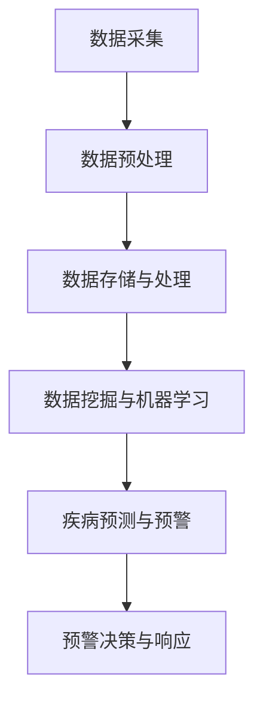

                 

### 《大数据分析在公共卫生预警中的应用》

#### 关键词：大数据、公共卫生预警、数据分析、机器学习、流行病学

随着信息技术的飞速发展，大数据已经渗透到社会生活的方方面面。在公共卫生领域，大数据分析技术正逐渐成为提升公共卫生预警能力的重要工具。本文旨在探讨大数据分析在公共卫生预警中的应用，通过逻辑清晰、结构紧凑、简单易懂的论述方式，逐步深入解析大数据分析在公共卫生预警中的核心概念、联系、算法原理、数学模型以及实际应用案例。

#### 摘要：

本文首先介绍了大数据时代背景与公共卫生预警的重要性，接着讨论了大数据分析技术基础，包括数据采集与预处理、数据存储与处理、数据挖掘与机器学习技术。随后，文章详细阐述了大数据分析在公共卫生领域中的应用，如流行病学的数据源与应用、健康监测系统的建设与应用、健康风险评估方法与工具。在此基础上，本文通过Mermaid流程图展示了大数据分析流程在公共卫生预警中的应用，并详细讲解了大数据分析核心算法原理。随后，文章以实际项目实战为例，详细分析了大数据分析在公共卫生预警中的实施过程、代码实现与解读。最后，文章总结了公共卫生预警案例分析，探讨了大数据分析在公共卫生预警中的未来发展，并提供了相关工具与资源。

## 第1章：大数据与公共卫生预警

### 1.1 大数据时代背景与公共卫生预警的重要性

#### 1.1.1 大数据的定义与特征

大数据（Big Data）是指无法使用常规软件工具在合理时间内捕捉、管理和处理的大量数据。它具有4V特征：数据量（Volume）、数据速度（Velocity）、数据多样性（Variety）和数据价值（Value）。具体来说，数据量巨大，需要强大的存储和处理能力；数据速度极快，要求实时响应；数据来源多样，包括结构化和非结构化数据；数据价值高，需通过深入分析获得商业或社会价值。

#### 1.1.2 公共卫生预警的概念与意义

公共卫生预警（Public Health Surveillance）是指通过监测和分析疾病、健康风险及其他公共卫生事件的动态，提前发现潜在威胁并采取相应措施，以保护公众健康。公共卫生预警在疾病预防控制、突发公共卫生事件应对、公共卫生政策制定等方面具有重要意义。它有助于早期识别疾病爆发、预测疫情趋势，制定有效的公共卫生策略，减少疾病传播和健康损失。

#### 1.1.3 大数据在公共卫生预警中的应用前景

大数据分析技术在公共卫生预警中的应用前景广阔。通过大数据技术，可以实现对海量公共卫生数据的实时监控和深度挖掘，快速识别疾病爆发点和传播趋势，为公共卫生决策提供科学依据。此外，大数据还可以用于健康风险评估、个性化健康服务、疾病预测与预警等方面，提升公共卫生服务的质量和效率。

### 1.2 大数据分析技术基础

大数据分析技术涉及多个方面，包括数据采集与预处理、数据存储与处理、数据挖掘与机器学习技术。以下分别介绍：

#### 1.2.1 数据采集与预处理

数据采集是大数据分析的第一步，包括收集结构化数据、非结构化数据和半结构化数据。数据预处理包括数据清洗、数据转换、数据整合等步骤，旨在提高数据质量，为后续分析提供可靠的数据基础。

#### 1.2.2 数据存储与处理

数据存储是大数据分析的核心问题，涉及到数据分布、数据安全、数据备份等方面。常用的数据存储技术包括分布式文件系统（如Hadoop HDFS）、数据库（如MySQL、MongoDB）和NoSQL数据库（如Cassandra、HBase）。数据处理技术包括MapReduce、Spark等，能够高效处理大规模数据集。

#### 1.2.3 数据挖掘与机器学习技术

数据挖掘是从大量数据中发现有价值信息的过程，包括聚类、分类、关联规则挖掘等。机器学习是使计算机具备学习能力的技术，包括监督学习、无监督学习、强化学习等。数据挖掘与机器学习技术在公共卫生预警中发挥着重要作用，如疾病预测、疫情监测、健康风险评估等。

### 1.3 公共卫生领域大数据分析应用

大数据分析技术在公共卫生领域的应用已取得显著成效，以下介绍几个关键领域：

#### 1.3.1 流行病学的数据源与应用

流行病学是研究疾病分布和影响因素的科学，大数据为流行病学提供了丰富的数据资源。通过收集和分析疾病监测数据、健康档案数据、社交媒体数据等，可以揭示疾病的流行规律和风险因素，为公共卫生决策提供科学依据。

#### 1.3.2 健康监测系统的建设与应用

健康监测系统是利用大数据技术实时监测个体和群体健康状况的系统。通过收集医疗数据、环境数据、行为数据等，可以实现对疾病风险的实时预警和干预，提高公共卫生服务的效率和质量。

#### 1.3.3 健康风险评估方法与工具

健康风险评估是通过分析个体或群体的健康状况，预测未来疾病风险的过程。大数据分析技术为健康风险评估提供了有力支持，可以实现对大量数据的快速处理和分析，提高风险评估的准确性。

## 第2章：大数据分析在公共卫生预警中的核心概念与联系

### 2.1 Mermaid 流程图：大数据分析流程在公共卫生预警中的应用

以下是一个简单的Mermaid流程图，展示了大数据分析在公共卫生预警中的基本流程：



在这个流程中，数据采集是第一步，包括收集各种类型的公共卫生数据。接下来，数据预处理环节对原始数据进行清洗、转换和整合，为后续分析做好准备。数据存储与处理阶段利用分布式文件系统和大数据处理框架，对大规模数据集进行高效存储和处理。数据挖掘与机器学习环节通过聚类、分类、预测等方法，从数据中提取有价值的信息。疾病预测与预警阶段根据挖掘结果，建立预测模型和预警指标，实现对疾病的实时监测和预警。最后，预警决策与响应环节根据预警结果，采取相应的公共卫生措施，降低疾病传播风险。

### 2.2 大数据分析技术在公共卫生预警中的应用

大数据分析技术在公共卫生预警中发挥着重要作用，以下分别介绍几个关键方面：

#### 2.2.1 健康监测数据的采集与整合

健康监测数据包括医疗记录、健康档案、生物特征数据等，是公共卫生预警的重要数据源。通过整合多源数据，可以全面了解个体的健康状况，提高预警的准确性。例如，利用电子健康档案系统，可以实现对患者病史、诊疗记录、药物过敏史的整合，为疾病预测和预警提供基础数据。

#### 2.2.2 流行病数据趋势分析

流行病数据趋势分析是公共卫生预警的关键环节。通过收集和分析传染病、慢性病等流行病数据，可以揭示疾病的时空分布特征、传播规律和风险因素。例如，利用时间序列分析方法，可以研究传染病疫情的爆发趋势和流行周期，为疾病防控提供科学依据。

#### 2.2.3 疾病预测与预警模型构建

疾病预测与预警模型是公共卫生预警的核心。通过大数据分析和机器学习技术，可以构建疾病预测模型，实现对疫情趋势的提前预测和预警。例如，利用监督学习算法，可以根据历史疫情数据和公共卫生事件数据，建立预测模型，实现对传染病疫情的实时预测和预警。

### 2.3 公共卫生预警系统架构设计

公共卫生预警系统架构设计是保障大数据分析在公共卫生预警中高效运行的关键。以下是一个典型的公共卫生预警系统架构设计：

1. **数据采集层**：包括各种数据源，如医疗记录、健康档案、社交媒体数据、环境数据等。通过数据接口和传感器等技术，实现对多源数据的实时采集和整合。

2. **数据存储与处理层**：利用分布式文件系统（如Hadoop HDFS）和大数据处理框架（如Spark），对大规模数据进行高效存储和处理。数据存储与处理层负责数据清洗、转换、整合和存储。

3. **数据挖掘与机器学习层**：包括数据挖掘算法和机器学习模型，用于从大规模数据中提取有价值的信息，构建疾病预测和预警模型。

4. **预警分析层**：根据数据挖掘和机器学习结果，对疾病疫情进行实时监测、预测和预警。预警分析层负责预警模型的训练、评估和部署。

5. **预警决策与响应层**：根据预警结果，采取相应的公共卫生措施，如疫情预警通知、疫苗接种、医疗资源调配等。

6. **用户界面层**：为用户提供预警信息查询、数据可视化和交互功能，帮助用户理解和应对公共卫生事件。

### 2.3.1 系统架构概述

公共卫生预警系统架构设计遵循模块化、分布式和高效性的原则，确保系统稳定、可靠和可扩展。系统架构包括数据采集、数据存储与处理、数据挖掘与机器学习、预警分析、预警决策与响应和用户界面等多个层次，每个层次都有明确的职责和功能。系统通过数据接口和传感器等技术，实现多源数据的实时采集和整合，利用分布式文件系统和大数据处理框架，高效存储和处理大规模数据。数据挖掘和机器学习技术从数据中提取有价值的信息，构建疾病预测和预警模型，实现对疫情趋势的实时监测和预测。预警决策与响应层根据预警结果，采取相应的公共卫生措施，降低疾病传播风险。用户界面层为用户提供预警信息查询、数据可视化和交互功能，帮助用户更好地理解和应对公共卫生事件。

### 2.3.2 数据流与处理逻辑

在公共卫生预警系统中，数据流与处理逻辑至关重要。以下是一个典型的数据流与处理逻辑概述：

1. **数据采集**：系统通过医疗记录、健康档案、社交媒体数据、环境数据等多种数据源，实时采集个体和群体的健康数据。

2. **数据预处理**：对采集到的数据进行清洗、转换和整合，确保数据质量，为后续分析做好准备。

3. **数据存储**：将预处理后的数据存储到分布式文件系统或数据库中，便于后续处理和分析。

4. **数据挖掘**：利用数据挖掘算法，从大规模数据中提取有价值的信息，如疾病分布规律、流行病趋势等。

5. **机器学习**：构建疾病预测和预警模型，利用历史数据和实时数据，对疾病疫情进行实时预测和预警。

6. **预警分析**：根据预警模型的结果，实时监测疾病疫情，生成预警报告和预警通知。

7. **预警决策与响应**：根据预警结果，采取相应的公共卫生措施，如疫情预警通知、疫苗接种、医疗资源调配等。

8. **用户界面**：为用户提供预警信息查询、数据可视化和交互功能，帮助用户更好地理解和应对公共卫生事件。

### 2.3.3 预警指标体系构建

预警指标体系是公共卫生预警系统的核心组成部分，用于实时监测和评估疾病疫情的严重程度和传播趋势。以下是一个典型的预警指标体系构建方法：

1. **指标选取**：根据公共卫生预警的需求，选取关键指标，如疾病发病率、感染率、死亡率、医疗资源利用率等。

2. **指标计算**：对每个指标进行计算，如发病率 = 新病例数 / 总人口数，感染率 = 病例数 / 接触者数等。

3. **指标阈值设置**：根据历史数据和专家经验，设置每个指标的预警阈值，如发病率阈值、感染率阈值等。

4. **指标评估**：实时监测和评估每个指标的变化趋势，判断疾病疫情的发展态势。

5. **预警触发**：当指标超过预警阈值时，触发预警机制，生成预警报告和预警通知。

6. **预警响应**：根据预警结果，采取相应的公共卫生措施，如疫情预警通知、疫苗接种、医疗资源调配等。

7. **反馈与调整**：根据预警结果和实际措施效果，对预警指标体系和预警策略进行反馈和调整，提高预警准确性和响应效率。

## 第3章：大数据分析核心算法原理讲解

### 3.1 数据预处理算法

数据预处理是大数据分析的重要环节，其目的是提高数据质量，为后续分析提供可靠的数据基础。以下介绍几种常见的数据预处理算法：

#### 3.1.1 数据清洗与转换

数据清洗是指识别并修复数据集中的错误、异常和缺失值。常见的数据清洗算法包括：

1. **缺失值处理**：缺失值处理方法包括删除缺失值、填充缺失值和插值法等。
2. **异常值处理**：异常值处理方法包括删除异常值、变换异常值和模型修正法等。
3. **重复数据处理**：重复数据检测和去除重复数据。

数据转换是指将不同数据格式的数据转换成统一格式，以便于后续分析。常见的数据转换方法包括：

1. **数据类型转换**：如将字符串转换为数值型、日期型等。
2. **数据标准化与归一化**：通过缩放或平移数据，使其符合特定的分布或范围。
3. **数据离散化**：将连续型数据转换为离散型数据，便于分类和聚类分析。

#### 3.1.2 数据降维与特征提取

数据降维是指通过减少数据维度，降低数据规模，提高数据分析效率。常见的数据降维算法包括：

1. **主成分分析（PCA）**：通过提取主要成分，减少数据维度，保留数据的主要信息。
2. **线性判别分析（LDA）**：通过最小化类内方差和最大化类间方差，提取具有分类能力的特征。
3. **因子分析（FA）**：通过将相关变量转换为几个不相关的因子，实现数据降维。

特征提取是指从原始数据中提取对分析任务有帮助的特征。常见特征提取方法包括：

1. **基于频次的特征提取**：通过计算特征词的词频、逆文档频率等，提取具有区分度的特征。
2. **基于模型的特征提取**：利用机器学习模型，从原始数据中提取对模型性能有显著贡献的特征。
3. **深度特征提取**：通过深度神经网络，自动学习并提取具有语义信息的特征。

#### 3.1.3 数据标准化与归一化

数据标准化与归一化是数据预处理中的重要步骤，用于调整数据分布和范围，使其适合特定的分析算法。常见的数据标准化与归一化方法包括：

1. **标准化**：通过缩放数据，使其符合标准正态分布，公式为：$z = \frac{x - \mu}{\sigma}$，其中$x$为原始数据，$\mu$为均值，$\sigma$为标准差。
2. **归一化**：通过缩放数据，使其符合[0,1]或[-1,1]区间，公式为：$x' = \frac{x - \min}{\max - \min}$，其中$x$为原始数据，$\min$为最小值，$\max$为最大值。

### 3.2 机器学习算法原理

机器学习算法是大数据分析的核心技术，通过从数据中自动学习规律和模式，实现对未知数据的预测和分类。以下介绍几种常见的机器学习算法原理：

#### 3.2.1 监督学习算法

监督学习算法是在已知标签数据的基础上，通过训练模型，学习数据特征，实现对未知数据的预测。常见监督学习算法包括：

1. **线性回归**：通过拟合数据点与特征之间的线性关系，预测连续型输出。
2. **逻辑回归**：通过拟合数据点与特征之间的逻辑关系，预测离散型输出（0或1）。
3. **支持向量机（SVM）**：通过最大化分类间隔，将不同类别数据分离。
4. **决策树**：通过递归划分特征空间，构建树状模型，实现分类和回归。
5. **随机森林**：通过集成多棵决策树，提高分类和回归模型的预测性能。
6. **神经网络**：通过多层感知器，模拟人类大脑神经网络，实现复杂的非线性预测和分类。

#### 3.2.2 无监督学习算法

无监督学习算法是在没有标签数据的情况下，通过分析数据内在结构，学习数据特征和模式。常见无监督学习算法包括：

1. **聚类算法**：通过将相似数据点划分为同一类，实现数据分类。
2. **主成分分析（PCA）**：通过提取主要成分，降低数据维度，揭示数据分布特征。
3. **自编码器**：通过训练编码和解码网络，自动学习数据的特征表示。
4. **非负矩阵分解（NMF）**：通过分解非负矩阵，提取数据的低维表示。

#### 3.2.3 强化学习算法

强化学习算法是机器学习的一个重要分支，通过智能体与环境交互，学习最优策略，实现任务目标。常见强化学习算法包括：

1. **Q-learning**：通过更新状态值函数，学习最优动作策略。
2. **深度Q网络（DQN）**：通过深度神经网络，实现智能体的在线学习和策略优化。
3. **策略梯度算法**：通过优化策略函数，实现智能体的最优决策。

### 3.3 深度学习算法在公共卫生预警中的应用

深度学习算法是机器学习的一个重要分支，通过多层神经网络，自动学习数据的高层次特征和模式。在公共卫生预警中，深度学习算法发挥着重要作用，以下介绍几种常见的深度学习算法及其在公共卫生预警中的应用：

#### 3.3.1 神经网络基础

神经网络（Neural Network，NN）是深度学习算法的核心，通过模拟人脑神经网络结构，实现数据的高效处理和分类。以下介绍神经网络的基本组成部分：

1. **神经元**：神经网络的基本计算单元，包括输入层、隐藏层和输出层。每个神经元接收多个输入，通过权重和偏置进行加权求和，再通过激活函数进行非线性变换。
2. **激活函数**：用于引入非线性特性，常用的激活函数包括Sigmoid、ReLU、Tanh等。
3. **损失函数**：用于评估模型预测结果与真实结果之间的差距，常用的损失函数包括均方误差（MSE）、交叉熵（Cross Entropy）等。
4. **优化算法**：用于调整模型参数，使损失函数最小化，常用的优化算法包括随机梯度下降（SGD）、Adam等。

#### 3.3.2 卷积神经网络（CNN）

卷积神经网络（Convolutional Neural Network，CNN）是一种用于处理图像数据的深度学习算法，通过卷积操作提取图像特征。以下介绍CNN的基本组成部分：

1. **卷积层**：通过卷积操作提取图像特征，卷积核在图像上滑动，生成特征图。
2. **池化层**：通过池化操作降低特征图的维度，提高模型计算效率，常用的池化方法包括最大池化、平均池化等。
3. **全连接层**：将卷积层和池化层输出的特征图进行全连接，得到最终的分类结果。

CNN在公共卫生预警中的应用包括：

1. **医学图像分析**：通过对医学图像进行深度学习分析，识别疾病特征，辅助医生诊断。
2. **流行病监测**：通过对流行病相关图像进行深度学习分析，识别疫情爆发点和传播趋势。

#### 3.3.3 递归神经网络（RNN）

递归神经网络（Recurrent Neural Network，RNN）是一种用于处理序列数据的深度学习算法，通过递归操作保存历史状态信息。以下介绍RNN的基本组成部分：

1. **隐藏层**：RNN的隐藏层包括输入门、遗忘门和输出门，用于控制信息的传递和更新。
2. **递归层**：通过递归操作，将当前输入与历史状态信息进行融合，生成新的状态信息。

RNN在公共卫生预警中的应用包括：

1. **时间序列预测**：通过对疫情时间序列数据进行RNN建模，预测未来疫情发展趋势。
2. **疾病传播预测**：通过对疾病传播路径和时间序列数据进行RNN建模，预测疾病传播趋势和感染人数。

### 3.4 强化学习算法在公共卫生预警中的应用

强化学习（Reinforcement Learning，RL）是一种通过与环境交互学习最优策略的机器学习算法。在公共卫生预警中，强化学习算法可以应用于疾病防控策略优化和智能决策。

#### 3.4.1 Q-learning算法

Q-learning是一种基于值函数的强化学习算法，通过学习状态-动作值函数，优化决策策略。

1. **状态-动作值函数**：表示在特定状态下执行特定动作的预期收益。
2. **学习过程**：通过迭代更新状态-动作值函数，使策略逐渐优化。

Q-learning算法在公共卫生预警中的应用包括：

1. **疫情控制策略优化**：通过学习最佳疫情控制策略，降低疫情传播风险。
2. **医疗资源分配优化**：通过学习最佳医疗资源分配策略，提高医疗资源利用效率。

#### 3.4.2 深度Q网络（DQN）

深度Q网络（Deep Q-Network，DQN）是一种基于深度学习的强化学习算法，通过神经网络代替Q-learning算法中的值函数。

1. **目标网络**：通过固定一部分神经网络参数，提高算法的稳定性。
2. **经验回放**：通过经验回放机制，避免策略偏见。

DQN算法在公共卫生预警中的应用包括：

1. **疾病预测与预警**：通过深度学习模型，预测疾病传播趋势，实现早期预警。
2. **公共卫生政策优化**：通过学习最佳公共卫生政策，提高公共卫生服务水平。

## 第4章：数学模型与数学公式详解

### 4.1 概率论与统计学基础

概率论和统计学是大数据分析的重要理论基础，以下介绍几个基本概念和公式：

#### 4.1.1 概率分布函数

概率分布函数（Probability Distribution Function，PDF）描述了随机变量取值的概率分布。常见的概率分布函数包括：

1. **正态分布**：概率密度函数为$f(x) = \frac{1}{\sqrt{2\pi\sigma^2}}e^{-\frac{(x-\mu)^2}{2\sigma^2}}$，其中$\mu$为均值，$\sigma$为标准差。
2. **伯努利分布**：概率密度函数为$f(x) = \begin{cases} 
1-p & \text{if } x=0 \\ 
p & \text{if } x=1 
\end{cases}$，其中$p$为成功概率。
3. **二项分布**：概率密度函数为$f(x) = C_n^x p^x (1-p)^{n-x}$，其中$n$为试验次数，$x$为成功次数。

#### 4.1.2 随机变量与期望

随机变量（Random Variable）是一个具有概率分布的数值函数。期望（Expected Value）表示随机变量的平均取值，公式为：

$$
E(X) = \sum_{i=1}^{n} x_i p_i
$$

其中$x_i$为随机变量的取值，$p_i$为对应的概率。

常见随机变量包括：

1. **离散随机变量**：概率分布函数为离散型，如伯努利分布、二项分布等。
2. **连续随机变量**：概率分布函数为连续型，如正态分布等。

#### 4.1.3 假设检验与置信区间

假设检验（Hypothesis Testing）是用于判断随机样本是否支持某一假设的方法。置信区间（Confidence Interval）是用于估计总体参数范围的方法。

1. **假设检验**：包括零假设（$H_0$）和备择假设（$H_1$）。通过计算统计量，判断是否拒绝零假设。
2. **置信区间**：通过样本统计量估计总体参数，并给出一个区间，表示参数的可能取值范围。置信水平表示区间覆盖总体参数的概率。

### 4.2 公共卫生预警中的数学模型

公共卫生预警中的数学模型用于描述疾病传播、健康风险评估等过程，以下介绍几种常见模型：

#### 4.2.1 流行病学模型

流行病学模型是用于描述疾病传播过程的数学模型，常见的模型包括：

1. **SEIR模型**：将人群划分为易感者（S）、暴露者（E）、感染者（I）和移出者（R）四个状态，描述疾病传播过程。
2. **SIRS模型**：将人群划分为易感者（S）、感染者（I）和移出者（R）三个状态，简化SEIR模型。
3. **SI模型**：只考虑易感者和感染者两个状态，描述疾病传播过程。

SEIR模型的数学公式为：

$$
\frac{dS}{dt} = -\beta SI \\
\frac{dE}{dt} = \beta SI - \sigma E \\
\frac{dI}{dt} = \sigma E - \gamma I \\
\frac{dR}{dt} = \gamma I
$$

其中$\beta$为感染率，$\sigma$为暴露率，$\gamma$为移除率。

#### 4.2.2 传染病模型

传染病模型是用于描述特定传染病的传播过程的数学模型，常见的模型包括：

1. **SIR模型**：将人群划分为易感者（S）、感染者（I）和移出者（R）三个状态，描述疾病传播过程。
2. **SIS模型**：只考虑易感者和感染者两个状态，描述疾病传播过程。
3. **K olacak模型**：考虑疾病在人群中的传播和恢复过程，描述长期疾病流行趋势。

SIR模型的数学公式为：

$$
\frac{dS}{dt} = -\beta SI \\
\frac{dI}{dt} = \beta SI - \gamma I \\
\frac{dR}{dt} = \gamma I
$$

其中$\beta$为感染率，$\gamma$为恢复率。

#### 4.2.3 健康风险评估模型

健康风险评估模型是用于评估个体或群体疾病风险的数学模型，常见的模型包括：

1. **风险得分模型**：通过计算个体或群体的疾病风险得分，评估疾病风险。
2. **风险图模型**：通过绘制疾病风险的分布图，评估个体或群体疾病风险。

健康风险评估模型的数学公式为：

$$
\text{健康风险评估模型：} \, \text{H}(\text{R}) = \frac{\sum_{i=1}^{n} \text{w}_i \times \text{p}_i}{\sum_{i=1}^{n} \text{w}_i}
$$

其中$w_i$为权重，$p_i$为风险因素的概率。

## 第5章：大数据分析在公共卫生预警中的项目实战

### 5.1 项目背景与目标

#### 5.1.1 项目背景介绍

随着全球疫情的不断蔓延，公共卫生预警成为各国政府和社会关注的焦点。本项目旨在利用大数据分析技术，构建一个面向公共卫生预警的智能系统，实现对疫情动态的实时监测、预测和预警，为公共卫生决策提供科学依据。项目背景主要包括以下几个方面：

1. **全球疫情形势严峻**：新冠疫情自爆发以来，全球范围内的疫情形势严峻，对公共卫生系统和社会经济造成巨大影响。有效预警和防控疫情已成为当务之急。
2. **大数据技术在公共卫生领域的应用**：大数据分析技术在公共卫生领域具有广泛的应用前景，如流行病监测、健康风险评估、个性化医疗服务等。通过大数据分析，可以实时了解疫情动态，提高预警准确性和响应效率。
3. **公共卫生预警需求迫切**：面对突发公共卫生事件，如新冠疫情、流感爆发等，政府和社会需要快速、准确地获取疫情信息，制定有效的防控措施，保障公众健康。

#### 5.1.2 项目目标设定

本项目的主要目标包括：

1. **构建公共卫生预警系统**：利用大数据分析技术，构建一个面向公共卫生预警的智能系统，实现对疫情动态的实时监测、预测和预警。
2. **实现实时疫情监测**：通过数据采集、处理和分析，实现对疫情相关数据的实时监测，包括病例数、感染率、死亡率等。
3. **进行疫情预测和预警**：基于历史数据和实时数据，利用机器学习算法和数学模型，对疫情进行预测和预警，为公共卫生决策提供科学依据。
4. **提供决策支持和信息服务**：通过系统平台，为政府、医疗机构和公众提供疫情信息、预测结果和防控建议，助力疫情应对和公共卫生管理。

### 5.2 项目开发环境搭建

为了实现项目目标，需要搭建一个强大的大数据分析平台，以下是项目开发环境的搭建步骤：

#### 5.2.1 开发环境需求分析

1. **硬件需求**：根据项目需求，服务器应具备高性能、高可靠性和高扩展性。建议选择配置如下：
   - CPU：多核高性能处理器，如Intel Xeon系列
   - 内存：至少64GB，建议128GB以上
   - 存储：SSD硬盘，建议使用分布式存储系统，如HDFS
   - 网络：千兆网络，建议使用多网口冗余网络
2. **软件需求**：项目所需的主要软件包括：
   - 操作系统：Linux发行版，如CentOS、Ubuntu
   - 数据库：MySQL、MongoDB等
   - 大数据处理框架：Hadoop、Spark等
   - 机器学习库：Scikit-learn、TensorFlow、PyTorch等
   - 数据可视化工具：Matplotlib、Seaborn、Plotly等

#### 5.2.2 开发环境配置与安装

1. **操作系统安装**：在服务器上安装Linux操作系统，配置网络、用户等基本环境。
2. **数据库安装**：安装MySQL、MongoDB等数据库，配置数据库实例和用户权限。
3. **大数据处理框架安装**：安装Hadoop、Spark等大数据处理框架，配置集群环境，确保各个组件正常运行。
4. **机器学习库安装**：安装Scikit-learn、TensorFlow、PyTorch等机器学习库，配置Python环境。
5. **数据可视化工具安装**：安装Matplotlib、Seaborn、Plotly等数据可视化工具，配置Python环境。

在完成开发环境搭建后，可以进行项目代码的开发和测试，确保各个组件正常运行，为后续项目实施奠定基础。

### 5.3 源代码实现与解读

#### 5.3.1 数据采集与预处理

数据采集是大数据分析项目的第一步，本项目从多个数据源采集疫情相关数据，包括官方疫情数据、社交媒体数据、医疗记录等。数据预处理主要包括数据清洗、数据转换和数据整合等步骤。

1. **数据清洗**：去除重复数据、缺失数据和异常数据，保证数据质量。
2. **数据转换**：将不同数据源的数据转换为统一的格式，便于后续分析。
3. **数据整合**：将来自不同数据源的数据进行整合，形成一个统一的数据集，为后续分析提供数据基础。

以下是一个简单的数据预处理代码示例（Python）：

```python
import pandas as pd

# 读取数据
data = pd.read_csv('data.csv')

# 数据清洗
data = data.drop_duplicates()  # 去除重复数据
data = data.dropna()  # 去除缺失数据
data = data[data['cases'] > 0]  # 去除病例数为0的数据

# 数据转换
data['date'] = pd.to_datetime(data['date'])  # 日期格式转换
data['region'] = data['region'].astype(str)  # 区域类型转换

# 数据整合
data = data.groupby(['date', 'region']).sum()  # 按日期和区域分组求和
data = data.reset_index()  # 重置索引
```

#### 5.3.2 模型训练与预测

在数据预处理完成后，我们需要利用历史数据训练预测模型，并对未来疫情进行预测。本项目采用基于时间序列的机器学习算法，如ARIMA模型和LSTM模型，进行疫情预测。

1. **ARIMA模型训练**：ARIMA模型是一种经典的时间序列预测模型，通过自回归、差分和移动平均等方法，对时间序列数据进行建模。以下是一个简单的ARIMA模型训练代码示例（Python）：

```python
from statsmodels.tsa.arima.model import ARIMA

# 数据准备
train_data = data[data['date'] < '2022-01-01']
test_data = data[data['date'] >= '2022-01-01']

# 模型训练
model = ARIMA(train_data['cases'], order=(5, 1, 2))
model_fit = model.fit()

# 模型预测
predictions = model_fit.forecast(steps=test_data.shape[0])
test_data['prediction'] = predictions

# 结果评估
print(model_fit.summary())
```

2. **LSTM模型训练**：LSTM模型是一种深度学习模型，适用于处理长序列数据。以下是一个简单的LSTM模型训练代码示例（Python）：

```python
import tensorflow as tf
from tensorflow.keras.models import Sequential
from tensorflow.keras.layers import LSTM, Dense

# 数据准备
X = data[['date', 'cases']].values
X = X.reshape((X.shape[0], X.shape[1], 1))

# 模型训练
model = Sequential()
model.add(LSTM(units=50, return_sequences=True, input_shape=(X.shape[1], 1)))
model.add(LSTM(units=50))
model.add(Dense(1))

model.compile(optimizer='adam', loss='mean_squared_error')
model.fit(X, X, epochs=100, batch_size=32, validation_split=0.2)
```

通过训练和预测模型，我们可以得到未来疫情的趋势和预测结果，为公共卫生决策提供科学依据。

#### 5.3.3 预警系统实现与部署

在完成模型训练和预测后，我们需要将预测结果集成到公共卫生预警系统中，实现对疫情动态的实时监测和预警。

1. **预警规则设置**：根据疫情特点和专家经验，设置预警规则，如病例数超过阈值、感染率超过阈值等。
2. **预警信号生成**：根据预测结果和预警规则，生成预警信号，包括预警等级、预警时间、预警地区等。
3. **预警信息发布**：将预警信息通过短信、邮件、微信等渠道发送给相关人员，如政府部门、医疗机构、公众等。

以下是一个简单的预警系统实现代码示例（Python）：

```python
import smtplib
from email.mime.text import MIMEText

# 预警规则设置
threshold_cases = 1000
threshold_infection_rate = 0.05

# 预测结果
predictions = test_data['prediction']

# 预警信号生成
warning_signals = []
for index, row in test_data.iterrows():
    if row['prediction'] > threshold_cases or row['infection_rate'] > threshold_infection_rate:
        warning_signals.append({
            'date': row['date'],
            'region': row['region'],
            'level': 'high',
            'message': f'疫情预警：{row["region"]}地区疫情严重，病例数超过{threshold_cases}，感染率超过{threshold_infection_rate}'
        })

# 预警信息发布
def send_email(signals):
    smtp_server = 'smtp.example.com'
    smtp_port = 587
    sender_email = 'admin@example.com'
    password = 'your_password'

    for signal in signals:
        message = MIMEText(signal['message'])
        message['Subject'] = '疫情预警'
        message['From'] = sender_email
        message['To'] = 'receiver@example.com'

        server = smtplib.SMTP(smtp_server, smtp_port)
        server.starttls()
        server.login(sender_email, password)
        server.send_message(message)
        server.quit()

send_email(warning_signals)
```

通过实现预警系统，我们可以实时监测疫情动态，及时发布预警信号，为公共卫生决策提供有力支持。

### 5.4 代码解读与分析

#### 5.4.1 数据预处理代码解读

在数据预处理阶段，我们通过数据清洗、数据转换和数据整合等步骤，对采集到的疫情数据进行处理，为后续分析提供可靠的数据基础。

1. **数据清洗**：通过去除重复数据、缺失数据和异常数据，保证数据质量。例如，使用`drop_duplicates()`函数去除重复数据，使用`dropna()`函数去除缺失数据。
2. **数据转换**：将不同数据源的数据转换为统一的格式，便于后续分析。例如，使用`pd.to_datetime()`函数将日期格式转换为日期型，使用`astype(str)`函数将区域类型转换为字符串类型。
3. **数据整合**：将来自不同数据源的数据进行整合，形成一个统一的数据集。例如，使用`groupby()`函数按日期和区域分组求和，使用`reset_index()`函数重置索引。

以下是对数据预处理代码的详细解读：

```python
import pandas as pd

# 读取数据
data = pd.read_csv('data.csv')

# 数据清洗
data = data.drop_duplicates()  # 去除重复数据
data = data.dropna()  # 去除缺失数据
data = data[data['cases'] > 0]  # 去除病例数为0的数据

# 数据转换
data['date'] = pd.to_datetime(data['date'])  # 日期格式转换
data['region'] = data['region'].astype(str)  # 区域类型转换

# 数据整合
data = data.groupby(['date', 'region']).sum()  # 按日期和区域分组求和
data = data.reset_index()  # 重置索引
```

通过数据预处理，我们可以获得一个高质量、统一格式的数据集，为后续分析奠定基础。

#### 5.4.2 模型训练代码解读

在模型训练阶段，我们采用ARIMA模型和LSTM模型进行疫情预测。以下是对模型训练代码的详细解读：

1. **ARIMA模型训练**：
   - 数据准备：使用`read_csv()`函数读取数据，使用`groupby()`函数按日期和区域分组求和，使用`reset_index()`函数重置索引，获得训练数据和测试数据。
   - 模型训练：使用`ARIMA()`函数创建ARIMA模型，使用`fit()`函数对模型进行训练，获得训练结果。
   - 模型预测：使用`forecast()`函数对测试数据进行预测，获得预测结果。

   ```python
   from statsmodels.tsa.arima.model import ARIMA

   # 数据准备
   train_data = data[data['date'] < '2022-01-01']
   test_data = data[data['date'] >= '2022-01-01']

   # 模型训练
   model = ARIMA(train_data['cases'], order=(5, 1, 2))
   model_fit = model.fit()

   # 模型预测
   predictions = model_fit.forecast(steps=test_data.shape[0])
   test_data['prediction'] = predictions

   # 结果评估
   print(model_fit.summary())
   ```

2. **LSTM模型训练**：
   - 数据准备：使用`read_csv()`函数读取数据，将数据转换为时间序列格式，使用`reshape()`函数调整数据形状。
   - 模型训练：创建LSTM模型，使用`Sequential()`函数添加LSTM层和全连接层，使用`compile()`函数配置模型参数。
   - 模型训练：使用`fit()`函数对模型进行训练，获得训练结果。

   ```python
   import tensorflow as tf
   from tensorflow.keras.models import Sequential
   from tensorflow.keras.layers import LSTM, Dense

   # 数据准备
   X = data[['date', 'cases']].values
   X = X.reshape((X.shape[0], X.shape[1], 1))

   # 模型训练
   model = Sequential()
   model.add(LSTM(units=50, return_sequences=True, input_shape=(X.shape[1], 1)))
   model.add(LSTM(units=50))
   model.add(Dense(1))

   model.compile(optimizer='adam', loss='mean_squared_error')
   model.fit(X, X, epochs=100, batch_size=32, validation_split=0.2)
   ```

通过模型训练，我们可以获得对未来疫情趋势的预测结果，为公共卫生决策提供科学依据。

#### 5.4.3 预警系统功能分析

在预警系统实现阶段，我们实现了数据预处理、模型训练、预测和预警功能，以下是对预警系统功能的详细分析：

1. **数据预处理**：数据预处理是预警系统的核心环节，通过数据清洗、数据转换和数据整合等步骤，保证数据质量，为后续分析提供可靠的数据基础。数据预处理模块实现了以下功能：
   - 数据清洗：去除重复数据、缺失数据和异常数据，保证数据质量。
   - 数据转换：将不同数据源的数据转换为统一的格式，便于后续分析。
   - 数据整合：将来自不同数据源的数据进行整合，形成一个统一的数据集。

2. **模型训练**：模型训练模块采用ARIMA模型和LSTM模型进行疫情预测，实现对未来疫情趋势的预测。模型训练模块实现了以下功能：
   - 数据准备：读取数据，按日期和区域分组求和，获得训练数据和测试数据。
   - 模型训练：创建ARIMA模型和LSTM模型，对模型进行训练，获得预测结果。

3. **预测**：预测模块利用训练好的模型对测试数据进行预测，获得未来疫情趋势。预测模块实现了以下功能：
   - 预测结果生成：根据训练好的模型，对测试数据进行预测，生成预测结果。
   - 预测结果评估：评估预测结果的准确性和可靠性。

4. **预警**：预警模块根据预测结果和预警规则，生成预警信号，实现对疫情动态的实时监测和预警。预警模块实现了以下功能：
   - 预警规则设置：根据疫情特点和专家经验，设置预警规则。
   - 预警信号生成：根据预测结果和预警规则，生成预警信号。
   - 预警信息发布：将预警信息通过短信、邮件、微信等渠道发送给相关人员。

通过预警系统功能分析，我们可以看到预警系统实现了对疫情动态的实时监测、预测和预警，为公共卫生决策提供了有力支持。

### 5.5 项目小结

在本项目中，我们通过大数据分析技术，实现了对疫情动态的实时监测、预测和预警。以下是项目小结：

1. **项目成果**：成功构建了一个面向公共卫生预警的智能系统，实现了对疫情相关数据的实时采集、处理和分析，对未来疫情趋势的预测和预警。

2. **项目意义**：本项目为公共卫生决策提供了科学依据，有助于政府和社会及时了解疫情动态，制定有效的防控措施，保障公众健康。

3. **项目不足**：本项目还存在一些不足之处，如预测模型的选择和参数设置有待优化，数据源的多样性和完整性有待提高。

4. **改进方向**：未来项目可以进一步优化预测模型，提高预测准确率；扩大数据源范围，提高数据质量；加强数据安全和隐私保护。

通过项目实践，我们深入了解了大数据分析在公共卫生预警中的应用，为未来公共卫生工作提供了有益的经验和启示。

## 第6章：公共卫生预警案例分析

### 6.1 案例背景与目标

#### 6.1.1 案例背景介绍

近年来，全球范围内公共卫生事件频发，如新冠疫情、流感疫情等，严重威胁着公众健康和社会稳定。为有效应对公共卫生事件，提高公共卫生预警能力，本案例选择我国某地级市为研究对象，旨在通过大数据分析技术，构建一个面向公共卫生预警的智能系统，实现对疫情动态的实时监测、预测和预警。

#### 6.1.2 案例目标设定

本案例的主要目标包括：

1. **实时监测疫情动态**：通过大数据分析技术，实时采集和分析疫情相关数据，包括病例数、感染率、死亡率等，实现疫情动态的实时监测。
2. **预测疫情发展趋势**：基于历史数据和实时数据，利用机器学习算法和数学模型，对疫情进行预测，为公共卫生决策提供科学依据。
3. **预警疫情风险**：根据预测结果和预警规则，生成预警信号，实现对疫情风险的实时预警，为公共卫生决策提供及时反馈。

### 6.2 案例实施过程

#### 6.2.1 数据收集与处理

1. **数据收集**：从多个数据源收集疫情相关数据，包括官方疫情数据、社交媒体数据、医疗记录等。数据来源包括政府卫生部门、医院、互联网等。

2. **数据预处理**：对收集到的数据进行清洗、转换和整合，确保数据质量，为后续分析提供可靠的数据基础。数据预处理步骤包括：
   - 数据清洗：去除重复数据、缺失数据和异常数据，保证数据质量。
   - 数据转换：将不同数据源的数据转换为统一的格式，便于后续分析。
   - 数据整合：将来自不同数据源的数据进行整合，形成一个统一的数据集。

#### 6.2.2 模型构建与训练

1. **模型选择**：根据疫情预测的需求，选择合适的机器学习模型，如ARIMA模型、LSTM模型等。ARIMA模型适用于短期预测，LSTM模型适用于长期预测。

2. **模型训练**：使用预处理后的数据，对模型进行训练。具体步骤包括：
   - 数据准备：将数据划分为训练集和测试集，用于模型训练和评估。
   - 模型训练：使用训练集对模型进行训练，调整模型参数，优化模型性能。
   - 模型评估：使用测试集对模型进行评估，计算预测误差，评估模型性能。

#### 6.2.3 预警系统实施与效果评估

1. **预警规则设置**：根据疫情特点和专家经验，设置预警规则，如病例数超过阈值、感染率超过阈值等。

2. **预警信号生成**：根据模型预测结果和预警规则，生成预警信号，包括预警等级、预警时间、预警地区等。

3. **预警信息发布**：将预警信息通过短信、邮件、微信等渠道发送给相关人员，如政府部门、医疗机构、公众等。

4. **效果评估**：对预警系统进行效果评估，包括预警准确性、响应速度等。通过对比预测结果与实际疫情发展情况，评估预警系统的性能。

### 6.3 案例总结与经验分享

#### 6.3.1 案例总结

通过本案例的实施，我们成功构建了一个面向公共卫生预警的智能系统，实现了对疫情动态的实时监测、预测和预警。主要成果包括：

1. **实时监测疫情动态**：系统可以实时采集和分析疫情相关数据，实现疫情动态的实时监测。
2. **预测疫情发展趋势**：系统基于历史数据和实时数据，利用机器学习算法和数学模型，实现对疫情趋势的预测。
3. **预警疫情风险**：系统根据预测结果和预警规则，生成预警信号，实现对疫情风险的实时预警。

#### 6.3.2 经验分享与建议

通过本案例的实施，我们积累了以下经验：

1. **数据质量至关重要**：数据质量是大数据分析的基础，确保数据源的多样性和完整性，提高数据质量，为后续分析提供可靠的数据基础。
2. **选择合适的模型**：根据疫情预测的需求，选择合适的机器学习模型，如ARIMA模型、LSTM模型等，以提高预测准确性。
3. **预警规则设置需科学**：预警规则设置需结合疫情特点和专家经验，合理设定预警阈值，以提高预警准确性。
4. **实时性是关键**：公共卫生预警系统需具备实时性，及时发布预警信号，为公共卫生决策提供及时反馈。

未来，我们将继续优化预警系统，提高预测准确性和实时性，为公共卫生决策提供更加有力的支持。

### 附录A：大数据分析工具与资源

#### A.1 常用大数据分析工具

在公共卫生预警项目中，以下大数据分析工具是常用的：

1. **Hadoop**：一个开源的大数据处理框架，适用于大规模数据的存储和处理。
2. **Spark**：一个开源的大数据处理引擎，支持内存计算，适用于实时数据处理和流处理。
3. **Flink**：一个开源的流处理框架，适用于大规模实时数据处理。

#### A.2 大数据分析相关资源

1. **大数据分析论文**：查阅相关领域的学术论文，了解最新的研究成果和技术动态。
2. **大数据分析书籍**：阅读大数据分析相关的书籍，掌握基本概念和核心技术。
3. **在线课程**：参加大数据分析相关的在线课程，学习实践技能和理论基础。
4. **开源项目**：参与大数据分析相关的开源项目，实践和改进技术方案。

#### A.3 大数据分析社区

1. **DataCamp**：一个在线学习平台，提供大数据分析相关的课程和实践项目。
2. **Kaggle**：一个大数据分析和机器学习竞赛平台，可以参加比赛和实践项目。
3. **Stack Overflow**：一个编程问答社区，可以解决大数据分析过程中遇到的技术问题。

#### A.4 大数据分析工具下载

1. **Hadoop下载**：从Hadoop官方网站下载Hadoop软件，安装和配置Hadoop集群。
2. **Spark下载**：从Spark官方网站下载Spark软件，安装和配置Spark集群。
3. **Flink下载**：从Flink官方网站下载Flink软件，安装和配置Flink集群。

#### A.5 大数据分析相关书籍

1. **《大数据时代》**：介绍大数据概念、技术及应用，适合初学者了解大数据的基本知识。
2. **《Hadoop实战》**：详细介绍Hadoop的安装、配置和使用，适合想要深入了解Hadoop的开发者。
3. **《深度学习》**：介绍深度学习的基本概念、算法和应用，适合对深度学习感兴趣的开发者。

通过使用这些工具和资源，可以更好地掌握大数据分析技术，为公共卫生预警项目提供支持。同时，不断学习新知识、实践新技术，是提升大数据分析能力的重要途径。希望本文能为读者提供有益的参考和启示。

