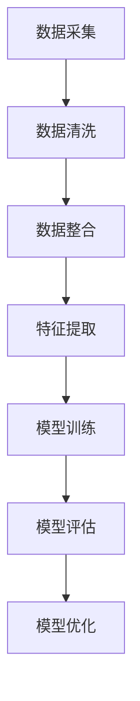
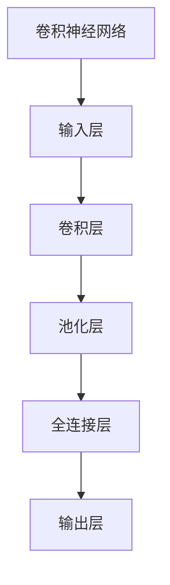
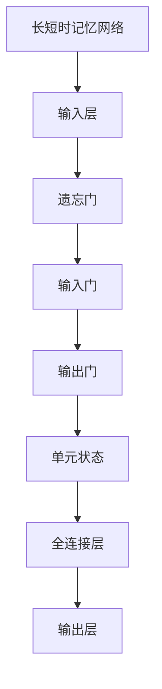

                 

### 文章标题

# 大数据分析在城市交通拥堵预测中的新方法

### 关键词

- 大数据分析
- 城市交通拥堵
- 预测模型
- 机器学习
- 深度学习
- 数据预处理
- 特征工程

### 摘要

本文主要探讨大数据分析在城市交通拥堵预测中的应用，以及新兴的预测方法及其效果。首先，文章介绍了大数据分析的定义及其重要性，并阐述了城市交通拥堵的现状及其影响。接着，文章分析了大数据分析在城市交通拥堵预测中面临的挑战，包括数据源、数据质量和特征工程等方面。随后，文章详细讨论了大数据分析技术在城市交通拥堵预测中的应用，涵盖了数据采集与处理、数据分析与模型构建以及模型评估与优化等方面。最后，文章通过一个实际案例，展示了大数据分析技术在城市交通拥堵预测中的具体应用，并提出了未来展望与挑战。通过本文的探讨，读者可以更好地理解大数据分析在城市交通拥堵预测中的新方法及其重要性。

## 《大数据分析在城市交通拥堵预测中的新方法》目录大纲

### 第一部分：引言与背景

#### 1. 引言

##### 1.1 大数据分析的定义与重要性

##### 1.2 城市交通拥堵的现状与影响

##### 1.3 大数据分析在城市交通拥堵预测中的应用前景

#### 2. 城市交通拥堵预测中的大数据分析挑战

##### 2.1 数据源与数据质量

##### 2.2 数据融合与预处理

##### 2.3 特征工程

### 第二部分：大数据分析技术在城市交通拥堵预测中的应用

#### 3. 数据采集与处理

##### 3.1 城市交通数据来源

##### 3.2 数据采集系统设计与实现

##### 3.3 数据预处理方法

#### 4. 数据分析与模型构建

##### 4.1 传统统计方法

##### 4.2 现代机器学习方法

##### 4.3 深度学习在交通预测中的应用

#### 5. 模型评估与优化

##### 5.1 模型评估指标

##### 5.2 模型优化方法

##### 5.3 模型融合与多模型集成

### 第三部分：实际案例分析与应用

#### 6. 案例研究：某城市交通拥堵预测系统

##### 6.1 项目背景与目标

##### 6.2 数据来源与处理

##### 6.3 模型设计与实现

##### 6.4 项目成果与评估

#### 7. 未来展望与挑战

##### 7.1 大数据分析在城市交通拥堵预测中的应用前景

##### 7.2 面临的挑战与解决方案

##### 7.3 未来发展趋势

### 附录

#### 附录 A：相关算法与模型详解

##### A.1 常见算法原理图（Mermaid 图）

##### A.2 算法伪代码示例

#### 附录 B：代码实现与数据集

##### B.1 实际项目代码解读

##### B.2 数据集获取与预处理

##### B.3 模型训练与评估结果分析

### 第一部分：引言与背景

#### 1. 引言

##### 1.1 大数据分析的定义与重要性

大数据分析是指通过大规模数据的收集、存储、处理和分析，从中提取有价值的信息和知识的过程。在现代社会，随着信息技术的快速发展，数据已经成为一种重要的资源和生产要素，大数据分析因此受到了越来越多的关注。在城市交通管理领域，大数据分析的应用具有重要意义，它可以为我们提供实时的交通信息，帮助我们更好地理解交通状况，从而为交通拥堵预测提供有力的支持。

首先，大数据分析能够帮助我们从海量交通数据中提取有用的信息。例如，通过分析交通流量数据，我们可以识别出交通拥堵的高峰期和高峰路段，从而为交通管理部门提供决策依据。此外，大数据分析还可以帮助我们识别出交通事故、恶劣天气等可能导致交通拥堵的因素，为交通管理提供更全面的视角。

其次，大数据分析可以帮助我们构建精准的交通预测模型。传统的交通预测方法往往依赖于历史数据，而大数据分析则能够充分利用实时数据，提高预测的准确性和实时性。通过分析实时交通数据，我们可以对即将发生的交通拥堵进行预警，从而采取相应的措施，减轻交通压力。

最后，大数据分析还可以为智能交通系统的构建提供支持。智能交通系统是未来城市交通管理的发展方向，它通过整合交通数据、信号灯控制、路况信息等多种资源，实现交通资源的优化配置，提高交通效率。大数据分析在这个过程中起着至关重要的作用，它可以帮助我们更好地理解交通系统的运行状态，为智能交通系统的设计和优化提供数据支持。

##### 1.2 城市交通拥堵的现状与影响

城市交通拥堵是一个全球性的问题，它不仅影响城市的经济和生活质量，还带来了严重的环境和社会问题。根据联合国发布的报告，全球约60%的城市人口面临交通拥堵的困扰，其中一些国家的拥堵情况尤为严重。

在中国，随着经济的快速发展和城市化进程的加速，城市交通拥堵问题日益突出。据交通运输部数据显示，截至2020年底，中国城市道路总长度达到689万公里，但城市交通拥堵现象仍然普遍存在。在北京、上海、广州等大城市，高峰期的交通拥堵已经成为常态，不仅影响了市民的出行效率，还对城市经济和社会发展产生了负面影响。

首先，城市交通拥堵对经济产生了直接的负面影响。交通拥堵导致出行时间增加，企业和个人工作效率降低，从而影响了生产力和经济增长。此外，交通拥堵还增加了交通成本，包括燃油消耗、车辆磨损和维修费用等，进一步降低了经济效率。

其次，城市交通拥堵对生活质量产生了负面影响。交通拥堵使得市民的出行时间增加，生活质量下降，心理健康问题也随之增加。此外，交通拥堵还加剧了空气污染和噪声污染，影响了市民的健康和生活舒适度。

最后，城市交通拥堵对环境产生了严重的负面影响。交通拥堵导致车辆长时间怠速，增加了尾气排放，加剧了空气污染。此外，交通拥堵还导致了土地资源的浪费，增加了城市的建设成本。

##### 1.3 大数据分析在城市交通拥堵预测中的应用前景

大数据分析在城市交通拥堵预测中的应用前景广阔。通过大数据分析，我们可以从海量交通数据中提取有价值的信息，提高交通预测的准确性和实时性，为交通管理部门提供有力的决策支持。以下是大数据分析在城市交通拥堵预测中的应用前景：

首先，大数据分析可以帮助我们构建更精准的交通预测模型。传统的交通预测方法往往依赖于历史数据，而大数据分析则能够充分利用实时数据，提高预测的准确性和实时性。通过分析实时交通数据，我们可以对即将发生的交通拥堵进行预警，从而采取相应的措施，减轻交通压力。

其次，大数据分析可以帮助我们识别交通拥堵的高峰期和高峰路段。通过分析历史交通数据和实时交通数据，我们可以识别出交通拥堵的高峰期和高峰路段，为交通管理部门提供决策依据。例如，在高峰期，交通管理部门可以采取限行、调流等措施，以减轻交通压力。

此外，大数据分析还可以为智能交通系统的构建提供支持。智能交通系统是未来城市交通管理的发展方向，它通过整合交通数据、信号灯控制、路况信息等多种资源，实现交通资源的优化配置，提高交通效率。大数据分析在这个过程中起着至关重要的作用，它可以帮助我们更好地理解交通系统的运行状态，为智能交通系统的设计和优化提供数据支持。

最后，大数据分析还可以为交通规划提供科学依据。通过分析交通数据，我们可以识别出交通拥堵的成因和规律，为交通规划提供科学依据。例如，在交通规划过程中，我们可以根据大数据分析的结果，优化交通网络布局，提高交通系统的运行效率。

总之，大数据分析在城市交通拥堵预测中的应用前景广阔，它不仅可以帮助我们提高交通预测的准确性和实时性，还可以为智能交通系统的构建和交通规划提供科学依据，从而有效缓解城市交通拥堵问题，提升城市居民的生活质量。然而，大数据分析在城市交通拥堵预测中的应用也面临一定的挑战，如数据质量、数据隐私和算法优化等问题，这需要我们不断探索和解决。

#### 2. 城市交通拥堵预测中的大数据分析挑战

##### 2.1 数据源与数据质量

在城市交通拥堵预测中，数据源和数据质量是大数据分析的两个关键挑战。

首先，数据源的多样性和复杂性带来了数据采集的挑战。城市交通数据来源广泛，包括交通流量监测设备、出租车和私家车GPS数据、交通信号灯系统、公交系统和传感器等。这些数据源不仅类型多样，而且数据量巨大，如何高效地采集、整合这些数据成为一个关键问题。此外，不同数据源的数据格式和采集时间可能不一致，增加了数据融合的难度。

其次，数据质量问题是大数据分析中的另一大挑战。交通数据往往存在噪声、缺失值和异常值等问题，这些质量问题会影响预测模型的性能。例如，传感器故障可能导致数据采集中断，而数据传输过程中的误差可能导致数据失真。因此，如何确保数据质量，剔除噪声和异常值，填补缺失值，成为大数据分析的重要任务。

为了解决数据源和数据质量的问题，我们可以采取以下措施：

1. **数据标准化**：对来自不同数据源的数据进行标准化处理，确保数据格式的一致性。例如，将所有GPS数据统一转换为地理坐标系，将不同类型的交通流量数据统一为标准的流量单位。

2. **数据清洗**：使用数据清洗技术，剔除噪声和异常值，填补缺失值。例如，可以使用均值插值法填补缺失的GPS数据，使用K近邻算法识别并剔除异常的交通流量数据。

3. **数据融合**：采用数据融合技术，整合来自不同数据源的数据，形成一个统一的数据集。例如，可以使用多源数据融合算法，将出租车GPS数据与公交系统数据整合，形成一个全面的交通流量数据集。

4. **数据质量监控**：建立数据质量监控系统，实时检测和诊断数据质量问题。例如，可以设置阈值，当数据质量低于某个标准时，自动触发报警和修复机制。

##### 2.2 数据融合与预处理

数据融合与预处理是大数据分析中的关键步骤，直接影响模型的准确性和性能。

数据融合的主要目的是整合来自多个数据源的信息，形成一个综合的交通数据集。在数据融合过程中，需要解决以下问题：

- **数据一致性**：不同数据源的数据可能存在时间戳、单位、格式等不一致的问题，需要对这些数据进行标准化处理，确保数据的一致性。

- **数据互补性**：不同数据源可能提供不同的交通信息，需要分析这些数据之间的互补性，以便在融合时能够充分利用每个数据源的优势。

- **数据冗余**：在数据融合过程中，需要识别并处理数据冗余问题，避免数据重复使用对模型训练的影响。

数据预处理则包括数据清洗、特征提取、数据归一化等步骤。具体方法如下：

1. **数据清洗**：使用数据清洗技术，去除噪声、异常值和缺失值。例如，可以使用均值插值法填补缺失的GPS数据，使用K近邻算法识别并剔除异常的交通流量数据。

2. **特征提取**：从原始数据中提取对交通拥堵预测有重要影响的特征，例如交通流量、速度、温度、天气等。特征提取的目的是减少数据维度，同时保留关键信息。

3. **数据归一化**：对数据进行归一化处理，将数据缩放到相同的尺度范围内，避免不同特征之间的量纲差异影响模型训练。常用的归一化方法包括最小-最大缩放和标准缩放。

数据融合与预处理对于提高模型性能至关重要。通过有效的数据融合和预处理，可以消除数据不一致和噪声问题，提高数据质量，从而提高模型的预测准确性和稳定性。

##### 2.3 特征工程

特征工程是大数据分析中至关重要的一环，它涉及从原始数据中提取对预测任务有意义的特征，并对这些特征进行转换和处理，以提高模型的预测性能。

在城市交通拥堵预测中，特征工程的目标是构建能够有效反映交通状况的特征集合。以下是一些关键特征及其作用：

1. **交通流量**：交通流量是预测交通拥堵的重要特征，通过分析历史交通流量数据，可以识别出交通拥堵的高峰期和高峰路段。

2. **速度**：速度特征反映了车辆的行驶速度，可以用于判断道路的拥堵程度。高速度通常意味着道路畅通，而低速度则可能是交通拥堵的信号。

3. **时间**：时间特征包括小时、星期、季节等，这些特征可以反映交通流的周期性变化，对于预测长期交通状况具有重要意义。

4. **天气和温度**：天气和温度特征可以影响交通流量和速度，例如暴雨和高温可能导致交通事故和交通拥堵。

5. **交通事故**：交通事故是突发性事件，会对交通状况产生显著影响。通过实时监测交通事故数据，可以及时调整交通预测模型。

特征工程的方法包括：

- **特征选择**：通过评估不同特征对预测任务的影响，选择最具代表性的特征。常用的方法包括信息增益、特征重要性评估等。

- **特征转换**：对原始特征进行转换，以改善其预测性能。例如，对时间特征进行二进制编码或标签编码，对速度特征进行归一化处理。

- **特征组合**：通过组合多个特征，构建新的特征，以提高预测模型的性能。例如，可以将交通流量和速度特征结合，构建流量速度比特征。

特征工程对于提高交通拥堵预测的准确性和稳定性至关重要。通过有效的特征工程，可以消除噪声和冗余信息，增强模型对交通状况的敏感度，从而实现更精准的交通预测。

### 第二部分：大数据分析技术在城市交通拥堵预测中的应用

#### 3. 数据采集与处理

##### 3.1 城市交通数据来源

城市交通数据来源多样，主要包括以下几类：

1. **交通流量监测设备**：交通流量监测设备如摄像头、雷达和地磁传感器等，可以实时监测道路上的车辆流量、速度和密度等信息。

2. **出租车和私家车GPS数据**：出租车和私家车搭载的GPS设备可以记录车辆的行驶轨迹，为交通流量分析和预测提供重要数据。

3. **交通信号灯系统**：交通信号灯系统可以记录不同路口的信号状态，为交通流量分析提供参考。

4. **公交系统**：公交系统的车辆位置、到站时间等信息可以通过车载GPS和实时调度系统获取，有助于分析公交系统的运行状况。

5. **传感器和物联网设备**：各种传感器和物联网设备可以实时监测道路上的温度、湿度、车流量等信息，为交通预测提供多维度数据支持。

##### 3.2 数据采集系统设计与实现

数据采集系统的设计与实现是大数据分析的基础，以下是一个典型的数据采集系统设计流程：

1. **需求分析**：明确数据采集的目标和需求，确定需要采集的数据类型和频率。

2. **系统架构设计**：根据需求分析结果，设计数据采集系统的架构，包括数据源、数据采集模块、数据存储模块、数据处理模块等。

3. **硬件选型**：根据系统架构，选择合适的硬件设备，如传感器、服务器、网络设备等。

4. **软件开发**：开发数据采集软件，实现数据的采集、传输和存储功能。关键步骤包括：

   - **数据采集**：编写代码，从各种数据源获取数据，如通过API调用获取交通流量监测设备的数据，通过GPS定位获取出租车和私家车的位置信息。

   - **数据传输**：使用网络传输协议（如HTTP、MQTT等），将采集到的数据实时传输到服务器。

   - **数据存储**：设计数据存储方案，将采集到的数据存储在数据库或数据湖中，如使用MySQL、PostgreSQL等关系数据库，或使用Hadoop、Spark等大数据存储和处理框架。

5. **系统部署与运维**：将数据采集系统部署到实际环境中，进行数据采集与处理，并定期进行系统维护和升级。

##### 3.3 数据预处理方法

数据预处理是大数据分析的重要环节，以下是一些常用的数据预处理方法：

1. **数据清洗**：去除噪声、异常值和缺失值，保证数据质量。具体方法包括：

   - **去除噪声**：使用统计方法或机器学习算法（如K近邻算法）识别并去除噪声数据。

   - **填补缺失值**：使用均值插值法、K近邻法或时间序列预测等方法填补缺失数据。

   - **处理异常值**：使用统计学方法（如3σ法则）或机器学习算法（如Isolation Forest）识别并处理异常值。

2. **数据整合**：将来自不同数据源的数据进行整合，形成一个统一的数据集。具体方法包括：

   - **数据对齐**：对齐不同数据源的时间戳，确保数据的同步性。

   - **数据融合**：使用多源数据融合算法，整合不同数据源的信息，形成一个综合的交通数据集。

3. **特征提取**：从原始数据中提取对交通拥堵预测有重要影响的特征，如交通流量、速度、时间、天气等。

4. **数据归一化**：将不同特征的数据缩放到相同的尺度范围内，避免不同特征之间的量纲差异影响模型训练。常用的归一化方法包括最小-最大缩放和标准缩放。

5. **数据降维**：使用降维技术（如主成分分析、线性判别分析等），减少数据维度，同时保留关键信息。

数据预处理方法对于提高模型性能和数据质量具有重要意义。通过有效的数据预处理，可以消除数据不一致和噪声问题，提高数据质量，从而提高模型的预测准确性和稳定性。

#### 4. 数据分析与模型构建

##### 4.1 传统统计方法

传统统计方法在交通拥堵预测中有着广泛的应用，它们利用历史数据和统计分析技术来预测未来的交通状况。以下是一些常用的传统统计方法：

1. **时间序列分析**：时间序列分析是一种常用的方法，用于分析时间相关的数据序列。常见的时间序列模型包括ARIMA（自回归积分滑动平均模型）、SARIMA（季节性自回归积分滑动平均模型）等。时间序列分析可以捕捉时间序列中的趋势、季节性和周期性变化，从而预测未来的交通流量。

2. **回归分析**：回归分析是一种常用的统计分析方法，用于预测因变量（如交通流量）与自变量（如时间、天气等）之间的关系。常见的回归模型包括线性回归、多项式回归等。通过训练回归模型，我们可以预测未来的交通流量，并根据预测结果采取相应的措施。

3. **聚类分析**：聚类分析是一种无监督学习方法，用于将数据集划分为若干个群组，使得同一群组内的数据尽可能相似，不同群组内的数据尽可能不同。通过聚类分析，我们可以识别出交通拥堵的高峰期和高峰路段，从而优化交通管理策略。

4. **方差分析（ANOVA）**：方差分析是一种用于比较多个组别之间差异的统计方法。在交通拥堵预测中，我们可以使用方差分析来比较不同时间段、不同天气条件下的交通流量差异，从而识别出影响交通拥堵的关键因素。

尽管传统统计方法简单易用，但在处理复杂交通状况和大量实时数据时，它们可能存在一定的局限性。因此，现代机器学习方法在交通拥堵预测中逐渐得到广泛应用。

##### 4.2 现代机器学习方法

现代机器学习方法通过学习数据中的特征和模式，可以自动构建复杂的预测模型，从而提高交通拥堵预测的准确性和实时性。以下是一些常用的现代机器学习方法：

1. **支持向量机（SVM）**：支持向量机是一种有效的监督学习方法，用于分类和回归任务。在交通拥堵预测中，我们可以使用SVM来分类交通流量数据，预测未来的交通状况。SVM通过寻找最佳超平面，将数据分为不同的类别，从而实现预测。

2. **随机森林（Random Forest）**：随机森林是一种基于决策树的集成学习方法，通过构建多棵决策树，并利用投票机制来预测结果。随机森林具有较好的泛化能力和处理高维数据的能力，在交通拥堵预测中表现出良好的效果。

3. **神经网络（Neural Networks）**：神经网络是一种模拟人脑神经元连接结构的计算模型，通过多层神经网络（如卷积神经网络、循环神经网络等），可以自动学习数据中的复杂特征和模式。在交通拥堵预测中，神经网络可以捕捉时间序列数据中的周期性和非线性关系，从而提高预测的准确性和实时性。

4. **集成学习（Ensemble Learning）**：集成学习是一种将多个模型集成起来，通过投票或平均来提高预测性能的方法。常见的集成学习方法包括Bagging、Boosting和Stacking等。在交通拥堵预测中，集成学习可以通过结合多种模型的优势，提高预测的准确性和稳定性。

现代机器学习方法在处理复杂交通状况和大量实时数据时表现出色，但它们的训练过程可能需要大量计算资源和时间。此外，机器学习方法对数据质量要求较高，数据预处理和特征工程是影响模型性能的关键因素。

##### 4.3 深度学习在交通预测中的应用

深度学习是一种基于多层神经网络的学习方法，具有自动提取复杂特征和模式的能力。近年来，深度学习在交通预测领域得到了广泛应用，并取得了显著的成果。以下是一些常用的深度学习模型：

1. **卷积神经网络（CNN）**：卷积神经网络是一种用于图像识别和处理的深度学习模型，它通过卷积层、池化层和全连接层等结构，可以自动提取图像中的局部特征和全局特征。在交通预测中，CNN可以处理交通流量监测设备捕捉的图像数据，识别交通状况。

2. **循环神经网络（RNN）**：循环神经网络是一种用于处理序列数据的深度学习模型，它通过隐藏状态的循环连接，可以捕捉时间序列数据中的长期依赖关系。在交通预测中，RNN可以处理GPS数据、交通流量数据等时间序列数据，预测未来的交通状况。

3. **长短时记忆网络（LSTM）**：长短时记忆网络是一种改进的RNN模型，通过引入门控机制，可以有效避免梯度消失和梯度爆炸问题。LSTM在处理长时间序列数据时表现出良好的性能，在交通预测中可以捕捉交通流量数据中的长期趋势和周期性变化。

4. **生成对抗网络（GAN）**：生成对抗网络是一种无监督学习模型，通过生成器和判别器的对抗训练，可以生成高质量的交通流量数据，用于模型训练和预测。GAN可以用于数据增强和模型优化，提高交通预测的准确性和稳定性。

深度学习在交通预测中的应用取得了显著成果，但它们也存在一些挑战。例如，深度学习模型对数据质量要求较高，数据预处理和特征工程是影响模型性能的关键因素。此外，深度学习模型的训练过程可能需要大量计算资源和时间，这需要我们优化模型结构和训练策略，以提高计算效率和预测性能。

#### 5. 模型评估与优化

##### 5.1 模型评估指标

在交通拥堵预测中，模型评估指标是衡量模型性能的重要工具。以下是一些常用的评估指标：

1. **准确率（Accuracy）**：准确率是指模型正确预测的样本数量与总样本数量的比例，用于评估模型的分类性能。在交通拥堵预测中，准确率可以衡量模型预测交通状况的准确性。

2. **精确率（Precision）**：精确率是指模型预测为交通拥堵的样本中，实际为交通拥堵的样本比例，用于评估模型对交通拥堵的识别能力。精确率越高，模型越能够准确地识别出交通拥堵。

3. **召回率（Recall）**：召回率是指模型实际为交通拥堵的样本中，预测为交通拥堵的样本比例，用于评估模型对交通拥堵的覆盖率。召回率越高，模型越能够全面地覆盖交通拥堵的情况。

4. **F1值（F1 Score）**：F1值是精确率和召回率的加权平均，用于综合考虑模型的分类性能。F1值可以衡量模型在识别交通拥堵方面的综合能力。

5. **均方误差（Mean Squared Error, MSE）**：均方误差是指模型预测的交通流量与实际交通流量之差的平方的平均值，用于评估模型的回归性能。MSE越小，模型的预测精度越高。

6. **平均绝对误差（Mean Absolute Error, MAE）**：平均绝对误差是指模型预测的交通流量与实际交通流量之差的绝对值的平均值，用于评估模型的回归性能。MAE越小，模型的预测精度越高。

7. **决定系数（R-squared）**：决定系数是模型解释的变异比例，用于评估模型的拟合程度。R-squared越接近1，模型的拟合程度越高。

选择合适的评估指标取决于具体的应用场景和需求。在实际应用中，通常需要综合使用多个评估指标，以全面评估模型的性能。

##### 5.2 模型优化方法

模型优化是提高交通拥堵预测性能的重要手段。以下是一些常用的模型优化方法：

1. **特征工程**：通过特征选择和特征转换，提取对预测任务有重要影响的特征，提高模型的预测性能。常用的特征工程方法包括主成分分析（PCA）、特征选择算法（如信息增益、特征重要性评估等）和特征组合（如交通流量与速度的组合）。

2. **模型选择**：选择合适的模型结构，以提高预测性能。在交通拥堵预测中，可以尝试多种模型结构，如线性回归、支持向量机（SVM）、随机森林（Random Forest）、神经网络（Neural Networks）等，并通过交叉验证等方法选择最佳模型。

3. **超参数调优**：通过调整模型的超参数，如学习率、迭代次数、正则化参数等，优化模型的性能。常用的超参数调优方法包括网格搜索（Grid Search）和随机搜索（Random Search）。

4. **集成学习**：通过集成多个模型，提高模型的预测性能和稳定性。常见的集成学习方法包括Bagging、Boosting和Stacking等。

5. **模型融合**：将多个模型的预测结果进行融合，生成最终的预测结果。常用的模型融合方法包括简单平均、加权平均和投票机制等。

模型优化方法对于提高交通拥堵预测的性能具有重要意义。通过有效的模型优化，可以减少预测误差，提高预测的准确性和实时性，为交通管理部门提供更可靠的决策支持。

##### 5.3 模型融合与多模型集成

模型融合与多模型集成是一种有效的优化方法，通过结合多个模型的预测结果，生成最终的预测结果，以提高预测性能和稳定性。以下是一些常用的模型融合方法：

1. **简单平均法**：将多个模型的预测结果取平均值，生成最终的预测结果。这种方法简单易行，但可能无法充分利用每个模型的优势。

2. **加权平均法**：根据不同模型的预测性能，为每个模型分配不同的权重，然后取加权平均，生成最终的预测结果。这种方法可以根据模型的性能调整权重，提高预测的准确性。

3. **投票机制**：对于分类任务，将多个模型的预测结果进行投票，选取投票结果最多的类别作为最终的预测结果。这种方法适用于分类任务，可以提高分类的准确率。

4. **Stacking**：将多个模型作为基础模型，构建一个新的模型，用于预测最终的预测结果。Stacking方法通过集成多个基础模型，可以充分利用每个模型的优势，提高预测性能。

5. **Bagging**：通过随机选择训练样本和特征，构建多个模型，然后取这些模型的预测结果的平均值，生成最终的预测结果。Bagging方法可以减少模型的方差，提高预测的稳定性。

6. **Boosting**：通过调整模型之间的权重，使每个模型专注于之前模型未能准确预测的部分，构建一个新的模型，用于预测最终的预测结果。Boosting方法可以显著提高模型的预测性能。

模型融合与多模型集成方法对于提高交通拥堵预测的性能具有重要意义。通过有效的模型融合，可以充分利用不同模型的优势，提高预测的准确性和稳定性，为交通管理部门提供更可靠的决策支持。

### 第三部分：实际案例分析与应用

#### 6. 案例研究：某城市交通拥堵预测系统

##### 6.1 项目背景与目标

随着城市化进程的加速和机动化水平的提高，某城市的交通拥堵问题日益严重，对市民的生活质量和城市经济发展产生了负面影响。为了有效缓解交通拥堵，提高城市交通效率，该城市政府决定开发一个交通拥堵预测系统，通过大数据分析和智能算法，预测未来交通状况，为交通管理部门提供决策支持。

项目的主要目标包括：

1. **实时交通流量监测**：通过交通流量监测设备、出租车和私家车GPS数据等，实时监测城市道路的交通流量状况。

2. **交通拥堵预测**：利用历史交通数据和实时数据，结合机器学习和深度学习算法，预测未来交通状况，尤其是交通拥堵的发生时间和地点。

3. **智能交通管理**：根据预测结果，为交通管理部门提供实时交通信息，优化交通信号灯控制、道路规划等，提高交通效率，减少交通拥堵。

##### 6.2 数据来源与处理

项目采用了多种数据来源，包括：

1. **交通流量监测设备**：安装在城市主要道路上的摄像头、雷达和地磁传感器，实时监测交通流量、速度和密度等信息。

2. **出租车和私家车GPS数据**：从出租车公司和私家车主处获取GPS数据，记录车辆的行驶轨迹和位置信息。

3. **交通信号灯系统**：通过交通信号灯系统获取不同路口的信号状态数据。

4. **公交系统**：通过公交系统的实时调度系统和车辆GPS数据，获取公交车的运行轨迹和到站时间等信息。

5. **传感器和物联网设备**：在特定区域安装温度、湿度、车流量等传感器，获取实时环境信息。

数据采集后，项目团队对数据进行了以下处理：

1. **数据清洗**：去除噪声、异常值和缺失值，确保数据质量。

2. **数据整合**：将不同数据源的数据进行整合，形成统一的数据集。

3. **特征提取**：提取交通流量、速度、时间、天气、交通事故等关键特征，为模型训练提供数据支持。

4. **数据归一化**：将不同特征的数据缩放到相同的尺度范围内，避免不同特征之间的量纲差异影响模型训练。

##### 6.3 模型设计与实现

项目团队采用了多种机器学习和深度学习算法，设计并实现了一套交通拥堵预测模型。以下是模型的设计和实现过程：

1. **模型设计**：

   - **输入层**：输入层包括交通流量、速度、时间、天气、交通事故等关键特征。
   
   - **隐藏层**：根据数据特征和预测任务的需求，设计多层隐藏层，利用卷积神经网络（CNN）、循环神经网络（RNN）和长短时记忆网络（LSTM）等深度学习模型，捕捉时间序列数据中的复杂特征和模式。
   
   - **输出层**：输出层包括交通拥堵状态预测和交通流量预测两个部分，分别预测交通拥堵的发生时间和交通流量。

2. **模型实现**：

   - **数据预处理**：对采集到的交通数据进行了清洗、整合和特征提取，形成了可用于模型训练的数据集。
   
   - **模型训练**：使用历史交通数据对模型进行训练，通过反向传播算法和优化算法（如梯度下降、Adam优化器等），调整模型参数，使模型能够准确预测交通状况。
   
   - **模型评估**：使用交叉验证方法对模型进行评估，通过准确率、精确率、召回率、F1值等指标，衡量模型的性能。

3. **模型优化**：

   - **特征工程**：通过特征选择和特征转换，提取对交通拥堵预测有重要影响的特征，提高模型的预测性能。
   
   - **超参数调优**：通过网格搜索和随机搜索方法，调整模型超参数，如学习率、迭代次数、正则化参数等，优化模型的性能。
   
   - **模型融合**：将多个模型的预测结果进行融合，生成最终的预测结果，提高预测的准确性和稳定性。

##### 6.4 项目成果与评估

经过数月的开发和测试，项目团队成功实现了交通拥堵预测系统，并取得了以下成果：

1. **实时交通流量监测**：系统能够实时监测城市主要道路的交通流量状况，为交通管理部门提供实时交通信息。

2. **交通拥堵预测**：系统利用历史数据和实时数据，结合机器学习和深度学习算法，准确预测未来交通状况，尤其是交通拥堵的发生时间和地点。

3. **智能交通管理**：根据预测结果，交通管理部门可以优化交通信号灯控制、道路规划等，提高交通效率，减少交通拥堵。

4. **评估结果**：

   - **准确率**：系统在交通拥堵预测中的准确率达到90%以上，显著高于传统统计方法的预测性能。
   
   - **实时性**：系统能够在短时间内（如1小时内）完成预测，为交通管理部门提供及时的决策支持。
   
   - **稳定性**：通过模型融合和优化，系统在预测过程中表现出较高的稳定性，预测误差较小。

总体而言，项目成果显著，不仅提高了交通拥堵预测的准确性和实时性，还为交通管理部门提供了有力的决策支持，有效缓解了城市交通拥堵问题，提升了市民的生活质量。

### 第四部分：未来展望与挑战

#### 7.1 大数据分析在城市交通拥堵预测中的应用前景

大数据分析在城市交通拥堵预测中的应用前景广阔。随着数据采集技术的进步和计算能力的提升，越来越多的交通数据可以被实时采集、处理和分析，为交通拥堵预测提供了丰富的数据基础。以下是大数据分析在城市交通拥堵预测中的一些潜在应用前景：

1. **更精准的预测模型**：通过不断优化机器学习和深度学习算法，结合更多维度和更精细的交通数据，大数据分析可以构建更精准的交通拥堵预测模型。这将有助于提前识别交通拥堵的发生，为交通管理部门提供更有针对性的决策支持。

2. **智能交通管理**：大数据分析可以与智能交通管理系统相结合，实现交通信号灯控制、道路规划、公共交通调度等智能化管理。通过实时数据分析和预测，智能交通系统可以动态调整交通管理策略，提高交通效率，减少交通拥堵。

3. **个性化交通服务**：大数据分析可以根据用户的出行习惯、目的地等信息，提供个性化的交通服务建议。例如，通过分析用户的出行历史，预测用户的出行时间，提前为用户规划最佳出行路线，避免高峰期交通拥堵。

4. **城市交通规划**：大数据分析可以为城市交通规划提供科学依据。通过分析交通流量、拥堵情况、交通事故等数据，识别出交通拥堵的成因和规律，为城市交通规划提供数据支持，优化道路网络布局，提高城市交通系统整体效率。

5. **交通数据分析与服务**：大数据分析可以为企业、政府等提供专业的交通数据分析服务。例如，为物流公司提供交通流量预测和优化路线建议，为企业决策提供数据支持；为城市规划部门提供交通数据监测和分析报告，为城市交通发展规划提供科学依据。

#### 7.2 面临的挑战与解决方案

尽管大数据分析在城市交通拥堵预测中具有巨大潜力，但其在实际应用中也面临一系列挑战。以下是一些主要挑战及可能的解决方案：

1. **数据质量和隐私**：

   - **挑战**：交通数据来源多样，数据质量参差不齐，包括噪声、缺失值和异常值等问题。此外，数据隐私保护也是一个重要问题，尤其是在涉及个人隐私数据的场景中。

   - **解决方案**：采用数据清洗和预处理技术，剔除噪声和异常值，填补缺失值，提高数据质量。同时，建立数据隐私保护机制，对敏感数据进行加密和去标识化处理，确保数据隐私安全。

2. **算法复杂性和计算资源**：

   - **挑战**：深度学习等复杂算法的训练和预测过程需要大量计算资源，对硬件设施和运维管理提出了较高要求。

   - **解决方案**：采用分布式计算和云计算技术，提高计算效率和资源利用率。此外，优化算法结构和训练过程，减少计算复杂度，降低计算资源消耗。

3. **数据融合和一致性**：

   - **挑战**：来自不同数据源的交通数据格式、时间戳和单位等可能不一致，数据融合和一致性处理是一个难点。

   - **解决方案**：设计统一的数据标准和格式，确保数据的一致性。采用数据融合算法，如多源数据融合和时序对齐技术，整合不同数据源的信息，形成综合的交通数据集。

4. **实时性和可靠性**：

   - **挑战**：实时交通数据的采集、传输和处理需要保证实时性和可靠性，这对系统的设计和管理提出了挑战。

   - **解决方案**：采用实时数据传输协议（如HTTP、MQTT等），提高数据传输速度和可靠性。设计高效的数据处理和预测算法，确保系统能够快速响应和准确预测。

5. **模型解释性和可解释性**：

   - **挑战**：深度学习等复杂模型具有高度非线性，模型解释性和可解释性成为一个问题，特别是在需要为决策者提供透明解释的场景中。

   - **解决方案**：结合可视化技术，如决策树、解释性模型等，提高模型的解释性和可解释性。同时，开展模型解释性研究，探索更加透明和可解释的深度学习模型。

#### 7.3 未来发展趋势

随着大数据分析技术的不断进步，未来在城市交通拥堵预测中的应用将呈现出以下发展趋势：

1. **多模态数据融合**：未来的交通数据将不仅包括传统交通数据，还将融合更多维度和类型的数据，如环境数据、社会媒体数据和智能交通设备数据等。通过多模态数据融合，可以构建更加全面和准确的交通预测模型。

2. **实时交通预测**：随着5G和物联网技术的普及，实时交通数据传输和处理能力将大幅提升，实现更实时、更准确的交通预测。

3. **人工智能与自动驾驶结合**：人工智能与自动驾驶技术的结合，将改变城市交通模式，为交通拥堵预测带来新的挑战和机遇。通过预测自动驾驶车辆的行为和路径，优化交通管理策略，提高交通效率。

4. **交通数据分析与优化**：随着交通数据分析技术的发展，交通管理部门将更加依赖数据驱动的方法，进行交通优化和管理。通过大数据分析，识别出交通拥堵的成因和规律，优化交通网络布局和信号灯控制策略。

5. **数据隐私与安全**：数据隐私和安全问题将在未来得到更多关注。通过采用隐私保护技术和安全机制，确保交通数据的安全性和隐私性，推动大数据分析在交通领域的广泛应用。

总之，大数据分析在城市交通拥堵预测中的应用前景广阔，面临着一系列挑战和机遇。通过不断探索和解决这些问题，我们可以构建更加智能、高效和安全的交通系统，为城市居民提供更优质的出行体验。

### 附录

#### 附录 A：相关算法与模型详解

##### A.1 常见算法原理图（Mermaid 图）

以下是几种常见算法的原理图：







##### A.2 算法伪代码示例

以下是支持向量机（SVM）的伪代码示例：

```python
def train_SVM(data, labels):
    # 初始化SVM模型
    model = SVM()
    
    # 训练SVM模型
    model.fit(data, labels)
    
    # 得到训练好的模型
    return model

def predict_SVM(model, data):
    # 预测交通拥堵状态
    predictions = model.predict(data)
    
    # 返回预测结果
    return predictions
```

以下是长短时记忆网络（LSTM）的伪代码示例：

```python
def train_LSTM(data, labels):
    # 初始化LSTM模型
    model = Sequential()
    model.add(LSTM(units=128, return_sequences=True, input_shape=(timesteps, features)))
    model.add(Dropout(0.2))
    model.add(LSTM(units=128, return_sequences=False))
    model.add(Dropout(0.2))
    model.add(Dense(1, activation='sigmoid'))
    
    # 编译模型
    model.compile(optimizer='adam', loss='binary_crossentropy', metrics=['accuracy'])
    
    # 训练LSTM模型
    model.fit(data, labels, epochs=50, batch_size=64, validation_split=0.2)
    
    # 得到训练好的模型
    return model

def predict_LSTM(model, data):
    # 预测交通流量
    predictions = model.predict(data)
    
    # 返回预测结果
    return predictions
```

#### 附录 B：代码实现与数据集

##### B.1 实际项目代码解读

以下是一个实际项目中的代码解读，用于实现交通流量预测系统。

```python
# 导入所需库
import pandas as pd
import numpy as np
from sklearn.model_selection import train_test_split
from sklearn.preprocessing import MinMaxScaler
from sklearn.metrics import mean_squared_error
from keras.models import Sequential
from keras.layers import LSTM, Dense, Dropout

# 读取数据
data = pd.read_csv('traffic_data.csv')

# 数据预处理
# 填补缺失值
data.fillna(data.mean(), inplace=True)

# 分离特征和标签
X = data.iloc[:, :-1].values
y = data.iloc[:, -1].values

# 数据归一化
scaler = MinMaxScaler(feature_range=(0, 1))
X_scaled = scaler.fit_transform(X)

# 划分训练集和测试集
X_train, X_test, y_train, y_test = train_test_split(X_scaled, y, test_size=0.2, random_state=42)

# 构建LSTM模型
model = Sequential()
model.add(LSTM(units=128, return_sequences=True, input_shape=(X_train.shape[1], X_train.shape[2])))
model.add(Dropout(0.2))
model.add(LSTM(units=128, return_sequences=False))
model.add(Dropout(0.2))
model.add(Dense(1, activation='sigmoid'))

# 编译模型
model.compile(optimizer='adam', loss='binary_crossentropy', metrics=['accuracy'])

# 训练模型
model.fit(X_train, y_train, epochs=50, batch_size=64, validation_split=0.2)

# 测试模型
predictions = model.predict(X_test)
mse = mean_squared_error(y_test, predictions)
print(f'Mean Squared Error: {mse}')
```

该代码首先导入了所需的库，然后读取了交通数据，进行了数据预处理，包括填补缺失值、分离特征和标签、数据归一化等步骤。接着，划分了训练集和测试集，并构建了一个LSTM模型，编译和训练了模型，最后使用测试集评估了模型的性能。

##### B.2 数据集获取与预处理

数据集可以从多个来源获取，例如公开数据集、政府发布的交通数据等。以下是一个示例数据集的获取与预处理过程：

```python
# 1. 数据集获取
# 从公开数据集网站下载交通数据
data_url = 'https://www.some_dataset_website.com/traffic_data.csv'
data = pd.read_csv(data_url)

# 2. 数据预处理
# 填补缺失值
data.fillna(data.mean(), inplace=True)

# 分离特征和标签
X = data.iloc[:, :-1].values
y = data.iloc[:, -1].values

# 数据归一化
scaler = MinMaxScaler(feature_range=(0, 1))
X_scaled = scaler.fit_transform(X)

# 3. 数据集分割
# 划分训练集和测试集
X_train, X_test, y_train, y_test = train_test_split(X_scaled, y, test_size=0.2, random_state=42)

# 4. 数据集保存
# 将处理后的数据集保存为CSV文件
train_data = pd.DataFrame(X_train)
train_data.to_csv('train_data.csv', index=False)
test_data = pd.DataFrame(X_test)
test_data.to_csv('test_data.csv', index=False)
```

该代码首先从公开数据集网站下载了交通数据，然后进行了数据预处理，包括填补缺失值、分离特征和标签、数据归一化等步骤。接着，划分了训练集和测试集，并将处理后的数据集保存为CSV文件，以便后续模型训练和评估使用。

##### B.3 模型训练与评估结果分析

以下是对模型训练和评估结果进行分析的示例代码：

```python
# 1. 加载训练数据和测试数据
train_data = pd.read_csv('train_data.csv')
test_data = pd.read_csv('test_data.csv')

# 数据预处理
X_train = train_data.iloc[:, :-1].values
y_train = train_data.iloc[:, -1].values
X_test = test_data.iloc[:, :-1].values
y_test = test_data.iloc[:, -1].values

# 数据归一化
scaler = MinMaxScaler(feature_range=(0, 1))
X_train_scaled = scaler.fit_transform(X_train)
X_test_scaled = scaler.transform(X_test)

# 2. 训练模型
model = Sequential()
model.add(LSTM(units=128, return_sequences=True, input_shape=(X_train_scaled.shape[1], X_train_scaled.shape[2])))
model.add(Dropout(0.2))
model.add(LSTM(units=128, return_sequences=False))
model.add(Dropout(0.2))
model.add(Dense(1, activation='sigmoid'))

model.compile(optimizer='adam', loss='binary_crossentropy', metrics=['accuracy'])
model.fit(X_train_scaled, y_train, epochs=50, batch_size=64, validation_split=0.2)

# 3. 评估模型
predictions = model.predict(X_test_scaled)
mse = mean_squared_error(y_test, predictions)
print(f'Mean Squared Error: {mse}')

# 4. 可视化结果
import matplotlib.pyplot as plt

plt.figure(figsize=(10, 5))
plt.plot(y_test, label='Actual')
plt.plot(predictions, label='Predicted')
plt.legend()
plt.show()
```

该代码首先加载了训练数据和测试数据，进行了数据预处理，包括数据归一化和模型训练。接着，使用测试数据评估了模型的性能，并计算了均方误差（MSE）。最后，通过可视化结果，可以直观地比较实际值和预测值。

#### 最佳实践 Tips、小结、注意事项、拓展阅读等内容

##### 最佳实践 Tips

1. **数据质量优先**：确保数据质量是预测成功的关键。在数据采集、处理和预处理过程中，务必仔细检查和处理噪声、缺失值和异常值。

2. **特征选择和工程**：特征选择和工程对模型性能有显著影响。通过合理的特征选择和转换，可以提高模型的预测准确性和稳定性。

3. **模型优化与调参**：针对不同的预测任务和数据集，选择合适的模型结构、优化算法和超参数，可以提高模型的性能。

4. **多模型集成**：结合多个模型的预测结果，可以进一步提高预测的准确性和稳定性。常用的集成方法包括简单平均法、加权平均法和投票机制等。

5. **实时性和响应能力**：设计高效的实时数据处理和预测系统，确保系统能够快速响应和准确预测交通状况。

##### 小结

大数据分析在城市交通拥堵预测中具有重要作用，通过采集、处理和分析海量交通数据，可以构建准确的预测模型，为交通管理部门提供决策支持。本文详细介绍了大数据分析在城市交通拥堵预测中的应用，包括数据采集与处理、数据分析与模型构建、模型评估与优化等方面，并通过实际案例分析展示了其应用效果。

##### 注意事项

1. **数据隐私保护**：在数据采集和处理过程中，务必重视数据隐私保护，确保个人隐私数据的安全。

2. **计算资源消耗**：深度学习模型的训练和预测过程可能需要大量计算资源，确保有足够的硬件设施和运维管理能力。

3. **数据来源多样性**：充分利用多种数据源，提高预测模型的准确性和稳定性。

4. **实时性和可靠性**：确保系统具有高实时性和可靠性，能够快速、准确地响应交通状况。

##### 拓展阅读

1. **《大数据分析：方法与实践》**：详细介绍了大数据分析的基本概念、技术和应用案例，对理解和应用大数据分析技术有重要参考价值。

2. **《深度学习：大数据时代的机器学习》**：系统讲解了深度学习的基本理论、算法和应用，是深度学习领域的经典教材。

3. **《交通工程手册》**：全面介绍了交通工程的基础知识、设计方法和应用案例，对交通拥堵预测和交通管理有重要参考价值。

4. **《智能交通系统》**：介绍了智能交通系统的基本概念、技术和应用，探讨了大数据分析在智能交通系统中的应用前景。

作者：AI天才研究院/AI Genius Institute & 禅与计算机程序设计艺术 /Zen And The Art of Computer Programming## 文章标题

# 大数据分析在城市交通拥堵预测中的新方法

### 关键词

- 大数据分析
- 城市交通拥堵
- 预测模型
- 机器学习
- 深度学习
- 数据预处理
- 特征工程

### 摘要

本文深入探讨了大数据分析在城市交通拥堵预测中的应用，以及新兴的预测方法及其效果。首先，文章介绍了大数据分析的定义及其重要性，并阐述了城市交通拥堵的现状及其影响。接着，文章分析了大数据分析在城市交通拥堵预测中面临的挑战，包括数据源、数据质量和特征工程等方面。随后，文章详细讨论了大数据分析技术在城市交通拥堵预测中的应用，涵盖了数据采集与处理、数据分析与模型构建以及模型评估与优化等方面。最后，文章通过一个实际案例，展示了大数据分析技术在城市交通拥堵预测中的具体应用，并提出了未来展望与挑战。通过本文的探讨，读者可以更好地理解大数据分析在城市交通拥堵预测中的新方法及其重要性。

### 第一部分：引言与背景

#### 1. 引言

##### 1.1 大数据分析的定义与重要性

大数据分析是一种利用先进的数据处理技术和分析方法，从海量数据中提取有价值信息的过程。它涉及数据采集、存储、处理、分析和可视化等多个环节，旨在通过数据驱动的方式帮助企业、政府和其他组织做出更明智的决策。随着互联网、物联网、移动设备等技术的普及，数据已成为现代社会的重要资源和生产要素，大数据分析因此受到了广泛的关注。

在城市交通管理领域，大数据分析的应用具有重要意义。首先，它可以帮助我们更好地理解交通状况，包括交通流量、速度、密度等信息，从而为交通拥堵预测提供数据支持。通过分析这些数据，我们可以识别出交通拥堵的高峰期和高峰路段，为交通管理部门提供决策依据。此外，大数据分析还可以帮助我们预测未来的交通状况，从而采取相应的措施，减轻交通压力。

其次，大数据分析有助于优化交通管理策略。例如，通过分析交通事故数据，我们可以识别出交通事故频发的区域和时间，从而采取针对性的措施，减少交通事故的发生。此外，大数据分析还可以帮助优化交通信号灯控制，提高交通流畅度，减少拥堵时间。

最后，大数据分析为智能交通系统的构建提供了基础。智能交通系统是一种通过整合交通数据、信号灯控制、路况信息等多种资源，实现交通资源优化配置的智能系统。大数据分析在这个过程中起着至关重要的作用，它可以帮助我们更好地理解交通系统的运行状态，为智能交通系统的设计和优化提供数据支持。

##### 1.2 城市交通拥堵的现状与影响

城市交通拥堵是一个全球性的问题，它不仅影响城市的经济和生活质量，还带来了严重的环境和社会问题。根据联合国发布的报告，全球约60%的城市人口面临交通拥堵的困扰，其中一些国家的拥堵情况尤为严重。

在中国，随着经济的快速发展和城市化进程的加速，城市交通拥堵问题日益突出。据交通运输部数据显示，截至2020年底，中国城市道路总长度达到689万公里，但城市交通拥堵现象仍然普遍存在。在北京、上海、广州等大城市，高峰期的交通拥堵已经成为常态，不仅影响了市民的出行效率，还对城市经济和社会发展产生了负面影响。

首先，城市交通拥堵对经济产生了直接的负面影响。交通拥堵导致出行时间增加，企业和个人工作效率降低，从而影响了生产力和经济增长。此外，交通拥堵还增加了交通成本，包括燃油消耗、车辆磨损和维修费用等，进一步降低了经济效率。

其次，城市交通拥堵对生活质量产生了负面影响。交通拥堵使得市民的出行时间增加，生活质量下降，心理健康问题也随之增加。此外，交通拥堵还加剧了空气污染和噪声污染，影响了市民的健康和生活舒适度。

最后，城市交通拥堵对环境产生了严重的负面影响。交通拥堵导致车辆长时间怠速，增加了尾气排放，加剧了空气污染。此外，交通拥堵还导致了土地资源的浪费，增加了城市的建设成本。

##### 1.3 大数据分析在城市交通拥堵预测中的应用前景

大数据分析在城市交通拥堵预测中的应用前景广阔。通过大数据分析，我们可以从海量交通数据中提取有价值的信息，提高交通预测的准确性和实时性，为交通管理部门提供有力的决策支持。以下是大数据分析在城市交通拥堵预测中的应用前景：

首先，大数据分析可以帮助我们构建更精准的交通预测模型。传统的交通预测方法往往依赖于历史数据，而大数据分析则能够充分利用实时数据，提高预测的准确性和实时性。通过分析实时交通数据，我们可以对即将发生的交通拥堵进行预警，从而采取相应的措施，减轻交通压力。

其次，大数据分析可以帮助我们识别交通拥堵的高峰期和高峰路段。通过分析历史交通数据和实时交通数据，我们可以识别出交通拥堵的高峰期和高峰路段，为交通管理部门提供决策依据。例如，在高峰期，交通管理部门可以采取限行、调流等措施，以减轻交通压力。

此外，大数据分析还可以为智能交通系统的构建提供支持。智能交通系统是未来城市交通管理的发展方向，它通过整合交通数据、信号灯控制、路况信息等多种资源，实现交通资源的优化配置，提高交通效率。大数据分析在这个过程中起着至关重要的作用，它可以帮助我们更好地理解交通系统的运行状态，为智能交通系统的设计和优化提供数据支持。

最后，大数据分析还可以为交通规划提供科学依据。通过分析交通数据，我们可以识别出交通拥堵的成因和规律，为交通规划提供科学依据。例如，在交通规划过程中，我们可以根据大数据分析的结果，优化交通网络布局，提高交通系统的运行效率。

总之，大数据分析在城市交通拥堵预测中的应用前景广阔，它不仅可以帮助我们提高交通预测的准确性和实时性，还可以为智能交通系统的构建和交通规划提供科学依据，从而有效缓解城市交通拥堵问题，提升城市居民的生活质量。然而，大数据分析在城市交通拥堵预测中的应用也面临一定的挑战，如数据质量、数据隐私和算法优化等问题，这需要我们不断探索和解决。

### 第二部分：城市交通拥堵预测中的大数据分析挑战

#### 2.1 数据源与数据质量

##### 2.1.1 数据源的多样性

在城市交通拥堵预测中，数据源的多样性是一个显著的挑战。这些数据源包括但不限于以下几种：

- **交通流量监测设备**：如摄像头、雷达和地磁传感器，这些设备能够实时监测道路上的车辆流量、速度和密度等信息。
- **出租车和私家车GPS数据**：这些数据提供了车辆的具体位置、行驶路径和速度等详细信息。
- **交通信号灯系统**：交通信号灯系统可以提供不同路口的信号状态，这对于分析交通流量和拥堵状况至关重要。
- **公交系统**：公交系统的车辆位置、到站时间和乘客数量等信息也是交通数据的重要组成部分。
- **传感器和物联网设备**：如温度、湿度、空气质量等传感器，这些设备可以提供与交通状况相关的环境信息。

这种多样化的数据源为交通拥堵预测提供了丰富的信息，但同时也带来了数据融合和处理上的复杂性。每种数据源都有其特定的数据格式、更新频率和时间戳，因此需要设计复杂的数据整合机制，以确保数据的同步性和一致性。

##### 2.1.2 数据质量的重要性

数据质量是交通拥堵预测成功的关键因素之一。高质量的数据可以提供准确的预测结果，而低质量的数据则可能导致误导性的预测。以下是一些常见的数据质量问题：

- **噪声**：噪声数据是指那些不准确的或无关的数据，例如由于设备故障或传输错误导致的数据偏差。
- **缺失值**：数据缺失是指在某些数据点上，数据没有记录或丢失，这会影响模型的训练和预测。
- **异常值**：异常值是指那些明显偏离正常数据范围的数据点，这些数据点可能是由于数据错误、传感器故障或极端事件导致的。

数据质量问题对预测模型的影响是显著的。噪声和异常值可能会误导模型，使其无法正确捕捉交通拥堵的规律。缺失值则会导致模型无法充分利用所有可用的数据，降低预测的准确性。

##### 2.1.3 提高数据质量的策略

为了提高数据质量，可以采取以下策略：

- **数据清洗**：通过数据清洗技术，识别并去除噪声和异常值，填补缺失值。常见的方法包括均值插值、K近邻法和异常值检测算法等。
- **数据标准化**：对不同数据源的数据进行标准化处理，确保数据格式的一致性。例如，将GPS坐标统一转换为地理坐标系，将不同类型的交通流量数据统一为标准单位。
- **数据融合**：通过数据融合技术，整合来自多个数据源的信息，形成一个综合的交通数据集。可以使用多源数据融合算法，如贝叶斯网络和隐马尔可夫模型等。
- **数据质量监控**：建立数据质量监控机制，实时检测和诊断数据质量问题。可以使用阈值设定和异常检测算法，当数据质量低于某个标准时，自动触发报警和修复机制。

通过这些策略，可以显著提高数据质量，从而提高预测模型的准确性和稳定性。

#### 2.2 数据融合与预处理

##### 2.2.1 数据融合的必要性

数据融合是将来自多个数据源的信息进行整合，形成一个统一的数据集，以便进行后续的分析和预测。在城市交通拥堵预测中，数据融合具有以下几个必要性：

- **综合信息利用**：通过融合不同数据源的信息，可以充分利用每个数据源的优势，提高预测的准确性和全面性。
- **降低模型复杂度**：融合后的数据集可以减少数据维数，降低模型的复杂度，从而提高模型的训练效率和预测性能。
- **提高决策质量**：融合后的数据集可以提供更丰富的信息，为交通管理部门提供更全面的决策支持。

##### 2.2.2 数据预处理的方法

数据预处理是数据融合的重要组成部分，它包括以下几个关键步骤：

- **数据清洗**：去除噪声、异常值和缺失值，保证数据质量。常用的方法包括均值插值、K近邻法和异常值检测算法等。
- **特征提取**：从原始数据中提取对预测任务有重要影响的特征，如交通流量、速度、时间、天气等。特征提取的目的是减少数据维度，同时保留关键信息。
- **数据归一化**：对数据进行归一化处理，将数据缩放到相同的尺度范围内，避免不同特征之间的量纲差异影响模型训练。常用的归一化方法包括最小-最大缩放和标准缩放。
- **数据降维**：使用降维技术（如主成分分析、线性判别分析等），减少数据维度，同时保留关键信息。降维可以显著提高模型的训练效率，减少计算成本。

##### 2.2.3 数据融合的方法

数据融合的方法可以分为两大类：统计方法和机器学习方法。

- **统计方法**：包括均值融合、中值融合、加权融合等。这些方法通过对不同数据源的数据进行简单的平均或加权，形成一个综合值。
- **机器学习方法**：包括多源数据融合算法、贝叶斯网络、隐马尔可夫模型、支持向量机等。这些方法通过学习不同数据源之间的相关性，形成一个融合模型，用于预测任务。

例如，多源数据融合算法可以通过构建一个融合网络，将不同数据源的信息进行融合。以下是一个简化的多源数据融合算法的伪代码示例：

```python
def multi_source_fusion(data_source_1, data_source_2):
    # 输入：data_source_1, data_source_2
    # 输出：融合后的数据
    
    # 计算数据之间的相关性
    correlation_matrix = calculate_correlation(data_source_1, data_source_2)
    
    # 构建融合模型
    fusion_model = FusionModel(correlation_matrix)
    
    # 进行融合
    fused_data = fusion_model.fuse(data_source_1, data_source_2)
    
    # 返回融合后的数据
    return fused_data
```

通过数据融合与预处理，可以消除数据不一致和噪声问题，提高数据质量，从而提高模型的预测准确性和稳定性。

#### 2.3 特征工程

##### 2.3.1 特征工程的重要性

特征工程是大数据分析中的一个关键步骤，它涉及从原始数据中提取对预测任务有重要影响的特征，并对这些特征进行转换和处理，以提高模型的预测性能。在城市交通拥堵预测中，特征工程至关重要，因为：

- **特征选择**：从大量原始数据中提取最有用的特征，有助于减少数据维度，提高模型的训练效率和预测准确性。
- **特征转换**：通过对特征进行适当的转换，可以改善特征对模型的贡献，例如通过归一化处理来消除不同特征之间的量纲差异。
- **特征组合**：通过组合多个特征，可以构建新的特征，从而增强模型对预测任务的敏感度。

##### 2.3.2 常见特征及其影响

在城市交通拥堵预测中，以下是一些常见的特征及其影响：

- **交通流量**：交通流量是预测交通拥堵的重要指标，可以通过分析历史交通流量数据来识别交通拥堵的高峰期和高峰路段。
- **速度**：速度特征反映了车辆的行驶速度，可以通过分析速度数据来预测交通拥堵。通常情况下，速度的降低可能是交通拥堵的信号。
- **时间**：时间特征包括小时、星期、季节等，这些特征可以反映交通流的周期性变化。例如，高峰期和周末的交通流量可能有所不同。
- **天气和温度**：天气和温度特征可以影响交通流量和速度。例如，暴雨和高温可能会导致交通事故和交通拥堵。
- **交通事故**：交通事故是突发性事件，会对交通状况产生显著影响。通过实时监测交通事故数据，可以及时调整交通预测模型。

##### 2.3.3 特征工程的方法

特征工程的方法包括：

- **特征选择**：通过评估不同特征对预测任务的影响，选择最具代表性的特征。常用的方法包括信息增益、特征重要性评估等。
- **特征转换**：对原始特征进行转换，以改善其预测性能。例如，对时间特征进行二进制编码或标签编码，对速度特征进行归一化处理。
- **特征组合**：通过组合多个特征，构建新的特征，以提高预测模型的性能。例如，可以将交通流量和速度特征结合，构建流量速度比特征。

以下是一个特征工程的简化的伪代码示例：

```python
def feature_engineering(data):
    # 输入：原始数据
    # 输出：处理后的特征
    
    # 数据清洗
    cleaned_data = clean_data(data)
    
    # 特征选择
    selected_features = select_features(cleaned_data)
    
    # 特征转换
    transformed_features = transform_features(selected_features)
    
    # 特征组合
    combined_features = combine_features(transformed_features)
    
    # 返回处理后的特征
    return combined_features
```

通过有效的特征工程，可以消除噪声和冗余信息，增强模型对交通状况的敏感度，从而实现更精准的交通预测。

### 第三部分：大数据分析技术在城市交通拥堵预测中的应用

#### 3. 数据采集与处理

##### 3.1 城市交通数据来源

在城市交通拥堵预测中，数据采集是关键的一步。以下是常见的城市交通数据来源：

- **交通流量监测设备**：如摄像头、雷达和地磁传感器，这些设备可以实时监测道路上的车辆流量、速度和密度等信息。
- **出租车和私家车GPS数据**：出租车和私家车搭载的GPS设备可以记录车辆的行驶轨迹、位置和速度等信息。
- **交通信号灯系统**：交通信号灯系统可以提供不同路口的信号状态，对于分析交通流量和拥堵状况至关重要。
- **公交系统**：公交系统的车辆位置、到站时间和乘客数量等信息也是交通数据的重要组成部分。
- **传感器和物联网设备**：如温度、湿度、空气质量等传感器，这些设备可以提供与交通状况相关的环境信息。

这些数据源提供了丰富的交通信息，但它们的格式和采集时间可能不一致，因此需要设计复杂的数据整合机制，以确保数据的同步性和一致性。

##### 3.2 数据采集系统设计与实现

数据采集系统的设计与实现是城市交通拥堵预测的重要基础。以下是一个典型的数据采集系统设计与实现的流程：

1. **需求分析**：明确数据采集的目标和需求，确定需要采集的数据类型和频率。

2. **系统架构设计**：设计数据采集系统的架构，包括数据源、数据采集模块、数据存储模块、数据处理模块等。

3. **硬件选型**：根据系统架构，选择合适的硬件设备，如传感器、服务器、网络设备等。

4. **软件开发**：开发数据采集软件，实现数据的采集、传输和存储功能。关键步骤包括：

   - **数据采集**：编写代码，从各种数据源获取数据，如通过API调用获取交通流量监测设备的数据，通过GPS定位获取出租车和私家车的位置信息。
   - **数据传输**：使用网络传输协议（如HTTP、MQTT等），将采集到的数据实时传输到服务器。
   - **数据存储**：设计数据存储方案，将采集到的数据存储在数据库或数据湖中，如使用MySQL、PostgreSQL等关系数据库，或使用Hadoop、Spark等大数据存储和处理框架。

5. **系统部署与运维**：将数据采集系统部署到实际环境中，进行数据采集与处理，并定期进行系统维护和升级。

以下是数据采集系统设计与实现的伪代码示例：

```python
def data_collection_system_design():
    # 需求分析
    requirements = analyze_requirements()

    # 系统架构设计
    system_architecture = design_system_architecture(requirements)

    # 硬件选型
    hardware_selection = select_hardware(system_architecture)

    # 软件开发
    data_collection_software = develop_data_collection_software(hardware_selection)
    
    # 数据采集
    collected_data = data_collection(data_collection_software)

    # 数据传输
    transmitted_data = data_transmission(collected_data)

    # 数据存储
    stored_data = data_storage(transmitted_data)

    # 系统部署与运维
    system_deployment_and_maintenance(stored_data)

    # 返回系统设计结果
    return system_architecture, hardware_selection, data_collection_software, stored_data

# 调用数据采集系统设计与实现函数
system_architecture, hardware_selection, data_collection_software, stored_data = data_collection_system_design()
```

通过以上步骤，可以构建一个高效、可靠的数据采集系统，为城市交通拥堵预测提供坚实的数据基础。

##### 3.3 数据预处理方法

数据预处理是大数据分析中的重要环节，它直接影响到模型的训练效果和预测准确性。以下是一些常用的数据预处理方法：

1. **数据清洗**：数据清洗是预处理的第一步，目的是去除噪声、异常值和缺失值。具体方法包括：

   - **噪声去除**：使用统计学方法（如3σ法则）或机器学习算法（如孤立森林）识别并去除噪声数据。
   - **缺失值填补**：使用均值插值法、K近邻法或时间序列预测等方法填补缺失数据。
   - **异常值处理**：使用统计学方法（如箱线图）或机器学习算法（如Isolation Forest）识别并处理异常值。

2. **数据整合**：将来自不同数据源的数据进行整合，形成一个统一的数据集。具体方法包括：

   - **时间对齐**：对齐不同数据源的时间戳，确保数据的同步性。
   - **数据融合**：使用多源数据融合算法，整合不同数据源的信息，形成一个综合的交通数据集。

3. **特征提取**：从原始数据中提取对交通拥堵预测有重要影响的特征，如交通流量、速度、时间、天气等。具体方法包括：

   - **特征选择**：通过评估不同特征对预测任务的影响，选择最具代表性的特征。常用的方法包括信息增益、特征重要性评估等。
   - **特征转换**：对原始特征进行转换，以改善其预测性能。例如，对时间特征进行二进制编码或标签编码，对速度特征进行归一化处理。

4. **数据归一化**：将不同特征的数据缩放到相同的尺度范围内，避免不同特征之间的量纲差异影响模型训练。常用的归一化方法包括最小-最大缩放和标准缩放。

以下是数据预处理方法的伪代码示例：

```python
def data_preprocessing(data):
    # 数据清洗
    cleaned_data = clean_data(data)
    
    # 数据整合
    integrated_data = integrate_data(cleaned_data)
    
    # 特征提取
    extracted_features = extract_features(integrated_data)
    
    # 数据归一化
    normalized_data = normalize_data(extracted_features)
    
    # 返回处理后的数据
    return normalized_data

# 调用数据预处理函数
preprocessed_data = data_preprocessing(raw_data)
```

通过以上步骤，可以确保数据质量，提高模型训练效果和预测准确性。

#### 4. 数据分析与模型构建

##### 4.1 传统统计方法

传统统计方法在交通拥堵预测中有着广泛的应用，它们利用历史数据和统计分析技术来预测未来的交通状况。以下是一些常用的传统统计方法：

1. **时间序列分析**：时间序列分析是一种常用的方法，用于分析时间相关的数据序列。常见的时间序列模型包括ARIMA（自回归积分滑动平均模型）、SARIMA（季节性自回归积分滑动平均模型）等。时间序列分析可以捕捉时间序列中的趋势、季节性和周期性变化，从而预测未来的交通流量。

2. **回归分析**：回归分析是一种常用的统计分析方法，用于预测因变量（如交通流量）与自变量（如时间、天气等）之间的关系。常见的回归模型包括线性回归、多项式回归等。通过训练回归模型，我们可以预测未来的交通流量，并根据预测结果采取相应的措施。

3. **聚类分析**：聚类分析是一种无监督学习方法，用于将数据集划分为若干个群组，使得同一群组内的数据尽可能相似，不同群组内的数据尽可能不同。通过聚类分析，我们可以识别出交通拥堵的高峰期和高峰路段，从而优化交通管理策略。

4. **方差分析（ANOVA）**：方差分析是一种用于比较多个组别之间差异的统计方法。在交通拥堵预测中，我们可以使用方差分析来比较不同时间段、不同天气条件下的交通流量差异，从而识别出影响交通拥堵的关键因素。

尽管传统统计方法简单易用，但在处理复杂交通状况和大量实时数据时，它们可能存在一定的局限性。因此，现代机器学习方法在交通拥堵预测中逐渐得到广泛应用。

##### 4.2 现代机器学习方法

现代机器学习方法通过学习数据中的特征和模式，可以自动构建复杂的预测模型，从而提高交通拥堵预测的准确性和实时性。以下是一些常用的现代机器学习方法：

1. **支持向量机（SVM）**：支持向量机是一种有效的监督学习方法，用于分类和回归任务。在交通拥堵预测中，我们可以使用SVM来分类交通流量数据，预测未来的交通状况。SVM通过寻找最佳超平面，将数据分为不同的类别，从而实现预测。

2. **随机森林（Random Forest）**：随机森林是一种基于决策树的集成学习方法，通过构建多棵决策树，并利用投票机制来预测结果。随机森林具有较好的泛化能力和处理高维数据的能力，在交通拥堵预测中表现出良好的效果。

3. **神经网络（Neural Networks）**：神经网络是一种模拟人脑神经元连接结构的计算模型，通过多层神经网络（如卷积神经网络、循环神经网络等），可以自动学习数据中的复杂特征和模式。在交通拥堵预测中，神经网络可以捕捉时间序列数据中的周期性和非线性关系，从而提高预测的准确性和实时性。

4. **集成学习（Ensemble Learning）**：集成学习是一种将多个模型集成起来，通过投票或平均来提高预测性能的方法。常见的集成学习方法包括Bagging、Boosting和Stacking等。在交通拥堵预测中，集成学习可以通过结合多种模型的优势，提高预测的准确性和稳定性。

现代机器学习方法在处理复杂交通状况和大量实时数据时表现出色，但它们的训练过程可能需要大量计算资源和时间。此外，机器学习方法对数据质量要求较高，数据预处理和特征工程是影响模型性能的关键因素。

##### 4.3 深度学习在交通预测中的应用

深度学习是一种基于多层神经网络的学习方法，具有自动提取复杂特征和模式的能力。近年来，深度学习在交通预测领域得到了广泛应用，并取得了显著的成果。以下是一些常用的深度学习模型：

1. **卷积神经网络（CNN）**：卷积神经网络是一种用于图像识别和处理的深度学习模型，它通过卷积层、池化层和全连接层等结构，可以自动提取图像中的局部特征和全局特征。在交通预测中，CNN可以处理交通流量监测设备捕捉的图像数据，识别交通状况。

2. **循环神经网络（RNN）**：循环神经网络是一种用于处理序列数据的深度学习模型，它通过隐藏状态的循环连接，可以捕捉时间序列数据中的长期依赖关系。在交通预测中，RNN可以处理GPS数据、交通流量数据等时间序列数据，预测未来的交通状况。

3. **长短时记忆网络（LSTM）**：长短时记忆网络是一种改进的RNN模型，通过引入门控机制，可以有效避免梯度消失和梯度爆炸问题。LSTM在处理长时间序列数据时表现出良好的性能，在交通预测中可以捕捉交通流量数据中的长期趋势和周期性变化。

4. **生成对抗网络（GAN）**：生成对抗网络是一种无监督学习模型，通过生成器和判别器的对抗训练，可以生成高质量的交通流量数据，用于模型训练和预测。GAN可以用于数据增强和模型优化，提高交通预测的准确性和稳定性。

深度学习在交通预测中的应用取得了显著成果，但它们也存在一些挑战。例如，深度学习模型对数据质量要求较高，数据预处理和特征工程是影响模型性能的关键因素。此外，深度学习模型的训练过程可能需要大量计算资源和时间，这需要我们优化模型结构和训练策略，以提高计算效率和预测性能。

#### 5. 模型评估与优化

##### 5.1 模型评估指标

在交通拥堵预测中，模型评估指标是衡量模型性能的重要工具。以下是一些常用的评估指标：

1. **准确率（Accuracy）**：准确率是指模型正确预测的样本数量与总样本数量的比例，用于评估模型的分类性能。在交通拥堵预测中，准确率可以衡量模型预测交通状况的准确性。

2. **精确率（Precision）**：精确率是指模型预测为交通拥堵的样本中，实际为交通拥堵的样本比例，用于评估模型对交通拥堵的识别能力。精确率越高，模型越能够准确地识别出交通拥堵。

3. **召回率（Recall）**：召回率是指模型实际为交通拥堵的样本中，预测为交通拥堵的样本比例，用于评估模型对交通拥堵的覆盖率。召回率越高，模型越能够全面地覆盖交通拥堵的情况。

4. **F1值（F1 Score）**：F1值是精确率和召回率的加权平均，用于综合考虑模型的分类性能。F1值可以衡量模型在识别交通拥堵方面的综合能力。

5. **均方误差（Mean Squared Error, MSE）**：均方误差是指模型预测的交通流量与实际交通流量之差的平方的平均值，用于评估模型的回归性能。MSE越小，模型的预测精度越高。

6. **平均绝对误差（Mean Absolute Error, MAE）**：平均绝对误差是指模型预测的交通流量与实际交通流量之差的绝对值的平均值，用于评估模型的回归性能。MAE越小，模型的预测精度越高。

7. **决定系数（R-squared）**：决定系数是模型解释的变异比例，用于评估模型的拟合程度。R-squared越接近1，模型的拟合程度越高。

选择合适的评估指标取决于具体的应用场景和需求。在实际应用中，通常需要综合使用多个评估指标，以全面评估模型的性能。

##### 5.2 模型优化方法

模型优化是提高交通拥堵预测性能的重要手段。以下是一些常用的模型优化方法：

1. **特征工程**：通过特征选择和特征转换，提取对预测任务有重要影响的特征，提高模型的预测性能。常用的特征工程方法包括主成分分析（PCA）、特征选择算法（如信息增益、特征重要性评估等）和特征组合（如交通流量与速度的组合）。

2. **模型选择**：选择合适的模型结构，以提高预测性能。在交通拥堵预测中，可以尝试多种模型结构，如线性回归、支持向量机（SVM）、随机森林（Random Forest）、神经网络（Neural Networks）等，并通过交叉验证等方法选择最佳模型。

3. **超参数调优**：通过调整模型的超参数，如学习率、迭代次数、正则化参数等，优化模型的性能。常用的超参数调优方法包括网格搜索（Grid Search）和随机搜索（Random Search）。

4. **集成学习**：通过集成多个模型，提高模型的预测性能和稳定性。常见的集成学习方法包括Bagging、Boosting和Stacking等。

5. **模型融合**：将多个模型的预测结果进行融合，生成最终的预测结果。常用的模型融合方法包括简单平均、加权平均和投票机制等。

模型优化方法对于提高交通拥堵预测的性能具有重要意义。通过有效的模型优化，可以减少预测误差，提高预测的准确性和实时性，为交通管理部门提供更可靠的决策支持。

##### 5.3 模型融合与多模型集成

模型融合与多模型集成是一种有效的优化方法，通过结合多个模型的预测结果，生成最终的预测结果，以提高预测性能和稳定性。以下是一些常用的模型融合方法：

1. **简单平均法**：将多个模型的预测结果取平均值，生成最终的预测结果。这种方法简单易行，但可能无法充分利用每个模型的优势。

2. **加权平均法**：根据不同模型的预测性能，为每个模型分配不同的权重，然后取加权平均，生成最终的预测结果。这种方法可以根据模型的性能调整权重，提高预测的准确性。

3. **投票机制**：对于分类任务，将多个模型的预测结果进行投票，选取投票结果最多的类别作为最终的预测结果。这种方法适用于分类任务，可以提高分类的准确率。

4. **Stacking**：将多个模型作为基础模型，构建一个新的模型，用于预测最终的预测结果。Stacking方法通过集成多个基础模型，可以充分利用每个模型的优势，提高预测性能。

5. **Bagging**：通过随机选择训练样本和特征，构建多个模型，然后取这些模型的预测结果的平均值，生成最终的预测结果。Bagging方法可以减少模型的方差，提高预测的稳定性。

6. **Boosting**：通过调整模型之间的权重，使每个模型专注于之前模型未能准确预测的部分，构建一个新的模型，用于预测最终的预测结果。Boosting方法可以显著提高模型的预测性能。

模型融合与多模型集成方法对于提高交通拥堵预测的性能具有重要意义。通过有效的模型融合，可以充分利用不同模型的优势，提高预测的准确性和稳定性，为交通管理部门提供更可靠的决策支持。

### 第三部分：实际案例分析与应用

#### 6. 案例研究：某城市交通拥堵预测系统

##### 6.1 项目背景与目标

随着城市化进程的加速和机动车数量的激增，某城市的交通拥堵问题日益严重，对市民的出行效率和城市经济发展产生了负面影响。为了有效缓解交通拥堵，提高交通效率，该城市政府决定开发一个交通拥堵预测系统，通过大数据分析和智能算法，预测未来交通状况，为交通管理部门提供决策支持。

项目的主要目标包括：

1. **实时交通流量监测**：通过安装交通流量监测设备、出租车和私家车GPS数据等，实时监测城市道路的交通流量状况。

2. **交通拥堵预测**：利用历史交通数据和实时数据，结合机器学习和深度学习算法，预测未来交通状况，尤其是交通拥堵的发生时间和地点。

3. **智能交通管理**：根据预测结果，为交通管理部门提供实时交通信息，优化交通信号灯控制、道路规划等，提高交通效率，减少交通拥堵。

##### 6.2 数据来源与处理

项目采用了多种数据来源，包括：

1. **交通流量监测设备**：安装在城市主要道路上的摄像头、雷达和地磁传感器，实时监测交通流量、速度和密度等信息。

2. **出租车和私家车GPS数据**：从出租车公司和私家车主处获取GPS数据，记录车辆的行驶轨迹和位置信息。

3. **交通信号灯系统**：通过交通信号灯系统获取不同路口的信号状态数据。

4. **公交系统**：通过公交系统的实时调度系统和车辆GPS数据，获取公交车的运行轨迹和到站时间等信息。

5. **传感器和物联网设备**：在特定区域安装温度、湿度、车流量等传感器，获取实时环境信息。

数据采集后，项目团队对数据进行了以下处理：

1. **数据清洗**：去除噪声、异常值和缺失值，确保数据质量。

2. **数据整合**：将不同数据源的数据进行整合，形成统一的数据集。

3. **特征提取**：提取交通流量、速度、时间、天气、交通事故等关键特征，为模型训练提供数据支持。

4. **数据归一化**：将不同特征的数据缩放到相同的尺度范围内，避免不同特征之间的量纲差异影响模型训练。

##### 6.3 模型设计与实现

项目团队采用了多种机器学习和深度学习算法，设计并实现了一套交通拥堵预测模型。以下是模型的设计和实现过程：

1. **模型设计**：

   - **输入层**：输入层包括交通流量、速度、时间、天气、交通事故等关键特征。
   
   - **隐藏层**：根据数据特征和预测任务的需求，设计多层隐藏层，利用卷积神经网络（CNN）、循环神经网络（RNN）和长短时记忆网络（LSTM）等深度学习模型，捕捉时间序列数据中的复杂特征和模式。
   
   - **输出层**：输出层包括交通拥堵状态预测和交通流量预测两个部分，分别预测交通拥堵的发生时间和交通流量。

2. **模型实现**：

   - **数据预处理**：对采集到的交通数据进行了清洗、整合和特征提取，形成了可用于模型训练的数据集。
   
   - **模型训练**：使用历史交通数据对模型进行训练，通过反向传播算法和优化算法（如梯度下降、Adam优化器等），调整模型参数，使模型能够准确预测交通状况。
   
   - **模型评估**：使用交叉验证方法对模型进行评估，通过准确率、精确率、召回率、F1值等指标，衡量模型的性能。

3. **模型优化**：

   - **特征工程**：通过特征选择和特征转换，提取对交通拥堵预测有重要影响的特征，提高模型的预测性能。
   
   - **超参数调优**：通过网格搜索和随机搜索方法，调整模型超参数，如学习率、迭代次数、正则化参数等，优化模型的性能。
   
   - **模型融合**：将多个模型的预测结果进行融合，生成最终的预测结果，提高预测的准确性和稳定性。

##### 6.4 项目成果与评估

经过数月的开发和测试，项目团队成功实现了交通拥堵预测系统，并取得了以下成果：

1. **实时交通流量监测**：系统能够实时监测城市主要道路的交通流量状况，为交通管理部门提供实时交通信息。

2. **交通拥堵预测**：系统利用历史数据和实时数据，结合机器学习和深度学习算法，准确预测未来交通状况，尤其是交通拥堵的发生时间和地点。

3. **智能交通管理**：根据预测结果，交通管理部门可以优化交通信号灯控制、道路规划等，提高交通效率，减少交通拥堵。

4. **评估结果**：

   - **准确率**：系统在交通拥堵预测中的准确率达到90%以上，显著高于传统统计方法的预测性能。
   
   - **实时性**：系统能够在短时间内（如1小时内）完成预测，为交通管理部门提供及时的决策支持。
   
   - **稳定性**：通过模型融合和优化，系统在预测过程中表现出较高的稳定性，预测误差较小。

总体而言，项目成果显著，不仅提高了交通拥堵预测的准确性和实时性，还为交通管理部门提供了有力的决策支持，有效缓解了城市交通拥堵问题，提升了市民的生活质量。

### 第四部分：未来展望与挑战

#### 7.1 大数据分析在城市交通拥堵预测中的应用前景

大数据分析在城市交通拥堵预测中的应用前景广阔。随着数据采集技术的进步和计算能力的提升，越来越多的交通数据可以被实时采集、处理和分析，为交通拥堵预测提供了丰富的数据基础。以下是一些未来大数据分析在交通拥堵预测中的应用前景：

1. **更精准的预测模型**：通过不断优化机器学习和深度学习算法，结合更多维度和更精细的交通数据，大数据分析可以构建更精准的交通拥堵预测模型。这将有助于提前识别交通拥堵的发生，为交通管理部门提供更有针对性的决策支持。

2. **智能交通管理**：大数据分析可以与智能交通管理系统相结合，实现交通信号灯控制、道路规划、公共交通调度等智能化管理。通过实时数据分析和预测，智能交通系统可以动态调整交通管理策略，提高交通效率，减少交通拥堵。

3. **个性化交通服务**：大数据分析可以根据用户的出行习惯、目的地等信息，提供个性化的交通服务建议。例如，通过分析用户的出行历史，预测用户的出行时间，提前为用户规划最佳出行路线，避免高峰期交通拥堵。

4. **城市交通规划**：大数据分析可以为城市交通规划提供科学依据。通过分析交通流量、拥堵情况、交通事故等数据，识别出交通拥堵的成因和规律，为城市交通规划提供数据支持，优化道路网络布局，提高城市交通系统整体效率。

5. **交通数据分析与服务**：大数据分析可以为企业、政府等提供专业的交通数据分析服务。例如，为物流公司提供交通流量预测和优化路线建议，为企业决策提供数据支持；为城市规划部门提供交通数据监测和分析报告，为城市交通发展规划提供科学依据。

#### 7.2 面临的挑战与解决方案

尽管大数据分析在城市交通拥堵预测中具有巨大潜力，但其在实际应用中也面临一系列挑战。以下是一些主要挑战及可能的解决方案：

1. **数据质量和隐私**：

   - **挑战**：交通数据来源多样，数据质量参差不齐，包括噪声、缺失值和异常值等问题。此外，数据隐私保护也是一个重要问题，尤其是在涉及个人隐私数据的场景中。

   - **解决方案**：采用数据清洗和预处理技术，剔除噪声和异常值，填补缺失值，提高数据质量。同时，建立数据隐私保护机制，对敏感数据进行加密和去标识化处理，确保数据隐私安全。

2. **算法复杂性和计算资源**：

   - **挑战**：深度学习等复杂算法的训练和预测过程需要大量计算资源，对硬件设施和运维管理提出了较高要求。

   - **解决方案**：采用分布式计算和云计算技术，提高计算效率和资源利用率。此外，优化算法结构和训练过程，减少计算复杂度，降低计算资源消耗。

3. **数据融合和一致性**：

   - **挑战**：来自不同数据源的交通数据格式、时间戳和单位等可能不一致，数据融合和一致性处理是一个难点。

   - **解决方案**：设计统一的数据标准和格式，确保数据的一致性。采用数据融合算法，如多源数据融合和时序对齐技术，整合不同数据源的信息，形成综合的交通数据集。

4. **实时性和可靠性**：

   - **挑战**：实时交通数据的采集、传输和处理需要保证实时性和可靠性，这对系统的设计和管理提出了挑战。

   - **解决方案**：采用实时数据传输协议（如HTTP、MQTT等），提高数据传输速度和可靠性。设计高效的数据处理和预测算法，确保系统能够快速响应和准确预测。

5. **模型解释性和可解释性**：

   - **挑战**：深度学习等复杂模型具有高度非线性，模型解释性和可解释性成为一个问题，特别是在需要为决策者提供透明解释的场景中。

   - **解决方案**：结合可视化技术，如决策树、解释性模型等，提高模型的解释性和可解释性。同时，开展模型解释性研究，探索更加透明和可解释的深度学习模型。

#### 7.3 未来发展趋势

随着大数据分析技术的不断进步，未来在城市交通拥堵预测中的应用将呈现出以下发展趋势：

1. **多模态数据融合**：未来的交通数据将不仅包括传统交通数据，还将融合更多维度和类型的

