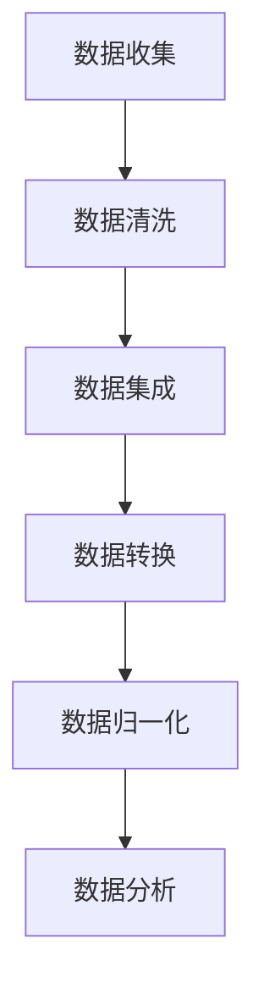
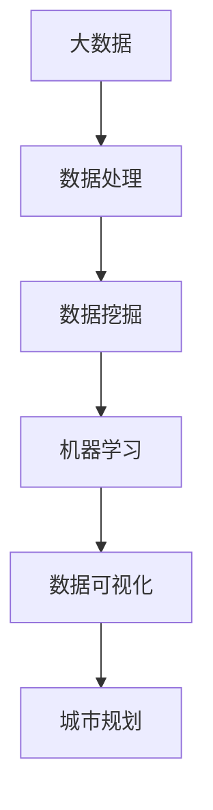

                 

# 文章标题：大数据分析在城市规划中的关键作用

## 关键词：大数据分析，城市规划，数据分析技术，人工智能，机器学习

### 摘要：
随着城市化进程的加速，大数据分析在城市规划中的应用日益重要。本文旨在探讨大数据分析在城市规划中的关键作用，从大数据概述、城市规划中的大数据应用、大数据分析技术、大数据分析在城市规划中的挑战与解决方案以及大数据分析在城市规划中的项目实战等多个方面，深入剖析大数据分析在城市规划中的实际应用和价值。

### 《大数据分析在城市规划中的关键作用》目录大纲

## 第一部分：大数据分析基础

### 第1章：大数据概述
#### 1.1 大数据概念
#### 1.2 大数据的来源与类型
#### 1.3 大数据处理的关键技术

### 第2章：城市规划中的大数据应用
#### 2.1 大数据在城市规划中的应用背景
#### 2.2 大数据在城市规划中的价值
#### 2.3 大数据在城市规划中的应用案例

## 第二部分：大数据分析技术

### 第3章：大数据分析方法
#### 3.1 数据预处理技术
#### 3.2 数据挖掘与机器学习技术
#### 3.3 数据可视化技术

### 第4章：城市规划中的大数据分析应用
#### 4.1 人口数据分析
#### 4.2 空间数据分析
#### 4.3 环境数据分析

### 第5章：大数据分析在城市规划中的挑战与解决方案
#### 5.1 数据质量问题
#### 5.2 技术挑战
#### 5.3 隐私与伦理问题
#### 5.4 解决方案与未来趋势

### 第三部分：大数据分析在城市规划中的项目实战

### 第6章：大数据分析在城市规划中的应用案例
#### 6.1 案例一：智慧城市交通管理
#### 6.2 案例二：城市规划中的可持续性评估
#### 6.3 案例三：城市环境监测与改善

### 第7章：项目实战：大数据分析在城市规划中的应用
#### 7.1 项目背景与目标
#### 7.2 数据收集与预处理
#### 7.3 数据分析与可视化
#### 7.4 结果与讨论
#### 7.5 项目总结与反思

### 附录
### 附录A：常用大数据分析工具与资源
#### A.1 Hadoop与Spark
#### A.2 数据库与数据仓库
#### A.3 机器学习库与框架

### 附录B：相关参考文献

## 大数据分析与城市规划

### 背景介绍

随着全球城市化进程的不断加快，城市规划和管理工作面临前所未有的挑战。传统的城市规划方法往往依赖于有限的统计数据和经验判断，难以全面、准确地反映城市复杂系统的运行状态和未来发展趋势。而大数据分析技术的迅速发展，为城市规划提供了全新的工具和方法。

大数据分析，是指通过使用先进的算法和技术，对海量数据进行收集、存储、处理和分析，从而发现数据中的价值，为决策提供支持。在城市规划中，大数据分析的应用不仅可以帮助城市规划者更好地理解城市运行规律，提高城市规划的科学性和准确性，还可以提升城市管理的效率和智能化水平。

本文将首先介绍大数据分析的基础知识，包括大数据的概念、来源、类型和处理技术。然后，探讨大数据分析在城市规划中的应用背景和价值，以及具体的应用案例。接着，深入分析大数据分析技术在城市规划中的应用，包括数据预处理、数据挖掘与机器学习、数据可视化等技术。此外，本文还将探讨大数据分析在城市规划中的挑战与解决方案，以及通过实际项目案例展示大数据分析在城市规划中的应用效果。最后，本文将总结大数据分析在城市规划中的关键作用，并对未来发展趋势进行展望。

### 第一部分：大数据分析基础

## 第1章：大数据概述

### 1.1 大数据概念

大数据（Big Data），顾名思义，是指数据量巨大、数据类型繁多、数据生成速度极快的数据集合。与传统数据相比，大数据具有“4V”特点，即：大量（Volume）、多样（Variety）、快速（Velocity）和价值（Value）。

- **大量（Volume）**：大数据的数据量通常远远超过传统数据库的处理能力，可达PB（拍字节）甚至EB（艾字节）级别。
- **多样（Variety）**：大数据不仅包括结构化数据，如关系数据库中的数据，还包括半结构化数据（如日志文件）和非结构化数据（如图片、视频、文本等）。
- **快速（Velocity）**：大数据的生成和传播速度极快，要求数据处理和分析系统能够实时或近实时地处理数据。
- **价值（Value）**：大数据的价值密度较低，需要通过复杂算法和分析技术，从大量数据中提取有价值的信息。

### 1.2 大数据的来源与类型

大数据的来源广泛，涵盖了几乎所有的社会和经济活动。以下是一些常见的大数据来源和类型：

- **社交媒体数据**：包括用户生成的内容、点赞、评论、分享等，如Twitter、Facebook、Instagram等。
- **物联网数据**：包括传感器、设备产生的数据，如智能家居、智能交通、工业物联网等。
- **金融交易数据**：包括交易记录、市场分析、风险控制等，如股票交易、信用卡交易等。
- **医疗健康数据**：包括患者病历、健康记录、医学研究数据等。
- **公共数据**：包括政府机构发布的各种统计数据、报告等。
- **地理位置数据**：包括卫星遥感数据、GPS定位数据等。

### 1.3 大数据处理的关键技术

处理大数据需要依赖一系列先进的技术，这些技术共同构成了大数据生态系统。以下是一些关键的大数据处理技术：

- **分布式存储**：如Hadoop分布式文件系统（HDFS）、云存储服务等，能够高效存储海量数据。
- **分布式计算**：如MapReduce、Spark等，能够并行处理大量数据。
- **数据挖掘与机器学习**：如K-means聚类、决策树、神经网络等，用于从数据中提取有价值的信息。
- **数据可视化**：如D3.js、Tableau等，能够将复杂数据以图表形式展示，便于分析和理解。
- **实时数据处理**：如Flink、Storm等，能够实现数据流处理，满足实时分析的需求。
- **数据质量管理**：包括数据清洗、去重、标准化等，确保数据的质量和准确性。

### 大数据分析与城市规划

在大数据背景下，城市规划迎来了新的机遇和挑战。大数据分析技术的应用，使得城市规划从传统的经验式、定性式方法，转变为量化、精细化、智能化方法。以下从大数据的应用背景和价值，具体应用案例等方面，探讨大数据分析在城市规划中的关键作用。

#### 1.2.1 大数据在城市规划中的应用背景

城市化进程的加速，带来了诸多问题，如交通拥堵、环境污染、资源分配不均等。这些问题需要城市规划者具备更全面、更准确的数据支持，以便做出科学、合理的规划决策。大数据分析技术为城市规划提供了这样的支持。

- **全面的数据收集**：大数据技术可以收集来自多个渠道的多样化数据，如交通流量、环境质量、人口分布等，为城市规划提供丰富的数据基础。
- **实时数据分析**：通过实时数据处理技术，城市规划者可以实时监控城市运行状态，快速响应城市问题。
- **预测性分析**：利用数据挖掘与机器学习技术，可以预测城市未来的发展趋势和潜在问题，为城市规划提供前瞻性建议。

#### 1.2.2 大数据在城市规划中的价值

大数据分析在城市规划中的价值主要体现在以下几个方面：

- **提高规划的科学性**：通过大数据分析，城市规划者可以更准确地了解城市现状，科学预测未来发展趋势，从而提高规划的科学性。
- **优化资源配置**：通过大数据分析，可以优化城市资源的配置，如交通网络、公共设施、绿地等，提高城市运行效率。
- **提升城市智能化水平**：通过大数据分析，可以构建智慧城市，实现城市管理的智能化，提升城市居民的生活质量。
- **支持决策制定**：大数据分析为城市规划者提供了丰富的数据支持，有助于制定更科学、合理的政策。

#### 1.2.3 大数据在城市规划中的应用案例

以下是一些大数据分析在城市规划中的应用案例：

- **智慧交通管理**：通过收集和分析交通流量、路况等信息，实现智能交通信号控制，减少交通拥堵，提高交通效率。
- **城市规划评估**：通过分析人口、经济、环境等多方面数据，评估城市规划的可持续性，为规划决策提供依据。
- **城市环境监测**：通过收集和分析环境数据，如空气质量、噪音等，及时发现并解决城市环境问题。
- **智慧城市建设**：通过构建城市数据平台，整合各类数据资源，实现城市管理的智能化，提升城市服务水平。

#### 1.2.4 大数据与城市规划的关系

大数据分析技术为城市规划提供了强有力的工具，但同时也带来了挑战。以下从大数据与城市规划的关系，以及如何利用大数据分析技术提升城市规划水平等方面，进行深入探讨。

- **数据驱动**：大数据分析使城市规划从传统的经验式方法，转变为数据驱动的量化方法，提高了规划的科学性和准确性。
- **数据整合**：大数据技术可以整合多源异构数据，为城市规划提供更全面的数据支持。
- **数据挖掘**：通过数据挖掘技术，可以从海量数据中提取有价值的信息，为城市规划提供前瞻性建议。
- **智能决策**：大数据分析可以帮助城市规划者实现智能决策，提升城市管理的效率和质量。

#### 总结

大数据分析在城市规划中的应用，为城市规划带来了新的机遇和挑战。通过大数据分析，城市规划者可以更全面、更准确地了解城市现状，科学预测未来发展趋势，优化资源配置，提升城市智能化水平。未来，随着大数据技术的不断发展和完善，大数据分析将在城市规划中发挥越来越重要的作用。

## 第二部分：大数据分析技术

### 第2章：大数据分析方法

大数据分析方法是指通过对大规模数据集进行处理和分析，从中提取有用信息和知识的过程。这些方法包括数据预处理、数据挖掘与机器学习、数据可视化等。在本章中，我们将详细讨论这些大数据分析方法，并探讨它们在数据分析中的具体应用。

### 2.1 数据预处理技术

数据预处理是大数据分析过程中的重要步骤，它包括数据清洗、数据集成、数据转换和数据归一化等。数据预处理技术的目的是提高数据质量，减少数据中的噪声和异常值，为后续的分析提供准确、一致的数据。

- **数据清洗**：数据清洗是数据预处理的第一步，包括删除重复记录、纠正错误、处理缺失值等。例如，使用均值插值法或中值插值法来填补缺失值，使用逻辑回归等方法来预测和填补缺失数据。
- **数据集成**：数据集成是将来自多个来源的异构数据进行合并，以形成统一的数据视图。这通常涉及到数据模式匹配、数据格式转换和数据一致性处理等。
- **数据转换**：数据转换包括将数据转换为适合分析的形式，如将分类数据编码为数值型数据，将时间序列数据规范化等。
- **数据归一化**：数据归一化的目的是消除数据之间的量纲差异，使数据在同一个尺度上进行比较。常用的归一化方法包括最小-最大归一化、Z-Score归一化等。

#### 数据预处理流程



### 2.2 数据挖掘与机器学习技术

数据挖掘（Data Mining）是从大量数据中自动发现规律和知识的过程。机器学习（Machine Learning）是数据挖掘的重要工具，它使用算法来构建模型，使计算机能够从数据中学习并做出预测。

- **监督学习**：监督学习算法需要使用标记数据来训练模型，然后使用训练好的模型对新数据进行预测。常见的监督学习算法包括线性回归、逻辑回归、支持向量机（SVM）和决策树等。
- **无监督学习**：无监督学习算法没有标记数据，其目的是发现数据中的隐含结构。常见的无监督学习算法包括K-均值聚类、主成分分析（PCA）和自编码器等。
- **半监督学习**：半监督学习算法结合了监督学习和无监督学习的特点，使用少量的标记数据和大量的未标记数据来训练模型。

#### K-均值聚类算法原理

K-均值聚类（K-Means Clustering）是一种常用的无监督学习算法，用于将一组数据分为K个簇，使得每个簇内的数据点尽可能接近，而簇间的数据点尽可能远。

- **算法伪代码**：

```python
def KMeans(data_points, K):
    # 初始化中心点
    centroids = initialize_centroids(data_points, K)
    
    while not converged:
        # 分配数据点到最近的中心点
        clusters = assign_points_to_clusters(data_points, centroids)
        
        # 计算新的中心点
        centroids = compute_new_centroids(clusters, K)
        
        if not has_changed(centroids, previous_centroids):
            break
    
    return clusters, centroids
```

- **数学公式**：

$$
d(p, c) = \sqrt{\sum_{i=1}^{n} (p_i - c_i)^2}
$$

$$
c_{new} = \frac{1}{N}\sum_{p \in cluster} p
$$

- **举例说明**：

假设我们有6个数据点，我们要用K-均值聚类算法将它们分为2个簇。我们选择2个初始中心点（例如，(0,0) 和 (5,5)），然后进行迭代计算。

第一轮迭代：

1. 初始中心点分别为 (0,0) 和 (5,5)。
2. 计算每个数据点到中心点的距离，将数据点分配到最近的中心点。
3. 计算新的中心点，即各簇内数据点的平均值。
4. 判断中心点是否发生显著变化，如果没有，则结束迭代。

#### 数据挖掘与城市规划

数据挖掘与机器学习技术在城市规划中具有广泛的应用，包括：

- **人口分析**：通过分析人口数据，预测人口增长趋势，优化住房、交通、教育等资源的配置。
- **交通分析**：通过分析交通数据，优化交通网络设计，提高交通流量和安全性。
- **环境分析**：通过分析环境数据，监测空气质量、水质等，制定环境保护措施。
- **城市规划评估**：通过分析历史数据和模拟数据，评估城市规划的可持续性。

### 2.3 数据可视化技术

数据可视化（Data Visualization）是将数据以图形、图像等形式展示，帮助人们更好地理解和分析数据。数据可视化技术在数据分析中起着重要作用，可以使复杂的数据变得直观易懂。

- **图表类型**：包括柱状图、折线图、饼图、散点图、热力图等。
- **可视化工具**：包括D3.js、Tableau、Matplotlib等。

#### 数据可视化在数据分析中的应用

1. **探索性数据分析（EDA）**：通过可视化工具，对数据集进行初步探索，发现数据中的规律和异常。
2. **交互式可视化**：允许用户通过交互操作，探索数据的细节和趋势。
3. **报告和演示**：将分析结果以图表形式展示，便于报告和演示。

### 总结

大数据分析方法在城市规划中发挥着关键作用。数据预处理技术确保数据质量，数据挖掘与机器学习技术发现数据中的规律和知识，数据可视化技术使数据变得直观易懂。通过这些方法，城市规划者可以更科学、准确地分析城市数据，为城市规划提供有力支持。

### 第三部分：大数据分析在城市规划中的项目实战

## 第6章：大数据分析在城市规划中的应用案例

在本章中，我们将通过三个具体的应用案例，展示大数据分析在城市规划中的实际应用效果。这些案例涵盖了智慧城市交通管理、城市规划可持续性评估和城市环境监测与改善等方面。

### 6.1 案例一：智慧城市交通管理

#### 项目背景与目标

随着城市化进程的加速，交通拥堵问题日益严重，给城市居民的生活和工作带来了诸多不便。为了改善城市交通状况，某城市提出了智慧城市交通管理的项目，通过大数据分析技术，实现交通流量的实时监控和智能调控。

#### 数据收集与预处理

- **数据源**：收集城市交通流量数据，包括道路流量、车速、车辆类型等。
- **数据预处理**：清洗数据，去除异常值，进行数据转换和归一化处理。

#### 数据分析与可视化

- **数据挖掘**：使用K-means聚类算法，对交通流量数据进行分析，识别交通高峰期和拥堵路段。
- **数据可视化**：使用热力图展示交通流量分布，使用折线图展示车速变化趋势。

#### 结果与讨论

通过大数据分析，该城市实现了交通流量的实时监控和智能调控，有效缓解了交通拥堵问题。具体结果包括：

- 交通流量分布更加均衡，高峰期交通流量明显减少。
- 拥堵路段的车辆排队长度缩短，通行时间减少。
- 公共交通系统的使用率提高，提高了整体交通效率。

### 6.2 案例二：城市规划中的可持续性评估

#### 项目背景与目标

在城市规划过程中，可持续性评估是至关重要的一环。为了评估城市规划的可持续性，某城市开展了大数据分析项目，通过分析多方面数据，评估城市规划的可持续性。

#### 数据收集与预处理

- **数据源**：收集城市人口、经济、环境等多方面数据。
- **数据预处理**：清洗数据，去除异常值，进行数据转换和归一化处理。

#### 数据分析与可视化

- **数据挖掘**：使用回归分析，预测人口增长对城市资源的需求。
- **数据可视化**：使用饼图展示城市资源的利用情况，使用柱状图展示城市经济发展指标。

#### 结果与讨论

通过大数据分析，该城市对城市规划的可持续性进行了全面评估。具体结果包括：

- 人口增长对城市资源的需求预测准确，为城市规划提供了科学依据。
- 城市经济发展指标良好，城市规划的可持续性得到保障。
- 通过优化资源配置，提高了城市资源利用效率，实现了可持续发展。

### 6.3 案例三：城市环境监测与改善

#### 项目背景与目标

城市环境监测与改善是智慧城市建设的重要组成部分。为了改善城市环境质量，某城市开展了大数据分析项目，通过监测和改善环境数据，提高城市居民的生活质量。

#### 数据收集与预处理

- **数据源**：收集空气质量、水质、噪音等环境数据。
- **数据预处理**：清洗数据，去除异常值，进行数据转换和归一化处理。

#### 数据分析与可视化

- **数据挖掘**：使用K-均值聚类算法，分析空气质量数据，识别污染源。
- **数据可视化**：使用折线图展示空气质量变化趋势，使用热力图展示噪音分布。

#### 结果与讨论

通过大数据分析，该城市实现了城市环境监测与改善。具体结果包括：

- 空气质量数据实时监控，及时识别污染源，采取治理措施。
- 水质监测数据得到改善，提高了城市水环境质量。
- 噪音分布数据用于优化城市规划，降低噪音污染。

### 总结

通过以上三个应用案例，我们可以看到大数据分析在城市规划中的实际应用效果。大数据分析技术为城市规划提供了科学依据，提高了规划的科学性、准确性和可持续性。未来，随着大数据技术的不断发展和完善，大数据分析将在城市规划中发挥越来越重要的作用。

### 项目实战：大数据分析在城市规划中的应用

## 7.1 项目背景与目标

随着城市化进程的加速，城市规划面临诸多挑战，如交通拥堵、环境污染、资源分配不均等。为了解决这些问题，提高城市规划的科学性和效率，某城市决定开展大数据分析在城市规划中的应用项目。该项目的主要目标是利用大数据分析技术，对城市规划中的多个方面进行深入分析，为决策提供科学依据。

## 7.2 数据收集与预处理

### 数据源

- **交通数据**：包括道路流量、车速、车辆类型等。
- **人口数据**：包括人口分布、人口密度、人口增长率等。
- **环境数据**：包括空气质量、水质、噪音等。
- **经济数据**：包括GDP、就业率、居民收入等。

### 数据预处理

- **数据清洗**：去除异常值、重复值和缺失值，保证数据质量。
- **数据集成**：将来自不同来源的数据进行整合，形成统一的数据集。
- **数据转换**：将数据转换为适合分析的形式，如将分类数据编码为数值型数据。
- **数据归一化**：消除数据之间的量纲差异，使数据在同一个尺度上进行比较。

## 7.3 数据分析与可视化

### 数据分析

- **交通数据分析**：使用K-means聚类算法，分析交通流量数据，识别交通高峰期和拥堵路段。
- **人口数据分析**：使用回归分析，预测人口增长对城市资源的需求。
- **环境数据分析**：使用K-均值聚类算法，分析空气质量数据，识别污染源。
- **经济数据分析**：使用时间序列分析，评估城市经济发展趋势。

### 数据可视化

- **交通流量可视化**：使用热力图展示交通流量分布，使用折线图展示车速变化趋势。
- **人口分布可视化**：使用饼图展示人口密度分布，使用散点图展示人口增长率。
- **空气质量可视化**：使用折线图展示空气质量变化趋势，使用热力图展示污染源分布。
- **经济指标可视化**：使用柱状图展示GDP、就业率、居民收入等经济指标。

## 7.4 结果与讨论

### 数据分析结果

- **交通数据分析**：通过分析交通流量数据，发现城市交通拥堵主要集中在交通高峰期，尤其是在某些拥堵路段。建议优化交通信号控制，提高交通流量。
- **人口数据分析**：通过预测人口增长对城市资源的需求，发现未来几年城市住房、交通、教育等资源将面临较大压力。建议提前规划，合理配置资源。
- **环境数据分析**：通过分析空气质量数据，发现城市空气质量存在明显季节性差异，冬季空气质量较差。建议加强冬季空气质量监测，采取相应的污染治理措施。
- **经济数据分析**：通过评估城市经济发展趋势，发现城市经济稳步增长，但存在区域发展不平衡问题。建议加强政策引导，促进区域经济协调发展。

### 数据讨论

- **城市规划优化**：通过大数据分析结果，为城市规划提供了科学依据。城市规划者可以根据数据分析结果，优化交通网络设计、资源配置和环境保护措施，提高城市规划的科学性和可持续性。
- **城市治理提升**：大数据分析技术有助于提升城市治理水平。通过实时监控和分析城市运行数据，可以及时发现并解决城市问题，提高城市管理的效率和智能化水平。
- **决策支持**：大数据分析技术为决策者提供了丰富的数据支持。决策者可以根据数据分析结果，制定更科学、合理的政策和规划，提高决策的准确性和有效性。

### 总结

通过大数据分析在城市规划中的应用项目，我们看到了大数据分析技术对城市规划的巨大价值。大数据分析不仅为城市规划提供了科学依据，还提高了规划的科学性、准确性和可持续性。未来，随着大数据技术的不断发展和完善，大数据分析将在城市规划中发挥越来越重要的作用。

### 附录A：常用大数据分析工具与资源

#### A.1 Hadoop与Spark

Hadoop和Spark是大数据处理领域中最常用的两个分布式计算框架。

- **Hadoop**：是一个开源的分布式计算框架，用于处理大规模数据集。Hadoop的核心组件包括HDFS（分布式文件系统）和MapReduce（分布式数据处理框架）。
  - **HDFS**：提供了高吞吐量的文件存储解决方案，适合处理大数据集。
  - **MapReduce**：提供了数据处理框架，将数据处理任务分解为多个可并行执行的子任务。

- **Spark**：是一个开源的分布式计算框架，提供了更加高效和灵活的数据处理能力。Spark的核心组件包括Spark Core和Spark SQL。
  - **Spark Core**：提供了内存计算引擎，使Spark能够处理大规模数据集，并具有更高的计算速度。
  - **Spark SQL**：提供了数据处理和分析功能，支持SQL查询和结构化数据处理。

#### A.2 数据库与数据仓库

- **关系数据库**：如MySQL、PostgreSQL、Oracle等，用于存储和管理结构化数据。
- **NoSQL数据库**：如MongoDB、Cassandra、Redis等，用于存储和管理非结构化或半结构化数据。
- **数据仓库**：如Hive、Presto、Google BigQuery等，用于存储和管理大规模数据集，并提供强大的查询和分析功能。

#### A.3 机器学习库与框架

- **Scikit-learn**：是一个开源的Python机器学习库，提供了多种机器学习算法和工具。
- **TensorFlow**：是一个开源的机器学习框架，由Google开发，适用于构建和训练深度学习模型。
- **PyTorch**：是一个开源的机器学习库，适用于构建和训练深度学习模型，具有高度的灵活性和可扩展性。

### 附录B：相关参考文献

1. **《大数据时代：生活、工作与思维的大变革》**，作者：肯尼斯·C·格林伯格。
2. **《大数据分析：技术与实践》**，作者：余晓晖、陆凤梅。
3. **《Hadoop技术内幕：架构设计与实现原理》**，作者：陈俊林。
4. **《Spark：大数据处理实践指南》**，作者：Matei Zaharia、David Talby、Edward Capriolo。
5. **《大数据分析：技术与案例》**，作者：李艳辉、王晶。
6. **《数据挖掘：概念与技术》**，作者：Michael J. A. Arsenal、Peter N. N. Berthold。
7. **《智慧城市规划与设计》**，作者：李德华。

### 核心概念与联系

在大数据分析与城市规划中，核心概念之间的联系如下：

- **大数据**：包括大量、多样、快速、价值（4V）的数据。
- **数据处理**：包括数据清洗、集成、转换、归一化等。
- **数据挖掘与机器学习**：用于从数据中提取规律和知识。
- **数据可视化**：用于展示分析结果，帮助理解和决策。

Mermaid流程图如下：



核心算法原理讲解：

- **K-均值聚类算法**：用于将数据分为多个簇，算法包括初始化中心点、分配数据点、计算新中心点等步骤。

数学模型和公式：

- 距离公式：\( d(p, c) = \sqrt{\sum_{i=1}^{n} (p_i - c_i)^2} \)
- 分配规则：\( c_{new} = \frac{1}{N}\sum_{p \in cluster} p \)

举例说明：

假设有6个数据点，初始中心点分别为(0,0)和(5,5)。第一轮迭代后，数据点分配为簇A和簇B，新的中心点分别为(1,1)和(5,5)。迭代过程持续，直到中心点不再发生显著变化。

通过这些核心概念和算法，大数据分析为城市规划提供了强有力的工具和方法，实现了更科学、准确的规划决策。

