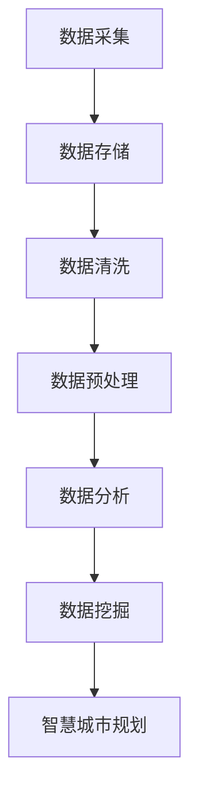

                 

# 大数据分析在智慧城市规划中的关键技术

关键词：大数据分析，智慧城市，数据采集，数据挖掘，交通管理，环境监测，应用趋势

摘要：智慧城市的建设离不开大数据分析技术的支持。本文首先概述了大数据分析的基本概念和发展历程，然后详细介绍了大数据分析技术在数据存储与管理、数据清洗与预处理、数据采集与处理、数据分析与挖掘等方面的核心技术和应用。最后，本文通过具体案例分析，探讨了大数据分析在智慧城市规划中的挑战与趋势，并对其未来发展进行了展望。

## 第一部分：大数据分析概述

### 第1章：大数据分析基本概念

#### 1.1 大数据的定义与特点

##### 1.1.1 大数据的定义
大数据通常指的是在数据规模（Volume）、数据种类（Variety）、数据速度（Velocity）和数据真实性（Veracity）方面都具有特定特点的数据集合。

- **数据规模（Volume）**：大数据通常指的是大量数据，如 TB、PB 甚至 ZB 级别的数据规模。
- **数据种类（Variety）**：大数据的多样性体现在结构化数据、半结构化数据和非结构化数据的混合使用。
- **数据速度（Velocity）**：大数据处理的速度要求高，需要实时或近实时的处理能力。
- **数据真实性（Veracity）**：大数据的真实性是指数据的质量和可信度。

##### 1.1.2 大数据的特点
大数据具有以下几个显著特点：

- **海量数据**：数据规模庞大，需要高效的数据处理和管理技术。
- **多样化的数据类型**：包含文本、图像、音频、视频等多种类型的数据。
- **实时性需求**：大数据分析往往要求实时或近实时的响应速度。
- **数据真实性的不确定性**：大数据来源广泛，数据质量参差不齐，真实性和可信度难以保证。

#### 1.2 大数据分析的挑战

##### 1.2.1 数据处理能力
大数据分析面临的主要挑战之一是如何高效地处理海量数据。这包括数据清洗、存储、处理和管理的复杂性。

- **数据清洗**：需要处理大量的噪音数据和异常值，确保数据质量。
- **数据存储**：需要高效的存储技术来应对海量数据的存储需求。
- **数据处理**：需要并行计算和分布式处理技术来提升数据处理速度。
- **数据管理**：需要建立完善的数据管理体系，确保数据的安全和隐私。

##### 1.2.2 数据安全与隐私
数据安全和隐私保护是大数据分析的重要挑战。

- **数据泄露风险**：大数据往往包含敏感信息，数据泄露风险高。
- **隐私保护**：需要采取有效的数据加密和隐私保护技术，遵守相关法律法规。

#### 1.3 大数据分析的发展历程

##### 1.3.1 初期探索阶段
大数据分析技术的发展始于对海量数据处理的探索。

- **Hadoop与MapReduce**：Hadoop是首个实现大数据处理的框架，MapReduce是其核心计算模型。
- **分布式存储技术**：如HDFS（Hadoop Distributed File System）的出现，解决了大数据存储问题。

##### 1.3.2 大数据技术成熟期
随着技术的进步，大数据分析技术逐渐成熟。

- **Spark**：Spark是一种快速通用的计算引擎，适用于批处理和流处理。
- **NoSQL数据库**：如MongoDB、Cassandra、HBase等，提供了高效的存储和查询能力。
- **数据仓库**：如Redshift、BigQuery等，为大数据存储和分析提供了强大的支持。

##### 1.3.3 深度学习与人工智能的结合
深度学习和人工智能的结合，为大数据分析带来了新的可能性。

- **图神经网络**：适用于复杂关系的分析和预测。
- **深度强化学习**：结合了深度学习和强化学习，适用于动态环境的决策问题。

### 第2章：大数据分析技术体系

#### 2.1 数据存储与管理

##### 2.1.1 数据仓库
数据仓库是用于存储和管理大数据的数据库系统。

- **数据仓库的概念**：数据仓库是一个用于支持企业或组织决策的数据集合。
- **数据仓库的架构**：包括数据源、数据仓库、数据集市和前端工具等组成部分。

##### 2.1.2 NoSQL数据库
NoSQL数据库适用于处理非结构化数据和海量数据。

- **MongoDB**：一种文档数据库，适用于存储和查询复杂结构的数据。
- **Cassandra**：一种分布式列存储数据库，适用于高并发和可扩展的场景。
- **HBase**：一种分布式存储系统，建立在HDFS之上，提供随机读写访问。

##### 2.1.3 分布式文件系统
分布式文件系统适用于大数据的存储和管理。

- **HDFS（Hadoop Distributed File System）**：Hadoop的分布式文件系统，提供高吞吐量的数据访问。
- **Alluxio**：一种分布式内存文件系统，提供快速的存储访问和数据处理能力。

#### 2.2 数据清洗与预处理

##### 2.2.1 数据清洗
数据清洗是大数据分析的重要步骤。

- **数据缺失处理**：处理数据中的缺失值，包括填充缺失值和删除含有缺失值的记录。
- **数据重复处理**：识别并处理数据中的重复值，保证数据的唯一性。
- **数据异常值处理**：识别并处理数据中的异常值，确保数据的质量。

##### 2.2.2 数据预处理
数据预处理是大数据分析的基础。

- **数据转换**：将数据从一种格式转换为另一种格式，适应不同的数据处理和分析需求。
- **数据归一化**：将不同量纲的数据转换为相同量纲，方便数据分析和建模。
- **特征工程**：从原始数据中提取有用的特征，提高数据分析的准确性和效率。

## 第二部分：大数据分析在智慧城市规划中的应用

### 第3章：大数据分析在智慧城市规划中的核心概念

#### 3.1 智慧城市规划概述

##### 3.1.1 智慧城市的定义
智慧城市是指通过信息技术手段，实现城市管理和服务的智能化和高效化。

- **智慧城市的定义**：智慧城市是一种以数据为核心的城市管理模式，通过信息化手段提升城市治理效率、优化城市服务、促进可持续发展。
- **智慧城市的特征**：智慧城市具有以下特征：
  - 数据驱动：通过数据分析和挖掘，支持城市管理和决策。
  - 智能化：运用人工智能、物联网等技术，提升城市服务的智能化水平。
  - 高效化：通过优化城市资源配置，提高城市治理和服务的效率。

##### 3.1.2 大数据分析与智慧城市规划的联系
大数据分析在智慧城市规划中发挥着关键作用。

- **数据驱动决策**：大数据分析可以帮助城市规划者更好地理解城市运行状况，为决策提供科学依据。
- **城市运营优化**：通过大数据分析，可以优化城市交通、环境、资源等各方面的运营，提高城市整体效率。

##### 3.1.3 大数据分析在智慧城市规划中的价值
大数据分析为智慧城市规划提供了以下几个方面的价值：

- **提高城市治理效率**：通过数据分析和挖掘，可以更好地发现城市问题，制定有效的治理策略。
- **促进城市可持续发展**：大数据分析可以帮助优化城市资源配置，降低能源消耗，提高环境质量。
- **提升市民生活质量**：通过智能化服务和个性化推荐，提升市民的满意度。

### 第4章：大数据分析在智慧城市规划中的关键技术

#### 4.1 数据采集与处理

##### 4.1.1 数据来源
智慧城市规划需要多种数据来源的支持。

- **政府部门数据**：包括人口统计、交通流量、环境监测等数据。
- **社交媒体数据**：包括市民的评论、反馈、地理位置信息等。
- **物联网数据**：包括智能交通设备、环境监测设备、智能家居设备等产生的数据。

##### 4.1.2 数据处理流程
数据处理是大数据分析的重要环节。

- **数据采集**：通过传感器、互联网等方式收集数据。
- **数据存储**：将采集到的数据存储在分布式文件系统或NoSQL数据库中。
- **数据清洗**：处理数据中的缺失值、异常值和重复值，确保数据质量。
- **数据预处理**：进行数据转换、归一化和特征工程，为后续分析做准备。

#### 4.2 数据分析与挖掘

##### 4.2.1 数据分析技术
数据分析是大数据分析的核心。

- **描述性统计分析**：用于描述数据的基本特征，如均值、方差、分布等。
- **预测分析**：利用历史数据，预测未来的趋势和变化。
- **关联规则挖掘**：发现数据之间的关联性和规律，用于推荐系统和营销策略。

##### 4.2.2 数据挖掘算法
数据挖掘算法用于从数据中提取有用的信息和知识。

- **K-means聚类算法**：将数据分为多个类，每个类内部相似度较高，类间相似度较低。
- **决策树算法**：通过树形结构表示决策过程，用于分类和回归问题。
- **支持向量机算法**：用于分类问题，通过最大化类间间隔进行分类。

### 第5章：大数据分析在智慧城市规划中的应用案例

#### 5.1 城市交通管理

##### 5.1.1 交通流量分析
交通流量分析是智慧城市交通管理的关键。

- **实时交通监测**：通过传感器和摄像头，实时监测城市道路上的交通流量。
- **交通拥堵预测**：利用历史数据和实时数据，预测未来的交通拥堵情况。

##### 5.1.2 智能停车系统
智能停车系统通过大数据分析，优化停车资源的利用。

- **停车资源利用率分析**：分析停车场的利用率，找出空闲车位。
- **停车收费策略优化**：根据停车资源利用情况，制定合理的停车收费策略。

#### 5.2 城市环境监测

##### 5.2.1 气象数据监测
气象数据监测是城市环境管理的重要组成部分。

- **实时气象监测**：通过气象站和传感器，实时监测气象数据。
- **气象预测**：利用历史气象数据和模型，预测未来的天气情况。

##### 5.2.2 环境质量评估
环境质量评估是智慧城市环境管理的关键。

- **空气质量监测**：通过空气质量监测站，实时监测空气质量。
- **噪音污染监测**：通过噪音监测设备，监测城市的噪音污染情况。

### 第6章：大数据分析在智慧城市规划中的挑战与趋势

#### 6.1 技术挑战

##### 6.1.1 数据安全与隐私
数据安全和隐私保护是大数据分析在智慧城市规划中的技术挑战。

- **数据加密**：通过数据加密技术，确保数据传输和存储过程中的安全。
- **隐私保护技术**：采用隐私保护算法和协议，保护市民的隐私。

##### 6.1.2 技术标准化
技术标准化是大数据分析在智慧城市规划中的关键。

- **数据标准制定**：制定统一的数据标准和规范，确保数据的质量和一致性。
- **技术规范**：制定技术标准和规范，确保大数据分析系统的稳定性和可扩展性。

#### 6.2 应用趋势

##### 6.2.1 智慧城市2.0
智慧城市2.0是大数据分析在智慧城市规划中的发展趋势。

- **数据驱动的城市服务**：通过大数据分析，提供更加个性化和高效的公共服务。
- **城市智能化升级**：通过智能化设备和系统的应用，提升城市的整体智能化水平。

##### 6.2.2 5G与大数据
5G与大数据的结合，为智慧城市规划带来了新的机遇。

- **5G网络的高带宽、低延迟特性**：提供了更快速的数据传输和处理能力。
- **大数据的实时分析与处理能力**：通过实时数据分析，提供更准确和及时的决策支持。

### 第7章：大数据分析在智慧城市规划中的未来展望

#### 7.1 新兴技术的应用
新兴技术在智慧城市规划中的应用，将推动大数据分析的发展。

- **区块链技术**：提供数据的安全性和透明性，支持智能合约和去中心化治理。
- **虚拟现实与增强现实技术**：提供沉浸式的数据可视化和交互体验。

##### 7.1.1 数据驱动的城市规划
数据驱动的城市规划是未来智慧城市的发展方向。

- **数据融合与分析**：通过多种数据源的数据融合和分析，提供更全面的决策支持。
- **智能规划与优化**：利用智能算法和优化技术，实现城市资源的最佳配置和利用。

#### 7.2 智慧城市的可持续发展
智慧城市的可持续发展是大数据分析的重要目标。

- **资源优化与环保**：通过大数据分析，优化城市资源的利用，降低能源消耗，提高环境质量。
- **社区参与与互动**：通过大数据分析，促进社区参与和互动，提升市民的幸福感和满意度。

### 附录：大数据分析在智慧城市规划中的工具与资源

#### 附录1：大数据分析工具
- **Hadoop**：一个分布式数据处理框架，适用于大规模数据存储和处理。
- **Spark**：一个快速通用的计算引擎，适用于批处理和流处理。
- **Hive**：一个数据仓库工具，适用于大数据查询和分析。

#### 附录2：智慧城市规划案例库
- **国内外智慧城市规划案例**：提供智慧城市建设的实践经验。
- **案例分析与借鉴**：分析案例中的成功经验和挑战，为其他城市提供参考。

#### 附录3：参考资料
- **相关书籍**：推荐阅读与大数据分析、智慧城市规划相关的专业书籍。
- **学术论文**：查阅最新的学术论文，了解大数据分析领域的最新研究进展。
- **官方报告与政策文件**：参考政府部门发布的官方报告和政策文件，了解智慧城市规划的政策导向和发展趋势。

### Mermaid 流程图

## 作者信息

作者：AI天才研究院/AI Genius Institute & 禅与计算机程序设计艺术 /Zen And The Art of Computer Programming

