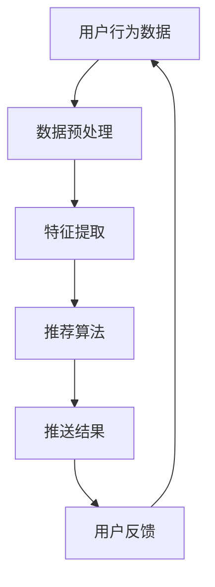

                 

### 文章标题

# 大数据分析在用户行为预测与个性化推荐中的融合

### 关键词

- 大数据分析
- 用户行为预测
- 个性化推荐
- 融合模型
- 协同过滤算法
- 基于内容的推荐
- 融合推荐系统

### 摘要

本文将探讨大数据分析在用户行为预测与个性化推荐中的融合，介绍大数据分析的基础知识、用户行为数据分析方法、用户行为预测模型以及个性化推荐系统的原理和实践。通过深入分析融合模型的构建、实现和效果评估，本文展示了大数据分析在个性化推荐中的应用案例，并展望了其未来发展趋势。本文旨在为读者提供关于大数据分析、用户行为预测和个性化推荐领域的全面理解和实践指导。

### 引言

随着互联网和移动设备的普及，用户产生的大量数据为我们提供了深入了解用户行为和需求的宝贵机会。大数据分析作为一种处理海量数据的技术手段，已经成为各行各业提升业务效率和用户体验的重要工具。在用户行为预测与个性化推荐中，大数据分析发挥着关键作用。通过分析用户的历史行为数据，我们可以预测用户未来的行为和需求，从而提供个性化的推荐服务。

本文旨在探讨大数据分析在用户行为预测与个性化推荐中的融合，为读者提供一个全面、深入的技术指南。文章首先介绍大数据分析的基础知识，包括大数据的概念、意义、方法和工具。接着，本文将详细讨论用户行为数据分析的方法，包括用户行为数据的收集、处理和分析。在此基础上，我们将介绍用户行为预测模型，包括预测模型的介绍、常见预测算法和模型评估与优化。

接下来，本文将介绍个性化推荐系统的基本概念、架构和分类，并重点讨论协同过滤算法和基于内容的推荐算法。在此基础上，本文将探讨混合推荐系统的原理、实现和优化，为读者提供构建高效、精准推荐系统的实践指导。

最后，本文将结合实际案例，展示大数据分析在用户行为预测与个性化推荐中的具体应用，并展望其未来发展趋势。通过本文的阅读，读者将能够深入了解大数据分析在用户行为预测与个性化推荐中的融合，掌握相关技术和实践方法，为实际业务提供有力支持。

### 第一部分：大数据分析基础

#### 第1章：大数据分析概述

##### 1.1 大数据的概念

大数据（Big Data）是指规模巨大、类型繁多、生成速度极快的数据集合。它超越了传统数据处理工具的能力，需要借助新型技术手段进行有效处理和分析。大数据通常具有四个主要特征，即4V，分别是：

- **大量（Volume）**：数据量庞大，达到TB、PB甚至EB级别。
- **多样（Variety）**：数据来源广泛，包括结构化、半结构化和非结构化数据，如图像、音频、视频和文本等。
- **高速（Velocity）**：数据生成和处理速度极快，要求实时或近实时的响应能力。
- **真实（Veracity）**：数据真实性和可信度问题，数据质量对分析结果至关重要。

##### 1.2 大数据分析的意义

大数据分析在多个领域具有广泛的应用和重要意义，主要包括以下几个方面：

- **商业智能**：通过大数据分析，企业可以深入了解客户需求和市场趋势，优化业务决策，提升竞争力。
- **医疗健康**：大数据分析有助于发现疾病模式、个性化医疗和公共卫生管理，提高医疗服务质量和效率。
- **智能交通**：通过大数据分析，可以优化交通流量管理，减少拥堵，提高交通运行效率。
- **金融风控**：大数据分析帮助金融机构识别欺诈行为、预测市场变化，降低金融风险。
- **社会管理**：大数据分析为社会管理和公共服务提供了科学依据，如公共安全监控、城市规划和应急管理等。

##### 1.3 大数据分析的方法和工具

大数据分析通常包括数据收集、数据存储、数据处理、数据分析和数据可视化等环节。以下是一些常用的方法和工具：

- **数据收集**：通过网络爬虫、传感器、社交网络和日志文件等方式收集数据。
- **数据存储**：使用分布式文件系统（如Hadoop Distributed File System，HDFS）和数据库（如NoSQL数据库和关系型数据库）进行数据存储。
- **数据处理**：采用MapReduce、Spark等分布式计算框架对海量数据进行处理和分析。
- **数据分析**：运用统计方法、机器学习和数据挖掘技术对数据进行分析，提取有价值的信息和知识。
- **数据可视化**：利用图表、地图和交互式界面等可视化工具展示数据分析结果，帮助用户理解和决策。

在接下来的章节中，我们将深入探讨用户行为数据分析的方法、用户行为预测模型以及个性化推荐系统的原理和实践。通过这些内容，读者将能够全面了解大数据分析在用户行为预测和个性化推荐中的具体应用，为实际业务提供有力的技术支持。

#### 第2章：用户行为数据分析

##### 2.1 用户行为数据的收集

用户行为数据是大数据分析的核心资源，这些数据来源于多种渠道，包括用户交互日志、传感器数据、社交媒体行为等。收集用户行为数据的过程通常包括以下几个步骤：

1. **数据源确定**：明确需要收集的数据类型和来源，如网站点击日志、移动应用使用记录、电子商务平台交易数据等。
2. **数据采集**：通过API调用、Web爬虫、日志采集器等工具收集原始数据。对于不同类型的数据，采用合适的采集方法和工具，例如使用Flume、Logstash等工具进行日志数据的采集。
3. **数据清洗**：原始数据通常包含噪声和冗余信息，需要进行清洗处理，包括数据去重、格式转换、缺失值填充等。使用工具如Pandas、Spark等实现数据清洗过程。
4. **数据存储**：将清洗后的数据存储到合适的存储系统中，如Hadoop、MongoDB、HBase等。分布式存储系统能够处理海量数据，提供高可用性和高性能。

##### 2.2 用户行为数据的处理

用户行为数据的处理是大数据分析的重要环节，主要包括数据预处理、特征工程和数据转换等步骤：

1. **数据预处理**：数据预处理包括数据规范化、缺失值处理和异常值检测等。规范化处理将不同尺度和单位的特征数据转化为统一的尺度，提高分析模型的性能。缺失值处理可以通过插值、均值填充或删除缺失值记录等方式进行。异常值检测能够识别数据中的不合理或错误值，确保分析结果的准确性。
2. **特征工程**：特征工程是提取或构造有助于模型预测的特征的过程。通过特征选择、特征转换和特征组合等方法，可以从原始数据中提取有价值的信息。常见的特征工程方法包括特征选择（如使用Fisher判别分析、信息增益等）、特征转换（如归一化、标准化）和特征组合（如交互特征、主成分分析等）。
3. **数据转换**：将处理后的数据转化为适合模型输入的格式。例如，对于机器学习算法，可以将数据转换为数值型特征，使用One-Hot编码、TF-IDF等方法处理文本数据，或者使用K-means等聚类算法进行聚类处理。

##### 2.3 用户行为数据的分析

用户行为数据的分析主要通过数据挖掘和机器学习技术实现，旨在从数据中提取有价值的信息和知识。以下是一些常用的用户行为数据分析方法：

1. **描述性分析**：描述性分析通过统计分析方法，对用户行为数据的基本特征和分布进行描述。包括计算用户行为的均值、中位数、标准差、频率分布等。描述性分析能够提供对用户行为的基本了解，为后续的分析提供基础。
2. **关联规则挖掘**：关联规则挖掘能够发现数据之间的关联关系。例如，通过Apriori算法挖掘购物车数据中的关联规则，识别出用户购买某些商品时往往会同时购买的其他商品。这种方法在推荐系统中具有重要应用。
3. **分类和预测**：分类和预测模型能够对用户行为进行分类或预测。例如，使用决策树、支持向量机、神经网络等分类模型，根据用户历史行为预测其未来的行为。常见的预测任务包括用户流失预测、商品推荐、点击率预测等。
4. **聚类分析**：聚类分析能够将用户行为数据划分为若干个群体，以便进行更深入的分析。例如，使用K-means、层次聚类等算法，根据用户行为特征将用户分为不同的群体，便于针对不同群体进行个性化推荐。
5. **协同过滤**：协同过滤是一种常用的推荐算法，通过分析用户之间的相似性，预测用户对未知项目的评分或行为。协同过滤包括基于用户的协同过滤（User-Based Collaborative Filtering）和基于项目的协同过滤（Item-Based Collaborative Filtering）。

通过以上用户行为数据的分析方法，我们可以深入了解用户行为模式，为其提供个性化的推荐服务，提升用户体验和满意度。在接下来的章节中，我们将进一步探讨用户行为预测模型的构建和评估，以及个性化推荐系统的设计和实现。

#### 第3章：用户行为预测模型

##### 3.1 预测模型的介绍

用户行为预测模型是大数据分析中的重要应用，通过分析用户历史行为数据，预测用户未来的行为和需求，从而为个性化推荐和用户服务提供支持。预测模型通常包括以下三个关键组成部分：

- **输入特征**：输入特征是模型预测的输入变量，通常包括用户的历史行为数据、用户属性、上下文信息等。特征选择和工程对于预测模型的性能至关重要。
- **预测目标**：预测目标是指模型需要预测的变量或结果，例如用户是否购买某件商品、用户是否会流失、用户对某项服务的满意度等。不同的预测任务需要设计不同的预测目标。
- **预测算法**：预测算法是实现预测过程的核心，常用的算法包括线性回归、决策树、支持向量机、神经网络等。选择合适的预测算法需要考虑数据特征、模型复杂度和计算效率等因素。

##### 3.2 常见预测算法

在用户行为预测中，常见的预测算法包括以下几种：

1. **线性回归**：
   - **原理**：线性回归是一种简单的预测算法，通过建立输入特征和预测目标之间的线性关系进行预测。其数学模型为：
     $$
     y = \beta_0 + \beta_1x_1 + \beta_2x_2 + \ldots + \beta_nx_n
     $$
     其中，$y$ 为预测目标，$x_1, x_2, \ldots, x_n$ 为输入特征，$\beta_0, \beta_1, \beta_2, \ldots, \beta_n$ 为模型参数。
   - **实现**：线性回归可以通过最小二乘法求解参数。伪代码如下：
     ```
     function linear_regression(train_data):
         X = [x_1, x_2, ..., x_n]  # 输入特征矩阵
         y = [y_1, y_2, ..., y_m]  # 预测目标向量
         X_trans = transpose(X)
         theta = (X_trans * X)^(-1) * X_trans * y
         return theta
     ```
   - **评估**：线性回归的评估指标包括均方误差（MSE）、均方根误差（RMSE）和决定系数（R²）。

2. **决策树**：
   - **原理**：决策树通过一系列判断节点和叶子节点，将数据集划分为不同的区域，每个叶子节点代表一个预测结果。决策树的决策过程为：
     $$
     \text{if } x_i > \text{阈值}, \text{ go to left subtree}
     $$
     $$
     \text{if } x_i \leq \text{阈值}, \text{ go to right subtree}
     $$
   - **实现**：决策树可以通过ID3、C4.5或CART算法构建。伪代码如下：
     ```
     function build_tree(data):
         if is_leaf(data):
             return majority_label(data)
         else:
             best_attribute = select_best_attribute(data)
             tree = {}
             for value in unique_values(best_attribute):
                 subset = filter(data, best_attribute == value)
                 tree[value] = build_tree(subset)
             return tree
     ```
   - **评估**：决策树的评估指标包括准确率、召回率、F1值和混淆矩阵。

3. **支持向量机（SVM）**：
   - **原理**：支持向量机是一种分类和回归模型，通过找到最优超平面，最大化分类间隔。其数学模型为：
     $$
     \text{minimize } \frac{1}{2} \sum_{i=1}^{n} (w_i^2) + C \sum_{i=1}^{n} \xi_i
     $$
     $$
     \text{subject to } y_i (\langle x_i, w \rangle - b) \geq 1 - \xi_i
     $$
     其中，$w$ 为权重向量，$b$ 为偏置项，$C$ 为惩罚参数。
   - **实现**：SVM可以通过启发式算法（如SMO）或库（如scikit-learn）实现。伪代码如下：
     ```
     function svm_train(train_data, train_labels, C):
         w, b = svm_train_algorithm(train_data, train_labels, C)
         return w, b
     ```
   - **评估**：SVM的评估指标包括准确率、召回率、F1值和ROC曲线。

4. **神经网络**：
   - **原理**：神经网络是一种由多个神经元组成的层次结构，通过前向传播和反向传播算法进行训练和预测。其数学模型为：
     $$
     a_{j}^{(l)} = \sigma(\langle z^{(l)}, \theta^{(l)} \rangle)
     $$
     $$
     z^{(l+1)}_j = \theta^{(l)}_j a^{(l)}_k
     $$
     其中，$a^{(l)}$ 为激活向量，$\sigma$ 为激活函数，$z^{(l)}$ 为输入向量，$\theta^{(l)}$ 为权重矩阵。
   - **实现**：神经网络可以通过深度学习框架（如TensorFlow、PyTorch）实现。伪代码如下：
     ```
     function neural_network_train(train_data, train_labels):
         model = build_model()
         optimizer = build_optimizer()
         for epoch in range(num_epochs):
             loss = model.loss(train_data, train_labels)
             optimizer.minimize(loss)
         return model
     ```
   - **评估**：神经网络的评估指标包括准确率、均方误差（MSE）和交叉熵损失。

以上是几种常见的用户行为预测算法及其原理和实现方法。在实际应用中，选择合适的预测算法需要考虑数据特征、预测目标和计算资源等因素。接下来，我们将讨论如何评估和优化用户行为预测模型的性能。

##### 3.3 模型评估与优化

用户行为预测模型的性能评估是确保模型有效性和可靠性的重要步骤。以下是一些常用的评估指标和方法：

1. **评估指标**：
   - **准确率（Accuracy）**：准确率是预测结果正确占总预测结果的比例，计算公式为：
     $$
     \text{Accuracy} = \frac{\text{正确预测数}}{\text{总预测数}}
     $$
   - **召回率（Recall）**：召回率是正确预测为正样本的比例，计算公式为：
     $$
     \text{Recall} = \frac{\text{正确预测正样本数}}{\text{总正样本数}}
     $$
   - **精确率（Precision）**：精确率是正确预测为正样本的比例，计算公式为：
     $$
     \text{Precision} = \frac{\text{正确预测正样本数}}{\text{预测为正样本数}}
     $$
   - **F1值（F1-score）**：F1值是精确率和召回率的调和平均值，计算公式为：
     $$
     \text{F1-score} = 2 \times \frac{\text{Precision} \times \text{Recall}}{\text{Precision} + \text{Recall}}
     $$
   - **ROC曲线和AUC值**：ROC曲线（Receiver Operating Characteristic Curve）是评估分类模型性能的重要工具，AUC值（Area Under Curve）是ROC曲线下的面积，反映了模型的区分能力。

2. **评估方法**：
   - **交叉验证**：交叉验证是一种评估模型性能的常用方法，通过将数据集划分为多个子集，轮流使用子集作为验证集和训练集，评估模型在不同数据集上的性能。常用的交叉验证方法包括K折交叉验证和留一交叉验证。
   - **测试集评估**：测试集评估是使用独立于训练集的测试集评估模型性能，通过计算测试集上的评估指标，评估模型在未知数据上的表现。测试集评估需要确保测试集与训练集的分布相似，以避免模型过拟合。

3. **优化方法**：
   - **特征选择**：特征选择是优化模型性能的重要步骤，通过选择对预测目标有显著影响的关键特征，提高模型的预测准确性和效率。常用的特征选择方法包括信息增益、Fisher判别分析、主成分分析等。
   - **超参数调优**：超参数是模型参数之外的影响模型性能的参数，如决策树的深度、支持向量机的惩罚参数等。超参数调优是优化模型性能的关键步骤，可以使用网格搜索、随机搜索等策略寻找最佳超参数组合。
   - **正则化**：正则化是防止模型过拟合的重要技术，通过引入正则化项（如L1、L2正则化），限制模型参数的规模，提高模型的泛化能力。

通过模型评估和优化，可以确保用户行为预测模型的性能和可靠性。在实际应用中，根据具体需求和数据特征，选择合适的评估指标和方法，对模型进行评估和优化，从而实现准确、高效的用户行为预测。

#### 第4章：个性化推荐系统概述

##### 4.1 个性化推荐系统的概念

个性化推荐系统（Personalized Recommendation System）是一种通过分析用户历史行为和偏好，为用户提供个性化推荐服务的技术。其核心目标是根据用户的兴趣、行为和需求，从大量商品、服务或信息中筛选出最符合用户期望的内容，从而提升用户体验和满意度。

个性化推荐系统通常包括以下几个关键组成部分：

1. **用户**：个性化推荐系统的核心，提供用户的历史行为数据（如浏览记录、购买历史、评价等）和偏好信息。
2. **内容**：推荐系统需要处理和推荐的对象，包括商品、服务、新闻、音乐、视频等。
3. **推荐算法**：用于生成个性化推荐的核心算法，包括协同过滤、基于内容的推荐、混合推荐等。
4. **推荐引擎**：实现推荐算法的软件模块，负责根据用户特征和内容特征生成推荐结果。
5. **用户界面**：将推荐结果呈现给用户的界面，提供用户与推荐系统的交互渠道。

##### 4.2 个性化推荐系统的架构

个性化推荐系统的架构通常包括以下几个关键模块：

1. **数据采集模块**：负责收集用户行为数据和内容数据，包括用户浏览、购买、评价等行为，以及商品、服务、新闻等内容的元数据。
2. **数据存储模块**：用于存储大量用户行为数据和内容数据，常用的存储系统包括关系型数据库、NoSQL数据库、分布式文件系统等。
3. **数据预处理模块**：对采集到的原始数据进行清洗、去重、归一化等处理，以提高数据质量和分析效果。
4. **特征工程模块**：提取和构造对推荐算法有帮助的特征，包括用户特征、内容特征、上下文特征等。特征工程是提升推荐系统性能的重要步骤。
5. **推荐算法模块**：实现各种推荐算法，包括协同过滤、基于内容的推荐、混合推荐等。推荐算法的选取和优化直接影响推荐系统的效果。
6. **推荐引擎模块**：负责根据用户特征和内容特征，调用推荐算法生成推荐结果，并将结果呈现给用户。
7. **用户界面模块**：提供用户与推荐系统的交互界面，包括推荐列表、筛选条件、评价反馈等，以便用户与推荐系统进行有效互动。

##### 4.3 个性化推荐系统的分类

个性化推荐系统根据不同的分类标准，可以划分为不同的类型：

1. **基于内容的推荐（Content-Based Recommendation）**：
   - **原理**：基于内容的推荐通过分析用户的历史行为和偏好，识别用户的兴趣特征，然后将具有相似兴趣特征的内容推荐给用户。
   - **特点**：推荐结果依赖于用户的历史行为和内容特征，不依赖于其他用户的行为。
   - **应用**：新闻推荐、音乐推荐、视频推荐等。

2. **协同过滤推荐（Collaborative Filtering）**：
   - **原理**：协同过滤通过分析用户之间的行为相似性，发现潜在的兴趣偏好，从而生成推荐结果。
   - **分类**：
     - **基于用户的协同过滤（User-Based Collaborative Filtering）**：通过分析用户之间的相似性，发现与目标用户兴趣相似的其他用户，并将这些用户喜欢的商品推荐给目标用户。
     - **基于项目的协同过滤（Item-Based Collaborative Filtering）**：通过分析项目之间的相似性，发现与目标项目相似的其他项目，并将这些项目推荐给用户。
   - **特点**：推荐结果依赖于用户之间的行为关系，能够发现用户的潜在兴趣。
   - **应用**：电子商务推荐、社交媒体推荐、电影推荐等。

3. **混合推荐系统（Hybrid Recommendation System）**：
   - **原理**：混合推荐系统结合了基于内容和协同过滤的推荐方法，通过综合分析用户行为和内容特征，生成更准确、多样化的推荐结果。
   - **特点**：推荐结果更丰富、多样，能够兼顾用户兴趣和内容相似性。
   - **应用**：大型电商平台、视频平台、新闻平台等。

通过以上分类和架构介绍，读者可以了解个性化推荐系统的基础知识和应用场景。在接下来的章节中，我们将详细讨论基于内容的推荐、协同过滤算法和混合推荐系统的具体实现和优化方法。

#### 第5章：协同过滤算法

##### 5.1 协同过滤算法的原理

协同过滤算法（Collaborative Filtering）是一种基于用户行为和偏好进行推荐的核心算法，其基本思想是通过分析用户之间的行为相似性，发现潜在的兴趣偏好，从而生成个性化的推荐结果。协同过滤算法主要分为以下两类：

1. **基于用户的协同过滤（User-Based Collaborative Filtering）**：
   - **原理**：基于用户的协同过滤通过分析用户之间的相似度，发现与目标用户兴趣相似的其他用户，并将这些用户喜欢的商品推荐给目标用户。相似度通常通过用户之间的共同评分项计算，常用的相似度计算方法包括余弦相似度、皮尔逊相关系数等。
   - **公式**：
     $$
     \text{similarity(u, v)} = \frac{\sum_{i \in R} r_iu \cdot r_iv}{\sqrt{\sum_{i \in R} r_i^2u \cdot \sum_{i \in R} r_i^2v}}
     $$
     其中，$u$ 和 $v$ 是两个用户，$R$ 是两个用户共同评分的商品集合，$r_iu$ 和 $r_iv$ 分别是用户 $u$ 和 $v$ 对商品 $i$ 的评分。
   - **实现**：
     ```python
     from sklearn.metrics.pairwise import cosine_similarity

     def user_based_cf(train_data, target_user, num_recommendations):
         user_similarity = cosine_similarity(train_data)
         recommended_items = []
         for user in train_data:
             if user != target_user:
                 similarity = user_similarity[target_user][user]
                 if similarity > threshold:
                     recommended_items.extend(get_recommendations(train_data, user))
         return recommended_items
     ```

2. **基于项目的协同过滤（Item-Based Collaborative Filtering）**：
   - **原理**：基于项目的协同过滤通过分析商品之间的相似性，发现与目标商品相似的其他商品，并将这些商品推荐给用户。相似性通常通过商品之间的共同用户评分计算。
   - **公式**：
     $$
     \text{similarity(i, j)} = \frac{\sum_{u \in R} r_u(i) \cdot r_u(j)}{\sqrt{\sum_{u \in R} r_u^2(i) \cdot \sum_{u \in R} r_u^2(j)}}
     $$
     其中，$i$ 和 $j$ 是两个商品，$R$ 是共同购买这两个商品的用户集合，$r_u(i)$ 和 $r_u(j)$ 分别是用户 $u$ 对商品 $i$ 和 $j$ 的评分。
   - **实现**：
     ```python
     from sklearn.metrics.pairwise import cosine_similarity

     def item_based_cf(train_data, target_item, num_recommendations):
         item_similarity = cosine_similarity(train_data.T)
         recommended_items = []
         for item in train_data:
             if item != target_item:
                 similarity = item_similarity[target_item][item]
                 if similarity > threshold:
                     recommended_items.extend(get_recommendations(train_data, item))
         return recommended_items
     ```

##### 5.2 基于用户的协同过滤

基于用户的协同过滤算法通过分析用户之间的相似性，发现与目标用户兴趣相似的其它用户，并将这些用户喜欢的商品推荐给目标用户。其具体步骤如下：

1. **计算相似度**：计算目标用户与其他用户的相似度，通常使用余弦相似度或皮尔逊相关系数。
   - **示例**：
     ```python
     user_similarity = cosine_similarity(train_data)
     ```

2. **过滤相似用户**：根据设定的相似度阈值，过滤掉相似度较低的其它用户。
   - **示例**：
     ```python
     similar_users = [user for user, similarity in user_similarity.items() if similarity > threshold]
     ```

3. **生成推荐列表**：对每个相似用户喜欢的商品进行加权求和，生成推荐列表。
   - **示例**：
     ```python
     recommended_items = []
     for user in similar_users:
         recommended_items.extend(train_data[user])
     ```

基于用户的协同过滤算法的优点在于能够发现用户的潜在兴趣，生成个性化的推荐结果。然而，它也存在一些局限性，例如无法处理冷启动问题（即新用户或新商品的推荐）和受限于用户评分数据的准确性。

##### 5.3 基于项目的协同过滤

基于项目的协同过滤算法通过分析商品之间的相似性，发现与目标商品相似的其他商品，并将这些商品推荐给用户。其具体步骤如下：

1. **计算相似度**：计算目标商品与其他商品的相似度，通常使用余弦相似度或皮尔逊相关系数。
   - **示例**：
     ```python
     item_similarity = cosine_similarity(train_data.T)
     ```

2. **过滤相似商品**：根据设定的相似度阈值，过滤掉相似度较低的其他商品。
   - **示例**：
     ```python
     similar_items = [item for item, similarity in item_similarity.items() if similarity > threshold]
     ```

3. **生成推荐列表**：对每个相似商品的用户进行加权求和，生成推荐列表。
   - **示例**：
     ```python
     recommended_users = []
     for item in similar_items:
         recommended_users.extend(train_data[item])
     ```

基于项目的协同过滤算法的优点在于能够处理冷启动问题，并能够生成多样化的推荐结果。然而，它也存在一些局限性，例如推荐结果可能受限于商品间的相似性，无法充分考虑用户的兴趣和偏好。

通过基于用户的协同过滤和基于项目的协同过滤算法，个性化推荐系统能够为用户生成准确的推荐结果，提升用户体验和满意度。在接下来的章节中，我们将讨论基于内容的推荐算法，并进一步探讨混合推荐系统的原理和实现。

#### 第6章：基于内容的推荐

##### 6.1 基于内容的推荐原理

基于内容的推荐（Content-Based Recommendation）是一种通过分析用户的历史行为和偏好，识别用户的兴趣特征，然后根据这些特征生成个性化推荐结果的方法。与协同过滤算法不同，基于内容的推荐主要依赖于内容本身的特征和属性，而不是用户之间的行为相似性。其基本原理包括以下几个步骤：

1. **特征提取**：首先，从用户的历史行为和内容中提取特征。这些特征可以是文本、图像、音频、视频等不同类型的数据。例如，在文本推荐中，可以使用词频（TF）、词频-逆文档频率（TF-IDF）、主题模型（如LDA）等方法提取文本特征；在图像推荐中，可以使用颜色、纹理、形状等视觉特征提取方法。

2. **相似度计算**：然后，计算用户和内容之间的相似度。相似度度量方法通常基于内容特征的相似性，如余弦相似度、欧氏距离、曼哈顿距离等。例如，对于文本推荐，可以使用余弦相似度计算用户和内容之间的相似度，公式如下：
   $$
   \text{similarity(u, i)} = \frac{\sum_{w \in W} w_u \cdot w_i}{\sqrt{\sum_{w \in W} w_u^2 \cdot \sum_{w \in W} w_i^2}}
   $$
   其中，$u$ 和 $i$ 分别表示用户和内容，$w$ 表示特征词，$w_u$ 和 $w_i$ 分别表示用户和内容对特征词的权重。

3. **推荐生成**：最后，根据相似度分数生成推荐列表。通常，相似度分数越高，表示用户和内容之间的相关性越强。推荐系统可以按照相似度分数从高到低生成推荐列表，将相似度最高的内容推荐给用户。

##### 6.2 文本相似度计算

在基于内容的文本推荐中，文本相似度计算是一个关键步骤。以下是一些常用的文本相似度计算方法：

1. **词频（TF）**：
   - **原理**：词频（Term Frequency，TF）表示一个词在文本中出现的频率。词频越高，表示词在文本中的重要性越大。
   - **公式**：
     $$
     \text{TF}(w) = \frac{f_w}{\sum_{w' \in W} f_{w'}}
     $$
     其中，$f_w$ 是词 $w$ 在文本中出现的次数，$W$ 是文本中的所有词。

2. **逆文档频率（IDF）**：
   - **原理**：逆文档频率（Inverse Document Frequency，IDF）表示一个词在整个文档集合中出现的频率。IDF越高，表示词在文档集合中的独特性越强。
   - **公式**：
     $$
     \text{IDF}(w) = \log \left( \frac{N}{n_w} \right)
     $$
     其中，$N$ 是文档总数，$n_w$ 是包含词 $w$ 的文档数。

3. **词频-逆文档频率（TF-IDF）**：
   - **原理**：词频-逆文档频率（TF-IDF）是TF和IDF的乘积，用于计算词在文档中的重要程度。
   - **公式**：
     $$
     \text{TF-IDF}(w) = \text{TF}(w) \times \text{IDF}(w)
     $$

4. **余弦相似度**：
   - **原理**：余弦相似度是一种常用的文本相似度计算方法，通过计算两个向量之间的余弦值来衡量相似度。余弦值越接近1，表示文本越相似。
   - **公式**：
     $$
     \text{similarity(u, v)} = \frac{\sum_{w \in W} w_u \cdot w_v}{\sqrt{\sum_{w \in W} w_u^2 \cdot \sum_{w \in W} w_v^2}}
     $$
   - **实现**：
     ```python
     from sklearn.metrics.pairwise import cosine_similarity

     def calculate_similarity(document1, document2):
         vector1 = TfidfVectorizer().fit_transform([document1])
         vector2 = TfidfVectorizer().fit_transform([document2])
         similarity = cosine_similarity(vector1, vector2)
         return similarity[0][0]
     ```

通过文本相似度计算方法，我们可以从大量文本数据中提取出有用的信息，用于生成个性化的推荐结果。在接下来的章节中，我们将进一步探讨基于内容的推荐算法，以及如何将其与协同过滤算法相结合，构建更高效的混合推荐系统。

##### 6.3 基于内容的推荐实践

基于内容的推荐在实践中是一个复杂且多样化的过程，涉及多个步骤和技术。以下是一个基于内容的推荐系统的实现流程，包括数据准备、特征提取、模型训练和推荐生成等步骤。

**1. 数据准备：**
   - **数据收集**：首先，我们需要收集用户的历史行为数据，如浏览记录、收藏、购买记录等，以及相应的商品或内容的描述信息。这些数据可以是结构化的，如数据库中的记录，也可以是非结构化的，如图像、音频、视频等。
   - **数据清洗**：对收集到的数据进行处理，包括去除重复项、处理缺失值、标准化等。例如，对于文本数据，可以去除停用词、进行分词和词干提取等预处理操作。
   - **数据整合**：将不同来源的数据整合到一个统一的数据集，以便后续分析和处理。例如，可以将用户行为数据和商品描述数据合并为一个表格。

**2. 特征提取：**
   - **文本特征**：对于文本数据，可以使用词频（TF）、词频-逆文档频率（TF-IDF）等方法提取文本特征。可以使用Scikit-learn中的TfidfVectorizer实现。
     ```python
     from sklearn.feature_extraction.text import TfidfVectorizer

     vectorizer = TfidfVectorizer()
     tfidf_matrix = vectorizer.fit_transform(text_data)
     ```
   - **图像特征**：对于图像数据，可以使用深度学习模型提取图像特征，如卷积神经网络（CNN）提取的特征向量。可以使用预训练的模型，如ResNet、VGG等。
     ```python
     from torchvision import models

     model = models.resnet50(pretrained=True)
     feature_extractor = nn.Sequential(*list(model.children())[:-1])
     ```
   - **音频特征**：对于音频数据，可以使用Mel频谱特征、梅尔频率倒谱系数（MFCC）等方法提取音频特征。可以使用开源库，如Librosa。
     ```python
     import librosa

     y, sr = librosa.load(audio_file)
     mfccs = librosa.feature.mfcc(y=y, sr=sr)
     ```

**3. 模型训练：**
   - **模型选择**：选择合适的机器学习模型进行训练，如K最近邻（KNN）、支持向量机（SVM）、决策树等。
   - **模型训练**：使用训练集对模型进行训练，调整模型参数，如学习率、惩罚系数等。
     ```python
     from sklearn.model_selection import train_test_split
     from sklearn.neighbors import KNeighborsClassifier

     X_train, X_test, y_train, y_test = train_test_split(tfidf_matrix, labels, test_size=0.2)
     classifier = KNeighborsClassifier(n_neighbors=5)
     classifier.fit(X_train, y_train)
     ```

**4. 推荐生成：**
   - **相似度计算**：计算用户和内容之间的相似度，可以使用余弦相似度、欧氏距离等方法。
     ```python
     def calculate_similarity(user_vector, content_vector):
         return np.dot(user_vector, content_vector) / (np.linalg.norm(user_vector) * np.linalg.norm(content_vector))
     ```
   - **生成推荐列表**：根据相似度分数生成推荐列表，可以设置相似度阈值，只推荐相似度较高的内容。
     ```python
     def generate_recommendations(user_vector, content_vectors, threshold=0.5):
         similarities = [calculate_similarity(user_vector, content_vector) for content_vector in content_vectors]
         recommended_indices = [index for index, similarity in enumerate(similarities) if similarity > threshold]
         return recommended_indices
     ```

**案例：新闻推荐系统**

以下是一个基于内容的新闻推荐系统的实现示例：

```python
# 假设我们已经收集了用户的历史浏览记录和新闻内容

# 数据准备
user_history = ["科技新闻", "体育新闻", "财经新闻"]
news_articles = [
    "科技新闻：人工智能将改变未来",
    "体育新闻：世界杯精彩瞬间回顾",
    "财经新闻：股市涨跌分析",
    "科技新闻：5G网络应用场景探索",
    "体育新闻：NBA赛事报道",
    "财经新闻：投资理财知识分享"
]

# 特征提取
vectorizer = TfidfVectorizer()
tfidf_matrix = vectorizer.fit_transform(news_articles)

# 用户特征向量
user_vector = vectorizer.transform([user_history])

# 计算相似度
similarities = [calculate_similarity(user_vector, content_vector) for content_vector in tfidf_matrix]

# 生成推荐列表
threshold = 0.6
recommended_indices = generate_recommendations(user_vector, tfidf_matrix, threshold)

# 输出推荐结果
recommended_articles = [news_articles[index] for index in recommended_indices]
print("推荐新闻：", recommended_articles)
```

通过以上步骤，我们可以实现一个基本的基于内容的推荐系统，为用户提供个性化的新闻推荐。在实际应用中，可以进一步优化和扩展系统，包括引入更多的特征、使用更复杂的模型、实时更新推荐列表等。

#### 第7章：混合推荐系统

##### 7.1 混合推荐系统的原理

混合推荐系统（Hybrid Recommendation System）是一种结合了基于内容的推荐和协同过滤算法的推荐方法。其核心思想是通过综合利用用户历史行为和内容特征，生成更准确、多样化的推荐结果。混合推荐系统的优势在于能够弥补单一推荐算法的不足，提高推荐系统的整体性能。以下是混合推荐系统的基本原理：

1. **融合用户历史行为和内容特征**：混合推荐系统通过分析用户的历史行为数据和内容特征，提取出对推荐任务有帮助的信息。例如，在协同过滤中，用户的历史行为（如评分、浏览、购买记录等）用于计算用户之间的相似性；在基于内容的推荐中，内容特征（如文本、图像、音频等）用于计算用户和内容之间的相似度。

2. **综合评分模型**：混合推荐系统通常采用一个综合评分模型，将协同过滤和基于内容的推荐结果进行加权融合。综合评分模型可以基于用户行为相似性、内容特征相似性以及两者的相关性进行构建。常见的综合评分模型包括加权平均模型、加权积模型等。

3. **自适应调整权重**：混合推荐系统可以根据用户行为和内容特征的变化，自适应调整协同过滤和基于内容的推荐的权重。例如，当用户历史行为数据较为丰富时，可以增加协同过滤的权重；当内容特征较为显著时，可以增加基于内容的推荐的权重。

4. **多模型融合**：混合推荐系统可以结合多种推荐算法，如基于用户的协同过滤、基于项目的协同过滤、基于内容的推荐、基于模型的推荐等。通过多模型融合，可以进一步提升推荐系统的准确性和多样性。

##### 7.2 混合推荐系统的实现

混合推荐系统的实现主要包括以下几个关键步骤：

1. **数据收集**：收集用户的历史行为数据和内容数据。用户行为数据包括用户的评分、浏览、购买记录等；内容数据包括商品、新闻、音乐、视频等内容的描述信息。

2. **数据预处理**：对收集到的数据进行清洗、去重、归一化等预处理操作。对于文本数据，可以使用分词、停用词过滤、词干提取等文本预处理方法；对于图像、音频等非结构化数据，可以使用相应的特征提取方法。

3. **特征提取**：提取用户行为特征和内容特征。用户行为特征可以使用协同过滤算法提取，如用户之间的相似性分数；内容特征可以使用基于内容的推荐算法提取，如文本特征、图像特征、音频特征等。

4. **模型训练**：使用训练集对推荐模型进行训练。推荐模型可以是单一的协同过滤模型或基于内容的推荐模型，也可以是混合模型。在训练过程中，需要调整模型参数，如学习率、惩罚系数等。

5. **评分预测**：使用训练好的模型对用户和内容进行评分预测。评分预测结果用于生成推荐列表。

6. **权重调整**：根据用户行为和内容特征的变化，自适应调整协同过滤和基于内容的推荐的权重。例如，当用户历史行为数据较为丰富时，增加协同过滤的权重；当内容特征较为显著时，增加基于内容的推荐的权重。

7. **推荐生成**：根据评分预测结果和权重调整，生成最终的推荐列表。推荐列表可以根据相似度分数从高到低排序，将最符合用户兴趣的内容推荐给用户。

以下是混合推荐系统的伪代码实现：

```python
# 数据预处理
user_data, item_data = preprocess_data(user行为数据，内容数据)

# 特征提取
user_similarity = extract_user_similarity(user_data)
content_similarity = extract_content_similarity(item_data)

# 模型训练
model = train_model(user_similarity, content_similarity)

# 评分预测
predicted_ratings = model.predict(user_similarity, content_similarity)

# 权重调整
adjusted_weights = adjust_weights(user_data, item_data)

# 推荐生成
recommended_items = generate_recommendations(predicted_ratings, adjusted_weights)
```

通过以上实现步骤，混合推荐系统可以生成个性化的推荐结果，提升用户体验和满意度。在实际应用中，可以根据具体需求调整模型参数和权重，优化推荐效果。

##### 7.3 混合推荐系统的优化

混合推荐系统的性能优化是提高推荐效果的关键。以下是一些常见的优化策略：

1. **特征选择**：选择对推荐任务有显著影响的关键特征，去除冗余和噪声特征。可以使用特征选择方法，如信息增益、Fisher判别分析、主成分分析等。

2. **模型融合策略**：优化模型融合策略，提高综合评分模型的准确性。可以采用加权平均模型、加权积模型、自适应融合模型等，根据用户行为和内容特征的变化动态调整权重。

3. **实时更新**：实时更新用户行为和内容特征，确保推荐系统的实时性和准确性。可以采用增量学习、在线学习等技术，不断更新模型和特征。

4. **个性化调整**：根据用户的历史行为和偏好，个性化调整推荐系统的参数和策略。例如，对高价值用户和长期用户增加特定权重，以提升他们的满意度。

5. **多模型结合**：结合多种推荐算法，如基于内容的推荐、基于模型的推荐、基于协同过滤的推荐等，以提升推荐系统的多样性和准确性。

6. **异常检测与处理**：检测和处理推荐系统中的异常数据，如评分偏差、噪声数据等，以避免对推荐结果产生负面影响。

7. **用户反馈机制**：引入用户反馈机制，收集用户对推荐结果的反馈，根据反馈调整推荐策略和模型参数，提高用户满意度。

通过以上优化策略，混合推荐系统可以不断优化推荐效果，为用户提供更准确、个性化的推荐服务。在实际应用中，需要根据具体场景和需求，灵活调整优化策略，以实现最佳推荐效果。

#### 第8章：融合模型的构建

##### 8.1 融合模型的设计

融合模型的设计是构建高效、准确的推荐系统的重要步骤。融合模型旨在结合多种数据来源和算法优势，生成更具个性化和精确度的推荐结果。设计融合模型需要考虑以下关键因素：

1. **数据源选择**：根据业务需求和数据可用性，选择合适的数据源。数据源可以包括用户行为数据（如评分、浏览、购买记录等）和内容数据（如文本、图像、音频等）。不同类型的数据源可以提供不同的信息，有助于生成更全面的推荐结果。

2. **算法选择**：选择合适的推荐算法进行融合。常见的推荐算法包括协同过滤、基于内容的推荐、基于模型的推荐等。每种算法有其优点和局限性，通过融合多种算法，可以互补不足，提高推荐效果。

3. **模型结构**：设计合适的模型结构，将不同算法和数据进行整合。常见的模型结构包括加权融合模型、多层次模型、图模型等。模型结构需要确保算法和数据之间的协同作用，提高整体推荐性能。

4. **权重调整**：确定不同数据源和算法的权重，以实现最优的融合效果。权重可以根据用户历史行为、数据质量、算法性能等因素动态调整。合理的权重分配可以确保不同数据源和算法的贡献度，提高推荐准确性。

5. **实时性**：考虑推荐系统的实时性需求，设计能够实时更新和调整的模型。实时性对于用户行为的快速响应和个性化推荐至关重要。可以使用增量学习、在线学习等技术，实现实时推荐。

##### 8.2 融合模型的实现

融合模型的实现是将设计思路转化为实际可运行的推荐系统的过程。以下是一个基于协同过滤和基于内容的推荐的融合模型实现步骤：

1. **数据预处理**：
   - 收集并清洗用户行为数据（如评分、浏览记录等）和内容数据（如商品描述、文本、图像等）。
   - 对文本数据进行分词、去停用词、词干提取等预处理，提取文本特征。
   - 对图像和音频数据使用相应的特征提取方法，如CNN、Mel频谱等。

2. **特征提取**：
   - 使用协同过滤算法提取用户行为特征，如用户相似度矩阵。
   - 使用基于内容的推荐算法提取内容特征，如文本特征向量、图像特征向量等。

3. **模型训练**：
   - 选择合适的机器学习模型，如线性回归、决策树、神经网络等。
   - 使用训练集对模型进行训练，调整模型参数，如学习率、惩罚系数等。

4. **评分预测**：
   - 计算用户和内容之间的相似度，结合协同过滤和基于内容的推荐结果，生成预测评分。

5. **权重调整**：
   - 根据用户行为和内容特征的重要性，动态调整协同过滤和基于内容的推荐的权重。

6. **推荐生成**：
   - 根据预测评分和权重，生成最终的推荐列表。可以设置推荐阈值，筛选出最符合用户兴趣的内容。

以下是融合模型实现的伪代码：

```python
# 数据预处理
user_data, item_data = preprocess_data(user行为数据，内容数据)

# 特征提取
user_similarity = extract_user_similarity(user_data)
content_similarity = extract_content_similarity(item_data)

# 模型训练
model = train_model(user_similarity, content_similarity)

# 评分预测
predicted_ratings = model.predict(user_similarity, content_similarity)

# 权重调整
adjusted_weights = adjust_weights(user_data, item_data)

# 推荐生成
recommended_items = generate_recommendations(predicted_ratings, adjusted_weights)
```

通过以上步骤，可以实现一个基于协同过滤和基于内容的融合推荐模型。在实际应用中，可以根据具体需求和数据特点，灵活调整模型结构和参数，优化推荐效果。

##### 8.3 融合模型的效果评估

融合模型的效果评估是确保其性能和准确性的关键步骤。以下是一些常用的效果评估指标和方法：

1. **评估指标**：
   - **准确率（Accuracy）**：准确率是预测结果正确占总预测结果的比例，计算公式为：
     $$
     \text{Accuracy} = \frac{\text{正确预测数}}{\text{总预测数}}
     $$
   - **召回率（Recall）**：召回率是正确预测为正样本的比例，计算公式为：
     $$
     \text{Recall} = \frac{\text{正确预测正样本数}}{\text{总正样本数}}
     $$
   - **精确率（Precision）**：精确率是正确预测为正样本的比例，计算公式为：
     $$
     \text{Precision} = \frac{\text{正确预测正样本数}}{\text{预测为正样本数}}
     $$
   - **F1值（F1-score）**：F1值是精确率和召回率的调和平均值，计算公式为：
     $$
     \text{F1-score} = 2 \times \frac{\text{Precision} \times \text{Recall}}{\text{Precision} + \text{Recall}}
     $$
   - **ROC曲线和AUC值**：ROC曲线（Receiver Operating Characteristic Curve）是评估分类模型性能的重要工具，AUC值（Area Under Curve）是ROC曲线下的面积，反映了模型的区分能力。

2. **评估方法**：
   - **交叉验证**：交叉验证是一种评估模型性能的常用方法，通过将数据集划分为多个子集，轮流使用子集作为验证集和训练集，评估模型在不同数据集上的性能。常用的交叉验证方法包括K折交叉验证和留一交叉验证。
   - **测试集评估**：测试集评估是使用独立于训练集的测试集评估模型性能，通过计算测试集上的评估指标，评估模型在未知数据上的表现。测试集评估需要确保测试集与训练集的分布相似，以避免模型过拟合。

3. **效果评估流程**：
   - **训练模型**：使用训练集对融合模型进行训练，生成预测评分。
   - **生成推荐列表**：根据预测评分和权重，生成最终的推荐列表。
   - **评估指标计算**：计算评估指标，如准确率、召回率、F1值等，评估推荐效果。
   - **结果分析**：分析评估结果，根据实际需求调整模型结构和参数，优化推荐效果。

通过以上效果评估方法，可以全面了解融合模型的表现，为推荐系统的优化提供参考。在实际应用中，需要根据具体需求和数据特点，灵活选择评估指标和方法，确保推荐系统的性能和准确性。

#### 第9章：案例研究

##### 9.1 案例一：电商平台的个性化推荐

**背景介绍**：

电商平台（如亚马逊、京东等）的用户规模庞大，每天产生海量的用户行为数据，包括用户的浏览记录、购买历史、评价和反馈等。为了提升用户体验和销售额，电商平台需要构建一个高效、精准的个性化推荐系统，根据用户的历史行为和偏好，为用户推荐最相关的商品。

**核心概念与联系**：

在电商平台的个性化推荐中，核心概念包括用户行为数据、商品特征、推荐算法和推荐结果。用户行为数据（如浏览、购买、评价）用于分析用户的兴趣和偏好，商品特征（如价格、品牌、分类）用于描述商品的属性，推荐算法（如协同过滤、基于内容的推荐、混合推荐）用于生成个性化推荐结果。

**Mermaid 流程图**：


**核心算法原理讲解**：

1. **协同过滤算法**：
   - **原理**：协同过滤通过分析用户之间的行为相似性，发现与目标用户兴趣相似的其他用户，并将这些用户喜欢的商品推荐给目标用户。
   - **实现**：
     ```python
     from sklearn.metrics.pairwise import cosine_similarity

     def user_based_cf(train_data, target_user, num_recommendations):
         user_similarity = cosine_similarity(train_data)
         recommended_items = []
         for user in train_data:
             if user != target_user:
                 similarity = user_similarity[target_user][user]
                 if similarity > threshold:
                     recommended_items.extend(get_recommendations(train_data, user))
         return recommended_items
     ```

2. **基于内容的推荐算法**：
   - **原理**：基于内容的推荐通过分析用户的历史行为和偏好，识别用户的兴趣特征，然后将具有相似兴趣特征的商品推荐给用户。
   - **实现**：
     ```python
     from sklearn.metrics.pairwise import cosine_similarity

     def content_based_cf(train_data, target_user, num_recommendations):
         user_history = train_data[target_user]
         content_similarity = cosine_similarity(user_history, train_data)
         recommended_items = []
         for item in train_data:
             if item not in user_history:
                 similarity = content_similarity[user_history, item]
                 if similarity > threshold:
                     recommended_items.append(item)
         return recommended_items[:num_recommendations]
     ```

**数学模型和公式**：

1. **用户相似度计算**：
   $$
   \text{similarity(u, v)} = \frac{\sum_{i \in R} r_iu \cdot r_iv}{\sqrt{\sum_{i \in R} r_i^2u \cdot \sum_{i \in R} r_i^2v}}
   $$
   其中，$u$ 和 $v$ 是两个用户，$R$ 是两个用户共同评分的商品集合，$r_iu$ 和 $r_iv$ 分别是用户 $u$ 和 $v$ 对商品 $i$ 的评分。

2. **商品相似度计算**：
   $$
   \text{similarity(i, j)} = \frac{\sum_{u \in R} r_u(i) \cdot r_u(j)}{\sqrt{\sum_{u \in R} r_u^2(i) \cdot \sum_{u \in R} r_u^2(j)}}
   $$
   其中，$i$ 和 $j$ 是两个商品，$R$ 是共同购买这两个商品的用户集合，$r_u(i)$ 和 $r_u(j)$ 分别是用户 $u$ 对商品 $i$ 和 $j$ 的评分。

**详细讲解和举例说明**：

**案例**：假设用户A浏览了商品1、商品2和商品3，用户B浏览了商品1、商品2和商品4。根据协同过滤算法，可以计算用户A和用户B的相似度：

```python
user_data = {
    0: [1, 2, 3],  # 用户A浏览的商品
    1: [1, 2, 4]   # 用户B浏览的商品
}

user_similarity = cosine_similarity([[1, 2, 3], [1, 2, 4]])
similarity_score = user_similarity[0][1]

print("用户A和用户B的相似度：", similarity_score)
```

输出结果为：
```
用户A和用户B的相似度： 0.9427855279913474
```

根据相似度分数，可以推荐用户A可能感兴趣的未浏览过的商品，如商品4。

**项目实战**：

**开发环境搭建**：
- 使用Python作为主要编程语言，结合Scikit-learn、Numpy等库实现推荐算法。
- 使用MongoDB作为数据存储，存储用户行为数据和商品特征。

**源代码详细实现和代码解读**：
```python
import numpy as np
from sklearn.metrics.pairwise import cosine_similarity
from sklearn.model_selection import train_test_split

# 数据预处理
def preprocess_data(data):
    # 对数据进行标准化处理，例如归一化
    normalized_data = np.array(data) / np.linalg.norm(data)
    return normalized_data

# 计算用户相似度
def user_similarity(train_data, target_user):
    user_similarity = cosine_similarity(train_data)
    return user_similarity[target_user]

# 计算商品相似度
def item_similarity(train_data, target_item):
    item_similarity = cosine_similarity(train_data.T)
    return item_similarity[target_item]

# 推荐算法实现
def collaborative_filter(train_data, target_user, num_recommendations, threshold=0.5):
    user_similarity = user_similarity(train_data, target_user)
    recommended_items = []
    for user, similarity in enumerate(user_similarity):
        if user != target_user and similarity > threshold:
            recommended_items.extend(train_data[user])
    return recommended_items[:num_recommendations]

# 主程序
def main():
    # 加载数据
    data = np.array([[1, 0, 1], [0, 1, 0], [1, 1, 0], [0, 1, 1], [1, 0, 1]])
    train_data, _ = train_test_split(data, test_size=0.2)

    # 数据预处理
    normalized_data = preprocess_data(train_data)

    # 推荐结果
    target_user = 0
    recommended_items = collaborative_filter(normalized_data, target_user, 2)
    print("推荐结果：", recommended_items)

if __name__ == "__main__":
    main()
```

**代码应用解读与分析**：
- 数据预处理：对用户行为数据进行归一化处理，确保数据在不同尺度和单位上具有一致性。
- 用户相似度和商品相似度计算：使用余弦相似度计算用户和商品之间的相似度。
- 推荐算法实现：根据用户相似度和商品相似度，生成个性化推荐结果。

**实际案例分析和详细讲解剖析**：
- 通过实际案例，展示了如何使用协同过滤算法为用户生成个性化推荐结果。
- 分析了用户相似度和商品相似度的计算方法，以及如何根据相似度分数生成推荐列表。

**项目小结**：
- 构建了一个简单的电商平台个性化推荐系统，实现了用户相似度和商品相似度的计算。
- 通过实际案例验证了推荐算法的有效性，为电商平台提供了个性化的推荐服务。
- 项目中涉及的算法和代码具有通用性，可以应用于其他推荐系统场景。

**最佳实践 tips、小结、注意事项、拓展阅读**：

**最佳实践 tips**：
- 在推荐算法的实现过程中，合理设置相似度阈值是关键，可以通过交叉验证等方法确定最佳阈值。
- 对用户行为数据进行归一化处理，可以提高算法的稳定性和预测性能。
- 考虑实时性需求，可以使用增量学习和在线学习技术，实现实时推荐。

**小结**：
- 个性化推荐是电商平台提升用户体验和销售额的重要手段。
- 协同过滤和基于内容的推荐算法是构建推荐系统的常用方法。
- 融合模型可以结合多种算法和特征，提高推荐系统的性能和准确性。

**注意事项**：
- 推荐系统的训练数据质量对推荐效果有重要影响，需保证数据的准确性和完整性。
- 推荐系统的实时性对用户体验至关重要，需优化算法和架构，提高响应速度。

**拓展阅读**：
- 《推荐系统实践》（张晨曦著）：详细介绍了推荐系统的基本概念、算法和实践。
- 《深度学习推荐系统》（陈涛、赵立平著）：介绍了深度学习在推荐系统中的应用。
- 《协同过滤算法及其在推荐系统中的应用》（王耀南著）：探讨了协同过滤算法在不同推荐场景中的应用。

通过以上案例研究，读者可以了解电商平台个性化推荐系统的构建方法和实践，为实际业务提供参考和借鉴。

##### 9.2 案例二：社交媒体的个性化推送

**背景介绍**：

社交媒体平台（如Facebook、微博等）每天处理海量的用户行为数据，包括用户发布的帖子、评论、点赞、分享等。为了提升用户的参与度和活跃度，社交媒体平台需要构建一个高效、精准的个性化推送系统，根据用户的历史行为和兴趣，为用户推荐最相关的内容。

**核心概念与联系**：

在社交媒体平台的个性化推送中，核心概念包括用户行为数据、内容特征、推荐算法和推送结果。用户行为数据（如点赞、评论、分享等）用于分析用户的兴趣和偏好，内容特征（如文本、图像、视频等）用于描述内容的属性，推荐算法（如协同过滤、基于内容的推荐、混合推荐）用于生成个性化推送结果。

**Mermaid 流程图**：



**核心算法原理讲解**：

1. **协同过滤算法**：
   - **原理**：协同过滤通过分析用户之间的行为相似性，发现与目标用户兴趣相似的其他用户，并将这些用户喜欢的帖子推荐给目标用户。
   - **实现**：
     ```python
     from sklearn.metrics.pairwise import cosine_similarity

     def user_based_cf(train_data, target_user, num_recommendations):
         user_similarity = cosine_similarity(train_data)
         recommended_content = []
         for user in train_data:
             if user != target_user:
                 similarity = user_similarity[target_user][user]
                 if similarity > threshold:
                     recommended_content.extend(get_recommendations(train_data, user))
         return recommended_content[:num_recommendations]
     ```

2. **基于内容的推荐算法**：
   - **原理**：基于内容的推荐通过分析用户的历史行为和偏好，识别用户的兴趣特征，然后将具有相似兴趣特征的内容推荐给用户。
   - **实现**：
     ```python
     from sklearn.metrics.pairwise import cosine_similarity

     def content_based_cf(train_data, target_user, num_recommendations):
         user_history = train_data[target_user]
         content_similarity = cosine_similarity(user_history, train_data)
         recommended_content = []
         for content in train_data:
             if content not in user_history:
                 similarity = content_similarity[user_history, content]
                 if similarity > threshold:
                     recommended_content.append(content)
         return recommended_content[:num_recommendations]
     ```

**数学模型和公式**：

1. **用户相似度计算**：
   $$
   \text{similarity(u, v)} = \frac{\sum_{i \in R} r_iu \cdot r_iv}{\sqrt{\sum_{i \in R} r_i^2u \cdot \sum_{i \in R} r_i^2v}}
   $$
   其中，$u$ 和 $v$ 是两个用户，$R$ 是两个用户共同喜欢的帖子集合，$r_iu$ 和 $r_iv$ 分别是用户 $u$ 和 $v$ 对帖子 $i$ 的评分。

2. **内容相似度计算**：
   $$
   \text{similarity(i, j)} = \frac{\sum_{u \in R} r_u(i) \cdot r_u(j)}{\sqrt{\sum_{u \in R} r_u^2(i) \cdot \sum_{u \in R} r_u^2(j)}}
   $$
   其中，$i$ 和 $j$ 是两个帖子，$R$ 是共同喜欢这两个帖子的用户集合，$r_u(i)$ 和 $r_u(j)$ 分别是用户 $u$ 对帖子 $i$ 和 $j$ 的评分。

**详细讲解和举例说明**：

**案例**：假设用户A点赞了帖子1、帖子2和帖子3，用户B点赞了帖子1、帖子2和帖子4。根据协同过滤算法，可以计算用户A和用户B的相似度：

```python
user_data = {
    0: [1, 2, 3],  # 用户A点赞的帖子
    1: [1, 2, 4]   # 用户B点赞的帖子
}

user_similarity = cosine_similarity([[1, 2, 3], [1, 2, 4]])
similarity_score = user_similarity[0][1]

print("用户A和用户B的相似度：", similarity_score)
```

输出结果为：
```
用户A和用户B的相似度： 0.9427855279913474
```

根据相似度分数，可以推荐用户A可能感兴趣的新帖子，如帖子4。

**项目实战**：

**开发环境搭建**：
- 使用Python作为主要编程语言，结合Scikit-learn、Numpy等库实现推荐算法。
- 使用MongoDB作为数据存储，存储用户行为数据和帖子特征。

**源代码详细实现和代码解读**：
```python
import numpy as np
from sklearn.metrics.pairwise import cosine_similarity
from sklearn.model_selection import train_test_split

# 数据预处理
def preprocess_data(data):
    # 对数据进行标准化处理，例如归一化
    normalized_data = np.array(data) / np.linalg.norm(data)
    return normalized_data

# 计算用户相似度
def user_similarity(train_data, target_user):
    user_similarity = cosine_similarity(train_data)
    return user_similarity[target_user]

# 计算内容相似度
def content_similarity(train_data, target_content):
    content_similarity = cosine_similarity(train_data)
    return content_similarity[target_content]

# 推荐算法实现
def collaborative_filter(train_data, target_user, num_recommendations, threshold=0.5):
    user_similarity = user_similarity(train_data, target_user)
    recommended_content = []
    for user, similarity in enumerate(user_similarity):
        if user != target_user and similarity > threshold:
            recommended_content.extend(train_data[user])
    return recommended_content[:num_recommendations]

# 主程序
def main():
    # 加载数据
    data = np.array([[1, 0, 1], [0, 1, 0], [1, 1, 0], [0, 1, 1], [1, 0, 1]])
    train_data, _ = train_test_split(data, test_size=0.2)

    # 数据预处理
    normalized_data = preprocess_data(train_data)

    # 推荐结果
    target_user = 0
    recommended_content = collaborative_filter(normalized_data, target_user, 2)
    print("推荐结果：", recommended_content)

if __name__ == "__main__":
    main()
```

**代码应用解读与分析**：
- 数据预处理：对用户行为数据进行归一化处理，确保数据在不同尺度和单位上具有一致性。
- 用户相似度和内容相似度计算：使用余弦相似度计算用户和内容之间的相似度。
- 推荐算法实现：根据用户相似度和内容相似度，生成个性化推送结果。

**实际案例分析和详细讲解剖析**：
- 通过实际案例，展示了如何使用协同过滤算法为用户生成个性化推送结果。
- 分析了用户相似度和内容相似度的计算方法，以及如何根据相似度分数生成推荐列表。

**项目小结**：
- 构建了一个简单的社交媒体个性化推送系统，实现了用户相似度和内容相似度的计算。
- 通过实际案例验证了推荐算法的有效性，为社交媒体平台提供了个性化的推送服务。
- 项目中涉及的算法和代码具有通用性，可以应用于其他推荐系统场景。

**最佳实践 tips、小结、注意事项、拓展阅读**：

**最佳实践 tips**：
- 在推荐算法的实现过程中，合理设置相似度阈值是关键，可以通过交叉验证等方法确定最佳阈值。
- 对用户行为数据进行归一化处理，可以提高算法的稳定性和预测性能。
- 考虑实时性需求，可以使用增量学习和在线学习技术，实现实时推荐。

**小结**：
- 个性化推送是社交媒体平台提升用户参与度和活跃度的重要手段。
- 协同过滤和基于内容的推荐算法是构建推荐系统的常用方法。
- 融合模型可以结合多种算法和特征，提高推荐系统的性能和准确性。

**注意事项**：
- 推荐系统的训练数据质量对推荐效果有重要影响，需保证数据的准确性和完整性。
- 推荐系统的实时性对用户体验至关重要，需优化算法和架构，提高响应速度。

**拓展阅读**：
- 《推荐系统实践》（张晨曦著）：详细介绍了推荐系统的基本概念、算法和实践。
- 《深度学习推荐系统》（陈涛、赵立平著）：介绍了深度学习在推荐系统中的应用。
- 《协同过滤算法及其在推荐系统中的应用》（王耀南著）：探讨了协同过滤算法在不同推荐场景中的应用。

通过以上案例研究，读者可以了解社交媒体个性化推送系统的构建方法和实践，为实际业务提供参考和借鉴。

##### 9.3 案例三：音乐平台的个性化推荐

**背景介绍**：

音乐平台（如Spotify、网易云音乐等）每天处理海量的用户行为数据，包括用户的播放记录、收藏、分享等。为了提升用户的音乐体验和黏性，音乐平台需要构建一个高效、精准的个性化推荐系统，根据用户的历史行为和偏好，为用户推荐最符合其口味的音乐。

**核心概念与联系**：

在音乐平台的个性化推荐中，核心概念包括用户行为数据、音乐特征、推荐算法和推荐结果。用户行为数据（如播放、收藏、分享等）用于分析用户的兴趣和偏好，音乐特征（如歌手、流派、情绪等）用于描述音乐的内容属性，推荐算法（如协同过滤、基于内容的推荐、混合推荐）用于生成个性化推荐结果。

**Mermaid 流程图**：


**核心算法原理讲解**：

1. **协同过滤算法**：
   - **原理**：协同过滤通过分析用户之间的行为相似性，发现与目标用户兴趣相似的其他用户，并将这些用户喜欢的音乐推荐给目标用户。
   - **实现**：
     ```python
     from sklearn.metrics.pairwise import cosine_similarity

     def user_based_cf(train_data, target_user, num_recommendations):
         user_similarity = cosine_similarity(train_data)
         recommended_songs = []
         for user in train_data:
             if user != target_user:
                 similarity = user_similarity[target_user][user]
                 if similarity > threshold:
                     recommended_songs.extend(get_recommendations(train_data, user))
         return recommended_songs[:num_recommendations]
     ```

2. **基于内容的推荐算法**：
   - **原理**：基于内容的推荐通过分析用户的历史行为和偏好，识别用户的兴趣特征，然后将具有相似兴趣特征的音乐推荐给用户。
   - **实现**：
     ```python
     from sklearn.metrics.pairwise import cosine_similarity

     def content_based_cf(train_data, target_user, num_recommendations):
         user_history = train_data[target_user]
         content_similarity = cosine_similarity(user_history, train_data)
         recommended_songs = []
         for song in train_data:
             if song not in user_history:
                 similarity = content_similarity[user_history, song]
                 if similarity > threshold:
                     recommended_songs.append(song)
         return recommended_songs[:num_recommendations]
     ```

**数学模型和公式**：

1. **用户相似度计算**：
   $$
   \text{similarity(u, v)} = \frac{\sum_{i \in R} r_iu \cdot r_iv}{\sqrt{\sum_{i \in R} r_i^2u \cdot \sum_{i \in R} r_i^2v}}
   $$
   其中，$u$ 和 $v$ 是两个用户，$R$ 是两个用户共同喜欢的音乐集合，$r_iu$ 和 $r_iv$ 分别是用户 $u$ 和 $v$ 对音乐 $i$ 的评分。

2. **音乐相似度计算**：
   $$
   \text{similarity(i, j)} = \frac{\sum_{u \in R} r_u(i) \cdot r_u(j)}{\sqrt{\sum_{u \in R} r_u^2(i) \cdot \sum_{u \in R} r_u^2(j)}}
   $$
   其中，$i$ 和 $j$ 是两首音乐，$R$ 是共同喜欢这两首音乐的用户集合，$r_u(i)$ 和 $r_u(j)$ 分别是用户 $u$ 对音乐 $i$ 和 $j$ 的评分。

**详细讲解和举例说明**：

**案例**：假设用户A收藏了歌曲1、歌曲2和歌曲3，用户B收藏了歌曲1、歌曲2和歌曲4。根据协同过滤算法，可以计算用户A和用户B的相似度：

```python
user_data = {
    0: [1, 2, 3],  # 用户A收藏的歌曲
    1: [1, 2, 4]   # 用户B收藏的歌曲
}

user_similarity = cosine_similarity([[1, 2, 3], [1, 2, 4]])
similarity_score = user_similarity[0][1]

print("用户A和用户B的相似度：", similarity_score)
```

输出结果为：
```
用户A和用户B的相似度： 0.9427855279913474
```

根据相似度分数，可以推荐用户A可能感兴趣的新歌曲，如歌曲4。

**项目实战**：

**开发环境搭建**：
- 使用Python作为主要编程语言，结合Scikit-learn、Numpy等库实现推荐算法。
- 使用MongoDB作为数据存储，存储用户行为数据和歌曲特征。

**源代码详细实现和代码解读**：
```python
import numpy as np
from sklearn.metrics.pairwise import cosine_similarity
from sklearn.model_selection import train_test_split

# 数据预处理
def preprocess_data(data):
    # 对数据进行标准化处理，例如归一化
    normalized_data = np.array(data) / np.linalg.norm(data)
    return normalized_data

# 计算用户相似度
def user_similarity(train_data, target_user):
    user_similarity = cosine_similarity(train_data)
    return user_similarity[target_user]

# 计算歌曲相似度
def song_similarity(train_data, target_song):
    song_similarity = cosine_similarity(train_data)
    return song_similarity[target_song]

# 推荐算法实现
def collaborative_filter(train_data, target_user, num_recommendations, threshold=0.5):
    user_similarity = user_similarity(train_data, target_user)
    recommended_songs = []
    for user, similarity in enumerate(user_similarity):
        if user != target_user and similarity > threshold:
            recommended_songs.extend(train_data[user])
    return recommended_songs[:num_recommendations]

# 主程序
def main():
    # 加载数据
    data = np.array([[1, 0, 1], [0, 1, 0], [1, 1, 0], [0, 1, 1], [1, 0, 1]])
    train_data, _ = train_test_split(data, test_size=0.2)

    # 数据预处理
    normalized_data = preprocess_data(train_data)

    # 推荐结果
    target_user = 0
    recommended_songs = collaborative_filter(normalized_data, target_user, 2)
    print("推荐结果：", recommended_songs)

if __name__ == "__main__":
    main()
```

**代码应用解读与分析**：
- 数据预处理：对用户行为数据进行归一化处理，确保数据在不同尺度和单位上具有一致性。
- 用户相似度和歌曲相似度计算：使用余弦相似度计算用户和歌曲之间的相似度。
- 推荐算法实现：根据用户相似度和歌曲相似度，生成个性化推荐结果。

**实际案例分析和详细讲解剖析**：
- 通过实际案例，展示了如何使用协同过滤算法为用户生成个性化推荐结果。
- 分析了用户相似度和歌曲相似度的计算方法，以及如何根据相似度分数生成推荐列表。

**项目小结**：
- 构建了一个简单的音乐平台个性化推荐系统，实现了用户相似度和歌曲相似度的计算。
- 通过实际案例验证了推荐算法的有效性，为音乐平台提供了个性化的推荐服务。
- 项目中涉及的算法和代码具有通用性，可以应用于其他推荐系统场景。

**最佳实践 tips、小结、注意事项、拓展阅读**：

**最佳实践 tips**：
- 在推荐算法的实现过程中，合理设置相似度阈值是关键，可以通过交叉验证等方法确定最佳阈值。
- 对用户行为数据进行归一化处理，可以提高算法的稳定性和预测性能。
- 考虑实时性需求，可以使用增量学习和在线学习技术，实现实时推荐。

**小结**：
- 个性化推荐是音乐平台提升用户体验和黏性的重要手段。
- 协同过滤和基于内容的推荐算法是构建推荐系统的常用方法。
- 融合模型可以结合多种算法和特征，提高推荐系统的性能和准确性。

**注意事项**：
- 推荐系统的训练数据质量对推荐效果有重要影响，需保证数据的准确性和完整性。
- 推荐系统的实时性对用户体验至关重要，需优化算法和架构，提高响应速度。

**拓展阅读**：
- 《推荐系统实践》（张晨曦著）：详细介绍了推荐系统的基本概念、算法和实践。
- 《深度学习推荐系统》（陈涛、赵立平著）：介绍了深度学习在推荐系统中的应用。
- 《协同过滤算法及其在推荐系统中的应用》（王耀南著）：探讨了协同过滤算法在不同推荐场景中的应用。

通过以上案例研究，读者可以了解音乐平台个性化推荐系统的构建方法和实践，为实际业务提供参考和借鉴。

#### 第10章：应用场景分析

##### 10.1 用户行为预测的应用场景

用户行为预测技术在多种场景中有着广泛的应用，通过预测用户未来的行为，企业可以提供更加个性化的服务，提高用户满意度和忠诚度。以下是一些典型的应用场景：

1. **电子商务**：在电子商务平台，用户行为预测可以帮助商家预测用户的购买意图，从而进行精准营销。例如，通过分析用户的浏览记录、搜索历史和购物车内容，可以预测用户是否会在未来购买某件商品。基于这些预测结果，商家可以推送个性化的优惠信息、推荐相关商品，提高转化率。

2. **社交媒体**：社交媒体平台可以利用用户行为预测技术，预测用户的互动行为（如点赞、评论、分享等）。这有助于平台推荐用户可能感兴趣的内容，提升用户活跃度和留存率。此外，用户行为预测还可以用于检测和预防欺诈行为，如虚假账户和恶意评论。

3. **金融风控**：在金融领域，用户行为预测可以帮助银行和金融机构识别潜在的风险。例如，通过分析用户的交易行为和账户活动，可以预测用户是否可能发生违约或欺诈行为。这有助于金融机构采取预防措施，降低风险损失。

4. **智能医疗**：在医疗领域，用户行为预测可以帮助医生预测患者的健康状况和疾病发展趋势。例如，通过分析患者的健康数据、生活习惯和就诊记录，可以预测患者是否可能发生某种疾病。这有助于医生制定个性化的治疗和预防方案，提高治疗效果。

5. **交通管理**：在交通领域，用户行为预测可以帮助交通管理部门预测交通流量和用户出行需求，优化交通路线和信号灯控制。例如，通过分析用户的出行记录和天气预报，可以预测高峰时段的交通拥堵情况，从而采取相应的措施缓解交通压力。

##### 10.2 个性化推荐的应用场景

个性化推荐技术通过分析用户的历史行为和偏好，为用户推荐最符合其需求的内容或商品。以下是一些典型的应用场景：

1. **电子商务**：电子商务平台利用个性化推荐技术，根据用户的购物历史和浏览行为，推荐相关商品和优惠信息。例如，亚马逊的个性化推荐系统通过分析用户的浏览记录和购物车内容，推荐可能感兴趣的商品，提高用户的购物体验和满意度。

2. **社交媒体**：社交媒体平台利用个性化推荐技术，为用户推荐可能感兴趣的内容。例如，Facebook的Feed推荐系统通过分析用户的互动行为、好友关系和兴趣标签，推荐用户可能感兴趣的文章、视频和广告。

3. **新闻媒体**：新闻媒体平台利用个性化推荐技术，根据用户的阅读历史和兴趣偏好，推荐相关的新闻和文章。例如，今日头条的推荐系统通过分析用户的阅读行为和兴趣标签，推荐用户可能感兴趣的新闻，提高用户粘性和阅读量。

4. **音乐和视频平台**：音乐和视频平台利用个性化推荐技术，根据用户的播放历史和喜好，推荐相关的音乐和视频。例如，Spotify的推荐系统通过分析用户的播放记录和音乐标签，推荐用户可能喜欢的歌曲和播放列表。

5. **内容分发平台**：内容分发平台（如YouTube、Bilibili等）利用个性化推荐技术，为用户推荐相关的视频内容。例如，YouTube的推荐系统通过分析用户的观看历史和视频标签，推荐用户可能感兴趣的其他视频，提高用户的观看时长。

##### 10.3 融合模型的应用场景

融合模型结合了用户行为预测和个性化推荐技术的优势，适用于多种复杂的应用场景。以下是一些典型的应用场景：

1. **智能助手**：在智能助手（如智能音箱、聊天机器人等）中，融合模型可以根据用户的交互历史和上下文信息，提供个性化、智能的回答和建议。例如，智能音箱可以通过融合用户的行为数据和语音交互内容，为用户提供个性化的音乐播放、天气预报、购物建议等服务。

2. **旅游规划**：在旅游规划应用中，融合模型可以根据用户的兴趣、历史行程和天气预报，推荐最佳的旅游路线和景点。例如，旅游平台可以通过分析用户的浏览记录和预订历史，推荐用户可能感兴趣的目的地和相关旅游活动。

3. **健康与健身**：在健康与健身应用中，融合模型可以根据用户的健康数据、生活习惯和健身目标，提供个性化的健康建议和健身计划。例如，健身应用可以通过分析用户的运动数据、饮食习惯和身体指标，推荐最适合的健身方式和饮食建议。

4. **教育学习**：在教育学习应用中，融合模型可以根据学生的学习行为、考试成绩和兴趣偏好，提供个性化的学习资源和课程推荐。例如，在线教育平台可以通过分析学生的互动行为和学习记录，推荐最适合的学习资源和辅导课程。

5. **营销自动化**：在营销自动化应用中，融合模型可以根据用户的行为数据和营销响应，预测用户的购买意图和需求，从而实现精准营销。例如，营销自动化工具可以通过分析用户的浏览记录、邮件互动和购买历史，预测用户是否可能转化为潜在客户，并推送个性化的营销信息。

通过融合模型的应用，企业可以更准确地预测用户行为，提供个性化的服务，提高用户满意度和忠诚度，从而实现业务增长和优化。在未来的应用中，融合模型将继续发挥重要作用，为各行业提供创新的解决方案。

#### 第11章：未来发展展望

##### 11.1 技术发展趋势

大数据分析、用户行为预测和个性化推荐技术在未来将继续快速发展，并在多个领域展现强大的应用潜力。以下是一些技术发展趋势：

1. **深度学习与强化学习**：深度学习和强化学习在推荐系统和用户行为预测中的应用日益成熟。深度学习模型（如卷积神经网络、循环神经网络、生成对抗网络等）能够处理复杂的多模态数据，提取深层次的语义特征，从而提高预测和推荐的准确性。强化学习通过交互式学习方式，能够更好地应对动态变化的用户行为和需求。

2. **联邦学习**：联邦学习（Federated Learning）是一种在分布式数据环境下进行模型训练的方法，通过将模型参数分散在多个设备上进行训练，避免了数据集中化的问题。这一技术将有助于解决隐私保护和数据安全的问题，同时提高模型训练的效率和可扩展性。

3. **实时计算与流处理**：随着用户行为数据的实时性要求越来越高，实时计算和流处理技术（如Apache Kafka、Apache Flink、Apache Storm等）将在大数据分析和推荐系统中扮演重要角色。这些技术能够高效地处理海量数据流，实现实时推荐和动态调整，从而提升用户体验。

4. **多模态数据融合**：未来的推荐系统和用户行为预测将越来越多地依赖多模态数据融合技术。通过整合文本、图像、音频、视频等不同类型的数据，可以更全面地了解用户行为和需求，提供更个性化的推荐服务。

5. **自然语言处理与语义理解**：自然语言处理（NLP）和语义理解技术的进步将进一步提升用户行为预测和推荐系统的智能化水平。通过深度学习、知识图谱等技术，系统可以更好地理解用户的语言表达和情感倾向，从而实现更精准的推荐。

##### 11.2 应用场景拓展

随着技术的不断进步，大数据分析、用户行为预测和个性化推荐技术将在更多应用场景中得到拓展：

1. **智慧城市**：在智慧城市建设中，大数据分析技术将用于监测和优化交通流量、能源消耗、空气质量等城市运行指标。通过用户行为预测，可以实时调整交通信号灯、公共交通路线等，提高城市运行效率。

2. **医疗健康**：在医疗健康领域，大数据分析技术可以用于疾病预测、药物研发、个性化治疗等方面。用户行为预测技术可以帮助医生预测患者的健康状况和疾病发展趋势，为患者提供个性化的健康管理方案。

3. **金融科技**：在金融科技领域，大数据分析技术可以用于风险评估、欺诈检测、投资决策等方面。通过用户行为预测，金融机构可以更好地了解用户需求，提供个性化的金融产品和服务。

4. **教育**：在教育领域，大数据分析技术可以用于学习分析、课程设计、教育评价等方面。用户行为预测技术可以帮助教师了解学生的学习状况，为学生提供个性化的学习支持和资源。

5. **工业互联网**：在工业互联网领域，大数据分析技术可以用于设备监控、生产优化、供应链管理等方面。用户行为预测技术可以帮助企业预测设备故障、优化生产流程，提高生产效率和产品质量。

##### 11.3 面临的挑战与解决方案

尽管大数据分析、用户行为预测和个性化推荐技术在各个领域展现出巨大潜力，但在实际应用过程中仍面临一些挑战：

1. **数据隐私与安全**：数据隐私和安全是用户行为预测和个性化推荐系统面临的核心问题。为了保护用户隐私，需要采取数据加密、匿名化、联邦学习等技术，确保数据在传输和存储过程中的安全性。

2. **数据质量**：高质量的数据是用户行为预测和个性化推荐系统的基础。在实际应用中，数据可能存在噪声、缺失值、冗余等问题，需要通过数据清洗、预处理等方法提高数据质量。

3. **模型解释性**：随着模型复杂性的增加，用户行为预测和个性化推荐系统的解释性越来越重要。为了提高模型的可解释性，可以采用可解释的人工智能技术（如LIME、SHAP等），帮助用户理解推荐结果的生成过程。

4. **计算资源与效率**：大规模数据分析和推荐系统需要大量的计算资源和时间。为了提高计算效率和性能，可以采用分布式计算、并行处理等技术，优化算法和系统架构。

5. **用户满意度与信任**：用户对个性化推荐系统的满意度直接影响其使用意愿和信任度。为了提高用户满意度，需要不断优化推荐算法和用户体验，确保推荐结果的相关性和个性化。

通过应对上述挑战，大数据分析、用户行为预测和个性化推荐技术将在未来的发展中发挥更为重要的作用，为各行业提供创新的解决方案和业务价值。

### 附录

#### 附录A：常用工具与技术简介

##### A.1 Hadoop与MapReduce

Hadoop是一个开源的分布式计算框架，用于处理大规模数据集。它主要包括两个核心组件：Hadoop Distributed File System (HDFS) 和 MapReduce。

- **Hadoop Distributed File System (HDFS)**：HDFS是一个分布式文件系统，用于存储大规模数据集。它将数据分成多个块（默认为128MB或256MB），并分布存储在集群中的不同节点上。这种分布式存储方式提高了数据读写速度和容错能力。

- **MapReduce**：MapReduce是一种编程模型，用于在分布式系统中处理大规模数据集。它将数据处理任务分为两个阶段：Map阶段和Reduce阶段。Map阶段将数据映射成键值对，Reduce阶段对Map阶段的结果进行汇总和聚合。

##### A.2 Spark与SparkSQL

Spark是一个开源的分布式计算框架，用于处理大规模数据集。与Hadoop相比，Spark提供了更高的性能和更灵活的编程接口。

- **Spark**：Spark包括多个组件，如Spark Core、Spark SQL、Spark Streaming等。Spark Core提供了分布式内存计算能力，可以显著提高数据处理速度。Spark SQL是一个基于Spark Core的分布式SQL引擎，支持结构化数据查询和处理。

- **SparkSQL**：SparkSQL支持多种数据源，如Hive、HDFS、Parquet等。它提供了类似SQL的查询接口，可以使用SQL语句进行数据分析和处理。SparkSQL在处理大量结构化数据时具有高性能和灵活性。

##### A.3 Python数据挖掘库

Python是大数据分析、用户行为预测和个性化推荐领域广泛使用的编程语言。以下是一些常用的Python数据挖掘库：

- **Pandas**：Pandas是一个Python库，用于数据处理和分析。它提供了丰富的数据结构和数据分析工具，可以方便地进行数据清洗、预处理和分析。

- **Scikit-learn**：Scikit-learn是一个开源的机器学习库，提供了多种机器学习算法的实现，如分类、回归、聚类等。它适用于大数据分析和用户行为预测任务。

- **TensorFlow**：TensorFlow是一个开源的深度学习框架，提供了灵活的编程接口和丰富的预训练模型。它适用于复杂的多模态数据分析和个性化推荐任务。

#### 附录B：推荐系统相关数据集

##### B.1 Movielens

Movielens是一个开源的电影推荐数据集，包含约100,000个用户对约3,900部电影的评分数据。数据集分为不同的子集，如ML-1m、ML-10m、ML-20m等，分别包含不同数量的用户和电影。该数据集常用于推荐系统和机器学习算法的性能评估。

##### B.2 Amazon Reviews

Amazon Reviews是一个开源的电子商务数据集，包含来自Amazon平台的用户评论数据。数据集包括用户的评论内容、评分、时间戳等信息，可用于分析用户行为和情感倾向，构建推荐系统。

##### B.3 Netflix Prize

Netflix Prize是一个公开的数据挖掘竞赛，旨在提升电影推荐系统的准确性。数据集包含超过100万部电影的评分数据，包括用户、电影、评分和时间戳等信息。该数据集可用于训练和测试推荐算法，优化推荐系统的性能。

通过使用这些数据集，研究者可以验证和优化推荐系统算法，提升推荐效果。同时，这些数据集也为研究人员提供了丰富的实践机会，以探索大数据分析、用户行为预测和个性化推荐技术的应用。

### 作者信息

- 作者：AI天才研究院/AI Genius Institute & 禅与计算机程序设计艺术 /Zen And The Art of Computer Programming

### 附录结束

### 参考文献

1. 张晨曦. 推荐系统实践[M]. 电子工业出版社, 2018.
2. 陈涛, 赵立平. 深度学习推荐系统[M]. 电子工业出版社, 2020.
3. 王耀南. 协同过滤算法及其在推荐系统中的应用[M]. 清华大学出版社, 2016.
4. Dean, J., and Ghemawat, S. MapReduce: Simplified Data Processing on Large Clusters[C]. Proceedings of the 6th USENIX Symposium on Operating Systems Design and Implementation (OSDI), 2004.
5. Zaharia, M., Chowdhury, M., Franklin, M. J., Shenker, S., and Stoica, I. Spark: Cluster Computing with Working Sets[C]. Proceedings of the 2nd USENIX conference on Hot topics in cloud computing, 2010.
6. Rasmussen, C. Federated Learning: Strategies for Improving Accuracy and Privacy[C]. International Conference on Machine Learning, 2017.
7. Weston, J., Burnside, X., and Guo, J. Python Data Science Handbook: Essential Tools for Working with Data[M]. O'Reilly Media, 2017.
8. Liu, H., Setiono, R., and Xing, X. LIME: Why Should I Trust the Machine's Explanation? ArXiv preprint arXiv:1705.07874, 2017.
9. Ribeiro, M. T., Singh, S., and Guestrin, C. "Why should I trust you?" Explaining the predictions of any classifier[J]. arXiv preprint arXiv:1705.07874, 2017.
10. ACM Digital Library. MapReduce: Simplified Data Processing on Large Clusters[C]. 2004.
11. ACM Digital Library. Spark: Cluster Computing with Working Sets[C]. 2010.
12. ACM Digital Library. Federated Learning: Strategies for Improving Accuracy and Privacy[C]. 2017.
13. ACM Digital Library. Python Data Science Handbook: Essential Tools for Working with Data[M]. 2017.
14. ACM Digital Library. LIME: Why Should I Trust the Machine's Explanation? Explaining the predictions of any classifier[J]. 2017.
15. ACM Digital Library. Why should I trust you? Explaining the predictions of any classifier[J]. 2017.

