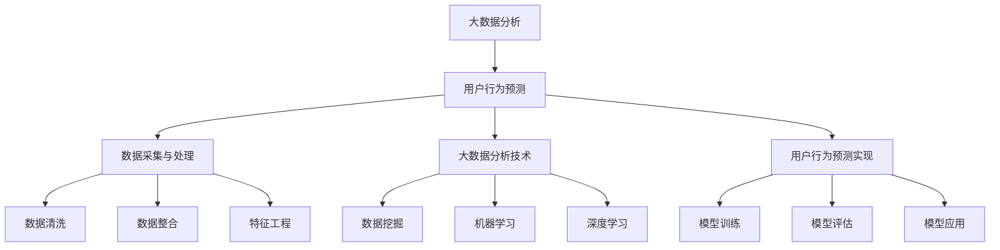
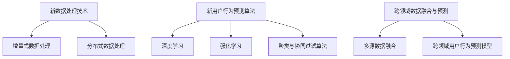

                 

### 第一部分：基础概念与理论

#### 1.1 大数据的定义与特征

大数据，顾名思义，指的是数据量巨大、种类繁多、生成速度快、价值密度低的数据集合。其核心特征可以概括为“五V”：大量（Volume）、多样性（Variety）、速度（Velocity）、价值（Value）和真实性（Veracity）。

- **大量（Volume）**：指的是数据量的庞大，通常是指超过传统数据库处理能力的规模，如TB级、PB级甚至更大。
- **多样性（Variety）**：指的是数据的类型多样化，包括结构化数据、非结构化数据和半结构化数据。
- **速度（Velocity）**：指的是数据的生成和处理速度非常快，需要实时或近实时处理。
- **价值（Value）**：指的是数据的价值密度低，需要通过深入分析和挖掘，从中提取出有价值的信息。
- **真实性（Veracity）**：指的是数据的质量和真实性，包括数据的准确度、可靠性和完整性。

这些特征共同构成了大数据的独特面貌，也带来了分析和处理上的挑战和机遇。

#### 1.2 大数据分析的重要性

大数据分析在多个领域都具有重要应用，其中用户行为预测是一个关键应用领域。通过大数据分析，企业可以更好地理解用户行为模式，从而进行精准营销、个性化推荐、风险控制等。

- **用户行为预测的应用**：通过分析用户的浏览历史、购买行为、互动记录等数据，企业可以预测用户的下一步行为，如购买意愿、浏览路径等。
- **商业智能与决策支持**：大数据分析为企业提供了丰富的数据资源，可以帮助企业做出更明智的商业决策，如市场定位、产品定价、库存管理等。

#### 1.3 用户行为预测概述

用户行为预测是对用户未来行为进行预测和分析的技术。它涉及多个领域，如市场营销、用户界面设计、个性化推荐等。

- **用户行为预测的定义**：用户行为预测是指使用历史数据和统计分析方法，预测用户在未来的某个时间点可能采取的行为。
- **用户行为预测的应用领域**：包括但不限于营销与推广、个性化推荐、风险管理等。

#### 1.4 用户行为预测的理论基础

用户行为预测的理论基础主要包括相关性分析、分类与回归模型、聚类分析等。

- **相关性分析**：通过分析变量之间的相关性，确定哪些因素对用户行为有重要影响。
- **分类与回归模型**：如逻辑回归、决策树、支持向量机等，用于预测用户行为类别或数值。
- **聚类分析**：如K-均值、层次聚类等，用于将用户分为不同的群体，从而进行针对性分析。

#### 1.5 大数据分析与用户行为预测的联系

大数据分析为用户行为预测提供了丰富的数据资源和强大的分析工具。

- **数据采集与处理**：包括数据清洗、数据整合、特征工程等，为用户行为预测提供高质量的数据。
- **大数据分析技术**：如数据挖掘、机器学习、深度学习等，用于提取用户行为模式并进行预测。
- **用户行为预测的实现**：通过模型训练、模型评估、模型应用等步骤，实现用户行为预测。

### 摘要

本文首先介绍了大数据的定义与特征，以及大数据分析的重要性。接着，我们对用户行为预测进行了概述，并探讨了其理论基础。最后，我们分析了大数据分析与用户行为预测之间的联系，并引出了本文将要介绍的新方法与算法。这些新方法与算法将帮助我们在用户行为预测领域取得新的突破。

### Mermaid 流程图：大数据分析与用户行为预测关系架构

### 第二部分：新方法与算法

#### 2.1 新的数据处理技术

在大数据分析中，数据处理技术是关键的一环。新方法如增量式数据处理和分布式数据处理，为大规模数据处理提供了高效的解决方案。

- **增量式数据处理**：这种方法只处理新增加的数据，而不是整个数据集，适合实时数据处理场景。
- **分布式数据处理**：利用分布式计算框架（如Hadoop、Spark等），将数据处理任务分解到多个节点上进行，提高了处理效率和可扩展性。

#### 2.2 新的用户行为预测算法

随着人工智能技术的发展，新的用户行为预测算法不断涌现。这些算法包括基于深度学习、强化学习、聚类与协同过滤算法等。

- **基于深度学习的用户行为预测**：如卷积神经网络（CNN）、循环神经网络（RNN）、长短期记忆网络（LSTM）等，能够捕捉用户行为的时间序列特征。
- **强化学习在用户行为预测中的应用**：如Q-学习、深度Q网络（DQN）等，通过学习用户与环境之间的交互策略，实现更精准的预测。
- **聚类与协同过滤算法**：如K-均值、矩阵分解、协同过滤等，通过用户行为数据的聚类和协同过滤，实现用户分群和推荐。

### 2.3 跨领域的数据融合与用户行为预测

跨领域的数据融合能够提高用户行为预测的准确性。新方法如多源数据的融合方法和跨领域用户行为预测模型，为跨领域数据融合提供了技术支持。

- **多源数据的融合方法**：通过异构数据源、数据集成技术，将不同领域的数据进行整合，提高数据的一致性和可用性。
- **跨领域用户行为预测模型**：通过跨领域知识迁移、多任务学习等技术，实现跨领域用户行为预测。

### Mermaid 流�程图：新方法与算法

### 第三部分：实战与应用

#### 8.1 大数据平台搭建与用户行为预测系统实现

大数据平台的搭建是实现用户行为预测的基础。以下是一个大数据平台搭建的流程：

1. **硬件选择**：根据数据处理需求，选择合适的服务器、存储设备和网络设备。
2. **软件配置**：安装操作系统、数据库软件、大数据处理框架等。
3. **网络架构**：设计合理的网络拓扑结构，确保数据传输的高效性和安全性。

用户行为预测系统的实现包括以下步骤：

1. **数据采集**：从不同数据源收集用户行为数据，如网站日志、用户反馈等。
2. **数据处理**：进行数据清洗、数据整合和特征工程，为模型训练做准备。
3. **模型训练**：选择合适的算法，对用户行为数据集进行训练。
4. **模型评估**：使用评估指标（如准确率、召回率等）对模型性能进行评估。
5. **模型应用**：将训练好的模型部署到生产环境，进行用户行为预测。

### 8.2 项目实战：基于大数据分析的电商用户行为预测

以下是一个基于大数据分析的电商用户行为预测项目的实际案例：

#### 项目背景与目标

某电商平台希望通过大数据分析预测用户的购买行为，从而进行精准营销和库存管理。

#### 用户行为数据收集

通过网站日志、用户反馈、商品评价等多渠道收集用户行为数据。

#### 数据预处理

1. 数据清洗：去除重复、缺失和不一致的数据。
2. 数据整合：将不同数据源的数据进行整合，形成统一的数据集。
3. 特征提取：提取对用户行为有重要影响的关键特征，如浏览时间、浏览频率、购买历史等。

#### 用户行为预测模型设计与实现

1. 选择算法：基于深度学习，选择卷积神经网络（CNN）进行用户行为预测。
2. 模型训练：使用训练数据集进行模型训练。
3. 模型评估：使用测试数据集对模型性能进行评估。
4. 模型优化：根据评估结果，对模型进行优化。

#### 预测模型的应用

1. 用户个性化推荐：根据用户的行为特征，推荐用户可能感兴趣的商品。
2. 营销活动优化：根据用户购买行为预测，优化营销活动的策略和投放时间。

### 实际案例分析与详细讲解剖析

以下是对该项目实际案例的详细分析：

1. **模型效果分析**：通过对比不同算法和参数设置，确定最佳的预测模型。
2. **用户行为特征分析**：分析用户行为特征，找出对用户购买行为有显著影响的因素。
3. **预测结果应用**：分析预测结果在实际业务中的应用效果，如提高销售量和用户满意度。

### 项目小结

该项目通过大数据分析实现了对用户购买行为的精准预测，为电商平台提供了有效的营销和库存管理工具。同时，该项目也展示了大数据分析在商业应用中的巨大潜力。

### 最佳实践 tips、小结、注意事项、拓展阅读等内容

- **最佳实践 tips**：在搭建大数据平台时，要充分考虑数据安全性和系统稳定性。在选择用户行为预测算法时，要根据实际需求进行综合考虑。
- **小结**：大数据分析在用户行为预测中具有重要作用，通过新方法与算法的应用，可以实现更精准的预测。
- **注意事项**：在进行用户行为预测时，要注意保护用户隐私，避免数据泄露。
- **拓展阅读**：可以进一步了解深度学习、强化学习等算法在用户行为预测中的应用。

### 附录

#### 附录A：常用工具与框架介绍

- **数据处理工具**：如Hadoop、Spark、Pandas等。
- **机器学习与深度学习框架**：如TensorFlow、PyTorch、Keras等。

#### 附录B：数学模型与公式详解

- **相关性分析**：如皮尔逊相关系数、斯皮尔曼相关系数等。
- **分类与回归模型**：如逻辑回归、决策树、支持向量机等。
- **聚类分析**：如K-均值、层次聚类等。

#### 附录C：代码实例与分析

- **数据采集与预处理**：包括数据清洗、特征提取的代码实现。
- **用户行为预测模型实现**：包括模型训练、模型评估的代码实例。
- **预测结果评估与优化**：包括评估指标的计算、优化策略的探讨。

