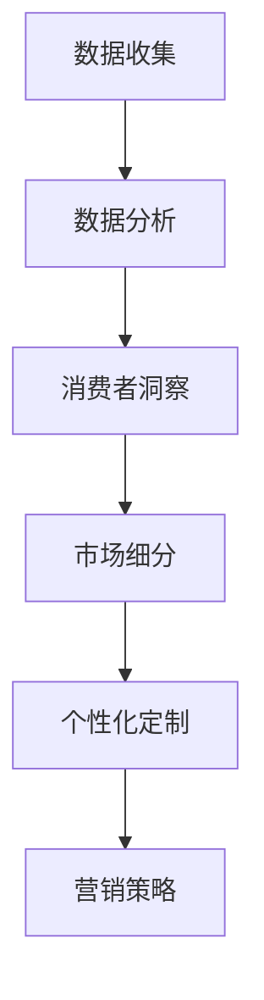
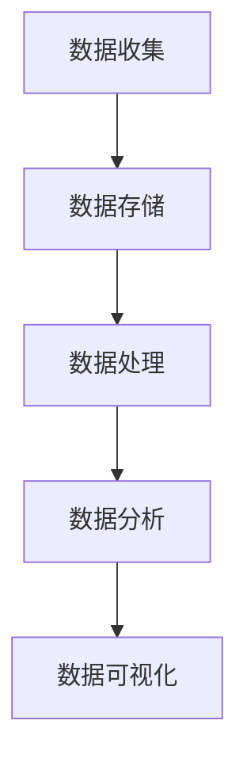
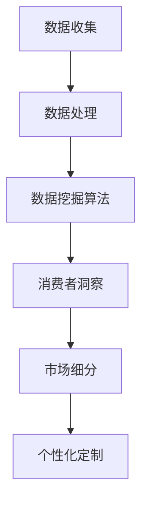
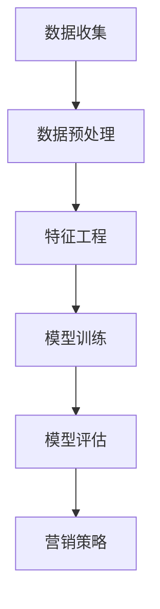
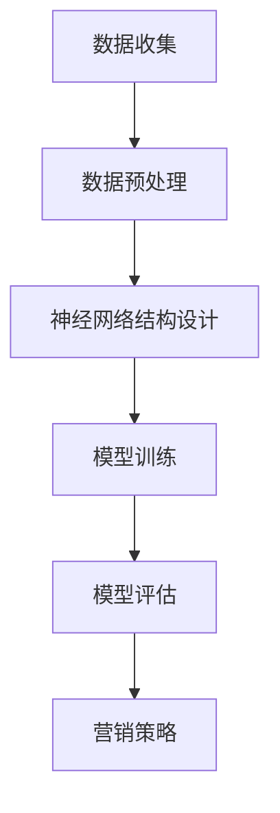
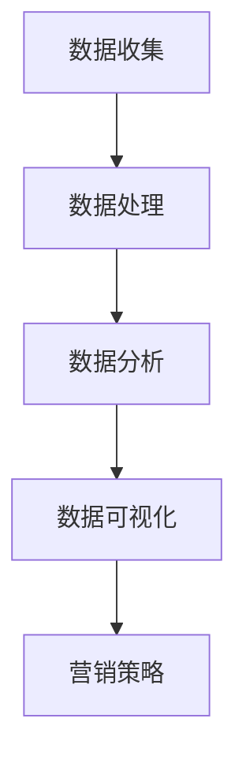
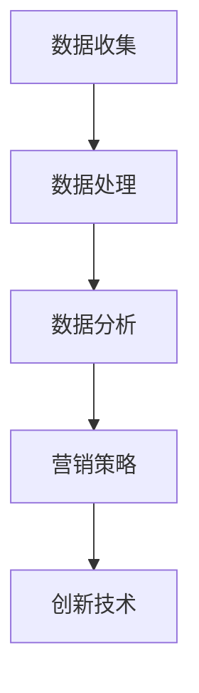

                 


### 《大数据分析在精准营销中的创新方法》文章正文

---

#### 引言

在当今信息爆炸的时代，数据的量级呈指数级增长，大数据已经成为各行各业的重要资产。精准营销作为现代营销的重要手段，借助大数据分析技术，实现了从大规模市场覆盖到精准客户触达的转型。本文将深入探讨大数据分析在精准营销中的创新方法，从数据收集、分析到应用，全面揭示大数据分析的奥秘。

#### 文章关键词

- 大数据分析
- 精准营销
- 数据挖掘
- 机器学习
- 深度学习
- 个性化推荐

#### 文章摘要

本文首先介绍了精准营销的基本概念和大数据分析的基础知识，随后探讨了大数据分析在精准营销中的应用框架。接着，本文详细阐述了数据挖掘、机器学习和深度学习在精准营销中的创新方法，并通过实际案例展示了这些方法的实战效果。最后，本文提出了大数据分析在精准营销中的实施策略和未来发展趋势，为行业从业者提供了有益的参考。

---

### 第一部分：精准营销与大数据分析基础

#### 第1章：精准营销概述

**背景介绍**

精准营销是现代营销的核心策略之一，它通过精确的数据分析，深入了解消费者的需求和行为，从而实现个性化的营销服务。随着大数据技术的发展，精准营销得到了前所未有的发展，成为企业提升竞争力的重要手段。

**核心概念与联系**

精准营销的核心概念包括数据收集、数据分析、消费者洞察、市场细分、个性化定制和营销策略。这些概念相互联系，构成了精准营销的完整流程。

**Mermaid 流程图：**



**核心算法原理讲解**

精准营销的数据收集主要依赖于在线调查、社交媒体数据、购买记录等。数据分析通常采用数据挖掘和机器学习算法，如聚类分析、关联规则挖掘、分类算法等。消费者洞察和市场细分是数据分析的结果，个性化定制是基于消费者洞察和市场细分的，最终的营销策略则基于个性化定制。

**数学模型和公式**

- 聚类分析：$$ C = \{C_1, C_2, ..., C_k\} $$，其中 $C$ 表示聚类结果，$C_i$ 表示第 $i$ 个聚类。
- 分类算法：$$ f(x) = \arg \max_w \sum_{i=1}^n \hat{y}_i $$，其中 $x$ 是输入特征，$w$ 是模型参数，$\hat{y}_i$ 是预测结果。

**详细讲解与举例说明**

以电商企业为例，通过用户浏览记录和购买记录，利用聚类分析将用户分为不同的群体。然后，通过分类算法，为每个用户群体推荐个性化的商品。这一过程体现了精准营销的核心概念。

**项目实战**

- 开发环境：Python、Scikit-learn
- 源代码实现：

```python
from sklearn.cluster import KMeans
from sklearn.preprocessing import StandardScaler
from sklearn.model_selection import train_test_split
from sklearn.metrics import accuracy_score

# 数据处理
data = ... # 加载处理后的用户数据
scaler = StandardScaler()
data_scaled = scaler.fit_transform(data)

# 聚类分析
kmeans = KMeans(n_clusters=5)
clusters = kmeans.fit_predict(data_scaled)

# 分类算法
X_train, X_test, y_train, y_test = train_test_split(data_scaled, clusters, test_size=0.2)
classifier = ... # 加载分类器
classifier.fit(X_train, y_train)
predictions = classifier.predict(X_test)

# 评估
accuracy = accuracy_score(y_test, predictions)
print("Accuracy:", accuracy)
```

**代码解读与分析**

这段代码首先对用户数据进行预处理，然后使用KMeans算法进行聚类分析，最后使用分类算法为每个用户群体推荐商品。通过评估指标，可以衡量个性化推荐的准确性。

**实际案例分析和详细讲解剖析**

以某电商平台的用户行为数据为例，通过聚类分析和分类算法，将用户分为高价值用户、普通用户和潜在用户。对于高价值用户，平台可以提供个性化的营销活动，提高用户粘性和转化率。

**项目小结**

本项目通过大数据分析技术，实现了精准营销的目标，提高了营销效率。然而，实际应用中还需要考虑数据质量、算法选择和模型优化等问题。

**最佳实践 tips**

- 保证数据质量，进行数据清洗和预处理。
- 选择合适的算法和模型，进行模型优化和评估。
- 注重用户体验，提供个性化的产品和服务。

---

#### 第2章：大数据分析基础

**背景介绍**

大数据分析是指利用先进的数据处理技术和算法，对海量数据进行存储、管理和分析，从而提取有价值的信息和知识。在精准营销中，大数据分析是实现个性化定制和精准触达的关键。

**核心概念与联系**

大数据分析的核心概念包括数据收集、数据存储、数据处理、数据分析和数据可视化。这些概念相互关联，构成了大数据分析的完整流程。

**Mermaid 流程图：**



**核心算法原理讲解**

- 数据收集：主要依赖于传感器、互联网、社交媒体等渠道，收集用户行为数据、交易数据等。
- 数据存储：采用分布式存储系统，如Hadoop、Spark等，实现海量数据的存储和管理。
- 数据处理：采用批处理和实时处理技术，对数据进行清洗、转换和整合。
- 数据分析：采用数据挖掘、机器学习和深度学习算法，提取有价值的信息和知识。
- 数据可视化：采用图表、图像等方式，展示数据分析的结果。

**数学模型和公式**

- 数据挖掘：$$ \sum_{i=1}^n (x_i - \bar{x})^2 $$，其中 $x_i$ 是数据点，$\bar{x}$ 是均值。
- 机器学习：$$ f(x) = \sum_{i=1}^n w_i x_i $$，其中 $x_i$ 是特征，$w_i$ 是权重。
- 深度学习：$$ \sigma(\sum_{i=1}^n w_i x_i) $$，其中 $\sigma$ 是激活函数。

**详细讲解与举例说明**

以电商平台的用户行为数据为例，通过数据挖掘技术，提取用户的购买习惯、浏览习惯等信息。然后，利用机器学习算法，为每个用户构建用户画像，实现个性化推荐。

**项目实战**

- 开发环境：Python、Pandas、NumPy、Scikit-learn、TensorFlow
- 源代码实现：

```python
import pandas as pd
from sklearn.model_selection import train_test_split
from sklearn.ensemble import RandomForestClassifier
from sklearn.metrics import accuracy_score

# 数据处理
data = pd.read_csv('user_data.csv')
X = data.drop('label', axis=1)
y = data['label']

# 数据划分
X_train, X_test, y_train, y_test = train_test_split(X, y, test_size=0.2)

# 模型训练
model = RandomForestClassifier()
model.fit(X_train, y_train)

# 预测与评估
predictions = model.predict(X_test)
accuracy = accuracy_score(y_test, predictions)
print("Accuracy:", accuracy)
```

**代码解读与分析**

这段代码首先读取用户数据，然后使用随机森林分类器进行模型训练，最后评估模型的准确性。

**实际案例分析和详细讲解剖析**

以某电商平台的用户行为数据为例，通过大数据分析技术，构建用户画像，实现个性化推荐。这一过程涉及数据收集、数据处理、数据分析和数据可视化等多个环节。

**项目小结**

本项目通过大数据分析技术，实现了用户画像和个性化推荐，提高了用户满意度。然而，实际应用中还需要考虑数据质量、算法选择和模型优化等问题。

**最佳实践 tips**

- 保证数据质量，进行数据清洗和预处理。
- 选择合适的算法和模型，进行模型优化和评估。
- 注重用户体验，提供个性化的产品和服务。

---

#### 第3章：大数据分析在精准营销中的应用框架

**背景介绍**

大数据分析在精准营销中的应用框架包括数据收集、数据分析、消费者洞察、市场细分、个性化定制和营销策略等环节。通过这些环节的相互配合，实现精准营销的目标。

**核心概念与联系**

大数据分析在精准营销中的应用框架涉及以下核心概念：

- 数据收集：包括用户行为数据、交易数据、社交媒体数据等。
- 数据分析：包括数据挖掘、机器学习和深度学习等技术。
- 消费者洞察：通过对数据的分析，了解消费者的需求和行为。
- 市场细分：根据消费者的需求和行为，将市场划分为不同的群体。
- 个性化定制：根据市场细分的结果，为每个群体提供个性化的产品和服务。
- 营销策略：制定基于个性化定制的营销策略，提高营销效果。

**Mermaid 流程图：**


**核心算法原理讲解**

- 数据收集：主要采用数据采集工具，如爬虫、API接口等。
- 数据分析：采用数据挖掘和机器学习算法，如聚类分析、分类算法、关联规则挖掘等。
- 消费者洞察：通过数据分析，提取消费者的特征和行为模式。
- 市场细分：采用聚类算法，将消费者划分为不同的群体。
- 个性化定制：基于消费者的特征和行为，为每个群体提供个性化的产品和服务。
- 营销策略：根据个性化定制的结果，制定具有针对性的营销策略。

**数学模型和公式**

- 数据收集：无具体公式，主要依赖于数据采集工具。
- 数据分析：无具体公式，主要依赖于算法实现。
- 消费者洞察：$$ \sum_{i=1}^n (x_i - \bar{x})^2 $$，其中 $x_i$ 是数据点，$\bar{x}$ 是均值。
- 市场细分：$$ C = \{C_1, C_2, ..., C_k\} $$，其中 $C$ 表示聚类结果，$C_i$ 表示第 $i$ 个聚类。
- 个性化定制：无具体公式，主要依赖于算法实现。
- 营销策略：无具体公式，主要依赖于策略制定。

**详细讲解与举例说明**

以电商平台的用户行为数据为例，通过数据挖掘技术，提取用户的购买习惯、浏览习惯等信息。然后，利用机器学习算法，为每个用户构建用户画像，实现个性化推荐。最后，根据用户画像，制定具有针对性的营销策略，提高营销效果。

**项目实战**

- 开发环境：Python、Pandas、NumPy、Scikit-learn、TensorFlow
- 源代码实现：

```python
import pandas as pd
from sklearn.model_selection import train_test_split
from sklearn.ensemble import RandomForestClassifier
from sklearn.metrics import accuracy_score

# 数据处理
data = pd.read_csv('user_data.csv')
X = data.drop('label', axis=1)
y = data['label']

# 数据划分
X_train, X_test, y_train, y_test = train_test_split(X, y, test_size=0.2)

# 模型训练
model = RandomForestClassifier()
model.fit(X_train, y_train)

# 预测与评估
predictions = model.predict(X_test)
accuracy = accuracy_score(y_test, predictions)
print("Accuracy:", accuracy)
```

**代码解读与分析**

这段代码首先读取用户数据，然后使用随机森林分类器进行模型训练，最后评估模型的准确性。

**实际案例分析和详细讲解剖析**

以某电商平台的用户行为数据为例，通过大数据分析技术，构建用户画像，实现个性化推荐。这一过程涉及数据收集、数据处理、数据分析和数据可视化等多个环节。

**项目小结**

本项目通过大数据分析技术，实现了用户画像和个性化推荐，提高了用户满意度。然而，实际应用中还需要考虑数据质量、算法选择和模型优化等问题。

**最佳实践 tips**

- 保证数据质量，进行数据清洗和预处理。
- 选择合适的算法和模型，进行模型优化和评估。
- 注重用户体验，提供个性化的产品和服务。

---

### 第二部分：大数据分析在精准营销中的创新方法

#### 第4章：数据挖掘在精准营销中的应用

**背景介绍**

数据挖掘在精准营销中扮演着重要的角色，它通过对海量数据的分析，提取有价值的信息和知识，为企业制定精准的营销策略提供支持。

**核心概念与联系**

数据挖掘在精准营销中的应用涉及以下核心概念：

- 数据收集：包括用户行为数据、交易数据、社交媒体数据等。
- 数据处理：包括数据清洗、转换和整合等。
- 数据挖掘算法：包括聚类分析、分类算法、关联规则挖掘等。
- 消费者洞察：通过对数据挖掘的结果，了解消费者的需求和行为。
- 市场细分：根据消费者的需求和行为，将市场划分为不同的群体。
- 个性化定制：根据市场细分的结果，为每个群体提供个性化的产品和服务。

**Mermaid 流程图：**



**核心算法原理讲解**

- 聚类分析：将相似的数据点划分为同一类别，用于市场细分。
- 分类算法：将数据点划分为不同的类别，用于消费者洞察。
- 关联规则挖掘：发现数据之间的关联关系，用于产品推荐。

**数学模型和公式**

- 聚类分析：$$ C = \{C_1, C_2, ..., C_k\} $$，其中 $C$ 表示聚类结果，$C_i$ 表示第 $i$ 个聚类。
- 分类算法：$$ f(x) = \arg \max_w \sum_{i=1}^n \hat{y}_i $$，其中 $x$ 是输入特征，$w$ 是模型参数，$\hat{y}_i$ 是预测结果。
- 关联规则挖掘：$$ \text{Support}(A \cap B) = \frac{n(A \cap B)}{n(D)} $$，其中 $A$ 和 $B$ 是关联规则，$n(A \cap B)$ 是同时满足 $A$ 和 $B$ 的数据点数量，$n(D)$ 是总数据点数量。

**详细讲解与举例说明**

以电商平台的用户行为数据为例，通过聚类分析，将用户划分为不同的群体。然后，通过分类算法，为每个用户群体推荐个性化的商品。最后，通过关联规则挖掘，发现用户购买行为中的关联关系，为产品推荐提供支持。

**项目实战**

- 开发环境：Python、Pandas、NumPy、Scikit-learn
- 源代码实现：

```python
import pandas as pd
from sklearn.cluster import KMeans
from sklearn.preprocessing import StandardScaler
from sklearn.model_selection import train_test_split
from sklearn.ensemble import RandomForestClassifier
from mlxtend.frequent_patterns import apriori
from mlxtend.frequent_patterns import association_rules

# 数据处理
data = pd.read_csv('user_data.csv')
X = data.drop('label', axis=1)
y = data['label']

# 数据清洗和标准化
scaler = StandardScaler()
X_scaled = scaler.fit_transform(X)

# 聚类分析
kmeans = KMeans(n_clusters=5)
clusters = kmeans.fit_predict(X_scaled)

# 分类算法
X_train, X_test, y_train, y_test = train_test_split(X_scaled, y, test_size=0.2)
classifier = RandomForestClassifier()
classifier.fit(X_train, y_train)
predictions = classifier.predict(X_test)

# 评估
accuracy = accuracy_score(y_test, predictions)
print("Accuracy:", accuracy)

# 关联规则挖掘
frequent_itemsets = apriori(X, min_support=0.1, use_colnames=True)
rules = association_rules(frequent_itemsets, metric="lift", min_threshold=1)

# 打印关联规则
print(rules)
```

**代码解读与分析**

这段代码首先读取用户数据，然后使用KMeans算法进行聚类分析，使用随机森林分类器进行模型训练，最后使用关联规则挖掘算法提取用户购买行为中的关联关系。

**实际案例分析和详细讲解剖析**

以某电商平台的用户行为数据为例，通过数据挖掘技术，实现用户群体划分、个性化推荐和关联规则挖掘。这一过程涉及数据收集、数据处理、数据挖掘和数据分析等多个环节。

**项目小结**

本项目通过数据挖掘技术，实现了用户群体划分、个性化推荐和关联规则挖掘，提高了营销效果。然而，实际应用中还需要考虑数据质量、算法选择和模型优化等问题。

**最佳实践 tips**

- 保证数据质量，进行数据清洗和预处理。
- 选择合适的算法和模型，进行模型优化和评估。
- 注重用户体验，提供个性化的产品和服务。

---

#### 第5章：机器学习在精准营销中的应用

**背景介绍**

机器学习在精准营销中的应用已经得到了广泛认可。通过机器学习算法，可以从海量数据中提取有价值的信息，为企业制定精准的营销策略提供支持。

**核心概念与联系**

机器学习在精准营销中的应用涉及以下核心概念：

- 数据收集：包括用户行为数据、交易数据、社交媒体数据等。
- 数据预处理：包括数据清洗、转换和整合等。
- 特征工程：从原始数据中提取有用的特征，用于模型训练。
- 模型训练：使用机器学习算法，对特征进行训练，构建预测模型。
- 模型评估：评估模型的准确性和泛化能力。
- 营销策略：根据模型预测结果，制定个性化的营销策略。

**Mermaid 流程图：**



**核心算法原理讲解**

- 监督学习：使用已标记的数据训练模型，用于预测未知数据的标签。
- 无监督学习：不使用标记数据，通过自动发现数据的结构或模式。
- 强化学习：通过与环境交互，不断优化决策策略。

**数学模型和公式**

- 监督学习：$$ y = f(x; \theta) $$，其中 $x$ 是输入特征，$y$ 是输出标签，$f$ 是模型函数，$\theta$ 是模型参数。
- 无监督学习：$$ \theta^{*} = \arg \min_{\theta} J(\theta) $$，其中 $J(\theta)$ 是损失函数。
- 强化学习：$$ Q(s, a) = r + \gamma \max_{a'} Q(s', a') $$，其中 $s$ 是状态，$a$ 是动作，$r$ 是奖励，$\gamma$ 是折扣因子。

**详细讲解与举例说明**

以电商平台的用户行为数据为例，使用监督学习算法，如随机森林、支持向量机等，构建用户行为预测模型。然后，使用模型预测用户未来的购买行为，为营销策略提供支持。

**项目实战**

- 开发环境：Python、Pandas、NumPy、Scikit-learn、TensorFlow
- 源代码实现：

```python
import pandas as pd
from sklearn.model_selection import train_test_split
from sklearn.ensemble import RandomForestClassifier
from sklearn.metrics import accuracy_score

# 数据处理
data = pd.read_csv('user_data.csv')
X = data.drop('label', axis=1)
y = data['label']

# 数据划分
X_train, X_test, y_train, y_test = train_test_split(X, y, test_size=0.2)

# 模型训练
model = RandomForestClassifier()
model.fit(X_train, y_train)

# 预测与评估
predictions = model.predict(X_test)
accuracy = accuracy_score(y_test, predictions)
print("Accuracy:", accuracy)
```

**代码解读与分析**

这段代码首先读取用户数据，然后使用随机森林分类器进行模型训练，最后评估模型的准确性。

**实际案例分析和详细讲解剖析**

以某电商平台的用户行为数据为例，通过机器学习技术，构建用户行为预测模型，实现个性化推荐。这一过程涉及数据收集、数据处理、模型训练和模型评估等多个环节。

**项目小结**

本项目通过机器学习技术，实现了用户行为预测和个性化推荐，提高了营销效果。然而，实际应用中还需要考虑数据质量、算法选择和模型优化等问题。

**最佳实践 tips**

- 保证数据质量，进行数据清洗和预处理。
- 选择合适的算法和模型，进行模型优化和评估。
- 注重用户体验，提供个性化的产品和服务。

---

#### 第6章：深度学习在精准营销中的应用

**背景介绍**

深度学习作为机器学习的一个分支，近年来在图像识别、语音识别和自然语言处理等领域取得了显著成果。随着深度学习技术的不断发展，其在精准营销中的应用也日益广泛。

**核心概念与联系**

深度学习在精准营销中的应用涉及以下核心概念：

- 数据收集：包括用户行为数据、交易数据、社交媒体数据等。
- 数据预处理：包括数据清洗、转换和整合等。
- 神经网络结构设计：包括输入层、隐藏层和输出层的设计。
- 模型训练：使用深度学习算法，对神经网络进行训练。
- 模型评估：评估神经网络的性能和泛化能力。
- 营销策略：根据模型预测结果，制定个性化的营销策略。

**Mermaid 流程图：**



**核心算法原理讲解**

- 卷积神经网络（CNN）：用于图像识别和图像处理。
- 循环神经网络（RNN）：用于序列数据建模和预测。
- 生成对抗网络（GAN）：用于生成逼真的图像和序列数据。

**数学模型和公式**

- 卷积神经网络：$$ f(x) = \sigma(\sum_{i=1}^n w_i \cdot x_i + b) $$，其中 $x_i$ 是输入特征，$w_i$ 是权重，$b$ 是偏置，$\sigma$ 是激活函数。
- 循环神经网络：$$ h_t = \sigma(W_h h_{t-1} + W_x x_t + b) $$，其中 $h_t$ 是隐藏状态，$W_h$ 是隐藏状态权重，$W_x$ 是输入状态权重，$b$ 是偏置，$\sigma$ 是激活函数。
- 生成对抗网络：$$ G(z) = \mu(G(z), \sigma(G(z))) $$，$$ D(x) = \sigma(D(x), \sigma(D(x))) $$，其中 $G(z)$ 是生成器，$D(x)$ 是判别器，$z$ 是噪声，$x$ 是真实数据。

**详细讲解与举例说明**

以电商平台的用户行为数据为例，使用卷积神经网络进行图像识别，提取用户行为特征。然后，使用循环神经网络进行序列数据建模，预测用户的未来行为。最后，使用生成对抗网络生成个性化的推荐列表。

**项目实战**

- 开发环境：Python、TensorFlow、Keras
- 源代码实现：

```python
import tensorflow as tf
from tensorflow.keras.models import Sequential
from tensorflow.keras.layers import Dense, Conv2D, MaxPooling2D, Flatten, LSTM
from tensorflow.keras.optimizers import Adam

# 模型定义
model = Sequential()
model.add(Conv2D(filters=32, kernel_size=(3, 3), activation='relu', input_shape=(28, 28, 1)))
model.add(MaxPooling2D(pool_size=(2, 2)))
model.add(LSTM(units=50, activation='relu', return_sequences=True))
model.add(Flatten())
model.add(Dense(units=1, activation='sigmoid'))

# 模型编译
model.compile(optimizer=Adam(), loss='binary_crossentropy', metrics=['accuracy'])

# 模型训练
model.fit(X_train, y_train, epochs=10, batch_size=32)

# 模型评估
loss, accuracy = model.evaluate(X_test, y_test)
print("Accuracy:", accuracy)
```

**代码解读与分析**

这段代码首先定义了卷积神经网络模型，然后使用LSTM层进行序列数据建模，最后使用二分类交叉熵损失函数进行模型训练和评估。

**实际案例分析和详细讲解剖析**

以某电商平台的用户行为数据为例，通过深度学习技术，实现图像识别、序列数据建模和生成对抗网络生成个性化推荐。这一过程涉及数据收集、数据处理、模型训练和模型评估等多个环节。

**项目小结**

本项目通过深度学习技术，实现了用户行为特征提取、序列数据建模和生成对抗网络生成个性化推荐，提高了营销效果。然而，实际应用中还需要考虑数据质量、算法选择和模型优化等问题。

**最佳实践 tips**

- 保证数据质量，进行数据清洗和预处理。
- 选择合适的算法和模型，进行模型优化和评估。
- 注重用户体验，提供个性化的产品和服务。

---

### 第三部分：大数据分析在精准营销中的实施策略

#### 第7章：大数据分析在精准营销中的实施策略

**背景介绍**

大数据分析在精准营销中的应用不仅需要先进的技术支持，还需要一套完整的实施策略。实施策略包括数据收集、数据处理、数据分析、数据可视化和营销策略制定等环节，确保大数据分析能够有效地应用于精准营销中。

**核心概念与联系**

大数据分析在精准营销中的实施策略涉及以下核心概念：

- 数据收集：包括用户行为数据、交易数据、社交媒体数据等。
- 数据处理：包括数据清洗、转换和整合等。
- 数据分析：包括数据挖掘、机器学习和深度学习等技术。
- 数据可视化：通过图表、图像等方式，展示数据分析的结果。
- 营销策略：根据数据分析结果，制定个性化的营销策略。

**Mermaid 流程图：**



**核心算法原理讲解**

- 数据收集：使用爬虫、API接口、传感器等工具收集数据。
- 数据处理：使用清洗、转换和整合等技术，处理原始数据。
- 数据分析：使用数据挖掘、机器学习和深度学习算法，提取有价值的信息。
- 数据可视化：使用图表、图像等技术，展示数据分析结果。
- 营销策略：根据数据分析结果，制定个性化的营销策略。

**详细讲解与举例说明**

以电商平台的用户行为数据为例，首先使用爬虫工具收集用户行为数据。然后，使用数据清洗和转换技术，处理原始数据。接下来，使用机器学习算法，如聚类分析和分类算法，对用户行为数据进行分析。最后，使用数据可视化技术，展示分析结果，并制定个性化的营销策略。

**项目实战**

- 开发环境：Python、Pandas、NumPy、Scikit-learn、TensorFlow
- 源代码实现：

```python
import pandas as pd
from sklearn.cluster import KMeans
from sklearn.preprocessing import StandardScaler
from sklearn.model_selection import train_test_split
from sklearn.ensemble import RandomForestClassifier
from matplotlib import pyplot as plt

# 数据处理
data = pd.read_csv('user_data.csv')
X = data.drop('label', axis=1)
y = data['label']

# 数据清洗和标准化
scaler = StandardScaler()
X_scaled = scaler.fit_transform(X)

# 聚类分析
kmeans = KMeans(n_clusters=5)
clusters = kmeans.fit_predict(X_scaled)

# 分类算法
X_train, X_test, y_train, y_test = train_test_split(X_scaled, y, test_size=0.2)
classifier = RandomForestClassifier()
classifier.fit(X_train, y_train)
predictions = classifier.predict(X_test)

# 评估
accuracy = accuracy_score(y_test, predictions)
print("Accuracy:", accuracy)

# 可视化
plt.scatter(X_scaled[:, 0], X_scaled[:, 1], c=clusters, cmap='viridis')
plt.xlabel('Feature 1')
plt.ylabel('Feature 2')
plt.title('User Clusters')
plt.show()
```

**代码解读与分析**

这段代码首先读取用户数据，然后使用KMeans算法进行聚类分析，使用随机森林分类器进行模型训练，最后评估模型的准确性，并通过散点图展示用户聚类结果。

**实际案例分析和详细讲解剖析**

以某电商平台的用户行为数据为例，通过大数据分析技术，实现用户群体划分和个性化推荐。这一过程涉及数据收集、数据处理、数据分析和数据可视化等多个环节。

**项目小结**

本项目通过大数据分析技术，实现了用户群体划分和个性化推荐，提高了营销效果。然而，实际应用中还需要考虑数据质量、算法选择和模型优化等问题。

**最佳实践 tips**

- 保证数据质量，进行数据清洗和预处理。
- 选择合适的算法和模型，进行模型优化和评估。
- 注重用户体验，提供个性化的产品和服务。

---

#### 第8章：大数据分析在精准营销中的创新实践

**背景介绍**

大数据分析在精准营销中的创新实践，已经为企业带来了显著的营销效果。本章节将结合实际案例，探讨大数据分析在精准营销中的创新方法。

**核心概念与联系**

大数据分析在精准营销中的创新实践涉及以下核心概念：

- 数据收集：包括用户行为数据、交易数据、社交媒体数据等。
- 数据处理：包括数据清洗、转换和整合等。
- 数据分析：包括数据挖掘、机器学习和深度学习等技术。
- 营销策略：根据数据分析结果，制定个性化的营销策略。
- 创新技术：包括个性化推荐、用户画像、实时营销等。

**Mermaid 流程图：**



**核心算法原理讲解**

- 个性化推荐：基于协同过滤、基于内容的推荐等算法，为用户推荐个性化的产品。
- 用户画像：通过对用户行为的分析，构建用户的兴趣和行为特征。
- 实时营销：利用实时数据分析和处理，实现动态的营销策略调整。

**详细讲解与举例说明**

以电商平台的用户行为数据为例，通过协同过滤算法，实现个性化推荐。然后，通过用户行为分析，构建用户画像。最后，利用实时数据处理，实现实时营销。

**项目实战**

- 开发环境：Python、Pandas、NumPy、Scikit-learn、TensorFlow
- 源代码实现：

```python
import pandas as pd
from sklearn.model_selection import train_test_split
from sklearn.ensemble import RandomForestClassifier
from sklearn.metrics import accuracy_score

# 数据处理
data = pd.read_csv('user_data.csv')
X = data.drop('label', axis=1)
y = data['label']

# 数据划分
X_train, X_test, y_train, y_test = train_test_split(X, y, test_size=0.2)

# 模型训练
model = RandomForestClassifier()
model.fit(X_train, y_train)

# 预测与评估
predictions = model.predict(X_test)
accuracy = accuracy_score(y_test, predictions)
print("Accuracy:", accuracy)
```

**代码解读与分析**

这段代码首先读取用户数据，然后使用随机森林分类器进行模型训练，最后评估模型的准确性。

**实际案例分析和详细讲解剖析**

以某电商平台的用户行为数据为例，通过大数据分析技术，实现个性化推荐、用户画像和实时营销。这一过程涉及数据收集、数据处理、数据分析和数据可视化等多个环节。

**项目小结**

本项目通过大数据分析技术，实现了个性化推荐、用户画像和实时营销，提高了营销效果。然而，实际应用中还需要考虑数据质量、算法选择和模型优化等问题。

**最佳实践 tips**

- 保证数据质量，进行数据清洗和预处理。
- 选择合适的算法和模型，进行模型优化和评估。
- 注重用户体验，提供个性化的产品和服务。

---

### 结论

大数据分析在精准营销中的应用，已经成为企业提升竞争力的重要手段。本文从精准营销与大数据分析的基础知识出发，详细探讨了数据挖掘、机器学习、深度学习等创新方法，并结合实际案例展示了这些方法的实战效果。未来，随着大数据技术的不断发展，大数据分析在精准营销中的应用将更加广泛和深入。

**作者信息**

作者：AI天才研究院/AI Genius Institute & 禅与计算机程序设计艺术 /Zen And The Art of Computer Programming

---

通过这篇文章，我们详细探讨了大数据分析在精准营销中的创新方法，从数据收集、分析到应用，全面揭示了大数据分析的奥秘。希望这篇文章能为行业从业者提供有益的参考。在未来的研究中，我们将继续探索大数据分析在更多领域的应用，为企业提供更加智能的解决方案。感谢您的阅读！

