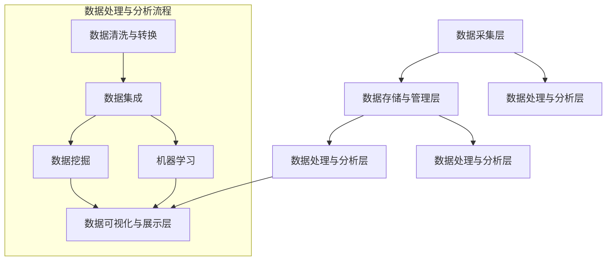

                 

# 大数据分析平台：挖掘数据价值的新途径

> 关键词：大数据分析、数据价值、平台架构、性能优化、安全性保障、行业应用

> 摘要：随着大数据时代的到来，数据的价值逐渐显现。本文将深入探讨大数据分析平台的重要性及其在各个行业中的应用，同时详细解析大数据分析平台的基本架构、搭建与优化方法，以及安全性保障措施，旨在为读者提供全面的大数据分析平台建设与运用指南。

## 目录大纲

### 第一部分：大数据分析平台概述

- **第1章：大数据分析平台的重要性**
  - 1.1 大数据时代的背景与挑战
  - 1.2 大数据分析平台的重要性
- **第2章：大数据分析平台的基本架构**
  - 2.1 数据采集层
  - 2.2 数据存储与管理层
  - 2.3 数据处理与分析层
  - 2.4 数据可视化与展示层

### 第二部分：大数据分析平台的搭建与优化

- **第3章：大数据分析平台搭建基础**
  - 3.1 大数据平台搭建步骤
  - 3.2 大数据平台搭建实战
- **第4章：大数据分析平台性能优化**
  - 4.1 性能优化策略
  - 4.2 具体优化方法
- **第5章：大数据分析平台安全性保障**
  - 5.1 安全性概述
  - 5.2 安全防护措施

### 第三部分：大数据分析平台应用实践

- **第6章：大数据分析平台在行业应用**
  - 6.1 行业案例分析
  - 6.2 行业应用场景
- **第7章：大数据分析平台项目实战**
  - 7.1 项目实战概述
  - 7.2 实际案例解析
  - 7.3 代码实现与解读

### 附录

- **附录A：大数据分析平台常用工具与资源**
- **附录B：核心算法原理讲解伪代码**
- **附录C：数学模型和数学公式讲解**

---

## 第1章：大数据分析平台的重要性

### 1.1 大数据时代的背景与挑战

#### 大数据定义与特征

大数据（Big Data）是指那些数据量巨大、数据类型多样、数据生成速度极快的数据集。根据麦肯锡全球研究所的定义，大数据具有4V特征：数据量（Volume）、数据种类（Variety）、数据生成速度（Velocity）和数据价值（Value）。

- **数据量（Volume）**：大数据的数据量巨大，一般认为是超过传统数据库处理能力的规模，达到PB（皮字节）甚至ZB（泽字节）级别。
- **数据种类（Variety）**：大数据不仅包括结构化数据，如数据库中的记录，还包括半结构化数据（如XML、JSON等）和非结构化数据（如图像、视频、文本等）。
- **数据生成速度（Velocity）**：大数据生成速度极快，数据以流的形式不断产生，需要实时或近实时处理。
- **数据价值（Value）**：大数据的价值密度低，即大量数据中只有一小部分是有用的，需要通过有效的方法挖掘数据中的价值。

#### 大数据带来的机遇与挑战

大数据的出现为各个行业带来了前所未有的机遇，同时也伴随着巨大的挑战。

- **机遇：**
  - **商业洞察**：通过对大量数据进行分析，企业可以更好地了解客户需求，优化产品设计，提升市场竞争力。
  - **创新驱动**：大数据为科研提供了丰富的数据资源，有助于发现新知识、新方法，推动科技进步。
  - **社会管理**：大数据有助于政府更有效地进行公共管理和服务，如交通管理、公共安全等。

- **挑战：**
  - **数据存储与处理**：大数据的存储和管理需要高性能的硬件和软件支持，处理大数据需要分布式计算技术。
  - **数据隐私与安全**：大数据涉及到个人隐私和敏感信息，如何保护数据安全成为一大挑战。
  - **数据分析能力**：大数据的分析需要专业的技术知识和工具，普通用户难以掌握。

### 1.2 大数据分析平台的重要性

大数据分析平台（Big Data Analysis Platform）是指用于收集、存储、处理和分析大规模数据的软件系统。它的重要性体现在以下几个方面：

- **提升数据分析效率**：大数据分析平台能够高效地处理海量数据，提供快速的数据查询和分析功能。
- **降低数据分析成本**：通过使用大数据分析平台，企业可以避免重复建设，降低硬件和软件的采购成本。
- **支持实时分析**：大数据分析平台支持实时数据流处理，能够快速响应业务需求。
- **促进数据整合**：大数据分析平台能够整合来自不同数据源的数据，实现数据的统一管理和分析。

大数据分析平台对企业的影响也是多方面的，包括提高决策效率、优化业务流程、增强竞争优势等。

---

在下一章中，我们将详细探讨大数据分析平台的基本架构，包括数据采集层、数据存储与管理层、数据处理与分析层以及数据可视化与展示层。这将为我们理解和构建一个高效的大数据分析平台奠定基础。## 第2章：大数据分析平台的基本架构

大数据分析平台的架构是确保数据从采集、存储、处理到可视化的各个环节高效运行的关键。以下将详细阐述大数据分析平台的基本架构，包括数据采集层、数据存储与管理层、数据处理与分析层以及数据可视化与展示层。

### 2.1 数据采集层

数据采集层是大数据分析平台的基础，负责从各种数据源收集数据。数据源可以是结构化数据库、文件系统、实时数据流，甚至是传感器网络。数据采集的关键技术包括：

- **数据接入**：支持各种数据源接入，如关系数据库、NoSQL数据库、文件系统、消息队列等。
- **数据清洗**：对采集到的数据进行预处理，去除重复数据、错误数据和噪声数据，保证数据的准确性和一致性。
- **数据转换**：将不同数据源的数据转换为统一的格式，便于后续处理。

数据采集层的技术选型需要考虑数据的多样性、数据量大小以及实时性要求。常见的数据采集工具有Flume、Kafka、Logstash等。

### 2.2 数据存储与管理层

数据存储与管理层负责存储和管理大量数据，确保数据的安全性和可靠性。根据数据的特点和需求，数据存储可以采用数据仓库（Data Warehouse）和数据湖（Data Lake）两种模式。

- **数据仓库**：数据仓库是一种面向主题的、集成的、相对稳定的、反映历史变化的数据集合。它适用于结构化数据，可以进行高效的查询和分析。
- **数据湖**：数据湖是一种原始数据的存储解决方案，它以文件形式存储各种类型的数据，包括结构化、半结构化和非结构化数据。数据湖适合存储大量的原始数据，并进行后续的数据处理和分析。

数据存储与管理的技术包括关系型数据库（如MySQL、PostgreSQL）、NoSQL数据库（如MongoDB、Cassandra）、分布式文件系统（如HDFS）和云存储服务（如AWS S3、Azure Data Lake）等。

### 2.3 数据处理与分析层

数据处理与分析层是大数据分析平台的核心，负责对数据进行处理和分析，提取有价值的信息和知识。数据处理与分析的关键技术包括：

- **数据清洗与转换**：对采集到的数据进行清洗和转换，确保数据质量。
- **数据集成**：将来自不同数据源的数据进行整合，构建统一的数据视图。
- **数据挖掘**：利用数据挖掘算法，从大量数据中发现隐藏的模式和规律。
- **机器学习**：应用机器学习算法，建立预测模型和分类模型，进行数据预测和分类。

常见的数据处理与分析工具包括Hadoop、Spark、Flink等，它们支持批处理和实时处理，能够高效地处理大规模数据。

### 2.4 数据可视化与展示层

数据可视化与展示层负责将处理后的数据以图表、报表等形式展示出来，使数据更容易理解和分析。数据可视化与展示的关键技术包括：

- **图表生成**：利用图表生成工具（如ECharts、D3.js），将数据转化为直观的图表。
- **报表生成**：生成各种类型的报表，如表格、柱状图、饼图、折线图等。
- **仪表盘**：构建仪表盘，集成多种图表和报表，提供全方位的数据监控和分析。

常见的数据可视化与展示工具包括Tableau、Power BI、QlikView等。

### 数据处理与分析层的核心概念与联系

为了更好地理解数据处理与分析层的核心概念，我们可以使用Mermaid绘制一个流程图，展示各个模块之间的联系。



在这个流程图中，数据采集层将数据传输到数据存储与管理层，经过数据清洗与转换后，数据集成层将整合来自多个数据源的数据。随后，数据挖掘和机器学习模块从数据中提取有价值的信息和知识。最后，数据可视化与展示层将分析结果以图表和报表的形式展示出来。

### 核心算法原理讲解伪代码

为了深入理解数据处理与分析层的核心算法原理，我们将以K-means聚类算法为例，给出其伪代码实现。

```python
# 假设我们使用 K-means 算法进行聚类分析
def kmeans(data, K):
    # 初始化 K 个质心
    centroids = initialize_centroids(data, K)
    
    # 循环迭代直到收敛
    while not converged:
        # 为每个数据点分配最近的质心
        for data_point in data:
            closest_centroid = find_closest_centroid(data_point, centroids)
            assign_data_point_to_cluster(data_point, closest_centroid)
        
        # 更新质心位置
        centroids = update_centroids(data, centroids)
    
    return centroids, clusters

# 初始化质心
def initialize_centroids(data, K):
    # 从数据中随机选择 K 个数据点作为初始质心
    centroids = random.sample(data, K)
    return centroids

# 找到最近质心
def find_closest_centroid(data_point, centroids):
    # 计算数据点到各个质心的距离
    distances = [distance(data_point, centroid) for centroid in centroids]
    # 返回距离最近的质心
    return centroids[distances.index(min(distances))]

# 将数据点分配到聚类
def assign_data_point_to_cluster(data_point, centroid):
    # 根据数据点与质心的距离，将数据点分配到相应的聚类
    cluster = centroids.index(centroid)
    data_point['cluster'] = cluster

# 更新质心位置
def update_centroids(data, centroids):
    # 为每个聚类计算新的质心
    new_centroids = []
    for cluster in range(K):
        # 获取属于当前聚类的数据点
        cluster_data = [data_point for data_point in data if data_point['cluster'] == cluster]
        # 计算聚类内所有数据点的平均值作为新的质心
        new_centroid = calculate_mean(cluster_data)
        new_centroids.append(new_centroid)
    return new_centroids

# 计算距离
def distance(point1, point2):
    # 使用欧几里得距离公式计算两点之间的距离
    return sqrt(sum((p1 - p2) ** 2 for p1, p2 in zip(point1, point2)))

# 计算平均值
def calculate_mean(points):
    # 计算所有数据点的平均值
    return [sum(points[i]) / len(points[i]) for i in range(len(points[0]))]
```

### 数学模型和数学公式讲解

在数据处理与分析层，数学模型和数学公式是理解和实现算法的基础。以下我们将介绍聚类分析中的相似度度量。

#### 聚类分析中的相似度度量

相似度度量用于计算数据点之间的相似性，常见的相似度度量方法包括余弦相似度和欧几里得相似度。以下是一个基于欧几里得相似度的示例公式：

$$
similarity(d_i, d_j) = \frac{1}{1 + \sqrt{d_i^T d_j}}
$$

其中，$d_i$ 和 $d_j$ 分别表示数据点 $i$ 和 $j$ 的特征向量。

#### K-means 算法的质心更新规则

K-means 算法的质心更新规则如下：

$$
\mu_{k} = \frac{1}{N_k} \sum_{i=1}^{N} x_i
$$

其中，$\mu_{k}$ 表示第 $k$ 个质心的新位置，$N_k$ 表示第 $k$ 个聚类的数据点个数，$x_i$ 表示属于第 $k$ 个聚类的第 $i$ 个数据点的位置。

通过上述公式，我们可以计算出新质心的位置，从而完成 K-means 算法的迭代更新。

以上内容为我们构建和理解大数据分析平台的基本架构提供了全面的知识框架，为后续的搭建与优化奠定了基础。在下一章中，我们将深入探讨大数据分析平台的搭建与优化方法，包括硬件设备选择、技术选型以及性能优化策略。请读者继续关注。|>

