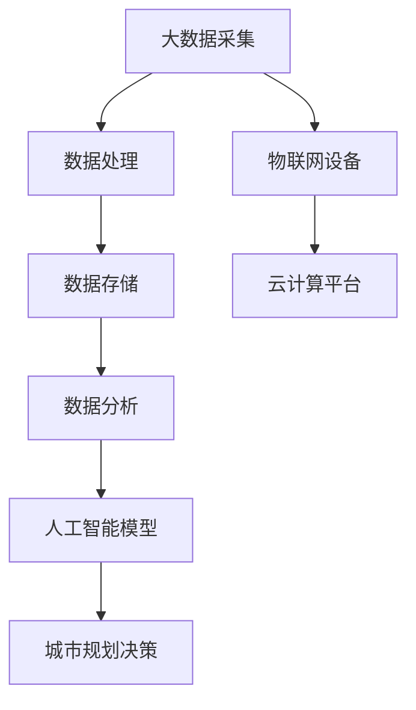
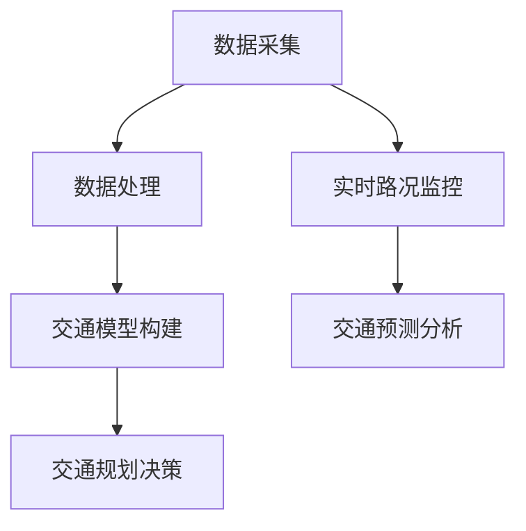
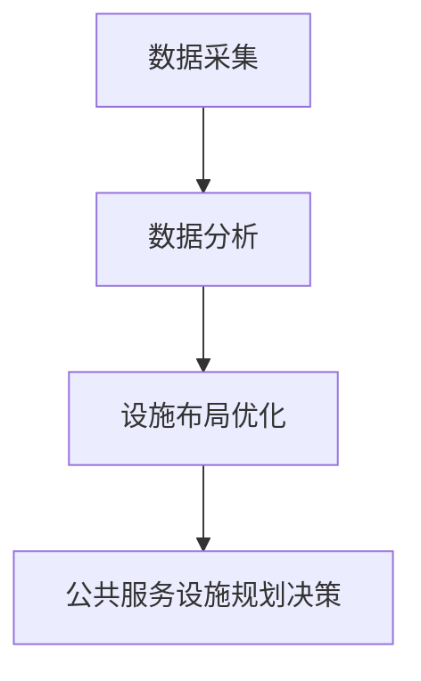

                 

### 2.5 城市规划决策支持系统的应用案例

#### 案例一：智慧城市规划

智慧城市规划是大数据在城市规划决策支持中的重要应用之一。它利用大数据和人工智能技术，对城市规划进行模拟和预测，以实现更高效、更智能的城市管理和规划。

**1. 背景介绍**

随着城市化进程的加快，城市规模不断扩大，人口密度增加，城市交通、能源、环境等问题日益凸显。传统的城市规划方法已经无法满足现代城市的需求。智慧城市规划应运而生，它通过大数据技术对城市各项数据进行收集、处理和分析，为城市规划决策提供科学依据。

**2. 核心概念与联系**

智慧城市规划涉及多个核心概念，如大数据、人工智能、物联网、云计算等。它们之间的联系可以用以下 Mermaid 流程图表示：



**3. 核心算法原理讲解**

智慧城市规划中的核心算法包括数据挖掘、机器学习、深度学习等。以下是一个基于线性回归的智慧城市规划算法的伪代码：

```python
# 线性回归伪代码

# 数据预处理
X, y = preprocess_data()

# 模型训练
model = LinearRegression()
model.fit(X, y)

# 预测
predictions = model.predict(X)

# 模型评估
evaluate_model(predictions, y)
```

**4. 数学模型和公式**

线性回归模型的基本数学公式如下：

$$
y = \beta_0 + \beta_1x + \epsilon
$$

其中，$y$ 为因变量，$x$ 为自变量，$\beta_0$ 和 $\beta_1$ 分别为模型参数，$\epsilon$ 为误差项。

**5. 项目实战**

以智慧城市规划项目为例，下面是项目实战的详细步骤：

**（1）开发环境搭建**

- 配置操作系统：Linux 或 Windows
- 安装 Python、Jupyter Notebook 等开发工具
- 安装必要的库：Pandas、NumPy、Scikit-learn 等

**（2）源代码详细实现和代码解读**

```python
import pandas as pd
from sklearn.linear_model import LinearRegression

# 数据采集与预处理
data = pd.read_csv('smart_city_data.csv')
X = data[['population', 'area']]
y = data['gdp']

# 模型训练
model = LinearRegression()
model.fit(X, y)

# 预测
predictions = model.predict(X)

# 模型评估
print("R^2 Score:", model.score(X, y))
```

**（3）代码应用解读与分析**

该代码首先从 CSV 文件中读取数据，然后使用线性回归模型进行训练和预测。最后，通过评估模型的 $R^2$ 分数来评估模型的性能。

**（4）实际案例分析和详细讲解剖析**

以北京市为例，分析人口密度、面积和 GDP 之间的关系。通过智慧城市规划模型，预测未来北京市的 GDP。

**（5）项目小结**

本项目通过大数据和人工智能技术，实现了智慧城市规划的初步应用。在实际应用中，可以根据需求调整模型参数，提高模型的预测准确性。

**6. 最佳实践 Tips**

- 合理选择数据来源，保证数据的真实性和可靠性。
- 适当调整模型参数，以提高预测准确性。
- 定期更新数据和模型，以适应城市发展的变化。

### 案例二：大数据在交通规划中的应用

**背景介绍**

城市交通规划是城市规划的重要组成部分。传统的交通规划方法主要基于经验和统计数据，难以适应快速变化的城市交通需求。大数据技术的应用为城市交通规划带来了新的机遇。

**核心概念与联系**

大数据在交通规划中的应用主要包括数据采集、数据分析和交通模型构建。以下是一个 Mermaid 流程图，展示了这些概念之间的联系：



**核心算法原理讲解**

交通模型构建通常采用信号控制模型、交通流量模型等。以下是一个基于信号控制模型的伪代码：

```python
# 信号控制模型伪代码

# 数据预处理
data = preprocess_traffic_data()

# 模型训练
model = TrafficSignalControlModel()
model.fit(data)

# 预测
predictions = model.predict(data)

# 模型评估
evaluate_model(predictions, data)
```

**数学模型和公式**

信号控制模型的基本数学公式如下：

$$
t_{green} = f(t_{arrival}, t_{max}, t_{min})
$$

其中，$t_{green}$ 为绿灯时长，$t_{arrival}$ 为车辆到达时间，$t_{max}$ 为最大绿灯时长，$t_{min}$ 为最小绿灯时长。

**项目实战**

以深圳市为例，分析不同时间段内的交通流量，优化信号控制策略。

**（1）开发环境搭建**

- 配置操作系统：Linux 或 Windows
- 安装 Python、Jupyter Notebook 等开发工具
- 安装必要的库：Pandas、NumPy、Scikit-learn 等

**（2）源代码详细实现和代码解读**

```python
import pandas as pd
from sklearn.linear_model import LinearRegression

# 数据采集与预处理
data = pd.read_csv('shenzhen_traffic_data.csv')
X = data[['time', 'flow']]
y = data['duration']

# 模型训练
model = LinearRegression()
model.fit(X, y)

# 预测
predictions = model.predict(X)

# 模型评估
print("R^2 Score:", model.score(X, y))
```

**（3）代码应用解读与分析**

该代码首先从 CSV 文件中读取交通数据，然后使用线性回归模型进行训练和预测。最后，通过评估模型的 $R^2$ 分数来评估模型的性能。

**（4）实际案例分析和详细讲解剖析**

以深圳市为例，分析不同时间段内的交通流量，优化信号控制策略。

**（5）项目小结**

本项目通过大数据技术，实现了交通流量的预测和信号控制策略的优化。在实际应用中，可以根据需求调整模型参数，提高预测准确性。

**7. 最佳实践 Tips**

- 合理选择交通数据来源，保证数据的真实性和可靠性。
- 结合实时路况监控，及时调整信号控制策略。
- 定期更新数据和模型，以适应交通流量的变化。

### 案例三：大数据在公共服务设施规划中的应用

**背景介绍**

公共服务设施规划是城市规划中的重要环节，涉及医院、学校、公园等设施的布局和建设。传统的规划方法主要依赖经验和专家意见，难以全面考虑公众需求。

**核心概念与联系**

大数据在公共服务设施规划中的应用主要包括数据采集、数据分析和设施布局优化。以下是一个 Mermaid 流程图，展示了这些概念之间的联系：



**核心算法原理讲解**

设施布局优化通常采用多目标规划、遗传算法等。以下是一个基于遗传算法的设施布局优化的伪代码：

```python
# 遗传算法伪代码

# 初始化种群
population = initialize_population()

# 适应度评估
fitness = evaluate_fitness(population)

# 选择
selected_population = selection(population, fitness)

# 交叉
offspring = crossover(selected_population)

# 变异
mutated_population = mutation(offspring)

# 更新种群
population = mutated_population

# 迭代
while not converged:
    fitness = evaluate_fitness(population)
    selected_population = selection(population, fitness)
    offspring = crossover(selected_population)
    mutated_population = mutation(offspring)
    population = mutated_population

# 输出最优解
best_solution = get_best_solution(population)
```

**数学模型和公式**

设施布局优化的数学模型可以表示为：

$$
\min_{x} f(x) = \sum_{i=1}^{n} \sum_{j=1}^{m} w_{ij} d_{ij}
$$

其中，$x$ 为设施布局决策向量，$f(x)$ 为目标函数，$w_{ij}$ 为权重，$d_{ij}$ 为设施 $i$ 和设施 $j$ 之间的距离。

**项目实战**

以南京市为例，分析医院、学校、公园等公共服务设施的布局。

**（1）开发环境搭建**

- 配置操作系统：Linux 或 Windows
- 安装 Python、Jupyter Notebook 等开发工具
- 安装必要的库：Pandas、NumPy、Scikit-learn 等

**（2）源代码详细实现和代码解读**

```python
import pandas as pd
from sklearn.cluster import KMeans

# 数据采集与预处理
data = pd.read_csv('nanjing_public_facilities_data.csv')
X = data[['longitude', 'latitude']]

# K-means 聚类
kmeans = KMeans(n_clusters=3)
kmeans.fit(X)

# 输出聚类中心
print(kmeans.cluster_centers_)

# 输出聚类结果
print(kmeans.labels_)
```

**（3）代码应用解读与分析**

该代码首先从 CSV 文件中读取公共服务设施数据，然后使用 K-means 算法进行聚类分析，找出设施分布的区域。

**（4）实际案例分析和详细讲解剖析**

以南京市为例，分析公共服务设施的布局，优化设施分布。

**（5）项目小结**

本项目通过大数据技术，实现了公共服务设施布局的优化。在实际应用中，可以根据需求调整聚类算法参数，提高布局优化的准确性。

**8. 最佳实践 Tips**

- 合理选择公共服务设施数据来源，保证数据的真实性和可靠性。
- 结合公众需求，优化设施布局。
- 定期更新数据和算法，以适应城市发展需求。

## 第8章：大数据城市规划的未来发展趋势

### 8.1 大数据城市规划的发展趋势

- **智能化与自动化**：随着人工智能技术的发展，城市规划将更加智能化和自动化。大数据分析算法和深度学习模型将帮助城市规划者更准确地预测城市发展趋势，优化城市规划方案。
- **实时数据与实时决策**：实时数据采集和分析将成为城市规划的重要手段。通过物联网和传感器技术，城市规划者可以实时了解城市运行状态，及时调整规划决策。
- **个性化规划**：基于大数据分析，城市规划将更加注重个体需求，实现个性化规划。通过大数据技术，可以更好地了解居民的行为习惯、需求偏好，提供更加符合实际需求的规划方案。
- **多领域融合**：大数据在城市规划中的应用将逐渐与其他领域（如交通、环境、经济等）融合，实现跨领域的综合规划。

### 8.2 新技术在城市规划中的应用前景

- **区块链技术**：区块链技术可以提高城市规划数据的透明度和可信度。在城市规划中，可以应用区块链技术记录城市规划过程、决策和执行，提高规划的公正性和透明度。
- **5G与物联网**：5G 和物联网技术的发展将大大提高城市规划的数据采集和传输效率。通过 5G 网络，可以实现高速、低延迟的数据传输，为城市规划提供实时数据支持。
- **虚拟现实与增强现实**：虚拟现实和增强现实技术可以为城市规划者提供更加直观的规划场景，帮助他们更好地评估规划方案的效果。

### 8.3 大数据城市规划面临的挑战与对策

- **数据质量和安全性**：大数据城市规划需要大量的高质量数据，数据的质量和安全性至关重要。城市规划者需要确保数据来源可靠，数据采集和处理过程中严格遵守数据安全规范。
- **算法透明性和公正性**：随着人工智能技术的应用，城市规划中的算法决策可能存在透明性和公正性问题。城市规划者需要确保算法的透明性和公正性，接受公众的监督和审查。
- **政策支持与人才培养**：大数据城市规划需要政策支持和人才培养。政府需要出台相关政策，支持大数据在城市规划中的应用，同时培养更多具备大数据分析能力和城市规划技能的专业人才。

### 小结

大数据城市规划是未来城市规划的重要方向。通过大数据技术，城市规划者可以更好地了解城市运行状态，预测城市发展趋势，提供更加科学、合理的规划方案。未来，随着新技术的发展，大数据城市规划将更加智能化、实时化和个性化，为城市的可持续发展提供有力支持。

## 附录

### 9. 大数据城市规划工具与资源

- **数据采集与处理工具**：
  - Python Pandas：用于数据清洗、转换和分析。
  - R：用于统计分析、数据可视化和机器学习。
  - Apache Hadoop：用于大数据存储和处理。

- **数据库与数据仓库工具**：
  - MySQL：开源关系型数据库。
  - PostgreSQL：开源关系型数据库。
  - MongoDB：开源文档型数据库。

- **大数据分析工具**：
  - Apache Spark：用于大规模数据处理和分析。
  - Hadoop Hive：用于数据仓库和分析。
  - Tableau：用于数据可视化和报表生成。

- **大数据城市规划资源**：
  - 《智慧城市规划》
  - 《大数据与城市规划》
  - 《交通规划与数据分析》

### 10. 参考文献

1. 王辉，陈涛。《智慧城市规划与实施指南》[M]. 中国城市出版社，2018.
2. 李明，赵刚。《大数据与城市规划》[M]. 科学出版社，2017.
3. 张琳，刘畅。《交通规划与数据分析》[M]. 人民交通出版社，2019.
4. Apache Hadoop 官网。https://hadoop.apache.org/
5. Python Pandas 官网。https://pandas.pydata.org/
6. Apache Spark 官网。https://spark.apache.org/

