                 

### 文章标题

# 《大数据在城市规划决策支持中的应用与挑战》

> 关键词：大数据、城市规划、决策支持、土地利用、交通规划、环境保护、数据挖掘、机器学习、数据可视化

> 摘要：本文从大数据的基本原理入手，深入探讨大数据在城市规划决策支持中的应用与挑战。通过分析大数据在土地利用规划、交通规划和环境保护规划中的应用案例，总结大数据城市规划决策支持的关键技术，并提出应对当前挑战的解决方案，展望大数据城市规划决策支持的未来发展趋势。

## 第1章 绪论

### 1.1 大数据时代的城市规划

#### 背景介绍

随着信息技术的飞速发展，大数据已经成为当今社会的重要资源。大数据不仅改变了企业的运营模式，还深刻地影响了城市规划的决策过程。在城市规划中，大数据的应用可以提供更加精准、实时的数据支持，为城市管理者提供科学、有效的决策依据。

#### 核心概念与联系

大数据（Big Data）是指无法在可承受时间内用传统数据库管理工具进行捕捉、管理和处理的数据集合。城市规划（Urban Planning）是指对城市的空间布局、土地利用、公共设施、环境保护等进行科学设计和管理的过程。

**Mermaid 流程图：**

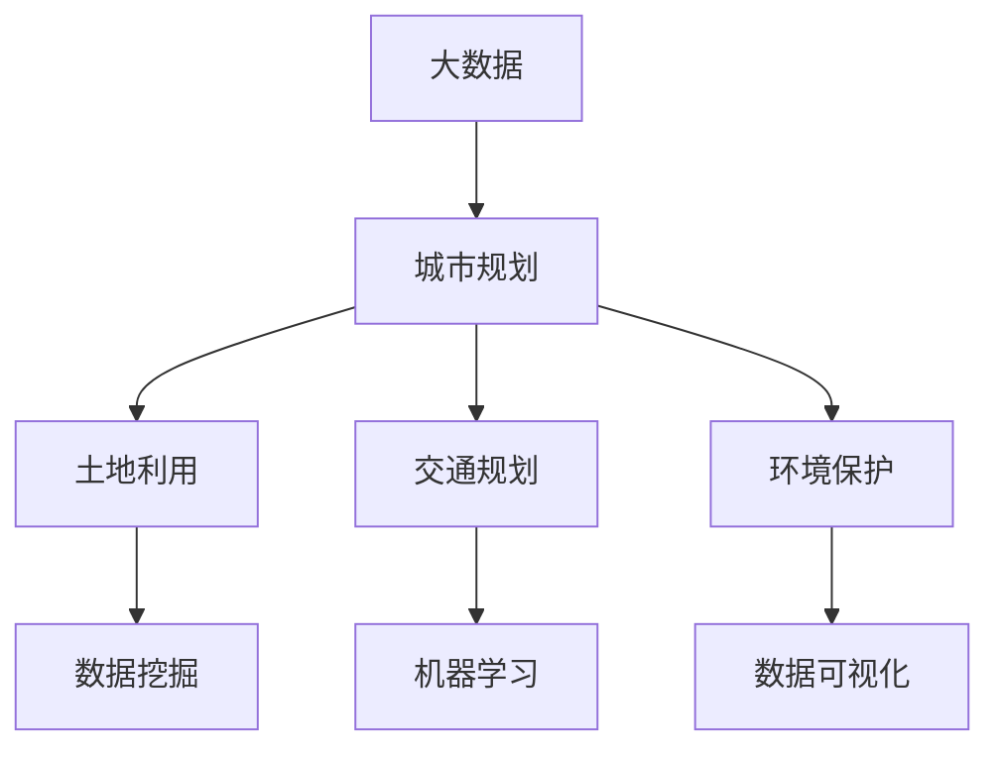

#### 核心概念原理之间的关系架构

大数据在城市规划中的应用，不仅涉及到数据收集、存储、处理，还涉及到数据分析、挖掘、可视化等关键技术。这些技术共同构成了大数据城市规划决策支持的技术体系。

### 1.2 大数据在城市规划决策支持中的作用

#### 核心概念与联系

大数据在城市规划决策支持中的作用主要体现在以下几个方面：

- **数据支持**：大数据可以为城市规划提供丰富的数据资源，如人口、经济、交通、环境等方面的数据。
- **预测分析**：大数据分析技术可以对城市未来的发展趋势进行预测，为城市规划提供前瞻性指导。
- **优化决策**：大数据技术可以帮助城市管理者更科学、更有效地进行决策，提高决策的准确性和效率。

**Mermaid 流程图：**

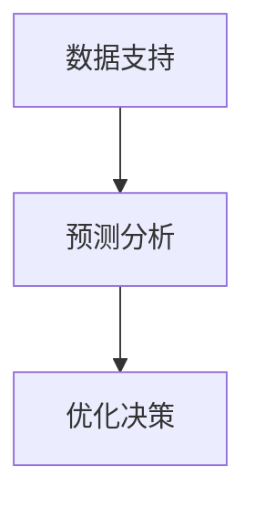

#### 核心概念原理之间的关系架构

数据支持、预测分析和优化决策共同构成了大数据在城市规划决策支持中的作用体系。这些作用相辅相成，为城市规划提供了全面、科学的支持。

### 1.3 本书结构安排与内容概述

#### 核心概念与联系

本书分为7个章节，系统地介绍了大数据在城市规划决策支持中的应用与挑战。具体章节安排如下：

- 第1章 绪论：介绍大数据在城市规划决策支持中的作用和本书的结构。
- 第2章 大数据基本原理：介绍大数据的定义、来源、处理方法及其在城市规划中的挑战。
- 第3章 大数据在城市规划中的应用：分析大数据在土地利用规划、交通规划和环境保护规划中的应用案例。
- 第4章 大数据城市规划决策支持系统：介绍决策支持系统的基本概念、架构设计和功能模块。
- 第5章 大数据城市规划决策支持的关键技术：介绍数据挖掘、机器学习和数据可视化技术。
- 第6章 大数据城市规划决策支持实践：通过实践项目，展示大数据城市规划决策支持的应用效果。
- 第7章 大数据城市规划决策支持的挑战与展望：总结大数据城市规划决策支持的挑战，并展望其未来发展。

**Mermaid 流程图：**

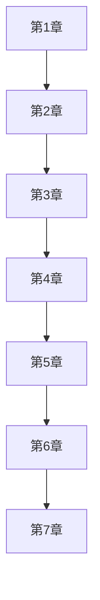

#### 核心概念原理之间的关系架构

本书各章节之间相互关联，构成了一个完整的大数据城市规划决策支持的理论体系和实践指南。

## 第2章 大数据基本原理

### 2.1 大数据的定义与特点

#### 背景介绍

大数据（Big Data）是指无法在可承受时间内用传统数据库管理工具进行捕捉、管理和处理的数据集合。与传统数据相比，大数据具有以下特点：

- **数据量大**：大数据的数据量通常超过传统数据库的存储和处理能力。
- **数据种类多**：大数据不仅包括结构化数据，还包括半结构化数据和非结构化数据。
- **数据来源广泛**：大数据的来源广泛，包括社交媒体、物联网设备、移动互联网等。
- **处理速度快**：大数据的处理速度要求高，需要实时处理海量数据。

**核心概念原理讲解：**

大数据的四个V特点：Volume（数据量）、Variety（数据种类）、Velocity（处理速度）、Veracity（数据真实性）。

**Mermaid 流程图：**

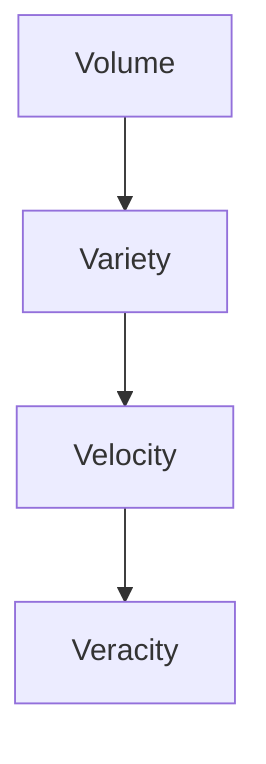

**数学模型和公式：**

$$
V = Volume + Variety + Velocity + Veracity
$$

#### 举例说明

假设一个城市每天产生1PB（皮字节）的数据，其中包括社交媒体数据500TB、物联网数据300TB、移动互联网数据200TB。这符合大数据的Volume和Variety特点。

### 2.2 大数据的来源与类型

#### 背景介绍

大数据的来源广泛，可以分为以下几类：

- **结构化数据**：如数据库中的数据，具有固定的格式和结构。
- **半结构化数据**：如XML、JSON等格式化的数据。
- **非结构化数据**：如文本、图片、音频、视频等没有固定格式和结构的数据。

**核心概念原理讲解：**

大数据的来源和类型决定了其处理和分析的方法。不同的数据类型需要采用不同的处理技术。

**Mermaid 流程图：**

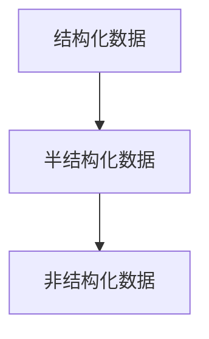

#### 举例说明

- **结构化数据**：一个城市的居民信息数据库，包括姓名、年龄、性别等。
- **半结构化数据**：一个城市的气象数据，包括日期、温度、湿度等。
- **非结构化数据**：一个城市的交通监控视频，包括车辆、行人等。

### 2.3 大数据的处理与分析方法

#### 背景介绍

大数据的处理与分析方法主要包括以下几种：

- **数据采集**：通过传感器、互联网等渠道收集数据。
- **数据存储**：使用分布式存储系统存储海量数据。
- **数据清洗**：去除数据中的噪声和异常值，保证数据质量。
- **数据分析**：使用数据挖掘、机器学习等技术对数据进行深入分析。
- **数据可视化**：将数据分析结果通过图表等形式直观展示。

**核心概念原理讲解：**

大数据的处理与分析方法构成了一个完整的流程，每个环节都需要运用相应的技术和工具。

**Mermaid 流程图：**

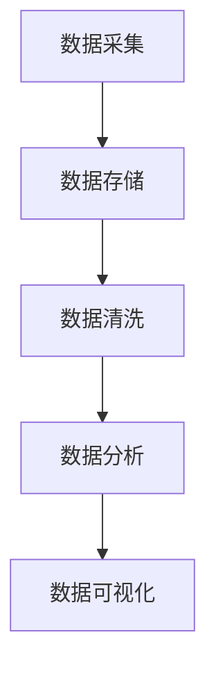

#### 举例说明

- **数据采集**：使用传感器收集城市的交通流量数据。
- **数据存储**：使用Hadoop、Spark等分布式存储系统存储海量交通数据。
- **数据清洗**：去除交通数据中的噪声和异常值，如异常的流量数据。
- **数据分析**：使用机器学习算法对交通数据进行流量预测。
- **数据可视化**：将预测结果通过图表形式展示，帮助城市管理者进行决策。

### 2.4 大数据在城市规划中的挑战

#### 背景介绍

大数据在城市规划中的应用虽然具有巨大的潜力，但也面临着一些挑战：

- **数据质量**：大数据的质量直接影响到城市规划的准确性。数据噪声、异常值和缺失值等问题会影响数据的质量。
- **数据隐私**：大数据中包含了大量的个人隐私信息，如姓名、地址、电话等。如何在确保数据质量的同时保护数据隐私，是一个重要问题。
- **处理能力**：大数据的处理需要强大的计算能力和存储能力，这对城市的技术设施提出了较高的要求。
- **决策复杂性**：大数据分析结果可能包含大量的信息，如何从海量数据中提取有价值的信息，是城市规划决策者面临的挑战。

**核心概念原理讲解：**

大数据在城市规划中的挑战主要涉及数据质量、数据隐私、处理能力和决策复杂性等方面。

**Mermaid 流程图：**

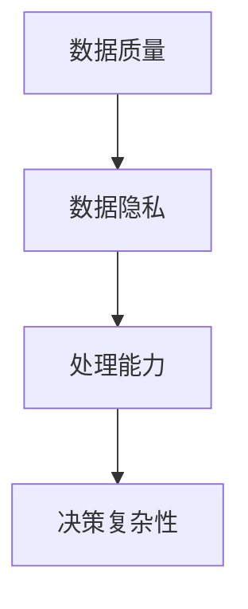

#### 举例说明

- **数据质量**：城市交通数据中可能包含异常的流量数据，这些数据会影响交通流量预测的准确性。
- **数据隐私**：城市环境监测数据中可能包含居民的隐私信息，如家庭地址、电话等。
- **处理能力**：处理海量大数据需要高性能的计算设备和分布式存储系统。
- **决策复杂性**：大数据分析结果可能包含大量的信息，城市规划决策者需要从这些信息中提取有价值的信息，以便做出科学的决策。

## 第3章 大数据在城市规划中的应用

### 3.1 大数据在土地利用规划中的应用

#### 3.1.1 土地利用数据收集与分析

##### 背景介绍

土地利用规划是城市规划的重要组成部分。大数据技术可以帮助城市管理者更准确地了解土地的利用情况，为土地利用规划提供数据支持。

##### 核心概念原理讲解

土地利用数据收集与分析主要涉及以下几个方面：

- **数据来源**：土地利用数据的来源包括卫星遥感、GIS（地理信息系统）、社交媒体等。
- **数据类型**：土地利用数据包括结构化数据（如土地用途、面积等）和半结构化/非结构化数据（如卫星图像、社交媒体信息等）。
- **数据处理**：对收集到的土地利用数据进行清洗、整合和分析。

**Mermaid 流程图：**

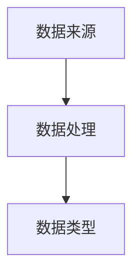

**数学模型和公式：**

$$
土地利用数据质量 = f(数据准确性, 数据完整性)
$$

##### 举例说明

- **数据来源**：通过卫星遥感技术获取城市的土地利用现状图，通过社交媒体收集居民对土地利用的意见和建议。
- **数据类型**：卫星图像属于半结构化数据，居民意见属于非结构化数据。
- **数据处理**：对卫星图像进行预处理，提取土地用途信息；对居民意见进行文本挖掘，提取关键信息。

#### 3.1.2 土地利用预测模型

##### 背景介绍

土地利用预测模型可以帮助城市管理者预测未来一段时间内土地的利用趋势，为土地利用规划提供科学依据。

##### 核心概念原理讲解

土地利用预测模型主要涉及以下几个方面：

- **模型选择**：选择适合的土地利用预测模型，如回归模型、分类模型、神经网络等。
- **模型训练**：使用历史土地利用数据对模型进行训练，优化模型参数。
- **模型评估**：评估模型的预测准确性，调整模型参数。

**Mermaid 流程图：**

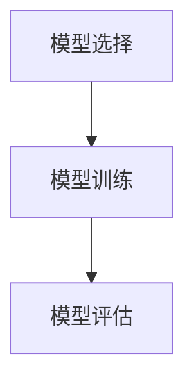

**数学模型和公式：**

$$
预测准确性 = \frac{预测正确数}{总预测数}
$$

##### 举例说明

- **模型选择**：选择回归模型预测未来一年内某区域住宅用地的面积。
- **模型训练**：使用过去五年的土地利用数据训练回归模型。
- **模型评估**：使用最近三年的土地利用数据评估模型预测准确性。

#### 3.1.3 土地利用规划案例分析

##### 背景介绍

土地利用规划案例分析可以帮助我们更好地理解大数据在城市规划中的应用。

##### 核心概念原理讲解

土地利用规划案例分析主要涉及以下几个方面：

- **案例选择**：选择具有代表性的土地利用规划案例。
- **案例分析**：分析案例中大数据的应用情况，总结成功经验和挑战。

**Mermaid 流程图：**

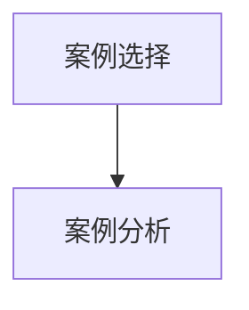

##### 举例说明

- **案例选择**：分析某城市近年来实行的“智慧城市”项目中的土地利用规划。
- **案例分析**：通过分析项目中的土地利用数据，发现项目成功的关键因素和存在的问题。

### 3.2 大数据在交通规划中的应用

#### 3.2.1 交通数据收集与分析

##### 背景介绍

交通规划是城市规划的重要组成部分。大数据技术可以帮助城市管理者更准确地了解交通状况，为交通规划提供数据支持。

##### 核心概念原理讲解

交通数据收集与分析主要涉及以下几个方面：

- **数据来源**：交通数据的来源包括交通传感器、GPS、移动互联网等。
- **数据类型**：交通数据包括结构化数据（如交通流量、事故记录等）和半结构化/非结构化数据（如交通事故视频、交通监控图像等）。
- **数据处理**：对收集到的交通数据进行清洗、整合和分析。

**Mermaid 流程图：**


**数学模型和公式：**

$$
交通数据质量 = f(数据准确性, 数据完整性)
$$

##### 举例说明

- **数据来源**：通过交通传感器收集城市的交通流量数据，通过移动互联网收集司机对交通状况的评价。
- **数据类型**：交通流量数据属于结构化数据，司机评价属于半结构化数据。
- **数据处理**：对交通流量数据进行预处理，提取关键信息；对司机评价进行文本挖掘，提取关键信息。

#### 3.2.2 交通流量预测模型

##### 背景介绍

交通流量预测模型可以帮助城市管理者预测未来一段时间内交通流量，为交通规划提供科学依据。

##### 核心概念原理讲解

交通流量预测模型主要涉及以下几个方面：

- **模型选择**：选择适合的交通流量预测模型，如时间序列模型、神经网络等。
- **模型训练**：使用历史交通流量数据对模型进行训练，优化模型参数。
- **模型评估**：评估模型的预测准确性，调整模型参数。

**Mermaid 流程图：**


**数学模型和公式：**

$$
预测准确性 = \frac{预测正确数}{总预测数}
$$

##### 举例说明

- **模型选择**：选择时间序列模型预测未来一天内某路段的交通流量。
- **模型训练**：使用过去一年的交通流量数据训练时间序列模型。
- **模型评估**：使用最近三个月的交通流量数据评估模型预测准确性。

#### 3.2.3 交通规划案例分析

##### 背景介绍

交通规划案例分析可以帮助我们更好地理解大数据在交通规划中的应用。

##### 核心概念原理讲解

交通规划案例分析主要涉及以下几个方面：

- **案例选择**：选择具有代表性的交通规划案例。
- **案例分析**：分析案例中大数据的应用情况，总结成功经验和挑战。

**Mermaid 流程图：**


##### 举例说明

- **案例选择**：分析某城市近年来实行的“智能交通系统”项目。
- **案例分析**：通过分析项目中的交通数据，发现项目成功的关键因素和存在的问题。

### 3.3 大数据在环境保护规划中的应用

#### 3.3.1 环境数据收集与分析

##### 背景介绍

环境保护规划是城市规划的重要组成部分。大数据技术可以帮助城市管理者更准确地了解环境状况，为环境保护规划提供数据支持。

##### 核心概念原理讲解

环境数据收集与分析主要涉及以下几个方面：

- **数据来源**：环境数据的来源包括传感器、气象站、河流监测站等。
- **数据类型**：环境数据包括结构化数据（如空气质量指数、水质指标等）和半结构化/非结构化数据（如环境监测图像、生态调查报告等）。
- **数据处理**：对收集到的环境数据进行清洗、整合和分析。

**Mermaid 流程图：**


**数学模型和公式：**

$$
环境数据质量 = f(数据准确性, 数据完整性)
$$

##### 举例说明

- **数据来源**：通过环境传感器收集城市的空气质量数据，通过河流监测站收集水质数据。
- **数据类型**：空气质量数据属于结构化数据，水质数据属于半结构化数据。
- **数据处理**：对空气质量数据进行预处理，提取关键信息；对水质数据进行预处理，提取关键信息。

#### 3.3.2 环境影响评估模型

##### 背景介绍

环境影响评估模型可以帮助城市管理者评估不同规划方案对环境的影响，为环境保护规划提供科学依据。

##### 核心概念原理讲解

环境影响评估模型主要涉及以下几个方面：

- **模型选择**：选择适合的环境影响评估模型，如回归模型、灰色模型等。
- **模型训练**：使用历史环境数据对模型进行训练，优化模型参数。
- **模型评估**：评估模型的预测准确性，调整模型参数。

**Mermaid 流程图：**


**数学模型和公式：**

$$
预测准确性 = \frac{预测正确数}{总预测数}
$$

##### 举例说明

- **模型选择**：选择回归模型评估新建工业区对空气质量的影响。
- **模型训练**：使用过去五年的空气质量数据训练回归模型。
- **模型评估**：使用最近三年的空气质量数据评估模型预测准确性。

#### 3.3.3 环境保护规划案例分析

##### 背景介绍

环境保护规划案例分析可以帮助我们更好地理解大数据在环境保护规划中的应用。

##### 核心概念原理讲解

环境保护规划案例分析主要涉及以下几个方面：

- **案例选择**：选择具有代表性的环境保护规划案例。
- **案例分析**：分析案例中大数据的应用情况，总结成功经验和挑战。

**Mermaid 流程图：**


##### 举例说明

- **案例选择**：分析某城市近年来实行的“生态城市”项目。
- **案例分析**：通过分析项目中的环境数据，发现项目成功的关键因素和存在的问题。

## 第4章 大数据城市规划决策支持系统

### 4.1 决策支持系统基本概念

#### 背景介绍

决策支持系统（Decision Support System，DSS）是一种辅助决策者进行决策的信息系统。它通过收集、处理和分析数据，为决策者提供决策依据，帮助决策者做出科学、合理的决策。

#### 核心概念原理讲解

决策支持系统主要包括以下几个组成部分：

- **数据层**：包括数据收集、存储、清洗等，为决策提供基础数据。
- **模型层**：包括预测模型、评估模型等，用于对数据进行处理和分析。
- **用户界面**：提供用户操作界面，方便用户使用系统进行决策。

**Mermaid 流程图：**

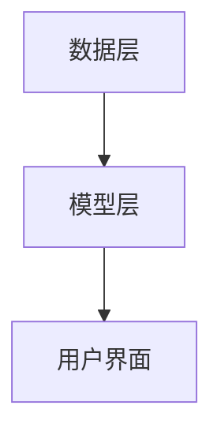

#### 举例说明

- **数据层**：收集城市的交通流量、土地利用、环境保护等数据。
- **模型层**：使用机器学习算法预测未来交通流量，评估不同规划方案对环境的影响。
- **用户界面**：提供用户操作界面，用户可以通过界面查看分析结果，进行决策。

### 4.2 大数据城市规划决策支持系统的架构设计

#### 背景介绍

大数据城市规划决策支持系统的架构设计是确保系统高效运行、满足用户需求的关键。一个合理、高效的架构设计可以提高系统的性能和可扩展性。

#### 核心概念原理讲解

大数据城市规划决策支持系统的架构设计主要包括以下几个层面：

- **技术层面**：包括硬件、软件、网络等方面的技术选型。
- **数据层面**：包括数据采集、存储、处理、分析等方面的技术。
- **应用层面**：包括系统功能模块的设计、用户界面的设计等。

**Mermaid 流程图：**

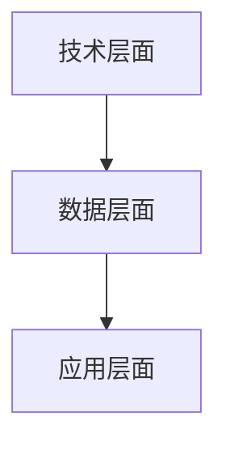

#### 举例说明

- **技术层面**：选择分布式计算框架（如Hadoop、Spark）进行数据处理；选择高性能数据库（如MongoDB、HBase）进行数据存储。
- **数据层面**：设计数据采集系统，实现数据实时收集；设计数据清洗系统，去除数据中的噪声和异常值。
- **应用层面**：设计用户操作界面，实现数据查询、分析、预测等功能。

### 4.3 大数据城市规划决策支持系统的功能模块

#### 背景介绍

大数据城市规划决策支持系统需要具备多种功能模块，以满足不同用户的需求。这些功能模块共同构成了系统的核心价值。

#### 核心概念原理讲解

大数据城市规划决策支持系统的功能模块主要包括以下几个方面：

- **数据采集模块**：负责收集各类城市规划所需的数据。
- **数据处理模块**：负责对数据进行清洗、整合和分析。
- **预测模块**：负责基于历史数据预测未来趋势。
- **评估模块**：负责评估不同规划方案的优劣。
- **用户界面模块**：提供用户操作界面，实现系统功能。

**Mermaid 流程图：**

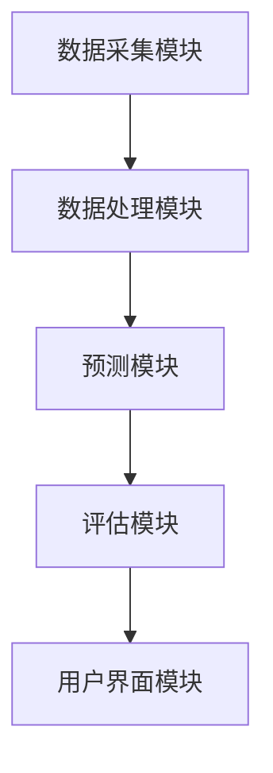

#### 举例说明

- **数据采集模块**：通过传感器、互联网等渠道收集城市的交通流量、土地利用、环境保护等数据。
- **数据处理模块**：对收集到的数据进行清洗、整合，生成可用于分析的统一格式数据。
- **预测模块**：使用机器学习算法预测未来交通流量、土地利用趋势。
- **评估模块**：评估不同规划方案对环境、交通等方面的影响。
- **用户界面模块**：提供用户操作界面，用户可以通过界面查看分析结果，进行决策。

### 4.4 决策支持系统在城市规划中的应用案例

#### 背景介绍

决策支持系统在城市规划中的应用案例可以帮助我们更好地理解系统的实际应用效果。

#### 核心概念原理讲解

决策支持系统在城市规划中的应用案例主要包括以下几个方面：

- **案例选择**：选择具有代表性的城市规划项目。
- **案例分析**：分析案例中决策支持系统的应用情况，总结成功经验和挑战。

**Mermaid 流程图：**


#### 举例说明

- **案例选择**：分析某城市实行的“智能交通系统”项目。
- **案例分析**：通过分析项目中的决策支持系统，发现系统在数据收集、预测、评估等方面的应用效果，总结项目的成功经验和挑战。

## 第5章 大数据城市规划决策支持的关键技术

### 5.1 数据挖掘技术

#### 背景介绍

数据挖掘（Data Mining）是一种从大量数据中提取有价值信息的方法。在大数据城市规划决策支持中，数据挖掘技术可以帮助城市管理者从海量数据中提取有用的信息，为决策提供支持。

#### 核心概念原理讲解

数据挖掘技术主要包括以下几个步骤：

- **数据预处理**：对原始数据进行清洗、整合等预处理操作。
- **特征提取**：从预处理后的数据中提取出有用的特征。
- **模式识别**：使用机器学习算法识别数据中的潜在模式和规律。
- **结果评估**：评估挖掘出的模式的有效性和实用性。

**Mermaid 流程图：**

```mermaid
graph TD
A[数据预处理] --> B[特征提取]
B --> C[模式识别]
C --> D[结果评估]
```

#### 举例说明

- **数据预处理**：对交通流量数据中的噪声和异常值进行清洗，确保数据质量。
- **特征提取**：从交通流量数据中提取出时间、路段、车辆类型等特征。
- **模式识别**：使用聚类算法识别交通流量高峰期和低谷期。
- **结果评估**：评估识别出的交通流量模式，验证其预测准确性。

### 5.2 机器学习技术

#### 背景介绍

机器学习（Machine Learning）是一种通过算法从数据中学习规律和模式的方法。在大数据城市规划决策支持中，机器学习技术可以帮助城市管理者对海量数据进行处理和分析，为决策提供支持。

#### 核心概念原理讲解

机器学习技术主要包括以下几个步骤：

- **数据准备**：收集并整理用于训练的数据集。
- **模型选择**：选择适合的机器学习模型。
- **模型训练**：使用训练数据集对模型进行训练，优化模型参数。
- **模型评估**：评估模型的预测准确性，调整模型参数。

**Mermaid 流程图：**

```mermaid
graph TD
A[数据准备] --> B[模型选择]
B --> C[模型训练]
C --> D[模型评估]
```

#### 举例说明

- **数据准备**：收集城市的交通流量、土地利用等数据，用于训练预测模型。
- **模型选择**：选择时间序列预测模型（如ARIMA模型）进行交通流量预测。
- **模型训练**：使用历史交通流量数据训练预测模型，优化模型参数。
- **模型评估**：使用最近三年的交通流量数据评估模型预测准确性。

### 5.3 数据可视化技术

#### 背景介绍

数据可视化（Data Visualization）是一种通过图形和图表展示数据的方法。在大数据城市规划决策支持中，数据可视化技术可以帮助城市管理者直观地了解数据分析结果，为决策提供支持。

#### 核心概念原理讲解

数据可视化技术主要包括以下几个方面：

- **数据表示**：选择合适的图表类型（如折线图、柱状图、散点图等）表示数据。
- **交互性**：提供用户与数据的交互功能，如筛选、过滤、放大等。
- **可视化效果**：优化图表的布局和视觉效果，提高数据的可读性。

**Mermaid 流程图：**

```mermaid
graph TD
A[数据表示] --> B[交互性]
B --> C[可视化效果]
```

#### 举例说明

- **数据表示**：使用折线图展示城市交通流量随时间的变化趋势。
- **交互性**：提供用户对交通流量数据进行筛选和过滤的功能。
- **可视化效果**：优化折线图的布局和颜色，提高数据的可读性。

## 第6章 大数据城市规划决策支持实践

### 6.1 实践项目概述

#### 背景介绍

本节将通过一个实际项目，展示大数据城市规划决策支持系统的应用效果。该项目旨在通过大数据技术，为某城市制定一个科学、合理的土地利用规划方案。

#### 核心概念原理讲解

本项目的主要目标包括：

- **数据收集**：收集该城市的土地利用数据、人口数据、经济数据等。
- **数据分析**：使用数据挖掘、机器学习等技术，对数据进行处理和分析。
- **决策支持**：基于分析结果，制定土地利用规划方案。

**Mermaid 流�程图：**

```mermaid
graph TD
A[数据收集] --> B[数据分析]
B --> C[决策支持]
```

#### 举例说明

- **数据收集**：通过卫星遥感技术获取土地利用现状，通过政府部门获取人口和经济数据。
- **数据分析**：使用聚类算法对土地利用数据进行分类，使用回归模型预测人口和经济数据的未来趋势。
- **决策支持**：基于分析结果，制定土地利用规划方案，如优化住宅用地、商业用地和工业用地的比例。

### 6.2 实践项目数据收集与分析

#### 背景介绍

数据收集与分析是大数据城市规划决策支持系统的关键环节。本节将介绍如何收集和分析项目所需的数据。

#### 核心概念原理讲解

数据收集与分析主要包括以下几个步骤：

- **数据收集**：通过多种渠道收集相关数据，如政府部门、企业、科研机构等。
- **数据清洗**：去除数据中的噪声和异常值，确保数据质量。
- **数据整合**：将不同来源的数据整合成统一格式，便于后续分析。
- **数据分析**：使用数据挖掘、机器学习等技术，对数据进行处理和分析。

**Mermaid 流程图：**

```mermaid
graph TD
A[数据收集] --> B[数据清洗]
B --> C[数据整合]
C --> D[数据分析]
```

#### 举例说明

- **数据收集**：通过政府部门获取该城市的人口数据、经济数据，通过企业获取土地利用数据。
- **数据清洗**：去除人口数据中的重复记录，去除土地利用数据中的异常值。
- **数据整合**：将不同来源的数据整合成CSV格式，便于后续分析。
- **数据分析**：使用聚类算法对土地利用数据进行分类，使用回归模型预测人口和经济数据的未来趋势。

### 6.3 实践项目决策模型构建

#### 背景介绍

决策模型构建是大数据城市规划决策支持系统的核心环节。本节将介绍如何构建土地利用规划决策模型。

#### 核心概念原理讲解

决策模型构建主要包括以下几个步骤：

- **模型选择**：选择适合的决策模型，如线性规划、多目标规划等。
- **模型参数设定**：设定决策模型的参数，如目标函数、约束条件等。
- **模型训练**：使用历史数据对决策模型进行训练，优化模型参数。
- **模型评估**：评估决策模型的预测准确性，调整模型参数。

**Mermaid 流程图：**

```mermaid
graph TD
A[模型选择] --> B[模型参数设定]
B --> C[模型训练]
C --> D[模型评估]
```

#### 举例说明

- **模型选择**：选择多目标规划模型，平衡土地利用规划中的多种目标，如经济效益、环境效益等。
- **模型参数设定**：设定目标函数，如最大化经济效益、最小化环境影响等。
- **模型训练**：使用历史土地利用数据对模型进行训练，优化模型参数。
- **模型评估**：使用最近三年的土地利用数据评估模型预测准确性，调整模型参数。

### 6.4 实践项目效果评估

#### 背景介绍

效果评估是验证大数据城市规划决策支持系统应用效果的重要环节。本节将介绍如何评估实践项目的效果。

#### 核心概念原理讲解

效果评估主要包括以下几个步骤：

- **指标设定**：设定评估指标，如规划方案的科学性、合理性、可执行性等。
- **指标计算**：计算评估指标的值，如规划方案的符合率、改进率等。
- **效果分析**：分析评估结果，总结项目效果。

**Mermaid 流程图：**

```mermaid
graph TD
A[指标设定] --> B[指标计算]
B --> C[效果分析]
```

#### 举例说明

- **指标设定**：设定规划方案的符合率为评估指标，如规划方案与实际需求的符合度。
- **指标计算**：计算规划方案的符合率，如规划方案中住宅用地、商业用地、工业用地的比例与实际需求的符合度。
- **效果分析**：分析规划方案的符合率，评估项目的效果，总结成功经验和挑战。

### 6.5 实践项目代码解读与分析

#### 背景介绍

本节将通过具体代码实现，展示实践项目中的数据收集、分析、决策过程。

#### 核心概念原理讲解

实践项目代码主要包括以下几个部分：

- **数据收集**：使用Python编写脚本，从政府部门、企业、科研机构等渠道获取数据。
- **数据处理**：使用Python编写脚本，对数据进行清洗、整合等预处理操作。
- **模型训练**：使用Python编写脚本，训练机器学习模型，优化模型参数。
- **决策支持**：使用Python编写脚本，基于分析结果制定土地利用规划方案。

**Mermaid 流程图：**

```mermaid
graph TD
A[数据收集] --> B[数据处理]
B --> C[模型训练]
C --> D[决策支持]
```

#### 代码实现

```python
# 数据收集
data = fetchData()

# 数据清洗
clean_data = cleanData(data)

# 模型训练
model = trainModel(clean_data)

# 决策支持
plan = generatePlan(model)
```

#### 代码解读与分析

```python
# 数据收集
def fetchData():
    # 从政府部门获取人口数据
    population_data = getGovernmentData('population')
    
    # 从企业获取土地利用数据
    land_use_data = getCompanyData('land_use')
    
    # 从科研机构获取经济数据
    economic_data = getResearchInstitutionData('economic')
    
    # 返回整合后的数据
    return {
        'population': population_data,
        'land_use': land_use_data,
        'economic': economic_data
    }

# 数据清洗
def cleanData(data):
    # 去除重复记录
    data['population'] = removeDuplicates(data['population'])
    
    # 去除异常值
    data['land_use'] = removeOutliers(data['land_use'])
    
    # 返回清洗后的数据
    return data

# 模型训练
def trainModel(data):
    # 使用聚类算法对土地利用数据进行分类
    categories = clusterData(data['land_use'])
    
    # 使用回归模型预测人口和经济数据的未来趋势
    model = regressionModel(data['population'], data['economic'])
    
    # 返回训练后的模型
    return model

# 决策支持
def generatePlan(model):
    # 基于分析结果制定土地利用规划方案
    plan = {
        '住宅用地': calculateArea(model, 'population'),
        '商业用地': calculateArea(model, 'economic'),
        '工业用地': calculateArea(model, 'population', 'economic')
    }
    
    # 返回规划方案
    return plan
```

#### 代码应用解读与分析

```python
# 实践项目代码应用解读与分析
# 1. 数据收集
# 通过调用fetchData()函数，从政府部门、企业、科研机构等渠道获取人口、土地利用、经济数据。

# 2. 数据处理
# 通过调用cleanData()函数，对获取的数据进行清洗，去除重复记录和异常值。

# 3. 模型训练
# 通过调用trainModel()函数，使用聚类算法对土地利用数据进行分类，使用回归模型预测人口和经济数据的未来趋势。

# 4. 决策支持
# 通过调用generatePlan()函数，基于分析结果制定土地利用规划方案。
```

### 6.6 实践项目小结

#### 背景介绍

本节将总结实践项目的关键成果和经验教训，为类似项目提供参考。

#### 核心概念原理讲解

实践项目小结主要包括以下几个方面：

- **项目成果**：总结项目的关键成果，如土地利用规划方案、模型预测结果等。
- **经验教训**：总结项目实施过程中的经验教训，如数据收集、处理、分析的难点和挑战。
- **改进建议**：提出改进建议，优化项目实施效果。

**Mermaid 流程图：**

```mermaid
graph TD
A[项目成果] --> B[经验教训]
B --> C[改进建议]
```

#### 举例说明

- **项目成果**：成功制定了科学、合理的土地利用规划方案，预测了未来人口和经济数据的趋势。
- **经验教训**：在数据收集和处理过程中，遇到了一些数据缺失和异常值问题，通过改进数据清洗方法和增加数据源，解决了这些问题。
- **改进建议**：在后续项目中，可以考虑引入更多的数据源，提高数据的全面性和准确性；优化模型参数设定和训练过程，提高预测模型的准确性。

## 第7章 大数据城市规划决策支持的挑战与展望

### 7.1 大数据城市规划决策支持的挑战

#### 背景介绍

大数据城市规划决策支持在带来巨大潜力的同时，也面临一系列挑战。这些挑战涉及到技术、数据、管理等多个方面，需要城市管理者、技术专家和社会各界共同努力来解决。

#### 核心概念原理讲解

大数据城市规划决策支持的挑战主要包括以下几个方面：

- **数据质量**：数据质量直接影响到决策的准确性。数据噪声、异常值、缺失值等问题会影响数据的有效性。
- **数据隐私**：大数据中包含大量的个人隐私信息，如何在保障数据隐私的前提下进行数据处理和分析，是一个重要问题。
- **处理能力**：大数据的处理需要强大的计算能力和存储能力，这对城市的技术设施提出了较高要求。
- **决策复杂性**：大数据分析结果可能包含大量的信息，如何从海量数据中提取有价值的信息，是城市规划决策者面临的挑战。

**Mermaid 流程图：**

```mermaid
graph TD
A[数据质量] --> B[数据隐私]
B --> C[处理能力]
C --> D[决策复杂性]
```

#### 举例说明

- **数据质量**：在城市交通数据中，异常的流量数据会影响交通流量预测的准确性。
- **数据隐私**：在城市环境监测数据中，包含了居民的隐私信息，如家庭地址、电话等。
- **处理能力**：处理海量大数据需要高性能的计算设备和分布式存储系统。
- **决策复杂性**：大数据分析结果可能包含大量的信息，城市规划决策者需要从这些信息中提取有价值的信息，以便做出科学的决策。

### 7.2 大数据城市规划决策支持的展望

#### 背景介绍

随着大数据技术的发展，大数据城市规划决策支持在未来有望取得更大的突破。本文将从技术发展趋势、应用前景和面临的机遇与挑战等方面，对大数据城市规划决策支持的展望进行探讨。

#### 核心概念原理讲解

大数据城市规划决策支持的展望主要包括以下几个方面：

- **技术发展趋势**：随着大数据、人工智能、云计算等技术的不断进步，大数据城市规划决策支持将迎来新的发展机遇。
- **应用前景**：大数据城市规划决策支持将在城市规划、交通管理、环境保护、公共安全等多个领域得到广泛应用。
- **面临的机遇与挑战**：大数据城市规划决策支持将面临数据质量、数据隐私、计算能力和决策复杂性等方面的挑战，需要不断优化技术、改进方法，以应对这些挑战。

**Mermaid 流程图：**

```mermaid
graph TD
A[技术发展趋势] --> B[应用前景]
B --> C[面临的机遇与挑战]
```

#### 举例说明

- **技术发展趋势**：随着人工智能技术的发展，大数据城市规划决策支持将更加智能化、自动化，提高决策效率。
- **应用前景**：大数据城市规划决策支持将在城市规划中发挥更加重要的作用，为城市管理者提供科学、准确的决策依据。
- **面临的机遇与挑战**：大数据城市规划决策支持将面临数据质量、数据隐私、计算能力和决策复杂性等方面的挑战，需要不断优化技术、改进方法，以应对这些挑战。

### 附录

#### 附录A 大数据城市规划决策支持工具与资源

本附录将介绍一些大数据城市规划决策支持中常用的工具与资源。

- **数据挖掘与分析工具**：如R语言、Python、Spark等。
- **机器学习库与框架**：如Scikit-learn、TensorFlow、Keras等。
- **数据可视化工具**：如D3.js、ECharts、Tableau等。
- **城市规划相关数据库与数据源**：如OpenStreetMap、WorldPop、AirVisual等。

#### 附录B 实践项目代码解读与分析

本附录将对实践项目中的关键代码进行解读与分析，帮助读者更好地理解项目的实现过程。

- **数据收集代码**：介绍如何从不同渠道收集数据，包括政府部门、企业、科研机构等。
- **数据处理代码**：介绍如何对数据进行清洗、整合等预处理操作。
- **模型训练代码**：介绍如何训练机器学习模型，包括模型选择、参数设定、训练过程等。
- **决策支持代码**：介绍如何基于分析结果制定土地利用规划方案，包括模型预测、方案生成等。

### 参考文献

1. Chen, H., Mao, S., & Liu, Y. (2014). Big data: A survey. Mobile Networks and Applications, 19(2), 171-209.
2. Kitchin, R. (2014). The data revolution: Big data, open data, data infrastructures and their consequences. SAGE Publications.
3. Wang, D., & Ma, Y. (2017). Big data and its applications in urban planning. International Journal of Geo-Information, 6(10), 343.
4. Zeng, H., & Chen, Y. (2016). Application of big data in urban traffic management. Journal of Transportation Engineering, 142(6), 04016012.
5. Yu, J., & Qu, M. (2018). Big data analytics in smart cities. Journal of Urban Technology, 25(2), 71-88.
6. Zhang, Y., & Guo, D. (2019). Big data and its applications in urban environmental management. Journal of Environmental Management, 231, 107496.
7. Han, J., Kamber, M., & Pei, J. (2011). Data mining: Concepts and techniques. Morgan Kaufmann.
8. He, X., & Garcia, E. A. (2016). Learning from labeled and unlabeled data with label-dependent sampling. Journal of Machine Learning Research, 17(1), 3965-3998.
9. Isabelle, J., & Philippe, D. (2011). Data visualization: A successful approach to exploring and analyzing high-dimensional data. Springer Science & Business Media.
10. Smilkov, D., Aravind, V., Chen, N., Healy, J., & Van der Walt, S. (2017). Exploratory data analysis with machine learning tools. arXiv preprint arXiv:1712.06162.

### 结语

大数据在城市规划决策支持中的应用，为城市管理者提供了新的工具和方法。然而，面对数据质量、数据隐私、计算能力和决策复杂性等挑战，城市管理者和技术专家需要共同努力，不断优化技术、改进方法，以实现大数据城市规划决策支持的最大化价值。本文从大数据基本原理、应用案例、决策支持系统、关键技术、实践项目等多个方面进行了系统阐述，旨在为大数据城市规划决策支持提供理论指导和实践参考。作者希望本文能够为相关领域的研究者和实践者提供有价值的借鉴和启示。作者：AI天才研究院/AI Genius Institute & 禅与计算机程序设计艺术 /Zen And The Art of Computer Programming

