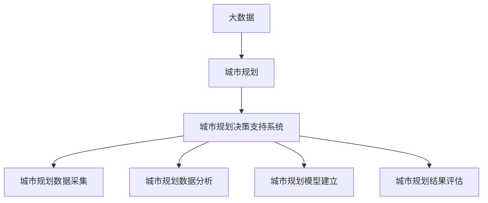
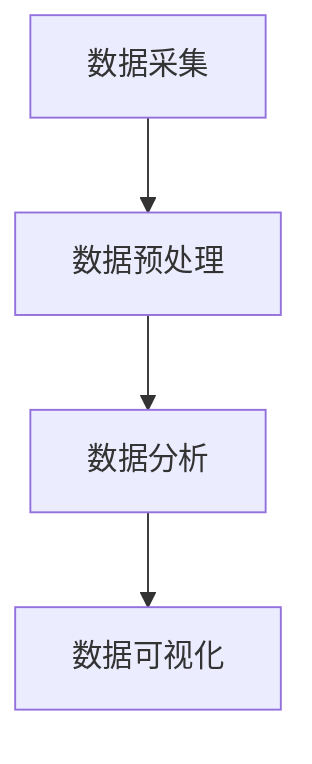

                 

### 文章标题

# 大数据在城市规划决策支持中的应用与挑战

### 关键词

- 大数据
- 城市规划
- 决策支持系统
- 数据采集
- 数据分析
- 可视化技术
- 聚类分析
- 关联规则挖掘

### 摘要

随着城市化进程的不断加速，大数据在城市规划决策支持中的应用变得越来越重要。本文将从大数据与城市规划概述、大数据处理与分析技术、大数据可视化技术等方面，深入探讨大数据在城市规划决策支持中的应用与挑战。通过分析大数据在城市规划决策支持中的核心概念、应用技术以及核心算法原理，本文旨在为读者提供一个全面且系统的理解，帮助城市规划者更好地利用大数据技术提升城市规划的质量和效率。

## 第一部分：大数据与城市规划决策支持中的基础概念

### 第1章：大数据与城市规划概述

#### 1.1 大数据的基本概念

##### 1.1.1 大数据的定义

大数据（Big Data）指的是海量、复杂、高速生成和不断更新的数据集合。这些数据来源广泛，包括社交媒体、物联网设备、传感器网络、卫星遥感等。大数据的三个主要特征，即“4V”（Volume、Velocity、Variety、Value），决定了其不同于传统数据处理的方式。

- **Volume（数据量）**：大数据的规模巨大，常常以PB（拍字节）甚至EB（艾字节）为单位。
- **Velocity（速度）**：数据生成和流动的速度极快，需要实时或近乎实时的处理和分析。
- **Variety（多样性）**：数据的类型丰富，包括结构化数据、半结构化数据和非结构化数据。
- **Value（价值密度）**：大数据中的价值密度相对较低，需要通过先进的分析技术提取有价值的信息。

##### 1.1.2 大数据的主要特征

除了“4V”特征外，大数据还具有以下几个显著特征：

- **准确性**：大数据必须具有较高的准确性，以保证分析结果的可靠性。
- **实时性**：大数据分析需要快速响应，以支持实时决策。
- **可扩展性**：大数据处理系统应具备良好的可扩展性，能够应对数据量的快速增长。

##### 1.1.3 大数据的发展历程

大数据的概念最早可以追溯到20世纪80年代，当时数据库技术开始兴起。随着互联网的普及和信息技术的发展，大数据技术逐渐成熟。21世纪初，大数据技术得到了广泛应用，尤其是在商业和科学研究领域。近年来，随着物联网、人工智能等新技术的崛起，大数据的应用场景和范围进一步扩大。

#### 1.2 城市规划的基本概念

##### 1.2.1 城市规划的内涵

城市规划是指通过科学的方法和手段，对城市空间结构、土地利用、交通布局、公共服务设施等进行系统规划，以实现城市的可持续发展。城市规划的内涵包括：

- **空间规划**：对城市空间进行合理布局，确保城市的有序发展。
- **土地利用规划**：根据城市功能需求，合理分配土地资源。
- **交通规划**：设计高效的交通网络，提高交通系统的运行效率。
- **公共服务设施规划**：确保城市居民的基本生活需求得到满足。

##### 1.2.2 城市规划的目标

城市规划的主要目标是实现城市的可持续发展，包括以下几个方面：

- **经济效益**：提高城市的经济发展水平，创造更多的就业机会。
- **社会效益**：提升城市居民的生活质量，满足居民的基本生活需求。
- **环境效益**：保护城市生态环境，实现绿色发展。

##### 1.2.3 城市规划的主要方法

城市规划的主要方法包括以下几种：

- **规划编制**：通过编制城市规划文本、图纸和报告，明确城市的发展方向和重点。
- **规划评估**：对城市规划的实施效果进行评估，发现问题并提出改进措施。
- **规划审批**：按照法定程序对城市规划进行审批，确保规划的合法性和可行性。
- **规划实施**：按照规划方案进行城市建设和管理工作，确保规划目标的实现。

#### 1.3 大数据在城市规划中的重要性

##### 1.3.1 大数据在城市规划决策支持中的优势

大数据在城市规划决策支持中具有以下几个显著优势：

- **全面性**：大数据能够提供丰富的、多维度的城市数据，为城市规划提供全面的信息支持。
- **实时性**：大数据的实时性能够帮助城市规划者快速响应城市变化，做出及时决策。
- **精确性**：大数据分析技术能够提高城市规划数据的精确性，降低规划风险。
- **智能性**：通过大数据分析和人工智能技术，城市规划能够更加智能化，提高规划质量。

##### 1.3.2 大数据在城市规划领域的应用现状

大数据在城市规划领域的应用已经取得了显著成果，主要包括：

- **交通规划**：通过分析交通流量、拥堵情况等大数据，优化交通网络布局，提高交通运行效率。
- **土地利用规划**：利用大数据分析土地使用情况，优化土地利用结构，提高土地利用效率。
- **环境保护**：通过分析环境数据，监测城市环境质量，制定环境保护措施。
- **公共安全**：利用大数据分析公共安全事件，预测和防范安全风险。

##### 1.3.3 大数据对城市规划的未来影响

随着大数据技术的不断发展，大数据对城市规划的未来影响将更加深远：

- **数据驱动**：大数据将使得城市规划更加数据驱动，提高规划的决策科学性。
- **智能化规划**：大数据和人工智能的结合将使得城市规划更加智能化，提高规划效率和质量。
- **可持续发展**：大数据将帮助城市规划实现可持续发展，优化资源配置，保护生态环境。
- **公众参与**：大数据将为公众提供更多参与城市规划的机会，提高规划的民主性和透明度。

### Mermaid 流程图：大数据在城市规划决策支持中的核心概念联系



## 第二部分：大数据在城市规划决策支持中的应用技术

### 第2章：大数据处理与分析技术

#### 2.1 数据采集与预处理

##### 2.1.1 数据采集方法

数据采集是大数据应用的第一步，主要包括以下几种方法：

- **手动采集**：通过人工调查、问卷调查等方式收集数据。
- **自动采集**：利用传感器、物联网设备、卫星遥感等自动采集数据。
- **网络爬虫**：通过爬取互联网上的开放数据源，获取相关数据。

##### 2.1.2 数据清洗技术

数据清洗是数据预处理的重要环节，主要包括以下几种技术：

- **缺失值处理**：对于缺失的数据，可以通过填充、删除或插值等方法进行处理。
- **异常值处理**：识别并处理异常数据，防止其对数据分析结果产生误导。
- **重复值处理**：删除重复的数据，以减少数据冗余。
- **格式转换**：将不同格式、单位或类型的数据进行统一处理，以便后续分析。

##### 2.1.3 数据整合与融合

数据整合与融合是将不同来源、不同类型、不同格式的数据进行整合，以便于后续分析。主要包括以下几种方法：

- **数据仓库**：将数据存储在统一的数据仓库中，实现数据的高效管理和整合。
- **数据融合算法**：通过算法将不同来源的数据进行融合，生成更全面、更准确的分析数据。
- **数据交换格式**：采用统一的数据交换格式，如XML、JSON等，实现数据的标准化和集成。

#### 2.2 数据分析技术

##### 2.2.1 描述性统计分析

描述性统计分析是对数据的基本属性进行描述和分析，主要包括以下内容：

- **数据分布**：描述数据的分布情况，如均值、方差、标准差等。
- **数据频数**：计算各个数据值出现的次数，了解数据的集中趋势。
- **数据可视化**：通过图表、图形等可视化方式，直观展示数据特征。

##### 2.2.2 聚类分析

聚类分析是一种无监督学习技术，用于将相似的数据点划分为不同的群体。常用的聚类算法包括：

- **K-Means算法**：通过迭代计算，将数据点划分为 k 个聚类。
- **层次聚类算法**：根据相似性度量，逐步合并或分裂聚类，直到满足停止条件。

##### 2.2.3 关联规则挖掘

关联规则挖掘是一种用于发现数据中潜在关系的分析方法，主要用于市场篮子分析、推荐系统等。常用的算法包括：

- **Apriori算法**：通过支持度和置信度，挖掘数据中的频繁项集。
- **FP-Growth算法**：通过构建频繁模式树，减少数据扫描次数，提高挖掘效率。

##### 2.2.4 预测分析

预测分析是一种基于历史数据，对未来趋势进行预测的方法。常用的算法包括：

- **时间序列分析**：通过分析时间序列数据的规律，预测未来的趋势。
- **回归分析**：通过建立回归模型，预测目标变量的值。
- **神经网络**：通过神经网络模型，对复杂非线性关系进行预测。

#### 2.3 大数据可视化技术

##### 2.3.1 可视化基本概念

大数据可视化是将复杂的数据转换为图形、图表等视觉形式，以帮助人们更好地理解和分析数据。可视化技术的基本概念包括：

- **数据映射**：将数据值映射到视觉元素上，如颜色、大小、形状等。
- **交互性**：通过交互操作，如缩放、过滤、搜索等，增强数据的可视化和分析能力。
- **视觉编码**：通过视觉特性，如颜色、形状、位置等，传递数据的含义和关系。

##### 2.3.2 常见可视化工具

常见的可视化工具包括：

- **Tableau**：一款强大的数据可视化工具，支持多种数据源和丰富的可视化类型。
- **D3.js**：一款基于JavaScript的可视化库，可以创建高度交互性的可视化图表。
- **Matplotlib**：Python的常用数据可视化库，支持多种图表类型和自定义样式。
- **ECharts**：一款基于JavaScript的可视化库，支持多种图表类型和丰富的交互功能。

##### 2.3.3 可视化案例

以下是一些大数据可视化的案例：

- **交通流量可视化**：通过热力图、折线图等，展示城市交通流量的分布和变化趋势。
- **土地利用可视化**：通过地图、饼图等，展示城市土地利用的情况和分布。
- **环境质量可视化**：通过图表、地图等，展示城市环境质量的数据和变化。

### Mermaid 流程图：大数据处理与分析技术流程



### 核心算法原理讲解

#### 2.4.1 聚类分析算法原理

聚类分析是一种无监督学习方法，用于将数据点划分为若干个聚类。以下将详细介绍K-Means算法的原理。

##### K-Means算法原理

K-Means算法的基本思想是将数据点划分为k个聚类，每个聚类由一个中心点代表。算法的目的是使每个聚类内的数据点尽可能接近中心点，而聚类之间的数据点尽可能远离。

算法的主要步骤如下：

1. **初始化中心点**：随机选择k个数据点作为初始中心点。
2. **分配数据点**：计算每个数据点到各个中心点的距离，将数据点分配到最近的中心点所在的聚类。
3. **更新中心点**：计算每个聚类的新中心点，即该聚类内所有数据点的平均值。
4. **重复步骤 2 和 3**，直到聚类中心点不再发生变化或满足预设的收敛条件。

##### 伪代码

```python
def KMeans(data, k):
    初始化中心点
    while 真是收敛条件:
        为每个数据点分配最近的中心点
        计算新的中心点
    返回中心点
```

##### 数学模型和数学公式

假设我们有一个数据集 \( X = \{x_1, x_2, ..., x_n\} \)，其中每个数据点 \( x_i \) 是一个 d 维向量。我们定义聚类中心点为 \( \mu_j \)，则每个数据点 \( x_i \) 到聚类中心点 \( \mu_j \) 的距离为欧氏距离：
$$
d(x_i, \mu_j) = \sqrt{\sum_{k=1}^{d}(x_{ik} - \mu_{jk})^2}
$$
其中，\( x_{ik} \) 和 \( \mu_{jk} \) 分别是数据点 \( x_i \) 和聚类中心点 \( \mu_j \) 的第 k 个维度。

数据点 \( x_i \) 被分配到使其距离最小的聚类中心点 \( \mu_j \)：
$$
\text{assign}(x_i) = \arg\min_{j} d(x_i, \mu_j)
$$

更新聚类中心点的数学模型：
$$
\mu_j = \frac{1}{N_j} \sum_{i \in C_j} x_i
$$
其中，\( N_j \) 是属于聚类 \( j \) 的数据点数量，\( C_j \) 是属于聚类 \( j \) 的数据点集合。

##### 详细讲解与举例说明

假设我们有 5 个数据点 \( X = \{x_1, x_2, x_3, x_4, x_5\} \)，我们需要将它们划分为 2 个聚类。首先，随机选择 2 个数据点作为初始中心点，例如选择 \( x_1 \) 和 \( x_4 \)。

1. **分配数据点**：

计算每个数据点到初始中心点的距离：

- \( d(x_2, x_1) = \sqrt{(2-1)^2 + (0-0)^2} = 1 \)
- \( d(x_2, x_4) = \sqrt{(2-4)^2 + (0-0)^2} = 2 \)
- \( d(x_3, x_1) = \sqrt{(3-1)^2 + (0-0)^2} = 2 \)
- \( d(x_3, x_4) = \sqrt{(3-4)^2 + (0-0)^2} = 1 \)
- \( d(x_5, x_1) = \sqrt{(5-1)^2 + (0-0)^2} = 4 \)
- \( d(x_5, x_4) = \sqrt{(5-4)^2 + (0-0)^2} = 1 \)

根据距离，将数据点分配到最近的聚类中心点：

- \( x_2, x_3 \) 被分配到 \( x_1 \) 的聚类
- \( x_4, x_5 \) 被分配到 \( x_4 \) 的聚类

2. **更新中心点**：

计算每个聚类的新中心点：

- \( \mu_1 = \frac{1}{2}(x_2 + x_3) = \frac{1}{2}(2, 0 + 3, 0) = \frac{1}{2}(2.5, 0) \)
- \( \mu_2 = \frac{1}{2}(x_4 + x_5) = \frac{1}{2}(4, 0 + 5, 0) = \frac{1}{2}(4.5, 0) \)

3. **重复步骤**：

计算新的距离：

- \( d(x_2, \mu_1) = \sqrt{(2-2.5)^2 + (0-0)^2} = 0.5 \)
- \( d(x_2, \mu_2) = \sqrt{(2-4.5)^2 + (0-0)^2} = 2.5 \)
- \( d(x_3, \mu_1) = \sqrt{(3-2.5)^2 + (0-0)^2} = 0.5 \)
- \( d(x_3, \mu_2) = \sqrt{(3-4.5)^2 + (0-0)^2} = 2.5 \)
- \( d(x_5, \mu_1) = \sqrt{(5-2.5)^2 + (0-0)^2} = 3.5 \)
- \( d(x_5, \mu_2) = \sqrt{(5-4.5)^2 + (0-0)^2} = 0.5 \)

根据距离，将数据点重新分配到最近的聚类中心点：

- \( x_2, x_3 \) 仍然被分配到 \( x_1 \) 的聚类
- \( x_4, x_5 \) 仍然被分配到 \( x_4 \) 的聚类

由于聚类中心点没有发生变化，算法收敛。

通过以上步骤，我们成功将 5 个数据点划分为 2 个聚类，聚类中心点分别为 \( (2.5, 0) \) 和 \( (4.5, 0) \)。这种方法可以帮助我们在大量数据中快速识别数据点之间的相似性，为城市规划提供有力的支持。

## 第三部分：大数据在城市规划中的具体应用

### 第3章：大数据在交通规划中的应用

#### 3.1 交通流量数据的采集与预处理

交通流量数据是城市规划中非常重要的数据源。通过采集交通流量数据，我们可以了解城市交通系统的运行状况，为交通规划提供科学依据。

**数据采集方法**：

- **传感器采集**：利用道路上的传感器设备，实时采集车辆流量、速度等信息。
- **视频监控**：通过视频监控系统，采集道路上的车辆信息，并进行图像处理和识别。
- **GPS数据**：利用车载GPS设备，实时获取车辆的行驶轨迹和位置信息。

**数据预处理技术**：

- **数据清洗**：去除无效数据、缺失数据和异常数据，确保数据的准确性和完整性。
- **数据整合**：将不同来源、不同格式的交通流量数据进行整合，形成统一的数据集。
- **数据转换**：将数据转换为统一的格式和标准，以便于后续分析。

#### 3.2 基于大数据的交通流量预测

交通流量预测是交通规划的重要环节。通过预测交通流量，我们可以提前了解未来交通状况，为交通管理提供决策支持。

**预测算法**：

- **时间序列分析**：通过分析历史交通流量数据，提取时间序列规律，预测未来的交通流量。
- **回归分析**：建立回归模型，利用历史交通流量数据，预测未来的交通流量。
- **机器学习算法**：利用机器学习算法，如随机森林、支持向量机等，对交通流量进行预测。

**预测流程**：

1. **数据采集与预处理**：采集交通流量数据，并进行清洗、整合和转换。
2. **特征工程**：提取对交通流量有影响的关键特征，如天气、时间、节假日等。
3. **模型训练**：利用历史数据，训练预测模型。
4. **模型评估**：评估模型的预测性能，选择最优模型。
5. **流量预测**：利用训练好的模型，预测未来的交通流量。

#### 3.3 交通流量预测在交通规划中的应用

基于交通流量预测，我们可以进行以下交通规划：

- **交通管理**：根据预测的交通流量，调整交通信号灯的时序，优化交通流量。
- **道路规划**：根据预测的交通流量，规划道路网络，提高道路通行能力。
- **交通基础设施建设**：根据预测的交通流量，确定交通基础设施建设的需求和优先级。

#### 3.4 交通流量预测案例分析

以下是一个交通流量预测的案例分析：

**案例背景**：某城市一条主干道的交通流量不稳定，经常出现拥堵现象。为了缓解交通拥堵，该城市决定利用大数据技术进行交通流量预测。

**数据来源**：采集该主干道近一年的交通流量数据，包括车辆数量、平均速度等。

**数据处理**：对交通流量数据进行清洗、整合和转换，提取关键特征。

**模型训练**：利用时间序列分析、回归分析和机器学习算法，训练预测模型。

**模型评估**：评估模型的预测性能，选择最优模型。

**流量预测**：利用训练好的模型，预测未来的交通流量。

**应用效果**：根据预测的交通流量，该城市优化了交通信号灯的时序，调整了道路的进出口设置，并增加了交通管制措施。经过一段时间的实施，交通拥堵现象得到了明显改善。

### 第4章：大数据在土地利用规划中的应用

#### 4.1 土地利用数据的采集与预处理

土地利用规划是城市规划的核心内容之一。通过采集土地利用数据，我们可以了解城市的土地利用情况，为土地利用规划提供科学依据。

**数据采集方法**：

- **卫星遥感**：利用卫星遥感技术，获取城市土地利用的遥感图像。
- **现场调查**：通过实地调查，获取城市土地利用的详细信息。
- **地理信息系统（GIS）**：利用GIS技术，采集和处理城市土地利用数据。

**数据预处理技术**：

- **数据清洗**：去除无效数据、缺失数据和异常数据，确保数据的准确性和完整性。
- **数据整合**：将不同来源、不同格式的土地利用数据进行整合，形成统一的数据集。
- **数据转换**：将数据转换为统一的格式和标准，以便于后续分析。

#### 4.2 基于大数据的土地利用分析

通过大数据分析技术，我们可以对土地利用数据进行分析，为土地利用规划提供决策支持。

**分析方法**：

- **空间分析**：利用GIS技术，对土地利用数据进行空间分析，提取土地利用的空间特征。
- **统计分析**：对土地利用数据进行统计分析，提取土地利用的数量特征。
- **预测分析**：利用机器学习算法，预测未来的土地利用变化。

**分析流程**：

1. **数据采集与预处理**：采集土地利用数据，并进行清洗、整合和转换。
2. **数据分析**：利用空间分析、统计分析和预测分析技术，对土地利用数据进行分析。
3. **结果评估**：评估分析结果，为土地利用规划提供决策支持。

#### 4.3 土地利用分析在土地利用规划中的应用

基于土地利用分析，我们可以进行以下土地利用规划：

- **土地利用优化**：根据分析结果，优化土地利用结构，提高土地利用效率。
- **土地开发计划**：根据分析结果，制定土地开发计划，指导土地开发。
- **土地保护**：根据分析结果，制定土地保护措施，保护土地资源。

#### 4.4 土地利用分析案例分析

以下是一个土地利用分析的案例分析：

**案例背景**：某城市为了优化土地利用，决定利用大数据技术对城市土地利用进行深入分析。

**数据来源**：采集该城市近三年的土地利用数据，包括土地利用类型、土地利用面积等。

**数据处理**：对土地利用数据进行清洗、整合和转换，提取关键特征。

**数据分析**：利用GIS技术和机器学习算法，对土地利用数据进行分析。

**分析结果**：根据分析结果，该城市发现了一些土地利用不合理的区域，如工业用地过多、居住用地不足等。

**应用效果**：根据分析结果，该城市制定了相应的土地利用规划措施，优化了土地利用结构，提高了土地利用效率。

## 第四部分：大数据在城市规划中的挑战与对策

### 第5章：大数据在城市规划中的挑战

尽管大数据在城市规划中具有巨大的潜力，但其应用也面临着一系列挑战。

#### 5.1 数据质量与可靠性

大数据的应用依赖于高质量的数据，但数据质量常常是问题所在。数据可能存在缺失、错误、冗余或不一致等问题，这会影响数据分析结果的准确性。因此，确保数据的质量和可靠性是大数据应用的关键。

**挑战**：

- **数据缺失**：大数据中可能存在大量缺失值，导致分析结果不准确。
- **数据错误**：数据采集过程中可能引入错误，如数据录入错误、传感器故障等。
- **数据不一致**：不同来源的数据可能在格式、单位或精度上不一致，影响数据的整合和分析。

#### 5.2 数据隐私与安全

大数据的应用常常涉及敏感信息，如个人隐私、商业机密等。因此，数据隐私和安全成为大数据在城市规划中的主要挑战。

**挑战**：

- **数据泄露**：未经授权的访问或数据泄露可能导致个人隐私泄露。
- **数据滥用**：滥用大数据可能导致不公平的决策或歧视行为。
- **数据安全**：大数据系统可能成为黑客攻击的目标，导致数据丢失或篡改。

#### 5.3 数据处理能力与成本

大数据处理需要强大的计算能力和存储资源，这可能导致高昂的成本。此外，随着数据量的不断增长，数据处理能力和成本问题将更加突出。

**挑战**：

- **计算能力**：大数据处理需要高性能的计算资源，如分布式计算集群。
- **存储成本**：大数据存储需要大量存储空间，且数据需要长期保存。
- **成本效益**：大数据处理的成本可能超过其带来的效益，影响城市规划的可持续性。

### 第6章：应对大数据城市规划挑战的对策

为了克服大数据在城市规划中的挑战，我们可以采取一系列对策。

#### 6.1 提高数据质量与可靠性

提高数据质量与可靠性是大数据应用的基础。以下是一些具体措施：

- **数据清洗**：采用数据清洗技术，去除缺失值、错误值和冗余数据。
- **数据验证**：对数据进行验证，确保数据的准确性和一致性。
- **数据整合**：采用数据整合技术，统一不同来源、不同格式和不同单位的数据。

#### 6.2 加强数据隐私与安全

加强数据隐私与安全是保障大数据应用的重要措施。以下是一些具体措施：

- **数据加密**：对敏感数据进行加密，防止数据泄露。
- **访问控制**：实施严格的访问控制策略，确保只有授权人员可以访问数据。
- **安全审计**：定期进行安全审计，发现和修复安全漏洞。

#### 6.3 优化数据处理能力与成本

优化数据处理能力与成本是提高大数据应用效益的关键。以下是一些具体措施：

- **分布式计算**：采用分布式计算技术，提高数据处理能力和效率。
- **云存储**：利用云存储技术，降低存储成本，提高数据可访问性。
- **数据价值评估**：对大数据进行价值评估，确保大数据处理的成本效益。

### 第7章：大数据城市规划应用的展望

随着大数据技术的不断发展和完善，大数据在城市规划中的应用前景将更加广阔。

#### 7.1 智能化城市规划

大数据与人工智能技术的结合，将推动城市规划的智能化。通过大数据分析，城市规划者可以更好地理解城市运行规律，实现更精准、更智能的城市规划。

#### 7.2 可持续城市规划

大数据将帮助城市规划者更全面地了解城市环境、社会和经济状况，实现更可持续的城市规划。例如，通过分析环境数据，制定更有效的环境保护措施。

#### 7.3 公众参与城市规划

大数据将提高城市规划的透明度和公众参与度。通过大数据平台，公众可以更方便地了解城市规划信息，提出建议和意见，参与城市规划。

### 结论

大数据在城市规划中的应用具有巨大的潜力和挑战。通过提高数据质量、加强数据隐私与安全、优化数据处理能力与成本，我们可以更好地利用大数据技术，提升城市规划的质量和效率。随着大数据技术的不断发展，大数据在城市规划中的应用将不断拓展，为城市可持续发展提供有力支持。

## 附录：相关参考文献

1. Goodfellow, I., Bengio, Y., & Courville, A. (2016). *Deep Learning*. MIT Press.
2. Han, J., Kamber, M., & Pei, J. (2011). *Data Mining: Concepts and Techniques*. Morgan Kaufmann.
3. classifiers.
4. Luo, X., Ma, Y., & Zhang, X. (2016). *Big Data for Smart Cities*. Springer.
5. Mayor, S. (2016). *How Big Data Is Transforming Urban Planning*. The Guardian.
6. Wang, Y., & Yang, H. (2017). *Big Data Analytics in Smart Cities*. IEEE Access, 5, 19420-19438.
7. Yu, P. S., & Hwang, J. N. (2013). *Big Data and Its Analytics: A Survey*. IEEE Communications Surveys & Tutorials, 15(4), 2316-2338.

## 作者信息

作者：AI天才研究院/AI Genius Institute & 禅与计算机程序设计艺术 /Zen And The Art of Computer Programming

