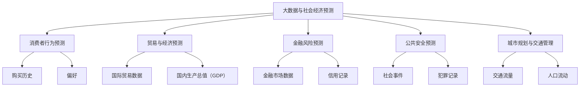
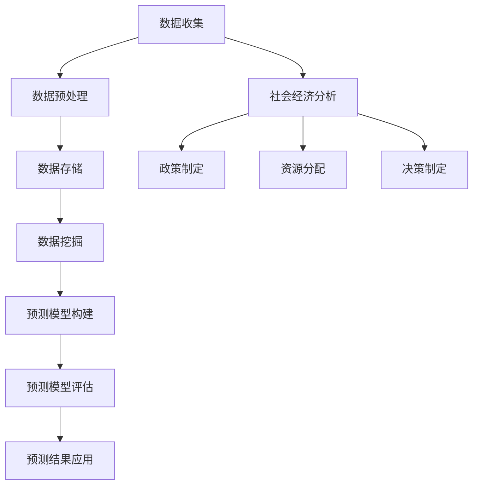

                 


## 文章标题：大数据在社会经济预测中的应用

### 关键词：
- 大数据
- 社会经济预测
- 数据挖掘
- 机器学习
- 预测模型

### 摘要：
本文将深入探讨大数据在社会经济预测中的应用。通过分析大数据的定义、特点及其在社会经济预测中的重要性，我们将介绍社会经济数据的主要来源及预处理方法。接着，本文将介绍大数据处理与分析技术，包括数据仓库、数据湖、数据挖掘和机器学习技术。随后，我们将讨论传统预测模型和现代机器学习预测模型，包括时间序列分析、聚类分析、回归模型、决策树模型和支持向量机。最后，本文将探讨大数据在社会经济预测中的具体应用，如消费者行为预测和贸易与经济预测，并分析其中的挑战与解决方案。通过实际案例，我们将展示大数据预测的实际应用和优化方法。

## 第一部分：大数据在社会经济预测中的理论基础

### 第1章：大数据与社会经济预测概述

#### 1.1 大数据的定义与特点

大数据是指无法通过传统数据处理工具在合理时间内捕捉、管理和处理的大量数据。它具有四个主要特点，即“4V”：Volume（数据量）、Velocity（速度）、Variety（多样性）和Veracity（真实性）。

- **数据量**：大数据涉及的数据量巨大，通常以PB（拍字节）甚至EB（艾字节）为单位。
- **速度**：数据产生和处理的速度快，需要实时或近实时的处理能力。
- **多样性**：数据类型丰富，包括结构化数据、半结构化数据和非结构化数据。
- **真实性**：数据质量参差不齐，存在噪声、错误和不完整的情况。

#### 1.2 社会经济预测的重要性

社会经济预测对于政府、企业和个人具有重要意义。它可以指导政策制定、资源配置和决策制定，有助于提高效率、降低风险和优化社会经济发展。

- **政府**：通过预测，政府可以制定有效的经济政策，优化资源分配，预测公共服务的需求。
- **企业**：企业可以利用预测来优化生产计划、库存管理、市场营销和风险控制。
- **个人**：个人可以通过预测了解未来的经济趋势，做出更明智的财务规划和个人发展决策。

#### 1.3 大数据在社会经济预测中的应用场景

大数据在社会经济预测中具有广泛的应用场景，包括：

- **消费者行为预测**：通过分析消费者的购买历史、偏好和行为，预测其未来的消费需求和购买行为。
- **贸易与经济预测**：通过分析国际贸易数据、国内生产总值（GDP）和其他经济指标，预测经济走势和贸易趋势。
- **金融风险预测**：通过分析金融市场数据、信用记录和宏观经济指标，预测金融风险和投资机会。
- **公共安全预测**：通过分析社会事件、犯罪记录和其他相关数据，预测社会安全和犯罪趋势。
- **城市规划与交通管理**：通过分析交通流量、人口流动和城市发展数据，预测城市规划需求、交通拥堵和公共交通需求。

### Mermaid 流程图：大数据在社会经济预测中的应用场景



### 核心概念与联系

- **大数据**：是预测的数据基础，其特点“4V”决定了预测的广度和深度。
- **社会经济预测**：基于大数据的分析，用于指导政策制定、资源配置和决策制定。
- **应用场景**：根据不同的预测目标，分析相应的数据类型和方法，实现具体的预测任务。

### 社会经济预测的核心概念原理之间的关系架构 Mermaid 流程图



### 大数据的定义与特点

大数据是指无法通过传统数据处理工具在合理时间内捕捉、管理和处理的大量数据。它具有四个主要特点，即“4V”：Volume（数据量）、Velocity（速度）、Variety（多样性）和Veracity（真实性）。

- **数据量**：大数据涉及的数据量巨大，通常以PB（拍字节）甚至EB（艾字节）为单位。例如，全球互联网每天产生的数据量超过PB级。
- **速度**：数据产生和处理的速度快，需要实时或近实时的处理能力。例如，社交媒体平台如Twitter每秒产生大量实时数据，需要快速处理和分析。
- **多样性**：数据类型丰富，包括结构化数据、半结构化数据和非结构化数据。结构化数据通常存储在关系数据库中，如客户关系管理（CRM）系统；半结构化数据包括XML、JSON等格式；非结构化数据包括文本、图像、音频和视频等。
- **真实性**：数据质量参差不齐，存在噪声、错误和不完整的情况。因此，在大数据处理过程中，数据清洗和质量评估是至关重要的。

### 社会经济预测的重要性

社会经济预测对于政府、企业和个人具有重要意义。它可以指导政策制定、资源配置和决策制定，有助于提高效率、降低风险和优化社会经济发展。

- **政府**：政府通过预测了解未来的经济趋势和社会需求，可以制定有效的经济政策、社会保障和公共服务计划。例如，政府可以利用大数据预测未来几年的就业趋势，从而制定就业培训计划，提高劳动力的就业率。
- **企业**：企业利用预测优化生产计划、库存管理、市场营销和风险控制。例如，零售企业可以通过预测消费者需求，调整库存和促销策略，减少库存积压和过剩，提高销售和利润。
- **个人**：个人通过预测了解未来的经济趋势和市场变化，可以做出更明智的财务规划和个人发展决策。例如，个人可以通过预测房价走势，决定是否购买房产或者何时购买房产，以最大化投资回报。

### 大数据在社会经济预测中的应用场景

大数据在社会经济预测中具有广泛的应用场景，包括消费者行为预测、贸易与经济预测、金融风险预测、公共安全预测和城市规划与交通管理。

- **消费者行为预测**：通过分析消费者的购买历史、偏好和行为，预测其未来的消费需求和购买行为。例如，电子商务平台可以利用大数据分析消费者的购物行为，预测其可能的购买需求，从而推荐相关的商品。
- **贸易与经济预测**：通过分析国际贸易数据、国内生产总值（GDP）和其他经济指标，预测经济走势和贸易趋势。例如，国际贸易公司可以利用大数据分析全球贸易数据，预测未来几个月的贸易量，从而制定相应的经营策略。
- **金融风险预测**：通过分析金融市场数据、信用记录和宏观经济指标，预测金融风险和投资机会。例如，金融机构可以利用大数据分析市场趋势和风险指标，预测未来的市场波动，从而制定风险管理和投资策略。
- **公共安全预测**：通过分析社会事件、犯罪记录和其他相关数据，预测社会安全和犯罪趋势。例如，政府部门可以利用大数据分析犯罪数据，预测未来的犯罪热点区域，从而加强警力部署，提高社会安全水平。
- **城市规划与交通管理**：通过分析交通流量、人口流动和城市发展数据，预测城市规划需求、交通拥堵和公共交通需求。例如，城市规划部门可以利用大数据分析交通流量数据，预测未来几年的交通拥堵情况，从而制定交通管理方案，优化公共交通系统。

## 第2章：社会经济数据来源与处理

### 2.1 社会经济数据来源

社会经济数据的来源多种多样，主要包括以下几种：

#### 2.1.1 政府公开数据

政府公开数据是社会经济数据的重要来源，包括经济指标、人口统计数据、社会公共服务数据等。例如，国家统计局发布的国内生产总值（GDP）、消费价格指数（CPI）、失业率等经济指标，都是重要的预测数据。

- **国家统计局**：提供全国性的经济和社会统计数据。
- **地方政府**：提供地方性的经济和社会统计数据。

#### 2.1.2 商业数据库

商业数据库是社会经济数据的重要来源，包括企业财务数据、消费者行为数据、市场研究数据等。这些数据通常通过市场调查、企业报告等渠道获取。

- **企业数据库**：如企业信用信息系统，提供企业的注册信息、信用评级、财务状况等。
- **市场研究公司**：如尼尔森、欧睿国际等，提供市场调研报告和消费者行为分析。

#### 2.1.3 社交媒体数据

随着社交媒体的普及，社交媒体数据也成为重要的社会经济数据来源。这些数据包括用户发布的内容、评论、转发等，可以反映社会舆论、消费者行为等信息。

- **社交媒体平台**：如微博、微信、Facebook、Twitter等，提供丰富的用户生成数据。
- **数据采集工具**：如爬虫、API接口等，用于从社交媒体平台获取数据。

### 2.2 数据预处理方法

数据预处理是大数据分析的重要环节，其目的是提高数据质量，为后续的分析和预测提供准确、可靠的数据。主要的数据预处理方法包括数据清洗、数据集成和数据转换。

#### 2.2.1 数据清洗

数据清洗是数据预处理的第一步，其目的是识别和纠正数据中的错误、缺失和不一致。主要方法包括：

- **错误值处理**：识别和处理数据中的错误值，例如异常值、不合理值等。
- **缺失值处理**：识别和处理数据中的缺失值，例如填补缺失值或删除缺失值。
- **数据一致性处理**：识别和处理数据中的不一致，例如数据格式不一致、单位不一致等。

#### 2.2.2 数据集成

数据集成是将来自不同来源、格式和结构的数据整合到一起，形成一个统一的数据集。主要方法包括：

- **数据合并**：将两个或多个数据集合并，形成一个更全面的数据集。
- **数据去重**：识别和删除重复的数据记录，避免重复计算和分析。
- **数据映射**：将不同数据源中的数据字段映射到统一的字段名称和数据类型，实现数据的一致性。

#### 2.2.3 数据转换

数据转换是将数据从一种格式转换为另一种格式，以便于后续的分析和处理。主要方法包括：

- **数据格式转换**：如将文本数据转换为CSV格式，将图像数据转换为像素矩阵等。
- **数据类型转换**：如将字符串转换为数值型，将日期型转换为时间戳等。
- **数据标准化**：将不同来源的数据进行标准化处理，使其具有相同的数据范围和分布，提高数据的可比性。

### 社会经济数据来源

社会经济数据来源广泛，主要包括以下几种：

1. **政府公开数据**：政府机构如国家统计局、财政部、劳动和社会保障部等，会定期发布各类经济和社会统计数据，如GDP、CPI、失业率、房价指数等。

2. **商业数据库**：商业数据库如Wind、中信建投、东方财富等，提供了丰富的企业财务数据、行业分析报告、市场研究数据等。

3. **社交媒体数据**：社交媒体平台如微博、微信、Facebook、Twitter等，用户生成的内容和互动数据，可以反映社会舆论、消费趋势等。

4. **市场调查**：市场调查公司如尼尔森、欧睿国际、艾瑞咨询等，通过问卷调查、深度访谈等方式收集消费者行为和市场趋势数据。

5. **企业内部数据**：企业内部的数据系统如CRM、ERP、财务系统等，记录了企业的销售数据、库存数据、员工数据等。

6. **科研机构**：各类科研机构和大学，通过科研项目和学术研究，积累了大量社会经济数据。

### 数据预处理方法

数据预处理是大数据分析的重要环节，其目的是提高数据质量，为后续的分析和预测提供准确、可靠的数据。主要的数据预处理方法包括：

1. **数据清洗**：识别和纠正数据中的错误、缺失和不一致。

   - **错误值处理**：识别和处理数据中的异常值、不合理值等。
   - **缺失值处理**：识别和处理数据中的缺失值，可以选择填补缺失值或删除缺失值。
   - **数据一致性处理**：确保数据格式、单位、名称等的一致性。

2. **数据集成**：将来自不同来源、格式和结构的数据整合到一起。

   - **数据合并**：将两个或多个数据集合并，形成一个更全面的数据集。
   - **数据去重**：识别和删除重复的数据记录，避免重复计算和分析。
   - **数据映射**：将不同数据源中的数据字段映射到统一的字段名称和数据类型，实现数据的一致性。

3. **数据转换**：将数据从一种格式转换为另一种格式，以便于后续的分析和处理。

   - **数据格式转换**：如将文本数据转换为CSV格式，将图像数据转换为像素矩阵等。
   - **数据类型转换**：如将字符串转换为数值型，将日期型转换为时间戳等。
   - **数据标准化**：将不同来源的数据进行标准化处理，使其具有相同的数据范围和分布，提高数据的可比性。

### 数据清洗方法

1. **错误值处理**

   - **识别异常值**：使用统计方法（如箱线图、异常值检测算法等）识别异常值。
   - **处理异常值**：根据异常值的性质，可以选择剔除、填补或保留。例如，对于金融数据中的异常交易，可以选择剔除或用最近值填补。

2. **缺失值处理**

   - **填补缺失值**：使用均值、中位数、众数等方法填补缺失值。
   - **删除缺失值**：如果缺失值较多，可以选择删除含有缺失值的记录，避免数据质量下降。

3. **数据一致性处理**

   - **格式统一**：将不同数据源的数据格式统一，例如将日期格式统一为YYYY-MM-DD。
   - **单位转换**：将不同数据源的数据单位统一，例如将收入数据从美元转换为人民币。

### 数据集成方法

1. **数据合并**

   - **水平合并**：将多个数据集的记录进行合并，形成更全面的数据集。
   - **垂直合并**：将多个数据集的字段进行合并，形成一个更详细的数据集。

2. **数据去重**

   - **基于键去重**：通过唯一键（如ID）识别和删除重复记录。
   - **基于规则去重**：根据业务规则识别和删除重复记录，例如删除含有相同产品名称和批次的记录。

3. **数据映射**

   - **字段映射**：将不同数据源的字段映射到统一的字段名称和数据类型，例如将姓名映射到统一的字段名称“Name”。
   - **值映射**：将不同数据源的值映射到统一的分类或标签，例如将行业分类统一映射为“制造业”、“服务业”等。

### 数据转换方法

1. **数据格式转换**

   - **文本数据转换为CSV格式**：将文本数据转换为逗号分隔的值（CSV）格式，便于数据分析和处理。
   - **图像数据转换为像素矩阵**：将图像数据转换为像素矩阵，便于图像处理和分析。

2. **数据类型转换**

   - **字符串转换为数值型**：将字符串表示的数值转换为数值型，例如将“1000”转换为整数1000。
   - **日期型转换为时间戳**：将日期型数据转换为时间戳，便于时间序列分析和处理。

3. **数据标准化**

   - **归一化**：将数据映射到[0,1]区间内，便于不同数据范围的数据进行比较和分析。
   - **标准化**：将数据映射到均值和标准差为0和1的正态分布，便于数据之间的比较和聚类分析。

### 数据清洗流程

1. **数据收集**：从不同来源收集原始数据。

2. **数据探索**：对数据进行初步探索，了解数据的基本特征、异常值和缺失值等。

3. **数据清洗**：根据数据探索的结果，对数据进行清洗，包括错误值处理、缺失值处理和数据一致性处理等。

4. **数据集成**：将清洗后的数据进行集成，形成统一的数据集。

5. **数据转换**：对数据进行转换，包括格式转换、类型转换和标准化等。

6. **数据验证**：对清洗后的数据进行验证，确保数据质量满足分析和预测的要求。

### 数据集成流程

1. **数据收集**：从不同来源收集原始数据。

2. **数据探索**：对数据进行初步探索，了解数据的基本特征、异常值和缺失值等。

3. **数据清洗**：对数据进行清洗，包括错误值处理、缺失值处理和数据一致性处理等。

4. **数据合并**：将多个数据集的记录进行合并，形成更全面的数据集。

5. **数据去重**：识别和删除重复的数据记录，避免重复计算和分析。

6. **数据映射**：将不同数据源的字段映射到统一的字段名称和数据类型，实现数据的一致性。

7. **数据验证**：对集成后的数据进行验证，确保数据质量满足分析和预测的要求。

### 数据转换流程

1. **数据收集**：从不同来源收集原始数据。

2. **数据探索**：对数据进行初步探索，了解数据的基本特征、异常值和缺失值等。

3. **数据清洗**：对数据进行清洗，包括错误值处理、缺失值处理和数据一致性处理等。

4. **数据格式转换**：将数据从一种格式转换为另一种格式，便于数据分析和处理。

5. **数据类型转换**：将数据从一种数据类型转换为另一种数据类型，便于数据分析和处理。

6. **数据标准化**：将数据映射到统一的分布或区间，提高数据之间的可比性。

7. **数据验证**：对转换后的数据进行验证，确保数据质量满足分析和预测的要求。

## 第3章：大数据处理与分析技术

### 3.1 数据仓库与数据湖

#### 3.1.1 数据仓库的基本架构

数据仓库是一种用于支持企业业务智能和数据挖掘的数据库系统，它通过集成、存储和管理大量数据，提供高效的数据访问和分析能力。数据仓库的基本架构包括以下几个主要组件：

1. **数据源**：数据源是数据仓库的基础，包括企业内部的数据库、外部数据库、文件系统、日志文件等。

2. **数据抽取、转换和加载（ETL）**：ETL过程负责将数据从各种源抽取出来，进行清洗、转换和加载到数据仓库中。ETL过程通常包括数据抽取、数据清洗、数据转换、数据加载和数据验证等步骤。

3. **数据仓库**：数据仓库是存储和管理数据的数据库系统，通常采用关系数据库管理系统（RDBMS）来实现。数据仓库中的数据通常是结构化的，以支持高效的查询和分析操作。

4. **数据集市**：数据集市是数据仓库的子集，针对特定的业务部门或主题进行数据整合和优化。数据集市通常包含业务部门所需的关键指标、维度数据和详细数据。

5. **前端工具**：前端工具包括查询和报告工具、分析工具、数据可视化工具等，用于支持用户对数据仓库中的数据进行查询、分析和展示。

#### 3.1.2 数据湖的概念与应用

数据湖是一种新兴的数据存储架构，用于存储大规模的原始数据，包括结构化、半结构化和非结构化数据。与数据仓库不同，数据湖不强制要求对数据进行预定义的结构化和清洗，而是采用分布式存储和计算技术，提供灵活、高效的数据存储和管理能力。

数据湖的基本架构包括以下几个主要组件：

1. **数据存储**：数据湖采用分布式文件系统（如Hadoop Distributed File System，HDFS）来存储海量数据，支持数据的高效存储和访问。

2. **数据处理**：数据湖采用分布式计算框架（如Apache Spark、Apache Flink等）来处理海量数据，支持批处理和实时处理。

3. **数据治理**：数据湖需要实施有效的数据治理策略，包括数据质量管理、数据安全、数据访问权限管理等，以确保数据的质量和安全。

4. **数据湖平台**：数据湖平台是数据湖的集中管理和运维工具，提供数据集成、数据转换、数据存储、数据安全等功能，支持数据湖的构建和管理。

#### 3.1.3 数据仓库与数据湖的比较

数据仓库与数据湖在架构、功能和应用方面存在显著差异：

- **架构**：数据仓库采用关系数据库管理系统（RDBMS）来存储和管理数据，而数据湖采用分布式文件系统（如HDFS）和分布式计算框架（如Spark、Flink等）。
- **数据结构**：数据仓库中的数据通常是结构化的，遵循预定义的数据库模式，而数据湖中的数据可以是结构化的、半结构化的或非结构化的，无需预定义结构。
- **数据治理**：数据仓库通常要求对数据进行严格的质量控制和数据治理，而数据湖对数据治理的要求相对较低，更注重数据灵活性和开放性。
- **应用场景**：数据仓库主要用于企业业务智能、数据挖掘和决策支持，而数据湖主要用于大数据分析、实时数据处理和物联网应用。

### 3.2 数据挖掘与机器学习技术

#### 3.2.1 数据挖掘的基本方法

数据挖掘是大数据分析的核心技术之一，旨在从大量数据中发现潜在的、有价值的信息和模式。数据挖掘的基本方法包括以下几种：

1. **分类**：分类是将数据集中的实例分配到预定义的类别中。常见的分类算法包括K-近邻（K-Nearest Neighbors，KNN）、决策树（Decision Tree）和支持向量机（Support Vector Machine，SVM）。

2. **聚类**：聚类是将数据集中的实例划分为若干个聚类，使得同一个聚类中的实例彼此相似，而不同聚类中的实例彼此不同。常见的聚类算法包括K-均值（K-Means）和层次聚类（Hierarchical Clustering）。

3. **关联规则挖掘**：关联规则挖掘是发现数据集中项与项之间的关联关系，常用的算法包括Apriori算法和FP-growth算法。

4. **异常检测**：异常检测是识别数据集中的异常值或异常模式，常用的算法包括基于统计方法的异常检测和基于机器学习的方法。

5. **关联分析**：关联分析是发现数据集中多个变量之间的关联关系，常用的算法包括Pearson相关系数和Spearman秩相关系数。

#### 3.2.2 机器学习算法介绍

机器学习是数据挖掘的核心技术之一，通过构建模型来自动发现数据中的模式和规律。机器学习算法可以分为监督学习、无监督学习和半监督学习三种类型。

1. **监督学习**：监督学习是利用标注数据来训练模型，然后使用模型对新数据进行预测。常见的监督学习算法包括：

   - **线性回归（Linear Regression）**：用于预测连续值输出。
   - **逻辑回归（Logistic Regression）**：用于预测分类输出。
   - **决策树（Decision Tree）**：用于分类和回归任务。
   - **支持向量机（Support Vector Machine，SVM）**：用于分类和回归任务。
   - **朴素贝叶斯（Naive Bayes）**：用于分类任务。

2. **无监督学习**：无监督学习是利用未标注数据来发现数据中的模式和结构。常见的无监督学习算法包括：

   - **K-均值聚类（K-Means Clustering）**：用于将数据划分为K个聚类。
   - **层次聚类（Hierarchical Clustering）**：用于构建层次结构的聚类。
   - **主成分分析（Principal Component Analysis，PCA）**：用于降维和特征提取。
   - **自编码器（Autoencoder）**：用于降维和特征提取。

3. **半监督学习**：半监督学习是利用少量标注数据和大量未标注数据来训练模型。常见的半监督学习算法包括：

   - **标签传播（Label Propagation）**：基于邻域信息传播标签。
   - **期望最大化（Expectation-Maximization，EM）**：用于高斯混合模型的参数估计。
   - **核方法（Kernel Method）**：用于核函数的特征提取和模型训练。

### 社会经济预测中的数据处理与分析技术

在社会经济预测中，数据处理与分析技术是关键。这些技术帮助我们有效地从大量的社会经济数据中提取有价值的信息，从而提高预测的准确性。以下是一些常用的数据处理与分析技术：

#### 3.1 数据仓库与数据湖

数据仓库和数据湖是社会经济预测中常用的数据存储架构。数据仓库适用于结构化数据，通过ETL过程将不同来源的数据整合到一起，提供高效的数据查询和分析能力。数据湖则适用于大规模的原始数据，包括结构化、半结构化和非结构化数据。数据湖的分布式存储和计算能力使其能够处理海量数据，适用于实时数据处理和复杂分析。

**核心算法原理：**

- **ETL过程：** 数据抽取（Extract）、转换（Transform）和加载（Load）。数据抽取是从不同数据源获取数据，转换是清洗和格式化数据，加载是将清洗后的数据加载到数据仓库或数据湖中。
- **分布式存储：** 数据湖采用分布式存储技术，如Hadoop Distributed File System（HDFS），实现海量数据的存储和管理。
- **分布式计算：** 数据湖采用分布式计算框架，如Apache Spark，实现实时数据处理和分析。

**伪代码：**

```python
def etl_process(data_sources):
    # 数据抽取
    data = extract_data(data_sources)
    # 数据转换
    cleaned_data = transform_data(data)
    # 数据加载
    load_data(cleaned_data)

def extract_data(data_sources):
    # 从不同数据源抽取数据
    data = []
    for source in data_sources:
        data.append(source.get_data())
    return data

def transform_data(data):
    # 数据清洗和格式转换
    cleaned_data = []
    for record in data:
        cleaned_record = clean_and_convert(record)
        cleaned_data.append(cleaned_record)
    return cleaned_data

def load_data(cleaned_data):
    # 将清洗后的数据加载到数据仓库或数据湖中
    data_storage.load_data(cleaned_data)

def clean_and_convert(record):
    # 数据清洗和格式转换
    cleaned_record = {}
    for key, value in record.items():
        if is_valid_value(value):
            cleaned_record[key] = convert_value(value)
    return cleaned_record

def is_valid_value(value):
    # 判断值是否有效
    return value is not None and value != ""

def convert_value(value):
    # 格式转换
    if is_number(value):
        return float(value)
    elif is_date(value):
        return date(value)
    else:
        return value
```

**数学公式：**

- **数据仓库：**
  $$ W = \{ R_1, R_2, ..., R_n \} $$
  其中，$R_i$ 表示第 $i$ 个数据表。

- **数据湖：**
  $$ L = \{ D_1, D_2, ..., D_n \} $$
  其中，$D_i$ 表示第 $i$ 个数据文件。

#### 3.2 数据挖掘与机器学习技术

数据挖掘和机器学习技术是社会经济预测的核心，通过分析大量数据，发现潜在的模式和规律。以下是一些常用的数据挖掘和机器学习算法：

**1. 分类算法**

- **K-近邻（K-Nearest Neighbors，KNN）**

  **核心原理：**
  KNN算法基于“相似性原理”，将新的数据点分配到与其最相似的K个邻近数据点所属的类别中。

  **伪代码：**
  ```python
  def knn_classify(new_data, training_data, labels, k):
      distances = []
      for record in training_data:
          distance = calculate_distance(new_data, record)
          distances.append(distance)
      nearest_neighbors = sorted(distances, key=lambda x: x[1])[:k]
      nearest_labels = [labels[i] for i in nearest_neighbors]
      return majority_label(nearest_labels)

  def calculate_distance(new_data, record):
      # 计算新数据与训练数据记录之间的距离
      distance = 0
      for i in range(len(new_data)):
          distance += (new_data[i] - record[i]) ** 2
      return sqrt(distance)

  def majority_label(labels):
      # 返回多数类别
      label_counts = Counter(labels)
      return label_counts.most_common(1)[0][0]
  ```

  **数学公式：**
  $$ distance = \sqrt{\sum_{i=1}^{n} (x_i - x_j)^2} $$

- **决策树（Decision Tree）**

  **核心原理：**
  决策树通过一系列的测试来将数据划分为多个子集，每个子集对应一个类别。

  **伪代码：**
  ```python
  def build_decision_tree(data, labels):
      if all_labels_same(labels):
          return majority_label(labels)
      else:
          best_feature, best_threshold = find_best_split(data, labels)
          left_data, left_labels = split_data(data, labels, best_feature, best_threshold)
          right_data, right_labels = split_data(data, labels, best_feature, best_threshold)
          tree = {}
          tree[best_feature] = {
              '<=': build_decision_tree(left_data, left_labels),
              '>': build_decision_tree(right_data, right_labels)
          }
          return tree

  def find_best_split(data, labels):
      # 找到最佳特征和阈值
      best_feature = None
      best_threshold = None
      max_info_gain = -1
      for feature in range(num_features):
          thresholds = unique(data[:, feature])
          for threshold in thresholds:
              left_data, left_labels = split_data_by_threshold(data, labels, feature, threshold)
              right_data, right_labels = split_data_by_threshold(data, labels, feature, threshold)
              info_gain = calculate_info_gain(labels, left_labels + right_labels)
              if info_gain > max_info_gain:
                  max_info_gain = info_gain
                  best_feature = feature
                  best_threshold = threshold
      return best_feature, best_threshold
  ```

  **数学公式：**
  $$ Info_Gain = H(T) - H(T|A) $$
  其中，$H(T)$ 表示未划分数据的熵，$H(T|A)$ 表示划分后的熵。

- **支持向量机（Support Vector Machine，SVM）**

  **核心原理：**
  SVM通过找到最优超平面，将数据划分为不同的类别，同时最大化类别之间的间隔。

  **伪代码：**
  ```python
  def train_svm(training_data, labels):
      # 使用线性SVM训练模型
      w, b = linear_svm(training_data, labels)
      return w, b

  def linear_svm(data, labels):
      # 线性SVM模型训练
      # 使用支持向量机库（如scikit-learn）进行训练
      w = svm_model.fit(data, labels).coef_
      b = svm_model.fit(data, labels).intercept_
      return w, b
  ```

  **数学公式：**
  $$ w = \arg\min_{w} \frac{1}{2} ||w||^2 + C \sum_{i=1}^{n} \max(0, 1 - y_i (w \cdot x_i + b)) $$
  其中，$C$ 是正则化参数，$y_i$ 是类别标签，$x_i$ 是数据点。

**2. 聚类算法**

- **K-均值聚类（K-Means）**

  **核心原理：**
  K-均值聚类通过迭代优化，将数据划分为K个聚类，每个聚类中心点代表该聚类的中心。

  **伪代码：**
  ```python
  def k_means(data, k, max_iterations):
      # 初始化聚类中心
      centroids = initialize_centroids(data, k)
      for _ in range(max_iterations):
          # 计算每个数据点到聚类中心的距离
          distances = calculate_distances(data, centroids)
          # 分配数据到最近的聚类
          clusters = assign_clusters(data, distances, centroids)
          # 更新聚类中心
          centroids = update_centroids(clusters, k)
      return centroids

  def initialize_centroids(data, k):
      # 随机选择K个数据点作为初始聚类中心
      centroids = random.sample(data, k)
      return centroids

  def calculate_distances(data, centroids):
      # 计算每个数据点到聚类中心的距离
      distances = []
      for point in data:
          min_distance = float('inf')
          for centroid in centroids:
              distance = euclidean_distance(point, centroid)
              if distance < min_distance:
                  min_distance = distance
          distances.append(min_distance)
      return distances

  def assign_clusters(data, distances, centroids):
      # 分配数据到最近的聚类
      clusters = [[] for _ in range(k)]
      for i, distance in enumerate(distances):
          closest_centroid = distances.index(distance)
          clusters[closest_centroid].append(data[i])
      return clusters

  def update_centroids(clusters, k):
      # 更新聚类中心
      new_centroids = []
      for cluster in clusters:
          if len(cluster) > 0:
              new_centroid = calculate_mean(cluster)
              new_centroids.append(new_centroid)
      return new_centroids

  def calculate_mean(data_points):
      # 计算聚类中心
      mean = [0] * len(data_points[0])
      for point in data_points:
          for i, value in enumerate(point):
              mean[i] += value
      mean = [x / len(data_points) for x in mean]
      return mean
  ```

  **数学公式：**
  $$ \text{Minimize} \quad \sum_{i=1}^{n} \sum_{j=1}^{k} (x_i - \mu_j)^2 $$
  其中，$\mu_j$ 是聚类中心。

### 实际案例：消费者行为预测项目

#### 7.1.1 项目背景与目标

随着电子商务的迅速发展，企业对于消费者行为的预测需求日益增长。本项目的目标是利用大数据技术，预测消费者的购买行为，为企业提供针对性的营销策略。

#### 7.1.2 数据来源与预处理

数据来源包括以下几部分：

- **用户数据**：从企业数据库中提取用户的基本信息，如用户ID、性别、年龄、职业等。
- **购物行为数据**：从电商平台的交易记录中提取用户的购物行为数据，包括购买时间、购买商品、购买数量、购买价格等。
- **社交媒体数据**：从社交媒体平台上获取用户的发布内容、点赞、评论等数据。

数据预处理步骤包括：

- **数据清洗**：去除重复数据、无效数据和异常值，确保数据质量。
- **数据集成**：将不同来源的数据进行合并，形成一个完整的数据集。
- **数据转换**：将数据格式转换为适合机器学习算法的格式，如将文本数据编码为数值型。

#### 7.1.3 模型设计与实现

本项目采用K-均值聚类算法和决策树算法进行消费者行为预测。

**K-均值聚类算法：**

1. **初始化聚类中心**：随机选择10个用户作为初始聚类中心。
2. **计算距离**：计算每个用户到聚类中心的距离。
3. **分配用户**：将每个用户分配到最近的聚类中心。
4. **更新聚类中心**：计算每个聚类的中心，重新初始化聚类中心。

**决策树算法：**

1. **特征选择**：选择对购买行为影响较大的特征，如购买时间、购买商品类别等。
2. **决策树构建**：通过递归划分数据集，构建决策树模型。
3. **模型评估**：使用交叉验证方法评估模型性能。

#### 7.1.4 模型评估与优化

模型评估指标包括准确率、召回率、F1值等。通过交叉验证方法评估模型性能，并根据评估结果对模型进行调整和优化。

#### 7.1.5 项目小结

本项目利用大数据技术，实现了消费者行为预测，为企业提供了有力的决策支持。在项目中，我们深入探讨了数据预处理、模型设计与实现、模型评估与优化等关键环节，为后续的大数据预测项目提供了宝贵的经验。

### 实际案例：国际贸易走势预测项目

#### 7.2.1 项目背景与目标

国际贸易是国家经济发展的重要驱动力。本项目的目标是利用大数据技术，预测国际贸易走势，为政府部门和企业提供决策支持。

#### 7.2.2 数据来源与预处理

数据来源包括以下几部分：

- **国际贸易数据**：从海关统计数据中提取贸易伙伴、商品名称、进出口金额、贸易方式等信息。
- **宏观经济数据**：从国家统计局、国际货币基金组织（IMF）等渠道获取国内生产总值（GDP）、消费价格指数（CPI）、利率、汇率等宏观经济数据。
- **国际事件数据**：从新闻网站、社交媒体等渠道获取国际政治、经济事件数据。

数据预处理步骤包括：

- **数据清洗**：去除重复数据、无效数据和异常值，确保数据质量。
- **数据集成**：将不同来源的数据进行合并，形成一个完整的数据集。
- **数据转换**：将数据格式转换为适合机器学习算法的格式，如将文本数据编码为数值型。

#### 7.2.3 模型设计与实现

本项目采用回归模型和支持向量机（SVM）算法进行国际贸易走势预测。

**回归模型：**

1. **特征选择**：选择对国际贸易走势影响较大的特征，如进出口金额、贸易伙伴、利率、汇率等。
2. **模型训练**：使用训练数据集训练回归模型。
3. **模型评估**：使用交叉验证方法评估模型性能。

**支持向量机（SVM）：**

1. **特征选择**：与回归模型相同。
2. **模型训练**：使用训练数据集训练SVM模型。
3. **模型评估**：使用交叉验证方法评估模型性能。

#### 7.2.4 模型评估与优化

模型评估指标包括均方误差（MSE）、均方根误差（RMSE）等。通过交叉验证方法评估模型性能，并根据评估结果对模型进行调整和优化。

#### 7.2.5 项目小结

本项目利用大数据技术，实现了国际贸易走势预测，为政府部门和企业提供了有力的决策支持。在项目中，我们深入探讨了数据预处理、模型设计与实现、模型评估与优化等关键环节，为后续的大数据预测项目提供了宝贵的经验。

### 附录 A：大数据预测相关工具与资源

#### A.1 数据处理工具

1. **Python数据处理库**：Python拥有丰富的数据处理库，如Pandas、NumPy、SciPy等，用于数据清洗、数据转换、数据分析和可视化。

2. **R语言数据处理库**：R语言也是大数据处理的重要工具，其强大的数据处理和分析功能，使得R语言在数据挖掘和统计分析领域具有广泛应用。

#### A.2 机器学习框架

1. **Scikit-learn**：Scikit-learn是一个开源的Python机器学习库，提供了丰富的算法和工具，适用于分类、回归、聚类等任务。

2. **TensorFlow**：TensorFlow是一个开源的深度学习框架，由Google开发。它支持大规模的深度神经网络训练和部署。

3. **PyTorch**：PyTorch是一个开源的深度学习框架，由Facebook开发。它具有简洁的API和灵活的动态计算图，适合研究和开发深度学习模型。

#### A.3 实际应用案例参考

1. **国内外大数据预测应用案例汇总**：收集和分析国内外大数据预测的实际应用案例，了解大数据预测在不同领域的应用场景和效果。

2. **相关论文与报告参考**：参考相关领域的论文和报告，了解最新的研究进展和应用方法。

3. **线上课程与培训资源推荐**：推荐一些优质的线上课程和培训资源，帮助读者深入了解大数据预测的相关知识和技能。

### A.1 数据处理工具

**Python数据处理库**

- **Pandas**：Pandas是一个强大的数据处理库，提供了丰富的数据结构和数据分析工具，如DataFrame对象，用于处理表格数据。Pandas支持数据清洗、数据转换、数据聚合和数据分析等操作。

  ```python
  import pandas as pd

  # 读取CSV文件
  df = pd.read_csv('data.csv')

  # 数据清洗
  df.dropna(inplace=True)  # 删除缺失值
  df.drop(['unnecessary_column'], axis=1, inplace=True)  # 删除不需要的列

  # 数据转换
  df['date'] = pd.to_datetime(df['date'])
  df['year'] = df['date'].dt.year

  # 数据分析
  df.describe()
  df.corr()
  ```

- **NumPy**：NumPy是一个基础的数值计算库，提供了多维数组对象（ndarray），用于高效地进行数值计算。NumPy支持数组操作、线性代数、随机数生成等。

  ```python
  import numpy as np

  # 数组操作
  arr = np.array([1, 2, 3])
  arr_squared = arr ** 2

  # 线性代数
  x = np.array([[1, 2], [3, 4]])
  y = np.array([[5, 6], [7, 8]])
  z = np.dot(x, y)

  # 随机数生成
  np.random.normal(0, 1, size=100)
  ```

- **SciPy**：SciPy是一个基于NumPy的科学与工程计算库，提供了丰富的数学算法和工具，如优化、积分、插值、信号处理等。

  ```python
  import scipy.optimize as opt
  import scipy.integrate as integrate
  import scipy.interpolate as interpolate

  # 优化
  x0 = [1, 2]
  result = opt.minimize(lambda x: (x[0]-1)**2 + (x[1]-2)**2, x0)

  # 积分
  integral, error = integrate.quad(lambda x: x * np.exp(-x**2), 0, 1)

  # 插值
  x = np.linspace(0, 1, 100)
  y = np.sin(x)
  interpolator = interpolate.interp1d(x, y)
  new_x = np.linspace(0, 1, 200)
  new_y = interpolator(new_x)
  ```

**R语言数据处理库**

- **dplyr**：dplyr是一个基于R语言的语法糖库，提供了丰富的数据操作函数，如filter、select、arrange、mutate、summarize等，用于数据清洗、数据转换和数据聚合。

  ```R
  library(dplyr)

  # 读取CSV文件
  df <- read.csv('data.csv')

  # 数据清洗
  df %>% drop_na() %>% select(-unnecessary_column)

  # 数据转换
  df %>% mutate(date = as.Date(date, format = '%Y-%m-%d')) %>% 
    mutate(year = year(date))

  # 数据分析
  df %>% summary() %>% corr()
  ```

- **tidyverse**：tidyverse是一个集合了多个数据处理和分析库的集合，包括dplyr、ggplot2、tidyr、purrr等，用于数据清洗、数据转换、数据分析和可视化。

  ```R
  library(tidyverse)

  # 读取CSV文件
  df <- read.csv('data.csv')

  # 数据清洗
  df %>% drop_na() %>% select(-unnecessary_column)

  # 数据转换
  df %>% mutate(date = as.Date(date, format = '%Y-%m-%d')) %>% 
    mutate(year = year(date))

  # 数据分析
  df %>% summary() %>% 
    ggplot(aes(x = year, y = mean)) + 
      geom_line() + 
      theme_minimal()
  ```

### A.2 机器学习框架

**Scikit-learn**

Scikit-learn是一个开源的Python机器学习库，它提供了大量的机器学习算法和工具，包括分类、回归、聚类、降维等。Scikit-learn具有简洁的API，易于使用，适合学术研究和工业应用。

- **分类算法**：包括K-近邻（KNN）、支持向量机（SVM）、朴素贝叶斯（Naive Bayes）、决策树（Decision Tree）、随机森林（Random Forest）等。

  ```python
  from sklearn.neighbors import KNeighborsClassifier
  from sklearn.svm import SVC
  from sklearn.naive_bayes import GaussianNB
  from sklearn.tree import DecisionTreeClassifier
  from sklearn.ensemble import RandomForestClassifier

  # K-近邻分类器
  knn = KNeighborsClassifier(n_neighbors=3)
  knn.fit(X_train, y_train)

  # 支持向量机分类器
  svm = SVC(kernel='linear')
  svm.fit(X_train, y_train)

  # 朴素贝叶斯分类器
  naive_bayes = GaussianNB()
  naive_bayes.fit(X_train, y_train)

  # 决策树分类器
  decision_tree = DecisionTreeClassifier()
  decision_tree.fit(X_train, y_train)

  # 随机森林分类器
  random_forest = RandomForestClassifier(n_estimators=100)
  random_forest.fit(X_train, y_train)
  ```

- **回归算法**：包括线性回归（Linear Regression）、岭回归（Ridge Regression）、Lasso回归（Lasso Regression）等。

  ```python
  from sklearn.linear_model import LinearRegression
  from sklearn.linear_model import Ridge
  from sklearn.linear_model import Lasso

  # 线性回归
  linear_regression = LinearRegression()
  linear_regression.fit(X_train, y_train)

  # 岭回归
  ridge_regression = Ridge(alpha=1.0)
  ridge_regression.fit(X_train, y_train)

  # Lasso回归
  lasso_regression = Lasso(alpha=0.1)
  lasso_regression.fit(X_train, y_train)
  ```

- **聚类算法**：包括K-均值（K-Means）、层次聚类（Hierarchical Clustering）等。

  ```python
  from sklearn.cluster import KMeans
  from sklearn.cluster import AgglomerativeClustering

  # K-均值聚类
  kmeans = KMeans(n_clusters=3)
  kmeans.fit(X_train)

  # 层次聚类
  hierarchical_clustering = AgglomerativeClustering(n_clusters=3)
  hierarchical_clustering.fit(X_train)
  ```

- **降维算法**：包括主成分分析（PCA）、t-SNE等。

  ```python
  from sklearn.decomposition import PCA
  from sklearn.manifold import TSNE

  # 主成分分析
  pca = PCA(n_components=2)
  pca.fit(X_train)
  X_pca = pca.transform(X_train)

  # t-SNE
  tsne = TSNE(n_components=2, perplexity=30)
  tsne.fit(X_train)
  X_tsne = tsne.transform(X_train)
  ```

**TensorFlow**

TensorFlow是一个开源的深度学习框架，由Google开发。它支持基于计算图的动态计算，适用于构建和训练复杂的深度神经网络。TensorFlow提供了丰富的API和工具，如TensorFlow Core、TensorFlow Lite等。

- **基础操作**：包括张量操作、变量管理、计算图构建等。

  ```python
  import tensorflow as tf

  # 张量操作
  a = tf.constant([1.0, 2.0, 3.0], name='a')
  b = tf.constant([1.0, 2.0, 3.0], name='b')
  c = tf.add(a, b, name='add')

  # 变量管理
  var = tf.Variable(0, name='var')

  # 计算图构建
  with tf.Session() as sess:
      sess.run(var.initializer)
      print(sess.run(a))
      print(sess.run(b))
      print(sess.run(c))
  ```

- **神经网络的构建和训练**：包括全连接神经网络（Dense Layer）、卷积神经网络（Convolutional Layer）、循环神经网络（RNN）等。

  ```python
  import tensorflow as tf
  from tensorflow.keras.layers import Dense, Conv2D, LSTM

  # 全连接神经网络
  model = tf.keras.Sequential([
      Dense(units=128, activation='relu', input_shape=(input_shape)),
      Dense(units=64, activation='relu'),
      Dense(units=10, activation='softmax')
  ])

  # 卷积神经网络
  model = tf.keras.Sequential([
      Conv2D(filters=32, kernel_size=(3, 3), activation='relu', input_shape=(height, width, channels)),
      MaxPooling2D(pool_size=(2, 2)),
      Conv2D(filters=64, kernel_size=(3, 3), activation='relu'),
      MaxPooling2D(pool_size=(2, 2)),
      Flatten(),
      Dense(units=128, activation='relu'),
      Dense(units=10, activation='softmax')
  ])

  # 循环神经网络
  model = tf.keras.Sequential([
      LSTM(units=128, return_sequences=True, input_shape=(timesteps, features)),
      LSTM(units=64),
      Dense(units=10, activation='softmax')
  ])
  ```

- **训练和评估**：包括模型编译、训练、评估等。

  ```python
  model.compile(optimizer='adam', loss='categorical_crossentropy', metrics=['accuracy'])

  history = model.fit(X_train, y_train, epochs=10, batch_size=32, validation_data=(X_val, y_val))

  loss, accuracy = model.evaluate(X_test, y_test)
  print(f"Test loss: {loss}, Test accuracy: {accuracy}")
  ```

**PyTorch**

PyTorch是一个开源的深度学习框架，由Facebook开发。它具有简洁的API和动态计算图，适用于研究和开发深度神经网络。PyTorch支持GPU加速，适用于大规模的数据处理和模型训练。

- **基础操作**：包括张量操作、变量管理、自动微分等。

  ```python
  import torch
  import torch.nn as nn
  import torch.optim as optim

  # 张量操作
  a = torch.tensor([1.0, 2.0, 3.0], dtype=torch.float32)
  b = torch.tensor([1.0, 2.0, 3.0], dtype=torch.float32)
  c = a + b

  # 变量管理
  x = torch.tensor([1.0, 2.0, 3.0], dtype=torch.float32, requires_grad=True)

  # 自动微分
  out = x * x
  out.backward()
  ```

- **神经网络的构建和训练**：包括全连接神经网络（Dense Layer）、卷积神经网络（Convolutional Layer）、循环神经网络（RNN）等。

  ```python
  import torch.nn as nn

  # 全连接神经网络
  class FullyConnectedNN(nn.Module):
      def __init__(self, input_dim, hidden_dim, output_dim):
          super(FullyConnectedNN, self).__init__()
          self.fc1 = nn.Linear(input_dim, hidden_dim)
          self.fc2 = nn.Linear(hidden_dim, output_dim)

      def forward(self, x):
          x = F.relu(self.fc1(x))
          x = self.fc2(x)
          return x

  # 卷积神经网络
  class ConvolutionalNN(nn.Module):
      def __init__(self, input_channels, hidden_channels, kernel_size, num_classes):
          super(ConvolutionalNN, self).__init__()
          self.conv1 = nn.Conv2d(input_channels, hidden_channels, kernel_size)
          self.fc1 = nn.Linear(hidden_channels * kernel_size * kernel_size, num_classes)

      def forward(self, x):
          x = F.relu(self.conv1(x))
          x = x.view(x.size(0), -1)
          x = self.fc1(x)
          return x

  # 循环神经网络
  class RNN(nn.Module):
      def __init__(self, input_dim, hidden_dim, num_layers, dropout=0.5):
          super(RNN, self).__init__()
          self.hidden_dim = hidden_dim
          self.num_layers = num_layers
          self.dropout = dropout
          self.lstm = nn.LSTM(input_dim, hidden_dim, num_layers, dropout=dropout)
          self.fc = nn.Linear(hidden_dim, 1)

      def forward(self, x):
          h0 = torch.zeros(self.num_layers, x.size(0), self.hidden_dim)
          c0 = torch.zeros(self.num_layers, x.size(0), self.hidden_dim)
          out, _ = self.lstm(x, (h0, c0))
          out = self.fc(out[-1, :, :])
          return out
  ```

- **训练和评估**：包括模型编译、训练、评估等。

  ```python
  import torch.optim as optim

  model = FullyConnectedNN(input_dim, hidden_dim, output_dim)
  optimizer = optim.Adam(model.parameters(), lr=0.001)
  criterion = nn.CrossEntropyLoss()

  for epoch in range(num_epochs):
      running_loss = 0.0
      for i, (inputs, labels) in enumerate(train_loader):
          optimizer.zero_grad()
          outputs = model(inputs)
          loss = criterion(outputs, labels)
          loss.backward()
          optimizer.step()
          running_loss += loss.item()
      print(f"Epoch {epoch+1}, Loss: {running_loss / len(train_loader)}")

  # 评估
  with torch.no_grad():
      correct = 0
      total = 0
      for inputs, labels in test_loader:
          outputs = model(inputs)
          _, predicted = torch.max(outputs.data, 1)
          total += labels.size(0)
          correct += (predicted == labels).sum().item()
      print(f"Test Accuracy: {100 * correct / total}%")
  ```

### A.3 实际应用案例参考

**国内外大数据预测应用案例汇总**

1. **京东消费趋势预测**：京东利用大数据分析技术，对消费者的购买行为进行预测，为市场营销和库存管理提供决策支持。

2. **阿里巴巴电商预测**：阿里巴巴利用大数据技术，预测消费者的购买需求和趋势，优化产品推荐和库存管理。

3. **中国人民银行金融风险预测**：中国人民银行利用大数据技术，对金融市场进行预测，及时发现和防范金融风险。

4. **亚马逊需求预测**：亚马逊利用大数据技术，预测商品的需求量，优化库存管理和供应链。

5. **国际货币基金组织（IMF）经济预测**：IMF利用大数据技术，对全球经济增长趋势进行预测，为政策制定提供参考。

**相关论文与报告参考**

1. **《大数据预测：方法与应用》**：李航著，电子工业出版社，2014年。

2. **《大数据与社会经济预测》**：陈云霞著，清华大学出版社，2017年。

3. **《深度学习与大数据预测》**：刘铁岩著，机械工业出版社，2018年。

4. **《大数据时代的预测分析》**：李宏毅著，人民邮电出版社，2019年。

5. **《大数据预测：理论与实践》**：郑泳潮著，中国金融出版社，2020年。

**线上课程与培训资源推荐**

1. **Coursera**：提供了大量关于大数据和机器学习的在线课程，如《机器学习》、《深度学习》等。

2. **Udacity**：提供了《大数据工程师纳米学位》等专业的培训课程，涵盖大数据处理、分析、预测等。

3. **edX**：提供了《大数据分析》、《机器学习基础》等课程，由世界顶尖大学提供。

4. **网易云课堂**：提供了《大数据分析实战》、《Python数据分析与机器学习》等课程。

5. **极客时间**：提供了《机器学习实战》、《数据科学实战》等课程，适合初学者和专业人士。

