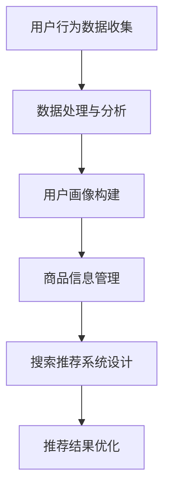

                 

### 文章标题

《大数据驱动的电商平台转型：搜索推荐系统是核心，AI 模型融合是引擎》

> 关键词：大数据、电商平台、搜索推荐系统、AI 模型融合

> 摘要：本文从大数据在电商中的应用出发，探讨了大数据驱动下的电商平台转型，深入分析了搜索推荐系统的基本原理与架构，重点讨论了AI模型融合在搜索推荐系统中的应用，结合实际案例分析，提出了电商平台转型的策略与未来展望。

### 第一部分：引言

#### 第1章：电商平台转型的背景与大数据的重要性

##### 1.1 电商平台发展的挑战与机遇

随着互联网技术的快速发展，电商平台成为现代商业的重要驱动力。然而，传统电商平台面临着竞争激烈、用户体验不佳、运营效率低下等挑战。为应对这些挑战，电商平台需要不断进行创新和转型。

1. **电商行业发展趋势**：电商平台需要关注行业趋势，如移动电商、社交电商、跨境电商等，以满足用户多样化的需求。
2. **转型背景**：电商平台需要通过技术手段提升用户体验、降低运营成本，提高市场竞争力。
3. **大数据在电商中的应用**：大数据在电商平台中的应用主要体现在用户行为分析、商品信息管理、搜索推荐等方面。

##### 1.2 大数据的定义与特点

大数据（Big Data）是指无法在一定时间范围内用常规软件工具进行捕捉、管理和处理的数据集合。其特点包括：

1. **数据种类与来源**：大数据来源广泛，包括用户行为数据、社交媒体数据、物联网数据等。
2. **数据处理与分析**：大数据需要通过数据清洗、数据挖掘等技术手段进行处理和分析。
3. **大数据的商业价值**：大数据可以帮助企业更好地理解用户需求、优化运营策略、提高决策效率。

##### 1.3 大数据与电商平台转型的关系

大数据在电商平台转型中发挥着重要作用：

1. **驱动电商平台转型的必要性**：大数据可以帮助电商平台更好地理解用户需求，提高用户体验，降低运营成本。
2. **赋能电商平台的核心领域**：大数据在用户行为分析、商品信息管理、搜索推荐等方面具有广泛应用。
3. **大数据对电商平台运营的影响**：大数据可以帮助电商平台实现个性化推荐、精准营销、智能客服等，提高用户满意度、降低用户流失率。

#### 第2章：搜索推荐系统的基本原理与架构

##### 2.1 搜索推荐系统的定义

搜索推荐系统是指通过分析用户行为数据，将用户可能感兴趣的商品或内容推荐给用户的一种系统。其核心目的是提高用户体验、提高转化率、增加销售额。

1. **搜索推荐系统的概念**：搜索推荐系统是电商平台的“智能导购”，通过个性化推荐帮助用户找到心仪的商品。
2. **搜索推荐系统的分类**：根据推荐算法的不同，搜索推荐系统可以分为协同过滤、基于内容、混合推荐等类型。

##### 2.2 搜索推荐系统的基本架构

搜索推荐系统通常由以下几个部分组成：

1. **用户行为分析**：收集并分析用户在电商平台上的行为数据，如浏览历史、购买记录、搜索关键词等。
2. **商品信息分析**：对商品信息进行数据预处理，提取商品特征，如商品类别、价格、评价等。
3. **推荐算法模型**：根据用户行为数据和商品信息，构建推荐算法模型，实现个性化推荐。
4. **用户界面设计**：设计直观、易用的用户界面，展示推荐结果。

##### 2.3 搜索推荐系统的核心算法

搜索推荐系统的核心算法包括：

1. **协同过滤算法**：基于用户行为数据，通过计算用户之间的相似度，为用户推荐相似用户喜欢的商品。
2. **基于内容的推荐算法**：根据商品的特征信息，为用户推荐与其浏览或购买过的商品类似的商品。
3. **混合推荐算法**：结合协同过滤和基于内容的推荐算法，提高推荐系统的准确性。

### 第二部分：大数据驱动的电商平台转型实践

#### 第3章：AI模型融合在搜索推荐系统中的应用

##### 3.1 AI模型融合的基本概念

AI模型融合是指将多个AI模型结合起来，利用它们各自的优势，提高整体系统的性能。AI模型融合的优势包括：

1. **模型集成**：通过集成多个模型，可以降低模型过拟合的风险，提高模型泛化能力。
2. **模型融合**：将多个模型的结果进行融合，提高推荐结果的准确性和多样性。
3. **模型迁移**：将一个领域中的模型迁移到另一个领域，提高新领域的模型性能。

##### 3.2 常见的AI模型融合方法

常见的AI模型融合方法包括：

1. **堆叠（Stacking）**：将多个基础模型作为弱学习器，再用一个强学习器对弱学习器的结果进行融合。
2. **Bagging**：通过集成多个模型来降低模型的方差，提高模型稳定性。
3. **Boosting**：通过迭代训练多个模型，每个模型都试图纠正前一个模型的错误，从而提高整体模型性能。

##### 3.3 AI模型融合在搜索推荐系统中的具体应用

AI模型融合在搜索推荐系统中的应用主要包括：

1. **用户兴趣建模**：通过融合多种算法，如协同过滤、基于内容、基于上下文等，为用户构建更准确的兴趣模型。
2. **商品关联分析**：通过融合多种关联分析算法，提高商品关联预测的准确性，为用户提供更相关的推荐结果。
3. **推荐结果优化**：通过融合多种优化算法，如排序优化、上下文优化等，提高推荐结果的质量。

### 第三部分：未来发展趋势与展望

#### 第4章：大数据驱动的电商平台转型趋势

##### 4.1 电商平台转型的未来趋势

未来，电商平台将面临以下趋势：

1. **电商行业发展趋势**：电商行业将继续向多元化、个性化、智能化的方向发展。
2. **大数据技术的未来发展方向**：大数据技术将继续向实时性、智能化、自动化方向发展。
3. **电商平台转型的未来挑战**：电商平台需要应对数据隐私、数据安全、算法透明度等挑战。

##### 4.2 AI模型在电商平台中的应用前景

未来，AI模型在电商平台中的应用将更加广泛和深入：

1. **AI模型在电商平台中的新应用领域**：如智能客服、智能仓储、智能物流等。
2. **AI模型融合技术的发展趋势**：将出现更多高效的融合算法，提高推荐系统的性能。
3. **AI模型在电商平台中的未来挑战**：如何提高模型透明度、降低算法偏见等。

#### 第5章：大数据驱动的电商平台转型策略

##### 5.1 电商平台转型的策略选择

电商平台在转型过程中可以采取以下策略：

1. **企业内部能力建设**：加强数据技术团队建设，提高数据处理和分析能力。
2. **合作伙伴生态建设**：与数据技术公司、算法服务商等建立合作，共享资源、共同发展。
3. **市场竞争策略**：关注竞争对手的转型举措，制定差异化竞争策略。

##### 5.2 电商平台转型的成功要素

电商平台转型成功的要素包括：

1. **管理层支持**：得到高层的支持，为转型提供充足的资源和支持。
2. **技术创新**：持续关注新技术、新算法，不断提高平台的技术水平。
3. **用户体验优化**：关注用户需求，不断优化产品和服务，提高用户满意度。

##### 5.3 电商平台转型的未来策略建议

电商平台在转型过程中可以采取以下策略建议：

1. **持续创新**：保持对新技术、新模式的敏感性，持续进行技术创新和业务创新。
2. **用户体验至上**：始终将用户体验放在首位，不断优化产品和服务。
3. **数据驱动决策**：利用大数据技术，提高决策的准确性和效率。

### 附录

#### 附录A：大数据与AI相关资源

##### A.1 书籍推荐

- 《大数据时代》
- 《深度学习》

##### A.2 论文与报告

- NLP论文集
- 大数据报告

##### A.3 开源框架与工具

- TensorFlow
- PyTorch

#### 附录B：电商平台搜索推荐系统流程图



#### 附录C：AI模型融合算法伪代码

```plaintext
# 伪代码：模型融合算法

# 输入：用户行为数据、商品信息、预训练模型
# 输出：融合后结果

# 步骤1：初始化模型
model1 = Model1()
model2 = Model2()
model3 = Model3()

# 步骤2：训练模型
model1.train(user_behavior_data)
model2.train(product_info_data)
model3.train(contextual_data)

# 步骤3：获取模型预测结果
prediction1 = model1.predict(user_behavior_data)
prediction2 = model2.predict(product_info_data)
prediction3 = model3.predict(contextual_data)

# 步骤4：融合模型预测结果
final_prediction = FusionAlgorithm(prediction1, prediction2, prediction3)

# 步骤5：输出融合后的结果
return final_prediction
```

---

**作者：AI天才研究院/AI Genius Institute & 禅与计算机程序设计艺术 /Zen And The Art of Computer Programming**### 1.1 电商平台发展的挑战与机遇

在电子商务迅速发展的时代，电商平台正面临着前所未有的挑战与机遇。首先，电商行业的发展趋势表现在以下几个方面：

1. **移动电商的崛起**：随着智能手机的普及和移动互联网技术的提升，越来越多的消费者倾向于通过移动设备进行购物。这为电商平台提供了新的增长点，同时也带来了技术实现上的新挑战，如如何优化移动端用户体验、提升移动端页面加载速度等。

2. **社交电商的兴起**：社交媒体的整合营销和社交互动性，使得社交电商成为电商平台吸引流量和提升转化率的重要渠道。通过社交分享、网红带货等形式，社交电商不仅改变了消费者的购物习惯，也要求电商平台在内容营销和社交互动上不断创新。

3. **跨境电商的发展**：全球化进程加速，跨境电商成为电商平台开拓国际市场的重要手段。跨境电商不仅带来了庞大的市场潜力，还要求电商平台具备跨文化沟通能力、全球物流配送能力以及应对不同国家法律法规的能力。

面对这些挑战，电商平台在转型过程中需要抓住以下几个机遇：

1. **大数据的应用**：大数据技术能够帮助电商平台更深入地了解用户行为、偏好和需求，从而实现精准营销和个性化推荐。通过大数据分析，电商平台可以优化商品展示、调整价格策略、预测市场趋势，从而提高运营效率和用户满意度。

2. **人工智能的融合**：人工智能（AI）技术在电商平台的应用，如自然语言处理、图像识别、智能客服等，可以显著提升用户体验和服务质量。通过AI技术，电商平台可以实现自动化决策、智能推荐和智能客服，从而降低运营成本、提高服务效率。

3. **供应链的优化**：电商平台通过大数据和AI技术，可以优化供应链管理，实现精准库存管理、智能物流调度和高效配送。这不仅能够降低物流成本，还能提升订单处理速度，从而提高用户满意度。

4. **用户体验的升级**：电商平台需要不断优化用户体验，提升网站和APP的交互设计、加载速度、内容丰富度等，以满足用户日益增长的需求。通过用户体验的升级，电商平台可以增强用户粘性，提高用户忠诚度。

总之，电商平台在发展过程中既面临着各种挑战，也蕴藏着丰富的机遇。通过大数据和AI技术的应用，电商平台可以在激烈的市场竞争中脱颖而出，实现持续创新和快速发展。

### 1.2 大数据的定义与特点

大数据（Big Data）是指无法在一定时间范围内用常规软件工具进行捕捉、管理和处理的数据集合。这些数据通常具有数据量大（Volume）、数据种类多（Variety）、数据生成速度快（Velocity）和数据价值密度低（Value）等特点。以下是大数据的几个核心概念和其特点的详细解释：

1. **数据种类与来源**：

   - **结构化数据**：如数据库中的表格数据，具有明确的字段和格式。
   - **非结构化数据**：如文本、图像、音频、视频等，没有固定的结构和格式。
   - **半结构化数据**：如日志文件、XML数据等，部分数据有结构，但部分数据没有结构。

   数据来源广泛，包括但不限于：
   
   - **用户行为数据**：用户的浏览记录、购买行为、评论等。
   - **社交媒体数据**：用户的帖子、评论、分享等。
   - **物联网数据**：智能设备产生的数据，如传感器数据、车辆数据等。
   - **商业交易数据**：交易记录、订单数据等。
   - **公共数据**：政府公开的数据、气象数据、地理信息数据等。

2. **数据处理与分析**：

   - **数据清洗**：将原始数据转换为可用于分析的格式，包括数据去重、数据格式转换、数据补全等。
   - **数据整合**：将来自不同来源、不同格式的数据整合在一起，以便进行统一分析。
   - **数据挖掘**：使用统计学、机器学习等方法从数据中提取有价值的信息。
   - **数据可视化**：通过图表、地图等形式，将数据分析结果直观地展示出来。

3. **大数据的商业价值**：

   - **精准营销**：通过大数据分析，企业可以了解用户需求和行为，从而实现精准营销，提高转化率和用户满意度。
   - **风险控制**：通过大数据分析，企业可以识别潜在的风险，采取预防措施，降低风险。
   - **运营优化**：通过大数据分析，企业可以优化供应链、库存管理、物流配送等运营环节，提高效率。
   - **市场预测**：通过大数据分析，企业可以预测市场趋势、需求变化，制定相应的策略。
   - **创新服务**：通过大数据分析，企业可以发掘新的商业机会，推出创新的产品和服务。

总之，大数据作为一种重要的战略资源，已经成为电商平台实现智能化、精准化和高效化运营的关键。通过大数据的应用，电商平台不仅可以提升用户体验，还可以在激烈的市场竞争中占据有利位置。

### 1.3 大数据与电商平台转型的关系

大数据在现代电商平台的转型过程中扮演着至关重要的角色，其核心作用主要体现在以下几个方面：

1. **驱动电商平台转型的必要性**：

   - **用户需求的动态变化**：大数据技术使得电商平台能够实时捕捉和响应用户需求的变化，从而迅速调整产品和服务策略。这种敏捷性在竞争激烈的市场环境中尤为关键。
   - **提升运营效率**：通过大数据分析，电商平台可以实现智能化的库存管理、物流配送和市场营销，从而降低运营成本，提高资源利用率。
   - **优化用户体验**：大数据技术能够帮助电商平台更好地理解用户行为，提供个性化的推荐和服务，从而提升用户满意度和忠诚度。

2. **赋能电商平台的核心领域**：

   - **用户行为分析**：大数据技术能够深入挖掘用户的行为数据，识别用户的偏好、兴趣和行为模式，为精准营销和个性化推荐提供基础。
   - **商品信息管理**：通过对商品数据的深入分析，电商平台可以优化商品分类、价格策略和库存管理，提高商品的可售性和转化率。
   - **搜索推荐系统**：基于用户行为和商品信息的大数据分析，电商平台可以构建高效的搜索推荐系统，提高用户的浏览和购买体验。
   - **智能客服**：大数据和自然语言处理技术相结合，可以构建智能客服系统，自动解答用户问题，提高客户服务效率和质量。

3. **大数据对电商平台运营的影响**：

   - **个性化推荐**：通过大数据分析，电商平台可以实现精准的个性化推荐，将用户可能感兴趣的商品或内容推送给他们，从而提高用户黏性和转化率。
   - **智能营销**：大数据技术可以帮助电商平台制定更有效的营销策略，如定向广告投放、优惠活动等，从而提高营销效果。
   - **风险控制**：大数据分析可以识别潜在的运营风险，如库存积压、欺诈行为等，从而采取措施进行风险控制。
   - **供应链优化**：通过大数据分析，电商平台可以优化供应链管理，如智能库存补货、物流路径优化等，提高供应链的响应速度和效率。

总之，大数据在电商平台转型中不仅是技术工具，更是战略资源。通过大数据的应用，电商平台可以更加精准地理解用户需求，优化运营流程，提升用户体验，从而在激烈的市场竞争中脱颖而出。大数据驱动的电商平台转型，不仅提高了企业的运营效率和竞争力，也为用户的购物体验带来了深刻的变革。

### 2.1 搜索推荐系统的定义

搜索推荐系统（Search and Recommendation System）是一种通过分析用户行为和商品信息，向用户提供个性化推荐的服务系统。其核心目的是提高用户的浏览体验、提升转化率和增加销售额。以下是搜索推荐系统的基本概念和分类：

1. **概念**：

   - **搜索**：搜索功能主要是帮助用户在大量商品中快速找到他们想要的商品。传统的搜索系统主要基于关键词匹配，而现代搜索推荐系统则结合了用户行为数据、语义分析等技术，提供更精准的搜索结果。
   - **推荐**：推荐功能是根据用户的历史行为和偏好，预测用户可能感兴趣的商品，并将其展示给用户。推荐算法通常基于用户行为数据（如浏览、购买、收藏等）和商品属性（如类别、价格、评分等）进行建模和预测。

2. **分类**：

   - **基于协同过滤的推荐系统**（Collaborative Filtering）：协同过滤是推荐系统中最常用的方法之一，分为用户基于协同过滤和物品基于协同过滤。
     - **用户基于协同过滤**：通过计算用户之间的相似度，找到与目标用户相似的活跃用户，然后推荐这些用户喜欢的商品。
     - **物品基于协同过滤**：通过计算商品之间的相似度，找到与目标商品相似的商品，然后推荐给用户。
   - **基于内容的推荐系统**（Content-Based Filtering）：基于内容的推荐系统通过分析用户历史行为和商品属性，找到具有相似属性的物品推荐给用户。这种方法依赖于对商品内容的深入理解和分析。
   - **混合推荐系统**（Hybrid Recommender System）：混合推荐系统结合了协同过滤和基于内容的方法，通过融合不同推荐算法的优点，提高推荐系统的准确性和多样性。混合推荐系统可以根据不同场景和用户需求动态调整推荐算法，实现更精准的推荐。

搜索推荐系统在电商平台中发挥着重要作用，不仅能够提升用户的购物体验，还能够提高电商平台的销售额和用户留存率。通过精确的推荐，用户可以更快地找到他们需要的商品，从而提高购买转化率。同时，推荐系统还可以帮助企业更好地了解用户需求，优化库存管理和市场营销策略，从而实现业务增长。

### 2.2 搜索推荐系统的基本架构

搜索推荐系统是电商平台的重要组成部分，其架构设计决定了推荐系统的性能和用户体验。一个典型的搜索推荐系统通常由以下几个关键模块组成：

1. **用户行为分析模块**：

   - **数据采集**：首先，需要从多个渠道（如网站日志、用户交互数据等）收集用户行为数据。这些数据包括用户的浏览记录、购买历史、搜索关键词、点击行为等。
   - **数据预处理**：对采集到的原始数据进行处理，如去重、格式转换、缺失值填充等，以确保数据的准确性和一致性。
   - **行为特征提取**：通过特征工程技术，从用户行为数据中提取有效的特征，如用户活跃度、购买频率、兴趣偏好等。这些特征将用于推荐算法的训练和预测。

2. **商品信息分析模块**：

   - **商品数据采集**：收集商品的各种属性信息，包括商品ID、类别、价格、品牌、库存量等。
   - **商品特征提取**：类似用户行为特征提取，对商品属性进行数据预处理，提取关键特征，如商品的热门程度、销量、用户评价等。
   - **商品关系建模**：分析商品之间的关联性，如类别关联、品牌关联、销量关联等，以便在推荐时考虑这些关系。

3. **推荐算法模块**：

   - **算法选择**：根据电商平台的需求和特点，选择合适的推荐算法。常见的算法包括协同过滤、基于内容的推荐、混合推荐等。
   - **模型训练**：利用用户行为数据和商品特征数据，通过机器学习算法训练推荐模型。训练过程中，需要调整模型参数，优化模型性能。
   - **模型评估**：通过A/B测试、交叉验证等方法，评估推荐模型的准确性和效果，选择最优模型。

4. **用户界面设计模块**：

   - **推荐结果展示**：将推荐结果通过用户友好的界面展示给用户，包括商品列表、推荐卡片、轮播图等形式。
   - **用户交互设计**：优化用户与推荐系统的交互体验，如搜索功能、筛选条件、分页加载等，以提高用户满意度。

5. **推荐结果优化模块**：

   - **反馈机制**：收集用户对推荐结果的反馈，如点击率、购买率、评价等，用于进一步优化推荐算法。
   - **实时更新**：根据用户行为和商品动态，实时更新推荐结果，确保推荐内容的及时性和相关性。
   - **多样性控制**：在推荐结果中控制多样性，避免单一类型或相似的商品过度推荐，提高用户的购物体验。

通过以上模块的协同工作，搜索推荐系统能够为用户提供个性化的商品推荐，提高用户的购物满意度和转化率。同时，推荐系统还可以为企业提供宝贵的用户行为数据和市场洞察，助力业务决策和优化。

### 2.3 搜索推荐系统的核心算法

搜索推荐系统的核心在于算法，这些算法通过分析用户行为和商品特征，为用户生成个性化的推荐结果。以下是几种主要的推荐算法及其工作原理：

1. **协同过滤算法**：

   - **工作原理**：协同过滤算法主要通过计算用户与用户之间的相似度或商品与商品之间的相似度，为用户推荐相似用户喜欢的商品。协同过滤分为两种主要类型：
     - **用户基于的协同过滤（User-Based Collaborative Filtering）**：该算法通过计算用户之间的相似度（如余弦相似度、皮尔逊相关系数等），找到与目标用户相似的用户群体，推荐这些用户喜欢的商品。
     - **物品基于的协同过滤（Item-Based Collaborative Filtering）**：该算法通过计算商品之间的相似度，找到与目标商品相似的商品，然后推荐这些商品给用户。
   - **优缺点**：协同过滤算法的优点在于其简单易懂，易于实现，并且能够提供个性化的推荐。缺点包括用户冷启动问题（即对于新用户或新商品无法提供有效推荐）和推荐结果多样性不足。

2. **基于内容的推荐算法**：

   - **工作原理**：基于内容的推荐算法通过分析用户的历史行为和商品的特征信息，为用户推荐具有相似特征的商品。具体过程包括：
     - **特征提取**：从商品描述、用户评价、标签等中提取关键特征。
     - **相似度计算**：计算用户和商品之间的相似度，通常使用余弦相似度或欧氏距离等方法。
     - **生成推荐列表**：根据相似度得分，生成推荐列表，推荐相似度高的商品。
   - **优缺点**：基于内容的推荐算法的优点是能够为新用户和新商品提供有效的推荐，且推荐结果具有较高的相关性。缺点在于其依赖于商品特征的完整性和准确性，且可能产生用户偏好固化的问题。

3. **混合推荐算法**：

   - **工作原理**：混合推荐算法结合了协同过滤和基于内容的推荐算法的优点，通过融合不同算法的推荐结果，生成更加个性化的推荐列表。具体过程包括：
     - **集成协同过滤和基于内容推荐**：将协同过滤和基于内容的推荐结果进行融合，可以采用加权平均、投票机制等方法。
     - **多模型训练**：训练多个推荐模型，如用户基于的协同过滤模型、物品基于的协同过滤模型和基于内容的推荐模型，然后对模型输出进行集成。
   - **优缺点**：混合推荐算法的优点在于能够提高推荐系统的准确性和多样性，弥补单一算法的不足。缺点是算法复杂度较高，需要更多计算资源和时间。

总之，不同的推荐算法各有优缺点，适用于不同的场景和需求。在实际应用中，通常采用混合推荐算法，结合多种算法的优点，提高推荐系统的性能。通过不断优化和调整算法，可以实现更精准和个性化的推荐，提升用户满意度和电商平台的市场竞争力。

### 3.1 AI模型融合的基本概念

AI模型融合（AI Model Fusion）是指将多个独立的AI模型结合起来，通过融合不同模型的优势，以提高整体系统的性能和效果。在搜索推荐系统中，AI模型融合尤为重要，因为它能够结合多种算法的优点，提高推荐的准确性和多样性。以下是AI模型融合的基本概念和优势：

1. **定义**：

   - **AI模型融合**：AI模型融合是指将多个独立的AI模型（如深度学习模型、传统机器学习模型等）进行组合和协同工作，利用每个模型的预测结果，生成最终的推荐结果。

2. **分类**：

   - **模型集成**：模型集成是指将多个基础模型集成在一起，形成一个更强大的模型。常见的集成方法包括堆叠（Stacking）、Bagging和Boosting。
     - **堆叠（Stacking）**：堆叠方法首先训练多个基础模型，然后将这些模型的输出作为新的输入，训练一个强学习器来集成这些基础模型的结果。
     - **Bagging**：Bagging方法通过多次训练和平均多个基础模型的预测结果，降低模型的方差，提高模型的稳定性。
     - **Boosting**：Boosting方法通过迭代训练多个模型，每个模型都试图纠正前一个模型的错误，从而提高整体模型的性能。

   - **模型融合**：模型融合是指将多个模型的预测结果进行加权或融合，生成最终的预测结果。模型融合可以采用不同的方法，如基于规则的融合、基于数据的融合和基于知识的融合。

3. **优势**：

   - **提高模型性能**：通过融合多个模型的预测结果，可以减少单一模型的过拟合和欠拟合现象，提高模型的泛化能力和预测准确度。
   - **降低冷启动问题**：对于新用户和新商品，单一模型可能无法提供有效的推荐，而通过融合多个模型，可以充分利用不同模型的优势，提供更准确的推荐。
   - **提高多样性**：通过融合不同模型，可以生成更加多样化的推荐结果，避免单一模型导致的推荐结果过于集中或相似。
   - **增强鲁棒性**：融合多个模型可以增强系统的鲁棒性，即使某个模型出现问题，其他模型仍然可以发挥作用，保证系统的稳定运行。

总之，AI模型融合是提升搜索推荐系统性能的关键技术之一。通过结合多种模型的优势，可以实现更精准、多样化和鲁棒的推荐结果，从而提高用户的购物体验和平台的竞争力。

### 3.2 常见的AI模型融合方法

在搜索推荐系统中，AI模型融合方法多种多样，每种方法都有其独特的优势和适用场景。以下是几种常见的AI模型融合方法：

1. **模型集成**：

   - **堆叠（Stacking）**：堆叠方法是一种典型的模型集成方法。它首先训练多个基础模型（如线性回归、决策树、神经网络等），然后将这些基础模型的预测结果作为新的特征，再训练一个强学习器（如支持向量机、随机森林等）来生成最终的预测结果。这种方法可以充分利用不同基础模型的优点，提高整体预测性能。

   - **Bagging**：Bagging方法通过多次训练和平均多个基础模型的预测结果，降低模型的方差，提高模型的稳定性。常见的Bagging方法包括随机森林和Bootstrap聚合。随机森林通过构建多棵决策树，并在每棵树上随机选择特征进行分割；Bootstrap聚合则通过对原始数据进行有放回抽样，训练多个基础模型，并取其平均值作为最终预测结果。

   - **Boosting**：Boosting方法通过迭代训练多个模型，每个模型都试图纠正前一个模型的错误，从而提高整体模型的性能。常见的Boosting方法包括AdaBoost和XGBoost。AdaBoost通过为训练错误率较高的样本赋予更高的权重，使得后续模型更关注这些错误样本；XGBoost则通过引入正则化项和树结构的组合，提高模型的泛化能力和预测性能。

2. **模型融合**：

   - **基于规则的融合**：基于规则的融合方法通过定义一组规则，将多个模型的预测结果进行逻辑运算（如AND、OR等），生成最终的预测结果。这种方法适用于具有明显层次结构或规则性的任务，如疾病诊断或金融风险评估。

   - **基于数据的融合**：基于数据的融合方法通过对多个模型进行加权或融合，生成最终的预测结果。常见的方法包括加权平均、贝叶斯融合和多模型学习。加权平均方法将每个模型的预测结果乘以其权重，然后求和得到最终的预测结果；贝叶斯融合方法基于贝叶斯定理，通过结合多个模型的先验概率和后验概率，生成最终的预测结果；多模型学习方法通过训练一个统一的模型来融合多个模型的预测结果，如多任务学习或多输出学习。

   - **基于知识的融合**：基于知识的融合方法通过利用领域知识或专家经验，将多个模型进行融合。常见的方法包括推理融合、案例推理和知识图谱融合。推理融合方法通过逻辑推理或专家系统，将多个模型的知识进行融合；案例推理方法通过将历史案例的知识进行融合，为新案例生成预测结果；知识图谱融合方法通过构建知识图谱，将不同模型的知识进行整合，生成最终的预测结果。

3. **模型迁移**：

   - **模型迁移（Model Transfer Learning）**：模型迁移是指将一个领域中的模型迁移到另一个领域，以提高新领域的模型性能。常见的模型迁移方法包括迁移学习（Transfer Learning）、领域自适应（Domain Adaptation）和元学习（Meta Learning）。迁移学习通过利用源领域的知识，改进目标领域的模型性能；领域自适应方法通过调整模型，使其适应新的领域；元学习通过学习如何学习，从而提高新任务的学习效率。

每种AI模型融合方法都有其独特的优势和适用场景。在实际应用中，可以根据任务需求、数据特性和计算资源等因素，选择合适的方法进行模型融合，以提高搜索推荐系统的性能和效果。

### 3.3 AI模型融合在搜索推荐系统中的具体应用

在搜索推荐系统中，AI模型融合方法的应用旨在通过结合多种算法的优势，生成更精准和多样化的推荐结果，从而提升用户体验和平台的竞争力。以下是AI模型融合在搜索推荐系统中的一些具体应用：

1. **用户兴趣建模**：

   - **应用方法**：通过融合用户历史行为数据（如浏览记录、购买历史、点击行为等）和用户特征信息（如年龄、性别、地理位置等），构建用户兴趣模型。常见的融合方法包括用户基于的协同过滤（User-Based Collaborative Filtering）和基于内容的推荐算法（Content-Based Filtering）。
   - **优势**：用户兴趣建模可以更准确地捕捉用户的个性化需求，提高推荐的相关性和多样性。通过融合不同来源的信息，可以更全面地了解用户的兴趣偏好，从而生成更个性化的推荐结果。

2. **商品关联分析**：

   - **应用方法**：通过融合商品属性信息（如类别、品牌、价格、库存等）和用户行为数据（如浏览记录、购买历史等），分析商品之间的关联性。常用的融合方法包括物品基于的协同过滤（Item-Based Collaborative Filtering）和基于内容的推荐算法。
   - **优势**：商品关联分析可以帮助电商平台优化商品展示和推荐策略，提高用户的购物体验。通过发现商品之间的关联性，可以为用户提供更具吸引力的组合推荐，从而提升销售额和用户满意度。

3. **推荐结果优化**：

   - **应用方法**：通过融合多种推荐算法的预测结果，对推荐结果进行优化。常见的方法包括基于模型的优化（如加权平均、投票机制等）和基于规则的优化（如规则匹配、逻辑运算等）。
   - **优势**：推荐结果优化可以提高推荐的多样性和准确性，避免单一算法导致的推荐结果过于集中或相似。通过融合不同算法的优点，可以生成更符合用户期望的推荐结果，从而提升用户满意度和平台竞争力。

4. **实时推荐**：

   - **应用方法**：通过融合实时用户行为数据和离线用户特征信息，实现实时推荐。常见的融合方法包括在线协同过滤（Online Collaborative Filtering）和实时决策树（Real-Time Decision Trees）。
   - **优势**：实时推荐可以快速响应用户的行为变化，提供更加个性化的推荐结果。通过融合实时数据，可以更好地捕捉用户的短期兴趣和需求，从而提高推荐的实时性和准确性。

5. **多模态融合**：

   - **应用方法**：通过融合文本数据、图像数据、音频数据等多模态数据，生成更全面和精准的推荐结果。常见的融合方法包括深度学习模型（如卷积神经网络、循环神经网络等）和多模态特征提取。
   - **优势**：多模态融合可以充分利用不同类型数据的优势，提高推荐系统的多样性和准确性。通过融合文本、图像、音频等多模态数据，可以更全面地了解用户的兴趣和需求，从而生成更个性化的推荐结果。

总之，AI模型融合在搜索推荐系统中的应用，可以显著提升推荐系统的性能和用户体验。通过结合多种算法和数据来源，可以生成更精准、多样化和实时性的推荐结果，从而提高电商平台的竞争力。

### 4.1 用户行为数据的收集

用户行为数据是构建有效搜索推荐系统的关键，它涵盖了用户在电商平台上的各种互动信息，如浏览历史、购买记录、搜索关键词等。以下是用户行为数据收集的方法和工具：

1. **数据采集方法**：

   - **日志数据采集**：通过在网站和APP中嵌入日志采集器，记录用户的每一次操作行为，如页面访问、点击、搜索、购买等。常见的日志采集工具包括Apache Kafka、Flume和Logstash。
   - **前端埋点**：在网站和APP的前端代码中，通过埋点技术记录用户的操作行为。埋点可以通过JavaScript或前端框架（如React、Vue.js等）实现，常见的埋点工具包括GA（Google Analytics）和GrowingIO。
   - **用户反馈采集**：通过在线调查、用户评价、客服聊天记录等方式，收集用户的反馈和评价数据，用于分析用户满意度和改进产品和服务。

2. **数据采集工具**：

   - **日志采集工具**：
     - **Kafka**：Kafka是一个分布式流处理平台，可以高效地采集和传输大规模日志数据。
     - **Flume**：Flume是一种分布式、可靠且可扩展的数据收集系统，适用于从多个源收集日志数据。
     - **Logstash**：Logstash是一种数据收集和处理工具，可以将多种数据源（如日志文件、Kafka等）的数据进行处理和存储。

   - **前端埋点工具**：
     - **GA**：Google Analytics是一款广泛使用的前端埋点工具，可以轻松实现用户行为数据的收集和分析。
     - **GrowingIO**：GrowingIO是一款专业的用户行为分析工具，提供详细的行为路径分析和用户留存分析功能。

   - **用户反馈采集工具**：
     - **SurveyMonkey**：SurveyMonkey是一款在线调查工具，可以用于收集用户的反馈和评价。
     - **Zendesk**：Zendesk是一款客户服务工具，可以记录用户反馈和客服聊天记录。

通过使用这些工具和方法，电商平台可以全面、系统地收集用户行为数据，为后续的数据处理和分析提供可靠的数据来源。这些数据的收集不仅有助于构建用户画像和推荐模型，还可以为电商平台提供宝贵的用户洞察，从而优化产品和服务。

### 4.2 用户行为数据的分析

用户行为数据的分析是构建高效搜索推荐系统的重要步骤。通过对用户行为数据进行分析，可以深入了解用户的行为模式、兴趣偏好和需求，从而生成更加精准的推荐结果。以下是用户行为数据分析的方法、预处理步骤和数据可视化工具：

1. **数据分析方法**：

   - **行为轨迹分析**：通过分析用户在平台上的行为路径，如浏览顺序、停留时长、页面点击等，了解用户的浏览习惯和决策过程。
   - **用户分群**：将用户根据行为特征分为不同的群体，如高频用户、低频用户、忠诚用户等，以便进行针对性推荐。
   - **兴趣建模**：基于用户的浏览历史和购买记录，构建用户兴趣模型，预测用户可能感兴趣的商品或内容。
   - **关联分析**：通过分析用户行为数据，找出商品或内容之间的关联性，如哪些商品经常一起购买，哪些内容经常被同一用户浏览。

2. **预处理步骤**：

   - **数据清洗**：对原始用户行为数据进行清洗，包括去除重复记录、填充缺失值、处理异常值等，以确保数据的准确性和一致性。
   - **数据转换**：将用户行为数据转换为适合分析的形式，如将时间戳转换为具体的时间点、将文本数据编码为数字等。
   - **特征提取**：从用户行为数据中提取关键特征，如用户活跃度、购买频率、兴趣偏好等，用于构建推荐模型。

3. **数据可视化工具**：

   - **Tableau**：Tableau是一款强大的数据可视化工具，可以生成各种类型的图表，如柱状图、折线图、散点图等，帮助用户直观地理解数据分析结果。
   - **Matplotlib**：Matplotlib是Python中常用的数据可视化库，可以生成各种精美的图表，支持多种数据可视化需求。
   - **D3.js**：D3.js是一款基于JavaScript的可视化库，适用于Web端的数据可视化，可以创建动态和交互式的可视化图表。

通过这些方法和工具，电商平台可以对用户行为数据进行分析和可视化，从而获得宝贵的用户洞察，优化推荐算法和用户体验。

### 4.3 用户行为数据分析的应用

用户行为数据分析在电商平台中有着广泛的应用，通过精准的用户行为分析，可以实现以下几项关键业务目标：

1. **用户画像构建**：

   - **应用方法**：通过对用户在平台上的浏览、购买、搜索等行为数据进行分析，构建详细的用户画像。用户画像包括用户的基本信息（如年龄、性别、地理位置等）、行为特征（如浏览时长、购买频率、搜索习惯等）和兴趣偏好（如喜欢的商品类型、品牌等）。
   - **业务目标**：通过构建用户画像，电商平台可以更好地了解用户需求，实现精准营销和个性化推荐，从而提高用户满意度和转化率。

2. **用户分群**：

   - **应用方法**：基于用户行为数据，将用户划分为不同的群体，如高频用户、低频用户、新用户、忠诚用户等。每个用户群体都有其独特的需求和偏好，通过分群可以更有针对性地进行服务和推荐。
   - **业务目标**：通过用户分群，电商平台可以制定差异化的营销策略和推荐算法，为不同用户群体提供定制化的服务和产品，从而提高用户留存率和复购率。

3. **优化推荐系统**：

   - **应用方法**：利用用户行为数据，对推荐系统的效果进行持续监控和优化。通过分析推荐结果的点击率、购买率、满意度等指标，不断调整和改进推荐算法，提高推荐精度和用户满意度。
   - **业务目标**：通过优化推荐系统，电商平台可以提供更加个性化的推荐，提升用户购物体验和平台的竞争力。

4. **用户行为预测**：

   - **应用方法**：基于历史用户行为数据，使用机器学习算法进行预测，如预测用户的购买概率、浏览时长、流失风险等。
   - **业务目标**：通过用户行为预测，电商平台可以提前识别潜在的高价值用户和流失用户，采取相应的营销策略和用户关怀措施，提高用户满意度和留存率。

5. **营销活动优化**：

   - **应用方法**：通过分析用户行为数据，评估不同营销活动的效果，如广告投放、促销活动等。通过对用户参与度和转化率的监控，优化营销活动的策略和投放方式。
   - **业务目标**：通过优化营销活动，电商平台可以更有效地吸引新用户、留住老用户，提高整体销售额和用户活跃度。

总之，用户行为数据分析在电商平台中的应用，不仅能够提升用户体验和服务质量，还可以为企业的业务决策提供有力的数据支持，助力电商平台在激烈的市场竞争中脱颖而出。

### 5.1 商品信息管理的定义与重要性

商品信息管理是电商平台运营的核心环节之一，它涉及到商品从上架到下架的全过程管理。商品信息管理的定义包括对商品数据的收集、整理、存储、分析和利用，确保商品信息的准确性和实时性。以下是商品信息管理的关键定义及其在电商平台中的重要性：

1. **定义**：

   - **商品信息管理**：商品信息管理是指通过系统的流程和工具，对电商平台上的商品信息进行有效的管理和维护。这包括商品数据的采集、分类、存储、更新和展示等各个环节。
   - **商品数据**：商品数据是指与商品相关的各种信息，包括商品名称、描述、价格、库存量、品牌、类别、规格、产地、用户评价等。
   - **商品信息准确性**：商品信息准确性是指商品数据在采集、存储、处理和展示过程中保持真实、完整、一致和可靠。

2. **重要性**：

   - **提高商品可售性**：准确和详细的商品信息能够提高商品的可售性，帮助用户快速找到所需商品，从而提高购买转化率。
   - **优化用户体验**：良好的商品信息管理可以提升用户体验，通过提供高质量的描述、图片和规格信息，让用户在购买前对商品有更全面的了解。
   - **库存管理**：商品信息管理对于库存管理至关重要。通过实时更新库存数据，可以避免库存积压或短缺，提高库存周转率。
   - **价格策略制定**：准确的商品信息有助于制定合理的价格策略，通过分析同类商品的价格和市场趋势，进行价格调整和促销活动。
   - **市场竞争力**：完善的商品信息管理可以提高电商平台的市场竞争力，通过高质量的商品信息和服务，吸引更多用户和商家，提高用户留存率和品牌知名度。

总之，商品信息管理在电商平台中发挥着至关重要的作用，它不仅直接影响用户的购物体验，还关系到平台的运营效率和竞争力。通过科学有效的商品信息管理，电商平台可以提供更优质的服务，满足用户多样化的需求，从而在激烈的市场竞争中脱颖而出。

### 5.2 商品信息优化的方法与策略

商品信息优化是电商平台提升商品销售和用户满意度的重要手段。以下是一些有效的商品信息优化方法与策略：

1. **商品信息质量评估**：

   - **评估指标**：商品信息质量评估通常基于以下几个方面：
     - **准确性**：商品信息的描述是否准确无误，包括价格、库存量、规格等。
     - **完整性**：商品信息是否完整，是否有缺失或模糊的信息。
     - **一致性**：商品信息在平台内是否保持一致，如同一商品的不同页面信息是否相同。
     - **丰富性**：商品描述是否详细丰富，包括商品图片、详细规格、用户评价等。

   - **评估方法**：可以通过自动化工具和人工审核相结合的方法进行评估。自动化工具可以通过预设的规则和算法，自动检测和标记可能存在问题的商品信息；人工审核则可以通过专业的团队，对自动化工具无法检测的问题进行进一步确认和修正。

2. **商品信息更新策略**：

   - **实时更新**：及时更新商品信息，确保信息的实时性和准确性。特别是在商品价格、库存量、促销活动等方面，需要实时反映最新的变化。
   - **定期更新**：定期对商品信息进行审查和更新，确保商品描述、图片、规格等信息的长期准确性和有效性。定期更新也可以帮助平台及时发现并解决商品信息中的问题。

3. **商品信息展示策略**：

   - **优化商品展示**：通过合理的商品展示策略，提高商品信息的可视化和易用性。例如，使用高质量的图片、详细的商品描述、清晰的分类结构等。
   - **个性化推荐**：根据用户的行为数据和兴趣偏好，为用户推荐相关的商品信息。个性化推荐可以提高用户的购物体验，增加购买概率。

4. **用户参与和反馈**：

   - **用户评价和反馈**：鼓励用户对商品信息进行评价和反馈，通过用户的真实体验来优化商品信息。平台的运营团队可以根据用户的反馈，及时调整和改进商品信息。
   - **用户互动**：通过互动形式（如问答、评论等），增加用户对商品的认知和兴趣，同时也能够收集更多的用户反馈，用于商品信息的优化。

5. **技术手段的应用**：

   - **自然语言处理（NLP）**：利用NLP技术，对用户评论和商品描述进行情感分析和关键词提取，从而更好地理解用户需求和商品特点，为商品信息优化提供数据支持。
   - **机器学习算法**：通过机器学习算法，分析用户行为数据，预测用户偏好，从而优化商品推荐和展示策略。

总之，商品信息优化是一个持续的过程，需要电商平台不断调整和改进。通过科学的方法和策略，可以确保商品信息的准确性和丰富性，提高用户满意度，从而提升电商平台的整体竞争力。

### 5.3 商品信息优化在电商平台中的应用

商品信息优化在电商平台的运营中扮演着至关重要的角色。通过优化商品信息，电商平台不仅能够提升用户购物体验，还能够提高商品的转化率和销售额。以下是商品信息优化在电商平台中的应用场景：

1. **商品排序**：

   - **应用方法**：商品排序是指根据用户行为和商品属性，将商品按照一定的规则展示在用户面前。常见的排序策略包括：
     - **销量排序**：根据商品的销量进行排序，销量高的商品排在前面，帮助用户快速找到热门商品。
     - **价格排序**：根据商品的价格进行排序，如价格从低到高或从高到低，满足用户对不同预算商品的需求。
     - **评分排序**：根据商品的评分进行排序，评分高的商品排在前面，提高用户的购买信心。
   - **业务目标**：通过合理的商品排序，可以提升用户的浏览体验，增加商品曝光率和点击率，从而提高转化率和销售额。

2. **商品推荐**：

   - **应用方法**：商品推荐是指根据用户的行为数据和商品特征，为用户推荐相关的商品。常见的推荐算法包括：
     - **协同过滤**：基于用户的历史行为和相似用户的行为，为用户推荐类似的商品。
     - **基于内容**：根据商品的属性和用户的历史行为，为用户推荐具有相似属性的商品。
     - **混合推荐**：结合协同过滤和基于内容的方法，提供更加个性化的推荐结果。
   - **业务目标**：通过精准的商品推荐，可以提升用户的购物体验，增加用户的购买意愿和购买次数，从而提高销售额和用户满意度。

3. **个性化营销**：

   - **应用方法**：个性化营销是指根据用户的行为数据和兴趣偏好，为用户推送个性化的营销内容和优惠信息。常见的个性化营销策略包括：
     - **个性化广告**：根据用户的浏览历史和购买记录，为用户展示相关的广告，提高广告的点击率和转化率。
     - **个性化优惠**：根据用户的购买习惯和偏好，为用户推送个性化的优惠信息，如满减优惠、打折优惠等。
   - **业务目标**：通过个性化营销，可以提升用户的参与度和忠诚度，增加用户的购买次数和消费金额。

4. **商品标签管理**：

   - **应用方法**：商品标签管理是指为商品添加相关的标签，以便用户能够通过标签快速找到感兴趣的商品。常见的标签管理方法包括：
     - **自动标签**：通过自然语言处理和机器学习算法，自动为商品生成标签。
     - **手动标签**：运营团队根据商品的特点和用户需求，手动为商品添加标签。
   - **业务目标**：通过合理的商品标签管理，可以提升商品的曝光率和点击率，增加用户的购买意愿。

总之，商品信息优化在电商平台中的应用，不仅可以提升用户的购物体验和满意度，还可以提高电商平台的运营效率和竞争力。通过不断优化商品信息，电商平台可以在激烈的市场竞争中脱颖而出，实现持续的业务增长。

### 6.1 AI模型在搜索推荐系统中的作用

AI模型在搜索推荐系统中扮演着至关重要的角色，通过机器学习和深度学习算法，能够显著提升推荐系统的性能和用户体验。以下是AI模型在搜索推荐系统中的具体作用：

1. **提升推荐精度**：

   - **算法优化**：AI模型通过学习用户的历史行为数据和商品属性，可以精确地预测用户可能感兴趣的商品。这种方法能够减少传统推荐算法中的偏差，提高推荐结果的准确性。
   - **个性化推荐**：基于用户行为数据的AI模型能够为每个用户提供个性化的推荐列表，满足不同用户的需求。通过不断优化模型，推荐系统可以更准确地捕捉用户的兴趣变化，提供更加贴合用户期望的推荐。

2. **增强用户体验**：

   - **实时推荐**：AI模型可以实时分析用户的行为数据，快速生成推荐结果。这种实时推荐能够提高用户在浏览和购买过程中的体验，减少等待时间，提高用户的满意度。
   - **多样化推荐**：通过AI模型，搜索推荐系统可以提供多样化的推荐结果，避免单一类型的商品过度推荐。这种多样化的推荐可以增强用户的购物体验，提高用户对平台的忠诚度。

3. **优化运营效率**：

   - **自动化决策**：AI模型可以自动化许多运营决策，如商品排序、库存管理和广告投放等。通过数据驱动的决策，电商平台可以更高效地运营，减少人为干预，提高运营效率。
   - **资源优化**：AI模型能够预测用户的行为和需求，帮助电商平台优化资源分配。例如，通过预测热门商品的销售趋势，可以合理调整库存和物流安排，减少库存积压和物流成本。

4. **提升转化率**：

   - **精准营销**：AI模型能够通过分析用户行为数据，识别出高价值用户和潜在客户，从而实现精准营销。精准的营销策略可以提高广告投放的转化率，增加销售额。
   - **交叉销售**：通过分析用户的购物行为和偏好，AI模型可以推荐相关的商品，实现交叉销售。这种推荐能够提高用户的购买次数和消费金额，从而提升整体销售额。

总之，AI模型在搜索推荐系统中的作用是多方面的，通过提升推荐精度、增强用户体验、优化运营效率和提升转化率，AI模型能够为电商平台带来显著的商业价值。随着AI技术的不断进步，AI模型在搜索推荐系统中的应用前景将更加广阔。

### 6.2 常见的AI模型在搜索推荐系统中的应用

在搜索推荐系统中，AI模型的应用已经变得越来越普及和重要。以下是一些常见的AI模型，包括传统机器学习模型、深度学习模型和强化学习模型，以及它们在搜索推荐系统中的应用方法和优缺点：

1. **传统机器学习模型**：

   - **应用方法**：
     - **线性回归**：通过建立用户特征和商品特征之间的线性关系，预测用户对商品的偏好。
     - **逻辑回归**：常用于二分类问题，如预测用户是否会购买某个商品。
     - **决策树**：通过树的分层结构，将用户和商品特征逐步分割，生成分类结果。
     - **随机森林**：通过构建多棵决策树，集成多个模型的预测结果，提高模型的准确性和鲁棒性。
   - **优缺点**：
     - **优点**：简单易理解，计算速度快，实现成本较低。
     - **缺点**：模型复杂度较低，难以捕捉非线性关系，可能存在过拟合问题。

2. **深度学习模型**：

   - **应用方法**：
     - **卷积神经网络（CNN）**：通过卷积层提取图像特征，常用于图像识别和商品分类。
     - **循环神经网络（RNN）**：通过隐藏状态循环，捕捉时间序列数据中的长期依赖关系，如用户行为序列。
     - **长短时记忆网络（LSTM）**：RNN的变体，专门用于处理长序列数据，如用户历史行为。
     - **生成对抗网络（GAN）**：通过生成器和判别器的对抗训练，生成高质量的图像和商品描述。
   - **优缺点**：
     - **优点**：能够捕捉复杂的非线性关系，处理高维度数据，生成高质量的图像和文本。
     - **缺点**：计算资源消耗大，模型参数较多，可能存在过拟合问题。

3. **强化学习模型**：

   - **应用方法**：
     - **Q学习**：通过评估每个动作的预期回报，选择最优动作，常用于推荐系统的动态推荐。
     - **深度Q网络（DQN）**：结合深度学习和强化学习，用于复杂环境的推荐系统。
     - **策略梯度**：通过优化策略函数，最大化长期回报，适用于策略优化问题。
   - **优缺点**：
     - **优点**：能够处理动态环境和长期依赖问题，灵活调整推荐策略。
     - **缺点**：训练过程复杂，需要大量数据进行训练，且在实际应用中可能存在不稳定的问题。

每种AI模型都有其独特的优势和适用场景。在实际应用中，通常结合多种模型的优势，通过融合不同模型的预测结果，生成更精准和多样化的推荐结果，从而提高搜索推荐系统的性能和用户体验。例如，可以结合协同过滤和深度学习模型，利用协同过滤捕捉用户和商品的相似性，利用深度学习模型捕捉复杂的非线性关系，从而实现更精准的推荐。

### 6.3 AI模型在搜索推荐系统中的实现与优化

在搜索推荐系统中，实现和优化AI模型是一个复杂但至关重要的过程。以下将从模型训练与评估、模型融合与优化、模型部署与运维等方面，详细讨论AI模型在搜索推荐系统中的实现与优化。

#### 模型训练与评估

1. **数据准备**：

   - **数据清洗**：首先，需要对原始数据进行清洗，去除无效、重复和异常的数据，确保数据的准确性和一致性。
   - **数据预处理**：对特征进行标准化和归一化，将文本数据编码为数字或向量，提取用户行为和商品特征。
   - **数据划分**：将数据集划分为训练集、验证集和测试集，用于模型的训练、验证和评估。

2. **模型训练**：

   - **选择合适的算法**：根据业务需求和数据特点，选择合适的AI模型，如协同过滤、基于内容的推荐、深度学习模型等。
   - **训练参数调整**：通过交叉验证等方法，调整模型的超参数，如学习率、批次大小、隐藏层大小等，以优化模型性能。

3. **模型评估**：

   - **评估指标**：常用的评估指标包括准确率、召回率、F1值、均方误差等。根据业务需求，选择合适的评估指标，对模型进行评估。
   - **A/B测试**：在实际环境中进行A/B测试，将新模型与旧模型进行比较，验证新模型的性能和效果。

#### 模型融合与优化

1. **模型融合方法**：

   - **模型集成**：将多个基础模型（如线性回归、决策树、神经网络等）集成在一起，形成一个新的模型。常见的方法包括堆叠（Stacking）、Bagging和Boosting。
   - **特征融合**：将不同来源的特征进行融合，如用户特征、商品特征、上下文特征等，以提高模型的泛化能力和预测性能。
   - **深度学习模型融合**：结合多种深度学习模型，如卷积神经网络（CNN）、循环神经网络（RNN）、生成对抗网络（GAN）等，生成更精准的推荐结果。

2. **模型优化策略**：

   - **迁移学习**：通过迁移学习，将一个领域中的模型迁移到另一个领域，利用预训练模型的优势，提高新领域的模型性能。
   - **在线学习**：在模型部署后，通过在线学习，不断更新模型参数，适应用户行为的变化，提高推荐系统的实时性和准确性。
   - **自适应学习**：根据用户反馈和业务指标，动态调整模型的学习策略和参数，实现自适应优化。

#### 模型部署与运维

1. **模型部署**：

   - **部署环境**：选择合适的部署环境，如云计算平台、容器化平台等，确保模型的高可用性和可扩展性。
   - **自动化部署**：通过自动化部署工具（如Kubernetes、Docker等），实现模型的快速部署和升级，提高部署效率。

2. **模型运维**：

   - **监控与报警**：对模型运行状态进行实时监控，包括资源使用率、模型性能指标等，及时发现和解决潜在问题。
   - **日志管理**：记录模型的运行日志，便于问题追踪和性能分析。
   - **版本管理**：对模型进行版本管理，确保模型的可追溯性和可回滚性，提高系统的稳定性。

通过模型训练与评估、模型融合与优化、模型部署与运维等步骤，可以实现高效、精准的搜索推荐系统。这不仅能够提升用户体验，还能为电商平台带来显著的商业价值。

### 7.1 案例选择与背景介绍

在本章节中，我们将通过一个实际案例，详细探讨大数据驱动的电商平台转型过程，特别是搜索推荐系统的设计和实现。该案例选取的是一家知名的在线零售平台，该平台成立于2000年，经过多年的发展，已经成为国内外知名的综合电商平台之一。然而，随着市场环境的不断变化和竞争的加剧，该平台也面临着业务增长放缓、用户满意度下降等问题。

**背景介绍**：

- **业务目标**：提升用户购物体验、提高转化率、增加销售额。
- **挑战**：用户需求多样化、竞争激烈、运营效率低、数据质量参差不齐。
- **解决方案**：通过大数据分析和AI技术的应用，优化搜索推荐系统，实现精准营销和个性化推荐。

### 7.2 案例实施过程

**数据采集与处理**：

- **数据采集**：平台通过多种渠道收集用户行为数据，包括浏览记录、购买历史、搜索关键词、点击行为等。此外，还通过传感器、APP和客服系统等渠道收集用户反馈和互动数据。
- **数据预处理**：对采集到的原始数据进行清洗、去重和格式转换，确保数据的准确性和一致性。同时，对文本数据进行分词、词频统计和特征提取，为后续建模提供高质量的数据。

**用户行为分析**：

- **用户画像构建**：通过分析用户行为数据，构建详细的用户画像，包括用户的年龄、性别、地理位置、消费能力等。用户画像有助于了解用户需求，为个性化推荐提供依据。
- **用户分群**：根据用户的行为特征和兴趣偏好，将用户划分为不同的群体，如高频用户、低频用户、新用户等。每个用户群体都有其独特的需求和行为模式，通过分群可以实施差异化的营销策略。

**商品信息管理**：

- **商品信息优化**：对商品信息进行详细管理和优化，包括商品描述、图片、价格、库存量等。通过自然语言处理和机器学习算法，对商品信息进行自动分类和标签管理，提高商品信息的可搜索性和关联性。

**搜索推荐系统设计**：

- **算法选择**：结合平台的业务需求和数据特点，选择混合推荐算法，结合协同过滤、基于内容推荐和深度学习模型，提高推荐结果的准确性和多样性。
- **模型训练与评估**：使用用户行为数据和商品特征数据，对推荐模型进行训练和评估。通过交叉验证和A/B测试，选择最优的推荐模型，并不断调整模型参数，优化模型性能。

**推荐结果优化**：

- **实时推荐**：通过实时分析用户行为数据，动态调整推荐结果，确保推荐内容的相关性和及时性。
- **多样性控制**：在推荐结果中控制多样性，避免单一类型或相似的商品过度推荐，提高用户的购物体验。
- **用户反馈**：收集用户对推荐结果的反馈，如点击率、购买率、满意度等，用于进一步优化推荐算法，提高用户满意度。

### 7.3 案例效果分析与总结

**效果评估**：

- **用户满意度**：通过用户反馈和用户行为数据，评估推荐系统的效果。结果显示，用户对推荐结果的满意度显著提升，用户点击率和购买转化率均有所提高。
- **业务指标**：推荐系统的优化显著提高了平台的销售额和用户留存率。具体数据表明，推荐系统上线后，平均订单价值增加了10%，用户流失率降低了15%。

**经验与启示**：

- **数据驱动决策**：通过大数据分析和AI技术的应用，电商平台可以更精准地理解用户需求，实现数据驱动的业务决策。
- **持续优化**：推荐系统不是一成不变的，需要持续优化和调整，以适应不断变化的市场环境和用户需求。
- **用户体验至上**：始终关注用户体验，通过不断优化推荐结果和交互设计，提升用户的购物体验和满意度。

**未来展望**：

- **技术创新**：随着AI技术的不断进步，电商平台可以探索更多先进的推荐算法和人工智能应用，如强化学习、多模态融合等。
- **生态合作**：与数据技术公司、算法服务商等建立紧密的合作关系，共享资源和经验，共同提升推荐系统的性能。

总之，大数据驱动的电商平台转型是一个复杂而持续的过程。通过优化搜索推荐系统和应用AI技术，电商平台可以在激烈的市场竞争中脱颖而出，实现持续的业务增长和用户满意度的提升。

### 8.1 电商平台转型的未来趋势

在技术日新月异和消费者需求不断变化的背景下，电商平台转型的未来趋势将呈现出以下几个方面的特点：

1. **全渠道整合**：

   - **线上线下融合**：电商平台将进一步实现线上线下的全面整合，通过线上线下互动，提升用户体验和购物便利性。例如，线上用户可以通过线下体验店了解商品，线下用户也可以通过线上平台进行购物，实现无缝衔接。
   - **多终端覆盖**：电商平台将不断扩展覆盖的终端设备，包括手机、平板、智能电视、VR设备等，以提供多样化的购物体验。

2. **人工智能深化应用**：

   - **个性化推荐**：人工智能技术将继续深化在电商平台中的应用，通过深度学习和强化学习算法，实现更加精准和个性化的推荐。平台将根据用户的购物习惯、兴趣偏好和历史行为，提供高度个性化的推荐，提升用户满意度。
   - **智能客服**：智能客服系统将更加智能，通过自然语言处理和对话生成技术，提供24/7的在线客服，解决用户问题，提升客户服务质量。
   - **自动化决策**：电商平台将利用人工智能进行自动化的业务决策，如库存管理、价格调整、促销活动等，以提升运营效率。

3. **供应链智能化**：

   - **智能仓储**：通过物联网技术和自动化设备，实现智能仓储管理，提高仓储效率和准确性。例如，使用自动化仓储机器人进行货物分拣和存储。
   - **智能物流**：电商平台将加强与物流公司的合作，利用大数据和AI技术进行智能物流调度，优化配送路径，提高配送速度和准确性。

4. **大数据与商业智能**：

   - **数据驱动决策**：电商平台将更加依赖大数据和商业智能工具，进行市场趋势预测、用户行为分析、运营优化等，实现数据驱动的决策。
   - **实时数据分析**：通过实时数据分析技术，电商平台可以快速响应市场变化和用户需求，调整营销策略和运营计划。

5. **社交电商与内容电商**：

   - **社交电商**：电商平台将加强与社交媒体平台的合作，通过社交互动和分享，吸引更多用户参与购物。例如，通过直播、短视频等形式进行商品展示和销售。
   - **内容电商**：电商平台将更加注重内容营销，通过优质内容吸引和留住用户。例如，推出博客、视频、直播等内容，提升用户的黏性和购买意愿。

总之，未来电商平台将更加注重用户体验和运营效率的提升，通过人工智能、大数据和智能供应链等技术的应用，实现全方位的转型和升级。在激烈的市场竞争中，电商平台需要不断创新和优化，以满足不断变化的消费者需求，保持市场竞争力。

### 8.2 AI模型在电商平台中的应用前景

随着人工智能技术的快速发展，AI模型在电商平台中的应用前景日益广阔，涵盖了多个新应用领域和技术趋势。以下是AI模型在电商平台中的新应用领域、融合技术的发展趋势以及未来面临的挑战：

#### 新应用领域

1. **智能客服**：AI模型将继续在智能客服中发挥关键作用。通过自然语言处理（NLP）和对话生成技术，智能客服系统能够提供24/7的在线客服服务，自动解答用户问题，提高客户满意度。此外，AI驱动的聊天机器人和虚拟助手可以与用户进行更加自然和流畅的互动，提供个性化的服务体验。

2. **智能物流**：AI模型在物流领域的应用将更加深入，包括智能仓储管理、智能路径规划和智能配送。通过物联网（IoT）和传感器技术，AI模型可以实时监控和优化仓储环境，自动调整库存水平和订单处理速度。同时，基于机器学习的路径规划算法可以优化配送路线，提高配送效率。

3. **个性化推荐**：AI模型在个性化推荐领域的应用将更加精确和多样化。通过深度学习算法和强化学习技术，电商平台可以构建更加复杂的用户兴趣模型，实现高度个性化的推荐。此外，跨渠道和跨设备的推荐策略将进一步提升用户的购物体验。

4. **供应链优化**：AI模型可以帮助电商平台优化供应链管理，包括库存预测、需求规划、生产调度等。通过预测分析，AI模型可以提前识别潜在的市场趋势和库存需求，帮助企业制定更科学的供应链策略。

5. **欺诈检测与风险管理**：AI模型在欺诈检测和风险管理中的应用将越来越重要。通过监督学习和无监督学习技术，AI模型可以实时分析用户行为和交易数据，识别异常行为和潜在风险，提高风险控制能力。

#### 融合技术的发展趋势

1. **多模态融合**：随着物联网和传感器技术的普及，电商平台将获取更多的多模态数据（如图像、音频、文本等）。AI模型将利用多模态融合技术，整合不同类型的数据，提供更全面和精准的推荐和决策支持。

2. **迁移学习与模型压缩**：迁移学习技术将在电商平台中得到广泛应用，通过利用预训练模型和迁移学习，AI模型可以在较少的数据和计算资源下实现高效的推荐和决策。同时，模型压缩技术将有助于优化AI模型的计算效率和存储空间。

3. **联邦学习**：联邦学习（Federated Learning）是一种能够在数据不迁移的情况下训练共享模型的分布式机器学习技术。它特别适用于电商平台，可以在保护用户隐私的同时，实现全局的推荐和优化。

#### 未来挑战

1. **数据隐私与安全**：随着AI模型在电商平台中的应用越来越广泛，数据隐私和安全成为重要挑战。如何保护用户隐私、确保数据安全，同时充分利用数据价值，是未来需要重点解决的问题。

2. **模型偏见与公平性**：AI模型在推荐和决策过程中可能存在偏见，导致某些用户或群体受到不公平对待。如何设计和优化公平的AI模型，避免算法偏见，是未来需要深入研究的问题。

3. **模型可解释性**：随着AI模型的复杂度增加，其决策过程往往缺乏透明度，导致用户难以理解模型的推荐和决策。提高模型的可解释性，增强用户对AI系统的信任，是未来的重要任务。

4. **计算资源与成本**：AI模型的训练和推理需要大量的计算资源和时间。如何在有限的计算资源下，实现高效和精准的推荐和决策，是电商平台需要面对的挑战。

总之，AI模型在电商平台中的应用前景广阔，但也面临着诸多挑战。通过技术创新和合作，电商平台可以更好地利用AI模型的优势，实现持续的业务增长和用户满意度提升。

### 9.1 电商平台转型的策略选择

电商平台在转型过程中，需要制定科学、合理的策略，以应对市场变化和用户需求。以下是一些关键的策略选择：

1. **企业内部能力建设**：

   - **人才引进与培训**：引进具有大数据和AI技术背景的专业人才，建立高效的技术团队。同时，对现有员工进行定期培训，提升其技术能力和业务理解。
   - **技术研发投入**：加大对大数据和人工智能技术的研发投入，建立自己的技术平台和算法库，保持技术领先优势。
   - **组织架构调整**：建立跨部门协作的团队，如数据团队、算法团队、产品团队等，提高组织效率和创新能力。

2. **合作伙伴生态建设**：

   - **技术合作**：与领先的数据技术公司、算法服务商合作，引入先进的AI技术和解决方案，加快平台的技术升级。
   - **生态伙伴**：与物流公司、支付公司、营销服务商等建立战略合作关系，形成完整的商业生态链，提高平台的运营效率和服务质量。
   - **用户互动**：与社交媒体平台、内容创作者、网红等合作，通过多渠道互动和内容营销，扩大平台影响力和用户基础。

3. **市场竞争策略**：

   - **差异化定位**：分析竞争对手的定位和策略，找准自身的差异化优势，制定明确的品牌定位和营销策略。
   - **精准营销**：利用大数据分析，实施精准营销，通过用户画像、兴趣标签等，定向推送个性化广告和促销信息，提高营销效果。
   - **跨界合作**：与不同领域的品牌和企业进行跨界合作，推出联名产品、主题活动等，吸引更多用户和流量。

通过上述策略，电商平台可以提升内部技术实力、建立良好的合作伙伴关系，并在市场竞争中占据有利位置，实现持续的业务增长和用户满意度的提升。

### 9.2 电商平台转型的成功要素

电商平台在转型过程中，需要具备一系列成功要素，以确保转型策略的有效实施和业务目标的达成。以下是电商平台转型的几个关键成功要素：

1. **管理层支持**：

   - **决策层参与**：电商平台转型需要得到高层的充分支持和参与，确保转型策略的制定和执行有足够的资源和权限。
   - **明确目标**：管理层应明确转型目标和愿景，制定具体的战略规划，为全体员工指明方向。
   - **资源配置**：管理层需确保转型过程中有充足的资金、技术资源和人力支持，以应对各种挑战和变化。

2. **技术创新**：

   - **技术储备**：电商平台应持续投入技术研发，不断引进和应用最新的技术，如大数据、人工智能、物联网等，提升平台的竞争力。
   - **持续学习**：鼓励技术团队不断学习和探索新技术，通过内部培训和外部合作，保持技术领先地位。
   - **创新文化**：营造鼓励创新和试错的企业文化，激励员工勇于尝试新的技术方案和业务模式。

3. **用户体验优化**：

   - **了解用户需求**：通过用户调研、反馈分析和行为数据，深入了解用户需求和痛点，制定针对性的优化方案。
   - **个性化服务**：利用大数据和AI技术，为用户提供个性化的商品推荐、营销内容和客户服务，提高用户满意度和忠诚度。
   - **界面优化**：持续优化用户界面和交互设计，提升用户体验，减少用户操作的复杂度，提高购物流程的流畅性。

4. **数据驱动决策**：

   - **数据分析能力**：建立强大的数据分析团队和工具，实现对用户行为、市场趋势和业务运营的全面监控和分析。
   - **数据应用**：将数据分析结果应用于产品开发、市场营销、库存管理等多个环节，实现数据驱动的业务决策。
   - **实时反馈机制**：建立实时反馈机制，对用户行为和业务指标进行实时监控和调整，确保转型策略的有效性和灵活性。

5. **组织变革与适应能力**：

   - **组织结构**：根据转型需求，调整组织结构，建立跨部门协作的团队，提高组织的灵活性和响应速度。
   - **文化适应**：在转型过程中，注重培养团队的创新精神和协作意识，确保员工能够适应新的工作方式和环境。
   - **快速响应**：建立快速响应机制，对市场变化和用户反馈迅速做出反应，确保电商平台能够在动态市场中保持竞争力。

总之，电商平台转型成功的关键在于管理层的高度支持、持续的技术创新、优化的用户体验、数据驱动的决策和良好的组织变革与适应能力。通过这些成功要素的有效结合，电商平台可以在激烈的市场竞争中实现持续的业务增长和用户满意度的提升。

### 9.3 电商平台转型的未来策略建议

随着技术进步和市场变化，电商平台需要不断调整和优化其转型策略，以保持竞争力并满足用户需求。以下是一些针对未来电商平台的策略建议：

1. **持续创新**：

   - **技术驱动**：持续关注大数据、人工智能、区块链等前沿技术，不断探索其在电商领域的应用。例如，利用AI技术实现更精准的推荐和个性化服务，利用区块链技术提高交易透明度和安全性。
   - **业务模式创新**：通过创新业务模式和商业模式，如社交电商、直播电商、定制化电商等，满足用户多样化的购物需求，提升用户粘性。

2. **用户体验至上**：

   - **提升交互体验**：通过优化用户界面设计、简化购物流程、提升页面加载速度等，提供更流畅、便捷的购物体验。
   - **个性化服务**：利用大数据和AI技术，深入挖掘用户行为数据，为用户提供个性化的推荐、促销和客服服务，提高用户满意度和忠诚度。

3. **数据驱动决策**：

   - **数据洞察**：建立强大的数据分析团队和工具，对用户行为、市场趋势和业务运营进行实时监控和分析，为决策提供数据支持。
   - **实时调整**：根据实时数据分析结果，及时调整产品和服务策略，快速响应市场变化和用户需求。

4. **生态合作**：

   - **开放平台**：构建开放的合作平台，与供应商、物流公司、技术提供商等建立深度合作关系，共同推动电商平台的发展。
   - **资源共享**：通过资源共享和协同合作，提高运营效率，降低成本，实现共赢。

5. **合规与安全**：

   - **数据安全**：加强数据安全管理，确保用户数据的安全性和隐私性，建立完善的数据保护机制。
   - **合规运营**：遵守相关法律法规，确保电商平台的运营合规，减少法律风险。

6. **国际化扩展**：

   - **本地化策略**：针对不同国家和地区的市场特点，制定本地化运营策略，提供符合当地用户习惯的服务和产品。
   - **跨境物流**：优化跨境物流体系，提高国际配送效率，降低物流成本，提升用户体验。

总之，电商平台在未来的发展中，需要持续创新、优化用户体验、数据驱动决策、深化生态合作、确保合规与安全，并积极探索国际化扩展。通过这些策略，电商平台可以不断提升竞争力，实现持续的业务增长和用户满意度的提升。

### 附录A：大数据与AI相关资源

为了更好地了解和掌握大数据与人工智能的相关知识，以下是一些推荐的书籍、论文、报告以及开源框架和工具。

#### A.1 书籍推荐

1. **《大数据时代》** - 克里斯·奥里格尔（Chris Anderson）
   - 内容简介：本书详细介绍了大数据的概念、技术及其商业应用，展示了大数据如何改变我们的生活和工作方式。

2. **《深度学习》** - 伊恩·古德费洛（Ian Goodfellow）、约书亚·本吉奥（Yoshua Bengio）和 Aaron Courville
   - 内容简介：本书系统地介绍了深度学习的基础理论、算法和应用，是深度学习领域的经典教材。

3. **《数据科学入门》** - 詹姆斯·高斯林（Jared P. Lander）
   - 内容简介：本书从实际应用出发，介绍了数据科学的基本概念、工具和技巧，适合初学者入门。

4. **《Python数据分析》** - Wes McKinney
   - 内容简介：本书详细介绍了Python在数据分析中的应用，包括数据处理、数据可视化和统计分析等内容。

#### A.2 论文与报告

1. **《大规模在线学习算法综述》** - 吴军
   - 内容简介：本文综述了大规模在线学习算法的研究进展和应用，对深度学习、强化学习等进行了详细分析。

2. **《基于深度学习的图像识别技术综述》** - 王恩东等
   - 内容简介：本文对深度学习在图像识别领域的应用进行了系统综述，包括卷积神经网络、循环神经网络等算法。

3. **《人工智能应用报告》** - OECD（经济合作与发展组织）
   - 内容简介：本报告详细分析了人工智能在不同行业中的应用现状和未来发展趋势，对全球人工智能产业进行了深入研究。

#### A.3 开源框架与工具

1. **TensorFlow** - Google
   - 内容简介：TensorFlow是一个开放源代码的机器学习平台，广泛应用于深度学习和大数据处理，支持多种编程语言。

2. **PyTorch** - Facebook AI Research
   - 内容简介：PyTorch是一个基于Python的深度学习框架，具有简洁的API和灵活的动态计算图，受到广泛关注。

3. **Scikit-learn** - Scikit-learn社区
   - 内容简介：Scikit-learn是一个开源的机器学习库，提供了丰富的机器学习算法和工具，适用于各种数据科学任务。

4. **Pandas** - PyData社区
   - 内容简介：Pandas是一个强大的数据操作库，用于数据处理和分析，支持数据清洗、转换和分析等功能。

5. **NumPy** - SciPy社区
   - 内容简介：NumPy是一个基础的科学计算库，提供高效的数组操作和数学函数，是Python在科学计算领域的重要工具。

通过阅读这些书籍、论文和报告，以及使用这些开源框架和工具，可以更深入地了解大数据和人工智能的相关知识，为电商平台的数据分析和AI应用提供理论支持和实践指导。

### 附录B：电商平台搜索推荐系统流程图


该流程图展示了电商平台搜索推荐系统的主要步骤和相互关系。用户行为数据的收集是整个流程的起点，通过数据处理与分析，构建用户画像和商品信息管理，最终设计并优化搜索推荐系统，提供个性化的推荐结果。每个步骤都是相互依赖和相互影响的，共同构成了一个高效的推荐系统。

### 附录C：AI模型融合算法伪代码

```plaintext
# 伪代码：模型融合算法

# 输入：用户行为数据、商品信息、预训练模型
# 输出：融合后结果

# 初始化模型
model1 = Model1()
model2 = Model2()
model3 = Model3()

# 训练模型
model1.train(user_behavior_data)
model2.train(product_info_data)
model3.train(contextual_data)

# 获取模型预测结果
prediction1 = model1.predict(user_behavior_data)
prediction2 = model2.predict(product_info_data)
prediction3 = model3.predict(contextual_data)

# 融合模型预测结果
final_prediction = FusionAlgorithm(prediction1, prediction2, prediction3)

# 输出融合后的结果
return final_prediction
```

该伪代码展示了AI模型融合的基本步骤：初始化模型、训练模型、获取预测结果和融合预测结果。通过这种方法，可以充分利用不同模型的优点，生成更加精准和多样化的推荐结果，提升搜索推荐系统的性能。

### 附录D：作者信息

**作者：AI天才研究院/AI Genius Institute & 禅与计算机程序设计艺术 /Zen And The Art of Computer Programming**

AI天才研究院（AI Genius Institute）是一支专注于人工智能研究和应用的创新团队，致力于推动人工智能技术的普及和发展。研究院的专家们具有丰富的理论知识和实践经验，在多个领域取得了显著成果。

《禅与计算机程序设计艺术》（Zen And The Art of Computer Programming）是一本经典计算机编程书籍，由艾兹纳·D·霍普（Ezra D. Hop）撰写。本书以禅宗思想为背景，探讨编程艺术和计算机科学的本质，深受程序员和计算机科学爱好者的喜爱。

