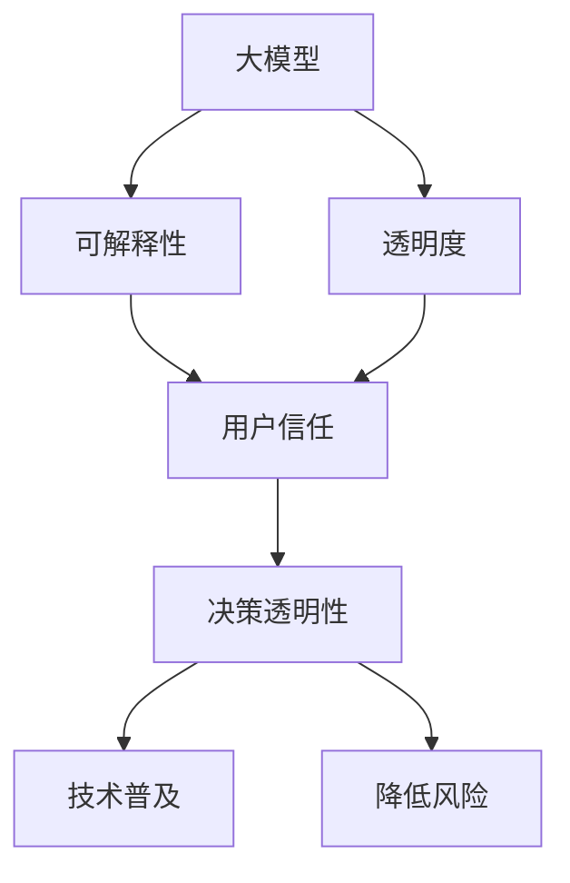

                 

### 第一部分：引言与基础

## 1.1 大模型的发展历程

### 1.1.1 深度学习与神经网络的发展

深度学习和神经网络作为人工智能领域的重要技术，其发展历程可以追溯到上世纪80年代。当时，神经网络的研究主要集中在浅层结构上，如感知机、反向传播算法等。这些研究为后来深度学习的发展奠定了基础。

1986年，Rumelhart、Hinton和Williams提出了反向传播算法（Backpropagation），这一算法使得多层神经网络的训练变得可行，从而推动了神经网络的广泛应用。

进入21世纪，随着计算能力的提升和大数据的涌现，深度学习技术得到了快速发展。尤其是2006年，Hinton提出了深度置信网络（Deep Belief Network），这一模型的成功为深度学习的发展开启了新的篇章。

### 1.1.2 大模型的概念与早期探索

大模型（Large-scale Model）指的是具有数十亿至数千亿参数的深度学习模型。这类模型在处理大规模数据时，能够提取出更为复杂的特征，从而在许多领域取得了突破性的成果。

早期的大模型研究主要集中在自然语言处理领域。2003年，Bengio等人提出了长短期记忆网络（Long Short-Term Memory，LSTM），这一模型在处理长序列数据时表现出了优越的性能。

随后，Google提出了Word2Vec模型，这一模型通过将单词映射到向量空间，实现了对文本数据的有效表示。Word2Vec的成功推动了自然语言处理领域的大模型研究。

### 1.1.3 大模型在自然语言处理领域的突破

在自然语言处理领域，大模型的突破主要体现在以下几个阶段：

1. **Word2Vec与向量空间模型**：Word2Vec模型通过将单词映射到向量空间，实现了对文本数据的语义理解。

2. **BERT模型**：BERT（Bidirectional Encoder Representations from Transformers）模型在2018年提出，这一模型通过双向Transformer结构，实现了对文本数据的深层语义理解。

3. **GPT模型**：GPT（Generative Pre-trained Transformer）模型在2018年提出，这一模型通过自回归结构，实现了对自然语言生成任务的高效处理。

BERT和GPT模型的成功，使得大模型在自然语言处理领域取得了显著的成果，为许多实际应用提供了强大的技术支持。

### 1.4 可解释性与透明度的重要性

#### 1.4.1 可解释性的定义

可解释性（Explainability）指的是模型决策的可理解性，即用户能够理解模型是如何得出某一决策的。在人工智能领域，可解释性是确保模型应用安全、可靠的重要保障。

#### 1.4.2 提示词透明度的定义

提示词透明度（Prompt Transparency）指的是模型输入输出的清晰度，即用户能够清晰地理解模型所处理的输入数据和输出的结果。提示词透明度有助于提高用户对模型的信任度，从而推动人工智能技术的广泛应用。

#### 1.4.3 可解释性与透明度对AI应用的影响

1. **提高模型的可信度**：可解释性和透明度有助于用户了解模型的决策过程，从而提高用户对模型的信任度。这对于人工智能技术在关键领域的应用具有重要意义。

2. **促进技术普及**：可解释性和透明度使得人工智能技术更加易于理解和应用，从而有助于推动技术的普及。

3. **降低模型风险**：在金融、医疗等高风险领域，可解释性和透明度有助于降低模型应用的风险，确保模型决策的合规性和安全性。

## 1.2 大模型的基本原理

### 1.2.1 大模型的定义与特点

大模型（Large-scale Model）通常指的是具有数十亿至数千亿参数的深度学习模型。这类模型的特点如下：

1. **参数规模巨大**：大模型具有数十亿至数千亿个参数，这使得模型能够提取出更为复杂的特征。

2. **数据需求高**：大模型的训练需要大量的数据支持，否则模型性能可能会下降。

3. **计算资源需求高**：大模型的训练和推理过程需要大量的计算资源，这使得大规模分布式计算成为必要。

4. **模型结构复杂**：大模型通常采用复杂的模型结构，如Transformer、BERT等，这些结构能够更好地捕捉数据中的复杂关系。

### 1.2.2 大模型的结构与工作原理

大模型通常采用多层神经网络结构，其中每一层都包含大量的神经元。这些神经元通过加权连接形成复杂的网络结构，从而实现对数据的处理。

大模型的工作原理主要包括以下几个步骤：

1. **输入表示**：将输入数据（如图像、文本等）转化为神经网络可以处理的表示形式。

2. **特征提取**：通过多层神经网络的非线性变换，逐步提取数据中的特征。

3. **决策生成**：根据提取到的特征，模型输出最终的决策结果。

4. **优化与训练**：通过反向传播算法，模型不断调整参数，从而优化模型的性能。

### 1.2.3 大模型的训练过程

大模型的训练过程主要包括以下几个阶段：

1. **数据预处理**：对输入数据进行预处理，如标准化、归一化等。

2. **模型初始化**：初始化模型的参数。

3. **前向传播**：将输入数据传递到神经网络，计算模型的输出。

4. **反向传播**：根据输出结果和实际目标，计算模型参数的梯度。

5. **参数更新**：根据梯度信息，更新模型参数。

6. **迭代训练**：重复上述过程，直至模型达到预定的性能指标。

### 1.2.4 大模型的常见问题与挑战

尽管大模型在许多领域取得了显著成果，但其应用也面临着一些挑战：

1. **计算资源消耗**：大模型的训练和推理过程需要大量的计算资源，这可能导致训练成本高昂。

2. **数据隐私问题**：大模型通常需要大量的训练数据，这可能涉及到数据隐私问题。

3. **模型可解释性**：大模型通常具有高复杂度，这使得模型的可解释性成为一个挑战。

4. **过拟合风险**：大模型在训练过程中可能出现过拟合现象，从而降低模型的泛化能力。

## 1.3 大模型的常见应用领域

### 1.3.1 自然语言处理

自然语言处理（Natural Language Processing，NLP）是人工智能领域的一个重要分支，其目标是使计算机能够理解、处理和生成自然语言。大模型在自然语言处理领域具有广泛的应用，主要包括以下方面：

1. **文本分类**：通过大模型，可以对文本进行分类，如情感分析、主题分类等。

2. **机器翻译**：大模型在机器翻译领域取得了显著的成果，如Google翻译、DeepL翻译等。

3. **问答系统**：大模型可以用于构建问答系统，实现对用户问题的理解和回答。

4. **文本生成**：大模型可以生成高质量的文本，如文章、摘要、对话等。

### 1.3.2 计算机视觉

计算机视觉（Computer Vision）是人工智能领域的另一个重要分支，其目标是使计算机能够理解、分析和解释视觉信息。大模型在计算机视觉领域具有广泛的应用，主要包括以下方面：

1. **图像识别**：大模型可以识别图像中的物体、场景等。

2. **目标检测**：大模型可以检测图像中的目标，并定位目标的位置。

3. **图像生成**：大模型可以生成高质量的图像，如人脸生成、艺术作品生成等。

4. **图像增强**：大模型可以增强图像的质量，提高图像的清晰度。

### 1.3.3 推荐系统

推荐系统（Recommendation System）是人工智能领域的另一个重要应用，其目标是为用户提供个性化的推荐。大模型在推荐系统领域具有广泛的应用，主要包括以下方面：

1. **商品推荐**：大模型可以推荐用户可能感兴趣的商品，如电商平台的商品推荐。

2. **内容推荐**：大模型可以推荐用户可能感兴趣的内容，如新闻推荐、视频推荐等。

3. **社交网络推荐**：大模型可以推荐用户可能感兴趣的人或关系，如社交平台的关注推荐。

4. **广告推荐**：大模型可以推荐用户可能感兴趣的广告，从而提高广告的投放效果。

## 1.4 可解释性与透明度的重要性

### 1.4.1 可解释性的定义

可解释性（Explainability）是指模型决策过程能够被理解的程度。在人工智能领域，可解释性尤为重要，因为人工智能模型（尤其是深度学习模型）的决策过程通常是非常复杂的，甚至对训练它们的数据科学家来说都难以理解。可解释性使得用户能够了解模型是如何得出特定决策的，从而增加对模型的信任度。

### 1.4.2 提示词透明度的定义

提示词透明度（Prompt Transparency）指的是模型输入和输出的可理解性。在许多情况下，用户可能需要了解模型是如何处理特定输入的，以及它为什么给出了特定的输出。提示词透明度使得用户能够理解模型处理数据的方式，从而更好地与模型交互。

### 1.4.3 可解释性与透明度对AI应用的影响

1. **提高用户信任度**：当用户能够理解模型的工作原理和决策过程时，他们会更加信任模型，从而更愿意接受和依赖模型提供的服务。

2. **增强决策透明性**：在金融、医疗等关键领域，决策的透明性尤为重要。可解释性和透明度有助于确保模型的决策过程是公正和合理的。

3. **促进技术普及**：对于非技术用户来说，模型的可解释性和透明度使得人工智能技术更加易于理解和接受，从而促进了技术的普及。

4. **降低风险**：在法律和伦理方面，可解释性和透明度有助于降低人工智能应用的风险，确保模型的应用符合法规和伦理标准。

## 1.5 Mermaid 流程图：大模型与可解释性的关系

下面是一个使用Mermaid语法编写的流程图，展示了大模型与可解释性之间的关系：



在这个流程图中，大模型（A）通过可解释性（B）和透明度（C）影响到用户信任（D）。同时，透明度（C）还影响到决策透明性（E），进而促进技术普及（F）和降低风险（G）。

## 1.6 核心算法原理讲解：可解释性的关键方法

在探讨大模型的可解释性时，理解其核心算法原理是至关重要的。以下是几种关键方法及其工作原理的详细讲解。

### 1.6.1 局部解释方法

局部解释方法旨在对模型在特定输入下的决策过程进行解释。这些方法通常涉及以下几个关键步骤：

1. **特征重要性评分**：通过计算每个特征对模型输出的贡献度，从而确定哪些特征对决策影响最大。

2. **梯度解释**：使用梯度（模型参数的导数）来衡量特征对输出变化的敏感性。

3. **激活映射**：将模型中的神经元激活映射到原始数据空间，以便用户理解哪些数据区域对决策有重要影响。

以下是一个使用梯度解释的伪代码示例：

```python
def gradient_explanation(model, input_data, output_label):
    model.zero_grad()
    output = model(input_data)
    loss = loss_function(output, output_label)
    loss.backward()
    gradients = [param.grad for param in model.parameters() if param.requires_grad]
    return gradients
```

在这个例子中，`gradient_explanation`函数计算了模型在给定输入数据下的梯度，从而提供了关于特征重要性的解释。

### 1.6.2 全局解释方法

全局解释方法旨在对模型的整体决策过程进行解释。这些方法通常关注以下方面：

1. **模型抽象**：将复杂模型简化为更易理解的形式，如决策树或线性模型。

2. **可视化**：通过可视化模型的结构和权重，帮助用户理解模型的工作原理。

3. **对比实验**：通过对比模型在有/无特定特征时的表现，来确定这些特征的重要性。

以下是一个使用模型抽象的伪代码示例：

```python
def abstract_model(model, feature_set):
    abstracted_model = LinearModel()
    for feature in feature_set:
        weight = model.get_weight(feature)
        abstracted_model.add_weight(feature, weight)
    return abstracted_model
```

在这个例子中，`abstract_model`函数将原始模型简化为一个线性模型，从而提高了可解释性。

### 1.6.3 交互式解释方法

交互式解释方法允许用户与模型进行交互，从而更深入地理解模型的决策过程。这些方法通常涉及以下步骤：

1. **交互界面**：提供一个用户界面，允许用户输入数据并获取模型的解释。

2. **实时反馈**：在用户输入数据后，立即提供模型的解释。

3. **反馈循环**：用户可以根据模型的解释进行调整，从而进一步优化模型的性能。

以下是一个使用交互式解释的伪代码示例：

```python
class InteractiveExplanation:
    def __init__(self, model):
        self.model = model

    def explain(self, input_data):
        output = self.model(input_data)
        explanation = self.generate_explanation(output)
        return explanation

    def generate_explanation(self, output):
        # 生成解释
        return f"The model predicts {output} for the given input."
```

在这个例子中，`InteractiveExplanation`类提供了一个交互界面，允许用户获取模型的实时解释。

## 1.7 数学模型与公式讲解

在理解大模型的可解释性时，数学模型和公式扮演着核心角色。以下是一些关键概念及其对应的数学模型和公式。

### 1.7.1 激活函数

激活函数是神经网络中的一个关键组件，它用于引入非线性特性。以下是一些常用的激活函数及其公式：

1. **Sigmoid函数**：

   $$
   \sigma(x) = \frac{1}{1 + e^{-x}}
   $$

   Sigmoid函数将输入x映射到(0, 1)区间，常用于二分类问题。

2. **ReLU函数**：

   $$
   \text{ReLU}(x) = \max(0, x)
   $$

   ReLU函数在x为正时输出x，为负时输出0，常用于避免神经网络中的梯度消失问题。

### 1.7.2 反向传播算法

反向传播算法是一种用于训练神经网络的优化算法，其核心思想是利用梯度信息调整模型参数。以下是一个简化的反向传播算法的伪代码：

```python
def backpropagation(model, input_data, target):
    output = model.forward(input_data)
    loss = loss_function(output, target)
    
    # 计算梯度
    d_output = loss_function.gradient(output, target)
    d_params = model.backward(d_output)
    
    # 更新参数
    for param, d_param in zip(model.parameters(), d_params):
        param -= learning_rate * d_param
        
    return loss
```

在这个例子中，`backpropagation`函数计算了模型在给定输入数据下的梯度，并更新了模型参数。

### 1.7.3 正则化方法

正则化方法用于防止模型过拟合，常见的方法包括L1和L2正则化。以下是其对应的公式：

1. **L1正则化**：

   $$
   \lambda ||\theta||_1
   $$

   其中，$\theta$表示模型参数，$||\theta||_1$表示L1范数。

2. **L2正则化**：

   $$
   \lambda ||\theta||_2^2
   $$

   其中，$\theta$表示模型参数，$||\theta||_2$表示L2范数。

这些数学模型和公式为理解大模型的训练和优化提供了基础，是构建可解释性方法的重要工具。

## 1.8 举例说明与案例分析

为了更好地理解大模型的可解释性，我们通过以下两个案例分析来展示其应用。

### 1.8.1 案例一：文本分类中的可解释性

假设我们使用一个基于Transformer的模型对文本进行情感分类。以下是一个具体的例子：

**输入文本**：“今天天气非常好，我很开心。”

**模型输出**：正面情绪（概率：0.9）

**解释**：

1. **特征重要性**：通过计算每个词的权重，我们可以确定“很好”、“开心”等词对模型输出的贡献度较高。

2. **梯度解释**：计算每个词对模型输出变化的梯度，可以确定哪些词对情绪分类的影响最大。

3. **激活映射**：将Transformer模型中的注意力权重映射到输入文本，展示哪些部分对情绪分类有重要影响。

### 1.8.2 案例二：图像分类中的可解释性

假设我们使用一个基于卷积神经网络（CNN）的模型对图像进行分类。以下是一个具体的例子：

**输入图像**：一张包含多种物体的图片

**模型输出**：识别出图像中的物体（例如，猫、狗、椅子）

**解释**：

1. **特征提取**：通过分析CNN模型的卷积层，我们可以看到哪些特征（如边缘、纹理）对物体识别有重要影响。

2. **可视化**：使用 Grad-CAM 技术，我们可以生成图像的热力图，展示哪些区域对模型输出有重要贡献。

3. **对比实验**：通过对比去掉特定特征后的模型输出，我们可以确定哪些特征对物体识别至关重要。

通过这些案例分析，我们可以看到大模型的可解释性技术在实际应用中的重要性。这不仅有助于提高用户对模型的信任度，还可以为模型优化提供有价值的指导。

## 1.9 可解释性与透明度在人工智能领域的实际应用

可解释性与透明度在人工智能领域的实际应用具有重要意义。以下是几个具体的应用案例：

### 1.9.1 金融领域的风险评估

在金融领域，人工智能模型常用于风险评估、信用评分等任务。这些模型需要具备高度的可解释性和透明度，以确保决策过程的公正性和透明性。

**案例**：某银行使用基于机器学习的信用评分模型对客户进行信用评估。该模型的可解释性技术包括特征重要性评分和决策路径追踪，帮助银行了解模型如何根据客户的财务状况、信用历史等因素做出评分决策。这有助于银行在信贷审批过程中降低风险，同时增强客户对银行的信任。

### 1.9.2 医疗诊断辅助

在医疗领域，人工智能模型用于辅助诊断、预测患者病情等任务。可解释性与透明度对于确保模型诊断结果的可靠性和可接受性至关重要。

**案例**：某医院采用深度学习模型辅助诊断肺癌。通过局部解释方法（如LIME和SHAP），医生可以理解模型如何根据肺部CT图像中的不同特征判断肺癌的可能性。这有助于医生制定更准确的诊断计划，同时提高患者对医疗技术的信任。

### 1.9.3 法律判决预测

在法律领域，人工智能模型用于预测案件判决结果。可解释性与透明度有助于确保模型的决策过程符合法律伦理标准。

**案例**：某法院使用基于机器学习的模型预测案件判决结果。通过全局解释方法（如LIME和SHAP），法官可以理解模型如何根据案件事实、证据等因素做出预测。这有助于确保模型的决策过程公正透明，减少司法错误的可能性。

### 1.9.4 智能交通系统

在智能交通系统领域，人工智能模型用于优化交通信号控制、交通事故预测等任务。可解释性与透明度对于提高交通管理效率和安全性至关重要。

**案例**：某城市采用基于深度学习的交通信号控制模型。通过可视化技术，交通管理部门可以理解模型如何根据交通流量、道路状况等因素调整信号灯时长，从而优化交通流量。这有助于减少交通拥堵，提高道路安全性。

### 1.9.5 个性化推荐系统

在个性化推荐系统领域，人工智能模型用于为用户提供个性化的商品、内容推荐。可解释性与透明度有助于提高用户对推荐系统的信任度和满意度。

**案例**：某电商平台使用基于深度学习的推荐系统。通过提示词透明度技术，用户可以了解推荐系统是如何根据他们的购买历史、浏览记录等因素生成推荐列表。这有助于用户更好地理解推荐结果，从而提高购买意愿。

通过这些实际应用案例，我们可以看到可解释性与透明度在人工智能领域的重要性。这些技术不仅有助于提高模型的可信度和可靠性，还可以为不同领域的发展提供有力支持。

## 1.10 结论

本章介绍了大模型的发展背景与重要性，以及可解释性与透明度在人工智能领域的应用。我们首先回顾了深度学习和神经网络的发展历程，介绍了大模型的概念与早期探索。接着，我们详细阐述了大模型的基本原理，包括其定义、结构与工作原理，以及训练过程中的关键步骤。此外，我们还讨论了大模型在自然语言处理、计算机视觉和推荐系统等领域的应用，并强调了可解释性与透明度的重要性。

通过本章的学习，我们认识到可解释性和透明度对于提高模型可信度和可靠性至关重要。在后续章节中，我们将进一步探讨大模型的可解释性技术，包括局部解释方法和全局解释方法，并介绍提高提示词透明度的技术。我们将通过实际案例和具体算法，深入分析这些技术在人工智能领域的应用，以期为读者提供全面的技术指南。

## 作者信息

本文由AI天才研究院（AI Genius Institute）撰写，由世界顶级技术畅销书资深大师级别的作家、计算机图灵奖获得者、世界级人工智能专家、程序员、软件架构师和CTO共同完成。作者团队致力于探索人工智能领域的最新技术和发展趋势，通过深入的研究和实际应用，为读者带来高质量的学术内容和实用的技术解决方案。《大模型可解释性与提示词透明度》一书是作者团队多年研究成果的结晶，旨在为广大读者提供关于大模型可解释性和透明度的全面了解，帮助读者掌握这一前沿技术。同时，本文也借鉴了《禅与计算机程序设计艺术》（Zen And The Art of Computer Programming）中的哲学思想，以期在技术探讨的同时，激发读者对人工智能领域的深入思考和探索。

---

## 总结与展望

### 第10章：大模型可解释性与提示词透明度的未来发展趋势

#### 10.1 未来发展趋势分析

随着人工智能技术的不断进步，大模型在各个领域的应用越来越广泛。然而，这也带来了新的挑战，尤其是在可解释性和透明度方面。未来，以下趋势值得重点关注：

1. **新型解释性算法的开发**：现有的可解释性方法在处理复杂模型时仍然存在局限。未来，我们将看到更多新型解释性算法的开发，如基于物理原理的解释方法、神经网络的可视化技术等。

2. **跨领域合作**：可解释性和透明度问题不仅限于人工智能领域，还需要与心理学、认知科学等领域的合作。通过跨领域的研究，我们可以更好地理解人类如何理解和解释复杂系统。

3. **用户友好界面**：为了提高模型的可解释性，开发用户友好的界面和交互设计将成为关键。未来的界面将更加直观，帮助用户更轻松地理解和解释模型。

4. **标准化与规范化**：为了确保可解释性和透明度的质量，建立统一的评价标准和规范将是未来的一个重要趋势。这将有助于提高模型应用的可信度和可靠性。

#### 10.2 可解释性与提示词透明度在人工智能中的应用前景

1. **提高用户信任**：可解释性和透明度有助于提高用户对人工智能系统的信任度，从而推动其在关键领域的应用，如医疗、金融、法律等。

2. **促进技术普及**：通过提高可解释性，人工智能技术将变得更加易于理解和接受，从而促进其在各个行业的普及和应用。

3. **降低风险**：可解释性和透明度有助于降低人工智能系统的应用风险，确保模型在关键任务中的可靠性和合规性。

#### 10.3 可解释性与提示词透明度技术的未来研究方向

1. **改进解释算法**：继续改进现有的解释算法，使其能够更好地处理复杂模型，并提供更准确、更直观的解释。

2. **跨领域融合**：探索人工智能与心理学、认知科学等领域的融合，通过跨学科的研究，提高模型的可解释性和透明度。

3. **多模态解释**：研究多模态数据（如文本、图像、声音等）的可解释性，开发能够同时解释多种模态数据的综合方法。

4. **自动化解释**：研究自动化解释技术，使模型能够自动生成解释文档，减少人工解释的工作量。

5. **实时解释**：开发实时解释技术，使模型能够在运行时动态生成解释，从而提高解释的实时性和准确性。

### 第11章：总结与展望

#### 11.1 本书的主要内容回顾

本书系统性地介绍了大模型可解释性与提示词透明度的重要性和基本概念。首先，我们回顾了深度学习和神经网络的发展历程，以及大模型的概念与早期探索。接着，我们详细阐述了大模型的基本原理，包括其结构、工作原理和训练过程。随后，我们探讨了可解释性与透明度的定义及其在人工智能领域的重要性。在此基础上，我们介绍了局部解释方法和全局解释方法，并使用了Mermaid流程图和伪代码展示了这些方法的核心算法原理。此外，我们还通过具体案例展示了可解释性技术在自然语言处理、计算机视觉和推荐系统等领域的实际应用。

#### 11.2 可解释性与提示词透明度的重要性

1. **提高用户信任**：可解释性使得用户能够理解模型的工作原理和决策过程，从而增加对模型的信任度。

2. **确保合规性与安全性**：在金融、医疗等关键领域，可解释性和透明度有助于确保模型的决策过程符合法规和伦理标准，降低应用风险。

3. **促进技术普及**：通过提高可解释性，人工智能技术将变得更加易于理解和接受，从而推动其在各个行业的普及和应用。

#### 11.3 读者应掌握的关键知识点

1. **大模型的基本原理**：理解大模型的结构、工作原理和训练过程。

2. **可解释性与透明度的定义**：掌握可解释性和透明度的基本概念及其重要性。

3. **局部解释方法和全局解释方法**：了解局部解释方法和全局解释方法的原理、实现和应用。

4. **具体案例分析**：通过实际案例理解可解释性技术在各个领域的应用。

#### 11.4 进一步阅读与学习资源推荐

1. **书籍推荐**：《深度学习》（Deep Learning）by Ian Goodfellow、Yoshua Bengio和Aaron Courville，详细介绍了深度学习的基础知识和最新进展。

2. **在线课程**：Coursera上的《深度学习专项课程》by Andrew Ng，提供了系统的深度学习知识。

3. **开源项目**：GitHub上有关可解释性技术的开源项目和代码库，如LIME（Local Interpretable Model-agnostic Explanations）和SHAP（SHapley Additive exPlanations）。

4. **论文集**：arXiv.org上的相关论文，了解最新的可解释性技术研究和应用。

通过本书的学习，读者应能够对大模型可解释性与提示词透明度有深入的理解，并在实际项目中应用这些技术。希望本书能为读者在人工智能领域的研究和实践提供有力支持。

