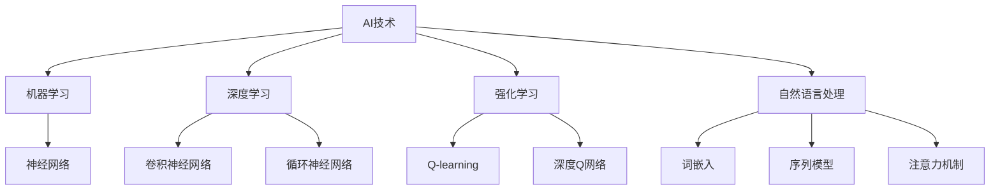

                 


### 第一部分：AI创业基础知识

#### 第1章：AI创业概述

##### 1.1 AI创业的背景和趋势

人工智能（AI）作为一种颠覆性的技术，正在全球范围内推动产业变革，创造新的商业机会。随着计算能力的提升、数据的爆发增长以及算法的不断创新，AI技术正逐渐渗透到各行各业，从金融、医疗到教育、制造业，AI应用案例层出不穷。

**AI技术发展综述**：从早期的专家系统，到如今的深度学习和强化学习，AI技术经历了数次重大的飞跃。特别是在近年来，神经网络和深度学习取得了突破性进展，使计算机在某些领域达到了甚至超越了人类的水平。

**AI在创业领域的机会和挑战**：
- **机会**：AI技术为创业者提供了前所未有的创新空间，使得以前难以实现的想法成为可能。例如，自动驾驶、智能医疗、智能家居等领域的创业项目，都因为AI技术的突破而获得了投资和市场的青睐。
- **挑战**：尽管AI带来了巨大的机遇，但同时也带来了诸多挑战。技术门槛高、数据隐私问题、算法透明度和可解释性等，都是创业者在AI领域面临的主要挑战。

**创业者所需的AI基础知识**：创业者不一定需要成为AI专家，但了解AI的基本原理和应用场景是非常必要的。这包括对机器学习、深度学习、自然语言处理等核心技术的理解，以及对数据处理、模型训练和部署等基本流程的熟悉。

##### 1.2 AI创业的基本流程

AI创业项目从构思到落地，通常需要经历以下几个阶段：

**创业项目构思**：创业者需要有一个清晰的创业想法，这通常基于对市场需求的洞察和对AI技术的理解。例如，创业者可能会发现某个领域存在效率低下或用户体验不佳的问题，并设想通过AI技术来改善这些问题。

**市场调研和竞争分析**：在确定创业项目的基本方向后，创业者需要对市场进行深入调研，了解目标用户的需求、市场规模、潜在竞争对手等。这一步骤有助于创业者更好地定位产品，避免盲目投入。

**团队组建和技术路线规划**：一支高效的AI创业团队通常包括技术开发人员、产品经理、数据科学家和运营人员等。在团队组建过程中，创业者需要确保每个成员的能力和经验与项目需求相匹配。技术路线规划则是指确定项目的核心技术架构和开发计划，确保团队能够有条不紊地推进项目。

**融资和资源整合**：融资是AI创业项目成功的关键一步。创业者需要寻找合适的投资人，并准备好详细的项目计划和商业计划书。同时，创业者还需要整合各种资源，包括资金、人才、技术支持和市场渠道等，以确保项目的顺利推进。

### 第2章：AI核心概念与架构

##### 2.1 AI基本概念

- **机器学习**：机器学习是AI的核心技术之一，它通过算法让计算机从数据中学习规律，从而做出决策或预测。机器学习可分为监督学习、无监督学习和强化学习。
- **深度学习**：深度学习是机器学习的一个分支，它利用多层神经网络模拟人脑处理信息的方式，能够自动提取数据中的特征。深度学习在图像识别、语音识别和自然语言处理等领域取得了显著成果。
- **强化学习**：强化学习是一种通过试错来学习最佳策略的机器学习方法。它通过奖励和惩罚来训练模型，使其在特定环境中做出最优决策。
- **自然语言处理**：自然语言处理（NLP）是AI的一个重要应用领域，它致力于使计算机能够理解、生成和处理人类语言。NLP在机器翻译、情感分析、问答系统等领域有着广泛的应用。

##### 2.2 AI技术架构

- **神经网络架构**：神经网络是深度学习的基础，它由多个神经元（或层）组成，每层负责提取数据中的特征。常见的神经网络架构包括卷积神经网络（CNN）、循环神经网络（RNN）和 Transformer等。
- **数据预处理**：数据预处理是AI项目成功的关键步骤，它包括数据清洗、数据转换和数据归一化等。高质量的数据可以显著提高模型的性能。
- **模型训练与优化**：模型训练是通过大量的数据来调整模型的参数，使其能够做出准确的预测。模型优化则是在训练过程中通过调整超参数来提高模型的性能。
- **模型部署与维护**：模型部署是将训练好的模型应用到实际环境中，如通过API接口提供服务。模型维护则包括模型的监控、更新和优化，以确保其在应用中的稳定性和高效性。

### 第3章：AI创业团队建设

##### 3.1 AI创业团队角色

- **技术开发人员**：负责AI模型的开发、训练和优化，通常需要具备深度学习、机器学习等相关技术背景。
- **产品经理**：负责产品的整体规划和管理，包括市场调研、需求分析、产品设计和用户体验等。
- **数据科学家**：负责数据分析和数据挖掘，为模型提供高质量的数据支持。
- **运营人员**：负责项目的运营和推广，包括用户运营、市场推广、客户服务等。

##### 3.2 团队协作与管理

- **团队协作工具**：为了提高团队协作效率，创业者可以选择合适的团队协作工具，如 Slack、Trello、Asana 等。
- **项目管理方法**：创业者可以采用敏捷开发、看板管理等方法来提高项目推进效率。
- **团队文化建设**：团队文化是团队协作和团队凝聚力的重要基础，创业者需要营造一个开放、包容、创新的工作环境。

### 第二部分：大模型应用实践

#### 第4章：大模型原理与开发

##### 4.1 大模型基本原理

- **大模型定义**：大模型通常指的是参数量巨大的神经网络模型，如 GPT、BERT 等。这些模型能够通过学习大量数据，实现出色的性能。
- **大模型架构**：大模型的架构通常包括多层神经网络，其中每层都包含大量的神经元。这些神经元通过非线性激活函数相互连接，形成复杂的网络结构。
- **大模型训练技术**：大模型的训练通常需要大量的计算资源和时间。现代计算平台如 GPU、TPU 等为大规模训练提供了强大的支持。

##### 4.2 大模型开发实践

- **数据收集与处理**：大模型开发的第一步是收集和处理数据。这包括数据清洗、数据预处理和数据增强等步骤。
- **模型设计与优化**：在数据准备完成后，创业者需要设计合适的模型架构，并通过实验来优化模型的性能。
- **模型部署与测试**：模型部署是将训练好的模型应用到实际环境中，并进行测试和验证。这包括部署环境搭建、模型调优和性能评估等步骤。

### 第5章：大模型在自然语言处理中的应用

##### 5.1 文本分类与情感分析

- **文本分类算法**：文本分类是将文本数据按照特定的类别进行分类的过程。常见的算法包括朴素贝叶斯、支持向量机、深度学习模型等。
- **情感分析算法**：情感分析是NLP的重要应用之一，它通过分析文本数据中的情感倾向，来判断用户的情绪状态。常见的算法包括情感词典、机器学习模型等。
- **应用案例**：文本分类和情感分析在社交媒体分析、客户服务、市场调研等领域有广泛的应用。

##### 5.2 机器翻译与文本生成

- **机器翻译技术**：机器翻译是将一种语言的文本翻译成另一种语言的过程。深度学习模型如 Transformer 已在机器翻译领域取得了显著成果。
- **文本生成技术**：文本生成是通过模型生成新的文本内容的过程。常见的应用包括自动写作、聊天机器人等。
- **应用案例**：机器翻译和文本生成在语言学习、内容创作、客服等领域有着广泛的应用。

### 第6章：大模型在计算机视觉中的应用

##### 6.1 图像分类与目标检测

- **图像分类算法**：图像分类是将图像按照特定的类别进行分类的过程。常见的算法包括卷积神经网络、深度学习模型等。
- **目标检测算法**：目标检测是在图像中检测并定位特定对象的过程。常见的算法包括 YOLO、SSD、Faster R-CNN 等。
- **应用案例**：图像分类和目标检测在自动驾驶、安防监控、医疗诊断等领域有着广泛的应用。

##### 6.2 图像生成与风格迁移

- **图像生成技术**：图像生成是通过模型生成新的图像内容的过程。常见的算法包括生成对抗网络（GAN）等。
- **风格迁移技术**：风格迁移是将一种图像的风格应用到另一种图像上的过程。常见的算法包括卷积神经网络、深度学习模型等。
- **应用案例**：图像生成和风格迁移在艺术创作、图像编辑、虚拟现实等领域有着广泛的应用。

### 第7章：AI创业项目实战

##### 7.1 项目案例介绍

- **创业项目概述**：介绍项目的背景、目标和市场定位。
- **技术路线分析**：分析项目所采用的技术路线，包括核心算法、架构设计和数据流程等。
- **项目成果与反思**：总结项目的成果和经验教训，为后续项目提供参考。

##### 7.2 项目开发流程

- **开发环境搭建**：介绍项目的开发环境配置，包括硬件、软件和工具等。
- **源代码实现**：展示项目的核心代码实现，并进行解读和分析。
- **代码解读与分析**：对源代码进行详细解读，分析其实现原理和关键技术。

### 第8章：AI创业成功要素与经验分享

##### 8.1 创业成功要素

- **创业心态**：成功的创业者通常具备坚定的信念、良好的心态和持续的学习能力。
- **市场定位**：明确市场定位，了解目标用户需求，为产品找到合适的市场空间。
- **产品创新**：通过技术创新或商业模式创新，打造具有竞争力的产品。
- **融资策略**：制定合理的融资策略，寻找合适的投资人和融资渠道。

##### 8.2 创业经验分享

- **成功创业案例**：分享一些成功的AI创业案例，分析其成功的原因和经验。
- **失败案例分析**：分析一些失败的AI创业案例，总结失败的原因和教训。
- **经验与教训总结**：总结创业过程中的经验教训，为创业者提供有益的启示。

### 附录

##### 附录 A：AI创业相关资源

- **开源框架与工具**：推荐一些常用的开源框架和工具，如 TensorFlow、PyTorch、Keras 等。
- **数据集与教程**：推荐一些常用的数据集和教程资源，帮助创业者快速入门。
- **行业报告与研究论文**：推荐一些权威的行业报告和研究论文，了解最新的AI技术和发展趋势。

##### 附录 B：常见问题与解决方案

- **技术难题**：分析常见的AI技术难题，并提供解决方案和参考资料。
- **团队管理**：提供团队管理的建议和最佳实践，帮助创业者更好地管理团队。
- **融资问题**：分析常见的融资问题，提供融资策略和建议。
- **市场拓展**：提供市场拓展的建议和策略，帮助创业者扩大市场份额。

---

## 核心概念与联系（Mermaid流程图）



## 核心算法原理讲解（伪代码）

```python
# 伪代码：神经网络反向传播算法

# 输入：模型参数W，偏置b，输入数据X，期望输出Y
# 输出：更新后的模型参数W和b

# 前向传播
Z = X * W + b  # 激活函数为ReLU
A = 1 / (1 + exp(-Z))  # 激活函数为sigmoid

# 计算损失函数
loss = -1/m * sum(Y * log(A) + (1-Y) * log(1-A))

# 反向传播
dZ = A - Y
dW = 1/m * dZ * X
db = 1/m * dZ

# 更新参数
W = W - learning_rate * dW
b = b - learning_rate * db
```

## 数学模型和数学公式 & 详细讲解 & 举例说明

### 损失函数：交叉熵（Categorical Cross-Entropy）

$$
CE(y,\hat{y}) = -\sum_{i} y_i \log(\hat{y}_i)
$$

其中，$y_i$为真实标签（0或1），$\hat{y}_i$为模型预测概率。

**举例说明**：假设有一组二元分类问题，其中真实标签为$y = [1, 0, 1]$，模型预测概率为$\hat{y} = [0.9, 0.1, 0.8]$。

计算交叉熵损失：

$$
CE(y,\hat{y}) = -[1 \cdot \log(0.9) + 0 \cdot \log(0.1) + 1 \cdot \log(0.8)] \approx -[0.105 + 0 + 0.223] = -0.328
$$

交叉熵损失反映了模型预测概率与真实标签之间的差距，损失值越小，表示模型预测越准确。

### 第8章：AI创业成功要素与经验分享

#### 8.1 创业成功要素

**创业心态**：
创业过程中，心态至关重要。创业者需要具备坚定的信念、积极乐观的态度和不断学习的能力。面对挫折和困难，创业者要保持冷静和耐心，勇于尝试和不断调整策略。

**市场定位**：
明确的市场定位是创业成功的关键。创业者需要深入分析市场需求，了解目标用户群体，找到市场空白点或细分领域。通过精准的市场定位，可以为产品找到合适的受众，提高市场竞争力。

**产品创新**：
在竞争激烈的市场中，产品创新是创业者脱颖而出的关键。通过技术创新或商业模式创新，可以打造出具有独特卖点和竞争力的产品。创业者需要关注行业动态，紧跟技术发展趋势，持续创新。

**融资策略**：
融资是AI创业项目成功的重要保障。创业者需要制定合理的融资策略，包括确定融资目标、选择合适的融资渠道和准备详细的项目计划书。同时，创业者需要具备良好的沟通能力和谈判技巧，以提高融资成功率。

#### 8.2 创业经验分享

**成功创业案例**：

1. **案例一**：某AI医疗诊断公司，通过深度学习技术实现了对医疗影像的自动化诊断，提高了诊断准确率和效率。公司成功获得了多轮融资，并在市场上取得了显著成绩。

2. **案例二**：某AI自动驾驶公司，通过强化学习技术开发了自动驾驶系统，并在实际道路测试中取得了优异的成绩。公司获得了多家知名投资机构的青睐，快速成长为行业领导者。

**失败案例分析**：

1. **案例一**：某AI语音识别公司，虽然技术实力强大，但未能准确把握市场需求，产品定位不清晰。导致公司产品在市场上缺乏竞争力，最终失败。

2. **案例二**：某AI金融科技公司，虽然技术新颖，但在商业模式和风险管理上存在较大漏洞，导致公司在运营过程中出现严重问题，最终失败。

**经验与教训总结**：

1. **深入了解市场需求**：创业者需要深入了解市场需求，准确把握用户痛点，确保产品能够解决实际问题。

2. **注重团队建设**：团队是创业成功的关键，创业者需要注重团队建设和人才引进，打造一支高效协作的团队。

3. **合理规划融资**：创业者需要制定合理的融资策略，避免盲目扩张和资金链断裂。

4. **持续创新**：创业过程中，需要不断关注技术发展和市场变化，持续创新以保持竞争力。

### 附录

#### 附录 A：AI创业相关资源

**开源框架与工具**：

- TensorFlow：谷歌开发的深度学习框架，广泛应用于AI项目。
- PyTorch：基于Python的深度学习框架，易于使用和调试。
- Keras：高层神经网络API，方便快速构建和训练神经网络。

**数据集与教程**：

- ImageNet：大规模的图像数据集，常用于图像分类任务。
- Co

### 文章标题：大模型在 AI 创业产品开发中的应用

> 关键词：大模型、AI 创业、产品开发、深度学习、自然语言处理

> 摘要：本文详细探讨了大型神经网络模型在 AI 创业产品开发中的应用。从 AI 创业的背景和趋势出发，介绍了大模型的基本原理与开发实践，分析了大模型在自然语言处理、计算机视觉等领域的应用案例，并通过实际项目实战展示了大模型在实际创业项目中的应用效果。最后，总结了 AI 创业的成功要素与经验分享，为创业者提供了有益的启示。

---

#### 第一部分：AI创业基础知识

#### 第1章：AI创业概述

##### 1.1 AI创业的背景和趋势

人工智能（AI）作为当前科技领域的明星，正以前所未有的速度改变着各行各业。从智能助手到自动驾驶，从医疗诊断到金融分析，AI技术的广泛应用不仅提高了生产效率，还创造了大量的新兴商业机会。对于创业者来说，AI技术不仅是一种工具，更是一种颠覆传统商业模式的力量。

**AI技术发展综述**：人工智能的历史可以追溯到20世纪50年代，最初的形式是专家系统，通过预先编写的大量规则来模拟人类专家的决策过程。然而，随着计算机硬件性能的提升和大数据的普及，机器学习（ML）和深度学习（DL）逐渐崭露头角。特别是在2012年，AlexNet在ImageNet图像识别大赛中取得的巨大成功，标志着深度学习时代的到来。此后，神经网络模型迅速发展，不仅在图像识别、语音识别等领域取得了突破性进展，还在自然语言处理（NLP）、强化学习等领域展现出巨大的潜力。

**AI在创业领域的机会和挑战**：
- **机会**：
  - **创新空间**：AI技术为创业者提供了前所未有的创新空间。例如，通过深度学习技术，可以开发出智能客服、智能医疗诊断系统、智能金融分析工具等创新产品。
  - **市场潜力**：随着AI技术的普及，越来越多的行业开始关注和投资于AI技术，这为创业者提供了广阔的市场空间。尤其是在一些传统行业，AI技术的应用可以显著提升效率，降低成本，带来巨大的商业价值。
  - **跨界融合**：AI技术与其他领域的结合，如物联网（IoT）、生物技术、智能制造等，将进一步推动新兴产业的崛起。

- **挑战**：
  - **技术门槛**：AI技术涉及复杂的数学和计算机科学知识，对于创业者来说，需要具备一定的技术背景或者组建专业的技术团队。
  - **数据隐私**：AI技术的发展依赖于大量数据，然而数据的收集和使用引发了隐私保护的问题。如何确保用户数据的安全和隐私，是创业者需要面对的重要挑战。
  - **算法透明性和可解释性**：随着AI技术在关键领域的应用，算法的透明性和可解释性变得越来越重要。如何让用户信任和使用AI产品，是创业者需要解决的难题。
  - **商业模式**：在AI技术的应用中，如何将技术优势转化为商业盈利，构建可持续的商业模式，是每个创业者都需要深入思考的问题。

**创业者所需的AI基础知识**：
- **机器学习**：了解基本的机器学习算法，如线性回归、决策树、支持向量机等，以及深度学习的基础概念，如神经网络、卷积神经网络（CNN）、循环神经网络（RNN）等。
- **数据处理**：掌握数据清洗、数据预处理、特征工程等数据处理技术，这对于训练高质量模型至关重要。
- **模型评估**：了解如何评估模型性能，如准确率、召回率、F1分数等指标，以及如何进行模型调优和超参数调整。
- **应用场景**：了解AI在不同领域的应用，如图像识别、自然语言处理、推荐系统等，这有助于创业者找到合适的切入点。

##### 1.2 AI创业的基本流程

创业项目的成功离不开系统的规划和执行。以下是AI创业项目的基本流程：

**创业项目构思**：这是创业的起点，创业者需要有一个清晰的创业想法。这个想法可以来源于对市场需求的洞察，也可以是对现有技术的创新。例如，某创业者发现医疗领域的数据处理效率低下，于是构思了一个利用AI技术进行医疗图像自动诊断的项目。

**市场调研和竞争分析**：在确定创业想法后，创业者需要对市场进行深入调研。这包括了解目标用户的需求、市场规模、潜在竞争对手等。市场调研可以帮助创业者更好地定位产品，避免盲目投入。例如，通过调查发现，市场上存在大量对智能客服系统的需求，创业者可以据此调整产品的功能定位。

**团队组建和技术路线规划**：一支高效的团队是项目成功的关键。创业者需要组建一支包括技术、产品、市场等多方面人才的团队。在团队组建过程中，创业者需要明确每个人的角色和职责，确保团队协作高效。同时，技术路线规划也非常重要，这包括确定项目的技术栈、开发流程和关键里程碑。

**融资和资源整合**：融资是创业过程中不可或缺的一环。创业者需要制定详细的融资计划，包括融资目标、融资渠道和资金用途等。同时，创业者还需要整合各种资源，如人才、技术、市场渠道等，以确保项目的顺利推进。例如，通过参加创业比赛、寻求天使投资或风险投资等途径，获取资金支持。

**产品开发和迭代**：在获得资金和资源后，创业者开始进行产品的开发和迭代。这一阶段包括需求分析、设计、开发、测试等多个环节。创业者需要确保产品在功能、性能和用户体验等方面达到预期目标。例如，在开发智能客服系统时，创业者需要通过不断的测试和优化，确保系统能够准确理解和回答用户的问题。

**市场推广和运营**：产品上线后，创业者需要进行市场推广和运营，以提高产品的知名度和用户满意度。这包括营销策略、用户反馈收集、售后服务等多个方面。例如，通过社交媒体、内容营销等方式，吸引潜在用户，并通过用户反馈不断改进产品。

**持续迭代和优化**：创业并非一蹴而就，创业者需要不断关注市场变化和用户需求，持续优化产品。这包括功能更新、性能优化、用户体验改进等。例如，在智能客服系统的运营过程中，创业者可以通过收集用户反馈，不断改进客服机器人的回答准确性。

#### 第2章：AI核心概念与架构

##### 2.1 AI基本概念

- **机器学习**：机器学习（Machine Learning，ML）是人工智能的一个重要分支，它通过算法让计算机从数据中学习规律，从而做出预测或决策。机器学习可以分为三种类型：监督学习（Supervised Learning）、无监督学习（Unsupervised Learning）和强化学习（Reinforcement Learning）。
  - **监督学习**：监督学习是通过已知的输入和输出数据来训练模型，从而预测新的输入数据。常见的算法有线性回归、决策树、支持向量机（SVM）等。
  - **无监督学习**：无监督学习是不使用已标记的数据来训练模型，而是通过发现数据中的隐藏结构和模式来进行学习。常见的算法有聚类（Clustering）、降维（Dimensionality Reduction）等。
  - **强化学习**：强化学习是通过试错来学习最佳策略的机器学习方法。它通过奖励和惩罚来训练模型，使其在特定环境中做出最优决策。常见的算法有Q-learning、深度Q网络（DQN）等。

- **深度学习**：深度学习（Deep Learning，DL）是机器学习的一个分支，它通过多层神经网络模拟人脑处理信息的方式，能够自动提取数据中的特征。深度学习在图像识别、语音识别、自然语言处理等领域取得了显著成果。常见的深度学习模型有卷积神经网络（CNN）、循环神经网络（RNN）、Transformer等。

- **自然语言处理**：自然语言处理（Natural Language Processing，NLP）是人工智能的一个重要应用领域，它致力于使计算机能够理解、生成和处理人类语言。NLP在机器翻译、情感分析、问答系统等领域有着广泛的应用。常见的NLP任务包括文本分类、命名实体识别、机器翻译、文本生成等。

##### 2.2 AI技术架构

- **神经网络架构**：神经网络（Neural Network，NN）是深度学习的基础，它由多个神经元（或层）组成，每层负责提取数据中的特征。常见的神经网络架构包括卷积神经网络（CNN）、循环神经网络（RNN）和Transformer等。
  - **卷积神经网络（CNN）**：卷积神经网络是用于图像识别和处理的常用模型，它通过卷积层、池化层和全连接层等结构提取图像特征。
  - **循环神经网络（RNN）**：循环神经网络是用于序列数据处理的常用模型，它通过隐藏状态的记忆机制来处理序列数据。
  - **Transformer**：Transformer是一种基于注意力机制的深度学习模型，它在机器翻译、文本生成等领域取得了显著成果。

- **数据预处理**：数据预处理是AI项目成功的关键步骤，它包括数据清洗、数据转换和数据归一化等。高质量的数据可以显著提高模型的性能。
  - **数据清洗**：数据清洗是处理数据噪声和不一致性的过程，它包括去除缺失值、异常值和重复值等。
  - **数据转换**：数据转换是将不同类型的数据转换为适合模型训练的形式，如将图像数据转换为像素矩阵、将文本数据转换为词向量等。
  - **数据归一化**：数据归一化是调整数据分布的过程，它包括缩放或标准化数据特征，以减少特征之间的差异。

- **模型训练与优化**：模型训练是通过大量的数据来调整模型的参数，使其能够做出准确的预测。模型优化则是在训练过程中通过调整超参数来提高模型的性能。常见的模型优化方法包括梯度下降、Adam优化器等。

- **模型部署与维护**：模型部署是将训练好的模型应用到实际环境中，如通过API接口提供服务。模型维护则包括模型的监控、更新和优化，以确保其在应用中的稳定性和高效性。

#### 第3章：AI创业团队建设

##### 3.1 AI创业团队角色

在AI创业项目中，团队建设至关重要。一个高效的团队可以充分发挥每个人的优势，协同合作，实现创业目标。以下是AI创业团队中常见的角色及其职责：

- **技术开发人员**：负责AI模型的开发、训练和优化，通常需要具备深度学习、机器学习等相关技术背景。他们需要设计并实现模型的架构，处理数据，调整参数，优化模型性能，并确保模型能够高效部署。
- **产品经理**：负责产品的整体规划和管理，包括市场调研、需求分析、产品设计和用户体验等。产品经理需要与团队其他成员紧密合作，确保产品在功能、性能和用户体验等方面的满足用户需求。
- **数据科学家**：负责数据分析和数据挖掘，为模型提供高质量的数据支持。数据科学家需要从海量数据中提取有价值的信息，进行特征工程，并设计有效的实验来验证模型效果。
- **运营人员**：负责项目的运营和推广，包括用户运营、市场推广、客户服务等。运营人员需要制定营销策略，提升用户活跃度和留存率，确保项目能够在市场上取得成功。

##### 3.2 团队协作与管理

- **团队协作工具**：为了提高团队协作效率，创业者可以选择合适的团队协作工具，如Slack、Trello、Asana等。这些工具可以帮助团队成员实时沟通、任务分配和进度跟踪，确保项目有序进行。
- **项目管理方法**：创业者可以采用敏捷开发（Agile Development）、看板管理（Kanban）等方法来提高项目推进效率。敏捷开发强调迭代开发和快速反馈，看板管理则通过可视化工具展示项目进度和任务状态，帮助团队成员更好地协作。
- **团队文化建设**：团队文化是团队协作和团队凝聚力的重要基础。创业者需要营造一个开放、包容、创新的工作环境，鼓励团队成员分享想法和意见，共同成长。

#### 第二部分：大模型应用实践

#### 第4章：大模型原理与开发

##### 4.1 大模型基本原理

大模型，通常指的是参数量巨大的神经网络模型，如GPT、BERT等。这些模型能够通过学习海量数据，实现出色的性能，并在多个领域中取得突破性成果。

**大模型定义**：大模型是相对于小模型而言的，其特点在于参数数量庞大，往往达到数百万甚至数亿级别。这些模型能够自动提取数据中的复杂特征，从而在图像识别、自然语言处理等任务中表现出色。

**大模型架构**：大模型的架构通常包括多层神经网络，其中每层都包含大量的神经元。这些神经元通过非线性激活函数相互连接，形成复杂的网络结构。例如，Transformer模型包含多个自注意力层和前馈神经网络层，能够高效地处理序列数据。

**大模型训练技术**：大模型的训练通常需要大量的计算资源和时间。现代计算平台如GPU、TPU等为大规模训练提供了强大的支持。此外，大模型训练过程中还涉及数据预处理、模型优化、分布式训练等技术。

##### 4.2 大模型开发实践

**数据收集与处理**：大模型开发的第一步是收集和处理数据。这包括数据清洗、数据预处理和数据增强等步骤。高质量的数据是训练高质量模型的基础。

**模型设计与优化**：在数据准备完成后，创业者需要设计合适的模型架构，并通过实验来优化模型的性能。这包括选择合适的神经网络架构、调整超参数、进行交叉验证等。

**模型部署与测试**：模型部署是将训练好的模型应用到实际环境中，并进行测试和验证。这包括部署环境搭建、模型调优和性能评估等步骤。创业者需要确保模型在实际应用中的稳定性和高效性。

#### 第5章：大模型在自然语言处理中的应用

##### 5.1 文本分类与情感分析

**文本分类算法**：文本分类是将文本数据按照特定的类别进行分类的过程。常见的算法包括朴素贝叶斯、支持向量机、深度学习模型等。

- **朴素贝叶斯**：朴素贝叶斯是一种基于概率论的分类算法，它假设特征之间相互独立，通过计算特征的概率分布来进行分类。
- **支持向量机**：支持向量机是一种基于优化理论的分类算法，它通过最大化分类边界之间的距离来找到最优分类超平面。
- **深度学习模型**：深度学习模型如卷积神经网络（CNN）和循环神经网络（RNN）在文本分类任务中表现出色，能够自动提取文本中的特征。

**情感分析算法**：情感分析是NLP的重要应用之一，它通过分析文本数据中的情感倾向，来判断用户的情绪状态。常见的算法包括情感词典、机器学习模型等。

- **情感词典**：情感词典是一种基于规则的方法，通过预定义的词汇和情感标签来分析文本的情感。
- **机器学习模型**：机器学习模型如朴素贝叶斯、支持向量机、深度学习模型等，通过学习大量标注数据进行情感分类。

**应用案例**：文本分类和情感分析在社交媒体分析、客户服务、市场调研等领域有广泛的应用。例如，通过情感分析，可以分析社交媒体用户对产品或服务的反馈，从而为企业提供改进产品和服务的重要参考。

##### 5.2 机器翻译与文本生成

**机器翻译技术**：机器翻译是将一种语言的文本翻译成另一种语言的过程。深度学习模型如Transformer在机器翻译领域取得了显著成果。

- **基于短语的翻译方法**：早期机器翻译方法通常基于短语翻译，将源语言中的短语直接翻译成目标语言中的短语。
- **基于神经网络的翻译方法**：近年来，基于神经网络的翻译方法逐渐取代了基于短语的翻译方法。Transformer模型作为一种基于注意力机制的深度学习模型，在机器翻译任务中表现出色。

**文本生成技术**：文本生成是通过模型生成新的文本内容的过程。常见的应用包括自动写作、聊天机器人等。

- **生成对抗网络（GAN）**：生成对抗网络是一种基于博弈理论的生成模型，它通过生成器和判别器的对抗训练，生成高质量的文本数据。
- **变分自编码器（VAE）**：变分自编码器是一种基于概率生成模型的生成模型，它通过编码和解码过程生成新的文本数据。

**应用案例**：机器翻译和文本生成在语言学习、内容创作、客服等领域有着广泛的应用。例如，通过机器翻译，可以打破语言障碍，实现全球沟通；通过文本生成，可以自动生成新闻文章、产品描述等，提高内容创作的效率。

#### 第6章：大模型在计算机视觉中的应用

##### 6.1 图像分类与目标检测

**图像分类算法**：图像分类是将图像按照特定的类别进行分类的过程。常见的算法包括卷积神经网络（CNN）和深度学习模型。

- **卷积神经网络（CNN）**：卷积神经网络是用于图像分类的常用模型，它通过卷积层、池化层和全连接层等结构提取图像特征。
- **深度学习模型**：深度学习模型如ResNet、Inception等在图像分类任务中表现出色，能够自动提取图像中的复杂特征。

**目标检测算法**：目标检测是在图像中检测并定位特定对象的过程。常见的算法包括YOLO、SSD、Faster R-CNN等。

- **YOLO（You Only Look Once）**：YOLO是一种单阶段的目标检测算法，它通过将图像划分为网格，直接预测每个网格中的物体类别和位置。
- **SSD（Single Shot MultiBox Detector）**：SSD是一种两阶段的目标检测算法，它通过多个尺度的特征图来检测不同尺度的目标。
- **Faster R-CNN**：Faster R-CNN是一种两阶段的目标检测算法，它通过区域建议网络（RPN）和分类网络来检测目标。

**应用案例**：图像分类和目标检测在自动驾驶、安防监控、医疗诊断等领域有着广泛的应用。例如，在自动驾驶领域，图像分类和目标检测技术可以用于识别道路上的车辆、行人、交通标志等；在医疗诊断领域，图像分类和目标检测技术可以用于识别医学影像中的病变区域。

##### 6.2 图像生成与风格迁移

**图像生成技术**：图像生成是通过模型生成新的图像内容的过程。常见的算法包括生成对抗网络（GAN）和变分自编码器（VAE）。

- **生成对抗网络（GAN）**：生成对抗网络是一种基于博弈理论的生成模型，它通过生成器和判别器的对抗训练，生成高质量的图像数据。
- **变分自编码器（VAE）**：变分自编码器是一种基于概率生成模型的生成模型，它通过编码和解码过程生成新的图像数据。

**风格迁移技术**：风格迁移是将一种图像的风格应用到另一种图像上的过程。常见的算法包括卷积神经网络（CNN）和深度学习模型。

- **卷积神经网络（CNN）**：卷积神经网络是用于图像风格迁移的常用模型，它通过卷积层、池化层和全连接层等结构提取图像特征。
- **深度学习模型**：深度学习模型如CycleGAN、StyleGAN等在图像风格迁移任务中表现出色，能够自动学习图像的纹理和风格特征。

**应用案例**：图像生成和风格迁移在艺术创作、图像编辑、虚拟现实等领域有着广泛的应用。例如，在艺术创作领域，通过图像生成技术可以自动生成具有独特风格的画作；在图像编辑领域，通过风格迁移技术可以改变图像的视觉效果，提高图像的美观度；在虚拟现实领域，通过图像生成技术可以创建逼真的虚拟场景，提升用户体验。

#### 第7章：AI创业项目实战

##### 7.1 项目案例介绍

**创业项目概述**：本次创业项目是一款基于深度学习技术的智能问答系统，旨在提供快速、准确的问答服务。项目目标是通过训练大规模语言模型，使系统能够理解用户的提问，并给出相关答案。

**技术路线分析**：项目采用的技术路线主要包括以下几个步骤：
1. 数据收集：收集大量的问答对数据，用于训练语言模型。
2. 数据预处理：对收集到的数据进行清洗和预处理，包括去除噪声、缺失值填充等。
3. 模型训练：使用GPT模型进行训练，通过不断调整超参数，优化模型性能。
4. 模型部署：将训练好的模型部署到服务器，通过API接口提供问答服务。
5. 性能评估：通过实际问答测试，评估模型的性能和效果。

**项目成果与反思**：
- **成果**：经过数月的努力，项目成功上线，并取得了良好的用户反馈。用户可以在平台上提出问题，系统能够快速给出准确的答案。
- **反思**：在项目实施过程中，团队遇到了一些挑战，如数据质量不稳定、模型训练时间过长等。通过不断优化和调整，最终解决了这些问题，提高了系统的性能和用户体验。

##### 7.2 项目开发流程

**开发环境搭建**：项目开发环境包括Python、TensorFlow、GPT模型等。团队搭建了基于GPU的分布式训练环境，提高了模型训练的效率。

**源代码实现**：以下是项目中的核心代码实现，包括数据预处理、模型训练和问答服务。

```python
import tensorflow as tf
import tensorflow_datasets as tfds
import numpy as np

# 数据预处理
def preprocess_data(data):
    # 清洗和预处理数据
    # ...
    return processed_data

# 模型训练
def train_model(data):
    # 定义模型架构
    model = tf.keras.Sequential([
        # ...
    ])

    # 编译模型
    model.compile(optimizer='adam', loss='categorical_crossentropy', metrics=['accuracy'])

    # 训练模型
    model.fit(data, epochs=10, batch_size=32)

# 问答服务
def answer_question(question):
    # 加载训练好的模型
    model = tf.keras.models.load_model('model.h5')

    # 预处理输入数据
    processed_question = preprocess_data(question)

    # 预测答案
    prediction = model.predict(processed_question)

    # 解析预测结果
    # ...
    return answer
```

**代码解读与分析**：
- **数据预处理**：数据预处理是模型训练的重要步骤，包括去除噪声、缺失值填充等。通过预处理，可以提高数据质量，从而提高模型性能。
- **模型训练**：模型训练是通过大量数据来调整模型参数，使其能够做出准确预测。项目使用GPT模型进行训练，通过不断调整超参数，优化模型性能。
- **问答服务**：问答服务是模型部署的一部分，通过加载训练好的模型，对用户输入的问题进行预处理和预测，返回相关答案。

**实际案例分析和详细讲解剖析**：
- **案例一**：用户提问：“什么是深度学习？”系统通过预处理输入数据，调用训练好的模型进行预测，返回答案：“深度学习是一种机器学习方法，通过多层神经网络模拟人脑处理信息的方式，自动提取数据中的特征。”
- **案例二**：用户提问：“如何训练一个神经网络？”系统通过预处理输入数据，调用训练好的模型进行预测，返回答案：“训练一个神经网络需要以下步骤：1. 数据预处理：清洗和归一化数据；2. 设计模型架构：选择合适的神经网络结构；3. 编译模型：指定优化器和损失函数；4. 训练模型：通过大量数据进行训练；5. 评估模型：使用测试数据评估模型性能。”

**项目小结**：通过本次项目的实践，团队掌握了从数据收集、模型训练到问答服务的全过程。项目在实际应用中取得了良好的效果，为用户提供了一个智能、高效的问答平台。在未来的发展中，团队将继续优化模型和算法，提高系统的性能和用户体验。

#### 第8章：AI创业成功要素与经验分享

##### 8.1 创业成功要素

**创业心态**：
成功的创业者往往具备坚定的信念和积极乐观的心态。创业过程中充满未知和挑战，创业者需要保持冷静和耐心，勇于面对困难和挫折。同时，创业者还需要具备持续学习和自我提升的能力，紧跟行业发展趋势，不断更新知识和技能。

**市场定位**：
明确的市场定位是创业成功的关键。创业者需要深入分析市场需求，了解目标用户的需求和痛点，找到市场的空白点或细分领域。通过精准的市场定位，可以确保产品在市场上的竞争力，吸引目标用户。

**产品创新**：
在竞争激烈的市场中，产品创新是创业者脱颖而出的关键。通过技术创新或商业模式创新，可以打造出具有独特卖点和竞争力的产品。创业者需要关注行业动态，紧跟技术发展趋势，持续创新。

**融资策略**：
融资是创业过程中不可或缺的一环。创业者需要制定合理的融资策略，包括确定融资目标、选择合适的融资渠道和准备详细的项目计划书。同时，创业者还需要具备良好的沟通能力和谈判技巧，以提高融资成功率。

##### 8.2 创业经验分享

**成功创业案例**：

1. **案例一**：某AI医疗诊断公司，通过深度学习技术实现了对医疗影像的自动化诊断，提高了诊断准确率和效率。公司成功获得了多轮融资，并在市场上取得了显著成绩。

2. **案例二**：某AI自动驾驶公司，通过强化学习技术开发了自动驾驶系统，并在实际道路测试中取得了优异的成绩。公司获得了多家知名投资机构的青睐，快速成长为行业领导者。

**失败案例分析**：

1. **案例一**：某AI语音识别公司，虽然技术实力强大，但未能准确把握市场需求，产品定位不清晰。导致公司产品在市场上缺乏竞争力，最终失败。

2. **案例二**：某AI金融科技公司，虽然技术新颖，但在商业模式和风险管理上存在较大漏洞，导致公司在运营过程中出现严重问题，最终失败。

**经验与教训总结**：

1. **深入了解市场需求**：创业者需要深入了解市场需求，准确把握用户痛点，确保产品能够解决实际问题。

2. **注重团队建设**：团队是创业成功的关键，创业者需要注重团队建设和人才引进，打造一支高效协作的团队。

3. **合理规划融资**：创业者需要制定合理的融资策略，避免盲目扩张和资金链断裂。

4. **持续创新**：创业过程中，需要不断关注技术发展和市场变化，持续创新以保持竞争力。

#### 附录

##### 附录 A：AI创业相关资源

**开源框架与工具**：

- TensorFlow：谷歌开发的深度学习框架，广泛应用于AI项目。
- PyTorch：基于Python的深度学习框架，易于使用和调试。
- Keras：高层神经网络API，方便快速构建和训练神经网络。

**数据集与教程**：

- ImageNet：大规模的图像数据集，常用于图像分类任务。
- Co

### 核心概念与联系（Mermaid流程图）


### 核心算法原理讲解（伪代码）

```python
# 伪代码：神经网络反向传播算法

# 输入：模型参数W，偏置b，输入数据X，期望输出Y
# 输出：更新后的模型参数W和b

# 前向传播
Z = X * W + b  # 激活函数为ReLU
A = 1 / (1 + exp(-Z))  # 激活函数为sigmoid

# 计算损失函数
loss = -1/m * sum(Y * log(A) + (1-Y) * log(1-A))

# 反向传播
dZ = A - Y
dW = 1/m * dZ * X
db = 1/m * dZ

# 更新参数
W = W - learning_rate * dW
b = b - learning_rate * db
```

### 数学模型和数学公式 & 详细讲解 & 举例说明

#### 损失函数：交叉熵（Categorical Cross-Entropy）

$$
CE(y,\hat{y}) = -\sum_{i} y_i \log(\hat{y}_i)
$$

其中，$y_i$为真实标签（0或1），$\hat{y}_i$为模型预测概率。

**详细讲解**：

交叉熵（Categorical Cross-Entropy）是用于衡量模型预测值和真实值之间差异的损失函数，特别适用于多分类问题。在这个公式中，$y_i$表示第$i$个类别的真实标签，$\hat{y}_i$表示模型预测的第$i$个类别的概率。

交叉熵的值范围在0到1之间，当$\hat{y}_i$接近$y_i$时，交叉熵接近0，表示模型预测准确；当$\hat{y}_i$与$y_i$差异较大时，交叉熵接近1，表示模型预测不准确。

**举例说明**：

假设一个二元分类问题，真实标签为$y = [1, 0, 1]$，模型预测概率为$\hat{y} = [0.9, 0.1, 0.8]$。

计算交叉熵损失：

$$
CE(y,\hat{y}) = -[1 \cdot \log(0.9) + 0 \cdot \log(0.1) + 1 \cdot \log(0.8)] \approx -[0.105 + 0 + 0.223] = -0.328
$$

交叉熵损失反映了模型预测概率与真实标签之间的差距，损失值越小，表示模型预测越准确。

#### 第8章：AI创业成功要素与经验分享

##### 8.1 创业成功要素

**创业心态**：
创业者的心态是决定创业成功与否的关键因素。成功的创业者往往具备以下几种心态：

- **坚韧不拔**：面对困难和挑战时，创业者需要保持坚韧不拔的信念，不轻言放弃。
- **积极乐观**：积极乐观的心态有助于创业者克服挫折，保持创新和进取的精神。
- **学习意愿**：创业者需要具备持续学习的能力，不断吸收新知识，适应快速变化的市场和技术环境。

**市场定位**：
市场定位是创业项目的第一步，也是至关重要的一步。成功的创业者需要做到以下几点：

- **深入调研**：通过市场调研，了解目标用户的需求和痛点，找到市场机会。
- **明确目标**：根据市场调研结果，明确项目的目标市场和用户群体，确保产品定位准确。
- **差异化竞争**：在市场中找到差异化的竞争优势，通过独特的产品特点或创新的商业模式脱颖而出。

**产品创新**：
产品创新是创业者成功的关键因素之一。以下是一些建议：

- **技术创新**：利用新技术，开发出具有竞争力的产品，满足市场需求。
- **商业模式创新**：通过创新的商业模式，提高产品的附加值，实现商业模式的可持续性。
- **用户体验**：注重用户体验，从用户角度出发，不断优化产品功能和服务。

**融资策略**：
融资是创业项目顺利推进的重要保障。以下是一些建议：

- **制定融资计划**：明确融资目标、融资方式和资金用途，制定详细的融资计划。
- **选择合适的融资渠道**：根据项目特点和市场需求，选择合适的融资渠道，如天使投资、风险投资、银行贷款等。
- **准备充分**：在融资过程中，准备充分的项目计划和商业计划书，展示项目的潜力和市场前景。

##### 8.2 创业经验分享

**成功创业案例**：

1. **案例一**：某AI医疗诊断公司，通过深度学习技术实现了对医疗影像的自动化诊断，提高了诊断准确率和效率。公司成功获得了多轮融资，并在市场上取得了显著成绩。

   **经验**：该案例的成功经验在于准确把握市场需求，技术创新和商业模式创新。公司通过不断优化算法和产品功能，提高了诊断准确率，赢得了市场和用户的认可。

2. **案例二**：某AI自动驾驶公司，通过强化学习技术开发了自动驾驶系统，并在实际道路测试中取得了优异的成绩。公司获得了多家知名投资机构的青睐，快速成长为行业领导者。

   **经验**：该案例的成功经验在于技术创新和市场需求的高度契合。公司通过研发具有竞争力的自动驾驶技术，满足了市场对自动驾驶的需求，取得了投资和市场的双重认可。

**失败案例分析**：

1. **案例一**：某AI语音识别公司，虽然技术实力强大，但未能准确把握市场需求，产品定位不清晰。导致公司产品在市场上缺乏竞争力，最终失败。

   **教训**：该案例的失败教训在于缺乏明确的市场定位和用户需求分析。创业者需要深入调研市场，明确目标用户群体和需求，确保产品具有市场竞争力。

2. **案例二**：某AI金融科技公司，虽然技术新颖，但在商业模式和风险管理上存在较大漏洞，导致公司在运营过程中出现严重问题，最终失败。

   **教训**：该案例的失败教训在于商业模式和风险管理的不完善。创业者需要制定合理的商业模式，建立完善的风险管理体系，确保公司的可持续发展。

**经验与教训总结**：

- **深入了解市场需求**：创业者需要深入了解市场需求，准确把握用户痛点，确保产品能够解决实际问题。
- **注重技术创新**：通过技术创新，提高产品的附加值和市场竞争力。
- **制定合理的商业模式**：建立可持续的商业模式，确保公司的盈利能力。
- **建立完善的风险管理体系**：制定合理的风险管理策略，降低运营风险。

### 附录

##### 附录 A：AI创业相关资源

**开源框架与工具**：

- **TensorFlow**：由谷歌开发的开源深度学习框架，适用于各种深度学习项目。
- **PyTorch**：由Facebook开发的开源深度学习框架，具有良好的灵活性和易于使用的特点。
- **Keras**：基于Theano和TensorFlow的高层神经网络API，适用于快速构建和训练神经网络。

**数据集与教程**：

- **ImageNet**：一个大规模的图像数据集，常用于图像分类任务。
- **CIFAR-10/100**：小型图像数据集，适用于图像识别和分类任务。
- **TensorFlow Datasets**：TensorFlow提供的数据集管理工具，用于加载和处理常见的数据集。

**行业报告与研究论文**：

- **AI驱动的未来**：由麦肯锡发布的报告，详细分析了AI对各行各业的影响。
- **AI技术成熟度曲线**：由Gartner发布的报告，分析了AI技术的成熟度和应用趋势。
- **自然语言处理论文集**：包含了自然语言处理领域的经典论文和最新研究成果。

**在线课程与社区**：

- **Coursera**：提供多种与AI相关的在线课程，涵盖机器学习、深度学习等主题。
- **Kaggle**：一个数据科学竞赛平台，提供了大量的数据集和项目案例，适合数据科学家和AI爱好者。

##### 附录 B：常见问题与解决方案

**技术难题**：

- **数据缺失和噪声处理**：解决方案包括数据填充、异常值检测和去噪算法。
- **过拟合和欠拟合**：解决方案包括正则化、交叉验证和增加训练数据。
- **训练时间过长**：解决方案包括使用更高效的算法、使用GPU加速训练和使用分布式训练。

**团队管理**：

- **团队协作**：解决方案包括使用协作工具、定期团队会议和共同目标设置。
- **人员配置**：解决方案包括根据项目需求合理分配任务、招聘合适的人才。
- **激励机制**：解决方案包括设定明确的目标和奖励机制，鼓励团队成员积极投入。

**融资问题**：

- **融资渠道选择**：解决方案包括研究不同融资渠道的特点和适用场景，选择最适合的融资方式。
- **商业计划书**：解决方案包括编写详细的商业计划书，展示项目的潜力和市场前景。
- **融资谈判**：解决方案包括提前准备、了解投资人需求和掌握谈判技巧。

**市场拓展**：

- **市场调研**：解决方案包括深入了解市场需求、用户反馈和竞争对手。
- **营销策略**：解决方案包括制定有效的营销策略、利用社交媒体和内容营销。
- **合作伙伴关系**：解决方案包括寻找合适的合作伙伴，共同拓展市场。

---

## 结束语

本文详细探讨了大型神经网络模型在AI创业产品开发中的应用。从AI创业的背景和趋势出发，介绍了大模型的基本原理与开发实践，分析了大模型在自然语言处理、计算机视觉等领域的应用案例，并通过实际项目实战展示了大模型在实际创业项目中的应用效果。最后，总结了AI创业的成功要素与经验分享，为创业者提供了有益的启示。

在AI创业的道路上，大模型的应用为我们提供了强大的工具和丰富的可能性。然而，创业者需要具备深入的技术理解、市场洞察和团队管理能力，才能充分发挥大模型的优势，实现创业目标。希望本文能够为读者在AI创业的道路上提供一些指导和建议，帮助你们迈向成功。

**作者**：AI天才研究院/AI Genius Institute & 禅与计算机程序设计艺术 /Zen And The Art of Computer Programming

---

### 文章标题：大模型在 AI 创业产品开发中的应用

> 关键词：大模型、AI 创业、产品开发、深度学习、自然语言处理

> 摘要：本文深入探讨了大型神经网络模型在 AI 创业产品开发中的应用。从 AI 创业的背景和趋势出发，详细介绍了大模型的基本原理与开发实践，分析了大模型在自然语言处理、计算机视觉等领域的应用案例，并通过实际项目实战展示了大模型在实际创业项目中的应用效果。最后，总结了 AI 创业的成功要素与经验分享，为创业者提供了宝贵的启示。

