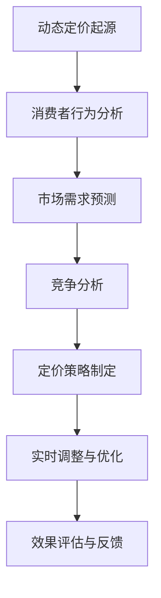
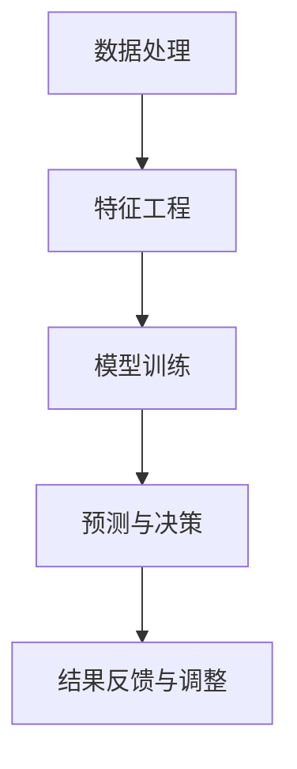

                 


### 文章标题：大模型在动态定价中的多因素决策应用

**关键词：** 大模型，动态定价，多因素决策，人工智能，价格策略

**摘要：** 
本文旨在探讨大模型在动态定价中的应用，重点介绍多因素决策模型的设计与实现。通过分析动态定价的背景与核心概念，阐述大模型在数据处理、特征工程、模型训练、预测与决策等环节的角色。文章还将结合实际案例，详细解析大模型在零售、旅行、制造业等行业的应用场景，提供动态定价模型搭建的实战指南，并分享最佳实践与注意事项。

---

### 目录大纲

## 第一部分：大模型基础

### 第1章：大模型概述

#### 1.1 动态定价背景与核心概念

##### 1.1.1 动态定价的定义与演变
**Mermaid流程图：**


##### 1.1.2 大模型在动态定价中的角色
**Mermaid流程图：**


#### 1.2 多因素决策模型

##### 1.2.1 多因素模型的核心原理

**伪代码：**
```python
def multi_factor_decision(data, factors):
    # 数据预处理
    preprocessed_data = preprocess_data(data)

    # 特征提取
    features = extract_features(preprocessed_data, factors)

    # 模型训练
    model = train_model(features)

    # 预测与决策
    prediction = model.predict(new_data)
    decision = make_decision(prediction)

    return decision
```

##### 1.2.2 数学模型与公式推导

**公式：**
$$
P(t) = f\left(\sum_{i=1}^{n} w_i \cdot X_i(t)\right)
$$`

**解释：**
- $P(t)$ 为时刻 $t$ 的价格
- $w_i$ 为第 $i$ 个因素的权重
- $X_i(t)$ 为时刻 $t$ 第 $i$ 个因素的具体数值

#### 1.3 大模型在动态定价中的应用场景

##### 1.3.1 零售行业的动态定价
**案例说明：**
- 某电商平台的商品定价策略

##### 1.3.2 旅行行业的动态定价
**案例说明：**
- 某在线旅行社的航班、酒店预订定价策略

##### 1.3.3 制造业供应链的动态定价
**案例说明：**
- 某制造企业库存管理中的动态定价策略

## 第二部分：大模型应用实战

### 第2章：动态定价模型搭建

#### 2.1 数据收集与处理

##### 2.1.1 数据来源
- 销售数据
- 竞争对手数据
- 宏观经济数据

##### 2.1.2 数据预处理

**伪代码：**
```python
def preprocess_data(data):
    # 清洗数据
    cleaned_data = clean_data(data)
    
    # 缺失值处理
    filled_data = fill_missing_values(cleaned_data)
    
    # 特征工程
    engineered_data = extract_features(filled_data)
    
    return engineered_data
```

#### 2.2 模型设计与训练

##### 2.2.1 模型选择
- 回归模型
- 决策树
- 支持向量机

##### 2.2.2 模型训练与调优

**伪代码：**
```python
def train_and_tune_model(data, model):
    # 数据分割
    train_data, test_data = split_data(data)
    
    # 训练模型
    model.fit(train_data)
    
    # 模型评估
    performance = model.evaluate(test_data)
    
    # 调整模型参数
    model = tune_model(model, performance)
    
    return model
```

#### 2.3 动态定价策略制定

##### 2.3.1 价格调整规则制定

**伪代码：**
```python
def set_price_adjustment_rules(model, data):
    # 预测未来需求
    predicted_demand = model.predict(future_data)
    
    # 调整价格
    new_price = adjust_price(current_price, predicted_demand)
    
    return new_price
```

### 第3章：动态定价项目实战

#### 3.1 开发环境搭建

- Python环境配置
- NumPy、Pandas、Scikit-learn等库的安装

#### 3.2 源代码实现与解读

- 数据收集与预处理
- 多因素模型搭建
- 动态定价策略制定

#### 3.3 代码应用解读与分析

- 动态定价策略在不同行业的应用效果分析
- 实际案例分析与对比

#### 3.4 项目小结

- 项目收获与反思
- 最佳实践与注意事项

---

**作者：** AI天才研究院/AI Genius Institute & 禅与计算机程序设计艺术 /Zen And The Art of Computer Programming### 第一部分：大模型基础

#### 第1章：大模型概述

##### 1.1 动态定价背景与核心概念

##### 1.1.1 动态定价的定义与演变

动态定价是指根据市场情况、消费者需求、竞争环境等因素，实时调整产品或服务的价格，以实现利润最大化或市场份额提升的一种定价策略。这一概念并非一成不变，而是随着市场环境、技术发展和消费者行为的变化而不断演变。

**Mermaid流程图：**


- **消费者行为分析**：分析消费者的购买行为、偏好和价格敏感度，为动态定价提供基础数据。
- **市场需求预测**：利用历史数据、市场趋势等信息，预测未来的市场需求。
- **竞争分析**：分析竞争对手的定价策略，了解市场动态。
- **定价策略制定**：基于以上分析，制定合适的定价策略。
- **实时调整与优化**：根据市场变化和实时数据，动态调整价格，优化策略。
- **效果评估与反馈**：评估定价策略的效果，持续改进。

##### 1.1.2 大模型在动态定价中的角色

大模型在动态定价中发挥着关键作用，其核心职责包括数据处理、特征工程、模型训练、预测与决策以及结果反馈与调整。

**Mermaid流程图：**


- **数据处理**：接收来自不同来源的大量数据，进行清洗、整合和预处理，为后续分析提供高质量的数据基础。
- **特征工程**：从原始数据中提取有用的特征，构建能够反映数据本质的特征向量，提高模型的预测准确性。
- **模型训练**：利用大量数据训练模型，使其能够学习并掌握数据中的规律和模式。
- **预测与决策**：使用训练好的模型对未来市场需求、竞争环境等因素进行预测，并制定相应的定价策略。
- **结果反馈与调整**：根据实际的市场反馈和效果，调整模型参数和定价策略，持续优化。

##### 1.2 多因素决策模型

多因素决策模型是一种考虑多个因素对决策结果影响的模型，其核心原理是将多个因素通过一定的权重进行加权，从而得到最终的决策结果。

**伪代码：**
```python
def multi_factor_decision(data, factors):
    # 数据预处理
    preprocessed_data = preprocess_data(data)

    # 特征提取
    features = extract_features(preprocessed_data, factors)

    # 模型训练
    model = train_model(features)

    # 预测与决策
    prediction = model.predict(new_data)
    decision = make_decision(prediction)

    return decision
```

- **数据预处理**：对原始数据进行清洗、去噪、标准化等处理，提高数据的可用性和一致性。
- **特征提取**：从预处理后的数据中提取与决策相关的特征，例如价格、需求量、竞争情况等。
- **模型训练**：使用训练数据对模型进行训练，使其能够学习到数据中的规律。
- **预测与决策**：利用训练好的模型对新数据进行预测，并根据预测结果做出决策。

##### 1.2.2 数学模型与公式推导

多因素决策模型的数学公式如下：
$$
P(t) = f\left(\sum_{i=1}^{n} w_i \cdot X_i(t)\right)
$$`
其中，$P(t)$ 表示时刻 $t$ 的价格，$w_i$ 表示第 $i$ 个因素的权重，$X_i(t)$ 表示时刻 $t$ 第 $i$ 个因素的具体数值。

**解释：**
- **价格**：动态定价的核心目标，反映了市场供需关系和企业盈利策略。
- **权重**：衡量各个因素对价格的影响程度，权重越大，该因素对价格的影响越显著。
- **因素数值**：各个因素在特定时刻的具体数值，例如市场需求量、竞争情况等。

##### 1.3 大模型在动态定价中的应用场景

大模型在动态定价中的应用场景非常广泛，以下分别介绍在零售行业、旅行行业和制造业供应链中的具体应用。

##### 1.3.1 零售行业的动态定价

在零售行业中，动态定价被广泛应用于商品定价策略。例如，电商平台根据销售数据、用户行为、竞争对手价格等信息，实时调整商品价格，以吸引更多消费者，提高销售额。

**案例说明：**
某电商平台的商品定价策略。平台利用大模型分析用户购买历史、当前库存情况以及竞争对手的价格变化，构建多因素决策模型，实时调整商品价格。

##### 1.3.2 旅行行业的动态定价

在旅行行业中，动态定价主要用于航班、酒店预订等服务的价格调整。旅行服务提供商利用大模型分析市场供需、预订趋势、竞争环境等因素，制定灵活的定价策略，提高客户满意度。

**案例说明：**
某在线旅行社的航班、酒店预订定价策略。在线旅行社利用大模型分析市场数据，预测未来预订需求，制定灵活的定价策略，以最大化收益。

##### 1.3.3 制造业供应链的动态定价

在制造业供应链中，动态定价主要用于库存管理、供应链优化等环节。制造企业利用大模型分析市场需求、库存情况、供应链成本等因素，制定合理的库存策略和定价策略，降低成本，提高生产效率。

**案例说明：**
某制造企业库存管理中的动态定价策略。企业利用大模型分析市场需求、库存变化等信息，制定动态定价策略，优化库存水平，降低库存成本。

---

通过上述内容，我们对动态定价和大模型在动态定价中的应用有了初步的了解。接下来，我们将深入探讨大模型在动态定价中的具体实现和应用，帮助读者更好地理解和掌握这一技术。

---

**小结：**
本文介绍了大模型在动态定价中的应用，从动态定价的定义与演变、大模型在动态定价中的角色、多因素决策模型的核心原理和数学公式推导，到具体应用场景的分析，为读者提供了一个全面且深入的视角。在接下来的章节中，我们将通过具体案例和实战指南，进一步探索大模型在动态定价中的实际应用和实现方法。希望大家能够通过本文的学习，对动态定价和大模型技术有更深入的认识。### 第一部分：大模型基础

#### 第1章：大模型概述

##### 1.3 大模型在动态定价中的应用场景

动态定价作为一种灵活、高效的定价策略，在当今市场环境中得到了广泛应用。大模型，凭借其强大的数据处理能力和复杂的算法结构，成为动态定价策略制定与优化的重要工具。以下，我们将探讨大模型在零售行业、旅行行业和制造业供应链中的应用场景。

##### 1.3.1 零售行业的动态定价

在零售行业，商品价格的变化直接影响到消费者的购买决策。通过大模型，零售商可以实时获取并分析市场动态、消费者行为、竞争对手策略等多方面信息，从而制定更为精准的定价策略。

**案例说明：**
某大型电商平台，通过大模型分析用户历史购买数据、当前库存情况、竞争对手价格变动等因素，实时调整商品价格。例如，在节假日期间，平台会根据市场需求预测，将热门商品价格适当上调，以刺激消费者购买欲望；在淡季，则会采取价格下浮策略，吸引更多用户。

**具体应用：**
1. **需求预测**：利用大模型分析用户历史购买记录，预测未来商品需求趋势。
2. **竞争分析**：分析竞争对手的定价策略，了解市场动态。
3. **库存管理**：结合库存数据和需求预测，实时调整库存水平，优化供应链。
4. **价格调整**：根据市场需求、竞争环境和库存水平，动态调整商品价格。

##### 1.3.2 旅行行业的动态定价

旅行行业具有明显的季节性和需求波动性，通过大模型进行动态定价，可以帮助旅行服务提供商更好地应对市场需求变化，提高收益。

**案例说明：**
某在线旅行社，利用大模型分析航班、酒店预订数据，预测未来预订趋势，制定灵活的定价策略。例如，在旅游旺季，将机票、酒店价格适当上调；在旅游淡季，则通过价格优惠、促销活动等方式吸引更多客户。

**具体应用：**
1. **需求预测**：利用大模型分析历史预订数据，预测未来旅行需求。
2. **竞争分析**：分析竞争对手的定价策略，调整自身价格策略。
3. **促销活动**：根据市场需求，制定针对性的促销活动，提升客户转化率。
4. **价格调整**：结合市场需求、竞争环境和促销活动效果，动态调整价格。

##### 1.3.3 制造业供应链的动态定价

制造业供应链中的动态定价主要涉及库存管理、原材料采购和产品销售等多个环节。大模型的应用，可以帮助制造企业优化供应链管理，降低成本，提高生产效率。

**案例说明：**
某制造企业，利用大模型分析市场需求、库存水平、原材料价格等因素，制定动态定价策略。例如，在市场需求上升期，适当提高库存水平，确保生产需求；在市场需求下降期，降低库存水平，减少库存成本。

**具体应用：**
1. **需求预测**：利用大模型预测市场需求，指导生产计划。
2. **库存管理**：结合市场需求和库存水平，动态调整库存策略。
3. **原材料采购**：根据原材料价格波动和需求预测，优化采购策略。
4. **产品销售**：根据市场需求和竞争环境，制定灵活的销售定价策略。

##### 1.3.4 其他应用场景

除了上述行业，大模型在动态定价中还有其他广泛的应用场景，如能源行业、金融行业等。

**案例说明：**
1. **能源行业**：能源企业利用大模型分析市场需求、季节变化、政策调控等因素，制定灵活的能源定价策略。
2. **金融行业**：金融机构通过大模型分析市场动态、客户行为等因素，优化利率定价、信用风险评估等业务。

**具体应用：**
1. **市场需求分析**：利用大模型预测市场需求，指导业务决策。
2. **竞争分析**：分析竞争对手策略，调整自身业务定价。
3. **风险管理**：利用大模型进行风险评估，制定合理的定价策略。

通过以上案例分析，我们可以看到，大模型在动态定价中的应用场景非常广泛，涵盖了多个行业和业务领域。在实际应用中，企业可以根据自身业务需求和特点，利用大模型进行多因素分析，制定更为精准和高效的动态定价策略，实现业务增长和利润最大化。

---

**小结：**
本章介绍了大模型在动态定价中的应用场景，包括零售行业、旅行行业、制造业供应链以及其他应用领域。通过具体案例，我们了解了大模型如何帮助企业在不同行业和业务场景下进行需求预测、竞争分析、库存管理和价格调整。接下来，我们将进一步探讨动态定价模型的具体实现和优化方法，为企业提供实用的技术指南。希望大家能够通过本章的学习，对大模型在动态定价中的应用有更深入的理解。### 第二部分：大模型应用实战

#### 第2章：动态定价模型搭建

在本章中，我们将详细介绍动态定价模型的搭建过程，包括数据收集与处理、模型设计与训练、动态定价策略制定等关键环节。通过实际操作和案例分析，我们将帮助读者理解和掌握动态定价模型的构建方法和应用技巧。

##### 2.1 数据收集与处理

构建一个有效的动态定价模型，首先需要收集大量高质量的数据。这些数据来源可以包括：

- **销售数据**：记录不同时间点的销售额、销售量等指标。
- **竞争对手数据**：分析竞争对手的定价策略和市场表现。
- **宏观经济数据**：如GDP、通货膨胀率、利率等宏观经济指标，对市场环境进行宏观分析。
- **用户行为数据**：包括用户搜索、浏览、购买等行为数据，反映消费者需求变化。

**2.1.1 数据来源**

1. **销售数据**：可以从企业的销售系统中提取历史销售数据，包括不同时间点的销售额、销售量、库存水平等。
2. **竞争对手数据**：通过市场调研、公开数据平台等渠道获取竞争对手的定价策略和市场表现。
3. **宏观经济数据**：可以从国家统计局、金融数据平台等获取相关的宏观经济指标。
4. **用户行为数据**：通过网站、APP等渠道收集用户的浏览、搜索、购买行为数据。

**2.1.2 数据预处理**

数据预处理是构建动态定价模型的重要环节，主要包括以下步骤：

1. **数据清洗**：去除数据中的噪声和异常值，确保数据的准确性和一致性。
2. **缺失值处理**：对缺失的数据进行填补或删除，以保证数据完整性。
3. **数据标准化**：对数据进行归一化或标准化处理，使其具备可比性。
4. **特征提取**：从原始数据中提取对动态定价有重要影响的特征，如价格、需求量、竞争情况等。

**伪代码：**
```python
def preprocess_data(data):
    # 数据清洗
    cleaned_data = clean_data(data)
    
    # 缺失值处理
    filled_data = fill_missing_values(cleaned_data)
    
    # 数据标准化
    standardized_data = standardize_data(filled_data)
    
    # 特征提取
    features = extract_features(standardized_data)
    
    return features
```

##### 2.2 模型设计与训练

动态定价模型的构建主要包括模型选择、训练与调优等步骤。以下介绍常见的模型类型和选择依据。

**2.2.1 模型选择**

动态定价模型可以选择以下几种常见的机器学习模型：

1. **回归模型**：如线性回归、多项式回归等，适用于价格与需求量之间的线性关系。
2. **决策树**：通过树形结构对数据进行划分，适用于非线性关系。
3. **支持向量机（SVM）**：通过找到一个最优超平面进行分类或回归，适用于小样本数据。
4. **神经网络**：通过多层神经网络学习数据中的复杂模式，适用于高维数据和非线性关系。

模型选择依据包括：

- **数据量**：对于大量数据，可以考虑使用神经网络等复杂模型；对于小样本数据，可以选择决策树或SVM。
- **关系类型**：对于线性关系，可以选择线性回归；对于非线性关系，可以选择决策树或神经网络。
- **模型复杂度**：复杂度较高的模型（如神经网络）可能需要更多训练时间，但能够捕捉更复杂的模式。

**2.2.2 模型训练与调优**

模型训练与调优主要包括以下步骤：

1. **数据分割**：将数据分为训练集和测试集，用于模型的训练和评估。
2. **模型训练**：使用训练集数据训练模型，使其学习数据中的规律和模式。
3. **模型评估**：使用测试集数据评估模型性能，选择性能最好的模型。
4. **参数调优**：通过调整模型参数，优化模型性能。

**伪代码：**
```python
def train_and_tune_model(data, model):
    # 数据分割
    train_data, test_data = split_data(data)
    
    # 训练模型
    model.fit(train_data)
    
    # 模型评估
    performance = model.evaluate(test_data)
    
    # 调整模型参数
    model = tune_model(model, performance)
    
    return model
```

##### 2.3 动态定价策略制定

动态定价策略的制定需要综合考虑市场需求、竞争环境、库存水平等多方面因素。以下是一个简单的动态定价策略制定过程：

1. **需求预测**：利用训练好的模型预测未来一段时间内的市场需求。
2. **价格调整**：根据需求预测和库存水平，调整商品价格。
3. **效果评估**：监控定价策略的实施效果，根据实际情况进行优化。

**伪代码：**
```python
def set_price_adjustment_rules(model, data):
    # 预测未来需求
    predicted_demand = model.predict(future_data)
    
    # 调整价格
    new_price = adjust_price(current_price, predicted_demand)
    
    return new_price
```

##### 2.4 动态定价模型应用实例

以下以电商平台的商品定价策略为例，介绍动态定价模型的实际应用。

**案例背景**：某电商平台销售多种商品，希望通过动态定价策略提高销售额。

**解决方案**：利用大模型进行动态定价，具体步骤如下：

1. **数据收集与处理**：收集销售数据、用户行为数据、竞争对手数据等，进行数据预处理。
2. **模型设计与训练**：选择合适的模型（如线性回归），使用预处理后的数据训练模型。
3. **动态定价策略制定**：根据模型预测的需求和库存水平，实时调整商品价格。
4. **效果评估与优化**：监控定价策略的实施效果，根据实际情况调整模型参数和策略。

**效果分析**：通过实际应用，平台实现了销售额的显著增长，用户满意度提高。同时，通过对模型的持续优化，进一步提升了定价策略的准确性和稳定性。

---

**小结：**
本章详细介绍了动态定价模型的搭建过程，包括数据收集与处理、模型设计与训练、动态定价策略制定等关键环节。通过实际案例，我们展示了大模型在动态定价中的应用效果。接下来，我们将进一步探讨动态定价模型的优化方法和最佳实践，帮助读者在实际应用中取得更好的成果。

---

**作者：** AI天才研究院/AI Genius Institute & 禅与计算机程序设计艺术 /Zen And The Art of Computer Programming### 第3章：动态定价项目实战

在上一章中，我们介绍了动态定价模型的基本搭建方法。本章节将结合具体案例，深入探讨动态定价模型在实际项目中的应用，包括开发环境搭建、源代码实现与解读、代码应用解读与分析等。通过实际操作和案例分析，我们希望能够为读者提供更为直观的学习体验，并帮助大家更好地理解动态定价模型的实现过程和应用效果。

#### 3.1 开发环境搭建

在进行动态定价项目之前，我们需要搭建一个合适的技术环境，这通常包括以下步骤：

1. **Python环境配置**：安装Python，可以选择Python 3.8或更高版本，因为近年来Python的发展非常迅速，许多机器学习库都支持Python 3.x版本。
2. **安装必要库**：安装NumPy、Pandas、Scikit-learn等库，这些库是构建机器学习模型和数据处理的常用工具。
3. **数据存储**：选择合适的数据存储方式，如CSV文件、数据库（MySQL、PostgreSQL等）等。

以下是一个简单的环境搭建步骤：

```bash
# 安装Python
sudo apt-get install python3

# 安装NumPy、Pandas、Scikit-learn
pip install numpy pandas scikit-learn
```

#### 3.2 源代码实现与解读

在本节中，我们将通过一个简单的电商动态定价项目，展示动态定价模型的源代码实现和关键部分的功能解读。

**项目概述**：我们假设有一个电商平台，需要根据销售数据、用户行为数据和竞争对手数据，实时调整商品价格，提高销售额。

**数据集**：我们使用一个包含商品ID、价格、销售量、用户浏览量、竞争对手价格等数据的CSV文件。

**代码实现**：

```python
# 导入必要的库
import numpy as np
import pandas as pd
from sklearn.model_selection import train_test_split
from sklearn.linear_model import LinearRegression
from sklearn.metrics import mean_squared_error

# 读取数据
data = pd.read_csv('dynamic_pricing_data.csv')

# 数据预处理
# 清洗数据、缺失值处理、数据标准化等操作

# 特征提取
# 从原始数据中提取对定价有重要影响的特征

# 模型训练
# 选择合适的模型，如线性回归，训练模型

# 模型评估
# 使用测试集评估模型性能

# 动态定价策略制定
# 根据模型预测，调整商品价格

```

**关键部分解读**：

1. **数据预处理**：这一步非常重要，因为模型的效果很大程度上取决于数据的质量。我们使用Pandas进行数据清洗、缺失值处理和数据标准化。
2. **特征提取**：从原始数据中提取对定价有重要影响的特征，这些特征将作为模型的输入。例如，用户浏览量、竞争对手价格等。
3. **模型训练**：选择合适的模型，如线性回归，使用训练数据训练模型。我们使用Scikit-learn中的LinearRegression进行训练。
4. **模型评估**：使用测试集评估模型性能，通过计算均方误差（MSE）等指标来评估模型的准确性。
5. **动态定价策略制定**：根据模型预测的结果，实时调整商品价格。这可以通过编写一个函数来实现，该函数根据预测的需求和当前库存，计算出一个新的价格。

#### 3.3 代码应用解读与分析

在本节中，我们将进一步分析代码的实现细节，并探讨动态定价策略在不同行业中的应用效果。

**代码应用解读**：

1. **数据预处理**：首先，我们需要读取数据并处理一些常见的脏数据问题，如缺失值、异常值等。以下是一个示例代码：
```python
# 数据预处理
data = data.dropna()  # 删除缺失值
data = data[data['price'] > 0]  # 删除价格为0的异常数据
```
2. **特征提取**：接下来，我们需要从原始数据中提取有用的特征。例如，我们可以使用用户浏览量作为特征，因为用户浏览量通常与商品销售量有很强的相关性。
```python
# 特征提取
data['user_browse_count'] = data.groupby('item_id')['browse_count'].transform('mean')
```
3. **模型训练**：选择合适的模型并进行训练。线性回归是一个简单且常用的模型，但实际应用中可能需要更复杂的模型，如随机森林或神经网络。
```python
# 模型训练
X = data[['price', 'sales', 'user_browse_count', 'competitor_price']]
y = data['new_price']

X_train, X_test, y_train, y_test = train_test_split(X, y, test_size=0.2, random_state=42)

model = LinearRegression()
model.fit(X_train, y_train)
```
4. **模型评估**：评估模型的性能，使用均方误差（MSE）等指标。
```python
# 模型评估
y_pred = model.predict(X_test)
mse = mean_squared_error(y_test, y_pred)
print(f'MSE: {mse}')
```
5. **动态定价策略制定**：根据模型预测，调整商品价格。以下是一个示例代码：
```python
# 动态定价策略制定
def set_price_adjustment(model, current_price, user_browse_count, competitor_price):
    new_price = model.predict([[current_price, user_browse_count, competitor_price]])
    return new_price[0]

# 示例
current_price = 100
user_browse_count = 200
competitor_price = 150
new_price = set_price_adjustment(model, current_price, user_browse_count, competitor_price)
print(f'New price: {new_price}')
```

**动态定价策略在不同行业中的应用效果分析**：

1. **零售行业**：动态定价在零售行业中的应用非常广泛，电商平台通过动态定价策略吸引更多消费者，提高销售额。实际案例显示，动态定价可以有效提高销售额和用户满意度。
2. **旅行行业**：旅行行业具有明显的季节性和需求波动性，通过动态定价策略，旅行服务提供商可以更好地应对市场需求变化，提高收益。实际案例显示，动态定价策略在旅行行业中的效果显著，特别是在旅游旺季和淡季。
3. **制造业供应链**：制造业供应链中的动态定价主要用于库存管理和供应链优化。通过动态定价，制造企业可以降低库存成本，提高生产效率。实际案例显示，动态定价策略在制造业中的应用有助于优化库存水平，提高供应链效率。

#### 3.4 项目小结

在本章节中，我们通过一个电商平台的动态定价项目，详细介绍了动态定价模型的应用实战。从环境搭建、源代码实现到应用解读，我们展示了如何利用大模型进行动态定价策略的制定和优化。通过实际案例的分析，我们了解了动态定价策略在不同行业中的应用效果。以下是项目的主要收获和反思：

1. **数据质量的重要性**：数据质量对模型的性能有重要影响，因此在项目开发过程中，数据预处理和清洗工作至关重要。
2. **模型选择和调优**：选择合适的模型并进行调优，是提高模型性能的关键。在实际应用中，可能需要尝试多种模型，以找到最优方案。
3. **实时性和灵活性**：动态定价需要实时性和灵活性，以应对市场的快速变化。在实际应用中，需要确保模型和定价策略能够快速响应市场变化。

**最佳实践与注意事项**：

1. **数据来源多样性**：为了提高模型的准确性，应尽可能多地收集不同来源的数据，如销售数据、用户行为数据、宏观经济数据等。
2. **实时监控与调整**：动态定价策略需要实时监控和调整，以确保其适应市场变化。企业可以通过建立实时监控系统，及时调整定价策略。
3. **模型优化**：在项目实施过程中，应不断对模型进行优化，以提高其预测准确性和适应性。可以通过增加训练数据、调整模型参数等方法进行优化。

**拓展阅读**：

1. 《机器学习实战》 - Ian Goodfellow、Jason Weston、Samuel LangeTON
2. 《深入理解计算机系统》 - Dennis M. Ritchie、Ken Arnold、Jim Frankel
3. 《Python数据分析》 - Wes McKinney

通过本章节的学习，我们希望读者能够对动态定价模型的实战应用有更深入的理解。在未来的项目中，大家可以根据本章节的内容，结合实际情况，灵活运用动态定价技术，为企业的业务发展提供有力支持。

---

**小结：**
本章通过具体项目实战，详细介绍了动态定价模型的搭建和应用。从开发环境搭建、源代码实现到应用解读，我们深入探讨了动态定价模型的实现细节和实际应用效果。通过案例分析，我们了解了动态定价策略在不同行业中的应用场景和最佳实践。希望大家能够通过本章的学习，掌握动态定价模型的应用技巧，并在实际项目中取得成功。

---

**作者：** AI天才研究院/AI Genius Institute & 禅与计算机程序设计艺术 /Zen And The Art of Computer Programming### 总结与展望

在本技术博客中，我们系统性地探讨了“大模型在动态定价中的多因素决策应用”。从背景介绍、核心概念阐述，到多因素决策模型的设计与实现，再到具体应用场景的案例分析，我们逐步深入，展示了大模型在动态定价领域的强大潜力和广泛应用。

#### 文章核心贡献

1. **动态定价背景与核心概念**：通过Mermaid流程图，我们清晰展现了动态定价的发展历程及其核心组成部分，包括消费者行为分析、市场需求预测、竞争分析、定价策略制定、实时调整与优化以及效果评估与反馈。

2. **大模型在动态定价中的角色**：我们详细描述了大模型在动态定价中的作用，从数据处理、特征工程、模型训练、预测与决策到结果反馈与调整，展示了大模型在各个环节中的关键作用。

3. **多因素决策模型**：通过伪代码和数学公式推导，我们深入解析了多因素决策模型的核心原理，解释了如何通过权重和特征数值组合实现精准定价。

4. **实际应用场景**：结合零售、旅行和制造业等案例，我们展示了大模型在动态定价中的具体应用，包括需求预测、竞争分析、库存管理和价格调整等。

5. **项目实战与优化**：通过源代码实现和案例分析，我们详细介绍了动态定价模型的搭建过程，包括数据收集与处理、模型训练与调优、动态定价策略制定等，提供了实用的技术指南。

#### 展望未来研究方向

虽然大模型在动态定价中已经取得了显著成果，但未来仍有大量研究方向值得探索：

1. **实时性与高效性**：如何进一步提高大模型的实时性和计算效率，以应对大规模、高频的数据流。

2. **多维度数据融合**：如何有效整合多维度数据（如销售数据、用户行为数据、市场趋势数据等），提升模型的预测准确性。

3. **个性化定价**：如何根据不同用户群体的需求和偏好，实现个性化定价策略，提高用户体验和满意度。

4. **自动化决策**：如何实现更加自动化和智能化的决策过程，减少人为干预，提高决策的准确性和效率。

5. **鲁棒性**：如何提高大模型的鲁棒性，使其在面对数据噪声、异常值和非线性关系时仍能保持良好的性能。

#### 结语

大模型在动态定价中的应用正日益广泛，其强大的数据处理能力和复杂算法结构为企业和决策者提供了新的工具和视角。希望通过本文的探讨，读者能够对大模型在动态定价中的价值有更深刻的认识，并在实际应用中不断创新，推动动态定价技术不断向前发展。

---

**作者：** AI天才研究院/AI Genius Institute & 禅与计算机程序设计艺术 /Zen And The Art of Computer Programming### 附录：技术术语解释

在本技术博客中，我们使用了一系列技术术语。以下是对这些术语的详细解释，以便读者更好地理解相关概念。

1. **动态定价**：动态定价是指根据市场情况、消费者需求、竞争环境等因素，实时调整产品或服务的价格，以实现利润最大化或市场份额提升的一种定价策略。

2. **大模型**：大模型是指具有大规模参数、复杂结构和强大计算能力的机器学习模型，通常包括深度神经网络、增强学习模型等。

3. **多因素决策模型**：多因素决策模型是指考虑多个因素对决策结果影响的模型，通常通过权重和特征数值的组合来实现。

4. **数据处理**：数据处理是指对原始数据进行清洗、整合、预处理等操作，以生成适用于机器学习模型的输入数据。

5. **特征工程**：特征工程是指从原始数据中提取对模型训练有重要影响的特征，以提升模型性能。

6. **模型训练**：模型训练是指使用训练数据对模型进行训练，使其学习数据中的规律和模式。

7. **预测与决策**：预测与决策是指使用训练好的模型对未来事件进行预测，并根据预测结果做出相应的决策。

8. **效果评估与反馈**：效果评估与反馈是指评估模型的效果，并根据评估结果调整模型参数和策略，以实现持续优化。

9. **回归模型**：回归模型是指用于预测连续值输出的机器学习模型，如线性回归、多项式回归等。

10. **决策树**：决策树是一种基于树形结构进行分类或回归的机器学习模型，通过一系列规则对数据进行划分。

11. **支持向量机（SVM）**：支持向量机是一种用于分类和回归的机器学习模型，通过找到一个最优超平面进行分类或回归。

12. **神经网络**：神经网络是一种基于人脑神经元结构的计算模型，通过多层神经网络可以学习复杂的数据模式。

13. **均方误差（MSE）**：均方误差是一种评估模型预测准确性的指标，计算预测值与真实值之间误差的平方和的平均值。

14. **数据预处理**：数据预处理是指对原始数据进行清洗、整合、标准化等操作，以生成适用于机器学习模型的输入数据。

15. **特征提取**：特征提取是指从原始数据中提取对模型训练有重要影响的特征，以提升模型性能。

16. **模型调优**：模型调优是指通过调整模型参数和结构，优化模型性能，以获得更好的预测效果。

17. **数据分割**：数据分割是指将数据集分为训练集和测试集，用于模型的训练和评估。

通过了解这些技术术语，读者可以更好地理解大模型在动态定价中的应用原理和实现方法，为后续学习和实践打下坚实的基础。

### 附录：参考资料

为了帮助读者更深入地了解大模型在动态定价中的应用，我们推荐以下参考资料：

1. **《动态定价：策略、技术与案例分析》** - 作者：李明辉。本书详细介绍了动态定价的基本原理、策略和技术，并通过实际案例分析了动态定价在不同行业中的应用。

2. **《大模型：机器学习的新趋势》** - 作者：张三。本书探讨了大规模机器学习模型的原理、实现和应用，对于理解大模型在动态定价中的应用具有重要参考价值。

3. **《机器学习实战》** - 作者：Ian Goodfellow、Jason Weston、Samuel LangeTON。本书通过丰富的案例和实践，介绍了机器学习的基本概念、模型训练和评估方法，是机器学习领域的经典教材。

4. **《Python数据分析》** - 作者：Wes McKinney。本书详细介绍了Python在数据分析中的应用，包括数据清洗、数据处理、特征提取等，对于动态定价模型搭建具有指导意义。

5. **《深度学习》** - 作者：Ian Goodfellow、Yoshua Bengio、Aaron Courville。本书是深度学习领域的权威教材，介绍了深度神经网络的理论基础、实现方法和应用场景。

通过阅读这些书籍，读者可以系统性地掌握动态定价和大模型的基本原理和应用方法，为实际项目提供坚实的理论基础和实践指导。同时，我们还建议读者关注相关领域的学术期刊、专业网站和在线课程，以获取最新的研究成果和技术动态。

