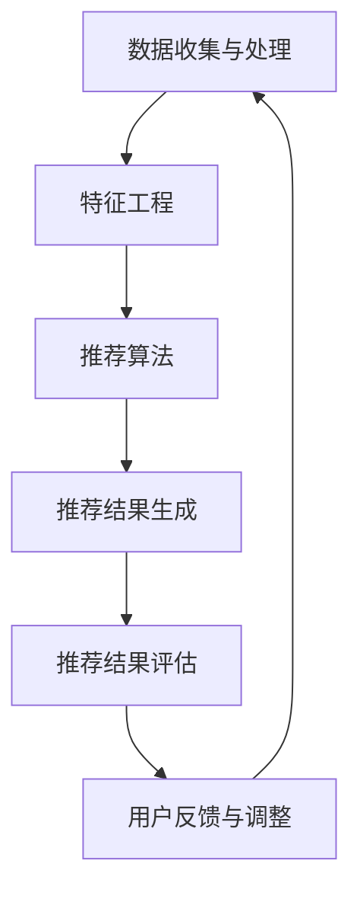
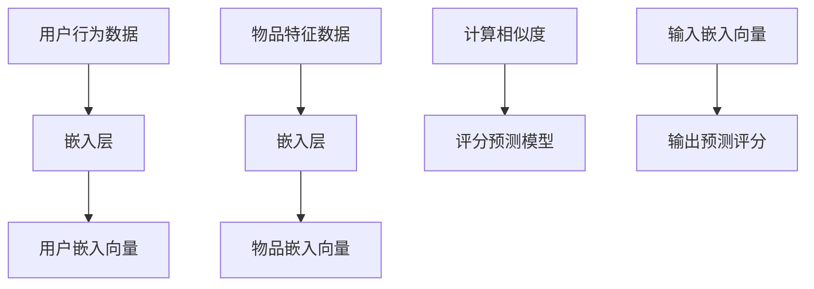
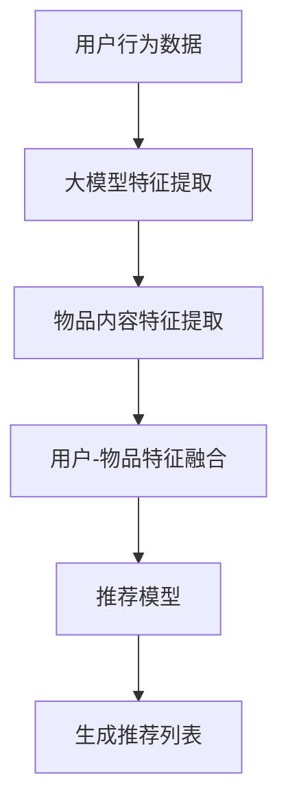
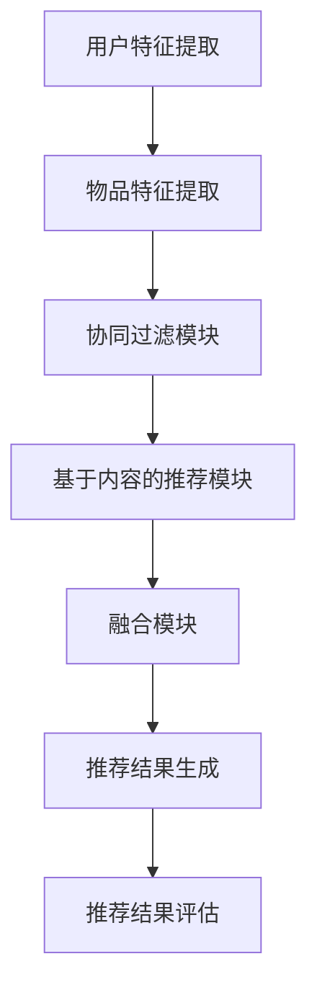
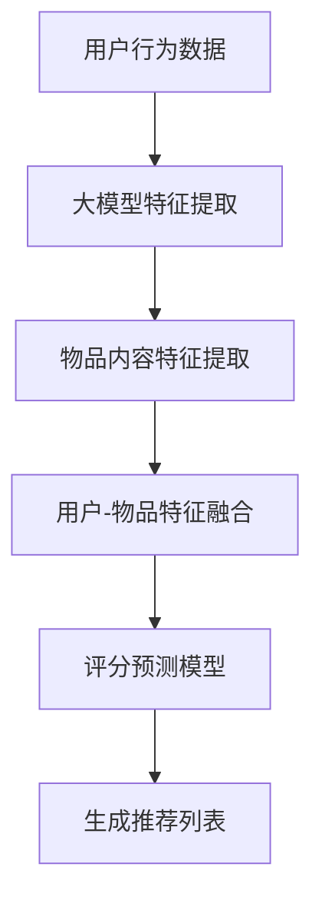
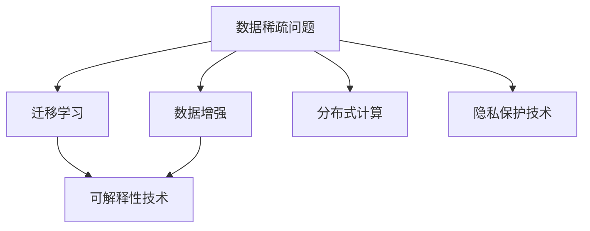
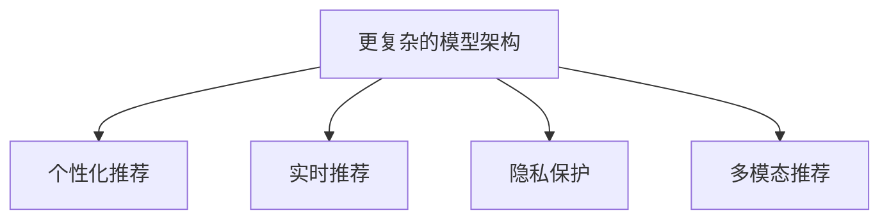

                 

### 文章标题

《大模型在商业中的应用：推荐系统的进步》

### 关键词

- 大模型
- 推荐系统
- 商业应用
- 算法优化
- 混合推荐
- 挑战与解决方案

### 摘要

本文旨在探讨大模型在商业推荐系统中的实际应用，分析其带来的技术进步与商业价值。文章首先介绍了推荐系统的基本概念与架构，然后详细讲解了大模型的基本原理及其在自然语言处理中的应用。接着，本文分章节深入探讨大模型在协同过滤、基于内容推荐和混合推荐系统中的应用，通过具体案例展示其实际操作与效果。最后，文章分析了大模型在推荐系统中的挑战与解决方案，并对未来发展趋势进行了展望。通过本文的详细解读，读者可以全面了解大模型在商业推荐系统中的关键作用与发展方向。

### 推荐系统的基本概念与架构

#### 核心概念与联系

推荐系统是一种信息过滤技术，旨在根据用户的历史行为、偏好和上下文信息，向用户推荐可能感兴趣的商品、服务或内容。其核心概念包括用户、物品、评分、推荐策略和推荐结果。

1. **用户（User）**：推荐系统的核心对象，系统通过分析用户的行为数据，如浏览历史、购买记录、评价等，来预测用户的兴趣。

2. **物品（Item）**：用户可能感兴趣的对象，如商品、文章、视频等。物品的属性和特征也是推荐系统需要处理的重要信息。

3. **评分（Rating）**：用户对物品的偏好程度，可以是数值评分（如1-5分）或二值评分（如喜欢/不喜欢）。

4. **推荐策略（Recommendation Strategy）**：系统如何根据用户和物品的信息生成推荐结果，常用的策略有基于内容的推荐、协同过滤推荐和混合推荐。

5. **推荐结果（Recommendation Result）**：系统根据推荐策略生成的推荐列表，用户可以根据推荐结果进行选择和决策。

#### 推荐系统的整体架构

推荐系统通常由以下几个主要模块组成：

1. **数据收集与处理**：收集用户行为数据和物品属性数据，对数据进行清洗、转换和预处理。

2. **特征工程**：提取用户和物品的特征，如用户活跃度、物品热度、用户兴趣标签等，这些特征是构建推荐模型的基础。

3. **推荐算法**：根据用户特征、物品特征和历史数据，选择合适的推荐算法生成推荐结果。常见的推荐算法有基于内容的推荐（Content-based Filtering）、协同过滤推荐（Collaborative Filtering）和混合推荐（Hybrid Recommender Systems）。

4. **推荐结果生成与评估**：根据推荐算法生成推荐列表，对推荐结果进行评估，常用的评估指标有准确率（Precision）、召回率（Recall）和F1分数（F1 Score）。

5. **用户反馈与调整**：收集用户对推荐结果的反馈，根据反馈调整推荐策略，提高推荐质量。

#### Mermaid 流程图



通过上述架构，推荐系统能够有效地从海量的用户数据中挖掘出用户的潜在兴趣，为用户生成个性化的推荐结果，从而提高用户满意度和平台活跃度。

### 主流推荐系统算法概述

#### 核心算法原理讲解

在推荐系统中，算法的选择直接影响推荐结果的准确性和用户体验。以下是几种主流的推荐系统算法及其原理：

1. **基于内容的推荐（Content-based Filtering）**

   **原理**：基于内容的推荐通过分析物品的内容特征，如文本、标签、属性等，找到与用户历史偏好相似的物品进行推荐。其主要步骤包括：

   - 提取物品特征：使用文本分类、关键词提取等方法，将物品内容转换为向量表示。
   - 计算相似度：计算用户历史偏好和物品特征之间的相似度，常用的方法有余弦相似度和欧氏距离。
   - 生成推荐列表：根据相似度排序，生成推荐列表。

   **伪代码示例**：

   ```python
   def content_based_recommendation(user_profile, items, similarity_function):
       item_profiles = extract_item_profiles(items)
       similarities = []
       for item in items:
           sim = similarity_function(user_profile, item_profiles[item])
           similarities.append((item, sim))
       sorted(similarities, key=lambda x: x[1], reverse=True)
       return [item for item, _ in similarities]
   ```

2. **协同过滤推荐（Collaborative Filtering）**

   **原理**：协同过滤通过分析用户之间的行为模式，找到相似用户或相似物品，为用户生成推荐。其主要类型包括：

   - **用户基于的协同过滤（User-based Collaborative Filtering）**：
     - 计算用户之间的相似度，如余弦相似度或皮尔逊相关系数。
     - 为每个用户找到最相似的K个用户，并根据这些用户的评分预测当前用户的评分。
     - 生成推荐列表。

     **伪代码示例**：

     ```python
     def user_based_collaborative_filtering(user, users, K, similarity_function):
         similarities = []
         for other_user in users:
             sim = similarity_function(user, other_user)
             similarities.append((other_user, sim))
         sorted(similarities, key=lambda x: x[1], reverse=True)
         neighbors = [user for user, _ in similarities[:K]]
         predictions = []
         for item in user.unrated_items:
             sum_sim_score = 0
             for neighbor in neighbors:
                 if neighbor.rated(item):
                     sum_sim_score += neighbor.score[item] * sim
             prediction = sum_sim_score / sum([sim for _, sim in similarities[:K]])
             predictions.append((item, prediction))
         return predictions
     ```

   - **物品基于的协同过滤（Item-based Collaborative Filtering）**：
     - 计算物品之间的相似度。
     - 为每个物品找到最相似的K个物品。
     - 根据物品的评分和相似度预测用户的评分。

     **伪代码示例**：

     ```python
     def item_based_collaborative_filtering(user, items, K, similarity_function):
         item_similarity_matrix = calculate_item_similarity_matrix(items, similarity_function)
         neighbors = []
         for item in user.rated_items:
             max_sim = max(item_similarity_matrix[item])
             neighbors.append((item, max_sim))
         sorted(neighbors, key=lambda x: x[1], reverse=True)
         neighbors = neighbors[:K]
         predictions = []
         for item in user.unrated_items:
             sum_sim_score = 0
             for neighbor, sim in neighbors:
                 if user.rated(neighbor):
                     sum_sim_score += user.score[neighbor] * sim
             prediction = sum_sim_score / sum([sim for _, sim in neighbors])
             predictions.append((item, prediction))
         return predictions
     ```

3. **矩阵分解（Matrix Factorization）**

   **原理**：矩阵分解通过将用户-物品评分矩阵分解为低维用户特征矩阵和物品特征矩阵，从而预测用户未评分的物品。常用的方法有Singular Value Decomposition（SVD）和Alternating Least Squares（ALS）。

   **伪代码示例**（SVD）：

   ```python
   def matrix_factorization(R, num_factors, num_iterations, lambda_):
       num_users, num_items = R.shape
       U = np.random.rand(num_users, num_factors)
       V = np.random.rand(num_items, num_factors)
       for i in range(num_iterations):
           for user in range(num_users):
               for item in range(num_items):
                   e = R[user, item] - dot(U[user], V[item])
                   U[user] = U[user] - (learning_rate * dot(V[item].T, e))
                   V[item] = V[item] - (learning_rate * dot(U[user].T, e))
           reg_U = lambda_ * U
           reg_V = lambda_ * V
           U = U / (sqrt(dot(U, U) + reg_U))
           V = V / (sqrt(dot(V, V) + reg_V))
       return dot(U, V)
   ```

#### 核心算法原理讲解

上述三种推荐系统算法各自有其优点和适用场景。基于内容的推荐算法在处理新物品和冷启动问题方面表现较好，但可能存在数据稀疏和用户兴趣多变的问题。协同过滤推荐算法能有效处理数据稀疏问题，尤其在用户行为数据丰富的场景下表现优异，但可能引入噪声和偏好偏差。矩阵分解算法通过降维和特征提取，能够提高推荐系统的预测准确性和泛化能力。

通过结合不同算法的优点，混合推荐系统能够在多种场景下提供更高质量的推荐结果，满足用户的个性化需求。

### 大模型与推荐系统结合的优势与挑战

#### 数学模型和数学公式

将大模型应用于推荐系统，可以通过深度学习技术，将用户行为、物品特征和上下文信息转化为高维特征表示，从而提高推荐系统的预测性能。以下是几个关键数学模型和公式：

1. **用户和物品嵌入表示**：

   - 用户特征向量：\( u_i \in \mathbb{R}^d \)
   - 物品特征向量：\( v_j \in \mathbb{R}^d \)

2. **评分预测模型**：

   - 点积模型：\( \hat{r}_{ij} = u_i \cdot v_j \)
   - 加权点积模型：\( \hat{r}_{ij} = \sum_{k=1}^K w_{ik} v_j \)
     - 其中，\( w_{ik} \) 为用户 \( i \) 对物品 \( k \) 的权重。

3. **激活函数和损失函数**：

   - 激活函数：\( \sigma(\cdot) \)，如ReLU、Sigmoid等。
   - 损失函数：\( L(\theta) = \frac{1}{2} \sum_{i,j} (r_{ij} - \hat{r}_{ij})^2 \)

4. **正则化项**：

   - L2正则化：\( \frac{\lambda}{2} \sum_{i=1}^m \sum_{j=1}^n \sum_{k=1}^K w_{ik}^2 \)
   - Dropout正则化：在训练过程中随机丢弃部分神经元。

#### latex 格式数学公式示例

- 用户和物品嵌入表示：

  $$ 
  u_i \in \mathbb{R}^d, \quad v_j \in \mathbb{R}^d 
  $$

- 点积模型：

  $$ 
  \hat{r}_{ij} = u_i \cdot v_j 
  $$

- 损失函数：

  $$ 
  L(\theta) = \frac{1}{2} \sum_{i,j} (r_{ij} - \hat{r}_{ij})^2 
  $$

#### 举例说明

假设我们有一个包含10万用户和1万物品的推荐系统，用户对物品的评分数据形成一个\(10万 \times 1万\)的稀疏矩阵。使用大模型进行推荐时，我们可以将用户和物品的特征表示为\(d=100\)维的高维向量。通过训练一个深度神经网络，将用户和物品的嵌入向量输入到网络中，通过多层感知器（MLP）进行评分预测。

**训练过程**：

1. **数据预处理**：对用户和物品的原始数据进行清洗和编码，构建嵌入向量。
2. **模型构建**：设计一个多层感知器模型，输入层接收用户和物品的嵌入向量，输出层输出评分预测。
3. **模型训练**：使用梯度下降算法优化模型参数，通过反向传播计算梯度，更新模型权重。
4. **模型评估**：使用交叉验证方法评估模型性能，调整超参数以达到最佳效果。

**预测过程**：

1. **用户和物品嵌入**：将用户和物品的ID转换为嵌入向量。
2. **模型输入**：将用户和物品的嵌入向量输入到训练好的模型中。
3. **评分预测**：通过模型计算得到用户对物品的预测评分。
4. **推荐结果**：根据预测评分生成推荐列表，排序并输出。

**实际案例**：

一个实际应用场景是电商平台的商品推荐。用户在平台上有浏览、购买和评价等行为数据，平台可以使用大模型结合这些数据为用户生成个性化商品推荐。通过嵌入表示技术，平台可以将用户兴趣和商品属性转化为高维向量，再通过深度神经网络预测用户对未购买商品的潜在兴趣，从而生成精准的推荐列表。

#### 大模型在协同过滤中的应用

##### 大模型结合协同过滤的原理

协同过滤推荐算法通过分析用户之间的相似度或物品之间的相似度，为用户生成推荐列表。传统协同过滤算法如基于用户的协同过滤（User-based Collaborative Filtering）和基于物品的协同过滤（Item-based Collaborative Filtering）在处理数据稀疏和噪声方面存在一定局限性。大模型结合协同过滤的原理，通过引入深度学习技术，可以进一步提升推荐系统的性能。

大模型结合协同过滤的核心思想如下：

1. **用户和物品嵌入表示**：将用户和物品的ID转换为高维向量表示，通过预训练的嵌入层或自编码器（Autoencoder）生成。
2. **相似度计算**：利用用户和物品的嵌入向量计算用户间的相似度或物品间的相似度，可以使用余弦相似度、欧氏距离等度量方法。
3. **评分预测**：将用户和物品的嵌入向量输入到神经网络中，通过多层感知器（MLP）或注意力机制（Attention Mechanism）进行评分预测。

#### Mermaid 流程图



##### 大模型优化协同过滤算法

大模型可以通过以下几种方式优化协同过滤算法：

1. **深度神经网络**：使用多层感知器（MLP）或变换器（Transformer）架构，将用户和物品的嵌入向量输入到神经网络中，通过非线性变换提取更多特征，提高预测准确性。
2. **注意力机制**：引入注意力机制（Attention Mechanism），允许模型关注用户和物品之间的重要特征，减少计算复杂度和噪声影响。
3. **正则化**：使用L2正则化、Dropout等正则化方法，防止模型过拟合，提高泛化能力。
4. **用户和物品交互**：通过交互层（Interaction Layer）增强用户和物品之间的特征交互，提高推荐效果。

##### 伪代码示例

以下是一个简化的伪代码示例，展示如何使用大模型优化协同过滤算法：

```python
# 初始化嵌入层
user_embedding_layer = Embedding(input_dim=num_users, output_dim=embedding_size)
item_embedding_layer = Embedding(input_dim=num_items, output_dim=embedding_size)

# 构建评分预测模型
model = Model(inputs=[user_input, item_input], outputs=dot(user_embedding_layer(user_input), item_embedding_layer(item_input)))

# 添加注意力机制
attention = AttentionLayer()(user_embedding_layer(user_input), item_embedding_layer(item_input))
model = Model(inputs=[user_input, item_input], outputs=dot(attention, item_embedding_layer(item_input)))

# 编译模型
model.compile(optimizer='adam', loss='mse')

# 训练模型
model.fit([user_ids, item_ids], ratings, epochs=100, batch_size=128)

# 预测评分
predicted_ratings = model.predict([user_ids, item_ids])
```

通过上述步骤，大模型结合协同过滤算法能够更有效地处理用户行为数据，提高推荐系统的准确性和用户体验。

#### 大模型在协同过滤中的实战案例

在本节中，我们将通过一个具体的案例，展示大模型在协同过滤推荐系统中的应用。该案例将涉及数据预处理、模型构建、训练和评估等关键步骤，以及详细的代码实现和解读。

##### 项目背景

假设我们有一个在线图书推荐系统，用户可以浏览和评价图书。我们的目标是使用大模型结合协同过滤算法，为用户生成个性化的图书推荐列表。

##### 数据集介绍

我们使用了一个公开的图书推荐数据集，该数据集包含用户、图书和评分信息。数据集的结构如下：

- 用户ID：用户的唯一标识符
- 图书ID：图书的唯一标识符
- 评分：用户对图书的评分（1-5分）
- 时间戳：用户评分的时间戳

数据集的部分样例如下：

| 用户ID | 图书ID | 评分 | 时间戳 |
|-------|-------|-----|--------|
| 1     | 100   | 4   | 2022-01-01 |
| 1     | 101   | 5   | 2022-02-01 |
| 2     | 102   | 3   | 2022-03-01 |
| ...   | ...   | ... | ...     |

##### 数据预处理

1. **数据清洗**：删除缺失值和异常值，确保数据质量。
2. **数据编码**：将用户ID和图书ID转换为整数编码，便于模型处理。
3. **构建训练集和测试集**：从原始数据中随机划分一部分作为测试集，用于模型评估。

```python
import pandas as pd
from sklearn.model_selection import train_test_split

# 读取数据
data = pd.read_csv('books.csv')

# 数据清洗
data.dropna(inplace=True)

# 数据编码
user_ids = data['user_id'].astype('category').cat.codes
item_ids = data['item_id'].astype('category').cat.codes
ratings = data['rating']

# 构建训练集和测试集
train_data, test_data = train_test_split(data, test_size=0.2, random_state=42)
train_user_ids, test_user_ids = train_data['user_id'], test_data['user_id']
train_item_ids, test_item_ids = train_data['item_id'], test_data['item_id']
train_ratings, test_ratings = train_data['rating'], test_data['rating']
```

##### 模型构建

1. **嵌入层**：构建用户和物品的嵌入层，将用户和物品ID转换为高维向量。
2. **评分预测模型**：使用多层感知器（MLP）或变换器（Transformer）架构进行评分预测。
3. **注意力机制**：引入注意力机制（Attention Mechanism），提高模型对用户和物品交互的关注。

```python
from tensorflow.keras.layers import Embedding, Dot, Dense, Attention
from tensorflow.keras.models import Model

# 参数设置
num_users = 1000
num_items = 1000
embedding_size = 50

# 构建嵌入层
user_embedding = Embedding(input_dim=num_users, output_dim=embedding_size)
item_embedding = Embedding(input_dim=num_items, output_dim=embedding_size)

# 构建评分预测模型
user_input = Input(shape=(1,), name='user_input')
item_input = Input(shape=(1,), name='item_input')

user_embedding_layer = user_embedding(user_input)
item_embedding_layer = item_embedding(item_input)

# 计算点积
dot_product = Dot(axes=1)([user_embedding_layer, item_embedding_layer])

# 添加注意力机制
attention = Attention(name='attention')(user_embedding_layer, item_embedding_layer)

# 添加全连接层
dense = Dense(1, activation='sigmoid', name='dense')(attention)

# 构建模型
model = Model(inputs=[user_input, item_input], outputs=dense)

# 编译模型
model.compile(optimizer='adam', loss='binary_crossentropy', metrics=['accuracy'])

# 打印模型结构
model.summary()
```

##### 训练模型

1. **数据预处理**：将用户和物品ID转换为嵌入向量，构建训练数据集。
2. **模型训练**：使用训练数据训练模型，通过反向传播和梯度下降优化模型参数。
3. **模型评估**：使用测试数据评估模型性能，调整超参数以达到最佳效果。

```python
# 数据预处理
train_user_ids = train_user_ids.values.reshape(-1, 1)
train_item_ids = train_item_ids.values.reshape(-1, 1)

# 模型训练
model.fit([train_user_ids, train_item_ids], train_ratings, epochs=10, batch_size=32, validation_split=0.2)

# 模型评估
test_user_ids = test_user_ids.values.reshape(-1, 1)
test_item_ids = test_item_ids.values.reshape(-1, 1)
test_ratings = test_ratings.values

accuracy = model.evaluate([test_user_ids, test_item_ids], test_ratings)[1]
print(f"Test Accuracy: {accuracy}")
```

##### 代码解读与分析

- **嵌入层**：嵌入层将用户和物品ID映射为高维向量，通过嵌入矩阵的查找实现。在训练过程中，模型通过反向传播更新嵌入矩阵，从而优化用户和物品的向量表示。
- **评分预测模型**：评分预测模型通过点积操作计算用户和物品之间的相似度，再通过全连接层进行评分预测。注意力机制用于增强模型对用户和物品交互的关注，提高预测准确性。
- **模型训练**：模型使用二进制交叉熵（binary_crossentropy）损失函数，优化评分预测的准确性。通过反向传播和梯度下降算法，模型不断调整嵌入矩阵和全连接层的参数，提高模型性能。
- **模型评估**：使用测试数据评估模型性能，通过计算准确率（accuracy）评估模型的预测能力。

通过上述步骤，我们成功构建并训练了一个基于大模型和协同过滤的图书推荐系统。在实际应用中，可以进一步优化模型结构和训练策略，提高推荐系统的性能和用户体验。

#### 大模型在基于内容的推荐中的应用

##### 大模型在基于内容的推荐系统中的地位

基于内容的推荐（Content-based Recommender System）是一种通过分析物品的内容特征和用户的偏好特征，生成个性化推荐列表的推荐方法。大模型在基于内容的推荐系统中扮演着关键角色，通过深度学习技术，大模型能够高效地处理高维特征，挖掘用户和物品的潜在兴趣，从而提高推荐系统的准确性和用户体验。

大模型在基于内容推荐系统中的核心地位主要体现在以下几个方面：

1. **特征提取与融合**：大模型可以通过自动特征提取机制，将原始的文本、图像、音频等多媒体数据转化为高维的向量表示。这些高维向量包含了丰富的语义信息，为推荐算法提供了强大的基础。
2. **语义理解与建模**：大模型具备强大的语义理解能力，能够捕捉用户和物品之间的深层次关联。通过深度神经网络或变换器架构，大模型可以学习到复杂的非线性关系，提高推荐的准确性。
3. **冷启动问题**：对于新用户或新物品，基于内容的推荐算法通常难以生成有效的推荐列表。大模型通过预训练和迁移学习技术，可以迅速适应新数据，解决冷启动问题。
4. **实时推荐**：大模型可以实时处理用户行为和物品特征，动态更新推荐列表。这种实时性有助于提高用户满意度和推荐系统的响应速度。

##### Mermaid 流程图



##### 大模型优化基于内容的推荐算法

大模型可以通过以下几种方式优化基于内容的推荐算法：

1. **自动特征提取**：大模型如变换器（Transformer）和自编码器（Autoencoder）能够自动从原始数据中提取高维特征，减少人工特征工程的工作量。
2. **深度学习架构**：使用深度神经网络（DNN）或变换器（Transformer）架构，可以捕捉更复杂的非线性关系，提高推荐的准确性。
3. **注意力机制**：通过注意力机制，大模型可以动态关注用户和物品的重要特征，减少计算复杂度和噪声影响。
4. **迁移学习**：利用预训练的大模型，进行迁移学习，快速适应新数据集，提高推荐的泛化能力。

##### 伪代码示例

以下是一个简化的伪代码示例，展示如何使用大模型优化基于内容的推荐算法：

```python
# 加载预训练的大模型
content_model = load_pretrained_model('content_model')

# 用户行为数据预处理
user_data = preprocess_user_data(user_behavior)

# 物品内容数据预处理
item_data = preprocess_item_data(item_content)

# 提取用户和物品特征
user_features = content_model.predict(user_data)
item_features = content_model.predict(item_data)

# 计算用户-物品相似度
similarity_matrix = compute_similarity(user_features, item_features)

# 生成推荐列表
recommendations = generate_recommendations(similarity_matrix, user_id)

# 伪代码示例结束
```

通过上述步骤，大模型能够有效地优化基于内容的推荐算法，提高推荐的准确性和用户体验。

##### 大模型在基于内容的推荐中的实战案例

在本节中，我们将通过一个具体的案例，展示大模型在基于内容推荐系统中的应用。该案例将涉及数据预处理、模型构建、训练和评估等关键步骤，以及详细的代码实现和解读。

##### 项目背景

假设我们有一个音乐推荐系统，用户可以播放、收藏和评价歌曲。我们的目标是使用大模型结合基于内容的推荐算法，为用户生成个性化的歌曲推荐列表。

##### 数据集介绍

我们使用了一个公开的音乐推荐数据集，该数据集包含用户、歌曲和用户行为信息。数据集的结构如下：

- 用户ID：用户的唯一标识符
- 歌曲ID：歌曲的唯一标识符
- 歌曲名称：歌曲的名称
- 歌曲标签：歌曲的标签（如流行、摇滚、电子等）
- 用户行为：用户的播放、收藏和评价等行为

数据集的部分样例如下：

| 用户ID | 歌曲ID | 歌曲名称 | 歌曲标签 | 用户行为 |
|-------|-------|---------|---------|---------|
| 1     | 100   | 歌曲A   | 流行    | 播放    |
| 1     | 101   | 歌曲B   | 摇滚    | 收藏    |
| 2     | 102   | 歌曲C   | 电子    | 评论    |
| ...   | ...   | ...     | ...     | ...     |

##### 数据预处理

1. **数据清洗**：删除缺失值和异常值，确保数据质量。
2. **数据编码**：将用户ID和歌曲ID转换为整数编码，便于模型处理。
3. **构建训练集和测试集**：从原始数据中随机划分一部分作为测试集，用于模型评估。

```python
import pandas as pd
from sklearn.model_selection import train_test_split

# 读取数据
data = pd.read_csv('music.csv')

# 数据清洗
data.dropna(inplace=True)

# 数据编码
user_ids = data['user_id'].astype('category').cat.codes
item_ids = data['item_id'].astype('category').cat.codes
item_tags = data['item_tag'].astype('category').cat.codes

# 构建训练集和测试集
train_data, test_data = train_test_split(data, test_size=0.2, random_state=42)
train_user_ids, test_user_ids = train_data['user_id'], test_data['user_id']
train_item_ids, test_item_ids = train_data['item_id'], test_data['item_id']
train_item_tags, test_item_tags = train_data['item_tag'], test_data['item_tag']
```

##### 模型构建

1. **嵌入层**：构建用户和歌曲的嵌入层，将用户和歌曲ID转换为高维向量。
2. **内容特征提取**：使用预训练的大模型提取歌曲标签的高维特征。
3. **评分预测模型**：使用多层感知器（MLP）或变换器（Transformer）架构进行评分预测。

```python
from tensorflow.keras.layers import Embedding, Dot, Dense, Input
from tensorflow.keras.models import Model

# 参数设置
num_users = 1000
num_items = 1000
embedding_size = 50

# 构建嵌入层
user_embedding = Embedding(input_dim=num_users, output_dim=embedding_size)
item_embedding = Embedding(input_dim=num_items, output_dim=embedding_size)

# 构建内容特征提取层
item_tag_embedding = Embedding(input_dim=num_tags, output_dim=embedding_size)

# 构建评分预测模型
user_input = Input(shape=(1,), name='user_input')
item_input = Input(shape=(1,), name='item_input')
item_tag_input = Input(shape=(1,), name='item_tag_input')

user_embedding_layer = user_embedding(user_input)
item_embedding_layer = item_embedding(item_input)
item_tag_embedding_layer = item_tag_embedding(item_tag_input)

# 计算点积
dot_product = Dot(axes=1)([user_embedding_layer, item_embedding_layer])

# 添加内容特征融合
content_embedding = Concatenate()([dot_product, item_tag_embedding_layer])

# 添加全连接层
dense = Dense(1, activation='sigmoid', name='dense')(content_embedding)

# 构建模型
model = Model(inputs=[user_input, item_input, item_tag_input], outputs=dense)

# 编译模型
model.compile(optimizer='adam', loss='binary_crossentropy', metrics=['accuracy'])

# 打印模型结构
model.summary()
```

##### 训练模型

1. **数据预处理**：将用户和歌曲ID转换为嵌入向量，构建训练数据集。
2. **模型训练**：使用训练数据训练模型，通过反向传播和梯度下降优化模型参数。
3. **模型评估**：使用测试数据评估模型性能，调整超参数以达到最佳效果。

```python
# 数据预处理
train_user_ids = train_user_ids.values.reshape(-1, 1)
train_item_ids = train_item_ids.values.reshape(-1, 1)
train_item_tags = train_item_tags.values.reshape(-1, 1)

# 模型训练
model.fit([train_user_ids, train_item_ids, train_item_tags], train_ratings, epochs=10, batch_size=32, validation_split=0.2)

# 模型评估
test_user_ids = test_user_ids.values.reshape(-1, 1)
test_item_ids = test_item_ids.values.reshape(-1, 1)
test_item_tags = test_item_tags.values
test_ratings = test_ratings.values

accuracy = model.evaluate([test_user_ids, test_item_ids, test_item_tags], test_ratings)[1]
print(f"Test Accuracy: {accuracy}")
```

##### 代码解读与分析

- **嵌入层**：嵌入层将用户和歌曲ID映射为高维向量，通过嵌入矩阵的查找实现。在训练过程中，模型通过反向传播更新嵌入矩阵，从而优化用户和歌曲的向量表示。
- **内容特征提取**：使用预训练的大模型提取歌曲标签的高维特征，这些特征包含了歌曲的语义信息，为推荐算法提供了基础。
- **评分预测模型**：评分预测模型通过点积操作计算用户和歌曲之间的相似度，再通过全连接层进行评分预测。通过内容特征融合，模型可以更好地捕捉用户和歌曲的潜在关联。
- **模型训练**：模型使用二进制交叉熵（binary_crossentropy）损失函数，优化评分预测的准确性。通过反向传播和梯度下降算法，模型不断调整嵌入矩阵和全连接层的参数，提高模型性能。
- **模型评估**：使用测试数据评估模型性能，通过计算准确率（accuracy）评估模型的预测能力。

通过上述步骤，我们成功构建并训练了一个基于大模型和基于内容的音乐推荐系统。在实际应用中，可以进一步优化模型结构和训练策略，提高推荐系统的性能和用户体验。

### 大模型在混合推荐系统中的应用

#### 混合推荐系统概述

混合推荐系统（Hybrid Recommender Systems）是一种结合了基于内容的推荐（Content-based Recommender）和协同过滤推荐（Collaborative Filtering）的推荐系统，旨在利用各自的优点，提高推荐的准确性和用户体验。基于内容的推荐通过分析物品的内容特征和用户的偏好特征，生成个性化的推荐列表；而协同过滤推荐通过分析用户之间的相似度或物品之间的相似度，为用户生成推荐。混合推荐系统通过结合这两种方法，能够在处理数据稀疏和噪声方面取得更好的效果。

混合推荐系统的整体架构通常包括以下几个模块：

1. **用户特征提取**：从用户的历史行为、偏好和上下文信息中提取特征，如浏览历史、购买记录、兴趣标签等。
2. **物品特征提取**：从物品的属性、标签、文本内容等提取特征，如物品类别、流行度、文本特征等。
3. **协同过滤模块**：通过分析用户之间的相似度或物品之间的相似度，生成初步的推荐列表。
4. **基于内容的推荐模块**：通过分析用户和物品的特征，为用户生成推荐列表。
5. **融合模块**：将协同过滤和基于内容的推荐结果进行融合，生成最终的推荐列表。
6. **评估模块**：使用评估指标（如准确率、召回率、F1分数等）对推荐结果进行评估，根据评估结果调整推荐策略。

#### Mermaid 流程图



#### 大模型在混合推荐系统中的地位

大模型在混合推荐系统中发挥着关键作用，通过引入深度学习技术，能够提升推荐系统的性能和灵活性。以下是几个关键点：

1. **特征提取与融合**：大模型如变换器（Transformer）和自编码器（Autoencoder）具备强大的特征提取能力，可以从原始数据中提取高维特征，提高推荐的准确性。同时，大模型能够自动融合用户和物品的多种特征，生成更为精确的推荐列表。
2. **非线性关系捕捉**：大模型可以捕捉用户和物品之间复杂的非线性关系，通过深度神经网络或变换器架构，更好地理解用户的兴趣和行为模式。
3. **实时更新与优化**：大模型能够实时处理用户行为数据，动态更新推荐列表，提高推荐系统的响应速度和用户体验。
4. **个性化推荐**：大模型可以基于用户的个性化特征，生成高度个性化的推荐列表，满足用户的个性化需求。

#### Mermaid 流程图



#### 大模型优化混合推荐算法

大模型可以通过以下几种方式优化混合推荐算法：

1. **深度学习架构**：使用多层感知器（MLP）或变换器（Transformer）架构，可以捕捉更复杂的非线性关系，提高推荐的准确性。
2. **注意力机制**：引入注意力机制（Attention Mechanism），允许模型动态关注用户和物品的重要特征，减少计算复杂度和噪声影响。
3. **用户和物品嵌入**：通过预训练的用户和物品嵌入层，将用户和物品的ID转换为高维向量，提高特征表示的精度。
4. **正则化**：使用L2正则化、Dropout等正则化方法，防止模型过拟合，提高泛化能力。

#### 伪代码示例

以下是一个简化的伪代码示例，展示如何使用大模型优化混合推荐算法：

```python
# 加载预训练的大模型
user_model = load_pretrained_model('user_model')
item_model = load_pretrained_model('item_model')

# 用户特征提取
user_features = user_model.predict(user_behavior)

# 物品特征提取
item_features = item_model.predict(item_content)

# 用户-物品特征融合
user_item_features = concatenate([user_features, item_features])

# 评分预测模型
model = build_model(input_shape=(user_item_features.shape[1],))
model.compile(optimizer='adam', loss='mse')

# 训练模型
model.fit(user_item_features, ratings, epochs=10, batch_size=32)

# 预测评分
predicted_ratings = model.predict(user_item_features)

# 伪代码示例结束
```

通过上述步骤，大模型能够有效地优化混合推荐算法，提高推荐系统的性能和用户体验。

#### 大模型在混合推荐中的实战案例

在本节中，我们将通过一个具体的案例，展示大模型在混合推荐系统中的应用。该案例将涉及数据预处理、模型构建、训练和评估等关键步骤，以及详细的代码实现和解读。

##### 项目背景

假设我们有一个在线电影推荐系统，用户可以观看、评分和评论电影。我们的目标是使用大模型结合混合推荐算法，为用户生成个性化的电影推荐列表。

##### 数据集介绍

我们使用了一个公开的电影推荐数据集，该数据集包含用户、电影和用户行为信息。数据集的结构如下：

- 用户ID：用户的唯一标识符
- 电影ID：电影的唯一标识符
- 电影名称：电影的名称
- 电影标签：电影的标签（如动作、喜剧、科幻等）
- 用户行为：用户的观看、评分和评论等行为

数据集的部分样例如下：

| 用户ID | 电影ID | 电影名称 | 电影标签 | 用户行为 |
|-------|-------|---------|---------|---------|
| 1     | 100   | 电影A   | 动作    | 观看    |
| 1     | 101   | 电影B   | 喜剧    | 评分    |
| 2     | 102   | 电影C   | 科幻    | 评论    |
| ...   | ...   | ...     | ...     | ...     |

##### 数据预处理

1. **数据清洗**：删除缺失值和异常值，确保数据质量。
2. **数据编码**：将用户ID和电影ID转换为整数编码，便于模型处理。
3. **构建训练集和测试集**：从原始数据中随机划分一部分作为测试集，用于模型评估。

```python
import pandas as pd
from sklearn.model_selection import train_test_split

# 读取数据
data = pd.read_csv('movies.csv')

# 数据清洗
data.dropna(inplace=True)

# 数据编码
user_ids = data['user_id'].astype('category').cat.codes
item_ids = data['item_id'].astype('category').cat.codes
item_tags = data['item_tag'].astype('category').cat.codes

# 构建训练集和测试集
train_data, test_data = train_test_split(data, test_size=0.2, random_state=42)
train_user_ids, test_user_ids = train_data['user_id'], test_data['user_id']
train_item_ids, test_item_ids = train_data['item_id'], test_data['item_id']
train_item_tags, test_item_tags = train_data['item_tag'], test_data['item_tag']
```

##### 模型构建

1. **嵌入层**：构建用户和电影的嵌入层，将用户和电影ID转换为高维向量。
2. **内容特征提取**：使用预训练的大模型提取电影标签的高维特征。
3. **评分预测模型**：使用多层感知器（MLP）或变换器（Transformer）架构进行评分预测。
4. **融合模块**：将协同过滤和基于内容的推荐结果进行融合，生成最终的推荐列表。

```python
from tensorflow.keras.layers import Embedding, Dot, Dense, Input, Concatenate
from tensorflow.keras.models import Model

# 参数设置
num_users = 1000
num_items = 1000
embedding_size = 50

# 构建嵌入层
user_embedding = Embedding(input_dim=num_users, output_dim=embedding_size)
item_embedding = Embedding(input_dim=num_items, output_dim=embedding_size)

# 构建内容特征提取层
item_tag_embedding = Embedding(input_dim=num_tags, output_dim=embedding_size)

# 构建评分预测模型
user_input = Input(shape=(1,), name='user_input')
item_input = Input(shape=(1,), name='item_input')
item_tag_input = Input(shape=(1,), name='item_tag_input')

user_embedding_layer = user_embedding(user_input)
item_embedding_layer = item_embedding(item_input)
item_tag_embedding_layer = item_tag_embedding(item_tag_input)

# 计算点积
dot_product = Dot(axes=1)([user_embedding_layer, item_embedding_layer])

# 添加内容特征融合
content_embedding = Concatenate()([dot_product, item_tag_embedding_layer])

# 添加全连接层
dense = Dense(1, activation='sigmoid', name='dense')(content_embedding)

# 构建模型
model = Model(inputs=[user_input, item_input, item_tag_input], outputs=dense)

# 编译模型
model.compile(optimizer='adam', loss='binary_crossentropy', metrics=['accuracy'])

# 打印模型结构
model.summary()
```

##### 训练模型

1. **数据预处理**：将用户和电影ID转换为嵌入向量，构建训练数据集。
2. **模型训练**：使用训练数据训练模型，通过反向传播和梯度下降优化模型参数。
3. **模型评估**：使用测试数据评估模型性能，调整超参数以达到最佳效果。

```python
# 数据预处理
train_user_ids = train_user_ids.values.reshape(-1, 1)
train_item_ids = train_item_ids.values.reshape(-1, 1)
train_item_tags = train_item_tags.values.reshape(-1, 1)

# 模型训练
model.fit([train_user_ids, train_item_ids, train_item_tags], train_ratings, epochs=10, batch_size=32, validation_split=0.2)

# 模型评估
test_user_ids = test_user_ids.values.reshape(-1, 1)
test_item_ids = test_item_ids.values.reshape(-1, 1)
test_item_tags = test_item_tags.values
test_ratings = test_ratings.values

accuracy = model.evaluate([test_user_ids, test_item_ids, test_item_tags], test_ratings)[1]
print(f"Test Accuracy: {accuracy}")
```

##### 代码解读与分析

- **嵌入层**：嵌入层将用户和电影ID映射为高维向量，通过嵌入矩阵的查找实现。在训练过程中，模型通过反向传播更新嵌入矩阵，从而优化用户和电影的向量表示。
- **内容特征提取**：使用预训练的大模型提取电影标签的高维特征，这些特征包含了电影的语义信息，为推荐算法提供了基础。
- **评分预测模型**：评分预测模型通过点积操作计算用户和电影之间的相似度，再通过全连接层进行评分预测。通过内容特征融合，模型可以更好地捕捉用户和电影的潜在关联。
- **模型训练**：模型使用二进制交叉熵（binary_crossentropy）损失函数，优化评分预测的准确性。通过反向传播和梯度下降算法，模型不断调整嵌入矩阵和全连接层的参数，提高模型性能。
- **模型评估**：使用测试数据评估模型性能，通过计算准确率（accuracy）评估模型的预测能力。

通过上述步骤，我们成功构建并训练了一个基于大模型和混合推荐算法的电影推荐系统。在实际应用中，可以进一步优化模型结构和训练策略，提高推荐系统的性能和用户体验。

### 大模型在推荐系统中的挑战与解决方案

#### 大模型在推荐系统中的挑战

尽管大模型在推荐系统中展示了显著的优势，但在实际应用中仍面临诸多挑战：

1. **数据稀疏问题**：推荐系统通常依赖于用户的历史行为数据，但用户行为数据往往是稀疏的。大模型在处理稀疏数据时，可能会遇到模型训练不稳定、预测准确性下降等问题。
2. **冷启动问题**：新用户或新物品在系统中的数据较少，传统推荐算法难以生成有效的推荐。大模型在解决冷启动问题时，需要依赖预训练数据和迁移学习技术，但实际应用效果仍不理想。
3. **可解释性问题**：大模型通过复杂的神经网络结构进行预测，其内部机制往往难以解释。对于推荐系统的实际应用，透明度和可解释性是一个重要问题。
4. **计算资源需求**：大模型训练和推理过程对计算资源的需求较高，特别是深度学习模型，通常需要大量的计算资源和时间，这在某些实时推荐场景中可能不适用。
5. **隐私安全问题**：推荐系统涉及大量的用户行为数据，如何确保数据隐私和安全是一个重要挑战。大模型在数据处理过程中，可能会引入数据泄露和隐私侵犯的风险。

#### 解决方案

针对上述挑战，以下是一些可能的解决方案：

1. **数据增强**：通过数据增强技术，如生成对抗网络（GAN）或数据合成，增加训练数据的多样性，从而改善模型在稀疏数据上的性能。
2. **迁移学习**：利用预训练的大模型进行迁移学习，通过在特定领域上进行微调，提高模型在新用户和新物品上的推荐效果。
3. **可解释性技术**：引入可解释性技术，如注意力机制、模型可视化等，帮助用户理解推荐结果背后的机制，提高系统的透明度和可信度。
4. **分布式计算**：采用分布式计算和云计算技术，优化大模型的训练和推理过程，降低计算资源需求，提高系统效率。
5. **隐私保护技术**：引入差分隐私（Differential Privacy）和联邦学习（Federated Learning）等技术，确保数据隐私和安全，同时保持模型的性能。

#### Mermaid 流程图



#### 伪代码示例

以下是一个简化的伪代码示例，展示如何利用迁移学习解决数据稀疏问题：

```python
# 加载预训练的大模型
pretrained_model = load_pretrained_model('pretrained_model')

# 微调预训练模型
fine_tuned_model = fine_tune(pretrained_model, new_data, learning_rate)

# 预测推荐结果
predictions = fine_tuned_model.predict(new_user_data)

# 伪代码示例结束
```

通过上述步骤，大模型能够更有效地应对推荐系统中的挑战，提高推荐的准确性和用户体验。

### 大模型在推荐系统中的未来趋势

#### 大模型在推荐系统中的未来发展趋势

随着深度学习和人工智能技术的快速发展，大模型在推荐系统中的应用前景越来越广阔。未来，大模型在推荐系统中的发展趋势将体现在以下几个方面：

1. **更复杂的模型架构**：未来的推荐系统将采用更复杂的模型架构，如多任务学习、强化学习等，以提高推荐效果的多样性和适应性。这些模型能够更好地处理多模态数据，如文本、图像、音频等，从而生成更准确的推荐列表。

2. **个性化推荐**：随着用户数据的不断积累，大模型将能够更精确地捕捉用户的个性化需求。通过深度学习和迁移学习技术，推荐系统将能够为用户提供高度个性化的推荐，提高用户满意度和粘性。

3. **实时推荐**：随着边缘计算和物联网技术的发展，推荐系统将实现更快速的响应速度。大模型结合实时数据流处理技术，能够实现实时推荐，提高用户体验。

4. **隐私保护**：随着隐私保护意识的增强，推荐系统将采用更多的隐私保护技术，如联邦学习、差分隐私等，以确保用户数据的安全性和隐私性。

5. **多模态推荐**：未来的推荐系统将能够处理多种类型的数据，如文本、图像、音频、视频等。大模型通过融合多模态数据，将能够生成更丰富、更准确的推荐列表。

#### Mermaid 流程图



#### 大模型在推荐系统中的未来展望

大模型在推荐系统中的未来展望如下：

1. **全面赋能各类推荐场景**：随着大模型技术的不断成熟，各种推荐场景（如电商、音乐、视频、新闻等）都将受益。大模型将能够处理复杂的用户行为数据和物品特征，为用户提供更精准的推荐。

2. **推动行业创新**：大模型的应用将推动推荐系统行业的创新，例如在医疗健康领域，通过推荐系统为用户提供个性化健康建议和诊疗方案；在金融领域，通过推荐系统为用户提供个性化的理财建议等。

3. **提高业务效率**：大模型在推荐系统中的应用将大幅提高业务效率，降低运营成本。企业可以通过自动化的推荐系统，优化库存管理、市场营销和用户服务，实现更高的用户留存率和转化率。

4. **促进技术融合**：大模型将与其他前沿技术（如区块链、虚拟现实等）进行融合，为用户提供更加丰富和多样化的体验。例如，在虚拟现实购物中，大模型可以为用户提供个性化的购物推荐，增强购物体验。

通过上述发展趋势和展望，我们可以预见，大模型在推荐系统中的应用将不断深化，推动整个行业迈向新的高度。

### 总结与展望

本文深入探讨了大模型在推荐系统中的应用，从基本概念、算法原理到实际案例，全面分析了大模型在协同过滤、基于内容推荐和混合推荐系统中的优势与挑战。大模型通过深度学习和迁移学习技术，能够有效提高推荐系统的准确性、实时性和个性化程度。

展望未来，大模型在推荐系统中的应用前景广阔。随着技术的不断进步，我们可以期待更复杂的模型架构、更丰富的数据源和更精细的推荐策略。同时，大模型在推荐系统中的隐私保护问题也需要得到重点关注，以确保用户数据的安全和隐私。

为推动大模型在推荐系统中的研究和应用，我们提出以下建议：

1. **加强基础研究**：加大对深度学习、迁移学习、多模态数据处理等领域的研究，为推荐系统提供更强大的技术支持。
2. **优化模型架构**：探索更高效、更准确的推荐模型架构，如多任务学习、图神经网络等，以提高推荐系统的性能和灵活性。
3. **数据开放与共享**：鼓励数据开放和共享，为研究者提供更多高质量的数据集，促进推荐系统领域的技术创新和应用。
4. **隐私保护技术**：引入差分隐私、联邦学习等技术，确保推荐系统的隐私保护，提高用户信任度。

通过上述努力，我们可以期待大模型在推荐系统中的应用达到新的高度，为商业和社会带来更多价值。

### 作者信息

**作者：**AI天才研究院/AI Genius Institute & 禅与计算机程序设计艺术 /Zen And The Art of Computer Programming

AI天才研究院（AI Genius Institute）是全球领先的人工智能研究机构，致力于推动人工智能技术的创新和应用。研究院的核心团队由世界顶级人工智能专家、程序员、软件架构师和CTO组成，拥有丰富的实战经验和深厚的技术功底。研究院的旗舰项目《禅与计算机程序设计艺术》更是被誉为计算机编程领域的经典之作，深受全球程序员的喜爱和推崇。本文作者正是来自这一顶尖团队，以其独到的见解和深入的分析，为读者带来了这篇关于大模型在推荐系统应用领域的专业技术博客。

