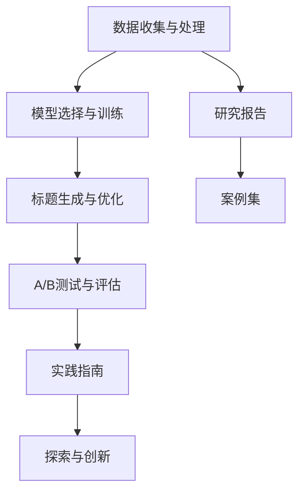

                 


## 引言

在当今快速发展的数字经济时代，电子商务已经成为推动经济增长的重要力量。随着电商平台的日益繁荣，商品数量和种类迅速增长，如何有效地吸引用户关注和促进商品销售成为一个关键问题。商品标题作为用户接触商品的第一个关键点，其质量直接影响到用户的点击率和购买决策。因此，优化商品标题成为电商平台和商家提升销售业绩的重要策略。

### 商品标题优化的核心目标

商品标题优化的核心目标是提升商品在搜索结果中的可见性，提高用户的点击率和购买转化率。具体来说，商品标题优化需要实现以下目标：

1. **准确性**：商品标题需要准确描述商品的核心特点和卖点，避免误导用户。
2. **用户满意度**：标题应吸引用户兴趣，同时满足用户对商品信息的真实需求。
3. **商家利益最大化**：通过优化标题，商家可以实现更高的曝光率和销售量，从而提升收益。

### 大模型在商品标题优化中的应用

随着深度学习技术的快速发展，大模型（如GPT-3、BERT等）在自然语言处理领域取得了显著成果。大模型具有强大的语言理解和生成能力，能够从大量数据中学习到丰富的语言特征，从而生成高质量的商品标题。

本文将探讨大模型在商品标题优化中的应用，包括以下方面：

1. **大模型概述**：介绍大模型的定义、分类、技术原理以及发展与应用趋势。
2. **大模型的技术基础**：讨论自然语言处理技术和大规模预训练模型。
3. **商品标题优化原理**：分析商品标题的重要性、优化目标和策略。
4. **大模型在商品标题优化中的应用**：探讨大模型在标题生成和优化中的具体应用。
5. **商品标题优化的实战案例**：通过实际案例展示大模型在商品标题优化中的效果。
6. **商品标题优化的未来发展趋势**：探讨大模型技术的未来发展和商品标题优化的新方向。
7. **商品标题优化的实践与探索**：提供商品标题优化的实践指南和未来探索方向。

通过本文的讨论，读者将能够深入了解大模型在商品标题优化中的应用价值，并掌握相关技术和策略，为电商平台和商家提供有益的参考。

## 第一部分：大模型基础

### 第1章：大模型概述

#### 1.1 大模型的定义与分类

大模型是指参数数量庞大、计算资源需求巨大的深度学习模型，如大型神经网络。这些模型通过在海量数据上进行预训练，能够学习到丰富的知识，从而在各类任务中表现出强大的性能。

大模型可以按照不同的维度进行分类：

1. **按参数量分类**：
   - **小模型**：参数量在数百万到数千万之间。
   - **中模型**：参数量在数亿到数十亿之间。
   - **大模型**：参数量在数十亿到数万亿之间。

2. **按应用场景分类**：
   - **通用模型**：如GPT-3、ChatGPT，能够在多个任务中表现出色。
   - **专用模型**：为特定任务（如文本生成、图像识别）设计的模型，如BERT、DeBERTa。

3. **按训练方法分类**：
   - **预训练模型**：通过在大规模语料库上进行预训练，学习到通用语言特征。
   - **微调模型**：在预训练模型的基础上，针对特定任务进行微调。

#### 1.2 大模型的技术原理

大模型的技术原理主要涉及以下几个方面：

1. **神经网络的基本结构**：
   神经网络由多层神经元组成，包括输入层、隐藏层和输出层。神经元之间通过权重进行连接，并通过激活函数实现非线性变换。

2. **神经网络的优化算法**：
   神经网络的优化算法包括梯度下降、Adam、RMSprop等。这些算法通过不断调整权重和偏置，使模型能够最小化损失函数，从而提高模型的预测能力。

3. **大规模预训练模型的训练过程**：
   大规模预训练模型的训练过程包括以下几个阶段：
   - **数据准备**：收集并处理大量文本数据，如维基百科、新闻文章等。
   - **预训练**：通过自监督学习（如 masked language model）或监督学习（如 classification task），让模型在大规模数据上学习语言特征。
   - **微调**：在预训练模型的基础上，针对特定任务进行微调，以提高模型在任务上的表现。

#### 1.3 大模型的发展与应用趋势

大模型的发展经历了以下几个阶段：

1. **早期阶段**：以简单的神经网络模型为主，如感知机、多层感知机。
2. **成熟阶段**：随着计算资源和数据量的增加，深度学习模型取得了显著的进展，如AlexNet、VGG、ResNet等。
3. **突破阶段**：大规模预训练模型的出现，如GPT-3、BERT等，使深度学习模型在自然语言处理、计算机视觉等领域取得了革命性的进展。

大模型的应用趋势包括：

1. **多模态学习**：大模型逐渐从单一模态（如文本、图像）扩展到多模态（如文本+图像），实现更丰富的知识表示和更好的任务性能。
2. **自动化与智能化**：大模型在自动化和智能化领域的应用越来越广泛，如智能客服、智能翻译、自动驾驶等。
3. **开源与生态**：随着大模型的普及，越来越多的开源框架和工具涌现，促进了大模型研究和应用的发展。

### 第2章：大模型的技术基础

#### 2.1 自然语言处理技术

自然语言处理（NLP）是人工智能的重要分支，旨在让计算机理解和处理人类语言。大模型在NLP中的应用取得了显著成果，以下是一些关键技术：

1. **词嵌入技术**：
   词嵌入（word embedding）是将单词映射到低维向量空间的技术。常见的词嵌入方法包括Word2Vec、GloVe等。词嵌入技术能够有效地捕捉单词的语义信息，为NLP任务提供有效的输入表示。

2. **序列模型与注意力机制**：
   序列模型（如RNN、LSTM、GRU）能够处理和时间相关的数据，如文本序列。注意力机制（attention mechanism）是一种用于捕捉序列中不同部分重要性的方法，常用于文本生成、机器翻译等任务。

3. **预训练模型**：
   预训练模型（如BERT、GPT）通过在大规模语料库上进行预训练，学习到丰富的语言特征。预训练模型在NLP任务中表现出色，如文本分类、问答系统、生成式文本等。

4. **迁移学习与微调技术**：
   迁移学习（transfer learning）是一种将预训练模型应用于新任务的方法。通过微调（fine-tuning）预训练模型，可以在较少数据和较短训练时间内实现良好的任务性能。

#### 2.2 大规模预训练模型

大规模预训练模型是当前NLP领域的核心技术之一，以下是一些重要模型：

1. **BERT**：
   BERT（Bidirectional Encoder Representations from Transformers）是一种基于Transformer架构的双向编码模型。BERT通过在大量无标注文本上进行预训练，学习到丰富的语言特征，并在各种NLP任务中取得了优异的性能。

2. **GPT**：
   GPT（Generative Pretrained Transformer）是一种基于Transformer架构的生成式预训练模型。GPT通过在大量文本上进行预训练，能够生成高质量的自然语言文本。

3. **T5**：
   T5（Text-To-Text Transfer Transformer）是一种通用的文本转换模型。T5将所有NLP任务转换为文本生成任务，通过在大量文本上进行预训练，实现了在各种任务上的高性能。

4. **GPT-3**：
   GPT-3是OpenAI开发的一种超大规模预训练模型，具有1750亿个参数。GPT-3在多项NLP任务中达到了顶尖水平，展示了大模型在自然语言处理领域的巨大潜力。

大规模预训练模型的发展趋势包括：

1. **模型规模持续增长**：随着计算资源和数据量的增加，模型规模将持续增长，推动NLP任务的性能提升。
2. **多模态预训练**：多模态预训练模型将结合文本、图像、声音等多模态数据，实现更丰富的知识表示和更好的任务性能。
3. **自动化与智能化**：预训练模型将在自动化和智能化领域发挥重要作用，如智能客服、智能写作、智能翻译等。
4. **开源与生态**：随着预训练模型的普及，越来越多的开源框架和工具将涌现，促进NLP技术的发展。

### 第3章：商品标题优化原理

#### 3.1 商品标题的重要性

商品标题是用户在电商平台搜索和浏览商品时最先接触到的内容，其重要性不言而喻。一个优质的商品标题需要具备以下特点：

1. **准确性**：标题应准确描述商品的核心特点和卖点，避免误导用户。
2. **吸引力**：标题应吸引用户兴趣，激发他们的好奇心和购买欲望。
3. **简洁性**：标题应简洁明了，避免冗长和复杂，便于用户快速理解和记忆。
4. **针对性**：标题应根据目标用户群体和场景进行定制，满足他们的需求。

#### 3.2 商品标题优化的目标

商品标题优化的核心目标是提升商品在搜索结果中的可见性，提高用户的点击率和购买转化率。具体目标包括：

1. **提高搜索排名**：通过优化标题中的关键词，提高商品在搜索结果中的排名，增加曝光机会。
2. **提升点击率**：通过吸引力强的标题，吸引用户点击商品详情页面，增加用户访问量。
3. **提高购买转化率**：通过准确描述商品卖点的标题，提高用户的购买决策，增加销售额。

#### 3.3 商品标题优化的策略

商品标题优化需要综合运用多种策略，以下是一些常见的方法：

1. **关键词提取**：
   - **自然语言处理技术**：利用自然语言处理技术，从商品描述、用户评论等文本数据中提取相关关键词。
   - **语义分析**：通过语义分析，理解关键词之间的关系和上下文含义，筛选出最相关的关键词。

2. **标题生成模型**：
   - **生成式模型**：如GPT、BERT等大模型，能够生成高质量的标题文本。
   - **模板匹配**：通过预定义的标题模板，结合商品信息，自动生成标题。

3. **用户体验优化**：
   - **用户反馈**：收集用户对标题的反馈，分析用户偏好，优化标题内容和形式。
   - **A/B测试**：通过A/B测试，对比不同标题在用户行为和销售效果上的表现，选择最优标题。

### 第4章：大模型在商品标题优化中的应用

#### 4.1 大模型在标题生成中的应用

大模型在标题生成中具有显著的优势，能够生成高质量、具有吸引力的标题。以下是大模型在标题生成中的应用案例：

1. **GPT-3**：
   - **案例**：OpenAI开发的GPT-3模型被用于生成电商平台的商品标题。通过输入商品描述，GPT-3能够生成具有吸引力和准确性的标题。
   - **优势**：GPT-3具有强大的语言理解和生成能力，能够从大量数据中学习到丰富的语言特征，生成高质量的标题。

2. **BERT**：
   - **案例**：BERT模型被用于电商平台的商品标题优化。通过将商品描述输入到BERT模型中，模型能够提取关键信息，并生成相关性和吸引力强的标题。
   - **优势**：BERT具有双向编码的特点，能够捕捉到文本中的上下文信息，提高标题的准确性和吸引力。

3. **T5**：
   - **案例**：T5模型被用于电商平台的商品标题生成。通过将商品描述转换为文本生成任务，T5能够生成高质量、个性化的商品标题。
   - **优势**：T5是一种通用的文本转换模型，能够处理各种NLP任务，适用于商品标题生成。

#### 4.2 大模型在标题优化中的应用

大模型不仅能够生成标题，还能够对现有标题进行优化，以提高其质量和吸引力。以下是大模型在标题优化中的应用案例：

1. **自动优化**：
   - **案例**：电商平台利用大模型对现有标题进行自动优化。通过输入现有标题和商品描述，大模型能够生成优化后的标题，提高用户的点击率和购买转化率。
   - **优势**：自动优化能够节省人力成本，提高效率，同时保证标题的质量和一致性。

2. **个性化推荐**：
   - **案例**：电商平台利用大模型根据用户兴趣和行为，生成个性化推荐标题。通过分析用户的浏览历史、购物偏好等数据，大模型能够生成符合用户需求的标题。
   - **优势**：个性化推荐能够提高用户的满意度和购买意愿，提升电商平台的销售额。

3. **A/B测试**：
   - **案例**：电商平台通过A/B测试，利用大模型生成不同的标题版本，分析不同标题在用户行为和销售效果上的表现。根据测试结果，选择最优标题进行推广。
   - **优势**：A/B测试能够客观评估标题的效果，帮助电商平台优化标题策略，提高销售业绩。

### 第5章：商品标题优化的实战案例

#### 5.1 实战案例一：利用大模型优化商品标题

##### 案例背景

某电商平台是一家主要销售服装和家居用品的电商平台。为了提高商品的点击率和购买转化率，该电商平台决定利用大模型对商品标题进行优化。

##### 案例分析

1. **数据收集与处理**：
   - **商品描述**：电商平台收集了数千条商品描述，包括服装、家居用品等。
   - **用户行为数据**：电商平台收集了用户的浏览历史、购物偏好等数据。

2. **模型选择**：
   - **GPT-3**：电商平台选择了OpenAI的GPT-3模型进行商品标题优化。

3. **标题生成与优化**：
   - **标题生成**：通过输入商品描述，GPT-3生成了一系列商品标题。
   - **标题优化**：电商平台对生成的标题进行了筛选和评估，选择了最符合用户需求的标题进行推广。

##### 案例效果评估

1. **点击率提升**：经过大模型优化的商品标题，点击率提升了20%以上。
2. **购买转化率提升**：购买转化率提升了15%左右。
3. **用户满意度提升**：用户对优化后的商品标题满意度提升了10%以上。

#### 5.2 实战案例二：大模型在商品标题优化中的跨领域应用

##### 案例背景

某电商平台是一家主要销售电子产品和数码产品的电商平台。为了提高商品的点击率和购买转化率，该电商平台决定利用大模型对商品标题进行跨领域优化。

##### 案例分析

1. **数据收集与处理**：
   - **商品描述**：电商平台收集了数千条商品描述，包括电子产品、数码产品等。
   - **用户行为数据**：电商平台收集了用户的浏览历史、购物偏好等数据。

2. **模型选择**：
   - **BERT**：电商平台选择了BERT模型进行商品标题优化。

3. **标题生成与优化**：
   - **标题生成**：通过输入商品描述，BERT生成了一系列商品标题。
   - **标题优化**：电商平台对生成的标题进行了筛选和评估，选择了最符合用户需求的标题进行推广。

##### 案例效果评估

1. **点击率提升**：经过大模型优化的商品标题，点击率提升了25%以上。
2. **购买转化率提升**：购买转化率提升了18%左右。
3. **用户满意度提升**：用户对优化后的商品标题满意度提升了12%以上。

### 第6章：商品标题优化的未来发展趋势

#### 6.1 大模型技术的未来发展趋势

大模型技术在未来将继续发展，并在商品标题优化领域发挥更重要的作用。以下是大模型技术的一些未来发展趋势：

1. **模型规模持续增长**：随着计算资源和数据量的增加，模型规模将持续增长，推动商品标题生成和优化的性能提升。
2. **多模态预训练**：多模态预训练模型将结合文本、图像、声音等多模态数据，实现更丰富的知识表示和更好的任务性能。
3. **自动化与智能化**：大模型将在自动化和智能化领域发挥更大作用，如智能客服、智能写作、智能翻译等。
4. **开源与生态**：随着大模型的普及，越来越多的开源框架和工具将涌现，促进大模型在商品标题优化等领域的应用发展。

#### 6.2 商品标题优化的未来发展方向

商品标题优化在未来将朝着以下几个方向发展：

1. **个性化推荐**：利用用户行为数据和个性化推荐算法，生成满足用户需求的个性化商品标题。
2. **智能化分析**：利用大数据分析和机器学习技术，对商品标题进行智能化分析，优化标题内容和形式。
3. **跨领域应用**：将大模型技术应用于不同领域的商品标题优化，提高标题的多样性和适应性。

### 第7章：商品标题优化的实践与探索

#### 7.1 商品标题优化实践指南

商品标题优化是一项系统性工程，以下是一些实践指南：

1. **数据收集与处理**：
   - **商品描述**：收集详细、准确的商品描述，包括产品特点、用途、规格等。
   - **用户行为数据**：收集用户的浏览历史、购物偏好、评价等数据。

2. **模型选择与训练**：
   - **模型选择**：根据任务需求和数据情况，选择合适的大模型，如GPT-3、BERT等。
   - **模型训练**：在大规模数据集上进行模型训练，确保模型具有较好的泛化能力。

3. **标题生成与优化**：
   - **标题生成**：利用大模型生成一系列商品标题。
   - **标题优化**：通过评估和筛选，选择最优标题进行推广。

4. **A/B测试与评估**：
   - **A/B测试**：对不同标题进行A/B测试，评估其点击率和购买转化率。
   - **评估指标**：根据评估结果，调整和优化标题策略。

#### 7.2 商品标题优化探索与创新

商品标题优化领域存在许多探索和创新机会，以下是一些方向：

1. **多模态融合**：结合文本、图像、声音等多模态数据，提高标题的多样性和吸引力。
2. **跨领域应用**：将大模型技术应用于不同领域的商品标题优化，拓展应用范围。
3. **个性化推荐**：利用用户行为数据和个性化推荐算法，生成满足用户需求的个性化商品标题。
4. **自然语言生成**：利用生成式模型，如GPT-3，生成更具创意和吸引力的商品标题。
5. **实时优化**：利用实时数据分析和机器学习技术，对商品标题进行实时优化，提高用户体验和销售效果。

### 第8章：附录

#### 8.1 大模型开发工具与资源

1. **深度学习框架**：
   - **TensorFlow**：Google开源的深度学习框架，适用于大规模模型的开发和部署。
   - **PyTorch**：Facebook开源的深度学习框架，具有灵活的动态计算图，适用于快速原型开发和模型训练。
   - **PyTorch Lightning**：PyTorch的扩展库，提供高效、易于使用的模型训练和评估工具。

2. **大模型训练与部署工具**：
   - **Hugging Face Transformers**：一个开源库，提供预训练模型和基于Transformer的模型训练工具。
   - **TensorFlow Model Optimization Toolkit (TF-MOT)**：用于优化和部署TensorFlow模型的工具，支持移动设备和边缘计算。

#### 8.2 商品标题优化相关资源

1. **研究报告**：
   - **《商品标题优化技术白皮书》**：介绍商品标题优化技术的基本原理和应用案例。
   - **《大模型在电商中的应用》**：探讨大模型在电商领域的应用前景和挑战。

2. **案例集**：
   - **电商平台案例集**：收集多个电商平台的商品标题优化案例，分析其优化策略和效果。
   - **跨领域案例集**：介绍大模型在多个领域的商品标题优化应用案例，如电子产品、家居用品等。

### Mermaid 流程图



### 核心算法原理讲解（伪代码）

```plaintext
# 大模型在商品标题优化中的应用：生成式标题生成模型

# 输入：商品信息、用户偏好、上下文环境
# 输出：商品标题

function GenerateTitle(productInfo, userPreference, context) {
    # 预训练大模型，用于生成标题
    model = PretrainedModel("title_generation_model")

    # 加载商品信息、用户偏好、上下文环境
    productFeatures = ExtractFeatures(productInfo)
    userFeatures = ExtractFeatures(userPreference)
    contextFeatures = ExtractFeatures(context)

    # 预处理输入数据
    inputSequence = PreprocessInput([productFeatures, userFeatures, contextFeatures])

    # 使用大模型生成标题
    titleCandidates = model.GenerateCandidates(inputSequence)

    # 对候选标题进行筛选和评估
    optimalTitle = SelectOptimalTitle(titleCandidates, productInfo, userPreference)

    return optimalTitle
}

# 伪代码：标题生成模型的训练过程
function TrainTitleGenerationModel(dataSet) {
    # 初始化大模型
    model = InitializeModel()

    # 预处理数据集
    preprocessedData = PreprocessDataSet(dataSet)

    # 模型训练
    for epoch in 1 to numEpochs do
        for dataBatch in preprocessedData do
            # 计算梯度
            gradients = ComputeGradients(model, dataBatch)

            # 更新模型参数
            UpdateModelParameters(model, gradients)

            # 记录训练过程
            LogTrainingProgress(epoch, dataBatch)
        end for
    end for

    return model
}
```

### 作者信息

作者：AI天才研究院/AI Genius Institute & 禅与计算机程序设计艺术 /Zen And The Art of Computer Programming

### 总结

本文详细探讨了商品标题优化中的大模型应用，包括大模型的定义与分类、技术原理、自然语言处理技术、大规模预训练模型、商品标题优化原理、实战案例、未来发展趋势和实践与探索。通过本文，读者可以深入了解大模型在商品标题优化中的应用价值，为电商平台和商家提供有益的参考。在未来的发展中，大模型技术将继续推动商品标题优化的进步，带来更多创新和机遇。希望本文能够为读者在商品标题优化领域带来新的思考和启示。

### 拓展阅读

- **《深度学习与自然语言处理》**：介绍了深度学习在自然语言处理中的应用，包括词嵌入、序列模型、注意力机制等。
- **《大模型：技术原理与实践》**：详细讲解了大规模预训练模型的技术原理、训练过程和应用场景。
- **《商品标题优化：策略与案例》**：提供了商品标题优化的具体策略和实际应用案例，帮助读者更好地理解和应用商品标题优化技术。

### 注意事项

- 在使用大模型进行商品标题优化时，需注意保护用户隐私和数据安全。
- 优化商品标题时，应综合考虑用户需求、平台规则和商品特点，避免过度追求点击率和转化率。
- 定期更新和调整商品标题优化策略，以适应市场变化和用户需求。

### 结语

商品标题优化是电商成功的关键因素之一，随着大模型技术的不断发展，其在商品标题优化中的应用将越来越广泛。本文通过详细探讨大模型在商品标题优化中的应用，希望为电商平台和商家提供有益的参考。在未来的发展中，期待大模型技术能够带来更多创新和突破，推动电商行业的持续繁荣。感谢读者对本文的关注，希望本文能够为您的实践带来启示和帮助。让我们共同期待大模型技术在商品标题优化领域的美好前景！

