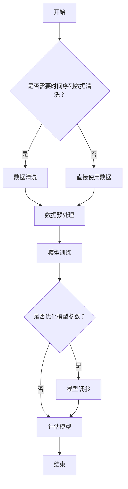

                 


## 文章标题：大模型在商品趋势预测中的时序分析应用

### 关键词：大模型，商品趋势预测，时序分析，深度学习，循环神经网络

> 摘要：本文旨在探讨大模型在商品趋势预测中的应用，特别是时序分析技术。通过深入分析大模型的定义、分类、以及其在商品趋势预测中的重要性，本文将详细阐述时序数据分析的基础知识、大模型技术基础，以及大模型在商品趋势预测中的架构设计。同时，本文还将通过实际案例展示大模型在商品趋势预测中的实战应用，并提供一些实用的技巧和未来的研究方向。

### 《大模型在商品趋势预测中的时序分析应用》目录大纲

# 第一部分：引言与背景知识

## 第1章：大模型与商品趋势预测概述
### 1.1 大模型的定义与分类
### 1.2 商品趋势预测的重要性
### 1.3 大模型在商品趋势预测中的应用

## 第2章：时序数据分析基础
### 2.1 时间序列的基本概念
### 2.2 时间序列数据的预处理
### 2.3 常见的时间序列分析方法

## 第3章：大模型技术基础
### 3.1 深度学习基本原理
### 3.2 循环神经网络（RNN）及其变体
### 3.3 卷积神经网络（CNN）与时间序列分析

## 第4章：大模型在商品趋势预测中的架构设计
### 4.1 大模型架构设计原则
### 4.2 商品趋势预测模型构建
### 4.3 模型优化与调参策略

# 第二部分：应用案例与实践

## 第5章：实时商品趋势预测系统设计
### 5.1 实时数据采集与处理
### 5.2 实时趋势预测模型训练与部署
### 5.3 实时预测结果分析与可视化

## 第6章：大规模商品数据集上的实验与分析
### 6.1 数据集介绍
### 6.2 实验设计
### 6.3 实验结果分析

## 第7章：案例研究：某电商平台商品趋势预测实践
### 7.1 项目背景
### 7.2 需求分析
### 7.3 技术选型与实现
### 7.4 预测效果评估

## 第8章：总结与展望
### 8.1 主要成果与经验总结
### 8.2 面临的挑战与未来方向

# 附录
## 附录A：常用工具与资源
### A.1 时序分析工具介绍
### A.2 大模型训练与部署平台

### Mermaid 流程图示例：


### 伪代码示例：
```python
# 假设我们已经有一个时序数据集 X，模型参数为 theta
# 伪代码实现时序数据的循环神经网络模型

# 定义损失函数
def loss_function(y_true, y_pred):
    return (y_true - y_pred)^2

# 定义前向传播
def forward_propagation(x, theta):
    # 这里应该是前向传播的具体实现
    return predicted_output

# 定义反向传播
def backward_propagation(x, y, theta):
    # 这里应该是反向传播的具体实现
    return updated_theta

# 主训练循环
while not convergence:
    predicted_output = forward_propagation(x, theta)
    loss = loss_function(y, predicted_output)
    theta = backward_propagation(x, y, theta)
```

### 数学模型与公式示例：
$$
f(x) = \frac{1}{1 + e^{-\theta^T x}}
$$

### 项目实战示例：

#### 环境搭建
- 安装 Python 3.8+
- 安装 TensorFlow 2.5+
- 安装 Pandas、NumPy、Matplotlib 等数据科学库

#### 代码实现
```python
# 导入所需库
import tensorflow as tf
import pandas as pd
import numpy as np
import matplotlib.pyplot as plt

# 数据准备
# 读取时间序列数据，进行预处理

# 模型构建
model = tf.keras.Sequential([
    tf.keras.layers.SimpleRNN(units=50, input_shape=(timesteps, features)),
    tf.keras.layers.Dense(1)
])

# 编译模型
model.compile(optimizer='adam', loss='mse')

# 训练模型
model.fit(x_train, y_train, epochs=100, batch_size=32)

# 评估模型
loss = model.evaluate(x_test, y_test)
print(f"Test loss: {loss}")
```

## 第1章：大模型与商品趋势预测概述

### 1.1 大模型的定义与分类

大模型是指拥有巨大参数量和计算能力的机器学习模型。这些模型通常采用深度学习技术，包含多个隐藏层，能够处理大规模的数据集。大模型的应用范围广泛，包括图像识别、自然语言处理、语音识别、推荐系统等。

大模型可以根据结构的不同分为以下几类：

1. **深度神经网络（DNN）**：由多个全连接层组成，适用于图像识别、语音识别等领域。
2. **卷积神经网络（CNN）**：引入卷积层，特别适用于图像处理和计算机视觉任务。
3. **循环神经网络（RNN）**：包含循环结构，适用于序列数据处理，如时间序列预测、语言建模等。
4. **变分自编码器（VAE）**：用于生成任务，通过概率模型对数据进行编码和解码。
5. **生成对抗网络（GAN）**：由生成器和判别器组成，用于生成逼真的数据。

### 1.2 商品趋势预测的重要性

商品趋势预测在商业决策中具有重要意义。通过预测商品未来的销售趋势，企业可以做出更精准的库存管理、营销策略、采购计划等决策，从而提高运营效率、降低成本、提升客户满意度。

商品趋势预测的重要性体现在以下几个方面：

1. **库存管理**：准确的商品趋势预测可以帮助企业优化库存水平，避免过度库存或库存不足。
2. **采购计划**：根据商品趋势预测，企业可以合理安排采购计划，避免因需求波动导致的生产和物流问题。
3. **营销策略**：通过预测商品未来的销售趋势，企业可以制定更有针对性的营销策略，提高销售额。
4. **风险管理**：商品趋势预测可以帮助企业识别潜在的风险，如市场需求下降、竞争加剧等，从而提前采取应对措施。

### 1.3 大模型在商品趋势预测中的应用

大模型在商品趋势预测中的应用主要体现在以下几个方面：

1. **时间序列预测**：大模型，尤其是循环神经网络（RNN）及其变体，如长短时记忆网络（LSTM）和门控循环单元（GRU），能够有效地处理时间序列数据，捕捉长期和短期趋势。

2. **多变量预测**：商品趋势预测通常涉及多个相关变量，如季节性、促销活动等。大模型可以同时考虑这些变量，提供更准确的预测结果。

3. **动态调整**：大模型可以根据新的数据进行实时调整，以适应市场的变化，提高预测的准确性和实时性。

4. **个性化预测**：大模型可以针对不同商品、不同市场进行个性化预测，提供更加细粒度的销售预测。

5. **异常检测**：大模型可以检测数据中的异常点，帮助发现潜在的欺诈行为或市场变化。

总之，大模型在商品趋势预测中的应用为企业和决策者提供了强大的工具，帮助他们更好地理解市场动态，做出更明智的商业决策。接下来，我们将深入探讨时序数据分析的基础知识，为后续的讨论奠定基础。

