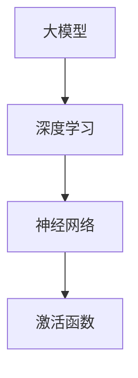

                 

# 大模型在电商平台信用评分中的应用

## 关键词

- 大模型
- 电商平台
- 信用评分
- 深度学习
- 用户行为分析
- 商家风险评估

## 摘要

本文将探讨大模型在电商平台信用评分中的应用。随着电商平台的快速发展，用户和商家的信用评分成为衡量其可靠性和诚信度的关键指标。大模型，特别是基于深度学习的模型，凭借其强大的数据处理和分析能力，为信用评分提供了新的解决方案。本文首先介绍大模型的基本概念、技术原理和应用领域，然后详细分析大模型在电商平台信用评分中的原理、优势和应用案例，最后讨论大模型在信用评分中面临的挑战和未来展望。

## 目录大纲

### 第一部分：大模型基础

#### 第1章：大模型概述

- **1.1 大模型的起源与背景**
- **1.2 大模型的技术原理**
- **1.3 大模型的优势**

#### 第2章：大模型的应用领域

- **2.1 电商平台信用评分的背景**
- **2.2 大模型在信用评分中的应用**

### 第二部分：电商平台信用评分

#### 第3章：电商平台信用评分原理

- **3.1 电商平台信用评分的概念**
- **3.2 电商平台信用评分模型**
- **3.3 大模型在信用评分中的应用**

#### 第4章：大模型在信用评分中的应用案例

- **4.1 用户行为数据分析**
- **4.2 商家风险评估**

#### 第5章：大模型在信用评分中的应用挑战与展望

- **5.1 大模型在信用评分中的应用挑战**
- **5.2 大模型在信用评分的未来展望**

### 第三部分：技术细节

#### 第6章：大模型技术基础

- **6.1 深度学习基础**
- **6.2 大模型训练技术**
- **6.3 大模型优化技术**

#### 第7章：数学模型与公式

- **7.1 概率论基础**
- **7.2 线性代数基础**
- **7.3 激活函数**

#### 第8章：实际应用案例解析

- **8.1 电商平台信用评分系统搭建**
- **8.2 大模型训练与评估**
- **8.3 信用评分系统部署与维护**

#### 第9章：开发环境搭建与工具使用

- **9.1 开发环境搭建**
- **9.2 常用工具介绍**

### 附录

- **附录A：术语解释**
- **附录B：参考文献**

### Mermaid 流程图



## 第一部分：大模型基础

### 第1章：大模型概述

#### 1.1 大模型的起源与背景

大模型（Large Models），是指具有巨大参数规模和强大计算能力的深度学习模型。它们通常基于神经网络架构，能够处理复杂数据并产生高精度的预测和决策。大模型的起源可以追溯到深度学习的发展历程。

在20世纪80年代末至90年代初期，神经网络研究陷入低潮，主要原因是“AI寒冬”和梯度消失/爆炸问题。然而，随着计算机硬件的进步和大数据的兴起，深度学习在21世纪初迎来了新的发展机遇。特别是2012年，AlexNet在ImageNet竞赛中取得了突破性成绩，这标志着深度学习在计算机视觉领域的崛起。

随着模型的规模越来越大，如GPT、BERT等，大模型逐渐成为研究的热点。这些模型不仅在计算机视觉、自然语言处理等领域取得了显著成果，还在电商平台、金融风控、医疗诊断等实际应用中展现了巨大的潜力。

#### 1.2 大模型的发展背景

大模型的发展背景主要可以分为以下几个方面：

1. **计算能力的提升**：随着GPU和TPU等专用硬件的发展，计算能力的提升为训练大规模模型提供了可能。
2. **大数据的兴起**：互联网和物联网的快速发展带来了海量数据，为训练和优化大模型提供了丰富的训练资源。
3. **算法的进步**：优化算法的改进，如Adam、AdaGrad等，使得大规模模型的训练更加高效。
4. **开源社区的贡献**：如TensorFlow、PyTorch等深度学习框架的普及，使得研究人员能够更方便地使用和定制大模型。

#### 1.3 大模型的意义

大模型的意义主要体现在以下几个方面：

1. **提高预测精度**：大模型具有更强的表示能力和适应性，能够在各种复杂任务中实现高精度的预测。
2. **解决复杂问题**：大模型能够处理大规模、多模态的数据，有助于解决诸如自然语言理解、图像识别等复杂问题。
3. **推动技术发展**：大模型的研究和应用推动了计算机视觉、自然语言处理等领域的快速发展，促进了AI技术的进步。
4. **赋能实际应用**：大模型在电商平台、金融风控、医疗诊断等实际应用中发挥了重要作用，提升了相关领域的效率和准确性。

### 第2章：大模型的技术原理

#### 2.1 大模型的核心概念

大模型的核心概念包括以下几个方面：

1. **参数规模**：大模型的参数规模通常非常大，可以达到数十亿甚至千亿级别。这些参数通过学习从数据中提取特征和模式。
2. **深度**：大模型通常具有多层次的神经网络结构，每一层能够对输入数据进行处理和抽象，从而实现数据的逐层表示。
3. **非线性**：大模型通过使用非线性激活函数，如ReLU、Sigmoid等，能够引入非线性变换，从而提高模型的表示能力和分类能力。
4. **优化算法**：大模型通常采用高效的优化算法，如梯度下降（Gradient Descent）、Adam等，以快速收敛到最优解。

#### 2.2 大模型的技术架构

大模型的技术架构通常包括以下几个部分：

1. **输入层**：接收外部输入数据，如文本、图像等。
2. **隐藏层**：包含多层神经网络，每一层对输入数据进行处理和抽象。
3. **输出层**：根据模型的任务生成预测结果，如分类标签、数值预测等。
4. **损失函数**：用于衡量模型的预测误差，并指导模型的优化过程。

#### 2.3 大模型的优势

大模型的优势主要体现在以下几个方面：

1. **强大的表示能力**：大模型能够处理大规模、高维的数据，并从中提取有效的特征和模式。
2. **高效的训练算法**：大模型采用高效的优化算法，能够在较短时间内完成模型的训练和优化。
3. **广泛的适用性**：大模型适用于各种复杂的任务，如计算机视觉、自然语言处理、语音识别等。
4. **出色的性能**：大模型在多个标准数据集上取得了领先的性能，证明了其在实际应用中的有效性。

### 第3章：大模型的应用领域

#### 3.1 电商平台信用评分的背景

电商平台信用评分是指在电子商务平台上，通过对用户和商家的行为、交易记录、信用历史等多维度数据进行综合分析，评估其信用等级和风险水平。信用评分的背景主要源于以下几个方面：

1. **电子商务的发展**：随着互联网和移动互联网的普及，电子商务得到了快速发展，越来越多的用户和商家参与到电商交易中。
2. **用户需求**：用户在电商平台上购物时，对商家的信誉和可靠性有较高的要求，信用评分可以帮助用户更好地选择交易对象。
3. **商家管理**：电商平台需要对商家的信用进行监控和管理，以确保交易的顺利进行，减少欺诈和风险。
4. **风险控制**：信用评分可以帮助电商平台降低交易风险，避免因欺诈行为导致的损失。

#### 3.2 大模型在信用评分中的应用

大模型在信用评分中的应用主要体现在以下几个方面：

1. **用户行为分析**：大模型可以通过分析用户的浏览记录、购物行为、评价等数据，预测用户的行为模式，从而评估其信用等级。
2. **商家风险评估**：大模型可以通过分析商家的交易记录、发货速度、退货率等数据，评估其信用风险，帮助电商平台进行商家筛选和管理。
3. **个性化推荐**：大模型可以根据用户的信用评分，为其推荐更符合其需求和信誉的商家和商品。
4. **智能风控**：大模型可以实时监测交易过程中的风险信号，如异常交易行为、欺诈行为等，并及时采取措施进行风险控制。

## 第二部分：电商平台信用评分

### 第3章：电商平台信用评分原理

#### 3.1 电商平台信用评分的概念

电商平台信用评分是指通过对用户和商家的行为、交易记录、信用历史等多维度数据进行综合分析，评估其信用等级和风险水平。信用评分的核心目标是帮助电商平台识别和防范潜在的风险，确保交易的顺利进行。

信用评分的概念可以从以下几个方面进行理解：

1. **信用等级**：信用评分通常将用户和商家划分为不同的信用等级，如优秀、良好、一般、较差等。不同等级的信用评分对应不同的风险和权益。
2. **风险水平**：信用评分不仅反映了用户和商家的信用等级，还体现了其潜在的风险水平。高信用等级的用户和商家通常具有较低的风险水平。
3. **数据来源**：信用评分的数据来源主要包括用户和商家的行为数据、交易记录、信用历史等。这些数据通过数据采集、清洗、整合等过程，形成信用评分模型的基础数据。
4. **评分模型**：信用评分模型是评估用户和商家信用等级的核心工具。常见的评分模型包括逻辑回归、决策树、随机森林、神经网络等。

#### 3.2 电商平台信用评分模型

电商平台信用评分模型是评估用户和商家信用等级的关键技术。根据评估目标的不同，信用评分模型可以分为用户信用评分模型和商家信用评分模型。

1. **用户信用评分模型**：用户信用评分模型主要用于评估用户的信用等级和风险水平。常见的用户信用评分模型包括以下几种：

    - **逻辑回归模型**：逻辑回归模型是一种基于线性回归的二元分类模型，通过建立线性模型来预测用户的信用等级。
    - **决策树模型**：决策树模型通过树形结构来划分数据集，并根据特征值对用户进行分类。
    - **随机森林模型**：随机森林模型是由多个决策树模型组成的集成模型，能够提高分类的准确性和稳定性。
    - **神经网络模型**：神经网络模型是一种基于深度学习的分类模型，能够通过多层神经元的非线性变换，提取用户行为的复杂特征。

2. **商家信用评分模型**：商家信用评分模型主要用于评估商家的信用等级和风险水平。常见的商家信用评分模型包括以下几种：

    - **逻辑回归模型**：逻辑回归模型同样适用于商家信用评分，通过建立线性模型来预测商家的信用等级。
    - **决策树模型**：决策树模型通过树形结构来划分数据集，并根据特征值对商家进行分类。
    - **神经网络模型**：神经网络模型通过多层神经元的非线性变换，提取商家行为的复杂特征，实现商家的信用评分。

#### 3.3 大模型在信用评分中的应用

大模型在信用评分中的应用主要体现在以下几个方面：

1. **用户行为分析**：大模型可以通过分析用户的浏览记录、购物行为、评价等数据，预测用户的行为模式，从而评估其信用等级。例如，通过使用深度学习模型，可以从用户的浏览记录中提取兴趣特征，并利用这些特征预测用户的购买意向，从而评估其信用等级。

2. **商家风险评估**：大模型可以通过分析商家的交易记录、发货速度、退货率等数据，评估其信用风险，帮助电商平台进行商家筛选和管理。例如，通过使用深度学习模型，可以从商家的交易记录中提取行为特征，并利用这些特征预测商家的信用风险，从而评估其信用等级。

3. **个性化推荐**：大模型可以根据用户的信用评分，为其推荐更符合其需求和信誉的商家和商品。例如，通过使用深度学习模型，可以从用户的购物记录和信用评分中提取特征，并利用这些特征为用户推荐与其信用等级相匹配的商家和商品。

4. **智能风控**：大模型可以实时监测交易过程中的风险信号，如异常交易行为、欺诈行为等，并及时采取措施进行风险控制。例如，通过使用深度学习模型，可以实时分析用户的交易行为，并利用这些行为特征识别潜在的欺诈行为，从而采取措施进行风险控制。

### 第4章：大模型在信用评分中的应用案例

#### 4.1 用户行为数据分析

用户行为数据是信用评分的重要组成部分。通过分析用户的浏览记录、购物行为、评价等数据，可以预测用户的行为模式，从而评估其信用等级。以下是一个用户行为数据分析的案例：

1. **数据收集**：首先，需要收集用户的浏览记录、购物行为、评价等数据。这些数据可以通过电商平台的后台系统获取，包括用户的ID、浏览时间、浏览商品、购买商品、评价等。

2. **数据预处理**：对收集到的数据进行预处理，包括数据清洗、缺失值填充、数据归一化等操作。例如，将用户的浏览时间转换为分钟或小时，将购买商品的数量转换为数值等。

3. **特征提取**：从预处理后的数据中提取特征，如用户的浏览时间、浏览商品、购买商品、评价等。可以使用统计特征、文本特征、图像特征等方法提取特征。

4. **模型训练**：使用深度学习模型，如卷积神经网络（CNN）或循环神经网络（RNN），对提取的特征进行训练，以预测用户的信用等级。以下是一个简单的训练过程：

   ```python
   import tensorflow as tf
   from tensorflow.keras.models import Sequential
   from tensorflow.keras.layers import Dense, Conv1D, LSTM

   # 构建模型
   model = Sequential()
   model.add(Conv1D(filters=64, kernel_size=3, activation='relu', input_shape=(max_time, num_features)))
   model.add(LSTM(100))
   model.add(Dense(1, activation='sigmoid'))

   # 编译模型
   model.compile(optimizer='adam', loss='binary_crossentropy', metrics=['accuracy'])

   # 训练模型
   model.fit(X_train, y_train, epochs=10, batch_size=32)
   ```

5. **模型评估**：使用测试集对训练好的模型进行评估，计算模型的准确率、召回率、F1值等指标，以评估模型的性能。以下是一个简单的评估过程：

   ```python
   from sklearn.metrics import accuracy_score, recall_score, f1_score

   # 预测结果
   y_pred = model.predict(X_test)

   # 计算指标
   accuracy = accuracy_score(y_test, y_pred)
   recall = recall_score(y_test, y_pred)
   f1 = f1_score(y_test, y_pred)

   print("Accuracy:", accuracy)
   print("Recall:", recall)
   print("F1 Score:", f1)
   ```

6. **结果分析**：根据评估结果，可以分析模型的性能，并根据需要对模型进行调整和优化。例如，如果模型的准确率较低，可以尝试增加训练时间、调整模型参数等。

#### 4.2 商家风险评估

商家风险评估是信用评分的重要方面。通过分析商家的交易记录、发货速度、退货率等数据，可以评估商家的信用风险，帮助电商平台进行商家筛选和管理。以下是一个商家风险评估的案例：

1. **数据收集**：首先，需要收集商家的交易记录、发货速度、退货率等数据。这些数据可以通过电商平台的后台系统获取，包括商家的ID、交易时间、交易金额、发货速度、退货率等。

2. **数据预处理**：对收集到的数据进行预处理，包括数据清洗、缺失值填充、数据归一化等操作。例如，将交易时间转换为天数或月份，将交易金额转换为数值等。

3. **特征提取**：从预处理后的数据中提取特征，如商家的交易记录、发货速度、退货率等。可以使用统计特征、文本特征、图像特征等方法提取特征。

4. **模型训练**：使用深度学习模型，如卷积神经网络（CNN）或循环神经网络（RNN），对提取的特征进行训练，以预测商家的信用风险。以下是一个简单的训练过程：

   ```python
   import tensorflow as tf
   from tensorflow.keras.models import Sequential
   from tensorflow.keras.layers import Dense, Conv1D, LSTM

   # 构建模型
   model = Sequential()
   model.add(Conv1D(filters=64, kernel_size=3, activation='relu', input_shape=(max_time, num_features)))
   model.add(LSTM(100))
   model.add(Dense(1, activation='sigmoid'))

   # 编译模型
   model.compile(optimizer='adam', loss='binary_crossentropy', metrics=['accuracy'])

   # 训练模型
   model.fit(X_train, y_train, epochs=10, batch_size=32)
   ```

5. **模型评估**：使用测试集对训练好的模型进行评估，计算模型的准确率、召回率、F1值等指标，以评估模型的性能。以下是一个简单的评估过程：

   ```python
   from sklearn.metrics import accuracy_score, recall_score, f1_score

   # 预测结果
   y_pred = model.predict(X_test)

   # 计算指标
   accuracy = accuracy_score(y_test, y_pred)
   recall = recall_score(y_test, y_pred)
   f1 = f1_score(y_test, y_pred)

   print("Accuracy:", accuracy)
   print("Recall:", recall)
   print("F1 Score:", f1)
   ```

6. **结果分析**：根据评估结果，可以分析模型的性能，并根据需要对模型进行调整和优化。例如，如果模型的准确率较低，可以尝试增加训练时间、调整模型参数等。

### 第5章：大模型在信用评分中的应用挑战与展望

#### 5.1 大模型在信用评分中的应用挑战

尽管大模型在电商平台信用评分中展现了巨大的潜力，但在实际应用中仍然面临一些挑战：

1. **数据隐私保护**：信用评分涉及用户和商家的敏感数据，如何保护这些数据的安全和隐私是一个重要问题。大模型训练过程中产生的中间数据也可能包含敏感信息，需要采取有效的隐私保护措施。

2. **模型解释性**：大模型通常具有高度的非线性特性，导致其预测结果难以解释。在信用评分中，模型解释性对于信任建立和合规性至关重要。

3. **数据质量和多样性**：信用评分模型的准确性依赖于高质量和多样化的数据。然而，电商平台的数据可能存在噪声、缺失和不一致性，需要有效的数据清洗和预处理方法。

4. **模型可扩展性**：随着电商平台用户和交易量的增长，信用评分模型需要具备良好的可扩展性，以适应不断变化的数据规模和需求。

#### 5.2 大模型在信用评分的未来展望

尽管面临挑战，大模型在电商平台信用评分中仍然具有广阔的发展前景：

1. **隐私保护技术**：随着隐私保护技术的不断发展，如联邦学习、差分隐私等，大模型在信用评分中的应用将变得更加安全可靠。

2. **模型解释性研究**：针对大模型的解释性研究将逐步提高，开发出更多易于解释的模型结构和算法，增强模型的可信度和合规性。

3. **数据驱动方法**：利用大数据和人工智能技术，不断优化信用评分模型，提高其准确性和鲁棒性。

4. **跨领域应用**：大模型在信用评分中的成功经验有望推广到金融风控、医疗诊断、法律审查等跨领域应用，推动AI技术在更广泛的场景中发挥作用。

### 第三部分：技术细节

#### 第6章：大模型技术基础

#### 6.1 深度学习基础

深度学习是构建大模型的核心技术。它通过多层神经网络结构，从数据中自动提取特征，实现复杂任务的自动化。

1. **神经网络基础**：
   神经网络是由多个神经元组成的计算模型。每个神经元接收多个输入信号，通过权重进行加权求和，最后通过激活函数产生输出。
   伪代码示例：
   ```python
   def neuron(input, weights, bias, activation_function):
       z = sum(input * weights) + bias
       return activation_function(z)
   ```

2. **深度学习算法**：
   深度学习算法包括前向传播和反向传播。前向传播将输入信号通过神经网络，逐层计算并产生输出；反向传播通过计算误差，调整网络的权重和偏置，以优化模型。

   ```python
   def forward_pass(inputs, weights, bias, activation_function):
       z = sum(inputs * weights) + bias
       a = activation_function(z)
       return a

   def backward_pass(error, learning_rate, weights, bias, activation_derivative):
       delta = error * activation_derivative
       weights -= learning_rate * delta
       bias -= learning_rate * delta
       return weights, bias
   ```

#### 6.2 大模型训练技术

大模型训练技术涉及预处理、模型选择、超参数调整和优化策略等多个方面。

1. **预训练模型**：
   预训练模型是指在大规模数据集上预先训练好的模型，可以用于特定任务的快速适配。如BERT、GPT等。

   ```python
   from transformers import BertModel

   model = BertModel.from_pretrained('bert-base-uncased')
   ```

2. **迁移学习**：
   迁移学习是指利用预训练模型在特定任务上的知识，微调模型以适应新任务。通过迁移学习，可以节省训练时间并提高模型性能。

   ```python
   model = BertModel.from_pretrained('bert-base-uncased')
   model.resize_token_embeddings(new_size)
   ```

#### 6.3 大模型优化技术

大模型优化技术包括优化算法和超参数调优。常见的优化算法有SGD、Adam等。

1. **梯度下降算法**：
   梯度下降是一种优化算法，通过计算损失函数关于模型参数的梯度，调整参数以减小损失。

   ```python
   def gradient_descent(weights, bias, learning_rate, loss_function, input, target):
       loss = loss_function(input, target)
       gradients = compute_gradients(loss, weights, bias)
       weights -= learning_rate * gradients['weights']
       bias -= learning_rate * gradients['bias']
       return weights, bias
   ```

2. **优化器的选择**：
   优化器的选择对于模型训练效果至关重要。Adam优化器是一种流行的优化器，结合了AdaGrad和RMSprop的优点。

   ```python
   optimizer = tf.keras.optimizers.Adam(learning_rate=0.001)
   ```

### 第7章：数学模型与公式

数学模型和公式是理解大模型的关键。以下是一些基础的数学模型和公式：

#### 7.1 概率论基础

1. **概率分布**：
   概率分布描述了随机变量取值的可能性。常见的概率分布有正态分布、伯努利分布等。

   $$P(X=x) = \frac{1}{\sqrt{2\pi\sigma^2}}e^{-\frac{(x-\mu)^2}{2\sigma^2}}$$

2. **贝叶斯定理**：
   贝叶斯定理用于计算后验概率，即给定某些观测数据的条件下，某个假设的概率。

   $$P(H|D) = \frac{P(D|H)P(H)}{P(D)}$$

### 7.2 线性代数基础

1. **矩阵运算**：
   矩阵运算包括矩阵加法、矩阵乘法、逆矩阵等。

   $$A \times B = \begin{bmatrix} a_{11} & a_{12} \\ a_{21} & a_{22} \end{bmatrix} \times \begin{bmatrix} b_{11} & b_{12} \\ b_{21} & b_{22} \end{bmatrix} = \begin{bmatrix} a_{11}b_{11} + a_{12}b_{21} & a_{11}b_{12} + a_{12}b_{22} \\ a_{21}b_{11} + a_{22}b_{21} & a_{21}b_{12} + a_{22}b_{22} \end{bmatrix}$$

2. **线性变换**：
   线性变换是矩阵和向量的乘法运算，用于将输入向量映射到输出向量。

   $$Ax = \begin{bmatrix} a_{11} & a_{12} \\ a_{21} & a_{22} \end{bmatrix} \times \begin{bmatrix} x_1 \\ x_2 \end{bmatrix} = \begin{bmatrix} a_{11}x_1 + a_{12}x_2 \\ a_{21}x_1 + a_{22}x_2 \end{bmatrix}$$

### 7.3 激活函数

激活函数是神经网络中的关键组件，用于引入非线性特性。常见的激活函数有ReLU、Sigmoid、Tanh等。

1. **ReLU函数**：
  ReLU（Rectified Linear Unit）函数是一个简单的线性激活函数，在输入为负时输出为零，在输入为正时输出为输入值。

   $$\text{ReLU}(x) = \max(0, x)$$

2. **Sigmoid函数**：
   Sigmoid函数是一个S形曲线，将输入映射到（0,1）区间内，常用于二分类问题。

   $$\text{Sigmoid}(x) = \frac{1}{1 + e^{-x}}$$

### 第8章：实际应用案例解析

#### 8.1 电商平台信用评分系统搭建

搭建一个电商平台信用评分系统涉及多个环节，包括系统架构设计、数据处理流程、模型训练与评估等。

1. **系统架构设计**：
   电商平台信用评分系统可以分为数据采集层、数据处理层、模型训练层和模型应用层。

   - **数据采集层**：负责收集用户和商家的行为数据、交易记录等。
   - **数据处理层**：负责对采集到的数据进行清洗、预处理和特征提取。
   - **模型训练层**：负责训练信用评分模型，选择合适的算法和超参数。
   - **模型应用层**：负责将训练好的模型应用于实际场景，如信用评分预测、风险控制等。

2. **数据处理流程**：
   数据处理流程包括数据收集、数据清洗、数据预处理、特征提取等步骤。

   - **数据收集**：从电商平台的后台系统中收集用户和商家的行为数据和交易记录。
   - **数据清洗**：去除重复数据、填补缺失值、处理异常值等。
   - **数据预处理**：对数据进行标准化、归一化等处理，以适应模型训练。
   - **特征提取**：从预处理后的数据中提取有用的特征，如用户的浏览时间、购买频率、评价等。

3. **模型训练与评估**：
   模型训练与评估是信用评分系统的核心环节。

   - **模型选择**：根据业务需求选择合适的模型，如逻辑回归、决策树、随机森林、神经网络等。
   - **模型训练**：使用训练数据对模型进行训练，通过调整超参数优化模型性能。
   - **模型评估**：使用测试数据对模型进行评估，计算模型的准确率、召回率、F1值等指标，以评估模型的性能。

#### 8.2 大模型训练与评估

大模型训练与评估是一个复杂的过程，涉及数据准备、模型选择、训练策略、评估指标等多个方面。

1. **数据准备**：
   数据准备是训练大模型的第一步，包括数据收集、数据清洗和特征提取。

   - **数据收集**：从电商平台获取用户和商家的行为数据和交易记录。
   - **数据清洗**：处理缺失值、异常值、重复数据等，保证数据质量。
   - **特征提取**：从清洗后的数据中提取有用的特征，如用户的浏览时间、购买频率、评价等。

2. **模型选择**：
   选择适合业务需求的大模型，如GPT、BERT、Transformer等。

   - **模型评估**：通过交叉验证等方法评估模型性能，选择最优模型。

3. **训练策略**：
   训练策略包括批量大小、学习率、训练时间等。

   - **批量大小**：选择适当的批量大小，以平衡计算效率和模型性能。
   - **学习率**：设置合适的初始学习率，并采用学习率衰减策略。
   - **训练时间**：根据模型复杂度和数据规模，设置合理的训练时间。

4. **评估指标**：
   评估指标包括准确率、召回率、F1值等。

   - **准确率**：预测正确的样本数占总样本数的比例。
   - **召回率**：预测正确的样本数占总实际正样本数的比例。
   - **F1值**：准确率和召回率的调和平均值。

#### 8.3 信用评分系统部署与维护

信用评分系统的部署与维护是确保系统稳定运行的关键。

1. **系统部署**：
   系统部署包括模型部署、服务部署和基础设施部署。

   - **模型部署**：将训练好的模型部署到生产环境中，如使用TensorFlow Serving或PyTorch Serving。
   - **服务部署**：部署信用评分服务，如使用Docker容器化技术。
   - **基础设施部署**：配置服务器、数据库、网络等基础设施，确保系统运行环境稳定。

2. **系统维护**：
   系统维护包括监控、备份、升级和故障处理。

   - **监控**：实时监控系统性能和运行状态，如使用Prometheus、Grafana等工具。
   - **备份**：定期备份数据和服务配置，确保数据安全和系统恢复能力。
   - **升级**：更新系统版本和依赖库，确保系统安全性和稳定性。
   - **故障处理**：及时处理系统故障，如使用Kubernetes集群管理和故障转移机制。

### 第9章：开发环境搭建与工具使用

#### 9.1 开发环境搭建

搭建一个用于大模型研究和开发的环境需要以下步骤：

1. **操作系统选择**：
   选择Linux或macOS作为开发环境，它们提供了更好的稳定性和性能。

2. **软件安装与配置**：
   - **Python环境**：安装Python 3.x版本，并配置虚拟环境。
     ```bash
     sudo apt-get install python3-pip
     python3 -m pip install --upgrade pip
     ```
   - **深度学习框架**：安装TensorFlow、PyTorch等深度学习框架。
     ```bash
     pip3 install tensorflow
     pip3 install torch torchvision
     ```

3. **依赖库安装**：
   安装常用的依赖库，如NumPy、Pandas等。
   ```bash
   pip3 install numpy pandas
   ```

4. **版本控制**：
   使用Git进行版本控制，确保代码的版本管理和协同开发。

   ```bash
   git init
   git add .
   git commit -m "Initial commit"
   ```

#### 9.2 常用工具介绍

在研究大模型和信用评分时，以下工具和库是常用的：

1. **TensorFlow**：
   TensorFlow是一个开源的深度学习框架，用于构建和训练大模型。

   - **安装**：
     ```bash
     pip3 install tensorflow
     ```

   - **示例**：
     ```python
     import tensorflow as tf

     model = tf.keras.Sequential([
         tf.keras.layers.Dense(128, activation='relu', input_shape=(784,)),
         tf.keras.layers.Dense(10, activation='softmax')
     ])

     model.compile(optimizer='adam',
                   loss='categorical_crossentropy',
                   metrics=['accuracy'])

     model.fit(x_train, y_train, epochs=5)
     ```

2. **PyTorch**：
   PyTorch是一个基于Python的深度学习框架，提供了灵活且直观的API。

   - **安装**：
     ```bash
     pip3 install torch torchvision
     ```

   - **示例**：
     ```python
     import torch
     import torch.nn as nn
     import torch.optim as optim

     model = nn.Sequential(nn.Linear(784, 128), nn.ReLU(), nn.Linear(128, 10))
     criterion = nn.CrossEntropyLoss()
     optimizer = optim.Adam(model.parameters(), lr=0.001)

     for epoch in range(5):
         for inputs, targets in data_loader:
             optimizer.zero_grad()
             outputs = model(inputs)
             loss = criterion(outputs, targets)
             loss.backward()
             optimizer.step()
     ```

3. **Pandas**：
   Pandas是一个用于数据分析的Python库，提供了数据清洗、预处理和操作的功能。

   - **安装**：
     ```bash
     pip3 install pandas
     ```

   - **示例**：
     ```python
     import pandas as pd

     data = pd.read_csv('data.csv')
     print(data.head())
     ```

4. **Scikit-learn**：
   Scikit-learn是一个用于机器学习的Python库，提供了丰富的模型和评估工具。

   - **安装**：
     ```bash
     pip3 install scikit-learn
     ```

   - **示例**：
     ```python
     from sklearn.model_selection import train_test_split
     from sklearn.ensemble import RandomForestClassifier

     X = data[['feature1', 'feature2', 'feature3']]
     y = data['target']

     X_train, X_test, y_train, y_test = train_test_split(X, y, test_size=0.2)

     model = RandomForestClassifier(n_estimators=100)
     model.fit(X_train, y_train)
     print(model.score(X_test, y_test))
     ```

### 附录

#### 附录A：术语解释

- **大模型**：具有巨大参数规模和强大计算能力的深度学习模型。
- **深度学习**：一种机器学习方法，通过多层神经网络结构从数据中自动提取特征。
- **神经网络**：由多个神经元组成的计算模型，用于模拟生物神经系统的工作方式。
- **激活函数**：神经网络中的关键组件，用于引入非线性特性。
- **信用评分**：评估用户和商家信用等级和风险水平的过程。
- **用户行为分析**：分析用户的浏览记录、购物行为、评价等数据，预测用户的行为模式。
- **商家风险评估**：分析商家的交易记录、发货速度、退货率等数据，评估商家的信用风险。

#### 附录B：参考文献

- Goodfellow, I., Bengio, Y., & Courville, A. (2016). *Deep Learning*. MIT Press.
- LeCun, Y., Bengio, Y., & Hinton, G. (2015). *Deep Learning*. Nature, 521(7553), 436-444.
- Ng, A. Y., & Dean, J. (2016). *Machine Learning: A Probabilistic Perspective*. MIT Press.
- Russell, S., & Norvig, P. (2010). *Artificial Intelligence: A Modern Approach*. Prentice Hall.
- Coursera. (2021). *Deep Learning Specialization*. Coursera.
- Kagg

