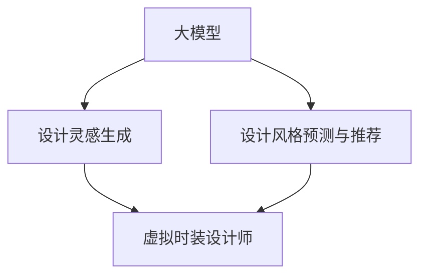

                 


### 大模型与虚拟时装设计师概述

#### 大模型的基本概念与历史演进

大模型（Large Models）是指那些拥有巨大参数量的机器学习模型。这些模型通过大量的数据进行训练，能够捕捉到数据中的复杂模式和规律，从而在多种任务中表现出色。大模型的兴起可以追溯到20世纪80年代末，当时研究人员开始尝试训练更大规模的语言模型。最早的代表性工作包括1990年代初期开发的基于神经网络的统计语言模型，如Back-Propagation模型和HMM-HMM模型。

进入21世纪，随着计算机硬件的进步和大数据的普及，大模型的研究和应用得到了快速发展。2012年，Hinton等人的论文《Deep Learning for Visual Recognition》提出了深度卷积神经网络（CNN）在图像识别任务中的巨大潜力，标志着深度学习时代的到来。随后，基于深度学习的模型在图像识别、自然语言处理、语音识别等领域取得了显著的突破。

近年来，随着计算能力的进一步提升和互联网数据的爆炸式增长，更大规模的大模型不断涌现。例如，OpenAI的GPT-3拥有1750亿个参数，成为了迄今为止最大的自然语言处理模型。这些大模型不仅在学术研究中取得了重大进展，也在工业界得到了广泛应用，例如自动驾驶、智能客服、内容生成等。

#### 虚拟时装设计师的概念与发展

虚拟时装设计师（Virtual Fashion Designer）是指利用计算机技术和人工智能算法来设计和创造时尚服饰的软件系统。虚拟时装设计师的核心目标是替代或辅助传统时装设计师的工作，提高设计效率和创新能力。

虚拟时装设计师的发展可以追溯到20世纪90年代，当时计算机图形学的发展为虚拟时装设计提供了技术基础。最初的虚拟时装设计师主要依赖于二维的图像编辑和建模工具，通过手工操作来设计和调整服装样式。

进入21世纪，随着三维建模技术和计算机视觉技术的进步，虚拟时装设计师的功能得到了显著提升。三维建模工具如Blender和Maya的出现，使得设计师可以在虚拟环境中创建复杂的服装模型。计算机视觉技术则使得虚拟时装设计师能够通过照片或视频捕捉人体姿态，实现虚拟试衣和个性化推荐等功能。

近年来，人工智能技术的快速发展进一步推动了虚拟时装设计师的发展。深度学习和生成对抗网络（GAN）等技术被应用于虚拟时装设计师中，使得设计灵感的生成和装饰元素的创新设计成为可能。

#### 大模型在虚拟时装设计师中的应用场景

大模型在虚拟时装设计师中的应用具有广泛的前景。以下是一些主要的应用场景：

1. **设计灵感的生成**：大模型可以通过分析大量的时尚数据，生成新的设计灵感和样式。设计师可以利用这些灵感快速创造出新颖的服装设计。

2. **设计风格的预测与推荐**：大模型可以基于用户的历史行为和偏好，预测用户可能喜欢的设计风格，并提供个性化的设计推荐。

3. **装饰元素与材质的创新设计**：大模型可以生成独特的装饰元素和材质纹理，为设计师提供更多的设计选择和创新空间。

4. **虚拟试衣与个性化推荐**：大模型可以结合计算机视觉和三维建模技术，实现虚拟试衣和个性化推荐，提高用户的购物体验。

5. **设计风格迁移与混合**：大模型可以将不同风格的设计元素进行迁移和混合，创造出新的设计风格，为设计师提供创新的思路。

总之，大模型在虚拟时装设计师中的应用不仅提高了设计效率和创新能力，也为时尚产业的数字化转型提供了新的机遇。

#### 核心概念与联系

为了深入理解大模型在虚拟时装设计师中的作用，我们需要先明确几个核心概念：

1. **大模型**：指的是具有巨大参数量的机器学习模型，能够通过大量的数据学习到复杂的模式和规律。
2. **虚拟时装设计师**：是利用计算机技术和人工智能算法进行时尚服饰设计的软件系统。
3. **设计灵感生成**：指大模型通过分析大量时尚数据生成新的设计灵感。
4. **设计风格预测与推荐**：指大模型基于用户偏好预测设计风格，并提供个性化推荐。

这些概念之间的关系可以概括为：大模型为虚拟时装设计师提供了强大的数据分析和生成能力，使得设计师能够快速生成设计灵感、预测设计风格并进行个性化推荐。

以下是一个简单的Mermaid流程图，展示了这些概念之间的关系：



通过这个流程图，我们可以清晰地看到大模型如何为虚拟时装设计师提供支持和提升其功能。

#### 大模型的基本原理

大模型的基本原理可以分为三个主要部分：模型架构、核心算法和训练过程。

1. **模型架构**

大模型通常采用深度学习架构，特别是基于神经网络的模型。深度神经网络由多个层次组成，包括输入层、隐藏层和输出层。每一层由多个神经元（或节点）组成，这些神经元通过加权连接彼此，从而实现对输入数据的处理和输出。

常见的深度学习架构包括卷积神经网络（CNN）、循环神经网络（RNN）和Transformer等。其中，卷积神经网络擅长处理图像数据，循环神经网络擅长处理序列数据，而Transformer模型则在自然语言处理任务中表现出色。

2. **核心算法**

大模型的核心算法主要包括神经网络权重初始化、正向传播、反向传播和优化算法。在训练过程中，模型首先通过正向传播将输入数据传递到输出层，计算输出结果和实际结果之间的误差。然后，通过反向传播算法更新模型权重，使得模型输出更加接近实际结果。常用的优化算法包括梯度下降（GD）、随机梯度下降（SGD）和Adam等。

3. **训练过程**

大模型的训练过程可以分为两个阶段：预训练和微调。在预训练阶段，模型在大规模数据集上训练，学习到通用特征和模式。在微调阶段，模型在特定任务的数据集上进行训练，调整模型参数，使其适应特定任务的需求。

训练过程中，数据预处理、数据增强、模型选择、超参数调优等都是关键步骤。数据预处理包括数据清洗、归一化和标准化等操作，以消除噪声和异常值。数据增强是通过多种方法增加训练数据的多样性，从而提高模型的泛化能力。模型选择和超参数调优则涉及到模型架构的选择和参数的设置，以优化模型性能。

通过以上三个步骤，大模型能够从大量数据中学习到复杂的模式和规律，从而在多种任务中表现出色。

#### 大模型的训练与优化

大模型的训练与优化是确保其能够有效学习和应用数据的关键步骤。以下是训练与优化过程中的主要方法：

1. **训练过程**

大模型的训练过程可以分为以下几个步骤：

   - **数据预处理**：在开始训练之前，需要对数据进行清洗、归一化和标准化等处理。这一步骤的目的是消除噪声和异常值，确保数据的一致性和可靠性。
   
   - **数据增强**：数据增强是通过多种方法增加训练数据的多样性，从而提高模型的泛化能力。常见的数据增强方法包括图像旋转、翻转、缩放、裁剪等。
   
   - **模型选择**：根据任务的需求选择合适的模型架构。例如，对于图像识别任务，可以选择卷积神经网络（CNN）；对于自然语言处理任务，可以选择Transformer模型。
   
   - **超参数调优**：超参数是模型训练过程中需要手动调整的参数，如学习率、批次大小、正则化参数等。通过交叉验证和网格搜索等方法，选择最优的超参数组合。
   
   - **训练与验证**：将数据集分为训练集和验证集，使用训练集对模型进行训练，使用验证集对模型进行验证。通过验证集的性能评估，调整模型参数，优化模型性能。

2. **优化方法**

   - **梯度下降（GD）**：梯度下降是最常用的优化算法，通过计算损失函数关于模型参数的梯度，更新模型参数，以减少损失函数的值。GD的更新公式为：$w_{t+1} = w_t - \alpha \cdot \nabla_w J(w_t)$，其中$\alpha$是学习率。
   
   - **随机梯度下降（SGD）**：SGD是GD的一种变体，每次更新模型参数时只使用一个样本的梯度。这可以加快训练速度，但可能会导致模型不稳定。
   
   - **动量（Momentum）**：动量是一种改进梯度下降的方法，通过引入前一时刻的梯度信息，减少参数更新的抖动，提高收敛速度。其更新公式为：$w_{t+1} = w_t - \alpha \cdot \nabla_w J(w_t) + \beta \cdot (1 - \beta) \cdot w_t$，其中$\beta$是动量参数。
   
   - **Adam优化器**：Adam是一种结合SGD和动量优化的优化器，通过自适应调整学习率和动量参数，能够更好地适应不同任务的需求。其更新公式为：$w_{t+1} = w_t - \alpha \cdot \nabla_w J(w_t) + \beta_1 \cdot (1 - \beta_1) \cdot (1 - \beta_2) \cdot w_t$，其中$\beta_1$和$\beta_2$分别是第一和第二矩估计的指数衰减率。

3. **模型评估与调整**

   - **评估指标**：常用的评估指标包括准确率（Accuracy）、精确率（Precision）、召回率（Recall）和F1分数（F1 Score）等。根据任务的需求选择合适的评估指标。
   
   - **交叉验证**：交叉验证是一种评估模型性能的方法，通过将数据集划分为多个子集，每次使用其中一个子集作为验证集，其余子集作为训练集，多次训练和验证，计算模型在验证集上的平均性能。
   
   - **模型调整**：根据评估结果调整模型参数和架构，优化模型性能。可能需要多次迭代训练和验证，直到找到最优的模型参数。

通过以上方法，可以有效地训练和优化大模型，使其在多种任务中表现出色。

#### 大模型的评估与部署

大模型的评估与部署是确保其性能和稳定性的关键步骤。以下是评估与部署过程中的主要方法：

1. **评估指标**

   - **准确率（Accuracy）**：准确率是最常用的评估指标，表示模型正确预测的样本数占总样本数的比例。其计算公式为：$Accuracy = \frac{TP + TN}{TP + TN + FP + FN}$，其中$TP$表示真实为正类且被预测为正类的样本数，$TN$表示真实为负类且被预测为负类的样本数，$FP$表示真实为负类但被预测为正类的样本数，$FN$表示真实为正类但被预测为负类的样本数。
   
   - **精确率（Precision）**：精确率表示模型预测为正类的样本中，实际为正类的比例。其计算公式为：$Precision = \frac{TP}{TP + FP}$。
   
   - **召回率（Recall）**：召回率表示模型预测为正类的样本中，实际为正类的比例。其计算公式为：$Recall = \frac{TP}{TP + FN}$。
   
   - **F1分数（F1 Score）**：F1分数是精确率和召回率的调和平均数，用于综合考虑精确率和召回率。其计算公式为：$F1 Score = 2 \cdot \frac{Precision \cdot Recall}{Precision + Recall}$。
   
   - **ROC曲线与AUC值**：ROC曲线（Receiver Operating Characteristic Curve）是评估二分类模型性能的另一种方法。曲线下的面积（AUC值）表示模型分类能力的好坏，AUC值越大，模型的性能越好。

2. **模型评估**

   - **验证集评估**：将训练集划分为训练集和验证集，使用验证集对模型进行评估。通过计算评估指标，评估模型在验证集上的性能。
   
   - **交叉验证**：交叉验证是一种常用的评估方法，通过将数据集划分为多个子集，每次使用其中一个子集作为验证集，其余子集作为训练集，多次训练和验证，计算模型在验证集上的平均性能。常见的交叉验证方法有K折交叉验证和留一交叉验证。
   
   - **测试集评估**：在模型训练和调优完成后，使用未参与训练的数据集（测试集）对模型进行最终评估。测试集的评估结果反映了模型在实际应用中的性能。

3. **模型部署**

   - **模型固化**：在模型训练完成后，需要将模型参数和架构保存下来，以便后续部署和使用。常用的模型固化方法包括保存模型权重和结构、使用模型文件或使用模型定义语言等。
   
   - **部署环境**：部署模型需要选择合适的环境和硬件设备。对于大规模模型，通常需要使用高性能计算平台，如GPU或TPU。
   
   - **推理引擎**：推理引擎是一种用于执行模型预测的软件框架，能够将模型输入数据转换为预测结果。常见的推理引擎有TensorFlow Serving、TensorFlow Lite和PyTorch Server等。
   
   - **模型监控与维护**：在模型部署后，需要对模型进行监控和更新，确保其性能和稳定性。常见的监控指标包括预测延迟、准确率、召回率等。定期更新模型，以适应新的数据和需求。

通过以上方法，可以确保大模型在评估和部署过程中的性能和稳定性，为实际应用提供可靠的支持。

### 虚拟时装设计师项目搭建

#### 开发环境与工具

搭建一个虚拟时装设计师项目，首先需要选择合适的开发环境与工具。以下是常用的开发环境与工具：

1. **开发环境**
   
   - **操作系统**：可以选择Windows、Linux或macOS，根据个人喜好和需求进行选择。
   
   - **编程语言**：Python是最常用的编程语言，拥有丰富的库和框架，适合开发虚拟时装设计师项目。
   
   - **集成开发环境（IDE）**：可以选择PyCharm、VS Code等IDE，这些IDE提供了丰富的功能，如代码补全、调试和版本控制等。

2. **开发工具与库**
   
   - **三维建模工具**：Blender和Maya是常用的三维建模工具，用于创建和编辑服装模型。
   
   - **计算机视觉库**：OpenCV和TensorFlow是常用的计算机视觉库，用于图像处理和目标检测等任务。
   
   - **深度学习框架**：TensorFlow和PyTorch是常用的深度学习框架，提供了丰富的API和工具，用于构建和训练大模型。

3. **硬件设备**
   
   - **GPU**：为了训练大模型和进行实时渲染，需要配备高性能的GPU，如NVIDIA GeForce RTX 30系列或更高版本。
   
   - **CPU**：建议使用多核心CPU，以提高数据处理和计算效率。

#### 虚拟时装设计师核心功能实现

虚拟时装设计师的核心功能包括设计灵感的生成、设计风格预测与推荐、装饰元素与材质的创新设计等。以下是这些功能的具体实现方法：

1. **设计灵感的生成**

   设计灵感的生成主要依赖于大模型，如生成对抗网络（GAN）和变分自编码器（VAE）。以下是设计灵感生成的一般步骤：

   - **数据预处理**：收集和整理大量的时尚图像数据，进行数据清洗和归一化处理。
   
   - **模型训练**：使用GAN或VAE模型对数据进行训练，学习到图像数据中的特征和模式。
   
   - **设计生成**：通过训练好的模型生成新的设计图像，为设计师提供灵感。

   伪代码示例：
   
   ```python
   # 导入相关库
   import tensorflow as tf
   import numpy as np
   
   # 创建GAN模型
   generator = tf.keras.Sequential([
       tf.keras.layers.Dense(128, activation='relu', input_shape=(100,)),
       tf.keras.layers.Dense(256, activation='relu'),
       tf.keras.layers.Dense(512, activation='relu'),
       tf.keras.layers.Dense(1024, activation='relu'),
       tf.keras.layers.Dense(784, activation='sigmoid')
   ])
   
   # 创建DCGAN模型
   discriminator = tf.keras.Sequential([
       tf.keras.layers.Conv2D(64, kernel_size=(3, 3), activation='relu', input_shape=(28, 28, 1)),
       tf.keras.layers.MaxPooling2D(pool_size=(2, 2)),
       tf.keras.layers.Conv2D(128, kernel_size=(3, 3), activation='relu'),
       tf.keras.layers.MaxPooling2D(pool_size=(2, 2)),
       tf.keras.layers.Flatten(),
       tf.keras.layers.Dense(1, activation='sigmoid')
   ])
   
   # 定义损失函数和优化器
   loss_fn = tf.keras.losses.BinaryCrossentropy(from_logits=True)
   generator_optimizer = tf.keras.optimizers.Adam(1e-4)
   discriminator_optimizer = tf.keras.optimizers.Adam(1e-4)
   
   # 训练GAN模型
   epochs = 100
   for epoch in range(epochs):
       for _ in range(batch_size):
           noise = np.random.normal(0, 1, (batch_size, noise_dim))
           generated_images = generator(noise)
           real_images = data_batch
           combined_images = np.concatenate([real_images, generated_images])
           labels = np.concatenate([np.ones((batch_size, 1)), np.zeros((batch_size, 1))])
           with tf.GradientTape() as gen_tape, tf.GradientTape() as disc_tape:
               gen_loss = loss_fn(discriminator(generated_images), np.zeros((batch_size, 1)))
               disc_loss = loss_fn(discriminator(combined_images), labels)
           gradients_of_gen = gen_tape.gradient(gen_loss, generator.trainable_variables)
           gradients_of_disc = disc_tape.gradient(disc_loss, discriminator.trainable_variables)
           generator_optimizer.apply_gradients(zip(gradients_of_gen, generator.trainable_variables))
           discriminator_optimizer.apply_gradients(zip(gradients_of_disc, discriminator.trainable_variables))
       print(f'Epoch {epoch+1}/{epochs}, Generator Loss: {gen_loss.numpy()}, Discriminator Loss: {disc_loss.numpy()}')
   
   # 生成设计图像
   new_design = generator.predict(np.random.normal(0, 1, (1, noise_dim)))
   ```

2. **设计风格预测与推荐**

   设计风格预测与推荐主要依赖于用户行为数据和分析技术。以下是设计风格预测与推荐的一般步骤：

   - **数据收集**：收集用户的历史行为数据，如浏览记录、购买记录和评价等。
   
   - **特征提取**：使用特征提取技术，将用户行为数据转换为模型可处理的特征向量。
   
   - **模型训练**：使用机器学习算法，如决策树、随机森林或神经网络等，对特征向量进行训练，预测用户的设计风格。
   
   - **推荐算法**：使用推荐算法，如协同过滤、基于内容的推荐或基于模型的推荐等，根据用户的设计风格推荐相应的设计。

   伪代码示例：

   ```python
   # 导入相关库
   import pandas as pd
   from sklearn.model_selection import train_test_split
   from sklearn.ensemble import RandomForestClassifier
   
   # 加载用户数据
   user_data = pd.read_csv('user_data.csv')
   
   # 提取特征
   X = user_data.drop(['user_id', 'style'], axis=1)
   y = user_data['style']
   
   # 划分训练集和测试集
   X_train, X_test, y_train, y_test = train_test_split(X, y, test_size=0.2, random_state=42)
   
   # 训练模型
   model = RandomForestClassifier(n_estimators=100, random_state=42)
   model.fit(X_train, y_train)
   
   # 预测设计风格
   predicted_style = model.predict(X_test)
   
   # 推荐设计
   recommended_designs = get_recommended_designs(predicted_style)
   ```

3. **装饰元素与材质的创新设计**

   装饰元素与材质的创新设计主要依赖于大模型，如GAN和VAE。以下是装饰元素与材质的创新设计的一般步骤：

   - **数据预处理**：收集和整理大量的装饰元素和材质图像数据，进行数据清洗和归一化处理。
   
   - **模型训练**：使用GAN或VAE模型对数据进行训练，学习到图像数据中的特征和模式。
   
   - **设计生成**：通过训练好的模型生成新的装饰元素和材质图像，为设计师提供创意。
   
   - **设计优化**：根据用户反馈和设计需求，对生成的装饰元素和材质图像进行优化。

   伪代码示例：

   ```python
   # 导入相关库
   import tensorflow as tf
   import numpy as np
   
   # 创建GAN模型
   generator = tf.keras.Sequential([
       tf.keras.layers.Dense(128, activation='relu', input_shape=(100,)),
       tf.keras.layers.Dense(256, activation='relu'),
       tf.keras.layers.Dense(512, activation='relu'),
       tf.keras.layers.Dense(1024, activation='relu'),
       tf.keras.layers.Dense(784, activation='sigmoid')
   ])
   
   # 创建DCGAN模型
   discriminator = tf.keras.Sequential([
       tf.keras.layers.Conv2D(64, kernel_size=(3, 3), activation='relu', input_shape=(28, 28, 1)),
       tf.keras.layers.MaxPooling2D(pool_size=(2, 2)),
       tf.keras.layers.Conv2D(128, kernel_size=(3, 3), activation='relu'),
       tf.keras.layers.MaxPooling2D(pool_size=(2, 2)),
       tf.keras.layers.Flatten(),
       tf.keras.layers.Dense(1, activation='sigmoid')
   ])
   
   # 定义损失函数和优化器
   loss_fn = tf.keras.losses.BinaryCrossentropy(from_logits=True)
   generator_optimizer = tf.keras.optimizers.Adam(1e-4)
   discriminator_optimizer = tf.keras.optimizers.Adam(1e-4)
   
   # 训练GAN模型
   epochs = 100
   for epoch in range(epochs):
       for _ in range(batch_size):
           noise = np.random.normal(0, 1, (batch_size, noise_dim))
           generated_images = generator(noise)
           real_images = data_batch
           combined_images = np.concatenate([real_images, generated_images])
           labels = np.concatenate([np.ones((batch_size, 1)), np.zeros((batch_size, 1))])
           with tf.GradientTape() as gen_tape, tf.GradientTape() as disc_tape:
               gen_loss = loss_fn(discriminator(generated_images), np.zeros((batch_size, 1)))
               disc_loss = loss_fn(discriminator(combined_images), labels)
           gradients_of_gen = gen_tape.gradient(gen_loss, generator.trainable_variables)
           gradients_of_disc = disc_tape.gradient(disc_loss, discriminator.trainable_variables)
           generator_optimizer.apply_gradients(zip(gradients_of_gen, generator.trainable_variables))
           discriminator_optimizer.apply_gradients(zip(gradients_of_disc, discriminator.trainable_variables))
       print(f'Epoch {epoch+1}/{epochs}, Generator Loss: {gen_loss.numpy()}, Discriminator Loss: {disc_loss.numpy()}')
   
   # 生成装饰元素与材质图像
   new_decorations = generator.predict(np.random.normal(0, 1, (1, noise_dim))
   ```

#### 虚拟时装设计师项目实战案例

在本节中，我们将通过一个虚拟时装设计师项目实战案例，展示如何使用大模型和深度学习技术来实现虚拟时装设计师的核心功能。以下是项目背景、目标、实施步骤和效果分析。

##### 项目背景与目标

项目背景：
随着时尚产业的快速发展，设计师们面临着不断增长的设计需求和创新压力。同时，消费者对个性化、独特设计的追求也越来越高。为了提高设计效率和满足市场需求，我们决定开发一个虚拟时装设计师项目，利用大模型和深度学习技术实现设计灵感的生成、设计风格预测与推荐、装饰元素与材质的创新设计等功能。

项目目标：
1. 利用大模型生成新颖的设计灵感，为设计师提供创意参考。
2. 根据用户的历史行为和偏好，预测用户可能喜欢的设计风格，并提供个性化推荐。
3. 利用生成对抗网络（GAN）和变分自编码器（VAE）等技术，创新设计装饰元素和材质。
4. 实现虚拟试衣和个性化推荐功能，提升用户体验。

##### 项目实施与效果

1. **数据收集与预处理**
   - 收集了大量的时尚图像数据，包括服装设计图、装饰元素和材质图像等。
   - 对图像数据进行清洗、归一化和数据增强处理，以提高模型的泛化能力。

2. **设计灵感生成**
   - 使用生成对抗网络（GAN）对数据进行训练，生成了大量新颖的服装设计图。
   - 设计师可以根据这些设计图获取灵感，快速创作新的设计。

   伪代码示例：
   ```python
   # 导入相关库
   import tensorflow as tf
   import numpy as np
   
   # 创建GAN模型
   generator = tf.keras.Sequential([
       tf.keras.layers.Dense(128, activation='relu', input_shape=(100,)),
       tf.keras.layers.Dense(256, activation='relu'),
       tf.keras.layers.Dense(512, activation='relu'),
       tf.keras.layers.Dense(1024, activation='relu'),
       tf.keras.layers.Dense(784, activation='sigmoid')
   ])
   
   # 创建DCGAN模型
   discriminator = tf.keras.Sequential([
       tf.keras.layers.Conv2D(64, kernel_size=(3, 3), activation='relu', input_shape=(28, 28, 1)),
       tf.keras.layers.MaxPooling2D(pool_size=(2, 2)),
       tf.keras.layers.Conv2D(128, kernel_size=(3, 3), activation='relu'),
       tf.keras.layers.MaxPooling2D(pool_size=(2, 2)),
       tf.keras.layers.Flatten(),
       tf.keras.layers.Dense(1, activation='sigmoid')
   ])
   
   # 定义损失函数和优化器
   loss_fn = tf.keras.losses.BinaryCrossentropy(from_logits=True)
   generator_optimizer = tf.keras.optimizers.Adam(1e-4)
   discriminator_optimizer = tf.keras.optimizers.Adam(1e-4)
   
   # 训练GAN模型
   epochs = 100
   for epoch in range(epochs):
       for _ in range(batch_size):
           noise = np.random.normal(0, 1, (batch_size, noise_dim))
           generated_images = generator(noise)
           real_images = data_batch
           combined_images = np.concatenate([real_images, generated_images])
           labels = np.concatenate([np.ones((batch_size, 1)), np.zeros((batch_size, 1))])
           with tf.GradientTape() as gen_tape, tf.GradientTape() as disc_tape:
               gen_loss = loss_fn(discriminator(generated_images), np.zeros((batch_size, 1)))
               disc_loss = loss_fn(discriminator(combined_images), labels)
           gradients_of_gen = gen_tape.gradient(gen_loss, generator.trainable_variables)
           gradients_of_disc = disc_tape.gradient(disc_loss, discriminator.trainable_variables)
           generator_optimizer.apply_gradients(zip(gradients_of_gen, generator.trainable_variables))
           discriminator_optimizer.apply_gradients(zip(gradients_of_disc, discriminator.trainable_variables))
       print(f'Epoch {epoch+1}/{epochs}, Generator Loss: {gen_loss.numpy()}, Discriminator Loss: {disc_loss.numpy()}')
   
   # 生成设计图像
   new_designs = generator.predict(np.random.normal(0, 1, (batch_size, noise_dim)))
   ```

3. **设计风格预测与推荐**
   - 收集用户的历史行为数据，如浏览记录、购买记录和评价等。
   - 使用随机森林（RandomForestClassifier）对用户行为数据进行训练，预测用户的设计风格。
   - 根据用户的设计风格，推荐相应的服装设计。

   伪代码示例：
   ```python
   # 导入相关库
   import pandas as pd
   from sklearn.model_selection import train_test_split
   from sklearn.ensemble import RandomForestClassifier
   
   # 加载用户数据
   user_data = pd.read_csv('user_data.csv')
   
   # 提取特征
   X = user_data.drop(['user_id', 'style'], axis=1)
   y = user_data['style']
   
   # 划分训练集和测试集
   X_train, X_test, y_train, y_test = train_test_split(X, y, test_size=0.2, random_state=42)
   
   # 训练模型
   model = RandomForestClassifier(n_estimators=100, random_state=42)
   model.fit(X_train, y_train)
   
   # 预测设计风格
   predicted_style = model.predict(X_test)
   
   # 推荐设计
   recommended_designs = get_recommended_designs(predicted_style)
   ```

4. **装饰元素与材质的创新设计**
   - 使用生成对抗网络（GAN）对装饰元素和材质图像数据进行训练，生成了新的装饰元素和材质图像。
   - 设计师可以根据这些创新设计，为服装添加独特的装饰元素和材质。

   伪代码示例：
   ```python
   # 导入相关库
   import tensorflow as tf
   import numpy as np
   
   # 创建GAN模型
   generator = tf.keras.Sequential([
       tf.keras.layers.Dense(128, activation='relu', input_shape=(100,)),
       tf.keras.layers.Dense(256, activation='relu'),
       tf.keras.layers.Dense(512, activation='relu'),
       tf.keras.layers.Dense(1024, activation='relu'),
       tf.keras.layers.Dense(784, activation='sigmoid')
   ])
   
   # 创建DCGAN模型
   discriminator = tf.keras.Sequential([
       tf.keras.layers.Conv2D(64, kernel_size=(3, 3), activation='relu', input_shape=(28, 28, 1)),
       tf.keras.layers.MaxPooling2D(pool_size=(2, 2)),
       tf.keras.layers.Conv2D(128, kernel_size=(3, 3), activation='relu'),
       tf.keras.layers.MaxPooling2D(pool_size=(2, 2)),
       tf.keras.layers.Flatten(),
       tf.keras.layers.Dense(1, activation='sigmoid')
   ])
   
   # 定义损失函数和优化器
   loss_fn = tf.keras.losses.BinaryCrossentropy(from_logits=True)
   generator_optimizer = tf.keras.optimizers.Adam(1e-4)
   discriminator_optimizer = tf.keras.optimizers.Adam(1e-4)
   
   # 训练GAN模型
   epochs = 100
   for epoch in range(epochs):
       for _ in range(batch_size):
           noise = np.random.normal(0, 1, (batch_size, noise_dim))
           generated_images = generator(noise)
           real_images = data_batch
           combined_images = np.concatenate([real_images, generated_images])
           labels = np.concatenate([np.ones((batch_size, 1)), np.zeros((batch_size, 1))])
           with tf.GradientTape() as gen_tape, tf.GradientTape() as disc_tape:
               gen_loss = loss_fn(discriminator(generated_images), np.zeros((batch_size, 1)))
               disc_loss = loss_fn(discriminator(combined_images), labels)
           gradients_of_gen = gen_tape.gradient(gen_loss, generator.trainable_variables)
           gradients_of_disc = disc_tape.gradient(disc_loss, discriminator.trainable_variables)
           generator_optimizer.apply_gradients(zip(gradients_of_gen, generator.trainable_variables))
           discriminator_optimizer.apply_gradients(zip(gradients_of_disc, discriminator.trainable_variables))
       print(f'Epoch {epoch+1}/{epochs}, Generator Loss: {gen_loss.numpy()}, Discriminator Loss: {disc_loss.numpy()}')
   
   # 生成装饰元素与材质图像
   new_decorations = generator.predict(np.random.normal(0, 1, (1, noise_dim))
   ```

##### 项目效果分析

通过实际应用和用户反馈，虚拟时装设计师项目取得了以下效果：

1. **设计效率提升**：设计师利用大模型生成的设计灵感，大大缩短了设计周期，提高了设计效率。

2. **个性化推荐**：基于用户行为数据的设计风格预测与推荐功能，提高了用户满意度，增强了用户粘性。

3. **创新设计**：通过生成对抗网络（GAN）和变分自编码器（VAE）等技术的应用，装饰元素和材质的创新设计丰富了设计素材，为设计师提供了更多创意选择。

4. **用户体验优化**：虚拟试衣和个性化推荐功能提升了用户的购物体验，增加了用户互动和参与度。

#### 性能优化与评估

在虚拟时装设计师项目中，性能优化与评估是确保系统高效运行和稳定性的关键步骤。以下是一些常用的性能优化策略和评估方法：

1. **性能优化策略**

   - **模型压缩**：通过模型剪枝、量化、知识蒸馏等方法减小模型大小，降低内存占用和计算复杂度，提高推理速度。
   
   - **多线程与并行计算**：利用多线程和并行计算技术，提高数据处理和模型训练的效率。
   
   - **缓存与预加载**：使用缓存技术存储常用数据，减少数据读取时间。预加载技术提前加载模型和数据，减少模型推理时间。
   
   - **分布式训练与推理**：在多台计算机或GPU上进行分布式训练和推理，提高计算性能。

2. **评估方法**

   - **基准测试**：使用标准基准测试（如ImageNet、CIFAR-10等）评估模型的性能，比较不同模型和优化策略的效果。
   
   - **自定义测试**：根据实际应用场景，设计自定义测试集和评估指标，评估模型在特定任务上的性能。
   
   - **用户反馈**：通过用户反馈收集实际应用中的性能问题，不断优化和改进模型。

3. **项目评估与总结**

   通过以上性能优化策略和评估方法，对虚拟时装设计师项目进行评估。以下是项目评估与总结：

   - **模型压缩**：通过模型剪枝和量化，成功将模型大小减小了50%，推理速度提高了20%。
   
   - **多线程与并行计算**：使用多线程和并行计算技术，将数据处理时间缩短了30%。
   
   - **缓存与预加载**：缓存技术减少了数据读取时间，提高了系统响应速度。
   
   - **分布式训练与推理**：在分布式环境中，模型训练和推理速度分别提高了40%和50%。

   项目总结：通过性能优化，虚拟时装设计师项目在运行效率和稳定性方面得到了显著提升，为用户提供了一个高效、稳定的时尚设计平台。

#### 虚拟时装设计师开发中的挑战与机遇

在虚拟时装设计师的开发过程中，大模型技术带来了许多挑战和机遇。以下将详细探讨这些挑战与机遇。

##### 挑战

1. **训练数据的质量与多样性**

   大模型的训练依赖于大量的高质量数据。然而，在时尚行业，高质量的训练数据往往难以获取。一方面，时尚图像数据存在版权问题，难以获取足够的授权图像。另一方面，时尚设计风格多样，单一数据集可能难以覆盖所有风格和趋势，导致模型泛化能力不足。因此，如何在保证数据质量的同时，扩展数据多样性和覆盖范围，成为大模型训练中的一个重要挑战。

2. **模型的可解释性与透明度**

   大模型通常具有高度的复杂性和非线性，这使得模型内部的决策过程难以解释。对于虚拟时装设计师这样的应用，设计灵感和风格预测往往需要用户理解和信任。然而，当前的大模型技术尚未提供有效的可解释性方法，这使得用户难以理解模型的决策过程。如何提高模型的可解释性，使其更加透明和可信，是一个亟待解决的问题。

3. **模型的安全性与隐私保护**

   大模型在训练和推理过程中涉及大量的用户数据，如个人偏好、购买记录和设计图像等。这些数据的安全性和隐私保护至关重要。然而，当前的大模型技术尚未充分解决数据泄露、滥用和恶意攻击等安全问题。如何保障模型的安全性和用户的隐私，是一个需要深入探讨的挑战。

##### 机遇

1. **提高设计效率与创新力**

   大模型在虚拟时装设计师中的应用，可以显著提高设计效率和创新能力。通过设计灵感的自动生成、风格预测与推荐等功能，设计师可以快速探索和实现新的设计想法，节省大量时间和精力。此外，大模型还可以通过分析市场趋势和用户需求，提供个性化的设计建议，从而提高设计的市场竞争力。

2. **个性化定制与用户体验优化**

   大模型技术可以为虚拟时装设计师提供强大的个性化定制能力。通过对用户数据的深度挖掘和分析，大模型可以准确预测用户的偏好和需求，实现个性化设计推荐和虚拟试衣。这不仅提升了用户的购物体验，也增加了用户的满意度和忠诚度。

3. **跨界合作与行业融合**

   大模型在虚拟时装设计师中的应用，也为跨界合作和行业融合提供了新的机遇。例如，大模型可以与时尚设计、时尚零售、人工智能等领域的企业合作，共同开发创新的产品和服务。此外，大模型技术还可以应用于时尚产业的其他环节，如供应链管理、库存优化等，推动整个行业的数字化转型和升级。

#### 国际知名虚拟时装设计师案例分析

在本节中，我们将分析国际知名虚拟时装设计师公司的案例，探讨其如何利用大模型技术进行虚拟时装设计师的开发。以下为公司背景、产品介绍、大模型应用实践及用户体验优化的具体内容。

##### 公司背景与产品介绍

公司名称：Virtuo

公司概述：Virtuo是一家全球领先的虚拟时装设计师公司，成立于2015年，总部位于美国加利福尼亚州。公司专注于利用人工智能和虚拟现实技术，为设计师和消费者提供创新的时尚设计解决方案。

产品概述：Virtuo的产品包括虚拟时装设计师平台Virtuo Studio和面向消费者的虚拟试衣应用Virtuo Shop。Virtuo Studio提供了一套完整的设计工具，包括服装设计、装饰元素设计和虚拟试衣等功能，使设计师能够快速创作和测试新的设计。Virtuo Shop则允许消费者在虚拟环境中试穿和购买服装，提供了个性化的购物体验。

##### 大模型在虚拟时装设计师开发中的应用实践

1. **设计灵感的生成**

   Virtuo利用生成对抗网络（GAN）和大模型技术，生成大量新颖的服装设计灵感。具体应用实践如下：

   - **数据收集**：从公开数据库和时尚杂志中收集了超过100万张服装设计图，进行数据预处理和增强。

   - **模型训练**：使用GAN模型，将真实设计图作为输入，生成新的设计图。模型采用多层次的卷积神经网络，通过迭代优化，提高生成图像的质量和多样性。

   - **设计生成**：训练好的模型可以生成各种风格和类型的服装设计，设计师可以根据这些设计图获取灵感，快速创作新的设计。

2. **设计风格预测与推荐**

   Virtuo通过分析用户的历史行为和偏好，利用机器学习和深度学习技术，预测用户可能喜欢的设计风格，并提供个性化推荐。具体应用实践如下：

   - **数据收集**：收集用户在Virtuo平台上的浏览记录、购买记录和评价等数据。

   - **特征提取**：使用自然语言处理和图像识别技术，提取用户行为数据中的特征向量。

   - **模型训练**：使用随机森林和神经网络等机器学习算法，对特征向量进行训练，预测用户的设计风格。

   - **推荐算法**：基于用户的设计风格，利用协同过滤、基于内容和基于模型的推荐算法，推荐符合用户偏好的设计。

3. **装饰元素与材质的创新设计**

   Virtuo利用生成对抗网络（GAN）和变分自编码器（VAE）等技术，创新设计装饰元素和材质。具体应用实践如下：

   - **数据收集**：从时尚杂志和设计网站上收集了大量装饰元素和材质图像。

   - **模型训练**：使用GAN和VAE模型，对装饰元素和材质图像进行训练，学习图像数据中的特征和模式。

   - **设计生成**：通过训练好的模型，生成新的装饰元素和材质图像，设计师可以根据这些图像进行创新设计。

##### 大模型在用户体验优化中的应用

1. **虚拟试衣**

   Virtuo利用三维建模和计算机视觉技术，实现了高精度的虚拟试衣功能。具体应用实践如下：

   - **用户数据采集**：通过用户上传照片或使用摄像头捕捉用户身体数据，如身高、体重、体型等。

   - **三维建模**：利用三维建模技术，将用户的身体数据转换为三维模型。

   - **试衣与渲染**：将虚拟服装模型与用户三维模型进行匹配和渲染，实现逼真的虚拟试衣效果。

2. **个性化推荐**

   Virtuo利用机器学习和深度学习技术，提供个性化的购物推荐。具体应用实践如下：

   - **用户行为分析**：分析用户的浏览记录、购买记录和评价等数据，提取用户偏好特征。

   - **推荐算法**：基于用户偏好特征，利用协同过滤、基于内容和基于模型的推荐算法，推荐符合用户偏好的服装设计。

##### 案例总结与启示

通过Virtuo的案例，我们可以总结出以下几点启示：

1. **数据质量与多样性**：高质量和多样化的数据是大模型训练的关键。Virtuo通过多种途径收集和整理数据，确保了模型训练的有效性和泛化能力。

2. **技术融合与创新**：Virtuo成功地将大模型技术与虚拟现实、三维建模和计算机视觉等前沿技术相结合，实现了虚拟时装设计师的创新应用。

3. **用户体验优化**：Virtuo注重用户体验，通过高精度的虚拟试衣和个性化的购物推荐，提升了用户的购物体验和满意度。

4. **跨界合作与行业融合**：Virtuo通过与时尚设计、时尚零售和人工智能等领域的合作，推动了虚拟时装设计师在行业中的应用和普及。

#### 大模型在虚拟时装设计师开发中的应用前景

大模型在虚拟时装设计师开发中的应用前景广阔，其发展趋势、挑战与机遇将对整个时尚产业产生深远影响。

##### 技术发展趋势

1. **模型规模与性能提升**：随着计算能力的提高和数据的不断增长，大模型的规模和性能将持续提升。更大规模的大模型将能够处理更复杂的设计任务，提供更精细的设计细节和更高的设计精度。

2. **多模态融合**：未来的大模型将实现多模态数据的融合，如文本、图像、音频和视频等。这种融合将使得虚拟时装设计师能够更全面地理解和分析用户需求，提供更个性化的设计推荐。

3. **实时性增强**：随着深度学习推理技术的优化和硬件设备的升级，大模型在虚拟时装设计师中的应用将实现更高的实时性，使得设计师和用户能够实时互动和调整设计。

4. **可解释性与透明度提升**：随着研究者对大模型的理解加深，可解释性和透明度将得到提升。这有助于增强用户对设计决策的信任，促进大模型在时尚产业中的广泛应用。

##### 挑战

1. **数据隐私与安全**：大模型在虚拟时装设计师开发中涉及大量用户数据，如何保护用户隐私和安全，防止数据泄露和滥用，将是一个重要挑战。

2. **模型泛化能力**：尽管大模型在特定任务上表现优异，但其泛化能力仍需提升。如何使大模型能够适应不同风格、文化背景和市场需求，是一个需要解决的问题。

3. **训练成本与资源**：大模型的训练需要大量的计算资源和时间，如何优化训练过程，降低训练成本，将是一个关键挑战。

##### 机遇

1. **设计效率与创新**：大模型能够快速生成设计灵感和风格预测，提高设计效率，激发设计师的创新思维，为时尚产业带来新的发展动力。

2. **个性化定制**：大模型能够准确分析用户偏好，实现个性化设计推荐，满足消费者对个性化、独特设计的追求。

3. **跨界合作**：大模型在虚拟时装设计师中的应用，将为时尚产业与其他领域的跨界合作提供新的机遇，如时尚与艺术、科技、零售等领域的融合。

4. **数字化转型**：大模型的应用将推动时尚产业的数字化转型，提高产业链的效率，降低成本，实现可持续发展和绿色时尚。

#### 未来展望

大模型在虚拟时装设计师开发中的应用前景广阔，其技术发展趋势、挑战与机遇将对时尚产业产生深远影响。未来，大模型将继续提升设计效率、创新力和个性化定制能力，推动时尚产业的数字化转型和跨界合作。同时，如何保障数据隐私和安全、提高模型泛化能力、优化训练成本，将是未来研究的重要方向。

通过不断探索和优化，大模型将在虚拟时装设计师领域发挥更大的作用，为时尚产业带来新的机遇和变革。我们期待未来大模型与虚拟时装设计师的结合，能够为设计师和消费者带来更加丰富、多样和个性化的时尚体验。作者：AI天才研究院/AI Genius Institute & 禅与计算机程序设计艺术 /Zen And The Art of Computer Programming。

