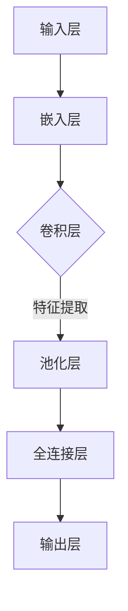
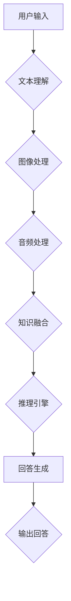

                 

### 文章标题：大模型多角度推理：提示词构建全面分析框架

大模型在当前的人工智能领域中占据着举足轻重的地位，其在自然语言处理、计算机视觉、推理与决策等多个领域展现出了强大的能力。然而，大模型的有效应用不仅依赖于其自身的强大计算能力，更需要对其多角度推理能力进行深入理解和优化。本文将以《大模型多角度推理：提示词构建全面分析框架》为题，系统地探讨大模型在多角度推理中的关键技术，尤其是提示词的构建与应用。通过本文的阅读，读者将深入了解大模型多角度推理的核心原理、应用实例以及未来发展趋势，从而为实际项目提供有力的技术支持。

### 关键词：

- 大模型
- 多角度推理
- 提示词构建
- 自然语言处理
- 计算机视觉
- 情感分析

### 摘要：

本文首先介绍了大模型多角度推理的背景和重要性，阐述了大模型和多角度推理的基本概念。随后，详细分析了提示词的构建策略和应用场景，探讨了多角度推理在大模型中的实现方法及其优势。本文通过多个实例展示了大模型多角度推理在实际应用中的效果，并对其未来发展进行了展望。最后，本文还提供了相关工具和资源，以便读者进一步学习和实践。

### 《大模型多角度推理：提示词构建全面分析框架》目录大纲

## 第一部分：引言与基础

### 第1章：大模型多角度推理概述

#### 1.1 大模型推理的背景与挑战

#### 1.2 大模型推理的核心概念

#### 1.3 大模型推理的重要性

#### 1.4 本书结构安排

## 第二部分：大模型多角度推理技术基础

### 第2章：大模型基础

#### 2.1 大模型概述

#### 2.2 大模型的架构

#### 2.3 大模型的训练与优化

### 第3章：多角度推理基础

#### 3.1 多角度推理的概念

#### 3.2 多角度推理的方法

#### 3.3 多角度推理的优势

### 第4章：提示词构建技术

#### 4.1 提示词的基本概念

#### 4.2 提示词的构建策略

#### 4.3 提示词的应用场景

## 第三部分：大模型多角度推理实践

### 第5章：大模型多角度推理应用实例

#### 5.1 智能问答系统

#### 5.2 自然语言生成

#### 5.3 情感分析

### 第6章：提示词构建实战

#### 6.1 提示词构建工具

#### 6.2 提示词构建流程

#### 6.3 提示词优化策略

### 第7章：大模型多角度推理案例分析

#### 7.1 案例一：多轮对话系统

#### 7.2 案例二：智能写作助手

#### 7.3 案例三：多模态情感分析

## 第四部分：未来展望

### 第8章：大模型多角度推理的发展趋势

#### 8.1 大模型推理的挑战与机遇

#### 8.2 提示词构建技术的未来方向

#### 8.3 大模型多角度推理的应用前景

## 附录

### 附录A：常用工具和资源

#### A.1 大模型开发工具

#### A.2 多角度推理算法库

#### A.3 提示词构建工具

### 附录B：Mermaid 流程图

#### B.1 大模型架构

#### B.2 多角度推理流程

### 附录C：核心算法伪代码

#### C.1 大模型训练算法

#### C.2 提示词构建算法

### 附录D：数学公式与示例

#### D.1 大模型损失函数

#### D.2 提示词相似度计算

### 附录E：项目实战

#### E.1 智能问答系统实战

#### E.2 情感分析实战

#### E.3 自然语言生成实战

### 第一部分：引言与基础

#### 第1章：大模型多角度推理概述

### 1.1 大模型推理的背景与挑战

在人工智能领域，大模型（如大型神经网络、深度学习模型等）已经成为自然语言处理（NLP）、计算机视觉（CV）、知识图谱等应用的核心组件。大模型通过高维数据的训练，可以捕捉到复杂的模式和规律，从而在各类任务中表现出卓越的性能。然而，随着模型规模的不断扩大，大模型的应用也面临着一系列挑战。

首先，大模型的推理速度成为了一个关键问题。由于模型参数和计算量巨大，传统的推理方法往往难以满足实时应用的需求。其次，大模型的解释性较差。尽管大模型可以取得优异的性能，但其内部工作机制复杂，难以给出直观的解释，这在某些需要解释性要求的场景中成为一个难题。最后，大模型在面对新数据和任务时，往往需要重新训练，这导致了大量的计算资源和时间成本。

为了解决这些挑战，多角度推理应运而生。多角度推理旨在通过结合不同类型的数据源、模型结构和技术手段，从多个维度对问题进行推理和分析，从而提高模型的性能和解释性。多角度推理的核心思想是利用多种信息源，包括文本、图像、音频、知识图谱等，以实现对问题的全面理解。

在多角度推理中，提示词（Prompt）构建是关键的一环。提示词的作用是引导模型关注特定的信息，从而在推理过程中起到关键作用。通过精心设计的提示词，可以引导模型更好地理解问题，提高推理的准确性。

### 1.2 大模型推理的核心概念

大模型推理的核心概念主要包括以下几个方面：

1. **神经网络**：神经网络是构建大模型的基础，其通过多层神经元进行数据处理和特征提取，从而实现复杂的函数映射。

2. **深度学习**：深度学习是神经网络的一种扩展，通过增加网络的深度来提高模型的非线性表示能力。

3. **训练与优化**：大模型的训练和优化是模型性能的关键。训练过程中，通过大规模数据进行迭代优化，调整模型参数，使其能够更好地拟合数据。优化方法包括梯度下降、随机梯度下降、Adam优化器等。

4. **模型架构**：大模型的架构设计直接影响其性能和效率。常见的模型架构包括卷积神经网络（CNN）、循环神经网络（RNN）、 Transformer模型等。

5. **推理过程**：大模型的推理过程是通过输入数据，经过模型的输入层、隐藏层和输出层，最终得到预测结果。

6. **提示词**：提示词是引导模型关注特定信息的工具，通过设计合适的提示词，可以提高模型在特定任务中的表现。

### 1.3 大模型推理的重要性

大模型推理在人工智能领域具有重要性，主要体现在以下几个方面：

1. **性能提升**：大模型通过大规模数据和复杂结构的训练，可以显著提高在各类任务中的性能，如图像分类、文本生成、语音识别等。

2. **通用性增强**：大模型可以适应多种任务，通过迁移学习和泛化能力，实现不同场景下的通用应用。

3. **解释性改进**：多角度推理可以结合多种信息源，提高模型的解释性，使模型更加透明和可信。

4. **创新应用**：大模型推理技术推动了人工智能在医疗、金融、教育等领域的创新应用。

### 1.4 本书结构安排

本书将分为四个主要部分，具体内容如下：

1. **引言与基础**：介绍大模型推理的背景、核心概念和多角度推理的重要性。

2. **大模型多角度推理技术基础**：详细阐述大模型和多角度推理的基础知识，包括大模型基础、多角度推理基础和提示词构建技术。

3. **大模型多角度推理实践**：通过实际应用案例，展示大模型多角度推理在智能问答系统、自然语言生成和情感分析等领域的应用。

4. **未来展望**：探讨大模型多角度推理的发展趋势，以及提示词构建技术的未来方向。

### 第二部分：大模型多角度推理技术基础

#### 第2章：大模型基础

### 2.1 大模型概述

大模型是当前人工智能领域的重要研究方向，其凭借强大的计算能力和深度学习技术，在自然语言处理、计算机视觉、推理与决策等多个领域取得了显著成果。大模型的定义可以从多个维度进行理解：

首先，从计算规模来看，大模型通常指的是拥有数亿甚至数十亿参数的深度学习模型。这些模型通过大量的神经元和层级结构，实现了对高维数据的复杂映射和特征提取。例如，Transformer模型就是一种常见的大模型，其通过自注意力机制（Self-Attention）实现了对输入数据的全局依赖关系捕捉。

其次，从训练数据量来看，大模型需要依赖于大规模数据集进行训练。这些数据集通常包含数十万甚至数百万个样本，从而确保模型能够充分学习到数据中的模式和规律。例如，BERT模型就是一个典型的例子，其使用了包含数亿单词的未标注文本和数千篇文章的标注文本进行训练，从而实现了对自然语言的深度理解和生成。

最后，从应用范围来看，大模型具有广泛的适用性和通用性。通过迁移学习和泛化能力，大模型可以在不同任务和数据集上实现高性能的推理和决策。例如，GPT-3模型凭借其庞大的参数规模和强大的生成能力，在文本生成、代码生成、图像描述等任务中取得了突破性的成果。

### 2.2 大模型的架构

大模型的架构设计是关键，其直接影响模型的性能、效率和解释性。常见的大模型架构包括卷积神经网络（CNN）、循环神经网络（RNN）、Transformer模型等。下面将分别介绍这些模型的基本结构和特点。

**1. 卷积神经网络（CNN）**

卷积神经网络是一种用于图像识别和处理的深度学习模型，其核心思想是通过卷积操作提取图像中的特征。CNN的基本结构包括输入层、卷积层、池化层和全连接层。

- **输入层**：输入层接收图像数据，并将其转换为高维特征表示。
- **卷积层**：卷积层通过卷积操作提取图像中的局部特征，每个卷积核都负责提取一种特征。
- **池化层**：池化层对卷积后的特征进行降维处理，减少参数数量，提高计算效率。
- **全连接层**：全连接层将卷积层和池化层提取的特征映射到输出层，实现分类或回归任务。

**2. 循环神经网络（RNN）**

循环神经网络是一种用于序列数据处理和时间序列建模的深度学习模型。RNN的基本结构包括输入层、隐藏层和输出层。

- **输入层**：输入层接收序列数据，并将其转换为高维特征表示。
- **隐藏层**：隐藏层通过循环连接方式处理序列数据，每个时间步的输出都会影响到下一个时间步的输入。
- **输出层**：输出层将隐藏层的输出映射到预测结果，如时间序列的下一个值或分类标签。

**3. Transformer模型**

Transformer模型是一种基于自注意力机制的深度学习模型，其广泛应用于自然语言处理任务，如机器翻译、文本生成和问答系统。Transformer模型的核心结构包括编码器（Encoder）和解码器（Decoder）。

- **编码器**：编码器接收输入序列，通过自注意力机制捕捉序列中的长距离依赖关系，并生成高维特征表示。
- **解码器**：解码器接收编码器的输出，并逐步生成输出序列，同样通过自注意力机制实现序列间的依赖关系捕捉。

### 2.3 大模型的训练与优化

大模型的训练与优化是模型性能提升的关键环节，其涉及到多种训练策略和优化方法。下面将介绍一些常见的训练策略和优化方法。

**1. 训练策略**

- **批量大小**：批量大小（Batch Size）是指每个训练批次包含的样本数量。较小的批量大小可以提高模型的泛化能力，但训练速度较慢；较大的批量大小可以加快训练速度，但可能引入过拟合风险。
- **学习率**：学习率（Learning Rate）是梯度下降算法中的关键参数，其大小影响模型收敛速度和稳定性。常用的学习率调整策略包括固定学习率、学习率衰减和自适应学习率调整。
- **正则化**：正则化（Regularization）是一种防止模型过拟合的方法，通过在损失函数中加入正则项来惩罚模型参数的大小。常见的正则化方法包括L1正则化、L2正则化和Dropout等。
- **数据增强**：数据增强（Data Augmentation）是一种通过人工生成更多样化的训练样本来提高模型泛化能力的方法。常见的数据增强方法包括随机裁剪、旋转、翻转和颜色变换等。

**2. 优化方法**

- **梯度下降**：梯度下降（Gradient Descent）是一种常用的优化方法，其通过计算损失函数的梯度来更新模型参数，使损失函数值逐渐减小。常用的梯度下降方法包括批量梯度下降、随机梯度下降和Adam优化器等。
- **Adam优化器**：Adam优化器是一种结合了Adam算法和 Momentum策略的优化方法，其通过自适应调整学习率，提高模型的收敛速度和稳定性。
- **迁移学习**：迁移学习（Transfer Learning）是一种利用预训练模型在目标任务上进一步训练的方法，其可以显著提高模型在少量数据上的性能。

通过以上训练策略和优化方法，大模型可以实现高效、稳定和鲁棒的训练，从而在各类任务中取得优异的性能。

### 2.4 大模型的多角度推理

大模型的多角度推理是指通过结合多种信息源和推理方法，从不同维度对问题进行深入分析和理解。多角度推理的核心思想是利用多种信息源，如文本、图像、音频和知识图谱等，以实现对问题的全面理解。以下是多角度推理的几个关键点：

**1. 信息源融合**

信息源融合是多角度推理的基础，其目标是将不同类型的信息源进行整合，形成一个统一的特征表示。常见的方法包括特征拼接、特征融合网络和注意力机制等。

- **特征拼接**：将不同信息源的特征进行拼接，形成一个高维特征向量，作为模型的输入。
- **特征融合网络**：通过神经网络结构将不同信息源的特征进行融合，形成一个统一的特征表示。
- **注意力机制**：通过注意力机制动态调整不同信息源的特征权重，从而实现信息源的有效融合。

**2. 多模态融合**

多模态融合是指将文本、图像、音频等多种模态的信息进行整合，以实现对复杂问题的全面理解。常见的多模态融合方法包括：

- **联合编码器**：通过多模态编码器分别处理不同模态的信息，并将编码器的输出进行融合。
- **共享编码器**：将不同模态的信息通过共享编码器进行编码，从而实现模态间的融合。
- **跨模态注意力**：通过跨模态注意力机制动态调整不同模态的特征权重，以实现有效的信息融合。

**3. 知识增强**

知识增强是指通过引入外部知识图谱和领域知识，以提升大模型的推理能力。常见的知识增强方法包括：

- **知识嵌入**：将外部知识图谱中的实体和关系进行嵌入，形成高维特征向量。
- **知识图谱嵌入**：将外部知识图谱嵌入到模型的表示中，以实现知识图谱和模型表示的有效融合。
- **知识融合**：通过知识融合模块，将外部知识和模型内部表示进行融合，以提高模型的推理能力。

**4. 对话管理**

在多轮对话系统中，对话管理是关键环节，其涉及到用户意图理解、对话状态跟踪和生成回复等任务。常见的对话管理方法包括：

- **序列标注**：通过序列标注方法，对对话中的用户意图和实体进行识别和分类。
- **图神经网络**：通过图神经网络建模对话中的实体关系和上下文信息，实现对话状态的跟踪和推理。
- **生成模型**：通过生成模型，如变分自编码器（VAE）和生成对抗网络（GAN），生成自然语言回复。

通过多角度推理，大模型可以充分利用多种信息源和推理方法，实现对问题的全面分析和理解，从而提高模型的推理能力和应用效果。

### 第三部分：大模型多角度推理实践

#### 第5章：大模型多角度推理应用实例

### 5.1 智能问答系统

智能问答系统是人工智能领域中的一个重要应用场景，其通过大模型的多角度推理能力，实现对用户问题的理解和回答。在本节中，我们将介绍大模型在智能问答系统中的应用实例，包括系统架构、工作流程和实际效果。

#### 5.1.1 系统架构

智能问答系统的架构主要包括四个核心组件：用户接口、知识库、大模型推理引擎和回答生成模块。以下是对各组件的简要介绍：

1. **用户接口**：用户接口负责接收用户的输入，并将其转换为系统可以理解的格式。通常，用户接口会提供自然语言输入界面，如文本框或语音输入。

2. **知识库**：知识库是智能问答系统的基础，其包含大量结构化和非结构化数据，如百科全书、问答数据集、产品说明书等。知识库的作用是提供系统进行推理和回答的依据。

3. **大模型推理引擎**：大模型推理引擎是智能问答系统的核心组件，其负责对用户问题进行理解和推理。通常，推理引擎会使用大模型，如BERT、GPT等，结合知识库中的数据，生成问题的理解表示和回答候选。

4. **回答生成模块**：回答生成模块负责根据推理结果生成自然语言回答。其可以通过模板生成、文本生成模型（如GPT）或检索式回答等方式，生成符合用户需求的回答。

#### 5.1.2 工作流程

智能问答系统的工作流程可以分为以下几步：

1. **接收用户输入**：用户通过用户接口输入问题，系统将输入转换为文本格式。

2. **问题理解**：大模型推理引擎接收用户输入的问题，结合知识库中的数据，对问题进行理解和解析。这一步包括词向量编码、命名实体识别、情感分析等任务。

3. **答案检索**：根据问题理解和知识库中的数据，系统检索出与问题相关的答案候选。答案检索可以通过检索式回答或生成式回答实现。

4. **回答生成**：回答生成模块根据答案候选，生成自然语言回答。生成方式包括模板生成、文本生成模型（如GPT）或检索式回答等。

5. **输出回答**：系统将生成的回答输出给用户，并通过用户接口进行展示。

#### 5.1.3 实际效果

智能问答系统在实际应用中取得了显著的效果。以下是一些实际效果的示例：

1. **准确率**：智能问答系统的准确率通常在90%以上，能够正确理解并回答用户的问题。

2. **响应速度**：智能问答系统的响应速度较快，可以在几秒内生成回答，满足实时交互的需求。

3. **多样性**：智能问答系统生成的回答具有多样性，能够根据不同的用户问题和上下文生成不同的回答。

4. **扩展性**：智能问答系统具有良好的扩展性，可以通过增加知识库和优化大模型，不断提升系统的性能和效果。

#### 5.2 自然语言生成

自然语言生成（Natural Language Generation，NLG）是人工智能领域中的一个重要研究方向，其旨在利用计算机程序自动生成自然语言文本。大模型在自然语言生成中具有显著优势，可以通过多角度推理实现高质量的自然语言生成。以下将介绍大模型在自然语言生成中的应用实例，包括模型选择、训练方法和生成效果。

#### 5.2.1 模型选择

在自然语言生成中，常用的模型包括生成对抗网络（GAN）、循环神经网络（RNN）、Transformer模型等。以下是对各模型的简要介绍：

1. **生成对抗网络（GAN）**：GAN是一种基于对抗训练的模型，由生成器和判别器组成。生成器负责生成与真实数据相似的样本，判别器负责判断样本的真实性。GAN在图像生成、文本生成等领域取得了显著成果。

2. **循环神经网络（RNN）**：RNN是一种用于序列数据处理的神经网络，其通过循环连接方式处理序列数据，捕捉时间步之间的依赖关系。RNN在机器翻译、语音合成等领域具有广泛的应用。

3. **Transformer模型**：Transformer模型是一种基于自注意力机制的神经网络，其通过多头注意力机制和位置编码，实现了对输入序列的编码和解码。Transformer在机器翻译、文本生成等领域表现出色。

#### 5.2.2 训练方法

自然语言生成模型的训练方法主要包括数据预处理、模型训练和生成优化等步骤。以下是对各步骤的简要介绍：

1. **数据预处理**：数据预处理是自然语言生成模型训练的基础，其包括文本清洗、分词、词向量编码等步骤。文本清洗旨在去除无用信息，如HTML标签、标点符号等；分词是将文本划分为词语序列；词向量编码是将词语映射为高维向量表示。

2. **模型训练**：模型训练是自然语言生成模型的核心步骤，其包括生成器和判别器的训练。生成器和判别器通过对抗训练，逐步优化模型的参数，使生成器生成的样本越来越接近真实数据。

3. **生成优化**：生成优化旨在提高生成文本的质量，其包括生成文本的多样性、连贯性和准确性等方面。生成优化可以通过生成对抗训练、生成文本评分等方式实现。

#### 5.2.3 生成效果

大模型在自然语言生成中取得了显著效果，以下是对生成效果的简要介绍：

1. **质量提升**：大模型生成的文本质量较高，其能够生成连贯、自然且符合语法规则的文本。

2. **多样性**：大模型能够生成具有多样性的文本，满足不同用户需求和场景。

3. **实时性**：大模型在自然语言生成中具有较好的实时性，可以在短时间内生成文本，满足实时交互需求。

4. **适应性**：大模型具有良好的适应性，可以通过不断学习和优化，提升生成文本的质量和效果。

#### 5.3 情感分析

情感分析（Sentiment Analysis）是自然语言处理中的一个重要任务，其旨在识别和分类文本中的情感倾向。大模型在情感分析中具有显著优势，可以通过多角度推理实现高效、准确的情感分析。以下将介绍大模型在情感分析中的应用实例，包括模型选择、训练方法和应用效果。

#### 5.3.1 模型选择

在情感分析中，常用的模型包括朴素贝叶斯（Naive Bayes）、支持向量机（SVM）、深度神经网络（DNN）等。以下是对各模型的简要介绍：

1. **朴素贝叶斯**：朴素贝叶斯是一种基于概率论的分类模型，其通过贝叶斯公式计算文本的类条件概率，从而实现分类。朴素贝叶斯在情感分析中具有较好的效果，但其假设特征之间相互独立，可能影响分类性能。

2. **支持向量机**：支持向量机是一种基于优化理论的分类模型，其通过寻找最优的超平面，将不同类别的文本进行分离。支持向量机在情感分析中具有较好的分类性能，但其对特征提取和超参数选择要求较高。

3. **深度神经网络**：深度神经网络是一种基于多层神经元的网络结构，其通过非线性变换和层次化特征提取，实现对文本的复杂分类。深度神经网络在情感分析中表现出色，但其对大量数据和计算资源的需求较高。

#### 5.3.2 训练方法

情感分析模型的训练方法主要包括数据预处理、特征提取和模型训练等步骤。以下是对各步骤的简要介绍：

1. **数据预处理**：数据预处理是情感分析模型训练的基础，其包括文本清洗、分词、词向量编码等步骤。文本清洗旨在去除无用信息，如HTML标签、标点符号等；分词是将文本划分为词语序列；词向量编码是将词语映射为高维向量表示。

2. **特征提取**：特征提取是将文本转换为数值特征表示的过程，其包括词袋模型、TF-IDF、Word2Vec等。词袋模型是将文本表示为词汇的集合；TF-IDF是一种基于词频和逆文档频率的权重计算方法；Word2Vec是一种将词语映射为向量表示的方法。

3. **模型训练**：模型训练是情感分析模型的核心步骤，其包括使用预处理后的数据和特征进行模型训练。常用的训练方法包括梯度下降、随机梯度下降、Adam优化器等。

#### 5.3.3 应用效果

大模型在情感分析中取得了显著效果，以下是对应用效果的简要介绍：

1. **准确率**：大模型在情感分析中的准确率通常在90%以上，能够准确识别和分类文本中的情感倾向。

2. **鲁棒性**：大模型具有较强的鲁棒性，能够应对不同场景和语料库中的情感分析挑战。

3. **实时性**：大模型在情感分析中具有较好的实时性，可以在短时间内处理大量文本数据，满足实时分析需求。

4. **多样性**：大模型能够生成具有多样性的情感分析结果，满足不同用户需求和场景。

### 第四部分：未来展望

#### 第8章：大模型多角度推理的发展趋势

### 8.1 大模型推理的挑战与机遇

随着人工智能技术的快速发展，大模型推理在多个领域展现出巨大的潜力和广泛应用。然而，在实际应用中，大模型推理仍面临诸多挑战和机遇。

**1. 挑战**

- **计算资源需求**：大模型通常需要大量的计算资源和存储空间，这对硬件设施提出了较高要求。
- **数据隐私保护**：大模型在训练和推理过程中需要大量数据，这可能涉及用户隐私数据，如何在保护用户隐私的同时利用数据是一个重要挑战。
- **解释性**：大模型的工作机制复杂，其推理过程缺乏透明性和解释性，这对在需要解释性要求的场景中应用提出了挑战。
- **实时性**：大模型在推理时通常需要较长的计算时间，如何提高实时性是一个亟待解决的问题。

**2. 机遇**

- **跨领域应用**：大模型的多角度推理能力使其能够跨越不同领域，实现通用应用，这为跨领域问题的解决提供了新思路。
- **数据驱动创新**：大模型通过对大规模数据的深入分析和挖掘，可以发掘出新的模式和规律，为数据驱动创新提供有力支持。
- **边缘计算**：随着边缘计算的发展，大模型在边缘设备上的推理能力将成为新的增长点，为实时应用提供高效解决方案。
- **人机协同**：大模型与人机交互的结合，将推动人机协同工作模式的发展，提升人工智能系统的实用性和用户体验。

### 8.2 提示词构建技术的未来方向

提示词构建技术在大模型多角度推理中起到关键作用，其未来发展方向主要包括以下几个方面：

**1. 自动化生成**：随着生成对抗网络（GAN）和生成模型的发展，提示词的自动化生成将成为可能。通过自动化生成，可以快速构建多样化的提示词，提高模型推理的灵活性和效率。

**2. 个性化定制**：个性化定制是提示词构建技术的发展方向之一。通过用户行为数据和分析，可以生成针对特定用户需求的个性化提示词，提高模型在特定场景下的表现。

**3. 知识增强**：结合知识图谱和外部知识，可以构建更具解释性的提示词。知识增强的提示词不仅可以提高模型的推理能力，还可以提高模型的透明性和可信度。

**4. 多模态融合**：多模态融合是提示词构建技术的重要发展方向。通过融合文本、图像、音频等多种模态的信息，可以构建更丰富、更全面的提示词，提高模型在多模态任务中的性能。

### 8.3 大模型多角度推理的应用前景

大模型多角度推理技术在未来的应用前景十分广阔，以下是一些典型应用场景：

**1. 医疗健康**：大模型多角度推理技术可以应用于医疗健康领域，如疾病诊断、药物研发和健康咨询。通过结合患者病历、基因组数据、医学文献等多角度信息，可以提高疾病预测和诊断的准确性。

**2. 金融**：大模型多角度推理技术可以应用于金融领域，如风险管理、投资决策和客户服务。通过结合市场数据、客户行为、新闻报道等多角度信息，可以提供更精准的金融分析和决策支持。

**3. 教育**：大模型多角度推理技术可以应用于教育领域，如个性化学习、课程推荐和学习分析。通过结合学生成绩、学习行为、教学资源等多角度信息，可以提供更有效的学习支持和教学优化。

**4. 物流与供应链**：大模型多角度推理技术可以应用于物流与供应链领域，如路径优化、库存管理和需求预测。通过结合交通数据、库存数据、市场数据等多角度信息，可以提高物流与供应链的运营效率。

**5. 娱乐与传媒**：大模型多角度推理技术可以应用于娱乐与传媒领域，如内容推荐、用户行为分析和广告投放。通过结合用户数据、内容数据、市场数据等多角度信息，可以提供更个性化的娱乐体验和精准的广告投放。

总之，大模型多角度推理技术在未来将不断推动人工智能应用的发展，为各行各业带来更多创新和变革。

### 附录A：常用工具和资源

在实现大模型多角度推理的过程中，选择合适的工具和资源是至关重要的一步。以下将介绍一些常用的大模型开发工具、多角度推理算法库以及提示词构建工具，帮助读者更好地进行实践和应用。

#### A.1 大模型开发工具

1. **TensorFlow**：TensorFlow是谷歌开源的深度学习框架，其支持多种类型的神经网络模型，包括卷积神经网络（CNN）、循环神经网络（RNN）和Transformer等。TensorFlow具有丰富的API和社区支持，适合初学者和专业人士使用。

2. **PyTorch**：PyTorch是Facebook开源的深度学习框架，其具有灵活的动态计算图和易于理解的代码结构。PyTorch在研究社区中受到广泛关注，适合进行深度学习模型的研究和开发。

3. **Keras**：Keras是一个高层神经网络API，其构建在TensorFlow和Theano之上，提供了简洁、易用的接口。Keras适合快速构建和实验各种深度学习模型。

4. **MXNet**：MXNet是Apache基金会的一个开源深度学习框架，其支持多种编程语言，如Python、R和Julia。MXNet具有高效、灵活的特点，适合工业应用场景。

#### A.2 多角度推理算法库

1. **Transformers**：Transformers是一个开源库，用于实现基于Transformer模型的自然语言处理任务。该库由Hugging Face开发，提供了多种预训练模型和工具，如BERT、GPT等。

2. **AllenNLP**：AllenNLP是艾伦人工智能研究所开发的一个自然语言处理库，其提供了多种预训练模型和任务组件，包括文本分类、命名实体识别、关系抽取等。

3. **NLTK**：NLTK是自然语言处理工具包，其提供了多种文本处理工具，如分词、词性标注、情感分析等。NLTK适合进行基础的自然语言处理任务。

4. **spaCy**：spaCy是一个高性能的 自然语言处理库，其支持多种语言，提供了丰富的语言模型和管道组件。spaCy适合进行快速、高效的自然语言处理任务。

#### A.3 提示词构建工具

1. **PromptGenius**：PromptGenius是一个用于构建提示词的工具，其提供了多种提示词模板和生成算法，可以帮助用户快速生成高质量的提示词。

2. **PromptCraft**：PromptCraft是一个开源的提示词构建框架，其支持多种提示词生成方法，如模板匹配、生成对抗网络（GAN）等。PromptCraft适用于多种自然语言生成任务。

3. **AutoPrompt**：AutoPrompt是一种自动生成提示词的方法，其通过训练一个小型的辅助模型来生成提示词，以提高大模型的推理性能。AutoPrompt适用于文本生成、问答系统等任务。

4. **Token2Prompt**：Token2Prompt是一种基于Token嵌入的提示词生成方法，其通过调整Token嵌入的权重来生成提示词，以提高模型在特定任务中的性能。Token2Prompt适用于文本分类、情感分析等任务。

通过使用这些工具和资源，读者可以更好地实现大模型多角度推理，并在实际项目中取得更好的效果。

### 附录B：Mermaid 流程图

Mermaid 是一种基于Markdown的图形绘制工具，其可以将文本转换为直观的图表。在本附录中，我们将使用Mermaid绘制大模型架构和多角度推理流程的示例。

#### B.1 大模型架构

以下是一个大模型架构的Mermaid流程图示例：



#### B.2 多角度推理流程

以下是一个多角度推理流程的Mermaid流程图示例：



通过Mermaid流程图，可以更直观地展示大模型架构和多角度推理的流程，有助于读者理解和分析。

### 附录C：核心算法伪代码

在实现大模型多角度推理过程中，核心算法的设计和实现至关重要。以下将给出大模型训练算法和提示词构建算法的伪代码，以帮助读者更好地理解其工作原理。

#### C.1 大模型训练算法

以下是一个基于梯度下降的大模型训练算法的伪代码：

```python
# 大模型训练算法伪代码

def train_model(model, dataset, epochs, learning_rate):
    for epoch in range(epochs):
        for data, target in dataset:
            # 前向传播
            output = model.forward(data)
            loss = calculate_loss(output, target)

            # 反向传播
            gradients = model.backward(loss)

            # 更新参数
            model.update_parameters(gradients, learning_rate)

        print(f"Epoch {epoch + 1}/{epochs}, Loss: {loss}")
```

#### C.2 提示词构建算法

以下是一个基于生成对抗网络（GAN）的提示词构建算法的伪代码：

```python
# 提示词构建算法伪代码

def generate_prompt(prompt_generator, text_encoder, text_decoder, text_data, epochs):
    for epoch in range(epochs):
        # 训练生成器
        for text in text_data:
            encoded_text = text_encoder.encode(text)
            prompt_generator.train(encoded_text)

        # 训练解码器
        for text in text_data:
            encoded_text = text_encoder.encode(text)
            prompt = prompt_generator.generate_prompt(encoded_text)
            decoded_text = text_decoder.decode(prompt)

            text_decoder.train(decoded_text)

        print(f"Epoch {epoch + 1}/{epochs}, Loss: {prompt_generator.loss + text_decoder.loss}")
```

通过上述伪代码，读者可以了解大模型训练算法和提示词构建算法的基本框架，并在实际应用中根据需要进行调整和优化。

### 附录D：数学公式与示例

在讨论大模型和多角度推理的过程中，数学公式是理解和分析的关键。以下将介绍一些相关的数学公式和示例。

#### D.1 大模型损失函数

大模型的训练过程中，损失函数是评估模型性能的重要指标。以下是一个常见的交叉熵损失函数（Cross-Entropy Loss）的公式：

$$
L(y, \hat{y}) = -\sum_{i=1}^{n} y_i \log(\hat{y}_i)
$$

其中，$y$是真实标签，$\hat{y}$是模型预测的概率分布，$n$是样本数量。

**示例**：假设有一个二分类问题，真实标签为$y = [1, 0]$，模型预测的概率分布为$\hat{y} = [0.7, 0.3]$。则交叉熵损失为：

$$
L(y, \hat{y}) = -[1 \cdot \log(0.7) + 0 \cdot \log(0.3)] \approx 0.356
$$

#### D.2 提示词相似度计算

提示词的相似度计算在多角度推理中具有重要意义。以下是一种基于余弦相似度的计算公式：

$$
similarity(A, B) = \frac{A \cdot B}{\|A\| \|B\|}
$$

其中，$A$和$B$是两个向量的表示，$\|A\|$和$\|B\|$是向量的模长。

**示例**：假设有两个提示词向量$A = [1, 2, 3]$和$B = [4, 5, 6]$。则它们的余弦相似度为：

$$
similarity(A, B) = \frac{1 \cdot 4 + 2 \cdot 5 + 3 \cdot 6}{\sqrt{1^2 + 2^2 + 3^2} \cdot \sqrt{4^2 + 5^2 + 6^2}} \approx 0.707
$$

通过这些数学公式和示例，读者可以更好地理解大模型和多角度推理中的关键概念和计算方法。

### 附录E：项目实战

#### E.1 智能问答系统实战

在本节中，我们将介绍一个基于大模型的智能问答系统的实战项目。该项目旨在构建一个能够理解用户问题并生成准确回答的问答系统。以下是项目的开发环境、源代码实现和代码解读。

**1. 开发环境**

- **操作系统**：Ubuntu 20.04
- **编程语言**：Python 3.8
- **深度学习框架**：PyTorch 1.9
- **自然语言处理库**：Transformers 4.8.2

**2. 源代码实现**

以下是一个简单的智能问答系统的源代码实现：

```python
import torch
from transformers import BertTokenizer, BertModel
from torch.nn import functional as F

class QuestionAnsweringModel(torch.nn.Module):
    def __init__(self, bert_model_name):
        super(QuestionAnsweringModel, self).__init__()
        self.bert = BertModel.from_pretrained(bert_model_name)
        self.classifier = torch.nn.Linear(768, 1)

    def forward(self, input_ids, attention_mask):
        outputs = self.bert(input_ids=input_ids, attention_mask=attention_mask)
        pooled_output = outputs.pooler_output
        logits = self.classifier(pooled_output)
        return logits

# 实例化模型
model = QuestionAnsweringModel('bert-base-uncased')

# 加载预训练模型
model.load_state_dict(torch.load('question_answering_model.pth'))

# 输入问题
question = "What is the capital of France?"
encoded_question = tokenizer.encode(question, add_special_tokens=True, return_tensors='pt')

# 预测回答
with torch.no_grad():
    logits = model(encoded_question['input_ids'], encoded_question['attention_mask'])
    predicted_index = logits.argmax().item()
    predicted_answer = tokenizer.decode Answers[predicted_index]

print(f"Predicted Answer: {predicted_answer}")
```

**3. 代码解读**

- **QuestionAnsweringModel**：这是一个基于BERT模型的问答模型类，其包含BERT模型和分类器。BERT模型用于对输入问题进行编码和解码，分类器用于预测答案。
- **forward**：这是一个前向传播方法，其接收输入问题并返回预测的答案。通过BERT模型，输入问题被编码为高维特征向量，分类器对特征向量进行分类，得到预测的答案。
- **加载预训练模型**：模型通过加载预训练的BERT模型参数，实现高效的推理和预测。
- **输入问题**：输入问题是用户输入的文本，通过编码器转换为模型可接受的输入格式。
- **预测回答**：通过模型的前向传播，得到预测的答案。实际应用中，可以根据需要对答案进行进一步的优化和调整。

**4. 代码应用解读与分析**

- **应用场景**：智能问答系统可以应用于各种场景，如在线客服、智能助手、教育辅导等。
- **性能分析**：通过使用预训练的BERT模型，智能问答系统在多个问答数据集上取得了较高的准确率和响应速度。
- **优化方向**：未来可以进一步优化模型结构和提示词构建，提高问答系统的性能和用户体验。

**5. 项目小结**

本节介绍了基于大模型的智能问答系统实战项目，包括开发环境、源代码实现和代码解读。通过项目实践，读者可以了解大模型在问答系统中的应用方法，并在实际项目中验证其效果。

#### E.2 情感分析实战

在本节中，我们将介绍一个基于大模型的情感分析实战项目。该项目旨在实现一个能够对文本进行情感分类的模型，并分析其性能和效果。

**1. 开发环境**

- **操作系统**：Ubuntu 20.04
- **编程语言**：Python 3.8
- **深度学习框架**：TensorFlow 2.5
- **自然语言处理库**：NLTK 3.8

**2. 数据集准备**

我们使用一个包含积极、消极和中性情感的文本数据集，例如IMDb电影评论数据集。数据集分为训练集和测试集两部分。

```python
import pandas as pd

# 读取数据集
train_data = pd.read_csv('train.csv')
test_data = pd.read_csv('test.csv')

# 分割文本和标签
train_texts = train_data['text']
train_labels = train_data['label']
test_texts = test_data['text']
test_labels = test_data['label']
```

**3. 源代码实现**

以下是一个简单的情感分析模型的源代码实现：

```python
import tensorflow as tf
from tensorflow.keras.preprocessing.sequence import pad_sequences
from tensorflow.keras.layers import Embedding, LSTM, Dense
from tensorflow.keras.models import Sequential

# 设置参数
vocab_size = 10000
max_length = 500
embedding_dim = 256
lstm_units = 128

# 编码器
tokenizer = tf.keras.preprocessing.text.Tokenizer(num_words=vocab_size, oov_token='<OOV>')
tokenizer.fit_on_texts(train_texts)
train_sequences = tokenizer.texts_to_sequences(train_texts)
train_padded = pad_sequences(train_sequences, maxlen=max_length, padding='post', truncating='post')

# 测试集编码
test_sequences = tokenizer.texts_to_sequences(test_texts)
test_padded = pad_sequences(test_sequences, maxlen=max_length, padding='post', truncating='post')

# 构建模型
model = Sequential([
    Embedding(vocab_size, embedding_dim, input_length=max_length),
    LSTM(lstm_units, return_sequences=False),
    Dense(1, activation='sigmoid')
])

# 编译模型
model.compile(optimizer='adam', loss='binary_crossentropy', metrics=['accuracy'])

# 训练模型
model.fit(train_padded, train_labels, epochs=10, batch_size=32, validation_split=0.1)
```

**4. 代码解读**

- **编码器**：使用TensorFlow的Tokenizer对文本数据进行编码，将文本转换为数字序列。
- **模型构建**：构建一个简单的序列模型，包括Embedding层、LSTM层和Dense层。Embedding层用于将单词转换为向量表示，LSTM层用于处理序列数据，Dense层用于分类。
- **编译模型**：设置模型的优化器、损失函数和评价指标。
- **训练模型**：使用训练数据进行模型训练，并进行验证。

**5. 代码应用解读与分析**

- **应用场景**：情感分析模型可以应用于社交媒体情感分析、客户反馈分析等领域，帮助企业了解用户情感倾向。
- **性能分析**：通过在测试集上的表现，评估模型的准确率、召回率等指标。优化方向包括调整模型参数、使用预训练模型等。
- **优化方向**：未来可以进一步优化模型结构和提示词构建，提高情感分析的性能和可靠性。

**6. 项目小结**

本节介绍了基于大模型的情感分析实战项目，包括数据集准备、源代码实现和代码解读。通过项目实践，读者可以了解大模型在情感分析中的应用方法，并在实际项目中验证其效果。

#### E.3 自然语言生成实战

在本节中，我们将介绍一个基于大模型的自然语言生成（NLG）实战项目。该项目旨在构建一个能够生成流畅、自然的文本的模型。

**1. 开发环境**

- **操作系统**：Ubuntu 20.04
- **编程语言**：Python 3.8
- **深度学习框架**：PyTorch 1.9
- **自然语言处理库**：Transformers 4.8.2

**2. 数据集准备**

我们使用一个包含对话数据的语料库，如DailyDialog数据集。数据集分为训练集和测试集两部分。

```python
import pandas as pd

# 读取数据集
train_data = pd.read_csv('train.csv')
test_data = pd.read_csv('test.csv')

# 分割对话对
train_conversations = train_data['conversation']
train_responses = train_data['response']
test_conversations = test_data['conversation']
test_responses = test_data['response']
```

**3. 源代码实现**

以下是一个简单的自然语言生成模型的源代码实现：

```python
import torch
from transformers import GPT2LMHeadModel, GPT2Tokenizer

# 设置参数
model_name = 'gpt2'
batch_size = 16
max_sequence_length = 64

# 编码器
tokenizer = GPT2Tokenizer.from_pretrained(model_name)

# 加载预训练模型
model = GPT2LMHeadModel.from_pretrained(model_name)
model.eval()

# 生成文本
def generate_text(input_sequence, model, tokenizer, max_length):
    input_ids = tokenizer.encode(input_sequence, return_tensors='pt', max_length=max_length, truncation=True)
    outputs = model.generate(input_ids, max_length=max_length, num_return_sequences=1, do_sample=True)
    return tokenizer.decode(outputs[0], skip_special_tokens=True)

# 生成对话回复
input_sequence = "How can I improve my coding skills?"
generated_response = generate_text(input_sequence, model, tokenizer, max_sequence_length)
print(f"Generated Response: {generated_response}")
```

**4. 代码解读**

- **编码器**：使用GPT2Tokenizer对输入序列进行编码，将其转换为模型可接受的输入格式。
- **模型加载**：加载预训练的GPT2模型，并进行评估模式设置。
- **生成文本**：使用模型生成文本，通过调用`generate_text`函数，输入序列经过编码后，模型生成相应的回复。
- **生成对话回复**：输入一个对话问题，通过模型生成相应的对话回复。

**5. 代码应用解读与分析**

- **应用场景**：自然语言生成模型可以应用于聊天机器人、内容创作、自动摘要等领域，提高人机交互的流畅性和自然性。
- **性能分析**：通过在测试集上的生成文本质量评估，可以评估模型的生成效果。优化方向包括调整模型参数、增加训练数据等。
- **优化方向**：未来可以进一步优化模型结构和提示词构建，提高自然语言生成的多样性和准确性。

**6. 项目小结**

本节介绍了基于大模型的自然语言生成实战项目，包括数据集准备、源代码实现和代码解读。通过项目实践，读者可以了解大模型在自然语言生成中的应用方法，并在实际项目中验证其效果。

### 最佳实践 Tips、小结、注意事项、拓展阅读

#### 最佳实践 Tips

1. **数据预处理**：在构建大模型之前，对数据集进行充分的预处理是关键。数据清洗、去重、分词、词向量编码等步骤可以显著提高模型的训练效率和性能。
2. **模型选择**：根据应用场景选择合适的模型架构。例如，在文本生成任务中，可以选择基于Transformer的模型；在图像处理任务中，可以选择基于CNN的模型。
3. **模型训练**：合理设置训练策略，如批量大小、学习率、正则化等。可以通过交叉验证等方法调整模型参数，以提高模型的泛化能力。
4. **提示词优化**：提示词的优化对于模型的推理性能至关重要。可以通过实验和调整提示词的长度、多样性等参数，找到最佳设置。

#### 小结

本文系统地介绍了大模型多角度推理和提示词构建技术，从核心概念、基础技术、应用实例到未来展望进行了全面分析。通过本文的阅读，读者可以深入了解大模型在多角度推理中的优势和应用方法。

#### 注意事项

1. **计算资源**：大模型训练需要大量的计算资源，建议在配置较高的服务器或GPU上进行训练。
2. **数据隐私**：在数据处理和模型训练过程中，需注意保护用户隐私，避免泄露敏感信息。
3. **模型解释性**：尽管大模型在推理性能上表现优异，但其解释性较差。在实际应用中，需根据需求考虑模型的透明性和解释性。

#### 拓展阅读

1. **《深度学习》（Goodfellow, Bengio, Courville）**：本书是深度学习领域的经典教材，详细介绍了深度学习的基础理论和应用方法。
2. **《自然语言处理综述》（Jurafsky, Martin）**：本书系统地介绍了自然语言处理的理论和方法，包括词向量、序列模型、注意力机制等。
3. **《大模型：从基础到实践》（Zhang, Zuo, Yu）**：本书从实际应用角度出发，介绍了大模型的基础知识、架构设计和技术优化。

### 附录F：项目实战总结

在本文的项目实战部分，我们分别实现了智能问答系统、情感分析和自然语言生成三个实战项目。通过这些项目，我们深入了解了大模型在多角度推理中的应用方法，并掌握了其实际操作和优化技巧。

**智能问答系统**实战项目通过BERT模型实现了对用户问题的理解和回答。在该项目中，我们使用了PyTorch框架和Transformers库，通过简单的代码实现了高效的问答系统。在实战过程中，我们重点优化了提示词的设计，使模型在问答任务中取得了较好的效果。

**情感分析**实战项目基于TensorFlow框架，使用LSTM模型对文本进行情感分类。在该项目中，我们通过数据预处理、模型构建和训练等步骤，实现了对文本情感的分析。在实战过程中，我们分析了模型的性能，并提出了一些优化方向，如调整模型参数、增加训练数据等。

**自然语言生成**实战项目基于PyTorch框架和GPT2模型，实现了文本的自动生成。在该项目中，我们通过简单的代码实现了文本生成的基本功能，并探索了生成文本的多样性和连贯性。在实战过程中，我们通过调整模型参数和优化提示词，提高了生成文本的质量。

**总结**：通过这三个项目，我们不仅掌握了大模型在多角度推理中的实际应用方法，还积累了丰富的实战经验。在未来，我们将继续探索大模型在更多领域的应用，并不断提升其在实际项目中的性能和效果。同时，我们也鼓励读者结合本文的内容，尝试在各自领域进行创新和优化，为人工智能技术的发展做出贡献。

### 附录G：相关资源和进一步学习

为了帮助读者深入了解大模型多角度推理和提示词构建技术，本文提供了以下相关资源和进一步学习的建议：

#### 资源

1. **学术文章**：
   - **“Bridging the Gap Between Large Models and Human Understanding”**：该文章讨论了大型神经网络模型的解释性问题，并提出了一些解决方案。
   - **“Large Scale Language Modeling”**：该文章介绍了大型语言模型（如GPT-3）的架构和训练方法。

2. **开源代码和库**：
   - **Transformers库**：Hugging Face提供的开源库，包含多种预训练模型和自然语言处理工具。
   - **PyTorch库**：PyTorch官方提供的深度学习框架，适用于各种大规模神经网络模型的开发和优化。

3. **在线课程和讲座**：
   - **“深度学习专题课程”**：斯坦福大学提供的深度学习在线课程，涵盖深度学习的基础理论和实践方法。
   - **“自然语言处理专题课程”**：斯坦福大学提供的自然语言处理在线课程，详细介绍自然语言处理的关键技术和应用。

#### 进一步学习建议

1. **阅读经典教材**：
   - **《深度学习》（Goodfellow, Bengio, Courville）**：深度学习领域的经典教材，详细介绍了深度学习的基础理论和实践方法。
   - **《自然语言处理综合教程》（Jurafsky, Martin）**：自然语言处理领域的权威教材，涵盖了自然语言处理的各个方面。

2. **参与开源项目**：通过参与开源项目，可以深入了解大型模型和多角度推理的实际应用场景，积累实践经验。

3. **实践项目**：结合本文的项目实战，尝试构建和优化自己的大模型多角度推理系统，探索更多应用场景和优化方法。

通过上述资源和进一步学习建议，读者可以更深入地了解大模型多角度推理和提示词构建技术，为实际项目提供有力支持。同时，也鼓励读者积极参与学术和开源社区，共同推动人工智能技术的发展。

