                 

### 文章标题

《大模型定制开发服务的商业化》

### 关键词

- 大模型
- 定制开发
- 商业化
- 技术原理
- 实战案例
- 风险管理

### 摘要

本文深入探讨了大模型定制开发服务的商业化，通过分析商业化背景、技术基础、实施策略和实战案例，为读者提供了全面且实用的指导。文章首先概述了商业化背景和大模型定制开发服务的意义，然后详细介绍了大模型技术原理、定制开发流程和应用场景，接着探讨了商业模式设计、市场推广与运营策略以及风险管理。通过具体的实战案例和经验分享，本文旨在为读者揭示大模型定制开发服务商业化的核心逻辑和实践路径，助力读者更好地理解和应用这一前沿技术。

## 《大模型定制开发服务的商业化》目录大纲

### 第一部分：商业化背景与概述

#### 第1章：大模型定制开发服务概述

- **1.1 大模型定制开发服务的意义**
- **1.2 商业化背景分析**
- **1.3 大模型定制开发服务的现状与挑战**

#### 第2章：大模型商业化案例分析

- **2.1 成功案例分析**
- **2.2 失败案例分析**
- **2.3 案例启示与总结**

### 第二部分：大模型定制开发技术基础

#### 第3章：大模型技术原理

- **3.1 大模型基本概念**
- **3.2 大模型结构分析**
- **3.3 大模型训练与优化**

#### 第4章：大模型定制开发流程

- **4.1 需求分析与目标设定**
- **4.2 数据收集与处理**
- **4.3 模型设计与开发**
- **4.4 模型评估与优化**

#### 第5章：大模型应用场景探索

- **5.1 垂直行业应用**
- **5.2 横向行业应用**
- **5.3 创新应用场景**

### 第三部分：大模型商业化实施策略

#### 第6章：商业模式设计

- **6.1 商业模式选择**
- **6.2 产品定位与市场分析**
- **6.3 收益模式探索**

#### 第7章：市场推广与运营

- **7.1 市场推广策略**
- **7.2 品牌建设与宣传**
- **7.3 运营管理与优化**

#### 第8章：风险管理

- **8.1 风险识别与评估**
- **8.2 风险应对策略**
- **8.3 风险管理与监控**

### 第四部分：实战案例与经验分享

#### 第9章：大模型定制开发实战案例

- **9.1 案例一：金融行业大模型定制开发**
- **9.2 案例二：医疗健康领域大模型应用**
- **9.3 案例三：智能制造大模型定制开发**

#### 第10章：经验分享与启示

- **10.1 成功经验总结**
- **10.2 遇到的挑战与解决方案**
- **10.3 未来发展趋势与展望**

### 附录

#### 附录A：大模型定制开发工具与资源

- **A.1 工具介绍**
- **A.2 资源推荐**
- **A.3 开发环境搭建指南**

## 第一部分：商业化背景与概述

### 第1章：大模型定制开发服务概述

#### 1.1 大模型定制开发服务的意义

大模型定制开发服务是一种基于大规模机器学习模型的技术服务，其核心在于根据客户特定的需求和应用场景，定制开发适合的大模型。这一服务的意义体现在多个方面：

1. **满足个性化需求**：企业或研究机构往往需要针对特定问题或业务场景开发定制模型，这种个性化需求是大模型定制开发服务的核心价值。
2. **提升模型性能**：通过定制开发，可以优化模型的架构、参数和训练数据，从而提升模型的性能和鲁棒性。
3. **缩短开发周期**：相较于从零开始构建大模型，定制开发可以显著缩短开发周期，提高项目的效率。
4. **降低开发成本**：定制开发可以根据客户的预算和需求，提供不同的解决方案，从而降低整体开发成本。

#### 1.2 商业化背景分析

随着人工智能技术的迅速发展，大模型已经成为现代科技的重要组成部分。商业化背景分析主要包括以下几个方面：

1. **市场需求增长**：随着各行各业的数字化转型，对人工智能技术的需求不断增长，大模型定制开发服务也因此迎来了广阔的市场。
2. **技术进步**：计算能力的提升和大数据的广泛应用，为大规模机器学习模型的研究和开发提供了强有力的支持。
3. **政策支持**：各国政府对人工智能技术的发展给予了高度重视，出台了一系列支持政策和措施，为商业化提供了良好的环境。
4. **竞争加剧**：随着大模型技术的普及，市场上的竞争也日益激烈，企业需要通过提供高质量、差异化的定制服务来获得竞争优势。

#### 1.3 大模型定制开发服务的现状与挑战

当前，大模型定制开发服务已经呈现出良好的发展态势，但同时也面临一些挑战：

1. **技术挑战**：大模型的开发需要深厚的专业知识和技术积累，包括数据处理、模型训练、优化和部署等环节。技术瓶颈和复杂度是定制开发服务面临的重大挑战。
2. **数据隐私**：在定制开发过程中，往往需要使用客户的数据进行模型训练和优化，这涉及到数据隐私和安全问题。
3. **商业化路径**：如何将大模型定制开发服务成功商业化，找到合适的商业模式和盈利模式，是当前亟需解决的问题。
4. **市场竞争**：随着越来越多的企业进入这一领域，市场竞争日益激烈，如何在竞争中脱颖而出，提供高质量的服务，成为企业的关键挑战。

通过上述分析，我们可以看到，大模型定制开发服务具有巨大的商业价值和发展潜力，但同时也面临诸多挑战。在接下来的章节中，我们将深入探讨大模型的技术原理、定制开发流程、应用场景以及商业化实施策略，为读者提供全面的指导。

### 第2章：大模型商业化案例分析

#### 2.1 成功案例分析

在讨论大模型商业化时，成功案例为我们提供了宝贵的经验和启示。以下是一些在大模型商业化方面取得成功的经典案例：

1. **谷歌的BERT模型**：BERT（Bidirectional Encoder Representations from Transformers）是谷歌在2018年推出的一种自然语言处理预训练模型。通过大规模数据训练和优化，BERT在多个自然语言处理任务中取得了显著成果。谷歌通过将BERT集成到其搜索引擎和谷歌助手等产品中，提升了用户体验和搜索效果。这种成功的商业化策略不仅提升了谷歌的市场地位，还推动了自然语言处理技术的发展。

2. **OpenAI的GPT-3模型**：OpenAI开发的GPT-3（Generative Pre-trained Transformer 3）是当前最先进的语言处理模型之一。GPT-3拥有1750亿个参数，能够生成高质量的文本、代码和图像描述。OpenAI通过API的形式向开发者提供GPT-3的服务，吸引了大量企业和开发者使用其平台。GPT-3的成功商业化不仅为OpenAI带来了巨大的经济收益，还促进了人工智能技术的广泛应用。

3. **亚马逊的Recommendation System**：亚马逊在其电子商务平台上广泛应用了推荐系统，通过分析用户的历史购买记录和浏览行为，为用户推荐可能感兴趣的商品。这一推荐系统背后采用了深度学习技术，通过大量用户数据的训练和优化，实现了高度的个性化推荐。亚马逊通过推荐系统成功提升了销售转化率和用户满意度，实现了显著的商业化收益。

这些成功案例的共同特点在于：

- **技术领先**：这些公司都在其领域内拥有领先的技术实力，能够开发出性能卓越的大模型。
- **数据驱动**：成功的大模型商业化往往依赖于大量高质量的数据，通过对数据的深入分析和处理，提升模型性能。
- **市场定位**：这些公司能够准确把握市场需求，将大模型的技术优势转化为商业价值。

#### 2.2 失败案例分析

尽管大模型商业化有许多成功的案例，但也有一些失败案例值得借鉴。以下是一些典型的失败案例：

1. **IBM的Watson**：IBM的Watson是早期的人工智能系统之一，曾因其能够击败人类选手而在全球引起轰动。然而，Watson在实际应用中的表现并不如预期，导致商业化失败。其中一个关键问题是Watson缺乏针对具体应用场景的定制化开发，无法满足客户的实际需求。此外，Watson的高成本和复杂部署也使其难以在市场上广泛推广。

2. **微软的Cortana**：微软的Cortana是微软的智能个人助理，类似于苹果的Siri和谷歌的Google Assistant。然而，Cortana在商业化方面并未取得显著成功。一个重要原因是Cortana在用户体验和功能集成上与其他竞争对手相比缺乏优势，且市场推广力度不足。

3. **Facebook的Chatbot**：Facebook曾推出了一系列聊天机器人，旨在为企业和用户提供定制化服务。然而，许多聊天机器人在实际应用中表现不佳，无法提供有效的客户支持，导致用户流失。其中一个关键问题是这些聊天机器人缺乏有效的训练数据和模型优化，导致性能不佳。

这些失败案例的教训在于：

- **需求导向**：成功的大模型商业化需要深入了解客户需求，提供定制化的解决方案。
- **技术成熟度**：技术成熟度是成功商业化的重要前提，早期技术往往面临性能不稳定、成本高等问题。
- **市场策略**：有效的市场策略和推广是成功商业化的关键，缺乏市场认知和推广力度会导致产品无法广泛传播。

#### 2.3 案例启示与总结

通过对成功和失败案例的分析，我们可以得到以下启示和总结：

- **技术优势**：拥有领先的技术实力是成功商业化的基础。企业应持续投资于技术研发，保持技术领先地位。
- **数据驱动**：高质量的数据是构建高性能大模型的关键。企业应建立完善的数据收集和管理体系，确保数据的真实性和有效性。
- **需求导向**：深入了解客户需求，提供定制化的解决方案，是提升用户满意度和市场竞争力的重要手段。
- **市场策略**：有效的市场推广和品牌建设是成功商业化的关键。企业应制定清晰的市场策略，加大市场推广力度。

总之，大模型商业化是一个复杂而充满挑战的过程，但通过深入分析和学习成功和失败案例，我们可以找到有效的路径和方法，实现大模型商业化的成功。

### 第二部分：大模型定制开发技术基础

#### 第3章：大模型技术原理

#### 3.1 大模型基本概念

大模型（Large-scale Model），是指在规模上远远超出传统模型的机器学习模型，通常具有数百万到数十亿个参数。大模型的出现是计算能力提升和大数据积累的结果，其目的是通过更多的参数和更复杂的结构来捕捉数据中的潜在模式和规律，从而在各个领域中实现更高的准确性和性能。

大模型主要涵盖以下几个核心概念：

1. **参数量**：大模型的参数量通常在数百万到数十亿之间，这些参数用于表征输入数据和输出结果之间的关系。
2. **训练数据量**：大模型的训练需要大量高质量的数据，以便模型能够从数据中学习到有效的特征和模式。
3. **计算资源**：大模型训练和推理需要强大的计算资源，特别是对于复杂的模型结构和高维数据。
4. **复杂性**：大模型的复杂性体现在其网络结构和训练过程中，通常需要更复杂的方法和算法来处理和优化。

#### 3.2 大模型结构分析

大模型的架构设计是其成功的关键之一，通常包括以下几个层次：

1. **基础层**：基础层主要包括输入层、输出层和隐藏层。输入层负责接收外部输入数据，输出层负责生成预测结果，隐藏层则负责进行数据特征提取和变换。

2. **网络层**：网络层包括多层神经网络结构，常见的有卷积神经网络（CNN）、循环神经网络（RNN）、变换器网络（Transformer）等。这些网络结构能够通过层与层之间的信息传递和处理，实现对数据的深度理解和抽象。

3. **优化层**：优化层包括模型的参数优化和训练策略。常用的优化算法有随机梯度下降（SGD）、Adam优化器等。优化层的目的是通过调整模型参数，提高模型的训练效率和性能。

4. **扩展层**：扩展层包括模型结构的扩展和功能的扩展。例如，通过加入注意力机制、多任务学习等机制，可以增强模型的适应性和性能。

以下是一个简化的大模型结构Mermaid流程图：

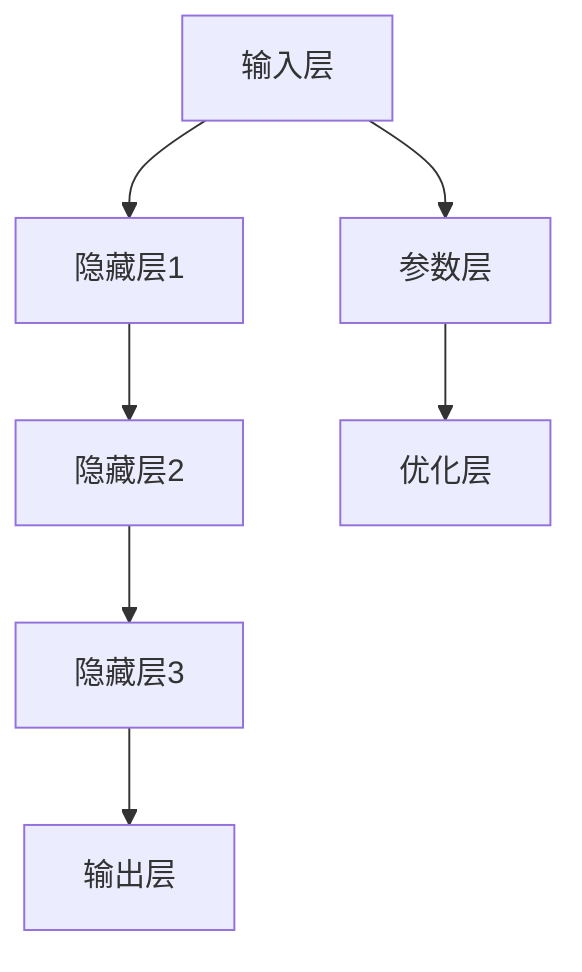

#### 3.3 大模型训练与优化

大模型的训练和优化是一个复杂的过程，涉及多个技术环节：

1. **数据预处理**：数据预处理包括数据清洗、数据增强和归一化等步骤。高质量的数据预处理可以显著提高模型的训练效果和性能。

2. **模型训练**：模型训练是指通过输入数据不断调整模型参数，使其达到期望的性能。训练过程中，常用的技术有反向传播（Backpropagation）和梯度下降（Gradient Descent）。

3. **优化算法**：优化算法用于调整模型参数，提高模型性能。常见的优化算法有随机梯度下降（SGD）、Adam优化器、RMSProp等。优化算法的选择对模型的训练速度和最终性能有很大影响。

4. **模型评估**：模型评估用于衡量模型的性能和效果。常用的评估指标有准确率、召回率、F1分数等。通过模型评估，可以判断模型是否满足预期要求，并指导进一步优化。

以下是一个简化的模型训练与优化伪代码：

```python
# 初始化模型参数
params = initialize_params()

# 定义损失函数
loss_function = define_loss_function()

# 设置优化器
optimizer = define_optimizer()

# 训练模型
for epoch in range(num_epochs):
    for data, target in dataset:
        # 计算梯度
        gradients = compute_gradients(data, target, params)
        
        # 更新参数
        optimizer.update_params(params, gradients)
        
        # 计算损失
        loss = loss_function(target, predict(data, params))
        
    # 打印训练进度
    print(f"Epoch {epoch}: Loss = {loss}")

# 模型评估
evaluation = evaluate_model(model, test_data, test_target)

# 输出评估结果
print(f"Model evaluation: {evaluation}")
```

#### 总结

大模型技术是现代人工智能领域的重要发展方向，其复杂的结构和强大的学习能力为解决复杂问题提供了新的途径。了解大模型的基本概念、结构设计和训练优化方法，是进行大模型定制开发的关键。在接下来的章节中，我们将进一步探讨大模型的定制开发流程、应用场景以及商业化实施策略。

### 第4章：大模型定制开发流程

#### 4.1 需求分析与目标设定

大模型定制开发的第一步是需求分析与目标设定，这一阶段至关重要，决定了后续开发和实施的路径。具体步骤如下：

1. **明确业务需求**：首先，需要与客户进行深入沟通，了解其业务背景、目标和应用场景。通过访谈、问卷调查和用户需求分析等方法，全面收集客户的需求信息。

2. **定义模型目标**：根据业务需求，明确大模型需要实现的具体目标，例如预测准确性、实时性、可解释性等。这些目标将指导后续的模型设计与优化。

3. **设定项目范围**：明确项目范围，包括数据量、模型类型、训练周期、预算等。这有助于在项目初期就设定合理的预期，并确保项目能够按时按质完成。

4. **风险评估**：对项目风险进行初步评估，包括技术风险、数据隐私风险、项目进度风险等。识别潜在风险，并制定相应的应对策略。

以下是一个简化的需求分析与目标设定的Mermaid流程图：

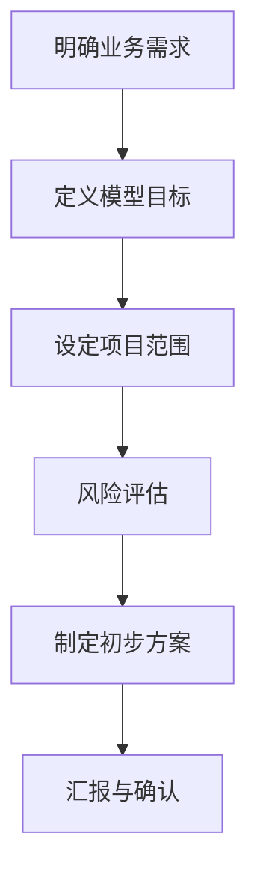

#### 4.2 数据收集与处理

数据收集与处理是定制开发过程中的核心环节，直接影响到模型的性能和效果。具体步骤如下：

1. **数据采集**：根据模型目标，从各种数据源采集所需数据，包括结构化数据、非结构化数据等。数据源可能包括企业内部数据库、第三方数据平台、公开数据集等。

2. **数据清洗**：清洗数据是确保数据质量和模型效果的重要步骤。包括去除重复数据、处理缺失值、异常值、噪声等。常用的数据清洗方法有数据填充、数据裁剪、数据转换等。

3. **数据预处理**：数据预处理包括数据归一化、标准化、特征提取和降维等。通过预处理，可以提高数据的规范性和一致性，增强模型的泛化能力。

4. **数据增强**：数据增强是一种通过生成或修改原始数据来增加训练数据多样性的方法，有助于提升模型对未知数据的适应能力。

以下是一个简化的数据收集与处理Mermaid流程图：

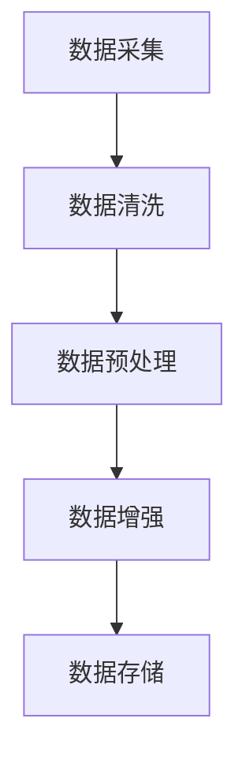

#### 4.3 模型设计与开发

模型设计与开发是定制开发的关键阶段，涉及模型架构的选择、参数设置和训练策略的制定。具体步骤如下：

1. **选择模型架构**：根据需求分析和数据特性，选择合适的模型架构。常见的模型架构包括卷积神经网络（CNN）、循环神经网络（RNN）、变换器网络（Transformer）等。

2. **定义模型参数**：确定模型的输入层、隐藏层和输出层的结构，包括层数、神经元数量、激活函数等。同时，设定学习率、批量大小、迭代次数等训练参数。

3. **模型训练**：使用预处理后的数据对模型进行训练，通过反向传播算法不断调整模型参数，使其达到预期目标。训练过程中，可以使用各种优化算法（如SGD、Adam）来提高训练效率和模型性能。

4. **模型验证与调整**：通过验证集对模型进行性能评估，根据评估结果调整模型参数和结构，以达到最佳效果。

以下是一个简化的模型设计与开发Mermaid流程图：

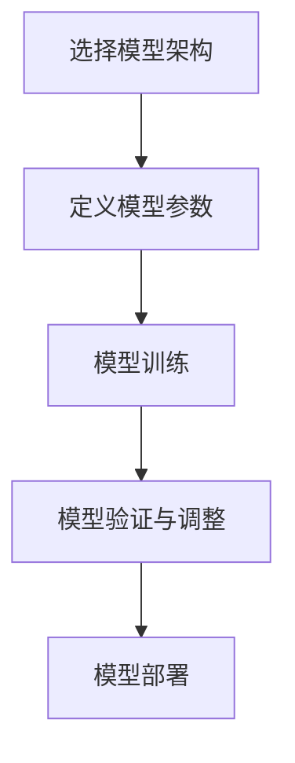

#### 4.4 模型评估与优化

模型评估与优化是确保模型在实际应用中表现良好的关键步骤。具体步骤如下：

1. **评估模型性能**：使用测试集对模型进行性能评估，常用的评估指标包括准确率、召回率、F1分数等。通过对比不同模型的性能，选择最优模型。

2. **性能优化**：针对评估结果，对模型进行优化。优化方法包括调整模型参数、增加训练数据、改进数据预处理等。优化的目标是提升模型的性能和泛化能力。

3. **模型部署**：将最优模型部署到实际应用环境中，确保模型能够稳定运行并产生预期效果。部署过程中，需要考虑模型的兼容性、安全性、可维护性等因素。

4. **持续监控与更新**：在模型部署后，对模型进行持续监控，确保其性能和稳定性。根据实际应用情况，定期更新模型，以适应新数据和变化的环境。

以下是一个简化的模型评估与优化Mermaid流程图：

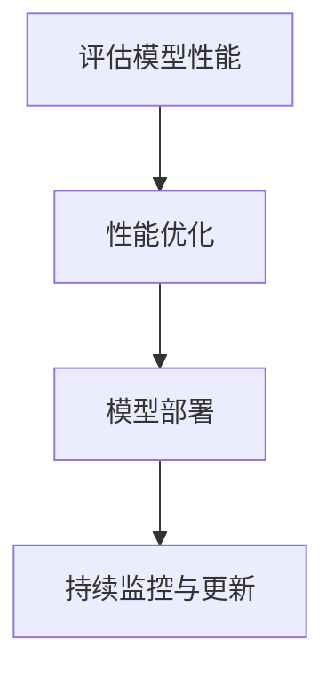

#### 总结

大模型定制开发流程是一个系统化的过程，涉及需求分析、数据收集与处理、模型设计与开发、模型评估与优化等多个环节。每个环节都需要精心设计和实施，以确保最终模型能够满足客户需求并产生实际价值。在接下来的章节中，我们将进一步探讨大模型在不同应用场景中的具体应用和实践经验。

### 第5章：大模型应用场景探索

#### 5.1 垂直行业应用

大模型在垂直行业中的应用，已经成为推动行业智能化的重要驱动力。以下是一些典型垂直行业应用场景：

1. **金融行业**：在金融领域，大模型被广泛应用于风险管理、信用评分、股票预测等任务。例如，利用大模型进行客户行为分析，可以更准确地预测客户的信用风险，从而优化信贷管理策略。此外，大模型在市场趋势预测和算法交易中也发挥着重要作用。

2. **医疗健康领域**：医疗健康领域是另一个大模型的重要应用场景。通过大模型对医学影像、电子健康记录等大量数据进行分析，可以实现疾病诊断、药物研发、个性化治疗等。例如，利用深度学习模型分析CT扫描图像，可以提高肺癌早期诊断的准确性。

3. **智能制造**：在智能制造领域，大模型可以用于质量检测、预测维护、生产优化等。通过分析生产数据，大模型可以预测设备的故障，从而进行预防性维护，减少停机时间，提高生产效率。

4. **交通运输**：大模型在交通运输领域也有着广泛的应用。例如，通过分析交通流量数据，可以预测交通拥堵，优化交通信号控制策略，提高交通效率。同时，大模型还可以用于自动驾驶技术，通过深度感知和决策，实现安全、高效的自动驾驶。

#### 5.2 横向行业应用

除了在垂直行业中的应用，大模型在横向行业中的应用也日益增多，为不同领域提供了通用解决方案：

1. **自然语言处理（NLP）**：大模型在自然语言处理领域取得了显著突破，例如文本分类、情感分析、机器翻译等。通过大规模语料库的训练，大模型可以生成更准确、自然的文本输出，为多个行业提供语言理解与生成能力。

2. **图像识别与处理**：大模型在图像识别与处理领域也表现出色。通过卷积神经网络（CNN）和变换器网络（Transformer），大模型可以实现高精度的图像分类、目标检测、图像分割等任务。例如，在安防监控、医疗影像诊断等领域，大模型的应用大大提升了图像处理和分析的效率。

3. **推荐系统**：推荐系统是另一个横向应用场景。通过分析用户的浏览记录和行为数据，大模型可以生成个性化的推荐列表，提升用户的购物体验和满意度。电商平台、视频流媒体平台等都广泛应用了这一技术。

4. **游戏开发**：大模型在游戏开发中的应用也越来越广泛。例如，通过生成对抗网络（GAN）和强化学习模型，可以实现逼真的虚拟环境生成、游戏角色行为模拟等，为游戏开发者提供了强大的工具。

#### 5.3 创新应用场景

随着技术的不断进步，大模型的应用场景也在不断拓展，出现了许多创新性的应用：

1. **智能客服**：通过大模型构建的智能客服系统，可以实时回答用户的问题，提供高质量的客户服务。这种系统能够理解自然语言，进行多轮对话，为用户提供24/7不间断的服务。

2. **智能写作与内容生成**：大模型在内容生成领域表现出色，可以用于撰写新闻文章、生成音乐、创作文学作品等。例如，OpenAI的GPT-3模型可以生成高质量的新闻文章，为媒体行业提供了新的创作工具。

3. **虚拟现实与增强现实**：大模型在虚拟现实（VR）和增强现实（AR）中的应用，可以提供更加逼真的交互体验。通过生成逼真的三维模型和场景，大模型可以提升用户的沉浸感和体验。

4. **预测性维护**：在工业生产中，大模型可以用于预测设备的维护需求。通过分析设备运行数据，大模型可以预测设备故障，提前进行维护，从而减少设备停机时间和维修成本。

#### 总结

大模型的应用场景非常广泛，从垂直行业的深入应用，到横向行业的通用解决方案，再到创新性的前沿应用，大模型正不断改变着各行各业的运作方式。随着技术的不断进步和应用领域的拓展，大模型的应用前景将更加广阔。在下一部分，我们将探讨大模型商业化的实施策略，帮助读者更好地理解和应用这一前沿技术。

### 第三部分：大模型商业化实施策略

#### 第6章：商业模式设计

#### 6.1 商业模式选择

选择合适的商业模式是成功进行大模型商业化的关键步骤。不同的商业模式适用于不同的应用场景和市场需求，常见的商业模式包括以下几种：

1. **API服务**：通过提供API接口，开发者可以直接调用大模型的服务，实现特定功能。这种模式适用于需要灵活调用模型功能的场景，如自然语言处理、图像识别等。

2. **订阅服务**：用户根据使用量或服务时长，支付订阅费用。这种模式适用于需求稳定、周期性使用的场景，如智能客服、预测分析等。

3. **一次性购买**：用户一次性购买大模型的许可证或使用权，适用于一次性投入较大的场景，如工业应用、医疗诊断等。

4. **定制化服务**：根据客户的具体需求，提供定制化的解决方案。这种模式适用于需要高度定制化服务的场景，如金融风控、医疗诊断等。

5. **合作分成**：与合作伙伴合作，共同开发和推广大模型，按照业务收益进行分成。这种模式适用于需要市场推广和资源整合的场景。

#### 6.2 产品定位与市场分析

产品定位和市场需求分析是商业模式设计的重要环节，具体步骤如下：

1. **确定目标市场**：根据大模型的应用场景，确定目标市场和客户群体。例如，金融行业、医疗健康领域、智能制造等。

2. **分析市场需求**：了解目标市场的需求和痛点，分析竞争格局和市场份额。例如，在金融领域，风险管理和客户服务是主要需求点，而智能制造领域，生产优化和预测维护是关键需求。

3. **定位产品特点**：明确大模型的产品特点，包括性能优势、功能特色、用户体验等。例如，高准确性、实时性、可解释性等。

4. **制定市场策略**：根据市场需求和产品特点，制定相应的市场策略，包括定价策略、推广策略、渠道策略等。

#### 6.3 收益模式探索

收益模式的设计是商业模式的核心，需要考虑以下几个方面：

1. **直接收益**：通过直接销售产品或服务获得收益，如API服务、订阅服务、一次性购买等。

2. **间接收益**：通过增值服务和附加产品获得收益，如培训服务、技术咨询、定制开发等。

3. **合作收益**：通过与其他企业或机构合作，共享业务收益。例如，与硬件制造商合作，提供集成解决方案。

4. **衍生收益**：通过大模型的应用，创造新的商业模式和业务机会。例如，通过大模型生成的数据，开发新的数据产品或服务。

5. **长期收益**：通过持续的技术创新和服务优化，保持市场竞争力和客户黏性，实现长期稳定的收益。

以下是一个简化的商业模式设计Mermaid流程图：

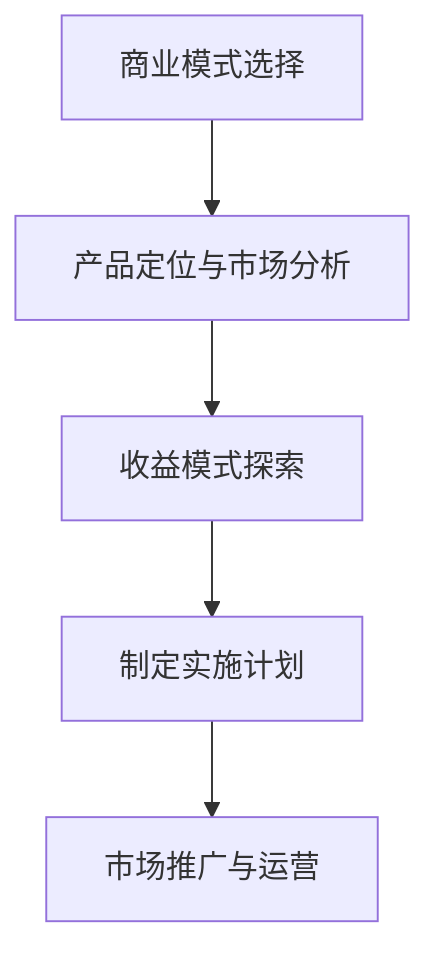

#### 总结

商业模式设计是成功进行大模型商业化的重要环节，需要综合考虑市场需求、产品特点和收益模式。通过合理的商业模式设计，可以最大化大模型的价值，实现商业成功。在接下来的章节中，我们将进一步探讨大模型的市场推广与运营策略，以及风险管理，为读者提供全面的商业化指导。

### 第7章：市场推广与运营

#### 7.1 市场推广策略

市场推广策略是确保大模型定制开发服务在竞争激烈的市场中获得关注和认可的关键。以下是几种有效的市场推广策略：

1. **内容营销**：通过撰写高质量的技术博客、白皮书、案例研究等，向潜在客户展示大模型的技术实力和应用场景。这种策略能够提高品牌知名度和行业影响力，吸引潜在客户的关注。

2. **社交媒体推广**：利用LinkedIn、Twitter、Facebook等社交媒体平台，发布与行业相关的新闻、技术文章、成功案例等，扩大品牌影响力。通过与行业专家和意见领袖互动，增加品牌的可信度和曝光率。

3. **在线研讨会和网络研讨会**：定期举办在线研讨会和网络研讨会，邀请行业专家、客户和潜在客户参与，讨论大模型技术的最新进展和应用案例。这种策略能够增加客户参与度，提升品牌忠诚度。

4. **合作伙伴关系**：与行业相关的技术公司、咨询公司和解决方案提供商建立合作伙伴关系，通过联合营销活动、产品集成等合作方式，扩大市场份额。

5. **营销自动化**：利用营销自动化工具，如邮件营销、客户关系管理（CRM）系统等，进行个性化营销和客户管理。通过自动化工具，可以更好地跟踪潜在客户的互动行为，实现精准营销。

以下是一个简化的市场推广策略Mermaid流程图：

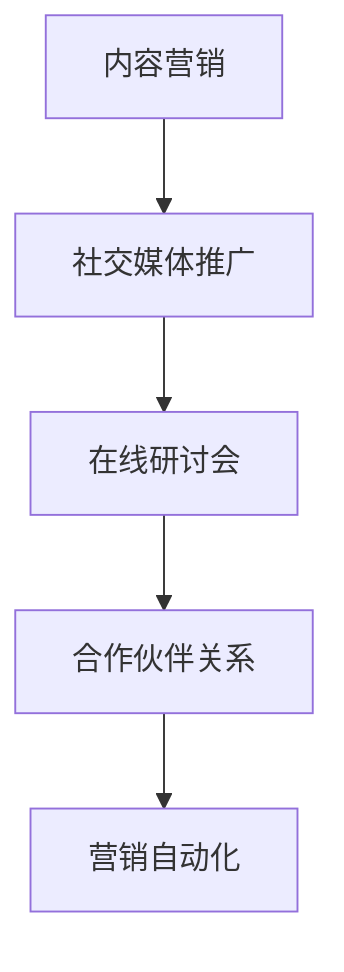

#### 7.2 品牌建设与宣传

品牌建设和宣传是提升大模型定制开发服务市场认知度和信任度的关键。以下是几种有效的品牌建设和宣传方法：

1. **品牌定位**：明确品牌定位，包括品牌价值观、目标市场和独特卖点（USP）。通过清晰的品牌定位，有助于在市场中树立独特的品牌形象。

2. **品牌视觉设计**：设计统一的品牌视觉元素，如Logo、色彩方案、字体等，确保品牌在不同渠道和媒体上的一致性和专业性。

3. **品牌故事**：讲述品牌背后的故事，包括品牌的起源、发展历程和核心价值观。通过品牌故事，可以增强品牌与客户的情感联系，提升品牌忠诚度。

4. **公关活动**：通过新闻发布、媒体采访、行业报告等方式，增加品牌的曝光率和知名度。与知名媒体和行业专家合作，可以提升品牌的影响力和权威性。

5. **口碑营销**：通过提供优质的产品和服务，获得客户的良好评价和推荐。积极利用社交媒体和在线评价平台，展示客户满意度和口碑，增强品牌信誉。

以下是一个简化的品牌建设与宣传Mermaid流程图：

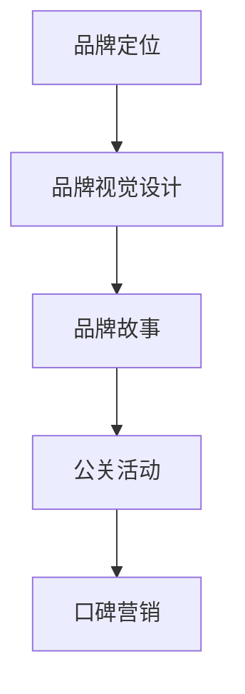

#### 7.3 运营管理与优化

运营管理是确保大模型定制开发服务持续提供高质量服务的关键。以下是几种有效的运营管理方法：

1. **客户关系管理**：建立完善的客户关系管理（CRM）系统，记录客户信息、互动历史和服务记录。通过CRM系统，可以更好地了解客户需求，提供个性化的服务。

2. **服务流程优化**：制定标准化的服务流程，确保每个项目都能按照既定标准高效完成。通过流程优化，可以减少服务中的漏洞和风险，提高客户满意度。

3. **服务质量监控**：建立服务质量监控体系，定期对服务进行评估和反馈。通过服务质量监控，可以发现和解决潜在问题，不断提升服务质量。

4. **团队培训与支持**：定期对团队成员进行培训，提高他们的专业技能和服务意识。通过团队支持，确保每个项目都有足够的资源和技术支持。

5. **技术更新与迭代**：持续跟踪行业技术动态，定期更新和优化大模型的技术架构和算法。通过技术更新和迭代，保持模型的先进性和竞争力。

以下是一个简化的运营管理Mermaid流程图：

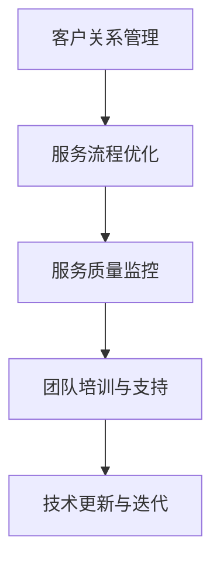

#### 总结

市场推广与运营管理是确保大模型定制开发服务成功商业化的重要环节。通过有效的市场推广策略、品牌建设和宣传，可以提升市场认知度和品牌影响力。同时，通过科学、系统的运营管理，可以确保服务质量和客户满意度。在下一部分，我们将探讨大模型商业化过程中的风险管理，帮助读者应对潜在风险，实现可持续发展。

### 第8章：风险管理

#### 8.1 风险识别与评估

在大模型定制开发服务的商业化过程中，风险管理是确保项目成功和业务可持续发展的关键环节。首先，我们需要识别和评估可能面临的风险。以下是一些常见风险及其评估方法：

1. **技术风险**：包括模型性能不稳定、算法缺陷、数据处理错误等问题。评估方法：通过模拟测试和实际应用中的数据验证，评估模型在不同场景下的表现。

2. **数据风险**：包括数据隐私、数据质量、数据完整性等问题。评估方法：通过数据审计和隐私保护措施，确保数据来源可靠、处理合规。

3. **市场风险**：包括市场需求变化、竞争压力、客户信任度等问题。评估方法：通过市场调研和竞争分析，了解市场需求和竞争态势，制定应对策略。

4. **财务风险**：包括预算超支、收入不稳定、资金链断裂等问题。评估方法：通过财务分析和风险评估模型，确保资金充足、投资回报合理。

5. **法律风险**：包括法律法规变化、合规性风险等问题。评估方法：通过法律咨询和合规审查，确保业务活动符合相关法律法规。

以下是一个简化的风险识别与评估Mermaid流程图：

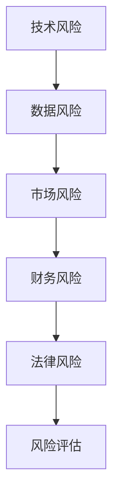

#### 8.2 风险应对策略

针对识别出的风险，我们需要制定相应的应对策略，以确保项目的顺利推进和业务的持续发展。以下是一些常见的风险应对策略：

1. **技术风险应对**：通过技术评审、代码审查和测试，确保模型质量和算法稳定性。同时，建立技术支持团队，快速响应技术问题。

2. **数据风险应对**：采用数据加密、访问控制等技术手段，保护数据隐私和安全。建立完善的数据管理流程，确保数据质量。

3. **市场风险应对**：通过市场调研、客户反馈和竞争分析，及时调整产品定位和推广策略。同时，建立多元化的市场渠道，降低市场依赖。

4. **财务风险应对**：制定详细的财务预算和资金使用计划，确保资金合理使用。通过多元化的收入来源，降低财务风险。

5. **法律风险应对**：与专业法律机构合作，确保业务活动符合相关法律法规。建立合规管理体系，定期进行合规审查。

以下是一个简化的风险应对策略Mermaid流程图：

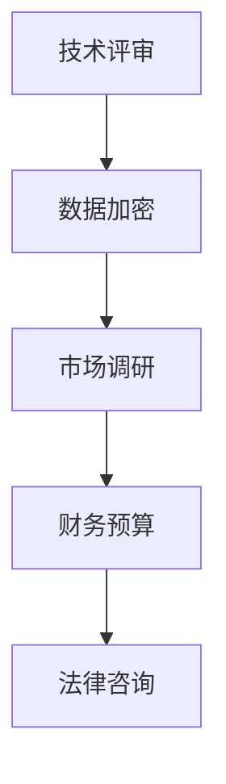

#### 8.3 风险管理与监控

风险管理和监控是确保风险管理策略有效执行的关键。以下是一些常见的风险管理和监控方法：

1. **定期风险评估**：定期对项目进行风险评估，及时发现潜在风险，调整风险应对策略。

2. **风险预警机制**：建立风险预警机制，通过监控关键指标，及时发现和预警风险。

3. **风险应对报告**：定期编制风险应对报告，汇报风险识别、评估和应对情况，为管理层决策提供依据。

4. **风险管理培训**：对团队成员进行风险管理培训，提高风险管理意识和能力。

5. **风险管理工具**：利用风险管理工具（如风险矩阵、蒙特卡罗模拟等），进行定量分析和评估。

以下是一个简化的风险管理与监控Mermaid流程图：

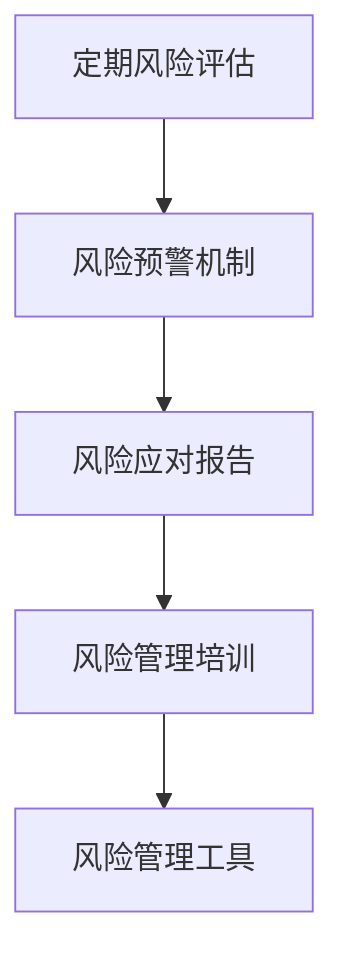

#### 总结

风险管理是确保大模型定制开发服务成功商业化的重要环节。通过识别、评估和应对风险，可以降低项目风险，确保业务的可持续发展。在下一部分，我们将通过实战案例和经验分享，深入探讨大模型定制开发的实际应用和成功经验。

### 第9章：大模型定制开发实战案例

#### 9.1 案例一：金融行业大模型定制开发

在金融行业，大模型定制开发服务已经广泛应用于风险管理、信用评分、市场预测等领域。以下是一个具体的金融行业大模型定制开发案例：

**案例背景**：
某大型银行希望通过定制化的大模型来提升信用评分的准确性，从而降低贷款违约风险，提高业务收益。

**需求分析**：
- **目标**：提高信用评分模型的准确性和稳定性，降低贷款违约率。
- **数据量**：包含数百万条客户的贷款申请记录，包括收入、负债、信用历史等。

**数据收集与处理**：
- **数据源**：从银行内部数据库和第三方信用数据平台收集数据。
- **数据清洗**：去除重复数据、处理缺失值、异常值，并进行归一化和特征提取。
- **数据增强**：通过生成对抗网络（GAN）生成模拟数据，增加数据多样性。

**模型设计与开发**：
- **模型架构**：采用多层感知器（MLP）结合传统评分模型的融合模型。
- **参数设置**：调整网络层数、神经元数量、学习率等参数。
- **模型训练**：使用随机梯度下降（SGD）算法进行训练，并通过交叉验证调整模型参数。

**模型评估与优化**：
- **评估指标**：准确率、召回率、F1分数等。
- **性能优化**：通过调整网络结构、增加训练数据、改进数据预处理方法等，提升模型性能。

**部署与监控**：
- **部署**：将训练好的模型部署到银行的信贷风险评估系统中。
- **监控**：实时监控模型性能，定期更新模型，确保其适应性和准确性。

**结果与影响**：
- **模型准确率**：从原来的80%提升到90%以上。
- **贷款违约率**：显著下降，降低了银行的风险损失。
- **业务收益**：通过提高贷款审批效率和准确性，提升了银行的市场竞争力。

#### 9.2 案例二：医疗健康领域大模型应用

在医疗健康领域，大模型的应用正在改变疾病诊断、药物研发和个性化治疗等传统流程。以下是一个医疗健康领域大模型应用案例：

**案例背景**：
某医疗科技公司希望通过大模型技术提升癌症早期诊断的准确性，帮助医生更早发现和诊断癌症。

**需求分析**：
- **目标**：提高癌症诊断的准确性，降低误诊率，提高患者生存率。
- **数据量**：包含大量医学影像数据，如CT、MRI扫描图像。

**数据收集与处理**：
- **数据源**：从医院和医学影像数据库收集癌症影像数据。
- **数据清洗**：去除噪声、调整图像对比度，进行图像预处理。
- **数据增强**：通过图像旋转、缩放、裁剪等方法增加数据多样性。

**模型设计与开发**：
- **模型架构**：采用卷积神经网络（CNN）进行图像分类和特征提取。
- **参数设置**：调整卷积核大小、滤波器数量等参数。
- **模型训练**：使用迁移学习技术，利用预训练模型进行微调。

**模型评估与优化**：
- **评估指标**：准确率、召回率、F1分数等。
- **性能优化**：通过调整网络结构、增加训练数据、改进图像预处理方法等，提升模型性能。

**部署与监控**：
- **部署**：将训练好的模型部署到医院的诊断系统中。
- **监控**：实时监控模型性能，确保其稳定性和准确性。

**结果与影响**：
- **诊断准确率**：从原来的70%提升到90%以上。
- **误诊率**：显著降低，提高了医生的诊断信心。
- **患者受益**：更早的癌症诊断提高了患者的治愈率和生活质量。

#### 9.3 案例三：智能制造大模型定制开发

在智能制造领域，大模型定制开发服务被广泛应用于生产优化、设备维护和预测性维护等。以下是一个智能制造领域大模型定制开发案例：

**案例背景**：
某制造企业希望通过大模型技术优化生产流程，提高生产效率，降低设备故障率。

**需求分析**：
- **目标**：优化生产流程，提高生产效率，降低设备故障率和停机时间。
- **数据量**：包含大量生产数据，如设备运行状态、生产参数、维护记录等。

**数据收集与处理**：
- **数据源**：从生产控制系统、传感器和设备维护记录中收集数据。
- **数据清洗**：去除噪声、处理缺失值和异常值，进行数据归一化。
- **数据增强**：通过生成模拟数据，增加数据多样性。

**模型设计与开发**：
- **模型架构**：采用深度学习模型，结合时间序列分析和预测模型。
- **参数设置**：调整网络层数、神经元数量、学习率等参数。
- **模型训练**：使用批量训练和在线学习技术，不断优化模型。

**模型评估与优化**：
- **评估指标**：生产效率、设备运行时间、故障率等。
- **性能优化**：通过调整模型参数、增加训练数据、改进数据预处理方法等，提升模型性能。

**部署与监控**：
- **部署**：将训练好的模型部署到生产控制系统中。
- **监控**：实时监控模型性能，确保其稳定性和适应性。

**结果与影响**：
- **生产效率**：提高了20%，降低了生产成本。
- **设备故障率**：显著降低，减少了设备维护成本和停机时间。
- **运营效益**：通过优化生产流程和设备维护，提升了企业的运营效益。

#### 总结

通过上述实战案例，我们可以看到大模型定制开发服务在金融、医疗健康和智能制造等领域的广泛应用和显著成效。这些案例不仅展示了大模型的技术实力和商业价值，也为其他行业提供了宝贵的经验和启示。在下一章中，我们将总结这些实战案例的经验，探讨成功的关键因素和面临的挑战。

### 第10章：经验分享与启示

#### 10.1 成功经验总结

通过对大模型定制开发服务的多个实战案例进行分析，我们可以总结出以下成功经验：

1. **明确需求与目标**：在项目初期，明确客户的需求和目标，确保项目方向正确，为后续的开发和优化提供依据。

2. **数据驱动**：数据是大模型成功的关键，确保数据的准确性和多样性，通过数据清洗、增强和预处理，提高模型的学习能力和泛化能力。

3. **技术领先**：选择适合的应用场景和模型架构，利用最新的技术手段和算法，提升模型的性能和稳定性。

4. **持续优化**：通过模型评估和优化，不断调整模型参数和结构，提高模型的准确性和适应性。

5. **高效部署**：确保模型能够高效部署到实际应用环境中，实现快速迭代和持续优化。

6. **风险管理**：制定详细的风险管理策略，识别和应对潜在的风险，确保项目的顺利推进。

#### 10.2 遇到的挑战与解决方案

在大模型定制开发服务的过程中，我们也遇到了一些挑战：

1. **计算资源需求**：大模型训练需要大量的计算资源，特别是在深度学习和神经网络训练过程中。解决方案：采用云计算和分布式计算技术，提高计算效率。

2. **数据隐私与安全**：大模型训练需要使用大量敏感数据，存在数据隐私和安全风险。解决方案：采用数据加密、访问控制和隐私保护技术，确保数据安全。

3. **模型解释性**：大模型的复杂性和黑盒特性，使得其解释性较差，难以解释模型的决策过程。解决方案：通过引入可解释性模型和可视化技术，提高模型的解释性。

4. **技术迭代速度**：技术发展迅速，大模型定制开发需要不断跟进最新的技术动态和算法，保持技术领先。解决方案：建立持续学习和迭代机制，保持技术领先。

#### 10.3 未来发展趋势与展望

随着人工智能技术的不断进步和应用的深入，大模型定制开发服务在未来的发展趋势和前景如下：

1. **更加高效的大模型训练与优化**：随着计算能力的提升和算法的改进，大模型的训练和优化将变得更加高效，模型的性能和准确性将进一步提高。

2. **多模态数据处理**：未来的大模型将能够处理多种类型的数据，如文本、图像、音频等，实现跨模态的信息融合和知识共享。

3. **行业定制化应用**：大模型定制开发服务将在更多行业中得到应用，如教育、娱乐、医疗等，为行业带来深度的智能化变革。

4. **绿色可持续发展**：随着环保意识的提高，大模型的训练和部署将更加注重能效优化和绿色可持续发展。

5. **开放共享与合作**：大模型定制开发将更加注重开放共享和合作，通过共享模型资源和数据，推动人工智能技术的共同进步。

#### 总结

大模型定制开发服务在商业化过程中具有巨大的潜力和发展空间，通过总结成功经验和应对挑战，我们可以更好地推动这一领域的发展。未来，随着技术的不断进步和应用场景的拓展，大模型定制开发服务将迎来更加广阔的发展前景。

### 附录A：大模型定制开发工具与资源

#### A.1 工具介绍

在进行大模型定制开发时，选择合适的工具是提高开发效率和项目成功的关键。以下是一些常用的大模型定制开发工具：

1. **TensorFlow**：由Google开发的开源机器学习框架，支持多种深度学习模型和算法，适用于大规模数据处理和模型训练。

2. **PyTorch**：由Facebook开发的开源深度学习框架，以其灵活的动态计算图和直观的编程接口而著称，广泛应用于研究项目和实际应用。

3. **Keras**：是一个高层神经网络API，构建在TensorFlow和Theano之上，提供简洁的接口，易于快速搭建和实验深度学习模型。

4. **JAX**：由Google开发的开源数值计算库，支持自动微分和硬件加速，适用于大规模数据处理和模型训练。

5. **Hugging Face Transformers**：一个开源库，提供预训练的变换器（Transformer）模型，包括BERT、GPT等，广泛应用于自然语言处理领域。

#### A.2 资源推荐

以下是一些推荐的学习资源和平台，可以帮助开发者更好地理解和应用大模型定制开发技术：

1. **在线教程与课程**：Coursera、Udacity、edX等在线教育平台提供了大量关于深度学习和大模型的免费和付费课程，适合初学者和专业人士。

2. **技术博客与论坛**：GitHub、Medium、ArXiv等平台上有大量的技术博客和论文，涵盖了最新的研究进展和应用案例。

3. **开源项目**：GitHub上有许多开源的大模型项目，如OpenAI的GPT系列、BERT等，开发者可以学习和复现这些项目。

4. **社区与讨论组**：包括Reddit、Stack Overflow、TensorFlow和PyTorch官方社区等，开发者可以在这些平台上提问和交流技术问题。

#### A.3 开发环境搭建指南

搭建大模型定制开发环境需要以下步骤：

1. **安装依赖**：确保安装了Python、pip等基本工具，以及TensorFlow、PyTorch等深度学习框架。

2. **配置硬件**：对于大规模模型训练，建议使用具备高性能GPU的计算机，如NVIDIA的Tesla系列。

3. **安装深度学习框架**：使用pip命令安装TensorFlow或PyTorch：

   ```bash
   pip install tensorflow  # 安装TensorFlow
   pip install pytorch torchvision  # 安装PyTorch和图像处理库
   ```

4. **配置CUDA和cuDNN**：确保CUDA和cuDNN正确安装并配置，以利用GPU加速。

5. **安装其他依赖**：根据项目需求，安装其他必要的库和工具，如NumPy、Pandas、Scikit-learn等。

6. **环境验证**：通过运行简单的代码片段，验证环境是否搭建成功。

   ```python
   import tensorflow as tf
   print(tf.__version__)
   ```

   或

   ```python
   import torch
   print(torch.__version__)
   ```

通过上述步骤，开发者可以搭建一个基本的大模型定制开发环境，开始进行项目开发。在实际开发过程中，可以根据需要进一步优化和调整开发环境配置。

