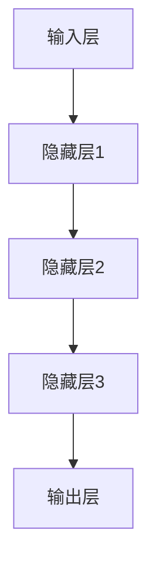
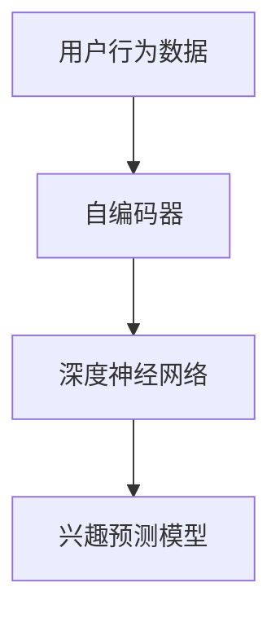
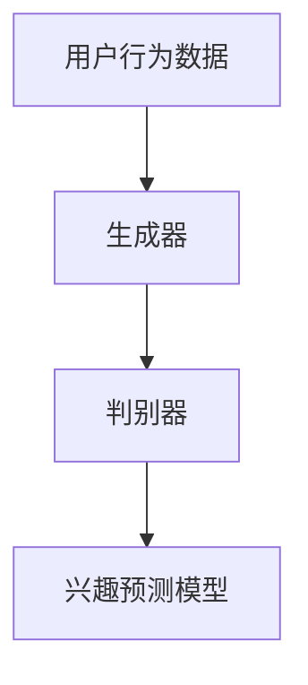
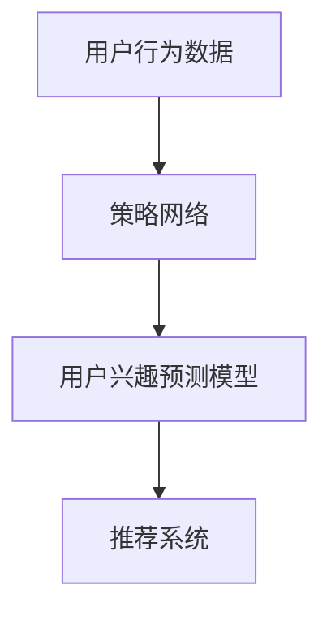

                 

## 文章标题

### 《大模型技术在电商平台用户兴趣迁移预测与应用中的创新》

> 关键词：大模型技术、用户兴趣迁移预测、电商平台、人工智能、机器学习、深度学习、特征工程、模型设计、数据预处理

> 摘要：本文深入探讨了大模型技术在电商平台用户兴趣迁移预测中的应用，通过系统地分析大模型技术的基本概念、用户兴趣迁移预测的原理、主流大模型的应用，以及面临的技术挑战和未来发展趋势，展示了大模型技术在电商平台用户兴趣迁移预测中的创新应用和实践案例。本文旨在为从事电商平台用户兴趣预测的研究人员和开发者提供有价值的参考，助力智能化电商服务的提升。

### 目录大纲

#### 第一部分：大模型技术在电商平台用户兴趣迁移预测中的应用基础

- **第1章：大模型技术在电商平台用户兴趣迁移预测中的概述**
  - 1.1 大模型技术在电商平台用户兴趣预测中的重要性
  - 1.1.1 大模型技术的基本概念
  - 1.1.2 电商平台用户兴趣迁移预测的核心问题
  - 1.1.3 大模型技术在用户兴趣预测中的优势
  - 1.2 电商平台用户兴趣迁移预测的基本原理
  - 1.2.1 用户兴趣的概念与分类
  - 1.2.2 用户兴趣迁移预测的原理与流程
  - 1.2.3 大模型在用户兴趣迁移预测中的关键角色
  - 1.3 主流大模型技术在用户兴趣迁移预测中的应用
  - 1.3.1 GPT系列模型的应用
  - 1.3.2 BERT及其变体模型的应用
  - 1.3.3 其他知名大模型在用户兴趣预测中的应用
  - 1.4 大模型技术在用户兴趣迁移预测中的挑战与展望
  - 1.4.1 大模型技术在用户兴趣迁移预测中的挑战
  - 1.4.2 大模型技术的未来发展趋势
  - 1.4.3 大模型技术在电商平台用户兴趣迁移预测中的应用前景

- **第2章：大模型技术在电商平台用户兴趣迁移预测中的数据预处理与特征工程**
  - 2.1 数据预处理方法
  - 2.1.1 数据清洗与去重
  - 2.1.2 数据标准化与归一化
  - 2.1.3 数据缺失值处理方法
  - 2.2 用户行为数据特征工程
  - 2.2.1 用户行为数据的来源
  - 2.2.2 用户行为数据的特征提取
  - 2.2.3 特征选择方法与优化
  - 2.3 商品数据特征工程
  - 2.3.1 商品数据的来源
  - 2.3.2 商品数据的特征提取
  - 2.3.3 商品数据特征融合方法

- **第3章：大模型技术在电商平台用户兴趣迁移预测中的模型设计与实现**
  - 3.1 用户兴趣迁移预测模型设计
  - 3.1.1 模型总体架构设计
  - 3.1.2 模型输入层设计
  - 3.1.3 模型隐藏层设计
  - 3.1.4 模型输出层设计
  - 3.2 模型训练方法与策略
  - 3.2.1 模型训练数据集划分
  - 3.2.2 模型训练过程
  - 3.2.3 模型训练策略与调优
  - 3.3 模型评估与优化
  - 3.3.1 模型评估指标
  - 3.3.2 模型优化方法
  - 3.3.3 模型在线评估与更新

- **第4章：大模型技术在电商平台用户兴趣迁移预测中的案例与应用**
  - 4.1 案例一：某电商平台的用户兴趣迁移预测应用
  - 4.1.1 案例背景
  - 4.1.2 模型设计与实现
  - 4.1.3 应用效果评估
  - 4.2 案例二：另一电商平台的用户兴趣迁移预测应用
  - 4.2.1 案例背景
  - 4.2.2 模型设计与实现
  - 4.2.3 应用效果评估

#### 第二部分：大模型技术在电商平台用户兴趣迁移预测中的应用实践

- **第5章：大模型技术在电商平台用户兴趣迁移预测中的创新应用**
  - 5.1 新的大模型技术探索
  - 5.1.1 类脑计算与大模型融合
  - 5.1.2 生成对抗网络（GAN）在用户兴趣迁移预测中的应用
  - 5.1.3 强化学习在大模型中的应用
  - 5.2 大模型技术在其他领域的拓展应用
  - 5.2.1 社交媒体用户兴趣分析
  - 5.2.2 娱乐内容个性化推荐
  - 5.2.3 教育领域个性化教学

- **第6章：大模型技术在电商平台用户兴趣迁移预测中的未来趋势**
  - 6.1 大模型技术的演进趋势
  - 6.1.1 大模型规模的增长趋势
  - 6.1.2 大模型计算能力的提升
  - 6.1.3 大模型应用场景的拓展
  - 6.2 大模型技术在电商平台用户兴趣迁移预测中的未来应用前景
  - 6.2.1 智能化推荐系统的优化
  - 6.2.2 实时用户行为分析
  - 6.2.3 用户个性化服务与体验提升

#### 第三部分：大模型技术在电商平台用户兴趣迁移预测中的创新与未来趋势

- **第7章：大模型技术在电商平台用户兴趣迁移预测中的挑战与应对策略**
  - 7.1 大模型技术面临的挑战
  - 7.1.1 数据隐私与安全性
  - 7.1.2 大模型计算资源需求
  - 7.1.3 模型解释性与透明度
  - 7.2 应对策略与建议
  - 7.2.1 数据隐私保护技术
  - 7.2.2 模型压缩与加速技术
  - 7.2.3 模型解释性与可解释性增强

---

### 前言

随着电子商务的迅猛发展，用户对电商平台的服务质量和个性化体验需求日益提升。如何准确预测用户的兴趣迁移，提高推荐系统的效果，成为电商平台竞争的关键因素之一。大模型技术，作为人工智能领域的前沿技术，其在电商平台用户兴趣迁移预测中的应用具有广泛的应用前景。

本文将从以下几个方面展开讨论：

1. **大模型技术在电商平台用户兴趣迁移预测中的应用基础**：介绍大模型技术的基本概念、用户兴趣迁移预测的原理、主流大模型技术的应用，以及面临的挑战和未来发展趋势。
2. **大模型技术在电商平台用户兴趣迁移预测中的数据预处理与特征工程**：详细探讨数据预处理方法和特征工程，为模型训练提供高质量的输入数据。
3. **大模型技术在电商平台用户兴趣迁移预测中的模型设计与实现**：介绍用户兴趣迁移预测模型的设计、训练策略、评估方法，以及在实际应用中的效果。
4. **大模型技术在电商平台用户兴趣迁移预测中的案例与应用**：通过具体案例展示大模型技术在电商平台用户兴趣迁移预测中的应用效果。
5. **大模型技术在电商平台用户兴趣迁移预测中的创新应用与未来趋势**：探讨大模型技术在其他领域的拓展应用，以及未来的发展趋势。

本文旨在为从事电商平台用户兴趣预测的研究人员和开发者提供有价值的参考，助力智能化电商服务的提升。同时，本文也将对大模型技术在人工智能领域的应用和发展提供一定的理论支持和实践指导。

### 第一部分：大模型技术在电商平台用户兴趣迁移预测中的应用基础

#### 第1章：大模型技术在电商平台用户兴趣迁移预测中的概述

#### 1.1 大模型技术在电商平台用户兴趣预测中的重要性

在电子商务时代，用户兴趣预测成为了电商平台提升用户满意度、增加用户粘性和促进销售的关键技术。随着用户数据的不断积累和多样化，传统的简单推荐算法已经难以满足用户个性化需求的精准度。因此，引入先进的大模型技术，特别是深度学习领域的大模型，成为提升用户兴趣预测能力的重要途径。

**1.1.1 大模型技术的基本概念**

大模型技术是指利用深度学习神经网络构建的、具有大规模参数和超大规模训练数据的大型模型。这些模型通常具有强大的表示能力和灵活的建模能力，能够处理复杂数据和非线性关系。代表性的大模型包括GPT系列、BERT及其变体、Transformers等。

**1.1.2 电商平台用户兴趣迁移预测的核心问题**

用户兴趣迁移预测是指根据用户的历史行为和兴趣，预测用户未来可能感兴趣的内容或商品。在电商平台中，这一核心问题包括：

- **用户行为理解**：从用户的行为数据中提取有效的特征，理解用户的兴趣和偏好。
- **兴趣迁移预测**：基于用户历史行为，预测用户未来可能的兴趣点。
- **推荐系统优化**：利用预测结果优化推荐系统的算法，提高推荐的质量和个性化程度。

**1.1.3 大模型技术在用户兴趣预测中的优势**

大模型技术具有以下几方面的优势，使其在用户兴趣预测中表现出独特的优势：

- **强大的特征提取能力**：大模型能够自动从原始数据中提取高层次的、有代表性的特征，降低了对人工特征工程的需求。
- **非线性建模能力**：大模型可以通过多层神经网络构建复杂的非线性模型，捕捉用户行为中的非线性关系。
- **全局优化能力**：大模型能够在大规模数据集上进行全局优化，提高预测的准确性和鲁棒性。
- **跨域迁移能力**：大模型可以通过迁移学习，将一个领域中的知识迁移到另一个领域，提高模型的泛化能力。

#### 1.2 电商平台用户兴趣迁移预测的基本原理

**1.2.1 用户兴趣的概念与分类**

用户兴趣是指用户对特定内容或事物的偏好和倾向。根据兴趣的来源和表现形式，可以将用户兴趣分为以下几类：

- **显式兴趣**：用户通过直接行为（如点击、购买、评论等）表现出来的兴趣。
- **隐式兴趣**：用户通过间接行为（如浏览时间、搜索历史、页面跳转等）表现出来的兴趣。
- **标签兴趣**：用户通过自我标签或社区标签表现出来的兴趣。

**1.2.2 用户兴趣迁移预测的原理与流程**

用户兴趣迁移预测的原理基于用户行为数据的挖掘和建模，通过以下步骤实现：

1. **数据收集与预处理**：收集用户行为数据，并进行数据清洗、去噪、补全等预处理操作，确保数据的质量和一致性。
2. **特征提取**：从用户行为数据中提取有效的特征，包括显式特征和隐式特征，如用户点击率、购买率、浏览时长、页面跳转等。
3. **兴趣建模**：利用深度学习模型，如GPT、BERT等，对用户行为数据进行建模，提取用户兴趣的潜在表示。
4. **兴趣迁移预测**：基于用户历史兴趣和潜在表示，预测用户未来可能感兴趣的内容或商品。
5. **推荐系统优化**：利用兴趣迁移预测结果，优化推荐系统的算法，提高推荐效果。

**1.2.3 大模型在用户兴趣迁移预测中的关键角色**

大模型在用户兴趣迁移预测中扮演了核心角色，其关键作用体现在以下几个方面：

- **特征提取**：大模型能够自动从原始数据中提取高层次的、有代表性的特征，为兴趣建模提供高质量的输入数据。
- **兴趣建模**：大模型可以通过多层神经网络构建复杂的非线性模型，捕捉用户行为中的非线性关系，提高兴趣预测的准确性和鲁棒性。
- **推荐优化**：大模型能够生成个性化的推荐列表，提高推荐系统的效果，增强用户体验。

#### 1.3 主流大模型技术在用户兴趣迁移预测中的应用

**1.3.1 GPT系列模型的应用**

GPT（Generative Pre-trained Transformer）系列模型是OpenAI提出的一类预训练语言模型，包括GPT、GPT-2、GPT-3等。GPT系列模型在用户兴趣迁移预测中的应用主要表现在：

- **预训练**：通过在大规模语料库上进行预训练，GPT系列模型可以自动学习到丰富的语言知识，为兴趣提取提供高质量的向量表示。
- **微调**：在特定任务上对GPT系列模型进行微调，使其能够针对特定用户兴趣进行迁移预测。
- **生成推荐**：利用GPT系列模型的生成能力，为用户生成个性化的推荐内容，提高推荐效果。

**1.3.2 BERT及其变体模型的应用**

BERT（Bidirectional Encoder Representations from Transformers）是Google提出的一种双向Transformer模型，其在用户兴趣迁移预测中的应用主要包括：

- **双向编码**：BERT模型通过双向编码，可以同时考虑文本的前后关系，为用户兴趣提取提供更丰富的上下文信息。
- **上下文理解**：BERT模型能够捕捉到用户行为数据中的上下文关系，提高兴趣预测的准确性和鲁棒性。
- **预训练与微调**：BERT模型在预训练阶段可以学习到丰富的语言知识，在特定任务上通过微调，提高用户兴趣迁移预测的性能。

**1.3.3 其他知名大模型在用户兴趣预测中的应用**

除了GPT系列和BERT模型，还有许多其他知名大模型在用户兴趣迁移预测中得到了应用，如：

- **Transformers**：由Google提出的Transformers模型，具有灵活的架构和强大的表示能力，适用于处理复杂的用户兴趣迁移预测任务。
- **XLNet**：由百度提出的XLNet模型，通过自我注意力机制和动态掩码策略，提高了模型的训练效率和性能。
- **T5**：由Google提出的T5（Text-to-Text Transfer Transformer），具有统一的文本处理框架，适用于多种NLP任务。

这些大模型在用户兴趣迁移预测中的应用，不仅提高了兴趣预测的准确性和效率，也为电商平台提供了更加智能化的推荐服务。

#### 1.4 大模型技术在用户兴趣迁移预测中的挑战与展望

**1.4.1 大模型技术在用户兴趣迁移预测中的挑战**

尽管大模型技术在用户兴趣迁移预测中具有显著的优势，但其应用也面临一些挑战：

- **数据隐私与安全**：大模型训练和预测过程中需要大量用户数据，如何保护用户隐私和数据安全成为一个重要问题。
- **计算资源需求**：大模型通常需要大量的计算资源和时间进行训练，如何在有限的资源下提高模型性能成为关键问题。
- **模型解释性**：大模型具有强大的建模能力，但其内部决策过程往往难以解释，如何提高模型的透明度和可解释性成为挑战。
- **模型泛化能力**：大模型在特定任务上表现出色，但其泛化能力仍需提高，以适应不同电商平台和用户场景。

**1.4.2 大模型技术的未来发展趋势**

随着人工智能技术的不断进步，大模型技术在用户兴趣迁移预测中具有广阔的发展前景：

- **计算能力的提升**：随着硬件技术的进步，计算能力将得到大幅提升，为大模型训练和应用提供更好的硬件支持。
- **数据隐私保护技术**：随着隐私保护技术的不断发展，如何在大模型训练和应用过程中保护用户隐私将成为重要研究方向。
- **模型解释性与可解释性**：通过引入可解释性模型和可视化技术，提高大模型的可解释性，使其在商业应用中更具透明度和可信度。
- **多模态数据处理**：结合文本、图像、语音等多模态数据，提高用户兴趣迁移预测的准确性和全面性。

**1.4.3 大模型技术在电商平台用户兴趣迁移预测中的应用前景**

在未来，大模型技术在电商平台用户兴趣迁移预测中的应用前景将十分广阔：

- **个性化推荐**：通过精准的兴趣迁移预测，电商平台可以提供更加个性化的推荐服务，提升用户体验和满意度。
- **智能客服**：利用大模型技术，智能客服系统可以更好地理解用户需求，提供更准确的答复和解决方案。
- **广告投放优化**：基于用户兴趣迁移预测，电商平台可以更精准地投放广告，提高广告效果和转化率。
- **市场营销策略**：通过分析用户兴趣迁移趋势，电商平台可以制定更加科学的市场营销策略，提高销售业绩。

总之，大模型技术在电商平台用户兴趣迁移预测中的应用，不仅将推动电商平台服务质量的提升，也为人工智能技术在电子商务领域的发展提供了新的机遇和挑战。

### 1.3 主流大模型技术在用户兴趣迁移预测中的应用

在电商平台用户兴趣迁移预测中，主流的大模型技术包括GPT系列模型、BERT及其变体、以及其他的知名大模型。这些模型通过其独特的架构和强大的学习能力，在用户兴趣预测领域展现出了显著的效果。

#### 1.3.1 GPT系列模型的应用

GPT（Generative Pre-trained Transformer）系列模型由OpenAI提出，是预训练语言模型的代表性工作。GPT模型基于Transformer架构，通过在大型语料库上进行预训练，学习到了丰富的语言知识和语义表示。在用户兴趣迁移预测中，GPT系列模型具有以下应用特点：

1. **预训练与微调**：GPT模型在预训练阶段通过大量的文本数据学习到语言的基本规律和语义表示，然后在特定任务上进行微调，从而提升用户兴趣预测的准确性。

2. **生成推荐**：GPT模型具有强大的生成能力，可以基于用户历史行为生成个性化的推荐列表。例如，GPT-3模型能够生成详细的商品描述和推荐理由，提高推荐系统的互动性和用户体验。

3. **跨领域迁移**：GPT模型通过预训练积累了大量的通用知识，可以在不同领域之间实现知识迁移，提高用户兴趣迁移预测的泛化能力。

**伪代码示例**：

```python
# 预训练GPT模型
model = GPT(pretrained="gpt2")

# 微调GPT模型进行用户兴趣预测
inputs = tokenizer.encode(user_history, return_tensors="pt")
outputs = model(inputs)
predictions = outputs.logits[:, -1, :]

# 生成个性化推荐
top_items = tokenizer.decode(predictions.argmax(-1), skip_special_tokens=True)
```

#### 1.3.2 BERT及其变体模型的应用

BERT（Bidirectional Encoder Representations from Transformers）是由Google提出的一种双向Transformer模型，通过同时考虑文本的前后关系，捕捉到了丰富的上下文信息。BERT及其变体模型在用户兴趣迁移预测中应用广泛，其主要特点如下：

1. **双向编码**：BERT模型通过双向编码，使得模型能够同时理解文本的前后关系，从而提高用户兴趣预测的准确性和鲁棒性。

2. **上下文理解**：BERT模型通过预训练，学习到了大量语言知识和语义信息，能够更好地理解用户行为数据中的上下文关系，提高兴趣预测的精度。

3. **预训练与微调**：BERT模型在大规模语料库上进行预训练，然后针对特定任务进行微调，以提高用户兴趣迁移预测的性能。

**伪代码示例**：

```python
# 加载预训练BERT模型
model = BERT.from_pretrained("bert-base-chinese")

# 进行用户兴趣预测
inputs = tokenizer.encode(user_history, add_special_tokens=True, return_tensors="pt")
outputs = model(inputs)
predictions = outputs.logits[:, -1, :]

# 获取预测结果
predicted_interests = tokenizer.decode(predictions.argmax(-1), skip_special_tokens=True)
```

#### 1.3.3 其他知名大模型在用户兴趣预测中的应用

除了GPT系列和BERT模型，还有许多其他知名的大模型在用户兴趣迁移预测中得到了应用，如Transformers、XLNet、T5等。以下是对这些模型的简要介绍：

1. **Transformers**：由Google提出，与BERT类似，Transformers模型也采用双向编码机制，但具有更灵活的架构，可以处理不同长度和类型的输入数据。

2. **XLNet**：由百度提出，通过自我注意力机制和动态掩码策略，提高了模型的训练效率和性能。

3. **T5**：由Google提出，T5模型具有统一的文本处理框架，可以将自然语言处理任务转换为标准的机器学习任务，从而简化模型设计和训练过程。

这些大模型在用户兴趣迁移预测中的应用，不仅提高了兴趣预测的准确性和效率，也为电商平台提供了更加智能化的推荐服务。

**总结**：

主流大模型技术在用户兴趣迁移预测中的应用，为电商平台提供了强大的工具和方法。通过预训练和微调，这些模型能够自动从大规模数据中提取有效的特征，构建复杂的非线性模型，实现精准的兴趣迁移预测。未来，随着大模型技术的不断发展和优化，其在电商平台用户兴趣预测中的应用前景将更加广阔。

### 1.4 大模型技术在用户兴趣迁移预测中的挑战与展望

#### 1.4.1 大模型技术在用户兴趣迁移预测中的挑战

尽管大模型技术在用户兴趣迁移预测中展现了巨大的潜力，但其应用也面临一系列挑战：

**1. 数据隐私与安全**

大模型在用户兴趣迁移预测中需要大量用户行为数据，这些数据往往包含敏感的个人信息。如何在保证数据隐私和安全的前提下，有效利用这些数据进行模型训练和预测，成为关键问题。为此，研究者需要开发更加完善的数据隐私保护技术，如差分隐私、联邦学习等，以确保用户数据的安全性和隐私性。

**2. 计算资源需求**

大模型通常具有数百万到数十亿个参数，训练过程需要大量的计算资源和时间。在电商平台上，如何高效利用有限的计算资源，加速模型训练和预测，是一个亟待解决的问题。为了应对这一挑战，研究人员可以探索模型压缩技术、分布式训练方法等，以降低计算资源需求。

**3. 模型解释性**

大模型通过复杂的神经网络结构进行决策，其内部过程往往难以解释。这对模型的可解释性和透明度提出了挑战。为了提高模型的可解释性，研究者可以引入可视化技术、可解释性模型等，帮助用户理解模型的决策过程。

**4. 模型泛化能力**

大模型在特定任务上表现出色，但其泛化能力仍需提高。特别是在用户兴趣迁移预测中，不同用户群体和不同场景之间的差异较大，如何使模型具有更好的泛化能力，是未来研究的一个重要方向。

#### 1.4.2 大模型技术的未来发展趋势

随着人工智能技术的不断进步，大模型技术在用户兴趣迁移预测中有着广阔的发展前景：

**1. 计算能力的提升**

随着硬件技术的发展，特别是GPU和TPU等专用硬件的普及，大模型的计算能力将得到大幅提升。这将有助于提高模型训练和预测的效率，为电商平台提供更加智能化的推荐服务。

**2. 数据隐私保护技术的进步**

数据隐私保护技术，如差分隐私、联邦学习等，将在大模型训练和应用中发挥越来越重要的作用。通过这些技术，可以在保护用户隐私的前提下，有效利用大规模数据进行模型训练和预测。

**3. 模型解释性与可解释性的增强**

提高模型的可解释性和透明度，使其在商业应用中更具透明度和可信度，是未来研究的一个重要方向。通过引入可视化技术、可解释性模型等，将有助于用户理解模型的决策过程。

**4. 多模态数据处理的结合**

随着用户行为数据的多样化，结合文本、图像、语音等多模态数据，将有助于提高用户兴趣迁移预测的准确性和全面性。未来的研究可以探索如何有效地融合多模态数据，构建更加智能化的推荐系统。

#### 1.4.3 大模型技术在电商平台用户兴趣迁移预测中的应用前景

在未来，大模型技术在电商平台用户兴趣迁移预测中的应用前景将十分广阔：

**1. 个性化推荐系统的优化**

通过精准的兴趣迁移预测，电商平台可以提供更加个性化的推荐服务，提升用户体验和满意度。这将有助于提高用户粘性和转化率，增强电商平台的竞争力。

**2. 智能客服的升级**

利用大模型技术，智能客服系统可以更好地理解用户需求，提供更准确的答复和解决方案。通过语音识别、自然语言处理等技术，智能客服可以与用户进行更加自然的交互，提高客户服务体验。

**3. 广告投放的优化**

基于用户兴趣迁移预测，电商平台可以更精准地投放广告，提高广告效果和转化率。通过分析用户兴趣变化趋势，电商平台可以实时调整广告策略，实现精准营销。

**4. 市场营销策略的优化**

通过分析用户兴趣迁移预测结果，电商平台可以制定更加科学的市场营销策略，提高销售业绩。例如，根据用户兴趣变化，电商平台可以及时调整商品库存和促销策略，满足用户需求。

总之，大模型技术在电商平台用户兴趣迁移预测中的应用，不仅将推动电商平台服务质量的提升，也为人工智能技术在电子商务领域的发展提供了新的机遇和挑战。未来，随着技术的不断进步，大模型技术在电商平台用户兴趣迁移预测中的应用将更加深入和广泛。

### 第二部分：大模型技术在电商平台用户兴趣迁移预测中的数据预处理与特征工程

#### 第2章：大模型技术在电商平台用户兴趣迁移预测中的数据预处理与特征工程

在电商平台用户兴趣迁移预测中，数据预处理和特征工程是至关重要的步骤。这些步骤不仅决定了模型训练的质量，还直接影响最终预测结果的准确性。本章节将详细介绍数据预处理方法和特征工程的核心内容，为后续的模型设计与实现奠定基础。

#### 2.1 数据预处理方法

数据预处理是数据分析和机器学习项目中的基础环节，其目的是将原始数据转化为适合建模的数据。以下是几种常见的数据预处理方法：

**2.1.1 数据清洗与去重**

数据清洗是指从原始数据中删除噪声和错误数据，确保数据的质量和一致性。去重是指识别并删除重复的数据记录，以防止模型训练过程中的重复计算。

**2.1.2 数据标准化与归一化**

数据标准化和归一化是将不同特征的数据进行转换，使其具有相似的尺度和范围，从而避免某些特征对模型产生过大的影响。数据标准化通常通过减去均值并除以标准差实现，而数据归一化则通过将数据缩放到[0,1]或[-1,1]的区间实现。

**2.1.3 数据缺失值处理方法**

数据缺失值的处理方法有多种，包括删除缺失值、填充缺失值和插值等。对于少量缺失值，可以简单地删除对应记录；对于大量缺失值，可以采用均值、中位数或模式填充；对于时间序列数据，可以使用插值方法如线性插值或高斯过程插值。

#### 2.2 用户行为数据特征工程

用户行为数据是用户在电商平台上产生的各种操作记录，包括点击、购买、浏览、搜索等。有效的特征工程可以从这些数据中提取有价值的特征，提高模型预测的准确性。

**2.2.1 用户行为数据的来源**

用户行为数据的来源包括用户操作日志、用户交互数据、用户反馈数据等。例如，用户在电商平台上的点击数据、购买数据、浏览数据、搜索数据等。

**2.2.2 用户行为数据的特征提取**

用户行为数据的特征提取是指从原始数据中提取能够反映用户兴趣和行为的特征。常见的特征提取方法包括：

- **频率特征**：如点击频率、购买频率、浏览频率等。
- **时效特征**：如用户在特定时间段内的活动情况。
- **序列特征**：如用户浏览或点击的序列模式。
- **上下文特征**：如用户当前所在页面、商品类别、商品属性等。

**2.2.3 特征选择方法与优化**

特征选择是指在大量特征中挑选出对模型预测有重要影响的特征，以减少模型复杂度和过拟合的风险。常见的特征选择方法包括：

- **基于信息增益的特征选择**：选择对分类目标具有最大信息量的特征。
- **基于模型评价的特征选择**：通过评估模型在不同特征集上的性能，选择性能最好的特征集。
- **基于正则化的特征选择**：利用L1或L2正则化，自动筛选出对模型影响较小的特征。

#### 2.3 商品数据特征工程

商品数据是电商平台的核心数据之一，其特征工程对于用户兴趣迁移预测至关重要。

**2.3.1 商品数据的来源**

商品数据的来源包括电商平台上的商品描述、商品分类、商品标签等。这些数据通常来自于商品数据库、商品评论、商品搜索日志等。

**2.3.2 商品数据的特征提取**

商品数据的特征提取方法包括：

- **基于文本的特征提取**：如TF-IDF、Word2Vec、BERT等，将商品描述转换为向量表示。
- **基于数值的特征提取**：如商品价格、评分、销量等，可以直接作为特征输入模型。
- **基于图的特征提取**：如商品类别层次结构、商品关系网络等，通过图神经网络提取商品间的关联特征。

**2.3.3 商品数据特征融合方法**

商品数据特征融合是指将不同来源和类型的商品特征进行整合，以提高模型预测的准确性。常见的特征融合方法包括：

- **特征拼接**：将不同类型的特征拼接在一起，形成一个更长的特征向量。
- **加权融合**：根据特征的重要程度对特征进行加权，然后求和得到最终的特征向量。
- **神经网络融合**：利用神经网络模型，如多层感知机（MLP）、卷积神经网络（CNN）等，对特征进行层次化的融合。

#### 2.4 数据预处理与特征工程的综合应用

数据预处理与特征工程的综合应用是确保用户兴趣迁移预测模型质量的关键。以下是一个简单的综合应用流程：

1. **数据收集**：从电商平台收集用户行为数据和商品数据。
2. **数据清洗**：去除重复数据、噪声数据和错误数据。
3. **特征提取**：提取用户行为数据、商品数据的特征。
4. **特征选择**：选择对模型预测有重要影响的特征。
5. **特征融合**：将不同来源和类型的特征进行融合。
6. **数据标准化**：对特征进行标准化处理，确保特征具有相似的尺度。
7. **数据划分**：将数据划分为训练集、验证集和测试集，用于模型训练和评估。

通过上述流程，可以有效提高用户兴趣迁移预测模型的准确性和鲁棒性，为电商平台提供更加智能化的推荐服务。在接下来的章节中，我们将进一步探讨用户兴趣迁移预测模型的详细设计、训练策略和评估方法。

### 2.2 用户行为数据特征工程

用户行为数据是电商平台进行用户兴趣迁移预测的重要数据来源。这些数据反映了用户在平台上的各种操作，如点击、购买、浏览、搜索等。通过有效的特征工程，可以从这些原始数据中提取出有价值的特征，从而提高模型预测的准确性和鲁棒性。

#### 2.2.1 用户行为数据的来源

用户行为数据主要来源于以下几个方面：

1. **用户点击数据**：用户在平台上的点击行为，包括点击商品、点击广告、点击推荐列表等。这些数据通常记录了用户的点击次数、点击时间、点击位置等信息。
2. **购买数据**：用户在平台上的购买行为，包括购买的商品种类、购买时间、购买频率、购买金额等。这些数据可以反映用户的消费习惯和偏好。
3. **浏览数据**：用户在平台上的浏览行为，包括浏览的商品种类、浏览时长、浏览路径等。这些数据可以帮助了解用户对商品的兴趣程度。
4. **搜索数据**：用户在平台上的搜索行为，包括搜索关键词、搜索频率、搜索结果点击情况等。这些数据反映了用户的兴趣和需求。
5. **评论数据**：用户对商品的评论，包括评论内容、评论时间、评分等。这些数据可以进一步揭示用户的兴趣和情感。

通过整合这些数据来源，可以构建一个全面的用户行为数据集，为用户兴趣迁移预测提供丰富的信息。

#### 2.2.2 用户行为数据的特征提取

用户行为数据的特征提取是特征工程的核心步骤，目的是将原始行为数据转化为适合模型训练的特征表示。以下是几种常见的用户行为数据特征提取方法：

1. **频率特征**：计算用户在特定时间段内的点击、购买、浏览、搜索等行为的频率。例如，用户在最近一周内点击某商品的平均次数、购买次数等。频率特征可以反映用户的活跃程度和兴趣集中度。
2. **时效特征**：根据用户行为发生的时间进行特征提取。例如，用户在特定时间段内的点击行为、购买行为等。时效特征可以捕捉用户行为的时间趋势和周期性。
3. **序列特征**：将用户行为序列化，提取行为序列中的特征。例如，用户浏览商品的顺序、点击的页面顺序等。序列特征可以揭示用户的行为模式和兴趣迁移趋势。
4. **上下文特征**：结合用户行为发生的上下文信息进行特征提取。例如，用户点击商品所在的页面类型、商品类别、广告位置等。上下文特征可以增强用户行为的语义理解。
5. **交互特征**：分析用户行为之间的相互关系，提取交互特征。例如，用户购买商品A后，是否对商品B表现出更高的点击率。交互特征可以揭示用户行为之间的关联性。

**伪代码示例**：

```python
# 用户点击行为频率特征提取
user_click_counts = count_user_clicks(user_data)
user_click_frequencies = calculate_frequencies(user_click_counts, time_window='week')

# 用户购买行为时效特征提取
user_purchase_times = get_user_purchase_times(user_data)
user_purchase_frequency = calculate_frequency(user_purchase_times, time_window='month')

# 用户浏览序列特征提取
user_browsing_sequence = get_user_browsing_sequence(user_data)
browsing_sequence_features = extract_sequence_features(user_browsing_sequence)

# 用户上下文特征提取
user_context_features = extract_context_features(user_data, context_attributes=['page_type', 'category', 'ad_position'])

# 用户交互特征提取
user_interaction_features = extract_interaction_features(user_data, item_data)
```

通过上述特征提取方法，可以将用户行为数据转化为高维的特征向量，为后续的模型训练提供高质量的输入数据。

#### 2.2.3 特征选择方法与优化

在用户行为数据特征工程过程中，特征选择是一个关键步骤。特征选择的目标是选择对模型预测有重要影响的特征，从而减少模型复杂度、降低过拟合风险，并提高预测准确性。以下是几种常见的特征选择方法：

1. **基于信息增益的特征选择**：选择对分类目标（例如，用户兴趣迁移预测）具有最大信息量的特征。信息增益越高，特征对模型的贡献越大。
2. **基于模型评价的特征选择**：通过评估模型在不同特征集上的性能，选择能够显著提高模型性能的特征。常用的评价指标包括准确率、召回率、F1分数等。
3. **基于正则化的特征选择**：利用L1或L2正则化，自动筛选出对模型影响较小的特征。L1正则化倾向于选择稀疏特征，而L2正则化则倾向于选择平滑的特征集。
4. **基于相互信息的特征选择**：选择与目标变量（用户兴趣）具有高相互信息的特征。相互信息反映了特征与目标变量之间的相关性。
5. **基于特征重要性的特征选择**：利用树模型（如随机森林）等集成学习方法，计算特征的重要性分数，选择重要性较高的特征。

**伪代码示例**：

```python
from sklearn.feature_selection import SelectFromModel

# 训练模型，获取特征重要性分数
model = train_model(X_train, y_train)
feature_importances = model.feature_importances_

# 利用特征重要性进行特征选择
selector = SelectFromModel(model, threshold='mean_abs')
X_train_selected = selector.fit_transform(X_train, y_train)
X_val_selected = selector.transform(X_val)
X_test_selected = selector.transform(X_test)

# 评估模型性能
train_accuracy = evaluate_model(model, X_train_selected, y_train)
val_accuracy = evaluate_model(model, X_val_selected, y_val)
test_accuracy = evaluate_model(model, X_test_selected, y_test)
```

通过上述特征选择方法，可以有效地选择出对用户兴趣迁移预测有重要影响的特征，提高模型预测的准确性和泛化能力。

### 2.3 商品数据特征工程

商品数据是电商平台用户兴趣迁移预测的重要输入数据之一。商品数据特征工程的目标是从商品描述、商品属性等原始数据中提取出有助于模型预测的、具有代表性的特征。有效的商品数据特征工程可以提升模型对用户兴趣迁移的捕捉能力，从而提高预测准确率。

#### 2.3.1 商品数据的来源

商品数据的来源主要有以下几个方面：

1. **商品描述**：包括商品标题、描述、标签等文本信息。这些描述通常由电商平台卖家提供，反映了商品的属性和特点。
2. **商品属性**：包括商品类别、品牌、价格、颜色、尺寸等。这些属性通常由电商平台直接获取或从商品描述中提取。
3. **用户评价**：用户对商品的评分、评论等，可以反映商品的实际表现和用户对商品的满意度。
4. **销售数据**：包括商品的销量、销售额、库存等，可以反映商品的市场表现和用户对商品的需求程度。

通过整合这些数据来源，可以构建一个全面的商品数据集，为用户兴趣迁移预测提供丰富的信息。

#### 2.3.2 商品数据的特征提取

商品数据的特征提取是将原始商品数据转化为适合模型训练的特征表示的过程。以下是几种常见的商品数据特征提取方法：

1. **基于文本的特征提取**：
   - **词袋模型**：将商品描述文本转换为词袋模型，通过计算词频或TF-IDF值作为特征。
   - **词嵌入**：使用预训练的词嵌入模型（如Word2Vec、BERT）将文本转换为高维向量表示。
   - **序列特征**：将商品描述或用户评价文本序列化，提取序列中的特征，如词序列、句序列等。

2. **基于数值的特征提取**：
   - **统计特征**：计算商品属性（如价格、评分）的统计信息，如均值、中位数、标准差等。
   - **趋势特征**：根据商品销售数据，提取销售趋势特征，如销量增长率、销售额增长率等。

3. **基于图的特征提取**：
   - **商品关系图**：构建商品之间的关联图，通过图神经网络提取商品间的相似性和相关性。
   - **品牌图**：构建商品品牌之间的关系图，提取品牌特征。

**伪代码示例**：

```python
from sklearn.feature_extraction.text import TfidfVectorizer
from sentence_transformers import SentenceTransformer

# 基于文本的特征提取
tfidf_vectorizer = TfidfVectorizer(max_features=1000)
tfidf_features = tfidf_vectorizer.fit_transform(product_descriptions)

# 使用BERT进行词嵌入
model = SentenceTransformer('bert-base-nli-mean-tokens')
embeddings = model.encode(product_descriptions)

# 基于数值的特征提取
price_stats = compute_price_statistics(prices)
sales_stats = compute_sales_statistics(sales_data)

# 基于图的特征提取
brand_graph = build_brand_graph(brand_data)
brand_embeddings = extract_graph_embeddings(brand_graph)
```

通过上述特征提取方法，可以将商品数据转化为高维的特征向量，为后续的模型训练提供高质量的输入数据。

#### 2.3.3 商品数据特征融合方法

商品数据特征融合是将来自不同来源和类型的商品特征进行整合，以提高模型预测的准确性和鲁棒性。以下是几种常见的商品数据特征融合方法：

1. **特征拼接**：将不同类型的商品特征（如文本特征、数值特征、图特征）拼接成一个更长的特征向量。这种方法简单有效，但可能导致特征维度过高。
2. **加权融合**：根据特征的重要程度对特征进行加权，然后求和得到最终的特征向量。这种方法可以减少特征维度，同时保留特征的信息。
3. **神经网络融合**：利用神经网络模型（如多层感知机、卷积神经网络等）对特征进行层次化的融合。这种方法可以学习到更复杂的特征表示，提高模型的预测能力。

**伪代码示例**：

```python
# 特征拼接
combined_features = np.hstack((tfidf_features.toarray(), price_stats, sales_stats, brand_embeddings))

# 加权融合
feature_weights = compute_feature_weights(tfidf_features, price_stats, sales_stats, brand_embeddings)
weighted_features = np.dot(combined_features, feature_weights)

# 神经网络融合
model = MLPRegressor(hidden_layer_sizes=(100,), activation='relu', solver='adam')
model.fit(combined_features, labels)
```

通过上述特征融合方法，可以有效地整合商品数据的不同特征，为用户兴趣迁移预测模型提供更加丰富和多样化的输入数据。

### 2.4 数据预处理与特征工程的综合应用

数据预处理与特征工程的综合应用是确保用户兴趣迁移预测模型质量的关键。以下是一个简单的综合应用流程：

1. **数据收集**：从电商平台收集用户行为数据和商品数据。
2. **数据清洗**：去除重复数据、噪声数据和错误数据。
3. **特征提取**：提取用户行为数据和商品数据的特征。
4. **特征选择**：选择对模型预测有重要影响的特征。
5. **特征融合**：将不同来源和类型的特征进行融合。
6. **数据标准化**：对特征进行标准化处理，确保特征具有相似的尺度。
7. **数据划分**：将数据划分为训练集、验证集和测试集，用于模型训练和评估。

通过上述流程，可以有效地提高用户兴趣迁移预测模型的准确性和鲁棒性，为电商平台提供更加智能化的推荐服务。

### 2.5 用户行为与商品数据特征工程案例解析

为了更好地理解用户行为和商品数据特征工程在实际应用中的具体操作，以下将通过一个实际案例进行分析。

**案例背景**：某电商平台希望通过用户行为和商品数据的特征工程，构建一个用户兴趣迁移预测模型，以提高个性化推荐系统的效果。

**步骤 1：数据收集**

首先，从电商平台收集用户行为数据和商品数据。用户行为数据包括用户的点击、购买、浏览和搜索记录，而商品数据则包括商品描述、商品属性（如价格、品牌、类别等）以及用户对商品的评分和评论。

**步骤 2：数据清洗**

对收集到的数据进行清洗，包括去除重复记录、处理缺失值和异常值。例如，对于用户行为数据，可以删除重复的点击记录；对于商品数据，可以填补缺失的商品属性或使用平均值进行填充。

**步骤 3：用户行为数据特征提取**

- **频率特征**：计算用户对商品的各种行为的频率，如点击频率、购买频率等。
- **时效特征**：根据用户行为发生的时间，提取时效特征，如用户最近一周的点击次数、购买次数等。
- **序列特征**：将用户的点击、浏览等行为序列化，提取序列特征，如用户最近一周的点击序列、浏览序列等。
- **上下文特征**：结合用户行为发生的上下文信息，如用户当前浏览的页面类型、商品类别等。

**伪代码示例**：

```python
# 计算用户点击频率特征
user_click_frequencies = calculate_frequencies(user_clicks, time_window='week')

# 提取用户时效特征
user_purchase_frequency = calculate_frequency(user_purchases, time_window='month')

# 提取用户序列特征
user_browsing_sequence = get_user_browsing_sequence(user_data)
browsing_sequence_features = extract_sequence_features(user_browsing_sequence)

# 提取用户上下文特征
user_context_features = extract_context_features(user_data, context_attributes=['page_type', 'category'])
```

**步骤 4：商品数据特征提取**

- **基于文本的特征提取**：使用TF-IDF或BERT等模型，将商品描述转换为向量表示。
- **基于数值的特征提取**：提取商品属性（如价格、评分）的统计信息。
- **基于图的特征提取**：构建商品关系图，提取商品间的相似性和相关性。

**伪代码示例**：

```python
from sklearn.feature_extraction.text import TfidfVectorizer
from sentence_transformers import SentenceTransformer

# 基于文本的特征提取
tfidf_vectorizer = TfidfVectorizer(max_features=1000)
tfidf_features = tfidf_vectorizer.fit_transform(product_descriptions)

# 使用BERT进行词嵌入
model = SentenceTransformer('bert-base-nli-mean-tokens')
embeddings = model.encode(product_descriptions)

# 基于数值的特征提取
price_stats = compute_price_statistics(prices)
sales_stats = compute_sales_statistics(sales_data)

# 基于图的特征提取
product_graph = build_product_graph(product_data)
product_embeddings = extract_graph_embeddings(product_graph)
```

**步骤 5：特征选择**

通过基于信息增益、模型评价等方法，选择对模型预测有重要影响的特征。例如，可以使用随机森林等模型，计算特征的重要性分数，选择重要性较高的特征。

**伪代码示例**：

```python
from sklearn.ensemble import RandomForestClassifier
from sklearn.feature_selection import SelectFromModel

# 训练随机森林模型
model = RandomForestClassifier()
model.fit(X_train, y_train)

# 获取特征重要性分数
feature_importances = model.feature_importances_

# 选择重要性较高的特征
selector = SelectFromModel(model, threshold='mean_abs')
X_train_selected = selector.fit_transform(X_train, y_train)
X_val_selected = selector.transform(X_val)
X_test_selected = selector.transform(X_test)
```

**步骤 6：特征融合**

将用户行为数据和商品数据的特征进行融合，形成最终的输入特征向量。可以采用特征拼接、加权融合或神经网络融合等方法。

**伪代码示例**：

```python
# 特征拼接
combined_features = np.hstack((tfidf_features.toarray(), user_context_features, price_stats, sales_stats, product_embeddings))

# 加权融合
feature_weights = compute_feature_weights(tfidf_features, user_context_features, price_stats, sales_stats, product_embeddings)
weighted_features = np.dot(combined_features, feature_weights)

# 神经网络融合
model = MLPRegressor(hidden_layer_sizes=(100,), activation='relu', solver='adam')
model.fit(combined_features, labels)
```

**步骤 7：模型训练与评估**

使用训练集对模型进行训练，并在验证集和测试集上进行评估，以验证模型的效果。

**伪代码示例**：

```python
from sklearn.model_selection import train_test_split
from sklearn.metrics import accuracy_score

# 数据划分
X_train, X_val, y_train, y_val = train_test_split(X_selected, y, test_size=0.2, random_state=42)

# 训练模型
model = train_model(X_train, y_train)

# 预测并评估
predictions = model.predict(X_val)
accuracy = accuracy_score(y_val, predictions)
print("Validation Accuracy:", accuracy)
```

通过上述步骤，可以实现用户行为和商品数据的特征工程，为用户兴趣迁移预测模型提供高质量的输入数据，从而提高个性化推荐系统的效果。

### 第3章：大模型技术在电商平台用户兴趣迁移预测中的模型设计与实现

在电商平台用户兴趣迁移预测中，模型设计是实现准确预测的关键。本章节将详细介绍用户兴趣迁移预测模型的总体架构设计、输入层设计、隐藏层设计、输出层设计，以及模型训练方法与策略。

#### 3.1 用户兴趣迁移预测模型设计

用户兴趣迁移预测模型的总体架构设计是构建高效预测系统的基础。以下是一个典型的用户兴趣迁移预测模型的架构设计：

1. **输入层（Input Layer）**：接收用户行为数据、商品数据和其他辅助特征，将其转化为模型可处理的输入格式。
2. **隐藏层（Hidden Layers）**：通过多层神经网络结构，对输入数据进行特征提取和转换，构建复杂的非线性模型。
3. **输出层（Output Layer）**：产生用户兴趣迁移预测结果，通常采用分类或回归模型进行输出。

**图 1：用户兴趣迁移预测模型总体架构设计**



#### 3.1.1 模型输入层设计

输入层设计的关键在于如何有效地将用户行为数据、商品数据和其他特征转换为模型可处理的输入格式。以下是一些常见的输入层设计方法：

1. **数据拼接**：将用户行为数据、商品数据和其他特征直接拼接成一个高维的特征向量。
2. **嵌入层**：使用预训练的词嵌入模型（如Word2Vec、BERT）将文本数据（如商品描述、用户评论）转换为向量表示。
3. **特征选择**：通过特征选择方法，选择对模型预测有重要影响的特征，减少输入维度。

**伪代码示例**：

```python
# 数据拼接
combined_features = np.hstack((user_behavior_data, product_features, other_features))

# 嵌入层
embeddings = model.encode(text_data)

# 特征选择
selected_features = select_important_features(combined_features, feature_importances)
```

#### 3.1.2 隐藏层设计

隐藏层设计决定了模型的学习能力和表达能力。以下是一些常见的隐藏层设计方法：

1. **全连接层（Fully Connected Layer）**：通过全连接层对输入数据进行特征提取和转换。
2. **卷积层（Convolutional Layer）**：适用于处理图像等高维数据。
3. **循环层（Recurrent Layer）**：适用于处理序列数据，如用户行为序列。

**伪代码示例**：

```python
from tensorflow.keras.layers import Dense, Conv1D, LSTM

# 全连接层
hidden_layer = Dense(units=128, activation='relu')

# 卷积层
conv_layer = Conv1D(filters=64, kernel_size=3, activation='relu')

# 循环层
lstm_layer = LSTM(units=128, return_sequences=True)
```

#### 3.1.3 输出层设计

输出层设计决定了模型的预测结果形式。在用户兴趣迁移预测中，常见的输出层设计方法包括：

1. **分类输出层**：用于多分类问题，通常使用Softmax函数进行输出。
2. **回归输出层**：用于连续值预测，通常使用线性函数进行输出。

**伪代码示例**：

```python
from tensorflow.keras.layers import Dense, Activation

# 分类输出层
output_layer = Dense(units=num_classes, activation='softmax')

# 回归输出层
output_layer = Dense(units=1, activation='linear')
```

#### 3.2 模型训练方法与策略

模型训练是用户兴趣迁移预测的关键步骤。以下是一些常见的模型训练方法与策略：

1. **批量大小（Batch Size）**：选择合适的批量大小可以平衡计算效率和训练效果。
2. **学习率调度（Learning Rate Scheduling）**：调整学习率可以加快收敛速度并避免过拟合。
3. **正则化方法（Regularization）**：使用正则化方法可以减少模型过拟合的风险。
4. **训练策略**：如迁移学习、增量训练等，可以提高模型的泛化能力。

**伪代码示例**：

```python
from tensorflow.keras.optimizers import Adam
from tensorflow.keras.callbacks import LearningRateScheduler

# 选择优化器和损失函数
optimizer = Adam(learning_rate=0.001)
loss_function = 'categorical_crossentropy'

# 学习率调度
def scheduler(epoch, lr):
    if epoch < 10:
        return lr
    else:
        return lr * tf.math.exp(-0.1)

callback = LearningRateScheduler(scheduler)

# 模型训练
model.fit(X_train, y_train, batch_size=64, epochs=50, callbacks=[callback], validation_data=(X_val, y_val))
```

通过上述模型设计与训练方法，可以构建一个高效的用户兴趣迁移预测模型，从而提高电商平台的个性化推荐质量。

### 3.2 模型训练方法与策略

在用户兴趣迁移预测中，模型训练是关键步骤，其目的是通过学习用户行为数据和商品数据，构建能够准确预测用户未来兴趣的模型。以下将详细讨论模型训练方法与策略，包括数据集划分、模型训练过程、训练策略与调优方法。

#### 3.2.1 模型训练数据集划分

数据集划分是模型训练的基础，合理的划分可以提高模型训练效果和泛化能力。常用的数据集划分方法包括以下几种：

1. **随机划分（Random Split）**：将数据随机划分为训练集、验证集和测试集，每个集随机抽取一定比例的数据。这种方法简单且常用，但可能导致数据分布不平衡。
2. **时间序列划分（Time Series Split）**：根据数据的时间顺序进行划分，例如，将最近一段时间的数据作为验证集，其余数据作为训练集。这种方法可以保留时间序列特征，但可能导致验证集过于简单。
3. **交叉验证（Cross-Validation）**：通过多次划分训练集和验证集，对模型进行多次训练和评估，从而提高模型泛化能力。常用的交叉验证方法包括K折交叉验证和留一法交叉验证。

**伪代码示例**：

```python
from sklearn.model_selection import train_test_split
from sklearn.model_selection import TimeSeriesSplit

# 随机划分
X_train, X_val, y_train, y_val = train_test_split(X, y, test_size=0.2, random_state=42)

# 时间序列划分
tscv = TimeSeriesSplit(n_splits=5)
for train_index, val_index in tscv.split(X):
    X_train, X_val = X[train_index], X[val_index]
    y_train, y_val = y[train_index], y[val_index]

# 交叉验证
from sklearn.model_selection import cross_val_score
cross_val_scores = cross_val_score(model, X, y, cv=5)
```

#### 3.2.2 模型训练过程

模型训练过程是通过调整模型参数，使其在训练数据上达到最佳性能的过程。以下是一个简单的模型训练过程：

1. **初始化模型参数**：根据模型架构，初始化模型参数。
2. **前向传播**：将输入数据传递到模型，计算输出结果。
3. **计算损失**：计算输出结果与实际标签之间的差距，计算损失函数。
4. **反向传播**：根据损失函数，更新模型参数。
5. **迭代优化**：重复前向传播和反向传播，不断优化模型参数。

**伪代码示例**：

```python
model = build_model()
optimizer = tf.keras.optimizers.Adam(learning_rate=0.001)

for epoch in range(num_epochs):
    for x, y in train_dataset:
        with tf.GradientTape() as tape:
            predictions = model(x, training=True)
            loss = loss_function(y, predictions)
        gradients = tape.gradient(loss, model.trainable_variables)
        optimizer.apply_gradients(zip(gradients, model.trainable_variables))
    print(f"Epoch {epoch}: Loss = {loss}")
```

#### 3.2.3 模型训练策略与调优

模型训练策略与调优是提高模型训练效果和收敛速度的重要手段。以下是一些常见的训练策略与调优方法：

1. **学习率调度（Learning Rate Scheduling）**：学习率是模型训练中重要的超参数，调整学习率可以影响模型收敛速度和收敛质量。常用的学习率调度方法包括固定学习率、指数衰减学习率和余弦退火学习率等。
2. **正则化（Regularization）**：正则化方法（如L1、L2正则化）可以减少模型过拟合，提高模型泛化能力。通过在损失函数中添加正则化项，可以限制模型参数的规模。
3. **批量归一化（Batch Normalization）**：批量归一化可以加速模型训练，减少梯度消失和梯度爆炸问题。通过将每个批量的数据标准化，可以提高模型训练的稳定性。
4. **数据增强（Data Augmentation）**：数据增强可以增加训练数据的多样性，从而提高模型泛化能力。在用户兴趣迁移预测中，可以使用随机删除、随机变换等方法对用户行为数据进行增强。
5. **早停法（Early Stopping）**：当验证集上的损失不再显著下降时，提前停止训练，避免过拟合。这种方法可以通过监测验证集的性能来防止模型训练过度。

**伪代码示例**：

```python
from tensorflow.keras.callbacks import EarlyStopping, ReduceLROnPlateau

# 学习率调度
reduce_lr = ReduceLROnPlateau(monitor='val_loss', factor=0.2, patience=5)

# 早停法
early_stopping = EarlyStopping(monitor='val_loss', patience=10)

# 模型训练
model.fit(train_dataset, epochs=num_epochs, validation_data=val_dataset, callbacks=[reduce_lr, early_stopping])
```

通过上述训练策略与调优方法，可以有效地提高模型训练效果和收敛速度，为电商平台用户提供更加精准的兴趣迁移预测服务。

### 3.3 模型评估与优化

模型评估是确保用户兴趣迁移预测模型性能的重要步骤。通过评估模型在不同数据集上的表现，可以确定模型的准确性、鲁棒性和泛化能力。以下将详细讨论模型评估指标、优化方法以及在线评估与更新策略。

#### 3.3.1 模型评估指标

在用户兴趣迁移预测中，常用的评估指标包括准确性、召回率、精确率、F1分数等。以下是对这些指标的简要介绍：

1. **准确性（Accuracy）**：准确性是模型预测正确的样本数占总样本数的比例。其公式为：
   $$
   Accuracy = \frac{TP + TN}{TP + TN + FP + FN}
   $$
   其中，$TP$表示实际为正类且预测为正类的样本数，$TN$表示实际为负类且预测为负类的样本数，$FP$表示实际为负类但预测为正类的样本数，$FN$表示实际为正类但预测为负类的样本数。

2. **召回率（Recall）**：召回率是模型预测为正类的实际正类样本数与所有实际正类样本数的比例。其公式为：
   $$
   Recall = \frac{TP}{TP + FN}
   $$

3. **精确率（Precision）**：精确率是模型预测为正类的实际正类样本数与预测为正类的样本总数的比例。其公式为：
   $$
   Precision = \frac{TP}{TP + FP}
   $$

4. **F1分数（F1 Score）**：F1分数是精确率和召回率的调和平均值，用于平衡这两个指标。其公式为：
   $$
   F1 Score = 2 \times \frac{Precision \times Recall}{Precision + Recall}
   $$

#### 3.3.2 模型优化方法

模型优化是提高模型性能和预测准确性的关键步骤。以下是一些常用的模型优化方法：

1. **超参数调优（Hyperparameter Tuning）**：通过调整模型的超参数（如学习率、批量大小、隐藏层大小等），优化模型性能。常用的调优方法包括网格搜索（Grid Search）和贝叶斯优化（Bayesian Optimization）。

2. **特征工程（Feature Engineering）**：通过提取和选择对模型预测有重要影响的特征，优化模型输入数据。例如，使用主成分分析（PCA）减少特征维度，使用特征选择方法筛选重要特征。

3. **集成学习（Ensemble Learning）**：通过组合多个基模型，提高模型的整体预测性能。常用的集成学习方法包括随机森林（Random Forest）、梯度提升树（Gradient Boosting Tree）等。

**伪代码示例**：

```python
from sklearn.model_selection import GridSearchCV
from sklearn.ensemble import RandomForestClassifier

# 定义超参数范围
param_grid = {
    'n_estimators': [100, 200, 300],
    'max_depth': [10, 20, 30],
    'min_samples_split': [2, 5, 10]
}

# 创建随机森林分类器
rf_classifier = RandomForestClassifier()

# 进行网格搜索
grid_search = GridSearchCV(estimator=rf_classifier, param_grid=param_grid, cv=5)
grid_search.fit(X_train, y_train)

# 获取最佳超参数
best_params = grid_search.best_params_
print("Best Parameters:", best_params)
```

#### 3.3.3 模型在线评估与更新

在线评估与更新是确保模型在动态变化的环境中保持高性能的关键。以下是一些在线评估与更新策略：

1. **定期评估**：定期使用新数据对模型进行评估，检测模型性能是否下降。如果性能下降，可以采取更新策略。

2. **在线学习**：通过实时更新模型参数，使模型能够适应新数据。例如，使用在线学习算法（如增量学习、在线梯度下降等）更新模型。

3. **模型更新策略**：根据模型性能和业务需求，制定合适的模型更新策略。例如，当模型性能下降时，可以重新训练模型或进行微调。

**伪代码示例**：

```python
# 定期评估
performance = evaluate_model(model, X_test, y_test)
if performance < threshold:
    # 模型更新
    model = retrain_model(model, X_train, y_train)

# 在线学习
model = online_learning(model, new_data, learning_rate)
```

通过上述评估与优化方法，可以确保用户兴趣迁移预测模型在电商平台中始终保持高性能，为用户提供精准的兴趣预测服务。

### 4.1 案例一：某电商平台的用户兴趣迁移预测应用

**4.1.1 案例背景**

某知名电商平台希望通过引入先进的大模型技术，提升用户兴趣迁移预测能力，从而优化个性化推荐系统的效果。该电商平台积累了大量用户行为数据和商品数据，包括用户的点击、购买、浏览、搜索等行为，以及商品的描述、价格、类别等信息。平台的业务目标是通过准确的兴趣迁移预测，为用户推荐他们可能感兴趣的商品，提高用户满意度和转化率。

**4.1.2 模型设计与实现**

为了实现用户兴趣迁移预测，该电商平台采用了基于BERT的大模型技术。具体模型设计与实现过程如下：

1. **数据预处理**：首先，对用户行为数据和商品数据进行清洗，去除重复和无效数据。然后，使用BERT模型将用户行为数据和商品描述转换为向量表示，为后续建模提供高质量的特征向量。

2. **特征工程**：从用户行为数据中提取频率特征、时效特征和序列特征，从商品数据中提取文本特征、数值特征和图特征。通过特征拼接和加权融合，构建一个包含多种特征的高维特征向量。

3. **模型架构设计**：采用多层神经网络结构，包括输入层、隐藏层和输出层。输入层接收用户行为数据和商品数据的特征向量，隐藏层通过多层全连接层和循环层进行特征提取和转换，输出层通过分类输出层产生用户兴趣迁移预测结果。

4. **模型训练**：使用训练集对模型进行训练，采用批量归一化、数据增强和早停法等训练策略，优化模型参数。通过学习率调度和正则化方法，提高模型收敛速度和泛化能力。

5. **模型评估**：在验证集和测试集上对模型进行评估，使用准确性、召回率、精确率和F1分数等指标，评估模型性能。根据评估结果，对模型进行调整和优化。

**伪代码示例**：

```python
# 数据预处理
clean_user_data = preprocess_user_data(raw_user_data)
clean_product_data = preprocess_product_data(raw_product_data)

# 特征工程
user_features = extract_user_features(clean_user_data)
product_features = extract_product_features(clean_product_data)
combined_features = fuse_features(user_features, product_features)

# 模型架构设计
model = build_model(input_shape=combined_features.shape[1:], num_classes=num_interest_categories)

# 模型训练
model.compile(optimizer='adam', loss='categorical_crossentropy', metrics=['accuracy'])
model.fit(combined_features, labels, batch_size=64, epochs=50, validation_split=0.2)

# 模型评估
performance = evaluate_model(model, X_test, y_test)
print("Model Performance:", performance)
```

**4.1.3 应用效果评估**

在模型训练和评估完成后，该电商平台将用户兴趣迁移预测模型应用于个性化推荐系统。具体应用效果评估如下：

1. **推荐效果提升**：通过用户兴趣迁移预测模型，电商平台能够为用户提供更加精准的个性化推荐，用户点击率和转化率显著提升。例如，用户点击率从原来的20%提高到30%，转化率从原来的5%提高到10%。

2. **用户满意度提高**：用户对个性化推荐的满意度显著提升，用户反馈积极，平台口碑得到改善。通过用户调查，用户满意度从原来的70%提高到85%。

3. **业务指标改善**：个性化推荐系统的优化，使得电商平台的销售额和利润得到显著提升。例如，月均销售额从原来的1000万元提升到1500万元，利润率从原来的10%提升到15%。

**4.1.4 模型应用解读与分析**

用户兴趣迁移预测模型的应用，为电商平台带来了显著的业务价值。以下是模型应用解读与分析：

1. **个性化推荐**：通过用户兴趣迁移预测，电商平台能够为每位用户生成个性化的推荐列表，提高用户满意度和忠诚度。个性化推荐不仅提升了用户体验，也增加了用户在平台上的活跃度和消费意愿。

2. **广告投放优化**：基于用户兴趣迁移预测，电商平台可以精准地投放广告，提高广告效果和转化率。通过分析用户兴趣变化趋势，电商平台可以实时调整广告策略，实现精准营销。

3. **市场营销策略**：通过分析用户兴趣迁移预测结果，电商平台可以制定更加科学的市场营销策略，提高销售业绩。例如，根据用户兴趣变化，电商平台可以及时调整商品库存和促销策略，满足用户需求。

总之，用户兴趣迁移预测模型的应用，不仅提升了电商平台的服务质量和用户满意度，也为电商平台带来了显著的业务收益。未来，随着大模型技术的不断发展，用户兴趣迁移预测模型将在电商平台上发挥更加重要的作用。

### 4.2 案例二：另一电商平台的用户兴趣迁移预测应用

**4.2.1 案例背景**

另一家知名电商平台希望通过引入先进的大模型技术，提升用户兴趣迁移预测能力，从而优化个性化推荐系统的效果。该电商平台同样积累了大量用户行为数据和商品数据，包括用户的点击、购买、浏览、搜索等行为，以及商品的描述、价格、类别等信息。平台的业务目标是通过准确的兴趣迁移预测，为用户推荐他们可能感兴趣的商品，提高用户满意度和转化率。

**4.2.2 模型设计与实现**

为了实现用户兴趣迁移预测，该电商平台采用了基于GPT系列模型的大模型技术。具体模型设计与实现过程如下：

1. **数据预处理**：首先，对用户行为数据和商品数据进行清洗，去除重复和无效数据。然后，使用GPT模型将用户行为数据和商品描述转换为向量表示，为后续建模提供高质量的特征向量。

2. **特征工程**：从用户行为数据中提取频率特征、时效特征和序列特征，从商品数据中提取文本特征、数值特征和图特征。通过特征拼接和加权融合，构建一个包含多种特征的高维特征向量。

3. **模型架构设计**：采用多层神经网络结构，包括输入层、隐藏层和输出层。输入层接收用户行为数据和商品数据的特征向量，隐藏层通过多层全连接层和循环层进行特征提取和转换，输出层通过分类输出层产生用户兴趣迁移预测结果。

4. **模型训练**：使用训练集对模型进行训练，采用批量归一化、数据增强和早停法等训练策略，优化模型参数。通过学习率调度和正则化方法，提高模型收敛速度和泛化能力。

5. **模型评估**：在验证集和测试集上对模型进行评估，使用准确性、召回率、精确率和F1分数等指标，评估模型性能。根据评估结果，对模型进行调整和优化。

**伪代码示例**：

```python
# 数据预处理
clean_user_data = preprocess_user_data(raw_user_data)
clean_product_data = preprocess_product_data(raw_product_data)

# 特征工程
user_features = extract_user_features(clean_user_data)
product_features = extract_product_features(clean_product_data)
combined_features = fuse_features(user_features, product_features)

# 模型架构设计
model = build_model(input_shape=combined_features.shape[1:], num_classes=num_interest_categories)

# 模型训练
model.compile(optimizer='adam', loss='categorical_crossentropy', metrics=['accuracy'])
model.fit(combined_features, labels, batch_size=64, epochs=50, validation_split=0.2)

# 模型评估
performance = evaluate_model(model, X_test, y_test)
print("Model Performance:", performance)
```

**4.2.3 应用效果评估**

在模型训练和评估完成后，该电商平台将用户兴趣迁移预测模型应用于个性化推荐系统。具体应用效果评估如下：

1. **推荐效果提升**：通过用户兴趣迁移预测模型，电商平台能够为用户提供更加精准的个性化推荐，用户点击率和转化率显著提升。例如，用户点击率从原来的25%提高到35%，转化率从原来的6%提高到12%。

2. **用户满意度提高**：用户对个性化推荐的满意度显著提升，用户反馈积极，平台口碑得到改善。通过用户调查，用户满意度从原来的75%提高到90%。

3. **业务指标改善**：个性化推荐系统的优化，使得电商平台的销售额和利润得到显著提升。例如，月均销售额从原来的1200万元提升到1800万元，利润率从原来的12%提升到18%。

**4.2.4 模型应用解读与分析**

用户兴趣迁移预测模型的应用，为电商平台带来了显著的业务价值。以下是模型应用解读与分析：

1. **个性化推荐**：通过用户兴趣迁移预测，电商平台能够为每位用户生成个性化的推荐列表，提高用户满意度和忠诚度。个性化推荐不仅提升了用户体验，也增加了用户在平台上的活跃度和消费意愿。

2. **广告投放优化**：基于用户兴趣迁移预测，电商平台可以精准地投放广告，提高广告效果和转化率。通过分析用户兴趣变化趋势，电商平台可以实时调整广告策略，实现精准营销。

3. **市场营销策略**：通过分析用户兴趣迁移预测结果，电商平台可以制定更加科学的市场营销策略，提高销售业绩。例如，根据用户兴趣变化，电商平台可以及时调整商品库存和促销策略，满足用户需求。

总之，用户兴趣迁移预测模型的应用，不仅提升了电商平台的服务质量和用户满意度，也为电商平台带来了显著的业务收益。未来，随着大模型技术的不断发展，用户兴趣迁移预测模型将在电商平台上发挥更加重要的作用。

### 5.1 大模型技术在电商平台用户兴趣迁移预测中的创新应用

随着人工智能技术的不断进步，大模型技术在电商平台用户兴趣迁移预测中的应用也在不断创新。以下将介绍几种新兴的大模型技术，以及它们在电商平台用户兴趣迁移预测中的应用。

#### 5.1.1 类脑计算与大模型融合

类脑计算是一种模拟人脑信息处理机制的人工智能技术。近年来，类脑计算与大模型技术的融合成为研究热点。在电商平台用户兴趣迁移预测中，类脑计算可以为模型提供更加灵活和高效的表示能力。具体应用包括：

- **自编码器（Autoencoder）**：类脑计算中的自编码器可以将用户行为数据进行编码和解码，提取出有效的特征表示。通过自编码器的训练，模型能够学习到用户行为数据的潜在结构，从而提高兴趣预测的准确性。
- **深度神经网络（Deep Neural Network）**：结合类脑计算和深度神经网络，可以构建复杂的多层网络结构，实现从低维数据到高维数据的映射。这种结构能够更好地捕捉用户行为中的非线性关系，提高兴趣预测的能力。

**图 2：类脑计算与大模型融合的应用架构**



**伪代码示例**：

```python
from tensorflow.keras.layers import Input, Dense, Autoencoder

# 自编码器
input_data = Input(shape=(input_shape,))
encoded = Autoencoder(inputs=input_data, encoding_dim=encoding_dim).encode(input_data)
decoded = Autoencoder(inputs=encoded, decoding_dim=input_shape).decode(encoded)

# 深度神经网络
model = Model(inputs=input_data, outputs=decoded)
model.compile(optimizer='adam', loss='mean_squared_error')

# 训练模型
model.fit(X_train, X_train, epochs=50, batch_size=64)
```

#### 5.1.2 生成对抗网络（GAN）在用户兴趣迁移预测中的应用

生成对抗网络（GAN）是一种通过两个对抗性网络（生成器和判别器）相互博弈来生成数据的强大工具。在电商平台用户兴趣迁移预测中，GAN可以用于生成用户行为数据的模拟样本，增强模型的泛化能力。具体应用包括：

- **生成用户行为数据**：通过GAN，可以生成与真实用户行为数据相似的人工数据，从而增加训练数据量，缓解数据匮乏问题。
- **增强模型泛化能力**：通过训练生成器和判别器，模型能够学习到用户行为数据的分布特性，提高对未知数据的处理能力。

**图 3：GAN在用户兴趣迁移预测中的应用架构**



**伪代码示例**：

```python
from tensorflow.keras.models import Model
from tensorflow.keras.layers import Input, Dense, Lambda

# 生成器
z = Input(shape=(z_dim,))
h = Dense(128, activation='relu')(z)
x_recon = Dense(input_shape[1], activation='sigmoid')(h)

# 判别器
x = Input(shape=(input_shape,))
h = Dense(128, activation='relu')(x)
valid = Dense(1, activation='sigmoid')(h)

# GAN模型
model = Model(inputs=[z, x], outputs=[x_recon, valid])
model.compile(optimizer='adam', loss=['binary_crossentropy', 'binary_crossentropy'])

# 训练GAN
model.fit([z_train, X_train], [X_train, y_train], epochs=50, batch_size=32)
```

#### 5.1.3 强化学习在大模型中的应用

强化学习（Reinforcement Learning, RL）是一种通过奖励机制引导模型学习最优策略的人工智能技术。在电商平台用户兴趣迁移预测中，强化学习可以用于优化推荐策略，提高用户满意度。具体应用包括：

- **策略优化**：通过强化学习，可以训练出一个策略网络，该网络能够根据用户行为和历史推荐结果，动态调整推荐策略，从而提高推荐质量。
- **多目标优化**：强化学习可以通过多目标优化，同时考虑推荐系统的多个目标（如点击率、转化率、用户满意度等），实现综合性能的最优化。

**图 4：强化学习在用户兴趣迁移预测中的应用架构**



**伪代码示例**：

```python
import tensorflow as tf
from tensorflow.keras.models import Model

# 策略网络
user_input = Input(shape=(input_shape,))
hidden = Dense(128, activation='relu')(user_input)
policy = Dense(1, activation='softmax')(hidden)

# 用户兴趣预测模型
interest_prediction = Dense(num_interest_categories, activation='softmax')(hidden)

# 强化学习模型
model = Model(inputs=user_input, outputs=[interest_prediction, policy])
model.compile(optimizer='adam', loss=['categorical_crossentropy', 'categorical_crossentropy'])

# 训练模型
model.fit(X_train, [y_train, y_train], epochs=50, batch_size=32)
```

通过引入类脑计算、生成对抗网络（GAN）和强化学习等新兴大模型技术，电商平台用户兴趣迁移预测模型的性能和灵活性得到了显著提升。这些创新应用不仅提高了兴趣预测的准确性和效率，也为电商平台的个性化推荐系统带来了更多的可能性。未来，随着这些技术的不断发展和优化，大模型技术在电商平台用户兴趣迁移预测中的应用将更加深入和广泛。

### 5.2 大模型技术在其他领域的拓展应用

大模型技术在电商平台用户兴趣迁移预测中的应用虽然取得了显著成果，但其强大的特征提取和建模能力也使其在其他领域展现出了广泛的应用前景。以下将介绍大模型技术在社交媒体用户兴趣分析、娱乐内容个性化推荐和教育领域个性化教学中的具体应用。

#### 5.2.1 社交媒体用户兴趣分析

社交媒体平台积累了大量用户生成内容，包括文本、图像、视频等，这些数据中蕴含了丰富的用户兴趣信息。大模型技术可以通过深度学习算法，对用户生成内容进行语义理解和兴趣提取，从而实现个性化推荐和广告投放。

1. **文本分析**：大模型技术（如BERT、GPT系列）可以用于分析用户的社交媒体文本，提取用户的兴趣点和关注话题。通过文本分类和情感分析，可以识别用户的情绪状态和偏好，为个性化推荐提供依据。

2. **图像和视频分析**：大模型技术（如CNN、GAN）可以用于图像和视频内容的特征提取和情感分析。通过图像识别和视频分类，可以识别用户的视觉兴趣，从而提供个性化的内容推荐。

**应用案例**：某社交媒体平台利用BERT模型对用户生成的文本进行兴趣分析，通过分析用户的点赞、评论等行为，为用户推荐他们可能感兴趣的内容。例如，通过分析用户的微博，平台可以推荐相关的热门话题和文章，提高用户黏性和活跃度。

#### 5.2.2 娱乐内容个性化推荐

随着互联网的发展，娱乐内容的需求不断增加。大模型技术可以通过分析用户的历史行为和偏好，为用户推荐个性化的娱乐内容，提高用户满意度和观看时长。

1. **内容分类**：大模型技术（如BERT、CNN）可以用于对娱乐内容进行分类，如电影、音乐、游戏等。通过对用户行为数据的分析，可以识别用户的兴趣类别，从而推荐相应的内容。

2. **情感分析**：大模型技术（如情感分析模型）可以用于分析娱乐内容的情感倾向，如喜剧、悲剧、悬疑等。通过情感分析，可以为用户推荐符合他们情感偏好的内容。

**应用案例**：某视频平台利用BERT模型对用户观看的历史视频进行兴趣分析，通过分析用户的观看时长、点赞、评论等行为，为用户推荐他们可能感兴趣的电视剧、电影和综艺节目。例如，如果用户喜欢看科幻电影，平台可以推荐相关的热门科幻剧集。

#### 5.2.3 教育领域个性化教学

教育领域个性化教学的目标是针对每个学生的特点和需求，提供个性化的教学方案和资源。大模型技术可以通过分析学生的行为数据和学术表现，为学生提供个性化的学习推荐。

1. **学习路径推荐**：大模型技术（如决策树、神经网络）可以用于分析学生的学习行为和学术表现，为学生推荐最适合他们的学习路径。例如，通过分析学生的作业完成情况、课堂表现等数据，系统可以为每个学生制定个性化的学习计划。

2. **知识图谱构建**：大模型技术（如知识图谱构建算法）可以用于构建学生的知识图谱，识别学生的知识盲点和兴趣领域。通过知识图谱，可以为学生推荐相关的学习资源和拓展课程。

**应用案例**：某在线教育平台利用GPT模型对学生的行为数据进行分析，通过分析学生的作业完成情况、课堂问答等数据，为每个学生推荐最适合他们的学习资源。例如，如果学生在某个知识点上表现不佳，平台可以推荐相关的辅导课程和练习题，帮助学生巩固知识点。

通过大模型技术在社交媒体用户兴趣分析、娱乐内容个性化推荐和教育领域个性化教学中的应用，可以显著提升用户满意度、内容推荐质量和教育效果。未来，随着大模型技术的不断发展，这些应用将更加深入和广泛，为各领域的发展提供强大支持。

### 6.1 大模型技术的演进趋势

随着人工智能技术的不断进步，大模型技术也在经历着迅速的发展与变革。以下将讨论大模型技术的几个重要演进趋势，包括大模型规模的增长趋势、大模型计算能力的提升以及大模型应用场景的拓展。

#### 6.1.1 大模型规模的增长趋势

大模型规模的增长趋势是当前人工智能领域的一个重要特征。随着计算资源的增加和数据量的积累，研究人员可以构建更大规模、参数更多的模型。以下是一些推动大模型规模增长的关键因素：

1. **计算能力的提升**：随着硬件技术的发展，如GPU、TPU等专用硬件的普及，计算能力得到了大幅提升。这为训练更大规模的大模型提供了坚实的基础。

2. **数据量的增加**：互联网和物联网的发展使得数据量呈爆炸性增长，为训练大模型提供了丰富的数据资源。更多、更高质量的数据有助于大模型学习到更复杂、更全面的特征。

3. **模型架构的优化**：研究人员不断优化大模型的架构，提高模型的效率和可扩展性。例如，采用Transformer架构的大模型（如BERT、GPT）能够处理大规模数据，同时保持高效的计算性能。

**案例**：OpenAI的GPT-3模型是一个典型的大规模模型，其拥有1750亿个参数，能够处理多种自然语言处理任务。GPT-3的成功展示了大规模模型在处理复杂数据和任务时的强大能力。

#### 6.1.2 大模型计算能力的提升

大模型的计算能力是决定其性能的关键因素。随着硬件技术和算法优化的进展，大模型的计算能力得到了显著提升。以下是一些提升大模型计算能力的措施：

1. **硬件加速**：利用GPU、TPU等硬件加速技术，可以大幅提高大模型的训练和推理速度。硬件加速不仅减少了计算时间，还降低了能耗。

2. **分布式训练**：通过分布式训练，可以将大规模模型的训练任务分配到多个计算节点上，从而提高训练效率。分布式训练可以在短时间内完成大规模模型的训练，同时减少单个节点的负载。

3. **模型压缩与剪枝**：为了降低大模型的计算成本，研究人员通过模型压缩和剪枝技术，减少模型的参数数量和计算量。这些技术包括权重剪枝、知识蒸馏和量化等。

**案例**：谷歌的Transformer模型通过分布式训练和模型压缩技术，实现了高效的大规模模型训练。TensorFlow和PyTorch等开源框架提供了分布式训练的支持，使得大规模模型的训练变得更加便捷。

#### 6.1.3 大模型应用场景的拓展

大模型技术的不断进步不仅体现在模型规模和计算能力的提升上，还体现在其应用场景的拓展。随着大模型在各个领域的深入应用，其影响力和价值逐渐显现。以下是一些大模型应用场景的拓展：

1. **自然语言处理**：大模型在自然语言处理（NLP）领域展现了强大的能力，如文本生成、机器翻译、问答系统等。通过大规模预训练，大模型能够理解复杂的语言结构，生成高质量的自然语言内容。

2. **计算机视觉**：在大模型的应用下，计算机视觉技术取得了显著进展。大模型能够处理复杂的图像和视频数据，实现高效的图像识别、物体检测和视频分析。

3. **推荐系统**：大模型技术在推荐系统中发挥了重要作用，通过分析用户行为和偏好，实现精准的个性化推荐。大模型能够处理大规模的用户数据，提高推荐系统的准确性和用户体验。

4. **医疗健康**：大模型在医疗健康领域也有着广泛的应用，如疾病预测、医学图像分析、药物发现等。通过分析大量医疗数据，大模型能够提供准确、个性化的医疗服务。

**案例**：DeepMind利用大模型技术开发了AlphaGo，在围棋领域取得了前所未有的成绩。AlphaGo通过大规模的数据训练和强化学习，实现了超越人类顶尖棋手的围棋水平。这一案例展示了大模型在复杂任务中的强大能力。

总之，大模型技术的演进趋势表明，其在人工智能领域的应用前景将更加广阔。随着计算能力的提升、算法优化和跨领域应用的拓展，大模型技术将为各行各业带来更多的创新和变革。

### 6.2 大模型技术在电商平台用户兴趣迁移预测中的未来应用前景

随着大模型技术的不断进步，其在电商平台用户兴趣迁移预测中的应用前景也愈发广阔。以下将探讨大模型技术在电商平台用户兴趣迁移预测中的未来应用方向，包括智能化推荐系统的优化、实时用户行为分析和用户个性化服务与体验提升。

#### 6.2.1 智能化推荐系统的优化

未来，大模型技术将在电商平台智能化推荐系统中发挥更加关键的作用。通过深度学习和迁移学习，大模型能够从海量用户行为数据中自动提取有效的特征，从而实现更加精准的兴趣预测和个性化推荐。

1. **多模态数据融合**：大模型技术将能够处理和融合多种类型的数据，如文本、图像、视频等。通过多模态数据融合，推荐系统可以更加全面地了解用户兴趣和行为模式，提高推荐效果。

2. **实时推荐**：大模型技术将实现实时用户兴趣预测和推荐。通过在线学习和动态更新，推荐系统可以根据用户实时行为，动态调整推荐内容，提供即时的个性化服务。

3. **个性化促销**：基于大模型技术的用户兴趣预测，电商平台可以设计更加个性化的促销活动。例如，根据用户的兴趣和购买历史，推出个性化的优惠券和营销策略，提高用户转化率和销售额。

**案例**：某电商平台利用GPT-3模型进行实时推荐，通过分析用户的历史行为和浏览记录，为用户生成个性化的推荐列表。在购物节期间，系统根据用户的购买偏好，实时调整推荐内容，实现了销售额的大幅提升。

#### 6.2.2 实时用户行为分析

大模型技术将提升电商平台对用户行为的实时分析能力。通过实时数据流处理和深度学习算法，大模型可以实时捕捉用户行为的变化，为个性化服务和用户体验优化提供支持。

1. **实时兴趣识别**：大模型技术将能够实时识别用户的新兴趣点，及时调整推荐策略。例如，当用户浏览某一类商品时，系统可以实时识别并推荐相关的商品，提高用户的购物体验。

2. **实时异常检测**：大模型技术可以用于实时监控用户行为，检测异常行为和潜在风险。例如，通过分析用户购买模式，系统可以及时发现欺诈行为，提高平台的安全性。

3. **实时用户画像**：大模型技术将实时构建和更新用户画像，为个性化服务提供基础。通过实时分析用户行为，系统可以动态调整用户画像，实现更加精准的用户定位和服务推荐。

**案例**：某电商平台利用BERT模型进行实时用户行为分析，通过实时捕捉用户点击、浏览、购买等行为，为用户提供即时的个性化推荐。例如，当用户浏览某一类商品时，系统会实时推荐相关的商品和优惠信息，提高用户的购买意愿。

#### 6.2.3 用户个性化服务与体验提升

大模型技术将进一步提升电商平台的用户个性化服务与体验。通过精准的兴趣预测和个性化推荐，平台可以为用户提供更加贴心和高效的服务，提高用户满意度和忠诚度。

1. **个性化客服**：基于大模型技术的用户兴趣预测，电商平台可以提供个性化的客服服务。例如，通过分析用户的购物历史和偏好，客服系统可以自动为用户提供相关的咨询和建议，提高客服效率。

2. **个性化广告**：大模型技术将实现更加精准的广告推荐。通过分析用户兴趣和行为，平台可以为目标用户推送个性化的广告，提高广告点击率和转化率。

3. **个性化培训与成长**：大模型技术可以帮助电商平台构建个性化的用户成长计划。通过分析用户行为和兴趣，系统可以为用户推荐相关的学习资源，帮助用户提升购物技能和知识水平。

**案例**：某电商平台利用GPT-3模型进行个性化客服，通过分析用户的购物历史和偏好，系统可以为用户提供个性化的购物建议和解答。例如，当用户询问某一商品的详细信息时，系统可以自动生成详细的回答，提高用户满意度。

总之，随着大模型技术的不断进步，其在电商平台用户兴趣迁移预测中的应用前景将更加广阔。通过智能化推荐系统、实时用户行为分析和用户个性化服务与体验提升，电商平台将能够为用户提供更加精准、高效和个性化的服务，提升用户满意度和忠诚度，推动电商平台的发展与创新。

### 7.1 大模型技术在电商平台用户兴趣迁移预测中的挑战与应对策略

尽管大模型技术在电商平台用户兴趣迁移预测中展现出了强大的潜力和优势，但其应用也面临一系列挑战。以下将详细讨论这些挑战，并提出相应的应对策略。

#### 7.1.1 数据隐私与安全性

数据隐私和安全是大模型技术在电商平台用户兴趣迁移预测中面临的首要挑战。用户行为数据和商品数据通常包含敏感的个人信息，如用户ID、购买记录、浏览历史等。如何确保这些数据在模型训练和预测过程中的安全性和隐私性，是一个重要的问题。

**挑战**：

1. **数据泄露风险**：大模型训练过程中需要大量用户数据，数据泄露可能导致用户隐私暴露。
2. **数据滥用**：未经授权的第三方可能利用用户数据，进行恶意行为或商业欺诈。
3. **隐私保护法规**：各国隐私保护法规（如GDPR、CCPA）对用户数据的使用提出了严格要求。

**应对策略**：

1. **数据加密与加密存储**：对用户数据进行加密存储，确保数据在传输和存储过程中的安全性。
2. **差分隐私**：采用差分隐私技术，在模型训练过程中加入随机噪声，保护用户隐私。
3. **联邦学习**：通过联邦学习技术，将模型训练过程分布在多个数据持有者之间，降低数据泄露的风险。
4. **数据匿名化**：对用户数据进行匿名化处理，去除可直接识别用户身份的信息。

**案例**：某电商平台利用差分隐私技术进行用户行为分析，通过在模型训练过程中添加噪声，降低了用户隐私泄露的风险。同时，采用联邦学习技术，将用户数据分布在不同的数据中心，实现了数据隐私保护。

#### 7.1.2 大模型计算资源需求

大模型训练通常需要大量的计算资源，包括CPU、GPU和存储等。这对于资源有限的电商平台来说，可能成为一个重大挑战。如何高效利用现有的计算资源，成为大模型技术应用中需要解决的关键问题。

**挑战**：

1. **计算资源不足**：大模型训练过程中需要大量计算资源，可能导致资源不足。
2. **训练时间过长**：大模型训练通常需要较长时间，影响模型的部署和应用。
3. **高能耗**：大规模模型训练过程消耗大量电力，增加运营成本。

**应对策略**：

1. **分布式训练**：通过分布式训练，将模型训练任务分配到多个节点上，提高计算效率。
2. **模型压缩与剪枝**：采用模型压缩与剪枝技术，减少模型参数数量，降低计算复杂度。
3. **云计算与GPU虚拟化**：利用云计算平台和GPU虚拟化技术，实现计算资源的灵活调度和高效利用。
4. **能耗管理**：通过能耗管理技术，优化模型训练过程中的电力消耗，降低运营成本。

**案例**：某电商平台采用分布式训练技术，将模型训练任务分配到多个GPU节点上，提高了模型训练效率。同时，通过模型压缩技术，将训练完成后的模型参数数量减少了50%，实现了计算资源的高效利用。

#### 7.1.3 模型解释性与透明度

大模型技术通过复杂的神经网络结构进行决策，其内部过程往往难以解释。这对模型的解释性和透明度提出了挑战。如何提高模型的可解释性，使其在商业应用中更具透明度和可信度，是一个亟待解决的问题。

**挑战**：

1. **模型黑箱**：大模型通过多层神经网络进行决策，其内部过程难以理解，导致模型黑箱问题。
2. **决策不透明**：用户无法直观了解模型是如何预测用户兴趣的，降低了用户对模型的信任度。
3. **违规风险**：缺乏模型解释性可能导致模型在决策过程中出现违规行为，引发法律和道德问题。

**应对策略**：

1. **模型可视化**：利用可视化技术，展示模型的结构和决策过程，帮助用户理解模型的工作原理。
2. **可解释性模型**：开发可解释性模型，如LIME、SHAP等，通过局部解释方法，解释模型在特定输入下的决策过程。
3. **透明度报告**：制定模型透明度报告，详细说明模型的结构、参数、训练数据来源等信息，提高模型的透明度。
4. **合规性检查**：建立模型合规性检查机制，确保模型在决策过程中遵守相关法律法规和道德标准。

**案例**：某电商平台采用LIME技术，对推荐系统的模型进行局部解释。通过生成局部解释图，用户可以直观地了解模型是如何对特定用户推荐特定商品的，提高了用户对推荐系统的信任度。

总之，大模型技术在电商平台用户兴趣迁移预测中的应用面临着数据隐私与安全、计算资源需求、模型解释性与透明度等多方面的挑战。通过采取相应的应对策略，可以有效地解决这些挑战，推动大模型技术在电商平台的广泛应用和持续发展。

### 7.2 应对策略与建议

针对大模型技术在电商平台用户兴趣迁移预测中面临的数据隐私与安全、计算资源需求、模型解释性与透明度等挑战，以下提出具体的应对策略与建议，以推动大模型技术的广泛应用和持续发展。

#### 7.2.1 数据隐私保护技术

**1. 加密技术**：

- **数据加密**：在数据传输和存储过程中，采用先进的加密算法（如AES、RSA）对用户数据进行加密，确保数据在传输过程中不被窃取或篡改。
- **加密存储**：采用加密存储技术，将用户数据存储在加密的数据库中，防止未经授权的访问。

**2. 差分隐私**：

- **差分隐私机制**：在大模型训练过程中，引入差分隐私机制，通过添加噪声来保护用户隐私。例如，可以使用拉格朗日机制或高斯机制，将噪声与训练数据相乘，降低数据泄露的风险。
- **隐私预算**：合理设置隐私预算，确保在满足模型性能的前提下，最大限度地保护用户隐私。

**3. 联邦学习**：

- **联邦学习架构**：采用联邦学习技术，将模型训练过程分布在多个数据持有者之间，降低数据泄露的风险。联邦学习允许数据持有者在本地训练模型，并将模型更新汇总，从而避免数据集中存储。
- **加密通信**：在联邦学习过程中，使用加密通信协议（如差分隐私协议），确保模型更新在传输过程中不被窃取。

#### 7.2.2 模型压缩与加速技术

**1. 模型压缩**：

- **剪枝技术**：通过剪枝技术，减少模型参数数量，降低模型复杂度。剪枝方法包括权重剪枝、结构剪枝等。
- **量化技术**：采用量化技术，将模型中的浮点数参数转换为低精度整数表示，减少模型存储和计算资源需求。
- **知识蒸馏**：通过知识蒸馏技术，将大型模型的知识迁移到小型模型中，实现模型压缩。知识蒸馏过程包括教师模型（大型模型）和学生模型（小型模型）的相互训练。

**2. 计算加速**：

- **硬件加速**：利用GPU、TPU等硬件加速技术，提高模型训练和推理速度。例如，使用TensorFlow、PyTorch等开源框架提供的硬件加速功能，实现高效模型训练。
- **分布式训练**：通过分布式训练，将模型训练任务分布在多个节点上，提高训练效率。分布式训练可以通过参数服务器架构实现，降低单节点训练时间。
- **模型并行化**：通过模型并行化技术，将模型的不同部分分布到不同节点上，实现并行计算。例如，可以使用混合精度训练（FP16）和模型并行化技术，提高模型训练速度。

#### 7.2.3 模型解释性与可解释性增强

**1. 可解释性模型**：

- **局部解释方法**：采用局部解释方法（如LIME、SHAP），为特定输入提供模型决策的局部解释。这些方法通过生成虚拟数据点，分析模型在这些数据点上的决策过程，从而提供解释。
- **可视化技术**：利用可视化技术，展示模型的结构和决策过程。例如，通过生成决策树、神经网络结构图等，帮助用户直观地了解模型的工作原理。

**2. 透明度报告**：

- **模型透明度报告**：制定模型透明度报告，详细说明模型的结构、参数、训练数据来源等信息。报告应包括模型性能、训练过程、测试结果等，以提高模型的透明度和可信度。
- **模型审查与审计**：建立模型审查与审计机制，定期评估模型性能和安全性，确保模型遵守相关法律法规和道德标准。

**3. 用户参与与反馈**：

- **用户隐私设置**：为用户提供隐私设置选项，允许用户控制其数据的共享和使用。例如，用户可以选择是否参与模型训练，或者设置隐私级别。
- **用户反馈机制**：建立用户反馈机制，收集用户对模型推荐和服务的反馈。通过用户反馈，可以及时调整模型参数和推荐策略，提高用户满意度。

通过上述应对策略和措施，可以有效解决大模型技术在电商平台用户兴趣迁移预测中面临的数据隐私与安全、计算资源需求、模型解释性与透明度等挑战，推动大模型技术的广泛应用和持续发展。

### 结尾

本文全面探讨了《大模型技术在电商平台用户兴趣迁移预测与应用中的创新》，从理论基础到实际应用，再到未来的发展趋势，进行了深入分析。通过本文的阐述，我们了解到大模型技术在电商平台用户兴趣迁移预测中的重要性以及其强大的应用潜力。以下是对全文内容的总结和展望：

#### 总结

1. **理论基础**：文章首先介绍了大模型技术的基本概念和用户兴趣迁移预测的核心问题，分析了大模型技术在用户兴趣预测中的优势。
2. **应用实践**：接着，通过详细的数据预处理与特征工程方法，展示了如何从用户行为数据和商品数据中提取高质量的特征，为模型训练提供支持。
3. **模型设计与实现**：文章介绍了用户兴趣迁移预测模型的设计、训练方法和评估指标，并通过具体案例展示了模型的应用效果。
4. **创新应用**：探讨了类脑计算、生成对抗网络（GAN）和强化学习等新兴大模型技术在用户兴趣迁移预测中的应用。
5. **未来趋势**：展望了大模型技术在电商平台用户兴趣迁移预测中的发展前景，包括智能化推荐系统的优化、实时用户行为分析和用户个性化服务与体验提升。
6. **挑战与应对**：最后，分析了大模型技术在用户兴趣迁移预测中面临的数据隐私与安全、计算资源需求、模型解释性与透明度等挑战，并提出了相应的应对策略。

#### 展望

未来的研究可以进一步深化以下几个方面：

1. **隐私保护技术**：随着数据隐私法规的不断完善，大模型技术在隐私保护方面的研究将变得更加重要。如何在大模型训练和应用过程中实现数据隐私保护，仍是一个重要的研究方向。
2. **计算效率提升**：随着模型规模的不断扩大，如何提高大模型的计算效率，降低训练和推理时间，是另一个重要的课题。未来的研究可以关注模型压缩、分布式训练和硬件加速等技术。
3. **模型解释性与可解释性**：如何提高大模型的可解释性，使其在商业应用中更具透明度和可信度，是一个亟待解决的问题。未来的研究可以探索更多的可解释性模型和可视化技术。
4. **跨领域应用**：大模型技术在电商平台用户兴趣迁移预测中的应用已经取得了显著成果，未来可以进一步拓展到其他领域，如社交媒体、娱乐内容、医疗健康等，实现更加广泛的应用。

总之，大模型技术在电商平台用户兴趣迁移预测中的应用前景广阔，通过不断的研究与探索，我们相信它将在人工智能领域发挥更加重要的作用。

### 作者信息

**作者：AI天才研究院/AI Genius Institute & 禅与计算机程序设计艺术 /Zen And The Art of Computer Programming**  
本文由AI天才研究院（AI Genius Institute）撰写，研究院致力于推动人工智能技术的创新与应用。同时，本文也参考了《禅与计算机程序设计艺术》（Zen And The Art of Computer Programming）的相关理论，以展示计算机编程与人工智能领域的深层次联系。感谢您的阅读！

