                 

# 大模型时代的创业产品设计策略：AI 赋能

## 关键词
- 大模型
- 创业产品设计
- AI赋能
- 自然语言处理
- 计算机视觉
- 强化学习

## 摘要
本文深入探讨了在人工智能（AI）特别是大模型时代的创业产品设计策略。随着大模型技术的发展，如GPT-3、BERT等，AI赋能成为创业产品的核心竞争力。文章首先介绍了大模型时代的背景，包括大模型的基本概念、发展历程以及与创业产品设计的联系。接着，文章分析了大模型时代的创业机会，探讨了市场需求、技术创新和商业模式创新。随后，文章详细讲解了大模型的核心技术基础，包括深度学习、大模型训练方法和应用技术。文章进一步阐述了大模型在创业产品设计中的应用，包括产品设计理念、实战案例和优化策略。最后，文章从创业战略、风险管理和团队建设等方面探讨了在大模型时代创业的整体策略，并结合实际案例进行了分析，为创业者提供了宝贵的实践启示。

## 第一部分：理解大模型时代

### 第1章：大模型时代背景

#### 1.1 大模型时代的来临

##### 1.1.1 大模型的基本概念

大模型，顾名思义，是指那些具备亿级参数规模的深度学习模型。这类模型以其庞大的参数量和强大的学习能力，在自然语言处理、计算机视觉和强化学习等领域展现了惊人的表现。代表性的大模型包括OpenAI的GPT-3、谷歌的BERT等。GPT-3拥有1750亿个参数，而BERT则在预训练过程中处理了大量的互联网文本数据。

##### 1.1.2 大模型的发展历程

从最初的简单神经网络到如今的大规模深度学习模型，AI的发展经历了漫长的演进过程。小模型的局限性促使研究人员不断探索更大的模型，以期获得更好的性能。从AlexNet到ResNet，再到Transformer，每一代模型都代表了AI领域的一次飞跃。大模型的出现，不仅标志着计算资源的突破，也代表了AI技术新的发展方向。

#### 1.2 大模型与创业产品设计的联系

##### 1.2.1 AI赋能产品设计的意义

AI赋能产品设计，意味着将AI技术深度融入产品开发过程，以提升产品的创新能力和用户体验。通过大数据分析和机器学习算法，产品设计可以更加精准地满足用户需求，从而提升产品的市场竞争力。

##### 1.2.2 大模型在创业产品设计中的应用场景

大模型在创业产品设计中的应用非常广泛。例如，自然语言处理技术可以用于智能客服、文本生成和情感分析；计算机视觉技术可以用于图像识别、目标检测和图像生成；强化学习技术可以用于游戏开发、推荐系统和自动驾驶等。

#### 1.3 大模型时代的创业机会

##### 1.3.1 市场需求分析

随着消费者需求的不断升级和多样化，创业产品需要更加智能化和个性化。大模型技术提供了强大的数据分析能力，可以帮助创业者更好地理解用户需求，从而开发出更符合市场需求的产品。

##### 1.3.2 创业机会点挖掘

在大模型时代，技术创新和商业模式创新都是创业的重要方向。例如，可以利用大模型技术进行自动化编程、智能诊断和预测分析，从而在医疗、金融和制造等行业开辟新的市场。同时，基于大模型的数据驱动模式，创业者也可以探索新的商业模式，如订阅服务、广告变现和数据交易等。

### 第2章：大模型核心技术基础

#### 2.1 深度学习基础

##### 2.1.1 神经网络原理

神经网络是深度学习的基础。一个简单的神经网络由多个神经元（节点）组成，每个神经元接收多个输入，并通过加权求和处理后产生输出。神经网络通过学习输入与输出之间的映射关系，从而实现复杂函数的逼近。

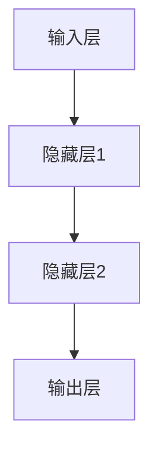

##### 2.1.2 前向传播与反向传播算法

前向传播和反向传播是神经网络的训练过程。在前向传播过程中，输入数据通过网络层层传递，最终得到输出。在反向传播过程中，网络根据实际输出与预期输出的差异，调整网络权重，以提高预测准确性。

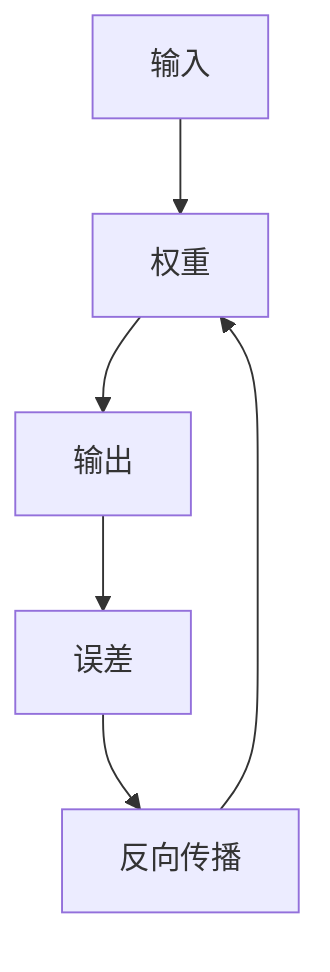

#### 2.2 大模型训练方法

##### 2.2.1 大模型训练挑战

大模型训练面临着巨大的计算资源需求。一方面，大规模数据集的处理需要大量的计算资源和存储空间；另一方面，大模型的训练过程涉及大量迭代，需要高性能计算集群和分布式训练技术。

##### 2.2.2 大模型训练策略

为了应对大模型训练的挑战，研究人员提出了多种训练策略。例如，预训练与微调结合，可以先在大规模数据集上进行预训练，然后在特定任务上进行微调。此外，并行训练和分布式训练技术也被广泛应用，以提高训练效率。

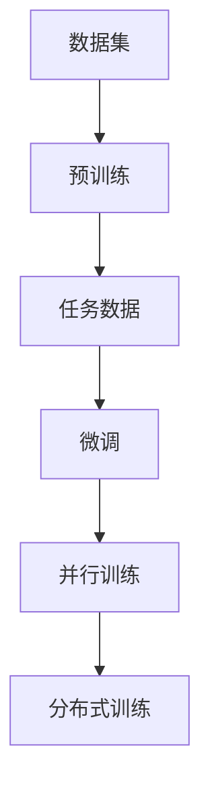

#### 2.3 大模型应用技术

##### 2.3.1 自然语言处理技术

自然语言处理（NLP）是AI的重要领域，大模型在NLP中展现了强大的能力。例如，语言模型可以用于文本生成和机器翻译；生成模型可以用于文本摘要和对话系统；情感分析可以用于社交媒体情感分析和用户反馈分析。

##### 2.3.2 计算机视觉技术

计算机视觉技术在大模型时代得到了快速发展。图像分类和检测技术可以用于图像识别和自动驾驶；目标跟踪与识别技术可以用于视频分析和智能监控。

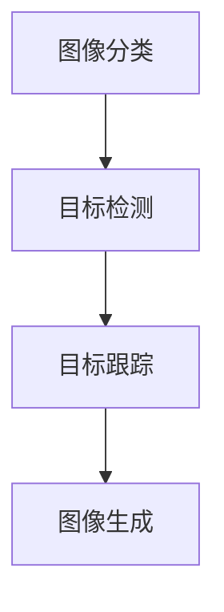

### 第3章：大模型在创业产品设计中的应用

#### 3.1 产品设计理念

##### 3.1.1 人机协同设计

人机协同设计是指将人工智能与人类设计师的协同工作结合起来。通过AI技术，设计师可以获得大量用户行为数据和分析，从而更好地理解用户需求，提高设计效率和质量。

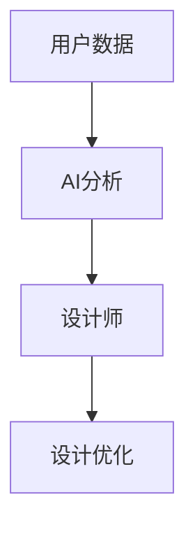

##### 3.1.2 用户行为分析与优化

用户行为分析是创业产品设计的重要环节。通过收集和分析用户在使用产品过程中的行为数据，设计师可以了解用户的喜好、使用习惯和痛点，从而进行产品优化。

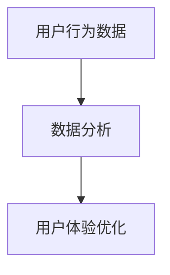

#### 3.2 创业产品设计实战

##### 3.2.1 产品案例分享

本章节将分享一些成功和失败的创业产品设计案例，从中学到宝贵的经验教训。例如，一个成功案例可以是基于GPT-3的智能客服系统，而一个失败案例则可能是由于数据隐私问题导致的产品下架。

##### 3.2.2 产品设计流程与方法

创业产品设计流程通常包括用户需求分析、设计原型和迭代。通过不断迭代和优化，产品可以更好地满足用户需求，提高市场竞争力。

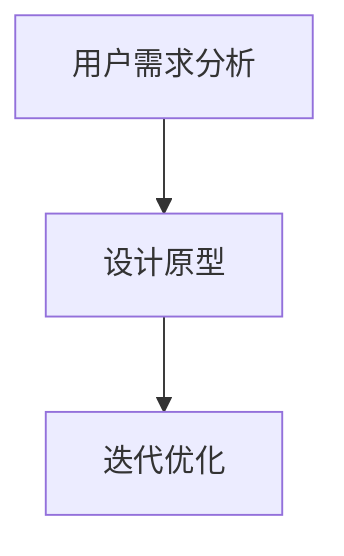

#### 3.3 大模型优化创业产品设计

##### 3.3.1 大模型在产品设计中的作用

大模型在创业产品设计中的作用主要体现在数据分析、智能推荐和个性化服务等方面。通过大模型技术，产品设计可以更加精准地满足用户需求，提高用户满意度和忠诚度。

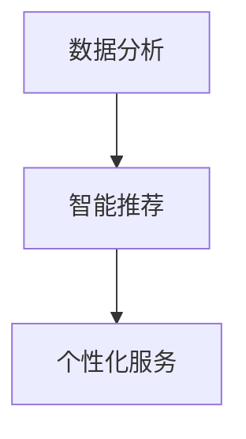

##### 3.3.2 大模型驱动的产品设计策略

大模型驱动的产品设计策略主要包括数据驱动与用户需求相结合、创新性设计方向探索等方面。通过大模型技术，设计师可以获得更深入的用户理解，从而进行更创新、更具竞争力的产品设计。

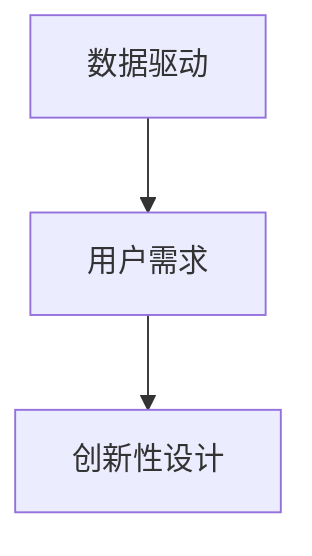

### 第4章：大模型时代的创业战略与策略

#### 4.1 创业战略规划

##### 4.1.1 市场定位

市场定位是创业战略的重要组成部分。创业者需要明确自己的目标市场和用户群体，从而制定合适的市场策略。

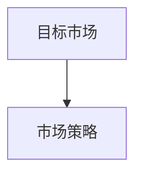

##### 4.1.2 商业模式设计

商业模式设计是创业成功的基石。在大模型时代，AI驱动的商业模式具有巨大的潜力，例如订阅服务、广告变现和数据交易等。

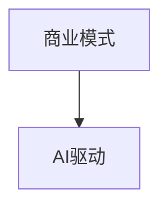

#### 4.2 创业风险与管理

##### 4.2.1 创业风险识别

创业风险包括技术风险、市场风险、财务风险等。创业者需要全面识别风险，并制定相应的风险控制策略。

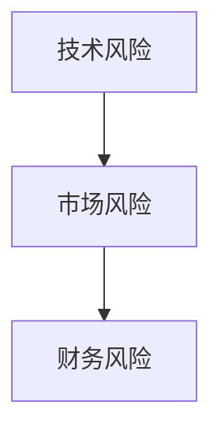

##### 4.2.2 创业风险管理

风险管理是创业过程中必不可少的一环。创业者需要建立风险评估与控制机制，以降低创业风险。

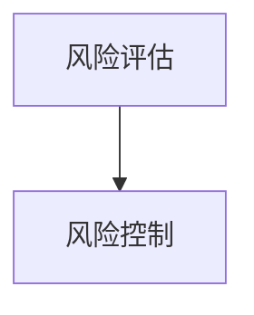

#### 4.3 创业团队建设

##### 4.3.1 核心团队组建

创业团队的成功离不开核心成员的支持。创业者需要组建一支具有技术实力、管理能力和创新精神的核心团队。

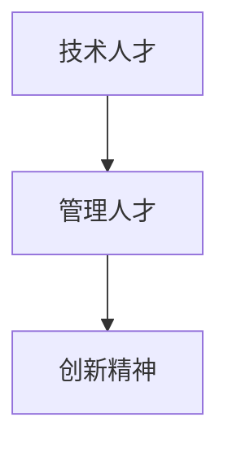

##### 4.3.2 团队文化建设

团队文化建设是团队协作和创新能力的重要保障。创业者需要营造一个开放、协作和创新的工作氛围，以促进团队的长期发展。

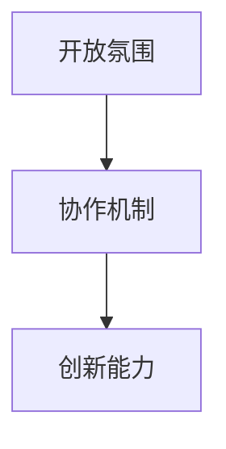

### 第5章：大模型时代创业实践案例分析

#### 5.1 案例分析

##### 5.1.1 国内案例分享

国内案例分享将包括成功和失败的创业案例，通过分析这些案例，创业者可以从中汲取经验教训。

##### 5.1.2 国际案例分享

国际案例分享将涉及国外成功和失败的创业案例，为国内创业者提供国际视野和借鉴。

#### 5.2 案例启示

##### 5.2.1 创业成功经验总结

创业成功经验总结将包括技术创新、市场策略、团队建设等方面的经验，为创业者提供有益的启示。

##### 5.2.2 创业失败教训

创业失败教训将分析失败原因，并提出相应的防范措施，以帮助创业者避免重复失败。

### 第6章：大模型时代创业生态系统构建

#### 6.1 产业合作与协同创新

##### 6.1.1 产业联盟建设

产业联盟建设将促进不同行业之间的合作与资源整合，为创业提供更广阔的发展空间。

##### 6.1.2 协同创新模式

协同创新模式将推动企业、高校和研究机构之间的合作，共同攻克技术难题，实现创新突破。

#### 6.2 政策环境与创业支持

##### 6.2.1 政策环境分析

政策环境分析将探讨政府对于创业的支持政策，以及创业者如何利用这些政策优势。

##### 6.2.2 创业支持体系

创业支持体系将包括资金支持、技术支持和人才支持等方面，为创业者提供全方位的支持。

#### 6.3 创业生态体系建设

##### 6.3.1 生态圈构建

生态圈构建将涉及企业、高校、研究机构和投资者等多方合作，共同构建健康的创业生态系统。

##### 6.3.2 创新能力提升

创新能力提升将探讨如何通过知识产权保护、技术培训和创新能力培养等手段，提升创业者的创新能力。

### 第7章：未来展望与趋势

#### 7.1 大模型技术发展趋势

##### 7.1.1 大模型技术演进

大模型技术演进将包括参数规模、计算效率和应用场景等方面的提升。

##### 7.1.2 未来可能的新技术

未来可能的新技术将包括类脑计算、量子计算等，这些技术将为大模型的发展提供新的方向。

#### 7.2 创业生态系统发展

##### 7.2.1 产业变革与机遇

产业变革与机遇将探讨AI技术如何推动各行业的变革，为创业带来新的发展机遇。

##### 7.2.2 创业生态系统的未来方向

创业生态系统的未来方向将包括智能化、全球化等方面，这些趋势将影响创业的未来发展。

#### 7.3 大模型时代创业者的使命

##### 7.3.1 创新与引领

大模型时代创业者的使命是创新与引领，通过技术创新和商业模式创新，推动社会的进步和变革。

##### 7.3.2 责任与担当

大模型时代创业者还需要承担社会责任，关注伦理和隐私问题，确保技术的发展能够造福社会。

## 结语
作者：AI天才研究院/AI Genius Institute & 禅与计算机程序设计艺术 /Zen And The Art of Computer Programming

