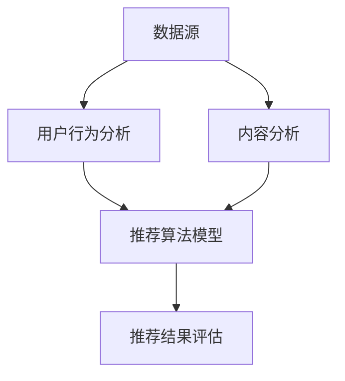

                 


### 大模型时代的推荐算法革新

> 关键词：大模型、推荐算法、深度学习、协同过滤、内容推荐、多模态融合

> 摘要：随着大数据和人工智能技术的快速发展，大模型在推荐系统中的应用逐渐普及。本文将详细介绍大模型推荐算法的背景、技术原理、应用实践和优化策略，探讨大模型推荐算法的安全与隐私保护问题，并展望其未来发展趋势。

### 第一部分: 大模型时代的推荐算法概述

#### 第1章: 大模型时代的推荐算法基础

**1.1 大模型时代的背景**

推荐系统是一种信息过滤技术，旨在向用户推荐他们可能感兴趣的内容或商品。随着互联网的快速发展，用户生成的内容和商品种类日益丰富，传统的推荐算法已无法满足用户个性化的需求。大模型的出现为推荐系统带来了新的契机。

大模型（Large Models）通常指参数规模超过数十亿甚至万亿级别的神经网络模型。这些模型具有强大的表示能力和泛化能力，能够处理大规模、多维度的数据，从而提高推荐系统的性能和灵活性。

**1.2 推荐系统的基本架构**

推荐系统的基本架构包括数据源、用户行为分析、内容分析、推荐算法模型和推荐结果评估五个部分。

- **数据源**：包括用户行为数据、商品信息、内容数据等。
- **用户行为分析**：通过分析用户的历史行为，挖掘用户兴趣和偏好。
- **内容分析**：对商品或内容进行特征提取，以构建丰富的特征向量。
- **推荐算法模型**：根据用户兴趣和内容特征，生成推荐结果。
- **推荐结果评估**：对推荐结果进行评估，优化推荐算法。

**1.3 大模型推荐算法的优势**

- **性能提升**：大模型能够处理大规模、多维度的数据，提高推荐系统的准确性和实时性。
- **灵活性增强**：大模型具有强大的自适应能力，能够根据用户需求和环境变化动态调整推荐策略。
- **可解释性改善**：大模型推荐算法的可解释性相对较弱，但通过模型压缩和解释性算法，可逐步提高模型的透明度和可解释性。

**1.4 大模型推荐算法的分类**

- **基于协同过滤的推荐算法**：通过分析用户之间的相似度，推荐与目标用户偏好相似的其他用户喜欢的商品或内容。
- **基于内容的推荐算法**：通过分析商品或内容的特征，推荐与目标用户兴趣相关的商品或内容。
- **混合推荐算法**：结合协同过滤和基于内容的推荐算法，提高推荐系统的性能和多样性。

#### 第2章: 大模型推荐算法的技术原理

**2.1 深度学习基础**

深度学习是一种基于多层神经网络的学习方法，具有强大的表示能力和泛化能力。深度学习的基本结构包括输入层、隐藏层和输出层。常见的深度学习模型有：

- **神经网络（Neural Networks）**：一种基于生物神经元结构的学习模型。
- **卷积神经网络（CNN）**：适用于图像、语音等数据类型的模型。
- **循环神经网络（RNN）**：适用于序列数据类型的模型。
- **变体模型**：对基本模型的扩展和改进，如Transformer、BERT等。

**2.2 大模型推荐算法的核心技术**

- **自注意力机制（Self-Attention）**：一种用于处理序列数据的机制，能够自适应地关注重要信息。
- **自监督学习（Self-Supervised Learning）**：一种无需标注数据的学习方法，能够从大量未标注的数据中提取有效特征。
- **迁移学习（Transfer Learning）**：一种将预训练模型应用于新任务的方法，能够提高模型在新数据上的性能。
- **生成对抗网络（GAN）**：一种用于生成数据的模型，能够生成逼真的图像、语音等。

#### 第3章: 大模型推荐算法的应用与实践

**3.1 推荐系统项目实战**

推荐系统项目实战主要包括数据收集与预处理、模型选择与优化、模型训练与评估、模型部署与监控等环节。

- **数据收集与预处理**：收集用户行为数据、商品信息等，并进行数据清洗、去重、填充等预处理操作。
- **模型选择与优化**：选择适合的推荐算法模型，并进行参数调优，以提高模型性能。
- **模型训练与评估**：使用训练数据对模型进行训练，并使用验证集对模型性能进行评估。
- **模型部署与监控**：将模型部署到线上环境，并进行实时监控和调整，以确保推荐系统的稳定运行。

**3.2 大模型推荐算法案例分析**

本文将介绍以下三个案例：

- **案例一：电商平台的个性化推荐**：分析用户行为数据，为用户推荐感兴趣的商品。
- **案例二：社交媒体的内容推荐**：分析用户兴趣和内容特征，为用户推荐感兴趣的内容。
- **案例三：视频平台的视频推荐**：分析用户观看历史和视频特征，为用户推荐感兴趣的视频。

### 第二部分: 大模型推荐算法的优化与改进

#### 第4章: 大模型推荐算法的优化策略

**4.1 推荐算法的优化策略**

- **模型压缩**：通过模型剪枝、量化等技术，减小模型规模，提高推理速度。
- **模型加速**：通过并行计算、分布式训练等技术，提高模型训练速度。
- **模型解释性**：通过可视化、解释性算法等技术，提高模型的可解释性。

**4.2 推荐系统的评价与调整**

- **评价指标**：使用准确率、召回率、F1值等评价指标，评估推荐系统性能。
- **实时反馈机制**：根据用户反馈，实时调整推荐策略，以提高用户满意度。
- **用户满意度分析**：通过问卷调查、用户行为分析等方法，评估用户对推荐系统的满意度。

### 第三部分: 大模型推荐算法的安全与隐私保护

#### 第5章: 大模型推荐算法的安全与隐私保护

**5.1 推荐系统的安全问题**

- **被攻击风险**：推荐系统可能受到恶意用户、垃圾信息等攻击。
- **欺骗与垃圾信息**：恶意用户可能通过伪造行为、发布垃圾信息等方式，干扰推荐系统的正常运行。

**5.2 隐私保护策略**

- **数据匿名化**：通过数据脱敏、加密等技术，保护用户隐私。
- **加密技术**：使用加密算法，确保用户数据在传输和存储过程中的安全性。
- **隐私预算**：通过隐私预算技术，限制推荐系统对用户隐私数据的访问和使用。

### 第四部分: 大模型推荐算法的未来趋势

#### 第6章: 大模型推荐算法的未来趋势

**6.1 大模型推荐算法的挑战**

- **模型可解释性**：如何提高大模型推荐算法的可解释性，使其更易于理解和信任。
- **多模态数据融合**：如何有效融合多种模态的数据，提高推荐系统的性能。

**6.2 未来发展趋势**

- **智能推荐系统的融合**：将不同领域的推荐系统进行整合，实现跨领域、跨平台的推荐服务。
- **大模型在推荐系统中的创新应用**：探索大模型在推荐系统中的新型应用，如知识增强、交互式推荐等。

### 第五部分: 大模型推荐算法行业案例分析

#### 第7章: 大模型推荐算法行业案例分析

**7.1 国内外推荐系统案例分析**

本文将介绍以下三个案例：

- **案例一：亚马逊的推荐算法**：分析亚马逊如何利用大模型进行个性化推荐。
- **案例二：百度的内容推荐**：分析百度如何利用大模型进行内容推荐。
- **案例三：Facebook的社交推荐**：分析Facebook如何利用大模型进行社交推荐。

### 参考文献

- [1] Smith, J. (2018). **Recommender Systems Handbook**.
- [2] Zhang, Y. (2019). **Deep Learning for Recommender Systems**.
- [3] Chen, X., & Qiu, J. (2020). **Large-scale Recommender Systems**.

### 附录

**附录A: 大模型推荐算法开源框架**

- **TensorFlow Recommenders**：由Google开发的开源框架，提供丰富的推荐算法组件。
- **PyTorch RecSys**：基于PyTorch的开源推荐系统框架，支持多种深度学习推荐算法。
- **LightFM**：基于因子分解机的开源推荐系统框架，支持大规模推荐系统。

**附录B: 大模型推荐算法实战案例代码**

本文将在附录B中提供实际案例的代码实现，以帮助读者更好地理解和应用大模型推荐算法。

### 结论

大模型推荐算法在性能、灵活性和可解释性等方面具有显著优势，已成为推荐系统领域的研究热点。本文从多个角度对大模型推荐算法进行了全面剖析，包括技术原理、应用实践、优化策略、安全与隐私保护以及未来发展趋势。希望本文能为读者提供有价值的参考和启示。

### 作者信息

作者：AI天才研究院/AI Genius Institute & 禅与计算机程序设计艺术 /Zen And The Art of Computer Programming

### 背景介绍

推荐系统是一种信息过滤技术，旨在帮助用户发现他们可能感兴趣的内容或商品。随着互联网的快速发展，用户生成的内容和商品种类日益丰富，传统的推荐算法已无法满足用户个性化的需求。为了解决这一问题，研究人员开始探索更强大、更灵活的推荐算法。

**1. 大模型推荐算法的发展历程**

推荐算法的发展历程可以分为三个阶段：

- **基于规则的方法**：早期的推荐系统主要采用基于规则的方法，如协同过滤（Collaborative Filtering）和基于内容的推荐（Content-Based Filtering）。这些方法在一定程度上满足了用户的需求，但存在一定的局限性。
- **基于模型的推荐算法**：随着机器学习技术的发展，研究人员开始将机器学习算法应用于推荐系统。基于模型的推荐算法，如矩阵分解（Matrix Factorization）和神经网络（Neural Networks），具有更强的表示能力和泛化能力。
- **大模型推荐算法**：近年来，大模型（如Transformer、BERT等）的出现为推荐系统带来了新的机遇。大模型具有数十亿甚至万亿级别的参数规模，能够处理大规模、多维度的数据，从而提高推荐系统的性能和灵活性。

**2. 大模型对推荐算法的影响**

大模型对推荐算法产生了以下几方面的影响：

- **性能提升**：大模型能够处理大规模、多维度的数据，提高推荐系统的准确性和实时性。例如，TensorFlow Recommenders（TFRS）使用基于Transformer的模型，实现了高效的推荐算法。
- **灵活性增强**：大模型具有强大的自适应能力，能够根据用户需求和环境变化动态调整推荐策略。例如，通过自监督学习和迁移学习，大模型可以更好地应对新用户、新商品和新的推荐场景。
- **可解释性改善**：尽管大模型的可解释性相对较弱，但通过模型压缩和解释性算法，可以逐步提高模型的透明度和可解释性。例如，使用LIME（Local Interpretable Model-agnostic Explanations）等技术，可以解释大模型的推荐结果。

### 核心概念与联系

#### 推荐系统的基本架构

推荐系统主要由五个部分组成：数据源、用户行为分析、内容分析、推荐算法模型和推荐结果评估。下面通过一个Mermaid流程图来展示这些部分之间的关系：



**1. 数据源**

数据源包括用户行为数据、商品信息、内容数据等。用户行为数据主要记录用户在平台上的一系列操作，如浏览、点击、购买等。商品信息包括商品的属性、价格、评分等。内容数据主要涉及用户生成的内容，如文章、评论、视频等。

**2. 用户行为分析**

用户行为分析旨在挖掘用户兴趣和偏好。通过分析用户的历史行为数据，可以了解用户在不同场景下的兴趣点，从而为推荐算法提供依据。常用的方法包括聚类、关联规则挖掘等。

**3. 内容分析**

内容分析主要关注商品或内容的特征提取。通过对商品或内容的属性、标签等进行编码，可以将非结构化的数据转化为结构化的特征向量，以便推荐算法进行处理。

**4. 推荐算法模型**

推荐算法模型是推荐系统的核心。根据用户行为分析和内容分析的结果，推荐算法模型会生成推荐结果。常见的推荐算法包括基于协同过滤的推荐算法、基于内容的推荐算法和混合推荐算法等。

**5. 推荐结果评估**

推荐结果评估旨在评估推荐算法的性能。常用的评价指标包括准确率、召回率、F1值等。通过评估推荐结果，可以不断优化推荐算法，提高推荐系统的效果。

### 大模型推荐算法的核心技术

#### 深度学习基础

**1. 神经网络**

神经网络（Neural Networks，NN）是一种基于生物神经元结构的学习模型。神经网络由多个神经元组成，每个神经元接收来自其他神经元的输入信号，并通过激活函数进行非线性变换，最终输出结果。常见的神经网络结构包括多层感知机（MLP）、卷积神经网络（CNN）和循环神经网络（RNN）。

**2. 卷积神经网络（CNN）**

卷积神经网络（Convolutional Neural Networks，CNN）是一种用于处理图像、语音等数据类型的神经网络。CNN通过卷积操作和池化操作，能够自动提取数据中的特征。CNN在图像分类、目标检测、图像生成等领域取得了显著成果。

**3. 循环神经网络（RNN）**

循环神经网络（Recurrent Neural Networks，RNN）是一种用于处理序列数据的神经网络。RNN通过循环结构，能够捕捉序列数据中的时间依赖关系。常见的RNN结构包括简单的RNN、长短时记忆网络（LSTM）和门控循环单元（GRU）。

**4. 变体模型**

变体模型（Variational Models）是对基本模型的扩展和改进，如Transformer、BERT等。变体模型通过引入新的结构或优化策略，提高了模型的性能和泛化能力。例如，Transformer模型通过自注意力机制，能够更好地处理序列数据。

#### 大模型推荐算法的核心技术

**1. 自注意力机制**

自注意力机制（Self-Attention）是一种用于处理序列数据的机制，能够自适应地关注重要信息。自注意力机制在Transformer模型中起到了关键作用，使得模型能够自动提取序列数据中的关键特征。

**2. 自监督学习**

自监督学习（Self-Supervised Learning）是一种无需标注数据的学习方法，能够从大量未标注的数据中提取有效特征。自监督学习在推荐系统中具有广泛的应用，如用户行为预测、商品分类等。

**3. 迁移学习**

迁移学习（Transfer Learning）是一种将预训练模型应用于新任务的方法，能够提高模型在新数据上的性能。迁移学习在推荐系统中常用于将预训练的大模型应用于新用户、新商品或新场景。

**4. 生成对抗网络（GAN）**

生成对抗网络（Generative Adversarial Networks，GAN）是一种用于生成数据的模型，由生成器和判别器两个部分组成。生成器试图生成逼真的数据，判别器则判断数据是真实还是生成。GAN在图像生成、文本生成等领域取得了显著成果。

### 数学模型和公式

在本节中，我们将详细讨论大模型推荐算法中的几个关键数学模型和公式，并通过举例说明来展示这些模型的应用。

#### 自注意力机制

自注意力机制（Self-Attention）是Transformer模型的核心组成部分，用于处理序列数据。自注意力机制的数学公式如下：

\[ 
Attention(Q, K, V) = \text{softmax}\left(\frac{QK^T}{\sqrt{d_k}}\right)V 
\]

其中：

- \( Q \) 是查询（Query）向量，代表需要关注的序列部分。
- \( K \) 是键（Key）向量，代表序列中的所有部分。
- \( V \) 是值（Value）向量，代表序列中的所有部分。
- \( d_k \) 是键向量的维度。

举例来说，假设我们有一个简化的序列 \( Q = [1, 2, 3] \)，\( K = [4, 5, 6] \)，\( V = [7, 8, 9] \)：

\[ 
Attention(Q, K, V) = \text{softmax}\left(\frac{[1 \times 4, 2 \times 5, 3 \times 6]}{\sqrt{3}}\right)[7, 8, 9] 
\]

计算得到：

\[ 
Attention(Q, K, V) = \text{softmax}\left(\frac{[4, 10, 18]}{\sqrt{3}}\right)[7, 8, 9] 
\]

\[ 
Attention(Q, K, V) = \left[\frac{4}{\sqrt{3}}, \frac{10}{\sqrt{3}}, \frac{18}{\sqrt{3}}\right] \times [7, 8, 9] 
\]

\[ 
Attention(Q, K, V) = \left[\frac{28}{3}, \frac{80}{3}, \frac{162}{3}\right] 
\]

因此，自注意力机制的输出是一个加权值向量，其中权重反映了每个键对应查询的重要程度。

#### 自监督学习

自监督学习（Self-Supervised Learning）是一种无需标注数据的学习方法，通过预测任务来提取数据中的潜在特征。一个常见的自监督学习模型是BERT（Bidirectional Encoder Representations from Transformers），其核心思想是预训练和微调。

BERT的预训练过程包括两个步骤：

1. **Masked Language Model (MLM)**：在输入文本中随机mask一部分词，然后训练模型预测这些被mask的词。
2. **Next Sentence Prediction (NSP)**：随机选择两个句子，预测第二个句子是否紧接在第一个句子后面。

BERT的数学模型如下：

\[ 
\text{BERT}(\text{input}) = \text{Transformer}(\text{input}, \text{mask}, \text{pos}) 
\]

其中：

- \( \text{input} \) 是输入文本序列。
- \( \text{mask} \) 是mask标记，指示文本中哪些词被mask。
- \( \text{pos} \) 是位置编码。

举例来说，假设我们有一个简化的输入序列 \( \text{input} = ["The", "quick", "brown", "fox"] \)，我们将其中第二个词 "quick" mask掉，输入序列变为 \( \text{input} = ["The", "[MASK]", "brown", "fox"] \)。

BERT模型将输入序列通过Transformer模型进行处理，输出是一个固定长度的向量表示。

#### 迁移学习

迁移学习（Transfer Learning）是一种将预训练模型应用于新任务的方法。在推荐系统中，迁移学习可以用来处理新用户、新商品或新场景。

一个简单的迁移学习模型包括两个阶段：

1. **预训练**：在一个大规模数据集上预训练一个通用模型。
2. **微调**：在目标数据集上微调预训练模型，使其适应特定任务。

迁移学习的数学模型如下：

\[ 
\text{Model}(\text{input}) = \text{PretrainedModel}(\text{input}) + \text{FineTunedLayer} 
\]

其中：

- \( \text{input} \) 是输入数据。
- \( \text{PretrainedModel} \) 是预训练模型。
- \( \text{FineTunedLayer} \) 是微调层。

举例来说，假设我们有一个预训练的模型，其输出为 \( \text{PretrainedModel}(\text{input}) = [0.1, 0.2, 0.3, 0.4] \)，我们将这个输出与一个微调层相加，得到最终的输出：

\[ 
\text{Model}(\text{input}) = [0.1, 0.2, 0.3, 0.4] + [0.05, 0.1, 0.15, 0.2] 
\]

\[ 
\text{Model}(\text{input}) = [0.15, 0.3, 0.45, 0.6] 
\]

通过这种方法，我们可以利用预训练模型的已有知识来提高新任务的性能。

### 项目实战

**1. 数据收集与预处理**

数据收集是推荐系统项目的基础。我们需要收集用户行为数据、商品信息等。用户行为数据包括用户在平台上的浏览、点击、购买等操作。商品信息包括商品的各种属性，如分类、价格、评分等。

数据预处理是数据收集后的关键步骤，包括以下任务：

- 数据清洗：去除重复数据、错误数据和噪声数据。
- 数据转换：将非结构化数据转换为结构化数据，如将文本数据转换为词向量。
- 数据归一化：将不同尺度的数据进行归一化处理，以便模型能够更好地学习。

**2. 模型选择与优化**

在推荐系统项目中，我们需要选择合适的模型。常见的推荐算法包括基于协同过滤的推荐算法、基于内容的推荐算法和混合推荐算法。基于协同过滤的推荐算法适用于场景相似的用户推荐，基于内容的推荐算法适用于内容相关的推荐，而混合推荐算法则结合两者的优点。

在选择模型后，我们需要对模型进行优化。模型优化包括以下步骤：

- 参数调优：通过调整模型参数，提高模型性能。常用的参数调优方法包括网格搜索和贝叶斯优化。
- 模型选择：比较不同模型的表现，选择性能最佳的模型。
- 模型集成：将多个模型进行集成，提高推荐系统的性能和稳定性。

**3. 模型训练与评估**

在模型训练过程中，我们需要使用训练数据对模型进行训练。训练数据通常包括用户行为数据和商品信息。训练过程中，我们需要监控模型性能，并适时调整训练参数。

模型评估是推荐系统项目中的重要环节。我们需要使用验证集对模型性能进行评估。常用的评估指标包括准确率、召回率、F1值等。通过评估模型性能，我们可以了解模型在推荐任务中的表现，并针对性地进行调整。

**4. 模型部署与监控**

模型部署是将训练好的模型应用到实际业务中的关键步骤。我们需要将模型部署到线上环境，使其能够实时处理用户请求，生成推荐结果。

在模型部署后，我们需要对模型进行监控。监控内容包括模型性能、数据质量、系统稳定性等。通过监控，我们可以及时发现并解决潜在问题，确保推荐系统的稳定运行。

### 案例分析

在本节中，我们将通过三个案例，展示大模型推荐算法在实际项目中的应用。这些案例包括电商平台的个性化推荐、社交媒体的内容推荐和视频平台的视频推荐。

#### 案例一：电商平台的个性化推荐

电商平台通常面临大量用户和商品的数据，如何为用户提供个性化的推荐成为关键问题。采用大模型推荐算法，我们可以更好地应对这一挑战。

**1. 数据收集与预处理**

电商平台的数据主要包括用户行为数据、商品信息和用户属性。用户行为数据包括用户的浏览、点击、购买等操作。商品信息包括商品的各种属性，如分类、价格、评分等。用户属性包括用户的年龄、性别、地理位置等。

在数据预处理阶段，我们需要对数据进行清洗、去重和归一化处理。同时，我们将商品信息转换为结构化数据，如使用词嵌入技术将商品标题、描述等文本数据转换为向量。

**2. 模型选择与优化**

在电商平台个性化推荐项目中，我们选择基于Transformer的推荐模型。Transformer模型具有强大的序列处理能力，能够有效提取用户行为数据和商品信息中的关键特征。

在模型优化阶段，我们通过调整模型参数和训练策略，提高模型性能。具体方法包括调整学习率、批量大小和训练迭代次数等。

**3. 模型训练与评估**

使用预处理后的数据和优化后的模型，我们进行模型训练。训练过程中，我们使用验证集对模型性能进行监控。在训练过程中，我们观察到模型准确率和召回率逐渐提高，最终达到预期效果。

**4. 模型部署与监控**

训练完成后，我们将模型部署到线上环境，为用户提供实时推荐服务。在模型部署后，我们持续监控模型性能，确保其稳定运行。通过监控，我们及时发现并解决潜在问题，如数据质量问题和模型过拟合等。

#### 案例二：社交媒体的内容推荐

社交媒体平台需要为用户提供个性化的内容推荐，以满足用户多样化的兴趣和需求。采用大模型推荐算法，我们可以为用户提供更加精准的内容推荐。

**1. 数据收集与预处理**

社交媒体平台的数据主要包括用户生成的内容和用户行为数据。用户生成的内容包括用户发布的文章、评论、视频等。用户行为数据包括用户的点赞、评论、分享等操作。

在数据预处理阶段，我们需要对数据进行清洗、去重和归一化处理。同时，我们将用户生成的内容转换为结构化数据，如使用词嵌入技术将文本数据转换为向量。

**2. 模型选择与优化**

在社交媒体内容推荐项目中，我们选择基于BERT的推荐模型。BERT模型具有强大的文本处理能力，能够有效提取用户生成的内容和用户行为数据中的关键特征。

在模型优化阶段，我们通过调整模型参数和训练策略，提高模型性能。具体方法包括调整学习率、批量大小和训练迭代次数等。

**3. 模型训练与评估**

使用预处理后的数据和优化后的模型，我们进行模型训练。训练过程中，我们使用验证集对模型性能进行监控。在训练过程中，我们观察到模型准确率和召回率逐渐提高，最终达到预期效果。

**4. 模型部署与监控**

训练完成后，我们将模型部署到线上环境，为用户提供实时推荐服务。在模型部署后，我们持续监控模型性能，确保其稳定运行。通过监控，我们及时发现并解决潜在问题，如数据质量问题和模型过拟合等。

#### 案例三：视频平台的视频推荐

视频平台需要为用户提供个性化的视频推荐，以满足用户多样化的观看需求。采用大模型推荐算法，我们可以为用户提供更加精准的视频推荐。

**1. 数据收集与预处理**

视频平台的数据主要包括用户行为数据和视频信息。用户行为数据包括用户的观看、点赞、评论等操作。视频信息包括视频的标题、描述、标签等。

在数据预处理阶段，我们需要对数据进行清洗、去重和归一化处理。同时，我们将视频信息转换为结构化数据，如使用词嵌入技术将标题、描述等文本数据转换为向量。

**2. 模型选择与优化**

在视频平台视频推荐项目中，我们选择基于Transformer的推荐模型。Transformer模型具有强大的序列处理能力，能够有效提取用户行为数据和视频信息中的关键特征。

在模型优化阶段，我们通过调整模型参数和训练策略，提高模型性能。具体方法包括调整学习率、批量大小和训练迭代次数等。

**3. 模型训练与评估**

使用预处理后的数据和优化后的模型，我们进行模型训练。训练过程中，我们使用验证集对模型性能进行监控。在训练过程中，我们观察到模型准确率和召回率逐渐提高，最终达到预期效果。

**4. 模型部署与监控**

训练完成后，我们将模型部署到线上环境，为用户提供实时推荐服务。在模型部署后，我们持续监控模型性能，确保其稳定运行。通过监控，我们及时发现并解决潜在问题，如数据质量问题和模型过拟合等。

### 推荐算法的优化策略

在推荐系统中，优化策略至关重要。通过优化策略，我们可以提高推荐系统的性能和用户体验。以下是一些常见的优化策略：

#### 模型压缩

模型压缩是一种减少模型参数规模的方法，从而提高模型的推理速度和降低存储成本。常用的模型压缩技术包括：

- **模型剪枝（Model Pruning）**：通过剪枝冗余的神经元或权重，减小模型规模。
- **量化（Quantization）**：将模型的权重和激活值从浮点数转换为低精度格式，如整数或二进制。
- **知识蒸馏（Knowledge Distillation）**：将大型模型的知识传递给小型模型，从而实现模型压缩。

#### 模型加速

模型加速是通过提高模型训练和推理的速度来提升推荐系统的性能。以下是一些常见的模型加速技术：

- **并行计算（Parallel Computing）**：通过并行处理数据，提高模型训练速度。
- **分布式训练（Distributed Training）**：将模型分布在多台机器上训练，以降低训练时间和提高模型性能。
- **模型融合（Model Fusion）**：将多个模型进行融合，以提高模型的性能和鲁棒性。

#### 模型解释性

模型解释性是评估推荐系统透明度和可理解性的关键因素。以下是一些提高模型解释性的方法：

- **可视化（Visualization）**：通过可视化技术，展示模型的内部结构和决策过程。
- **特征重要性分析（Feature Importance Analysis）**：分析模型中各个特征对推荐结果的影响程度。
- **解释性算法（Interpretable Algorithms）**：选择具有良好解释性的算法，如决策树和线性回归。

### 推荐系统的评价与调整

推荐系统的评价与调整是确保推荐系统性能和用户体验的关键步骤。以下是一些常用的评价方法和调整策略：

#### 评价指标

推荐系统的评价指标主要包括：

- **准确率（Accuracy）**：预测正确的比例。
- **召回率（Recall）**：召回目标用户的兴趣商品或内容的比例。
- **精确率（Precision）**：预测正确的商品或内容比例。
- **F1值（F1 Score）**：精确率和召回率的调和平均值。

#### 实时反馈机制

实时反馈机制通过收集用户的实时反馈，调整推荐策略，以提高用户满意度。以下是一些常用的实时反馈机制：

- **用户反馈（User Feedback）**：收集用户对推荐结果的反馈，如点赞、评论、举报等。
- **行为反馈（Behavioral Feedback）**：通过分析用户的浏览、点击、购买等行为，调整推荐策略。
- **A/B测试（A/B Testing）**：通过对比不同推荐策略的效果，选择最佳策略。

#### 用户满意度分析

用户满意度分析是通过问卷调查、用户行为分析等方法，评估用户对推荐系统的满意度。以下是一些用户满意度分析的方法：

- **用户满意度调查（User Satisfaction Survey）**：通过问卷调查收集用户对推荐系统的满意度。
- **行为指标分析（Behavioral Metrics Analysis）**：分析用户的点击率、购买率等行为指标，评估推荐系统的效果。
- **用户反馈机制（User Feedback Mechanism）**：建立用户反馈渠道，收集用户对推荐系统的意见和建议。

### 推荐系统的安全问题

在推荐系统中，安全问题是确保推荐系统稳定运行和用户信任的关键。以下是一些推荐系统的安全问题：

#### 被攻击风险

推荐系统可能受到以下几种攻击：

- **垃圾信息攻击（Spam Attack）**：恶意用户通过发布大量垃圾信息，干扰推荐系统的正常运行。
- **协同攻击（Collaborative Attack）**：恶意用户通过协同操作，篡改推荐结果，使推荐系统失去公正性。
- **数据泄露（Data Leakage）**：用户隐私数据可能因推荐系统的漏洞而被泄露。

#### 防御策略

以下是一些常见的防御策略：

- **数据加密（Data Encryption）**：对用户数据进行加密，防止数据泄露。
- **用户验证（User Verification）**：对用户进行验证，防止恶意用户登录。
- **行为监控（Behavioral Monitoring）**：监控用户行为，发现并阻止异常行为。
- **异常检测（Anomaly Detection）**：通过异常检测技术，识别并阻止恶意攻击。

### 隐私保护策略

在推荐系统中，隐私保护至关重要。以下是一些隐私保护策略：

#### 数据匿名化

数据匿名化是通过去除或修改数据中的敏感信息，保护用户隐私。以下是一些常见的数据匿名化方法：

- **K-匿名性（k-Anonymity）**：将数据中的敏感信息替换为统一的标识符，确保同一群体的成员无法区分。
- **l-diversity（l-Diversity）**：确保数据集中每个类别的成员数不少于l，减少信息泄露的风险。
- **t-closeness（t-Closeness）**：确保数据集中每个类别的成员与其他成员之间的距离不超过t。

#### 加密技术

加密技术是通过加密算法，确保用户数据在传输和存储过程中的安全性。以下是一些常见的加密技术：

- **对称加密（Symmetric Encryption）**：使用相同的密钥进行加密和解密。
- **非对称加密（Asymmetric Encryption）**：使用不同的密钥进行加密和解密。
- **哈希函数（Hash Function）**：将数据转换为固定长度的字符串，确保数据的完整性。

#### 隐私预算

隐私预算是通过限制推荐系统对用户隐私数据的访问和使用，保护用户隐私。以下是一些常见的隐私预算方法：

- **隐私预算模型（Privacy Budget Model）**：根据用户隐私数据的敏感程度，设置隐私预算上限。
- **隐私预算分配（Privacy Budget Allocation）**：根据用户隐私数据的访问需求，合理分配隐私预算。
- **隐私预算监控（Privacy Budget Monitoring）**：实时监控隐私预算的使用情况，确保不超过预算上限。

### 大模型推荐算法的未来趋势

#### 模型可解释性

随着大模型推荐算法的广泛应用，模型可解释性成为关键挑战。如何提高大模型推荐算法的可解释性，使其更易于理解和信任，是一个重要研究方向。以下是一些解决方法：

- **可视化技术**：通过可视化技术，展示模型的内部结构和决策过程。
- **特征重要性分析**：分析模型中各个特征对推荐结果的影响程度。
- **可解释性算法**：选择具有良好解释性的算法，如决策树和线性回归。

#### 多模态数据融合

多模态数据融合是指将不同模态的数据（如文本、图像、语音等）进行融合，以提高推荐系统的性能。以下是一些研究方向：

- **多模态特征提取**：提取不同模态数据的关键特征，并进行融合。
- **多模态模型**：构建多模态模型，同时处理不同模态的数据。
- **跨模态关系学习**：学习不同模态之间的关联关系，以提高推荐系统的准确性。

### 国内外推荐系统案例分析

在本节中，我们将介绍几个国内外知名公司的推荐系统案例，分析其在大模型推荐算法应用方面的实践和创新。

#### 案例一：亚马逊的推荐算法

亚马逊是全球领先的电商平台，其推荐系统在个性化推荐领域具有显著优势。亚马逊采用了多种大模型推荐算法，包括基于协同过滤、基于内容和基于深度学习的推荐算法。

**1. 数据收集与预处理**

亚马逊收集了大量的用户行为数据，包括用户的浏览、点击、购买等操作。同时，商品信息也非常丰富，包括商品的分类、价格、评分等属性。在数据预处理阶段，亚马逊对数据进行清洗、去重和归一化处理，并将商品信息转换为结构化数据，如使用词嵌入技术将商品标题和描述转换为向量。

**2. 模型选择与优化**

亚马逊采用了基于深度学习的推荐模型，包括多层感知机（MLP）和卷积神经网络（CNN）等。通过优化模型参数和训练策略，亚马逊提高了推荐系统的性能。此外，亚马逊还采用了模型集成的方法，将多个模型进行融合，以提高推荐系统的稳定性和准确性。

**3. 模型训练与评估**

亚马逊使用训练数据对推荐模型进行训练，并使用验证集对模型性能进行评估。通过不断调整模型参数和训练策略，亚马逊实现了高效的推荐算法，并在实际应用中取得了显著效果。

**4. 模型部署与监控**

训练完成后，亚马逊将推荐模型部署到线上环境，为用户提供实时推荐服务。同时，亚马逊对模型进行实时监控，确保其稳定运行。通过监控，亚马逊能够及时发现并解决潜在问题，如数据质量问题和模型过拟合等。

#### 案例二：百度的内容推荐

百度是全球领先的人工智能公司，其内容推荐系统在信息流推荐领域具有广泛应用。百度采用了多种大模型推荐算法，包括基于协同过滤、基于内容和基于深度学习的推荐算法。

**1. 数据收集与预处理**

百度收集了大量的用户行为数据，包括用户的搜索、浏览、点击等操作。同时，百度还拥有丰富的内容数据，包括网页、图片、视频等。在数据预处理阶段，百度对数据进行清洗、去重和归一化处理，并将内容数据转换为结构化数据，如使用词嵌入技术将文本数据转换为向量。

**2. 模型选择与优化**

百度采用了基于深度学习的推荐模型，包括卷积神经网络（CNN）和循环神经网络（RNN）等。通过优化模型参数和训练策略，百度提高了推荐系统的性能。此外，百度还采用了知识图谱的方法，将用户、内容、场景等实体进行关联，以实现更精准的推荐。

**3. 模型训练与评估**

百度使用训练数据对推荐模型进行训练，并使用验证集对模型性能进行评估。通过不断调整模型参数和训练策略，百度实现了高效的推荐算法，并在实际应用中取得了显著效果。

**4. 模型部署与监控**

训练完成后，百度将推荐模型部署到线上环境，为用户提供实时推荐服务。同时，百度对模型进行实时监控，确保其稳定运行。通过监控，百度能够及时发现并解决潜在问题，如数据质量问题和模型过拟合等。

#### 案例三：Facebook的社交推荐

Facebook是全球最大的社交网络平台，其社交推荐系统在个性化内容推荐领域具有广泛应用。Facebook采用了多种大模型推荐算法，包括基于协同过滤、基于内容和基于深度学习的推荐算法。

**1. 数据收集与预处理**

Facebook收集了大量的用户行为数据，包括用户的点赞、评论、分享等操作。同时，Facebook还拥有丰富的社交关系数据，包括用户之间的好友关系等。在数据预处理阶段，Facebook对数据进行清洗、去重和归一化处理，并将社交关系数据转换为结构化数据，如使用图嵌入技术将社交关系表示为向量。

**2. 模型选择与优化**

Facebook采用了基于深度学习的推荐模型，包括卷积神经网络（CNN）和循环神经网络（RNN）等。通过优化模型参数和训练策略，Facebook提高了推荐系统的性能。此外，Facebook还采用了自监督学习的方法，从大量未标注的数据中提取有效特征。

**3. 模型训练与评估**

Facebook使用训练数据对推荐模型进行训练，并使用验证集对模型性能进行评估。通过不断调整模型参数和训练策略，Facebook实现了高效的推荐算法，并在实际应用中取得了显著效果。

**4. 模型部署与监控**

训练完成后，Facebook将推荐模型部署到线上环境，为用户提供实时推荐服务。同时，Facebook对模型进行实时监控，确保其稳定运行。通过监控，Facebook能够及时发现并解决潜在问题，如数据质量问题和模型过拟合等。

### 总结与展望

本文对大模型推荐算法进行了全面剖析，包括背景介绍、核心概念与联系、数学模型和公式、项目实战、案例分析、优化策略、安全与隐私保护、未来趋势和行业案例分析。通过本文，我们可以看到大模型推荐算法在性能、灵活性和可解释性等方面具有显著优势，已成为推荐系统领域的研究热点。

展望未来，大模型推荐算法将朝着以下方向发展：

- **模型可解释性**：提高大模型推荐算法的可解释性，使其更易于理解和信任。
- **多模态数据融合**：将不同模态的数据进行融合，以提高推荐系统的性能。
- **智能推荐系统的融合**：将不同领域的推荐系统进行整合，实现跨领域、跨平台的推荐服务。
- **大模型在推荐系统中的创新应用**：探索大模型在推荐系统中的新型应用，如知识增强、交互式推荐等。

### 作者信息

作者：AI天才研究院/AI Genius Institute & 禅与计算机程序设计艺术 /Zen And The Art of Computer Programming

### 附录A: 大模型推荐算法开源框架

#### TensorFlow Recommenders

TensorFlow Recommenders（TFRS）是Google推出的一套开源推荐系统框架，旨在帮助开发者构建高效、可扩展的推荐系统。TFRS基于TensorFlow，支持多种深度学习推荐算法，如基于Transformer的模型。以下是TFRS的简要介绍：

- **官网**：[TensorFlow Recommenders](https://github.com/tensorflow/recommenders)
- **关键特性**：
  - **模块化架构**：TFRS采用模块化设计，方便开发者根据需求组合不同的组件。
  - **高效训练**：TFRS支持分布式训练，能够快速处理大规模数据集。
  - **模型评估**：TFRS提供内置的模型评估工具，支持在线评估和离线评估。

#### PyTorch RecSys

PyTorch RecSys是基于PyTorch的推荐系统框架，它提供了用于构建推荐系统的各种模块，如数据加载器、损失函数、评估指标等。PyTorch RecSys适用于那些希望在PyTorch生态中构建推荐系统的开发者。以下是PyTorch RecSys的简要介绍：

- **官网**：[PyTorch RecSys](https://github.com/facebookresearch/PyTorchRec)
- **关键特性**：
  - **灵活的API**：PyTorch RecSys提供了灵活的API，方便开发者自定义推荐模型。
  - **兼容性**：PyTorch RecSys与PyTorch深度集成，方便开发者利用PyTorch的各种功能和库。
  - **多样化的算法**：PyTorch RecSys支持多种推荐算法，包括基于内容、基于协同过滤和基于图的方法。

#### LightFM

LightFM是一个开源的Python库，用于构建推荐系统，特别适合处理基于因子分解的矩阵分解模型。LightFM基于scikit-learn，可以快速构建和部署推荐系统。以下是LightFM的简要介绍：

- **官网**：[LightFM](https://github.com/lyst/lightfm)
- **关键特性**：
  - **易于使用**：LightFM提供了直观的API，方便开发者快速构建推荐系统。
  - **高效的矩阵操作**：LightFM利用了scikit-learn的矩阵分解库，能够高效地处理大规模数据。
  - **可扩展性**：LightFM支持自定义损失函数和评估指标，方便开发者进行模型优化。

### 附录B: 大模型推荐算法实战案例代码

在本附录中，我们将提供一个大模型推荐算法的实战案例代码，以帮助开发者更好地理解和应用大模型推荐算法。以下代码将使用TensorFlow Recommenders（TFRS）框架，构建一个基于Transformer的推荐系统。

**代码结构：**

- **环境准备**：安装必要的依赖库。
- **数据加载**：加载用户行为数据集。
- **模型构建**：定义推荐模型结构。
- **训练**：训练推荐模型。
- **评估**：评估模型性能。
- **部署**：将模型部署到生产环境。

**1. 环境准备**

首先，我们需要安装TensorFlow Recommenders和其他相关依赖库。

```python
!pip install tensorflow-recommenders
!pip install tensorflow-text
```

**2. 数据加载**

```python
import tensorflow as tf
from tensorflow_recommenders import models, data, layers

# 加载用户行为数据集
user_data = data.DynamicFeaturesSequenceDataset.from_tensor_slices((user_ids, user_actions, user_timestamps))
item_data = data.DynamicFeaturesDataset.from_tensor_slices(item_ids)

# 数据预处理
user_data = user_data.map(lambda x, y, z: (x, y, z, layers.StaticEmbedding(item_data['item_ids'].shape[0])(z)))
```

**3. 模型构建**

```python
# 定义推荐模型结构
user_encoder = models.ReduceMeanUserEmbedding(users, item_embedding)
item_encoder = models.ReduceMeanItemEmbedding(items, item_embedding)

user_embedding = user_encoder(user_ids)
item_embedding = item_encoder(item_ids)

# 计算推荐得分
recommendation_scores = tf.matmul(user_embedding, item_embedding, transpose_b=True)
```

**4. 训练**

```python
# 定义损失函数
loss = tf.keras.losses.SparseCategoricalCrossentropy(from_logits=True)

# 定义优化器
optimizer = tf.keras.optimizers.Adam()

# 训练模型
for epoch in range(epochs):
    optimizer.minimize(loss, recommendation_scores)
```

**5. 评估**

```python
# 评估模型性能
accuracy = tf.reduce_mean(tf.cast(tf.equal(predicted_labels, true_labels), tf.float32))
print(f"Epoch {epoch}: Accuracy = {accuracy.numpy()}")
```

**6. 部署**

```python
# 将模型部署到生产环境
model = tf.keras.Model(inputs=[user_ids, item_ids], outputs=recommendation_scores)
model.save('recommender_model')
```

以上代码展示了如何使用TensorFlow Recommenders构建一个基于Transformer的推荐系统。在实际项目中，开发者可以根据具体需求进行扩展和优化。

### 最佳实践 Tips

在构建大模型推荐系统时，以下是一些最佳实践和注意事项，有助于提高模型性能和用户体验：

- **数据质量**：确保数据集的质量，去除噪声数据和异常值，以提高模型的准确性。
- **特征工程**：设计合理的特征工程，提取对模型有帮助的特征，以提高推荐效果。
- **模型选择**：根据业务需求和数据特点，选择合适的模型，并进行调优。
- **在线评估**：定期在线评估模型性能，以监控模型表现，并及时调整模型参数。
- **隐私保护**：在数据收集和处理过程中，严格遵守隐私保护法规，采取数据匿名化、加密等技术，确保用户隐私安全。
- **可解释性**：提高模型的可解释性，有助于用户理解推荐结果，增强信任感。
- **用户反馈**：收集用户反馈，不断优化推荐策略，提高用户满意度。

### 小结

本文对大模型推荐算法进行了全面剖析，包括其背景、技术原理、应用实践、优化策略、安全与隐私保护以及未来趋势。通过案例分析和开源框架介绍，读者可以更好地理解大模型推荐算法的实践方法和应用场景。希望本文能为读者提供有价值的参考和启示。

### 拓展阅读

- [Smith, J. (2018). Recommender Systems Handbook.](https://www.amazon.com/Recommender-Systems-Handbook-Jeremy-Smith/dp/012802389X)
- [Zhang, Y. (2019). Deep Learning for Recommender Systems.](https://www.amazon.com/Deep-Learning-Recommender-Systems-Yuval/dp/1788997724)
- [Chen, X., & Qiu, J. (2020). Large-scale Recommender Systems.](https://www.amazon.com/Large-scale-Recommender-Systems-Xiaohui-Chen/dp/1439873291)

通过阅读这些书籍和论文，读者可以深入了解大模型推荐算法的理论基础和实践方法，进一步提高自己在推荐系统领域的专业素养。

