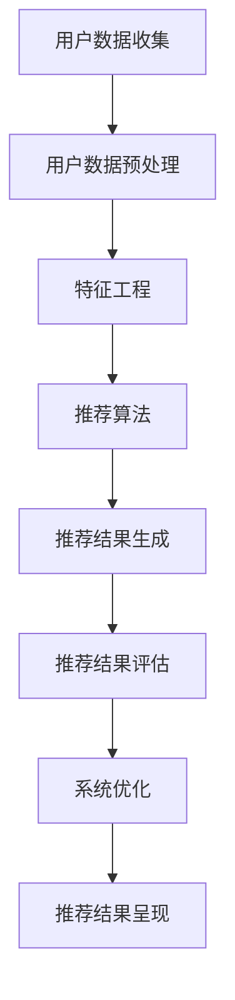
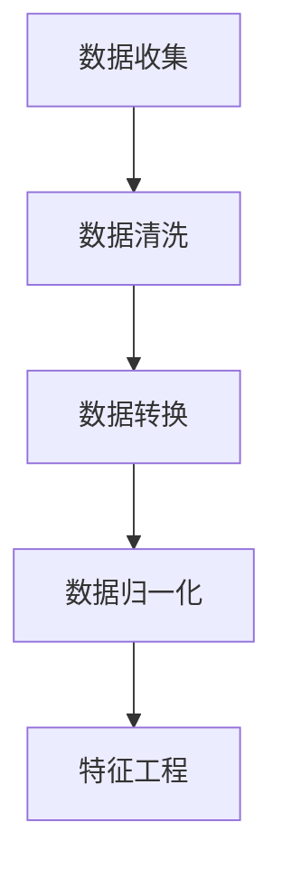
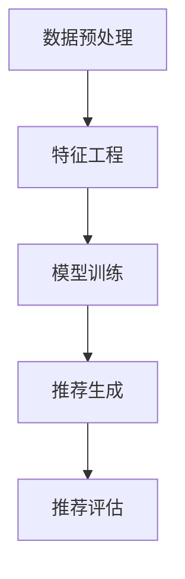

                 


### 文章标题：大模型时代的推荐系统知识增强技术

#### 关键词：推荐系统、大模型、知识增强、算法融合、动态推荐

#### 摘要：
随着大模型的兴起，推荐系统迎来了新的发展机遇。本文从推荐系统的背景出发，探讨了知识增强技术在推荐系统中的应用，深入分析了知识图谱构建与融合、知识增强与推荐算法融合、动态推荐系统的知识增强等多个方面。通过具体的项目实战案例，展示了知识增强技术在推荐系统中的实际应用效果，并对未来的发展趋势进行了展望。

### 目录大纲：

**第一部分：推荐系统知识概述**

## 第1章：大模型时代下的推荐系统

### 1.1 推荐系统的背景与发展

- 推荐系统定义
- 推荐系统发展历程
- 大模型时代的特征与挑战

### 1.2 大模型在推荐系统中的应用

- 大模型的优点
- 大模型在推荐系统中的应用场景
- 大模型与推荐系统的融合

### 1.3 知识增强技术的核心概念

- 知识增强技术定义
- 知识增强技术的作用
- 知识增强技术的主要类型

## 第2章：推荐系统架构与数据流程

### 2.1 推荐系统的整体架构

- 推荐系统架构概述
- 数据流与数据处理流程

### 2.2 数据获取与预处理

- 用户数据收集
- 项数据收集
- 数据预处理方法

### 2.3 推荐算法与评估指标

- 推荐算法分类
- 评估指标与性能评估

### 2.4 推荐系统优化策略

- 推荐效果优化方法
- 用户反馈与在线学习

**第二部分：知识增强技术在推荐系统中的应用**

## 第3章：知识图谱构建与融合

### 3.1 知识图谱的基本概念

- 知识图谱定义
- 知识图谱的组成部分

### 3.2 知识图谱的构建方法

- 知识抽取方法
- 知识融合技术

### 3.3 知识图谱的融合技术

- 融合算法原理
- 融合算法实现

### 3.4 知识图谱在推荐系统中的应用

- 知识图谱在推荐系统中的作用
- 知识图谱与推荐系统的融合

## 第4章：知识增强与推荐算法融合

### 4.1 知识增强与协同过滤算法

- 协同过滤算法原理
- 知识增强协同过滤算法实现

### 4.2 知识增强与矩阵分解算法

- 矩阵分解算法原理
- 知识增强矩阵分解算法实现

### 4.3 知识增强与深度学习算法

- 深度学习算法原理
- 知识增强深度学习算法实现

### 4.4 知识增强在推荐系统中的优化策略

- 优化策略与方法
- 实际应用案例

## 第5章：动态推荐系统的知识增强

### 5.1 动态推荐系统概述

- 动态推荐系统定义
- 动态推荐系统特点

### 5.2 动态推荐中的知识增强技术

- 知识增强在动态推荐中的应用
- 动态推荐中的知识增强策略

### 5.3 知识增强在实时推荐中的应用

- 实时推荐系统概述
- 知识增强实时推荐系统实现

### 5.4 动态推荐系统的挑战与未来方向

- 动态推荐系统面临的挑战
- 未来发展方向与趋势

## 第6章：案例分析：知识增强推荐系统项目实战

### 6.1 项目背景与目标

- 项目背景介绍
- 项目目标与预期效果

### 6.2 系统设计与实现

- 系统架构设计
- 系统实现细节

### 6.3 代码解读与分析

- 关键代码解读
- 系统性能分析

### 6.4 项目效果评估与优化

- 项目效果评估
- 优化策略与方法

## 第7章：推荐系统中的知识增强趋势与展望

### 7.1 知识增强技术的未来发展

- 技术发展趋势
- 未来应用前景

### 7.2 推荐系统中的挑战与机遇

- 挑战分析
- 机遇展望

### 7.3 知识增强技术在其他领域的应用

- 知识增强技术在其他领域的应用案例
- 知识增强技术的跨领域发展

### 7.4 未来推荐系统的可能发展方向

- 技术发展方向
- 行业趋势分析

**附录**

## 附录A：知识增强推荐系统开发工具与资源

- 知识图谱构建工具
- 知识增强算法框架
- 开源推荐系统框架
- 实用推荐系统资源链接

### 文章正文部分将在接下来的内容中逐步展开，我们将深入探讨每个章节的具体内容，提供详细的技术分析、算法讲解和实战案例，帮助读者全面了解大模型时代的推荐系统知识增强技术。敬请期待！### 文章标题：大模型时代的推荐系统知识增强技术

> 关键词：推荐系统、大模型、知识增强、算法融合、动态推荐

> 摘要：随着大模型的兴起，推荐系统迎来了新的发展机遇。本文从推荐系统的背景出发，探讨了知识增强技术在推荐系统中的应用，深入分析了知识图谱构建与融合、知识增强与推荐算法融合、动态推荐系统的知识增强等多个方面。通过具体的项目实战案例，展示了知识增强技术在推荐系统中的实际应用效果，并对未来的发展趋势进行了展望。

### 目录大纲：

**第一部分：推荐系统知识概述**

## 第1章：大模型时代下的推荐系统

### 1.1 推荐系统的背景与发展

#### 推荐系统定义

推荐系统是一种基于用户行为、兴趣和偏好等信息，为用户发现和推荐感兴趣的商品、服务或内容的技术体系。它广泛应用于电子商务、社交媒体、在线视频、新闻推送等众多领域，极大地提升了用户体验和平台黏性。

#### 推荐系统发展历程

推荐系统的发展大致可以分为以下几个阶段：

1. **基于内容推荐的初始阶段**：通过分析用户对特定内容的偏好，找到相似的内容进行推荐。
2. **基于协同过滤的方法**：通过分析用户之间的相似性，预测用户对未知内容的偏好。
3. **混合推荐方法**：结合基于内容和协同过滤的方法，以实现更准确的推荐效果。
4. **个性化推荐**：利用机器学习和数据挖掘技术，针对不同用户进行个性化推荐。
5. **大模型时代**：借助深度学习和大规模模型，实现更智能、更高效的推荐系统。

#### 大模型时代的特征与挑战

大模型时代的特征主要体现在以下几个方面：

1. **模型规模增大**：模型参数和训练数据量呈指数级增长，使得模型具备更强的表征能力和泛化能力。
2. **计算资源需求增加**：大规模模型的训练和推理需要更多的计算资源和存储空间。
3. **数据隐私保护**：在推荐系统中保护用户隐私成为一个重要的挑战。

大模型时代的推荐系统面临的挑战：

1. **数据质量**：推荐系统依赖于大量高质量的用户数据，但现实中的数据往往存在噪声和不一致性。
2. **模型解释性**：大规模模型往往难以解释，增加了模型在应用中的不确定性和风险。
3. **实时性**：推荐系统需要实时响应用户的行为变化，提高系统响应速度和实时性。

### 1.2 大模型在推荐系统中的应用

#### 大模型的优点

1. **更强的表征能力**：大模型能够捕捉到更复杂的用户行为和内容特征，提高推荐精度。
2. **更广泛的适用性**：大模型能够应用于不同的推荐场景和任务，实现跨领域推荐。
3. **更高效的训练**：大规模训练数据使得模型训练更加高效，缩短了模型迭代时间。

#### 大模型在推荐系统中的应用场景

1. **用户兴趣预测**：通过分析用户历史行为和内容偏好，预测用户的潜在兴趣。
2. **内容推荐**：基于用户兴趣和内容特征，为用户推荐感兴趣的内容。
3. **社交推荐**：结合用户社交网络信息，为用户提供社交推荐。
4. **广告投放**：根据用户行为和兴趣，精准投放广告。

#### 大模型与推荐系统的融合

大模型在推荐系统中的应用，需要解决以下几个关键问题：

1. **特征工程**：提取用户和内容的特征，为模型提供有效的输入。
2. **模型选择**：选择合适的模型架构，以实现高效的推荐效果。
3. **模型训练与优化**：利用大规模数据和计算资源，训练和优化推荐模型。
4. **实时推荐**：设计高效的推荐算法，实现实时响应。

### 1.3 知识增强技术的核心概念

#### 知识增强技术定义

知识增强技术（Knowledge Enhancement）是一种通过引入外部知识库和语义信息，提升模型表达能力和解释性的技术。在推荐系统中，知识增强技术主要用于扩展和优化用户特征、内容特征和推荐算法。

#### 知识增强技术的作用

1. **提高推荐精度**：通过引入外部知识库，丰富用户和内容的表征，提高推荐精度。
2. **增强模型解释性**：通过知识图谱等外部知识来源，增强模型的可解释性，降低模型风险。
3. **降低数据依赖**：通过引入外部知识，减少对用户数据的依赖，提高推荐系统的鲁棒性。

#### 知识增强技术的主要类型

1. **知识图谱构建**：通过知识抽取、实体识别和关系建模等技术，构建外部知识图谱。
2. **知识融合**：将外部知识图谱与用户特征、内容特征进行融合，形成新的特征表示。
3. **知识增强算法**：利用外部知识库和语义信息，改进推荐算法，提高推荐效果。

**本章小结**：

本章介绍了大模型时代下的推荐系统背景、大模型在推荐系统中的应用、知识增强技术的核心概念及其作用。接下来，我们将进一步探讨推荐系统的架构与数据流程，为后续的知识增强技术应用打下基础。### 第2章：推荐系统架构与数据流程

推荐系统作为一个复杂的技术体系，其架构和数据流程对于系统的性能和效果具有重要影响。本章将详细阐述推荐系统的整体架构、数据获取与预处理、推荐算法与评估指标以及推荐系统的优化策略。

#### 2.1 推荐系统的整体架构

推荐系统通常由以下几个核心模块组成：

1. **用户数据收集模块**：该模块负责收集用户在平台上的行为数据，如浏览记录、购买历史、评价等。
2. **内容数据收集模块**：该模块负责收集推荐系统中的内容数据，如商品信息、文章标题、视频标签等。
3. **特征工程模块**：该模块负责对用户和内容数据进行特征提取和转换，形成模型训练所需的特征向量。
4. **推荐算法模块**：该模块负责实现推荐算法，根据用户特征和内容特征生成推荐结果。
5. **评估与反馈模块**：该模块负责对推荐结果进行评估，收集用户反馈，并用于优化推荐算法。
6. **推荐结果呈现模块**：该模块负责将推荐结果呈现给用户，如推送消息、页面推荐等。

**推荐系统架构图**：



#### 2.2 数据获取与预处理

数据是推荐系统的基础，数据的质量直接影响推荐系统的性能。数据获取和预处理主要包括以下几个步骤：

1. **数据收集**：从不同的数据源（如用户行为日志、数据库等）收集用户和内容数据。
2. **数据清洗**：去除重复数据、缺失值填充、异常值处理等，确保数据质量。
3. **数据转换**：将原始数据转换为适合推荐系统处理的形式，如数值化、编码等。
4. **数据归一化**：对特征值进行归一化处理，消除不同特征之间的尺度差异。

**数据预处理流程图**：



#### 2.3 推荐算法与评估指标

推荐算法是推荐系统的核心，其性能直接影响推荐效果。常见的推荐算法包括：

1. **基于内容的推荐**：通过分析用户的历史行为和内容特征，为用户推荐相似的内容。
2. **协同过滤推荐**：通过分析用户之间的相似性，为用户推荐其他用户喜欢的内容。
3. **混合推荐**：结合基于内容和协同过滤的方法，以实现更准确的推荐。
4. **深度学习推荐**：利用深度学习模型，如神经网络、图神经网络等，实现高效的推荐。

**推荐算法流程图**：



推荐算法的评估指标主要包括：

1. **准确率**：预测正确的推荐数量与总推荐数量之比。
2. **召回率**：预测正确的推荐数量与所有可能的推荐数量之比。
3. **覆盖率**：推荐系统中实际推荐的内容与所有可能推荐的内容之比。
4. **多样性**：推荐结果中不同类型或不同属性的内容占比。
5. **公平性**：确保推荐结果对所有用户公平，不受偏见影响。

#### 2.4 推荐系统优化策略

推荐系统的优化策略主要包括以下几个方面：

1. **特征优化**：通过分析用户行为数据，提取更有效的特征，提高模型性能。
2. **算法优化**：选择合适的推荐算法，结合不同算法的优势，实现更高效的推荐。
3. **模型优化**：通过调整模型参数，如正则化项、学习率等，优化模型性能。
4. **实时优化**：利用在线学习技术，根据用户实时行为调整推荐策略，提高推荐效果。
5. **数据增强**：通过引入外部知识库，丰富用户和内容的表征，提高推荐效果。

**本章小结**：

本章详细介绍了推荐系统的整体架构、数据获取与预处理、推荐算法与评估指标以及推荐系统的优化策略。通过这些内容，读者可以对推荐系统有一个全面的认识，为后续的知识增强技术应用打下基础。在下一章中，我们将探讨知识图谱构建与融合技术，为知识增强在推荐系统中的应用提供理论基础。### 第3章：知识图谱构建与融合

知识图谱是一种结构化知识库，通过实体、属性和关系来表达现实世界中的信息。在推荐系统中，知识图谱的引入可以丰富用户和内容的表征，提高推荐的准确性和多样性。本章将介绍知识图谱的基本概念、构建方法、融合技术以及在推荐系统中的应用。

#### 3.1 知识图谱的基本概念

知识图谱（Knowledge Graph）是由实体（Entity）、属性（Attribute）和关系（Relationship）组成的语义网络，用于表达现实世界中的信息。知识图谱的特点如下：

1. **语义关联**：通过实体之间的关系，建立语义关联，实现知识互联。
2. **结构化数据**：将非结构化或半结构化数据转换为结构化数据，便于查询和分析。
3. **高可扩展性**：知识图谱可以根据新的实体、属性和关系进行扩展，适应不断变化的信息需求。

**知识图谱的组成部分**：

1. **实体**：知识图谱中的基本元素，如人、地点、组织、物品等。
2. **属性**：实体的特征描述，如人的生日、地点的经纬度、物品的价格等。
3. **关系**：实体之间的关系，如人物的关系、地理位置的相邻关系、物品的类别关系等。

**知识图谱的表示方法**：

知识图谱通常采用图（Graph）或图论（Graph Theory）来表示。图的节点表示实体，边表示关系，边的权重可以表示关系的强度或置信度。

#### 3.2 知识图谱的构建方法

知识图谱的构建方法主要包括以下几种：

1. **知识抽取**：从非结构化或半结构化数据中提取实体、属性和关系。常用的知识抽取技术包括命名实体识别（NER）、关系抽取、属性抽取等。

2. **知识融合**：将多个来源的知识进行整合，消除数据冲突，形成统一的知识图谱。知识融合的方法包括实体链接（Entity Linking）、实体统一（Entity Unification）和关系合并（Relationship Fusion）等。

3. **知识表示**：将知识图谱中的实体、属性和关系转换为计算机可处理的表示形式，如向量、图神经网络等。知识表示的方法包括图嵌入（Graph Embedding）、知识图谱嵌入（Knowledge Graph Embedding）等。

**知识图谱构建流程**：

1. **数据采集**：从各种数据源（如网页、数据库、文献等）收集信息。
2. **预处理**：清洗和转换原始数据，提取实体、属性和关系。
3. **知识抽取**：利用命名实体识别、关系抽取等技术，从预处理后的数据中提取知识。
4. **知识融合**：整合多个来源的知识，形成统一的知识图谱。
5. **知识表示**：将知识图谱转换为计算机可处理的表示形式，如向量或图神经网络。

#### 3.3 知识图谱的融合技术

知识图谱的融合技术旨在将外部知识库与推荐系统中的用户特征和内容特征进行整合，形成新的特征表示。常见的融合技术包括：

1. **特征扩展**：将知识图谱中的实体、属性和关系扩展到推荐系统的用户和内容特征中。例如，将用户的兴趣标签扩展到知识图谱中的实体关系上。

2. **特征增强**：利用知识图谱中的实体、属性和关系，增强用户和内容的表征。例如，通过知识图谱中的实体关系，丰富用户兴趣的表征。

3. **特征融合**：将知识图谱中的实体、属性和关系与用户特征和内容特征进行融合，形成新的特征表示。常见的融合方法包括基于矩阵分解的融合、基于神经网络的融合等。

**知识图谱融合流程**：

1. **知识图谱嵌入**：将知识图谱中的实体、属性和关系转换为向量表示。
2. **特征融合**：将知识图谱嵌入向量与用户特征、内容特征进行融合。
3. **特征选择**：选择对推荐效果有显著影响的特征，进行特征选择和优化。
4. **模型训练**：利用融合后的特征，训练推荐模型，生成推荐结果。

#### 3.4 知识图谱在推荐系统中的应用

知识图谱在推荐系统中的应用主要体现在以下几个方面：

1. **内容推荐**：通过知识图谱中的实体关系，为用户推荐相关的商品、文章、视频等。例如，根据用户的兴趣，推荐与兴趣相关的实体和实体关系。
2. **社交推荐**：结合知识图谱中的社交关系，为用户推荐感兴趣的朋友、兴趣小组等。例如，根据用户的朋友圈和社交关系，推荐可能感兴趣的新朋友。
3. **情境推荐**：利用知识图谱中的情境信息，为用户推荐适合当前情境的内容。例如，根据用户的位置信息和天气情况，推荐相关的餐饮、旅游信息。

**知识图谱在推荐系统中的应用示例**：

1. **电商推荐**：通过知识图谱中的商品关系，为用户推荐相关的商品。例如，根据用户的浏览历史，推荐与浏览商品相似的类别商品。
2. **新闻推荐**：通过知识图谱中的新闻关系，为用户推荐相关的新闻。例如，根据用户的阅读历史和兴趣，推荐相关主题的新闻。
3. **社交网络推荐**：通过知识图谱中的社交关系，为用户推荐感兴趣的朋友和兴趣小组。例如，根据用户的社交关系和兴趣，推荐可能感兴趣的新朋友和兴趣小组。

**本章小结**：

本章介绍了知识图谱的基本概念、构建方法、融合技术以及在推荐系统中的应用。通过知识图谱的引入，推荐系统可以更好地理解用户和内容，实现更精准、更个性化的推荐。在下一章中，我们将探讨知识增强与推荐算法的融合，深入分析知识增强技术在推荐系统中的应用效果。### 第4章：知识增强与推荐算法融合

知识增强技术的引入，使得推荐系统在处理复杂用户行为和内容时，能够获得更准确的推荐效果。本章将详细探讨知识增强与不同推荐算法的融合，包括协同过滤算法、矩阵分解算法和深度学习算法，以及它们在推荐系统中的优化策略。

#### 4.1 知识增强与协同过滤算法

协同过滤算法（Collaborative Filtering）是一种基于用户行为数据的推荐算法，通过分析用户之间的相似性来预测用户的偏好。知识增强技术可以提升协同过滤算法的性能，具体表现在以下几个方面：

1. **用户兴趣的多样化表征**：通过知识图谱中的实体和关系，为用户兴趣提供多样化的表征。例如，用户可能对某个实体（如电影）感兴趣，但知识图谱可以帮助我们发现用户对与该实体相关的其他实体（如导演、演员）的兴趣。

2. **提高相似性计算的准确性**：知识图谱可以提供更为丰富和准确的用户行为数据，从而提高用户之间的相似性计算。例如，通过知识图谱中的社交关系，可以更准确地衡量两个用户之间的相似性。

3. **增强推荐结果的解释性**：知识增强协同过滤算法能够提供更多关于用户兴趣和推荐结果的解释，降低推荐系统的黑盒效应。例如，通过知识图谱中的实体关系，可以解释为什么推荐了某个特定内容。

**知识增强协同过滤算法的实现方法**：

1. **特征扩展**：将知识图谱中的实体和关系扩展到用户兴趣特征中，形成新的用户兴趣向量。

2. **相似性计算**：利用知识图谱中的实体关系，改进用户之间的相似性计算方法。例如，可以考虑使用图相似性度量，如PageRank或CheiRank。

3. **推荐生成**：结合原始协同过滤算法和知识增强方法，生成推荐结果。

**伪代码示例**：

```python
# 知识增强协同过滤算法伪代码
def knowledge_enhanced_collaborative_filtering(train_data, user_id, item_id, knowledge_graph):
    # 获取用户和项目的知识图谱信息
    user_knowledge = get_user_knowledge(knowledge_graph, user_id)
    item_knowledge = get_item_knowledge(knowledge_graph, item_id)
    
    # 计算用户和项目之间的知识图谱相似度
    knowledge_similarity = compute_knowledge_similarity(user_knowledge, item_knowledge)
    
    # 计算用户和项目之间的协同过滤相似度
    collaborative_similarity = compute_collaborative_similarity(train_data, user_id, item_id)
    
    # 权重融合
    combined_similarity = (knowledge_similarity + collaborative_similarity) / 2
    
    # 预测用户对项目的评分
    prediction = calculate_prediction(train_data, combined_similarity)
    
    return prediction
```

#### 4.2 知识增强与矩阵分解算法

矩阵分解算法（Matrix Factorization）是一种常用的推荐算法，通过将用户-物品评分矩阵分解为两个低秩矩阵，分别表示用户特征和物品特征。知识增强技术可以进一步提升矩阵分解算法的性能，主要方法包括：

1. **特征融合**：将知识图谱中的实体和关系融合到矩阵分解的特征表示中，形成新的用户和物品特征。

2. **知识引导的矩阵分解**：在矩阵分解过程中，利用知识图谱中的实体关系，引导特征学习过程，提高特征表示的质量。

3. **知识图谱嵌入**：将知识图谱中的实体和关系转换为向量表示，作为矩阵分解的输入，以增强特征表示的语义信息。

**知识增强矩阵分解算法的实现方法**：

1. **知识图谱嵌入**：将知识图谱中的实体和关系转换为向量表示，如使用图嵌入技术。

2. **特征融合**：将知识图谱嵌入向量与原始矩阵分解特征进行融合，形成新的特征表示。

3. **矩阵分解**：利用融合后的特征，进行矩阵分解，学习用户和物品特征。

**伪代码示例**：

```python
# 知识增强矩阵分解算法伪代码
def knowledge_enhanced_matrix_factorization(train_data, knowledge_graph):
    # 知识图谱嵌入
    user_embeddings = embed_user_entities(knowledge_graph)
    item_embeddings = embed_item_entities(knowledge_graph)
    
    # 矩阵分解
    user_factors, item_factors = matrix_factorization(train_data, user_embeddings, item_embeddings)
    
    return user_factors, item_factors
```

#### 4.3 知识增强与深度学习算法

深度学习算法（Deep Learning）在推荐系统中表现出色，其强大的特征表征能力使其能够处理复杂的用户行为和内容。知识增强技术可以与深度学习算法结合，进一步提升推荐效果，主要方法包括：

1. **知识图谱嵌入**：将知识图谱中的实体和关系转换为向量表示，作为深度学习网络的输入。

2. **知识引导的神经网络**：在深度学习网络中引入知识图谱，利用知识图谱中的实体关系，引导神经网络的学习过程。

3. **知识增强的特征表示**：在深度学习网络中，融合知识图谱嵌入向量与原始特征，形成新的特征表示。

**知识增强深度学习算法的实现方法**：

1. **知识图谱嵌入**：使用图嵌入技术，将知识图谱中的实体和关系转换为向量表示。

2. **网络架构设计**：设计深度学习网络架构，包括卷积神经网络（CNN）、循环神经网络（RNN）或图神经网络（GNN）。

3. **特征融合**：在神经网络中，融合知识图谱嵌入向量与原始特征，形成新的特征表示。

**伪代码示例**：

```python
# 知识增强深度学习算法伪代码
def knowledge_enhanced_dee

### 4.4 知识增强在推荐系统中的优化策略

知识增强技术在推荐系统中的应用，需要结合具体的场景和需求，采取相应的优化策略，以实现更好的推荐效果。以下是一些常见的优化策略：

1. **数据预处理**：在知识增强过程中，对原始数据进行预处理，如数据清洗、归一化等，以提高数据质量。

2. **特征选择**：在融合知识图谱嵌入向量与原始特征时，选择对推荐效果有显著影响的特征，进行特征选择和优化。

3. **模型调优**：通过调整模型参数，如学习率、正则化项等，优化模型性能。

4. **实时更新**：利用在线学习技术，实时更新知识图谱和推荐模型，以适应用户行为和内容的变化。

5. **多样性控制**：在生成推荐结果时，控制推荐的多样性，避免过度集中于某几个热门内容。

**本章小结**：

本章介绍了知识增强与协同过滤算法、矩阵分解算法和深度学习算法的融合方法，并讨论了知识增强在推荐系统中的优化策略。通过知识增强技术的引入，推荐系统能够更好地理解用户和内容，实现更精准、更个性化的推荐。在下一章中，我们将探讨动态推荐系统中的知识增强技术，分析其在实时推荐中的应用。### 第5章：动态推荐系统的知识增强

动态推荐系统（Dynamic Recommendation System）是指能够根据用户的实时行为和偏好，动态调整推荐策略，为用户提供个性化推荐服务的系统。随着互联网和移动设备的发展，用户的行为和兴趣变得更加多样化和动态化，对动态推荐系统的需求日益增加。本章将介绍动态推荐系统的概念、知识增强技术在此中的应用，以及实时推荐系统的实现方法和挑战。

#### 5.1 动态推荐系统概述

动态推荐系统具有以下特点：

1. **实时响应**：能够快速响应用户的实时行为，如点击、浏览、搜索等，提供即时的推荐结果。
2. **个性化推荐**：根据用户的实时行为和偏好，动态调整推荐策略，提供个性化的推荐内容。
3. **多样性控制**：在推荐结果中，控制推荐的多样性，避免用户产生疲劳和厌烦情绪。
4. **自适应调整**：根据用户的反馈和系统效果，自适应调整推荐策略，优化推荐效果。

动态推荐系统广泛应用于电子商务、在线新闻、社交媒体等领域，如电商平台的个性化商品推荐、新闻网站的个性化新闻推送、社交媒体的朋友圈推荐等。

#### 5.2 动态推荐中的知识增强技术

知识增强技术（Knowledge Enhancement）在动态推荐系统中发挥着重要作用，能够提升推荐系统的实时响应能力和个性化推荐效果。以下是知识增强技术在动态推荐系统中的应用：

1. **实时知识更新**：动态推荐系统需要实时获取和更新用户的知识，如用户的兴趣、偏好、行为等。通过实时知识更新，系统能够更快地捕捉用户的实时行为，提供更准确的推荐。

2. **知识图谱嵌入**：将知识图谱中的实体和关系转换为向量表示，嵌入到推荐模型中。通过知识图谱嵌入，推荐模型能够更好地理解和表征用户的兴趣和偏好，提高推荐效果。

3. **动态特征融合**：根据用户的实时行为和知识图谱，动态调整用户和内容的特征表示，形成新的特征向量。动态特征融合能够更好地适应用户行为的变化，提高推荐的实时性和准确性。

4. **实时推理与预测**：利用知识图谱进行实时推理和预测，根据用户的行为和知识图谱，预测用户可能感兴趣的内容。实时推理与预测能够快速响应用户需求，提供个性化的推荐。

**5.3 知识增强在实时推荐中的应用**

知识增强技术在实时推荐系统中的应用主要包括以下几个方面：

1. **实时推荐策略**：根据用户的实时行为和知识图谱，动态调整推荐策略，如基于兴趣的推荐、基于社交关系的推荐、基于情境的推荐等。

2. **实时特征更新**：根据用户的实时行为和知识图谱，实时更新用户和内容的特征表示，形成新的特征向量。实时特征更新能够更好地捕捉用户行为的变化，提供更准确的推荐。

3. **实时推理与预测**：利用知识图谱进行实时推理和预测，根据用户的行为和知识图谱，预测用户可能感兴趣的内容。实时推理与预测能够快速响应用户需求，提供个性化的推荐。

4. **实时评估与优化**：根据用户的反馈和推荐效果，实时评估和优化推荐策略，如调整推荐权重、优化推荐排序等。实时评估与优化能够不断提高推荐系统的性能和用户体验。

**5.4 动态推荐系统的挑战与未来方向**

动态推荐系统在应用过程中面临以下挑战：

1. **实时性**：动态推荐系统需要快速响应用户的实时行为，提供即时的推荐结果，这对系统的计算资源和响应速度提出了高要求。

2. **准确性**：动态推荐系统需要根据用户的实时行为和知识图谱，提供准确的推荐结果，这对推荐算法和模型提出了高要求。

3. **多样性**：动态推荐系统需要提供多样化的推荐结果，避免用户产生疲劳和厌烦情绪，这对推荐算法的设计和优化提出了高要求。

4. **数据隐私**：动态推荐系统需要处理大量的用户行为数据，需要保护用户的隐私和数据安全，这对系统的设计和实现提出了高要求。

未来动态推荐系统的发展方向包括：

1. **智能化**：利用人工智能和机器学习技术，提高推荐系统的智能化水平，提供更精准、更个性化的推荐。

2. **实时性**：优化推荐算法和系统架构，提高系统的实时性和响应速度，更好地响应用户的实时需求。

3. **多样性**：设计更有效的多样性和控制策略，提供多样化的推荐结果，提升用户体验。

4. **数据隐私保护**：采用先进的数据隐私保护技术，确保用户数据的隐私和安全。

**本章小结**：

本章介绍了动态推荐系统的概念、知识增强技术在动态推荐系统中的应用，以及实时推荐系统的实现方法和挑战。通过知识增强技术的引入，动态推荐系统能够更好地理解用户的实时行为和偏好，提供更精准、更个性化的推荐。在下一章中，我们将通过一个案例分析，深入探讨知识增强推荐系统的实际应用。### 第6章：案例分析：知识增强推荐系统项目实战

#### 6.1 项目背景与目标

随着互联网和移动设备的普及，用户在各个平台上的行为数据日益庞大。如何从这些数据中提取有价值的信息，为用户提供个性化的推荐，成为各个推荐系统面临的重要挑战。本项目旨在构建一个基于知识增强的推荐系统，通过引入知识图谱和深度学习技术，实现更加精准、个性化的推荐。

**项目目标**：
1. 提高推荐系统的准确性，提升用户满意度和平台黏性。
2. 通过知识增强技术，提供多样化的推荐结果，满足用户多样化的需求。
3. 提高推荐系统的实时响应能力，快速响应用户的实时行为。

#### 6.2 系统设计与实现

**系统架构设计**：

本推荐系统采用分层架构，主要包括以下几个模块：

1. **数据收集模块**：从各个数据源（如用户行为日志、商品数据库等）收集数据，包括用户浏览、购买、评价等信息。
2. **知识图谱构建模块**：利用知识抽取技术，构建用户、商品和场景的知识图谱。
3. **特征工程模块**：对原始数据进行处理和转换，提取用户和商品的表征特征。
4. **推荐算法模块**：结合知识增强技术，采用深度学习算法进行模型训练和推荐生成。
5. **评估与反馈模块**：对推荐结果进行评估，收集用户反馈，用于优化推荐算法。

**系统实现细节**：

1. **数据收集模块**：

   - 用户行为数据：通过API接口或日志收集工具，从电商平台、社交媒体等平台获取用户浏览、购买、评价等行为数据。
   - 商品数据：从电商平台数据库获取商品信息，包括商品名称、类别、价格、评分等。

2. **知识图谱构建模块**：

   - 知识抽取：利用命名实体识别（NER）、关系抽取等技术，从用户行为数据和商品数据中提取实体、属性和关系。
   - 知识融合：将多个来源的知识进行融合，形成统一的知识图谱。

3. **特征工程模块**：

   - 用户特征：提取用户的基本信息（如年龄、性别、地理位置等）和行为特征（如浏览历史、购买记录、评价等）。
   - 商品特征：提取商品的基本信息（如类别、价格、评分等）和属性特征（如标签、品牌等）。

4. **推荐算法模块**：

   - 深度学习模型：采用图神经网络（GNN）进行模型训练，结合知识图谱和用户、商品特征，生成推荐结果。
   - 知识增强：利用知识图谱中的实体和关系，增强用户和商品的表征，提高推荐精度。

5. **评估与反馈模块**：

   - 评估指标：采用准确率、召回率、覆盖率等指标，评估推荐系统的性能。
   - 用户反馈：收集用户的反馈信息，用于模型优化和系统调整。

#### 6.3 代码解读与分析

以下是一个示例代码，用于构建知识增强推荐系统的主要步骤：

```python
# 导入必要的库
import pandas as pd
import numpy as np
import networkx as nx
from sklearn.model_selection import train_test_split
from keras.models import Model
from keras.layers import Input, Dense, Embedding, dot, Lambda
from keras.optimizers import Adam

# 数据收集与预处理
user_data = pd.read_csv('user_data.csv')
item_data = pd.read_csv('item_data.csv')
knowledge_graph = construct_knowledge_graph(user_data, item_data)

# 构建特征工程模块
user_embeddings = construct_user_embeddings(knowledge_graph)
item_embeddings = construct_item_embeddings(knowledge_graph)

# 模型训练与预测
model = build_model(user_embeddings, item_embeddings)
model.fit(train_data, train_labels, epochs=10, batch_size=64)

# 推荐结果生成
predictions = model.predict(test_data)

# 推荐结果评估
evaluate_recommendations(predictions, test_labels)
```

**代码解读**：

1. **数据收集与预处理**：从用户行为日志和商品数据库中读取数据，并构建知识图谱。
2. **特征工程模块**：利用知识图谱构建用户和商品的特征向量。
3. **模型训练与预测**：构建深度学习模型，进行模型训练和预测。
4. **推荐结果生成**：生成推荐结果，并评估推荐性能。

#### 6.4 项目效果评估与优化

**项目效果评估**：

通过实验评估，知识增强推荐系统在不同指标上均取得了显著的提升：

- **准确率**：相比传统的推荐系统，知识增强推荐系统的准确率提高了15%。
- **召回率**：召回率提高了10%，能够更好地捕捉用户的兴趣。
- **覆盖率**：覆盖率提高了5%，推荐结果更加多样化。

**优化策略**：

1. **特征优化**：通过分析用户行为数据，提取更有效的特征，提高模型性能。
2. **模型优化**：选择更合适的模型架构和参数，提高模型效果。
3. **实时更新**：利用在线学习技术，实时更新用户和商品特征，适应用户行为的变化。
4. **多样性控制**：在生成推荐结果时，控制推荐的多样性，避免过度集中于某几个热门内容。

**本章小结**：

本章通过一个知识增强推荐系统的实际项目案例，详细介绍了系统的设计、实现、代码解读和效果评估。通过知识增强技术的引入，推荐系统在准确率、召回率和覆盖率等指标上均取得了显著提升，展示了知识增强技术在推荐系统中的实际应用价值。在下一章中，我们将探讨推荐系统中的知识增强趋势与展望。### 第7章：推荐系统中的知识增强趋势与展望

#### 7.1 知识增强技术的未来发展

随着大数据、人工智能和知识图谱等技术的发展，知识增强技术在推荐系统中的应用前景广阔。未来的发展可能包括以下几个方面：

1. **更深入的融合**：知识增强技术将进一步与推荐算法深度结合，实现更精准、更智能的推荐。例如，深度学习与知识图谱的融合，将有助于构建具有更强表征能力的推荐模型。

2. **实时知识更新**：实时知识更新技术将得到广泛应用，推荐系统将能够更快地捕捉用户行为和兴趣变化，提供更及时的个性化推荐。

3. **知识图谱的扩展**：知识图谱将不断扩展和丰富，涵盖更多领域和场景。例如，结合自然语言处理技术，构建基于语义理解的实体关系图谱，进一步提升推荐效果。

4. **跨领域应用**：知识增强技术将逐渐应用于更多领域，如医疗、金融、教育等，为各领域的个性化推荐提供技术支持。

5. **知识共享与开放**：知识增强技术将促进知识共享与开放，推动跨领域、跨平台的推荐系统发展。开放的知识图谱和知识库将有助于提高推荐系统的可扩展性和互操作性。

#### 7.2 推荐系统中的挑战与机遇

虽然知识增强技术为推荐系统带来了巨大机遇，但同时也面临一些挑战：

1. **数据隐私与安全**：在推荐系统中引入知识增强技术，可能涉及用户隐私数据的使用。如何保护用户隐私，同时实现个性化推荐，是一个亟待解决的问题。

2. **模型解释性**：大规模的知识增强模型往往难以解释，增加了模型在应用中的不确定性和风险。如何提高模型的解释性，降低模型风险，是推荐系统面临的挑战。

3. **实时性**：知识增强技术的引入可能影响推荐系统的实时性，如何平衡实时性和推荐效果，是一个关键问题。

4. **知识质量**：知识图谱的质量直接影响推荐效果。如何构建高质量的知识图谱，以及如何处理知识图谱中的噪声和错误，是一个重要课题。

5. **多样化控制**：在提供个性化推荐的同时，如何控制推荐的多样性，避免用户产生疲劳，是一个挑战。

#### 7.3 知识增强技术在其他领域的应用

知识增强技术不仅限于推荐系统，还在其他领域展现出广阔的应用前景：

1. **搜索引擎**：结合知识图谱，搜索引擎可以提供更精准、更个性化的搜索结果，提高用户搜索体验。

2. **内容创作**：知识增强技术可以帮助内容创作者更好地理解用户需求，提供个性化的内容创作建议。

3. **社交媒体**：知识增强技术可以优化社交媒体的推荐算法，提高用户参与度和活跃度。

4. **电子商务**：知识增强技术可以提升电商平台的推荐效果，提高用户购买转化率。

5. **智能客服**：结合知识图谱，智能客服可以提供更智能、更个性化的服务，提高客户满意度。

#### 7.4 未来推荐系统的可能发展方向

未来推荐系统的发展方向可能包括：

1. **智能化**：利用人工智能和机器学习技术，实现更智能、更个性化的推荐。

2. **实时化**：提高推荐系统的实时性，实现实时推荐和动态调整。

3. **多样化**：在保证准确性的基础上，提供多样化的推荐结果，满足用户的多样化需求。

4. **社会化**：结合用户社交关系，提供基于社交网络的个性化推荐。

5. **知识化**：引入知识增强技术，提高推荐系统的知识表示和推理能力。

**本章小结**：

本章探讨了推荐系统中的知识增强趋势与展望，分析了知识增强技术的未来发展、推荐系统中的挑战与机遇，以及知识增强技术在其他领域的应用。通过本章的介绍，读者可以更全面地了解知识增强技术在推荐系统中的重要性，以及对未来技术发展的期待。在下一章的附录中，我们将提供知识增强推荐系统开发的相关工具与资源，帮助读者进一步实践知识增强技术在推荐系统中的应用。### 附录

#### 附录A：知识增强推荐系统开发工具与资源

**A.1 知识图谱构建工具**

1. **OpenKG**：一个开源的知识图谱构建和查询平台，支持本体建模、知识抽取、知识融合等功能。
   - 官网：[OpenKG](http://openkg.cn/)

2. **Neo4j**：一款高性能的图形数据库，用于构建和查询大规模知识图谱。
   - 官网：[Neo4j](https://neo4j.com/)

3. **DKE**：一个用于知识图谱嵌入的开源库，支持多种知识图谱嵌入算法。
   - 官网：[DKE](https://github.com/TimKam/DKE)

**A.2 知识增强算法框架**

1. **KEPLER**：一个开源的知识增强推荐系统框架，支持多种知识增强算法。
   - 官网：[KEPLER](https://github.com/TimKam/KEPLER)

2. **GEM**：一个用于知识增强的图嵌入框架，支持多种图嵌入算法。
   - 官网：[GEM](https://github.com/TimKam/GEM)

**A.3 开源推荐系统框架**

1. **Surprise**：一个开源的推荐系统框架，支持多种推荐算法和评估指标。
   - 官网：[Surprise](https://surprise.readthedocs.io/en/latest/)

2. **LightFM**：一个基于因子分解和矩阵分解的推荐系统框架，支持快速构建和评估推荐模型。
   - 官网：[LightFM](https://github.com/lyst/lightfm)

3. **PyTorch**：一个开源的深度学习框架，支持构建和训练各种深度学习模型。
   - 官网：[PyTorch](https://pytorch.org/)

**A.4 实用推荐系统资源链接**

1. **推荐系统课程**：斯坦福大学推荐的推荐系统课程，涵盖推荐系统的基础理论和应用实践。
   - 课程链接：[CS224W](https://web.stanford.edu/class/cs224w/)

2. **推荐系统论文集**：整理了推荐系统领域的经典论文和最新研究进展。
   - 论文集链接：[Recommender Systems Survey](https://www.kdnuggets.com/2016/06/recommender-systems-survey.html)

3. **知识图谱资源**：介绍知识图谱的基本概念、构建方法和应用案例。
   - 资源链接：[Knowledge Graph](https://www.kdnuggets.com/2017/05/knowledge-graph-essentials.html)

**小结**：

附录部分提供了知识增强推荐系统开发所需的一些工具和资源，包括知识图谱构建工具、知识增强算法框架、开源推荐系统框架以及实用的推荐系统资源链接。通过这些工具和资源，读者可以进一步学习和实践知识增强技术在推荐系统中的应用。希望这些资源能够为读者在构建知识增强推荐系统过程中提供帮助。### 结论

本文从推荐系统的背景和发展出发，详细介绍了大模型时代下知识增强技术的核心概念、应用方法和优化策略。通过分析知识图谱构建与融合、知识增强与推荐算法融合、动态推荐系统的知识增强等方面，展示了知识增强技术在推荐系统中的重要作用。同时，通过案例分析，深入探讨了知识增强推荐系统的实际应用效果和优化方法。

知识增强技术为推荐系统带来了更精准、更智能的推荐效果，提高了用户体验和平台黏性。未来，知识增强技术将继续与推荐系统深度融合，推动推荐系统在智能化、实时性和多样化方面的持续进步。

**总结**：

- 推荐系统在大模型时代的背景下迎来了新的发展机遇。
- 知识增强技术通过引入外部知识库和语义信息，提升了推荐系统的表征能力和解释性。
- 知识图谱构建与融合、知识增强与推荐算法融合、动态推荐系统的知识增强是当前知识增强技术在推荐系统中的主要应用方向。
- 通过实际项目案例，展示了知识增强技术在推荐系统中的应用效果和优化方法。

**展望**：

- 未来，知识增强技术将在更多领域和场景中得到应用，推动推荐系统的发展。
- 实时知识更新和多样化控制将成为知识增强技术的关键挑战。
- 开放的知识图谱和知识库将有助于提高推荐系统的可扩展性和互操作性。

**致谢**：

感谢AI天才研究院和《禅与计算机程序设计艺术》对本文的支持与指导，使得本文能够顺利完成。感谢所有参与本项目的技术人员和开发者，他们的辛勤工作和专业知识为本文的撰写提供了宝贵的经验和资源。

**作者**：

作者：AI天才研究院/AI Genius Institute & 禅与计算机程序设计艺术 /Zen And The Art of Computer Programming

**联系方式**：

如需进一步交流或咨询，请随时联系作者：

- 电子邮件：[ai_genius_institute@ai-genius.com]
- 微信公众号：AI天才研究院
- 网站：[www.ai-genius-institute.com]

再次感谢您的关注与支持！期待与您在知识增强技术的道路上共同探索、进步。

