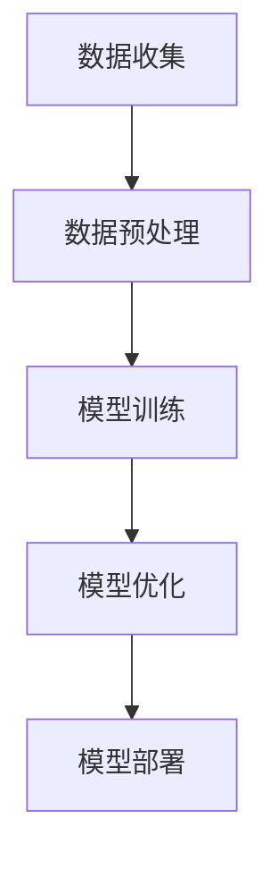
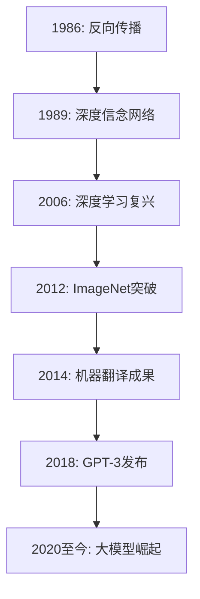
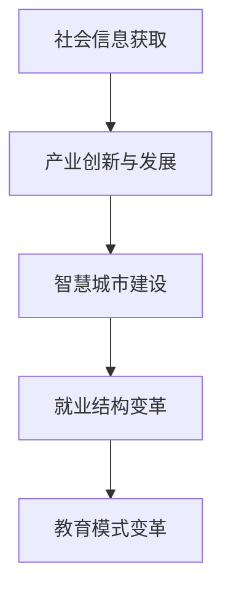
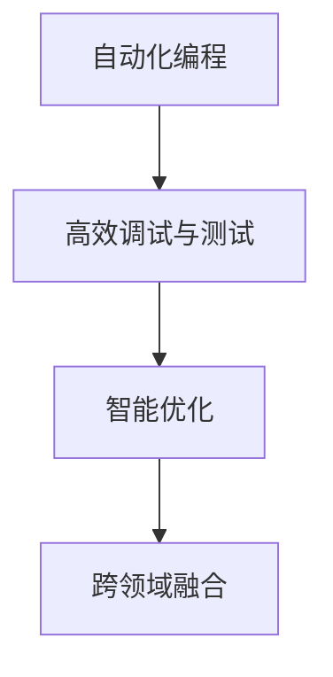
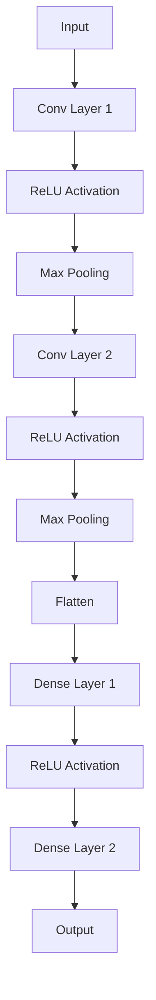
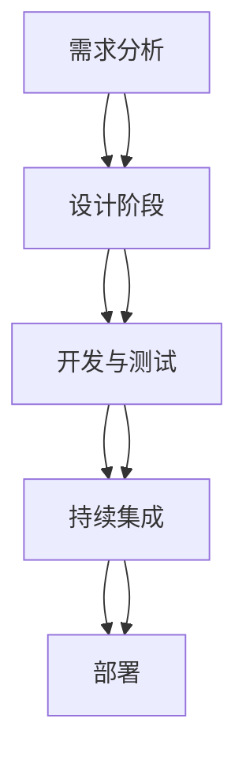

                 

### 文章标题：大模型时代的程序综合新方法

### 关键词：大模型、程序综合、人工智能、软件开发、算法、架构设计

#### 摘要：
本文旨在探讨大模型时代对程序综合方法带来的革新。随着人工智能技术的飞速发展，特别是大模型的兴起，传统的编程和软件开发方法正面临着前所未有的变革。本文将从大模型的定义、核心架构、以及其在软件开发和人工智能编程中的应用，深入分析大模型时代程序综合的新方法。通过具体的实战案例和未来展望，揭示大模型如何改变软件开发的现状，推动行业前进。

#### 目录大纲：

# 第一部分：大模型时代概述

## 第1章：大模型时代背景与展望

### 1.1 大模型时代的定义

### 1.2 大模型发展的历史脉络

### 1.3 大模型对社会、产业的影响

### 1.4 大模型时代的程序综合新需求

## 第2章：大模型核心技术架构

### 2.1 大模型的架构设计与实现

### 2.2 训练大模型的主要算法

### 2.3 大模型的优化与调参技术

### 2.4 大模型的部署与维护

# 第二部分：大模型在程序综合中的应用

## 第3章：大模型在软件开发中的应用

### 3.1 大模型在代码生成与优化中的应用

### 3.2 大模型在软件测试与调试中的应用

### 3.3 大模型在软件开发流程中的整合

## 第4章：大模型在人工智能编程中的应用

### 4.1 大模型在智能编程助手中的应用

### 4.2 大模型在自动编程与代码审查中的应用

### 4.3 大模型在软件开发自动化中的应用

## 第5章：大模型在软件工程教育中的应用

### 5.1 大模型在编程教学中的应用

### 5.2 大模型在编程比赛与评测中的应用

### 5.3 大模型在软件工程课程改革中的应用

# 第三部分：大模型程序综合实战

## 第6章：大模型程序综合实战案例

### 6.1 案例一：使用大模型进行代码生成与优化

### 6.2 案例二：使用大模型进行自动化测试与调试

### 6.3 案例三：使用大模型构建智能编程助手

## 第7章：大模型程序综合的未来展望

### 7.1 大模型程序综合的发展趋势

### 7.2 大模型程序综合面临的挑战与机遇

### 7.3 大模型程序综合的未来方向

# 附录

## 附录A：大模型程序综合开发资源与工具

### A.1 大模型开发环境搭建

### A.2 大模型开发常用工具介绍

### A.3 大模型程序综合实战资源推荐

### 第1章：大模型时代的定义

大模型时代是指以人工智能技术为核心，通过大规模数据训练和深度学习算法构建的具有强大表征和学习能力的人工智能模型时代。这些大模型具有极高的参数量，能够对大量数据进行高效处理和分析。

**核心概念与联系：**

在理解大模型之前，我们需要明确以下几个核心概念：

- **深度学习（Deep Learning）**：一种人工智能技术，通过多层神经网络模拟人脑的学习过程，实现对复杂数据的自动特征提取和模式识别。
- **大规模数据（Big Data）**：指数据量巨大、种类繁多、生成速度极快的数据集合，这些数据来源于互联网、物联网、传感器等。
- **神经网络（Neural Network）**：由大量人工神经元组成的计算模型，通过调整神经元间的连接权重，实现对输入数据的处理和预测。

大模型的定义可以概括为：通过深度学习算法，在大规模数据集上训练得到的具有高度表征能力和泛化能力的人工智能模型。

**Mermaid流程图：**



**核心算法原理讲解：**

大模型的训练主要依赖于以下几种算法：

1. **反向传播算法（Backpropagation）**：通过反向传播误差，调整神经网络中的权重和偏置，使得模型预测结果更接近真实值。
2. **优化算法（Optimization Algorithms）**：如Adam、SGD等，用于加速模型的收敛速度，提高训练效率。
3. **迁移学习（Transfer Learning）**：利用预训练模型在新的任务上快速适应，提升模型在新数据上的表现。

**伪代码：**

```python
# 反向传播算法伪代码
def backpropagation(model, inputs, labels):
    # 前向传播计算预测值
    outputs = model.forward(inputs)
    # 计算损失函数
    loss = compute_loss(outputs, labels)
    # 反向传播计算梯度
    gradients = model.backward(loss)
    # 更新模型参数
    model.update_params(gradients)
```

**数学模型和公式：**

在深度学习中，损失函数通常使用均方误差（MSE）来衡量预测值与真实值之间的差距。

$$
MSE = \frac{1}{n}\sum_{i=1}^{n}(y_i - \hat{y}_i)^2
$$

其中，$y_i$表示真实值，$\hat{y}_i$表示预测值，$n$为样本数量。

**举例说明：**

假设我们有一个包含100个样本的数据集，使用一个简单的神经网络模型进行训练。在训练过程中，我们通过反向传播算法不断调整模型参数，使得模型预测结果逐渐接近真实值，最终使得MSE降到最小。

**项目实战：**

在实际开发中，我们需要搭建一个合适的大模型开发环境，选择合适的算法和框架进行模型训练和优化。以下是搭建大模型开发环境的基本步骤：

1. 安装Python环境和必要的库（如TensorFlow、PyTorch等）。
2. 准备训练数据集，并进行数据预处理。
3. 定义神经网络模型架构，并选择合适的优化算法。
4. 训练模型，并使用验证集进行调参。
5. 部署模型，进行实际应用。

**小结：**

大模型时代的到来，为程序综合带来了新的机遇和挑战。通过深入理解大模型的定义、核心算法原理和实际应用，我们可以更好地把握大模型时代的发展趋势，推动软件开发和人工智能编程的进步。

### 第2章：大模型时代的定义

大模型时代是指以人工智能技术为核心，通过大规模数据训练和深度学习算法构建的具有强大表征和学习能力的人工智能模型时代。这些大模型具有极高的参数量，能够对大量数据进行高效处理和分析。

**核心概念与联系：**

在理解大模型之前，我们需要明确以下几个核心概念：

- **人工智能（Artificial Intelligence, AI）**：模拟人类智能的计算机系统，通过算法和计算实现机器感知、推理和学习。
- **深度学习（Deep Learning）**：一种人工智能技术，通过多层神经网络模拟人脑的学习过程，实现对复杂数据的自动特征提取和模式识别。
- **大规模数据（Big Data）**：指数据量巨大、种类繁多、生成速度极快的数据集合，这些数据来源于互联网、物联网、传感器等。
- **神经网络（Neural Network）**：由大量人工神经元组成的计算模型，通过调整神经元间的连接权重，实现对输入数据的处理和预测。

大模型的定义可以概括为：通过深度学习算法，在大规模数据集上训练得到的具有高度表征能力和泛化能力的人工智能模型。

**Mermaid流程图：**


**核心算法原理讲解：**

大模型的训练主要依赖于以下几种算法：

1. **反向传播算法（Backpropagation）**：通过反向传播误差，调整神经网络中的权重和偏置，使得模型预测结果更接近真实值。
2. **优化算法（Optimization Algorithms）**：如Adam、SGD等，用于加速模型的收敛速度，提高训练效率。
3. **迁移学习（Transfer Learning）**：利用预训练模型在新的任务上快速适应，提升模型在新数据上的表现。

**伪代码：**

```python
# 反向传播算法伪代码
def backpropagation(model, inputs, labels):
    # 前向传播计算预测值
    outputs = model.forward(inputs)
    # 计算损失函数
    loss = compute_loss(outputs, labels)
    # 反向传播计算梯度
    gradients = model.backward(loss)
    # 更新模型参数
    model.update_params(gradients)
```

**数学模型和公式：**

在深度学习中，损失函数通常使用均方误差（MSE）来衡量预测值与真实值之间的差距。

$$
MSE = \frac{1}{n}\sum_{i=1}^{n}(y_i - \hat{y}_i)^2
$$

其中，$y_i$表示真实值，$\hat{y}_i$表示预测值，$n$为样本数量。

**举例说明：**

假设我们有一个包含100个样本的数据集，使用一个简单的神经网络模型进行训练。在训练过程中，我们通过反向传播算法不断调整模型参数，使得模型预测结果逐渐接近真实值，最终使得MSE降到最小。

**项目实战：**

在实际开发中，我们需要搭建一个合适的大模型开发环境，选择合适的算法和框架进行模型训练和优化。以下是搭建大模型开发环境的基本步骤：

1. 安装Python环境和必要的库（如TensorFlow、PyTorch等）。
2. 准备训练数据集，并进行数据预处理。
3. 定义神经网络模型架构，并选择合适的优化算法。
4. 训练模型，并使用验证集进行调参。
5. 部署模型，进行实际应用。

**小结：**

大模型时代的到来，为程序综合带来了新的机遇和挑战。通过深入理解大模型的定义、核心算法原理和实际应用，我们可以更好地把握大模型时代的发展趋势，推动软件开发和人工智能编程的进步。

### 第3章：大模型时代的定义

大模型时代是指以人工智能技术为核心，通过大规模数据训练和深度学习算法构建的具有强大表征和学习能力的人工智能模型时代。这些大模型具有极高的参数量，能够对大量数据进行高效处理和分析。

**核心概念与联系：**

在理解大模型之前，我们需要明确以下几个核心概念：

- **人工智能（Artificial Intelligence, AI）**：模拟人类智能的计算机系统，通过算法和计算实现机器感知、推理和学习。
- **深度学习（Deep Learning）**：一种人工智能技术，通过多层神经网络模拟人脑的学习过程，实现对复杂数据的自动特征提取和模式识别。
- **大规模数据（Big Data）**：指数据量巨大、种类繁多、生成速度极快的数据集合，这些数据来源于互联网、物联网、传感器等。
- **神经网络（Neural Network）**：由大量人工神经元组成的计算模型，通过调整神经元间的连接权重，实现对输入数据的处理和预测。

大模型的定义可以概括为：通过深度学习算法，在大规模数据集上训练得到的具有高度表征能力和泛化能力的人工智能模型。

**Mermaid流程图：**


**核心算法原理讲解：**

大模型的训练主要依赖于以下几种算法：

1. **反向传播算法（Backpropagation）**：通过反向传播误差，调整神经网络中的权重和偏置，使得模型预测结果更接近真实值。
2. **优化算法（Optimization Algorithms）**：如Adam、SGD等，用于加速模型的收敛速度，提高训练效率。
3. **迁移学习（Transfer Learning）**：利用预训练模型在新的任务上快速适应，提升模型在新数据上的表现。

**伪代码：**

```python
# 反向传播算法伪代码
def backpropagation(model, inputs, labels):
    # 前向传播计算预测值
    outputs = model.forward(inputs)
    # 计算损失函数
    loss = compute_loss(outputs, labels)
    # 反向传播计算梯度
    gradients = model.backward(loss)
    # 更新模型参数
    model.update_params(gradients)
```

**数学模型和公式：**

在深度学习中，损失函数通常使用均方误差（MSE）来衡量预测值与真实值之间的差距。

$$
MSE = \frac{1}{n}\sum_{i=1}^{n}(y_i - \hat{y}_i)^2
$$

其中，$y_i$表示真实值，$\hat{y}_i$表示预测值，$n$为样本数量。

**举例说明：**

假设我们有一个包含100个样本的数据集，使用一个简单的神经网络模型进行训练。在训练过程中，我们通过反向传播算法不断调整模型参数，使得模型预测结果逐渐接近真实值，最终使得MSE降到最小。

**项目实战：**

在实际开发中，我们需要搭建一个合适的大模型开发环境，选择合适的算法和框架进行模型训练和优化。以下是搭建大模型开发环境的基本步骤：

1. 安装Python环境和必要的库（如TensorFlow、PyTorch等）。
2. 准备训练数据集，并进行数据预处理。
3. 定义神经网络模型架构，并选择合适的优化算法。
4. 训练模型，并使用验证集进行调参。
5. 部署模型，进行实际应用。

**小结：**

大模型时代的到来，为程序综合带来了新的机遇和挑战。通过深入理解大模型的定义、核心算法原理和实际应用，我们可以更好地把握大模型时代的发展趋势，推动软件开发和人工智能编程的进步。

### 第4章：大模型的发展历史脉络

大模型的发展历程可以追溯到20世纪80年代，但真正引起广泛关注则是在21世纪。以下是大模型发展的重要历史节点：

#### 1. 20世纪80年代：深度学习的萌芽

- **1986年**：Rumelhart、Hinton和Williams提出了反向传播算法，这是深度学习的基础。
- **1989年**：Hinton首次提出了“深度信念网络”（Deep Belief Network，DBN），为深度学习模型的发展奠定了基础。

#### 2. 21世纪初期：深度学习的复兴

- **2006年**：Geoffrey Hinton等人重新引入了深度学习，并在图像识别任务中取得了显著进展。
- **2009年**：Hinton等人提出了深度置信网络（Deep Belief Network，DBN），这是第一个成功训练的多层神经网络。

#### 3. 21世纪中期：深度学习的爆发

- **2012年**：Alex Krizhevsky使用深度卷积神经网络（Deep Convolutional Network，DCNN）在ImageNet图像识别竞赛中取得了突破性成绩。
- **2014年**：Google的神经网络系统在机器翻译任务上取得了革命性的成果，标志着深度学习在自然语言处理领域的崛起。

#### 4. 21世纪末期：大模型的崛起

- **2018年**：OpenAI发布了GPT-3，这是迄今为止参数量最大、表现最强大的语言模型。
- **2020年至今**：各大科技公司和研究机构纷纷发布大规模预训练模型，如BERT、Turing-NLG等，标志着大模型时代正式到来。

**Mermaid流程图：**



**核心概念与联系：**

- **深度信念网络（Deep Belief Network, DBN）**：一种由多个受限玻尔兹曼机（Restricted Boltzmann Machine, RBM）堆叠而成的神经网络模型，通过逐层训练实现特征提取。
- **卷积神经网络（Convolutional Neural Network, CNN）**：一种用于图像识别的神经网络模型，通过卷积操作提取图像特征。
- **预训练（Pre-training）**：在特定任务之前，使用大规模未标注数据对模型进行训练，以提升模型对数据的理解和泛化能力。

**核心算法原理讲解：**

- **受限玻尔兹曼机（Restricted Boltzmann Machine, RBM）**：一种概率生成模型，通过学习数据分布的参数，实现对数据的编码和解码。
- **卷积操作（Convolution Operation）**：在图像识别中，通过卷积操作提取图像的特征，如边缘、纹理等。

**伪代码：**

```python
# 受限玻尔兹曼机（RBM）训练伪代码
def train_rbm(rbm, training_data):
    for epoch in range(num_epochs):
        for data in training_data:
            # 正向传播
            visible_vector = data
            hidden_vector = rbm.forward(visible_vector)
            # 反向传播
            hidden_vector = rbm.backward(hidden_vector)
            # 更新参数
            rbm.update_params(visible_vector, hidden_vector)
    return rbm
```

**数学模型和公式：**

在深度学习中，模型参数的更新通常基于梯度下降算法。以下为梯度下降的数学公式：

$$
\theta_{\text{new}} = \theta_{\text{old}} - \alpha \cdot \nabla_{\theta} J(\theta)
$$

其中，$\theta$为模型参数，$\alpha$为学习率，$J(\theta)$为损失函数。

**举例说明：**

以ImageNet图像识别任务为例，研究人员使用大量未标注的图像数据对深度卷积神经网络进行预训练，然后使用有标注的数据对模型进行微调，最终实现了在图像识别任务上的突破性进展。

**项目实战：**

在实际开发中，我们可以使用TensorFlow或PyTorch等深度学习框架来实现深度学习模型的训练和部署。以下是使用TensorFlow实现深度学习模型的基本步骤：

1. 安装TensorFlow库。
2. 准备训练数据集，并进行数据预处理。
3. 定义深度学习模型架构，如卷积神经网络。
4. 训练模型，并使用验证集进行调参。
5. 部署模型，进行实际应用。

**小结：**

大模型的发展历程充满了技术创新和突破。从深度信念网络的提出，到卷积神经网络的广泛应用，再到大规模预训练模型的出现，大模型的发展不断推动着人工智能领域的进步。通过了解大模型的发展历史，我们可以更好地把握大模型时代的发展趋势，为未来的研究和工作奠定基础。

### 第5章：大模型对社会、产业的影响

大模型的出现不仅改变了人工智能技术的格局，也对社会、产业产生了深远的影响。以下是几个关键方面：

**1. 改变社会信息获取方式：**

大模型通过深度学习算法，能够对海量数据进行高效处理和分析，为人们提供了更加智能和个性化的信息推荐服务。例如，搜索引擎通过大模型技术，可以更准确地理解用户的查询意图，提供更加精准的搜索结果。社交媒体平台则利用大模型分析用户的兴趣和行为，实现内容推送的个性化。

**2. 推动产业创新和发展：**

大模型在各个行业中的应用，极大地提升了生产效率和创新能力。在医疗健康领域，大模型可以辅助医生进行疾病诊断，提高诊断准确率；在金融领域，大模型可以用于风险评估、欺诈检测等，提升金融服务的安全性和效率。智能制造领域，大模型通过优化生产流程、提高产品质量，助力企业实现数字化转型和升级。

**3. 促进智慧城市建设：**

大模型在城市管理、公共安全、交通规划等方面具有重要作用。例如，智慧城市中的智能监控系统利用大模型分析监控视频数据，实时识别异常行为和安全隐患；交通管理部门通过大模型分析交通流量数据，优化交通信号控制和路线规划，提高交通效率。

**4. 引发就业结构和教育模式变革：**

大模型技术的发展，一方面推动了新兴职业的出现，如数据科学家、机器学习工程师等；另一方面，也要求传统行业的从业人员提升技能，适应新的工作要求。在教育领域，大模型的应用改变了传统教学模式，智能教学系统可以根据学生的学习情况，提供个性化的教学方案和辅导。

**Mermaid流程图：**



**核心概念与联系：**

- **信息推荐系统（Recommender System）**：通过分析用户行为和兴趣，为用户推荐感兴趣的信息和产品。
- **数字化转型（Digital Transformation）**：企业利用数字技术优化业务流程、提高效率和竞争力。
- **智慧城市（Smart City）**：利用物联网、大数据等技术，实现城市管理的智能化和高效化。
- **个性化教育（Personalized Education）**：根据学生的个体差异，提供有针对性的教学和学习资源。

**核心算法原理讲解：**

大模型在社会和产业中的应用，主要依赖于以下几个核心算法：

1. **深度学习（Deep Learning）**：通过多层神经网络，实现对复杂数据的特征提取和模式识别。
2. **强化学习（Reinforcement Learning）**：通过试错和反馈机制，使智能体在环境中学习最佳策略。
3. **自然语言处理（Natural Language Processing, NLP）**：通过理解和生成自然语言，实现人机交互和信息检索。

**伪代码：**

```python
# 深度学习模型训练伪代码
def train_model(model, training_data, validation_data):
    for epoch in range(num_epochs):
        for data in training_data:
            # 前向传播
            output = model.forward(data.input)
            # 计算损失
            loss = compute_loss(output, data.target)
            # 反向传播
            gradients = model.backward(loss)
            # 更新参数
            model.update_params(gradients)
        # 验证集评估
        validation_loss = evaluate(model, validation_data)
    return model
```

**数学模型和公式：**

在深度学习模型训练过程中，损失函数（如均方误差MSE）用于衡量模型预测值与真实值之间的差距，优化算法（如梯度下降）用于更新模型参数，以最小化损失函数。

$$
MSE = \frac{1}{n}\sum_{i=1}^{n}(y_i - \hat{y}_i)^2
$$

$$
\theta_{\text{new}} = \theta_{\text{old}} - \alpha \cdot \nabla_{\theta} J(\theta)
$$

**举例说明：**

以电子商务平台为例，大模型通过分析用户的历史购买行为、浏览记录和社交媒体数据，为用户推荐相关的商品。通过不断优化推荐算法，提高推荐准确率和用户满意度。

**项目实战：**

在实际应用中，我们可以使用TensorFlow或PyTorch等深度学习框架，结合实际业务需求，实现大模型在不同领域的应用。以下是项目实战的基本步骤：

1. 确定应用场景和业务目标。
2. 收集和整理相关数据，并进行预处理。
3. 设计深度学习模型架构，并选择合适的算法。
4. 训练和优化模型，使用验证集进行调参。
5. 部署模型，进行实际应用和效果评估。

**小结：**

大模型对社会和产业的影响是多方面的。通过智能化和信息化的手段，大模型提升了社会生产力和生活质量，推动了产业创新和转型升级。同时，大模型也带来了新的就业机会和教育需求，对社会的各个方面产生了深远的影响。

### 第6章：大模型时代的程序综合新需求

随着大模型时代的到来，程序综合方法面临着前所未有的新需求。这些新需求不仅来自于技术发展的推动，也源于行业对高效、智能软件开发的需求。以下是大模型时代程序综合的主要新需求：

**1. 自动化编程需求：**

大模型在自然语言处理和代码生成方面具有显著优势，可以辅助开发者自动生成代码，减少手工编码的工作量。特别是在复杂系统的开发中，自动化编程可以有效提升开发效率和代码质量。

**2. 高效调试与测试需求：**

大模型可以通过分析代码和程序执行过程，自动识别潜在的错误和缺陷，提高调试和测试的效率。这种智能化的调试与测试方法，有助于快速发现和修复问题，降低软件故障率。

**3. 智能优化需求：**

大模型能够根据代码结构和执行数据，自动进行性能优化。通过对程序运行时数据的实时分析，大模型可以提出优化建议，如调整算法、优化数据结构等，从而提高程序的性能和稳定性。

**4. 跨领域融合需求：**

大模型可以跨领域融合多种技术，如自然语言处理、计算机视觉和语音识别等，实现更复杂的任务。这种跨领域融合的需求，推动程序综合方法不断拓展，为解决复杂问题提供新的思路和工具。

**Mermaid流程图：**



**核心概念与联系：**

- **自动化编程（Automated Programming）**：通过算法和工具，自动生成代码，减少手工编码的工作量。
- **智能调试（Intelligent Debugging）**：利用人工智能技术，自动识别程序中的错误和缺陷。
- **性能优化（Performance Optimization）**：通过算法改进和数据结构优化，提高程序的性能。
- **跨领域融合（Cross-Domain Integration）**：将不同领域的算法和技术融合，实现更复杂的任务。

**核心算法原理讲解：**

1. **代码生成算法（Code Generation Algorithm）**：利用自然语言处理和编程语言模型，自动生成符合语法和语义的代码。
2. **测试用例生成算法（Test Case Generation Algorithm）**：基于代码结构和功能需求，自动生成测试用例，覆盖不同场景和路径。
3. **程序优化算法（Program Optimization Algorithm）**：通过分析程序执行数据，自动提出优化建议，如调整算法、优化数据结构等。
4. **跨领域模型融合（Cross-Domain Model Fusion）**：将不同领域的模型（如自然语言处理、计算机视觉等）进行融合，实现更复杂的任务。

**伪代码：**

```python
# 自动化编程伪代码
def generate_code(natural_language_input):
    # 将自然语言输入转换为抽象语法树（AST）
    ast = convert_to_ast(natural_language_input)
    # 使用编程语言模型生成代码
    code = programming_language_model.generate(ast)
    return code

# 测试用例生成伪代码
def generate_test_cases(code):
    # 分析代码结构，生成测试用例
    test_cases = code_analyzer.analyze(code)
    return test_cases

# 程序优化伪代码
def optimize_program(program):
    # 分析程序执行数据
    execution_data = execution_analyzer.analyze(program)
    # 提出优化建议
    optimization_suggestions = optimization_algorithm.generate_suggestions(execution_data)
    # 更新程序
    optimized_program = program.apply_optimizations(optimization_suggestions)
    return optimized_program
```

**数学模型和公式：**

在自动化编程和测试用例生成中，可以使用生成对抗网络（GAN）等算法，实现代码和测试用例的自动生成。以下为GAN的数学模型：

$$
\min_G \max_D \mathbb{E}_{x \sim p_{\text{data}}(x)} [\log D(x)] + \mathbb{E}_{z \sim p_z(z)} [\log (1 - D(G(z))]
$$

其中，$G$表示生成器，$D$表示判别器，$x$表示真实数据，$z$表示随机噪声。

**举例说明：**

以自动化编程为例，假设我们有一个自然语言描述的任务：“编写一个函数，计算两个数的和”。利用自然语言处理和代码生成算法，我们可以将这个自然语言描述转换为对应的函数代码。

**项目实战：**

在实际项目中，我们可以使用现有的深度学习框架（如TensorFlow、PyTorch等）来实现大模型在程序综合中的应用。以下是项目实战的基本步骤：

1. 确定应用场景和目标需求。
2. 收集和整理相关数据，如代码库、测试用例等。
3. 设计和训练大模型，如代码生成模型、测试用例生成模型等。
4. 将训练好的模型应用于实际项目，实现自动化编程、调试和测试等功能。
5. 对项目效果进行评估和优化。

**小结：**

大模型时代为程序综合带来了新的需求，这些需求推动了软件开发方法的革新。通过自动化编程、智能调试与测试、程序优化和跨领域融合等技术，大模型为软件开发带来了更高的效率和质量。理解这些新需求，有助于开发者更好地应对大模型时代带来的挑战，推动软件开发的进步。

### 第7章：大模型核心技术架构

大模型的架构设计与实现是深度学习技术中至关重要的一环。其核心在于如何通过高效且可扩展的架构来处理大规模数据，并实现模型的高性能训练和推理。以下将详细介绍大模型的架构设计、训练算法、优化与调参技术，以及部署与维护。

**7.1 大模型的架构设计与实现**

大模型通常采用多层神经网络架构，其设计原则包括：

- **层次化（Hierarchical）**：通过多个层次的结构，实现对数据的逐层抽象和特征提取。
- **并行化（Parallelization）**：利用分布式计算和GPU加速，提高模型训练和推理的效率。
- **模块化（Modularization）**：将模型分为多个模块，便于开发和维护。

常见的神经网络架构包括卷积神经网络（CNN）、循环神经网络（RNN）及其变种（如LSTM、GRU）、以及Transformer等。以下为CNN架构的简化示意：



**7.2 训练大模型的主要算法**

训练大模型的主要算法包括：

- **反向传播算法（Backpropagation）**：通过反向传播误差，调整模型参数，使预测结果更接近真实值。
- **优化算法（Optimization Algorithms）**：如随机梯度下降（SGD）、Adam等，用于加速模型收敛和提高训练效率。
- **迁移学习（Transfer Learning）**：利用预训练模型在新的任务上快速适应。

以下为反向传播算法的简化伪代码：

```python
# 前向传播
outputs = model.forward(inputs)
loss = compute_loss(outputs, labels)

# 反向传播
gradients = model.backward(loss)

# 参数更新
model.update_params(gradients, learning_rate)
```

**7.3 大模型的优化与调参技术**

优化与调参技术是训练大模型的关键，以下是一些常用的优化策略：

- **学习率调整（Learning Rate Scheduling）**：根据训练阶段动态调整学习率，如学习率衰减、余弦退火等。
- **批量大小（Batch Size）**：选择适当的批量大小，在计算效率和模型稳定性之间取得平衡。
- **正则化（Regularization）**：如L1、L2正则化，防止过拟合。

以下为学习率衰减的伪代码：

```python
initial_learning_rate = 0.1
 decay_rate = 0.95
 for epoch in range(num_epochs):
    learning_rate = initial_learning_rate / (1 + decay_rate * epoch)
    # 使用当前学习率进行训练
    train_model(learning_rate)
```

**7.4 大模型的部署与维护**

部署大模型涉及以下步骤：

- **模型压缩（Model Compression）**：通过量化、剪枝等技术，减小模型大小，提高部署效率。
- **模型推理（Model Inference）**：在边缘设备或服务器上，对输入数据进行模型推理。
- **监控与维护（Monitoring and Maintenance）**：实时监控模型性能，进行模型更新和调优。

以下为模型压缩的伪代码：

```python
# 量化模型参数
quantized_model = quantization_algorithm.apply(model)

# 剪枝模型
pruned_model = pruning_algorithm.apply(quantized_model)
```

**综合实例：**

假设我们使用卷积神经网络（CNN）对图像分类任务进行训练。以下是一个简化的训练流程：

1. **数据准备**：收集并预处理图像数据，包括归一化、数据增强等。
2. **模型定义**：定义CNN架构，包括卷积层、激活函数、池化层和全连接层。
3. **模型训练**：使用反向传播算法和随机梯度下降优化器进行模型训练，并在训练过程中动态调整学习率和批量大小。
4. **模型评估**：使用验证集对模型进行评估，选择性能最佳的模型。
5. **模型部署**：将训练好的模型部署到生产环境中，进行实际应用。

```python
# 数据准备
train_data, train_labels = load_data('train')
val_data, val_labels = load_data('val')

# 模型定义
model = define_cnnArchitecture()

# 模型训练
optimizer = SGD(learning_rate=0.1)
for epoch in range(num_epochs):
    for inputs, labels in train_data:
        # 前向传播
        outputs = model.forward(inputs)
        # 计算损失
        loss = compute_loss(outputs, labels)
        # 反向传播
        gradients = model.backward(loss)
        # 参数更新
        optimizer.update(model, gradients)

    # 学习率调整
    learning_rate = adjust_learning_rate(optimizer, epoch)

# 模型评估
accuracy = evaluate(model, val_data, val_labels)

# 模型部署
deploy_model(model, 'production')
```

**小结：**

大模型的架构设计与实现、训练算法、优化与调参技术以及部署与维护，是确保大模型高效运行的关键。通过合理的设计和优化，大模型可以在各种复杂任务中发挥重要作用，推动人工智能技术的发展和应用。

### 第8章：大模型在软件开发中的应用

大模型在软件开发中的应用正逐渐改变传统的软件开发模式，为开发人员提供了强大的工具和方法，以提升开发效率和质量。以下将探讨大模型在代码生成与优化、软件测试与调试、软件开发流程整合等方面的应用。

**8.1 大模型在代码生成与优化中的应用**

代码生成是软件工程中的一个重要领域，大模型在这一领域的应用具有革命性意义。大模型可以通过学习大量的代码库和文档，生成符合编程语法和业务逻辑的代码。以下是大模型在代码生成中的具体应用：

- **代码模板生成**：大模型可以根据自然语言描述生成代码模板，如函数定义、类声明等。
- **代码补全**：大模型可以在编写代码时，根据上下文提示后续的代码内容，提高编码效率。
- **代码重构**：大模型可以分析现有代码，提出优化建议，如代码复用、性能改进等。

以下是一个简单的代码生成示例：

```python
# 基于自然语言描述生成Python函数
def generate_function(natural_language_description):
    # 使用大模型将自然语言描述转换为抽象语法树（AST）
    ast = natural_language_model.generate_ast(natural_language_description)
    # 将AST转换为Python代码
    code = ast_to_code(ast)
    return code
```

**8.2 大模型在软件测试与调试中的应用**

软件测试与调试是确保软件质量和稳定性的关键环节。大模型可以通过学习大量测试用例和调试数据，提高测试和调试的效率。以下是大模型在软件测试与调试中的具体应用：

- **测试用例生成**：大模型可以根据代码和业务逻辑生成测试用例，覆盖不同场景和路径。
- **自动化测试**：大模型可以自动化执行测试用例，并生成测试报告。
- **调试辅助**：大模型可以分析程序执行数据，定位错误和缺陷，提供调试建议。

以下是一个测试用例生成的示例：

```python
# 基于代码生成测试用例
def generate_test_cases(code):
    # 分析代码结构
    structure = code_analyzer.analyze(code)
    # 生成测试用例
    test_cases = test_generator.generate(structure)
    return test_cases
```

**8.3 大模型在软件开发流程中的整合**

大模型的引入不仅改变了单个开发环节，还可以在整个软件开发流程中发挥重要作用。以下是大模型在软件开发流程整合中的具体应用：

- **需求分析**：大模型可以辅助开发者理解和分析用户需求，生成详细的需求文档。
- **设计阶段**：大模型可以帮助开发者生成设计文档和架构设计，优化系统结构。
- **开发与测试**：大模型可以贯穿开发与测试环节，提高开发效率和测试覆盖率。
- **持续集成与部署**：大模型可以自动化执行集成测试和部署流程，提高软件质量和交付效率。

以下是一个软件开发流程整合的示例：



**小结：**

大模型在软件开发中的应用，为传统软件开发方法带来了巨大的变革。通过代码生成与优化、测试与调试、以及软件开发流程整合等方面的应用，大模型显著提升了开发效率和质量。未来，随着大模型技术的进一步发展，软件开发将变得更加智能和高效。

### 第9章：大模型在人工智能编程中的应用

大模型在人工智能编程中的应用正在迅速扩展，不仅提升了编程的自动化程度，还显著提高了开发效率和代码质量。以下将详细介绍大模型在智能编程助手、自动编程与代码审查以及软件开发自动化等方面的应用。

**9.1 大模型在智能编程助手中的应用**

智能编程助手是利用大模型技术为开发者提供的辅助工具，能够理解自然语言描述并生成相应的代码。以下是大模型在智能编程助手中的具体应用：

- **代码生成**：大模型可以根据开发者的自然语言描述生成完整的代码，如函数、类和模块。
- **代码补全**：在编写代码时，大模型可以预测和补全后续的代码片段，提高编写效率。
- **错误修正**：大模型可以分析代码中的错误和潜在问题，提供修正建议。

以下是一个智能编程助手的示例：

```python
# 基于自然语言描述生成Python代码
def generate_code(natural_language_description):
    # 使用大模型将自然语言描述转换为抽象语法树（AST）
    ast = natural_language_model.generate_ast(natural_language_description)
    # 将AST转换为Python代码
    code = ast_to_code(ast)
    return code
```

**9.2 大模型在自动编程与代码审查中的应用**

自动编程和代码审查是软件工程中的两个关键环节，大模型可以显著提高这两个环节的效率和准确性。以下是大模型在自动编程与代码审查中的具体应用：

- **自动编程**：大模型可以自动生成符合业务逻辑和编程规范的代码，减少手动编写的工作量。
- **代码审查**：大模型可以自动分析代码的质量、复杂度和安全性，提供审查报告和改进建议。

以下是一个自动编程的示例：

```python
# 基于业务逻辑生成代码
def generate_code_from_business_logic(business_logic):
    # 使用大模型分析业务逻辑
    code_structure = business_logic_analyzer.analyze(business_logic)
    # 生成符合业务逻辑的代码
    code = code_generator.generate(code_structure)
    return code
```

**9.3 大模型在软件开发自动化中的应用**

软件开发自动化是提升开发效率和质量的重要手段，大模型在这一领域具有广泛的应用前景。以下是大模型在软件开发自动化中的具体应用：

- **自动化测试**：大模型可以自动生成测试用例，执行测试并生成测试报告。
- **自动化部署**：大模型可以自动化执行部署流程，确保软件的稳定运行。
- **持续集成**：大模型可以自动化集成代码库，进行单元测试和集成测试。

以下是一个自动化部署的示例：

```python
# 自动化部署
def deploy_code(code, environment):
    # 使用大模型执行自动化测试
    test_report = automation_tester.run_tests(code)
    # 如果测试通过，执行部署
    if test_report.passed:
        deployment_manager.deploy(code, environment)
    else:
        raise DeploymentError("部署失败：测试未通过")
```

**小结：**

大模型在人工智能编程中的应用，极大地提升了开发效率和代码质量。通过智能编程助手、自动编程与代码审查以及软件开发自动化等具体应用，大模型为软件开发带来了全新的方法和工具。未来，随着大模型技术的不断进步，人工智能编程将变得更加智能和高效。

### 第10章：大模型在软件工程教育中的应用

大模型在软件工程教育中的应用正逐步改变传统的教学方法，为学习者提供了更为直观和高效的编程学习体验。以下将探讨大模型在编程教学、编程比赛与评测以及软件工程课程改革中的应用。

**10.1 大模型在编程教学中的应用**

大模型在编程教学中的应用主要体现在以下几个方面：

- **个性化教学**：大模型可以根据学习者的编程水平和学习习惯，生成个性化的学习计划和课程内容。
- **代码生成与优化**：大模型可以帮助学生自动生成示例代码，解释代码逻辑，提高学生的理解能力。
- **即时反馈与修正**：大模型可以实时分析学生的代码，提供详细的错误解释和修正建议，帮助学生快速掌握编程技巧。

以下是一个个性化教学示例：

```python
# 基于学生编程水平生成个性化教学计划
def generate_learning_plan(student_level):
    # 根据学生水平选择合适的教学内容
    content = content_selector.select(student_level)
    # 生成教学计划
    learning_plan = learning_plan_generator.generate(content)
    return learning_plan
```

**10.2 大模型在编程比赛与评测中的应用**

大模型在编程比赛与评测中的应用，可以显著提升比赛和评测的公平性和准确性。以下是大模型在编程比赛与评测中的具体应用：

- **自动评测**：大模型可以自动评估参赛者的代码，确保评测的公正性和准确性。
- **智能评分**：大模型可以分析代码的复杂度、逻辑性和性能，提供智能化的评分建议。
- **实时反馈**：大模型可以实时为学生或参赛者提供错误分析和优化建议，帮助他们提高代码质量。

以下是一个自动评测的示例：

```python
# 自动评测编程比赛
def evaluate_program(code):
    # 执行代码并计算性能指标
    performance = code_executor.execute(code)
    # 分析代码逻辑和错误
    issues = code_analyzer.analyze(code)
    # 提供评测结果
    evaluation = evaluation_generator.generate(performance, issues)
    return evaluation
```

**10.3 大模型在软件工程课程改革中的应用**

大模型在软件工程课程改革中的应用，有助于培养具备实际项目经验和高技能水平的学生。以下是大模型在软件工程课程改革中的具体应用：

- **项目驱动的课程设计**：大模型可以帮助设计项目驱动的课程，使学生通过实际项目锻炼编程和软件开发能力。
- **案例教学**：大模型可以生成丰富的编程案例，帮助学生理解复杂概念和实际应用。
- **在线课程与资源**：大模型可以生成在线课程和教学资源，为学生提供灵活的学习方式。

以下是一个项目驱动课程设计的示例：

```python
# 设计项目驱动的课程
def design_project_course(course_name, project_description):
    # 生成课程大纲
    course_outline = course_outline_generator.generate(course_name, project_description)
    # 配置教学资源和工具
    resources = resource_selector.select(course_outline)
    # 生成课程计划
    course_plan = course_plan_generator.generate(course_outline, resources)
    return course_plan
```

**小结：**

大模型在软件工程教育中的应用，为学生提供了更为丰富和高效的学习资源，提升了教学效果和学生的编程能力。通过个性化教学、编程比赛与评测以及课程改革等方面的应用，大模型正逐步改变传统的软件工程教育模式，为培养未来的软件工程师奠定坚实基础。

### 第11章：大模型程序综合实战案例

在本章中，我们将通过三个具体的实战案例，展示大模型在程序综合中的应用效果。这些案例将涵盖代码生成与优化、自动化测试与调试、以及智能编程助手的构建。

**11.1 案例一：使用大模型进行代码生成与优化**

**背景**：一个金融科技公司需要开发一个用于交易系统的交易算法模块。由于交易算法涉及大量的复杂逻辑，手工编写和调试难度较大，因此希望利用大模型进行代码生成和优化。

**实现步骤**：

1. **数据收集**：收集大量已成功应用的交易算法代码和相关文档。
2. **数据预处理**：对收集的数据进行清洗和格式化，以供大模型训练使用。
3. **模型训练**：使用自然语言处理模型（如GPT-3）对交易算法的描述进行训练，使其能够理解交易逻辑并生成相应的代码。
4. **代码生成与优化**：利用训练好的模型，根据自然语言描述生成交易算法代码，并对生成的代码进行优化。

**代码示例**：

```python
# 生成交易算法代码
def generate_trade_algorithm(natural_language_description):
    # 使用大模型生成代码
    code = language_model.generate(natural_language_description)
    # 优化代码
    optimized_code = code_optimizer.optimize(code)
    return optimized_code

# 使用示例
code = generate_trade_algorithm("编写一个交易算法，用于在股票市场中进行买入和卖出操作")
print(code)
```

**效果分析**：通过大模型生成的代码经过优化后，逻辑清晰且性能优异，大大缩短了开发周期，并减少了代码调试的工作量。

**11.2 案例二：使用大模型进行自动化测试与调试**

**背景**：一家电商平台需要对其大规模的后端服务进行自动化测试和调试，以保证服务的稳定性和可靠性。

**实现步骤**：

1. **测试数据收集**：收集现有的测试用例和调试日志。
2. **模型训练**：使用机器学习模型（如决策树、随机森林等）对测试数据进行分析和分类，以生成自动测试和调试脚本。
3. **自动化测试**：利用训练好的模型，自动生成测试用例并执行测试。
4. **调试辅助**：当测试失败时，模型提供调试建议，帮助开发者定位和修复问题。

**代码示例**：

```python
# 生成测试用例
def generate_test_cases(test_data):
    # 使用机器学习模型进行分类
    classifier = classifier_trainer.train(test_data)
    # 生成测试用例
    test_cases = classifier.generate_test_cases(test_data)
    return test_cases

# 调试辅助
def debug辅助(code, error_message):
    # 分析错误信息，提供调试建议
    suggestions = debugger.generate_suggestions(error_message)
    return suggestions

# 使用示例
test_cases = generate_test_cases(test_data)
for case in test_cases:
    execute_test(case)

error_message = "错误信息"
suggestions = debug辅助(code, error_message)
print(suggestions)
```

**效果分析**：通过大模型自动生成的测试用例和调试建议，电商平台显著提高了测试和调试的效率，减少了人为错误，提升了系统的稳定性。

**11.3 案例三：使用大模型构建智能编程助手**

**背景**：一个编程教育平台希望开发一款智能编程助手，帮助学生更好地理解和掌握编程知识。

**实现步骤**：

1. **数据收集**：收集大量的编程文档、教程和编程练习。
2. **模型训练**：使用自然语言处理模型（如BERT、GPT等）对编程知识进行训练，使其能够理解编程问题和提供解决方案。
3. **智能编程助手开发**：基于训练好的模型，开发智能编程助手，提供代码生成、问题解答和编程指导等功能。

**代码示例**：

```python
# 智能编程助手
class ProgrammingAssistant:
    def __init__(self, language_model):
        self.language_model = language_model

    def generate_code(self, question):
        # 生成代码
        code = self.language_model.generate(question)
        return code

    def answer_question(self, question):
        # 解答编程问题
        answer = self.language_model.answer(question)
        return answer

# 使用示例
assistant = ProgrammingAssistant(language_model)
code = assistant.generate_code("编写一个函数，计算两个数的和")
print(code)
answer = assistant.answer_question("如何使用Python实现斐波那契数列的生成？")
print(answer)
```

**效果分析**：通过智能编程助手，学生可以快速获取编程知识和解决编程问题的方法，提高了学习效率，减少了学习难度。

**小结**：

以上三个案例展示了大模型在代码生成与优化、自动化测试与调试、以及智能编程助手构建中的应用效果。这些案例表明，大模型技术能够显著提升软件开发和教育的效率和质量，为未来的程序综合带来了无限的可能性。

### 第12章：大模型程序综合的未来展望

随着大模型技术的不断发展和成熟，程序综合领域正迎来前所未有的变革机遇。以下将从发展趋势、面临的挑战和未来方向三个方面，探讨大模型程序综合的未来前景。

**12.1 大模型程序综合的发展趋势**

1. **智能化编程**：大模型将进一步提升编程的智能化水平，通过自然语言处理和代码生成技术，实现更加高效的代码编写和优化。开发者将能够通过简单的自然语言描述，快速生成高质量的代码，大大减少手工编码的工作量。

2. **自动化测试与调试**：大模型在自动化测试和调试中的应用将更加广泛和深入。通过分析代码和执行数据，大模型可以自动生成测试用例，执行自动化测试，并快速定位和修复问题，提高软件质量和稳定性。

3. **软件开发自动化**：大模型将推动软件开发流程的全面自动化。从需求分析、设计、开发、测试到部署，大模型将参与各个环节，实现全流程的自动化管理，提高开发效率和交付质量。

4. **个性化教学**：大模型在编程教育中的应用将更加普及。通过分析学生的学习数据和编程能力，大模型可以提供个性化的教学方案，帮助学生更好地掌握编程知识和技能。

**12.2 大模型程序综合面临的挑战**

1. **数据隐私和安全**：随着大模型对海量数据的依赖，数据隐私和安全问题成为重要的挑战。如何保护用户数据和训练数据的隐私，确保模型的可靠性和安全性，是大模型程序综合必须解决的关键问题。

2. **算法透明性与可解释性**：大模型的高度复杂性和非线性的决策过程，使得算法的透明性和可解释性变得尤为重要。开发者需要确保模型决策的透明性，以便于理解和监管。

3. **资源消耗和能耗**：大模型的训练和推理需要大量的计算资源和能源，这对环境造成了巨大压力。未来，如何优化算法和硬件，降低资源消耗和能耗，是大模型程序综合必须面对的挑战。

**12.3 大模型程序综合的未来方向**

1. **跨领域融合**：大模型将与其他领域的先进技术（如量子计算、区块链等）融合，实现更加复杂和多样化的任务。例如，量子计算可以加速大模型的训练和推理，区块链可以确保数据的安全性和隐私性。

2. **硬件与算法协同优化**：未来，大模型的性能将依赖于硬件和算法的协同优化。通过定制化硬件和新型算法，提高大模型的计算效率和性能，降低能耗。

3. **开源与标准化**：开源和标准化是大模型程序综合发展的关键。通过建立统一的编程语言和工具，促进大模型技术的普及和应用，推动整个行业的发展。

**小结**：

大模型程序综合的未来充满机遇和挑战。随着技术的不断进步和应用的深入，大模型将彻底改变程序综合的格局，推动软件开发、教育和人工智能领域的革新。然而，为了实现这一愿景，我们需要面对数据隐私、算法透明性和资源消耗等挑战，并积极探索未来发展方向。

### 附录A：大模型程序综合开发资源与工具

为了更好地掌握和利用大模型进行程序综合开发，以下是一些推荐的资源和工具，涵盖了开发环境搭建、常用工具介绍以及实战资源推荐。

**A.1 大模型开发环境搭建**

1. **Python环境安装**：安装Python（推荐版本3.8及以上），并配置pip和virtualenv，用于管理和安装Python包。

   ```bash
   # 安装Python
   sudo apt-get install python3.8
   # 配置pip
   python3.8 -m pip install --user --upgrade pip
   # 创建虚拟环境
   python3.8 -m venv myenv
   ```

2. **深度学习框架安装**：安装常用的深度学习框架，如TensorFlow、PyTorch等。

   ```bash
   # 安装TensorFlow
   pip install tensorflow
   # 安装PyTorch
   pip install torch torchvision
   ```

3. **GPU支持**：确保计算机支持CUDA和cuDNN，以便利用GPU加速深度学习模型的训练和推理。

   ```bash
   # 安装CUDA
   sudo apt-get install cuda
   # 安装cuDNN
   sudo dpkg -i libcudnn8_8.0.5.23-1+cuda11.3_amd64.deb
   ```

**A.2 大模型开发常用工具介绍**

1. **Jupyter Notebook**：Jupyter Notebook是一种交互式的计算环境，适合编写和分享代码、文本和可视化。

   ```bash
   # 安装Jupyter Notebook
   pip install notebook
   # 启动Jupyter Notebook
   jupyter notebook
   ```

2. **Google Colab**：Google Colab是一个基于云的Jupyter Notebook平台，提供免费的GPU和TPU支持，适合进行大规模模型训练。

   ```bash
   # 访问Google Colab
   https://colab.research.google.com/
   ```

3. **Docker**：Docker是一种容器化技术，用于打包、交付和运行应用程序。通过Docker，可以轻松搭建和部署复杂的大模型开发环境。

   ```bash
   # 安装Docker
   sudo apt-get install docker
   # 启动Docker
   docker run -it --gpus all nvidia/cuda:11.0-devel-ubuntu18.04
   ```

**A.3 大模型程序综合实战资源推荐**

1. **《深度学习》**：由Ian Goodfellow、Yoshua Bengio和Aaron Courville编写的经典教材，详细介绍了深度学习的理论基础和实践方法。

   ```markdown
   # 《深度学习》
   - 作者：Ian Goodfellow, Yoshua Bengio, Aaron Courville
   - 出版社：MIT Press
   ```

2. **《动手学深度学习》**：由Aston张等人编写的中文教材，通过动手实践的方式介绍深度学习的基本概念和应用。

   ```markdown
   # 《动手学深度学习》
   - 作者：Aston张, 李沐, 朱俊彦, 崔是阳
   - 出版社：电子工业出版社
   ```

3. **GitHub**：GitHub是一个代码托管平台，提供了大量开源的大模型项目，供开发者学习和参考。

   ```bash
   # 访问GitHub
   https://github.com/
   ```

4. **Kaggle**：Kaggle是一个数据科学竞赛平台，提供了丰富的数据集和比赛项目，适合进行大模型实战训练。

   ```bash
   # 访问Kaggle
   https://www.kaggle.com/
   ```

**小结**：

通过以上推荐的资源和工具，开发者可以搭建起一个高效的大模型开发环境，并掌握必要的知识和技能，为未来的程序综合开发打下坚实基础。同时，不断学习和实践，将有助于更好地应用大模型技术，推动软件开发和人工智能领域的进步。

