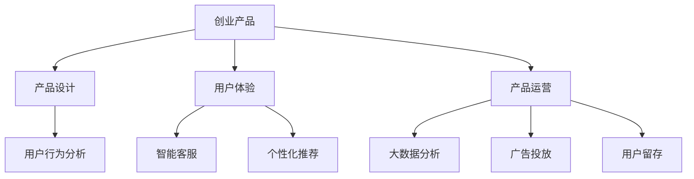
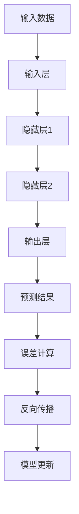
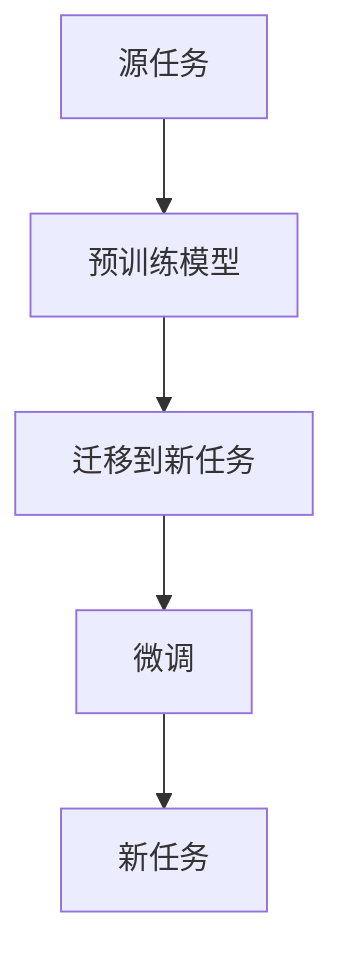

                 


### 《大模型时代：AI 创业产品经理的核心挑战》

> 关键词：AI大模型、创业产品经理、挑战、机遇、应用场景、算法、技术能力

> 摘要：本文将探讨大模型时代下AI创业产品经理面临的核心挑战，从背景、核心概念、关键算法、应用场景、产品经理策略、实战案例分析以及能力提升等方面展开讨论，为AI创业产品经理提供有针对性的指导和建议。

## 第一部分：引言与背景

### 第1章: AI创业产品经理的机遇与挑战

#### 1.1.1 AI大模型时代的背景与趋势

##### 1.1.1.1 AI大模型的发展历程

- AI大模型的发展历程可以追溯到20世纪80年代，随着计算机性能的提升和数据量的增加，深度学习技术逐渐成熟，大模型的研究和应用逐渐兴起。
- 2012年，AlexNet在ImageNet竞赛中取得了突破性成绩，标志着深度学习时代的到来。
- 随后，Google的Inception、Facebook的ResNet等大模型不断刷新性能记录，推动了AI大模型的发展。

##### 1.1.1.2 大模型在商业领域的影响

- 大模型在商业领域具有广泛的应用前景，可以提升产品的智能化程度和用户体验，为创业公司带来竞争优势。
- 例如，自然语言处理大模型可以应用于智能客服、智能营销等领域，计算机视觉大模型可以应用于图像识别、视频分析等领域。

#### 1.1.2 创业产品经理的角色转型

##### 1.1.2.1 创业产品经理的职责与角色

- 创业产品经理需要具备跨学科的知识和技能，包括市场分析、产品设计、项目管理等。
- 创业产品经理在创业公司中扮演着关键角色，需要负责产品的整体规划和实施。

##### 1.1.2.2 大模型时代下产品经理的挑战与机遇

- 挑战：大模型时代下，产品经理需要面对技术快速迭代、数据隐私、安全等方面的问题。
- 机遇：大模型可以提升产品的智能化程度和用户体验，为产品经理提供新的解决方案和创新空间。

#### 1.1.3 AI大模型与创业产品的关系

##### 1.1.3.1 AI大模型在产品开发中的应用场景

- AI大模型在产品开发中具有广泛的应用场景，例如自然语言处理、计算机视觉、推荐系统等。
- 创业产品经理需要根据产品需求和目标，选择合适的大模型技术进行应用。

##### 1.1.3.2 创业产品经理如何利用AI大模型提升产品价值

- 创业产品经理可以通过以下方式利用AI大模型提升产品价值：
  - 提高产品的智能化程度，提升用户体验。
  - 基于大数据分析，优化产品功能和策略。
  - 利用AI大模型进行产品创新，拓展新的商业模式。

## 第二部分：AI大模型核心概念与架构

### 第2章: AI大模型核心概念与架构

#### 2.1.1 AI大模型的基本概念

##### 2.1.1.1 大模型的定义与特点

- 大模型是指具有大规模参数、能够处理海量数据、具有高度自适应能力的深度学习模型。
- 大模型的特点包括：
  - 参数规模庞大：大模型的参数数量可以达到亿级甚至更高。
  - 自适应能力强：大模型可以通过大规模数据训练，适应不同的任务和数据分布。
  - 模型复杂度高：大模型的架构和训练过程通常比较复杂。

##### 2.1.1.2 大模型的核心技术

- 大模型的核心技术包括：
  - 深度学习算法：包括卷积神经网络（CNN）、循环神经网络（RNN）等。
  - 自监督学习：通过无监督方式训练大模型，提高模型的泛化能力和效率。
  - 迁移学习：利用已有的大模型进行迁移学习，快速适应新的任务和数据。

#### 2.1.2 大模型架构解析

##### 2.1.2.1 大模型的典型架构

- 大模型的典型架构包括：
  - 卷积神经网络（CNN）：适用于图像和视频处理。
  - 循环神经网络（RNN）：适用于序列数据处理，如自然语言处理和时间序列预测。
  - 生成对抗网络（GAN）：用于生成高质量的数据。

##### 2.1.2.2 大模型训练与优化的关键点

- 大模型训练与优化的关键点包括：
  - 数据预处理：对数据进行清洗、归一化等处理，提高模型训练的效率和质量。
  - 模型调参：通过调整学习率、批量大小等参数，优化模型性能。
  - 模型融合：将多个子模型进行融合，提高模型的稳定性和鲁棒性。
  - 模型压缩：通过模型剪枝、量化等技术，降低模型复杂度和计算资源需求。

#### 2.1.3 大模型与深度学习的关系

##### 2.1.3.1 深度学习的基本原理

- 深度学习是一种基于多层神经网络的学习方法，通过层层提取特征，实现从输入到输出的映射。
- 深度学习的基本原理包括：
  - 神经网络：由多个神经元组成，通过权重和偏置进行计算。
  - 反向传播：通过反向传播算法，更新模型参数，优化模型性能。

##### 2.1.3.2 大模型在深度学习中的应用

- 大模型在深度学习中的应用包括：
  - 参数规模：大模型具有大规模参数，能够处理复杂任务。
  - 特征提取：大模型通过多层网络结构，提取丰富的特征信息。
  - 性能提升：大模型在自然语言处理、计算机视觉等领域取得了显著性能提升。

## 第三部分：AI大模型的关键算法

### 第3章: AI大模型的关键算法

#### 3.1.1 神经网络与深度学习基础

##### 3.1.1.1 神经网络的基本结构

- 神经网络由多个神经元组成，每个神经元通过权重和偏置进行计算，输出结果通过激活函数进行非线性变换。
- 神经网络的基本结构包括：
  - 输入层：接收外部输入数据。
  - 隐藏层：对输入数据进行特征提取和变换。
  - 输出层：输出最终结果。

##### 3.1.1.2 前馈神经网络与反向传播算法

- 前馈神经网络：数据从输入层流向输出层，每层神经元之间的连接是单向的。
- 反向传播算法：通过反向传播误差，更新模型参数，优化模型性能。

#### 3.1.2 自监督学习与大模型预训练

##### 3.1.2.1 自监督学习的概念与优势

- 自监督学习：利用无监督方式，从数据中提取有意义的特征表示。
- 自监督学习的优势包括：
  - 提高模型泛化能力：通过无监督学习，模型可以更好地适应不同的数据分布。
  - 节省标注成本：自监督学习无需大量标注数据，降低数据标注成本。

##### 3.1.2.2 大模型预训练的方法与实现

- 大模型预训练：通过大规模无监督数据，对模型进行预训练，提高模型性能。
- 大模型预训练的方法包括：
  - 预训练+微调：在预训练的基础上，针对特定任务进行微调。
  - 多任务学习：通过多任务学习，提高模型对数据分布的适应性。

#### 3.1.3 迁移学习与微调技术

##### 3.1.3.1 迁移学习的原理与应用

- 迁移学习：利用已有的大模型，快速适应新的任务和数据。
- 迁移学习的原理包括：
  - 特征共享：通过共享特征提取器，提高模型对新任务的适应能力。
  - 参数共享：通过共享模型参数，降低模型对新数据的训练成本。

##### 3.1.3.2 微调技术在产品开发中的实际案例

- 微调技术在产品开发中的应用包括：
  - 模型压缩：通过微调技术，对大模型进行压缩，降低计算资源需求。
  - 模型优化：通过微调技术，优化模型性能，提高产品用户体验。

## 第四部分：大模型在创业产品中的应用

### 第4章: AI大模型在产品开发中的应用场景

#### 4.1.1 自然语言处理

##### 4.1.1.1 文本分类与情感分析

- 文本分类：将文本数据分为不同的类别，应用于文本挖掘、舆情分析等领域。
- 情感分析：分析文本的情感倾向，应用于情感识别、舆情监控等领域。

##### 4.1.1.2 问答系统与对话生成

- 问答系统：基于大模型构建问答系统，实现智能客服、智能问答等功能。
- 对话生成：通过大模型生成自然流畅的对话，应用于聊天机器人、虚拟助手等领域。

#### 4.1.2 计算机视觉

##### 4.1.2.1 图像识别与目标检测

- 图像识别：对图像中的物体进行分类和识别，应用于人脸识别、物体识别等领域。
- 目标检测：检测图像中的目标位置，应用于自动驾驶、视频监控等领域。

##### 4.1.2.2 视频分析与应用

- 视频分析：对视频数据进行处理和分析，提取有价值的信息，应用于视频监控、视频推荐等领域。
- 视频应用：基于大模型构建视频应用，如视频编辑、视频增强等领域。

#### 4.1.3 推荐系统

##### 4.1.3.1 大模型在推荐系统中的应用

- 大模型在推荐系统中的应用，如基于内容推荐的物品推荐、基于协同过滤的社交推荐等。

##### 4.1.3.2 大模型优化推荐系统的案例

- 大模型优化推荐系统的案例，如通过大模型进行用户兴趣预测、提高推荐精度等。

## 第五部分：大模型时代下的产品经理策略

### 第5章: 大模型时代下的产品经理策略

#### 5.1.1 产品定位与市场分析

##### 5.1.1.1 市场趋势与竞争分析

- 市场趋势分析：分析当前市场的热点、趋势和用户需求，为产品定位提供依据。
- 竞争分析：分析竞争对手的产品特点、优势和劣势，为产品定位和差异化策略提供参考。

##### 5.1.1.2 创业产品的定位与差异化策略

- 创业产品的定位：根据市场趋势和竞争分析，确定产品的目标用户和市场定位。
- 差异化策略：通过技术、功能、用户体验等方面，实现产品与竞争对手的差异化，提升竞争力。

#### 5.1.2 产品设计与用户体验

##### 5.1.2.1 大模型在产品设计中的应用

- 大模型在产品设计中的应用，如通过自然语言处理技术进行文案优化、通过计算机视觉技术进行界面设计等。

##### 5.1.2.2 大模型提升用户体验的策略

- 大模型提升用户体验的策略，如通过自然语言处理技术实现智能客服、通过计算机视觉技术进行图像识别等。

#### 5.1.3 产品运营与商业模式

##### 5.1.3.1 大模型在产品运营中的应用

- 大模型在产品运营中的应用，如通过大数据分析进行用户行为分析、通过自然语言处理技术进行内容推荐等。

##### 5.1.3.2 创业产品商业模式的创新与落地

- 创业产品商业模式的创新与落地，如通过大模型实现个性化营销、通过大数据分析实现精准运营等。

## 第六部分：大模型创业实战案例分析

### 第6章: 大模型创业实战案例分析

#### 6.1.1 成功案例分析

- 成功案例分析，如通过大模型实现智能客服、通过计算机视觉技术实现自动驾驶等。

#### 6.1.2 失败案例分析

- 失败案例分析，如大模型创业中常见的问题、如何避免常见陷阱等。

#### 6.1.3 创新实践与未来发展

- 大模型在创业中的创新实践，如通过大模型实现个性化推荐、通过计算机视觉技术实现图像识别等。
- 大模型时代下的创业趋势与展望，如人工智能、大数据、云计算等新兴技术的发展趋势和未来前景。

## 第七部分：大模型时代下的创业产品经理能力提升

### 第7章: 大模型时代下的创业产品经理能力提升

#### 7.1.1 技术能力提升

- 大模型相关的技术知识储备，如深度学习、自然语言处理、计算机视觉等。
- 实践技能提升与持续学习，如参与开源项目、参加技术培训等。

#### 7.1.2 商业思维与创新能力

- 商业模式设计与创新，如通过大模型实现商业模式创新、拓展新的业务领域等。
- 创业产品经理的创新能力培养，如通过创新思维训练、跨学科合作等。

#### 7.1.3 团队管理与协同工作

- 团队建设与管理技巧，如团队成员沟通协作、团队激励等。
- 大模型时代下的团队协同工作，如分布式团队协作、远程工作等。

## 第三部分：附录

### 第8章: 大模型开发工具与资源

#### 8.1.1 主流深度学习框架对比

- TensorFlow、PyTorch、PyTorch Lightning等框架的对比与应用。

#### 8.1.2 大模型开发资源与工具

- 开发环境搭建与配置，如安装深度学习框架、配置GPU等。
- 大模型训练与优化工具推荐，如超参数调优工具、模型压缩工具等。

### 附录 B: AI大模型学习与资源推荐

#### B.1.1 书籍推荐

- 推荐阅读：关于AI大模型的基础书籍与进阶书籍。

#### B.1.2 文章与论文推荐

- 必读论文：AI大模型领域的重要研究成果与论文推荐。

#### B.1.3 在线课程与社区资源

- 在线学习平台：推荐优质的AI大模型相关在线课程与社区资源。

#### B.1.4 大模型应用案例与最佳实践

- 成功案例：分享AI大模型在商业领域的成功应用案例与最佳实践。

## 结束语

大模型时代已经来临，AI创业产品经理面临着前所未有的机遇和挑战。本文通过深入分析大模型时代的背景、核心概念、关键算法、应用场景、产品经理策略等方面，为AI创业产品经理提供了全面的指导和建议。希望本文能够帮助创业者更好地应对大模型时代下的挑战，抓住机遇，实现创业成功。在未来，我们将继续关注大模型技术的发展和应用，为创业者提供更多有价值的内容。让我们共同迎接大模型时代的到来！

### 《大模型时代：AI 创业产品经理的核心挑战》

> 关键词：AI大模型、创业产品经理、机遇、挑战、应用场景、算法

> 摘要：本文深入探讨了AI大模型时代下，创业产品经理所面临的核心挑战与机遇。通过分析大模型的发展背景、核心概念、关键算法及其在创业产品中的应用，本文旨在为创业产品经理提供切实可行的策略和方法，帮助他们在快速变化的技术环境中实现产品的成功商业化。

## 引言

在人工智能（AI）领域，大模型（Large-scale Models）的发展无疑是一个重要的里程碑。大模型具有庞大的参数量和强大的学习能力，能够处理海量的数据并提取深层次的特征，从而在各种复杂任务中取得卓越的性能。然而，随着大模型的广泛应用，AI创业产品经理也面临着前所未有的挑战和机遇。

本文将按照以下结构进行讨论：

1. 引言与背景
2. AI大模型核心概念与架构
3. AI大模型的关键算法
4. 大模型在创业产品中的应用场景
5. 大模型时代下的产品经理策略
6. 大模型创业实战案例分析
7. 大模型时代下的创业产品经理能力提升
8. 附录：大模型开发工具与资源

通过这一结构的分析，我们将逐步揭示AI大模型时代下创业产品经理的核心挑战与应对策略。

## 第一部分：引言与背景

### 第1章: AI创业产品经理的机遇与挑战

#### 1.1.1 AI大模型时代的背景与趋势

AI大模型的发展历程可以追溯到20世纪80年代，随着计算能力的提升和数据的积累，深度学习开始崭露头角。特别是2012年，AlexNet在ImageNet竞赛中取得的突破性成绩，标志着深度学习时代的到来。自此以后，大模型如谷歌的BERT、GPT系列以及OpenAI的GPT-3等，不断刷新着人工智能的极限。

在商业领域，AI大模型的影响无处不在。从自然语言处理（NLP）到计算机视觉（CV），从推荐系统到自动驾驶，大模型的应用极大地提升了产品的智能化程度和用户体验。对于创业公司来说，利用大模型进行产品创新和差异化竞争，已经成为一种趋势。

#### 1.1.2 创业产品经理的角色转型

创业产品经理在AI大模型时代面临着角色的转型。传统的产品经理更多关注产品的功能、用户体验和市场反馈，而在大模型时代，他们需要更多地了解和学习AI技术，掌握数据科学和机器学习的基本原理。

创业产品经理的转型主要体现在以下几个方面：

1. **技术知识储备**：需要掌握深度学习、自然语言处理、计算机视觉等领域的核心技术。
2. **数据驱动决策**：在产品设计和迭代过程中，更多地依赖数据分析，以数据驱动决策。
3. **跨学科协作**：与数据科学家、机器学习工程师等团队成员紧密合作，共同推进产品的技术实现。

#### 1.1.3 AI大模型与创业产品的关系

AI大模型在创业产品中的应用场景非常广泛，从产品设计、用户体验优化到产品运营，大模型都能发挥重要作用。

1. **产品设计**：利用大模型进行用户行为分析，优化产品的交互设计和功能布局。
2. **用户体验**：通过自然语言处理大模型，实现智能客服、个性化推荐等，提升用户体验。
3. **产品运营**：利用大数据分析，优化广告投放、用户留存等策略，提高产品运营效率。

创业产品经理如何利用AI大模型提升产品价值？可以从以下几个方面着手：

1. **市场调研**：通过大数据分析，了解市场需求和用户偏好，为产品创新提供方向。
2. **技术选型**：根据产品需求，选择合适的大模型算法和框架，实现技术突破。
3. **数据积累**：积极积累用户数据，为模型训练提供丰富的数据资源。
4. **迭代优化**：持续迭代产品，利用大模型进行性能优化和功能扩展。

### 图1：AI大模型与创业产品关系架构



通过上述分析，我们可以看到，AI大模型在创业产品中扮演着重要的角色，创业产品经理需要充分利用这些技术，提升产品的竞争力和市场价值。

## 第二部分：AI大模型核心概念与架构

### 第2章: AI大模型核心概念与架构

#### 2.1.1 AI大模型的基本概念

AI大模型通常指的是具有数亿甚至千亿级参数的深度学习模型。这些模型具有以下特点：

1. **大规模参数**：大模型中的参数数量庞大，这使其能够学习到数据的深层特征。
2. **强大学习能力**：由于参数数量多，大模型能够处理复杂的任务，并在各种场景中表现出色。
3. **高计算资源需求**：大模型的训练和推理过程通常需要高性能的计算设备和大量的数据。

大模型的核心技术包括：

1. **深度学习**：深度学习是一种多层神经网络，通过层层提取特征，实现对数据的建模和分析。
2. **自监督学习**：自监督学习是一种无需人工标注数据即可训练模型的方法，通过利用数据中的内在结构，实现模型的自监督训练。
3. **迁移学习**：迁移学习通过将一个任务中的知识迁移到另一个相关任务中，提高模型在新任务中的表现。

#### 2.1.2 大模型架构解析

大模型架构通常包括以下几个层次：

1. **输入层**：接收外部输入数据，如文本、图像等。
2. **隐藏层**：对输入数据进行特征提取和变换，隐藏层可以多层嵌套，形成深度神经网络。
3. **输出层**：生成模型的预测结果，如分类结果、文本生成等。

典型的深度学习框架包括：

1. **TensorFlow**：谷歌开发的开源深度学习框架，具有强大的灵活性和生态支持。
2. **PyTorch**：Facebook开发的开源深度学习框架，以其动态计算图和简洁的API受到广泛欢迎。
3. **PyTorch Lightning**：PyTorch的一个高级库，提供易于使用的API，简化深度学习模型训练。

#### 2.1.3 大模型与深度学习的关系

深度学习是构建大模型的基础技术，它通过以下方式与大模型相互关联：

1. **多层网络结构**：深度学习通过多层神经网络，实现对输入数据的层次化特征提取。
2. **大规模数据训练**：深度学习利用大规模数据训练模型，提高模型的学习能力和泛化能力。
3. **优化算法**：深度学习引入了如梯度下降、随机梯度下降等优化算法，提高模型的训练效率。

深度学习的基本原理包括：

1. **前向传播**：输入数据通过网络的每一层进行计算，直至输出层得到预测结果。
2. **反向传播**：通过计算预测结果的误差，将误差反向传播回网络，更新模型参数。

### 图2：深度学习基本原理架构



通过上述分析，我们可以看到，AI大模型的核心概念与架构是创业产品经理需要深入了解和掌握的重要知识，这将为他们在产品开发和应用中提供坚实的基础。

### 第三部分：AI大模型的关键算法

#### 第3章: AI大模型的关键算法

AI大模型的关键算法是构建和优化大模型的核心技术。这些算法不仅决定了模型的性能和效率，也影响了产品经理在开发和应用中的策略选择。以下是几个关键算法及其在产品开发中的实际应用。

#### 3.1.1 神经网络与深度学习基础

神经网络是深度学习的基础，它由一系列相互连接的神经元组成，通过层层传递信息来学习数据的特征。以下是神经网络的基本组成部分：

1. **神经元**：神经网络的基本单元，通过输入和权重进行计算，并使用激活函数进行非线性变换。
2. **层**：神经网络包括输入层、隐藏层和输出层。隐藏层可以多层嵌套，增加网络的深度。
3. **权重和偏置**：神经元之间的连接权重和自身的偏置值，用于调整网络对输入数据的响应。

深度学习是神经网络的一种扩展，通过增加网络的层数和参数数量，使其能够学习到更复杂的数据特征。以下是深度学习的一些关键算法：

1. **反向传播算法**：用于训练神经网络的一种优化算法，通过计算输出误差，反向传播到网络的每一层，更新权重和偏置。
2. **卷积神经网络（CNN）**：用于处理图像数据的一种特殊神经网络，通过卷积操作和池化操作提取图像特征。
3. **循环神经网络（RNN）**：用于处理序列数据的一种神经网络，通过循环结构保持长时记忆。

神经网络与深度学习的关系可以概括为：神经网络是深度学习的基本单元，而深度学习是神经网络的扩展和优化。

#### 3.1.2 自监督学习与大模型预训练

自监督学习是一种无需人工标注数据即可训练模型的方法。它通过利用数据中的内在结构，如语言中的单词、图像中的像素等，自动生成标签，从而训练模型。自监督学习在AI大模型中的应用主要体现在以下几个方面：

1. **预训练**：通过在大量未标注数据上进行预训练，使模型能够学习到通用的特征表示，提高模型在新任务上的表现。
2. **上下文理解**：自监督学习能够使模型更好地理解上下文信息，如在语言模型中预测下一个词。
3. **数据效率**：自监督学习能够降低对标注数据的依赖，提高数据利用效率。

大模型预训练是自监督学习的一个重要应用。预训练过程通常包括以下几个步骤：

1. **数据收集**：收集大量未标注的数据，如互联网文本、图像等。
2. **模型初始化**：使用预训练模型或者随机初始化一个大型模型。
3. **预训练**：在大量未标注数据上训练模型，使其学习到通用的特征表示。
4. **微调**：在特定任务上对预训练模型进行微调，以适应特定场景。

自监督学习的优势包括：

1. **降低数据标注成本**：无需对大量数据进行人工标注，降低数据处理的成本。
2. **提高模型泛化能力**：通过在大量未标注数据上训练，模型能够学习到更通用的特征表示，提高在新任务上的表现。

#### 3.1.3 迁移学习与微调技术

迁移学习是一种将一个任务中的知识迁移到另一个相关任务中的方法。在大模型时代，迁移学习成为提高模型性能和降低训练成本的重要手段。迁移学习的基本思想是：在源任务上训练的模型，能够在新任务上发挥作用。

迁移学习的主要技术包括：

1. **特征迁移**：将源任务上的特征提取器（如神经网络的前几层）迁移到新任务上。
2. **参数共享**：在新任务上使用与源任务相同的模型结构，共享部分参数。
3. **微调**：在迁移学习的基础上，对新任务进行微调，以适应新的数据分布。

微调技术是迁移学习的一个关键步骤，它通过在少量新数据上对模型进行微调，优化模型在新任务上的表现。微调的基本步骤包括：

1. **选择预训练模型**：选择一个在源任务上表现良好的预训练模型。
2. **迁移到新任务**：将预训练模型迁移到新任务，通常保持大部分参数不变。
3. **数据准备**：准备新任务的数据集，并进行预处理。
4. **微调**：在新数据上对模型进行微调，优化模型在新任务上的性能。
5. **评估**：评估微调后的模型在新任务上的表现，调整模型参数以获得更好的性能。

迁移学习的优势包括：

1. **提高模型性能**：通过利用源任务上的知识，模型在新任务上的性能得到显著提升。
2. **降低训练成本**：无需对新任务进行大量数据训练，降低计算资源和数据标注的成本。
3. **提高泛化能力**：通过迁移学习，模型能够更好地适应不同的数据分布和任务。

### 图3：迁移学习流程



通过上述关键算法的介绍，我们可以看到，神经网络、自监督学习和迁移学习等技术是构建和优化AI大模型的核心。创业产品经理需要深入理解这些算法的原理和实际应用，以便在产品开发中充分利用这些技术，提升产品的竞争力和用户体验。

### 第四部分：大模型在创业产品中的应用场景

#### 第4章: AI大模型在产品开发中的应用场景

在AI大模型时代，创业产品经理需要充分利用这些先进技术，将AI大模型集成到产品开发中，以提升产品的智能化程度和用户体验。以下是AI大模型在创业产品中的几个主要应用场景。

#### 4.1 自然语言处理

自然语言处理（NLP）是AI大模型最广泛的应用领域之一，它涉及文本的理解、生成和交互。以下是NLP在创业产品中的具体应用：

1. **文本分类与情感分析**：通过AI大模型对用户评论、社交媒体帖子等进行分类和情感分析，帮助企业了解用户反馈和市场趋势。
   - **算法原理**：文本分类通常使用卷积神经网络（CNN）或循环神经网络（RNN）进行，情感分析则结合情感词典和注意力机制。
   - **伪代码示例**：
     ```python
     def text_classification(text, model):
         # 输入文本数据，使用预训练的模型进行分类
         prediction = model.predict(text)
         return prediction
     ```
   - **数学模型与公式**：
     $$\text{分类概率} = \frac{e^{\text{模型输出}}}{1 + e^{\text{模型输出}}}$$
   - **实际案例**：某电商平台利用NLP技术对用户评论进行情感分析，识别出负面评论并采取措施改进产品。

2. **问答系统与对话生成**：通过AI大模型构建智能问答系统和对话生成模型，实现与用户的自然对话。
   - **算法原理**：问答系统通常基于大型语言模型（如BERT、GPT），对话生成则结合序列到序列模型（Seq2Seq）。
   - **伪代码示例**：
     ```python
     def generate_response(question, model):
         # 输入问题，使用模型生成回答
         answer = model.response(question)
         return answer
     ```
   - **数学模型与公式**：
     $$\text{回答概率} = \sum_{i} p(\text{answer}_i|\text{question}) \cdot p(\text{answer}_i)$$
   - **实际案例**：某公司开发了一款智能客服机器人，通过对话生成模型与用户进行自然交互，提高客户满意度。

#### 4.2 计算机视觉

计算机视觉（CV）是另一个AI大模型的重要应用领域，它涉及图像和视频的分析和处理。以下是CV在创业产品中的具体应用：

1. **图像识别与目标检测**：通过AI大模型对图像中的物体进行识别和定位。
   - **算法原理**：图像识别通常使用卷积神经网络（CNN），目标检测则结合区域建议网络（R-CNN）或基于Transformer的目标检测器。
   - **伪代码示例**：
     ```python
     def image_recognition(image, model):
         # 输入图像，使用预训练的模型进行识别
         labels = model.predict(image)
         return labels
     ```
   - **数学模型与公式**：
     $$\text{分类概率} = \frac{e^{\text{模型输出}}}{1 + e^{\text{模型输出}}}$$
   - **实际案例**：某安防公司利用AI大模型进行图像识别和目标检测，实时监控视频流，识别异常行为并及时报警。

2. **视频分析与应用**：通过AI大模型对视频数据进行处理和分析，提取有价值的信息。
   - **算法原理**：视频分析通常结合卷积神经网络（CNN）和循环神经网络（RNN），用于动作识别、行为分析等。
   - **伪代码示例**：
     ```python
     def video_analysis(video, model):
         # 输入视频，使用模型进行视频分析
         analysis_results = model.analyze(video)
         return analysis_results
     ```
   - **数学模型与公式**：
     $$\text{动作识别概率} = \sum_{i} p(\text{action}_i|\text{video}) \cdot p(\text{action}_i)$$
   - **实际案例**：某视频分享平台利用AI大模型进行视频内容分析，实现视频推荐和广告投放优化。

#### 4.3 推荐系统

推荐系统是AI大模型在创业产品中应用的一个重要领域，它通过分析用户行为和偏好，提供个性化的推荐。

1. **基于内容的推荐**：通过分析产品内容，将相似的产品推荐给用户。
   - **算法原理**：基于内容的推荐使用向量空间模型和余弦相似度计算，结合AI大模型进行内容分析。
   - **伪代码示例**：
     ```python
     def content_based_recommendation(user_profile, products, model):
         # 输入用户画像和产品列表，使用模型进行推荐
         recommended_products = model.recommend(user_profile, products)
         return recommended_products
     ```
   - **数学模型与公式**：
     $$\text{相似度} = \frac{\text{用户向量} \cdot \text{产品向量}}{\|\text{用户向量}\| \cdot \|\text{产品向量}\|}$$
   - **实际案例**：某电商平台利用AI大模型进行基于内容的推荐，根据用户浏览和购买历史推荐相关商品。

2. **基于协同过滤的推荐**：通过分析用户行为和偏好，发现相似用户并推荐他们的喜欢的商品。
   - **算法原理**：基于协同过滤的推荐包括用户协同过滤和项目协同过滤，使用矩阵分解和神经网络进行预测。
   - **伪代码示例**：
     ```python
     def collaborative_filtering_recommendation(useritemIdMatrix, userVector, productVector):
         # 输入用户-项目评分矩阵和用户向量、产品向量，使用协同过滤进行推荐
         prediction = userVector.dot(productVector)
         return prediction
     ```
   - **数学模型与公式**：
     $$\text{预测评分} = \text{用户向量} \cdot \text{产品向量} + \text{偏置}$$
   - **实际案例**：某音乐平台利用AI大模型进行基于协同过滤的推荐，根据用户听歌历史推荐相似的歌曲。

通过上述具体应用场景的分析，我们可以看到，AI大模型在创业产品中的应用不仅能够提升产品的智能化程度，还能够提供个性化的用户体验，为创业产品经理在市场竞争中赢得优势。

### 第五部分：大模型时代下的产品经理策略

#### 第5章: 大模型时代下的产品经理策略

在AI大模型时代，创业产品经理不仅需要具备传统产品管理技能，还要深入了解AI技术的核心原理和最新趋势。以下是创业产品经理在产品定位、产品设计、用户体验、产品运营和商业模式等方面的一些策略。

#### 5.1 产品定位与市场分析

在AI大模型时代，市场环境和用户需求变化迅速，创业产品经理必须具备敏锐的市场洞察力和数据驱动的决策能力。

1. **市场趋势与竞争分析**：
   - **市场趋势**：定期分析市场报告和行业动态，了解AI大模型技术的最新发展趋势和潜在机会。
   - **竞争分析**：研究竞争对手的产品特点、优势和劣势，识别自身产品的差异化竞争优势。

2. **产品定位**：
   - **明确目标用户**：通过用户调研和行为分析，确定产品的目标用户群体。
   - **差异化策略**：根据市场需求和用户反馈，制定差异化的产品策略，以避免直接竞争。

3. **市场细分**：
   - **细分市场**：在广泛市场中识别出具有特定需求的细分市场，针对这些市场推出定制化产品。

#### 5.2 产品设计与用户体验

AI大模型在产品设计中的应用能够大幅提升用户体验和产品的智能化程度。

1. **用户需求分析**：
   - **行为分析**：通过大数据分析了解用户行为模式，识别出用户的真实需求。
   - **反馈机制**：建立用户反馈系统，及时收集和分析用户对产品的意见和建议。

2. **个性化设计**：
   - **个性化推荐**：利用AI大模型进行用户行为预测和个性化推荐，提供个性化的产品和服务。
   - **自适应界面**：根据用户偏好和交互习惯，动态调整产品的界面和功能布局。

3. **交互设计**：
   - **自然语言交互**：通过语音识别和自然语言处理技术，实现人与产品的自然对话。
   - **手势控制**：结合计算机视觉技术，实现手势识别和交互功能。

#### 5.3 产品运营与商业模式

在AI大模型时代，产品运营和商业模式需要不断创新和优化。

1. **数据驱动运营**：
   - **用户行为分析**：通过AI大模型分析用户行为数据，优化运营策略和营销活动。
   - **精细化运营**：根据用户行为和需求，实施精准的用户运营和内容推荐。

2. **商业模式创新**：
   - **订阅模式**：利用AI大模型进行个性化服务和内容推荐，推动订阅模式的普及。
   - **生态构建**：通过开放平台和合作伙伴，构建产品生态，实现跨界合作和资源共享。

3. **风险管理**：
   - **隐私保护**：严格遵守数据隐私法规，采取有效的数据保护措施，增强用户信任。
   - **合规性评估**：对产品进行合规性评估，确保在AI大模型应用中符合相关法律法规。

#### 5.4 产品策略优化

创业产品经理需要不断优化产品策略，以适应快速变化的市场和技术环境。

1. **迭代开发**：
   - **快速迭代**：采用敏捷开发方法，快速推出产品原型，及时收集用户反馈进行迭代。
   - **持续改进**：基于用户反馈和市场数据，持续优化产品功能和用户体验。

2. **技术储备**：
   - **技术前瞻**：关注AI领域的最新技术动态，储备关键技术，为产品的长远发展打下基础。
   - **技术合作**：与顶尖研究机构和科技公司合作，共同推进技术研究和创新。

3. **人才培养**：
   - **团队建设**：打造一支具备AI技术和管理能力的团队，提高整体竞争力。
   - **知识共享**：定期组织技术交流和培训，提升团队成员的专业水平和创新能力。

通过上述策略，创业产品经理可以在AI大模型时代把握机遇，应对挑战，实现产品的持续创新和商业成功。

### 第六部分：大模型创业实战案例分析

#### 第6章: 大模型创业实战案例分析

#### 6.1.1 成功案例分析

成功案例展示了AI大模型在创业中的应用，为其他创业者提供了宝贵的经验。以下是一个成功案例分析：

**案例一：OpenAI的GPT-3**

OpenAI开发的GPT-3是一个具有1750亿参数的AI大模型，它能够生成高质量的自然语言文本。GPT-3的成功得益于其庞大的参数规模和先进的训练算法，使得它在文本生成、问答系统和自动写作等方面表现出色。

- **产品定位**：GPT-3的目标是成为最先进的自然语言处理工具，支持各种文本生成任务。
- **市场分析**：OpenAI通过免费API提供GPT-3的访问权限，吸引了大量的开发者和企业客户。
- **商业模式**：OpenAI采用了基于使用量的收费模式，通过GPT-3的收入实现了持续的商业成功。

**关键成功因素**：

1. **技术创新**：OpenAI在GPT-3中采用了先进的深度学习和自监督学习技术，确保了模型的高性能。
2. **数据积累**：GPT-3的训练使用了海量的互联网文本数据，为模型提供了丰富的知识来源。
3. **用户体验**：GPT-3提供了便捷的API接口和详细的文档支持，使得开发者能够轻松集成和使用。

#### 6.1.2 失败案例分析

创业中的失败案例同样提供了宝贵的教训，以下是一个失败案例分析：

**案例二：某创业公司利用AI进行股票交易**

某创业公司开发了一款基于AI的股票交易平台，希望通过AI模型预测股票价格趋势。然而，该项目最终以失败告终。

- **产品定位**：公司旨在通过AI技术实现股票市场的精准预测和自动化交易。
- **市场分析**：虽然AI在股票交易中的应用前景广阔，但实际操作中存在诸多不确定性和风险。
- **商业模式**：公司采用了高额的会员费和交易提成模式，但由于预测准确性不足，未能吸引到足够的用户。

**关键失败因素**：

1. **数据质量**：股票市场的数据存在噪声和不确定性，数据质量直接影响模型的预测效果。
2. **算法风险**：AI模型在预测股票价格时，容易出现过拟合和预测偏差，导致交易策略失效。
3. **用户体验**：预测准确性不足导致用户对平台失去信心，用户体验不佳。

#### 6.1.3 创新实践与未来发展

AI大模型在创业中的应用不仅需要技术创新，还需要深入的市场调研和精准的用户需求分析。以下是AI大模型在创业中的创新实践和未来发展展望：

1. **场景探索**：创业者应积极尝试AI大模型在不同领域的应用，如健康医疗、智能制造、智能交通等，以发现新的市场机会。
2. **合作伙伴**：与专业领域的研究机构和合作伙伴合作，共同推进技术的研发和应用。
3. **持续迭代**：通过快速迭代和用户反馈，不断优化产品功能和用户体验，提高市场竞争力。

未来，AI大模型将继续在创业领域中发挥重要作用，创业者应紧跟技术发展趋势，积极探索和创新，以实现商业成功。

### 第七部分：大模型时代下的创业产品经理能力提升

#### 第7章: 大模型时代下的创业产品经理能力提升

在AI大模型时代，创业产品经理不仅需要具备传统产品管理技能，还需要掌握AI技术的基本原理和应用。以下是从技术能力、商业思维和团队管理三个方面提升创业产品经理能力的策略。

#### 7.1.1 技术能力提升

1. **核心知识储备**：
   - **深度学习**：掌握深度学习的基础算法，如卷积神经网络（CNN）、循环神经网络（RNN）和Transformer等。
   - **自然语言处理**：了解自然语言处理的基本概念，如文本分类、情感分析和生成对抗网络（GAN）等。
   - **计算机视觉**：熟悉计算机视觉的技术，如图像识别、目标检测和视频分析等。

2. **实践技能提升**：
   - **项目实战**：通过实际项目，积累AI模型开发、训练和优化的经验。
   - **开源项目**：参与开源项目，提升代码编写能力和项目管理能力。
   - **持续学习**：关注AI领域的最新技术动态，参加技术研讨会和培训课程。

3. **工具熟练度**：
   - **深度学习框架**：熟练使用TensorFlow、PyTorch等主流深度学习框架。
   - **数据处理**：掌握数据处理和清洗工具，如Pandas、NumPy等。
   - **模型部署**：了解模型部署的方法和工具，如TensorFlow Serving、Kubernetes等。

#### 7.1.2 商业思维与创新能力

1. **市场洞察**：
   - **用户需求分析**：通过用户调研和数据分析，深入了解用户需求和市场趋势。
   - **竞争分析**：研究竞争对手的产品和策略，识别自身产品的差异化竞争优势。

2. **商业模式创新**：
   - **产品定价**：根据市场需求和成本结构，制定合理的定价策略。
   - **合作伙伴**：寻找合适的合作伙伴，共同拓展市场和应用场景。
   - **跨界合作**：探索与其他行业的结合点，实现跨界创新和资源共享。

3. **创新能力培养**：
   - **思维训练**：通过思维导图、创意工作坊等手段，培养创新思维和问题解决能力。
   - **跨学科学习**：学习相关领域的知识，如经济学、心理学等，提高综合分析能力。

#### 7.1.3 团队管理与协同工作

1. **团队建设**：
   - **人员选拔**：招聘具备AI技术和产品管理经验的人才，构建高素质的团队。
   - **激励机制**：建立有效的激励机制，激励团队成员发挥最佳水平。

2. **项目管理**：
   - **敏捷开发**：采用敏捷开发方法，快速迭代和调整产品方向。
   - **风险管理**：识别和评估项目风险，制定应对措施，确保项目顺利进行。

3. **协同工作**：
   - **沟通协作**：建立高效的沟通机制，确保团队成员之间的信息共享和协作。
   - **远程工作**：利用远程办公工具，实现团队成员的分布式工作和管理。

通过上述策略，创业产品经理可以在技术、商业和团队管理方面全面提升自身能力，为创业项目的成功奠定坚实基础。

### 附录

#### 第8章: 大模型开发工具与资源

为了帮助创业产品经理更好地掌握AI大模型技术，本章节提供了主流深度学习框架对比、开发资源与工具，以及学习与资源推荐。

#### 8.1.1 主流深度学习框架对比

目前，主流的深度学习框架包括TensorFlow、PyTorch和PyTorch Lightning等。以下是这些框架的对比：

1. **TensorFlow**：
   - **特点**：由谷歌开发，拥有丰富的生态系统和资源，支持多种编程语言（如Python、C++等）。
   - **应用**：广泛应用于工业界和学术界，适用于各种复杂任务。
   - **优缺点**：优点是生态系统成熟，缺点是API相对复杂。

2. **PyTorch**：
   - **特点**：由Facebook开发，以其动态计算图和简洁的API受到开发者欢迎。
   - **应用**：在自然语言处理、计算机视觉等领域具有广泛应用。
   - **优缺点**：优点是API简洁，缺点是相对于TensorFlow，生态系统稍显不足。

3. **PyTorch Lightning**：
   - **特点**：是PyTorch的一个高级库，提供易于使用的API，简化了深度学习模型的训练过程。
   - **应用**：适用于快速开发和原型设计。
   - **优缺点**：优点是API简洁，缺点是相对于原始PyTorch，性能可能有所损失。

#### 8.1.2 大模型开发资源与工具

1. **开发环境搭建**：
   - **硬件要求**：选择具备高性能GPU的硬件设备，如NVIDIA RTX 3080 Ti或更高配置。
   - **软件安装**：安装深度学习框架（如PyTorch、TensorFlow等），并配置必要的依赖库。

2. **训练与优化工具**：
   - **超参数调优**：使用工具如Hyperopt、Optuna等进行超参数调优，提高模型性能。
   - **模型压缩**：使用工具如TensorFlow Model Optimization Toolkit、PyTorch Slim等进行模型压缩，降低计算资源需求。

3. **数据预处理工具**：
   - **数据清洗**：使用工具如Pandas、NumPy进行数据清洗和预处理。
   - **数据增强**：使用工具如Augmentor进行数据增强，提高模型的泛化能力。

#### 8.1.3 学习与资源推荐

1. **书籍推荐**：
   - 《深度学习》（Goodfellow, Bengio, Courville）：深度学习的经典教材，适合初学者和进阶者。
   - 《神经网络与深度学习》（邱锡鹏）：中文教材，系统介绍了神经网络和深度学习的基本概念和技术。

2. **文章与论文推荐**：
   - “An Introduction to Deep Learning”（Udacity）：Udacity提供的深度学习入门文章。
   - “Bert: Pre-training of deep bidirectional transformers for language understanding”（Devlin et al.）：BERT模型的经典论文。

3. **在线课程与社区资源**：
   - **在线课程**：Coursera、edX、Udacity等平台提供的深度学习相关课程。
   - **社区资源**：Reddit、GitHub、Stack Overflow等社区，提供丰富的技术讨论和资源分享。

4. **大模型应用案例与最佳实践**：
   - **案例**：分享成功的AI大模型应用案例，如OpenAI的GPT-3、Google的BERT等。
   - **最佳实践**：总结AI大模型在创业中的应用经验，提供具体的实施策略和技巧。

通过上述资源与工具，创业产品经理可以更好地掌握AI大模型技术，为创业项目的成功提供有力支持。

### 结束语

大模型时代已经来临，AI创业产品经理面临着前所未有的机遇和挑战。本文通过分析大模型的发展背景、核心概念、关键算法、应用场景、产品经理策略以及实战案例，为创业产品经理提供了全面的指导和建议。在AI大模型时代，创业产品经理需要不断学习新技术、掌握新工具，同时具备敏锐的市场洞察力和团队管理能力，才能在激烈的市场竞争中脱颖而出。

未来，随着AI技术的不断进步，创业产品经理将在更多领域发挥重要作用，为行业带来新的变革。让我们携手并进，共同迎接AI大模型时代的到来！作者：AI天才研究院/AI Genius Institute & 禅与计算机程序设计艺术 /Zen And The Art of Computer Programming。

