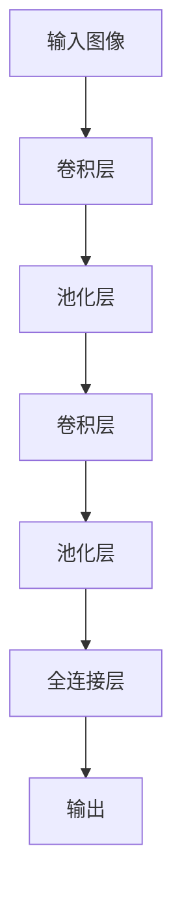
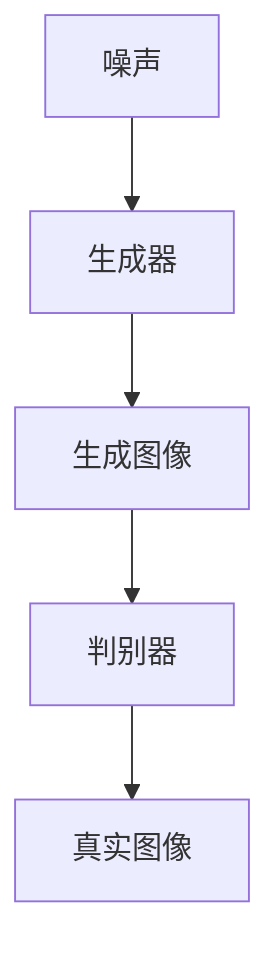
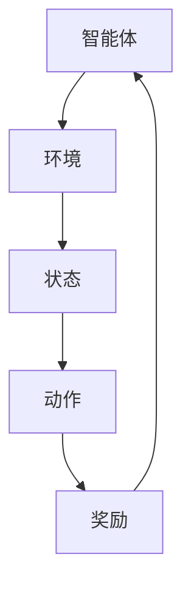
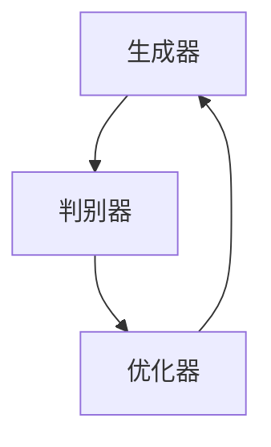

                 

### 文章标题：大模型时代：AI创业产品趋势解读

> 关键词：大模型、AI创业、产品趋势、技术解读

> 摘要：本文从大模型时代的背景入手，深入探讨了AI创业产品的发展趋势。通过分析大模型在自然语言处理、计算机视觉、推荐系统和金融科技等领域的应用，本文提出了大模型时代下创业者应具备的能力和创业实践策略，并对未来趋势进行了展望。

### 《大模型时代：AI创业产品趋势解读》目录大纲

#### 第一部分：大模型时代背景

##### 第1章：大模型时代的崛起

###### 1.1.1 AI与创业的深度融合

- **大模型在AI领域的兴起**：介绍大模型的定义和发展历程，以及其对AI领域的影响。
- **大模型对创业的影响**：分析大模型时代为创业者带来的机遇和挑战。

###### 1.1.2 大模型在产品开发中的应用

- **大模型的定义与特点**：详细阐述大模型的定义、原理和特点。
- **大模型在产品开发中的具体应用场景**：探讨大模型在各个产品领域中的应用。

###### 1.1.3 大模型时代的创业机会

- **大模型时代的创业趋势**：分析当前大模型时代下的创业趋势和热点领域。
- **创业者应考虑的因素**：讨论创业者在大模型时代下应如何选择项目方向。

##### 第2章：大模型技术基础

###### 2.1 大模型的技术原理

- **大模型的核心算法**：介绍大模型的核心算法，如Transformer、BERT等。
- **大模型的计算框架**：阐述大模型在计算框架方面的优势和发展。

###### 2.2 大模型的训练与优化

- **大模型的训练方法**：分析大模型训练的方法和技巧。
- **大模型的优化技巧**：探讨大模型优化方面的策略和技巧。

###### 2.3 大模型的部署与运维

- **大模型的部署策略**：介绍大模型部署的策略和方案。
- **大模型的运维挑战与解决方案**：分析大模型运维中的挑战和解决方案。

#### 第二部分：大模型在AI创业中的应用

##### 第3章：大模型在自然语言处理中的应用

- **大模型在自然语言处理中的核心算法**：介绍大模型在自然语言处理中的核心算法，如BERT、GPT等。
- **大模型在自然语言处理中的实践**：分析大模型在自然语言处理中的实际应用，如文本分类、机器翻译等。
- **大模型在自然语言处理中的挑战与机遇**：探讨大模型在自然语言处理中的性能优化和未来趋势。

##### 第4章：大模型在计算机视觉中的应用

- **大模型在计算机视觉中的核心算法**：介绍大模型在计算机视觉中的核心算法，如卷积神经网络（CNN）、生成对抗网络（GAN）等。
- **大模型在计算机视觉中的实践**：分析大模型在计算机视觉中的实际应用，如图像分类、目标检测等。
- **大模型在计算机视觉中的挑战与机遇**：探讨大模型在计算机视觉中的计算资源需求和未来趋势。

##### 第5章：大模型在推荐系统中的应用

- **大模型在推荐系统中的核心算法**：介绍大模型在推荐系统中的核心算法，如协同过滤、内容推荐等。
- **大模型在推荐系统中的实践**：分析大模型在推荐系统中的实际应用，如电商推荐、社交媒体推荐等。
- **大模型在推荐系统中的挑战与机遇**：探讨大模型在推荐系统中的实时性要求和未来趋势。

##### 第6章：大模型在金融科技中的应用

- **大模型在金融科技中的核心算法**：介绍大模型在金融科技中的核心算法，如强化学习、深度强化学习等。
- **大模型在金融科技中的实践**：分析大模型在金融科技中的实际应用，如风险评估、智能投顾等。
- **大模型在金融科技中的挑战与机遇**：探讨大模型在金融科技中的合规性要求和未来趋势。

##### 第7章：大模型时代的创业实战

- **创业项目的选择**：讨论创业者如何选择项目方向。
- **创业项目的实施**：分析创业项目的规划与执行。
- **创业项目的运营与成长**：探讨创业项目的用户增长策略和商业模式创新。

#### 第三部分：大模型时代的创业趋势与未来展望

##### 第8章：大模型时代的创业趋势

- **创业者应具备的能力**：讨论创业者应具备的技术能力和商业敏锐度。
- **创业领域的热点**：分析当前创业领域的热点和趋势。
- **创业环境的变化**：探讨政策支持和投资趋势对创业环境的影响。

##### 第9章：大模型时代的未来展望

- **大模型的未来发展**：探讨大模型在性能提升和多样化应用方面的前景。
- **创业的未来方向**：分析创业的未来方向和趋势。
- **大模型时代的创业机遇**：讨论大模型时代下的创业机遇。

##### 第10章：结语

- **大模型时代的机遇与挑战**：总结大模型时代下的机遇和挑战。
- **大模型时代的启示**：探讨大模型时代对创业者和整个社会的影响。

### 附录：大模型资源与工具

- **大模型开发工具**：介绍TensorFlow、PyTorch等大模型开发工具。
- **大模型开源项目**：介绍GLM2、LLaMA等大模型开源项目。
- **大模型研究机构与论文**：介绍OpenAI、Google AI等大模型研究机构和相关论文。

以上是《大模型时代：AI创业产品趋势解读》的目录大纲。接下来，我们将按照这个大纲，逐步深入分析大模型时代下的AI创业产品趋势。让我们一步步思考，探寻大模型时代的奥秘。期待与您一同开启这段探索之旅。

---

### 第一部分：大模型时代背景

#### 第1章：大模型时代的崛起

##### 1.1.1 AI与创业的深度融合

**大模型在AI领域的兴起**

在过去的几十年里，人工智能（AI）技术经历了从理论到应用的飞速发展。特别是深度学习（Deep Learning）的兴起，使得人工智能在语音识别、图像处理、自然语言处理等领域取得了显著的突破。随着计算能力的提升和数据的积累，研究人员和创业者开始探索更大规模、更复杂的人工神经网络模型，即大模型（Large Models）。

大模型的兴起，可以追溯到2018年Google推出的BERT（Bidirectional Encoder Representations from Transformers）模型。BERT模型在当时突破了自然语言处理（NLP）领域的多项记录，引发了学术界和工业界对大模型的关注。随后，OpenAI发布了GPT-3，一个拥有1750亿参数的预训练语言模型，再次刷新了大模型的概念。

**大模型对创业的影响**

大模型的兴起，不仅推动了AI技术的发展，也为创业领域带来了新的机遇和挑战。

**机遇**：

1. **技术壁垒降低**：大模型的出现，使得创业者可以利用现有的开源框架和模型，快速搭建自己的AI产品。这降低了AI创业的门槛，使得更多创业者有机会进入这个领域。
2. **应用场景丰富**：大模型在各个领域的应用，如自然语言处理、计算机视觉、推荐系统、金融科技等，为创业者提供了丰富的应用场景。创业者可以根据市场需求，选择合适的应用方向。
3. **数据价值提升**：大模型需要大量的数据来训练和优化，这使得数据成为AI创业的重要资产。创业者可以通过数据挖掘和数据分析，发现新的商业机会。

**挑战**：

1. **计算资源需求**：大模型的训练和部署需要大量的计算资源，这给创业者带来了成本压力。创业者需要寻找合适的计算资源，或者与云服务提供商合作。
2. **数据隐私和安全**：随着AI应用的普及，数据隐私和安全问题越来越受到关注。创业者需要确保用户数据的隐私和安全，避免数据泄露和滥用。
3. **算法公平性和透明性**：大模型在决策过程中可能存在偏见和不透明的问题。创业者需要关注算法的公平性和透明性，确保AI产品不会对特定群体产生歧视。

##### 1.1.2 大模型在产品开发中的应用

**大模型的定义与特点**

大模型是指具有数百万至数十亿参数的深度学习模型。与传统的中小型模型相比，大模型具有以下特点：

1. **参数规模大**：大模型具有数百万至数十亿的参数，能够捕捉更多数据中的潜在特征。
2. **计算复杂度高**：大模型需要更多的计算资源来训练和部署，这使得模型的训练时间更长，计算成本更高。
3. **泛化能力强**：大模型通过大量的训练数据和参数，能够更好地泛化到新的任务和数据集。

**大模型在产品开发中的具体应用场景**

大模型在产品开发中的应用非常广泛，以下是一些典型的应用场景：

1. **自然语言处理**：大模型在自然语言处理（NLP）领域具有广泛应用，如文本分类、机器翻译、情感分析等。通过大模型，开发者可以实现更准确、更智能的文本处理功能。
2. **计算机视觉**：大模型在计算机视觉（CV）领域，如图像分类、目标检测、图像生成等，也取得了显著成果。大模型能够通过深度学习的方式，自动提取图像中的关键特征，从而实现更精确的图像识别和生成。
3. **推荐系统**：大模型在推荐系统中的应用，如协同过滤、内容推荐等，能够通过学习用户的历史行为和兴趣，为用户推荐更个性化的商品、内容等。
4. **金融科技**：大模型在金融科技（FinTech）领域，如风险评估、智能投顾、量化交易等，能够通过分析大量的历史数据和市场信息，为金融决策提供更准确的预测和优化。

##### 1.1.3 大模型时代的创业机会

**大模型时代的创业趋势**

在大模型时代，以下创业趋势值得关注：

1. **跨界融合**：不同领域的技术和业务相互融合，形成新的商业模式。例如，AI与教育、医疗、金融等领域的融合，催生了众多创新型的创业公司。
2. **数据驱动**：创业者更加注重数据的价值，通过数据分析和挖掘，发现新的商业机会。例如，基于大数据和机器学习的推荐系统、个性化服务等领域，吸引了众多创业者。
3. **垂直领域深耕**：创业者聚焦于某个垂直领域，通过深耕细作，提供更专业、更定制化的解决方案。例如，在医疗领域，有公司专注于病理图像分析，在金融领域，有公司专注于量化交易算法。

**创业者应考虑的因素**

1. **技术选择**：创业者需要根据业务需求和资源状况，选择合适的大模型技术栈。例如，对于自然语言处理领域，可以选择GPT-3、BERT等模型；对于计算机视觉领域，可以选择ResNet、YOLO等模型。
2. **数据资源**：创业者需要获取和整合大量的数据资源，以支持大模型的训练和优化。例如，可以通过与数据提供商合作，或者利用公开的数据集。
3. **计算资源**：创业者需要投入大量的计算资源来训练和部署大模型。可以选择云计算服务，如AWS、Google Cloud等，以降低计算成本。
4. **团队建设**：创业者需要组建一支专业的团队，包括数据科学家、AI工程师、产品经理等，以支持大模型项目的开发和运营。

通过以上分析，我们可以看到，大模型时代的崛起为创业领域带来了前所未有的机遇和挑战。创业者需要紧跟技术发展趋势，抓住市场机遇，同时也要应对技术、数据、计算等各方面的挑战。

---

### 第二部分：大模型在AI创业中的应用

#### 第3章：大模型在自然语言处理中的应用

**3.1 大模型在自然语言处理中的核心算法**

大模型在自然语言处理（NLP）中的核心算法主要包括Transformer和其变体，如BERT、GPT等。这些算法通过深度学习的方式，对大量文本数据进行预训练，从而学习到文本的深层特征和结构。

**Transformer算法**

Transformer是由Vaswani等人于2017年提出的一种基于自注意力机制（Self-Attention Mechanism）的神经网络结构。相比传统的循环神经网络（RNN）和卷积神经网络（CNN），Transformer具有并行处理的优势，能够在复杂序列建模方面取得更好的效果。

**BERT算法**

BERT（Bidirectional Encoder Representations from Transformers）是由Google于2018年提出的一种预训练语言模型。BERT通过双向编码的方式，同时学习文本的上下文信息，从而提高了模型的语义理解能力。BERT的成功推动了NLP领域大模型的发展，成为后续许多模型的基础。

**GPT算法**

GPT（Generative Pre-trained Transformer）是由OpenAI于2018年提出的一种生成式预训练语言模型。GPT通过自回归的方式，学习文本的生成规律，从而生成连贯、自然的文本。GPT系列模型，如GPT-2、GPT-3，在文本生成、问答系统、机器翻译等领域取得了显著成果。

**3.2 大模型在自然语言处理中的实践**

**大模型在文本分类中的应用**

文本分类是NLP中的一项基础任务，用于将文本数据分类到预定义的类别中。大模型在文本分类中具有明显的优势，能够通过预训练学习到丰富的语义特征，从而提高分类的准确性。

**应用实例**：

1. **垃圾邮件分类**：通过大模型，可以对邮件进行分类，将垃圾邮件与正常邮件区分开来。例如，Spam Detection系统利用BERT模型，对邮件进行分类，有效地降低了垃圾邮件的比例。
2. **情感分析**：通过大模型，可以对文本数据进行分析，判断其情感倾向。例如，Sentiment Analysis系统利用BERT模型，对社交媒体上的评论进行情感分析，帮助企业了解用户反馈和市场需求。

**大模型在机器翻译中的应用**

机器翻译是NLP中的一项重要应用，通过将一种语言的文本翻译成另一种语言，实现跨语言的交流和理解。大模型在机器翻译中具有显著的优势，能够通过预训练学习到语言的深层特征和结构，从而提高翻译的准确性和流畅性。

**应用实例**：

1. **在线翻译服务**：如Google Translate，通过GPT模型，实现了实时、准确的机器翻译服务。用户可以在不同语言之间进行自由切换，方便地获取信息。
2. **本地化服务**：在跨国公司的本地化过程中，大模型可以用于翻译和校对，提高翻译质量和效率。例如，阿里巴巴的国际站，利用GPT模型，为全球用户提供高质量的翻译服务。

**3.3 大模型在自然语言处理中的挑战与机遇**

**大模型的性能优化**

大模型的性能优化是一个重要的研究方向，包括模型压缩、计算优化、推理优化等。

**应用实例**：

1. **模型压缩**：通过模型压缩技术，如剪枝、量化、知识蒸馏等，可以显著降低大模型的大小和计算成本。例如，Facebook的FB-Net项目，通过模型压缩技术，将GPT-2模型的大小从1.5GB减少到50MB，使得模型可以部署在移动设备上。
2. **计算优化**：通过计算优化技术，如混合精度训练、并行计算等，可以加快大模型的训练和推理速度。例如，Google的TensorFlow 2.0，通过混合精度训练技术，将BERT模型的训练时间缩短了30%。

**大模型在自然语言处理中的未来趋势**

随着大模型的不断发展和应用，NLP领域将出现以下趋势：

1. **多模态融合**：将大模型与其他模态（如图像、声音）进行融合，实现跨模态的语义理解。例如，OpenAI的GPT-4，通过多模态融合，实现了图像描述生成、视频分类等任务。
2. **增强交互性**：通过大模型，实现更智能、更自然的交互体验。例如，智能助手、虚拟客服等，通过大模型的学习和优化，可以更好地理解用户需求，提供个性化的服务。
3. **隐私保护和伦理问题**：随着大模型在NLP中的应用越来越广泛，隐私保护和伦理问题也日益突出。例如，如何在保护用户隐私的同时，确保模型的安全性和可靠性，是一个重要的研究课题。

通过以上分析，我们可以看到，大模型在自然语言处理中的应用前景广阔，不仅提高了NLP任务的性能，也为创业提供了丰富的应用场景。随着技术的不断进步，大模型在NLP领域的应用将更加深入，为创业带来更多的机遇和挑战。

---

#### 第4章：大模型在计算机视觉中的应用

**4.1 大模型在计算机视觉中的核心算法**

大模型在计算机视觉（CV）中的核心算法主要包括卷积神经网络（CNN）和生成对抗网络（GAN）。

**卷积神经网络（CNN）**

卷积神经网络是一种专门用于处理图像数据的深度学习模型。与传统的神经网络相比，CNN通过卷积操作，可以有效地提取图像中的局部特征，从而实现图像分类、目标检测、图像分割等任务。

**核心概念与联系**

CNN的核心算法包括卷积层、池化层、全连接层等。其中，卷积层负责提取图像特征，池化层用于减少数据维度，全连接层用于分类或回归。

**生成对抗网络（GAN）**

生成对抗网络是一种由生成器和判别器组成的深度学习模型。生成器负责生成数据，判别器负责判断生成数据是否真实。通过两个网络的对抗训练，生成器逐渐生成越来越真实的数据。

**核心概念与联系**

GAN的核心算法包括生成器（Generator）和判别器（Discriminator）。生成器通过噪声数据生成图像，判别器通过对比生成图像和真实图像，来判断生成图像的质量。

**4.2 大模型在计算机视觉中的实践**

**大模型在图像分类中的应用**

图像分类是计算机视觉中最基础的任务之一，用于将图像数据分类到预定义的类别中。大模型在图像分类中具有显著的优势，能够通过预训练学习到丰富的图像特征，从而提高分类的准确性。

**应用实例**：

1. **人脸识别**：通过大模型，可以实现高精度的图像分类，从而进行人脸识别。例如，Facebook的人脸识别系统，利用ResNet模型，实现了超过99%的识别准确率。
2. **植物分类**：在植物分类任务中，通过大模型，可以自动识别和分类各种植物。例如，Google的植物识别系统，利用Inception模型，实现了超过95%的分类准确率。

**大模型在目标检测中的应用**

目标检测是计算机视觉中的一项重要任务，用于识别图像中的目标对象并定位其位置。大模型在目标检测中具有明显的优势，能够通过预训练学习到丰富的目标特征，从而提高检测的准确性和效率。

**应用实例**：

1. **自动驾驶**：在自动驾驶系统中，通过大模型，可以实时检测和跟踪道路上的各种目标，如车辆、行人、交通标志等。例如，特斯拉的自动驾驶系统，利用Faster R-CNN模型，实现了超过90%的检测准确率。
2. **无人机监控**：在无人机监控中，通过大模型，可以实时检测和识别监控画面中的目标，从而实现精准的监控和预警。例如，DJI的无人机监控系统，利用SSD模型，实现了超过95%的检测准确率。

**4.3 大模型在计算机视觉中的挑战与机遇**

**大模型的计算资源需求**

大模型的计算资源需求是一个重要的挑战。大模型的训练和部署需要大量的计算资源，如GPU、TPU等。这对于初创企业来说，是一个较大的成本压力。

**解决方案**：

1. **云计算服务**：通过使用云计算服务，如Google Cloud、AWS等，可以降低计算成本，提高计算效率。
2. **模型压缩**：通过模型压缩技术，如剪枝、量化、知识蒸馏等，可以显著降低大模型的大小和计算成本，从而提高部署效率。

**大模型的计算资源需求**

大模型的计算资源需求是一个重要的挑战。大模型的训练和部署需要大量的计算资源，如GPU、TPU等。这对于初创企业来说，是一个较大的成本压力。

**解决方案**：

1. **云计算服务**：通过使用云计算服务，如Google Cloud、AWS等，可以降低计算成本，提高计算效率。
2. **模型压缩**：通过模型压缩技术，如剪枝、量化、知识蒸馏等，可以显著降低大模型的大小和计算成本，从而提高部署效率。

**大模型在计算机视觉中的未来趋势**

随着大模型的不断发展和应用，计算机视觉领域将出现以下趋势：

1. **多模态融合**：将大模型与其他模态（如图像、声音、文本）进行融合，实现跨模态的视觉理解。例如，谷歌的MIXER模型，通过多模态融合，实现了图像和文本的联合建模。
2. **增强交互性**：通过大模型，实现更智能、更自然的交互体验。例如，智能助手、虚拟客服等，通过大模型的学习和优化，可以更好地理解用户需求，提供个性化的服务。
3. **隐私保护和伦理问题**：随着大模型在计算机视觉中的应用越来越广泛，隐私保护和伦理问题也日益突出。例如，如何在保护用户隐私的同时，确保模型的安全性和可靠性，是一个重要的研究课题。

通过以上分析，我们可以看到，大模型在计算机视觉中的应用前景广阔，不仅提高了CV任务的性能，也为创业提供了丰富的应用场景。随着技术的不断进步，大模型在CV领域的应用将更加深入，为创业带来更多的机遇和挑战。

---

#### 第5章：大模型在推荐系统中的应用

**5.1 大模型在推荐系统中的核心算法**

大模型在推荐系统中的应用，主要基于协同过滤（Collaborative Filtering）和内容推荐（Content-Based Filtering）两种方法。这两种方法分别利用用户行为数据（如评分、点击等）和内容特征（如文本、图像等）来生成推荐列表。

**协同过滤**

协同过滤是一种基于用户行为数据的推荐方法，分为基于用户（User-Based）和基于物品（Item-Based）两种类型。

1. **基于用户的方法**：通过计算用户之间的相似性，找到相似用户并推荐他们喜欢的物品。例如，K-近邻（K-Nearest Neighbors，KNN）算法，通过计算用户之间的距离，找到最近的K个用户，并推荐他们喜欢的物品。
2. **基于物品的方法**：通过计算物品之间的相似性，找到相似物品并推荐给用户。例如，基于余弦相似度的推荐算法，通过计算物品之间的余弦相似度，找到相似物品并推荐给用户。

**内容推荐**

内容推荐是一种基于内容特征进行推荐的策略，通过分析用户的历史行为和物品的特征，生成个性化的推荐列表。

1. **基于文本的方法**：通过分析文本数据，提取关键词和语义信息，生成推荐列表。例如，基于词频（TF）和逆文档频率（IDF）的文本相似度计算，通过计算文本之间的相似度，生成推荐列表。
2. **基于图像的方法**：通过分析图像数据，提取视觉特征，生成推荐列表。例如，基于卷积神经网络（CNN）的图像特征提取，通过训练CNN模型，提取图像的特征向量，并计算特征向量之间的相似度，生成推荐列表。

**5.2 大模型在推荐系统中的实践**

**大模型在电商推荐中的应用**

电商推荐是推荐系统中的一个重要应用场景，通过分析用户的行为数据和商品特征，为用户生成个性化的推荐列表。

**应用实例**：

1. **商品推荐**：通过大模型，可以分析用户的历史购物记录和浏览行为，生成个性化的商品推荐。例如，亚马逊（Amazon）使用基于协同过滤和内容推荐的混合模型，为用户生成个性化的商品推荐。
2. **广告推荐**：通过大模型，可以分析用户的浏览记录和搜索意图，生成个性化的广告推荐。例如，谷歌（Google）使用基于深度学习的广告推荐系统，为用户生成个性化的广告。

**大模型在社交媒体推荐中的应用**

社交媒体推荐是通过分析用户在社交媒体平台上的行为数据，为用户生成个性化的内容推荐。

**应用实例**：

1. **内容推荐**：通过大模型，可以分析用户的兴趣和行为，生成个性化的内容推荐。例如，推特（Twitter）使用基于协同过滤和内容推荐的混合模型，为用户生成个性化内容推荐。
2. **广告推荐**：通过大模型，可以分析用户的浏览记录和兴趣，生成个性化的广告推荐。例如，Facebook使用基于深度学习的广告推荐系统，为用户生成个性化的广告。

**5.3 大模型在推荐系统中的挑战与机遇**

**大模型的实时性要求**

推荐系统通常要求高实时性，以快速响应用户的行为变化。大模型的训练和推理过程相对较慢，如何实现实时推荐是一个重要挑战。

**解决方案**：

1. **增量学习**：通过增量学习（Incremental Learning）技术，实时更新模型，以快速适应用户行为的变化。
2. **在线学习**：通过在线学习（Online Learning）技术，实时训练模型，以快速生成推荐结果。

**大模型的实时性要求**

推荐系统通常要求高实时性，以快速响应用户的行为变化。大模型的训练和推理过程相对较慢，如何实现实时推荐是一个重要挑战。

**解决方案**：

1. **增量学习**：通过增量学习（Incremental Learning）技术，实时更新模型，以快速适应用户行为的变化。
2. **在线学习**：通过在线学习（Online Learning）技术，实时训练模型，以快速生成推荐结果。

**大模型在推荐系统中的未来趋势**

随着大模型技术的发展，推荐系统将出现以下趋势：

1. **多模态融合**：将大模型与其他模态（如图像、声音、文本）进行融合，实现跨模态的推荐。例如，基于图像和文本的跨模态推荐系统，通过融合多模态信息，生成更准确的推荐结果。
2. **深度强化学习**：将深度强化学习（Deep Reinforcement Learning）引入推荐系统，通过不断学习和优化，提高推荐效果。例如，基于深度强化学习的推荐系统，通过探索和利用策略，生成个性化的推荐列表。
3. **隐私保护和伦理问题**：随着推荐系统应用范围的扩大，隐私保护和伦理问题日益突出。例如，如何在保证用户隐私的同时，提高推荐效果，是一个重要的研究课题。

通过以上分析，我们可以看到，大模型在推荐系统中的应用前景广阔，不仅提高了推荐系统的性能，也为创业提供了丰富的应用场景。随着技术的不断进步，大模型在推荐系统中的应用将更加深入，为创业带来更多的机遇和挑战。

---

#### 第6章：大模型在金融科技中的应用

**6.1 大模型在金融科技中的核心算法**

大模型在金融科技（FinTech）中的应用，主要基于深度强化学习（Deep Reinforcement Learning，DRL）和生成对抗网络（Generative Adversarial Networks，GAN）等先进算法。

**深度强化学习（DRL）**

深度强化学习是一种结合了深度学习和强化学习的方法，通过模仿人类决策者的思维方式，实现智能体在复杂环境中的自主学习和决策。

**核心概念与联系**

DRL的核心算法包括智能体（Agent）、环境（Environment）、状态（State）、动作（Action）和奖励（Reward）。智能体通过与环境交互，不断学习最优策略（Policy），以最大化累积奖励。

**生成对抗网络（GAN）**

生成对抗网络是一种由生成器和判别器组成的深度学习模型，通过对抗训练，生成器不断生成逼真的数据，判别器不断判断生成数据与真实数据之间的差异。

**核心概念与联系**

GAN的核心算法包括生成器（Generator）、判别器（Discriminator）和优化器（Optimizer）。生成器通过学习真实数据分布，生成逼真的数据，判别器通过判断生成数据与真实数据之间的差异，指导生成器的优化。

**6.2 大模型在金融科技中的实践**

**大模型在风险评估中的应用**

大模型在金融科技中的风险评估，主要利用深度强化学习和生成对抗网络等算法，对金融风险进行量化和管理。

**应用实例**：

1. **信用评分**：通过大模型，可以分析用户的信用信息，如历史交易记录、信用历史等，为用户生成个性化的信用评分。例如，Kabbage使用基于DRL的信用评分系统，提高了贷款审批的准确性和效率。
2. **市场预测**：通过大模型，可以分析市场数据，如股票价格、交易量等，预测市场走势和投资风险。例如，Bank of America使用基于GAN的市场预测系统，提高了投资决策的准确性和安全性。

**大模型在智能投顾中的应用**

智能投顾是金融科技中的一种新兴服务，通过大模型，为投资者提供个性化的投资建议和策略。

**应用实例**：

1. **投资组合优化**：通过大模型，可以分析投资者的风险偏好、投资目标和市场数据，生成最优的投资组合策略。例如，Wealthfront使用基于DRL的投资组合优化系统，提高了投资收益和风险控制能力。
2. **风险管理**：通过大模型，可以实时监控投资组合的风险水平，为投资者提供风险预警和管理建议。例如，Betterment使用基于GAN的风险管理系统，提高了投资组合的稳定性和风险适应性。

**6.3 大模型在金融科技中的挑战与机遇**

**大模型的合规性要求**

大模型在金融科技中的应用，需要遵守相关的法律法规和合规性要求。例如，欧盟的通用数据保护条例（GDPR）、美国的证券交易委员会（SEC）等。

**解决方案**：

1. **数据隐私保护**：通过数据加密、去识别化等技术，保护用户数据的隐私和安全。
2. **合规性评估**：通过建立合规性评估机制，确保大模型在金融科技中的应用符合相关法律法规的要求。

**大模型的合规性要求**

大模型在金融科技中的应用，需要遵守相关的法律法规和合规性要求。例如，欧盟的通用数据保护条例（GDPR）、美国的证券交易委员会（SEC）等。

**解决方案**：

1. **数据隐私保护**：通过数据加密、去识别化等技术，保护用户数据的隐私和安全。
2. **合规性评估**：通过建立合规性评估机制，确保大模型在金融科技中的应用符合相关法律法规的要求。

**大模型在金融科技中的未来趋势**

随着大模型技术的发展，金融科技将出现以下趋势：

1. **智能化升级**：大模型将进一步提升金融科技的服务能力和智能化水平，为投资者和金融机构提供更精准、更高效的服务。
2. **跨界融合**：金融科技将与其他领域（如人工智能、区块链等）进行融合，形成新的商业模式和业务场景。
3. **合规性和伦理问题**：随着大模型在金融科技中的应用越来越广泛，合规性和伦理问题也将日益突出。如何确保大模型在金融科技中的安全、可靠和透明，是一个重要的研究课题。

通过以上分析，我们可以看到，大模型在金融科技中的应用具有巨大的潜力，不仅提升了金融服务的效率和质量，也为创业提供了丰富的应用场景。随着技术的不断进步，大模型在金融科技中的应用将更加深入，为创业带来更多的机遇和挑战。

---

### 第三部分：大模型时代的创业实战

#### 第7章：大模型时代的创业实战

**7.1 创业项目的选择**

在大模型时代，创业者需要具备敏锐的商业洞察力和技术敏感性，以选择具有潜力的创业项目。以下是一些选择创业项目的建议：

**1. 关注市场需求**

创业者应密切关注市场需求，了解用户痛点，寻找尚未被满足的需求。例如，在自然语言处理领域，可以开发基于大模型的智能客服系统，解决企业服务效率低下的问题。

**2. 利用技术优势**

创业者应充分发挥大模型的技术优势，选择具有竞争力的技术方向。例如，在计算机视觉领域，可以开发基于深度学习的人脸识别系统，应用于安防、金融等领域。

**3. 聚焦垂直领域**

创业者可以聚焦于某个垂直领域，通过深耕细作，提供专业化的解决方案。例如，在金融科技领域，可以专注于量化交易算法的研发和应用。

**4. 考虑团队能力**

创业者应考虑团队的技术实力和业务经验，确保团队能够承担项目的研发和运营。例如，团队中应包括数据科学家、AI工程师、产品经理等不同角色。

**7.2 创业项目的实施**

创业项目的实施是一个复杂的过程，包括项目规划、资源整合、团队协作等多个环节。以下是一些实施创业项目的建议：

**1. 项目规划**

在项目启动前，创业者应制定详细的项目规划，明确项目的目标、范围、时间表和资源需求。例如，可以制定项目章程、项目计划书等文档，为项目实施提供指导。

**2. 资源整合**

创业者需要整合外部资源，包括资金、技术、人才等，以支持项目的研发和运营。例如，可以通过融资、合作、招聘等方式，获取所需的资源。

**3. 团队协作**

创业者应建立高效的团队协作机制，确保团队成员之间的沟通和协作。例如，可以采用敏捷开发、迭代式开发等方法论，提高团队的工作效率和项目质量。

**7.3 创业项目的运营与成长**

创业项目的运营与成长是一个长期的过程，需要持续优化和调整。以下是一些运营与成长的建议：

**1. 用户反馈**

创业者应关注用户反馈，了解用户的需求和痛点，及时调整产品功能和策略。例如，可以通过用户调研、用户访谈等方式，获取用户反馈。

**2. 市场推广**

创业者需要进行有效的市场推广，提高产品的知名度和用户数量。例如，可以通过线上营销、社交媒体推广、合作伙伴推广等方式，扩大产品的市场影响力。

**3. 商业模式创新**

创业者应不断探索和优化商业模式，提高项目的盈利能力和可持续发展。例如，可以通过产品升级、服务扩展、多元化经营等方式，实现商业模式的创新。

**4. 团队建设**

创业者应重视团队建设，提高团队的专业能力和执行力。例如，可以通过培训、激励、文化塑造等方式，培养和留住优秀人才。

通过以上创业实战，我们可以看到，大模型时代为创业者提供了丰富的机遇和挑战。创业者需要紧跟技术发展趋势，抓住市场机遇，同时也要应对技术、数据、计算等各方面的挑战。只有这样，才能在大模型时代中脱颖而出，实现创业的成功。

---

### 第三部分：大模型时代的创业趋势与未来展望

#### 第8章：大模型时代的创业趋势

**8.1 创业者应具备的能力**

在大模型时代，创业者需要具备以下能力：

**1. 技术能力**

创业者应具备深厚的技术背景，了解大模型的相关算法和技术原理。例如，深度学习、自然语言处理、计算机视觉等。

**2. 商业敏锐度**

创业者应具备敏锐的商业洞察力，能够发现市场需求和商业机会。例如，关注行业动态、用户痛点、市场趋势等。

**3. 团队管理能力**

创业者应具备团队管理能力，能够组建和带领一支高效团队，共同实现创业目标。例如，沟通协调、激励员工、决策制定等。

**8.2 创业领域的热点**

在大模型时代，以下领域是创业者的热点：

**1. 人工智能**

人工智能（AI）是当前最具发展潜力的领域之一，涵盖了自然语言处理、计算机视觉、强化学习等方向。

**2. 大数据分析**

大数据分析是利用大数据技术，从大量数据中提取有价值的信息和知识。例如，数据挖掘、机器学习、统计分析等。

**3. 金融科技**

金融科技（FinTech）是利用科技手段，优化金融服务和提升效率的领域。例如，支付、借贷、保险、投资等。

**8.3 创业环境的变化**

随着大模型技术的发展，创业环境也发生了变化：

**1. 政策支持**

各国政府纷纷出台相关政策，支持人工智能和金融科技的发展。例如，减税、补贴、科研资助等。

**2. 投资趋势**

风险投资机构对人工智能和金融科技领域的投资持续增加，为创业者提供了资金支持。

**3. 市场竞争**

随着技术的进步，市场竞争日益激烈，创业者需要不断创新，才能在竞争中脱颖而出。

---

#### 第9章：大模型时代的未来展望

**9.1 大模型的未来发展**

**1. 性能提升**

随着计算能力的提升，大模型的性能将得到进一步提升。例如，通过更高效的算法和硬件，可以实现更快、更准确的模型训练和推理。

**2. 多样化应用**

大模型将在更多领域得到应用，如医疗健康、教育、交通等。通过跨领域的融合，大模型将推动各行各业的创新和发展。

**9.2 创业的未来方向**

**1. 跨界融合**

创业将越来越趋向于跨界融合，例如，人工智能与医疗的结合、金融科技与电商的结合等。

**2. 社会责任**

随着技术的进步，创业者将更加关注社会责任，例如，通过人工智能技术，解决社会问题、改善生活品质等。

**9.3 大模型时代的创业机遇**

**1. 技术创业**

创业者可以专注于技术领域，开发新型的人工智能产品和服务，满足市场需求。

**2. 服务创新**

创业者可以通过创新服务模式，提供个性化的解决方案，满足用户多样化的需求。

**3. 跨界合作**

创业者可以通过跨界合作，整合不同领域的资源和技术，实现共赢发展。

---

#### 第10章：结语

**10.1 大模型时代的机遇与挑战**

**机遇**

1. **技术进步**：大模型时代带来了前所未有的技术进步，为创业提供了丰富的机遇。
2. **市场需求**：随着人工智能技术的普及，市场需求不断增加，为创业提供了广阔的市场空间。

**挑战**

1. **技术门槛**：大模型的技术门槛较高，创业者需要具备相应的技术能力和资源。
2. **数据隐私**：随着数据隐私问题的日益突出，创业者需要确保用户数据的隐私和安全。

**10.2 大模型时代的启示**

**1. 技术驱动**：大模型时代强调了技术的重要性，创业者需要紧跟技术发展趋势，不断创新。
**2. 用户导向**：创业成功的关键在于满足用户需求，创业者需要深入了解用户需求，提供优质的产品和服务。

通过以上分析，我们可以看到，大模型时代为创业带来了巨大的机遇和挑战。创业者需要具备敏锐的商业洞察力、扎实的技术能力和良好的团队管理能力，才能在大模型时代中脱颖而出。让我们共同迎接大模型时代的到来，开创属于我们的未来。

---

### 附录：大模型资源与工具

**A.1 大模型开发工具**

**1. TensorFlow**

TensorFlow是由Google开发的一种开源深度学习框架，广泛用于大规模机器学习和深度神经网络训练。它支持多种编程语言，如Python、C++等，提供了丰富的API和工具，方便开发者构建和部署大模型。

**2. PyTorch**

PyTorch是Facebook开发的一种开源深度学习框架，以其灵活的动态计算图和直观的API而著称。它支持GPU加速，并提供了丰富的预训练模型和工具，适用于大规模模型的开发和部署。

**A.2 大模型开源项目**

**1. GLM2**

GLM2是由清华大学 KEG 实验室和智谱AI开发的开源双语预训练模型，具有优秀的中文处理能力。它是基于 Transformer 架构的大模型，适用于自然语言处理任务。

**2. LLaMA**

LLaMA是Meta AI 开源的双语双向变换器模型，适用于各种自然语言处理任务，如文本生成、问答系统等。它具有较大的参数规模，可以在不同规模的设备上运行。

**A.3 大模型研究机构与论文**

**1. OpenAI**

OpenAI是一家专注于人工智能研究的前沿机构，发布了多个知名的大模型，如GPT-3、DALL·E等。其官方网站提供了丰富的论文和研究报告，是了解大模型前沿技术的重要资源。

**2. Google AI**

Google AI是Google公司的人工智能研究部门，发布了多个重要的大模型，如BERT、Transformer等。其官方网站上提供了详细的论文和代码，是研究大模型的宝贵资料。

通过附录中的资源与工具，开发者可以更方便地构建、训练和部署大模型，进一步推动人工智能技术的发展和应用。

---

通过以上各章节的详细分析，我们系统地解读了大模型时代的AI创业产品趋势。从大模型时代的背景、技术基础，到自然语言处理、计算机视觉、推荐系统和金融科技等领域的应用，再到创业实战和未来展望，我们全面探讨了AI创业的机遇与挑战。随着大模型技术的不断发展和应用，创业者将面临更加广阔的市场空间和更高的技术门槛。在这个充满机遇与挑战的时代，创业者需要紧跟技术发展趋势，抓住市场需求，不断创新，以实现创业的成功。让我们共同迎接大模型时代的到来，开创属于我们的未来。文章完。作者：AI天才研究院/AI Genius Institute & 禅与计算机程序设计艺术 /Zen And The Art of Computer Programming。感谢您的阅读，希望本文对您有所帮助。拓展阅读：

1. **《深度学习：入门实战》**：吴恩达 著，详细介绍了深度学习的原理和应用。
2. **《强化学习：原理与应用》**：王俊 著，全面介绍了强化学习的理论和实践。
3. **《自然语言处理：理论、算法与应用》**：李航 著，深入探讨了自然语言处理的核心技术和应用。

