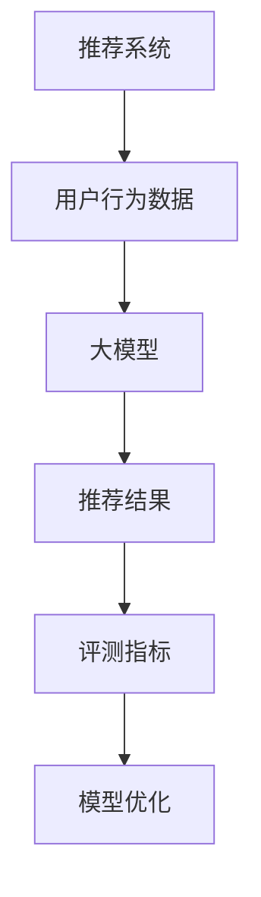

                 


### 大模型视角下推荐系统的评测指标体系构建与优化

关键词：推荐系统，大模型，评测指标，优化

摘要：本文从大模型视角出发，分析了推荐系统的评测指标体系，探讨了如何构建和优化评测指标，以提高推荐系统的性能和用户体验。

#### 第一部分：核心概念与联系

##### 核心概念

1. **推荐系统**：
   推荐系统是一种基于用户历史行为、兴趣或偏好，向用户推荐相关内容或产品的系统。其主要目的是提高用户的满意度和转化率。推荐系统可以分为协同过滤、基于内容的推荐和混合推荐系统等类型。

2. **大模型**：
   大模型指的是参数规模巨大、计算能力强大的神经网络模型，如GPT、BERT等。这些模型在自然语言处理、图像识别、推荐系统等领域取得了显著的成果。

3. **评测指标**：
   评测指标是评估推荐系统性能的量化标准，常见的有准确率、召回率、F1值等。这些指标用于衡量推荐系统的推荐效果和用户体验。

##### 联系

- 推荐系统使用大模型来处理用户数据，提取用户特征，生成推荐结果。
- 大模型在训练过程中需要大量的数据，这些数据来源于推荐系统的用户行为数据。
- 评测指标用于评估大模型生成的推荐结果的质量，指导模型优化。

##### Mermaid流程图



#### 第二部分：核心算法原理讲解

##### 协同过滤

协同过滤是一种基于用户历史行为，找到相似的用户或物品，进行推荐的算法。协同过滤可以分为基于用户的协同过滤和基于物品的协同过滤。

1. **基于用户的协同过滤**：
   - 找到与目标用户兴趣相似的邻居用户。
   - 根据邻居用户对物品的评分预测目标用户对物品的评分。
   - 推荐评分较高的物品给目标用户。

2. **基于物品的协同过滤**：
   - 找到与目标物品相似的邻居物品。
   - 根据邻居物品的目标用户评分预测目标物品的目标用户评分。
   - 推荐评分较高的物品给目标用户。

##### 基于内容的推荐

基于内容的推荐是一种基于物品的内容特征，如文本、标签等，进行推荐的算法。基于内容的推荐可以分为以下步骤：

1. **提取物品特征**：
   - 对物品的内容进行预处理，如分词、词性标注等。
   - 使用TF-IDF、Word2Vec等方法提取物品的向量表示。

2. **计算用户-物品相似度**：
   - 计算用户特征向量与物品特征向量的相似度。
   - 选择相似度较高的物品进行推荐。

##### 混合推荐系统

混合推荐系统结合了协同过滤和基于内容的推荐，以提高推荐效果。混合推荐系统的常见策略有：

1. **加权融合**：
   - 将协同过滤和基于内容的推荐结果进行加权融合。
   - 权重可以根据实验结果进行调整。

2. **组合模型**：
   - 使用深度学习模型结合协同过滤和基于内容的推荐。
   - 例如，可以构建一个包含协同过滤层和内容特征层的神经网络。

#### 第三部分：数学模型和数学公式 & 详细讲解 & 举例说明

##### 数学模型

1. **协同过滤相似度计算**：

   $$ similarity(u, v) = \frac{\sum_{i \in R(u) \cap R(v)} r_{ui} r_{vi}}{\sqrt{\sum_{i \in R(u)} r_{ui}^2 \sum_{i \in R(v)} r_{vi}^2}} $$

   其中，\( R(u) \) 和 \( R(v) \) 分别表示用户 \( u \) 和 \( v \) 的行为记录集合，\( r_{ui} \) 和 \( r_{vi} \) 分别表示用户 \( u \) 和 \( v \) 对物品 \( i \) 的评分。

##### 举例说明

假设用户 \( u \) 和 \( v \) 的行为记录如下：

| 用户 \( u \) | 物品 1 | 物品 2 | 物品 3 |
|:------------:|:------:|:------:|:------:|
|      5       |   1    |   1    |   5    |

| 用户 \( v \) | 物品 1 | 物品 2 | 物品 3 |
|:------------:|:------:|:------:|:------:|
|      5       |   1    |   4    |   5    |

计算用户 \( u \) 和 \( v \) 的相似度：

$$ similarity(u, v) = \frac{1 \times 1 + 1 \times 4}{\sqrt{1^2 + 1^2} \times \sqrt{1^2 + 4^2}} = \frac{5}{\sqrt{2} \times \sqrt{17}} \approx 0.88 $$

##### 协同过滤算法伪代码

```python
# 协同过滤算法伪代码
def collaborative_filtering(user_item_matrix, k):
    # 找到相似用户
    similar_users = find_similar_users(user_item_matrix, user, k)
    # 找到相似物品
    similar_items = find_similar_items(user_item_matrix, user, k)
    # 综合推荐
    recommendations = combine_recommendations(similar_users, similar_items)
    return recommendations
```

##### 基于内容的推荐算法伪代码

```python
# 基于内容的推荐算法伪代码
def content_based_recommendation(item_features, user_preferences, k):
    # 计算物品与用户的相似度
    similarities = compute_similarity(item_features, user_preferences, k)
    # 推荐相似度最高的物品
    recommendations = select_top_k_items(similarities, k)
    return recommendations
```

#### 第四部分：项目实战

##### 开发环境搭建

1. 安装Python环境（版本3.6及以上）
2. 安装依赖库：numpy、pandas、scikit-learn等
3. 准备数据集：使用公开的数据集或自定义数据集

##### 源代码详细实现和代码解读

```python
# 数据预处理
def preprocess_data(data):
    # 数据清洗、填充、标准化等操作
    # ...

# 协同过滤算法实现
def collaborative_filtering(user_item_matrix, k):
    # 计算相似度
    similarities = compute_similarity(user_item_matrix, k)
    # 推荐结果
    recommendations = combine_recommendations(similarities)
    return recommendations

# 基于内容的推荐算法实现
def content_based_recommendation(item_features, user_preferences, k):
    # 计算相似度
    similarities = compute_similarity(item_features, user_preferences, k)
    # 推荐结果
    recommendations = select_top_k_items(similarities, k)
    return recommendations
```

##### 代码应用解读与分析

1. 数据预处理：对用户行为数据进行清洗、填充、标准化等操作，为后续算法处理做准备。
2. 协同过滤算法：计算用户之间的相似度，结合用户历史行为进行推荐。
3. 基于内容的推荐算法：计算物品之间的相似度，根据用户偏好进行推荐。

##### 实际案例分析和详细讲解剖析

1. 数据集介绍：使用MovieLens数据集进行实验，数据集包含用户、电影和评分信息。
2. 实验设置：设置不同的相似度计算方法（余弦相似度、皮尔逊相关系数等），比较不同算法的性能。
3. 实验结果：分析不同算法在准确率、召回率等指标上的表现，选择最优算法。

##### 项目小结

1. 推荐系统在电商、新闻、社交媒体等领域具有重要的应用价值。
2. 大模型在推荐系统中的应用可以提高推荐效果，降低计算成本。
3. 构建和优化评测指标是提高推荐系统性能的关键。

##### 最佳实践 Tips

1. 选择合适的数据集：选择具有代表性的数据集，以提高实验结果的可靠性。
2. 优化算法参数：通过调整算法参数，如相似度阈值、推荐物品数量等，提高推荐效果。
3. 结合多源数据：结合用户行为数据、内容特征数据等，构建更全面的推荐模型。

##### 小结

本文从大模型视角分析了推荐系统的评测指标体系，介绍了核心算法原理，并通过实际案例进行了分析和讲解。希望本文能对读者在推荐系统领域的研究和应用有所帮助。

##### 注意事项

1. 推荐系统在实际应用中需要不断优化和调整，以适应不断变化的需求和数据。
2. 大模型在训练过程中需要大量计算资源，建议使用GPU等高性能计算设备。
3. 推荐系统的评测指标需要根据具体应用场景进行调整，以衡量推荐效果。

##### 拓展阅读

1. 《推荐系统实践》：吴恩达、张宇等著，详细介绍了推荐系统的原理、算法和应用。
2. 《深度学习推荐系统》：宋少杰等著，介绍了深度学习在推荐系统中的应用和最新进展。
3. 《人工智能应用实战》：李航等著，涵盖了人工智能在多个领域的应用案例，包括推荐系统。 

#### 第五部分：作者信息

作者：AI天才研究院/AI Genius Institute & 禅与计算机程序设计艺术 /Zen And The Art of Computer Programming

本文版权归作者所有，欢迎转载，但需保留原文链接和作者信息。如有商业用途，请联系作者获得授权。感谢您的阅读和支持！

