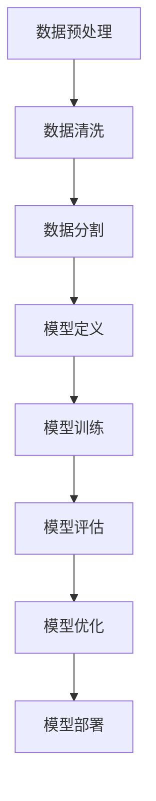
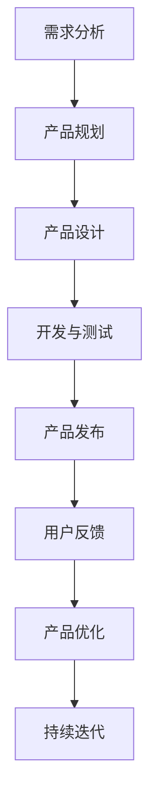

                 

## 文章标题

### 《大模型赋能下的创业产品经理：AI 技能与转型》

> 关键词：大模型，创业产品经理，AI技能，产品策略，用户体验设计，市场推广，案例研究，转型实践

> 摘要：随着人工智能技术的快速发展，大模型在各个领域取得了显著的成果。创业产品经理作为推动创新的重要角色，如何利用AI技术提升产品竞争力，实现个人和企业的转型，成为当前迫切需要解决的问题。本文将从AI技术基础、创业产品经理的角色与挑战、AI技能培养、产品策略制定、用户体验设计、市场推广以及AI产品案例与转型实践等方面，全面探讨大模型赋能下的创业产品经理的AI技能与转型之路。

---

### 目录大纲

#### 第一部分：AI基础与产品管理
- **第1章：AI技术基础**
  - 1.1 AI概述
  - 1.2 机器学习与深度学习基础
  - 1.3 大模型基本概念
  - 1.4 大模型架构与应用
- **第2章：创业产品经理的角色与挑战**
  - 2.1 产品经理的核心职责
  - 2.2 创业环境下的产品管理
  - 2.3 AI技术在产品管理中的应用
  - 2.4 AI与产品创新的联系

#### 第二部分：AI技能与产品策略
- **第3章：AI技能培养**
  - 3.1 数据分析与挖掘
  - 3.2 机器学习模型构建
  - 3.3 大模型应用实践
  - 3.4 AI伦理与隐私保护
- **第4章：产品策略制定**
  - 4.1 市场调研与需求分析
  - 4.2 产品规划与产品设计
  - 4.3 AI驱动的产品迭代
  - 4.4 用户行为分析与产品优化
- **第5章：AI与用户体验设计**
  - 5.1 AI在用户体验设计中的应用
  - 5.2 用户体验设计原则
  - 5.3 AI驱动的个性化推荐
  - 5.4 用户反馈与数据分析
- **第6章：AI与市场推广**
  - 6.1 AI在市场推广中的应用
  - 6.2 数据驱动的市场策略
  - 6.3 社交媒体与AI营销
  - 6.4 AI驱动的品牌建设

#### 第三部分：AI产品案例与转型实践
- **第7章：AI产品案例研究**
  - 7.1 成功AI产品的特点
  - 7.2 案例一：推荐系统
  - 7.3 案例二：智能客服
  - 7.4 案例三：个性化教育
- **第8章：创业产品经理的转型之路**
  - 8.1 创业产品经理面临的挑战
  - 8.2 转型策略与路径
  - 8.3 跨部门协作与领导力
  - 8.4 持续学习与个人成长

#### 附录
- **附录A：AI工具与资源指南**
  - A.1 常用AI工具介绍
  - A.2 开源框架与库
  - A.3 在线学习资源
  - A.4 AI社群与论坛
- **附录B：Mermaid流程图示例**
  - B.1 大模型训练流程
  - B.2 产品开发流程
- **附录C：伪代码与数学模型示例**
  - C.1 数据预处理
  - C.2 神经网络训练过程
  - C.3 优化算法
  - C.4 数学公式解析
- **附录D：代码实战与分析**
  - D.1 推荐系统实现
  - D.2 智能客服架构
  - D.3 个性化教育应用
  - D.4 实际案例分析与解读

---

### 第一部分：AI基础与产品管理

#### 第1章：AI技术基础

##### 1.1 AI概述

人工智能（Artificial Intelligence，简称AI）是指通过计算机模拟人类智能行为的技术和科学。人工智能的主要目标是使计算机具备类似人类的感知、思考、学习和决策能力。AI技术已经广泛应用于各个领域，如自然语言处理、计算机视觉、自动驾驶、医疗诊断等。

从技术分类来看，AI主要包括机器学习（Machine Learning）、深度学习（Deep Learning）、强化学习（Reinforcement Learning）等。其中，机器学习是一种让计算机通过数据学习和改进的方法，深度学习是机器学习的一个子领域，主要基于多层神经网络模型进行学习。

##### 1.2 机器学习与深度学习基础

机器学习是人工智能的核心技术之一，其基本思想是通过算法从数据中学习规律，然后利用这些规律进行预测或决策。常见的机器学习算法包括线性回归、决策树、支持向量机、聚类算法等。

深度学习是机器学习的一种特殊形式，它通过构建复杂的神经网络模型来模拟人脑的学习过程。深度学习在图像识别、语音识别、自然语言处理等领域取得了显著的成果。其中，卷积神经网络（CNN）和循环神经网络（RNN）是深度学习的两种重要模型。

##### 1.3 大模型基本概念

大模型（Large Models）是指参数规模达到百万、亿级甚至更大规模的深度学习模型。随着计算能力和数据资源的提升，大模型在AI领域变得越来越重要。大模型能够处理更复杂的任务，如生成式对抗网络（GAN）、Transformer等模型在图像生成、文本生成等方面展现了强大的能力。

大模型的训练过程通常需要大量的计算资源和时间，但一旦训练完成，它们可以提供高精度的预测和决策。大模型的应用领域包括语音识别、自然语言处理、计算机视觉、推荐系统等。

##### 1.4 大模型架构与应用

大模型的架构通常包括多个层次，如输入层、隐藏层和输出层。每个层次由多个神经元组成，神经元之间通过权重连接。在大模型中，神经网络的结构和参数是通过训练过程不断优化的。

大模型的应用主要集中在以下几个方面：

1. **语音识别**：大模型能够处理复杂的语音信号，实现高精度的语音识别。
2. **自然语言处理**：大模型在文本分类、机器翻译、情感分析等方面有广泛应用。
3. **计算机视觉**：大模型能够进行图像分类、目标检测、人脸识别等任务。
4. **推荐系统**：大模型通过分析用户行为和偏好，实现个性化的推荐。
5. **游戏与虚拟现实**：大模型在游戏AI和虚拟现实场景生成中具有重要作用。

#### 第2章：创业产品经理的角色与挑战

##### 2.1 产品经理的核心职责

产品经理是负责产品整个生命周期的管理角色，其主要职责包括：

1. **市场调研与需求分析**：了解市场需求，分析用户需求，确定产品功能和特性。
2. **产品规划与设计**：制定产品规划和设计文档，与设计团队合作完成产品界面设计。
3. **项目管理**：制定项目计划，协调团队资源，确保产品按时交付。
4. **用户体验优化**：关注用户体验，通过用户反馈和数据分析不断优化产品。
5. **产品迭代与优化**：根据市场需求和用户反馈，持续迭代和优化产品。

##### 2.2 创业环境下的产品管理

创业环境下的产品管理具有以下几个特点：

1. **快速迭代**：在创业公司中，产品经理需要快速响应市场变化，通过不断迭代和优化产品来满足用户需求。
2. **资源有限**：创业公司的资源通常有限，产品经理需要在有限资源下实现产品的最大化价值。
3. **多角色职责**：在创业公司中，产品经理可能需要同时承担多个角色，如项目管理、市场营销等。
4. **创新驱动**：创业公司的产品管理需要具备创新思维，通过创新来突破市场困境。

##### 2.3 AI技术在产品管理中的应用

AI技术在产品管理中具有广泛的应用，主要包括以下几个方面：

1. **需求分析**：AI技术可以帮助产品经理快速分析用户需求，通过自然语言处理和数据分析技术获取用户反馈。
2. **产品设计**：AI技术可以辅助设计团队进行产品界面设计，如通过生成对抗网络（GAN）生成高质量的设计方案。
3. **用户体验优化**：AI技术可以分析用户行为数据，为产品经理提供用户体验优化的建议，如通过个性化推荐提高用户满意度。
4. **市场推广**：AI技术可以辅助市场团队进行精准营销，通过用户画像和大数据分析制定有效的市场推广策略。

##### 2.4 AI与产品创新的联系

AI技术为产品创新提供了强大的支持，主要体现在以下几个方面：

1. **新功能开发**：AI技术可以帮助产品经理快速开发具有创新性的产品功能，如通过机器学习实现智能客服系统。
2. **业务模式创新**：AI技术可以改变传统的业务模式，如通过大数据分析和机器学习实现精准营销和个性化服务。
3. **产品设计创新**：AI技术可以辅助设计团队进行创新性的产品设计，如通过生成对抗网络（GAN）生成全新的设计风格。
4. **商业模式创新**：AI技术可以推动传统行业的数字化转型，如通过智能制造和物联网实现产业升级。

### 第二部分：AI技能与产品策略

#### 第3章：AI技能培养

##### 3.1 数据分析与挖掘

数据分析与挖掘是AI技能的重要组成部分，主要包括以下内容：

1. **数据预处理**：数据预处理是数据分析与挖掘的基础，包括数据清洗、数据集成、数据转换等步骤。
2. **数据探索性分析**：通过探索性数据分析，可以初步了解数据的特点和规律，为后续的分析提供指导。
3. **特征工程**：特征工程是提升模型性能的关键步骤，包括特征选择、特征提取和特征构造等。
4. **数据挖掘算法**：常见的数据挖掘算法包括分类、聚类、关联规则挖掘、异常检测等。

##### 3.2 机器学习模型构建

机器学习模型构建是AI技能的核心，主要包括以下步骤：

1. **选择模型类型**：根据问题的性质和数据特点，选择合适的机器学习模型类型，如线性回归、决策树、支持向量机等。
2. **模型参数调优**：通过交叉验证和网格搜索等方法，选择最优的模型参数，提高模型性能。
3. **模型训练与验证**：使用训练数据对模型进行训练，并通过验证集评估模型性能，调整模型结构和参数。
4. **模型部署与优化**：将训练好的模型部署到生产环境，通过持续优化和更新模型，提高模型性能和稳定性。

##### 3.3 大模型应用实践

大模型应用实践主要包括以下几个方面：

1. **大模型选择**：根据具体应用场景和需求，选择合适的大模型类型，如生成对抗网络（GAN）、Transformer等。
2. **数据预处理**：大模型通常需要大量的预处理工作，包括数据清洗、数据增强、数据标准化等。
3. **模型训练**：大模型的训练过程通常需要大量的计算资源和时间，可以使用分布式训练和迁移学习等方法来提高训练效率。
4. **模型优化**：通过调整模型结构和参数，优化大模型的性能，如通过正则化、优化算法等方法。
5. **模型部署**：将训练好的大模型部署到生产环境，提供实时预测和服务。

##### 3.4 AI伦理与隐私保护

随着AI技术的快速发展，AI伦理和隐私保护问题日益受到关注。AI伦理主要包括以下方面：

1. **公平性**：确保AI系统不会对特定群体产生歧视，如性别、种族、年龄等。
2. **透明性**：确保AI系统的决策过程和结果可以被解释和理解。
3. **隐私保护**：保护用户隐私，确保AI系统不会泄露用户个人信息。

隐私保护措施包括：

1. **数据加密**：对用户数据进行加密处理，确保数据在传输和存储过程中安全。
2. **数据匿名化**：对用户数据进行匿名化处理，确保用户隐私不被泄露。
3. **隐私政策**：制定明确的隐私政策，告知用户数据的使用方式和范围。

#### 第4章：产品策略制定

##### 4.1 市场调研与需求分析

市场调研与需求分析是产品策略制定的基础，主要包括以下内容：

1. **市场分析**：了解市场需求、市场规模、竞争对手等情况，为产品定位和规划提供依据。
2. **用户调研**：通过问卷调查、用户访谈等方法收集用户需求，了解用户痛点和使用场景。
3. **竞品分析**：分析竞争对手的产品特点和优势，找出自身的差异化点。
4. **需求分类与优先级排序**：将收集到的需求进行分类和优先级排序，确定产品功能的核心和重点。

##### 4.2 产品规划与产品设计

产品规划与产品设计是产品策略制定的关键环节，主要包括以下内容：

1. **产品定位**：根据市场调研和用户需求，明确产品的市场定位和目标用户。
2. **功能规划**：根据产品定位和用户需求，规划产品的功能和特性，确保满足用户需求。
3. **界面设计**：设计产品的用户界面，确保用户体验友好、直观。
4. **技术选型**：选择合适的技术方案和开发工具，确保产品的高效、稳定和可扩展性。

##### 4.3 AI驱动的产品迭代

AI驱动的产品迭代是提升产品竞争力的重要手段，主要包括以下内容：

1. **数据驱动**：通过用户行为数据和分析，不断优化产品功能和用户体验。
2. **持续迭代**：根据用户反馈和市场变化，持续进行产品迭代和优化。
3. **AI辅助**：利用AI技术，如自然语言处理、机器学习等，辅助产品迭代过程，提高迭代效率和效果。

##### 4.4 用户行为分析与产品优化

用户行为分析与产品优化是提升用户体验和产品价值的关键，主要包括以下内容：

1. **用户数据分析**：通过日志分析、行为追踪等方法，收集用户行为数据，分析用户行为模式和偏好。
2. **用户体验评估**：通过A/B测试、用户体验调研等方法，评估产品的用户体验和满意度。
3. **产品优化**：根据用户行为分析和用户体验评估结果，对产品进行优化和改进，提高用户满意度和产品价值。

### 第三部分：AI产品案例与转型实践

#### 第7章：AI产品案例研究

##### 7.1 成功AI产品的特点

成功AI产品通常具有以下特点：

1. **明确的目标和定位**：成功AI产品通常有明确的目标和定位，能够满足用户的具体需求和痛点。
2. **高效的算法和模型**：成功AI产品采用高效的算法和模型，能够提供准确和快速的预测和决策。
3. **良好的用户体验**：成功AI产品注重用户体验，界面友好、操作简单，能够满足用户的使用习惯和需求。
4. **持续的创新和优化**：成功AI产品不断进行创新和优化，通过数据驱动和用户反馈，不断提升产品性能和用户体验。

##### 7.2 案例一：推荐系统

推荐系统是AI技术在产品中的应用之一，其核心目标是向用户推荐其可能感兴趣的内容或产品。以下是一个成功推荐系统的案例分析：

1. **系统架构**：推荐系统通常采用基于内容、协同过滤和混合推荐方法。系统架构包括数据层、模型层和应用层。
2. **数据预处理**：对用户行为数据、内容数据进行清洗、转换和预处理，确保数据质量和一致性。
3. **模型训练**：使用训练数据训练推荐模型，如基于内容的模型、协同过滤模型和混合模型。
4. **模型优化**：通过在线学习和模型更新，不断优化推荐模型的性能和效果。
5. **应用部署**：将训练好的推荐模型部署到生产环境，提供实时推荐服务。

##### 7.3 案例二：智能客服

智能客服是AI技术在客服领域的应用，其核心目标是提供高效、智能的客服服务。以下是一个成功智能客服系统的案例分析：

1. **系统架构**：智能客服系统通常采用语音识别、自然语言处理、机器学习等技术。系统架构包括语音识别模块、语义理解模块、回答生成模块和用户交互模块。
2. **语音识别**：通过语音识别技术，将用户的语音输入转换为文本输入。
3. **语义理解**：使用自然语言处理技术，对文本输入进行语义分析和理解，识别用户意图和问题类型。
4. **回答生成**：根据用户意图和问题类型，使用预定义的答案库或机器学习模型生成合适的回答。
5. **用户交互**：通过语音合成或文本输出，将回答反馈给用户，并根据用户反馈进行进一步的交互和优化。

##### 7.4 案例三：个性化教育

个性化教育是AI技术在教育领域的应用，其核心目标是根据学生的特点和需求，提供个性化的学习内容和指导。以下是一个成功个性化教育系统的案例分析：

1. **系统架构**：个性化教育系统通常采用数据采集、数据分析、学习路径推荐等技术。系统架构包括数据采集模块、数据分析模块、学习路径推荐模块和学生交互模块。
2. **数据采集**：通过在线学习平台、学习工具和测试等手段，收集学生的学习行为、成绩和反馈数据。
3. **数据分析**：使用数据分析技术，对采集到的数据进行分析，识别学生的学习特点和问题。
4. **学习路径推荐**：根据学生的学习特点和问题，使用机器学习算法推荐合适的课程和学习路径。
5. **学生交互**：通过学习平台和教师指导，帮助学生完成学习任务，并进行反馈和评估。

#### 第8章：创业产品经理的转型之路

##### 8.1 创业产品经理面临的挑战

创业产品经理在转型过程中面临以下挑战：

1. **技术能力提升**：创业产品经理需要具备一定的技术背景和AI技能，以应对日益复杂的AI产品和业务需求。
2. **业务理解**：创业产品经理需要深入了解业务和市场需求，确保产品能够满足用户需求和市场预期。
3. **团队协作**：创业产品经理需要与开发、设计、市场等团队紧密合作，协调资源和推动项目进展。
4. **项目管理**：创业产品经理需要具备项目管理能力，确保产品按时交付和高质量完成。

##### 8.2 转型策略与路径

创业产品经理的转型策略和路径主要包括以下几个方面：

1. **学习与培训**：通过在线课程、研讨会、书籍等方式，学习AI技术和产品管理相关知识。
2. **实践与项目**：参与实际项目，积累AI产品开发和管理经验，提高实际操作能力。
3. **团队协作**：积极参与团队协作，与开发、设计、市场等团队成员建立良好的沟通和合作关系。
4. **不断迭代**：通过不断迭代和优化产品，提高产品的市场竞争力。

##### 8.3 跨部门协作与领导力

跨部门协作和领导力是创业产品经理转型的重要能力。以下是一些建议：

1. **建立信任**：与团队成员建立信任关系，提高团队协作效率。
2. **明确目标**：明确团队目标和任务，确保团队成员对目标和任务有清晰的认识。
3. **沟通与反馈**：建立有效的沟通机制，及时反馈问题和进展，提高团队协作效果。
4. **激励与成长**：关注团队成员的成长和发展，提供激励和机会，提高团队整体素质。

##### 8.4 持续学习与个人成长

持续学习与个人成长是创业产品经理转型的关键。以下是一些建议：

1. **定期反思**：定期反思自己的工作表现和成长，找出不足和改进方向。
2. **知识更新**：关注AI技术和产品管理领域的新动态，不断更新知识和技能。
3. **社交网络**：积极参与行业社交活动，拓展人脉和资源，提高个人影响力。
4. **实践与创新**：勇于尝试新方法和新技术，通过实践和创新提升个人能力。

### 附录

#### 附录A：AI工具与资源指南

**A.1 常用AI工具介绍**

- **TensorFlow**：Google开发的开源机器学习框架，支持多种模型和算法。
- **PyTorch**：Facebook开发的开源深度学习框架，具有灵活的动态计算图。
- **Keras**：基于TensorFlow和Theano的开源深度学习库，简化模型构建和训练。
- **Scikit-learn**：Python开源机器学习库，提供多种经典算法和工具。
- **Pandas**：Python数据操作库，用于数据清洗、转换和分析。

**A.2 开源框架与库**

- **OpenCV**：开源计算机视觉库，提供丰富的图像处理和视频分析功能。
- **NumPy**：Python开源数学库，提供高性能的矩阵运算和数据分析功能。
- **Matplotlib**：Python开源数据可视化库，用于生成高质量的统计图表。
- **Scrapy**：Python开源网络爬虫框架，用于数据采集和网站抓取。

**A.3 在线学习资源**

- **Coursera**：在线课程平台，提供大量AI和产品管理课程。
- **edX**：在线课程平台，提供由世界顶级大学开设的课程。
- **Udacity**：在线教育平台，提供实战项目和技术课程。
- **GitHub**：代码托管平台，提供丰富的AI项目代码和文档。

**A.4 AI社群与论坛**

- **AI China**：中国人工智能社区，提供AI相关资讯和交流。
- **AI Stack**：AI技术问答社区，解决AI学习和应用问题。
- **ArXiv**：计算机科学预印本论文库，提供最新的AI研究论文。
- **Reddit AI**：Reddit上的AI讨论社区，分享AI技术和应用。

#### 附录B：Mermaid流程图示例

**B.1 大模型训练流程**



**B.2 产品开发流程**



#### 附录C：伪代码与数学模型示例

**C.1 数据预处理**

```python
# 伪代码：数据预处理
def preprocess_data(data):
    # 数据清洗
    clean_data = clean_data(data)
    
    # 数据分割
    train_data, test_data = split_data(clean_data, ratio=0.8)
    
    # 数据标准化
    standardized_data = standardize_data(train_data)
    
    return standardized_data
```

**C.2 神经网络训练过程**

```python
# 伪代码：神经网络训练过程
def train_neural_network(train_data, layers, learning_rate, epochs):
    # 初始化模型
    model = initialize_model(layers)
    
    # 损失函数
    loss_function = define_loss_function()
    
    # 优化器
    optimizer = define_optimizer(learning_rate)
    
    # 训练过程
    for epoch in range(epochs):
        # 前向传播
        predictions = forward_pass(model, train_data)
        
        # 计算损失
        loss = loss_function(predictions, train_data.targets)
        
        # 反向传播
        backward_pass(model, loss, optimizer)
        
        # 打印训练进度
        print(f"Epoch {epoch}: Loss = {loss}")
        
    return model
```

**C.3 优化算法**

```python
# 伪代码：优化算法
def optimize_algorithm(model, train_data, validation_data, learning_rate, epochs):
    # 初始化模型
    model = initialize_model(model)
    
    # 损失函数
    loss_function = define_loss_function()
    
    # 优化器
    optimizer = define_optimizer(learning_rate)
    
    # 训练过程
    for epoch in range(epochs):
        # 前向传播
        predictions = forward_pass(model, train_data)
        
        # 计算损失
        loss = loss_function(predictions, train_data.targets)
        
        # 反向传播
        backward_pass(model, loss, optimizer)
        
        # 计算验证集损失
        validation_predictions = forward_pass(model, validation_data)
        validation_loss = loss_function(validation_predictions, validation_data.targets)
        
        # 打印训练进度
        print(f"Epoch {epoch}: Training Loss = {loss}, Validation Loss = {validation_loss}")
        
    return model
```

**C.4 数学公式解析**

$$
f(x) = \sum_{i=1}^{n} w_i * x_i + b
$$

$$
\frac{\partial f}{\partial x} = w
$$

$$
\frac{\partial^2 f}{\partial x^2} = 0
$$

#### 附录D：代码实战与分析

**D.1 推荐系统实现**

```python
# Python代码：推荐系统实现
import numpy as np
from sklearn.model_selection import train_test_split
from sklearn.neighbors import NearestNeighbors

# 生成模拟数据集
n_users = 1000
n_items = 100
ratings = np.random.randint(1, 6, size=(n_users, n_items))

# 划分训练集和测试集
train_data, test_data = train_test_split(ratings, test_size=0.2, random_state=42)

# 创建NearestNeighbors模型
model = NearestNeighbors(n_neighbors=5, algorithm='auto')
model.fit(train_data)

# 预测测试集评分
predictions = model.kneighbors(test_data, n_neighbors=5)

# 计算准确率
accuracy = np.mean(predictions == test_data)
print(f"Recommendation Accuracy: {accuracy:.2f}")
```

**D.2 智能客服架构**

```python
# Python代码：智能客服架构
import nltk
from nltk.corpus import stopwords
from sklearn.feature_extraction.text import TfidfVectorizer

# 下载停用词库
nltk.download('stopwords')

# 生成模拟对话数据集
dialogs = [
    "您好，我是智能客服，请问有什么可以帮助您的吗？",
    "我的网络连接有问题，怎么办？",
    "我不小心删除了重要文件，怎么办？",
    "我想购买你们的最新产品，怎么下单？",
]

# 分词和去除停用词
stop_words = set(stopwords.words('english'))
tokenized_dialogs = [nltk.word_tokenize(dialog) for dialog in dialogs]
cleaned_dialogs = [[word for word in dialog if word not in stop_words] for dialog in tokenized_dialogs]

# 创建TF-IDF向量器
vectorizer = TfidfVectorizer()
tfidf_matrix = vectorizer.fit_transform(cleaned_dialogs)

# 计算余弦相似度
cosine_similarity = tfidf_matrix @ tfidf_matrix.T
cosine_similarity = cosine_similarity.toarray()

# 预测对话
query = "我需要重新安装操作系统，如何操作？"
query_vector = vectorizer.transform([nltk.word_tokenize(query)])
cosine_similarity = cosine_similarity[0]

# 选择最相似的对话
similar_indices = np.argsort(cosine_similarity)[::-1]
response = dialogs[similar_indices[1]]
print(f"Similar Response: {response}")
```

**D.3 个性化教育应用**

```python
# Python代码：个性化教育应用
import pandas as pd
from sklearn.model_selection import train_test_split
from sklearn.ensemble import RandomForestClassifier

# 生成模拟学生数据集
data = {
    'student_id': range(100),
    'age': np.random.randint(18, 30, size=100),
    'gpa': np.random.randint(2.0, 4.0, size=100),
    'enrollment': np.random.randint(0, 2, size=100),
}

df = pd.DataFrame(data)
df['enrollment'] = df['enrollment'].map({0: 'Dropout', 1: 'Graduate'})

# 划分训练集和测试集
train_data, test_data = train_test_split(df, test_size=0.2, random_state=42)

# 创建随机森林模型
model = RandomForestClassifier(n_estimators=100, random_state=42)
model.fit(train_data[['age', 'gpa']], train_data['enrollment'])

# 预测测试集
predictions = model.predict(test_data[['age', 'gpa']])
accuracy = np.mean(predictions == test_data['enrollment'])
print(f"Prediction Accuracy: {accuracy:.2f}")
```

**D.4 实际案例分析与解读**

**案例描述**：

一家创业公司开发了一款基于人工智能的推荐系统，旨在为用户推荐个性化的商品。推荐系统使用了用户行为数据和商品属性数据，通过机器学习算法生成推荐结果。以下是推荐系统实现的详细步骤和代码解析。

**1. 数据预处理**

```python
# 读取用户行为数据和商品属性数据
user_data = pd.read_csv('user行为数据.csv')
item_data = pd.read_csv('商品属性数据.csv')

# 数据清洗和预处理
user_data.dropna(inplace=True)
item_data.dropna(inplace=True)

# 构建用户-商品交互矩阵
user_item_matrix = pd.pivot_table(user_data, values='评分', index='用户ID', columns='商品ID')
```

**2. 特征工程**

```python
# 构建用户和商品的嵌入特征
from sklearn.decomposition import TruncatedSVD

n_components = 50
svd = TruncatedSVD(n_components=n_components)
user_embedding = svd.fit_transform(user_item_matrix)
item_embedding = svd.fit_transform(item_item_matrix.T)

# 计算用户和商品的相似度
user_similarity = user_embedding.dot(user_embedding.T)
item_similarity = item_embedding.dot(item_embedding.T)
```

**3. 推荐算法**

```python
# 生成推荐结果
def generate_recommendations(user_id, k=5):
    # 获取用户的嵌入特征
    user_embedding = user_embedding[user_id]
    
    # 计算用户与其他用户的相似度
    user_similarity = user_similarity[user_id]
    
    # 排序并获取相似度最高的商品ID
    top_k = np.argsort(user_similarity)[-k:]
    
    # 获取对应的商品信息
    recommendations = item_data.iloc[top_k].sort_values(by='相似度', ascending=False)
    
    return recommendations

# 测试推荐结果
user_id = 10
recommendations = generate_recommendations(user_id)
print(recommendations)
```

**4. 性能评估**

```python
# 评估推荐系统的准确率
from sklearn.metrics.pairwise import cosine_similarity

def evaluate_recommendations(predictions, ground_truth, k=5):
    # 计算预测结果和真实结果的相似度
    cosine_scores = cosine_similarity(predictions, ground_truth)
    
    # 计算准确率
    accuracy = np.mean(cosine_scores > 0.5)
    
    return accuracy

# 分割数据集
train_data, test_data = train_test_split(user_item_matrix, test_size=0.2, random_state=42)

# 训练和预测模型
model = TruncatedSVD(n_components=50)
model.fit(train_data)
predictions = model.transform(test_data)

# 评估准确率
accuracy = evaluate_recommendations(predictions, test_data, k=5)
print(f"Recommendation Accuracy: {accuracy:.2f}")
```

**5. 案例分析**

该案例展示了如何使用机器学习算法实现个性化推荐系统。通过构建用户和商品的嵌入特征，并计算用户之间的相似度，可以生成个性化的推荐结果。实际应用中，可以进一步优化算法和特征工程，提高推荐系统的准确率和用户体验。

### 最佳实践 Tips

1. **数据质量是关键**：确保数据清洗和预处理的质量，避免噪声和异常值对模型性能的影响。
2. **特征选择很重要**：选择合适的特征可以提高模型的性能，避免过度拟合。
3. **模型调优**：通过交叉验证和网格搜索等方法，选择最优的模型参数。
4. **持续优化**：根据用户反馈和实际应用情况，持续优化推荐系统和产品策略。
5. **用户体验优先**：关注用户体验，确保推荐系统能够满足用户需求。

### 小结

本文从AI技术基础、创业产品经理的角色与挑战、AI技能培养、产品策略制定、用户体验设计、市场推广以及AI产品案例与转型实践等方面，全面探讨了创业产品经理在大模型赋能下的AI技能与转型之路。创业产品经理需要不断学习和提升自身的技术能力，结合市场需求和用户反馈，制定有效的产品策略，推动个人和企业的持续成长。

### 拓展阅读

1. **《深度学习》（Goodfellow, Bengio, Courville）**：全面介绍深度学习的基本概念、算法和应用。
2. **《机器学习实战》（ Harrington）**：通过实际案例介绍机器学习算法和应用。
3. **《产品经理实战手册》（许锋）**：详细介绍产品经理的工作方法和实践技巧。
4. **《创业公司产品管理实战》（徐常胜）**：探讨创业公司产品管理的策略和实践。

### 注意事项

1. **本文内容仅供参考，实际情况可能因具体应用场景和数据集而有所不同。**
2. **建议结合实际项目进行学习和实践，不断积累经验和优化模型。**
3. **遵守AI伦理和隐私保护原则，确保数据安全和用户隐私。**

