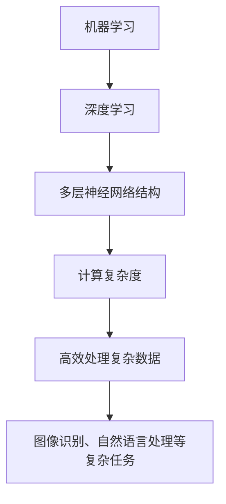

                 

## 文章标题：大模型赋能：创业产品经理的 AI 转型

### 关键词：AI 转型、创业产品经理、大模型、深度学习、机器学习、产品思维

### 摘要：
在AI技术迅猛发展的今天，创业产品经理面临着前所未有的机遇与挑战。本文将探讨AI技术在产品管理中的应用，通过分析AI基础、核心算法及其在产品设计与实施中的实际应用，助力创业产品经理实现成功转型。本文将分为三部分，分别探讨AI基础与产品思维、AI应用实战以及AI时代的创业策略，为创业产品经理提供全面的AI赋能指南。

## 《大模型赋能：创业产品经理的 AI 转型》目录大纲

### 第一部分：AI基础与产品思维

#### 第1章：AI时代的崛起与产品经理的角色
1.1 AI发展历程与现状
1.2 AI技术在产品中的应用场景
1.3 创业产品经理的AI转型之路

#### 第2章：AI核心概念与基础算法
2.1 机器学习与深度学习的区别与联系
2.2 常见机器学习算法介绍
2.3 深度学习基础算法详解

#### 第3章：产品设计与AI结合
3.1 AI驱动的用户需求分析
3.2 AI在产品体验优化中的应用
3.3 数据驱动产品设计实践

### 第二部分：AI应用实战

#### 第4章：AI在创业公司中的落地实践
4.1 创业公司的AI战略规划
4.2 创业公司的数据收集与处理
4.3 创业公司的AI项目实施与评估

#### 第5章：案例解析：AI产品实战
5.1 案例一：智能推荐系统的设计
5.2 案例二：自然语言处理在客服中的应用
5.3 案例三：图像识别在安防领域的应用

#### 第6章：AI伦理与产品责任
6.1 AI伦理问题与挑战
6.2 产品经理的AI伦理责任
6.3 AI伦理政策与法规

### 第三部分：AI时代的创业策略

#### 第7章：AI赋能的创业方法论
7.1 创业中的AI决策支持
7.2 创业项目的AI风险评估
7.3 创业团队的组织与协同

#### 第8章：AI时代的商业模式创新
8.1 AI驱动的新产品开发
8.2 AI赋能的营销策略
8.3 AI时代的商业模式创新案例解析

#### 第9章：创业产品经理的未来展望
9.1 AI对产品经理职业的影响
9.2 创业产品经理的能力提升路径
9.3 AI赋能创业的未来发展趋势

### 附录

#### 附录A：AI开发工具与资源指南
A.1 常用AI开发工具对比
A.2 AI学习资源推荐
A.3 开发环境搭建指南

### 结束语
AI技术的发展不仅带来了技术的变革，也为创业产品经理提供了新的机遇。通过本文的深入探讨，希望创业产品经理能够更好地理解AI技术，掌握AI赋能的创业策略，实现从传统产品经理到AI时代产品经理的成功转型。未来，让我们共同期待AI赋能创业的更多精彩篇章。

## 第一部分：AI基础与产品思维

### 第1章：AI时代的崛起与产品经理的角色

#### 1.1 AI发展历程与现状

人工智能（AI）作为计算机科学的一个重要分支，其发展历程可以追溯到20世纪50年代。早期的AI研究主要集中在符号推理和规则系统中，这些方法主要依赖于手工编写的规则和算法。然而，随着计算能力和数据资源的提升，机器学习（ML）和深度学习（DL）逐渐成为AI研究的主流。

机器学习是一种通过从数据中学习规律，从而实现自动识别和预测的技术。深度学习作为机器学习的一种特殊形式，通过多层神经网络结构，实现了对复杂数据的高效处理和模式识别。近年来，随着神经网络架构的优化和计算能力的提升，深度学习在图像识别、语音识别、自然语言处理等领域取得了显著的成果。

当前，AI技术已经广泛应用于各个行业，从智能语音助手、自动驾驶汽车到金融风控、医疗诊断，AI的应用场景不断拓展。根据市场调研公司IDC的预测，到2025年，全球AI市场规模将达到5000亿美元，AI技术将成为推动各行业数字化转型的关键动力。

#### 1.2 AI技术在产品中的应用场景

AI技术为产品经理带来了前所未有的机遇，以下是一些AI技术在产品中的应用场景：

1. **用户行为分析**：通过机器学习算法，产品经理可以分析用户的行为数据，识别用户需求和行为模式，从而优化产品设计和用户体验。
   
2. **个性化推荐**：利用协同过滤、矩阵分解等算法，产品可以为用户提供个性化的内容推荐，提高用户满意度和粘性。
   
3. **智能客服**：通过自然语言处理（NLP）技术，智能客服系统可以自动解答用户常见问题，提高服务效率和客户满意度。
   
4. **图像识别与处理**：AI技术在图像识别和图像处理方面的应用，可以提升产品的功能和用户体验，如智能安防、图像编辑等。
   
5. **语音交互**：语音识别和语音生成技术使得产品可以实现更加自然的用户交互，如智能音箱、语音助手等。

#### 1.3 创业产品经理的AI转型之路

随着AI技术的快速发展，创业产品经理也需要不断提升自身的AI素养，以适应这一变革。以下是一些创业产品经理的AI转型路径：

1. **基础知识学习**：创业产品经理需要了解AI的基础知识，包括机器学习、深度学习的基本概念和常用算法。
   
2. **技术实践**：通过实际项目，创业产品经理可以积累AI技术在产品中的应用经验，掌握从数据收集、处理到模型训练、优化的完整流程。
   
3. **跨界合作**：创业产品经理可以与AI技术专家、数据科学家等跨界合作，共同探索AI技术在产品中的创新应用。
   
4. **持续学习**：AI技术更新迅速，创业产品经理需要保持学习的热情，跟进最新的技术动态和应用趋势。

通过上述转型路径，创业产品经理可以更好地把握AI技术带来的机遇，提升产品的竞争力，实现从传统产品经理到AI时代产品经理的成功转型。

## 第2章：AI核心概念与基础算法

#### 2.1 机器学习与深度学习的区别与联系

机器学习和深度学习是人工智能领域中的两个重要分支，它们既有区别又有联系。

**机器学习（Machine Learning）** 是指通过算法和统计方法，从数据中自动学习和发现规律，从而进行预测或决策的技术。机器学习的核心思想是通过训练数据集，让算法学会识别数据中的模式，并利用这些模式对新数据进行预测。

**深度学习（Deep Learning）** 是机器学习的一种特殊形式，主要依赖于多层神经网络结构。深度学习通过多层神经元之间的非线性变换，实现了对复杂数据的高效处理和模式识别。与传统的机器学习方法相比，深度学习在处理大规模数据和复杂任务时表现更加出色。

**区别**：

1. **模型结构**：机器学习通常使用单层或多层感知机、支持向量机等简单的模型结构，而深度学习则依赖于多层神经网络结构。
   
2. **计算复杂度**：深度学习需要更多的计算资源和时间来训练模型，因为它涉及大量的参数调整和优化。
   
3. **适用场景**：机器学习适用于一些简单的任务，如分类、回归等，而深度学习则更适用于复杂任务，如图像识别、自然语言处理等。

**联系**：

1. **技术基础**：深度学习是建立在机器学习的基础上，通过引入多层神经网络结构，提高了模型的表达能力和计算效率。
   
2. **算法融合**：深度学习算法中会融合一些传统的机器学习方法，如正则化、优化算法等，以提高模型的性能。

**关系架构 Mermaid 流程图**：



通过上述流程图，我们可以清晰地看到机器学习与深度学习之间的关系及其在处理复杂数据和任务时的优势。

#### 2.2 常见机器学习算法介绍

在机器学习中，有许多常见的算法被广泛应用于各种任务中。以下是一些常见的机器学习算法及其基本原理：

1. **线性回归（Linear Regression）**：
   线性回归是一种用于预测数值型变量的算法，它通过建立一个线性模型来描述因变量和自变量之间的关系。线性回归模型的数学表达式为：
   $$
   y = \beta_0 + \beta_1 \cdot x
   $$
   其中，$y$ 为因变量，$x$ 为自变量，$\beta_0$ 和 $\beta_1$ 为模型的参数。

2. **逻辑回归（Logistic Regression）**：
   逻辑回归是一种用于分类问题的算法，它通过建立一个逻辑模型来预测因变量的概率分布。逻辑回归的数学表达式为：
   $$
   \log\frac{P(Y=1)}{1-P(Y=1)} = \beta_0 + \beta_1 \cdot x
   $$
   其中，$Y$ 为因变量，$P(Y=1)$ 为因变量为1的概率，$\beta_0$ 和 $\beta_1$ 为模型的参数。

3. **支持向量机（Support Vector Machine, SVM）**：
   支持向量机是一种二分类算法，它通过寻找一个最优的超平面来将不同类别的数据点分开。SVM的核心思想是最大化分类边界到支持向量的距离。SVM的数学模型为：
   $$
   \min_{\beta, \beta_0} \frac{1}{2} ||\beta||^2 + C \sum_{i=1}^n \xi_i
   $$
   其中，$\beta$ 和 $\beta_0$ 分别为模型的参数和偏置项，$C$ 为惩罚参数，$\xi_i$ 为第$i$ 个数据点的误差。

4. **决策树（Decision Tree）**：
   决策树是一种基于树形结构进行决策的算法，它通过一系列的判断条件来划分数据集，并预测数据点的类别或数值。决策树的核心思想是递归地划分数据集，直到满足终止条件（如最大深度、纯度等）。

5. **随机森林（Random Forest）**：
   随机森林是一种集成学习方法，它通过构建多个决策树，并利用随机抽样和投票机制来预测数据点的类别或数值。随机森林的核心思想是通过多个决策树的组合来提高模型的泛化能力和稳定性。

**伪代码示例**：

```python
# 线性回归算法
def linear_regression(X, y):
    # 计算参数
    beta = np.linalg.inv(X.T.dot(X)).dot(X.T).dot(y)
    # 预测
    y_pred = X.dot(beta)
    return y_pred

# 逻辑回归算法
def logistic_regression(X, y):
    # 计算参数
    beta = np.linalg.inv(X.T.dot(X) + np.eye(X.shape[1])).dot(X.T).dot(y)
    # 预测
    y_pred = 1 / (1 + np.exp(-X.dot(beta)))
    return y_pred

# 支持向量机算法
def svm(X, y, C):
    # 计算参数
    beta, beta_0 = svm_solver(X, y, C)
    # 预测
    y_pred = predict_svm(X, beta, beta_0)
    return y_pred

# 决策树算法
def decision_tree(X, y, max_depth):
    # 划分数据集
    tree = build_decision_tree(X, y, max_depth)
    # 预测
    y_pred = predict_decision_tree(X, tree)
    return y_pred

# 随机森林算法
def random_forest(X, y, n_estimators, max_depth):
    # 构建随机森林
    forest = build_random_forest(X, y, n_estimators, max_depth)
    # 预测
    y_pred = predict_random_forest(X, forest)
    return y_pred
```

通过上述算法介绍和伪代码示例，我们可以更好地理解机器学习算法的基本原理和实现方法。

#### 2.3 深度学习基础算法详解

深度学习作为机器学习的一个重要分支，通过多层神经网络结构实现了对复杂数据的高效处理和模式识别。以下是一些深度学习的基础算法及其工作原理：

1. **卷积神经网络（Convolutional Neural Network, CNN）**：
   卷积神经网络是一种专门用于图像识别和处理的前馈神经网络。CNN的核心组件是卷积层，它通过局部感知和权重共享的方式，实现了对图像数据的特征提取和分类。CNN的工作原理可以概括为以下几个步骤：

   - **输入层**：输入一张图像，图像通常被表示为一个三维的张量（宽 × 高 × 通道数）。
   - **卷积层**：通过卷积操作提取图像的特征，卷积层包含多个卷积核，每个卷积核都可以提取图像中不同方向的边缘和纹理特征。
   - **激活函数**：为了增加网络的非线性表达能力，卷积层之后通常会添加激活函数（如ReLU函数），使网络能够对复杂的非线性关系进行建模。
   - **池化层**：通过池化操作减小特征图的大小，从而降低模型的复杂度和参数数量，同时保留重要特征信息。
   - **全连接层**：最后，通过全连接层将卷积层和池化层提取的特征映射到输出类别上。

   **卷积操作伪代码示例**：

   ```python
   def convolution(image, filter):
       result = np.zeros(image.shape)
       for i in range(image.shape[0] - filter.shape[0] + 1):
           for j in range(image.shape[1] - filter.shape[1] + 1):
               result[i][j] = np.sum(image[i:i+filter.shape[0], j:j+filter.shape[1]] * filter)
       return result
   ```

2. **循环神经网络（Recurrent Neural Network, RNN）**：
   循环神经网络是一种适用于序列数据处理的神经网络。RNN的核心特点是具有记忆功能，能够捕捉序列数据中的时间依赖关系。RNN的工作原理可以概括为以下几个步骤：

   - **输入层**：输入一个序列数据，序列中的每个元素被表示为一个向量。
   - **隐藏层**：通过递归连接将当前时刻的输入与上一时刻的隐藏状态结合，生成当前时刻的隐藏状态。
   - **激活函数**：为了增加网络的非线性表达能力，隐藏层之后通常会添加激活函数（如ReLU函数）。
   - **输出层**：通过输出层将隐藏状态映射到输出结果上。

   **RNN递归操作伪代码示例**：

   ```python
   def rnn(input, hidden_state, weights):
       hidden_state = np.tanh(np.dot(input, weights['input_to_hidden']) + np.dot(hidden_state, weights['hidden_to_hidden']))
       output = np.dot(hidden_state, weights['hidden_to_output'])
       return hidden_state, output
   ```

3. **生成对抗网络（Generative Adversarial Network, GAN）**：
   生成对抗网络是一种由生成器和判别器组成的对抗性网络。GAN的核心思想是通过生成器和判别器的博弈过程，生成器逐渐学会生成逼真的数据，而判别器逐渐学会区分真实数据和生成数据。GAN的工作原理可以概括为以下几个步骤：

   - **生成器**：生成器通过输入随机噪声生成伪数据，目标是使生成数据尽可能地逼真。
   - **判别器**：判别器的目标是区分真实数据和生成数据，并对生成数据的真实度进行评分。
   - **对抗训练**：生成器和判别器通过交替训练，生成器试图欺骗判别器，而判别器试图识别生成数据。

   **GAN训练过程伪代码示例**：

   ```python
   for epoch in range(num_epochs):
       # 生成伪数据
       z = generate_noise(batch_size)
       fake_data = generator(z)
       # 计算判别器损失
       d_loss_real = discriminator_loss(real_data, labels)
       d_loss_fake = discriminator_loss(fake_data, -labels)
       d_loss = 0.5 * (d_loss_real + d_loss_fake)
       # 计算生成器损失
       g_loss = generator_loss(discriminator_loss(fake_data, labels))
       # 更新参数
       optimizer_d.zero_grad()
       d_loss.backward()
       optimizer_d.step()
       optimizer_g.zero_grad()
       g_loss.backward()
       optimizer_g.step()
   ```

通过上述算法详解，我们可以深入理解深度学习的基础算法及其工作原理，为后续的AI应用实战提供理论基础。

## 第3章：产品设计与AI结合

#### 3.1 AI驱动的用户需求分析

在产品设计中，用户需求分析是至关重要的一环。传统的需求分析方法主要依赖于用户调研、市场分析和产品调研，然而这些方法往往存在一定的局限性。AI技术的引入，使得用户需求分析更加精准、高效和全面。

**1. 数据驱动的用户需求分析**

通过AI技术，产品经理可以从海量用户数据中提取有价值的信息，从而深入了解用户行为、偏好和需求。以下是一些关键步骤：

- **数据收集**：收集用户在不同场景下的行为数据，如浏览记录、搜索历史、购买行为等。
- **数据预处理**：清洗和整合数据，确保数据的质量和一致性。
- **特征工程**：从原始数据中提取有代表性的特征，如用户画像、行为特征、兴趣标签等。
- **模型训练**：利用机器学习算法（如聚类、关联规则挖掘等）对用户数据进行建模，发现用户群体和用户需求的特征。
- **需求预测**：通过模型预测用户未来的需求和行为，为产品设计提供科学依据。

**2. 用户行为分析**

用户行为分析是AI驱动的需求分析的核心环节。通过分析用户的行为数据，产品经理可以识别用户的兴趣点、使用习惯和痛点，从而优化产品设计和提升用户体验。以下是一些用户行为分析的方法：

- **用户画像**：基于用户行为数据，构建用户画像，包括用户的基本信息、兴趣爱好、消费习惯等。
- **行为轨迹分析**：分析用户的浏览、搜索、购买等行为轨迹，发现用户在不同场景下的行为模式和决策过程。
- **兴趣推荐**：利用协同过滤、内容推荐等技术，为用户推荐个性化的产品和服务，提升用户满意度和粘性。
- **异常检测**：通过异常检测算法，识别用户行为中的异常现象，如恶意行为、数据泄露等，为产品安全和风险管理提供支持。

**3. 用户需求预测**

通过AI技术，产品经理可以预测用户未来的需求和行为，从而提前布局和应对市场变化。以下是一些用户需求预测的方法：

- **时间序列预测**：利用时间序列分析算法（如ARIMA、LSTM等），预测用户在未来一段时间内的需求变化。
- **关联规则挖掘**：通过关联规则挖掘算法（如Apriori算法、FP-Growth算法等），发现用户需求之间的关联关系，为产品设计提供参考。
- **社会网络分析**：通过社会网络分析算法（如PageRank算法、LDA主题模型等），分析用户的社交关系和影响力，预测用户需求和行为的扩散。

**4. 用户反馈分析**

用户反馈是产品改进的重要依据。通过AI技术，产品经理可以自动分析用户反馈，提取有价值的信息，为产品优化提供指导。以下是一些用户反馈分析方法：

- **文本分析**：利用自然语言处理技术（如情感分析、主题模型等），分析用户反馈文本的情感倾向、主题分布等。
- **关键词提取**：通过关键词提取算法（如TF-IDF、LDA等），提取用户反馈中的重要关键词和主题，为产品改进提供方向。
- **用户画像关联**：将用户反馈与用户画像关联，分析不同用户群体的反馈特点和偏好，为个性化产品优化提供依据。

通过AI驱动的用户需求分析，产品经理可以更加精准地把握用户需求，优化产品设计，提升用户体验，从而在激烈的市场竞争中脱颖而出。

#### 3.2 AI在产品体验优化中的应用

在产品设计中，用户体验（UX）的优化是提升产品竞争力的关键因素。随着AI技术的不断发展，AI在产品体验优化中的应用越来越广泛。以下将介绍几种AI技术在产品体验优化中的具体应用。

**1. 智能推荐系统**

智能推荐系统是一种利用机器学习算法，根据用户的历史行为和偏好，为用户推荐个性化内容的系统。智能推荐系统可以显著提升用户的满意度和粘性，以下是一些关键技术和实现方法：

- **协同过滤（Collaborative Filtering）**：协同过滤是一种基于用户行为数据推荐相似用户喜欢的内容的算法。协同过滤分为两种类型：基于用户的协同过滤（User-Based）和基于物品的协同过滤（Item-Based）。
  - **基于用户的协同过滤**：通过计算用户之间的相似度，找到与目标用户相似的邻居用户，然后推荐邻居用户喜欢但目标用户未关注的内容。
  - **基于物品的协同过滤**：通过计算物品之间的相似度，找到与目标物品相似的邻居物品，然后推荐目标用户喜欢但未购买的邻居物品。
- **内容推荐（Content-Based）**：内容推荐是一种基于物品内容特征推荐相似内容的算法。内容推荐通过提取物品的文本、图像、音频等特征，构建物品的特征向量，然后计算用户和物品之间的相似度，推荐用户可能感兴趣的内容。
- **混合推荐（Hybrid）**：混合推荐是将协同过滤和内容推荐结合，利用两者的优点，提高推荐系统的准确性和多样性。

**2. 情感分析**

情感分析是一种利用自然语言处理技术，对用户反馈、评论等文本数据进行情感倾向分析的方法。通过情感分析，产品经理可以了解用户的情感态度，为产品优化提供指导。以下是一些关键技术和实现方法：

- **文本分类**：文本分类是一种将文本数据划分为不同类别的技术。在情感分析中，文本分类用于将用户评论划分为正面、负面或中性等情感类别。
  - **基于规则的方法**：通过预定义的规则，对文本进行分类。例如，根据关键词的出现频率、位置和词性等特征进行分类。
  - **基于机器学习的方法**：利用机器学习算法（如SVM、朴素贝叶斯等），从训练数据中学习分类规则，对未知文本进行分类。
- **情感极性分析**：情感极性分析是一种对文本中的情感极性（正面或负面）进行定量分析的方法。情感极性分析可以通过计算文本中正面和负面词的权重，得出整体情感极性。
- **情感强度分析**：情感强度分析是一种对文本中情感极性的强度进行分析的方法。情感强度分析可以通过计算情感词的强度值，得出情感极性的强弱。

**3. 个性化界面**

个性化界面是一种根据用户行为和偏好，动态调整产品界面的布局和内容的技术。个性化界面可以提升用户的操作效率和满意度，以下是一些关键技术和实现方法：

- **界面自适应**：界面自适应是一种根据用户的设备类型、屏幕尺寸和操作系统等特性，自动调整界面布局和内容的技术。界面自适应可以通过响应式网页设计（Responsive Web Design, RWD）和自适应布局（Adaptive Layout）等技术实现。
- **界面定制**：界面定制是一种允许用户自定义产品界面布局和内容的技术。界面定制可以通过拖放界面组件、自定义主题和样式等实现。
- **界面预测**：界面预测是一种根据用户的行为和偏好，预测用户可能需要的功能和内容，并提前加载和显示的技术。界面预测可以通过机器学习算法（如决策树、随机森林等）实现。

**4. 用户行为预测**

用户行为预测是一种利用机器学习算法，预测用户未来行为的的技术。通过用户行为预测，产品经理可以提前布局和应对市场变化，提升产品竞争力。以下是一些关键技术和实现方法：

- **时间序列预测**：时间序列预测是一种利用历史时间序列数据，预测未来时间点的行为的技术。时间序列预测可以通过ARIMA、LSTM等算法实现。
- **关联规则挖掘**：关联规则挖掘是一种发现用户行为之间关联关系的技术。关联规则挖掘可以通过Apriori、FP-Growth等算法实现。
- **社会网络分析**：社会网络分析是一种利用用户社交关系，预测用户行为的的技术。社会网络分析可以通过PageRank、LDA等算法实现。

通过AI技术在产品体验优化中的应用，产品经理可以更好地理解用户需求和行为，提升产品功能和用户体验，从而在激烈的市场竞争中脱颖而出。

#### 3.3 数据驱动产品设计实践

数据驱动的设计方法已经成为现代产品开发的核心理念之一。通过数据的收集、分析和应用，产品经理可以更加精准地把握用户需求，优化产品设计，提升产品竞争力。以下将介绍数据驱动设计的关键步骤和最佳实践。

**1. 数据收集**

数据收集是数据驱动设计的基础。产品经理需要确定哪些数据对于产品设计至关重要，并采取相应的措施收集这些数据。以下是一些常见的数据收集方法：

- **用户调研**：通过问卷调查、访谈、用户访谈等方式，收集用户需求和反馈。
- **行为追踪**：通过在产品中嵌入追踪代码，收集用户的浏览、点击、搜索等行为数据。
- **日志分析**：通过分析用户操作日志，了解用户在产品中的操作路径、使用时长等。
- **A/B测试**：通过对比不同设计方案的实验数据，评估用户对不同设计的偏好。

**2. 数据预处理**

数据预处理是确保数据质量和一致性的关键步骤。以下是一些数据预处理的方法：

- **数据清洗**：去除重复、错误或异常的数据，确保数据的一致性和准确性。
- **数据整合**：将不同来源的数据进行整合，形成统一的数据集。
- **数据转换**：将数据转换为适合分析和建模的格式，如将文本数据转换为数字表示、将时间序列数据转换为时间窗口数据等。

**3. 数据分析**

数据分析是数据驱动设计的核心。通过分析数据，产品经理可以提取有价值的信息，指导产品设计和优化。以下是一些数据分析的方法：

- **用户行为分析**：通过分析用户的行为数据，了解用户的兴趣、需求和使用习惯，为产品优化提供依据。
- **需求预测**：通过分析用户的历史行为数据，预测用户未来的需求和行为，为产品规划和设计提供参考。
- **用户细分**：通过聚类分析等算法，将用户分为不同的群体，针对不同群体设计个性化的产品和服务。
- **A/B测试分析**：通过对比实验数据，评估不同设计方案的效果，选择最佳的设计方案。

**4. 数据应用**

数据分析的结果需要应用到产品设计和开发中，以下是一些数据应用的方法：

- **需求驱动设计**：根据用户需求进行产品设计和功能开发，确保产品符合用户期望。
- **数据驱动迭代**：根据数据分析结果，不断优化产品设计，提升用户体验。
- **数据可视化**：通过数据可视化工具，将数据分析结果以图表、地图等形式展示，帮助产品经理更好地理解和解释数据。

**最佳实践**

- **数据驱动的决策**：将数据分析结果作为产品设计和优化的决策依据，避免主观判断和经验主义。
- **持续的数据收集和分析**：数据驱动设计不是一次性的过程，而是持续进行的过程。产品经理需要定期收集和分析数据，以获取最新的用户需求和行为趋势。
- **跨部门的协作**：数据驱动设计需要跨部门协作，包括产品经理、设计师、开发人员和数据科学家等，共同分析和应用数据，提升产品设计质量。
- **用户参与**：在数据收集和分析过程中，充分听取用户的意见和建议，确保产品设计符合用户需求。

通过数据驱动设计，产品经理可以更好地理解用户需求，优化产品设计，提升产品竞争力，从而在激烈的市场竞争中脱颖而出。

## 第二部分：AI应用实战

### 第4章：AI在创业公司中的落地实践

#### 4.1 创业公司的AI战略规划

在创业公司中，AI技术的成功落地需要一套明确的战略规划。以下是一些关键步骤和策略，帮助创业公司制定和实施AI战略。

**1. 明确业务目标**

首先，创业公司需要明确自身的业务目标和愿景，这将指导AI战略的制定。业务目标可能包括提升用户体验、优化运营效率、扩大市场份额等。例如，一家电商公司可能希望通过AI技术实现个性化推荐，提高用户购买转化率。

**2. 评估AI应用潜力**

在确定业务目标后，创业公司需要评估AI技术在具体业务场景中的应用潜力。这包括分析现有数据资源、识别数据质量和可用性，以及评估AI技术对业务流程和产品的潜在影响。通过数据驱动的评估，创业公司可以确定哪些业务领域适合引入AI技术。

**3. 确定AI应用场景**

创业公司应根据业务需求和AI技术的潜力，确定具体的AI应用场景。常见的AI应用场景包括：

- **用户行为分析**：通过分析用户行为数据，提升用户体验和满意度。
- **智能推荐系统**：利用协同过滤和内容推荐技术，为用户推荐个性化的产品和服务。
- **自然语言处理**：应用于客服、文本分析、翻译等领域，提高文本处理的效率和准确性。
- **图像识别与处理**：应用于图像分类、物体检测、图像增强等领域，提升产品功能。

**4. 数据收集与处理**

AI应用的基础是高质量的数据。创业公司需要制定数据收集策略，确保数据的全面性、准确性和实时性。数据收集策略包括：

- **内部数据**：收集公司内部业务系统产生的数据，如用户行为数据、交易数据等。
- **外部数据**：从第三方数据源获取补充数据，如社交媒体数据、市场调研数据等。
- **数据整合**：将不同来源的数据进行整合，确保数据的一致性和完整性。

数据预处理是数据收集后的关键步骤，包括数据清洗、数据转换和特征工程等。通过数据预处理，创业公司可以确保数据的质量和可用性，为AI模型训练提供高质量的数据基础。

**5. 模型训练与优化**

在数据准备完成后，创业公司需要选择合适的AI模型进行训练和优化。以下是一些关键步骤：

- **模型选择**：根据应用场景和数据特点，选择合适的机器学习模型，如线性回归、决策树、神经网络等。
- **模型训练**：使用高质量的数据集对模型进行训练，调整模型的参数，以优化模型性能。
- **模型评估**：通过交叉验证、A/B测试等方法评估模型的性能，确保模型在实际应用中达到预期效果。
- **模型优化**：根据模型评估结果，对模型进行调整和优化，以提高模型的准确性和鲁棒性。

**6. AI应用部署**

在完成模型训练和优化后，创业公司需要将AI模型部署到实际应用中。以下是一些关键步骤：

- **模型集成**：将AI模型集成到公司现有的业务系统中，确保模型与其他系统组件的兼容性。
- **实时更新**：定期更新AI模型，以适应新的业务需求和用户行为变化。
- **监控与维护**：建立AI应用的监控和报警机制，及时发现和解决应用中的问题。

**7. 人才与资源建设**

AI战略的成功实施离不开人才和资源的支持。创业公司需要招聘和培养具备AI技术能力的人才，包括数据科学家、机器学习工程师等。同时，公司还需要配置足够的计算资源和数据存储设施，以确保AI应用的稳定运行。

通过上述步骤和策略，创业公司可以有效地制定和实施AI战略，将AI技术融入到业务流程中，提升产品竞争力，实现业务目标。

#### 4.2 创业公司的数据收集与处理

在创业公司的AI应用实践中，数据收集与处理是关键环节。以下将详细介绍创业公司如何收集和处理数据，以确保数据质量，为AI模型训练提供支持。

**1. 数据收集**

数据收集是数据驱动决策的基础。创业公司需要制定全面的数据收集策略，确保数据的全面性、准确性和实时性。

- **内部数据**：创业公司可以从内部业务系统中收集数据，包括用户行为数据（如点击、浏览、购买等）、交易数据（如订单、支付等）、客户反馈数据（如评论、评分等）等。内部数据是创业公司分析用户行为和市场趋势的重要来源。

- **外部数据**：除了内部数据，创业公司还可以从第三方数据源获取补充数据，如社交媒体数据、市场调研数据、行业报告等。外部数据可以帮助创业公司更全面地了解市场和竞争对手的情况。

- **用户反馈**：创业公司可以通过在线调查、用户访谈等方式，直接收集用户的反馈和需求。用户反馈是了解用户真实需求和优化产品功能的重要途径。

**2. 数据整合**

数据整合是将不同来源、不同格式的数据进行合并和清洗，形成统一的数据集。以下是一些关键步骤：

- **数据清洗**：数据清洗是确保数据质量的关键步骤。创业公司需要识别和删除重复数据、错误数据和异常数据，确保数据的准确性和一致性。

- **数据转换**：数据转换是将不同数据源的数据格式转换为统一格式，以便进行后续的分析和处理。常见的转换方法包括数据类型转换、缺失值填补、数据标准化等。

- **数据融合**：数据融合是将多个数据源的数据进行合并，形成更全面的数据集。例如，将用户行为数据与交易数据进行融合，以便进行用户行为分析。

**3. 数据预处理**

数据预处理是数据收集后的关键步骤，包括数据清洗、数据转换和特征工程等。以下是一些常见的数据预处理方法：

- **数据清洗**：去除重复数据、错误数据和异常数据，确保数据的一致性和准确性。

- **数据转换**：将不同数据源的数据格式转换为统一格式，例如将日期数据转换为标准格式、将分类数据转换为数值格式等。

- **特征工程**：特征工程是提取和构造有助于模型训练的特征的过程。常见的特征工程方法包括特征选择、特征提取、特征组合等。

**4. 数据质量评估**

数据质量是模型训练效果的关键因素。创业公司需要建立数据质量评估机制，确保数据满足模型训练的要求。以下是一些数据质量评估方法：

- **数据完整性**：检查数据是否完整，是否存在缺失值或重复值。

- **数据一致性**：检查数据是否一致，是否存在矛盾或错误。

- **数据准确性**：检查数据是否准确，是否符合实际情况。

- **数据可靠性**：检查数据来源是否可靠，数据是否受到干扰或污染。

**5. 数据存储与管理**

创业公司需要建立高效的数据存储和管理系统，确保数据的可访问性和安全性。以下是一些数据存储和管理策略：

- **分布式存储**：采用分布式存储系统，提高数据的存储容量和访问速度。

- **数据备份**：定期备份数据，确保数据的安全性和可靠性。

- **数据权限管理**：建立数据权限管理机制，确保数据的安全性。

- **数据生命周期管理**：根据数据的重要性和使用情况，建立数据生命周期管理策略，包括数据收集、存储、处理、分析、共享和销毁等环节。

通过上述数据收集与处理策略，创业公司可以确保数据的质量和可用性，为AI模型训练提供高质量的数据基础，从而提升模型训练效果和应用效果。

#### 4.3 创业公司的AI项目实施与评估

在创业公司中，AI项目的成功实施和有效评估对于业务的发展至关重要。以下将详细介绍AI项目的实施步骤、评估方法和最佳实践。

**1. 项目规划**

AI项目的规划是项目实施的基础。在项目启动阶段，创业公司需要明确项目目标、范围、时间表和资源需求。

- **项目目标**：明确AI项目要解决的问题和预期成果。例如，提升用户满意度、提高销售转化率、优化运营效率等。

- **项目范围**：定义项目的覆盖范围，包括要分析的数据类型、应用场景和目标用户群体。

- **时间表**：制定详细的项目时间表，包括项目启动、数据收集、模型训练、部署和应用等关键阶段的时间节点。

- **资源需求**：评估项目所需的资源，包括人力资源、技术资源、数据资源等。

**2. 数据准备**

数据准备是AI项目实施的核心环节。创业公司需要确保数据的质量、完整性和可用性。

- **数据收集**：根据项目需求，收集内部和外部数据，包括用户行为数据、交易数据、市场数据等。

- **数据清洗**：清洗数据，去除重复、错误和异常数据，确保数据的一致性和准确性。

- **数据预处理**：对数据进行转换和特征工程，提取有价值的信息，为模型训练提供高质量的数据基础。

**3. 模型开发**

在数据准备完成后，创业公司需要选择合适的AI模型进行开发。以下是一些关键步骤：

- **模型选择**：根据项目需求和数据特点，选择合适的机器学习模型。常见的模型包括线性回归、决策树、神经网络等。

- **模型训练**：使用高质量的数据集对模型进行训练，调整模型的参数，以优化模型性能。

- **模型评估**：通过交叉验证、A/B测试等方法评估模型的性能，确保模型在实际应用中达到预期效果。

- **模型优化**：根据模型评估结果，对模型进行调整和优化，以提高模型的准确性和鲁棒性。

**4. 模型部署**

模型部署是将训练好的AI模型应用到实际业务场景的过程。以下是一些关键步骤：

- **模型集成**：将AI模型集成到公司的业务系统中，确保模型与其他系统组件的兼容性。

- **模型监控**：建立模型监控机制，实时监控模型的性能和稳定性，及时发现和解决潜在问题。

- **模型更新**：定期更新AI模型，以适应新的业务需求和用户行为变化。

**5. 项目评估**

AI项目的评估是确保项目效果和可持续性的关键。以下是一些评估方法：

- **效果评估**：评估AI项目对业务目标的影响，如用户满意度、销售转化率、运营效率等。

- **成本效益分析**：计算AI项目的成本和效益，评估项目的经济价值。

- **用户反馈**：收集用户对AI应用的反馈，了解用户的体验和满意度。

- **持续改进**：根据评估结果，对项目进行持续改进和优化，提高项目的效果和可持续性。

**最佳实践**

- **跨部门协作**：AI项目通常涉及多个部门，包括数据科学、产品、技术、市场营销等。跨部门协作可以提高项目的效率和效果。

- **数据驱动的决策**：在项目规划和实施过程中，充分利用数据分析结果，确保决策的科学性和有效性。

- **持续学习**：AI技术不断更新和发展，创业公司需要保持学习的热情，跟进最新的技术动态和应用趋势。

- **用户参与**：在项目设计和实施过程中，充分听取用户的意见和建议，确保AI应用符合用户需求和期望。

通过上述步骤和方法，创业公司可以成功实施和评估AI项目，提升产品竞争力，实现业务目标。

### 第5章：案例解析：AI产品实战

#### 5.1 案例一：智能推荐系统的设计

智能推荐系统是AI技术在产品中应用的一个典型场景，它能显著提升用户体验和产品黏性。以下是一个智能推荐系统的设计案例，从需求分析、模型选择到实现步骤进行详细解析。

**1. 需求分析**

电商平台的推荐系统目标是提高用户购买转化率和客户满意度。具体需求包括：

- **个性化推荐**：根据用户的历史行为和偏好，为用户推荐可能感兴趣的商品。
- **实时推荐**：根据用户当前的浏览和搜索行为，实时更新推荐结果。
- **推荐多样性**：保证推荐结果的多样性，避免用户长期接收相似的商品推荐。

**2. 模型选择**

推荐系统常用的模型包括基于协同过滤的推荐模型和基于内容的推荐模型。以下为具体的模型选择：

- **协同过滤（Collaborative Filtering）**：
  - **基于用户的协同过滤（User-Based）**：根据与目标用户相似的其他用户的历史行为进行推荐。
  - **基于物品的协同过滤（Item-Based）**：根据与目标物品相似的其他物品的用户行为进行推荐。

- **基于内容的推荐（Content-Based）**：根据用户的历史行为和商品的内容特征进行推荐。

- **混合推荐（Hybrid）**：结合协同过滤和内容推荐，以提高推荐系统的准确性和多样性。

**3. 实现步骤**

以下是智能推荐系统的实现步骤：

**（1）数据收集与处理**

- **用户行为数据**：收集用户在平台上的浏览、搜索、购买等行为数据。
- **商品信息数据**：获取商品的基本信息，如标题、描述、标签、价格等。

**（2）数据预处理**

- **数据清洗**：去除重复、错误和异常数据，确保数据的质量。
- **特征工程**：提取用户行为特征（如浏览时间、浏览频次）和商品特征（如商品分类、标签）。

**（3）模型训练**

- **基于用户的协同过滤**：

  ```python
  def user_based_cf(train_data, similarity_metric='cosine', k=10):
      # 计算用户之间的相似度矩阵
      similarity_matrix = compute_similarity_matrix(train_data, similarity_metric)
      # 为每个用户推荐相似用户喜欢的商品
      recommendations = []
      for user in train_data:
          neighbors = get_neighbors(similarity_matrix[user], k)
          neighbor_ratings = [train_data[neighbor] for neighbor in neighbors]
          recommendations.append(average_rating(neighbor_ratings))
      return recommendations
  ```

- **基于物品的协同过滤**：

  ```python
  def item_based_cf(train_data, similarity_metric='cosine', k=10):
      # 计算物品之间的相似度矩阵
      similarity_matrix = compute_similarity_matrix(train_data, similarity_metric)
      # 为每个用户推荐相似物品
      recommendations = []
      for user in train_data:
          rated_items = set(train_data[user])
          recommendations.append([item for item in train_data if item not in rated_items and item in similar_items(rated_items, similarity_matrix, k)])
      return recommendations
  ```

- **基于内容的推荐**：

  ```python
  def content_based_recommender(train_data, item_features, user_features, similarity_metric='cosine', k=10):
      # 计算用户和物品之间的相似度矩阵
      similarity_matrix = compute_similarity_matrix(user_features, item_features, similarity_metric)
      # 为每个用户推荐相似物品
      recommendations = []
      for user in train_data:
          user_item_similarity = similarity_matrix[user]
          recommendations.append([item for item, similarity in user_item_similarity.items() if similarity > threshold and item not in train_data[user]])
      return recommendations
  ```

- **混合推荐**：

  ```python
  def hybrid_recommender(train_data, user_features, item_features, similarity_metric='cosine', k_user=10, k_item=10):
      user_based Recommendations = user_based_cf(train_data, k=k_user)
      item_based_recommendations = item_based_cf(train_data, k=k_item)
      hybrid_recommendations = set(user_based_recommendations).union(set(item_based_recommendations))
      return hybrid_recommendations
  ```

**（4）实时推荐**

- **前端实现**：根据用户的行为数据，实时计算推荐结果，并在前端展示给用户。

**4. 评估与优化**

- **评估指标**：使用准确率、召回率、覆盖率等指标评估推荐系统的性能。

- **优化策略**：根据评估结果，调整推荐算法的参数，提高推荐系统的效果。

通过上述步骤，创业公司可以设计并实现一个有效的智能推荐系统，提升用户体验和产品价值。

#### 5.2 案例二：自然语言处理在客服中的应用

随着人工智能技术的发展，自然语言处理（NLP）在客服领域得到了广泛应用。以下是一个NLP在客服中应用的案例，从问题分类、意图识别到情感分析进行详细解析。

**1. 需求分析**

客服系统旨在提升客户服务效率，减少人力成本，并为客户提供快速、准确的解答。具体需求包括：

- **问题分类**：将客户提出的问题自动分类到相应的主题，如产品问题、售后服务、支付问题等。
- **意图识别**：识别客户提问的主要意图，如咨询、投诉、求帮助等。
- **情感分析**：分析客户提问的情感倾向，如积极、消极、中立等。

**2. 模型选择**

NLP在客服中常用的模型包括：

- **问题分类模型**：如朴素贝叶斯分类器、支持向量机（SVM）等。
- **意图识别模型**：如长短期记忆网络（LSTM）、卷积神经网络（CNN）等。
- **情感分析模型**：如文本情感分析、词嵌入等。

**3. 实现步骤**

**（1）数据收集与处理**

- **问题分类数据**：收集大量的客服问题及其对应的分类标签。
- **意图识别数据**：收集客户提问及其对应的意图标签。
- **情感分析数据**：收集客户提问及其对应的情感标签。

**（2）数据预处理**

- **数据清洗**：去除重复、错误和异常数据。
- **特征提取**：对文本数据进行分词、去停用词、词嵌入等处理。

**（3）模型训练**

- **问题分类模型**：

  ```python
  from sklearn.feature_extraction.text import TfidfVectorizer
  from sklearn.naive_bayes import MultinomialNB

  # 数据预处理
  vectorizer = TfidfVectorizer(max_features=1000)
  X = vectorizer.fit_transform(train_data['question'])
  y = train_data['category']

  # 模型训练
  clf = MultinomialNB()
  clf.fit(X, y)

  # 模型预测
  def predict_category(question):
      question_vector = vectorizer.transform([question])
      return clf.predict(question_vector)[0]
  ```

- **意图识别模型**：

  ```python
  from tensorflow.keras.models import Sequential
  from tensorflow.keras.layers import Embedding, LSTM, Dense

  # 模型构建
  model = Sequential()
  model.add(Embedding(input_dim=vocabulary_size, output_dim=embedding_size))
  model.add(LSTM(units=128))
  model.add(Dense(num_classes, activation='softmax'))

  # 模型编译
  model.compile(optimizer='adam', loss='categorical_crossentropy', metrics=['accuracy'])

  # 模型训练
  model.fit(X_train, y_train, epochs=10, batch_size=64)

  # 模型预测
  def predict_intent(question):
      question_vector = pad_sequences([tokenize(question)], maxlen=max_sequence_length, padding='post')
      return model.predict(question_vector)[0]
  ```

- **情感分析模型**：

  ```python
  from tensorflow.keras.models import Sequential
  from tensorflow.keras.layers import Embedding, LSTM, Dense
  from tensorflow.keras.preprocessing.sequence import pad_sequences

  # 模型构建
  model = Sequential()
  model.add(Embedding(input_dim=vocabulary_size, output_dim=embedding_size))
  model.add(LSTM(units=128))
  model.add(Dense(num_classes, activation='softmax'))

  # 模型编译
  model.compile(optimizer='adam', loss='categorical_crossentropy', metrics=['accuracy'])

  # 模型训练
  model.fit(X_train, y_train, epochs=10, batch_size=64)

  # 模型预测
  def predict_sentiment(question):
      question_vector = pad_sequences([tokenize(question)], maxlen=max_sequence_length, padding='post')
      return model.predict(question_vector)[0]
  ```

**（4）应用场景**

- **问题分类**：在客服系统中，自动分类客户问题，快速匹配相关解决方案。
- **意图识别**：识别客户提问的主要意图，提供个性化的服务。
- **情感分析**：分析客户情感，及时发现和解决客户问题。

通过上述实现步骤，创业公司可以构建一个智能客服系统，提升客户服务质量和效率。

#### 5.3 案例三：图像识别在安防领域的应用

图像识别技术在安防领域具有重要的应用价值，以下是一个图像识别在安防领域应用的案例，从数据收集、模型训练到部署进行详细解析。

**1. 需求分析**

安防领域图像识别的目标是实时检测和识别监控视频中的异常行为和事件，如入侵检测、人员追踪等。具体需求包括：

- **实时处理**：图像识别系统需要在短时间内处理大量的监控视频数据，实时检测异常事件。
- **高精度识别**：图像识别系统需要准确识别视频中的目标和事件，减少误报和漏报。
- **多场景适应性**：图像识别系统需要在不同的光线条件、背景和环境变化下保持稳定的表现。

**2. 数据收集**

数据收集是图像识别模型训练的基础。安防领域图像识别的数据来源包括：

- **监控视频**：收集来自不同监控摄像头的视频数据，包括室内、室外、白天、夜晚等不同场景。
- **标注数据**：对监控视频中的目标、事件等进行标注，提供训练数据集。

**3. 模型选择**

安防领域图像识别常用的模型包括：

- **卷积神经网络（CNN）**：CNN在图像识别领域具有出色的表现，适合处理大规模图像数据。
- **循环神经网络（RNN）**：RNN适用于处理序列数据，可以捕捉视频中的时间依赖关系。
- **混合模型**：结合CNN和RNN的优势，提高图像识别的准确性和鲁棒性。

**4. 实现步骤**

**（1）数据预处理**

- **视频数据增强**：通过对视频数据进行旋转、缩放、裁剪等操作，增加数据多样性，提高模型的泛化能力。

- **图像分割**：将视频数据分割为单帧图像，为模型训练提供输入数据。

- **图像标注**：对分割后的图像进行标注，标注出目标、事件等关键信息。

**（2）模型训练**

- **CNN模型训练**：

  ```python
  from tensorflow.keras.models import Sequential
  from tensorflow.keras.layers import Conv2D, MaxPooling2D, Flatten, Dense

  # 模型构建
  model = Sequential()
  model.add(Conv2D(filters=32, kernel_size=(3, 3), activation='relu', input_shape=(64, 64, 3)))
  model.add(MaxPooling2D(pool_size=(2, 2)))
  model.add(Conv2D(filters=64, kernel_size=(3, 3), activation='relu'))
  model.add(MaxPooling2D(pool_size=(2, 2)))
  model.add(Flatten())
  model.add(Dense(units=128, activation='relu'))
  model.add(Dense(units=num_classes, activation='softmax'))

  # 模型编译
  model.compile(optimizer='adam', loss='categorical_crossentropy', metrics=['accuracy'])

  # 模型训练
  model.fit(X_train, y_train, epochs=10, batch_size=32)
  ```

- **RNN模型训练**：

  ```python
  from tensorflow.keras.models import Sequential
  from tensorflow.keras.layers import LSTM, Dense

  # 模型构建
  model = Sequential()
  model.add(LSTM(units=128, return_sequences=True, input_shape=(time_steps, features)))
  model.add(LSTM(units=128))
  model.add(Dense(units=num_classes, activation='softmax'))

  # 模型编译
  model.compile(optimizer='adam', loss='categorical_crossentropy', metrics=['accuracy'])

  # 模型训练
  model.fit(X_train, y_train, epochs=10, batch_size=32)
  ```

- **混合模型训练**：

  ```python
  from tensorflow.keras.models import Model
  from tensorflow.keras.layers import LSTM, Conv2D, MaxPooling2D, Flatten, Dense

  # 模型构建
  input_video = Input(shape=(time_steps, height, width, channels))
  conv1 = Conv2D(filters=32, kernel_size=(3, 3), activation='relu')(input_video)
  pool1 = MaxPooling2D(pool_size=(2, 2))(conv1)
  lstm1 = LSTM(units=128, return_sequences=True)(pool1)
  lstm2 = LSTM(units=128)(lstm1)
  flatten = Flatten()(lstm2)
  output = Dense(units=num_classes, activation='softmax')(flatten)

  # 模型编译
  model = Model(inputs=input_video, outputs=output)
  model.compile(optimizer='adam', loss='categorical_crossentropy', metrics=['accuracy'])

  # 模型训练
  model.fit(X_train, y_train, epochs=10, batch_size=32)
  ```

**（3）模型部署**

- **实时检测**：将训练好的模型部署到安防监控系统中，实现对监控视频的实时检测和识别。

- **模型更新**：根据监控视频中的实际表现，定期更新模型，提高识别准确率和鲁棒性。

通过上述步骤，创业公司可以构建一个高效的图像识别系统，提升安防监控的准确性和实时性。

### 第6章：AI伦理与产品责任

#### 6.1 AI伦理问题与挑战

随着AI技术的迅猛发展，其伦理问题也逐渐引起广泛关注。AI伦理问题涉及隐私保护、透明度、公平性、责任归属等多个方面，以下将详细探讨这些挑战。

**1. 隐私保护**

AI技术需要大量的数据进行分析和训练，这往往涉及用户的个人信息和隐私。例如，智能推荐系统需要收集用户的浏览历史、购买行为等数据，而智能语音助手则需要记录用户的语音对话。这些数据的泄露或滥用可能导致严重的隐私侵犯，甚至引发法律问题。

**挑战**：
- **数据收集与使用边界**：如何确定数据收集和使用的基本原则，避免过度收集和滥用。
- **数据安全**：如何确保存储和传输过程中的数据安全，防止数据泄露和恶意攻击。

**解决方案**：
- **隐私保护法规**：遵循《通用数据保护条例》（GDPR）等隐私保护法规，明确用户数据的收集、存储和使用规则。
- **数据加密**：对用户数据进行加密处理，确保数据在传输和存储过程中的安全性。
- **透明度**：向用户明确告知数据收集的目的、范围和使用方式，提高数据的透明度。

**2. 透明度**

AI系统的决策过程通常是不透明的，尤其是深度学习模型，其内部机制复杂，难以解释。这种不透明性可能导致用户对AI系统的信任度下降，尤其是在涉及重大决策（如信用评分、司法判决等）时。

**挑战**：
- **算法可解释性**：如何确保AI系统具备可解释性，使其决策过程易于理解。
- **透明度要求**：如何在保护用户隐私的同时，满足公众对AI系统透明度的要求。

**解决方案**：
- **可解释性算法**：开发可解释的AI模型，如决策树、线性回归等，使其决策过程易于理解。
- **算法透明度报告**：定期发布算法透明度报告，详细说明模型的结构、参数和决策过程。

**3. 公平性**

AI系统的决策过程可能会受到数据偏见的影响，导致对不同群体产生不公平的结果。例如，招聘系统的AI算法可能因为训练数据中的性别偏见，而倾向于雇佣男性候选人。

**挑战**：
- **数据偏见**：如何确保训练数据的不偏见，避免算法对特定群体产生歧视。
- **公平性评估**：如何评估和纠正AI系统在决策过程中的公平性问题。

**解决方案**：
- **数据清洗和去偏见**：在训练数据阶段，通过数据清洗和去偏见技术，减少数据中的偏见。
- **公平性评估指标**：开发公平性评估指标，定期对AI系统的决策结果进行评估和监督。

**4. 责任归属**

在AI系统的决策过程中，当出现错误或损失时，如何确定责任归属是一个复杂的问题。传统的责任归属机制在AI环境下难以适用，特别是在涉及深度学习和强化学习等复杂算法时。

**挑战**：
- **责任界定**：如何确定AI系统的责任，以及责任主体是谁（开发者、用户、平台等）。
- **法律适用性**：如何将现有的法律框架应用于AI系统的责任归属问题。

**解决方案**：
- **责任分配协议**：制定责任分配协议，明确各方在AI系统开发、部署和使用过程中的责任。
- **法律法规完善**：完善相关法律法规，为AI系统的责任归属提供明确的指导。

通过上述探讨，我们可以看到AI伦理问题在多个方面都带来了挑战。解决这些挑战需要多方的共同努力，包括政策制定者、技术开发者、用户和公众等。只有在确保AI系统的伦理性和社会责任的前提下，AI技术才能真正为社会带来积极的影响。

#### 6.2 产品经理的AI伦理责任

随着人工智能（AI）在产品开发中的应用日益广泛，产品经理在AI伦理方面承担的责任也变得愈发重要。AI技术的普及不仅带来了巨大的机遇，同时也伴随着一系列伦理挑战。以下将详细探讨产品经理在AI伦理方面的责任和职责。

**1. 确保数据隐私**

数据隐私是AI伦理的首要问题之一。产品经理有责任确保在数据收集、存储和使用过程中严格遵守隐私保护法规，如《通用数据保护条例》（GDPR）和《加州消费者隐私法案》（CCPA）。具体职责包括：

- **明确数据收集和使用目的**：在设计和开发产品时，明确数据收集的目的和用途，确保用户知情并同意。
- **数据最小化原则**：仅收集和存储与产品功能直接相关的数据，避免过度收集。
- **数据加密和安全存储**：采用数据加密和安全的存储措施，防止数据泄露和未授权访问。
- **透明度**：向用户明确告知其数据如何被使用，提供数据隐私政策，确保用户能够理解和使用自己的数据。

**2. 避免算法偏见**

AI系统的决策过程可能会因训练数据中的偏见而产生不公平的结果。产品经理有责任确保算法的公平性和无偏见，具体职责包括：

- **数据多样性**：在数据收集和预处理阶段，确保数据的多样性和代表性，避免偏见。
- **算法评估**：在模型开发和测试阶段，对算法的公平性进行评估，检测和纠正偏见。
- **透明性和可解释性**：确保AI系统的决策过程具有可解释性，能够向用户解释算法的工作原理和决策依据。

**3. 管理算法透明度**

AI系统的透明度对于建立用户信任至关重要。产品经理需要确保系统的决策过程是透明的，并能够向用户解释其决策依据。具体职责包括：

- **透明度报告**：定期发布算法透明度报告，详细说明模型的结构、参数和决策过程。
- **用户反馈机制**：建立用户反馈机制，收集用户对算法决策的反馈，及时进行调整和优化。
- **透明度培训**：为团队成员提供算法透明度和伦理培训，提高他们的意识和能力。

**4. 应对算法错误**

在AI系统的运行过程中，错误是难以避免的。产品经理有责任确保系统能够有效地应对和纠正错误，具体职责包括：

- **错误监测和纠正**：建立算法错误监测和纠正机制，及时发现和纠正算法错误。
- **持续优化**：根据错误监测和用户反馈，持续优化算法性能和决策质量。
- **用户支持**：为用户提供有效的支持，帮助他们理解和应对算法错误。

**5. 遵守法律法规**

AI技术的发展带来了新的法律法规挑战。产品经理需要确保产品开发和运营过程中严格遵守相关法律法规，具体职责包括：

- **法律法规培训**：为团队成员提供相关法律法规的培训，确保他们了解和遵守相关法规。
- **合规性评估**：定期对产品进行合规性评估，确保其符合适用的法律法规要求。
- **法律咨询**：在遇到法律问题时，及时寻求专业法律咨询，确保产品的合法性和合规性。

通过上述职责，产品经理可以在AI伦理方面发挥关键作用，确保AI技术在产品中的应用既有效又符合伦理要求，从而提升产品的竞争力和社会价值。

#### 6.3 AI伦理政策与法规

随着人工智能（AI）技术的快速发展，其在各个领域的应用越来越广泛，也带来了诸多伦理和社会问题。为了规范AI技术的研究、开发和应用，各国政府和国际组织纷纷制定了相关政策和法规。以下将介绍一些主要的AI伦理政策与法规，以及它们对产品经理的指导意义。

**1. GDPR（通用数据保护条例）**

欧盟于2018年实施的《通用数据保护条例》（GDPR）是全球数据隐私保护的重要法规。GDPR旨在保护欧盟公民的个人信息，规定数据处理者在收集、存储和使用个人数据时必须遵守的一系列原则和规定。对于产品经理来说，GDPR的指导意义主要体现在以下几个方面：

- **明确数据收集和使用目的**：在设计和开发产品时，必须明确数据收集的目的和用途，确保用户知情并同意。
- **数据最小化原则**：仅收集和存储与产品功能直接相关的数据，避免过度收集。
- **数据安全**：采取数据加密和安全存储措施，防止数据泄露和未授权访问。
- **透明度**：向用户明确告知其数据如何被使用，提供数据隐私政策，确保用户能够理解和使用自己的数据。

**2. CCPA（加州消费者隐私法案）**

《加州消费者隐私法案》（CCPA）是美国的消费者数据保护法规，旨在增强消费者对其个人信息的控制权。对于产品经理来说，CCPA的指导意义主要体现在以下几个方面：

- **消费者知情权**：在收集和使用消费者数据时，必须向消费者明确告知其数据的使用目的、共享方式和数据存储位置。
- **数据可访问权和删除权**：消费者有权访问和删除其个人信息，产品经理需要提供相应的功能和技术支持。
- **数据安全**：采取有效的安全措施，确保消费者数据的安全和保护。

**3. AI法案草案**

多个国家正在起草或讨论AI法案，旨在规范AI技术的研发和应用。以下是一些典型的AI法案草案：

- **欧盟AI法案草案**：该法案草案旨在确保AI技术的安全和透明，规定了AI系统的安全标准、风险评估和透明度要求。对于产品经理来说，其指导意义主要体现在以下几个方面：

  - **安全标准**：确保AI系统符合安全标准，降低潜在风险。
  - **风险评估**：在AI系统开发和部署前进行详细的风险评估，确保系统的安全性和可靠性。
  - **透明度**：提高AI系统的透明度，使其决策过程易于理解。

- **美国AI法案草案**：该法案草案旨在促进AI技术的创新和应用，同时也关注AI技术的伦理和社会影响。对于产品经理来说，其指导意义主要体现在以下几个方面：

  - **促进创新**：为AI技术的研发和应用提供政策支持和资金投入。
  - **伦理审查**：在AI系统开发和应用过程中，进行伦理审查，确保其符合道德和伦理要求。

**4. OECD AI原则**

经济合作与发展组织（OECD）于2019年发布了《人工智能原则》，旨在提供一套全球性的AI伦理框架。该框架包括七个核心原则，包括尊重人类权利、避免歧视、确保透明度和可解释性等。对于产品经理来说，OECD AI原则的指导意义主要体现在以下几个方面：

- **尊重人类权利**：确保AI系统设计和应用过程中尊重人类的权利和尊严，避免对特定群体产生不公平的影响。
- **避免歧视**：确保AI系统在决策过程中不带有偏见，避免对特定群体产生歧视。
- **确保透明度和可解释性**：提高AI系统的透明度，使其决策过程易于理解，提高用户信任。

通过上述政策和法规，产品经理可以在AI技术的研发和应用过程中，遵循相关规范，确保其产品既符合法律要求，又符合伦理和社会价值观，从而提升产品的竞争力和社会价值。

### 第三部分：AI时代的创业策略

#### 第7章：AI赋能的创业方法论

在AI技术快速发展的背景下，创业公司需要借助AI赋能的创业方法论，以提升竞争力，实现持续增长。以下将详细介绍AI赋能创业的关键步骤、策略和最佳实践。

**1. 确定AI应用场景**

创业公司首先需要确定AI技术在哪些业务场景中具有最大潜力。以下是一些常见的AI应用场景：

- **用户行为分析**：通过分析用户数据，了解用户行为模式，优化产品功能和用户体验。
- **智能推荐系统**：利用协同过滤和内容推荐技术，提高用户满意度和留存率。
- **自动化运营**：通过自动化流程和智能决策，提高运营效率和降低成本。
- **智能客服**：利用自然语言处理技术，提供高效的客户服务，提升客户满意度。
- **图像识别与处理**：应用于安防、医疗、工业等领域的图像识别和图像处理，提升业务效率和准确性。

**2. 制定AI战略规划**

在确定AI应用场景后，创业公司需要制定详细的AI战略规划，确保AI技术在公司业务中的有效应用。以下是一些关键步骤：

- **目标设定**：明确AI技术在公司业务中的目标，如提升销售额、优化用户体验、提高运营效率等。
- **资源分配**：根据AI战略目标，合理分配人力、技术和资金资源，确保项目顺利实施。
- **时间表**：制定详细的项目时间表，明确项目启动、数据收集、模型训练、部署和应用等关键阶段的时间节点。
- **风险评估**：评估AI项目可能面临的技术、市场、法律等方面的风险，并制定相应的应对策略。

**3. 数据驱动决策**

数据是AI技术的核心，创业公司需要建立数据驱动决策的方法论，确保AI项目能够有效支持业务决策。以下是一些关键步骤：

- **数据收集**：从公司内部和外部数据源收集与业务相关的数据，如用户行为数据、市场数据、运营数据等。
- **数据预处理**：对收集到的数据进行清洗、转换和特征工程，确保数据质量，为模型训练提供高质量的数据基础。
- **数据分析**：利用统计分析、数据挖掘和机器学习等技术，从数据中提取有价值的信息，支持业务决策。
- **数据可视化**：通过数据可视化工具，将数据分析结果以图表、仪表盘等形式展示，帮助管理层更好地理解和利用数据。

**4. 持续迭代与优化**

AI技术不是一成不变的，创业公司需要建立持续迭代与优化的方法论，确保AI系统始终处于最佳状态。以下是一些关键步骤：

- **模型训练与优化**：定期更新AI模型，以适应新的业务需求和数据变化。
- **性能监控**：建立AI系统的性能监控机制，实时监控模型的效果和稳定性，及时发现和解决潜在问题。
- **用户反馈**：收集用户对AI系统的反馈，了解用户的需求和期望，持续优化系统功能。
- **技术创新**：关注最新的AI技术动态，积极探索和引入新兴技术，提升AI系统的性能和竞争力。

**最佳实践**

- **跨部门协作**：AI项目的成功离不开跨部门协作，包括产品、技术、数据、市场等部门的紧密合作。
- **数据安全与隐私**：在数据收集、存储和使用过程中，严格遵守数据安全与隐私保护法规，确保用户数据的安全和保护。
- **透明度与可解释性**：提高AI系统的透明度，使其决策过程易于理解，增强用户信任。
- **持续培训**：为团队成员提供AI技术和伦理培训，提升他们的专业能力和道德素养。

通过上述步骤和策略，创业公司可以充分利用AI技术，提升业务效率和市场竞争力，实现可持续发展。

#### 第8章：AI时代的商业模式创新

在AI技术的推动下，商业模式正在经历深刻的变革。创业公司可以通过AI赋能的商业模式创新，创造新的价值，提升竞争力。以下将详细探讨AI时代商业模式创新的关键领域、策略和实际案例。

**1. AI驱动的个性化服务**

个性化服务是AI技术在商业模式创新中的典型应用。通过分析用户行为数据和偏好，AI系统可以提供高度个性化的服务，从而提升用户体验和忠诚度。以下是一些关键策略：

- **精准营销**：利用AI技术分析用户行为，实现精准的用户画像和需求预测，为用户推荐个性化的产品和服务。
- **定制化解决方案**：根据用户的具体需求，提供定制化的解决方案，提升用户满意度和转化率。
- **动态定价**：利用AI技术预测市场需求和用户行为，动态调整产品价格，实现收益最大化。

**2. 智能供应链管理**

智能供应链管理是AI技术在商业运营中的另一个重要应用领域。通过AI技术优化供应链各环节，可以显著提升运营效率和降低成本。以下是一些关键策略：

- **需求预测与库存管理**：利用AI技术预测市场需求，优化库存水平，减少库存积压和缺货风险。
- **物流优化**：通过路径优化和实时监控，提高物流效率，降低运输成本。
- **供应链可视化**：利用AI技术构建供应链可视化平台，实时监控供应链状态，提高供应链管理的透明度和可控性。

**3. 智能自动化**

智能自动化是AI技术在提升企业运营效率方面的关键应用。通过自动化技术，可以显著减少人工操作，降低成本，提高生产效率。以下是一些关键策略：

- **流程自动化**：利用AI技术实现业务流程的自动化，减少人工操作，提高工作效率。
- **生产自动化**：通过机器人、自动化设备等实现生产过程的自动化，提高生产效率和产品质量。
- **智能客服**：利用自然语言处理技术，实现智能客服系统的自动化，提高客户服务效率和满意度。

**4. 案例解析：智能零售**

智能零售是AI技术在商业模式创新中的一个成功案例。以下是一个智能零售的案例解析：

**案例背景**：某零售公司希望通过AI技术提升用户体验和销售转化率。

**解决方案**：

- **个性化推荐**：通过分析用户行为数据和购物历史，实现个性化推荐，提升用户满意度和购买意愿。
- **智能货架**：在实体店铺中引入智能货架，通过图像识别技术实时监测货架上的商品状态，实现自动补货和优化货架布局。
- **智能支付**：通过移动支付和智能支付终端，实现快速支付和无缝购物体验。

**效果评估**：

- **用户满意度**：个性化推荐和智能支付等功能的引入，显著提升了用户的购物体验和满意度。
- **销售转化率**：个性化推荐和智能货架的应用，提高了商品的曝光率和销售转化率。
- **运营效率**：智能支付和智能补货等功能的实现，降低了人工成本，提高了运营效率。

通过上述案例解析，我们可以看到AI技术在商业模式创新中的巨大潜力。创业公司可以通过积极探索和实施AI技术，实现商业模式的创新，提升企业竞争力。

#### 第9章：创业产品经理的未来展望

在AI技术的推动下，创业产品经理的角色和职责正在经历深刻的变革。以下将探讨AI对产品经理职业的影响、创业产品经理的能力提升路径，以及AI赋能创业的未来发展趋势。

**1. AI对产品经理职业的影响**

AI技术的快速发展对产品经理的职业产生了深远影响，以下是一些主要方面：

- **数据分析能力**：随着数据驱动决策的重要性日益增加，产品经理需要具备更强的数据分析能力，能够从海量数据中提取有价值的信息，指导产品设计和优化。
- **技术素养**：产品经理需要掌握一定的技术知识，如机器学习、自然语言处理、数据可视化等，以便更好地与技术人员协作，理解和应用AI技术。
- **用户洞察**：AI技术可以帮助产品经理更深入地了解用户需求和行为，提高用户洞察力，从而设计出更符合用户期望的产品。
- **跨部门协作**：AI项目的实施通常需要跨部门协作，产品经理需要具备良好的沟通和协调能力，以确保项目的顺利进行。

**2. 创业产品经理的能力提升路径**

为了适应AI时代的变化，创业产品经理需要不断提升自身的能力。以下是一些能力提升的路径：

- **学习AI技术**：通过学习机器学习、深度学习等相关技术，掌握AI技术的基本原理和应用方法，为产品设计和优化提供技术支持。
- **数据分析实践**：通过实际项目，积累数据分析的经验，提高数据分析的能力，能够从数据中提取有价值的信息，指导产品决策。
- **用户研究**：通过用户调研、用户访谈等方式，深入了解用户需求和行为，提高用户洞察力，为产品设计提供依据。
- **项目管理**：掌握项目管理的方法和工具，提高项目管理的能力，确保项目在预算、时间、质量等方面的顺利实施。

**3. AI赋能创业的未来发展趋势**

AI技术的快速发展为创业带来了巨大的机遇，以下是一些未来发展趋势：

- **智能化产品与服务**：随着AI技术的普及，越来越多的产品和服务将实现智能化，如智能推荐、智能客服、智能安防等，这将极大地提升用户体验和满意度。
- **个性化定制**：AI技术将推动个性化定制的发展，创业公司可以通过分析用户数据，提供高度个性化的产品和服务，满足用户的个性化需求。
- **自动化运营**：AI技术将推动企业运营的自动化，通过自动化流程和智能决策，提高运营效率和降低成本。
- **跨界融合**：AI技术与其他领域的融合，如物联网、区块链等，将催生出更多创新商业模式和应用场景，为创业提供更多机会。

通过以上探讨，我们可以看到AI技术对创业产品经理职业的深远影响，以及AI赋能创业的巨大潜力。创业产品经理需要不断学习和提升自身能力，紧跟AI技术发展的步伐，抓住机遇，实现从传统产品经理到AI时代产品经理的成功转型。

### 附录A：AI开发工具与资源指南

#### A.1 常用AI开发工具对比

在AI开发中，选择合适的开发工具对于项目的成功至关重要。以下是一些常用的AI开发工具及其对比：

**1. TensorFlow**

- **优点**：广泛支持各种深度学习模型，社区活跃，文档丰富，具有良好的可扩展性和灵活性。
- **缺点**：初学者上手可能较难，配置和管理较为复杂。

**2. PyTorch**

- **优点**：易于上手，动态计算图设计使得模型开发更加灵活，支持自动微分，社区活跃。
- **缺点**：与TensorFlow相比，模型部署可能较为复杂。

**3. Keras**

- **优点**：简洁易用，高层API，能够快速构建和训练模型，与TensorFlow和Theano兼容。
- **缺点**：作为高层框架，底层优化不如原生框架。

**4. Scikit-learn**

- **优点**：适用于传统机器学习算法，易于集成到Python项目中，文档齐全。
- **缺点**：不支持深度学习模型，功能相对单一。

#### A.2 AI学习资源推荐

为了帮助创业者更好地理解和应用AI技术，以下是一些推荐的AI学习资源：

**1. Coursera**

- **资源**：提供丰富的在线课程，涵盖机器学习、深度学习、自然语言处理等多个领域。
- **特点**：由顶级大学和机构提供，课程内容系统全面，适合初学者。

**2. edX**

- **资源**：提供免费的在线课程，涵盖计算机科学、数据科学、人工智能等领域。
- **特点**：课程质量高，适合有基础的学习者。

**3. Fast.ai**

- **资源**：提供深度学习入门课程，侧重于实践，适合初学者快速上手。
- **特点**：课程内容深入浅出，注重实际应用。

#### A.3 开发环境搭建指南

以下是搭建AI开发环境的基本步骤：

**1. 系统准备**

- **操作系统**：推荐使用Linux或MacOS，Windows用户可以安装WSL2。

**2. 安装Python**

- **版本**：推荐使用Python 3.8或更高版本。
- **安装方法**：可以通过`pip`命令或Anaconda等包管理器进行安装。

**3. 安装AI框架**

- **TensorFlow**：
  ```bash
  pip install tensorflow
  ```

- **PyTorch**：
  ```bash
  pip install torch torchvision torchaudio
  ```

- **Keras**：
  ```bash
  pip install keras
  ```

**4. 配置GPU支持**

- **CUDA**：下载并安装合适的CUDA版本。
- **cuDNN**：下载并安装与CUDA版本兼容的cuDNN版本。

**5. 测试环境**

- **运行测试脚本**：编写一个简单的测试脚本，确保AI框架可以正常运行。

通过以上步骤，创业者可以搭建一个基本的AI开发环境，为后续的AI项目开发奠定基础。在搭建过程中，建议参考相关教程和文档，确保环境配置的正确性。

### 结束语

在AI技术迅猛发展的时代，创业产品经理面临着前所未有的机遇与挑战。通过本文的深入探讨，我们了解了AI技术在产品管理中的应用，掌握了AI赋能的创业方法论，以及如何在AI时代实现商业模式的创新。未来，AI技术将继续深化与各行各业的融合，创业产品经理需要不断提升自身的AI素养，紧跟技术发展步伐，以创新的思维和扎实的技术能力，把握机遇，迎接未来。让我们共同期待AI赋能创业的更多精彩篇章。作者：AI天才研究院/AI Genius Institute & 禅与计算机程序设计艺术 /Zen And The Art of Computer Programming。

