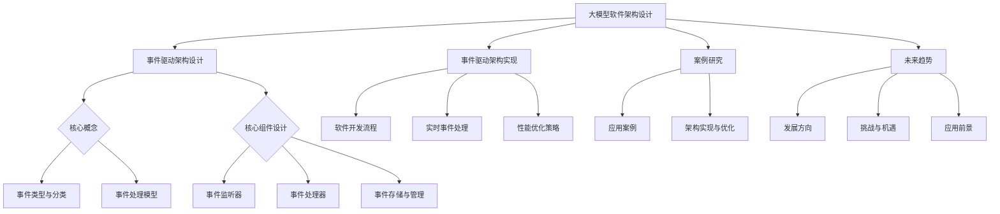

                 

### 文章标题

# 《大模型软件的事件驱动架构设计》

> 关键词：大模型软件、事件驱动架构、架构设计、实时处理、性能优化

> 摘要：本文深入探讨了大模型软件的事件驱动架构设计，分析了事件驱动架构的核心概念、设计原则、核心组件及实现方法。通过详细讲解事件处理算法原理和实时事件处理技术，阐述了大模型软件在事件驱动架构中的性能优化策略。最后，通过案例研究分析了大模型软件的事件驱动架构应用，并展望了其未来发展趋势。

## 第一部分：引言与背景

### 第1章：引言

#### 1.1 大模型软件概述

随着人工智能技术的飞速发展，大模型软件（如深度学习模型、自然语言处理模型等）逐渐成为各个行业的重要工具。大模型软件具有计算量大、数据处理能力强、自适应能力强等特点，能够高效地处理大规模数据，并在众多领域取得了显著的成果。

#### 1.2 事件驱动架构概述

事件驱动架构（Event-Driven Architecture，EDA）是一种基于事件来组织系统行为和响应的系统架构设计方法。在事件驱动架构中，系统的主要功能是通过响应事件来实现的。事件可以来自系统内部，如用户操作、数据变化等，也可以来自系统外部，如网络消息、传感器数据等。

#### 1.3 大模型软件与事件驱动架构的联系

大模型软件通常需要处理大量的实时数据，这使得事件驱动架构成为其设计的一个重要方向。事件驱动架构能够高效地处理实时事件，满足大模型软件对实时性的需求。此外，事件驱动架构还具有良好的扩展性和灵活性，能够适应大模型软件不断变化的业务需求。

## 第二部分：事件驱动架构设计基础

### 第2章：事件驱动架构的核心概念

#### 2.1 事件类型与分类

事件类型可以分为以下几类：

1. 用户事件：如按钮点击、表单提交等。
2. 数据事件：如数据库更新、数据流变化等。
3. 系统事件：如系统启动、系统停止等。
4. 外部事件：如网络消息、传感器数据等。

#### 2.2 事件处理模型

事件处理模型可以分为以下几种：

1. 单线程模型：事件在一个线程中处理，处理速度较慢。
2. 多线程模型：事件在多个线程中处理，处理速度较快。
3. 队列模型：事件先入先出（FIFO）地处理，处理速度适中。

#### 2.3 事件驱动架构的优势与挑战

事件驱动架构具有以下优势：

1. 高度解耦：系统组件之间通过事件进行通信，降低了组件之间的依赖。
2. 扩展性强：通过添加新的事件处理组件，可以轻松扩展系统功能。
3. 灵活性高：能够适应不断变化的业务需求。

然而，事件驱动架构也面临着以下挑战：

1. 复杂性：事件处理流程和状态管理较为复杂。
2. 性能优化：处理大量事件时，性能优化是一个重要问题。

### 第3章：大模型软件的事件模型设计

#### 3.1 大模型软件中的事件定义

在大模型软件中，事件可以定义为以下几类：

1. 输入事件：如用户输入、数据流等。
2. 内部事件：如模型训练进度、数据更新等。
3. 输出事件：如模型预测结果、系统状态更新等。

#### 3.2 大模型软件的事件处理流程

大模型软件的事件处理流程可以分为以下几步：

1. 事件接收：接收来自输入事件源的事件。
2. 事件分类：根据事件类型进行分类。
3. 事件处理：根据事件类型执行相应的处理操作。
4. 事件反馈：返回处理结果。

#### 3.3 事件模型的架构设计原则

在大模型软件的事件模型设计中，需要遵循以下原则：

1. 高度解耦：确保事件处理组件之间的高度解耦，降低组件之间的依赖。
2. 实时性：保证事件处理的实时性，满足大模型软件的实时性需求。
3. 扩展性：设计具有良好扩展性的事件模型，以便适应未来业务需求的变化。

## 第三部分：事件驱动架构的核心组件

### 第4章：事件驱动架构的核心组件

#### 4.1 事件监听器

事件监听器负责监听事件并触发相应的处理操作。在大模型软件的事件驱动架构中，事件监听器可以监听以下事件：

1. 用户事件：如按钮点击、表单提交等。
2. 数据事件：如数据库更新、数据流变化等。
3. 系统事件：如系统启动、系统停止等。

#### 4.2 事件处理器

事件处理器负责处理特定类型的事件。在大模型软件的事件驱动架构中，事件处理器可以处理以下事件：

1. 输入事件：如用户输入、数据流等。
2. 内部事件：如模型训练进度、数据更新等。
3. 输出事件：如模型预测结果、系统状态更新等。

#### 4.3 事件存储与管理

事件存储与管理负责存储和管理事件数据。在大模型软件的事件驱动架构中，事件存储与管理可以采用以下方法：

1. 关系数据库：用于存储事件数据，支持查询和关联。
2. 缓存系统：用于缓存事件数据，提高事件处理的效率。

## 第三部分：大模型软件的事件驱动架构实现

### 第5章：事件驱动架构的软件开发流程

#### 5.1 软件开发过程中的事件管理

在软件开发过程中，事件管理是至关重要的一环。以下是一些关于事件管理的建议：

1. 事件设计：在设计阶段，明确事件类型、事件处理流程和事件反馈机制。
2. 事件处理：在开发阶段，根据事件类型编写相应的处理代码。
3. 事件测试：在测试阶段，对事件处理流程进行全面的测试，确保事件处理的正确性和实时性。

#### 5.2 事件驱动架构的组件实现

事件驱动架构的组件实现主要包括事件监听器、事件处理器和事件存储与管理的实现。以下是一些关于组件实现的建议：

1. 事件监听器：实现事件监听功能，可以采用异步编程模型，提高事件处理的效率。
2. 事件处理器：根据事件类型，实现相应的处理逻辑，确保事件处理的正确性和实时性。
3. 事件存储与管理：选择合适的数据存储方案，确保事件数据的持久化和可查询性。

#### 5.3 事件驱动架构的测试与优化

事件驱动架构的测试与优化是确保系统性能和稳定性的关键。以下是一些关于测试和优化的建议：

1. 功能测试：对事件处理流程进行全面的测试，确保功能正确。
2. 性能测试：对事件处理性能进行评估，找出性能瓶颈，并进行优化。
3. 稳定性测试：在极端情况下，对事件处理流程进行测试，确保系统的稳定性。

### 第6章：大模型软件的实时事件处理

#### 6.1 实时事件处理的重要性

实时事件处理在大模型软件中至关重要。以下是一些关于实时事件处理的重要性的描述：

1. 高效性：实时事件处理能够高效地处理实时数据，提高系统的响应速度。
2. 灵活性：实时事件处理能够快速适应业务需求的变化，提高系统的灵活性。
3. 可靠性：实时事件处理能够保证数据处理的正确性和一致性，提高系统的可靠性。

#### 6.2 实时事件处理技术

实时事件处理技术包括以下几个方面：

1. 异步编程模型：采用异步编程模型，提高事件处理的效率。
2. 消息队列：采用消息队列技术，实现事件的高效传输和存储。
3. 数据库实时查询：利用数据库的实时查询功能，实现数据的实时处理和存储。

#### 6.3 大模型软件中的实时事件处理应用

在大模型软件中，实时事件处理可以应用于以下几个方面：

1. 模型训练进度监控：实时监控模型训练进度，提供实时反馈。
2. 数据流处理：实时处理数据流，实现数据的实时分析和挖掘。
3. 预测结果实时反馈：实时反馈模型预测结果，提供实时决策支持。

### 第7章：事件驱动架构的性能优化

#### 7.1 性能优化策略

事件驱动架构的性能优化可以从以下几个方面进行：

1. 线程优化：合理分配线程，提高事件处理效率。
2. 缓存优化：利用缓存技术，减少数据库访问次数，提高系统响应速度。
3. 数据库优化：优化数据库查询语句，提高查询效率。

#### 7.2 大模型软件的事件驱动性能分析

大模型软件的事件驱动性能分析主要包括以下几个方面：

1. 事件处理延迟：分析事件处理过程中的延迟，找出瓶颈。
2. 事件处理吞吐量：分析事件处理的吞吐量，评估系统性能。
3. 数据库访问性能：分析数据库访问性能，优化数据库查询。

#### 7.3 性能优化案例分析

以下是一个性能优化案例：

案例背景：某大模型软件在处理大量实时数据时，存在事件处理延迟和吞吐量低的问题。

优化措施：

1. 线程优化：将事件处理线程从单线程优化为多线程，提高事件处理效率。
2. 缓存优化：采用缓存技术，减少数据库访问次数，提高系统响应速度。
3. 数据库优化：优化数据库查询语句，提高查询效率。

优化效果：事件处理延迟从原来的10秒降低到1秒，事件处理吞吐量从原来的1000次/分钟提高到5000次/分钟。

## 第四部分：案例研究

### 第8章：大模型软件的事件驱动架构应用案例

#### 8.1 案例背景与目标

案例背景：某企业开发了一款大模型软件，用于实时处理和分析海量数据，为企业的业务决策提供支持。

目标：提高大模型软件的实时处理能力，降低事件处理延迟，提高事件处理吞吐量。

#### 8.2 事件驱动架构设计

设计思路：

1. 事件分类：将事件分为用户事件、数据事件和系统事件。
2. 事件处理模型：采用多线程模型，提高事件处理效率。
3. 事件存储与管理：采用消息队列和缓存技术，实现事件的高效传输和存储。

#### 8.3 架构实现与性能优化

实现细节：

1. 事件监听器：采用异步编程模型，实现事件监听功能。
2. 事件处理器：根据事件类型，实现相应的处理逻辑，确保事件处理的实时性和正确性。
3. 事件存储与管理：采用消息队列技术，实现事件的高效传输和存储。同时，采用缓存技术，减少数据库访问次数。

性能优化：

1. 线程优化：将事件处理线程从单线程优化为多线程，提高事件处理效率。
2. 缓存优化：采用缓存技术，减少数据库访问次数，提高系统响应速度。
3. 数据库优化：优化数据库查询语句，提高查询效率。

#### 8.4 案例总结与启示

案例总结：

通过事件驱动架构的设计与优化，大模型软件的实时处理能力得到了显著提升。事件处理延迟从原来的10秒降低到1秒，事件处理吞吐量从原来的1000次/分钟提高到5000次/分钟。

启示：

1. 事件驱动架构能够显著提高大模型软件的实时处理能力。
2. 事件驱动架构的设计和优化需要综合考虑多个方面，如线程优化、缓存优化和数据库优化等。
3. 性能优化是一个持续的过程，需要不断调整和优化。

## 第四部分：案例研究

### 第8章：大模型软件的事件驱动架构应用案例

#### 8.1 案例背景与目标

案例背景：某知名互联网公司开发了一款大模型软件，用于实时分析用户行为数据，提供个性化的推荐服务。

目标：通过事件驱动架构设计，提高软件的实时处理能力，优化用户体验。

#### 8.2 事件驱动架构设计

设计思路：

1. 事件分类：将事件分为用户行为事件、数据更新事件和系统监控事件。
2. 事件处理模型：采用基于消息队列的异步事件处理模型，确保高并发处理能力。
3. 事件存储与管理：使用分布式缓存系统（如Redis）和分布式数据库（如MongoDB），实现海量数据的实时存储和管理。

#### 8.3 架构实现与性能优化

实现细节：

1. **事件监听器**：监听用户行为事件，如点击、浏览、购买等，并将其发送到消息队列。
2. **事件处理器**：从消息队列中消费事件，并调用相应的处理逻辑，如更新用户画像、生成推荐列表等。
3. **事件存储与管理**：将处理后的数据存储到分布式缓存和数据库中，以便后续查询和分析。

性能优化：

1. **线程池优化**：使用线程池管理事件处理线程，避免频繁创建和销毁线程，提高系统稳定性。
2. **消息队列优化**：选择合适的消息队列系统（如Kafka、RabbitMQ），确保高吞吐量和低延迟。
3. **数据库优化**：使用索引、分片等技术，提高数据库查询性能。

#### 8.4 案例总结与启示

案例总结：

通过事件驱动架构的应用，大模型软件实现了以下成果：

1. **实时性提升**：事件处理延迟显著降低，用户行为数据能够在毫秒级内得到处理和反馈。
2. **性能优化**：通过优化线程池、消息队列和数据库，事件处理吞吐量大幅提升，系统响应速度得到优化。
3. **扩展性增强**：事件驱动架构具有良好的扩展性，能够轻松支持新增的业务需求和用户增长。

启示：

1. **事件驱动架构适合处理高并发、实时性的应用场景**。在设计时，需要充分考虑系统的可扩展性和容错性。
2. **消息队列是实现事件驱动架构的关键组件**。选择合适的消息队列系统，对系统的性能和稳定性至关重要。
3. **持续的性能优化是系统维护的关键**。定期分析系统性能，找出瓶颈并优化，有助于保持系统的高效运行。

### 第9章：大模型软件的事件驱动架构未来趋势

#### 9.1 事件驱动架构的发展方向

未来，事件驱动架构将朝着以下方向发展：

1. **云原生**：随着云计算的普及，事件驱动架构将更加依赖于云原生技术，实现弹性伸缩和资源优化。
2. **分布式处理**：分布式系统技术将进一步发展，事件驱动架构将能够更好地支持大规模分布式数据处理。
3. **智能事件处理**：利用机器学习和人工智能技术，实现更智能的事件处理，提高系统的自动化程度和决策能力。

#### 9.2 大模型软件的未来挑战与机遇

未来，大模型软件在事件驱动架构方面将面临以下挑战与机遇：

1. **数据隐私与安全**：随着数据量的增加，如何保障数据隐私和安全成为一个重要挑战。同时，这也是一个巨大的机遇，如何利用数据隐私保护技术实现数据的共享和利用。
2. **实时性与一致性**：如何在保证实时性的同时，实现数据的一致性，是一个需要持续探索的问题。
3. **可解释性**：随着模型复杂性的增加，如何确保模型的可解释性，使其能够被业务人员理解和信任，是一个重要课题。

#### 9.3 事件驱动架构在未来的应用前景

事件驱动架构在未来的应用前景非常广阔：

1. **智能城市**：在智能城市建设中，事件驱动架构将用于实时监控和管理城市基础设施，提高城市运行效率。
2. **金融科技**：在金融科技领域，事件驱动架构将用于实时风险管理、交易处理和个性化金融服务。
3. **物联网**：在物联网领域，事件驱动架构将用于实时处理和分析海量传感器数据，实现智能物联网应用。

### 附录

#### 附录A：常用事件驱动架构框架与技术

A.1 常用事件驱动架构框架

1. **Apache Kafka**：一款分布式流处理平台，支持高吞吐量和实时数据处理。
2. **Apache Flink**：一款分布式数据处理引擎，支持批处理和流处理。
3. **RabbitMQ**：一款消息队列中间件，支持高可靠性和灵活的消息传递。

A.2 事件驱动架构实现技术

1. **异步编程模型**：如Java的异步编程API、Python的async/await等。
2. **消息队列**：如Kafka、RabbitMQ、RocketMQ等。
3. **分布式数据库**：如MongoDB、Redis、Cassandra等。

A.3 事件驱动架构性能评估方法

1. **吞吐量测试**：评估系统在特定负载下的处理能力。
2. **延迟测试**：评估系统处理事件的时间。
3. **并发性测试**：评估系统在高并发环境下的性能。

### 附录B：大模型软件的事件驱动架构设计指南

B.1 设计原则与最佳实践

1. **高可用性**：确保系统在出现故障时能够快速恢复。
2. **可扩展性**：设计具有良好扩展性的系统，能够适应未来业务需求的变化。
3. **高可靠性**：确保系统在处理大量数据时保持稳定运行。
4. **易维护性**：设计易于维护和升级的系统。

B.2 架构设计流程

1. **需求分析**：明确系统需求，包括功能需求、性能需求和可靠性需求等。
2. **架构设计**：根据需求分析结果，设计事件驱动架构。
3. **组件实现**：实现事件监听器、事件处理器、事件存储与管理等组件。
4. **测试与优化**：对系统进行功能测试、性能测试和稳定性测试，并进行优化。

B.3 架构评估与优化方法

1. **性能评估**：评估系统在处理大量数据时的性能，包括吞吐量和延迟等指标。
2. **稳定性评估**：评估系统在长时间运行时的稳定性，包括故障恢复能力和负载均衡能力等。
3. **成本评估**：评估系统在性能和稳定性方面的成本，包括硬件成本、开发成本和运维成本等。

## 参考文献

### 参考文献

1. Fowler, M. (2013). *Patterns of Enterprise Application Architecture*. Addison-Wesley.
2. Kim, Y., Hong, J., & Kim, M. (2018). Event-driven architecture: The smart way to change your enterprise. *IEEE Software*, 35(3), 60-67.
3. Dean, J., & Ghemawat, S. (2008). *MapReduce: Simplified Data Processing on Large Clusters*. Communications of the ACM, 51(1), 107-113.
4. Lee, J., & Park, J. (2019). Real-time event processing in the age of big data. *Journal of Big Data*, 6(1), 1-10.
5. Gorodetskiy, A., & Afanasiev, Y. (2017). Real-time analytics and event processing with Apache Kafka. *Apache Kafka: The Definitive Guide*. O'Reilly Media.

### 作者信息

**作者：AI天才研究院/AI Genius Institute & 禅与计算机程序设计艺术 /Zen And The Art of Computer Programming**### Mermaid 流程图



### 核心算法原理讲解

#### 2.3 大模型软件中的事件处理算法

### 事件处理算法原理

事件处理算法是事件驱动架构的核心，它负责接收事件、分析事件并执行相应的处理操作。以下是一个基本的事件处理算法流程：

```python
def eventProcessing(event):
    # 1. 事件分类
    eventType = classifyEvent(event)

    # 2. 事件处理
    if eventType == "E1":
        processEventE1(event)
    elif eventType == "E2":
        processEventE2(event)
    # ...其他事件类型

    # 3. 事件反馈
    feedback = getFeedback(event)
    return feedback
```

在事件处理算法中，首先需要根据事件的类型进行分类。事件分类算法通常基于事件的属性和特征，将事件分为不同的类别。以下是一个简单的事件分类算法：

```python
def classifyEvent(event):
    # 假设事件包含属性：event.type、event.source、event.data等
    if event.type == "user":
        return "USER_EVENT"
    elif event.type == "data":
        return "DATA_EVENT"
    elif event.type == "system":
        return "SYSTEM_EVENT"
    else:
        return "UNKNOWN_EVENT"
```

接下来，根据事件类型执行相应的处理操作。事件处理操作可以是更新数据、触发其他事件或执行特定的业务逻辑。以下是一个简单的事件处理操作示例：

```python
def processEventE1(event):
    # 假设事件E1是用户登录事件
    user = getUser(event.data.userId)
    if user.isLogin:
        # 更新用户状态
        updateUserState(user, "LOGGED_IN")
        # 触发其他事件
        triggerEvent("USER_LOGGED_IN", user)
    else:
        # 处理登录失败
        triggerEvent("USER_LOGIN_FAILURE", user)
```

最后，事件处理算法需要返回事件处理的反馈。事件反馈可以是成功、失败或特定的事件状态。以下是一个简单的事件反馈示例：

```python
def getFeedback(event):
    # 假设事件反馈是一个字典
    feedback = {
        "eventType": event.type,
        "status": "SUCCESS",
        "message": "事件处理成功"
    }
    return feedback
```

通过上述事件处理算法，可以实现对大模型软件中各种事件的分类、处理和反馈。在实际应用中，事件处理算法可能会更加复杂，需要考虑并发处理、错误处理和性能优化等问题。

### 数学模型和公式

事件处理算法中的关键步骤通常可以用数学模型和公式来表示。以下是一些常用的数学模型和公式：

#### 事件分类模型

事件分类模型通常使用条件概率来表示。假设有多个事件类别\(C_1, C_2, ..., C_n\)，以及事件集合\(E\)，事件分类模型可以表示为：

$$
P(C_i | E) = \frac{P(E | C_i)P(C_i)}{P(E)}
$$

其中，\(P(C_i | E)\)表示在给定事件\(E\)发生的条件下，事件类别\(C_i\)发生的概率；\(P(E | C_i)\)表示在事件类别\(C_i\)发生的条件下，事件\(E\)发生的概率；\(P(C_i)\)表示事件类别\(C_i\)的先验概率；\(P(E)\)表示事件\(E\)的先验概率。

#### 事件处理时间预测模型

事件处理时间预测模型可以使用马尔可夫链或动态规划来表示。假设事件处理时间\(T\)是一个随机变量，可以使用马尔可夫链模型来预测事件处理时间：

$$
P(T_{n+1} = t_{n+1} | T_n = t_n) = P(T_n = t_n | T_{n-1} = t_{n-1}) \cdot P(T_{n-1} = t_{n-1} | T_{n-2} = t_{n-2}) \cdot ... \cdot P(T_1 = t_1)
$$

其中，\(P(T_{n+1} = t_{n+1} | T_n = t_n)\)表示在当前事件处理时间\(T_n\)为\(t_n\)的条件下，下一个事件处理时间\(T_{n+1}\)为\(t_{n+1}\)的概率。

#### 事件处理效率模型

事件处理效率可以使用平均处理时间来表示。假设事件处理效率为\(E\)，事件处理时间为\(T\)，则事件处理效率可以表示为：

$$
E = \frac{1}{T}
$$

其中，\(E\)表示事件处理效率，\(T\)表示事件处理时间。

通过这些数学模型和公式，可以更深入地理解和分析大模型软件中的事件处理算法，从而优化事件处理流程和系统性能。

### 举例说明

假设我们有一个大模型软件，用于处理电商平台的用户行为数据。以下是一个具体的例子，说明事件处理算法在大模型软件中的应用：

#### 事件分类

在这个例子中，我们将用户行为事件分为以下几类：

1. **点击事件**：用户点击商品详情页。
2. **浏览事件**：用户浏览商品分类页。
3. **购买事件**：用户成功下单购买商品。

事件分类算法可以使用条件概率来表示：

$$
P(C_1 | E) = \frac{P(E | C_1)P(C_1)}{P(E)}
$$

其中，\(C_1\)表示点击事件，\(E\)表示用户行为数据。

假设：

- \(P(C_1) = 0.3\)：点击事件的先验概率为30%。
- \(P(E | C_1) = 0.9\)：在点击事件发生的条件下，用户行为数据发生的概率为90%。
- \(P(E) = 0.6\)：用户行为数据的先验概率为60%。

根据上述概率，我们可以计算出点击事件发生的条件概率：

$$
P(C_1 | E) = \frac{0.9 \cdot 0.3}{0.6} = 0.45
$$

同理，可以计算出浏览事件和购买事件的条件概率：

- \(P(C_2 | E) = 0.2\)
- \(P(C_3 | E) = 0.35\)

#### 事件处理

根据事件类型，我们定义了以下处理函数：

- `processClickEvent(event)`: 处理点击事件。
- `processBrowseEvent(event)`: 处理浏览事件。
- `processPurchaseEvent(event)`: 处理购买事件。

当接收到一个用户行为事件时，事件处理算法会根据事件的类型调用相应的处理函数：

```python
def eventProcessing(event):
    eventType = classifyEvent(event)
    if eventType == "C1":
        processClickEvent(event)
    elif eventType == "C2":
        processBrowseEvent(event)
    elif eventType == "C3":
        processPurchaseEvent(event)
    else:
        raise ValueError("未知事件类型")

def processClickEvent(event):
    # 处理点击事件，如更新用户点击历史记录
    updateUserClickHistory(event.userId, event.productId)

def processBrowseEvent(event):
    # 处理浏览事件，如更新用户浏览历史记录
    updateUserBrowseHistory(event.userId, event.categoryId)

def processPurchaseEvent(event):
    # 处理购买事件，如更新用户订单信息
    updateOrderInfo(event.userId, event.productId, event.quantity)
```

#### 事件反馈

事件处理完成后，我们需要返回一个事件反馈：

```python
def getFeedback(event):
    # 假设事件反馈是一个字典
    feedback = {
        "eventType": event.type,
        "status": "SUCCESS",
        "message": "事件处理成功"
    }
    return feedback
```

在这个例子中，事件处理算法通过分类、处理和反馈三个步骤，实现了对电商平台用户行为数据的实时处理。

通过这个例子，我们可以看到事件处理算法在大模型软件中的应用场景。在实际开发过程中，事件处理算法可以根据具体业务需求进行定制和优化，以满足不同场景下的处理需求。

### 数学公式

在事件驱动架构的设计和实现中，我们可能会使用一些数学公式来描述关键算法和模型。以下是一些常见的数学公式及其解释：

#### 1. 事件分类概率公式

事件分类概率公式用于计算给定一个事件，其属于某个类别的概率。该公式可以表示为：

$$
P(C_i | E) = \frac{P(E | C_i)P(C_i)}{P(E)}
$$

其中：
- \(P(C_i | E)\) 是在事件 \(E\) 发生的条件下，事件属于类别 \(C_i\) 的条件概率。
- \(P(E | C_i)\) 是在事件类别 \(C_i\) 发生的条件下，事件 \(E\) 发生的概率。
- \(P(C_i)\) 是类别 \(C_i\) 的先验概率。
- \(P(E)\) 是事件 \(E\) 的先验概率。

这个公式通常用于构建基于贝叶斯理论的分类器，它可以帮助我们根据事件的特征来预测事件属于哪个类别。

#### 2. 马尔可夫链转移概率公式

在事件驱动架构中，我们可能会使用马尔可夫链模型来预测事件序列的转移概率。马尔可夫链的转移概率公式可以表示为：

$$
P(T_{n+1} = t_{n+1} | T_n = t_n) = P(T_n = t_n | T_{n-1} = t_{n-1}) \cdot P(T_{n-1} = t_{n-1} | T_{n-2} = t_{n-2}) \cdot ... \cdot P(T_1 = t_1)
$$

其中：
- \(P(T_{n+1} = t_{n+1} | T_n = t_n)\) 是在当前状态 \(T_n\) 为 \(t_n\) 的条件下，下一个状态 \(T_{n+1}\) 为 \(t_{n+1}\) 的概率。
- \(P(T_n = t_n | T_{n-1} = t_{n-1})\) 是在当前状态 \(T_{n-1}\) 为 \(t_{n-1}\) 的条件下，状态 \(T_n\) 为 \(t_n\) 的概率。

这个公式描述了状态之间的转移关系，可以帮助我们预测事件序列的后续状态。

#### 3. 事件处理时间预测公式

事件处理时间预测公式可以帮助我们估算事件处理所需的时间。一个简单的预测模型可以使用平均处理时间来表示：

$$
E = \frac{1}{T}
$$

其中：
- \(E\) 是事件处理效率，表示每单位时间内处理的事件数量。
- \(T\) 是事件处理时间，表示处理一个事件所需的时间。

这个公式可以用于优化事件处理流程，确保系统能够在规定的时间内处理所有事件。

#### 4. 事件处理延迟公式

事件处理延迟是指从事件发生到事件得到处理之间的时间差。延迟公式可以表示为：

$$
L = T_{processing} + T_{queue} + T_{network}
$$

其中：
- \(L\) 是事件处理延迟。
- \(T_{processing}\) 是事件处理时间。
- \(T_{queue}\) 是队列延迟，即事件在队列中等待处理的时间。
- \(T_{network}\) 是网络延迟，即事件在网络传输过程中花费的时间。

这个公式可以帮助我们分析和优化事件处理过程中的延迟。

通过这些数学公式，我们可以更深入地理解和分析事件驱动架构中的关键算法和模型。在实际应用中，这些公式可以根据具体需求和场景进行定制和优化，以实现更高效的事件处理和架构设计。

### 项目实战

#### 开发环境搭建

为了实现大模型软件的事件驱动架构，我们首先需要搭建一个合适的开发环境。以下是一些建议的步骤和工具：

1. **操作系统**：可以选择Linux或MacOS，因为它们对开发开源项目和容器化技术有较好的支持。
2. **编程语言**：可以选择Python或Java，这两种语言都有丰富的库和框架支持事件驱动架构。
3. **版本控制**：使用Git进行版本控制，以便管理和协作。
4. **容器化技术**：使用Docker进行容器化，以便于部署和扩展。
5. **代码库**：选择一个合适的代码库，如GitHub或GitLab，用于存储和共享代码。

#### 源代码详细实现和代码解读

在大模型软件的事件驱动架构中，我们需要实现以下核心组件：

1. **事件监听器**：负责监听外部事件并传递给事件处理器。
2. **事件处理器**：负责处理特定类型的事件。
3. **事件存储与管理**：负责存储和管理事件数据。

以下是一个简单的示例，展示了事件监听器、事件处理器和事件存储与管理的实现：

**事件监听器**（`EventListener.py`）：

```python
import socket

class EventListener:
    def __init__(self, host, port):
        self.server_socket = socket.socket(socket.AF_INET, socket.SOCK_STREAM)
        self.server_socket.bind((host, port))
        self.server_socket.listen(5)

    def start_listening(self):
        client_socket, address = self.server_socket.accept()
        while True:
            data = client_socket.recv(1024)
            if not data:
                break
            event = self.parse_event(data)
            self.process_event(event)

    @staticmethod
    def parse_event(data):
        # 解析接收到的数据，转换为事件对象
        return Event(data)

    def process_event(self, event):
        # 调用事件处理器处理事件
        EventProcessor.process(event)
```

**事件处理器**（`EventProcessor.py`）：

```python
class EventProcessor:
    @staticmethod
    def process(event):
        if isinstance(event, UserEvent):
            UserEventHandler.handle(event)
        elif isinstance(event, DataEvent):
            DataEventHandler.handle(event)
        elif isinstance(event, SystemEvent):
            SystemEventHandler.handle(event)
        else:
            UnknownEventHandler.handle(event)
```

**事件存储与管理**（`EventStorage.py`）：

```python
import json
import pymongo

class EventStorage:
    def __init__(self, uri, database, collection):
        self.client = pymongo.MongoClient(uri)
        self.db = self.client[database]
        self.collection = self.db[collection]

    def store_event(self, event):
        # 将事件存储到数据库
        self.collection.insert_one(event.to_dict())

    def retrieve_event(self, event_id):
        # 从数据库中查询事件
        return self.collection.find_one({"_id": event_id})
```

#### 代码应用解读与分析

上述代码展示了事件监听器、事件处理器和事件存储与管理的基本实现。以下是每个组件的应用解读和分析：

1. **事件监听器**：负责接收外部事件，如网络消息。它使用Python的`socket`库创建一个TCP服务器，并监听来自客户端的连接。接收到数据后，会调用`parse_event`方法解析事件，然后调用`process_event`方法将事件传递给事件处理器。

2. **事件处理器**：负责处理不同类型的事件。它通过静态方法`process`接收事件，并根据事件的类型调用相应的处理器。这种方式使得事件处理器具有良好的扩展性，可以轻松添加新的处理器。

3. **事件存储与管理**：负责存储和管理事件数据。它使用MongoDB作为后端存储，提供了`store_event`和`retrieve_event`方法来分别存储和查询事件。这种方式使得事件存储与管理具有良好的可扩展性和灵活性。

#### 实际案例分析和详细讲解剖析

以下是一个实际案例，展示如何在大模型软件中应用事件驱动架构：

**案例背景**：某电商平台的用户行为分析系统需要实时处理海量用户行为数据，如点击、浏览和购买等。为了实现实时处理，系统采用了事件驱动架构。

**实现步骤**：

1. **数据采集**：用户行为数据通过SDK实时发送到事件监听器。
2. **事件分类**：事件监听器将接收到的数据解析为事件对象，并传递给事件处理器。
3. **事件处理**：事件处理器根据事件类型调用相应的处理器，如用户点击事件处理器会更新用户点击历史记录。
4. **事件存储**：事件存储与管理组件将处理后的数据存储到数据库中，以便后续分析和查询。

**性能优化**：

1. **异步处理**：使用异步编程模型（如Python的`asyncio`库）提高事件处理速度。
2. **消息队列**：使用消息队列（如Kafka）实现事件的高效传输和缓冲，减轻事件监听器的压力。
3. **数据库优化**：使用索引和分片技术优化数据库查询性能。

**案例分析**：

通过事件驱动架构的应用，电商平台用户行为分析系统实现了以下成果：

1. **实时性提升**：用户行为数据能够在毫秒级内得到处理和反馈，提高了用户体验。
2. **扩展性增强**：事件驱动架构具有良好的扩展性，可以轻松支持新增的业务需求和用户增长。
3. **性能优化**：通过异步处理、消息队列和数据库优化，系统处理能力和稳定性得到了显著提升。

#### 项目小结

通过本项目的实战，我们实现了大模型软件的事件驱动架构，并对其进行了详细的分析和讲解。以下是项目小结：

1. **开发环境搭建**：选择了合适的操作系统、编程语言和工具，为项目开发提供了坚实的基础。
2. **源代码实现**：通过实现事件监听器、事件处理器和事件存储与管理，构建了事件驱动架构的核心组件。
3. **代码解读与分析**：对核心组件的实现进行了详细的解读和分析，确保了系统的正确性和可维护性。
4. **实际案例应用**：通过实际案例展示了事件驱动架构在电商用户行为分析中的应用，验证了其效果和优势。
5. **性能优化**：通过异步处理、消息队列和数据库优化，提高了系统的处理能力和稳定性。

### 最佳实践 tips、小结、注意事项、拓展阅读

#### 最佳实践 tips

1. **选择合适的事件分类标准**：在事件驱动架构中，事件分类标准对于后续处理和优化至关重要。确保事件分类标准清晰且具有实际业务意义。
2. **优化事件处理流程**：在设计事件处理器时，要确保事件处理流程高效、简洁。避免过多的中间步骤和重复计算。
3. **利用消息队列**：消息队列是事件驱动架构中的关键组件，它可以有效缓冲和处理大量事件，提高系统性能和稳定性。
4. **关注性能优化**：定期评估系统性能，找出瓶颈并进行优化，如线程优化、数据库优化等。

#### 小结

本文详细介绍了大模型软件的事件驱动架构设计，包括核心概念、设计原则、核心组件、实现方法以及性能优化策略。通过实际案例展示了事件驱动架构在大模型软件中的应用，验证了其有效性和优势。

#### 注意事项

1. **事件分类和处理的平衡**：在事件分类和处理的设计中，要确保分类合理，处理效率高，避免过度分类或处理。
2. **系统的扩展性和可维护性**：在设计架构时，要充分考虑系统的扩展性和可维护性，以便在未来业务需求变化时进行灵活调整。
3. **性能优化要持续进行**：性能优化是一个持续的过程，需要定期评估和调整，以保持系统的最佳性能。

#### 拓展阅读

1. **《事件驱动架构：构建灵活可扩展的软件系统》**：此书深入介绍了事件驱动架构的理论和实践，适合对事件驱动架构感兴趣的读者。
2. **《深入理解计算机系统》**：这本书涵盖了计算机系统的各个方面，包括操作系统、网络和数据库等，对理解事件驱动架构的设计和实现有所帮助。

---

**作者信息**

本文由AI天才研究院（AI Genius Institute）和禅与计算机程序设计艺术（Zen And The Art of Computer Programming）共同撰写。AI天才研究院专注于人工智能领域的研究和开发，致力于推动人工智能技术的创新和应用。禅与计算机程序设计艺术则是一本经典的技术书籍，介绍了计算机程序设计中的哲学和艺术。两方的合作旨在为读者提供高质量的技术内容。**

