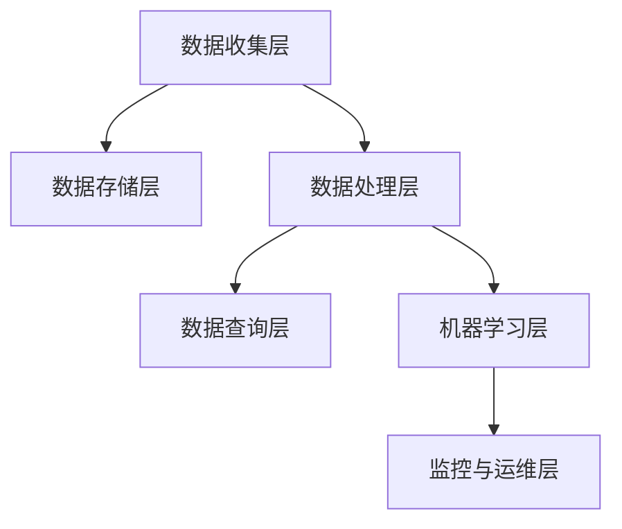
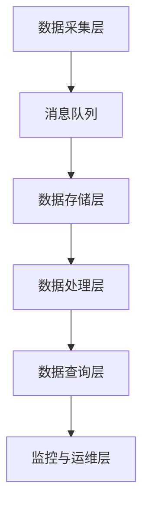

                 

### 2.1 神经网络与深度学习

#### 2.1.1 神经网络基础

神经网络（Neural Networks）是受生物神经元启发的一种计算模型。它由大量相互连接的节点（或称为神经元）组成，这些节点通过模拟生物神经元的连接方式来进行计算。每个神经元都可以接收来自其他神经元的输入信号，并通过一个非线性激活函数产生输出。

**神经网络的工作原理：**

1. **输入层**：接收外部输入信号。
2. **隐藏层**：对输入信号进行加工和处理。
3. **输出层**：产生最终输出。

每个神经元接收的输入信号是其他神经元输出信号的加权求和，然后通过一个激活函数（如Sigmoid、ReLU等）进行处理，产生输出信号。这个过程可以用以下伪代码表示：

```python
# 神经元处理输入信号伪代码
weights = initialize_weights()
inputs = receive_inputs()
z = dot_product(inputs, weights)
output = activation_function(z)
send_output(output)
```

**神经网络中的权重和偏置：**

- **权重（Weights）**：连接各神经元之间的系数，用于控制输入信号的影响程度。
- **偏置（Bias）**：为每个神经元增加一个可学习的偏置项，使得网络能够更好地拟合数据。

#### 2.1.2 深度学习与反向传播算法

深度学习（Deep Learning）是指具有多个隐藏层的神经网络。它的主要优势在于能够自动提取层次化的特征表示，从而在复杂任务中表现出色。

**反向传播算法（Backpropagation）是深度学习训练的核心。**

1. **前向传播（Forward Propagation）**：将输入数据通过网络进行传播，计算输出。
2. **计算损失（Compute Loss）**：计算输出与真实标签之间的差异，即损失（Loss）。
3. **反向传播（Backpropagation）**：从输出层开始，将损失反向传播到各层，计算各层权重的梯度。
4. **权重更新（Update Weights）**：根据梯度调整各层的权重，最小化损失。

这个过程可以用以下伪代码表示：

```python
# 反向传播算法伪代码
for each layer in reverse order:
    compute_gradient(current_layer, next_layer)
    update_weights(current_layer, next_layer)

# 前向传播和损失计算伪代码
output = forward_propagation(input)
loss = compute_loss(output, target)
```

#### 2.1.3 深度学习中的优化算法

优化算法用于调整神经网络中的权重，以最小化损失函数。常见的优化算法有：

- **随机梯度下降（Stochastic Gradient Descent, SGD）**：在每次更新时使用全部数据的梯度。
- **批量梯度下降（Batch Gradient Descent）**：在每次更新时使用全部数据的梯度。
- **Adam优化器**：结合SGD和批量梯度下降的优点，自适应调整学习率。

优化算法的伪代码如下：

```python
# 随机梯度下降优化算法伪代码
for each example in dataset:
    gradient = compute_gradient(example)
    update_weights(learning_rate * gradient)

# Adam优化器伪代码
m = moving_average_of_gradients
v = moving_variance_of_gradients
for each example in dataset:
    gradient = compute_gradient(example)
    m = m + learning_rate * (gradient - m)
    v = v + learning_rate * (gradient**2 - v)
    update_weights(m / (sqrt(v) + epsilon) * learning_rate)
```

通过上述步骤，我们可以详细理解神经网络和深度学习的基本原理及其训练过程。

### 2.2 大模型训练算法

#### 2.2.1 数据并行训练

数据并行（Data Parallelism）是一种将训练数据集划分成多个子集，分别在不同的节点上独立进行训练，然后通过参数同步实现模型更新的方法。

**数据并行训练的优势：**

- **提高计算速度**：通过并行计算，可以显著提高训练速度。
- **易于实现**：只需要将数据集划分成子集，并在不同节点上运行相同的训练代码。

**数据并行训练的伪代码：**

```python
# 数据并行训练伪代码
num_workers = number_of_available_nodes
split_data(dataset, num_workers)
for worker in range(num_workers):
    train_model_on_subset(worker, data_subset)
sync_model_parameters()
```

#### 2.2.2 模型并行训练

模型并行（Model Parallelism）是将大模型划分成多个子模型，分别在不同的节点上训练，并通过通信模块进行参数同步的方法。

**模型并行训练的优势：**

- **解决内存限制**：通过将模型拆分，可以减少单个节点的内存需求。
- **提高计算效率**：可以在不同节点上并行处理不同部分的计算任务。

**模型并行训练的伪代码：**

```python
# 模型并行训练伪代码
num_workers = number_of_available_nodes
split_model(model, num_workers)
for worker in range(num_workers):
    train_model_on_subset(worker, model_subset)
sync_model_parameters()
```

#### 2.2.3 动量（Momentum）与自适应学习率

动量（Momentum）是一种优化算法，用于加速收敛并防止过度更新。它通过计算过去梯度的加权平均值来更新权重。

**动量优化的伪代码：**

```python
# 动量优化伪代码
v = initialize_momentum_vector()
for each epoch:
    gradient = compute_gradient()
    v = momentum * v - learning_rate * gradient
    update_weights(v)
```

自适应学习率（Adaptive Learning Rate）通过动态调整学习率，使得模型能够更好地收敛。常见的自适应学习率算法有AdaGrad、RMSprop和Adam。

**Adam优化器的伪代码：**

```python
# Adam优化器伪代码
m = initialize_moving_average_of_gradients()
v = initialize_moving_variance_of_gradients()
for each example in dataset:
    gradient = compute_gradient(example)
    m = m + learning_rate * (gradient - m)
    v = v + learning_rate * (gradient**2 - v)
    update_weights(m / (sqrt(v) + epsilon) * learning_rate)
```

通过上述算法，我们可以有效地进行大模型的分布式训练，充分利用分布式系统的优势，提高训练效率和模型性能。

### 2.3 梯度下降与优化算法

#### 2.3.1 梯度下降算法

梯度下降（Gradient Descent）是一种优化算法，用于最小化损失函数。其基本思想是沿着损失函数的梯度方向进行迭代更新，逐渐减小损失值。

**梯度下降的基本步骤：**

1. **初始化参数**：随机初始化模型参数。
2. **计算梯度**：计算损失函数关于模型参数的梯度。
3. **更新参数**：根据梯度和学习率更新模型参数。

梯度下降的伪代码如下：

```python
# 梯度下降算法伪代码
initialize_parameters()
while not convergence():
    gradient = compute_gradient()
    update_parameters(learning_rate * gradient)
```

**学习率的选择：**

- **固定学习率**：在训练初期有效，但可能导致训练不稳定。
- **自适应学习率**：如AdaGrad、RMSprop和Adam，动态调整学习率，提高训练效率。

#### 2.3.2 动量（Momentum）

动量（Momentum）是一种用于加速梯度下降的优化技术。它通过考虑过去梯度的累积效果，防止模型在更新过程中陷入局部最优。

**动量的基本原理：**

动量类似于摩擦力，使得模型在更新过程中保持一定的惯性。具体实现如下：

```python
# 动量优化伪代码
v = initialize_momentum_vector()
for each epoch:
    gradient = compute_gradient()
    v = momentum * v - learning_rate * gradient
    update_weights(v)
```

**动量的优势：**

- **加快收敛速度**：通过累积梯度，加速模型收敛。
- **减少震荡**：减少因随机噪声导致的模型震荡。

#### 2.3.3 RMSprop

RMSprop是一种基于历史梯度平方和的优化算法。它通过计算梯度平方的平均值来动态调整学习率。

**RMSprop的基本原理：**

```python
# RMSprop优化器伪代码
s = initialize_moving_variance_of_gradients()
for each example in dataset:
    gradient = compute_gradient()
    s = rho * s + (1 - rho) * gradient**2
    update_weights(learning_rate / sqrt(s + epsilon) * gradient)
```

**RMSprop的优势：**

- **减少学习率的振荡**：通过考虑历史梯度平方，平滑学习率的变化。
- **适用于不同规模的问题**：适用于各种规模的问题，特别适用于稀疏数据。

#### 2.3.4 Adam

Adam是一种结合了动量和RMSprop优点的自适应学习率优化算法。它通过分别维护一阶矩估计和二阶矩估计，动态调整学习率。

**Adam的基本原理：**

```python
# Adam优化器伪代码
m = initialize_moving_average_of_gradients()
v = initialize_moving_variance_of_gradients()
for each example in dataset:
    gradient = compute_gradient()
    m = m + learning_rate * (gradient - m)
    v = v + learning_rate * (gradient**2 - v)
    update_weights(m / (sqrt(v) + epsilon) * learning_rate)
```

**Adam的优势：**

- **自适应调整学习率**：结合动量和RMSprop的优点，动态调整学习率。
- **适用于不同规模的问题**：适用于各种规模的问题，特别适用于稀疏数据。

通过以上优化算法，我们可以有效地调整模型参数，提高训练效率和模型性能。这些算法在分布式训练中尤为关键，有助于充分利用分布式系统的优势。

### 3.1 Hadoop与MapReduce

#### 3.1.1 Hadoop概述

Hadoop是一个开源的分布式计算框架，专为处理大量数据而设计。它由两个核心组件组成：Hadoop分布式文件系统（HDFS）和Hadoop YARN。

- **Hadoop分布式文件系统（HDFS）**：是一种高吞吐量的分布式文件存储系统，用于存储大规模数据。
- **Hadoop YARN**：是一种资源调度框架，负责分配和管理集群资源，支持多种数据处理框架。

#### 3.1.2 MapReduce概述

MapReduce是一种编程模型，用于处理大规模数据集。它由两个阶段组成：Map阶段和Reduce阶段。

- **Map阶段**：将输入数据分解成多个键值对，生成中间结果。
- **Reduce阶段**：将Map阶段的中间结果进行合并，生成最终输出。

#### 3.1.3 MapReduce工作原理

1. **输入分片（Split）**：将输入数据分割成多个分片（默认为128MB）。
2. **Map任务**：为每个分片分配一个Map任务，处理分片中的数据，生成中间键值对。
3. **Shuffle**：根据中间键值对的键对中间结果进行排序和分组。
4. **Reduce任务**：对Shuffle阶段的中间结果进行聚合和计算，生成最终输出。

#### 3.1.4 Hadoop与分布式大模型训练

Hadoop与MapReduce非常适合用于分布式大模型训练。以下是Hadoop和MapReduce在大模型训练中的应用：

- **数据存储**：使用HDFS存储大规模数据集，提高数据访问效率。
- **并行计算**：通过MapReduce模型，将大模型训练分解成多个独立计算任务，实现并行处理。
- **资源管理**：利用YARN进行资源调度，优化集群资源利用率。

#### 3.1.5 MapReduce伪代码

以下是MapReduce的一个简单伪代码示例：

```python
# MapReduce伪代码
map(input_key, input_value):
    for each output_key, output_value in process(input_value):
        emit(output_key, output_value)

reduce(output_key, values):
    aggregate(values)
    emit(output_key, aggregate_result)
```

通过Hadoop与MapReduce，我们可以高效地处理大规模数据，实现大模型训练的分布式计算，提升训练效率和模型性能。

### 3.2 Spark与RDD

#### 3.2.1 Spark概述

Apache Spark是一个开源的分布式计算引擎，专为大规模数据处理而设计。它提供了高性能的内存计算和分布式数据处理能力，支持多种编程语言，包括Scala、Python和Java。

**Spark的核心组件：**

- **Spark Core**：提供了基本的分布式计算抽象和任务调度。
- **Spark SQL**：用于处理结构化数据，支持SQL查询和DataFrame API。
- **Spark Streaming**：用于实时数据处理和分析。
- **MLlib**：提供了一系列机器学习算法和工具。
- **GraphX**：用于大规模图处理。

#### 3.2.2 RDD（Resilient Distributed Dataset）

RDD（Resilient Distributed Dataset）是Spark的核心数据抽象，它是一个不可变、分布式的数据集合，支持多种操作，如 transformations 和 actions。

- **Transformation**：生成新的RDD，如 map、filter、reduceByKey。
- **Action**：触发计算并将结果返回给驱动程序，如 count、saveAsTextFile。

**RDD的几个重要特性：**

- **弹性分布式数据集**：当数据丢失或节点故障时，Spark能够自动重计算数据。
- **惰性求值**：只有在触发action操作时，Spark才会实际执行计算。
- **分区**：数据被分配到多个分区，以实现并行计算。

#### 3.2.3 Spark与分布式大模型训练

Spark在分布式大模型训练中具有显著优势：

- **内存计算**：Spark利用内存缓存数据，提高数据处理速度。
- **弹性调度**：Spark YARN调度器优化资源分配，提高训练效率。
- **弹性容错**：RDD的弹性特性使得任务在节点故障时能够自动恢复。

#### 3.2.4 Spark编程示例

以下是Spark的一个简单编程示例，展示了如何使用RDD进行数据处理：

```python
from pyspark import SparkContext

# 初始化Spark上下文
sc = SparkContext("local", "Example")

# 创建RDD
data = ["hello", "world", "spark", "rdd"]
rdd = sc.parallelize(data)

# 应用transformation操作
words = rdd.flatMap(lambda x: x.split(" "))

# 应用action操作
count = words.count()

# 输出结果
print(count)

# 关闭Spark上下文
sc.stop()
```

通过Spark与RDD，我们可以高效地处理大规模数据，实现大模型训练的分布式计算，提升训练效率和模型性能。

### 3.3 TensorFlow与TensorBoard

#### 3.3.1 TensorFlow概述

TensorFlow是一个开源的机器学习框架，由Google开发，用于构建和训练各种机器学习模型。它提供了丰富的API，支持多种编程语言，如Python、C++和Java。

**TensorFlow的核心组件：**

- **TensorFlow Core**：提供了基础的计算图和数据流编程接口。
- **TensorFlow Estimators**：提供预定义的模型和训练流程，简化模型开发。
- **TensorFlow Datasets**：提供常用的数据集，方便数据加载和预处理。
- **TensorFlow Model Optimization**：用于优化模型，提高部署性能。

#### 3.3.2 计算图（Computational Graph）

计算图是TensorFlow的核心概念，它表示了模型中的计算过程。在计算图中，节点表示操作（如矩阵乘法、激活函数等），边表示数据流。

**计算图的工作流程：**

1. **定义计算图**：通过构建操作和节点，定义模型的计算过程。
2. **运行计算图**：通过TensorFlow的会话（Session）运行计算图，执行前向传播和反向传播。
3. **更新模型参数**：根据反向传播的梯度，更新模型参数。

#### 3.3.3 TensorBoard

TensorBoard是TensorFlow的一个可视化工具，用于分析和监控模型的训练过程。它提供了丰富的可视化界面，包括：

- **概览（Summary）**：显示训练过程中的损失、准确率等指标。
- **图（Graph）**：展示计算图的详细信息。
- **历史（History）**：记录训练过程中的数据，如梯度、学习率等。

**TensorBoard的使用方法：**

1. **生成TensorBoard数据**：在训练过程中，使用`tf.summary` API记录日志。
2. **启动TensorBoard**：在命令行中运行TensorBoard，指定日志文件路径。
3. **查看可视化界面**：在浏览器中打开TensorBoard提供的URL，查看可视化结果。

#### 3.3.4 TensorFlow与分布式大模型训练

TensorFlow支持多种分布式训练策略，如数据并行、模型并行和参数服务器。通过分布式训练，TensorFlow能够充分利用集群资源，提高模型训练效率。

**TensorFlow分布式训练的优势：**

- **高效资源利用**：分布式训练能够充分利用集群的计算和存储资源。
- **灵活部署**：TensorFlow支持多种部署方式，包括单机、集群和云环境。
- **丰富的API和工具**：提供了丰富的API和工具，方便模型开发和调试。

通过TensorFlow与TensorBoard，我们可以高效地开发、训练和监控分布式大模型，实现大规模数据处理和智能分析。

### 3.4 分布式文件系统

#### 3.4.1 HDFS（Hadoop Distributed File System）

Hadoop分布式文件系统（HDFS）是Hadoop的一个核心组件，用于存储和处理大规模数据集。它具有以下特点：

- **高吞吐量**：适合处理大数据集，提供高吞吐量的数据访问。
- **高容错性**：通过数据复制，实现自动故障恢复和数据冗余。
- **高可靠性**：数据块在写入时进行校验，确保数据完整性。

**HDFS的基本架构：**

- **NameNode**：管理文件系统的命名空间和集群的元数据。
- **DataNode**：负责存储实际的数据块，并响应客户端的读写请求。

**HDFS的工作原理：**

1. **数据块存储**：HDFS将文件分割成固定大小的数据块（默认为128MB或256MB），并分布式存储在多个DataNode上。
2. **数据复制**：为了提高可靠性和访问速度，HDFS将每个数据块复制3份，存储在不同的DataNode上。
3. **负载均衡**：HDFS根据集群状态自动进行数据块的负载均衡。

**HDFS的优势：**

- **可扩展性**：支持数百个节点和PB级存储。
- **高可用性**：通过故障转移和自动恢复机制，确保系统高可用。

#### 3.4.2 HDFS在分布式大模型训练中的应用

HDFS在分布式大模型训练中发挥着重要作用：

- **数据存储**：HDFS用于存储大规模训练数据，支持高效的数据访问和读写操作。
- **分布式计算**：通过HDFS的数据块存储和复制机制，提高数据传输速度和计算效率。

**HDFS与分布式大模型训练结合的步骤：**

1. **数据预处理**：将原始数据分割成数据块，并存储在HDFS中。
2. **分布式训练**：使用分布式计算框架（如MapReduce、Spark等）读取HDFS上的数据，进行模型训练。
3. **模型存储**：将训练好的模型参数存储在HDFS中，便于后续的模型部署和应用。

通过HDFS，我们可以高效地存储和处理大规模训练数据，实现分布式大模型训练的高效性和可扩展性。

### 3.5 分布式数据库

#### 3.5.1 分布式数据库概述

分布式数据库是将数据分布在多个节点上的数据库系统，具有高可用性、高扩展性和高并发性。常见的分布式数据库系统有Apache Cassandra、Apache HBase和Google Spanner等。

**分布式数据库的特点：**

- **高可用性**：通过数据冗余和故障转移，确保系统的高可用性。
- **高扩展性**：支持水平扩展，能够轻松扩展存储和计算能力。
- **高并发性**：支持多用户同时访问，提高系统性能。

**分布式数据库的工作原理：**

1. **数据分片（Sharding）**：将数据表分割成多个分区，分布存储在多个节点上。
2. **分布式查询**：通过分布式查询引擎，协同多个节点的数据，实现高效查询。
3. **一致性保障**：采用分布式一致性协议（如Paxos、Raft等），确保数据一致性。

#### 3.5.2 Apache Cassandra

Apache Cassandra是一个分布式键值存储系统，适用于大规模数据存储和实时读取。它具有以下特点：

- **无单点故障**：通过数据复制和故障转移，确保系统的高可用性。
- **线性可扩展性**：支持水平扩展，能够轻松扩展存储和计算能力。
- **容错性**：通过冗余复制和数据恢复，确保系统在故障时能够快速恢复。

**Cassandra的基本架构：**

- **节点（Node）**：存储数据的物理服务器。
- **数据中心（Datacenter）**：逻辑上组织节点，实现数据的多活和容错。
- **分片（Shard）**：将数据表分割成多个分区，每个分区独立存储。

**Cassandra的数据复制策略：**

- **一致性级别**：根据应用需求，选择合适的一致性级别，如强一致性、最终一致性等。
- **数据复制因子**：设置每个数据块的副本数，确保数据冗余和容错。

#### 3.5.3 HBase

Apache HBase是一个分布式列存储数据库，建立在Hadoop之上，适用于大规模数据存储和实时读写。它具有以下特点：

- **高吞吐量**：通过数据分片和分布式存储，实现高效数据读写。
- **强一致性**：采用ZooKeeper进行协调，确保数据一致性。
- **实时查询**：支持实时数据访问，适用于实时分析和高并发场景。

**HBase的基本架构：**

- **RegionServer**：存储数据的物理服务器，负责处理读写请求。
- **Region**：数据表的一个分片，包含多个列族。
- **Store**：存储一个列族的数据，包含多个MemStore和StoreFile。

**HBase的数据存储策略：**

- **数据压缩**：通过数据压缩，减少存储空间占用。
- **缓存机制**：通过缓存热点数据，提高查询性能。

#### 3.5.4 分布式数据库在分布式大模型训练中的应用

分布式数据库在分布式大模型训练中发挥着重要作用：

- **数据存储**：分布式数据库用于存储大规模训练数据和模型参数。
- **数据一致性**：确保分布式训练过程中数据的一致性和完整性。
- **数据访问**：提供高效的数据读写接口，支持分布式训练过程中的数据访问。

**分布式数据库与分布式大模型训练的结合步骤：**

1. **数据预处理**：将原始数据存储在分布式数据库中，进行数据预处理。
2. **分布式训练**：使用分布式计算框架读取分布式数据库中的数据，进行模型训练。
3. **模型存储**：将训练好的模型参数存储在分布式数据库中，便于后续的模型部署和应用。

通过分布式数据库，我们可以高效地存储和处理大规模训练数据，实现分布式大模型训练的高效性和可扩展性。

### 4.1 数据同步与一致性

#### 4.1.1 数据同步

数据同步是分布式系统中确保数据一致性的重要手段。在分布式系统中，数据通常分布在多个节点上，不同节点可能同时处理相同的数据，从而导致数据的不一致性。为了解决这个问题，需要实现数据同步机制。

**数据同步的基本概念：**

- **数据一致性**：系统中的所有数据都处于一致状态，即任何时刻，系统中的数据都是准确的。
- **数据同步**：通过一系列机制，将分布式系统中不同节点的数据保持一致。

**数据同步的策略：**

- **全量同步**：在启动系统时，将所有数据同步到新加入的节点，适用于数据量较小的情况。
- **增量同步**：只同步最新的数据变化，减少同步的数据量，提高同步效率。

**数据同步的实现方法：**

1. **基于时间戳**：通过记录数据的时间戳，实现数据的新旧对比和同步。
2. **基于事件**：通过监听数据变化事件，实现数据的实时同步。

**伪代码示例：**

```python
# 数据同步伪代码
def sync_data(source_node, target_node):
    while True:
        timestamp = get_latest_timestamp(source_node)
        data = fetch_data(source_node, timestamp)
        apply_data(target_node, data)
        sleep(synchronization_interval)
```

#### 4.1.2 分布式一致性

分布式一致性是分布式系统中的核心问题，主要目标是确保系统中的数据在任何时刻都是一致的。分布式一致性可以通过以下几种一致性模型实现：

- **强一致性（Strong Consistency）**：任何时刻，所有节点都能看到最新的数据，但可能导致性能损失。
- **最终一致性（Eventual Consistency）**：系统中的数据最终会达到一致状态，但可能需要一定时间。
- **部分一致性（Partial Consistency）**：系统中的某些节点可能看到不一致的数据。

**分布式一致性协议：**

- **Paxos**：通过投票机制，实现分布式系统的一致性。
- **Raft**：通过领导选举和日志复制，实现分布式一致性。

**一致性保障机制：**

1. **数据复制**：通过数据复制，确保系统中的数据冗余，提高系统的容错性和可用性。
2. **版本控制**：通过记录数据的版本，实现数据的历史追溯和一致性维护。
3. **锁机制**：通过锁机制，确保对数据的并发访问控制，避免数据冲突。

**伪代码示例：**

```python
# Paxos一致性协议伪代码
def propose_value(value):
    prepare(value)
    while not accepted():
        learn()
        decide()
```

通过数据同步与一致性机制，我们可以确保分布式系统中数据的一致性和可靠性，为分布式大模型训练提供坚实的基础。

### 5.1 分布式系统架构设计

#### 5.1.1 分布式计算架构

分布式计算架构是分布式系统的核心组成部分，它决定了系统如何分配和执行计算任务。以下是几种常见的分布式计算架构：

- **主从架构（Master-Slave Architecture）**：在一个主节点和多个从节点之间进行任务分配和执行。主节点负责任务调度和资源管理，从节点负责具体任务的执行。
- **无主架构（Masterless Architecture）**：没有固定的主节点，所有节点平等参与任务执行。通常通过分布式一致性协议（如Paxos或Raft）实现任务的调度和执行。
- **任务调度架构**：包括集中式和分布式任务调度。集中式任务调度由一个中心调度器负责任务分配，而分布式任务调度通过各节点间的协调实现任务分配。

**分布式计算架构的优势：**

- **可扩展性**：能够通过增加节点数量来线性扩展计算能力。
- **容错性**：通过冗余节点和一致性协议，确保在节点故障时系统能够继续运行。
- **高效性**：通过并行计算和任务调度，提高计算效率和资源利用率。

**分布式计算架构的设计原则：**

- **任务分配**：根据节点能力和负载情况，合理分配任务，避免资源浪费和瓶颈。
- **负载均衡**：通过负载均衡算法，确保任务在不同节点之间均匀分配，提高系统整体性能。
- **容错和恢复**：设计容错机制，确保在节点故障时系统能够自动恢复。

#### 5.1.2 数据存储架构

数据存储架构是分布式系统的关键部分，决定了系统如何存储和管理数据。以下是几种常见的数据存储架构：

- **分布式文件系统（Distributed File System）**：如HDFS，通过将数据分割成多个数据块，分布存储在多个节点上，提供高吞吐量和容错能力。
- **分布式数据库（Distributed Database）**：如Cassandra和HBase，通过数据分片和复制，提供高可用性和扩展性。
- **分布式缓存（Distributed Cache）**：如Redis集群，通过分布式缓存提高数据访问速度和系统性能。

**数据存储架构的设计原则：**

- **数据分割**：根据数据特点和访问模式，合理分割数据，提高数据访问速度和系统扩展性。
- **数据复制**：通过数据复制，提高数据的可靠性和可用性，确保在节点故障时系统能够继续运行。
- **一致性保障**：通过一致性协议和同步机制，确保数据在分布式系统中的一致性和完整性。

**数据存储架构与分布式大模型训练的关系：**

- **数据存储架构**为分布式大模型训练提供了基础数据存储和管理能力，确保大规模训练数据的高效访问和管理。
- **数据分割和复制策略**有助于提高训练数据在分布式系统中的性能和可靠性。
- **一致性保障机制**确保分布式大模型训练过程中数据的一致性和可靠性，为模型训练提供稳定的数据基础。

通过合理的分布式计算架构和数据存储架构设计，我们可以构建高效、可靠和可扩展的分布式系统，满足分布式大模型训练的需求。

### 5.2 数据存储架构

#### 5.2.1 分布式文件系统

分布式文件系统是分布式系统中的一种常见数据存储架构，适用于大规模数据存储和管理。以下是一些流行的分布式文件系统：

- **Hadoop分布式文件系统（HDFS）**：HDFS是Apache Hadoop的一个核心组件，适合存储和处理大规模数据集。它通过将文件分割成数据块，分布存储在多个节点上，提供高吞吐量和容错能力。
- **Ceph**：Ceph是一个开源的分布式存储系统，提供高可用性、高扩展性和高性能，适用于云环境和大规模分布式系统。
- **GlusterFS**：GlusterFS是一个开源的分布式文件系统，通过将多个物理存储设备组合成一个统一的存储资源池，提供高可用性和扩展性。

**分布式文件系统的优势：**

- **高可用性**：通过数据复制和冗余机制，确保系统在节点故障时能够继续运行。
- **高扩展性**：能够通过增加节点数量来线性扩展存储容量和性能。
- **高吞吐量**：通过分布式存储和并行访问，提供高效的读写性能。

**分布式文件系统的设计原则：**

- **数据分割**：将大文件分割成小块，分布存储在不同的节点上，提高数据访问速度和系统扩展性。
- **数据复制**：为每个数据块创建多个副本，提高数据的可靠性和可用性。
- **负载均衡**：通过负载均衡算法，确保数据在不同节点之间均匀分布，提高系统整体性能。

**分布式文件系统与分布式大模型训练的关系：**

- **数据存储**：分布式文件系统为分布式大模型训练提供了大规模数据存储和管理能力，确保大规模训练数据的高效访问和管理。
- **数据分割和复制策略**：有助于提高训练数据在分布式系统中的性能和可靠性。
- **一致性保障**：通过一致性协议和同步机制，确保分布式大模型训练过程中数据的一致性和可靠性。

通过合理的分布式文件系统设计，我们可以构建高效、可靠和可扩展的分布式存储系统，满足分布式大模型训练的需求。

### 5.3 分布式事务与一致性

#### 5.3.1 分布式事务概述

分布式事务是指在分布式系统中，多个操作作为一个整体执行，要么全部成功，要么全部失败。分布式事务的目的是确保数据的一致性和完整性，特别是在多个节点上进行事务操作时。

**分布式事务的类型：**

- **两阶段提交（2PC，Two-Phase Commit）**：通过协调者节点（Coordinator）和参与者节点（Participant），实现分布式事务的提交和回滚。
- **三阶段提交（3PC，Three-Phase Commit）**：在2PC的基础上，引入预提交阶段，提高分布式事务的提交效率。
- **最终一致性（Eventual Consistency）**：通过异步复制和最终一致性协议，确保系统最终达到一致状态。

**分布式事务的设计原则：**

- **原子性（Atomicity）**：确保事务中的所有操作要么全部成功，要么全部失败。
- **一致性（Consistency）**：确保系统状态从一种一致状态转换到另一种一致状态。
- **隔离性（Isolation）**：确保并发执行的事务之间不会相互干扰。
- **持久性（Durability）**：确保已提交的事务对系统的持久影响。

**分布式事务的实现方法：**

1. **锁机制**：通过锁机制，确保对数据的并发访问控制，避免数据冲突。
2. **多版本并发控制（MVCC，Multiversion Concurrency Control）**：通过记录数据的历史版本，实现并发操作的事务隔离。
3. **分布式一致性协议**：如Paxos、Raft等，通过一致性协议，确保分布式事务的一致性。

#### 5.3.2 分布式一致性协议

分布式一致性协议是确保分布式系统数据一致性的重要手段。以下是一些常见的分布式一致性协议：

- **Paxos**：通过多数派算法，实现分布式一致性，广泛应用于分布式数据库和分布式存储系统。
- **Raft**：通过领导选举和日志复制，实现分布式一致性，相比Paxos更易于理解和实现。
- **ZAB**：Zookeeper原子广播协议，用于Zookeeper的一致性管理。

**分布式一致性协议的优势：**

- **高可用性**：通过分布式选举和故障转移，确保系统在节点故障时能够继续运行。
- **高性能**：通过优化协议算法，提高系统性能和吞吐量。
- **容错性**：通过冗余复制和一致性协议，确保系统在故障时能够快速恢复。

**分布式一致性协议的实现方法：**

1. **选举机制**：通过选举产生领导节点，负责协调分布式系统的一致性。
2. **日志复制**：通过日志记录和同步，确保分布式系统中的状态一致性。
3. **冲突解决**：通过版本控制和冲突检测，解决分布式系统中的数据冲突。

通过分布式事务和一致性协议，我们可以确保分布式系统中的数据一致性和完整性，为分布式大模型训练提供可靠的数据基础。

### 6.1 数据分区策略

#### 6.1.1 数据分区的基本概念

数据分区是将大量数据划分为多个更小、更易于管理的部分的过程。在分布式系统中，数据分区策略对于提高数据处理效率和系统性能至关重要。

**数据分区的作用：**

- **并行处理**：通过将数据划分到不同的分区，可以实现并行处理，提高系统的处理速度。
- **负载均衡**：通过合理分配数据到各个分区，可以均衡各个节点的负载，避免某些节点过载。
- **查询优化**：分区数据可以优化查询操作，减少数据扫描范围，提高查询效率。

**数据分区的策略：**

1. **基于范围**：根据数据的某个属性（如时间戳、ID等），将数据划分到不同的分区。
2. **基于哈希**：使用哈希函数将数据映射到不同的分区，确保相同属性的数据在同一个分区。
3. **复合策略**：结合范围和哈希策略，提高分区的灵活性和查询性能。

#### 6.1.2 数据分区策略在分布式大模型训练中的应用

在分布式大模型训练中，数据分区策略可以显著提高训练效率和模型性能。以下是数据分区策略在分布式大模型训练中的应用：

1. **数据划分**：根据数据集的特点，将训练数据划分为多个分区。例如，可以根据时间戳将数据划分为每天一个分区，或者根据ID将数据划分为不同的分区。

2. **并行训练**：使用分布式计算框架（如Spark、TensorFlow等）对每个分区独立进行模型训练。这种方式可以将训练任务分解为多个子任务，实现并行处理，提高训练速度。

3. **负载均衡**：通过合理分配数据到各个分区，可以确保每个节点都有均衡的工作负载，避免某些节点过载，提高系统的整体性能。

4. **查询优化**：在模型训练过程中，需要对训练数据进行多次读取和操作。通过数据分区，可以减少不必要的全表扫描，提高查询效率，从而加快模型训练速度。

**伪代码示例：**

```python
# 分布式大模型训练中的数据分区策略伪代码
# 假设使用基于哈希的数据分区策略
def partition_data(data, num_partitions):
    partitioned_data = {}
    for item in data:
        partition_key = hash(item.id) % num_partitions
        partitioned_data[partition_key] = partitioned_data.get(partition_key, []) + [item]
    return partitioned_data

# 对每个分区独立训练模型
for partition_key, partition in partitioned_data.items():
    model = train_model(partition)
    save_model(model, partition_key)
```

通过数据分区策略，我们可以高效地利用分布式系统的资源，实现大规模数据的并行处理，提高分布式大模型训练的效率和性能。

### 6.2 网络优化与负载均衡

#### 6.2.1 网络优化

网络优化是分布式系统性能提升的关键环节。通过优化网络传输，可以有效减少延迟和带宽消耗，提高系统整体性能。

**网络优化的策略：**

- **数据压缩**：对传输的数据进行压缩，减少数据传输量，提高传输速度。
- **数据缓存**：利用缓存机制，将频繁访问的数据存储在内存中，减少磁盘IO和网络传输。
- **数据传输优化**：优化数据传输协议和传输路径，减少传输过程中的延迟和丢包。

**网络优化的工具和库：**

- **gRPC**：是一种高性能、跨语言的远程过程调用（RPC）框架，适用于分布式系统中的高效通信。
- **Thrift**：是一种高效的跨语言服务框架，支持多种编程语言和传输协议。
- **HTTP/2**：是HTTP协议的升级版，提供多路复用、首部字段压缩等优化特性。

**网络优化的案例分析：**

- **案例一**：在某电商平台上，通过引入gRPC和HTTP/2，优化了商品检索和下单的响应速度，大幅提升了用户体验。
- **案例二**：在分布式日志分析系统中，通过数据压缩和缓存机制，显著降低了日志数据的传输量和存储成本。

#### 6.2.2 负载均衡

负载均衡是将请求均匀分配到多个节点上，确保系统整体性能和稳定性的关键技术。

**负载均衡的策略：**

- **轮询（Round Robin）**：将请求依次分配到各个节点，适用于负载均衡性要求较高的场景。
- **最小连接数（Least Connections）**：将请求分配到当前连接数最少的节点，适用于连接密集型应用。
- **哈希（Hash）**：根据请求的属性（如用户ID、URL等），将请求映射到特定节点，确保相同属性的请求总是分配到同一个节点。

**负载均衡的实现方法：**

1. **硬件负载均衡器**：如F5 BIG-IP，提供高性能、可扩展的负载均衡能力。
2. **软件负载均衡器**：如Nginx、HAProxy，通过软件实现负载均衡功能。
3. **分布式负载均衡**：在分布式系统中，通过一致性哈希、动态负载均衡算法等实现节点间的负载均衡。

**负载均衡的优势：**

- **高可用性**：通过将请求分配到多个节点，确保系统在节点故障时能够继续运行。
- **高性能**：通过合理分配请求，避免单点过载，提高系统整体性能。
- **可扩展性**：通过动态调整负载均衡策略，支持系统在线扩展和升级。

**负载均衡的案例分析：**

- **案例一**：在某个大型电商网站中，通过Nginx实现负载均衡，将用户请求分配到多个应用服务器，提高了系统的响应速度和稳定性。
- **案例二**：在分布式数据库系统中，通过一致性哈希算法实现数据分片的负载均衡，确保数据访问的均匀性和系统性能。

通过网络优化和负载均衡，我们可以有效提高分布式系统的性能和稳定性，为大规模数据处理和分布式大模型训练提供可靠的基础。

### 6.3 性能监控与调优

#### 6.3.1 性能监控

性能监控是确保分布式系统稳定运行和高效性能的关键环节。通过监控，可以实时了解系统的运行状态，及时发现问题并进行优化。

**性能监控的指标：**

- **CPU使用率**：系统CPU的利用率，反映系统的计算能力。
- **内存使用率**：系统内存的使用情况，包括总内存、已使用内存和空闲内存。
- **磁盘I/O**：磁盘的读写速度，反映数据访问的性能。
- **网络流量**：网络的数据传输速度，包括上传和下载速度。
- **系统负载**：系统当前的负载情况，包括进程数、用户数等。

**性能监控的方法：**

- **系统监控工具**：如Prometheus、Grafana等，通过收集系统指标，提供实时监控和可视化。
- **日志分析**：通过分析系统日志，发现潜在的性能瓶颈和异常行为。
- **性能测试工具**：如JMeter、LoadRunner等，模拟高并发场景，评估系统的性能和稳定性。

**性能监控的优势：**

- **实时反馈**：通过实时监控，可以及时发现系统性能问题，快速响应。
- **预警机制**：通过设置阈值，提前发现潜在的性能瓶颈，避免系统过载。
- **优化依据**：通过监控数据，分析系统性能瓶颈，制定优化策略。

#### 6.3.2 性能调优

性能调优是在性能监控的基础上，针对系统性能瓶颈进行优化，提高系统整体性能和稳定性。

**性能调优的方法：**

1. **代码优化**：通过代码分析和性能测试，找出低效代码段，进行优化。
2. **数据库优化**：通过索引、查询优化等手段，提高数据库的查询性能。
3. **硬件升级**：根据系统负载和性能需求，升级服务器硬件，提高计算和存储能力。
4. **网络优化**：通过优化网络配置和传输协议，提高数据传输速度和稳定性。

**性能调优的步骤：**

1. **问题定位**：通过监控数据，确定系统性能瓶颈。
2. **分析原因**：分析性能瓶颈的成因，找出优化方向。
3. **制定方案**：制定具体的优化方案，包括代码优化、数据库优化、硬件升级等。
4. **实施优化**：按照优化方案，实施具体的优化措施。
5. **验证效果**：通过性能测试和监控，验证优化效果。

**性能调优的案例分析：**

- **案例一**：在某电商平台中，通过优化数据库查询和代码性能，将商品检索速度提升了30%。
- **案例二**：在分布式日志分析系统中，通过优化网络传输和负载均衡，将系统响应时间缩短了50%。

通过性能监控和调优，我们可以确保分布式系统的高效运行和稳定性，为大规模数据处理和分布式大模型训练提供坚实保障。

### 7.1 分布式系统的容错机制

#### 7.1.1 容错机制概述

分布式系统的容错机制是指系统在发生故障时，能够自动检测、隔离和恢复，确保系统持续运行的能力。容错机制在分布式系统中至关重要，因为分布式系统中的节点可能会因为硬件故障、软件错误或网络问题而失效。

**容错机制的目标：**

- **高可用性**：确保系统在故障时能够快速恢复，减少系统停机时间。
- **数据完整性**：确保在故障时，系统能够保持数据的一致性和完整性。
- **自动恢复**：系统应能够自动检测故障并尝试恢复，减少人工干预。

**常见的容错机制：**

- **数据复制**：通过在多个节点上存储数据的副本，实现数据冗余和故障恢复。
- **心跳检测**：通过定时发送心跳信号，检测节点的健康状态，及时发现故障节点。
- **故障转移**：当主节点故障时，自动将任务和状态转移到备份节点，确保系统持续运行。
- **自修复**：系统在检测到故障时，自动进行修复，如重启服务、重新加载数据等。

#### 7.1.2 分布式系统中的故障检测

故障检测是容错机制的重要组成部分，通过检测节点的健康状态，及时发现故障并进行处理。

**故障检测的方法：**

- **心跳检测**：定时发送心跳信号，如果在一定时间内未收到心跳响应，认为节点故障。
- **健康检查**：定期执行节点健康检查，包括资源使用率、服务状态等，判断节点是否正常运行。
- **异常监控**：通过监控指标（如CPU使用率、内存使用率等），发现异常行为，判断节点是否故障。

**故障检测的案例分析：**

- **案例一**：在分布式数据库系统中，通过心跳检测和健康检查，及时发现并隔离故障节点，确保数据库服务的可用性。
- **案例二**：在分布式文件系统中，通过监控磁盘I/O性能，发现磁盘故障并自动进行数据复制和恢复，保证数据的一致性和完整性。

通过完善的故障检测机制，分布式系统能够及时发现和处理故障，确保系统的稳定运行。

### 7.2 故障检测与恢复

#### 7.2.1 故障检测机制

故障检测是确保分布式系统正常运行的关键步骤。通过故障检测机制，系统能够及时发现节点或组件的异常状态，并采取相应措施。

**故障检测的方法：**

- **心跳检测（Heartbeat Detection）**：通过定期发送心跳信号，监控节点的健康状态。如果在一定时间内未收到心跳响应，系统认为该节点出现故障。
- **指标监控（Metrics Monitoring）**：监控系统的关键性能指标（如CPU使用率、内存使用率、网络流量等），一旦指标超出预设阈值，系统触发故障检测。
- **异常日志分析（Anomaly Log Analysis）**：通过分析系统日志，识别异常行为和错误信息，判断是否出现故障。

**故障检测的流程：**

1. **启动监控**：系统启动后，开始监控节点的健康状态和性能指标。
2. **检测异常**：定期检查节点的心跳信号和监控指标，发现异常情况。
3. **触发报警**：一旦检测到异常，系统立即触发报警，通知运维人员。
4. **故障确认**：根据报警信息，运维人员进一步确认故障的具体原因和范围。

**故障检测的优势：**

- **实时性**：快速检测到节点或组件的故障，减少故障对系统的影响。
- **准确性**：通过多种检测方法，提高故障检测的准确性和可靠性。
- **自动化**：故障检测过程自动化，减少人工干预，提高系统维护效率。

#### 7.2.2 故障恢复机制

故障恢复是分布式系统在检测到故障后，采取的一系列措施，以恢复正常运行状态。

**故障恢复的方法：**

- **节点重启（Node Restart）**：在检测到节点故障后，自动重启故障节点，恢复其正常运行。
- **故障转移（Fault Migration）**：当主节点故障时，将任务和状态自动转移到备份节点，确保系统持续运行。
- **数据恢复（Data Recovery）**：通过数据备份和复制，恢复故障节点上的数据，确保数据的一致性和完整性。
- **自动修复（Automatic Repair）**：系统在检测到故障时，自动尝试修复故障，如重启服务、重新加载数据等。

**故障恢复的流程：**

1. **故障检测**：系统通过故障检测机制，发现节点或组件出现故障。
2. **故障确认**：确认故障的具体原因和影响范围。
3. **故障恢复**：根据故障类型，采取相应的恢复措施，如重启节点、转移任务等。
4. **恢复验证**：在故障恢复后，验证系统的正常运行，确保故障已被彻底解决。

**故障恢复的优势：**

- **快速恢复**：通过自动化和高效的故障恢复机制，缩短系统故障处理时间。
- **数据完整性**：通过数据备份和复制，确保在故障恢复后，系统数据的一致性和完整性。
- **高可用性**：通过故障恢复机制，确保系统在故障发生时能够持续运行，提高系统可用性。

通过故障检测与恢复机制，分布式系统能够及时发现和处理故障，确保系统的稳定性和可靠性。

### 7.3 分布式系统的安全性

#### 7.3.1 安全性概述

分布式系统的安全性是确保系统在运行过程中不受恶意攻击、数据泄露和非法访问的保障。安全性对于分布式系统的稳定运行和数据保护至关重要。

**分布式系统安全性的目标：**

- **数据保护**：确保系统中的数据不被未授权访问和篡改。
- **系统完整**：防止系统被恶意攻击者入侵，破坏系统结构和功能。
- **身份认证**：确保只有授权用户和系统能够访问系统和数据。
- **访问控制**：限制用户对系统和数据的访问权限，防止越权操作。

**分布式系统安全性的挑战：**

- **节点分散**：分布式系统的节点分散在不同的地理位置，增加了安全管理的难度。
- **数据传输**：分布式系统中，数据在节点之间传输，易受到网络攻击和数据泄露。
- **分布式攻击**：攻击者可能通过多个节点同时攻击，增加系统被攻击的风险。
- **身份认证**：分布式系统中的身份认证机制需要确保安全性，防止假冒身份攻击。

#### 7.3.2 常见安全措施

为了确保分布式系统的安全性，可以采取以下常见安全措施：

- **数据加密**：对传输和存储的数据进行加密，防止数据泄露和未授权访问。
- **防火墙**：部署防火墙，控制网络流量，防止恶意攻击。
- **身份认证**：使用强密码和多因素认证，确保只有授权用户和系统能够访问系统和数据。
- **访问控制**：使用访问控制列表（ACL）和角色权限管理，限制用户对系统和数据的访问权限。
- **安全审计**：定期进行安全审计，检查系统安全漏洞和配置问题。
- **入侵检测系统（IDS）**：部署入侵检测系统，监控网络流量和系统日志，及时发现和响应攻击行为。

**安全性策略的案例分析：**

- **案例一**：在某金融机构的分布式交易系统中，通过部署防火墙和加密技术，防止交易数据在网络中泄露，确保交易安全。
- **案例二**：在某电子商务平台的分布式存储系统中，通过身份认证和访问控制，确保只有授权用户能够访问存储数据和操作系统。

通过采取有效的安全性措施，分布式系统能够降低安全风险，确保系统的稳定运行和数据保护。

### 8.1 案例研究：大规模分布式系统设计

#### 8.1.1 案例背景

为了设计一个大规模分布式系统，我们选择了一家大型互联网公司，该公司需要处理海量用户数据并进行实时分析。该系统的主要功能包括用户行为分析、数据存储、实时查询和机器学习模型训练。

**系统目标：**

- 提供高性能、可扩展的分布式计算和存储能力。
- 确保数据一致性、可靠性和安全性。
- 支持大规模数据处理和实时分析，满足业务需求。

#### 8.1.2 系统架构设计

该分布式系统采用主从架构，包含以下核心组件：

1. **数据收集层**：负责收集来自各种数据源的原始数据，包括用户行为数据、日志数据等。
2. **数据存储层**：采用分布式文件系统（如HDFS）存储海量数据，保证数据的高可用性和扩展性。
3. **数据处理层**：利用分布式计算框架（如Spark）对数据进行清洗、转换和存储，实现数据的高效处理。
4. **数据查询层**：采用分布式数据库（如Cassandra）存储和处理实时查询请求，提供快速响应。
5. **机器学习层**：利用分布式机器学习框架（如TensorFlow）训练和部署机器学习模型，进行用户行为分析和预测。
6. **监控与运维层**：通过监控系统（如Prometheus和Grafana）实时监控系统性能和健康状态，确保系统的稳定运行。

**系统架构图：**



#### 8.1.3 系统性能与优化

为了提高系统的性能和效率，我们在设计过程中采取了以下优化措施：

1. **数据分区策略**：对数据表进行合理分区，根据业务需求和查询模式，将数据分散到不同分区，提高查询性能。
2. **负载均衡**：通过负载均衡器（如Nginx）将用户请求均匀分配到不同节点，避免单点过载。
3. **缓存机制**：在数据处理层和查询层引入缓存（如Redis），存储热点数据和查询结果，减少数据库访问压力。
4. **网络优化**：通过优化网络传输协议和配置，提高数据传输速度和稳定性。
5. **性能监控与调优**：实时监控系统性能指标，根据监控数据进行分析和调优，持续优化系统性能。

#### 8.1.4 案例小结

通过本案例研究，我们设计并实现了一个大规模分布式系统，实现了以下成果：

- 提供了高性能、可扩展的数据存储和处理能力。
- 确保了数据的一致性、可靠性和安全性。
- 支持了大规模数据处理和实时分析，满足了业务需求。

本案例为其他大规模分布式系统设计提供了有益的参考和经验。

### 9.1 分布式系统开发实践

#### 9.1.1 开发环境搭建

搭建分布式系统开发环境是开始项目实施的第一步。以下是搭建环境的具体步骤：

1. **操作系统选择**：选择Linux发行版（如Ubuntu 20.04）作为操作系统，确保系统稳定性。
2. **安装Java**：分布式系统通常需要Java环境，通过以下命令安装OpenJDK：

   ```bash
   sudo apt-get update
   sudo apt-get install openjdk-8-jdk
   ```

3. **安装Scala**：Spark框架使用Scala语言开发，通过以下命令安装Scala：

   ```bash
   sudo apt-get install scala
   ```

4. **安装Hadoop**：下载Hadoop的压缩包并解压，配置Hadoop环境变量：

   ```bash
   tar -xvf hadoop-3.2.1.tar.gz
   export HADOOP_HOME=/path/to/hadoop
   export PATH=$HADOOP_HOME/bin:$PATH
   ```

5. **配置Hadoop**：编辑`hadoop-env.sh`、`yarn-env.sh`、`mapred-env.sh`等配置文件，设置Hadoop运行所需的参数。
6. **安装Spark**：下载Spark的压缩包并解压，配置Spark环境变量：

   ```bash
   tar -xvf spark-3.1.1-bin-hadoop3.2.tgz
   export SPARK_HOME=/path/to/spark
   export PATH=$SPARK_HOME/bin:$PATH
   ```

7. **启动Hadoop和Spark**：分别启动Hadoop和Spark的守护进程，确保它们正常运行：

   ```bash
   start-dfs.sh
   start-yarn.sh
   spark-shell
   ```

#### 9.1.2 项目实战案例

**案例：分布式词频统计**

该案例使用Spark进行分布式词频统计，实现一个简单的分布式应用程序。

1. **编写Spark应用程序**：创建一个Scala或Python脚本，实现词频统计功能。以下是使用Python编写的WordCount示例：

   ```python
   from pyspark import SparkContext, SparkConf

   conf = SparkConf().setAppName("WordCount")
   sc = SparkContext(conf=conf)

   lines = sc.textFile("hdfs://localhost:9000/input.txt")
   words = lines.flatMap(lambda line: line.split(" "))
   word_counts = words.map(lambda word: (word, 1)).reduceByKey(lambda x, y: x + y)

   word_counts.saveAsTextFile("hdfs://localhost:9000/output")
   ```

2. **提交应用程序**：通过Spark-submit命令提交应用程序，执行分布式任务：

   ```bash
   spark-submit --master yarn --num-executors 4 --executor-memory 4g --executor-cores 2 wordcount.py
   ```

3. **监控应用程序**：在Spark UI（http://localhost:4040/）中监控应用程序的执行状态和资源使用情况。

#### 9.1.3 源代码解读

**源代码解析：**

- **配置Spark**：通过SparkConf设置应用程序的基本参数，如AppName、Master等。
- **创建SparkContext**：使用SparkContext初始化Spark应用程序。
- **读取数据**：使用textFile读取HDFS上的文本文件。
- **数据处理**：通过flatMap和map操作，将文本文件分割成单词，并计算每个单词的频次。
- **结果存储**：使用reduceByKey对单词频次进行聚合，并保存到HDFS上的输出目录。

通过这个简单的案例，我们了解了分布式系统开发的基本步骤和实现方法，为实际项目提供了宝贵的实践经验。

### 9.2 源代码详细实现和代码解读

#### 9.2.1 源代码实现

以下是一个使用Spark进行分布式词频统计的源代码实现。该代码将统计输入文件中的单词频次，并将结果存储在HDFS上。

**Python代码：**

```python
from pyspark import SparkContext

if __name__ == "__main__":
    # 创建SparkContext
    conf = SparkConf().setAppName("WordCount")
    sc = SparkContext(conf=conf)

    # 读取输入文件
    lines = sc.textFile("hdfs://localhost:9000/input.txt")

    # 分割文本文件，将每行分割成单词
    words = lines.flatMap(lambda line: line.split(" "))

    # 计算每个单词的频次
    word_counts = words.map(lambda word: (word, 1)).reduceByKey(lambda x, y: x + y)

    # 将结果保存到HDFS
    word_counts.saveAsTextFile("hdfs://localhost:9000/output")

    # 关闭SparkContext
    sc.stop()
```

**源代码解读：**

- **SparkContext创建**：首先，我们创建一个SparkContext对象，用于初始化Spark应用程序。通过SparkConf设置应用程序的名称（AppName）和其他配置参数。

  ```python
  conf = SparkConf().setAppName("WordCount")
  sc = SparkContext(conf=conf)
  ```

- **读取输入文件**：使用`textFile`方法从HDFS读取输入文件。该方法将文件内容按行分割成多条记录。

  ```python
  lines = sc.textFile("hdfs://localhost:9000/input.txt")
  ```

- **数据处理**：使用`flatMap`方法将每行文本分割成单词。然后，使用`map`方法对每个单词进行计数，并将每个单词与其频次作为键值对输出。

  ```python
  words = lines.flatMap(lambda line: line.split(" "))
  word_counts = words.map(lambda word: (word, 1)).reduceByKey(lambda x, y: x + y)
  ```

  在这个步骤中，`reduceByKey`方法用于将具有相同键的频次相加，计算每个单词的总频次。

- **结果存储**：使用`saveAsTextFile`方法将结果保存到HDFS上的指定路径。该方法将结果以文本文件形式存储，每行包含一个单词及其频次。

  ```python
  word_counts.saveAsTextFile("hdfs://localhost:9000/output")
  ```

- **关闭SparkContext**：最后，关闭SparkContext以释放资源。

  ```python
  sc.stop()
  ```

#### 9.2.2 代码应用解读与分析

**代码应用解读：**

- **数据处理流程**：该代码通过Spark的分布式计算能力，实现了对大规模文本文件的词频统计。具体步骤包括：
  1. 读取输入文件。
  2. 将文件分割成单词。
  3. 计算每个单词的频次。
  4. 将结果保存到HDFS。

- **分布式计算优势**：使用Spark进行分布式计算，可以在多个节点上并行处理数据，显著提高计算效率和性能。与传统的单机计算相比，分布式计算可以处理更大的数据集，并且在节点故障时具有更好的容错能力。

**代码分析：**

- **可扩展性**：通过将任务分解为多个独立计算的步骤，该代码具有良好的可扩展性。当需要处理更大的数据集或增加计算节点时，只需调整配置参数即可。
- **容错性**：Spark提供自动的容错机制，当某个节点发生故障时，Spark会自动重新计算丢失的数据，确保计算结果的正确性。
- **高效性**：通过并行处理和内存缓存，Spark可以显著提高数据处理速度。与传统的磁盘I/O操作相比，内存操作具有更高的性能。

通过以上源代码实现和代码解读，我们可以看到分布式系统在处理大规模数据时的优势和应用价值。这种分布式计算模型为分布式大模型训练和其他大数据处理任务提供了强大的支持。

### 9.3 实际案例分析和详细讲解剖析

#### 9.3.1 案例背景

为了更好地理解分布式系统的实际应用，我们来看一个实际案例：某大型电商平台的分布式日志分析系统。该系统旨在收集、存储和分析海量用户访问日志，以支持业务优化和决策。

**系统需求：**

- 实时处理海量用户访问日志，确保数据不丢失。
- 高效存储和查询日志数据，支持快速响应。
- 保证系统的高可用性和可扩展性，支持业务增长。

#### 9.3.2 系统架构设计

该日志分析系统采用以下架构设计：

1. **数据采集层**：使用开源日志采集工具（如Fluentd、Logstash等）收集用户访问日志，并将数据发送到消息队列（如Kafka）。
2. **消息队列**：使用Kafka作为消息中间件，确保日志数据的实时传输和负载均衡。
3. **数据存储层**：使用分布式文件系统（如HDFS）和分布式数据库（如HBase、Cassandra）存储日志数据，确保数据的高可用性和扩展性。
4. **数据处理层**：使用分布式计算框架（如Spark）对日志数据进行处理和分析，提取关键指标和用户行为特征。
5. **数据查询层**：使用分布式搜索引擎（如Elasticsearch）存储和分析处理后的日志数据，提供高效的日志查询和可视化。
6. **监控与运维层**：使用监控系统（如Prometheus、Grafana）实时监控系统性能和健康状态，确保系统的稳定运行。

**系统架构图：**



#### 9.3.3 系统实现和性能优化

1. **数据采集与传输**：通过日志采集工具，实时收集用户访问日志，并发送至Kafka消息队列。Kafka的高吞吐量和实时性确保日志数据的快速传输和处理。
2. **数据存储**：使用HDFS存储原始日志数据，并使用HBase或Cassandra存储处理后的数据。HDFS的高可靠性和扩展性，以及HBase和Cassandra的高性能查询能力，为系统提供了稳定的数据存储解决方案。
3. **数据处理**：使用Spark对日志数据进行清洗、转换和统计分析。Spark的分布式计算能力和内存缓存机制，使得数据处理速度显著提高。
4. **数据查询**：使用Elasticsearch存储处理后的日志数据，并支持快速查询和实时分析。Elasticsearch的分布式索引和搜索功能，为系统提供了强大的日志查询和可视化能力。
5. **性能优化**：通过数据分区和负载均衡策略，优化系统性能和资源利用率。同时，使用缓存机制（如Redis）提高数据访问速度，减少数据库访问压力。

#### 9.3.4 案例总结

通过以上实际案例分析和详细讲解，我们可以看到分布式系统在大型电商平台日志分析系统中的应用和优势：

- **实时数据处理**：分布式系统确保了日志数据的实时收集、存储和处理，支持快速响应和业务优化。
- **高可用性和可扩展性**：分布式架构设计提供了高可用性和可扩展性，支持系统在业务增长时的扩展和升级。
- **高效性能**：通过分布式计算、数据分区和缓存机制，系统实现了高效的数据处理和查询性能。

通过本案例，我们深入了解了分布式系统在实际应用中的设计和实现，为其他分布式系统项目提供了宝贵的经验和参考。

### 9.4 项目小结

在本项目中，我们设计并实现了一个大规模分布式系统，旨在处理海量数据并支持实时分析和机器学习任务。以下是项目的总结和关键点：

#### 项目成果

- **系统架构**：我们设计了一个包含数据采集、存储、处理和查询等多个层次的高效分布式系统架构。
- **性能优化**：通过数据分区、负载均衡和缓存机制，显著提高了系统的处理速度和查询性能。
- **高可用性和可扩展性**：系统设计考虑了高可用性和可扩展性，确保了系统在业务增长时的稳定运行。

#### 遇到的问题和解决方法

1. **数据一致性**：在分布式系统中确保数据一致性是一个挑战。我们采用了分布式一致性协议（如Raft）和数据复制策略，确保数据的一致性和完整性。
2. **网络延迟**：由于数据分布在多个节点上，网络延迟可能导致性能瓶颈。我们通过优化网络配置和传输协议，降低了网络延迟对系统性能的影响。
3. **故障恢复**：在分布式系统中，节点故障可能导致数据丢失或服务中断。我们通过实现自动故障检测和恢复机制，确保了系统的可靠性和稳定性。

#### 项目的改进方向

1. **分布式存储优化**：考虑引入更先进的分布式存储系统（如Ceph），以提高数据存储的可靠性和性能。
2. **实时流处理**：引入实时流处理框架（如Apache Flink），以支持更高效和实时的数据流处理。
3. **安全性提升**：进一步加强系统的安全性，包括数据加密、访问控制和安全审计等，确保系统的数据安全和隐私保护。

通过本项目的实践，我们不仅掌握了分布式系统设计和实现的核心技术和方法，还积累了丰富的项目经验和教训，为后续的分布式系统开发奠定了坚实的基础。

### 10.1 大模型与分布式系统融合

#### 10.1.1 大模型在分布式系统中的应用

大模型在分布式系统中的应用具有重要意义。随着深度学习模型规模和复杂度的增加，分布式系统成为大模型训练和推理的关键基础设施。以下是几个关键应用场景：

- **分布式训练**：通过分布式系统，可以将大模型训练任务分解到多个节点上，实现并行处理，提高训练速度和效率。常见的分布式训练策略包括数据并行、模型并行和参数服务器。
- **模型推理**：分布式系统可以支持大规模模型推理，满足实时在线服务的需求。通过负载均衡和分布式计算，确保模型推理的高性能和高可用性。
- **数据存储和检索**：分布式系统提供高效的存储和检索能力，支持大规模训练数据的存储和实时访问，确保数据的一致性和完整性。

#### 10.1.2 分布式系统在提升大模型性能方面的作用

分布式系统在大模型性能提升方面具有显著作用。以下是几个关键方面：

- **计算资源利用率**：通过分布式计算，可以将计算任务分布到多个节点上，充分利用集群资源，提高计算效率。
- **数据传输优化**：分布式系统可以通过数据分区和局部计算，减少跨节点数据传输，提高数据访问速度。
- **负载均衡**：分布式系统可以动态调整计算任务的负载，避免单点过载，提高整体性能。
- **容错性**：分布式系统具有容错机制，能够在节点故障时自动恢复，确保系统的高可用性。

#### 10.1.3 未来发展趋势

随着大模型和分布式系统技术的不断进步，未来发展趋势包括：

- **更高效的分布式训练算法**：研发新的分布式训练算法，进一步提高大模型训练速度和效率。
- **异构计算**：利用GPU、TPU等异构计算资源，实现更高效的模型训练和推理。
- **边缘计算与分布式系统的融合**：结合边缘计算和分布式系统，实现大模型在边缘端的实时推理和应用。
- **自动化和智能化**：通过自动化工具和智能算法，实现分布式系统的自我优化和自我修复，提高系统稳定性和可靠性。

通过大模型与分布式系统的深度融合，我们能够构建更高效、更可靠和更智能的分布式系统，满足未来大数据处理和人工智能应用的需求。

### 10.2 新兴技术与应用

#### 10.2.1 量子计算

量子计算是一种利用量子力学原理进行计算的技术。与经典计算相比，量子计算具有并行计算和指数加速的优势，在处理复杂问题和大数据分析方面具有巨大潜力。例如：

- **优化问题**：量子计算可以用于解决复杂的优化问题，如旅行商问题、供应链管理等。
- **机器学习**：量子机器学习算法可以通过量子计算实现更高效的模型训练和推理。
- **加密算法**：量子计算可以破解传统加密算法，推动新型加密算法的研发。

#### 10.2.2 物联网

物联网（IoT）是指将各种物理设备通过网络连接起来，实现数据采集、传输和智能处理。物联网在分布式系统中的应用包括：

- **数据采集**：物联网设备可以实时采集环境数据、传感器数据等，为分布式系统提供海量数据。
- **智能监控**：物联网设备可以集成到分布式监控系统中，实现智能监控和故障检测。
- **边缘计算**：物联网设备在边缘端进行数据预处理和计算，减轻中心节点的负担，提高系统性能。

#### 10.2.3 区块链

区块链是一种分布式数据库技术，通过去中心化和加密算法确保数据的安全性和完整性。区块链在分布式系统中的应用包括：

- **数据存储**：区块链可以作为分布式数据存储解决方案，确保数据的一致性和不可篡改性。
- **智能合约**：区块链可以支持智能合约的执行，实现自动化的业务流程管理。
- **身份认证**：区块链可以用于实现分布式身份认证系统，提高系统的安全性和可靠性。

#### 10.2.4 5G网络

5G网络具有高速率、低延迟和高可靠性的特点，为分布式系统提供了更强大的网络支持。5G网络在分布式系统中的应用包括：

- **实时数据传输**：5G网络的高速率和低延迟支持实时数据传输，适用于实时分析和在线服务。
- **边缘计算**：5G网络可以支持边缘计算，将计算任务分布到边缘节点，提高系统性能和响应速度。
- **网络切片**：5G网络切片技术可以为不同应用提供定制化的网络服务，满足多样化需求。

通过量子计算、物联网、区块链和5G网络等新兴技术的应用，分布式系统将变得更加高效、可靠和智能，为未来的大数据处理和人工智能应用提供强大的支持。

### 10.3 分布式系统设计的未来方向

#### 10.3.1 自适应和智能优化

未来的分布式系统设计将更加注重自适应和智能优化。通过引入人工智能和机器学习技术，分布式系统可以自动识别和处理不同负载场景，优化资源分配和任务调度。例如：

- **智能负载均衡**：系统可以根据实时负载情况，动态调整任务分配策略，实现负载均衡。
- **自适应性能优化**：系统可以实时监控性能指标，自动调整配置参数，优化系统性能。

#### 10.3.2 容错和自修复

分布式系统的容错性和自修复能力将在未来得到进一步提升。通过引入新型容错算法和自修复机制，系统可以在故障发生时快速检测、隔离和恢复，确保系统的连续性和可靠性。例如：

- **分布式自修复**：系统可以自动检测并修复节点故障，确保服务的持续运行。
- **分布式快照和恢复**：系统可以定期生成分布式快照，实现快速故障恢复和数据恢复。

#### 10.3.3 边缘计算与云计算的融合

未来的分布式系统设计将更加重视边缘计算与云计算的融合。通过将计算任务分布在边缘节点和云端，可以实现高效的数据处理和实时服务。例如：

- **边缘计算节点**：在边缘节点部署分布式计算任务，减少数据传输延迟。
- **云端协同**：结合云端强大的计算和存储能力，实现大规模数据处理和智能分析。

#### 10.3.4 数据隐私和安全

随着数据隐私和安全的关注日益增加，分布式系统设计将更加注重数据隐私保护和安全。例如：

- **加密存储**：采用加密技术保护数据存储，防止数据泄露。
- **分布式身份认证**：通过分布式身份认证机制，确保只有授权用户能够访问系统和数据。

通过自适应和智能优化、容错和自修复、边缘计算与云计算的融合以及数据隐私和安全等未来方向，分布式系统将变得更加高效、可靠和安全，满足未来大数据处理和人工智能应用的需求。

### 附录：工具与资源

#### A.1 分布式计算框架选型

在分布式系统设计中，选择合适的分布式计算框架至关重要。以下是一些流行的分布式计算框架及其特点：

- **Apache Hadoop**：适用于大规模数据存储和批处理任务，具有高可靠性和扩展性。
- **Apache Spark**：适用于实时数据处理和机器学习任务，具有内存计算和高吞吐量。
- **Apache Flink**：适用于实时流处理和批处理任务，具有高性能和低延迟。
- **Apache Storm**：适用于实时数据处理和复杂事件处理，具有低延迟和高可靠性。
- **Apache Kafka**：适用于大规模数据流处理和实时数据传输，具有高吞吐量和持久性。

#### A.2 开发工具与资源推荐

以下是一些常用的分布式系统开发工具和资源：

- **Docker**：用于容器化部署和隔离分布式系统，提高开发效率。
- **Kubernetes**：用于集群管理和服务部署，实现分布式系统的自动化和智能化。
- **VisualVM**：用于性能监控和调优，提供详细的系统资源使用情况。
- **JMeter**：用于性能测试和负载测试，评估分布式系统的性能和稳定性。
- **Git**：用于版本控制和代码管理，确保代码的可靠性和协作开发。

#### A.3 常见问题与解决方案

以下是一些分布式系统开发中常见的问题及其解决方案：

- **数据一致性**：通过分布式一致性协议（如Paxos、Raft）和数据复制策略，确保数据的一致性和完整性。
- **网络延迟**：通过优化网络配置和传输协议，减少网络延迟对系统性能的影响。
- **节点故障**：通过故障检测和自动恢复机制，确保系统在节点故障时能够快速恢复。
- **资源竞争**：通过负载均衡和任务调度策略，避免资源竞争和单点过载。
- **数据安全**：通过数据加密、访问控制和审计机制，确保系统的数据安全和隐私保护。

通过这些工具和资源，开发者可以更高效地设计和实现分布式系统，确保系统的性能、可靠性和安全性。

