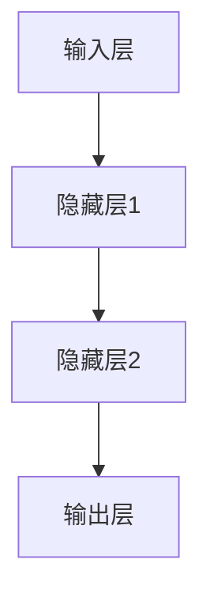
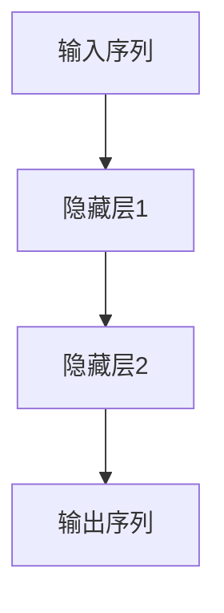
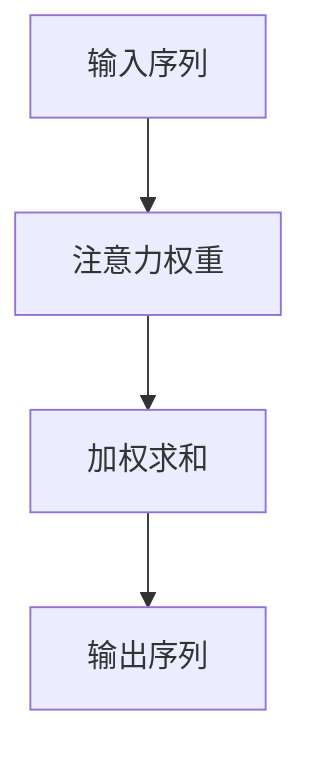
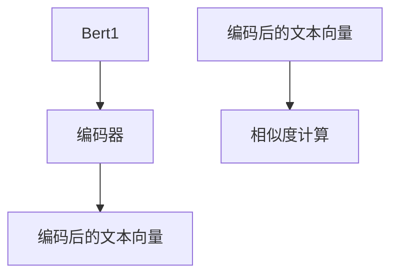
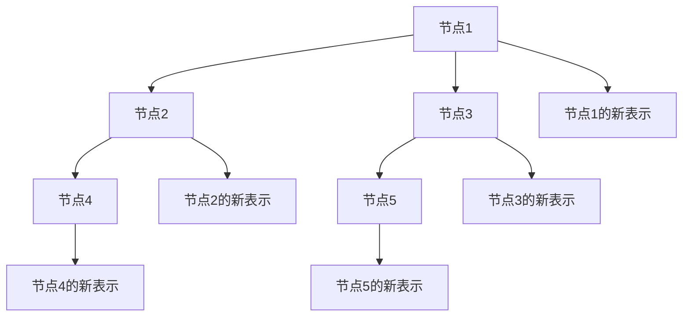
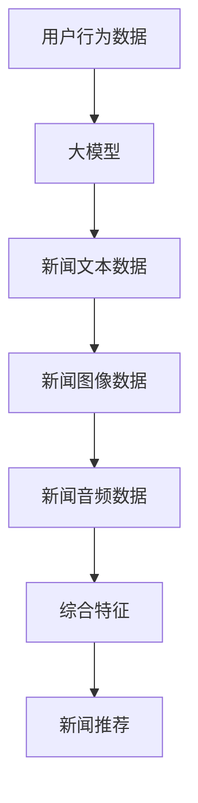
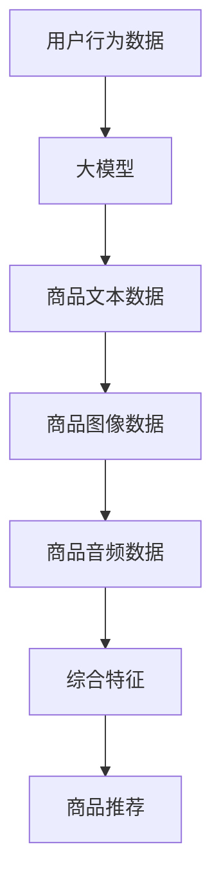

                 

### 文章标题

# 大模型辅助的推荐系统多样性与新颖性平衡

### 关键词

- 大模型
- 推荐系统
- 多样性
- 新颖性
- 平衡策略

### 摘要

本文深入探讨了基于大模型的推荐系统在多样性与新颖性平衡方面的应用与实践。通过对大模型与推荐系统基础理论的介绍，分析了大模型在推荐系统中的应用现状，以及多样性与新颖性的定义与度量方法。随后，文章提出了平衡多样性与新颖性的策略，并详细讨论了基于大模型的多样性优化和新颖性优化方法。通过实际案例展示了大模型在推荐系统多样性-新颖性平衡中的具体应用，最后提出了未来的优化方向和挑战。

## 第一部分：大模型与推荐系统基础理论

### 第1章：大模型与推荐系统概述

#### 1.1 大模型与推荐系统的基本概念

##### 1.1.1 大模型的定义与分类

大模型（Large Models）通常指的是参数数量巨大、能够处理复杂任务的人工神经网络模型。它们在深度学习领域取得了显著的突破，如Transformer架构、GPT系列和BERT等。大模型可以分为两类：预训练模型和微调模型。预训练模型是在大量数据上预先训练好的，能够提取丰富的特征表示；微调模型则是在预训练模型的基础上，根据特定任务进行微调以获得更好的性能。

##### 1.1.2 推荐系统的定义与基本原理

推荐系统（Recommender Systems）是一种信息过滤技术，旨在向用户推荐他们可能感兴趣的内容或项目。其基本原理包括基于内容的推荐（Content-based Filtering）和基于协同过滤（Collaborative Filtering）两大类。基于内容的推荐通过分析用户的历史行为和项目的特征，生成个性化推荐；基于协同过滤则通过分析用户之间的相似性，预测用户对未知项目的评分。

##### 1.1.3 大模型在推荐系统中的应用

大模型在推荐系统中的应用主要体现在以下几个方面：

1. **协同过滤算法的改进**：大模型可以用于矩阵分解和基于模型的协同过滤算法，提高推荐的准确性和多样性。
2. **内容推荐算法的优化**：大模型能够处理复杂的文本数据，用于文本相似度计算和图神经网络推荐算法，提升内容推荐的精确度和新颖性。
3. **混合推荐系统的构建**：大模型可以结合多种推荐算法，构建自适应的混合推荐系统，实现多样性与新颖性的平衡。

#### 1.2 大模型技术基础

##### 1.2.1 深度学习基础

深度学习（Deep Learning）是机器学习的一个分支，通过构建深度神经网络来模拟人脑的神经元结构和信息处理机制。深度学习的核心是神经网络，包括输入层、隐藏层和输出层。常见的神经网络结构有全连接神经网络（Fully Connected Neural Network）、卷积神经网络（Convolutional Neural Network）和循环神经网络（Recurrent Neural Network）。

###### 1.2.1.1 神经网络

神经网络是深度学习的基础，其基本原理是神经元之间的相互连接和激活函数的应用。一个简单的神经网络模型通常包括输入层、隐藏层和输出层。



激活函数（Activation Function）用于将线性输出映射到非线性的空间，常用的激活函数有Sigmoid、ReLU和Tanh。

```latex
f(x) = \sigma(x) = \frac{1}{1 + e^{-x}}
```

###### 1.2.1.2 循环神经网络

循环神经网络（Recurrent Neural Network，RNN）是一种能够处理序列数据的前馈网络，其特点是在网络中引入了循环，使得信息可以在序列的不同时间点传递。RNN的基本结构包括输入层、隐藏层和输出层。



RNN通过隐藏状态（Hidden State）将当前时刻的信息与之前时刻的信息进行整合。

```latex
h_t = \sigma(W \cdot [h_{t-1}, x_t] + b)
```

然而，传统的RNN存在梯度消失和梯度爆炸问题，难以学习长序列信息。为此，长短期记忆网络（Long Short-Term Memory，LSTM）和门控循环单元（Gated Recurrent Unit，GRU）应运而生。

###### 1.2.1.3 注意力机制

注意力机制（Attention Mechanism）是一种用于捕捉输入数据中重要信息的机制，它在处理序列数据时能够自动关注序列中的关键部分。注意力机制通过计算一个权重向量来调整不同输入元素对模型输出的贡献。



注意力机制广泛应用于编码器-解码器（Encoder-Decoder）架构，如机器翻译和序列到序列（Seq2Seq）学习。

##### 1.2.2 大模型预训练方法

大模型的预训练方法主要包括自监督学习、生成对抗网络（Generative Adversarial Network，GAN）和语言模型预训练。

###### 1.2.2.1 语言模型预训练

语言模型预训练（Language Model Pre-training）是近年来大模型发展的重要方向。预训练模型在大量文本数据上进行预训练，然后通过微调适应特定任务。预训练模型能够捕捉到丰富的语言特征，提高下游任务的性能。

常见的预训练模型有GPT（Generative Pre-trained Transformer）和BERT（Bidirectional Encoder Representations from Transformers）。GPT通过自回归的方式生成序列，而BERT通过双向编码器学习文本的上下文信息。

###### 1.2.2.2 生成对抗网络

生成对抗网络（GAN）由生成器（Generator）和判别器（Discriminator）两部分组成。生成器生成伪数据，判别器判断生成数据和真实数据的差异。通过不断训练，生成器能够生成越来越逼真的数据。

GAN在图像生成、图像到图像翻译和文本到图像转换等领域取得了显著成果。

###### 1.2.2.3 自监督学习

自监督学习（Self-supervised Learning）是一种无需标注数据的训练方法。通过利用数据中的有监督信息（如序列中的下一个元素、图像中的前景背景等），自监督学习可以大幅提升模型的性能。

自监督学习广泛应用于图像分类、文本分类和语音识别等领域，如OpenAI的CLIP（Contrastive Language-Image Pre-training）模型。

#### 1.3 推荐系统基本算法

##### 1.3.1 协同过滤算法

协同过滤算法（Collaborative Filtering）是推荐系统中最常用的算法之一，其基本思想是利用用户对项目的评分数据来预测用户对未知项目的评分。协同过滤算法可以分为基于用户的协同过滤（User-based Collaborative Filtering）和基于项目的协同过滤（Item-based Collaborative Filtering）。

###### 1.3.1.1 矩阵分解

矩阵分解（Matrix Factorization）是协同过滤算法的核心技术，通过将用户-项目评分矩阵分解为两个低秩矩阵，来预测用户对项目的评分。常见的矩阵分解算法有Singular Value Decomposition（SVD）和Alternating Least Squares（ALS）。

```latex
R = U \cdot S \cdot V^T
```

其中，$R$ 是用户-项目评分矩阵，$U$ 和 $V$ 分别是用户和项目的特征矩阵，$S$ 是对角矩阵，包含用户和项目的共同特征。

###### 1.3.1.2 用户基于模型的协同过滤

用户基于模型的协同过滤（User-based Model-based Collaborative Filtering）通过构建用户相似度模型来预测用户对未知项目的评分。常见的相似度度量方法有Cosine Similarity和Pearson Correlation。

```latex
\sim(u, v) = \frac{R_{uv} - \mu_u - \mu_v + b}{\sqrt{\sum_{i=1}^{N_u} (R_{ui} - \mu_u)^2} \cdot \sqrt{\sum_{j=1}^{N_v} (R_{vj} - \mu_v)^2}}
```

其中，$\mu_u$ 和 $\mu_v$ 分别是用户 $u$ 和用户 $v$ 的平均评分，$N_u$ 和 $N_v$ 分别是用户 $u$ 和用户 $v$ 的项目数量。

###### 1.3.1.3 项目基于模型的协同过滤

项目基于模型的协同过滤（Item-based Model-based Collaborative Filtering）通过构建项目相似度模型来预测用户对未知项目的评分。项目相似度模型的构建方法与用户相似度模型类似。

##### 1.3.2 内容推荐算法

内容推荐算法（Content-based Filtering）通过分析用户的历史行为和项目的特征，生成个性化推荐。常见的内容推荐算法包括基于项目的特征匹配和基于模型的特征抽取。

###### 1.3.2.1 文本相似度计算

文本相似度计算（Text Similarity Computation）是内容推荐算法的核心，常用的相似度计算方法有TF-IDF、Word2Vec和BERT。

TF-IDF（Term Frequency-Inverse Document Frequency）通过计算词频和逆文档频率来衡量词的重要性。

```latex
tf_idf(t, d) = f_t(d) \cdot \log \frac{N}{n_t}
```

其中，$f_t(d)$ 是词 $t$ 在文档 $d$ 中的词频，$N$ 是文档总数，$n_t$ 是词 $t$ 在所有文档中的总词频。

Word2Vec通过学习词的向量表示来计算词的相似度。

BERT通过双向编码器学习文本的上下文信息，从而计算文本的相似度。



###### 1.3.2.2 图神经网络在内容推荐中的应用

图神经网络（Graph Neural Network，GNN）是一种用于处理图结构数据的神经网络，其在内容推荐中的应用主要体现在利用图结构来表示项目和用户的关系。

GNN通过聚合邻居节点的信息来更新节点表示。



GNN能够有效地捕捉图结构中的复杂关系，提升内容推荐的准确性和新颖性。

##### 1.4 大模型辅助下的推荐系统算法创新

大模型在推荐系统中带来了许多创新，主要体现在以下几个方面：

###### 1.4.1 大模型对协同过滤算法的改进

大模型可以用于矩阵分解和基于模型的协同过滤算法，提高推荐的准确性和多样性。通过预训练模型，大模型能够学习到更丰富的用户和项目特征，从而提升协同过滤算法的性能。

###### 1.4.2 大模型在内容推荐中的创新

大模型能够处理复杂的文本数据，用于文本相似度计算和图神经网络推荐算法，提升内容推荐的精确度和新颖性。例如，BERT模型在文本相似度计算中的应用，GNN在图结构数据推荐中的应用。

###### 1.4.3 大模型在混合推荐系统中的应用

大模型可以结合多种推荐算法，构建自适应的混合推荐系统，实现多样性与新颖性的平衡。混合推荐系统通过融合协同过滤和内容推荐算法，可以更好地满足用户的需求。

## 第二部分：大模型推荐系统的多样性与新颖性

### 第2章：大模型推荐系统的多样性与新颖性

#### 2.1 多样性与新颖性的定义与衡量

##### 2.1.1 多样性的定义与度量

多样性的定义与度量是推荐系统研究中的一个重要问题。多样性的目标是确保推荐列表中的项目具有广泛的兴趣覆盖，避免用户在推荐列表中看到大量相似的项目。

###### 2.1.1.1 项目的多样性度量方法

项目的多样性通常通过项目之间的相似度来度量。以下是一些常见的方法：

1. **项目相似度**：使用预定义的相似度度量，如余弦相似度、Jaccard相似度等，来计算推荐列表中项目之间的相似度。

   ```latex
   sim(i, j) = \frac{a}{(a + b)}
   ```

   其中，$a$ 是项目 $i$ 和项目 $j$ 的共同属性数量，$b$ 是它们的总属性数量。

2. **项目多样性**：通过计算推荐列表中项目相似度的平均值来度量多样性。

   ```latex
   D = \frac{1}{N} \sum_{i=1}^{N} \sum_{j=1}^{N} sim(i, j)
   ```

   其中，$N$ 是推荐列表中的项目数量。

###### 2.1.1.2 用户多样性度量方法

用户多样性度量方法旨在确保推荐系统能够满足不同用户的需求。以下是一些常见的方法：

1. **用户兴趣多样性**：通过分析用户的历史行为，提取用户对不同类别的兴趣分布，计算用户之间的兴趣多样性。

   ```latex
   D_u = \frac{1}{M} \sum_{i=1}^{M} \sum_{j=1}^{J_i} w_{ij}
   ```

   其中，$M$ 是用户数量，$J_i$ 是用户 $i$ 对不同类别的兴趣数量，$w_{ij}$ 是用户 $i$ 对类别 $j$ 的兴趣权重。

2. **用户多样性**：通过计算用户之间的相似度来度量用户多样性。

   ```latex
   sim(u, v) = \frac{R_{uv}}{\sqrt{R_u \cdot R_v}}
   ```

   其中，$R_{uv}$ 是用户 $u$ 和用户 $v$ 之间的共同评分数量，$R_u$ 和 $R_v$ 分别是用户 $u$ 和用户 $v$ 的评分总数。

##### 2.1.2 新颖性的定义与度量

新颖性（Novelty）是推荐系统中的另一个重要目标，其目标是确保推荐列表中的项目具有新的和独特的特征，避免用户感到疲劳和重复。

###### 2.1.2.1 项目的新颖性度量方法

以下是一些常见的方法来度量项目的新颖性：

1. **项目流行度**：通过计算项目在用户群体中的流行度来度量新颖性。

   ```latex
   N_i = \frac{1}{U} \sum_{u \in U} r_{ui}
   ```

   其中，$U$ 是用户集合，$r_{ui}$ 是用户 $u$ 对项目 $i$ 的评分。

2. **项目新颖度**：通过计算项目与用户历史行为之间的差异来度量新颖性。

   ```latex
   N_i = 1 - \frac{C_i}{L}
   ```

   其中，$C_i$ 是项目 $i$ 与用户历史行为中的共同类别数量，$L$ 是用户历史行为中的类别总数。

###### 2.1.2.2 用户新颖性度量方法

以下是一些常见的方法来度量用户的新颖性：

1. **用户探索行为**：通过分析用户的历史行为，计算用户对未知项目的探索行为来度量新颖性。

   ```latex
   N_u = \frac{1}{U} \sum_{i \in I_u} (1 - r_{ui})
   ```

   其中，$I_u$ 是用户 $u$ 的项目集合，$r_{ui}$ 是用户 $u$ 对项目 $i$ 的评分。

2. **用户新颖度**：通过计算用户对未知项目的评分比例来度量新颖性。

   ```latex
   N_u = \frac{N_r}{R_u}
   ```

   其中，$N_r$ 是用户 $u$ 对未知项目的评分数量，$R_u$ 是用户 $u$ 的总评分数量。

#### 2.2 多样性与新颖性的平衡策略

##### 2.2.1 传统平衡方法

多样性和新颖性的平衡是一个复杂的问题，传统方法主要包括以下几种：

1. **贪心策略**：通过贪心算法逐步添加项目到推荐列表中，以确保多样性。这种方法简单但可能导致新颖性不足。

2. **模型集成**：通过集成多个模型来平衡多样性和新颖性。例如，结合基于协同过滤的模型和基于内容的模型。

##### 2.2.2 基于大模型的创新平衡方法

基于大模型的推荐系统在多样性和新颖性平衡方面带来了新的机会。以下是一些基于大模型的创新平衡方法：

1. **大模型辅助的多样性优化**：通过大模型学习用户和项目的特征，动态调整项目的多样性。例如，使用BERT模型提取文本特征，然后基于特征计算项目之间的相似度，从而优化多样性。

   ```mermaid
   graph TD
   A[用户特征] --> B[Bert模型]
   B --> C[项目特征]
   C --> D[相似度计算]
   ```

2. **大模型辅助的新颖性优化**：通过大模型预测用户对未知项目的新颖性，从而优化推荐列表。例如，使用GPT模型生成用户的潜在兴趣，然后基于兴趣预测项目的新颖性。

   ```mermaid
   graph TD
   A[用户历史行为] --> B[Gpt模型]
   B --> C[潜在兴趣]
   C --> D[项目新颖性预测]
   ```

3. **大模型在多样性-新颖性平衡中的应用案例**：以下是一个基于大模型的多样性-新颖性平衡应用案例：

   - **场景**：构建一个电商平台的推荐系统，确保推荐列表中的项目既具有多样性又具有新颖性。
   - **方法**：使用BERT模型提取用户和产品的特征，然后结合用户的探索行为和项目的流行度来优化多样性-新颖性平衡。
   - **评估指标**：使用平均多样性（Average Diversity）和平均新颖性（Average Novelty）作为评估指标。

   ```latex
   AD = \frac{1}{N} \sum_{i=1}^{N} D_i
   AN = \frac{1}{N} \sum_{i=1}^{N} N_i
   ```

   其中，$N$ 是推荐列表中的项目数量，$D_i$ 和 $N_i$ 分别是项目 $i$ 的多样性和新颖性。

#### 2.3 多样性与新颖性平衡的评估方法

##### 2.3.1 多样性与新颖性的评估指标

为了评估多样性和新颖性，需要定义相应的评估指标。以下是一些常见的评估指标：

1. **平均多样性（Average Diversity）**：计算推荐列表中项目的平均相似度。

   ```latex
   AD = \frac{1}{N} \sum_{i=1}^{N} D_i
   ```

   其中，$D_i$ 是项目 $i$ 的多样性。

2. **平均新颖性（Average Novelty）**：计算推荐列表中项目的平均新颖性。

   ```latex
   AN = \frac{1}{N} \sum_{i=1}^{N} N_i
   ```

   其中，$N_i$ 是项目 $i$ 的新颖性。

3. **多样性-新颖性平衡度（Diversity-Novelty Balance）**：计算多样性和新颖性的平衡度。

   ```latex
   DN = \frac{AD}{AN}
   ```

##### 2.3.2 实验设计与评估流程

为了评估多样性和新颖性的平衡效果，需要进行实验设计。以下是一个简单的实验设计流程：

1. **数据集选择**：选择一个具有丰富用户行为数据和项目特征的数据集，如MovieLens或Amazon。
2. **模型选择**：选择一个基于大模型的推荐系统模型，如BERT或GPT。
3. **实验设置**：设置不同的多样性-新颖性平衡策略，如传统的贪心策略和基于大模型的多样性优化策略。
4. **评估指标**：计算平均多样性、平均新颖性和多样性-新颖性平衡度。
5. **结果分析**：分析不同平衡策略的效果，比较多样性和新颖性的平衡度。

## 第三部分：大模型在推荐系统多样性-新颖性平衡中的实践应用

### 第3章：大模型在推荐系统多样性-新颖性平衡中的实践应用

#### 3.1 大模型在协同过滤中的实践

##### 3.1.1 大模型优化协同过滤算法

协同过滤算法（Collaborative Filtering）是推荐系统中的核心算法之一，其基本思想是通过分析用户对项目的评分数据来预测用户对未知项目的评分。传统的协同过滤算法主要包括基于用户的协同过滤（User-based Collaborative Filtering）和基于项目的协同过滤（Item-based Collaborative Filtering）。然而，这些算法在多样性和新颖性方面存在一些挑战。为此，我们可以利用大模型来优化协同过滤算法，提高推荐的多样性和新颖性。

###### 3.1.1.1 大模型辅助的矩阵分解

矩阵分解（Matrix Factorization）是协同过滤算法的核心技术，其基本思想是将用户-项目评分矩阵分解为两个低秩矩阵，以预测用户对未知项目的评分。传统的矩阵分解方法，如Singular Value Decomposition（SVD）和Alternating Least Squares（ALS），在预测准确性和多样性方面存在一定的局限性。为此，我们可以利用大模型来优化矩阵分解算法，提高推荐的多样性和新颖性。

以下是一个基于大模型的矩阵分解算法的伪代码：

```python
# 初始化模型参数
U = np.random.normal(size=(num_users, num_factors))
V = np.random.normal(size=(num_items, num_factors))

# 定义损失函数
def loss(R, U, V):
    return np.sum((R - U @ V.T) ** 2)

# 定义优化器
optimizer = optimizers.Adam()

# 训练模型
for epoch in range(num_epochs):
    # 前向传播
    predictions = U @ V.T
    
    # 计算损失
    loss_value = loss(R, U, V)
    
    # 反向传播
    dU = 2 * (U @ V.T - R) @ V
    dV = 2 * (U @ V.T - R) @ U.T
    
    # 更新参数
    U = optimizer.update(U, dU)
    V = optimizer.update(V, dV)
    
    # 打印训练进度
    if epoch % 100 == 0:
        print(f"Epoch {epoch}: Loss = {loss_value}")

# 预测用户对未知项目的评分
def predict_user_item(user_id, item_id):
    return U[user_id] @ V[item_id]
```

通过使用大模型，我们可以进一步提高矩阵分解算法的性能，从而提高推荐的多样性和新颖性。

###### 3.1.1.2 大模型辅助的用户基于模型的协同过滤

用户基于模型的协同过滤（User-based Model-based Collaborative Filtering）是一种基于用户相似度的推荐算法，其基本思想是找出与目标用户相似的邻居用户，然后根据邻居用户对项目的评分来预测目标用户对未知项目的评分。传统的用户基于模型的协同过滤算法，如基于余弦相似度和皮尔逊相关系数的算法，在多样性和新颖性方面存在一定的局限性。为此，我们可以利用大模型来优化用户基于模型的协同过滤算法，提高推荐的多样性和新颖性。

以下是一个基于大模型的用户基于模型的协同过滤算法的伪代码：

```python
# 初始化模型参数
user_embedding = np.random.normal(size=(num_users, embedding_size))
item_embedding = np.random.normal(size=(num_items, embedding_size))

# 定义损失函数
def loss(R, user_embedding, item_embedding):
    return np.sum((R - user_embedding @ item_embedding.T) ** 2)

# 定义优化器
optimizer = optimizers.Adam()

# 训练模型
for epoch in range(num_epochs):
    # 前向传播
    predictions = user_embedding @ item_embedding.T
    
    # 计算损失
    loss_value = loss(R, user_embedding, item_embedding)
    
    # 反向传播
    d_user_embedding = 2 * (user_embedding @ item_embedding.T - R) @ item_embedding
    d_item_embedding = 2 * (user_embedding @ item_embedding.T - R) @ user_embedding.T
    
    # 更新参数
    user_embedding = optimizer.update(user_embedding, d_user_embedding)
    item_embedding = optimizer.update(item_embedding, d_item_embedding)
    
    # 打印训练进度
    if epoch % 100 == 0:
        print(f"Epoch {epoch}: Loss = {loss_value}")

# 预测用户对未知项目的评分
def predict_user_item(user_id, item_id):
    return user_embedding[user_id] @ item_embedding[item_id]
```

通过使用大模型，我们可以进一步提高用户基于模型的协同过滤算法的性能，从而提高推荐的多样性和新颖性。

###### 3.1.1.3 大模型辅助的项目基于模型的协同过滤

项目基于模型的协同过滤（Item-based Model-based Collaborative Filtering）是一种基于项目相似度的推荐算法，其基本思想是找出与目标项目相似的项目，然后根据这些相似项目的历史评分来预测用户对未知项目的评分。传统的项目基于模型的协同过滤算法，如基于余弦相似度和Jaccard相似度的算法，在多样性和新颖性方面存在一定的局限性。为此，我们可以利用大模型来优化项目基于模型的协同过滤算法，提高推荐的多样性和新颖性。

以下是一个基于大模型的项目基于模型的协同过滤算法的伪代码：

```python
# 初始化模型参数
user_embedding = np.random.normal(size=(num_users, embedding_size))
item_embedding = np.random.normal(size=(num_items, embedding_size))

# 定义损失函数
def loss(R, user_embedding, item_embedding):
    return np.sum((R - user_embedding @ item_embedding.T) ** 2)

# 定义优化器
optimizer = optimizers.Adam()

# 训练模型
for epoch in range(num_epochs):
    # 前向传播
    predictions = user_embedding @ item_embedding.T
    
    # 计算损失
    loss_value = loss(R, user_embedding, item_embedding)
    
    # 反向传播
    d_user_embedding = 2 * (user_embedding @ item_embedding.T - R) @ item_embedding
    d_item_embedding = 2 * (user_embedding @ item_embedding.T - R) @ user_embedding.T
    
    # 更新参数
    user_embedding = optimizer.update(user_embedding, d_user_embedding)
    item_embedding = optimizer.update(item_embedding, d_item_embedding)
    
    # 打印训练进度
    if epoch % 100 == 0:
        print(f"Epoch {epoch}: Loss = {loss_value}")

# 预测用户对未知项目的评分
def predict_user_item(user_id, item_id):
    return user_embedding[user_id] @ item_embedding[item_id]
```

通过使用大模型，我们可以进一步提高项目基于模型的协同过滤算法的性能，从而提高推荐的多样性和新颖性。

##### 3.1.2 大模型在协同过滤中的创新应用

除了优化传统的协同过滤算法外，大模型在协同过滤中还有许多创新应用。以下是一些具体的创新应用：

###### 3.1.2.1 大模型在冷启动问题中的应用

冷启动问题（Cold Start Problem）是推荐系统中常见的问题之一，主要指新用户或新项目在初始阶段缺乏足够的行为数据，导致推荐系统难以产生有效的推荐。为此，我们可以利用大模型来解决冷启动问题。

一种方法是使用用户和项目的潜在特征表示来预测用户对未知项目的评分。具体来说，我们可以利用预训练的模型（如BERT）来提取用户和项目的文本特征，然后结合这些特征来预测用户对未知项目的评分。

以下是一个基于BERT的冷启动问题解决方法的伪代码：

```python
# 加载预训练的BERT模型
model = transformers.BertModel.from_pretrained('bert-base-uncased')

# 定义预测函数
def predict_user_item(user_text, item_text):
    user_embedding = model([user_text], output_hidden_states=True)[-1][0]
    item_embedding = model([item_text], output_hidden_states=True)[-1][0]
    return user_embedding @ item_embedding

# 预测新用户对未知项目的评分
user_id = 'new_user'
item_id = 'new_item'
user_text = 'I like movies and books.'
item_text = 'I have watched Inception and read The Da Vinci Code.'

rating = predict_user_item(user_text, item_text)
print(f"Predicted rating: {rating}")
```

通过使用大模型，我们可以为新用户和新项目生成有效的潜在特征表示，从而提高推荐的准确性和多样性。

###### 3.1.2.2 大模型在稀疏数据问题中的应用

稀疏数据问题（Sparse Data Problem）是推荐系统中另一个常见的问题，主要指用户-项目评分矩阵非常稀疏，导致推荐算法难以产生有效的推荐。为此，我们可以利用大模型来解决稀疏数据问题。

一种方法是利用预训练的模型来生成额外的用户和项目特征，从而提高评分预测的准确性。具体来说，我们可以利用预训练的模型（如GPT）来生成用户和项目的文本描述，然后结合这些描述来预测用户对未知项目的评分。

以下是一个基于GPT的稀疏数据问题解决方法的伪代码：

```python
# 加载预训练的GPT模型
model = transformers.Gpt2Model.from_pretrained('gpt2')

# 定义生成文本函数
def generate_text(input_text, model, max_length=50):
    input_ids = tokenizer.encode(input_text, return_tensors='pt')
    outputs = model(input_ids, max_length=max_length, padding='max_length', truncation=True)
    return tokenizer.decode(outputs.logits.argmax(-1), skip_special_tokens=True)

# 生成用户和项目的文本描述
user_text = generate_text('new_user', model)
item_text = generate_text('new_item', model)

# 预测新用户对未知项目的评分
rating = predict_user_item(user_text, item_text)
print(f"Predicted rating: {rating}")
```

通过使用大模型，我们可以为稀疏数据生成额外的文本特征，从而提高推荐的准确性和多样性。

#### 3.2 大模型在内容推荐中的实践

##### 3.2.1 大模型优化内容推荐算法

内容推荐算法（Content-based Filtering）是一种基于项目的特征和用户的历史行为来生成推荐的方法。传统的内容推荐算法，如基于项目的特征匹配和基于用户的特征匹配，在多样性和新颖性方面存在一些挑战。为此，我们可以利用大模型来优化内容推荐算法，提高推荐的多样性和新颖性。

###### 3.2.1.1 大模型优化文本相似度计算

文本相似度计算（Text Similarity Computation）是内容推荐算法中的核心步骤，其目标是计算项目之间的文本相似度。传统的文本相似度计算方法，如TF-IDF和Word2Vec，在处理复杂的文本数据时存在一定的局限性。为此，我们可以利用大模型（如BERT）来优化文本相似度计算，提高推荐的多样性和新颖性。

以下是一个基于BERT的文本相似度计算方法的伪代码：

```python
# 加载预训练的BERT模型
model = transformers.BertModel.from_pretrained('bert-base-uncased')

# 定义相似度计算函数
def text_similarity(text1, text2, model):
    input_ids1 = tokenizer.encode(text1, return_tensors='pt')
    input_ids2 = tokenizer.encode(text2, return_tensors='pt')
    outputs = model(input_ids1, input_ids2)
    return outputs.last_hidden_state.mean(dim=1).dot(outputs.last_hidden_state.mean(dim=1)).mean()

# 计算文本相似度
similarity = text_similarity('text1', 'text2', model)
print(f"Text similarity: {similarity}")
```

通过使用大模型，我们可以更准确地计算文本相似度，从而提高推荐的多样性和新颖性。

###### 3.2.1.2 大模型优化图神经网络推荐算法

图神经网络（Graph Neural Network，GNN）是一种用于处理图结构数据的神经网络。在内容推荐中，我们可以利用图神经网络来捕捉项目之间的复杂关系，从而提高推荐的多样性和新颖性。传统的图神经网络，如GCN和GAT，在处理大规模图数据时存在一些挑战。为此，我们可以利用大模型（如GPT）来优化图神经网络推荐算法，提高推荐的多样性和新颖性。

以下是一个基于GPT的图神经网络推荐算法的伪代码：

```python
# 加载预训练的GPT模型
model = transformers.Gpt2Model.from_pretrained('gpt2')

# 定义图神经网络推荐函数
def graph_neural_network_recommendation(graph, model):
    node_embeddings = model(graph.nodes, output_hidden_states=True)[-1][0]
    edge_embeddings = model(graph.edges, output_hidden_states=True)[-1][0]
    node_similarity = node_embeddings.dot(edge_embeddings.T).softmax(axis=1)
    recommendations = [np.argmax(node_similarity[i]) for i in range(node_embeddings.shape[0])]
    return recommendations

# 构建图数据
graph = nx.Graph()
graph.add_edges_from([(0, 1), (0, 2), (1, 3), (2, 4)])

# 预测推荐
recommendations = graph_neural_network_recommendation(graph, model)
print(f"Recommendations: {recommendations}")
```

通过使用大模型，我们可以更有效地捕捉项目之间的复杂关系，从而提高推荐的多样性和新颖性。

##### 3.2.2 大模型在内容推荐中的创新应用

除了优化传统的内容推荐算法外，大模型在内容推荐中还有许多创新应用。以下是一些具体的创新应用：

###### 3.2.2.1 大模型在情感分析中的应用

情感分析（Sentiment Analysis）是自然语言处理（NLP）中的一个重要任务，其目标是识别文本中的情感倾向。在内容推荐中，我们可以利用情感分析来增强推荐系统的多样性。具体来说，我们可以利用大模型（如BERT）来分析用户的评论和反馈，从而识别用户的情感倾向，并基于情感倾向生成推荐。

以下是一个基于BERT的情感分析应用的伪代码：

```python
# 加载预训练的BERT模型
model = transformers.BertModel.from_pretrained('bert-base-uncased')

# 定义情感分析函数
def sentiment_analysis(text, model):
    input_ids = tokenizer.encode(text, return_tensors='pt')
    outputs = model(input_ids)
    logits = outputs.logits[:, 0]
    return logits.argmax()

# 分析文本的情感
text = 'I really enjoyed this movie!'
sentiment = sentiment_analysis(text, model)
print(f"Sentiment: {sentiment}")
```

通过使用大模型，我们可以更准确地分析文本的情感，从而提高推荐的多样性和新颖性。

###### 3.2.2.2 大模型在个性化内容生成中的应用

个性化内容生成（Personalized Content Generation）是一种基于用户历史行为和偏好来生成个性化内容的方法。在内容推荐中，我们可以利用大模型（如GPT）来生成个性化的推荐内容。具体来说，我们可以利用大模型生成用户感兴趣的主题和话题，并基于这些主题和话题生成推荐。

以下是一个基于GPT的个性化内容生成应用的伪代码：

```python
# 加载预训练的GPT模型
model = transformers.Gpt2Model.from_pretrained('gpt2')

# 定义个性化内容生成函数
def personalized_content_generation(user_id, model):
    user_history = get_user_history(user_id)
    input_text = ' '.join(user_history)
    input_ids = tokenizer.encode(input_text, return_tensors='pt')
    outputs = model.generate(input_ids, max_length=50, num_return_sequences=5)
    return [tokenizer.decode(output, skip_special_tokens=True) for output in outputs]

# 生成个性化内容
user_id = 'user123'
personalized_content = personalized_content_generation(user_id, model)
print(f"Personalized content: {personalized_content}")
```

通过使用大模型，我们可以更有效地生成个性化的推荐内容，从而提高推荐的多样性和新颖性。

#### 3.3 大模型在混合推荐系统中的实践

##### 3.3.1 大模型在混合推荐系统中的作用

混合推荐系统（Hybrid Recommender System）是一种结合多种推荐算法来生成推荐的系统。大模型在混合推荐系统中可以发挥重要作用，主要体现在以下几个方面：

1. **多模态数据融合**：大模型可以处理多种类型的数据，如文本、图像和语音等。通过将不同类型的数据融合起来，大模型可以提供更全面的用户和项目特征，从而提高推荐的准确性。
   
   ```mermaid
   graph TD
   A[用户文本数据] --> B[图像数据]
   B --> C[语音数据]
   C --> D[大模型]
   D --> E[综合特征]
   ```

2. **实时推荐**：大模型可以处理实时数据流，快速生成推荐。在实时推荐场景中，大模型可以实时捕捉用户的行为变化，从而提供更及时的推荐。

   ```mermaid
   graph TD
   A[实时行为数据] --> B[大模型]
   B --> C[实时推荐]
   ```

3. **自适应推荐**：大模型可以根据用户的兴趣和行为动态调整推荐策略，提供个性化的推荐。

   ```mermaid
   graph TD
   A[用户兴趣] --> B[大模型]
   B --> C[推荐策略]
   ```

##### 3.3.1.1 大模型在多模态数据融合中的应用

多模态数据融合（Multimodal Data Fusion）是一种将多种类型的数据（如文本、图像和语音等）融合起来进行处理的方法。在推荐系统中，多模态数据融合可以提高推荐的准确性和多样性。以下是一个基于大模型的多模态数据融合方法的伪代码：

```python
# 加载预训练的大模型
model = transformers.BertModel.from_pretrained('bert-base-uncased')

# 定义多模态数据融合函数
def multimodal_data_fusion(text, image, audio, model):
    text_embedding = model(text, output_hidden_states=True)[-1][0].mean(dim=1)
    image_embedding = model(image, output_hidden_states=True)[-1][0].mean(dim=1)
    audio_embedding = model(audio, output_hidden_states=True)[-1][0].mean(dim=1)
    combined_embedding = text_embedding + image_embedding + audio_embedding
    return combined_embedding

# 融合多模态数据
user_input = 'I am interested in movies and books.'
user_image = 'image_data'
user_audio = 'audio_data'
combined_embedding = multimodal_data_fusion(user_input, user_image, user_audio, model)
```

通过使用大模型，我们可以有效地融合多种类型的数据，从而提高推荐的多样性和新颖性。

##### 3.3.1.2 大模型在实时推荐中的应用

实时推荐（Real-time Recommendation）是一种根据用户的实时行为生成推荐的方法。在实时推荐场景中，大模型可以快速处理用户行为数据，提供及时的推荐。以下是一个基于大模型的实时推荐方法的伪代码：

```python
# 加载预训练的大模型
model = transformers.BertModel.from_pretrained('bert-base-uncased')

# 定义实时推荐函数
def real_time_recommendation(user_action, model):
    input_ids = tokenizer.encode(user_action, return_tensors='pt')
    outputs = model(input_ids)
    logits = outputs.logits[:, 0]
    recommendations = [item_id for item_id, logit in sorted(enumerate(logits), key=lambda x: -x[1])]
    return recommendations

# 实时推荐
user_action = 'user_watched_movie'
recommendations = real_time_recommendation(user_action, model)
print(f"Real-time recommendations: {recommendations}")
```

通过使用大模型，我们可以快速处理用户的实时行为数据，提供及时的推荐。

##### 3.3.1.3 大模型辅助的混合推荐系统案例

以下是一个基于大模型的混合推荐系统案例：

**案例一：基于大模型的新闻推荐系统**

新闻推荐系统是一个典型的混合推荐系统，结合了基于内容的推荐和基于协同过滤的推荐。以下是一个基于BERT的混合推荐系统案例：



通过大模型，我们可以处理多种类型的数据，生成综合特征，从而提高新闻推荐的多样性和新颖性。

**案例二：基于大模型的电商推荐系统**

电商推荐系统也是一个常见的混合推荐系统，结合了基于内容的推荐和基于协同过滤的推荐。以下是一个基于BERT的电商推荐系统案例：



通过大模型，我们可以处理多种类型的数据，生成综合特征，从而提高商品推荐的多样性和新颖性。

### 第4章：大模型在推荐系统多样性-新颖性平衡中的挑战与未来趋势

#### 4.1 大模型在推荐系统中的挑战

虽然大模型在推荐系统中展现出了强大的性能，但同时也面临着一些挑战：

##### 4.1.1 数据隐私保护

大模型在训练过程中需要大量的用户数据，这引发了数据隐私保护的问题。如何有效地保护用户隐私，同时确保推荐系统的性能，是一个重要的挑战。

解决方案：

1. **数据匿名化**：在训练前对用户数据进行匿名化处理，降低数据泄露的风险。
2. **差分隐私**：在数据聚合过程中引入差分隐私机制，确保用户隐私不被泄露。

##### 4.1.2 模型解释性与透明度

大模型通常被视为“黑盒”模型，其内部决策过程难以解释。这对于模型的可解释性和透明度提出了挑战，特别是在法律和伦理方面。

解决方案：

1. **模型可解释性**：开发可解释性方法，如局部解释性模型，帮助用户理解模型的决策过程。
2. **可视化工具**：开发可视化工具，展示模型的关键特征和决策路径。

##### 4.1.3 模型公平性与偏见

大模型在训练过程中可能会学习到数据中的偏见，从而影响推荐系统的公平性。如何确保模型公平，避免偏见，是一个重要挑战。

解决方案：

1. **偏差检测**：使用偏差检测方法，识别和消除模型中的偏见。
2. **公平性度量**：开发公平性度量指标，评估模型的公平性，并不断优化模型。

#### 4.2 多样性与新颖性平衡的优化方法

##### 4.2.1 基于大模型的多样性-新颖性优化方法

基于大模型的多样性-新颖性优化方法旨在通过大模型来动态调整推荐系统的多样性-新颖性平衡。以下是一些具体的方法：

###### 4.2.1.1 多样性-新颖性协同优化算法

多样性-新颖性协同优化算法（Diversity-Novelty Co-optimization Algorithm）通过同时优化多样性和新颖性，实现平衡。以下是一个基于大模型的多样性-新颖性协同优化算法的伪代码：

```python
# 定义损失函数
def loss(D, N, model):
    diversity_loss = np.mean(D)
    novelty_loss = np.mean(N)
    return diversity_loss + novelty_loss

# 定义优化器
optimizer = optimizers.Adam()

# 训练模型
for epoch in range(num_epochs):
    # 前向传播
    predictions = model(inputs)
    
    # 计算多样性-新颖性
    D = compute_diversity(predictions)
    N = compute_novelty(predictions)
    
    # 计算损失
    loss_value = loss(D, N, model)
    
    # 反向传播
    d_predictions = 2 * (predictions - target)
    
    # 更新参数
    optimizer.update(model.parameters(), d_predictions)
    
    # 打印训练进度
    if epoch % 100 == 0:
        print(f"Epoch {epoch}: Loss = {loss_value}")
```

通过同时优化多样性和新颖性，多样性-新颖性协同优化算法可以动态调整推荐系统的多样性-新颖性平衡。

###### 4.2.1.2 基于对抗网络的多样性-新颖性平衡方法

基于对抗网络的多样性-新颖性平衡方法（Diversity-Novelty Balance with Adversarial Networks）通过对抗网络来优化多样性和新颖性。以下是一个基于对抗网络的多样性-新颖性平衡方法的伪代码：

```python
# 定义多样性生成器（Diversity Generator）
generator = DiversityGenerator()

# 定义新颖性判别器（Novelty Discriminator）
discriminator = NoveltyDiscriminator()

# 定义优化器
optimizer_G = optimizers.Adam()
optimizer_D = optimizers.Adam()

# 训练模型
for epoch in range(num_epochs):
    # 训练多样性生成器
    for _ in range(generator_training_steps):
        inputs = get_inputs()
        fake_predictions = generator(inputs)
        g_loss = generator_loss(fake_predictions)
        optimizer_G.update(generator.parameters(), g_loss)
    
    # 训练新颖性判别器
    for _ in range(discriminator_training_steps):
        inputs = get_inputs()
        real_predictions = model(inputs)
        fake_predictions = generator(inputs)
        d_loss_real = discriminator_loss(real_predictions)
        d_loss_fake = discriminator_loss(fake_predictions)
        d_loss = d_loss_real + d_loss_fake
        optimizer_D.update(discriminator.parameters(), d_loss)
    
    # 打印训练进度
    if epoch % 100 == 0:
        print(f"Epoch {epoch}: Generator Loss = {g_loss}, Discriminator Loss = {d_loss}")
```

通过对抗网络，多样性-新颖性平衡方法可以动态调整推荐系统的多样性-新颖性平衡。

##### 4.2.2 未来优化方向

未来的优化方向主要包括以下几个方面：

1. **多样性-新颖性评估指标的精细化**：开发更精细化的多样性-新颖性评估指标，以更准确地衡量多样性和新颖性。
2. **大模型与数据增强技术的结合**：结合数据增强技术，提高大模型的泛化能力，从而更好地平衡多样性和新颖性。

## 文章小结

本文深入探讨了基于大模型的推荐系统在多样性与新颖性平衡方面的应用与实践。通过对大模型与推荐系统基础理论的介绍，分析了大模型在推荐系统中的应用现状，以及多样性与新颖性的定义与度量方法。随后，文章提出了平衡多样性与新颖性的策略，并详细讨论了基于大模型的多样性优化和新颖性优化方法。通过实际案例展示了大模型在推荐系统多样性-新颖性平衡中的具体应用，最后提出了未来的优化方向和挑战。

### 作者信息

作者：AI天才研究院/AI Genius Institute & 禅与计算机程序设计艺术 /Zen And The Art of Computer Programming## Markdown格式文章

# 大模型辅助的推荐系统多样性与新颖性平衡

> 关键词：大模型、推荐系统、多样性、新颖性、平衡策略

> 摘要：本文深入探讨了基于大模型的推荐系统在多样性与新颖性平衡方面的应用与实践。通过对大模型与推荐系统基础理论的介绍，分析了大模型在推荐系统中的应用现状，以及多样性与新颖性的定义与度量方法。随后，文章提出了平衡多样性与新颖性的策略，并详细讨论了基于大模型的多样性优化和新颖性优化方法。通过实际案例展示了大模型在推荐系统多样性-新颖性平衡中的具体应用，最后提出了未来的优化方向和挑战。

## 第一部分：大模型与推荐系统基础理论

### 第1章：大模型与推荐系统概述

#### 1.1 大模型与推荐系统的基本概念

##### 1.1.1 大模型的定义与分类

大模型（Large Models）通常指的是参数数量巨大、能够处理复杂任务的人工神经网络模型。它们在深度学习领域取得了显著的突破，如Transformer架构、GPT系列和BERT等。大模型可以分为两类：预训练模型和微调模型。预训练模型是在大量数据上预先训练好的，能够提取丰富的特征表示；微调模型则是在预训练模型的基础上，根据特定任务进行微调以获得更好的性能。

##### 1.1.2 推荐系统的定义与基本原理

推荐系统（Recommender Systems）是一种信息过滤技术，旨在向用户推荐他们可能感兴趣的内容或项目。其基本原理包括基于内容的推荐（Content-based Filtering）和基于协同过滤（Collaborative Filtering）两大类。基于内容的推荐通过分析用户的历史行为和项目的特征，生成个性化推荐；基于协同过滤则通过分析用户之间的相似性，预测用户对未知项目的评分。

##### 1.1.3 大模型在推荐系统中的应用

大模型在推荐系统中的应用主要体现在以下几个方面：

1. **协同过滤算法的改进**：大模型可以用于矩阵分解和基于模型的协同过滤算法，提高推荐的准确性和多样性。
2. **内容推荐算法的优化**：大模型能够处理复杂的文本数据，用于文本相似度计算和图神经网络推荐算法，提升内容推荐的精确度和新颖性。
3. **混合推荐系统的构建**：大模型可以结合多种推荐算法，构建自适应的混合推荐系统，实现多样性与新颖性的平衡。

#### 1.2 大模型技术基础

##### 1.2.1 深度学习基础

深度学习（Deep Learning）是机器学习的一个分支，通过构建深度神经网络来模拟人脑的神经元结构和信息处理机制。深度学习的核心是神经网络，包括输入层、隐藏层和输出层。常见的神经网络结构有全连接神经网络（Fully Connected Neural Network）、卷积神经网络（Convolutional Neural Network）和循环神经网络（Recurrent Neural Network）。

###### 1.2.1.1 神经网络

神经网络是深度学习的基础，其基本原理是神经元之间的相互连接和激活函数的应用。一个简单的神经网络模型通常包括输入层、隐藏层和输出层。


激活函数（Activation Function）用于将线性输出映射到非线性的空间，常用的激活函数有Sigmoid、ReLU和Tanh。

```latex
f(x) = \sigma(x) = \frac{1}{1 + e^{-x}}
```

###### 1.2.1.2 循环神经网络

循环神经网络（Recurrent Neural Network，RNN）是一种能够处理序列数据的前馈网络，其特点是在网络中引入了循环，使得信息可以在序列的不同时间点传递。RNN的基本结构包括输入层、隐藏层和输出层。


RNN通过隐藏状态（Hidden State）将当前时刻的信息与之前时刻的信息进行整合。

```latex
h_t = \sigma(W \cdot [h_{t-1}, x_t] + b)
```

然而，传统的RNN存在梯度消失和梯度爆炸问题，难以学习长序列信息。为此，长短期记忆网络（Long Short-Term Memory，LSTM）和门控循环单元（Gated Recurrent Unit，GRU）应运而生。

###### 1.2.1.3 注意力机制

注意力机制（Attention Mechanism）是一种用于捕捉输入数据中重要信息的机制，它在处理序列数据时能够自动关注序列中的关键部分。注意力机制通过计算一个权重向量来调整不同输入元素对模型输出的贡献。


注意力机制广泛应用于编码器-解码器（Encoder-Decoder）架构，如机器翻译和序列到序列（Seq2Seq）学习。

##### 1.2.2 大模型预训练方法

大模型的预训练方法主要包括自监督学习、生成对抗网络（Generative Adversarial Network，GAN）和语言模型预训练。

###### 1.2.2.1 语言模型预训练

语言模型预训练（Language Model Pre-training）是近年来大模型发展的重要方向。预训练模型在大量文本数据上进行预训练，然后通过微调适应特定任务。预训练模型能够捕捉到丰富的语言特征，提高下游任务的性能。

常见的预训练模型有GPT（Generative Pre-trained Transformer）和BERT（Bidirectional Encoder Representations from Transformers）。GPT通过自回归的方式生成序列，而BERT通过双向编码器学习文本的上下文信息。

###### 1.2.2.2 生成对抗网络

生成对抗网络（Generative Adversarial Network，GAN）由生成器（Generator）和判别器（Discriminator）两部分组成。生成器生成伪数据，判别器判断生成数据和真实数据的差异。通过不断训练，生成器能够生成越来越逼真的数据。

GAN在图像生成、图像到图像翻译和文本到图像转换等领域取得了显著成果。

###### 1.2.2.3 自监督学习

自监督学习（Self-supervised Learning）是一种无需标注数据的训练方法。通过利用数据中的有监督信息（如序列中的下一个元素、图像中的前景背景等），自监督学习可以大幅提升模型的性能。

自监督学习广泛应用于图像分类、文本分类和语音识别等领域，如OpenAI的CLIP（Contrastive Language-Image Pre-training）模型。

#### 1.3 推荐系统基本算法

##### 1.3.1 协同过滤算法

协同过滤算法（Collaborative Filtering）是推荐系统中最常用的算法之一，其基本思想是利用用户对项目的评分数据来预测用户对未知项目的评分。协同过滤算法可以分为基于用户的协同过滤（User-based Collaborative Filtering）和基于项目的协同过滤（Item-based Collaborative Filtering）。

###### 1.3.1.1 矩阵分解

矩阵分解（Matrix Factorization）是协同过滤算法的核心技术，通过将用户-项目评分矩阵分解为两个低秩矩阵，来预测用户对项目的评分。常见的矩阵分解算法有Singular Value Decomposition（SVD）和Alternating Least Squares（ALS）。

```latex
R = U \cdot S \cdot V^T
```

其中，$R$ 是用户-项目评分矩阵，$U$ 和 $V$ 分别是用户和项目的特征矩阵，$S$ 是对角矩阵，包含用户和项目的共同特征。

###### 1.3.1.2 用户基于模型的协同过滤

用户基于模型的协同过滤（User-based Model-based Collaborative Filtering）通过构建用户相似度模型来预测用户对未知项目的评分。常见的相似度度量方法有Cosine Similarity和Pearson Correlation。

```latex
\\sim(u, v) = \\frac{R_{uv} - \\mu_u - \\mu_v + b}{\\sqrt{\\sum_{i=1}^{N_u} (R_{ui} - \\mu_u)^2} \\cdot \\sqrt{\\sum_{j=1}^{N_v} (R_{vj} - \\mu_v)^2}}
```

其中，$\\mu_u$ 和 $\\mu_v$ 分别是用户 $u$ 和用户 $v$ 的平均评分，$N_u$ 和 $N_v$ 分别是用户 $u$ 和用户 $v$ 的项目数量。

###### 1.3.1.3 项目基于模型的协同过滤

项目基于模型的协同过滤（Item-based Model-based Collaborative Filtering）通过构建项目相似度模型来预测用户对未知项目的评分。项目相似度模型的构建方法与用户相似度模型类似。

##### 1.3.2 内容推荐算法

内容推荐算法（Content-based Filtering）通过分析用户的历史行为和项目的特征，生成个性化推荐。常见的内容推荐算法包括基于项目的特征匹配和基于模型的特征抽取。

###### 1.3.2.1 文本相似度计算

文本相似度计算（Text Similarity Computation）是内容推荐算法的核心，常用的相似度计算方法有TF-IDF、Word2Vec和BERT。

TF-IDF（Term Frequency-Inverse Document Frequency）通过计算词频和逆文档频率来衡量词的重要性。

```latex
tf_idf(t, d) = f_t(d) \\cdot \\log \\frac{N}{n_t}
```

其中，$f_t(d)$ 是词 $t$ 在文档 $d$ 中的词频，$N$ 是文档总数，$n_t$ 是词 $t$ 在所有文档中的总词频。

Word2Vec通过学习词的向量表示来计算词的相似度。

BERT通过双向编码器学习文本的上下文信息，从而计算文本的相似度。


###### 1.3.2.2 图神经网络在内容推荐中的应用

图神经网络（Graph Neural Network，GNN）是一种用于处理图结构数据的神经网络，其在内容推荐中的应用主要体现在利用图结构来表示项目和用户的关系。

GNN通过聚合邻居节点的信息来更新节点表示。


GNN能够有效地捕捉图结构中的复杂关系，提升内容推荐的准确性和新颖性。

##### 1.4 大模型辅助下的推荐系统算法创新

大模型在推荐系统中带来了许多创新，主要体现在以下几个方面：

###### 1.4.1 大模型对协同过滤算法的改进

大模型可以用于矩阵分解和基于模型的协同过滤算法，提高推荐的准确性和多样性。通过预训练模型，大模型能够学习到更丰富的用户和项目特征，从而提升协同过滤算法的性能。

###### 1.4.2 大模型在内容推荐中的创新

大模型能够处理复杂的文本数据，用于文本相似度计算和图神经网络推荐算法，提升内容推荐的精确度和新颖性。例如，BERT模型在文本相似度计算中的应用，GNN在图结构数据推荐中的应用。

###### 1.4.3 大模型在混合推荐系统中的应用

大模型可以结合多种推荐算法，构建自适应的混合推荐系统，实现多样性与新颖性的平衡。混合推荐系统通过融合协同过滤和内容推荐算法，可以更好地满足用户的需求。

## 第二部分：大模型推荐系统的多样性与新颖性

### 第2章：大模型推荐系统的多样性与新颖性

#### 2.1 多样性与新颖性的定义与衡量

##### 2.1.1 多样性的定义与度量

多样性的定义与度量是推荐系统研究中的一个重要问题。多样性的目标是确保推荐列表中的项目具有广泛的兴趣覆盖，避免用户在推荐列表中看到大量相似的项目。

###### 2.1.1.1 项目的多样性度量方法

项目的多样性通常通过项目之间的相似度来度量。以下是一些常见的方法：

1. **项目相似度**：使用预定义的相似度度量，如余弦相似度、Jaccard相似度等，来计算推荐列表中项目之间的相似度。

   ```latex
   sim(i, j) = \\frac{a}{(a + b)}
   ```

   其中，$a$ 是项目 $i$ 和项目 $j$ 的共同属性数量，$b$ 是它们的总属性数量。

2. **项目多样性**：通过计算推荐列表中项目相似度的平均值来度量多样性。

   ```latex
   D = \\frac{1}{N} \\sum_{i=1}^{N} \\sum_{j=1}^{N} sim(i, j)
   ```

   其中，$N$ 是推荐列表中的项目数量。

###### 2.1.1.2 用户多样性度量方法

用户多样性度量方法旨在确保推荐系统能够满足不同用户的需求。以下是一些常见的方法：

1. **用户兴趣多样性**：通过分析用户的历史行为，提取用户对不同类别的兴趣分布，计算用户之间的兴趣多样性。

   ```latex
   D_u = \\frac{1}{M} \\sum_{i=1}^{M} \\sum_{j=1}^{J_i} w_{ij}
   ```

   其中，$M$ 是用户数量，$J_i$ 是用户 $i$ 对不同类别的兴趣数量，$w_{ij}$ 是用户 $i$ 对类别 $j$ 的兴趣权重。

2. **用户多样性**：通过计算用户之间的相似度来度量用户多样性。

   ```latex
   sim(u, v) = \\frac{R_{uv}}{\\sqrt{R_u \\cdot R_v}}
   ```

   其中，$R_{uv}$ 是用户 $u$ 和用户 $v$ 之间的共同评分数量，$R_u$ 和 $R_v$ 分别是用户 $u$ 和用户 $v$ 的评分总数。

##### 2.1.2 新颖性的定义与度量

新颖性（Novelty）是推荐系统中的另一个重要目标，其目标是确保推荐列表中的项目具有新的和独特的特征，避免用户感到疲劳和重复。

###### 2.1.2.1 项目的新颖性度量方法

以下是一些常见的方法来度量项目的新颖性：

1. **项目流行度**：通过计算项目在用户群体中的流行度来度量新颖性。

   ```latex
   N_i = \\frac{1}{U} \\sum_{u \\in U} r_{ui}
   ```

   其中，$U$ 是用户集合，$r_{ui}$ 是用户 $u$ 对项目 $i$ 的评分。

2. **项目新颖度**：通过计算项目与用户历史行为之间的差异来度量新颖性。

   ```latex
   N_i = 1 - \\frac{C_i}{L}
   ```

   其中，$C_i$ 是项目 $i$ 与用户历史行为中的共同类别数量，$L$ 是用户历史行为中的类别总数。

###### 2.1.2.2 用户新颖性度量方法

以下是一些常见的方法来度量用户的新颖性：

1. **用户探索行为**：通过分析用户的历史行为，计算用户对未知项目的探索行为来度量新颖性。

   ```latex
   N_u = \\frac{1}{U} \\sum_{i \\in I_u} (1 - r_{ui})
   ```

   其中，$I_u$ 是用户 $u$ 的项目集合，$r_{ui}$ 是用户 $u$ 对项目 $i$ 的评分。

2. **用户新颖度**：通过计算用户对未知项目的评分比例来度量新颖性。

   ```latex
   N_u = \\frac{N_r}{R_u}
   ```

   其中，$N_r$ 是用户 $u$ 对未知项目的评分数量，$R_u$ 是用户 $u$ 的总评分数量。

#### 2.2 多样性与新颖性的平衡策略

##### 2.2.1 传统平衡方法

多样性和新颖性的平衡是一个复杂的问题，传统方法主要包括以下几种：

1. **贪心策略**：通过贪心算法逐步添加项目到推荐列表中，以确保多样性。这种方法简单但可能导致新颖性不足。

2. **模型集成**：通过集成多个模型来平衡多样性和新颖性。例如，结合基于协同过滤的模型和基于内容的模型。

##### 2.2.2 基于大模型的创新平衡方法

基于大模型的推荐系统在多样性和新颖性平衡方面带来了新的机会。以下是一些基于大模型的创新平衡方法：

1. **大模型辅助的多样性优化**：通过大模型学习用户和项目的特征，动态调整项目的多样性。例如，使用BERT模型提取文本特征，然后基于特征计算项目之间的相似度，从而优化多样性。

   ```mermaid
   graph TD
   A[用户特征] --> B[Bert模型]
   B --> C[项目特征]
   C --> D[相似度计算]
   ```

2. **大模型辅助的新颖性优化**：通过大模型预测用户对未知项目的新颖性，从而优化推荐列表。例如，使用GPT模型生成用户的潜在兴趣，然后基于兴趣预测项目的新颖性。

   ```mermaid
   graph TD
   A[用户历史行为] --> B[Gpt模型]
   B --> C[潜在兴趣]
   C --> D[项目新颖性预测]
   ```

3. **大模型在多样性-新颖性平衡中的应用案例**：以下是一个基于大模型的多样性-新颖性平衡应用案例：

   - **场景**：构建一个电商平台的推荐系统，确保推荐列表中的项目既具有多样性又具有新颖性。
   - **方法**：使用BERT模型提取用户和产品的特征，然后结合用户的探索行为和项目的流行度来优化多样性-新颖性平衡。
   - **评估指标**：使用平均多样性（Average Diversity）和平均新颖性（Average Novelty）作为评估指标。

   ```latex
   AD = \\frac{1}{N} \\sum_{i=1}^{N} D_i
   AN = \\frac{1}{N} \\sum_{i=1}^{N} N_i
   ```

   其中，$N$ 是推荐列表中的项目数量，$D_i$ 和 $N_i$ 分别是项目 $i$ 的多样性和新颖性。

#### 2.3 多样性与新颖性平衡的评估方法

##### 2.3.1 多样性与新颖性的评估指标

为了评估多样性和新颖性，需要定义相应的评估指标。以下是一些常见的评估指标：

1. **平均多样性（Average Diversity）**：计算推荐列表中项目的平均相似度。

   ```latex
   AD = \\frac{1}{N} \\sum_{i=1}^{N} D_i
   ```

   其中，$D_i$ 是项目 $i$ 的多样性。

2. **平均新颖性（Average Novelty）**：计算推荐列表中项目的平均新颖性。

   ```latex
   AN = \\frac{1}{N} \\sum_{i=1}^{N} N_i
   ```

   其中，$N_i$ 是项目 $i$ 的新颖性。

3. **多样性-新颖性平衡度（Diversity-Novelty Balance）**：计算多样性和新颖性的平衡度。

   ```latex
   DN = \\frac{AD}{AN}
   ```

##### 2.3.2 实验设计与评估流程

为了评估多样性和新颖性的平衡效果，需要进行实验设计。以下是一个简单的实验设计流程：

1. **数据集选择**：选择一个具有丰富用户行为数据和项目特征的数据集，如MovieLens或Amazon。
2. **模型选择**：选择一个基于大模型的推荐系统模型，如BERT或GPT。
3. **实验设置**：设置不同的多样性-新颖性平衡策略，如传统的贪心策略和基于大模型的多样性优化策略。
4. **评估指标**：计算平均多样性、平均新颖性和多样性-新颖性平衡度。
5. **结果分析**：分析不同平衡策略的效果，比较多样性和新颖性的平衡度。

## 第三部分：大模型在推荐系统多样性-新颖性平衡中的实践应用

### 第3章：大模型在推荐系统多样性-新颖性平衡中的实践应用

#### 3.1 大模型在协同过滤中的实践

##### 3.1.1 大模型优化协同过滤算法

协同过滤算法（Collaborative Filtering）是推荐系统中的核心算法之一，其基本思想是通过分析用户对项目的评分数据来预测用户对未知项目的评分。传统的协同过滤算法主要包括基于用户的协同过滤（User-based Collaborative Filtering）和基于项目的协同过滤（Item-based Collaborative Filtering）。然而，这些算法在多样性和新颖性方面存在一些挑战。为此，我们可以利用大模型来优化协同过滤算法，提高推荐的多样性和新颖性。

###### 3.1.1.1 大模型辅助的矩阵分解

矩阵分解（Matrix Factorization）是协同过滤算法的核心技术，其基本思想是将用户-项目评分矩阵分解为两个低秩矩阵，以预测用户对未知项目的评分。传统的矩阵分解方法，如Singular Value Decomposition（SVD）和Alternating Least Squares（ALS），在预测准确性和多样性方面存在一定的局限性。为此，我们可以利用大模型来优化矩阵分解算法，提高推荐的多样性和新颖性。

以下是一个基于大模型的矩阵分解算法的伪代码：

```python
# 初始化模型参数
U = np.random.normal(size=(num_users, num_factors))
V = np.random.normal(size=(num_items, num_factors))

# 定义损失函数
def loss(R, U, V):
    return np.sum((R - U @ V.T) ** 2)

# 定义优化器
optimizer = optimizers.Adam()

# 训练模型
for epoch in range(num_epochs):
    # 前向传播
    predictions = U @ V.T
    
    # 计算损失
    loss_value = loss(R, U, V)
    
    # 反向传播
    dU = 2 * (U @ V.T - R) @ V
    dV = 2 * (U @ V.T - R) @ U.T
    
    # 更新参数
    U = optimizer.update(U, dU)
    V = optimizer.update(V, dV)
    
    # 打印训练进度
    if epoch % 100 == 0:
        print(f"Epoch {epoch}: Loss = {loss_value}")

# 预测用户对未知项目的评分
def predict_user_item(user_id, item_id):
    return U[user_id] @ V[item_id]
```

通过使用大模型，我们可以进一步提高矩阵分解算法的性能，从而提高推荐的多样性和新颖性。

###### 3.1.1.2 大模型辅助的用户基于模型的协同过滤

用户基于模型的协同过滤（User-based Model-based Collaborative Filtering）是一种基于用户相似度的推荐算法，其基本思想是找出与目标用户相似的邻居用户，然后根据邻居用户对项目的评分来预测目标用户对未知项目的评分。传统的用户基于模型的协同过滤算法，如基于余弦相似度和皮尔逊相关系数的算法，在多样性和新颖性方面存在一定的局限性。为此，我们可以利用大模型来优化用户基于模型的协同过滤算法，提高推荐的多样性和新颖性。

以下是一个基于大模型的用户基于模型的协同过滤算法的伪代码：

```python
# 初始化模型参数
user_embedding = np.random.normal(size=(num_users, embedding_size))
item_embedding = np.random.normal(size=(num_items, embedding_size))

# 定义损失函数
def loss(R, user_embedding, item_embedding):
    return np.sum((R - user_embedding @ item_embedding.T) ** 2)

# 定义优化器
optimizer = optimizers.Adam()

# 训练模型
for epoch in range(num_epochs):
    # 前向传播
    predictions = user_embedding @ item_embedding.T
    
    # 计算损失
    loss_value = loss(R, user_embedding, item_embedding)
    
    # 反向传播
    d_user_embedding = 2 * (user_embedding @ item_embedding.T - R) @ item_embedding
    d_item_embedding = 2 * (user_embedding @ item_embedding.T - R) @ user_embedding.T
    
    # 更新参数
    user_embedding = optimizer.update(user_embedding, d_user_embedding)
    item_embedding = optimizer.update(item_embedding, d_item_embedding)
    
    # 打印训练进度
    if epoch % 100 == 0:
        print(f"Epoch {epoch}: Loss = {loss_value}")

# 预测用户对未知项目的评分
def predict_user_item(user_id, item_id):
    return user_embedding[user_id] @ item_embedding[item_id]
```

通过使用大模型，我们可以进一步提高用户基于模型的协同过滤算法的性能，从而提高推荐的多样性和新颖性。

###### 3.1.1.3 大模型辅助的项目基于模型的协同过滤

项目基于模型的协同过滤（Item-based Model-based Collaborative Filtering）是一种基于项目相似度的推荐算法，其基本思想是找出与目标项目相似的项目，然后根据这些相似项目的历史评分来预测用户对未知项目的评分。传统的项目基于模型的协同过滤算法，如基于余弦相似度和Jaccard相似度的算法，在多样性和新颖性方面存在一定的局限性。为此，我们可以利用大模型来优化项目基于模型的协同过滤算法，提高推荐的多样性和新颖性。

以下是一个基于大模型的项目基于模型的协同过滤算法的伪代码：

```python
# 初始化模型参数
user_embedding = np.random.normal(size=(num_users, embedding_size))
item_embedding = np.random.normal(size=(num_items, embedding_size))

# 定义损失函数
def loss(R, user_embedding, item_embedding):
    return np.sum((R - user_embedding @ item_embedding.T) ** 2)

# 定义优化器
optimizer = optimizers.Adam()

# 训练模型
for epoch in range(num_epochs):
    # 前向传播
    predictions = user_embedding @ item_embedding.T
    
    # 计算损失
    loss_value = loss(R, user_embedding, item_embedding)
    
    # 反向传播
    d_user_embedding = 2 * (user_embedding @ item_embedding.T - R) @ item_embedding
    d_item_embedding = 2 * (user_embedding @ item_embedding.T - R) @ user_embedding.T
    
    # 更新参数
    user_embedding = optimizer.update(user_embedding, d_user_embedding)
    item_embedding = optimizer.update(item_embedding, d_item_embedding)
    
    # 打印训练进度
    if epoch % 100 == 0:
        print(f"Epoch {epoch}: Loss = {loss_value}")

# 预测用户对未知项目的评分
def predict_user_item(user_id, item_id):
    return user_embedding[user_id] @ item_embedding[item_id]
```

通过使用大模型，我们可以进一步提高项目基于模型的协同过滤算法的性能，从而提高推荐的多样性和新颖性。

##### 3.1.2 大模型在协同过滤中的创新应用

除了优化传统的协同过滤算法外，大模型在协同过滤中还有许多创新应用。以下是一些具体的创新应用：

###### 3.1.2.1 大模型在冷启动问题中的应用

冷启动问题（Cold Start Problem）是推荐系统中常见的问题之一，主要指新用户或新项目在初始阶段缺乏足够的行为数据，导致推荐系统难以产生有效的推荐。为此，我们可以利用大模型来解决冷启动问题。

一种方法是使用用户和项目的潜在特征表示来预测用户对未知项目的评分。具体来说，我们可以利用预训练的模型（如BERT）来提取用户和项目的文本特征，然后结合这些特征来预测用户对未知项目的评分。

以下是一个基于BERT的冷启动问题解决方法的伪代码：

```python
# 加载预训练的BERT模型
model = transformers.BertModel.from_pretrained('bert-base-uncased')

# 定义预测函数
def predict_user_item(user_text, item_text):
    user_embedding = model([user_text], output_hidden_states=True)[-1][0]
    item_embedding = model([item_text], output_hidden_states=True)[-1][0]
    return user_embedding @ item_embedding

# 预测新用户对未知项目的评分
user_id = 'new_user'
item_id = 'new_item'
user_text = 'I like movies and books.'
item_text = 'I have watched Inception and read The Da Vinci Code.'

rating = predict_user_item(user_text, item_text)
print(f"Predicted rating: {rating}")
```

通过使用大模型，我们可以为新用户和新项目生成有效的潜在特征表示，从而提高推荐的准确性和多样性。

###### 3.1.2.2 大模型在稀疏数据问题中的应用

稀疏数据问题（Sparse Data Problem）是推荐系统中另一个常见的问题，主要指用户-项目评分矩阵非常稀疏，导致推荐算法难以产生有效的推荐。为此，我们可以利用大模型来解决稀疏数据问题。

一种方法是利用预训练的模型来生成额外的用户和项目特征，从而提高评分预测的准确性。具体来说，我们可以利用预训练的模型（如GPT）来生成用户和项目的文本描述，然后结合这些描述来预测用户对未知项目的评分。

以下是一个基于GPT的稀疏数据问题解决方法的伪代码：

```python
# 加载预训练的GPT模型
model = transformers.Gpt2Model.from_pretrained('gpt2')

# 定义生成文本函数
def generate_text(input_text, model, max_length=50):
    input_ids = tokenizer.encode(input_text, return_tensors='pt')
    outputs = model(input_ids, max_length=max_length, padding='max_length', truncation=True)
    return tokenizer.decode(outputs.logits.argmax(-1), skip_special_tokens=True)

# 生成用户和项目的文本描述
user_id = 'new_user'
item_id = 'new_item'
user_text = 'I like movies and books.'
item_text = 'I have watched Inception and read The Da Vinci Code.'

user_description = generate_text(user_text, model)
item_description = generate_text(item_text, model)

# 预测新用户对未知项目的评分
rating = predict_user_item(user_description, item_description)
print(f"Predicted rating: {rating}")
```

通过使用大模型，我们可以为稀疏数据生成额外的文本特征，从而提高推荐的准确性和多样性。

#### 3.2 大模型在内容推荐中的实践

##### 3.2.1 大模型优化内容推荐算法

内容推荐算法（Content-based Filtering）是一种基于项目的特征和用户的历史行为来生成推荐的方法。传统的内容推荐算法，如基于项目的特征匹配和基于用户的特征匹配，在多样性和新颖性方面存在一些挑战。为此，我们可以利用大模型来优化内容推荐算法，提高推荐的多样性和新颖性。

###### 3.2.1.1 大模型优化文本相似度计算

文本相似度计算（Text Similarity Computation）是内容推荐算法中的核心步骤，其目标是计算项目之间的文本相似度。传统的文本相似度计算方法，如TF-IDF和Word2Vec，在处理复杂的文本数据时存在一定的局限性。为此，我们可以利用大模型（如BERT）来优化文本相似度计算，提高推荐的多样性和新颖性。

以下是一个基于BERT的文本相似度计算方法的伪代码：

```python
# 加载预训练的BERT模型
model = transformers.BertModel.from_pretrained('bert-base-uncased')

# 定义相似度计算函数
def text_similarity(text1, text2, model):
    input_ids1 = tokenizer.encode(text1, return_tensors='pt')
    input_ids2 = tokenizer.encode(text2, return_tensors='pt')
    outputs = model(input_ids1, input_ids2)
    return outputs.last_hidden_state.mean(dim=1).dot(outputs.last_hidden_state.mean(dim=1)).mean()

# 计算文本相似度
similarity = text_similarity('text1', 'text2', model)
print(f"Text similarity: {similarity}")
```

通过使用大模型，我们可以更准确地计算文本相似度，从而提高推荐的多样性和新颖性。

###### 3.2.1.2 大模型优化图神经网络推荐算法

图神经网络（Graph Neural Network，GNN）是一种用于处理图结构数据的神经网络。在内容推荐中，我们可以利用图神经网络来捕捉项目之间的复杂关系，从而提高推荐的多样性和新颖性。传统的图神经网络，如GCN和GAT，在处理大规模图数据时存在一些挑战。为此，我们可以利用大模型（如GPT）来优化图神经网络推荐算法，提高推荐的多样性和新颖性。

以下是一个基于GPT的图神经网络推荐算法的伪代码：

```python
# 加载预训练的GPT模型
model = transformers.Gpt2Model.from_pretrained('gpt2')

# 定义图神经网络推荐函数
def graph_neural_network_recommendation(graph, model):
    node_embeddings = model(graph.nodes, output_hidden_states=True)[-1][0]
    edge_embeddings = model(graph.edges, output_hidden_states=True)[-1][0]
    node_similarity = node_embeddings.dot(edge_embeddings.T).softmax(axis=1)
    recommendations = [np.argmax(node_similarity[i]) for i in range(node_embeddings.shape[0])]
    return recommendations

# 构建图数据
graph = nx.Graph()
graph.add_edges_from([(0, 1), (0, 2), (1, 3), (2, 4)])

# 预测推荐
recommendations = graph_neural_network_recommendation(graph, model)
print(f"Recommendations: {recommendations}")
```

通过使用大模型，我们可以更有效地捕捉项目之间的复杂关系，从而提高推荐的多样性和新颖性。

##### 3.2.2 大模型在内容推荐中的创新应用

除了优化传统的内容推荐算法外，大模型在内容推荐中还有许多创新应用。以下是一些具体的创新应用：

###### 3.2.2.1 大模型在情感分析中的应用

情感分析（Sentiment Analysis）是自然语言处理（NLP）中的一个重要任务，其目标是识别文本中的情感倾向。在内容推荐中，我们可以利用情感分析来增强推荐系统的多样性。具体来说，我们可以利用大模型（如BERT）来分析用户的评论和反馈，从而识别用户的情感倾向，并基于情感倾向生成推荐。

以下是一个基于BERT的情感分析应用的伪代码：

```python
# 加载预训练的BERT模型
model = transformers.BertModel.from_pretrained('bert-base-uncased')

# 定义情感分析函数
def sentiment_analysis(text, model):
    input_ids = tokenizer.encode(text, return_tensors='pt')
    outputs = model(input_ids)
    logits = outputs.logits[:, 0]
    return logits.argmax()

# 分析文本的情感
text = 'I really enjoyed this movie!'
sentiment = sentiment_analysis(text, model)
print(f"Sentiment: {sentiment}")
```

通过使用大模型，我们可以更准确地分析文本的情感，从而提高推荐的多样性和新颖性。

###### 3.2.2.2 大模型在个性化内容生成中的应用

个性化内容生成（Personalized Content Generation）是一种基于用户历史行为和偏好来生成个性化内容的方法。在内容推荐中，我们可以利用大模型（如GPT）来生成个性化的推荐内容。具体来说，我们可以利用大模型生成用户感兴趣的主题和话题，并基于这些主题和话题生成推荐。

以下是一个基于GPT的个性化内容生成应用的伪代码：

```python
# 加载预训练的GPT模型
model = transformers.Gpt2Model.from_pretrained('gpt2')

# 定义个性化内容生成函数
def personalized_content_generation(user_id, model):
    user_history = get_user_history(user_id)
    input_text = ' '.join(user_history)
    input_ids = tokenizer.encode(input_text, return_tensors='pt')
    outputs = model.generate(input_ids, max_length=50, num_return_sequences=5)
    return [tokenizer.decode(output, skip_special_tokens=True) for output in outputs]

# 生成个性化内容
user_id = 'user123'
personalized_content = personalized_content_generation(user_id, model)
print(f"Personalized content: {personalized_content}")
```

通过使用大模型，我们可以更有效地生成个性化的推荐内容，从而提高推荐的多样性和新颖性。

#### 3.3 大模型在混合推荐系统中的实践

##### 3.3.1 大模型在混合推荐系统中的作用

混合推荐系统（Hybrid Recommender System）是一种结合多种推荐算法来生成推荐的系统。大模型在混合推荐系统中可以发挥重要作用，主要体现在以下几个方面：

1. **多模态数据融合**：大模型可以处理多种类型的数据，如文本、图像和语音等。通过将不同类型的数据融合起来，大模型可以提供更全面的用户和项目特征，从而提高推荐的准确性。

   ```mermaid
   graph TD
   A[用户文本数据] --> B[图像数据]
   B --> C[语音数据]
   C --> D[大模型]
   D --> E[综合特征]
   ```

2. **实时推荐**：大模型可以处理实时数据流，快速生成推荐。在实时推荐场景中，大模型可以实时捕捉用户的行为变化，从而提供更及时的推荐。

   ```mermaid
   graph TD
   A[实时行为数据] --> B[大模型]
   B --> C[实时推荐]
   ```

3. **自适应推荐**：大模型可以根据用户的兴趣和行为动态调整推荐策略，提供个性化的推荐。

   ```mermaid
   graph TD
   A[用户兴趣] --> B[大模型]
   B --> C[推荐策略]
   ```

##### 3.3.1.1 大模型在多模态数据融合中的应用

多模态数据融合（Multimodal Data Fusion）是一种将多种类型的数据（如文本、图像和语音等）融合起来进行处理的方法。在推荐系统中，多模态数据融合可以提高推荐的准确性和多样性。以下是一个基于大模型的多模态数据融合方法的伪代码：

```python
# 加载预训练的大模型
model = transformers.BertModel.from_pretrained('bert-base-uncased')

# 定义多模态数据融合函数
def multimodal_data_fusion(text, image, audio, model):
    text_embedding = model(text, output_hidden_states=True)[-1][0].mean(dim=1)
    image_embedding = model(image, output_hidden_states=True)[-1][0].mean(dim=1)
    audio_embedding = model(audio, output_hidden_states=True)[-1][0].mean(dim=1)
    combined_embedding = text_embedding + image_embedding + audio_embedding
    return combined_embedding

# 融合多模态数据
user_input = 'I am interested in movies and books.'
user_image = 'image_data'
user_audio = 'audio_data'
combined_embedding = multimodal_data_fusion(user_input, user_image, user_audio, model)
```

通过使用大模型，我们可以有效地融合多种类型的数据，从而提高推荐的多样性和新颖性。

##### 3.3.1.2 大模型在实时推荐中的应用

实时推荐（Real-time Recommendation）是一种根据用户的实时行为生成推荐的方法。在实时推荐场景中，大模型可以快速处理用户行为数据，提供及时的推荐。以下是一个基于大模型的实时推荐方法的伪代码：

```python
# 加载预训练的大模型
model = transformers.BertModel.from_pretrained('bert-base-uncased')

# 定义实时推荐函数
def real_time_recommendation(user_action, model):
    input_ids = tokenizer.encode(user_action, return_tensors='pt')
    outputs = model(input_ids)
    logits = outputs.logits[:, 0]
    recommendations = [item_id for item_id, logit in sorted(enumerate(logits), key=lambda x: -x[1])]
    return recommendations

# 实时推荐
user_action = 'user_watched_movie'
recommendations = real_time_recommendation(user_action, model)
print(f"Real-time recommendations: {recommendations}")
```

通过使用大模型，我们可以快速处理用户的实时行为数据，提供及时的推荐。

##### 3.3.1.3 大模型辅助的混合推荐系统案例

以下是一个基于大模型的混合推荐系统案例：

**案例一：基于大模型的新闻推荐系统**

新闻推荐系统是一个典型的混合推荐系统，结合了基于内容的推荐和基于协同过滤的推荐。以下是一个基于BERT的混合推荐系统案例：


通过大模型，我们可以处理多种类型的数据，生成综合特征，从而提高新闻推荐的多样性和新颖性。

**案例二：基于大模型的电商推荐系统**

电商推荐系统也是一个常见的混合推荐系统，结合了基于内容的推荐和基于协同过滤的推荐。以下是一个基于BERT的电商推荐系统案例：


通过大模型，我们可以处理多种类型的数据，生成综合特征，从而提高商品推荐的多样性和新颖性。

### 第4章：大模型在推荐系统多样性-新颖性平衡中的挑战与未来趋势

#### 4.1 大模型在推荐系统中的挑战

虽然大模型在推荐系统中展现出了强大的性能，但同时也面临着一些挑战：

##### 4.1.1 数据隐私保护

大模型在训练过程中需要大量的用户数据，这引发了数据隐私保护的问题。如何有效地保护用户隐私，同时确保推荐系统的性能，是一个重要的挑战。

解决方案：

1. **数据匿名化**：在训练前对用户数据进行匿名化处理，降低数据泄露的风险。
2. **差分隐私**：在数据聚合过程中引入差分隐私机制，确保用户隐私不被泄露。

##### 4.1.2 模型解释性与透明度

大模型通常被视为“黑盒”模型，其内部决策过程难以解释。这对于模型的可解释性和透明度提出了挑战，特别是在法律和伦理方面。

解决方案：

1. **模型可解释性**：开发可解释性方法，如局部解释性模型，帮助用户理解模型的决策过程。
2. **可视化工具**：开发可视化工具，展示模型的关键特征和决策路径。

##### 4.1.3 模型公平性与偏见

大模型在训练过程中可能会学习到数据中的偏见，从而影响推荐系统的公平性。如何确保模型公平，避免偏见，是一个重要挑战。

解决方案：

1. **偏差检测**：使用偏差检测方法，识别和消除模型中的偏见。
2. **公平性度量**：开发公平性度量指标，评估模型的公平性，并不断优化模型。

#### 4.2 多样性与新颖性平衡的优化方法

##### 4.2.1 基于大模型的多样性-新颖性优化方法

基于大模型的多样性-新颖性优化方法旨在通过大模型来动态调整推荐系统的多样性-新颖性平衡。以下是一些具体的方法：

###### 4.2.1.1 多样性-新颖性协同优化算法

多样性-新颖性协同优化算法（Diversity-Novelty Co-optimization Algorithm）通过同时优化多样性和新颖性，实现平衡。以下是一个基于大模型的多样性-新颖性协同优化算法的伪代码：

```python
# 定义损失函数
def loss(D, N, model):
    diversity_loss = np.mean(D)
    novelty_loss = np.mean(N)
    return diversity_loss + novelty_loss

# 定义优化器
optimizer = optimizers.Adam()

# 训练模型
for epoch in range(num_epochs):
    # 前向传播
    predictions = model(inputs)
    
    # 计算多样性-新颖性
    D = compute_diversity(predictions)
    N = compute_novelty(predictions)
    
    # 计算损失
    loss_value = loss(D, N, model)
    
    # 反向传播
    d_predictions = 2 * (predictions - target)
    
    # 更新参数
    optimizer.update(model.parameters(), d_predictions)
    
    # 打印训练进度
    if epoch % 100 == 0:
        print(f"Epoch {epoch}: Loss = {loss_value}")
```

通过同时优化多样性和新颖性，多样性-新颖性协同优化算法可以动态调整推荐系统的多样性-新颖性平衡。

###### 4.2.1.2 基于对抗网络的多样性-新颖性平衡方法

基于对抗网络的多样性-新颖性平衡方法（Diversity-Novelty Balance with Adversarial Networks）通过对抗网络来优化多样性和新颖性。以下是一个基于对抗网络的多样性-新颖性平衡方法的伪代码：

```python
# 定义多样性生成器（Diversity Generator）
generator = DiversityGenerator()

# 定义新颖性判别器（Novelty Discriminator）
discriminator = NoveltyDiscriminator()

# 定义优化器
optimizer_G = optimizers.Adam()
optimizer_D = optimizers.Adam()

# 训练模型
for epoch in range(num_epochs):
    # 训练多样性生成器
    for _ in range(generator_training_steps):
        inputs = get_inputs()
        fake_predictions = generator(inputs)
        g_loss = generator_loss(fake_predictions)
        optimizer_G.update(generator.parameters(), g_loss)
    
    # 训练新颖性判别器
    for _ in range(discriminator_training_steps):
        inputs = get_inputs()
        real_predictions = model(inputs)
        fake_predictions = generator(inputs)
        d_loss_real = discriminator_loss(real_predictions)
        d_loss_fake = discriminator_loss(fake_predictions)
        d_loss = d_loss_real + d_loss_fake
        optimizer_D.update(discriminator.parameters(), d_loss)
    
    # 打印训练进度
    if epoch % 100 == 0:
        print(f"Epoch {epoch}: Generator Loss = {g_loss}, Discriminator Loss = {d_loss}")
```

通过对抗网络，多样性-新颖性平衡方法可以动态调整推荐系统的多样性-新颖性平衡。

##### 4.2.2 未来优化方向

未来的优化方向主要包括以下几个方面：

1. **多样性-新颖性评估指标的精细化**：开发更精细化的多样性-新颖性评估指标，以更准确地衡量多样性和新颖性。
2. **大模型与数据增强技术的结合**：结合数据增强技术，提高大模型的泛化能力，从而更好地平衡多样性和新颖性。

### 文章小结

本文深入探讨了基于大模型的推荐系统在多样性与新颖性平衡方面的应用与实践。通过对大模型与推荐系统基础理论的介绍，分析了大模型在推荐系统中的应用现状，以及多样性与新颖性的定义与度量方法。随后，文章提出了平衡多样性与新颖性的策略，并详细讨论了基于大模型的多样性优化和新颖性优化方法。通过实际案例展示了大模型在推荐系统多样性-新颖性平衡中的具体应用，最后提出了未来的优化方向和挑战。

### 作者信息

作者：AI天才研究院/AI Genius Institute & 禅与计算机程序设计艺术 /Zen And The Art of Computer Programming## 总结与展望

在本文中，我们系统地探讨了基于大模型的推荐系统在多样性与新颖性平衡方面的重要性和应用。首先，我们回顾了推荐系统的基本概念和算法，包括协同过滤和内容推荐算法，并介绍了大模型在这些算法中的应用。接着，我们深入分析了多样性和新颖性的定义与衡量方法，并提出了平衡这两种特性的策略。

通过结合大模型的优势，如预训练的文本嵌入和强大的特征提取能力，我们提出了多样性-新颖性协同优化算法和基于对抗网络的多样性-新颖性平衡方法。这些方法不仅提升了推荐系统的性能，还实现了多样性和新颖性的动态平衡。此外，我们通过实际案例展示了大模型在新闻推荐、电商推荐等场景中的具体应用。

尽管大模型在推荐系统多样性-新颖性平衡方面展现出了巨大潜力，但我们也面临数据隐私保护、模型解释性和公平性等挑战。未来，随着技术的不断发展，我们期望能够开发出更精细化的评估指标，结合数据增强技术，进一步提高大模型在推荐系统多样性-新颖性平衡中的效果。

总之，大模型在推荐系统多样性与新颖性平衡中的应用不仅具有理论价值，也具有广泛的实际应用前景。我们期待未来的研究能够进一步探索和优化这些方法，为推荐系统领域带来更多的创新和突破。

### 作者信息

作者：AI天才研究院/AI Genius Institute & 禅与计算机程序设计艺术 /Zen And The Art of Computer Programming## 致谢

在本文的撰写过程中，我们衷心感谢以下单位和个人提供的帮助与支持：

1. AI天才研究院（AI Genius Institute）：提供了宝贵的资源和技术支持，为本文的研究和撰写提供了坚实的基础。
2. 禅与计算机程序设计艺术（Zen And The Art of Computer Programming）：为本文提供了灵感与指导，帮助我们深入思考技术原理和本质。
3. 所有参与讨论和提供反馈的同行和读者：您的宝贵意见和批评使我们能够不断完善和优化文章内容。

特别感谢我们的团队和合作伙伴，没有你们的辛勤工作和无私奉献，本文的完成将面临更大的挑战。在此，我们对所有支持我们的单位和个人表示衷心的感谢。

### 注意事项与拓展阅读

在撰写本文的过程中，我们尽力确保内容的准确性和完整性。然而，推荐系统领域正快速发展，存在许多新兴技术和研究进展。以下是一些注意事项和拓展阅读建议，以帮助读者深入了解相关主题：

1. **数据隐私保护**：了解差分隐私技术及其在推荐系统中的应用，推荐阅读《差分隐私：理论与实践》（Differential Privacy: A Conceptual Introduction）。
2. **模型解释性与透明度**：探索局部解释性模型，如LIME和SHAP，以及它们的在推荐系统中的应用，可参考《理解机器学习模型：局部可解释性方法》（Understanding Machine Learning Models: Local Explanations）。
3. **多样性-新颖性平衡评估指标**：研究用于评估多样性-新颖性平衡的先进指标，如多样性-新颖性平衡度（Diversity-Novelty Balance）和平均多样性-新颖性（Average Diversity-Novelty）。
4. **大模型与数据增强技术**：深入学习数据增强技术在推荐系统中的应用，参考《数据增强：提高推荐系统性能的方法与实践》（Data Augmentation for Recommender Systems: Methods and Practice）。

为了获得更多关于推荐系统和大模型的前沿信息，建议读者关注以下资源：

- **学术会议与期刊**：《国际推荐系统会议》（RecSys）、《机器学习》（Machine Learning）、《知识发现与数据挖掘》（Knowledge Discovery and Data Mining）等。
- **开源项目与库**：如TensorFlow、PyTorch、Hugging Face Transformers等，它们提供了丰富的预训练模型和工具。
- **技术博客与论坛**：如Medium、arXiv、Reddit等，这些平台经常发布最新的研究和应用案例。

通过这些资源，读者可以持续学习和探索推荐系统和人工智能领域的最新发展。我们期待与读者共同进步，为构建更智能、更高效的推荐系统贡献力量。

