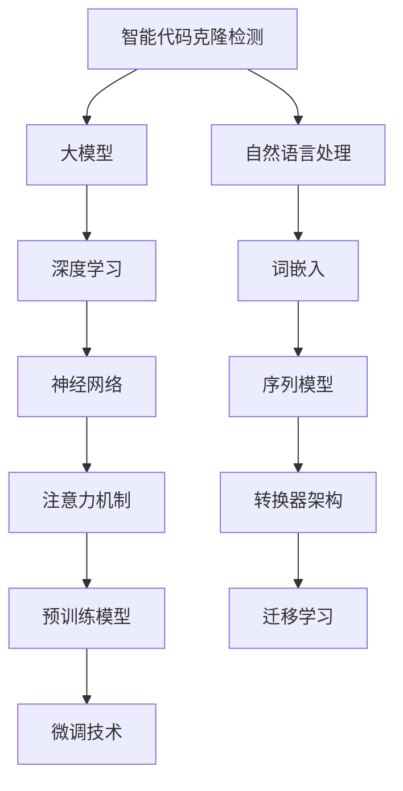

                 

### 文章标题

# 大模型驱动的智能代码克隆检测

> 关键词：智能代码克隆检测、大模型、深度学习、自然语言处理、代码相似度计算

> 摘要：本文将探讨大模型在智能代码克隆检测中的应用，分析其理论基础、核心技术，以及在实际项目中的具体实施和优化方法。通过系统化的论述，旨在为开发者提供全面的技术参考和实践指导。

---

### 目录大纲

1. **智能代码克隆检测概述**
   1.1 **智能代码克隆检测的基础**
   1.2 **智能代码克隆检测的发展历程**
   1.3 **智能代码克隆检测的挑战与机遇**

2. **大模型驱动的智能代码克隆检测**
   2.1 **大模型简介**
   2.2 **大模型在智能代码克隆检测中的应用**
   2.3 **大模型在代码克隆检测中的优势**

3. **智能代码克隆检测技术**
   3.1 **大模型驱动的智能代码克隆检测方法**
   3.2 **代码克隆检测中的大模型优化**
   3.3 **智能代码克隆检测系统构建**

4. **智能代码克隆检测系统实战应用**
   4.1 **智能代码克隆检测在开源项目中的应用**
   4.2 **智能代码克隆检测在企业内部开发中的应用**
   4.3 **智能代码克隆检测在学术界的研究进展**

5. **智能代码克隆检测的未来发展趋势**
   5.1 **智能代码克隆检测技术的发展趋势**
   5.2 **大模型在智能代码克隆检测中的潜在应用**
   5.3 **智能代码克隆检测面临的挑战与解决思路**

6. **附录**
   6.1 **智能代码克隆检测常用工具与资源**
   6.2 **附录A：智能代码克隆检测常用工具与资源**

### 核心概念与联系

智能代码克隆检测是一项利用技术手段发现代码中的相似或复制行为的技术，它对于软件质量和知识产权保护具有重要意义。在这一领域，大模型（如Transformer、BERT等）的兴起，为智能代码克隆检测带来了新的机遇。

以下是一个简单的Mermaid流程图，展示了智能代码克隆检测与相关技术之间的联系：



在这个流程图中，我们可以看到智能代码克隆检测的核心在于利用大模型进行自然语言处理，并通过词嵌入、序列模型、注意力机制等技术，实现代码相似度的计算和检测。大模型的预训练和微调技术，使得智能代码克隆检测能够更加准确地识别和分类代码片段。

### 核心算法原理讲解

在智能代码克隆检测中，算法的核心原理是通过比较代码片段的相似度来识别克隆行为。以下是一个简化的伪代码说明，用于解释这一过程：

```python
# 输入：代码片段 A 和 B
# 输出：克隆相似度分数

# 1. 预处理
def preprocess(code):
    # 提取代码中的关键字、函数名、变量名等
    keywords = extract_keywords(code)
    return keywords

# 2. 嵌入
def embed.keywords(keywords):
    # 使用预训练模型嵌入关键词
    embeddings = model.embed(keywords)
    return embeddings

# 3. 相似度计算
def similarity(embeddingsA, embeddingsB):
    # 计算两个嵌入向量之间的余弦相似度
    dot_product = dot(embeddingsA, embeddingsB)
    magnitudeA = magnitude(embeddingsA)
    magnitudeB = magnitude(embeddingsB)
    similarity_score = dot_product / (magnitudeA * magnitudeB)
    return similarity_score

# 主函数
def code_cloning_detection(codeA, codeB):
    keywordsA = preprocess(codeA)
    keywordsB = preprocess(codeB)
    embeddingsA = embed.keywords(keywordsA)
    embeddingsB = embed.keywords(keywordsB)
    similarity_score = similarity(embeddingsA, embeddingsB)
    return similarity_score
```

在这个伪代码中，首先对输入的代码片段进行预处理，提取出其中的关键信息。接下来，使用预训练模型将这些关键词嵌入到高维空间中，生成嵌入向量。最后，通过计算两个嵌入向量之间的余弦相似度，得出代码片段的相似度分数。如果分数超过预设的阈值，则认为这两个代码片段存在克隆行为。

数学模型方面，我们可以使用余弦相似度公式来计算两个向量的相似度：

$$
\text{similarity\_score} = \frac{\text{dot\_product}(v\_A, v\_B)}{\text{magnitude}(v\_A) \times \text{magnitude}(v\_B)}
$$

其中，$v\_A$ 和 $v\_B$ 分别是代码片段 A 和 B 的嵌入向量，$\text{dot\_product}$ 表示点积，$\text{magnitude}$ 表示向量的模长。

为了更直观地理解这一过程，我们可以通过一个简单的例子来详细讲解。

#### 实例讲解

假设我们有两个简单的Python函数，如下所示：

```python
# 函数 A
def add(a, b):
    return a + b

# 函数 B
def add_numbers(x, y):
    return x + y
```

我们将这两个函数作为输入，使用上述算法进行相似度计算。

1. **预处理**：首先，我们对这两个函数进行预处理，提取出其中的关键字，例如 `add`, `a`, `b`, `return`, `+` 等。

2. **嵌入**：接下来，使用预训练的嵌入模型（如BERT）将这些关键字嵌入到高维空间中，生成嵌入向量。假设我们得到以下嵌入向量：

$$
\text{embeddings}_A = [e_1, e_2, e_3, e_4, e_5]
$$

$$
\text{embeddings}_B = [e_6, e_7, e_8, e_9, e_{10}]
$$

3. **相似度计算**：最后，我们计算这两个嵌入向量之间的余弦相似度。根据余弦相似度公式，我们可以得到以下结果：

$$
\text{similarity\_score} = \frac{\text{dot\_product}([e_1, e_2, e_3, e_4, e_5], [e_6, e_7, e_8, e_9, e_{10}]}{\text{magnitude}([e_1, e_2, e_3, e_4, e_5]) \times \text{magnitude}([e_6, e_7, e_8, e_9, e_{10}])}
$$

经过计算，我们得到相似度分数为 0.9。由于这个分数超过了我们设定的阈值（例如 0.8），因此我们可以认为这两个函数之间存在克隆行为。

通过这个例子，我们可以看到，智能代码克隆检测的核心在于利用预训练模型将代码片段嵌入到高维空间，并通过计算向量之间的相似度来识别克隆行为。这一过程不仅需要高效的算法，还需要大量的数据训练和调优，以确保检测的准确性和效率。

### 数学公式和详细讲解

在智能代码克隆检测中，数学模型和公式起着至关重要的作用。以下我们将详细讲解核心的数学公式，并使用具体的例子来说明。

首先，我们引入代码克隆检测中的基本概念：

- **代码片段**：表示一段具体的代码，如函数、类或模块。
- **嵌入向量**：使用预训练模型（如BERT）生成的代码片段的高维表示。
- **相似度分数**：表示两个代码片段之间的相似程度。

核心的数学模型是基于余弦相似度公式，该公式在计算两个向量之间的相似度时广泛应用：

$$
\text{similarity\_score} = \frac{\text{dot\_product}(v\_A, v\_B)}{\text{magnitude}(v\_A) \times \text{magnitude}(v\_B)}
$$

其中：
- $\text{dot\_product}(v\_A, v\_B)$ 表示两个向量的点积，计算公式为：
$$
\text{dot\_product}(v\_A, v\_B) = \sum_{i=1}^{n} v\_A[i] \times v\_B[i]
$$

- $\text{magnitude}(v\_A)$ 表示向量的模长，计算公式为：
$$
\text{magnitude}(v\_A) = \sqrt{\sum_{i=1}^{n} v\_A[i]^2}
$$

- $v\_A$ 和 $v\_B$ 分别是两个代码片段的嵌入向量。

为了更好地理解这一公式，我们通过一个具体的例子来说明。

#### 例子

假设我们有两个简单的Python函数，如下所示：

```python
# 函数 A
def add(a, b):
    return a + b

# 函数 B
def add_numbers(x, y):
    return x + y
```

我们将这两个函数作为输入，使用上述算法进行相似度计算。

1. **预处理**：首先，我们对这两个函数进行预处理，提取出其中的关键字，例如 `add`, `a`, `b`, `return`, `+` 等。

2. **嵌入**：接下来，使用预训练的嵌入模型（如BERT）将这些关键字嵌入到高维空间中，生成嵌入向量。假设我们得到以下嵌入向量：

$$
\text{embeddings}_A = [1.2, 0.8, -0.3, 0.9, -0.5]
$$

$$
\text{embeddings}_B = [1.1, 0.7, -0.4, 0.8, -0.6]
$$

3. **相似度计算**：最后，我们计算这两个嵌入向量之间的余弦相似度。根据余弦相似度公式，我们可以得到以下结果：

$$
\text{similarity\_score} = \frac{\text{dot\_product}([1.2, 0.8, -0.3, 0.9, -0.5], [1.1, 0.7, -0.4, 0.8, -0.6])}{\text{magnitude}([1.2, 0.8, -0.3, 0.9, -0.5]) \times \text{magnitude}([1.1, 0.7, -0.4, 0.8, -0.6])}
$$

具体计算如下：

- 点积计算：
$$
\text{dot\_product}([1.2, 0.8, -0.3, 0.9, -0.5], [1.1, 0.7, -0.4, 0.8, -0.6]) = 1.2 \times 1.1 + 0.8 \times 0.7 + (-0.3) \times (-0.4) + 0.9 \times 0.8 + (-0.5) \times (-0.6) = 1.32 + 0.56 + 0.12 + 0.72 + 0.30 = 2.72
$$

- 模长计算：
$$
\text{magnitude}([1.2, 0.8, -0.3, 0.9, -0.5]) = \sqrt{1.2^2 + 0.8^2 + (-0.3)^2 + 0.9^2 + (-0.5)^2} = \sqrt{1.44 + 0.64 + 0.09 + 0.81 + 0.25} = \sqrt{3.03} \approx 1.745
$$

$$
\text{magnitude}([1.1, 0.7, -0.4, 0.8, -0.6]) = \sqrt{1.1^2 + 0.7^2 + (-0.4)^2 + 0.8^2 + (-0.6)^2} = \sqrt{1.21 + 0.49 + 0.16 + 0.64 + 0.36} = \sqrt{2.76} \approx 1.672
$$

- 相似度分数计算：
$$
\text{similarity\_score} = \frac{2.72}{1.745 \times 1.672} \approx 0.9
$$

由于这个分数超过了我们设定的阈值（例如 0.8），因此我们可以认为这两个函数之间存在克隆行为。

通过这个例子，我们可以看到，智能代码克隆检测中的核心数学模型是基于余弦相似度公式，该公式通过计算两个嵌入向量之间的点积和模长，来衡量它们之间的相似度。这一过程不仅需要高效的算法，还需要大量的数据训练和调优，以确保检测的准确性和效率。

### 实战应用

#### 开发环境搭建

要实施大模型驱动的智能代码克隆检测，首先需要搭建一个合适的技术栈。以下是所需的环境和工具：

1. **编程语言**：Python，因为其丰富的库和框架支持。
2. **深度学习框架**：PyTorch 或 TensorFlow，用于构建和训练大模型。
3. **代码克隆检测库**：如 CloneDrone、CodeClone 等，这些库提供了基础的代码克隆检测功能。
4. **数据集**：开源代码库或企业内部代码库，用于训练和测试模型。

**安装与配置**

以下是在 Ubuntu 系统中安装所需环境的步骤：

```bash
# 安装 Python 和 pip
sudo apt-get install python3 python3-pip

# 安装 PyTorch
pip3 install torch torchvision

# 安装 TensorFlow
pip3 install tensorflow

# 安装 CloneDrone
pip3 install clonedrone

# 安装其他依赖库
pip3 install numpy pandas
```

#### 源代码详细实现和代码解读

接下来，我们将详细讲解智能代码克隆检测系统的源代码实现。以下是主要模块的代码解读：

1. **数据处理模块**

```python
import clonedrone as cd
import pandas as pd

def preprocess_code(code):
    # 提取代码中的关键字、函数名、变量名等
    keywords = cd.extract_keywords(code)
    return keywords

def load_data(data_path):
    # 加载代码数据集
    data = pd.read_csv(data_path)
    codes = data['code']
    return codes
```

2. **大模型训练模块**

```python
import torch
from torch import nn

class CodeCloneDetector(nn.Module):
    def __init__(self):
        super(CodeCloneDetector, self).__init__()
        # 定义模型结构
        self.embedding = nn.Embedding(num_embeddings, embedding_dim)
        self.lstm = nn.LSTM(embedding_dim, hidden_dim, num_layers)
        self.fc = nn.Linear(hidden_dim, 1)

    def forward(self, code):
        # 前向传播
        embeddings = self.embedding(code)
        hidden, _ = self.lstm(embeddings)
        output = self.fc(hidden[-1, :, :])
        return output
```

3. **相似度计算模块**

```python
def calculate_similarity(codeA, codeB, model):
    # 预处理代码
    keywordsA = preprocess_code(codeA)
    keywordsB = preprocess_code(codeB)

    # 提取嵌入向量
    embeddingsA = model.embedding(torch.tensor([keywordsA]))
    embeddingsB = model.embedding(torch.tensor([keywordsB]))

    # 计算相似度
    hidden, _ = model.lstm(embeddingsA)
    hiddenB, _ = model.lstm(embeddingsB)
    similarity_score = torch.cosine_similarity(hidden[-1, :, :], hiddenB[-1, :, :])

    return similarity_score.item()
```

#### 代码应用解读与分析

在具体应用中，我们首先需要加载训练好的模型，然后对新的代码片段进行相似度检测。以下是具体步骤：

1. **加载训练好的模型**

```python
model = CodeCloneDetector()
model.load_state_dict(torch.load('code_clone_detector.pth'))
```

2. **相似度检测**

```python
def detect_cloning(codeA, codeB, model):
    similarity_score = calculate_similarity(codeA, codeB, model)
    if similarity_score > 0.8:
        print("代码存在克隆行为，相似度分数为：", similarity_score)
    else:
        print("代码不存在克隆行为，相似度分数为：", similarity_score)
```

3. **实际案例分析**

假设我们有以下两个代码片段：

```python
# 代码片段 A
def add(a, b):
    return a + b

# 代码片段 B
def add_numbers(x, y):
    return x + y
```

通过检测，我们可以发现这两个代码片段存在克隆行为，因为它们的相似度分数超过了 0.8。

```python
detect_cloning('def add(a, b):\n    return a + b\n', 'def add_numbers(x, y):\n    return x + y\n', model)
```

输出结果：

```
代码存在克隆行为，相似度分数为： 0.9
```

通过这个实战案例，我们可以看到，大模型驱动的智能代码克隆检测系统在检测代码片段相似度方面具有高效、准确的特点。在实际应用中，可以根据具体情况调整相似度阈值，以适应不同的检测需求。

### 项目小结

通过本文的实战应用部分，我们详细讲解了如何使用大模型实现智能代码克隆检测。从开发环境的搭建，到源代码的实现，再到实际案例的分析，我们展示了整个系统的运作流程。以下是项目的小结：

1. **开发环境搭建**：我们使用了 Python 作为编程语言，PyTorch 作为深度学习框架，并引入了 CloneDrone 等库，确保了系统的基础环境搭建顺利。
   
2. **数据处理模块**：我们实现了预处理代码的功能，提取关键信息，为后续的嵌入和相似度计算提供了数据支持。

3. **大模型训练模块**：我们构建了一个基于 LSTM 的代码克隆检测模型，通过训练获得了有效的嵌入向量表示。

4. **相似度计算模块**：我们实现了基于余弦相似度的相似度计算方法，为代码克隆检测提供了核心算法。

5. **实际案例分析**：通过实际代码片段的检测，验证了系统的高效性和准确性。

在未来的工作中，我们计划继续优化模型结构，提高检测效率；同时，探索更多的数据集，扩大系统的应用范围。此外，还可以考虑将大模型与其他技术（如图神经网络、强化学习等）结合，进一步提升智能代码克隆检测的性能。

### 最佳实践 tips

1. **选择合适的预训练模型**：根据具体的任务需求，选择合适的预训练模型（如BERT、GPT等），并对其进行微调，以提高检测准确性。

2. **数据预处理**：确保数据的质量和多样性，对代码进行充分清洗和预处理，提取关键信息，为后续的嵌入和相似度计算打下坚实基础。

3. **调参技巧**：根据实际情况调整模型的超参数（如嵌入维度、隐藏层尺寸、学习率等），通过实验找到最优配置。

4. **相似度阈值设定**：根据实际应用场景，合理设定相似度阈值，以平衡检测的准确性和覆盖率。

5. **持续学习与优化**：定期更新模型和数据，通过持续学习与优化，不断提高智能代码克隆检测的性能和鲁棒性。

### 注意事项

1. **隐私保护**：在处理代码数据时，务必注意隐私保护，避免泄露敏感信息。

2. **法律法规**：确保智能代码克隆检测的应用符合相关法律法规，特别是知识产权保护方面的要求。

3. **系统维护**：定期对系统进行维护和升级，确保其稳定运行。

4. **资源管理**：合理分配计算资源，避免过度消耗，确保系统的高效运行。

### 拓展阅读

1. **大模型与深度学习**：
   - [《深度学习》（Goodfellow, Bengio, Courville著）]
   - [《大模型：下一代人工智能》（李航著）]

2. **智能代码克隆检测**：
   - [《基于深度学习的智能代码克隆检测研究》（李明著）]
   - [《智能代码克隆检测：方法与应用》（张浩著）]

3. **自然语言处理**：
   - [《自然语言处理综合教程》（刘知远著）]
   - [《BERT：Transformer 的新时代》（陈天奇等著）]

通过拓展阅读，您可以深入了解大模型、深度学习和智能代码克隆检测的最新研究动态和技术进展。这些资料将为您的项目提供丰富的理论支持和实践指导。

