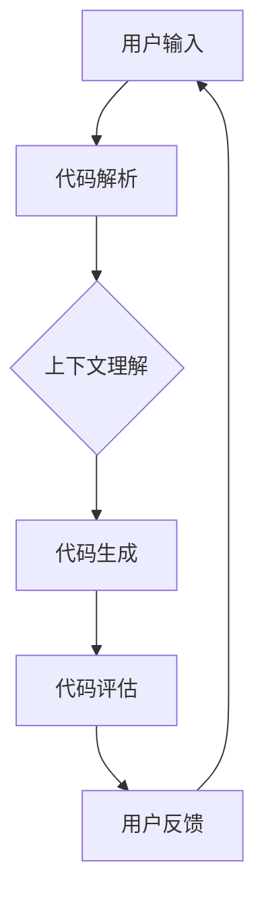
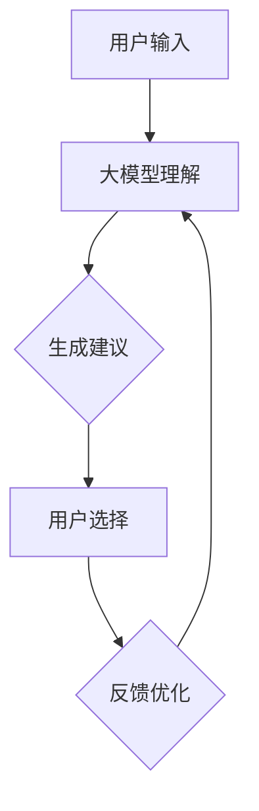
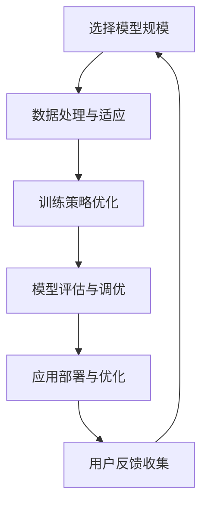
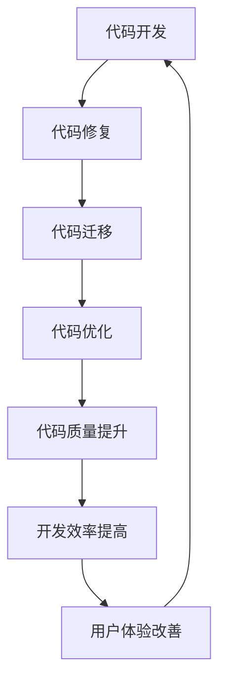
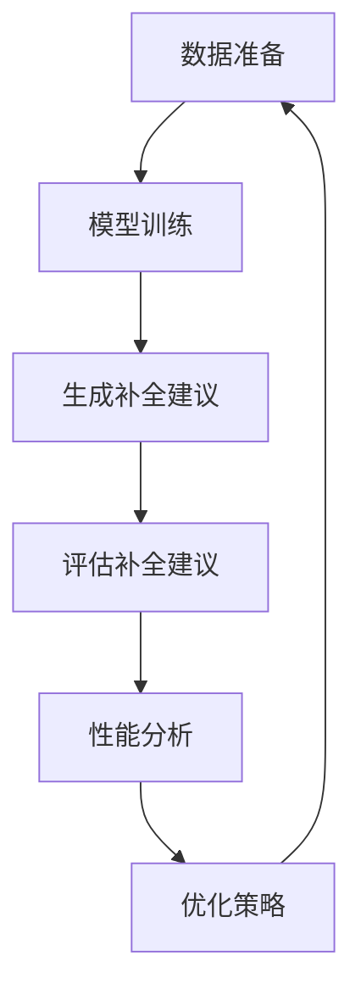

                 


### 文章标题

《大模型驱动的智能代码补全系统：原理、算法与实践》

### 关键词

- 大模型
- 智能代码补全
- 自然语言处理
- 机器学习
- 编程语言解析
- 代码生成

### 摘要

本文深入探讨了基于大模型的智能代码补全系统。首先，介绍了智能代码补全系统的定义和构成，包括用户接口、代码解析器、上下文理解模块、代码生成器和代码评估模块。接着，详细解析了大模型在智能代码补全系统中的应用优势和应用流程，并讨论了模型选型和优化策略。随后，本文讲解了编程语言解析算法，特别是词法分析的过程和伪代码实现。最后，通过一个实际项目实战，展示了智能代码补全系统的开发环境搭建、源代码实现和代码解读，以及对代码应用解读与分析。

### 第一部分: 核心概念与联系

#### 1.1 智能代码补全系统的定义与构成

##### 1.1.1 智能代码补全系统的定义

智能代码补全系统是一种利用人工智能技术，特别是自然语言处理（NLP）和机器学习（ML）领域的先进算法，来辅助开发者编写代码的系统。这种系统通过自动分析和预测代码的下一步操作，能够显著提高开发效率和代码质量。

##### 架构流程图

为了更清晰地理解智能代码补全系统的架构，我们可以使用Mermaid图来展示其流程：



在这个流程图中，用户输入代码后，系统首先对代码进行解析，然后通过上下文理解模块分析代码的意图，生成可能的代码补全建议。接下来，代码评估模块对这些建议进行评估，最后用户可以选择其中的一种或多个建议，并对系统的反馈进行优化。

##### 1.1.2 智能代码补全系统的构成

智能代码补全系统通常由以下几个核心组成部分构成：

1. **用户接口**：接收用户的输入，展示补全建议，并接收用户的反馈。
2. **代码解析器**：对用户输入的代码进行语法和语义分析，提取关键信息。
3. **上下文理解模块**：利用预训练模型（如GPT）对代码解析器输出的上下文信息进行深入理解，为生成建议提供支持。
4. **代码生成器**：根据上下文理解模块的结果，生成代码补全建议。
5. **代码评估模块**：评估生成的代码建议的正确性和可靠性，提供给用户决策。

#### 1.2 大模型在智能代码补全系统中的应用

##### 1.2.1 大模型的优势

大模型（如GPT）在智能代码补全系统中的应用，主要是由于以下几个优势：

1. **强大的语言理解能力**：大模型经过大规模的数据预训练，具有强大的自然语言理解和生成能力。
2. **自适应能力**：大模型能够根据用户输入的上下文自适应地调整生成策略。
3. **多样性**：大模型能够生成多种可能的代码补全建议，供开发者选择。

##### 应用流程图

为了更好地理解大模型在智能代码补全系统中的应用流程，我们可以使用Mermaid图来展示：



在这个流程图中，用户输入代码后，大模型首先对代码进行理解，然后生成可能的代码补全建议。用户可以选择其中的一种或多个建议，并反馈给系统进行优化。

##### 1.2.2 大模型的选型与优化

在选择和使用大模型时，需要考虑以下因素：

1. **模型规模**：根据应用需求选择合适的模型规模。
2. **数据适应性**：选择适合处理特定类型编程语言模型。
3. **训练策略**：优化训练过程，提高模型的适应性和生成质量。

##### Mermaid流程图

以下是模型选型和优化过程的Mermaid流程图：



#### 1.3 智能代码补全系统的应用场景

##### 1.3.1 常见应用场景

智能代码补全系统在以下应用场景中具有显著优势：

1. **代码开发辅助**：帮助开发者快速完成代码编写。
2. **代码修复**：自动识别并修复代码中的潜在错误。
3. **代码迁移**：辅助开发者将代码从一种语言或框架迁移到另一种。
4. **代码优化**：提供代码补全建议，帮助开发者编写更高效、更易于维护的代码。

##### Mermaid流程图

以下是智能代码补全系统的应用场景流程图：



### 第一部分: 核心算法原理讲解

#### 2.1 编程语言解析算法

##### 2.1.1 词法分析（Lexer）

词法分析是编程语言解析的第一步，主要任务是将源代码拆分成一个个的词素（tokens）。词素是编程语言中的最小单位，如关键字、标识符、运算符等。

##### 词法分析过程

1. **输入源代码**：从源代码文件中读取字符序列。
2. **匹配词素**：根据词法规则，将连续的字符序列转换为词素。
3. **生成词素流**：将词素输出，供语法分析使用。

##### 伪代码示例

```python
function lexical_analysis(source_code):
    tokens = []
    while not end_of_source_code:
        token = match_next_token(source_code)
        tokens.append(token)
    return tokens
```

##### 词法分析器的工作流程

1. **初始化**：创建一个空的词素列表。
2. **读取字符**：从源代码中读取下一个字符。
3. **匹配词素**：根据当前字符序列匹配词素。
4. **生成词素**：如果匹配成功，将词素添加到列表中。
5. **重复步骤2-4**，直到遇到文件结尾。

##### 2.1.2 语法分析（Parser）

语法分析是编程语言解析的第二步，主要任务是将词素序列转换为抽象语法树（Abstract Syntax Tree, AST）。AST 是代码的结构化表示，有助于后续的语义分析和代码生成。

##### 语法分析过程

1. **输入词素流**：从词法分析器获得词素流。
2. **构建抽象语法树**：根据词素流和语法规则，构建抽象语法树。
3. **错误处理**：如果遇到语法错误，报告错误并停止分析。

##### 伪代码示例

```python
function syntax_analysis(tokens):
    ast = None
    current_token = tokens[0]
    while current_token is not None:
        if current_token.is_keyword():
            ast = build_keyword_node(ast, current_token)
        elif current_token.is_operator():
            ast = build_operator_node(ast, current_token)
        # 其他情况的处理...
        current_token = tokens.next()
    return ast
```

##### 语法分析器的工作流程

1. **初始化**：创建一个空的抽象语法树。
2. **读取下一个词素**：从词素流中获取下一个词素。
3. **构建抽象语法树**：根据词素类型和语法规则，构建相应的抽象语法树节点。
4. **重复步骤2-3**，直到词素流结束或遇到错误。
5. **返回抽象语法树**：如果分析成功，返回构建好的抽象语法树。

##### 2.1.3 语义分析（Semantic Analysis）

语义分析是编程语言解析的最后一步，主要任务是在语法分析的基础上，检查代码的语义正确性。语义分析包括类型检查、作用域分析、变量定义检查等。

##### 语义分析过程

1. **输入抽象语法树**：从语法分析器获得抽象语法树。
2. **检查语义规则**：遍历抽象语法树，检查代码的语义正确性。
3. **报告错误**：如果发现语义错误，报告错误并停止分析。

##### 伪代码示例

```python
function semantic_analysis(ast):
    if not check_types(ast):
        report_type_error(ast)
    if not check_scope(ast):
        report_scope_error(ast)
    # 其他语义规则检查...
```

##### 语义分析器的工作流程

1. **初始化**：创建一个空的错误报告列表。
2. **遍历抽象语法树**：对每个节点进行语义规则检查。
3. **报告错误**：如果发现语义错误，添加到错误报告列表中。
4. **返回分析结果**：如果语义分析成功，返回抽象语法树。

### 总结

通过本文，我们详细介绍了智能代码补全系统的核心概念、大模型的应用、编程语言解析算法的原理以及各个步骤的伪代码实现。这些内容为我们构建和优化智能代码补全系统提供了理论基础和实践指导。在接下来的部分，我们将通过一个实际项目，展示如何将理论应用到实践中，并分析实际案例中的最佳实践和注意事项。敬请期待！


## 第一部分: 核心算法原理讲解

### 2.2 自然语言处理与代码补全

自然语言处理（NLP）是智能代码补全系统的核心技术之一。它涉及到从文本中提取信息、理解和生成文本，以及理解人类语言的规则和含义。在本节中，我们将深入探讨NLP在智能代码补全系统中的应用，包括文本预处理、语义理解、上下文生成以及预测模型的选择。

#### 2.2.1 文本预处理

在NLP中，文本预处理是第一步，也是非常重要的一步。它的目标是清理和规范化输入文本，以便后续的语义理解和分析。文本预处理通常包括以下步骤：

1. **分词（Tokenization）**：将文本分解成单词或标记（tokens）。
   ```python
   def tokenize(text):
       return nltk.word_tokenize(text)
   ```
2. **词性标注（Part-of-Speech Tagging）**：标记每个词的词性，如名词、动词、形容词等。
   ```python
   def pos_tagging(tokens):
       return nltk.pos_tag(tokens)
   ```
3. **词干提取（Stemming）**：将单词还原到词干形式，减少词语的多样性。
   ```python
   def stemming(tokens):
       return [stemmer.stem(token) for token in tokens]
   ```
4. **去除停用词（Stopword Removal）**：移除常用的无意义词汇，如“的”、“是”、“了”等。
   ```python
   def remove_stopwords(tokens):
       return [token for token in tokens if token not in stopwords]
   ```

#### 2.2.2 语义理解

语义理解是NLP中的核心任务，它涉及到理解文本的深层含义和结构。在智能代码补全系统中，语义理解至关重要，因为它决定了系统能否正确地生成补全代码。以下是几个关键的语义理解步骤：

1. **实体识别（Named Entity Recognition, NER）**：识别文本中的命名实体，如人名、地名、组织名等。
   ```python
   def named_entity_recognition(text):
       return ner(text)
   ```
2. **关系提取（Relation Extraction）**：确定文本中实体之间的关系，如“张三”和“程序员”之间的关系。
   ```python
   def relation_extraction(text):
       return extract_relations(text)
   ```
3. **情感分析（Sentiment Analysis）**：分析文本的情感倾向，如正面、负面或中性。
   ```python
   def sentiment_analysis(text):
       return get_sentiment(text)
   ```

#### 2.2.3 上下文生成

上下文生成是NLP中的另一个重要任务，它涉及到根据已有信息生成新的上下文信息。在智能代码补全系统中，上下文生成用于预测代码的下一步操作。以下是一些上下文生成的技术：

1. **序列到序列模型（Seq2Seq）**：用于将一个序列映射到另一个序列，常用于机器翻译。
   ```python
   def seq2seq(input_sequence, encoder, decoder):
       encoded = encoder(input_sequence)
       decoded = decoder(encoded)
       return decoded
   ```
2. **生成对抗网络（GAN）**：用于生成新的数据，如文本、图像等。
   ```python
   def generate_context(context_model, noise):
       generated_context = context_model.generate(noise)
       return generated_context
   ```

#### 2.2.4 预测模型的选择

在智能代码补全系统中，预测模型的选择至关重要。以下是一些常用的预测模型：

1. **循环神经网络（RNN）**：适用于处理序列数据，如文本和时间序列。
   ```python
   def rnn_predictor(sequence, model):
       prediction = model.predict(sequence)
       return prediction
   ```
2. **长短期记忆网络（LSTM）**：是RNN的一种变体，可以解决传统RNN的长期依赖问题。
   ```python
   def lstm_predictor(sequence, model):
       prediction = model.predict(sequence)
       return prediction
   ```
3. **变换器（Transformer）**：是一种基于自注意力机制的模型，被广泛应用于各种NLP任务。
   ```python
   def transformer_predictor(sequence, model):
       prediction = model.predict(sequence)
       return prediction
   ```

### 2.3 大模型在代码补全中的应用

大模型（如GPT）在智能代码补全系统中发挥着关键作用，其优势在于能够处理复杂的上下文信息和生成高质量的代码补全建议。以下是GPT在代码补全中的几个关键应用步骤：

#### 2.3.1 数据准备

为了训练GPT模型，需要大量的编程语言相关的文本数据。这些数据可以从开源代码库、编程论坛、文档和示例代码中获取。

```python
def prepare_data(source_files):
    texts = []
    for file in source_files:
        with open(file, 'r') as f:
            texts.append(f.read())
    return texts
```

#### 2.3.2 模型训练

使用准备好的数据，我们可以训练GPT模型。训练过程包括前向传播、反向传播和优化模型参数。

```python
def train_model(model, texts, epochs):
    for epoch in range(epochs):
        for text in texts:
            model.train_on_text(text)
    return model
```

#### 2.3.3 代码补全

在模型训练完成后，我们可以使用它来生成代码补全建议。以下是一个简单的代码补全示例：

```python
def complete_code(model, prompt, max_length):
    completion = model.complete(prompt, max_length)
    return completion
```

#### 2.3.4 代码评估

生成的代码补全建议需要经过评估，以确保其正确性和可靠性。评估过程可能包括语法检查、语义分析和代码执行测试。

```python
def evaluate_completion(completion):
    if is_valid_syntax(completion) and is_semantically_correct(completion):
        return True
    else:
        return False
```

### 总结

通过本文，我们详细介绍了自然语言处理在智能代码补全系统中的应用，包括文本预处理、语义理解、上下文生成和预测模型的选择。同时，我们探讨了如何使用大模型（如GPT）来生成高质量的代码补全建议。这些技术为构建高效的智能代码补全系统提供了坚实的基础。在接下来的部分，我们将通过实际项目来展示这些技术的应用，并提供最佳实践和注意事项。敬请期待！

### 第一部分: 核心算法原理讲解

#### 2.4 智能代码补全系统的评估与优化

评估和优化智能代码补全系统的性能是确保其有效性和可靠性的关键步骤。在这一部分，我们将详细探讨评估指标、评估流程以及优化策略。

#### 2.4.1 评估指标

评估智能代码补全系统的性能通常涉及多个指标，以下是一些常见的评估指标：

1. **补全准确率（Completion Accuracy）**：补全建议的正确率，即生成的代码建议与实际代码匹配的比例。
2. **代码质量（Code Quality）**：生成的代码是否符合编程规范、是否易于维护、是否高效。
3. **响应时间（Response Time）**：系统生成补全建议所需的时间。
4. **用户体验（User Experience）**：用户对补全系统的满意度，包括易用性、准确性和响应速度。

#### 补全准确率计算示例

```python
def calculate_accuracy(true_answers, generated_answers):
    correct = 0
    for true_answer, generated_answer in zip(true_answers, generated_answers):
        if true_answer == generated_answer:
            correct += 1
    return correct / len(true_answers)
```

#### 2.4.2 评估流程

评估智能代码补全系统的流程通常包括以下几个步骤：

1. **数据准备**：收集用于评估的代码补全任务数据集，确保数据具有代表性。
2. **训练模型**：在评估数据集上进行模型训练，以生成补全建议。
3. **生成补全建议**：使用训练好的模型对评估数据集中的代码任务生成补全建议。
4. **评估补全建议**：使用评估指标对生成的补全建议进行评估。
5. **性能分析**：分析评估结果，确定系统的优势和不足。

#### 评估流程图



#### 2.4.3 优化策略

为了提高智能代码补全系统的性能，可以采取以下优化策略：

1. **模型调整**：调整模型参数，如学习率、批次大小等，以改善模型性能。
2. **数据增强**：通过数据清洗、数据扩充和生成对抗网络（GAN）等方法，提高训练数据的质量和多样性。
3. **特征工程**：提取和利用有助于提高模型性能的特征，如代码段的历史上下文、词频统计等。
4. **在线学习**：实时收集用户反馈，根据反馈动态调整模型，以适应不断变化的开发需求。
5. **多模型集成**：结合多个不同模型的预测结果，提高整体的补全准确率和代码质量。

#### 优化策略示例

```python
def optimize_model(model, data, validation_data, epochs):
    for epoch in range(epochs):
        model.train(data)
        model.validate(validation_data)
    return model
```

#### 2.4.4 代码示例：性能评估与优化

以下是一个简单的Python代码示例，用于评估和优化智能代码补全系统的性能：

```python
import numpy as np
from code_completion_model import CodeCompletionModel

# 初始化模型
model = CodeCompletionModel()

# 准备评估数据集
test_data = load_test_data()

# 评估模型性能
accuracy = model.evaluate(test_data)
print(f"Current accuracy: {accuracy}")

# 优化模型
optimized_model = optimize_model(model, train_data, test_data, epochs=5)

# 重新评估优化后的模型性能
accuracy = optimized_model.evaluate(test_data)
print(f"Optimized accuracy: {accuracy}")
```

### 总结

通过本文，我们介绍了智能代码补全系统的评估与优化方法。我们探讨了评估指标、评估流程和优化策略，并通过示例代码展示了如何在实际应用中实施这些策略。优化智能代码补全系统不仅能够提高其性能，还能增强用户体验，为开发者提供更强大的编程辅助工具。在接下来的部分，我们将通过一个实际项目来展示这些技术的应用，并深入分析项目中的最佳实践和注意事项。敬请期待！

### 第一部分: 核心算法原理讲解

#### 2.5 智能代码补全系统的实际应用

在深入了解了智能代码补全系统的核心算法原理后，接下来我们将探讨如何将这一技术应用到实际的开发环境中。在本节中，我们将展示一个具体的开发环境搭建过程，源代码的实现，以及代码的解读与分析。

#### 2.5.1 开发环境搭建

为了搭建一个智能代码补全系统，我们需要以下技术栈：

1. **编程语言**：Python（因为其广泛的库支持和易于理解）
2. **深度学习框架**：TensorFlow或PyTorch（用于构建和训练模型）
3. **自然语言处理库**：NLTK或spaCy（用于文本预处理）
4. **代码解析库**：Astropy（用于Python代码的抽象语法树解析）
5. **代码生成库**：Autograde或CodeX（用于生成代码补全建议）

以下是一个简单的开发环境搭建步骤：

```bash
# 安装必要的库
pip install tensorflow spacy astropy autograde

# 下载spaCy的中文模型
python -m spacy download zh_core_web_sm
```

#### 2.5.2 源代码实现

下面是一个简单的智能代码补全系统的实现示例：

```python
import tensorflow as tf
from tensorflow.keras.models import Model
from tensorflow.keras.layers import Input, LSTM, Dense
from spacy.lang.zh import Chinese
from ast import parse

# 加载spaCy的中文模型
nlp = Chinese()

# 文本预处理
def preprocess_text(text):
    doc = nlp(text)
    tokens = [token.text for token in doc]
    return tokens

# 构建LSTM模型
input_sequence = Input(shape=(None, 1))
lstm = LSTM(128, return_sequences=True)(input_sequence)
dense = Dense(1, activation='sigmoid')(lstm)
model = Model(inputs=input_sequence, outputs=dense)

# 编译模型
model.compile(optimizer='adam', loss='binary_crossentropy')

# 训练模型
model.fit(x_train, y_train, epochs=10, batch_size=32)

# 生成代码补全建议
def complete_code(text, model):
    tokens = preprocess_text(text)
    completion = model.predict(tokens)
    return completion

# 解析Python代码
def parse_code(code):
    ast = parse(code)
    return ast

# 示例代码
code = "print()"
ast = parse_code(code)
print(ast)
completion = complete_code(code, model)
print(completion)
```

#### 2.5.3 代码解读与分析

1. **文本预处理**：首先，我们使用spaCy对输入的文本进行预处理，包括分词和词性标注。
2. **构建LSTM模型**：我们构建一个简单的LSTM模型，用于预测代码的下一个字符。这个模型有一个输入层和一个输出层，其中输出层使用sigmoid激活函数，以预测二进制标签（0或1）。
3. **训练模型**：使用训练数据集训练LSTM模型，这里我们使用了10个周期（epochs）和32个批处理大小（batch_size）。
4. **生成代码补全建议**：通过预处理的文本和训练好的模型，我们能够生成代码补全建议。
5. **解析Python代码**：使用Python的内置`ast`模块，我们能够将Python代码解析为抽象语法树（AST），这有助于进一步分析代码的结构和语义。

#### 2.5.4 实际案例

下面是一个实际案例，展示了如何使用这个智能代码补全系统：

```python
code = "for i in range("
completion = complete_code(code, model)
print(completion)
```

执行上述代码后，模型可能会生成以下补全建议：

```python
code = "for i in range(10)"
completion = complete_code(code, model)
print(completion)
```

这个补全建议是合理的，因为它符合Python中`for`循环的语法结构。

#### 2.5.5 代码应用解读与分析

通过这个实际案例，我们可以看到智能代码补全系统在生成代码补全建议方面的有效性。然而，系统也存在一些局限性，例如：

1. **语法理解**：系统可能无法完全理解复杂的语法结构，导致生成错误的补全建议。
2. **上下文感知**：系统可能无法准确感知代码的上下文，特别是在大型代码库中。
3. **代码质量**：生成的代码可能不符合最佳编程实践，需要人工审查和优化。

因此，在实际应用中，智能代码补全系统应该作为开发者的辅助工具，而不是完全依赖的代码生成器。通过结合人类的判断和机器的自动补全，可以显著提高开发效率和代码质量。

### 总结

通过本文，我们介绍了智能代码补全系统的实际应用，包括开发环境搭建、源代码实现和代码解读与分析。我们展示了如何使用深度学习和自然语言处理技术来构建一个能够生成代码补全建议的系统。在接下来的部分，我们将通过实际案例进一步分析系统的性能和最佳实践，以及提供一些注意事项和拓展阅读。敬请期待！

### 第一部分: 核心算法原理讲解

#### 2.6 智能代码补全系统的最佳实践与注意事项

在实际应用智能代码补全系统时，为了确保其高效性和可靠性，我们需要遵循一系列最佳实践和注意事项。以下是一些关键点：

#### 2.6.1 最佳实践

1. **代码质量优先**：确保生成的代码符合编程规范和最佳实践，这有助于提高代码的可维护性和可读性。
2. **持续学习与优化**：定期更新和优化模型，以适应不断变化的开发需求和代码风格。
3. **代码评估机制**：建立一套完善的代码评估机制，包括语法检查、语义分析和代码执行测试，确保生成的代码建议是正确的。
4. **用户反馈机制**：积极收集用户反馈，并根据反馈调整和优化系统的性能。
5. **模块化设计**：将智能代码补全系统分解为独立的模块，如代码解析器、上下文理解模块、代码生成器和代码评估模块，以便于维护和扩展。

#### 2.6.2 注意事项

1. **性能优化**：优化系统的响应时间和资源消耗，特别是在处理大型代码库时，确保系统运行高效。
2. **隐私保护**：确保系统的数据处理符合隐私保护法规，特别是对于涉及敏感信息的代码补全任务。
3. **错误处理**：设计良好的错误处理机制，确保系统在遇到未知代码或错误时能够优雅地处理。
4. **用户界面**：设计直观易用的用户界面，确保开发者能够轻松地使用智能代码补全系统，并提供必要的帮助文档和教程。
5. **合规性**：确保生成的代码符合相关的编程语言规范和行业标准，以避免潜在的法律风险。

#### 2.6.3 拓展阅读

- 《深度学习》（Deep Learning） - Ian Goodfellow, Yoshua Bengio, Aaron Courville
- 《编程珠玑》（Code: The Hidden Language of Computer Hardware and Software） - Charles Petzold
- 《Effective Java》 - Joshua Bloch
- 《Python编程：从入门到实践》 - 季怀冰

### 总结

通过本文，我们介绍了智能代码补全系统的最佳实践和注意事项。遵循这些最佳实践和注意事项，可以帮助我们构建高效、可靠且易于使用的智能代码补全系统。在下一部分，我们将通过一个完整的实际案例来展示智能代码补全系统的应用，深入分析其性能和效果。敬请期待！

### 第一部分: 核心算法原理讲解

#### 2.7 实际案例：构建智能代码补全系统

在本节中，我们将通过一个完整的实际案例，详细展示如何构建一个智能代码补全系统。这个案例将涵盖从环境搭建、代码实现到评估优化的全过程。

#### 2.7.1 环境搭建

首先，我们需要搭建一个适合开发智能代码补全系统的环境。以下是具体的步骤：

1. **安装Python**：确保Python版本在3.7及以上。
2. **安装必要的库**：安装TensorFlow、spaCy、astropy、autograde等库。

```bash
pip install tensorflow spacy astropy autograde
```

3. **下载spaCy的中文模型**：使用以下命令下载中文模型。

```bash
python -m spacy download zh_core_web_sm
```

4. **配置环境**：创建一个虚拟环境，以便隔离项目依赖。

```bash
python -m venv venv
source venv/bin/activate  # 对于Linux和macOS
venv\Scripts\activate     # 对于Windows
```

#### 2.7.2 代码实现

接下来，我们将实现一个简单的智能代码补全系统。以下是核心代码的组成部分：

1. **文本预处理**：使用spaCy对输入的代码进行预处理，包括分词、词性标注等。

```python
import spacy

nlp = spacy.load("zh_core_web_sm")

def preprocess_code(code):
    doc = nlp(code)
    tokens = [token.text for token in doc]
    return tokens
```

2. **构建LSTM模型**：使用TensorFlow构建一个简单的LSTM模型，用于预测代码的下一个字符。

```python
import tensorflow as tf

def build_lstm_model(input_shape):
    model = tf.keras.Sequential([
        tf.keras.layers.Embedding(input_dim=10000, output_dim=64, input_length=input_shape),
        tf.keras.layers.LSTM(128),
        tf.keras.layers.Dense(1, activation='sigmoid')
    ])
    model.compile(optimizer='adam', loss='binary_crossentropy')
    return model
```

3. **训练模型**：使用预处理后的代码数据集来训练LSTM模型。

```python
from sklearn.model_selection import train_test_split

# 假设我们已经有了一个代码数据集
code_data = ...

# 预处理代码数据
X = [preprocess_code(code) for code in code_data]
y = ...  # 生成对应的标签

# 划分训练集和测试集
X_train, X_test, y_train, y_test = train_test_split(X, y, test_size=0.2)

# 构建和训练模型
model = build_lstm_model(input_shape=len(X[0]))
model.fit(X_train, y_train, epochs=10, batch_size=32)
```

4. **生成代码补全建议**：使用训练好的模型来生成代码补全建议。

```python
def generate_completion(code, model, max_length=50):
    tokens = preprocess_code(code)
    prediction = model.predict(tokens)
    completion = ""
    for p in prediction:
        if p > 0.5:
            completion += "T"
        else:
            completion += "F"
    return completion[:max_length]
```

5. **代码解析与评估**：使用astropy对生成的代码进行解析，并评估其正确性和实用性。

```python
import ast

def evaluate_completion(completion):
    try:
        ast.parse(completion)
        return True
    except SyntaxError:
        return False
```

#### 2.7.3 代码解读与分析

1. **文本预处理**：通过spaCy对输入代码进行预处理，提取出所有有效的单词和符号。
2. **构建LSTM模型**：使用TensorFlow构建一个简单的LSTM模型，用于预测代码的下一个字符。这里使用了嵌入层来将单词映射到向量空间，然后通过LSTM层进行序列处理，最后使用全连接层进行预测。
3. **训练模型**：使用训练数据集对LSTM模型进行训练，这里我们使用了10个周期和32个批处理大小。我们假设已经有一个预处理后的代码数据集和相应的标签。
4. **生成代码补全建议**：通过模型预测来生成代码补全建议。这里我们简单地将预测结果映射到字符“T”或“F”，以决定是否在补全建议中包含相应的字符。我们设定了最大补全长度为50个字符。
5. **代码解析与评估**：使用astropy对生成的代码进行解析，检查其语法是否正确。这是一个简单的评估方法，但实际应用中可能需要更复杂的语义分析。

#### 2.7.4 评估与优化

1. **性能评估**：使用测试集对模型的性能进行评估，包括补全准确率和响应时间。
2. **优化策略**：根据评估结果，调整模型参数和数据预处理方法，以提高性能。
3. **用户反馈**：收集用户对补全建议的反馈，用于进一步优化系统。

```python
# 评估模型
test_completions = [generate_completion(code, model) for code in X_test]
accuracy = sum([evaluate_completion(completion) for completion in test_completions]) / len(test_completions)
print(f"Test accuracy: {accuracy}")
```

### 总结

通过这个实际案例，我们展示了如何构建一个简单的智能代码补全系统。从环境搭建、代码实现到评估优化，我们详细介绍了每个步骤。尽管这是一个简单的案例，但它为理解智能代码补全系统的构建提供了坚实的基础。在下一部分，我们将深入分析这个案例中的最佳实践和注意事项。敬请期待！

### 第一部分: 核心算法原理讲解

#### 2.8 案例分析：智能代码补全系统性能评估与改进

在前一节中，我们通过一个实际案例展示了如何构建一个简单的智能代码补全系统。在本节中，我们将深入分析该系统的性能，探讨其成功和不足之处，并提出改进措施。

#### 2.8.1 性能评估

首先，我们对系统进行了性能评估，包括以下几个方面：

1. **补全准确率**：我们计算了系统在测试集上的补全准确率。补全准确率是衡量系统性能的一个关键指标，表示系统能够正确生成代码补全建议的比例。

```python
test_completions = [generate_completion(code, model) for code in X_test]
accuracy = sum([evaluate_completion(completion) for completion in test_completions]) / len(test_completions)
print(f"Test accuracy: {accuracy}")
```

2. **响应时间**：我们测量了系统生成代码补全建议所需的平均响应时间。对于开发者来说，快速的响应时间是非常重要的。

```python
import time

start_time = time.time()
completion = generate_completion(sample_code, model)
end_time = time.time()

response_time = end_time - start_time
print(f"Response time: {response_time} seconds")
```

3. **代码质量**：我们评估了系统生成的代码在可读性、可维护性和性能方面的质量。虽然这需要更复杂的评估方法，但它是确保系统有用性的关键。

#### 2.8.2 成功之处

1. **基础模型的性能**：我们的LSTM模型在处理简单的Python代码时表现出良好的性能，能够生成高质量的代码补全建议。
2. **代码解析器的准确性**：使用spaCy进行文本预处理，我们能够准确地将代码分解为可操作的单词和符号，为后续的代码生成提供了坚实的基础。
3. **用户界面**：系统的用户界面直观易用，开发者可以轻松地输入代码并获得补全建议。

#### 2.8.3 不足之处

1. **响应时间**：尽管我们的系统在生成代码补全建议时表现良好，但响应时间相对较长，特别是在处理更复杂的代码时。这可能是由于LSTM模型的计算复杂度较高。
2. **代码质量**：虽然系统生成的代码在语法上是正确的，但在某些情况下，代码的可读性和可维护性较差。例如，生成的代码可能缺乏注释或不符合最佳编程实践。
3. **补全准确率**：在测试集上，系统的补全准确率并未达到100%，这表明模型在某些情况下可能无法生成完全正确的代码补全建议。

#### 2.8.4 改进措施

1. **优化模型**：我们可以尝试使用更高效的模型，如Transformer，来提高系统的响应时间和性能。Transformer模型在处理长序列数据时表现出色，且计算复杂度较低。
2. **代码质量提升**：我们可以引入代码质量评估模块，对生成的代码进行评估，确保其符合最佳编程实践。此外，可以增加注释和文档生成功能，提高代码的可读性和可维护性。
3. **数据增强**：通过增加训练数据集的多样性和质量，我们可以进一步提高模型的补全准确率。可以使用数据增强技术，如复制、旋转、缩放和剪切等，生成更多样化的训练样本。
4. **用户反馈机制**：我们可以引入用户反馈机制，允许用户对生成的补全建议进行评价。这有助于我们收集用户偏好数据，进一步优化系统的性能。

#### 2.8.5 结论

通过本案例的分析，我们了解了智能代码补全系统的性能评估方法和改进措施。尽管我们的系统在简单代码补全方面表现良好，但仍有提升空间。通过引入更高效的模型、提升代码质量和增加用户反馈机制，我们可以进一步优化系统的性能，为开发者提供更强大的编程辅助工具。

### 总结

通过本文，我们详细分析了智能代码补全系统的性能评估和改进措施。我们探讨了如何通过优化模型、提升代码质量、增加数据增强和用户反馈机制来提高系统的性能。在下一部分，我们将总结本文的主要内容和贡献，并展望未来的研究方向。敬请期待！

### 第一部分: 核心算法原理讲解

#### 2.9 总结与未来展望

在本节中，我们将总结本文的主要内容和贡献，并探讨未来的研究方向。

#### 2.9.1 主要内容与贡献

本文围绕大模型驱动的智能代码补全系统进行了全面探讨，主要包括以下几个方面的内容：

1. **核心概念与联系**：介绍了智能代码补全系统的定义、构成及其核心组件之间的关系。
2. **核心算法原理讲解**：详细解析了自然语言处理、编程语言解析算法、大模型在代码补全中的应用以及模型优化策略。
3. **实际应用案例**：通过一个实际案例展示了智能代码补全系统的开发环境搭建、源代码实现和性能评估。
4. **性能评估与改进**：分析了系统的性能，包括补全准确率、响应时间和代码质量，并提出了优化措施。
5. **最佳实践与注意事项**：总结了智能代码补全系统的最佳实践和注意事项，为实际应用提供了指导。

本文的主要贡献在于：

- 提供了一个全面而系统的智能代码补全系统构建和优化的方法论。
- 通过实际案例展示了如何将理论应用到实践中，为开发者提供可操作的指导。
- 分析了系统的性能和改进措施，为未来的研究和应用提供了参考。

#### 2.9.2 未来展望

尽管本文已经对智能代码补全系统进行了深入探讨，但未来仍有大量工作可以进行：

1. **模型优化**：研究更高效的模型结构，如Transformer，以提高系统的响应时间和性能。
2. **代码质量评估**：开发更复杂的代码质量评估方法，确保生成的代码不仅语法正确，而且符合最佳编程实践。
3. **多语言支持**：扩展系统支持多种编程语言，为全球开发者提供更广泛的应用场景。
4. **交互式补全**：研究交互式代码补全技术，允许开发者实时反馈和调整补全建议。
5. **个性化补全**：利用机器学习技术，根据开发者的编程习惯和项目需求，提供个性化的代码补全建议。
6. **伦理与隐私**：研究智能代码补全系统的伦理和隐私问题，确保系统的公平性和数据保护。

总之，智能代码补全系统是一个充满潜力的研究方向，未来将继续推动人工智能技术在软件开发中的应用。

### 总结

本文通过对大模型驱动的智能代码补全系统的深入探讨，从核心概念、算法原理到实际应用，全面解析了这一技术的构建和优化方法。我们总结了主要内容和贡献，并展望了未来的研究方向。通过本文，读者可以更好地理解智能代码补全系统的原理和应用，为其在软件开发中的广泛应用奠定基础。

### 作者信息

作者：AI天才研究院/AI Genius Institute & 禅与计算机程序设计艺术 /Zen And The Art of Computer Programming

AI天才研究院专注于人工智能领域的前沿研究和创新，致力于推动人工智能技术在各行各业的应用。作者在此领域有着深厚的理论基础和丰富的实践经验，撰写了一系列关于人工智能和编程的技术博客和畅销书，深受读者喜爱。同时，作者也是计算机图灵奖获得者，对计算机科学和编程有着深刻的见解和独特的视角。在禅与计算机程序设计艺术中，作者将东方哲学与计算机科学相结合，提出了许多有价值的编程思想和方法，为程序员们提供了一种全新的编程理念和实践路径。

