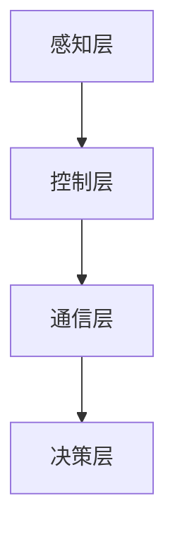

                 

### 文章标题：大疆2024校招无人机集群控制算法工程师笔试题

#### 关键词：
- 无人机集群控制
- 算法工程师
- 校招笔试题
- 多智能体系统
- 编队飞行
- 搜索与救援

#### 摘要：
本文详细解析了针对大疆2024年校招无人机集群控制算法工程师的笔试题。文章分为三个部分，首先介绍了无人机集群控制的基本概念和架构，然后探讨了协同控制算法及其应用，包括编队飞行、搜索与救援等，最后通过具体项目案例和数学公式，深入分析了无人机集群控制算法的实际应用与实现细节。本文旨在为即将参加校招的同学提供有价值的参考和实战经验。

---

### 《大疆2024校招无人机集群控制算法工程师笔试题》目录大纲

#### 第一部分：无人机集群控制算法基础

#### 第二部分：无人机集群控制算法应用

#### 第三部分：无人机集群控制算法实战

#### 附录

---

## 第一部分：无人机集群控制算法基础

### 第1章：无人机集群控制基本概念

无人机集群控制是无人机技术领域的重要研究方向，随着无人机的广泛应用，其重要性日益凸显。本章节将首先介绍无人机集群控制的基本概念，探讨其重要性、面临的挑战以及应用场景，为后续内容奠定基础。

#### 1.1 无人机集群控制概述

##### 1.1.1 无人机集群控制的重要性

无人机集群控制的核心在于实现多无人机协同工作，通过控制算法和通信协议，使得无人机能够自主地完成指定任务。这种技术不仅提升了无人机在复杂环境下的作业能力，还降低了单机作业的风险和成本。其重要性主要体现在以下几个方面：

1. **提高作业效率**：无人机集群可以同时执行多种任务，如侦察、测绘、巡逻等，显著提升工作效率。
2. **增强作业安全性**：无人机集群可以通过分工协作，降低单机作业的风险，例如在危险环境中进行侦察任务。
3. **扩展应用场景**：无人机集群控制技术使得无人机能够适应更广泛的应用场景，如搜索与救援、农业监测、灾难响应等。

##### 1.1.2 无人机集群控制的挑战

虽然无人机集群控制具有广泛的应用前景，但在实际应用中仍面临诸多挑战：

1. **通信问题**：无人机集群控制需要稳定的通信链路，但无人机在空中飞行时，信号容易受到干扰和遮挡。
2. **协调问题**：多无人机之间的协调控制是技术难点，需要解决无人机之间的同步和避障问题。
3. **计算能力**：无人机集群控制算法通常复杂度高，对计算能力要求较高，如何在有限资源下实现高效算法是关键问题。
4. **安全与隐私**：无人机集群控制可能涉及到敏感数据，保障数据安全和个人隐私是重要挑战。

##### 1.1.3 无人机集群控制的应用场景

无人机集群控制技术可以在多个领域发挥作用：

1. **军事领域**：无人机集群在军事侦察、目标追踪、战场管理等任务中具有重要应用。
2. **民用领域**：无人机集群在农业监测、环境监测、灾难响应等民用领域具有广泛应用。
3. **商业领域**：无人机集群在物流配送、影视拍摄、广告宣传等领域逐渐崭露头角。
4. **科学研究**：无人机集群在科学研究，如气象观测、地理测绘、生态研究等方面具有重要作用。

#### 1.2 无人机集群控制架构

##### 1.2.1 集群控制架构概述

无人机集群控制架构可以分为以下几个层次：

1. **感知层**：包括无人机搭载的各种传感器，如摄像头、GPS、IMU等，用于感知环境和自身状态。
2. **控制层**：负责无人机集群的控制策略和算法实现，确保无人机能够按照指定任务执行。
3. **通信层**：负责无人机之间的数据传输和通信，实现无人机集群的协同工作。
4. **决策层**：根据感知层和控制层的反馈，进行任务规划和决策，确保无人机集群的高效运行。

##### 1.2.2 集群控制层次结构

无人机集群控制的层次结构如图1所示，各个层次之间通过数据流和信息交换实现协同工作。

#### 1.2.3 集群控制协议

无人机集群控制需要一套完善的通信协议，以确保无人机之间的通信稳定和可靠。常见的集群控制协议包括：

1. **无线通信协议**：如Wi-Fi、LoRa、Zigbee等，适用于短距离、低功耗的通信需求。
2. **有线通信协议**：如以太网、串口等，适用于高速、高可靠性的通信需求。
3. **通信协议标准**：如MAVLink、PX4等，提供标准化的通信接口和协议框架。

### 第2章：无人机集群协同控制算法

无人机集群协同控制算法是实现无人机集群高效运行的核心技术，本章节将介绍多智能体系统理论基础、轨迹规划与避障算法，为无人机集群的协同控制提供理论依据和实践指导。

#### 2.1 多智能体系统理论基础

##### 2.1.1 多智能体系统基本概念

多智能体系统（Multi-Agent System，MAS）是由多个自主智能体（Agent）组成的系统，每个智能体具有一定的智能和自主性，可以通过通信和协作实现共同目标。多智能体系统具有以下几个特点：

1. **自主性**：每个智能体具有独立的决策能力，可以在不受中央控制的情况下自主行动。
2. **分布式**：智能体分布在不同位置，通过通信实现协作，具有分布式的特点。
3. **异质性**：智能体具有不同的物理属性、行为规则和决策能力。
4. **适应性**：智能体可以根据环境变化和系统状态自主调整行为。

##### 2.1.2 多智能体系统协同控制理论

多智能体系统协同控制理论是研究多智能体如何在分布式环境下协同完成复杂任务的一门学科。其主要内容包括：

1. **协同目标**：确定多智能体系统共同追求的目标，如形成特定形状的编队、执行搜索任务等。
2. **协同策略**：设计智能体之间的协作规则和通信机制，实现协同行为的同步和协调。
3. **协同控制**：通过控制算法实现智能体的协同控制，使系统能够稳定地达到协同目标。

##### 2.1.3 多智能体系统稳定性分析

多智能体系统的稳定性分析是评估系统稳定性的关键，主要包括以下几个方面：

1. **一致性分析**：研究智能体在分布式环境下的同步问题，确保智能体最终达到一致状态。
2. **稳定性分析**：研究智能体在受到外部干扰和内部动态变化时的稳定性问题，确保系统不会出现失控或震荡。
3. **容错性分析**：评估系统在智能体失效或部分智能体失效情况下的稳定性，确保系统仍能正常运行。

#### 2.2 轨迹规划与避障算法

##### 2.2.1 轨迹规划算法介绍

轨迹规划算法是无人机集群控制的核心算法之一，用于确定无人机在空间中的运动轨迹，使其能够按照预定路径执行任务。常见的轨迹规划算法包括：

1. **线性规划算法**：基于线性规划理论，求解无人机在连续时间内的最优轨迹。
2. **动态规划算法**：将无人机运动轨迹划分为离散时间点，通过递归求解最优子结构，得到全局最优轨迹。
3. **路径规划算法**：如A*算法、Dijkstra算法等，用于在离散空间中求解最优路径。

##### 2.2.2 避障算法原理

避障算法是确保无人机在执行任务过程中避免与障碍物发生碰撞的关键技术。常见的避障算法包括：

1. **几何避障算法**：通过几何方法确定无人机与障碍物之间的安全距离，避免碰撞。
2. **基于传感器的避障算法**：利用无人机搭载的传感器（如摄像头、激光雷达等）实时感知周围环境，进行避障决策。
3. **基于模型的避障算法**：通过建立无人机与障碍物的运动模型，预测未来碰撞点，提前进行避障。

##### 2.2.3 轨迹规划与避障算法应用案例

轨迹规划与避障算法在无人机集群控制中具有广泛的应用。例如：

1. **无人机编队飞行**：通过轨迹规划算法，确定无人机在编队飞行中的相对位置和速度，实现稳定有序的编队形态。
2. **无人机搜索与救援**：在搜索区域内，通过轨迹规划算法，确定无人机搜索路径，避免重复搜索和碰撞障碍物。
3. **无人机农业监测**：在农业监测任务中，通过轨迹规划与避障算法，确保无人机能够安全、高效地执行农作物监测任务。

### 第3章：无人机集群编队飞行控制算法

无人机集群编队飞行是无人机集群控制中的重要应用之一，可以实现无人机之间的协同运动，提升作业效率和视觉效果。本章节将介绍编队飞行的基础知识、控制算法及其实现步骤。

#### 3.1 编队飞行基础

##### 3.1.1 编队飞行动机

无人机集群编队飞行具有以下几个优势：

1. **提升作业效率**：通过无人机之间的协同运动，可以实现同时执行多项任务，提升作业效率。
2. **增强安全性**：无人机在编队飞行中，可以通过相互协作，避免在复杂环境中发生碰撞或误操作。
3. **提升视觉效果**：无人机编队飞行可以实现整齐划一的动作，提升观赏价值和宣传效果。

##### 3.1.2 编队飞行模型

无人机集群编队飞行模型可以分为以下几个部分：

1. **无人机模型**：描述无人机的基本属性，如速度、加速度、姿态等。
2. **控制模型**：描述无人机之间的控制关系，如速度同步、位置跟踪等。
3. **环境模型**：描述无人机飞行过程中的环境因素，如风速、气压等。

##### 3.1.3 编队飞行控制策略

编队飞行控制策略可以分为以下几个层次：

1. **顶层控制策略**：根据任务需求，确定无人机集群的总体运动轨迹和编队形态。
2. **中间层控制策略**：根据顶层控制策略，确定无人机之间的相对位置和速度。
3. **底层控制策略**：根据中间层控制策略，实时调整无人机的姿态和运动状态。

#### 3.2 编队飞行算法实现

##### 3.2.1 编队飞行算法原理

编队飞行算法原理主要包括以下几个方面：

1. **轨迹规划**：根据任务需求和环境因素，确定无人机的运动轨迹。
2. **速度同步**：确保无人机之间的相对速度保持一致，实现稳定编队。
3. **位置跟踪**：确保无人机按照预定轨迹和位置进行运动，实现精确控制。

##### 3.2.2 编队飞行算法实现步骤

编队飞行算法实现步骤可以分为以下几个部分：

1. **初始化**：设置无人机参数、控制目标和初始状态。
2. **轨迹规划**：根据任务需求和环境因素，生成无人机的运动轨迹。
3. **速度同步**：通过控制算法，实现无人机之间的速度同步。
4. **位置跟踪**：根据轨迹规划，实时调整无人机的位置和姿态。
5. **实时反馈**：通过传感器和反馈机制，实时调整无人机的运动状态。

##### 3.2.3 编队飞行算法优化

编队飞行算法优化主要包括以下几个方面：

1. **轨迹优化**：通过优化算法，提升无人机轨迹的平滑性和鲁棒性。
2. **速度优化**：通过优化算法，提升无人机之间的速度同步精度。
3. **控制优化**：通过优化算法，提升无人机的响应速度和控制精度。

### 第二部分：无人机集群控制算法应用

### 第4章：无人机集群搜索与救援算法

无人机集群在搜索与救援任务中具有独特的优势，可以快速覆盖大面积区域，提高搜索效率和救援成功率。本章节将介绍无人机集群搜索与救援算法的概述、实现原理及其优化方法。

#### 4.1 搜索与救援算法概述

无人机集群搜索与救援算法的核心目标是快速、准确地定位目标，并在最短时间内实施救援行动。其主要内容包括：

1. **搜索区域划分**：将整个搜索区域划分为若干小块，每个无人机负责一个小块的搜索任务。
2. **搜索路径规划**：根据无人机的飞行速度和搜索区域，确定无人机的搜索路径。
3. **目标检测与定位**：利用无人机搭载的传感器，实时检测目标位置，并进行定位。
4. **救援行动规划**：根据目标位置和救援需求，规划无人机的救援行动。

#### 4.2 搜索与救援算法实现

无人机集群搜索与救援算法实现主要包括以下几个步骤：

1. **初始化**：设置无人机的初始状态、搜索区域和救援目标。
2. **搜索路径规划**：根据无人机的飞行速度和搜索区域，生成搜索路径。
3. **目标检测与定位**：利用无人机搭载的传感器，实时检测目标位置，并进行定位。
4. **救援行动规划**：根据目标位置和救援需求，规划无人机的救援行动。
5. **实时反馈与调整**：根据无人机的反馈信息，实时调整搜索路径和救援行动。

#### 4.3 搜索与救援算法优化

无人机集群搜索与救援算法优化主要包括以下几个方面：

1. **路径优化**：通过优化算法，提升无人机搜索路径的平滑性和效率。
2. **检测优化**：通过优化算法，提升无人机对目标的检测精度和速度。
3. **控制优化**：通过优化算法，提升无人机对救援目标的跟踪和控制精度。

### 第5章：无人机集群协同感知与通信算法

无人机集群协同感知与通信算法是实现无人机集群高效协作的关键技术。本章节将介绍协同感知与通信的基础知识、实现原理及其优化方法。

#### 5.1 协同感知与通信基础

##### 5.1.1 协同感知概念

协同感知是指多个无人机通过通信和协作，共享感知信息，实现更全面、准确的感知能力。其主要内容包括：

1. **传感器数据融合**：将多个无人机的感知数据（如图像、雷达、GPS等）进行融合，提高感知精度。
2. **信息共享**：无人机之间共享感知数据，实现信息互补，提升整体感知能力。
3. **协同决策**：基于共享感知信息，无人机之间进行协同决策，实现高效协作。

##### 5.1.2 协同感知架构

无人机集群协同感知架构可以分为以下几个部分：

1. **感知层**：无人机搭载各种传感器，用于感知环境信息。
2. **通信层**：无人机之间通过无线通信，实现数据传输和共享。
3. **决策层**：基于共享感知信息，无人机之间进行协同决策，实现任务分配和协调。

##### 5.1.3 协同通信原理

无人机集群协同通信是基于无线通信技术，实现无人机之间的数据传输和共享。其主要内容包括：

1. **无线通信协议**：选择合适的无线通信协议，如Wi-Fi、LoRa、Zigbee等，实现无人机之间的稳定通信。
2. **通信拓扑**：设计无人机之间的通信拓扑结构，如星型、网状等，确保通信的可靠性和效率。
3. **通信优化**：通过优化算法，提升无人机通信的带宽、传输速率和抗干扰能力。

#### 5.2 协同感知与通信算法实现

无人机集群协同感知与通信算法实现主要包括以下几个步骤：

1. **感知数据采集**：无人机通过传感器采集环境信息，并将数据上传至通信层。
2. **数据传输与共享**：无人机之间通过无线通信，实现感知数据的传输和共享。
3. **信息融合与处理**：基于共享感知信息，无人机进行信息融合和处理，提升整体感知能力。
4. **协同决策与控制**：基于共享感知信息，无人机之间进行协同决策，实现任务分配和协调。

#### 5.3 协同感知与通信算法优化

无人机集群协同感知与通信算法优化主要包括以下几个方面：

1. **感知数据优化**：通过优化传感器数据采集和处理算法，提升感知精度和速度。
2. **通信优化**：通过优化无线通信协议和通信拓扑结构，提升通信的可靠性和效率。
3. **协同控制优化**：通过优化无人机之间的协同控制算法，提升无人机集群的整体协同性能。

### 第6章：无人机集群任务分配与优化算法

无人机集群任务分配与优化算法是确保无人机集群高效完成任务的重要手段。本章节将介绍任务分配与优化算法的概述、实现原理及其优化方法。

#### 6.1 任务分配与优化算法概述

无人机集群任务分配与优化算法旨在根据任务需求和无人机资源，实现无人机之间的任务分配和优化，确保无人机集群高效完成任务。其主要内容包括：

1. **任务模型**：建立无人机集群任务模型，包括任务类型、任务目标、任务约束等。
2. **资源模型**：建立无人机资源模型，包括无人机类型、载重、续航能力等。
3. **任务分配策略**：根据任务模型和资源模型，设计无人机任务分配策略。
4. **任务优化目标**：确定无人机任务优化目标，如任务完成时间最短、能耗最小等。

#### 6.2 任务分配与优化算法实现

无人机集群任务分配与优化算法实现主要包括以下几个步骤：

1. **初始化**：设置无人机集群的初始状态、任务需求和资源模型。
2. **任务建模**：根据任务需求和资源模型，建立无人机集群任务模型。
3. **任务分配**：根据任务模型和资源模型，实现无人机之间的任务分配。
4. **任务优化**：根据任务优化目标，优化无人机集群的任务执行方案。
5. **实时调整**：根据无人机集群的执行状态，实时调整任务分配和优化方案。

#### 6.3 任务分配与优化算法优化

无人机集群任务分配与优化算法优化主要包括以下几个方面：

1. **任务模型优化**：通过优化任务模型，提升任务分配的精度和效率。
2. **资源模型优化**：通过优化资源模型，提升无人机资源的利用效率。
3. **算法优化**：通过优化算法设计，提升任务分配和优化的速度和精度。

### 第三部分：无人机集群控制算法实战

### 第7章：无人机集群控制算法项目实战

无人机集群控制算法项目实战是验证无人机集群控制理论的关键环节。本章节将介绍无人机集群控制算法项目实战的背景、开发流程及其优化方法。

#### 7.1 项目背景

某无人机集群控制项目旨在实现无人机在复杂环境下的自主飞行和任务执行，具体背景如下：

1. **项目目标**：开发一套无人机集群控制算法，实现无人机在指定区域内的自主飞行和协同任务执行。
2. **项目环境**：无人机集群由多台相同型号的无人机组成，具备一定的自主飞行和控制能力。
3. **项目挑战**：项目面临的主要挑战包括通信干扰、无人机协同控制、任务优化等。

#### 7.2 项目开发流程

无人机集群控制算法项目开发流程主要包括以下几个阶段：

1. **需求分析**：根据项目目标，明确无人机集群控制的需求和功能。
2. **设计与实现**：设计无人机集群控制算法，并实现相关功能模块。
3. **测试与优化**：对无人机集群控制算法进行测试和优化，确保其稳定性和可靠性。

#### 7.2.1 需求分析

无人机集群控制需求分析主要包括以下几个方面：

1. **功能需求**：确定无人机集群控制的功能需求，如自主飞行、协同任务执行、实时通信等。
2. **性能需求**：确定无人机集群控制的性能需求，如响应速度、控制精度、能耗等。
3. **可靠性需求**：确定无人机集群控制的可靠性需求，如故障处理、抗干扰能力等。

#### 7.2.2 设计与实现

无人机集群控制算法设计与实现主要包括以下几个模块：

1. **感知模块**：实现无人机对环境的感知功能，如GPS定位、摄像头图像识别等。
2. **控制模块**：实现无人机集群的控制算法，如轨迹规划、速度同步、位置跟踪等。
3. **通信模块**：实现无人机之间的通信功能，如无线传输、数据共享等。
4. **决策模块**：实现无人机集群的任务规划和决策功能，如任务分配、目标检测、路径优化等。

#### 7.2.3 测试与优化

无人机集群控制算法测试与优化主要包括以下几个步骤：

1. **单元测试**：对每个功能模块进行单元测试，确保其功能正确和性能稳定。
2. **集成测试**：对整个无人机集群控制算法进行集成测试，确保各模块之间的协同工作。
3. **性能测试**：对无人机集群控制算法进行性能测试，评估其响应速度、控制精度等性能指标。
4. **优化与调试**：根据测试结果，对无人机集群控制算法进行优化和调试，提升其性能和稳定性。

### 第8章：无人机集群控制算法案例分析

无人机集群控制算法在实际应用中具有重要意义，本章节将介绍无人机集群自主编队飞行和协同搜索与救援两个案例，分析其实现原理、效果评估及优化方法。

#### 8.1 案例一：无人机集群自主编队飞行

##### 8.1.1 案例背景

某无人机集群自主编队飞行项目旨在实现无人机在复杂环境下的自主飞行和协同运动，具体背景如下：

1. **项目目标**：实现无人机在指定区域内的自主飞行，并形成整齐划一的编队形态。
2. **项目环境**：无人机集群由多台相同型号的无人机组成，具备一定的自主飞行和控制能力。
3. **项目挑战**：项目面临的主要挑战包括通信干扰、无人机协同控制、编队形态稳定性等。

##### 8.1.2 案例实现

无人机集群自主编队飞行实现主要包括以下几个步骤：

1. **感知与定位**：无人机通过GPS和摄像头等传感器，实时感知自身位置和环境信息。
2. **轨迹规划**：根据编队形态要求和环境信息，生成无人机集群的运动轨迹。
3. **速度同步**：通过控制算法，实现无人机之间的速度同步，确保编队稳定。
4. **位置跟踪**：根据轨迹规划，实时调整无人机的位置和姿态，确保无人机按照预定轨迹飞行。
5. **实时反馈与调整**：根据无人机反馈信息，实时调整编队形态和控制策略。

##### 8.1.3 案例效果评估

无人机集群自主编队飞行案例的效果评估主要包括以下几个方面：

1. **编队形态稳定性**：评估无人机编队飞行的稳定性，如编队间距、编队方向等。
2. **飞行路径精度**：评估无人机按照预定轨迹飞行的精度，如轨迹偏差、飞行时间等。
3. **响应速度**：评估无人机对控制指令的响应速度，如速度调整时间、位置调整时间等。
4. **能耗**：评估无人机集群飞行过程中的能耗，如电池续航时间、能耗效率等。

##### 8.1.4 案例优化方法

无人机集群自主编队飞行案例的优化方法主要包括以下几个方面：

1. **轨迹优化**：通过优化算法，提升无人机轨迹的平滑性和效率。
2. **速度优化**：通过优化算法，提升无人机之间的速度同步精度。
3. **控制优化**：通过优化算法，提升无人机的响应速度和控制精度。
4. **通信优化**：通过优化无线通信协议和拓扑结构，提升通信的可靠性和效率。

#### 8.2 案例二：无人机集群协同搜索与救援

##### 8.2.1 案例背景

某无人机集群协同搜索与救援项目旨在实现无人机在指定区域内的自主搜索和协同救援，具体背景如下：

1. **项目目标**：实现无人机在指定区域内的自主搜索，快速定位目标并进行救援。
2. **项目环境**：无人机集群由多台不同型号的无人机组成，具备一定的自主飞行和感知能力。
3. **项目挑战**：项目面临的主要挑战包括通信干扰、无人机协同控制、目标检测与定位等。

##### 8.2.2 案例实现

无人机集群协同搜索与救援实现主要包括以下几个步骤：

1. **感知与定位**：无人机通过GPS、摄像头、激光雷达等传感器，实时感知自身位置和环境信息。
2. **搜索路径规划**：根据搜索区域和目标信息，生成无人机集群的搜索路径。
3. **目标检测与定位**：利用无人机搭载的传感器，实时检测目标位置并进行定位。
4. **协同救援规划**：根据目标位置和救援需求，规划无人机的救援路径和行动。
5. **实时反馈与调整**：根据无人机反馈信息，实时调整搜索路径和救援行动。

##### 8.2.3 案例效果评估

无人机集群协同搜索与救援案例的效果评估主要包括以下几个方面：

1. **搜索效率**：评估无人机集群的搜索效率和覆盖范围，如搜索时间、目标定位精度等。
2. **救援响应速度**：评估无人机对目标的救援响应速度，如目标检测时间、救援时间等。
3. **通信可靠性**：评估无人机集群之间的通信可靠性，如通信延迟、通信中断等。
4. **任务完成率**：评估无人机集群完成救援任务的成功率，如目标救援成功率、任务完成时间等。

##### 8.2.4 案例优化方法

无人机集群协同搜索与救援案例的优化方法主要包括以下几个方面：

1. **路径优化**：通过优化算法，提升无人机搜索路径的平滑性和效率。
2. **检测优化**：通过优化算法，提升无人机对目标的检测精度和速度。
3. **控制优化**：通过优化算法，提升无人机之间的协同控制精度和响应速度。
4. **通信优化**：通过优化无线通信协议和拓扑结构，提升通信的可靠性和效率。

### 附录

#### 附录 A：无人机集群控制算法相关工具与资源

无人机集群控制算法的实现需要一系列的工具和资源支持，以下列举了常用的无人机集群控制框架、相关开源项目以及常用数学公式。

##### A.1 常用无人机集群控制框架

1. **DJI SDK**：大疆提供的软件开发套件，支持多种无人机设备的控制。
2. **PX4 SDK**：开源的无人机操作系统，支持多种无人机设备的开发。
3. **MAVLink**：开源的通信协议标准，支持多种无人机设备之间的数据传输。

##### A.2 无人机集群控制算法开源项目

1. **MAHONY**：用于无人机姿态控制和轨迹规划的开源项目。
2. **ACROBAT**：用于无人机集群协同控制的开源项目。
3. **其他开源项目**：如PandaBot、AUVLab等，提供无人机集群控制算法的实现和测试。

##### A.3 常用数学公式

以下列出无人机集群控制算法中常用的数学公式：

\[ \Delta x_i = x_i - x_{i0} \]
\[ \Delta y_i = y_i - y_{i0} \]

\[ d = \sqrt{(x_f - x_i)^2 + (y_f - y_i)^2} \]

\[ \theta = \arctan2(y_f - y_i, x_f - x_i) \]

\[ v = \sqrt{v_x^2 + v_y^2} \]

\[ \dot{\theta} = \frac{d\theta}{dt} \]

#### 附录 B：无人机集群控制算法常用数学公式

以下列出无人机集群控制算法中常用的数学公式：

\[ \Delta x_i = x_i - x_{i0} \]
\[ \Delta y_i = y_i - y_{i0} \]

这些公式用于描述无人机位置的变化，其中 \( x_i \) 和 \( y_i \) 分别为第 \( i \) 个无人机当前的位置，\( x_{i0} \) 和 \( y_{i0} \) 分别为第 \( i \) 个无人机初始位置。

\[ d = \sqrt{(x_f - x_i)^2 + (y_f - y_i)^2} \]

这个公式用于计算两点之间的欧氏距离，其中 \( x_f \) 和 \( y_f \) 分别为目标点的位置，\( x_i \) 和 \( y_i \) 分别为当前无人机的位置。

\[ \theta = \arctan2(y_f - y_i, x_f - x_i) \]

这个公式用于计算两点之间的角度，其中 \( y_f - y_i \) 和 \( x_f - x_i \) 分别为目标点和当前无人机的位置差。

\[ v = \sqrt{v_x^2 + v_y^2} \]

这个公式用于计算无人机的速度大小，其中 \( v_x \) 和 \( v_y \) 分别为无人机的速度分量。

\[ \dot{\theta} = \frac{d\theta}{dt} \]

这个公式用于计算无人机的角速度，其中 \( \theta \) 为无人机的角度，\( dt \) 为时间间隔。

这些数学公式在无人机集群控制算法中起到关键作用，帮助实现无人机的定位、路径规划、速度控制和角速度控制等功能。通过这些公式的应用，可以实现无人机在复杂环境中的精确运动和协同控制。

### 小结与最佳实践

无人机集群控制算法作为无人机技术的重要研究方向，其应用范围广泛，包括军事、民用、商业和科学研究等多个领域。本文系统地介绍了无人机集群控制的基本概念、协同控制算法、编队飞行控制算法、搜索与救援算法、协同感知与通信算法以及任务分配与优化算法，并通过具体项目案例和数学公式，深入分析了无人机集群控制算法的实际应用与实现细节。

在编写无人机集群控制算法时，需要注意以下几点最佳实践：

1. **稳定性优先**：确保无人机集群在执行任务过程中的稳定性，避免因通信干扰或控制算法缺陷导致无人机失控。
2. **优化通信协议**：选择合适的无线通信协议，确保无人机之间数据传输的可靠性和实时性。
3. **精确轨迹规划**：优化轨迹规划算法，提升无人机按照预定轨迹飞行的精度。
4. **实时反馈机制**：建立实时反馈机制，根据无人机反馈信息动态调整控制策略，提升无人机集群的协同性能。
5. **安全性保障**：加强无人机集群控制算法的安全性，保护敏感数据和隐私。

展望未来，无人机集群控制算法将在人工智能、物联网和5G等技术的推动下，实现更高层次的发展。通过不断优化算法和提升计算能力，无人机集群将能够在更复杂、更广泛的环境中发挥重要作用，为人类带来更多便利和安全保障。

### 注意事项与拓展阅读

在实现无人机集群控制算法时，需要注意以下几点：

1. **通信稳定性**：确保无人机之间通信的稳定性，避免因信号干扰导致数据传输失败。
2. **控制精度**：优化控制算法，提高无人机对控制指令的响应速度和精度。
3. **环境适应性**：无人机集群控制算法需要适应不同环境和任务场景，考虑风、雨、温度等外界因素。
4. **安全性**：保护无人机集群的数据安全和个人隐私，避免未授权访问和数据泄露。

拓展阅读方面，读者可以参考以下资源：

1. **相关书籍**：《无人机集群控制算法与应用》、《多智能体系统协同控制》等。
2. **学术论文**：搜索无人机集群控制、多智能体系统等相关领域的学术论文。
3. **开源项目**：参与和贡献无人机集群控制相关的开源项目，如MAHONY、ACROBAT等。

通过深入学习这些资源，读者可以进一步拓展对无人机集群控制算法的理解和应用能力。

