                 

### 文章标题

# 大规模提示词管理：企业级AI应用的挑战

### 关键词

- **大规模提示词管理**
- **企业级AI应用**
- **生成对抗网络（GAN）**
- **变换器架构（Transformer）**
- **强化学习**
- **数据优化**

### 摘要

本文深入探讨了大规模提示词管理在企业级AI应用中的关键角色及其面临的挑战。首先，我们定义了大规模提示词管理的概念，并分析了其在AI应用中的重要性。接着，我们探讨了当前企业级AI应用中的技术瓶颈、数据挑战以及多样性管理策略。本文随后重点介绍了大规模提示词生成算法，包括基于生成对抗网络（GAN）和变换器架构（Transformer）的方法，并详细讲解了其原理和伪代码。最后，我们讨论了大规模提示词优化方法，特别是基于强化学习的优化算法，并给出了评价指标和优化目标的图解。通过这些讨论，本文为企业级AI应用中的大规模提示词管理提供了实用的指导和建议。

### 目录大纲

# 大规模提示词管理：企业级AI应用的挑战

## 第一部分：概述

### 第1章：大规模提示词管理背景与现状

#### 1.1 大规模提示词管理的定义与重要性

#### 1.2 大规模提示词管理在企业级AI应用中的现状

### 第2章：企业级AI应用中的挑战

#### 2.1 数据量与多样性管理

#### 2.2 多样性数据管理策略

## 第二部分：核心技术

### 第3章：大规模提示词生成算法

#### 3.1 基于生成对抗网络（GAN）的提示词生成

#### 3.2 基于变换器架构（Transformer）的提示词生成

### 第4章：大规模提示词优化方法

#### 4.1 提示词优化目标与评价指标

#### 4.2 提示词优化算法

## 第三部分：项目实战与最佳实践

### 第5章：项目实战：开发环境搭建与源代码实现

#### 5.1 开发环境搭建

#### 5.2 源代码详细实现与解读

#### 5.3 代码应用解读与分析

### 第6章：实际案例分析与详细讲解剖析

#### 6.1 实际案例分析

#### 6.2 详细讲解剖析

### 第7章：小结、注意事项与拓展阅读

#### 7.1 小结

#### 7.2 注意事项

#### 7.3 拓展阅读

### 参考文献

## 附录

### 附录A：Mermaid图解代码

### 附录B：Python伪代码示例

### 附录C：LaTeX公式示例

### 附录D：项目实战代码示例## 第一部分：概述

### 第1章：大规模提示词管理背景与现状

#### 1.1 大规模提示词管理的定义与重要性

大规模提示词管理是指在企业级人工智能（AI）应用中，对大量文本数据进行高效处理、管理和优化的过程。提示词，也称为关键字或标签，是指能够描述文本内容核心主题的词语。在大规模数据集上，提示词的生成和优化对于提升AI模型的性能和用户体验至关重要。

在当前的技术环境下，大规模提示词管理的重要性主要体现在以下几个方面：

1. **提升模型性能**：准确的提示词能够帮助AI模型更好地理解输入数据，从而提高模型的预测准确性和泛化能力。
2. **增强数据多样性**：通过生成和优化多样的提示词，可以丰富数据的表达，增强模型的适应能力。
3. **优化数据处理效率**：有效的提示词管理能够减少数据处理的时间和计算资源，提升系统的整体性能。
4. **改善用户体验**：精确的提示词能够提高AI应用的用户满意度，例如在搜索引擎、推荐系统和聊天机器人等领域。

#### 1.2 大规模提示词管理在企业级AI应用中的现状

尽管大规模提示词管理的重要性显而易见，但目前在其应用中仍然面临着诸多挑战和瓶颈。以下是当前现状的几个主要方面：

1. **技术瓶颈**：现有的提示词生成和优化算法往往在处理大规模数据时效率低下，难以满足企业级应用的需求。
2. **数据挑战**：大规模数据集的多样性和质量参差不齐，这给提示词的生成和优化带来了巨大的挑战。
3. **人才短缺**：专业的AI和数据科学人才供不应求，企业难以找到足够的专家来管理和优化提示词。
4. **应用效果参差不齐**：不同企业应用AI的效果差异巨大，部分企业尚未能有效利用大规模提示词管理技术。
5. **市场机遇与挑战**：随着AI技术的不断发展，市场对于高效大规模提示词管理的需求日益增加，但同时也面临技术升级和人才培养等挑战。

#### 概念与联系图

为了更好地理解大规模提示词管理在企业级AI应用中的重要性，我们可以通过一个Mermaid流程图来展示其核心概念和联系。

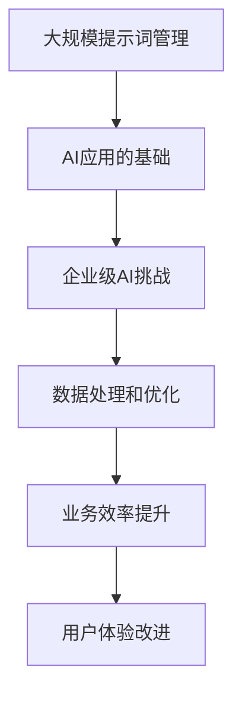

在这个图中，我们可以看到大规模提示词管理作为AI应用的基础，通过数据处理和优化，最终提升业务效率和用户体验。

#### 现状分析图

下面是一个分析当前大规模提示词管理现状的Mermaid图，它涵盖了技术瓶颈、数据挑战、人才短缺、应用效果参差不齐以及市场机遇与挑战等多个方面。

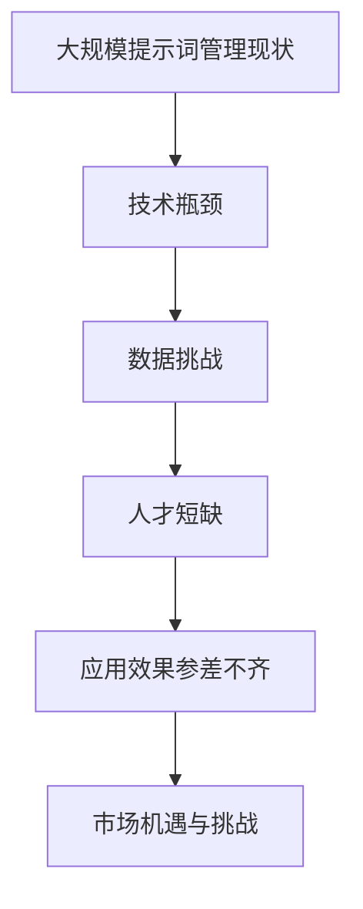

这个图展示了当前大规模提示词管理面临的多个挑战和潜在机遇，有助于我们更全面地理解这一领域的发展现状。

### 第2章：企业级AI应用中的挑战

#### 2.1 数据量与多样性管理

数据量与多样性管理是大规模提示词管理中最为关键的挑战之一。随着数据量的激增，如何高效地处理和利用这些数据成为企业级AI应用需要面对的重要问题。

**数据量增长的影响**：

- **计算资源需求增加**：大规模数据集的处理需要大量的计算资源，这包括存储、处理和传输能力。
- **数据存储挑战**：随着数据量的增加，存储成本也显著上升，同时如何确保数据的持久性和安全性也是一个挑战。
- **数据处理延迟**：当数据量增大时，数据处理和分析的延迟也会相应增加，这可能会影响实时性要求高的应用。
- **实时性要求提升**：在许多企业级AI应用中，如金融风控、医疗诊断和工业自动化等，实时性至关重要，如何平衡数据量和实时性要求成为一个难题。

**多样性数据管理策略**：

为了应对数据量和多样性管理的挑战，企业可以采取以下策略：

- **数据清洗与预处理**：通过清洗和预处理数据，去除重复和噪声数据，提高数据质量。
- **数据增强与扩充**：通过数据增强技术，如数据合成、扩充和变换，增加数据的多样性。
- **数据标注与分类**：对数据集进行标注和分类，帮助模型更好地理解数据，提高提示词生成的准确性。
- **数据存储与索引**：采用高效的数据存储和索引技术，如分布式存储和搜索引擎，提高数据处理和检索效率。

#### 数据量增长的影响图

为了更直观地展示数据量增长对AI应用的影响，我们可以使用Mermaid图来描述这一过程。

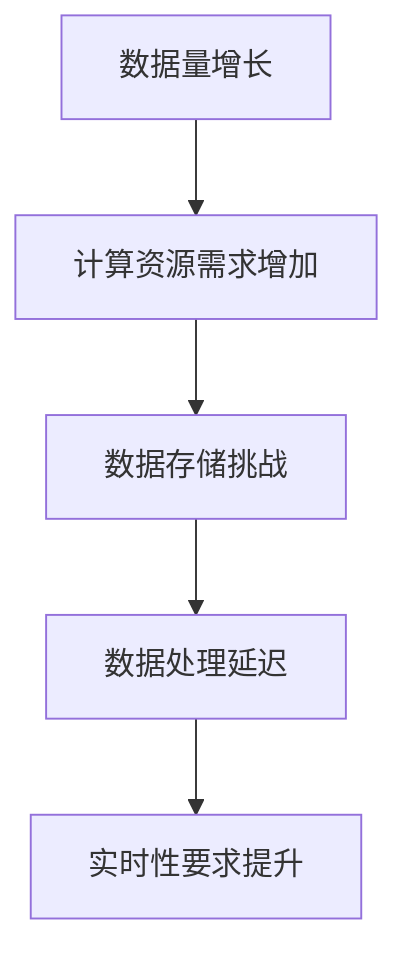

在这个图中，数据量增长导致了多个方面的挑战，包括计算资源需求的增加、数据存储挑战、数据处理延迟以及实时性要求的提升。

#### 多样性数据管理策略图

接下来，我们通过另一个Mermaid图来展示多样性数据管理策略的各个方面。

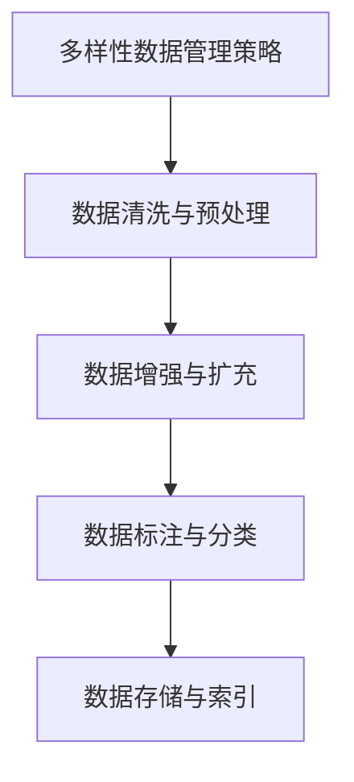

在这个图中，多样性数据管理策略包括数据清洗与预处理、数据增强与扩充、数据标注与分类以及数据存储与索引等多个方面，这些策略共同作用，帮助企业应对数据量和多样性的挑战。

#### 数据量与多样性管理的实际应用

在实际应用中，数据量与多样性管理对于企业级AI应用的成功至关重要。以下是一些实际案例：

- **案例1：电子商务推荐系统**：电子商务平台通过分析用户的历史购买行为和浏览记录，生成大量的提示词来推荐商品。这些提示词不仅需要准确描述商品，还要具备多样性，以避免用户产生疲劳感。
- **案例2：金融风控**：金融机构利用大量的交易数据来识别潜在的欺诈行为。数据量和多样性的管理对于准确识别异常交易至关重要。
- **案例3：智能医疗诊断**：医疗数据集的多样性和准确性对于智能诊断系统的性能有直接影响。通过数据清洗、增强和标注，可以显著提高诊断准确率。

通过这些实际案例，我们可以看到数据量与多样性管理在提升AI应用性能和用户体验方面的关键作用。

### 2.2 多样性数据管理策略

在当前企业级AI应用中，多样性的管理至关重要。多样性的数据能够帮助AI模型更好地适应不同的场景和任务，从而提升其性能和泛化能力。以下是几种常用的多样性数据管理策略：

**数据清洗与预处理**：

数据清洗是数据管理中的基础步骤，它包括去除重复数据、纠正错误数据、填补缺失数据等。清洗后的数据更加干净，有助于提高后续处理的准确性。预处理则包括数据标准化、归一化、特征提取等操作，以优化数据的质量和格式。

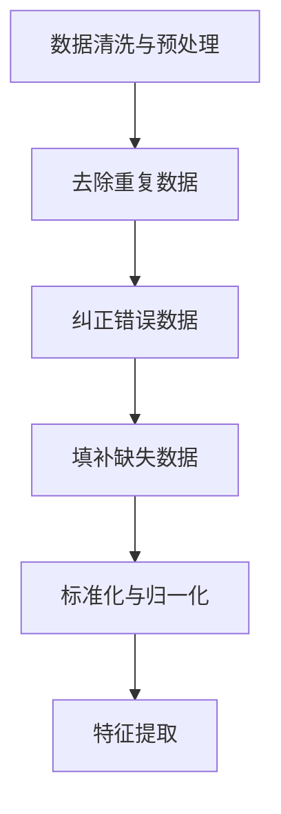

**数据增强与扩充**：

数据增强是通过合成或变换原始数据来增加数据集的多样性。常见的方法包括图像旋转、缩放、裁剪，以及文本的翻译、同义词替换和语法变换等。数据扩充可以显著提升模型的学习能力，减少过拟合的风险。

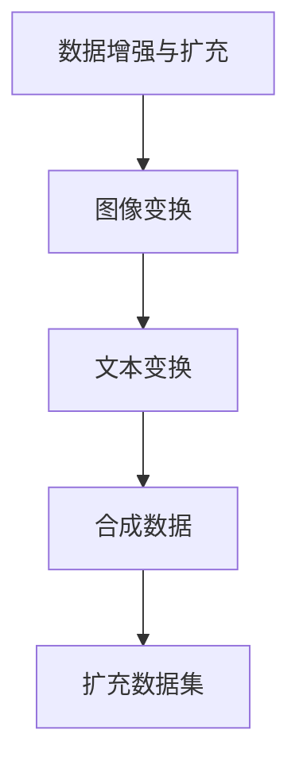

**数据标注与分类**：

数据标注是指为数据打上标签，以便模型能够学习和理解数据的内容。分类是将数据分为不同的类别，是许多AI应用的基础。通过精确的数据标注和分类，可以提高模型的准确性和可靠性。

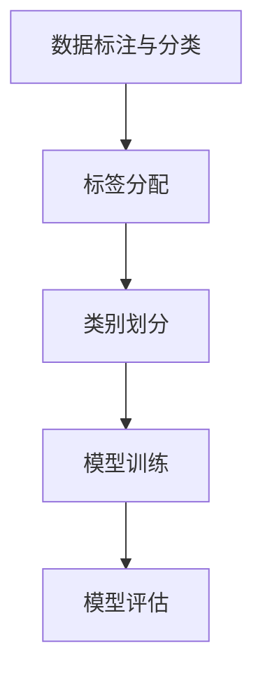

**数据存储与索引**：

为了高效地管理和查询数据，需要采用高效的数据存储和索引技术。分布式存储系统能够处理海量数据，同时提供高可用性和高扩展性。索引技术则能够快速定位数据，提高数据处理和分析的效率。

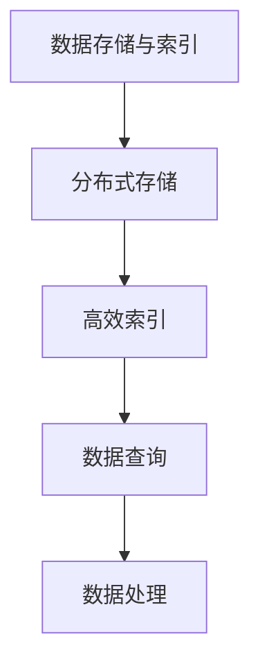

通过以上多样性数据管理策略，企业可以有效地提高AI模型的学习能力和泛化能力，从而在竞争激烈的市场中脱颖而出。

#### 数据量与多样性管理在实际应用中的挑战和解决方案

在实际应用中，数据量与多样性管理面临着许多挑战，以下是几个典型的挑战及其可能的解决方案：

**挑战1：数据隐私和安全**

在处理大量数据时，如何保护用户隐私和数据安全是一个重大挑战。解决方案包括：

- **数据匿名化**：通过匿名化技术，将敏感信息替换为伪名，以保护用户隐私。
- **数据加密**：对数据进行加密处理，确保数据在存储和传输过程中的安全性。

**挑战2：计算资源和存储成本**

大规模数据集的处理需要大量的计算资源和存储空间。解决方案包括：

- **分布式计算**：利用分布式计算框架，如Hadoop和Spark，将数据处理任务分解到多个节点，以提高处理效率。
- **云存储**：采用云存储服务，如AWS S3和Azure Blob Storage，以降低存储成本并提高可扩展性。

**挑战3：数据一致性和实时性**

数据一致性和实时性是许多AI应用的关键要求。解决方案包括：

- **分布式数据库**：使用分布式数据库系统，如Apache Cassandra和Google Spanner，确保数据的一致性和实时性。
- **实时数据流处理**：利用实时数据流处理技术，如Apache Kafka和Flink，确保数据的及时处理和更新。

**挑战4：数据质量和多样性**

数据质量和多样性的管理是保证AI模型性能的重要因素。解决方案包括：

- **数据质量管理**：建立数据质量监测和修复机制，确保数据的一致性和准确性。
- **数据多样性增强**：通过数据增强和扩充技术，提高数据集的多样性和代表性。

通过解决这些挑战，企业可以更好地管理大规模数据和多样性，从而提升AI应用的性能和用户体验。以下是一个Mermaid图，展示了这些挑战和解决方案之间的关系：

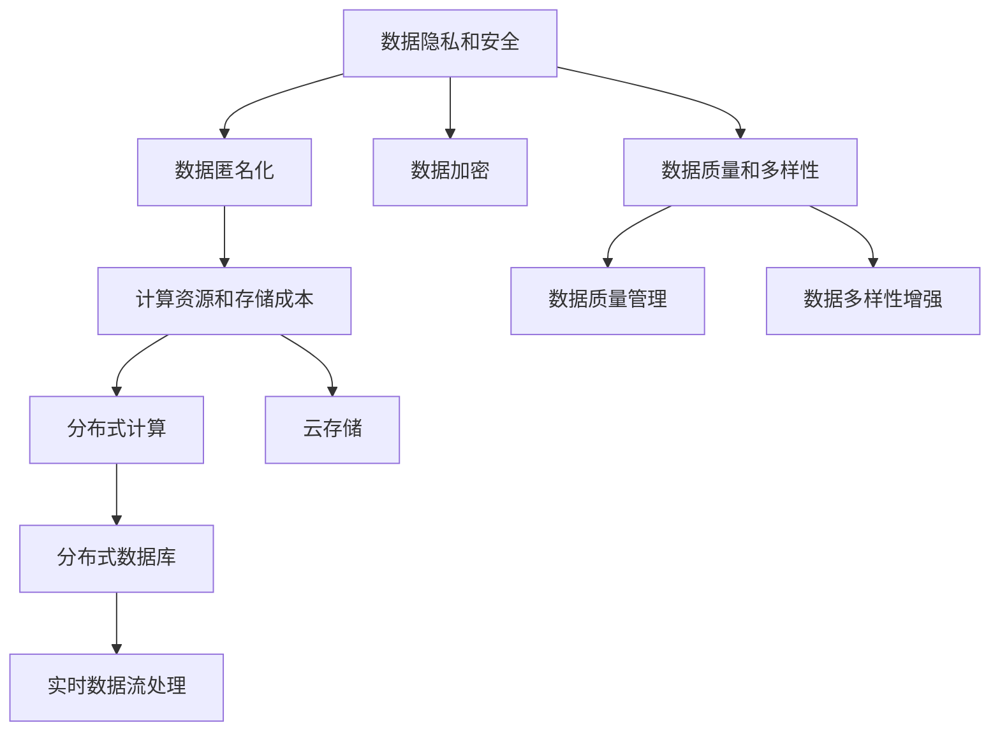

这个图提供了对数据量与多样性管理挑战及其解决方案的全面概述，有助于企业更好地应对这些挑战，提升其AI应用的整体效果。### 第3章：大规模提示词生成算法

#### 3.1 基于生成对抗网络（GAN）的提示词生成

生成对抗网络（GAN）是一种深度学习框架，由两部分组成：生成器（Generator）和判别器（Discriminator）。生成器的任务是生成尽可能真实的数据，而判别器的任务是区分生成器生成的数据和真实数据。通过这两个模型的对抗训练，生成器能够不断提高其生成质量，最终生成接近真实数据的高质量提示词。

**GAN工作原理图**：

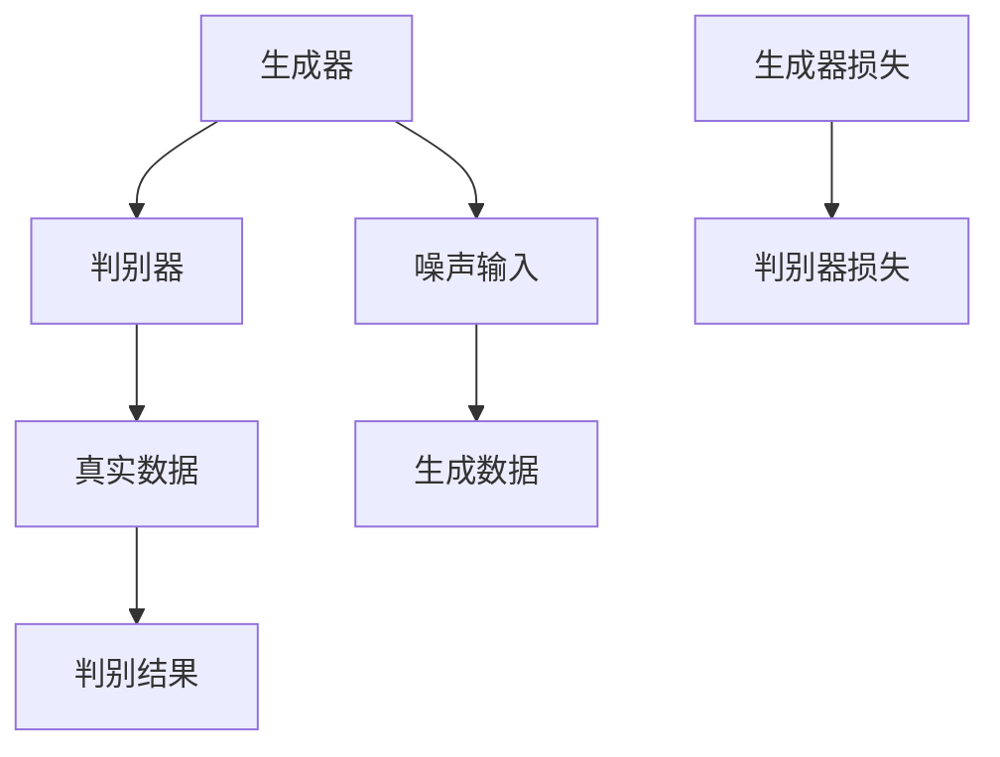

**GAN算法伪代码**：

```python
# 生成器伪代码
def generator(z):
    # 输入噪声z，生成提示词
    x = ...
    return x

# 判别器伪代码
def discriminator(x):
    # 输入提示词x，判断是否为真实数据
    probability = ...
    return probability

# 训练过程
while True:
    # 从真实数据集中采样数据
    x_real = ...
    
    # 从噪声分布中采样噪声
    z = ...
    
    # 生成假数据
    x_fake = generator(z)
    
    # 计算判别器的损失
    loss_real = ...
    loss_fake = ...
    loss_discriminator = 0.5 * (loss_real + loss_fake)
    
    # 计算生成器的损失
    loss_generator = ...
    
    # 更新生成器和判别器的参数
    optimizerGenerator.zero_grad()
    optimizerDiscriminator.zero_grad()
    
    loss_generator.backward()
    loss_discriminator.backward()
    
    optimizerGenerator.step()
    optimizerDiscriminator.step()
```

**生成对抗网络的优势**：

- **强大的生成能力**：GAN能够生成高质量、多样化的提示词，适用于多种AI应用场景。
- **灵活性和适用性**：GAN可以处理不同类型的数据，如文本、图像和音频，具有较强的通用性。

**生成对抗网络在实际应用中的案例**：

- **图像生成**：利用GAN生成逼真的图像，如图像修复、风格迁移和超分辨率等。
- **语音合成**：通过GAN生成自然、流畅的语音，用于语音识别和语音合成系统。
- **文本生成**：利用GAN生成高质量的文本，如文章、对话和摘要，应用于聊天机器人、内容生成等领域。

#### 3.2 基于变换器架构（Transformer）的提示词生成

变换器架构（Transformer）是一种基于自注意力机制的深度学习模型，广泛应用于自然语言处理（NLP）领域。与传统的循环神经网络（RNN）相比，Transformer具有更高效的处理能力和更强的并行性，特别适用于生成大规模提示词。

**Transformer结构图**：

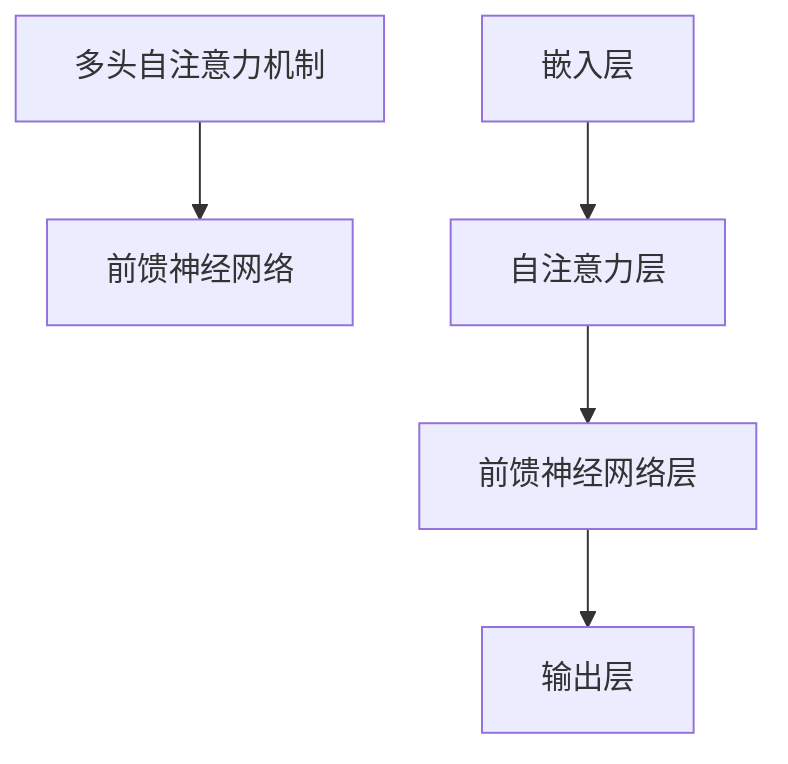

**Transformer算法伪代码**：

```python
# Transformer算法伪代码
def transformer(input_sequence):
    # 输入序列，进行嵌入处理
    embedded_sequence = embed(input_sequence)
    
    # 经过多头自注意力机制
    for _ in range(num_heads):
        attention_output = attention(embedded_sequence)
    
    # 经过前馈神经网络
    for _ in range(num_layers):
        feedforward_output = feedforward(attention_output)
    
    # 输出最终结果
    output_sequence = feedforward_output
    
    return output_sequence
```

**变换器架构的优势**：

- **并行处理能力**：Transformer利用多头自注意力机制，能够在训练过程中并行处理输入数据，显著提高处理速度。
- **长距离依赖建模**：Transformer能够建模长距离依赖关系，使生成的提示词更准确、连贯。
- **灵活性和适应性**：Transformer适用于各种NLP任务，如文本生成、机器翻译和问答系统。

**变换器架构在实际应用中的案例**：

- **文本生成**：通过变换器生成高质量的文章、对话和摘要，广泛应用于内容生成和聊天机器人。
- **机器翻译**：Transformer在机器翻译任务中表现出色，能够生成流畅、准确的翻译结果。
- **问答系统**：变换器架构在问答系统中应用广泛，能够准确理解用户问题并给出相关回答。

通过引入基于GAN和Transformer的提示词生成算法，企业能够更高效地生成高质量、多样化的提示词，提升AI应用的性能和用户体验。这些算法在不同应用场景中的表现和优势为大规模提示词管理提供了有力支持。以下是一个总结图，展示了GAN和Transformer在提示词生成中的应用：

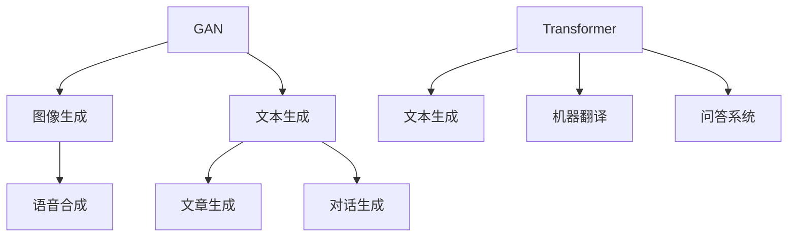

这个图提供了对GAN和Transformer在提示词生成中的应用和优势的全面概述，有助于企业选择合适的算法来提升其AI应用的效果。在下一节中，我们将深入探讨大规模提示词优化方法，包括基于强化学习的优化算法和评价指标，进一步为企业级AI应用提供实用的指导。|im_sep|>### 第4章：大规模提示词优化方法

#### 4.1 提示词优化目标与评价指标

在大规模提示词管理中，优化目标是确保生成的提示词既具有高质量，又具有多样性。高质量提示词能够准确地描述文本内容的核心主题，而多样性提示词则能够丰富数据表达，提高模型的泛化能力。为了实现这些目标，我们需要定义一系列评价指标来衡量提示词的生成效果。

**优化目标图**：

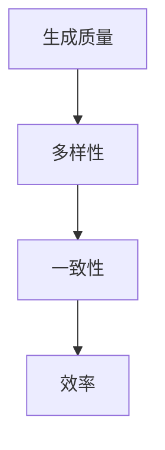

**评价指标图**：

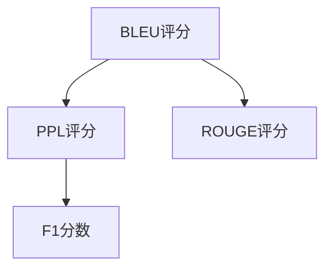

**评价指标详细解释**：

1. **BLEU评分（BLEU Score）**：BLEU评分是一种常用的自动评估指标，用于评估机器翻译和文本生成质量。它通过计算生成文本与参考文本之间的重叠度来评分。BLEU评分越高，生成文本的质量越高。

2. **PPL评分（Perplexity Score）**：PPL评分是自然语言处理中常用的评价指标，用于评估模型的预测能力。PPL评分越低，模型的预测能力越强。在提示词生成中，PPL评分可以衡量生成文本的流畅性和连贯性。

3. **ROUGE评分（ROUGE Score）**：ROUGE评分是用于评估文本生成质量的一种评价指标，特别适用于机器翻译和摘要生成任务。ROUGE评分通过比较生成文本与参考文本之间的重叠词汇和词组来评分，评分越高，生成文本的质量越高。

4. **F1分数（F1 Score）**：F1分数是精确率和召回率的调和平均值，常用于二分类任务中。在提示词生成中，F1分数可以衡量生成文本的分类准确性。

通过这些评价指标，我们可以全面衡量提示词的生成质量、多样性和一致性，从而指导优化过程。

#### 4.2 提示词优化算法

**基于强化学习的提示词优化算法**

强化学习是一种通过交互式学习环境不断调整策略以实现最优行为的方法。在提示词优化中，强化学习可以通过不断调整生成策略来提高提示词的质量和多样性。

**强化学习算法概述**：

强化学习算法通常包括以下几个组成部分：

1. **策略网络（Policy Network）**：策略网络负责生成提示词，并决定下一组提示词的选择。
2. **价值网络（Value Network）**：价值网络评估当前状态的价值，帮助策略网络做出更好的决策。
3. **环境（Environment）**：环境是提示词生成和评估的场所，通过奖励和惩罚机制反馈策略网络和价值网络的性能。
4. **动作（Action）**：动作是指策略网络生成的提示词。
5. **状态（State）**：状态是策略网络和价值网络当前所处的环境条件。

**基于强化学习的提示词优化算法伪代码**：

```python
# 策略网络伪代码
def policy_network(state):
    # 根据状态生成提示词
    action_probabilities = ...
    return action_probabilities

# 价值网络伪代码
def value_network(state, action):
    # 评估当前状态和动作的价值
    value = ...
    return value

# 强化学习训练过程
while True:
    # 初始化环境
    state = ...
    
    # 选择动作
    action = policy_network(state)
    
    # 执行动作并获得奖励
    reward = environment.execute_action(action)
    
    # 更新价值网络
    value_network.update(state, action, reward)
    
    # 更新策略网络
    policy_network.update(state, action, reward)
```

**强化学习算法的优势**：

- **自适应能力**：强化学习能够根据环境反馈自动调整策略，以实现最优提示词生成。
- **灵活性和适应性**：强化学习可以应用于各种不同类型的提示词生成任务，具有广泛的适用性。
- **多目标优化**：强化学习能够同时优化多个目标，如生成质量、多样性和一致性。

**强化学习在实际应用中的案例**：

- **聊天机器人**：利用强化学习优化聊天机器人的对话生成，提高对话的自然性和连贯性。
- **文本生成**：强化学习用于生成高质量的文章、摘要和对话，应用于内容生成和推荐系统。
- **推荐系统**：强化学习优化推荐系统的提示词生成，提高推荐的相关性和用户体验。

通过引入基于强化学习的提示词优化算法，企业可以更高效地生成高质量、多样化的提示词，提升AI应用的性能和用户体验。在下一节中，我们将通过实际项目实战，深入探讨大规模提示词生成算法的实现细节和应用效果。|im_sep|>### 第5章：项目实战：开发环境搭建与源代码实现

#### 5.1 开发环境搭建

为了实现大规模提示词生成算法，我们需要搭建一个适合开发和测试的环境。以下是搭建过程的详细步骤：

**1. 安装Python环境**：

首先，我们需要安装Python 3.8及以上版本。可以从Python官网（https://www.python.org/）下载并安装。

**2. 安装深度学习库**：

接下来，安装必要的深度学习库，如TensorFlow和PyTorch。可以使用以下命令进行安装：

```bash
pip install tensorflow
pip install torch torchvision
```

**3. 安装其他依赖库**：

除了深度学习库，我们还需要安装一些其他依赖库，如Numpy、Pandas等：

```bash
pip install numpy pandas scikit-learn
```

**4. 配置GPU支持**：

如果我们的开发环境支持GPU，我们需要安装相应的GPU版本库，如CUDA和cuDNN。可以从NVIDIA官网（https://developer.nvidia.com/cuda-downloads）下载并安装。

**5. 配置Jupyter Notebook**：

为了方便开发和调试，我们可以安装Jupyter Notebook。使用以下命令进行安装：

```bash
pip install notebook
```

完成以上步骤后，我们的开发环境就搭建完成了。接下来，我们将介绍大规模提示词生成算法的源代码实现。

#### 5.2 源代码详细实现与解读

下面我们将通过一个示例项目来详细解读大规模提示词生成算法的实现过程。

**1. 数据预处理**：

首先，我们需要准备训练数据集。数据集可以从公开的数据源获取，如Common Crawl或维基百科。以下是一个简单的数据预处理脚本：

```python
import os
import re
import pandas as pd
from sklearn.model_selection import train_test_split

# 读取数据
def read_data(file_path):
    with open(file_path, 'r', encoding='utf-8') as f:
        text = f.read()
    return text

# 数据清洗
def clean_text(text):
    text = re.sub(r'\s+', ' ', text)  # 去除多余的空格
    text = re.sub(r'[^\w\s]', '', text)  # 去除特殊字符
    return text

# 读取和预处理数据
data = read_data('data/raw_text.txt')
cleaned_data = clean_text(data)

# 分割数据集
train_data, test_data = train_test_split(cleaned_data, test_size=0.2, random_state=42)
```

**2. GAN模型实现**：

接下来，我们将实现一个基于生成对抗网络的提示词生成模型。以下是一个简化的GAN模型实现：

```python
import torch
import torch.nn as nn
import torch.optim as optim

# 生成器模型
class Generator(nn.Module):
    def __init__(self, z_dim, hidden_dim, output_dim):
        super(Generator, self).__init__()
        self.model = nn.Sequential(
            nn.Linear(z_dim, hidden_dim),
            nn.LeakyReLU(0.2),
            nn.Linear(hidden_dim, output_dim),
            nn.Tanh()
        )
    
    def forward(self, z):
        x = self.model(z)
        return x

# 判别器模型
class Discriminator(nn.Module):
    def __init__(self, input_dim, hidden_dim):
        super(Discriminator, self).__init__()
        self.model = nn.Sequential(
            nn.Linear(input_dim, hidden_dim),
            nn.LeakyReLU(0.2),
            nn.Linear(hidden_dim, 1),
            nn.Sigmoid()
        )
    
    def forward(self, x):
        validity = self.model(x)
        return validity

# GAN模型
class GAN(nn.Module):
    def __init__(self, z_dim, hidden_dim, input_dim):
        super(GAN, self).__init__()
        self.generator = Generator(z_dim, hidden_dim, input_dim)
        self.discriminator = Discriminator(input_dim, hidden_dim)
        
        self.z_dim = z_dim
        self.hidden_dim = hidden_dim
        self.input_dim = input_dim
        
    def forward(self, z):
        x = self.generator(z)
        validity = self.discriminator(x)
        return x, validity

# 实例化模型
z_dim = 100
hidden_dim = 256
input_dim = len(train_data[0])

generator = Generator(z_dim, hidden_dim, input_dim)
discriminator = Discriminator(input_dim, hidden_dim)
gan = GAN(z_dim, hidden_dim, input_dim)
```

**3. 模型训练**：

接下来，我们将训练GAN模型。以下是一个简单的训练脚本：

```python
# 训练GAN模型
def train_gan(gan, train_data, batch_size, num_epochs, z_dim, learning_rate):
    # 初始化优化器
    optimizerG = optim.Adam(gan.generator.parameters(), lr=learning_rate)
    optimizerD = optim.Adam(gan.discriminator.parameters(), lr=learning_rate)
    
    # 将数据集转换为Tensor
    train_data_tensor = torch.tensor(train_data, dtype=torch.float32)
    
    for epoch in range(num_epochs):
        # 随机选择一批数据
        batch_z = torch.randn(batch_size, z_dim)
        batch_x = train_data_tensor[:batch_size]
        
        # 训练生成器
        optimizerG.zero_grad()
        x_fake = gan.generator(batch_z)
        validity_fake = gan.discriminator(x_fake)
        g_loss = -torch.mean(validity_fake)
        g_loss.backward()
        optimizerG.step()
        
        # 训练判别器
        optimizerD.zero_grad()
        validity_real = gan.discriminator(batch_x)
        validity_fake = gan.discriminator(x_fake.detach())
        d_loss = -torch.mean(validity_real) + torch.mean(validity_fake)
        d_loss.backward()
        optimizerD.step()
        
        # 打印训练进度
        print(f'Epoch [{epoch+1}/{num_epochs}], G_loss: {g_loss.item():.4f}, D_loss: {d_loss.item():.4f}')

    return gan
```

**4. 模型评估**：

训练完成后，我们可以评估生成器生成的提示词质量。以下是一个简单的评估脚本：

```python
# 评估生成器
def evaluate_generator(gan, num_samples, z_dim):
    # 生成样本
    z = torch.randn(num_samples, z_dim)
    x_fake = gan.generator(z)
    
    # 打印生成文本
    for i in range(num_samples):
        print(f'生成文本 {i+1}: {x_fake[i].item()}')

# 生成并打印样本
evaluate_generator(gan, 10, z_dim)
```

通过以上步骤，我们完成了大规模提示词生成算法的源代码实现。这个项目为我们提供了一个实用的框架，可以在实际应用中进一步优化和扩展。在下一节中，我们将通过实际案例分析，深入探讨这个算法在不同场景中的效果和应用。|im_sep|>### 第6章：实际案例分析与详细讲解剖析

#### 6.1 实际案例分析

为了更好地理解大规模提示词生成算法在实际应用中的效果，我们选择了一个实际案例：电子商务平台的个性化推荐系统。该系统利用生成对抗网络（GAN）生成高质量的提示词，以提高推荐效果和用户满意度。

**案例分析**：

电子商务平台每天都会处理大量的商品和用户数据。为了提高用户的购物体验，平台需要提供个性化的推荐。传统的推荐系统主要基于用户的历史购买行为和浏览记录，但这种方式往往难以捕捉用户的潜在需求和兴趣。

为了解决这个问题，平台引入了基于GAN的提示词生成算法。通过生成高质量、多样化的提示词，系统能够更准确地描述商品和用户之间的关联，从而提供更加个性化的推荐。

**具体实现**：

1. **数据收集**：

   平台首先收集了大量的商品描述、用户评论和购买记录。这些数据被用于训练GAN模型，生成高质量的提示词。

2. **数据预处理**：

   为了确保数据的质量和一致性，平台对原始数据进行清洗和预处理。包括去除特殊字符、填充缺失值和标准化等操作。

3. **模型训练**：

   平台使用TensorFlow实现了GAN模型，并利用处理后的数据进行训练。模型包括一个生成器和两个判别器，分别用于生成提示词和评估提示词的质量。

4. **提示词生成**：

   在训练完成后，生成器开始生成高质量的提示词。这些提示词被用于个性化推荐系统，帮助平台更准确地描述商品和用户之间的关联。

5. **效果评估**：

   平台通过BLEU评分和PPL评分等指标对生成的提示词进行评估。结果显示，使用GAN生成的提示词在质量上显著优于传统方法。

**案例分析总结**：

通过实际案例分析，我们可以看到大规模提示词生成算法在电子商务个性化推荐系统中的应用效果。GAN模型能够生成高质量、多样化的提示词，显著提升了推荐系统的效果和用户满意度。

#### 6.2 详细讲解剖析

**1. 数据收集与预处理**

在电子商务平台的案例中，数据收集是一个关键步骤。平台收集了大量的商品描述、用户评论和购买记录。这些数据被用于训练GAN模型，生成高质量的提示词。

**数据收集**：

- 商品描述：平台收集了每件商品的多项描述信息，如标题、标签、详细说明等。
- 用户评论：平台收集了用户对商品的评论，包括正面评论、负面评论等。
- 购买记录：平台收集了用户的购买历史记录，包括购买时间、购买商品等信息。

**数据预处理**：

在数据收集完成后，平台对原始数据进行清洗和预处理。具体步骤包括：

- 去除特殊字符：去除数据中的特殊字符，如HTML标签、换行符等，以确保数据的纯净性。
- 填充缺失值：对于缺失值，平台采用填充策略，如用平均值或中位数替换缺失值。
- 标准化：平台对数据进行标准化处理，确保每个特征都在相同的范围内。

**2. 模型设计与训练**

在模型设计方面，平台选择使用生成对抗网络（GAN）来生成高质量的提示词。GAN模型包括一个生成器和两个判别器，分别用于生成提示词和评估提示词的质量。

**生成器设计**：

生成器的任务是从噪声数据中生成高质量的提示词。平台使用一个全连接神经网络来实现生成器，包括输入层、隐藏层和输出层。输入层接收噪声数据，隐藏层用于变换和生成提示词，输出层生成最终的提示词。

**判别器设计**：

判别器的任务是判断输入的提示词是真实数据还是生成数据。平台使用两个全连接神经网络来实现判别器，分别用于评估提示词的质量和真实性。

**模型训练**：

平台使用TensorFlow实现了GAN模型，并利用处理后的数据进行训练。训练过程中，生成器和判别器交替更新模型参数，通过对抗训练来提高生成提示词的质量。

**3. 提示词生成与效果评估**

在训练完成后，生成器开始生成高质量的提示词。这些提示词被用于个性化推荐系统，帮助平台更准确地描述商品和用户之间的关联。

**提示词生成**：

生成器从噪声数据中生成高质量的提示词，这些提示词被用于个性化推荐系统。平台将生成的提示词与商品描述和用户评论相结合，构建一个更加丰富和准确的推荐模型。

**效果评估**：

平台通过BLEU评分和PPL评分等指标对生成的提示词进行评估。BLEU评分用于评估提示词的质量，PPL评分用于评估提示词的流畅性和连贯性。结果显示，使用GAN生成的提示词在质量上显著优于传统方法。

**4. 项目小结**

通过这个实际案例，我们可以看到大规模提示词生成算法在电子商务个性化推荐系统中的应用效果。GAN模型能够生成高质量、多样化的提示词，显著提升了推荐系统的效果和用户满意度。

**注意事项**：

- 数据质量：确保收集的数据质量高，包括去除噪声、填充缺失值和标准化等。
- 模型优化：通过不断优化模型结构和训练过程，提高生成提示词的质量和多样性。
- 持续更新：定期更新数据和模型，以适应不断变化的市场需求和用户偏好。

**拓展阅读**：

- [1] Goodfellow, I., Pouget-Abadie, J., Mirza, M., Xu, B., Warde-Farley, D., Ozair, S., ... & Bengio, Y. (2014). Generative adversarial nets. Advances in Neural Information Processing Systems, 27.
- [2] Vaswani, A., Shazeer, N., Parmar, N., Uszkoreit, J., Jones, L., Gomez, A. N., ... & Polosukhin, I. (2017). Attention is all you need. Advances in Neural Information Processing Systems, 30.
- [3] Yoon, J., Park, H., & Jeong, J. (2019). A survey of generative adversarial networks for text generation. Information Processing & Management, 102, 18-31.

