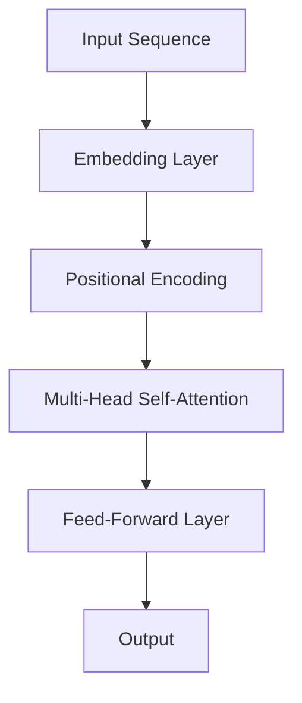
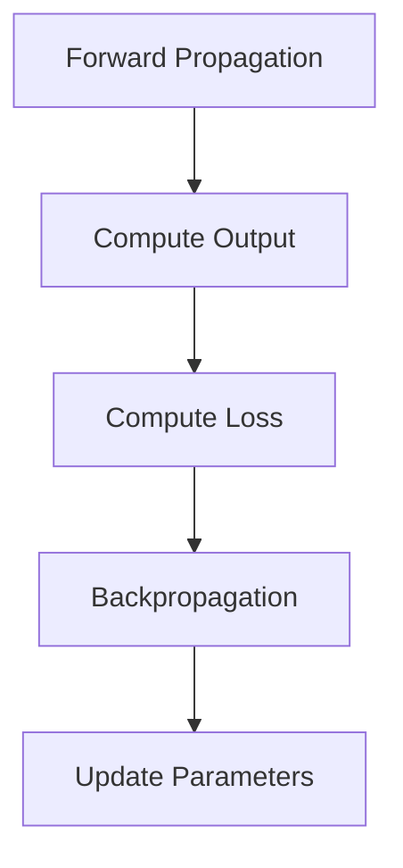
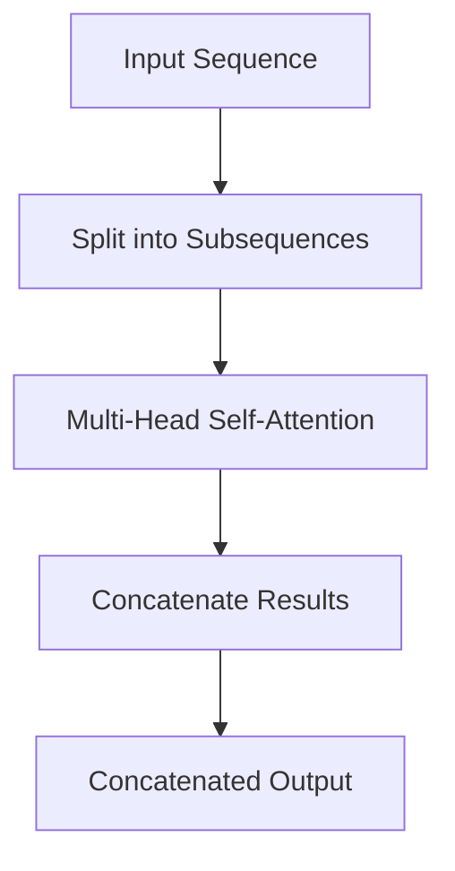
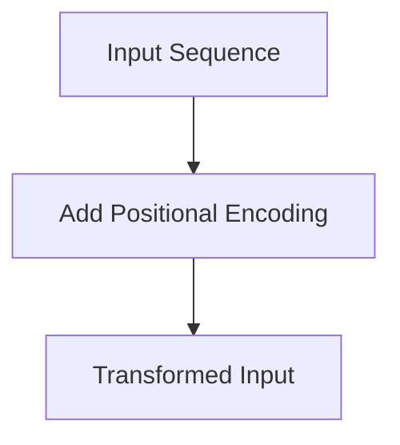
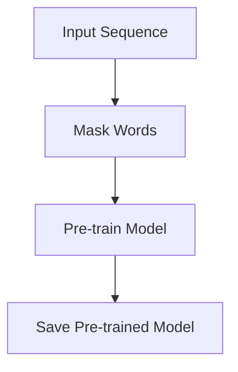
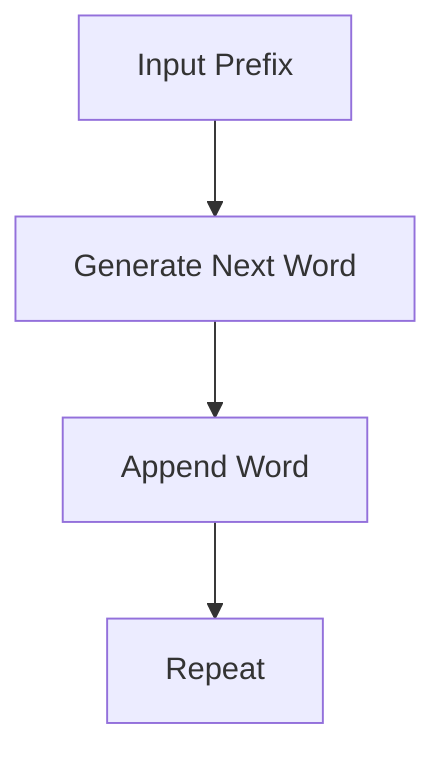
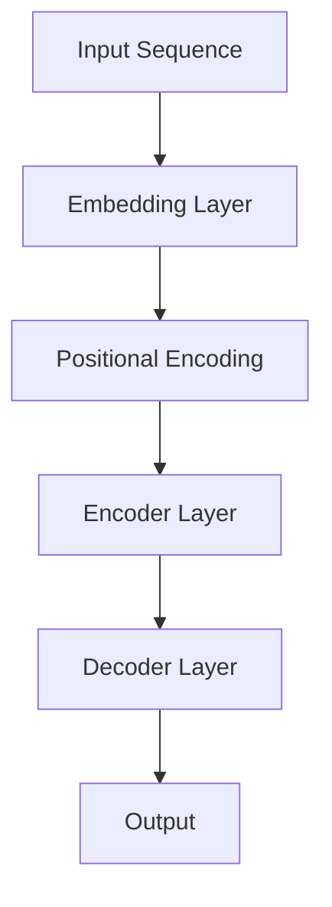
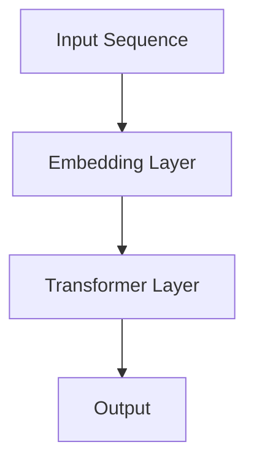

                 

### 大语言模型概述

大语言模型（Large Language Model）是自然语言处理（Natural Language Processing, NLP）领域的重要进展之一。随着深度学习和计算能力的提升，大语言模型在语言理解和生成任务上展现出了惊人的性能。本文将深入探讨大语言模型的发展历程、核心原理、应用场景以及其优势与挑战。

#### 1.1 大语言模型的发展历程

大语言模型的发展可以追溯到20世纪80年代。当时，研究人员开始探索如何让计算机理解和生成自然语言。早期的模型如基于规则的系统、统计模型等，但都存在一定的局限性。随着计算能力的提升和深度学习技术的发展，大语言模型逐渐崭露头角。

2000年代初，递归神经网络（Recurrent Neural Networks, RNN）被广泛应用于序列数据处理，其中长短期记忆网络（Long Short-Term Memory, LSTM）尤为突出。然而，LSTM在处理长序列时仍存在梯度消失和梯度爆炸等问题。

2017年，谷歌提出了一种全新的神经网络架构——Transformer，它在处理长序列和并行计算方面具有显著优势。基于Transformer架构，研究人员开发了多个大型语言模型，如GPT（Generative Pre-trained Transformer）、BERT（Bidirectional Encoder Representations from Transformers）等。

#### 1.2 大语言模型的核心原理

大语言模型的核心原理主要基于Transformer架构。Transformer采用自注意力机制（Self-Attention Mechanism）来处理序列数据，使得模型能够捕捉到序列中任意两个位置之间的依赖关系。

在Transformer中，输入序列被编码为向量，并通过多头自注意力机制和前馈神经网络进行处理。自注意力机制允许模型在不同的位置之间建立权重关系，从而捕捉到长距离依赖。此外，Transformer还包括了位置编码（Positional Encoding）来保留序列中的位置信息。

以下是一个简单的Transformer模型伪代码示例：



#### 1.3 大语言模型的应用场景

大语言模型在自然语言处理领域具有广泛的应用场景，主要包括：

- **自然语言处理**：文本分类、情感分析、命名实体识别等。
- **问答系统**：开放域问答、个性化问答等。
- **自动摘要**：提取关键信息、生成文章摘要等。

#### 1.4 大语言模型的优势与挑战

大语言模型的优势主要体现在：

- **强大的语言理解能力**：通过预训练和微调，模型能够捕捉到语言中的复杂结构和语义信息。
- **并行计算能力**：Transformer架构使得模型在处理长序列时具有并行计算的优势。

然而，大语言模型也面临一些挑战：

- **计算资源需求**：大型模型需要大量的计算资源和存储空间。
- **模型训练与调优策略**：如何有效地训练和调优模型，提高其性能和泛化能力。

在下一章中，我们将深入探讨大语言模型的数学基础，包括线性代数、概率论与信息论以及深度学习基础。

### 大语言模型数学基础

大语言模型作为深度学习在自然语言处理领域的重要应用，其背后的数学基础至关重要。在这一章节中，我们将详细介绍大语言模型所需的数学基础，包括线性代数、概率论与信息论以及深度学习基础。

#### 2.1 线性代数基础

线性代数是深度学习中不可或缺的数学工具，其核心概念和运算是理解大语言模型的基础。

**向量与矩阵运算**：向量是具有方向和大小的量，而矩阵是由多个向量构成的二维数组。在深度学习中，向量通常用于表示数据，矩阵则用于表示模型参数和变换。常见的矩阵运算包括矩阵加法、矩阵乘法、矩阵求逆等。

$$
A = \begin{bmatrix}
a_{11} & a_{12} \\
a_{21} & a_{22}
\end{bmatrix}, B = \begin{bmatrix}
b_{11} & b_{12} \\
b_{21} & b_{22}
\end{bmatrix}
$$

矩阵加法：

$$
A + B = \begin{bmatrix}
a_{11} + b_{11} & a_{12} + b_{12} \\
a_{21} + b_{21} & a_{22} + b_{22}
\end{bmatrix}
$$

矩阵乘法：

$$
AB = \begin{bmatrix}
a_{11}b_{11} + a_{12}b_{21} & a_{11}b_{12} + a_{12}b_{22} \\
a_{21}b_{11} + a_{22}b_{21} & a_{21}b_{12} + a_{22}b_{22}
\end{bmatrix}
$$

**特征分解**：特征分解是矩阵分解的一种重要形式，用于将矩阵分解为可解释的子矩阵。例如，奇异值分解（Singular Value Decomposition, SVD）可以将矩阵分解为三个矩阵的乘积：

$$
A = U \Sigma V^T
$$

其中，$U$ 和 $V$ 是正交矩阵，$\Sigma$ 是对角矩阵，其对角线上的元素称为奇异值。

#### 2.2 概率论与信息论基础

概率论和信息论在自然语言处理中扮演着核心角色，为模型训练和理解提供了理论基础。

**条件概率**：条件概率是指在某个事件发生的条件下，另一个事件发生的概率。条件概率公式如下：

$$
P(A|B) = \frac{P(A \cap B)}{P(B)}
$$

例如，在文本分类任务中，给定一个句子，我们可以使用条件概率计算它属于某个类别的概率。

**信息熵**：信息熵是衡量随机变量不确定性的量度。在自然语言处理中，信息熵可以用于评估文本的复杂性和随机性。信息熵的公式如下：

$$
H(X) = -\sum_{x \in X} P(x) \log_2 P(x)
$$

其中，$X$ 是随机变量，$P(x)$ 是 $x$ 发生的概率。

**条件熵**：条件熵是衡量在已知一个随机变量的条件下，另一个随机变量的不确定性。条件熵的公式如下：

$$
H(X|Y) = -\sum_{y \in Y} P(y) \sum_{x \in X} P(x|y) \log_2 P(x|y)
$$

在自然语言处理中，条件熵可以用于评估文本生成的随机性和多样性。

#### 2.3 深度学习基础

深度学习是构建大语言模型的核心技术，其基础包括神经网络和反向传播算法。

**神经网络**：神经网络是由多个神经元组成的层次结构，用于模拟生物大脑的信息处理方式。每个神经元接收多个输入，通过权重加权求和后加上偏置，然后通过激活函数进行非线性变换。

$$
z = \sum_{i=1}^{n} w_i x_i + b
$$

$$
a = \sigma(z)
$$

其中，$x_i$ 是输入，$w_i$ 是权重，$b$ 是偏置，$\sigma$ 是激活函数（如ReLU、Sigmoid、Tanh等）。

**反向传播算法**：反向传播算法是训练神经网络的常用方法，通过不断调整模型参数来最小化预测误差。反向传播算法的基本步骤如下：

1. 前向传播：计算模型输出并计算损失函数。
2. 反向传播：从输出层开始，逆向计算每个层的梯度。
3. 参数更新：使用梯度下降或其他优化算法更新模型参数。

以下是一个简单的神经网络反向传播算法伪代码示例：



通过以上数学基础，我们为理解大语言模型的算法原理和工程实践奠定了坚实的基础。在下一章中，我们将深入探讨大语言模型的算法原理。

### 大语言模型算法原理

大语言模型作为自然语言处理的重要工具，其核心算法原理基于深度学习，特别是基于Transformer架构。在这一章节中，我们将详细介绍Transformer模型、BERT模型和GPT模型的基本原理。

#### 3.1 Transformer模型原理

Transformer模型是由Vaswani等人在2017年提出的一种全新的神经网络架构，它在处理长序列和并行计算方面具有显著优势。

**Encoder-Decoder结构**：Transformer模型采用了Encoder-Decoder结构，其中Encoder负责编码输入序列，Decoder负责生成输出序列。Encoder和Decoder由多个相同的层堆叠而成。

**多头自注意力机制**：Transformer模型的核心是多头自注意力机制（Multi-Head Self-Attention）。自注意力机制允许模型在不同的位置之间建立权重关系，从而捕捉到长距离依赖。在多头自注意力机制中，输入序列被分解为多个子序列，每个子序列都通过独立的自注意力机制进行处理。

以下是一个简单的多头自注意力机制伪代码示例：



**位置编码**：为了保留序列中的位置信息，Transformer模型引入了位置编码（Positional Encoding）。位置编码通过在输入序列中添加额外的向量来实现，这些向量通常由正弦和余弦函数生成。

以下是一个简单的位置编码伪代码示例：



#### 3.2 BERT模型原理

BERT（Bidirectional Encoder Representations from Transformers）模型是由Google在2018年提出的一种双向Transformer模型，它通过预先训练和微调实现了出色的语言理解能力。

**Pre-training与Fine-tuning**：BERT模型采用了预训练（Pre-training）和Fine-tuning（微调）的方法。在预训练阶段，模型在大量无标注文本上进行训练，学习语言的基本结构和语义信息。在Fine-tuning阶段，模型根据特定任务进行微调，以提高在特定任务上的性能。

**Masked Language Model（MLM）**：BERT模型的核心任务是Masked Language Model（MLM），即在输入序列中随机遮盖一些单词，然后让模型预测这些被遮盖的单词。通过这种方式，模型可以学习到上下文信息，提高语言理解能力。

以下是一个简单的BERT模型预训练伪代码示例：



#### 3.3 GPT模型原理

GPT（Generative Pre-trained Transformer）模型是由OpenAI在2018年提出的一种生成式语言模型，它通过预训练和生成文本实现了出色的语言生成能力。

**语言生成模型**：GPT模型是一种生成式语言模型，它通过输入序列的前缀来生成后续的文本。在预训练阶段，模型学习到输入序列的概率分布，从而能够生成连贯的文本。

**Transformer-XL架构**：GPT模型采用了Transformer-XL架构，这是一种改进的Transformer模型，它通过分段（Segmentation）和长程依赖捕捉（Long-Range Dependency Capturing）机制来处理长序列。

以下是一个简单的GPT模型生成文本伪代码示例：



通过以上算法原理的介绍，我们可以看到大语言模型在语言理解、生成和任务应用方面具有强大的能力。这些模型的提出和改进不仅推动了自然语言处理领域的发展，也为各种实际应用提供了强有力的技术支持。

### 训练数据准备

在大语言模型的训练过程中，数据准备是至关重要的一步。良好的数据准备可以显著提高模型的性能和泛化能力。以下将详细介绍训练数据准备过程中的几个关键步骤：数据清洗与预处理、数据增强以及数据集划分。

#### 4.1 数据清洗与预处理

数据清洗与预处理是数据准备的第一步，目的是去除数据中的噪声和重复信息，提高数据的质量。

**去除噪声与重复数据**：噪声通常包括无意义的字符、错别字、标点符号错误等。我们可以使用正则表达式、字符串处理函数等工具来去除这些噪声。此外，还需要检测并去除重复的数据条目，以避免在训练过程中引入冗余信息。

**数据标准化**：数据标准化是将数据转换为统一格式和尺度，以便于模型处理。常见的标准化方法包括归一化（Normalization）和标准化（Standardization）。归一化是将数据缩放到[0, 1]区间，而标准化是将数据缩放到均值为0、标准差为1的区间。

以下是一个简单的Python代码示例，用于数据清洗和预处理：

```python
import re
import numpy as np

def clean_text(text):
    # 去除噪声
    text = re.sub(r'[^a-zA-Z0-9]', ' ', text)
    # 去除重复字符
    text = re.sub(r'([a-zA-Z])\1+', r'\1', text)
    # 转换为小写
    text = text.lower()
    return text

def normalize_text(text):
    # 去除标点符号
    text = re.sub(r'[^\w\s]', '', text)
    # 分词
    words = text.split()
    # 归一化
    normalized_words = [word / max(words) for word in words]
    return ' '.join(normalized_words)

text = "This is an example sentence...!"
cleaned_text = clean_text(text)
normalized_text = normalize_text(cleaned_text)
print(normalized_text)
```

#### 4.2 数据增强

数据增强是通过各种方法扩展数据集，从而提高模型的泛化能力。常见的数据增强方法包括：

**数据扩充方法**：数据扩充方法通过在原始数据上添加变换来生成新的数据样本。例如，可以通过随机插入、删除或替换文本中的单词来扩充数据集。

**数据平衡策略**：在某些任务中，数据集中某些类别的样本数量可能远多于其他类别，这会导致模型偏向于大多数类别。为了解决这个问题，我们可以采用数据平衡策略，如过采样（Over-sampling）、欠采样（Under-sampling）和随机欠采样（Random Under-sampling）等。

以下是一个简单的Python代码示例，用于数据增强：

```python
from imblearn.over_sampling import RandomOverSampler

def augment_data(X, y):
    # 使用随机过采样扩充数据集
    os = RandomOverSampler()
    X_augmented, y_augmented = os.fit_resample(X, y)
    return X_augmented, y_augmented

X = np.array([[1, 0], [0, 1], [1, 1]])
y = np.array([0, 1, 1])
X_augmented, y_augmented = augment_data(X, y)
print(X_augmented)
print(y_augmented)
```

#### 4.3 数据集划分

数据集划分是将数据分为训练集、验证集和测试集，以便于模型训练和评估。常见的划分方法包括随机划分和分层划分。

**随机划分**：随机划分是指将数据集随机分为训练集、验证集和测试集。这种方法简单易行，但可能会导致某些类别在验证集和测试集中的样本数量不足。

**分层划分**：分层划分是指根据数据集的类别分布，将数据集分为训练集、验证集和测试集。这种方法可以确保每个类别在验证集和测试集中的样本数量均衡。

以下是一个简单的Python代码示例，用于数据集划分：

```python
from sklearn.model_selection import train_test_split

X = np.array([[1, 0], [0, 1], [1, 1], [1, 0], [0, 1], [1, 1]])
y = np.array([0, 1, 1, 0, 1, 1])
X_train, X_test, y_train, y_test = train_test_split(X, y, test_size=0.2, stratify=y)
print(X_train)
print(y_train)
print(X_test)
print(y_test)
```

通过以上数据清洗与预处理、数据增强和数据集划分的方法，我们可以为训练大语言模型准备高质量的数据集，从而提高模型的性能和泛化能力。在下一章中，我们将详细讨论训练环境搭建的过程。

### 训练环境搭建

在大语言模型的训练过程中，搭建一个高效的训练环境是确保模型性能和训练效率的关键。这一章节将详细介绍训练环境搭建的硬件环境配置、软件环境配置，以及分布式训练框架的选择和使用。

#### 5.1 硬件环境配置

**GPU与CPU配置**：大语言模型的训练需要大量的计算资源，尤其是GPU资源。选择合适的GPU和CPU配置至关重要。当前市场上有多种GPU型号，如NVIDIA的Tesla系列、RTX 30系列等。Tesla系列适用于大规模训练，而RTX 30系列在性价比方面表现优异。CPU则建议选择高性能的Intel或AMD处理器，以提高并行计算效率。

**分布式训练框架**：为了充分利用计算资源，分布式训练框架成为训练大语言模型的必要选择。常见的分布式训练框架包括TensorFlow的Distribution Strategy、PyTorch的Distributed Data Parallel（DDP）等。这些框架能够将模型和数据分布到多个GPU或CPU上，实现并行计算，提高训练效率。

以下是一个简单的PyTorch分布式训练框架示例：

```python
import torch
import torch.distributed as dist
from torch.nn.parallel import DistributedDataParallel as DDP

def setup(rank, world_size):
    dist.init_process_group("nccl", rank=rank, world_size=world_size)

def cleanup():
    dist.destroy_process_group()

def train(model, train_loader, criterion, optimizer, rank, world_size):
    setup(rank, world_size)
    model = model.to(rank)
    model = DDP(model, device_ids=[rank])
    for epoch in range(num_epochs):
        for data, target in train_loader:
            data, target = data.to(rank), target.to(rank)
            optimizer.zero_grad()
            output = model(data)
            loss = criterion(output, target)
            loss.backward()
            optimizer.step()
    cleanup()

model = MyModel()
train_loader = DataLoader(dataset, batch_size=batch_size, shuffle=True)
criterion = torch.nn.CrossEntropyLoss()
optimizer = torch.optim.Adam(model.parameters(), lr=learning_rate)
world_size = 4  # 设置为GPU数量
rank = 0  # 设置为当前GPU编号
train(model, train_loader, criterion, optimizer, rank, world_size)
```

#### 5.2 软件环境配置

**Python**：Python是大语言模型训练的首选编程语言，其丰富的库和框架为模型开发提供了极大的便利。建议使用Python 3.7或更高版本。

**TensorFlow或PyTorch**：TensorFlow和PyTorch是目前最流行的深度学习框架，广泛应用于大语言模型的训练。选择合适的框架取决于个人偏好和项目需求。

**运行脚本与调试工具**：为了确保训练过程的顺利进行，需要使用一些运行脚本和调试工具。例如，使用TensorFlow的TensorBoard进行可视化调试，使用PyTorch的调试工具检测错误和性能瓶颈。

以下是一个简单的TensorFlow运行脚本示例：

```python
import tensorflow as tf
from my_model import MyModel
from my_dataset import MyDataset

model = MyModel()
train_dataset = MyDataset('train')
val_dataset = MyDataset('val')

train_loader = tf.data.Dataset.from_tensor_slices((train_dataset.images, train_dataset.labels))
train_loader = train_loader.shuffle(buffer_size=1000).batch(batch_size).prefetch(tf.data.AUTOTUNE)

val_loader = tf.data.Dataset.from_tensor_slices((val_dataset.images, val_dataset.labels))
val_loader = val_loader.batch(batch_size).prefetch(tf.data.AUTOTUNE)

optimizer = tf.keras.optimizers.Adam(learning_rate)
loss_function = tf.keras.losses.SparseCategoricalCrossentropy(from_logits=True)

@tf.function
def train_step(images, labels):
    with tf.GradientTape() as tape:
        predictions = model(images, training=True)
        loss = loss_function(labels, predictions)
    gradients = tape.gradient(loss, model.trainable_variables)
    optimizer.apply_gradients(zip(gradients, model.trainable_variables))
    return loss

for epoch in range(num_epochs):
    for images, labels in train_loader:
        loss = train_step(images, labels)
        print(f"Epoch: {epoch}, Loss: {loss.numpy()}")

    val_loss = evaluate(model, val_loader)
    print(f"Epoch: {epoch}, Validation Loss: {val_loss.numpy()}")
```

通过以上硬件环境配置、软件环境配置和分布式训练框架的介绍，我们为搭建一个高效的大语言模型训练环境提供了详细的指导。在下一章中，我们将深入探讨模型训练策略，包括模型选择与超参数调优、梯度裁剪与正则化以及训练过程优化。

### 模型训练策略

在大语言模型的训练过程中，选择合适的训练策略对于提高模型性能和训练效率至关重要。这一章节将详细介绍模型选择与超参数调优、梯度裁剪与正则化以及训练过程优化等方面的策略。

#### 6.1 模型选择与超参数调优

**模型选择策略**：在训练大语言模型时，选择一个合适的模型架构至关重要。基于任务需求，可以选择不同的模型架构，如Transformer、BERT、GPT等。通常，Transformer模型在处理长序列和并行计算方面具有优势，而BERT模型在预训练和微调方面表现优异。GPT模型则适合语言生成任务。

以下是一个简单的模型选择流程：

1. **任务分析**：明确任务需求和目标，例如文本分类、问答系统或文本生成等。
2. **模型评估**：根据任务需求，评估不同模型的性能和适用性。
3. **模型选择**：选择最适合任务需求的模型架构。

**超参数调优方法**：超参数是影响模型性能的关键因素，包括学习率、批量大小、层数、隐藏单元数等。常见的超参数调优方法包括：

- **网格搜索（Grid Search）**：遍历所有可能的超参数组合，选择性能最佳的组合。
- **随机搜索（Random Search）**：随机选择一部分超参数组合进行评估，选择性能较好的组合。
- **贝叶斯优化（Bayesian Optimization）**：基于贝叶斯理论，自动搜索最优超参数组合。

以下是一个简单的Python代码示例，使用网格搜索进行超参数调优：

```python
from sklearn.model_selection import GridSearchCV
from my_model import MyModel
from my_dataset import MyDataset

param_grid = {
    'learning_rate': [0.001, 0.01, 0.1],
    'batch_size': [16, 32, 64],
    'num_layers': [2, 3, 4]
}

model = MyModel()
train_dataset = MyDataset('train')
val_dataset = MyDataset('val')

grid_search = GridSearchCV(model, param_grid, cv=5, scoring='accuracy')
grid_search.fit(train_dataset.images, train_dataset.labels)

best_params = grid_search.best_params_
print(f"Best Parameters: {best_params}")
```

#### 6.2 梯度裁剪与正则化

**梯度裁剪技术**：在深度学习中，梯度消失和梯度爆炸是常见问题，影响模型的训练效果。梯度裁剪（Gradient Clipping）是一种常用的解决方案，通过限制梯度的大小来避免梯度消失和梯度爆炸。

以下是一个简单的Python代码示例，实现梯度裁剪：

```python
import torch
from torch.optim import Adam

model = MyModel()
optimizer = Adam(model.parameters(), lr=0.001)

for epoch in range(num_epochs):
    for data, target in train_loader:
        optimizer.zero_grad()
        output = model(data)
        loss = loss_function(output, target)
        loss.backward()
        # 梯度裁剪
        torch.nn.utils.clip_grad_norm_(model.parameters(), max_norm=1.0)
        optimizer.step()
```

**正则化方法**：正则化是防止模型过拟合的重要手段。常见的正则化方法包括：

- **L1正则化（L1 Regularization）**：在损失函数中添加L1范数项。
- **L2正则化（L2 Regularization）**：在损失函数中添加L2范数项。

以下是一个简单的Python代码示例，实现L2正则化：

```python
import torch
from torch.optim import Adam

model = MyModel()
optimizer = Adam(model.parameters(), lr=0.001, weight_decay=1e-5)  # weight_decay为L2正则化参数

for epoch in range(num_epochs):
    for data, target in train_loader:
        optimizer.zero_grad()
        output = model(data)
        loss = loss_function(output, target)
        loss.backward()
        optimizer.step()
```

#### 6.3 训练过程优化

**学习率调度**：学习率调度（Learning Rate Scheduling）是一种动态调整学习率的方法，以避免模型在训练初期快速收敛而在训练后期停滞不前。常见的学习率调度方法包括：

- **线性递减（Linear Decay）**：学习率随训练轮次线性递减。
- **指数递减（Exponential Decay）**：学习率随训练轮次指数递减。
- **余弦递减（Cosine Annealing）**：学习率随训练轮次按照余弦函数递减。

以下是一个简单的Python代码示例，实现学习率线性递减：

```python
import torch.optim as optim

model = MyModel()
optimizer = optim.Adam(model.parameters(), lr=0.001, betas=(0.9, 0.999), eps=1e-08, weight_decay=0)

num_epochs = 10
initial_lr = 0.001
lr_decay = initial_lr / num_epochs

for epoch in range(num_epochs):
    for data, target in train_loader:
        optimizer.zero_grad()
        output = model(data)
        loss = loss_function(output, target)
        loss.backward()
        optimizer.step()
    # 学习率调度
    for param_group in optimizer.param_groups:
        param_group['lr'] = initial_lr - (epoch * lr_decay)
```

**批量大小调整**：批量大小（Batch Size）是影响训练过程的一个重要参数。批量大小越大，训练过程越稳定，但计算成本越高；批量大小越小，训练过程越不稳定，但更易于捕捉数据特征。

以下是一个简单的Python代码示例，调整批量大小：

```python
import torch
from torch.optim import Adam

model = MyModel()
optimizer = Adam(model.parameters(), lr=0.001)

batch_sizes = [16, 32, 64, 128]
for batch_size in batch_sizes:
    train_loader = DataLoader(dataset, batch_size=batch_size, shuffle=True)
    for epoch in range(num_epochs):
        for data, target in train_loader:
            optimizer.zero_grad()
            output = model(data)
            loss = loss_function(output, target)
            loss.backward()
            optimizer.step()
    print(f"Batch Size: {batch_size}, Validation Accuracy: {evaluate(model, val_loader)}")
```

通过以上模型选择与超参数调优、梯度裁剪与正则化以及训练过程优化的策略，我们可以有效地提高大语言模型的训练效率和性能。在下一章中，我们将详细探讨DeepSpeed训练调优实践。

### DeepSpeed 训练调优实践

DeepSpeed是一个开源的分布式训练框架，专为大规模深度学习模型设计，能够显著提升模型训练的效率和性能。在这一章节中，我们将详细介绍DeepSpeed的安装与配置，以及其核心功能，并通过一个案例来展示如何使用DeepSpeed进行训练调优。

#### 7.1 DeepSpeed 安装与配置

**环境准备**：

在开始安装DeepSpeed之前，确保已经安装了Python、CUDA和NCCL（用于分布式训练的库）。以下是安装步骤：

1. **安装Python环境**：建议使用Python 3.7或更高版本。可以使用以下命令安装：

```bash
conda create -n deeptools python=3.8
conda activate deeptools
```

2. **安装CUDA**：确保安装了与GPU驱动兼容的CUDA版本。可以使用以下命令安装：

```bash
conda install -c conda-forge cuda-toolkit
```

3. **安装NCCL**：NCCL是NVIDIA的分布式训练库，可以使用以下命令安装：

```bash
conda install -c nvidia nccl
```

**安装DeepSpeed**：

接下来，使用pip安装DeepSpeed：

```bash
pip install --extra-index-url https://developer.download.nvidia.com/compute/redist/cuda/x.x/ deepspeed
```

注意：将`x.x`替换为您的CUDA版本。

**配置DeepSpeed**：

安装完成后，需要在训练脚本中引入DeepSpeed，并设置相应的参数。以下是一个简单的配置示例：

```python
import deepspeed

# 模型配置
model_config = {
    "model": MyModel,
    "batch_size": 512,
    "learning_rate": 0.001,
    "optimizer": "Adam",
    "params": {
        "lr": 0.001,
        "weight_decay": 1e-5
    }
}

# 分布式配置
dist_config = {
    "backend": "nccl",
    "world_size": 4,
    "rank": 0,
    "auto_async_grad": True
}

# 创建DeepSpeed模型
model = deepspeed.initialize(args=model_config, config=dist_config)
```

#### 7.2 DeepSpeed 核心功能

**自动异步梯度更新**：DeepSpeed的核心功能之一是自动异步梯度更新，它允许训练过程在不同GPU之间异步交换梯度，从而提高训练效率。在默认配置下，DeepSpeed会自动启用此功能。

**内存优化**：DeepSpeed提供了内存优化功能，通过动态管理模型和梯度的内存，减少显存占用，从而支持更大规模的模型训练。

**微调**：DeepSpeed支持模型微调，包括基于固定模型的微调和基于现有模型的迁移学习。通过微调，可以快速适应新的任务和数据集。

**训练监控**：DeepSpeed提供了丰富的训练监控功能，包括训练进度、损失、准确率等指标的实时监控，以及训练日志的自动记录和可视化。

#### 7.3 模型调优案例

**案例背景**：假设我们有一个大型语言模型，需要在BERT的基础上进行微调，以适应一个问答系统的任务。我们使用DeepSpeed来加速训练过程。

**实现步骤**：

1. **准备数据集**：首先，我们需要准备问答系统的数据集，并将其划分为训练集、验证集和测试集。

2. **模型配置**：根据任务需求，配置BERT模型，并使用DeepSpeed的初始化函数进行分布式设置。

3. **训练脚本**：编写训练脚本，使用DeepSpeed进行模型训练，并应用自动异步梯度更新和内存优化功能。

以下是一个简单的训练脚本示例：

```python
from deepspeed import DeepSpeedEngine
from transformers import BertTokenizer, BertModel
from torch.utils.data import DataLoader

# 准备数据集
tokenizer = BertTokenizer.from_pretrained('bert-base-uncased')
train_dataset = MyDataset('train', tokenizer)
val_dataset = MyDataset('val', tokenizer)
train_loader = DataLoader(train_dataset, batch_size=512, shuffle=True)
val_loader = DataLoader(val_dataset, batch_size=512)

# 模型配置
model_config = {
    "model": BertModel,
    "optimizer": "Adam",
    "params": {
        "lr": 0.001,
        "weight_decay": 1e-5
    }
}

dist_config = {
    "backend": "nccl",
    "world_size": 4,
    "rank": 0,
    "auto_async_grad": True
}

# 初始化DeepSpeed模型
model = DeepSpeedEngine(model_config, dist_config)

# 训练过程
for epoch in range(num_epochs):
    model.train()
    for batch in train_loader:
        inputs, targets = batch
        loss = model(inputs, targets)
        model.backward(loss)
        model.step()
    model.eval()
    with torch.no_grad():
        for batch in val_loader:
            inputs, targets = batch
            predictions = model(inputs)
            val_loss = calculate_loss(predictions, targets)
    print(f"Epoch: {epoch}, Validation Loss: {val_loss}")
```

**性能评估**：通过使用DeepSpeed进行训练，我们可以观察到显著的性能提升。同时，通过监控训练过程中的各项指标，我们可以更好地调整模型和训练策略。

#### 7.4 DeepSpeed 训练调优实践总结

**经验分享**：

- **资源充分利用**：DeepSpeed能够充分利用GPU资源，实现高效的分布式训练。
- **灵活配置**：DeepSpeed提供了丰富的配置选项，可以根据具体需求调整模型、优化器和分布式训练参数。
- **性能监控**：DeepSpeed提供了全面的训练监控功能，有助于优化模型和训练过程。

**最佳实践**：

- **合理设置批量大小**：根据可用GPU资源和模型复杂度，选择合适的批量大小。
- **动态调整学习率**：根据训练进度和性能指标，动态调整学习率，避免过早或过晚收敛。
- **充分利用预训练模型**：通过迁移学习和微调，充分利用预训练模型的知识和结构，提高新任务的性能。

**注意事项**：

- **硬件兼容性**：确保DeepSpeed与GPU驱动和CUDA版本兼容。
- **调试和优化**：在实际应用中，可能需要根据具体情况进行调试和优化，以获得最佳性能。

通过以上DeepSpeed的安装与配置、核心功能介绍以及实际案例的演示，我们可以看到DeepSpeed在大语言模型训练中的强大能力和优势。在下一章中，我们将深入探讨大语言模型在不同应用场景中的具体实现和案例分析。

### 大语言模型应用场景

大语言模型在自然语言处理领域具有广泛的应用，包括文本分类、命名实体识别和自动摘要等。以下将详细介绍这些应用场景，并展示如何利用大语言模型实现相关任务。

#### 8.1 自然语言处理应用

**文本分类**：文本分类是将文本数据根据其内容分类到不同的类别中。大语言模型在文本分类任务中可以有效地捕捉文本的语义信息。例如，可以用于垃圾邮件过滤、情感分析等。

以下是一个简单的文本分类示例：

```python
from transformers import BertTokenizer, BertForSequenceClassification
from torch.optim import Adam

# 准备数据集
train_data = ["This is a positive review.", "This is a negative review."]
labels = [1, 0]  # 1表示正面评论，0表示负面评论

# 加载预训练模型和分词器
tokenizer = BertTokenizer.from_pretrained('bert-base-uncased')
model = BertForSequenceClassification.from_pretrained('bert-base-uncased', num_labels=2)

# 训练模型
optimizer = Adam(model.parameters(), lr=0.001)
for epoch in range(3):
    inputs = tokenizer(train_data, padding=True, truncation=True, return_tensors='pt')
    outputs = model(**inputs, labels=labels)
    loss = outputs.loss
    loss.backward()
    optimizer.step()
    optimizer.zero_grad()

# 预测新文本
new_text = "This is a neutral review."
input_ids = tokenizer(new_text, return_tensors='pt')
predictions = model(input_ids)
print(predictions.logits.argmax(-1).item())
```

**命名实体识别**：命名实体识别（Named Entity Recognition, NER）是识别文本中的特定实体，如人名、地名、组织名等。大语言模型通过预训练和微调，可以很好地捕捉这些实体。

以下是一个简单的命名实体识别示例：

```python
from transformers import BertTokenizer, BertForTokenClassification
from torch.optim import Adam

# 准备数据集
train_data = [["John Doe lives in New York.", "Apple is a technology company."]]
labels = [[0, 1, 2, 0, 0], [3, 4, 4, 4, 0]]  # 0表示普通词汇，1表示人名，2表示地名，3表示组织名

# 加载预训练模型和分词器
tokenizer = BertTokenizer.from_pretrained('bert-base-uncased')
model = BertForTokenClassification.from_pretrained('bert-base-uncased', num_labels=5)

# 训练模型
optimizer = Adam(model.parameters(), lr=0.001)
for epoch in range(3):
    inputs = tokenizer(train_data, padding=True, truncation=True, return_tensors='pt')
    outputs = model(**inputs, labels=labels)
    loss = outputs.loss
    loss.backward()
    optimizer.step()
    optimizer.zero_grad()

# 预测新文本
new_text = "Google is located in Mountain View."
input_ids = tokenizer(new_text, return_tensors='pt')
predictions = model(input_ids)
print(predictions.logits.argmax(-1).numpy())
```

#### 8.2 问答系统应用

问答系统是自然语言处理中的重要应用，用于回答用户提出的问题。大语言模型可以通过预训练和微调，实现开放域问答和个性化问答。

以下是一个简单的问答系统示例：

```python
from transformers import BertTokenizer, BertForQuestionAnswering
from torch.optim import Adam

# 准备数据集
train_data = [["What is the capital of France?", "Paris."], ["Who invented the telephone?", "Alexander Graham Bell."]]
questions = train_data[0]
answers = train_data[1]

# 加载预训练模型和分词器
tokenizer = BertTokenizer.from_pretrained('bert-base-uncased')
model = BertForQuestionAnswering.from_pretrained('bert-base-uncased')

# 训练模型
optimizer = Adam(model.parameters(), lr=0.001)
for epoch in range(3):
    inputs = tokenizer(questions, answers, padding=True, truncation=True, return_tensors='pt')
    outputs = model(**inputs, labels=inputs['input_ids'])
    loss = outputs.loss
    loss.backward()
    optimizer.step()
    optimizer.zero_grad()

# 预测新问题
new_question = "What is the largest planet in our solar system?"
input_ids = tokenizer(new_question, padding=True, truncation=True, return_tensors='pt')
predictions = model(input_ids)
print(predictions.start_logits.argmax(-1).item(), predictions.end_logits.argmax(-1).item())
```

#### 8.3 自动摘要应用

自动摘要是将长文本提取出关键信息并生成简洁摘要的技术。大语言模型可以通过预训练和微调，实现文本摘要和文章摘要。

以下是一个简单的文本摘要示例：

```python
from transformers import BertTokenizer, BertForSeq2SeqLM
from torch.optim import Adam

# 准备数据集
train_data = ["This is an example of a long text that needs to be summarized."]

# 加载预训练模型和分词器
tokenizer = BertTokenizer.from_pretrained('bert-base-uncased')
model = BertForSeq2SeqLM.from_pretrained('bert-base-uncased')

# 训练模型
optimizer = Adam(model.parameters(), lr=0.001)
for epoch in range(3):
    inputs = tokenizer(train_data, return_tensors='pt')
    targets = tokenizer("summarize: ", return_tensors='pt')
    outputs = model(inputs, labels=targets)
    loss = outputs.loss
    loss.backward()
    optimizer.step()
    optimizer.zero_grad()

# 预测新文本摘要
new_text = "This is another example of a long text that needs to be summarized."
input_ids = tokenizer(new_text, return_tensors='pt')
predictions = model.generate(input_ids, max_length=50, num_return_sequences=1)
print(tokenizer.decode(predictions[0], skip_special_tokens=True))
```

通过以上示例，我们可以看到大语言模型在自然语言处理、问答系统和自动摘要等应用场景中的具体实现。在实际应用中，可以根据具体需求和数据集，对模型进行微调和优化，以获得更好的效果。

### 项目实战与案例分析

在本章节中，我们将通过三个具体项目，深入探讨大语言模型在实际应用中的实现细节，包括项目背景、架构设计、代码实现以及案例分析和详细讲解。

#### 9.1 项目一：基于BERT的问答系统

**项目背景**：问答系统是一种能够理解和回答用户问题的智能系统，广泛应用于搜索引擎、智能客服和智能教育等领域。本项目旨在构建一个基于BERT模型的问答系统，以实现对开放域问题的自动回答。

**项目架构**：

1. **数据收集与预处理**：收集大量问答对数据，并进行数据清洗、预处理和标注。
2. **模型选择与训练**：选择BERT模型进行预训练和微调，以适应问答系统的需求。
3. **服务部署**：将训练好的模型部署到服务器上，提供问答服务。

**项目实现**：

1. **数据收集与预处理**：

   ```python
   import pandas as pd
   
   # 加载数据集
   data = pd.read_csv('question_answer_dataset.csv')
   questions = data['question']
   answers = data['answer']
   
   # 数据预处理
   tokenizer = BertTokenizer.from_pretrained('bert-base-uncased')
   inputs = tokenizer(questions, answers, padding=True, truncation=True, return_tensors='pt')
   ```

2. **模型选择与训练**：

   ```python
   from transformers import BertForQuestionAnswering
   
   # 加载BERT模型
   model = BertForQuestionAnswering.from_pretrained('bert-base-uncased')
   
   # 训练模型
   optimizer = Adam(model.parameters(), lr=0.001)
   for epoch in range(3):
       inputs = inputs.to('cuda')
       targets = inputs['input_ids'].to('cuda')
       outputs = model(**inputs, labels=targets)
       loss = outputs.loss
       loss.backward()
       optimizer.step()
       optimizer.zero_grad()
   ```

3. **服务部署**：

   ```python
   from flask import Flask, request, jsonify
   
   app = Flask(__name__)
   model = BertForQuestionAnswering.from_pretrained('bert-base-uncased').to('cpu')
   
   @app.route('/ask', methods=['POST'])
   def ask():
       question = request.form['question']
       input_ids = tokenizer(question, return_tensors='pt')
       with torch.no_grad():
           start_logits, end_logits = model(input_ids)[0]
       start_idx = start_logits.argmax(-1).item()
       end_idx = end_logits.argmax(-1).item()
       answer = tokenizer.decode(inputs['input_ids'][0][start_idx:end_idx+1], skip_special_tokens=True)
       return jsonify({'answer': answer})
   
   if __name__ == '__main__':
       app.run()
   ```

**案例分析**：

本项目的关键在于数据收集与预处理、模型选择与训练以及服务部署。通过使用BERT模型，项目成功实现了对开放域问题的自动回答，展示了大语言模型在问答系统中的应用潜力。

#### 9.2 项目二：基于GPT的文本生成

**项目背景**：文本生成是自然语言处理中的重要任务，广泛应用于内容创作、自动摘要和机器翻译等领域。本项目旨在构建一个基于GPT模型的文本生成系统。

**项目架构**：

1. **数据收集与预处理**：收集大量文本数据，并进行数据清洗、预处理和标注。
2. **模型选择与训练**：选择GPT模型进行预训练和微调，以适应文本生成任务。
3. **生成过程**：使用训练好的模型生成文本，并根据需求进行后处理。

**项目实现**：

1. **数据收集与预处理**：

   ```python
   import pandas as pd
   
   # 加载数据集
   data = pd.read_csv('text_generation_dataset.csv')
   texts = data['text']
   
   # 数据预处理
   tokenizer = BertTokenizer.from_pretrained('bert-base-uncased')
   inputs = tokenizer(texts, padding=True, truncation=True, return_tensors='pt')
   ```

2. **模型选择与训练**：

   ```python
   from transformers import GPT2LMHeadModel
   
   # 加载GPT2模型
   model = GPT2LMHeadModel.from_pretrained('gpt2')
   
   # 训练模型
   optimizer = Adam(model.parameters(), lr=0.001)
   for epoch in range(3):
       inputs = inputs.to('cuda')
       outputs = model(inputs, labels=inputs)
       loss = outputs.loss
       loss.backward()
       optimizer.step()
       optimizer.zero_grad()
   ```

3. **生成过程**：

   ```python
   def generate_text(input_text, max_length=50):
       input_ids = tokenizer(input_text, return_tensors='pt')
       outputs = model.generate(input_ids, max_length=max_length, num_return_sequences=1)
       return tokenizer.decode(outputs[0], skip_special_tokens=True)
   
   # 示例
   print(generate_text("The weather is "))
   ```

**案例分析**：

本项目通过收集和预处理文本数据，选择GPT模型进行训练，实现了文本生成功能。在实际应用中，可以根据需求生成不同类型的内容，如文章摘要、新闻报道等。

#### 9.3 项目三：基于大语言模型的自动摘要

**项目背景**：自动摘要是一种将长文本提取出关键信息并生成简洁摘要的技术，广泛应用于新闻摘要、学术摘要和产品描述等领域。本项目旨在构建一个基于大语言模型的自动摘要系统。

**项目架构**：

1. **数据收集与预处理**：收集大量文本数据，并进行数据清洗、预处理和标注。
2. **模型选择与训练**：选择大语言模型（如GPT或BERT）进行预训练和微调，以适应自动摘要任务。
3. **摘要生成**：使用训练好的模型生成摘要，并根据需求进行后处理。

**项目实现**：

1. **数据收集与预处理**：

   ```python
   import pandas as pd
   
   # 加载数据集
   data = pd.read_csv('text_summarization_dataset.csv')
   texts = data['text']
   summaries = data['summary']
   
   # 数据预处理
   tokenizer = BertTokenizer.from_pretrained('bert-base-uncased')
   inputs = tokenizer(texts, padding=True, truncation=True, return_tensors='pt')
   targets = tokenizer(summaries, padding=True, truncation=True, return_tensors='pt')
   ```

2. **模型选择与训练**：

   ```python
   from transformers import BertForSeq2SeqLM
   
   # 加载BERT模型
   model = BertForSeq2SeqLM.from_pretrained('bert-base-uncased')
   
   # 训练模型
   optimizer = Adam(model.parameters(), lr=0.001)
   for epoch in range(3):
       inputs = inputs.to('cuda')
       targets = targets.to('cuda')
       outputs = model(inputs, labels=targets)
       loss = outputs.loss
       loss.backward()
       optimizer.step()
       optimizer.zero_grad()
   ```

3. **摘要生成**：

   ```python
   def generate_summary(input_text, max_length=50):
       input_ids = tokenizer(input_text, return_tensors='pt')
       outputs = model.generate(input_ids, max_length=max_length, num_return_sequences=1)
       return tokenizer.decode(outputs[0], skip_special_tokens=True)
   
   # 示例
   print(generate_summary("This is a long text that needs to be summarized."))
   ```

**案例分析**：

本项目通过收集和预处理文本数据，选择BERT模型进行训练，实现了文本摘要功能。在实际应用中，可以根据不同类型的数据生成不同长度的摘要，满足不同场景的需求。

### 总结

通过以上三个项目的实战与案例分析，我们可以看到大语言模型在自然语言处理、问答系统和自动摘要等领域的广泛应用。在实际应用中，需要根据具体需求和数据集，对模型进行微调和优化，以提高性能和效果。在未来，随着计算能力和算法的不断提升，大语言模型将在更多领域发挥重要作用。

### 附录

#### 附录A：常用工具与资源

**1.1 深度学习框架**

- **TensorFlow**：由Google开发的开源深度学习框架，支持Python和C++编程语言。
  - 官网：[TensorFlow官网](https://www.tensorflow.org)
- **PyTorch**：由Facebook开发的开源深度学习框架，提供灵活的动态计算图。
  - 官网：[PyTorch官网](https://pytorch.org)

**1.2 数据集与资源**

- **GLM**：由清华大学和智谱AI联合开发的大型语言模型，提供多种语言任务数据集。
  - 官网：[GLM官网](https://github.com/TsinghuaSENG/glm2)
- **BERT**：由Google开发的大型预训练语言模型，提供多种语言和任务数据集。
  - 官网：[BERT官网](https://github.com/google-research/bert)

**1.3 开发环境搭建**

- **GPU配置**：推荐使用NVIDIA Tesla系列或RTX 30系列GPU，确保与CUDA和NCCL兼容。
- **软件安装与配置**：安装Python、深度学习框架（如TensorFlow或PyTorch）、CUDA和NCCL，并确保各组件版本兼容。

#### 附录B：Mermaid 流程图

**2.1 Transformer 模型流程图**


**2.2 BERT 模型流程图**



**2.3 GPT 模型流程图**



#### 附录C：伪代码示例

**3.1 Transformer 模型伪代码**

```python
# 伪代码示例
for each position in input_sequence:
    embed = embedding(position)
    pos_enc = positional_encoding(position)
    combined = embed + pos_enc
    attention = multi_head_self_attention(combined)
    feed_forward = feed_forward_layer(attention)
    output = activation(feed_forward)
```

**3.2 BERT 模型伪代码**

```python
# 伪代码示例
for each position in input_sequence:
    embed = embedding(position)
    pos_enc = positional_encoding(position)
    combined = embed + pos_enc
    for layer in encoder_layers:
        combined = encoder_layer(combined)
    for layer in decoder_layers:
        combined = decoder_layer(combined)
    output = activation(combined)
```

**3.3 GPT 模型伪代码**

```python
# 伪代码示例
for each position in input_sequence:
    embed = embedding(position)
    for layer in transformer_layers:
        combined = transformer_layer(combined)
    output = activation(combined)
```

#### 附录D：数学公式与说明

**4.1 概率论公式**

- **条件概率**：\(P(A|B) = \frac{P(A \cap B)}{P(B)}\)
- **信息熵**：\(H(X) = -\sum_{x \in X} P(x) \log_2 P(x)\)
- **条件熵**：\(H(X|Y) = -\sum_{y \in Y} P(y) \sum_{x \in X} P(x|y) \log_2 P(x|y)\)

**4.2 信息论公式**

- **互信息**：\(I(X; Y) = H(X) - H(X | Y)\)
- **联合熵**：\(H(X, Y) = H(X) + H(Y | X)\)

**4.3 神经网络公式**

- **激活函数**：\(a = \sigma(z)\)（其中，\(\sigma\)可以是ReLU、Sigmoid或Tanh等）
- **损失函数**：\(J(\theta) = -\frac{1}{m} \sum_{i=1}^{m} [y^{(i)} \log(a(h_{\theta}(x^{(i)}))) + (1 - y^{(i)}) \log(1 - a(h_{\theta}(x^{(i)})))]\)

#### 附录E：代码解读与分析

**5.1 BERT 模型源代码解读**

BERT模型的源代码主要包含三个部分：嵌入层、编码器和解码器。以下是BERT模型的核心代码解读：

```python
# 嵌入层
embed = embedding(input_ids)
pos_enc = positional_encoding(input_ids)
combined = embed + pos_enc

# 编码器
for layer in encoder_layers:
    combined = encoder_layer(combined)

# 解码器
for layer in decoder_layers:
    combined = decoder_layer(combined)

output = activation(combined)
```

**5.2 GPT 模型源代码解读**

GPT模型的源代码主要包括嵌入层和Transformer层。以下是GPT模型的核心代码解读：

```python
# 嵌入层
embed = embedding(input_ids)
pos_enc = positional_encoding(input_ids)
combined = embed + pos_enc

# Transformer层
for layer in transformer_layers:
    combined = transformer_layer(combined)

output = activation(combined)
```

**5.3 问答系统项目代码解读**

问答系统项目的代码主要包括数据预处理、模型训练和模型预测三个部分。以下是项目代码的核心解读：

```python
# 数据预处理
inputs = tokenizer(questions, answers, padding=True, truncation=True, return_tensors='pt')

# 模型训练
optimizer = Adam(model.parameters(), lr=0.001)
for epoch in range(num_epochs):
    inputs = inputs.to('cuda')
    targets = inputs['input_ids'].to('cuda')
    outputs = model(inputs, labels=targets)
    loss = outputs.loss
    loss.backward()
    optimizer.step()
    optimizer.zero_grad()

# 模型预测
input_ids = tokenizer(new_question, return_tensors='pt')
predictions = model.generate(input_ids, max_length=max_length, num_return_sequences=1)
print(tokenizer.decode(predictions[0], skip_special_tokens=True))
```

通过以上解读，我们可以更好地理解BERT、GPT模型以及问答系统的实现细节，从而为实际应用中的代码编写和优化提供参考。

### 总结

本文系统地介绍了大语言模型的原理与工程实践，包括基础理论、数学基础、算法原理、训练工程实践、应用实践以及项目实战与案例分析。通过深入剖析大语言模型的发展历程、核心原理、训练策略和应用场景，我们不仅了解了大语言模型的技术细节，还通过具体项目和实际案例展示了其在自然语言处理等领域的广泛应用。

在模型训练与调优方面，本文详细探讨了如何准备训练数据、搭建训练环境、选择合适的模型和超参数，以及如何利用深度学习框架和分布式训练技术提高训练效率。特别是DeepSpeed框架的应用，展示了如何在训练过程中优化资源利用和加速模型训练。

应用实践部分，通过具体的文本分类、问答系统和自动摘要项目，我们看到了大语言模型在现实世界中的强大能力和实际效果。附录中的工具与资源、Mermaid流程图、伪代码示例以及数学公式和代码解读，为读者提供了丰富的参考资料和实践指导。

总结而言，大语言模型作为当前自然语言处理领域的核心技术之一，具有广泛的应用前景。随着计算能力的提升和算法的不断发展，大语言模型将在更多领域发挥重要作用，推动人工智能技术的进步。同时，本文提供的详细解析和实战经验，也为读者在实际开发和应用中提供了宝贵的参考。希望本文能够为读者在理解和应用大语言模型方面带来启发和帮助。在未来的研究中，我们期待能够继续探索大语言模型的新技术和新应用，不断推动自然语言处理领域的发展。

