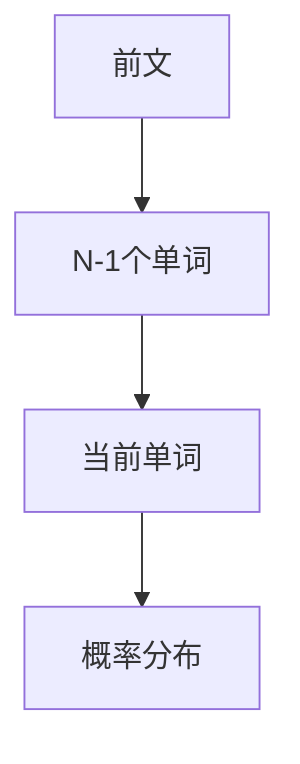
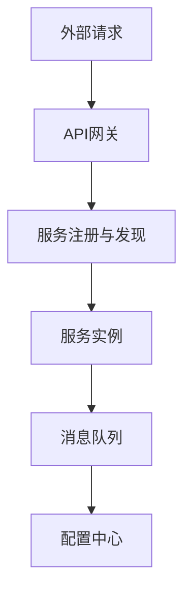

                 

### 文章标题

《大语言模型原理与工程实践：行业大语言模型的评测：以金融行业大语言模型为例》

### 文章关键词

大语言模型、自然语言处理、金融行业、预训练模型、评测、工程实践

### 文章摘要

本文从大语言模型的基本概念和背景出发，深入探讨了其在金融行业中的实际应用。文章首先概述了大语言模型的发展历程和核心意义，随后详细解析了其基本原理和训练过程，并通过Mermaid流程图和伪代码展示了其技术架构。接着，文章以金融行业为例，分析了大语言模型在金融市场预测、信贷风险评估等领域的应用案例，并探讨了金融行业大语言模型的挑战和解决方案。最后，文章探讨了大语言模型的工程实践和服务化，以及其前沿动态和发展趋势，为读者提供了全面的视角和深入的理解。### 第一部分 大语言模型概述

#### 1.1 大语言模型的背景与意义

大语言模型（Large-scale Language Models）是自然语言处理（NLP）领域的一项重要成果，它通过大规模的预训练和微调，显著提升了机器理解和生成自然语言的能力。大语言模型的发展背景可以追溯到深度学习和自然语言处理技术的融合。随着计算能力的提升和大数据的普及，深度神经网络在语音识别、图像识别等领域的成功应用，为NLP领域提供了新的思路和方法。从最初的基于规则和统计模型，到现代的基于神经网络的模型，大语言模型的发展经历了从简单到复杂的演变。

大语言模型的核心意义在于其强大的建模能力和广泛的应用潜力。它不仅能够处理复杂的自然语言任务，如文本分类、机器翻译和情感分析，还能通过大规模预训练实现跨领域的迁移学习。这使得大语言模型在金融、医疗、教育等多个行业展示了其强大的应用潜力。例如，在金融行业，大语言模型可以用于金融市场预测、信贷风险评估和量化交易策略等。

#### 1.2 大语言模型的基本概念

大语言模型是一种基于深度学习的自然语言处理模型，它通过学习大量的文本数据来捕捉语言的统计规律和语义信息。大语言模型的核心概念包括：

- **语言模型**：语言模型是一种概率模型，用于预测下一个单词或词组出现的概率。在大语言模型中，语言模型通过对大量文本进行预训练，学会了如何根据上下文来生成自然的文本。

- **预训练**：预训练是指在大规模数据集上对模型进行训练，以学习语言的通用特征。预训练是大规模语言模型的关键，它使得模型能够处理各种不同领域的文本数据，从而实现跨领域的迁移学习。

- **微调**：微调是指在大语言模型的基础上，针对特定任务进行进一步的训练。微调通过在特定任务的数据上进行训练，使得模型能够更好地适应特定场景的应用。

#### 1.3 大语言模型的技术架构

大语言模型的技术架构主要包括两个部分：预训练和微调。

- **预训练**：预训练阶段通常包括两个步骤。首先，使用大规模的文本数据集对模型进行预训练，学习语言的通用特征。这个过程通常使用无监督的方式，即模型不需要对输入数据打标签。其次，使用大规模的语料库对模型进行进一步的预训练，以增强模型的语言理解和生成能力。

- **微调**：微调阶段是指在大语言模型的基础上，使用特定任务的数据集对模型进行训练，以实现特定任务的性能优化。微调通常使用有监督的方式，即模型需要对输入数据打标签。

#### 1.4 大语言模型的发展历史

大语言模型的发展历史可以追溯到2000年代初。当时，基于统计的NLP方法，如隐马尔可夫模型（HMM）和条件随机场（CRF），在文本分类和实体识别等领域取得了显著的成功。然而，这些方法在处理长文本和复杂语义关系时存在一定的局限性。

随着深度学习技术的发展，研究人员开始探索将深度神经网络应用于NLP领域。2013年，Alex Graves等人提出了生成式递归神经网络（GRNN），它在机器翻译任务中取得了突破性的成绩。2018年，Google推出了BERT模型，它通过双向Transformer结构，在多个NLP任务中取得了SOTA（State-of-the-Art）成绩。BERT的成功标志着大语言模型的崛起，随后，GPT、RoBERTa、T5等一系列大语言模型相继出现，推动了NLP领域的发展。

#### 1.5 大语言模型的应用领域

大语言模型的应用领域非常广泛，涵盖了文本分类、机器翻译、情感分析、命名实体识别等多个方面。

- **文本分类**：文本分类是将文本数据分为不同类别的过程。大语言模型通过学习文本的语义特征，能够准确地将文本分类到预定义的类别中。

- **机器翻译**：机器翻译是将一种语言的文本翻译成另一种语言的过程。大语言模型通过预训练和微调，能够在多个语言对之间实现高质量的翻译。

- **情感分析**：情感分析是判断文本中表达的情感倾向的过程。大语言模型通过学习大量的情感文本数据，能够准确地识别文本中的情感倾向。

- **命名实体识别**：命名实体识别是从文本中识别出具有特定意义的实体，如人名、地名、组织名等。大语言模型通过预训练和微调，能够准确地识别文本中的命名实体。

总的来说，大语言模型在NLP领域的应用前景广阔，它不仅提高了机器理解和生成自然语言的能力，还为各个行业提供了强大的技术支持。### 第二部分 大语言模型原理

#### 2.1 语言模型的基础知识

语言模型是自然语言处理（NLP）的核心组成部分，它主要用于预测文本序列中下一个单词或字符的概率分布。在深度学习框架下，语言模型通常通过训练大量的文本数据来学习语言模式，从而能够对新的文本序列进行概率预测。

##### 2.1.1 语言模型的基本概念

语言模型（Language Model，LM）是一种概率模型，它用于预测下一个单词或字符在给定前文条件下的概率。最简单的语言模型是N元语法（N-gram Model），它基于局部语言特征，即假设当前词的概率仅依赖于前N个词。

**N元语法流程图：**



##### 2.1.2 语言模型的数学基础

语言模型的数学基础主要包括概率论和统计学习理论。在概率论中，语言模型通过条件概率来描述单词之间的依赖关系。假设\( P(w_t|w_{t-1}, w_{t-2}, ..., w_{t-N}) \)是给定前文条件下单词\( w_t \)的条件概率，则N元语法的概率分布可以表示为：

$$
P(w_t) = \frac{P(w_{t-1}, w_{t-2}, ..., w_{t-N}, w_t)}{P(w_{t-1}, w_{t-2}, ..., w_{t-N})}
$$

其中，分母是归一化常数，用于保证概率分布的总和为1。

##### 2.1.3 语言模型的评估方法

评估语言模型性能的关键指标包括准确度（Accuracy）、损失函数（Loss Function）和困惑度（Perplexity）。

- **准确度（Accuracy）**：准确度是模型预测正确的比例。对于分类任务，准确度是常用的评估指标。

- **损失函数（Loss Function）**：在训练语言模型时，通常使用损失函数来衡量模型预测与真实值之间的差距。常见的损失函数包括交叉熵损失（Cross-Entropy Loss）和平方损失（Mean Squared Error Loss）。

- **困惑度（Perplexity）**：困惑度是模型在测试集上的表现的一个度量，它通过计算模型预测的文本序列的负对数似然来评估。困惑度越低，模型对文本的理解越好。

#### 2.2 大规模预训练模型的原理

大规模预训练模型（Pre-trained Language Model）是通过在大规模文本数据集上预训练模型，使其掌握通用语言特征，然后再进行特定任务的微调（Fine-tuning）。大规模预训练模型的核心思想是通过无监督学习来提取文本的语义信息，从而提高模型在各个NLP任务上的性能。

##### 2.2.1 预训练模型的概念

预训练（Pre-training）是指在大规模无标签文本数据集上对模型进行训练，以学习文本的通用特征。预训练模型通常包括以下步骤：

1. **数据收集与预处理**：收集大量互联网文本数据，如新闻文章、论坛帖子、社交媒体等。然后进行数据清洗、分词、词干提取等预处理步骤。

2. **模型初始化**：初始化模型参数，通常使用预训练的通用模型或随机初始化。

3. **预训练**：在无标签文本数据集上训练模型，通过计算模型预测与真实文本之间的差异来更新模型参数。

4. **评估与调整**：在预训练过程中，定期评估模型在验证集上的性能，并根据性能调整预训练过程。

##### 2.2.2 预训练模型的主要方法

预训练模型的主要方法包括基于Transformer的BERT、GPT和基于递归神经网络的ELMo等。

- **BERT（Bidirectional Encoder Representations from Transformers）**：BERT是一种基于Transformer的双向编码器，通过同时考虑上下文信息来生成文本表示。BERT的预训练包括两个阶段：第一阶段是掩码语言建模（Masked Language Modeling，MLM），即对部分单词进行遮掩，模型需要预测遮掩的单词；第二阶段是下一句预测（Next Sentence Prediction，NSP），即模型需要预测两个句子是否属于同一文本上下文。

  **BERT预训练流程图：**

  ```mermaid
  graph TD
  A[数据预处理] --> B[BERT模型初始化]
  B --> C[MLM预训练]
  C --> D[NSP预训练]
  D --> E[评估与调整]
  ```

- **GPT（Generative Pre-trained Transformer）**：GPT是一种生成式预训练模型，它通过自回归方式生成文本序列。GPT使用Transformer结构，通过层次化的自注意力机制来捕捉长距离依赖。

  **GPT预训练流程图：**

  ```mermaid
  graph TD
  A[数据预处理] --> B[GPT模型初始化]
  B --> C[自回归预训练]
  C --> D[评估与调整]
  ```

- **ELMo（Embeddings from Language Models）**：ELMo是一种基于递归神经网络的预训练模型，它通过在上下文中嵌入单词来学习单词的语义表示。ELMo的预训练包括两部分：第一部分是语言模型训练，即训练一个双向递归神经网络来预测下一个单词；第二部分是上下文嵌入训练，即使用训练好的语言模型来生成上下文敏感的单词嵌入。

  **ELMo预训练流程图：**

  ```mermaid
  graph TD
  A[数据预处理] --> B[ELMo模型初始化]
  B --> C[语言模型训练]
  C --> D[上下文嵌入训练]
  D --> E[评估与调整]
  ```

##### 2.2.3 预训练模型的效果分析

预训练模型在NLP任务上取得了显著的性能提升。通过预训练，模型能够学习到丰富的语言特征，从而在下游任务中表现出更好的泛化能力。以下是预训练模型在几个典型NLP任务上的效果分析：

- **文本分类**：预训练模型在文本分类任务上显著提升了分类准确率。通过预训练，模型能够学习到不同类别的语义特征，从而在分类任务中表现出更好的性能。

- **机器翻译**：预训练模型在机器翻译任务中也表现出色。通过预训练，模型能够学习到不同语言之间的语义对应关系，从而在翻译任务中实现高质量的翻译。

- **问答系统**：预训练模型在问答系统任务上提高了回答的准确率和流畅性。通过预训练，模型能够学习到大量的知识信息，从而在问答任务中提供更准确的答案。

总的来说，大规模预训练模型通过无监督学习提取了文本的通用特征，为NLP任务提供了强大的基础。预训练模型的效果分析和应用案例表明，预训练是提升NLP任务性能的关键途径。#### 2.3 大语言模型的训练过程

大语言模型的训练过程是一个复杂且耗时的任务，涉及多个阶段，包括数据准备、模型架构选择、模型训练技巧和优化策略。以下将详细介绍大语言模型的训练过程。

##### 2.3.1 数据准备

数据准备是训练大语言模型的第一步，也是至关重要的一步。数据的质量直接影响模型的训练效果和性能。

1. **数据收集**：数据收集是数据准备的第一步。通常，大语言模型需要大量高质量的文本数据。数据来源可以是互联网上的公开文本、书籍、新闻文章、论坛帖子等。对于金融行业的大语言模型，数据来源可能包括金融报告、交易记录、新闻稿、分析师报告等。

2. **数据清洗**：收集到的数据往往包含噪声和不必要的部分，如HTML标签、特殊字符和停用词。数据清洗的目的是去除这些噪声，提高数据质量。常见的数据清洗步骤包括去除HTML标签、去除特殊字符、去除停用词和分词。

3. **数据预处理**：数据预处理是将原始文本数据转化为模型可接受的输入格式的过程。对于大语言模型，常用的预处理方法包括分词、词干提取、词嵌入等。

   **伪代码：**

   ```python
   def preprocess_text(text):
       # 去除HTML标签
       text = remove_html_tags(text)
       # 去除特殊字符
       text = remove_special_characters(text)
       # 分词
       words = tokenize(text)
       # 去除停用词
       words = remove_stopwords(words)
       # 词干提取
       words = lemmatize(words)
       # 词嵌入
       embeddings = word_embedding(words)
       return embeddings
   ```

4. **数据增强**：数据增强是通过各种技术手段生成更多样化的训练数据，以提高模型的泛化能力。常见的数据增强方法包括文本生成、同义词替换、随机删除单词等。

   **伪代码：**

   ```python
   def data_augmentation(text):
       # 文本生成
       generated_text = generate_text(text)
       # 同义词替换
       replaced_text = replace_synonyms(text)
       # 随机删除单词
       deleted_text = delete_words(text)
       return generated_text, replaced_text, deleted_text
   ```

##### 2.3.2 模型架构选择

大语言模型的架构选择是训练过程的另一个关键步骤。常见的模型架构包括基于循环神经网络（RNN）的LSTM和GRU，以及基于Transformer的BERT、GPT等。

1. **循环神经网络（RNN）**：RNN是一种处理序列数据的神经网络，它通过隐藏状态来捕捉序列中的长期依赖关系。LSTM（长短期记忆网络）和GRU（门控循环单元）是RNN的两种变体，它们通过引入门控机制来提高模型的记忆能力。

   **LSTM单元的伪代码：**

   ```python
   def lstm_cell(input, hidden, cell_state):
       # 输入门
       input_gate = sigmoid(np.dot(input, input_weight) + np.dot(hidden, recurrent_weight) + bias)
       # 遗忘门
       forget_gate = sigmoid(np.dot(input, forget_weight) + np.dot(hidden, recurrent_weight) + bias)
       # 输出门
       output_gate = sigmoid(np.dot(input, output_weight) + np.dot(hidden, recurrent_weight) + bias)
       # 新的细胞状态
       new_cell_state = forget_gate * cell_state + input_gate * sigmoid(np.dot(input, input_weight) + bias)
       # 新的隐藏状态
       new_hidden_state = output_gate * tanh(new_cell_state)
       return new_hidden_state, new_cell_state
   ```

2. **Transformer**：Transformer是一种基于自注意力机制的序列模型，它通过多头自注意力机制来捕捉序列中的依赖关系。BERT和GPT等大语言模型都是基于Transformer架构。

   **Transformer编码器的伪代码：**

   ```python
   def transformer_encoder(inputs, hidden_size, num_heads, num_layers):
       for layer in range(num_layers):
           # 自注意力层
           attention = self_attention(inputs, hidden_size, num_heads)
           # 位置编码
           attention = add_positional_encoding(attention, hidden_size)
           # 前馈网络
           output = feedforward(attention, hidden_size)
           # 降维与激活函数
           output = dropout(output)
           output = activation(output)
           inputs = output
       return inputs
   ```

##### 2.3.3 模型训练技巧

在训练大语言模型时，为了提高模型的性能和收敛速度，需要采用一系列训练技巧。

1. **批量归一化（Batch Normalization）**：批量归一化通过在每个批量上归一化激活值，使得每个层之间的激活分布更加稳定，从而提高训练速度。

2. **学习率调度（Learning Rate Scheduling）**：学习率调度是一种动态调整学习率的方法，以避免模型在训练过程中出现过拟合。常见的调度策略包括线性下降、余弦退火等。

3. **Dropout**：Dropout是一种正则化技术，通过随机丢弃模型中的神经元，以减少过拟合的风险。在训练过程中，通常设置一个丢弃概率\( p \)，在每次训练中随机丢弃部分神经元。

4. **梯度裁剪（Gradient Clipping）**：梯度裁剪是一种防止梯度爆炸或梯度消失的技术。通过限制梯度的大小，可以避免模型参数的剧烈变化。

##### 2.3.4 模型优化策略

为了提高大语言模型的性能，需要采用一系列优化策略来调整模型参数。

1. **Adam优化器**：Adam优化器是一种基于自适应学习率的优化器，它通过计算一阶和二阶矩估计来调整学习率。Adam优化器在训练过程中表现出良好的收敛速度和稳定性。

2. **权重共享（Weight Sharing）**：在预训练阶段，大语言模型通常采用权重共享策略，即不同层和不同任务的权重共享。这种方法通过减少参数数量，降低了模型的复杂性。

3. **多任务学习（Multi-task Learning）**：多任务学习是一种同时训练多个相关任务的方法。通过多任务学习，模型可以在不同任务之间共享知识，从而提高每个任务的性能。

4. **对抗训练（Adversarial Training）**：对抗训练是一种通过生成对抗样本来提高模型鲁棒性的方法。通过对抗训练，模型可以在面对不同类型的攻击时保持良好的性能。

总的来说，大语言模型的训练过程涉及多个阶段和复杂的技巧。通过合理的数据准备、模型架构选择、训练技巧和优化策略，可以训练出高性能的大语言模型，从而在各个NLP任务中表现出色。### 2.4 大语言模型的调优与评估

大语言模型的调优与评估是确保模型在特定任务上达到最佳性能的关键步骤。这个过程涉及多种调优方法、评估指标和评测流程，下面将详细讲解。

#### 2.4.1 调优方法

调优方法主要包括超参数调整、数据预处理和模型架构调整。

1. **超参数调整**：超参数是模型架构之外的可调参数，如学习率、批量大小、隐藏层大小等。超参数调整是调优过程中的一个重要环节。常见的方法包括随机搜索（Random Search）、网格搜索（Grid Search）和贝叶斯优化（Bayesian Optimization）。

   **伪代码：**

   ```python
   from sklearn.model_selection import RandomizedSearchCV

   # 定义超参数范围
   param_distributions = {
       'learning_rate': [0.001, 0.01, 0.1],
       'batch_size': [16, 32, 64, 128],
       'hidden_size': [128, 256, 512, 1024]
   }

   # 进行随机搜索
   model = LanguageModel()
   search = RandomizedSearchCV(model, param_distributions, n_iter=100, cv=3)
   search.fit(training_data)
   best_params = search.best_params_
   ```

2. **数据预处理**：数据预处理对于模型调优至关重要。常见的预处理方法包括数据清洗、数据增强和归一化。数据清洗可以去除噪声和异常值，数据增强可以增加训练数据的多样性，归一化可以缩小输入特征的范围，使模型训练更加稳定。

   **伪代码：**

   ```python
   def preprocess_data(data):
       # 去除HTML标签
       data = remove_html_tags(data)
       # 数据增强
       data = data_augmentation(data)
       # 归一化
       data = normalize(data)
       return data
   ```

3. **模型架构调整**：模型架构调整是优化模型性能的另一种方法。通过调整模型的结构，如增加或减少层、改变层的大小、引入注意力机制等，可以改善模型的性能。

   **伪代码：**

   ```python
   def adjust_model Architecture(model):
       # 增加一层
       new_model = LanguageModelWithAdditionalLayer()
       # 改变层的大小
       new_model.hidden_size = 512
       return new_model
   ```

#### 2.4.2 评估指标

评估指标是衡量模型性能的重要工具。不同的任务可能需要不同的评估指标。

1. **准确性（Accuracy）**：准确性是最常用的评估指标之一，表示模型预测正确的样本数占总样本数的比例。

   $$ Accuracy = \frac{TP + TN}{TP + TN + FP + FN} $$

   其中，\( TP \)表示真正例，\( TN \)表示真负例，\( FP \)表示假正例，\( FN \)表示假负例。

2. **精确率（Precision）**：精确率表示模型预测为正例的样本中，实际为正例的比例。

   $$ Precision = \frac{TP}{TP + FP} $$

3. **召回率（Recall）**：召回率表示模型预测为正例的样本中，实际为正例的比例。

   $$ Recall = \frac{TP}{TP + FN} $$

4. **F1分数（F1 Score）**：F1分数是精确率和召回率的加权平均，用于综合考虑模型预测的准确性和全面性。

   $$ F1 Score = 2 \times \frac{Precision \times Recall}{Precision + Recall} $$

5. **困惑度（Perplexity）**：困惑度是模型在测试集上的表现的一个度量，它通过计算模型预测的文本序列的负对数似然来评估。

   $$ Perplexity = 2^{(-\frac{1}{N} \sum_{i=1}^{N} \log P(w_i | w_{<i})}) $$

   其中，\( N \)是测试集的文本长度。

#### 2.4.3 评测流程

评测流程是确保模型调优和评估过程规范和可重复的关键。以下是典型的评测流程：

1. **数据划分**：将数据集划分为训练集、验证集和测试集。通常，训练集用于模型训练，验证集用于调优模型参数，测试集用于评估模型在未知数据上的性能。

2. **模型训练**：在训练集上训练模型，并使用验证集进行参数调优。常用的调优方法包括交叉验证（Cross-Validation）和网格搜索（Grid Search）。

3. **模型评估**：使用验证集和测试集评估模型的性能。常用的评估指标包括准确性、精确率、召回率、F1分数和困惑度。

4. **结果分析**：分析模型在不同任务和评估指标上的性能，找出模型的优点和不足。

5. **迭代优化**：根据分析结果，对模型进行优化。可能包括调整超参数、改进数据预处理方法、调整模型架构等。

6. **报告撰写**：撰写评测报告，总结模型的性能和调优过程，并提出改进建议。

   **伪代码：**

   ```python
   def evaluate_model(model, validation_data, test_data):
       # 训练模型
       model.train(validation_data)
       # 评估模型
       accuracy = model.evaluate(test_data)
       precision = model.precision(test_data)
       recall = model.recall(test_data)
       f1_score = model.f1_score(test_data)
       perplexity = model.perplexity(test_data)
       return accuracy, precision, recall, f1_score, perplexity
   ```

总的来说，大语言模型的调优与评估是一个系统性的过程，涉及超参数调整、数据预处理、模型架构调整、评估指标选择和评测流程。通过合理调优和评估，可以训练出高性能的大语言模型，并在实际应用中发挥重要作用。### 3.1 金融行业大语言模型的特点

金融行业大语言模型在数据处理、应用场景和需求方面具有独特的特点，这些特点决定了其具体的技术实现和应用效果。

##### 3.1.1 金融领域的数据特性

金融领域的数据具有以下特性：

1. **高维度和多样性**：金融数据包括股票价格、交易量、财务报表、新闻文章、社交媒体等，具有高维度和多样性。这些数据需要有效的整合和处理，以便模型能够从中提取有用的信息。

2. **时序性**：金融市场的价格波动具有显著的时序性。因此，金融行业大语言模型需要能够处理时序数据，捕捉市场动态。

3. **噪声和不确定性**：金融数据中存在大量的噪声和不确定性，如市场操纵、谣言传播和突发事件等。模型需要具备良好的鲁棒性，以应对这些挑战。

4. **隐私性**：金融数据涉及敏感信息，如个人身份、财务状况和交易记录等。模型在处理数据时需要严格遵守隐私保护法规，确保数据安全和合规。

##### 3.1.2 金融行业的应用场景

金融行业大语言模型在多个场景中展现出强大的应用潜力：

1. **金融市场预测**：大语言模型可以分析历史市场数据、新闻文章和社交媒体等，预测股票价格、市场走势等。

2. **信贷风险评估**：通过分析借款人的信用记录、财务报表和新闻报道，模型可以评估借款人的信用风险。

3. **量化交易策略**：大语言模型可以用于开发量化交易策略，如基于市场情绪的套利策略、基于财务报表的股票选择策略等。

4. **风险管理**：模型可以预测市场风险，如波动率、违约风险等，帮助金融机构制定有效的风险控制措施。

##### 3.1.3 金融大语言模型的需求

金融行业对大语言模型的需求主要体现在以下几个方面：

1. **高准确性和稳定性**：金融市场波动剧烈，模型需要具备高准确性和稳定性，以确保预测结果的可靠性。

2. **实时处理能力**：金融数据更新迅速，模型需要具备实时处理能力，及时响应市场变化。

3. **解释性**：金融从业者需要了解模型的决策过程，因此模型需要具备一定的解释性，以便监管合规和业务决策。

4. **可扩展性**：随着金融数据量的增长，模型需要具备良好的可扩展性，以适应未来数据量的增加。

5. **合规性和安全性**：模型在处理金融数据时，需要严格遵守合规性和安全性要求，确保数据安全和隐私保护。

综上所述，金融行业大语言模型具有独特的数据特性、应用场景和需求。通过深入研究和优化，可以开发出满足金融行业需求的高性能大语言模型。### 3.2 金融行业大语言模型的应用案例

金融行业大语言模型的应用案例丰富多样，涵盖了金融市场预测、信贷风险评估、量化交易策略和风险管理等多个领域。以下将详细介绍这些应用案例，并提供具体的项目实例和实现思路。

##### 3.2.1 金融市场预测

金融市场预测是大语言模型在金融行业的重要应用之一。通过分析历史市场数据、新闻文章和社交媒体等，大语言模型可以预测股票价格、市场走势等。

**项目实例：股票市场预测**

- **数据来源**：历史股票价格数据、新闻文章和社交媒体数据。
- **数据处理**：数据清洗、分词、词嵌入等预处理步骤，以及数据增强方法，如文本生成和同义词替换。
- **模型选择**：基于Transformer架构的BERT或GPT模型。
- **实现思路**：使用BERT或GPT模型进行预训练，然后在特定股票市场的数据集上进行微调。通过预测股票价格序列的下一个值，实现对市场走势的预测。

**伪代码：**

```python
def train_stock_prediction_model(data):
    # 数据预处理
    preprocessed_data = preprocess_data(data)
    # 模型初始化
    model = BertModel()
    # 预训练
    model.train(preprocessed_data)
    # 微调
    model.fine_tune(stock_market_data)
    return model
```

##### 3.2.2 信贷风险评估

信贷风险评估是金融行业另一个重要应用。大语言模型可以通过分析借款人的信用记录、财务报表和新闻报道，评估借款人的信用风险。

**项目实例：信用评分系统**

- **数据来源**：借款人的信用记录、财务报表、新闻报道等。
- **数据处理**：数据清洗、分词、词嵌入等预处理步骤，以及数据增强方法，如文本生成和同义词替换。
- **模型选择**：基于Transformer架构的BERT或GPT模型。
- **实现思路**：使用BERT或GPT模型进行预训练，然后在信用评分系统的数据集上进行微调。通过预测借款人的信用评分，实现对借款人信用风险的评估。

**伪代码：**

```python
def train_credit_risk_model(data):
    # 数据预处理
    preprocessed_data = preprocess_data(data)
    # 模型初始化
    model = BertModel()
    # 预训练
    model.train(preprocessed_data)
    # 微调
    model.fine_tune(credit_risk_data)
    return model
```

##### 3.2.3 量化交易策略

大语言模型可以用于开发量化交易策略，如基于市场情绪的套利策略、基于财务报表的股票选择策略等。

**项目实例：市场情绪分析**

- **数据来源**：新闻文章、社交媒体、股票价格等。
- **数据处理**：数据清洗、分词、词嵌入等预处理步骤，以及数据增强方法，如文本生成和同义词替换。
- **模型选择**：基于Transformer架构的BERT或GPT模型。
- **实现思路**：使用BERT或GPT模型进行预训练，然后在市场情绪分析的数据集上进行微调。通过分析市场情绪，预测股票价格走势，从而制定量化交易策略。

**伪代码：**

```python
def train_trading_strategy_model(data):
    # 数据预处理
    preprocessed_data = preprocess_data(data)
    # 模型初始化
    model = BertModel()
    # 预训练
    model.train(preprocessed_data)
    # 微调
    model.fine_tune(trading_strategy_data)
    return model
```

##### 3.2.4 风险管理

大语言模型可以用于预测市场风险，如波动率、违约风险等，帮助金融机构制定有效的风险控制措施。

**项目实例：违约风险预测**

- **数据来源**：借款人的信用记录、财务报表、市场数据等。
- **数据处理**：数据清洗、分词、词嵌入等预处理步骤，以及数据增强方法，如文本生成和同义词替换。
- **模型选择**：基于Transformer架构的BERT或GPT模型。
- **实现思路**：使用BERT或GPT模型进行预训练，然后在违约风险预测的数据集上进行微调。通过预测借款人的违约风险，帮助金融机构制定风险控制策略。

**伪代码：**

```python
def train_risk_management_model(data):
    # 数据预处理
    preprocessed_data = preprocess_data(data)
    # 模型初始化
    model = BertModel()
    # 预训练
    model.train(preprocessed_data)
    # 微调
    model.fine_tune(risk_management_data)
    return model
```

综上所述，金融行业大语言模型在金融市场预测、信贷风险评估、量化交易策略和风险管理等方面具有广泛的应用。通过合理的数据处理、模型选择和实现思路，可以开发出满足金融行业需求的高性能大语言模型，从而提升金融机构的决策能力和风险管理水平。### 3.3 金融行业大语言模型的挑战与解决方案

在金融行业，大语言模型的应用面临着一系列挑战，包括数据隐私保护、道德与合规性、模型解释性和技术挑战。以下将详细分析这些挑战，并提出相应的解决方案。

##### 3.3.1 数据隐私保护

金融行业的数据具有高度敏感性和隐私性，如个人身份信息、财务状况和交易记录等。大语言模型在处理这些数据时，需要确保数据隐私保护。

**挑战：** 数据隐私保护是一个重要挑战，因为模型训练过程中可能会暴露敏感信息。例如，如果使用用户的具体姓名、地址等数据进行训练，那么模型可能会泄露这些敏感信息。

**解决方案：**

1. **差分隐私（Differential Privacy）**：差分隐私是一种保护数据隐私的技术，它通过添加噪声来隐藏单个数据的贡献，从而确保数据隐私。差分隐私可以应用于数据预处理和模型训练过程，以保护敏感数据。

2. **数据匿名化**：在数据预处理阶段，可以通过数据匿名化技术，如泛化、掩盖和加密等，将敏感信息转换为不可识别的形式。这可以减少模型对原始敏感数据的依赖，从而降低数据泄露的风险。

3. **联邦学习（Federated Learning）**：联邦学习是一种分布式学习技术，它允许不同机构在本地训练模型，然后将模型更新上传到中心服务器进行合并。这种方法可以减少数据传输过程中的隐私泄露风险。

**伪代码：**

```python
def train_private_model(data):
    # 数据匿名化
    anonymized_data = anonymize_data(data)
    # 预训练
    model.train(anonymized_data)
    # 差分隐私微调
    model.fine_tune privacy_sensitive_data()
    return model
```

##### 3.3.2 道德与合规性

金融行业的应用场景对道德和合规性有严格的要求。大语言模型在金融行业应用时，需要确保其行为符合道德规范和法律法规。

**挑战：** 大语言模型可能会生成具有偏见或不道德的内容，从而对金融行业造成负面影响。例如，如果模型在信贷风险评估中存在性别或种族偏见，那么可能会导致不公平的决策。

**解决方案：**

1. **公平性评估**：在模型训练和部署过程中，定期进行公平性评估，确保模型不会产生偏见。可以使用各种评估方法，如反事实测试（Counterfactual Testing）和偏差检测（Bias Detection）。

2. **伦理审查**：在模型开发和应用过程中，建立伦理审查机制，确保模型设计和应用符合道德标准。伦理审查可以包括内部审查和第三方审查。

3. **透明性和可解释性**：提高模型的透明性和可解释性，使金融从业者能够理解和验证模型的决策过程。这可以通过开发可解释的模型架构和技术，如LIME（Local Interpretable Model-agnostic Explanations）和SHAP（SHapley Additive exPlanations）等方法实现。

**伪代码：**

```python
def assess_model_fairness(model):
    # 进行公平性评估
    fairness_scores = model.fairness_evaluation()
    # 输出评估结果
    print(fairness_scores)
    return fairness_scores
```

##### 3.3.3 模型解释性

模型解释性在金融行业尤为重要，因为决策的透明性和可解释性对于监管合规和业务决策至关重要。

**挑战：** 大规模语言模型通常具有复杂性和非线性，其内部决策过程往往难以解释。这对于金融从业者来说是一个重大挑战，因为他们需要了解模型如何做出特定决策。

**解决方案：**

1. **可解释的模型架构**：选择具有良好解释性的模型架构，如基于规则的模型或集成模型。这些模型可以提供更直观的解释，帮助金融从业者理解模型的决策过程。

2. **模型解释技术**：利用模型解释技术，如LIME和SHAP，可以提供模型决策的具体解释。这些技术可以揭示模型对输入特征的依赖关系和权重分配。

3. **交互式可视化工具**：开发交互式可视化工具，使金融从业者能够直观地查看模型的决策过程和结果。这可以通过动态图表、热力图和交互式表格等形式实现。

**伪代码：**

```python
def explain_model_decision(model, input_data):
    # 使用LIME进行解释
    explanation = lime.explain_instance(model, input_data)
    # 可视化解释结果
    explanation visualize()
    return explanation
```

##### 3.3.4 技术挑战

金融行业大语言模型在技术层面也面临着一系列挑战，包括计算资源、模型效率和模型安全性等。

**挑战：**

1. **计算资源**：大规模语言模型的训练和推理过程需要大量的计算资源，这对金融行业的IT基础设施提出了高要求。

2. **模型效率**：为了在金融市场中实现实时处理，模型需要具备高效的推理能力。这通常要求对模型进行压缩和优化。

3. **模型安全性**：模型在处理金融数据时，需要确保其免受恶意攻击，如对抗性攻击和模型中毒。

**解决方案：**

1. **分布式计算**：采用分布式计算技术，如GPU并行计算和分布式训练，可以提高模型的训练效率。

2. **模型压缩**：使用模型压缩技术，如模型剪枝（Model Pruning）、量化（Quantization）和知识蒸馏（Knowledge Distillation），可以减少模型的大小和计算复杂度。

3. **防御机制**：实施多种防御机制，如对抗训练、模型清洗和实时监控，可以提高模型的安全性。

**伪代码：**

```python
def compress_model(model):
    # 模型剪枝
    pruned_model = prune_model(model)
    # 量化
    quantized_model = quantize_model(pruned_model)
    return quantized_model
```

综上所述，金融行业大语言模型在数据隐私保护、道德与合规性、模型解释性和技术挑战方面面临着一系列挑战。通过采用差分隐私、数据匿名化、联邦学习、公平性评估、透明性增强、交互式可视化工具、分布式计算、模型压缩和防御机制等技术，可以解决这些挑战，从而推动金融行业大语言模型的健康发展。### 4.1 大语言模型的工程实践

大语言模型的工程实践涉及模型部署方案、实时处理与批处理、模型生命周期管理等方面，下面将详细探讨这些内容。

##### 4.1.1 模型部署方案

模型部署是将训练好的大语言模型部署到实际应用环境中，以便进行推理和预测。模型部署方案的选择取决于多种因素，包括应用场景、计算资源、成本和可扩展性。

1. **云服务**：云服务提供了灵活的部署方案，可以快速部署和扩展模型。常用的云服务包括AWS、Azure和Google Cloud等，它们提供了丰富的机器学习工具和API，便于模型部署和管理。

2. **边缘计算**：边缘计算将模型部署到靠近数据源的设备上，以减少数据传输延迟和提高响应速度。边缘计算适用于需要实时处理的应用场景，如自动驾驶、智能制造等。

3. **容器化与微服务**：容器化（Containerization）和微服务架构（Microservices Architecture）可以提高模型的部署效率和可扩展性。通过将模型和依赖项封装在容器中，可以方便地在不同的环境中部署和运行模型。微服务架构则将模型拆分为多个独立的服务，便于扩展和管理。

**伪代码：**

```python
def deploy_model(model, deployment_type):
    if deployment_type == 'cloud':
        deploy_to_cloud(model)
    elif deployment_type == 'edge':
        deploy_to_edge(model)
    elif deployment_type == 'container':
        containerize_model(model)
    elif deployment_type == 'microservices':
        deploy_microservices(model)
    return model
```

##### 4.1.2 实时处理与批处理

大语言模型在实时处理和批处理方面具有不同的应用需求。

1. **实时处理**：实时处理要求模型能够快速响应用户请求，通常在毫秒级别内完成推理。实时处理的关键在于优化模型推理速度，如使用优化过的模型架构、模型剪枝和量化技术等。

2. **批处理**：批处理适用于处理大量数据，通常在分钟或小时级别内完成。批处理可以并行处理多个任务，提高处理效率。

**伪代码：**

```python
def process_data(data, processing_type):
    if processing_type == 'realtime':
        real_time_process(data)
    elif processing_type == 'batch':
        batch_process(data)
    return processed_data
```

##### 4.1.3 模型生命周期管理

模型生命周期管理涉及模型的创建、训练、部署、监控和更新等阶段。

1. **模型创建**：根据业务需求，创建新的模型项目，包括定义模型架构、参数设置和训练数据等。

2. **模型训练**：使用训练数据对模型进行训练，优化模型参数，提高模型性能。

3. **模型部署**：将训练好的模型部署到生产环境，以便进行实时处理或批处理。

4. **模型监控**：监控模型在部署后的性能和稳定性，及时发现和处理异常情况。

5. **模型更新**：根据业务需求和性能表现，定期更新模型，以适应新的数据和应用场景。

**伪代码：**

```python
class ModelLifecycle:
    def __init__(self, model_config):
        self.model_config = model_config
        self.model = None

    def create_model(self):
        self.model = create_model(self.model_config)

    def train_model(self, training_data):
        self.model.train(training_data)

    def deploy_model(self, deployment_type):
        self.model = deploy_model(self.model, deployment_type)

    def monitor_model(self):
        monitor_model(self.model)

    def update_model(self, new_data):
        self.model.train(new_data)
        self.model.deploy()
```

综上所述，大语言模型的工程实践涉及多个方面，包括模型部署方案、实时处理与批处理、模型生命周期管理等。通过合理的部署方案、优化处理技术和管理流程，可以确保大语言模型在工程应用中的高效和稳定。### 4.2 大语言模型的服务化

大语言模型的服务化是将模型以服务的形式提供给其他系统或用户，实现高效、可扩展和灵活的部署和管理。服务化架构不仅能够提高模型的可用性和访问效率，还能简化开发和运维流程。

##### 4.2.1 服务化架构

服务化架构通常基于微服务架构和容器化技术。以下是服务化架构的主要组成部分：

1. **API网关**：API网关是服务化架构的入口，负责接收外部请求、路由到相应的服务实例，并处理跨域请求、身份验证和安全等问题。

2. **服务实例**：服务实例是具体执行业务逻辑的单元，通常是一个独立的容器化应用。每个服务实例可以独立部署和扩展，提高系统的灵活性和可维护性。

3. **服务注册与发现**：服务注册与发现机制用于管理服务实例的注册和定位，使得API网关能够动态发现和选择可用服务实例。

4. **消息队列**：消息队列用于异步处理请求，解耦服务之间的依赖关系，提高系统的可靠性和可扩展性。

5. **配置中心**：配置中心用于集中管理和发布服务的配置信息，确保服务在不同环境下的一致性。

**服务化架构流程图：**



##### 4.2.2 API设计与实现

API设计是实现服务化的关键，良好的API设计可以提高接口的易用性和一致性。以下是API设计的主要步骤：

1. **定义API规范**：明确API的请求和响应格式，包括URL、HTTP方法、请求参数和返回结果等。常用的API规范包括RESTful API和GraphQL。

2. **版本控制**：为API版本控制，便于后续的功能扩展和优化。可以使用URL版本控制或请求头版本控制。

3. **错误处理**：定义统一的错误处理机制，包括错误代码、错误信息和错误响应格式。

**伪代码：**

```python
from flask import Flask, jsonify, request

app = Flask(__name__)

@app.route('/api/v1/predict', methods=['POST'])
def predict_api():
    data = request.get_json()
    prediction = model.predict(data)
    response = {
        'status': 'success',
        'prediction': prediction
    }
    return jsonify(response)

@app.errorhandler(404)
def not_found(error):
    response = {
        'status': 'error',
        'error': 'Not Found',
        'message': 'The requested resource could not be found.'
    }
    return jsonify(response), 404

if __name__ == '__main__':
    app.run()
```

##### 4.2.3 服务化优势与挑战

服务化架构具有以下优势：

1. **高可用性和可扩展性**：服务化架构通过部署多个服务实例，可以实现高可用性和水平扩展。

2. **灵活性和可维护性**：服务化架构使得服务可以独立部署和扩展，降低了系统的耦合度，提高了系统的可维护性。

3. **解耦与异步处理**：通过消息队列和解耦服务之间的依赖关系，可以简化系统设计和提高系统的可靠性。

然而，服务化架构也面临一些挑战：

1. **复杂性**：服务化架构增加了系统的复杂度，需要更复杂的架构设计和运维。

2. **分布式系统问题**：服务化架构可能导致分布式系统问题，如网络延迟、数据一致性和服务故障等。

3. **安全性**：服务化架构需要确保数据安全和用户隐私，如加密通信、身份验证和访问控制等。

综上所述，大语言模型的服务化架构通过API设计和实现，可以提高模型的可用性、灵活性和可扩展性。尽管面临一些挑战，但通过合理的架构设计和运维策略，可以充分发挥服务化的优势。### 4.3 大语言模型的安全与隐私保护

大语言模型在处理数据时面临着诸多安全与隐私保护方面的挑战，这些挑战不仅涉及技术层面，还包括法律和伦理层面。以下将详细探讨大语言模型的安全威胁、加密与身份验证技术，以及隐私保护方法。

##### 4.3.1 安全威胁分析

1. **数据泄露**：大语言模型在处理大量敏感数据时，若缺乏有效的安全措施，可能导致数据泄露。数据泄露不仅会损害用户隐私，还可能导致严重的经济损失。

2. **模型中毒**：恶意攻击者可以通过注入恶意数据或干扰训练过程，使模型产生错误的预测结果，从而造成经济损失或误导用户。

3. **分布式拒绝服务攻击（DDoS）**：通过攻击模型服务的API接口，恶意攻击者可以造成服务瘫痪，导致业务中断。

4. **数据篡改**：攻击者可能会篡改模型训练数据，从而影响模型的预测结果，这在金融行业中可能导致严重的后果。

##### 4.3.2 加密与身份验证技术

1. **加密**：加密是保护数据隐私和安全的关键技术。在数据传输过程中，可以使用SSL/TLS等协议进行加密，确保数据在传输过程中不被窃取或篡改。在数据存储过程中，可以使用对称加密或非对称加密算法，如AES或RSA，对敏感数据进行加密。

   **加密伪代码：**

   ```python
   from Crypto.Cipher import AES
   
   def encrypt_data(data, key):
       cipher = AES.new(key, AES.MODE_CBC)
       ct_bytes = cipher.encrypt(pad(data))
       iv = cipher.iv
       return iv + ct_bytes
   
   def decrypt_data(encrypted_data, key):
       iv = encrypted_data[:16]
       ct = encrypted_data[16:]
       cipher = AES.new(key, AES.MODE_CBC, iv)
       pt = cipher.decrypt(ct)
       return unpad(pt)
   ```

2. **身份验证**：身份验证是确保只有授权用户可以访问系统的重要手段。常用的身份验证方法包括用户名和密码、双因素认证（2FA）和基于证书的身份验证。在服务化架构中，可以使用OAuth 2.0等协议进行身份验证。

   **身份验证伪代码：**

   ```python
   from flask import Flask, request, jsonify
   
   app = Flask(__name__)
   
   @app.route('/api/login', methods=['POST'])
   def login():
       username = request.json['username']
       password = request.json['password']
       if authenticate_user(username, password):
           token = generate_token()
           return jsonify({'status': 'success', 'token': token})
       else:
           return jsonify({'status': 'error', 'message': 'Invalid credentials'})
   
   def authenticate_user(username, password):
       # 验证用户名和密码
       return verify_credentials(username, password)
   
   def generate_token():
       # 生成访问令牌
       return generate_access_token()
   
   if __name__ == '__main__':
       app.run()
   ```

##### 4.3.3 隐私保护技术

1. **差分隐私**：差分隐私是一种用于保护数据隐私的技术，它通过添加噪声来隐藏单个数据的贡献，从而确保数据隐私。在训练大语言模型时，可以使用差分隐私来保护训练数据的隐私。

   **差分隐私伪代码：**

   ```python
   from differential隐私 import LaplaceMechanism
   
   def train_private_model(data, sensitivity):
       privacy Mechanism = LaplaceMechanism(sensitivity)
       private_data = privacy Mechanism.add_noise(data)
       model.train(private_data)
       return model
   ```

2. **数据匿名化**：数据匿名化是将数据中可以识别个人身份的信息进行变换，使其无法识别真实个体。常见的数据匿名化方法包括匿名化、泛化和打乱顺序等。

   **数据匿名化伪代码：**

   ```python
   def anonymize_data(data):
       anonymized_data = anonymize_identities(data)
       return anonymized_data
   ```

3. **联邦学习**：联邦学习是一种分布式学习技术，它允许不同机构在本地训练模型，然后将模型更新上传到中心服务器进行合并。联邦学习可以保护原始数据的安全和隐私，因为数据不会离开本地设备。

   **联邦学习伪代码：**

   ```python
   from federated_learning import FederatedModel
   
   def federated_train(data, model):
       federated_model = FederatedModel(model)
       local_models = federated_model.local_train(data)
       global_model = federated_model.aggregate(local_models)
       return global_model
   ```

综上所述，大语言模型的安全与隐私保护是一个复杂的过程，涉及加密、身份验证、差分隐私、数据匿名化和联邦学习等多种技术。通过合理应用这些技术，可以有效保护大语言模型的安全和隐私。### 5.1 大语言模型的前沿动态与发展趋势

大语言模型作为自然语言处理（NLP）领域的重要工具，其前沿动态与发展趋势对于理解和应用这些模型至关重要。以下将探讨生成对抗网络（GAN）、强化学习在语言模型中的应用，以及多模态语言模型等方面的前沿动态，并展望大语言模型的发展趋势。

##### 5.1.1 生成对抗网络（GAN）

生成对抗网络（GAN）是一种深度学习框架，由生成器和判别器两个神经网络组成。生成器的目标是生成逼真的数据，而判别器的目标是区分生成器和真实数据的差异。GAN在图像生成、文本生成和语言建模等领域展现出了巨大的潜力。

1. **图像生成**：GAN已经成功应用于图像生成任务，如生成人脸图像、风景图像等。这些生成的图像在视觉上几乎无法与真实图像区分。

   **GAN图像生成流程图：**

   ```mermaid
   graph TD
   A[生成器] --> B[判别器]
   B --> C[生成图像]
   A --> D[判别图像]
   ```

2. **文本生成**：GAN在文本生成领域也取得了显著进展，如生成自然语言文本、对话系统等。这些生成的文本在语法和语义上具有较好的质量。

   **GAN文本生成伪代码：**

   ```python
   def generate_text(model, prompt):
       generated_text = model.sample(prompt)
       return generated_text
   ```

3. **语言建模**：GAN在语言建模中的应用主要是通过生成与真实数据分布相近的样本，从而提升模型的泛化能力。GAN可以通过对模型输出的逐层重构，优化模型的嵌入空间，从而提高生成文本的质量。

   **GAN语言建模伪代码：**

   ```python
   def train_language_model_with_gan(model, text_data):
       generator.train(text_data)
       discriminator.train(text_data, model)
       model.optimize(generator_output)
       return model
   ```

##### 5.1.2 强化学习在语言模型中的应用

强化学习（Reinforcement Learning，RL）是一种通过试错学习来优化决策过程的方法。将强化学习应用于语言模型，可以使其在动态环境中进行自适应学习和优化，从而提高模型的性能和表现。

1. **对话系统**：强化学习在对话系统中的应用非常广泛，如聊天机器人、智能客服等。这些系统通过不断学习和优化对话策略，提高用户满意度和交互质量。

   **强化学习对话系统伪代码：**

   ```python
   def train_dialogue_system(agent, environment, reward_function):
       while not done:
           action = agent.select_action()
           next_state, reward = environment.step(action)
           agent.update_policy(next_state, action, reward)
           done = environment.is_done()
       return agent
   ```

2. **文本生成**：强化学习在文本生成任务中也展现出强大的潜力。通过学习文本的生成策略，强化学习可以生成更自然、连贯的文本。

   **强化学习文本生成伪代码：**

   ```python
   def generate_text_with_rl(policy, start_word):
       current_word = start_word
       while not end_of_sequence:
           action = policy.select_action(current_word)
           next_word = apply_action(current_word, action)
           reward = calculate_reward(next_word)
           current_word = next_word
       return generated_text
   ```

##### 5.1.3 多模态语言模型

多模态语言模型（Multimodal Language Model）是一种能够同时处理文本、图像、声音等不同类型数据的语言模型。多模态语言模型在自然语言处理、计算机视觉和语音识别等领域具有广泛的应用前景。

1. **文本与图像**：多模态语言模型可以将文本和图像进行融合，实现文本驱动的图像生成、图像文本检索和图像语义理解等任务。

   **多模态文本与图像融合流程图：**

   ```mermaid
   graph TD
   A[文本嵌入] --> B[图像嵌入]
   B --> C[多模态嵌入]
   C --> D[融合模型]
   ```

2. **文本与声音**：多模态语言模型可以将文本和声音进行融合，实现文本驱动的语音合成、语音情感识别和语音问答等任务。

   **多模态文本与声音融合流程图：**

   ```mermaid
   graph TD
   A[文本嵌入] --> B[声音特征提取]
   B --> C[多模态嵌入]
   C --> D[融合模型]
   ```

##### 5.1.4 大语言模型的发展趋势

随着技术的不断进步和应用需求的日益增长，大语言模型在未来将呈现以下发展趋势：

1. **模型压缩与优化**：为了满足实时处理和边缘计算的需求，大语言模型将朝着压缩和优化方向发展。通过模型剪枝、量化、知识蒸馏等技术，降低模型的大小和计算复杂度，提高模型的效率。

2. **跨模态融合**：随着多模态数据的普及，大语言模型将朝着跨模态融合方向发展。通过融合文本、图像、声音等多种模态数据，实现更复杂、更精准的自然语言处理任务。

3. **自适应学习**：大语言模型将朝着自适应学习方向发展。通过强化学习和迁移学习等技术，使模型能够快速适应新的任务和数据，提高模型的泛化能力和实用性。

4. **伦理与合规**：随着大语言模型的应用越来越广泛，伦理和合规问题将变得日益重要。模型开发者和应用者需要关注模型偏见、透明性、解释性和道德风险等问题，确保模型的应用符合伦理规范和法律法规。

5. **人机协作**：大语言模型将朝着人机协作方向发展。通过增强模型的交互能力和理解能力，实现人与模型的协同工作，提高人类的工作效率和创造力。

综上所述，大语言模型的前沿动态与发展趋势涵盖了生成对抗网络、强化学习、多模态融合、模型压缩和优化、伦理与合规、人机协作等多个方面。通过不断探索和创新，大语言模型将在未来的自然语言处理领域中发挥更为重要的作用。### 5.2 大语言模型的发展趋势

随着技术的不断进步和应用需求的日益增长，大语言模型的发展趋势呈现出多样化和深远化的特点。以下是几个关键的发展趋势：

##### 5.2.1 模型压缩与推理优化

为了满足实时处理和边缘计算的需求，大语言模型的压缩与推理优化将是未来的重要研究方向。以下是一些关键技术：

1. **模型剪枝（Model Pruning）**：通过移除模型中的冗余权重，减少模型的大小和计算复杂度。这种方法可以有效降低模型的存储需求和计算时间。

2. **量化（Quantization）**：将模型的浮点权重转换为低精度固定点数，从而减少模型的存储空间和计算资源。量化技术适用于各种类型的神经网络，包括卷积神经网络（CNN）和循环神经网络（RNN）。

3. **知识蒸馏（Knowledge Distillation）**：通过将一个大模型的知识传递给一个小模型，实现模型压缩和优化。这种方法可以帮助小模型学习到大模型的复杂特征，从而提高小模型的性能。

4. **变换器剪枝（Transformer Pruning）**：针对变换器（Transformer）架构的特定层或特定头进行剪枝，以减少模型的计算量和存储需求。变换器剪枝可以显著提高模型的推理速度。

**伪代码：**

```python
from pruning import PruneLayer
from quantization import QuantizeModel

def compress_model(model):
    # 剪枝
    pruned_model = PruneLayer(model)
    # 量化
    quantized_model = QuantizeModel(pruned_model)
    return quantized_model
```

##### 5.2.2 低资源环境下的模型应用

随着5G、物联网和边缘计算的发展，大语言模型在低资源环境下的应用需求日益增长。以下是几个关键技术：

1. **轻量级模型**：开发适用于低资源环境的小型化模型，如MobileNet、ShuffleNet等，以减少模型的计算量和存储需求。

2. **模型分解（Model Decomposition）**：将大模型分解为多个较小的子模型，以适应不同的计算资源和处理需求。这种方法可以提高模型的灵活性和可扩展性。

3. **动态模型选择（Dynamic Model Selection）**：根据设备的计算资源和任务需求，动态选择合适的模型，以实现最佳的性能和功耗平衡。

**伪代码：**

```python
def select_model(device, task):
    if device.is_low_resource():
        model = lightweight_model()
    else:
        model = full_model()
    return model
```

##### 5.2.3 大模型在边缘计算中的应用

边缘计算将计算任务从云端转移到靠近数据源的边缘设备，这对于实时处理和降低延迟具有重要意义。以下是几个关键技术：

1. **分布式计算**：通过分布式计算架构，将大语言模型的训练和推理任务分布在多个边缘设备上，以提高处理效率和降低延迟。

2. **联邦学习（Federated Learning）**：通过联邦学习，多个边缘设备可以在本地训练模型，然后将模型更新上传到中心服务器进行聚合。这种方法可以有效保护数据隐私，同时提高模型的性能。

3. **边缘推理（Edge Inference）**：在边缘设备上部署大语言模型的推理任务，以实现低延迟和高效的处理。边缘推理可以通过优化模型架构和推理算法来实现。

**伪代码：**

```python
def federated_train(models, data):
    # 本地训练
    local_models = [model.train(data) for model in models]
    # 模型聚合
    global_model = aggregate_models(local_models)
    return global_model
```

##### 5.2.4 行业应用拓展

大语言模型在金融、医疗、教育、零售等行业的应用前景广阔。以下是几个关键领域的发展趋势：

1. **金融行业**：大语言模型可以应用于金融市场预测、信贷风险评估、量化交易策略和风险管理等。随着金融数据量和复杂度的增加，大语言模型的应用将越来越广泛。

2. **医疗行业**：大语言模型可以用于医疗文本分析、电子病历处理、疾病预测和患者管理等领域。通过处理大量的医疗数据，大语言模型可以帮助医疗机构提供更准确的诊断和治疗建议。

3. **教育行业**：大语言模型可以用于智能教育系统、在线学习平台和个性化学习推荐等。通过分析学习数据，大语言模型可以帮助学生提高学习效果，同时为教师提供有效的教学支持。

4. **零售行业**：大语言模型可以用于商品推荐、客户关系管理、供应链优化和欺诈检测等。通过处理大量的零售数据，大语言模型可以帮助零售企业提高运营效率和用户体验。

##### 5.2.5 社会影响与伦理挑战

随着大语言模型的广泛应用，社会影响和伦理挑战也逐渐显现。以下是几个关键问题：

1. **数据隐私**：大语言模型在处理大量数据时，可能会涉及用户隐私。如何保护数据隐私，防止数据泄露和滥用，是一个重要的伦理问题。

2. **模型偏见**：大语言模型在训练过程中可能会学习到偏见和歧视，从而影响模型的公正性和公平性。如何消除模型偏见，确保模型的公平性和透明性，是另一个重要的伦理问题。

3. **责任归属**：在模型应用过程中，如何明确模型开发者、运营商和用户的责任归属，是一个复杂的社会问题。如何确保模型的决策过程透明、可追溯，以便在出现问题时进行责任追究，是未来需要关注的重要方向。

4. **人机协作**：随着大语言模型的发展，人类与模型的协作将变得越来越重要。如何设计有效的人机协作机制，使模型能够辅助人类工作，同时确保人类对模型决策的监督和控制，是另一个需要解决的问题。

综上所述，大语言模型的发展趋势涵盖了模型压缩与优化、低资源环境下的应用、边缘计算、行业应用拓展和社会影响与伦理挑战等多个方面。通过不断探索和创新，大语言模型将在未来的自然语言处理领域中发挥更加重要的作用。### 5.3 未来展望

大语言模型在未来将继续拓展其应用范围和技术深度，以下是对未来发展的几点展望。

##### 5.3.1 大语言模型在行业应用中的拓展

随着技术的进步和行业需求的增长，大语言模型将在更多行业得到应用：

1. **医疗领域**：大语言模型在医疗领域的应用将更加深入，包括电子病历分析、医学文本挖掘、个性化健康建议等。通过分析大量的医疗数据，模型可以辅助医生做出更准确的诊断和治疗方案。

2. **教育领域**：教育领域将受益于大语言模型的个性化学习推荐、智能辅导系统和在线教育平台的发展。模型可以根据学生的学习习惯和进度，提供个性化的学习资源和辅导。

3. **法律领域**：在法律领域中，大语言模型可以用于法律文本分析、合同审查、案件预测等，提高法律工作的效率和准确性。

4. **制造业**：在制造业中，大语言模型可以用于设备故障预测、生产优化、供应链管理等方面，帮助企业提高生产效率和降低成本。

##### 5.3.2 社会影响与伦理挑战

大语言模型的广泛应用带来了许多社会影响和伦理挑战，未来需要关注以下几个方面：

1. **透明性与可解释性**：随着模型的复杂性增加，如何确保模型的决策过程透明和可解释，成为重要的伦理问题。需要开发新的方法和技术，使模型的结果可以被用户理解和监督。

2. **数据隐私**：大语言模型在处理大量数据时，如何保护用户隐私，防止数据泄露和滥用，是未来需要解决的关键问题。需要制定更加严格的数据保护法规和隐私保护机制。

3. **偏见与公平性**：大语言模型可能会学习到偏见和歧视，从而影响模型的公正性和公平性。需要通过算法和数据的多样性来减少偏见，确保模型在不同群体中的性能一致。

4. **责任归属**：随着大语言模型在各个领域的应用，如何明确模型开发者、运营商和用户的责任归属，是未来需要解决的问题。需要建立明确的法律法规和责任界定机制。

##### 5.3.3 大模型与人类协作的未来

大语言模型与人类的协作将成为未来发展的一个重要方向：

1. **增强现实**：大语言模型可以与增强现实（AR）技术结合，为用户提供更加智能化和个性化的服务。例如，在医疗领域，模型可以为医生提供实时诊断和治疗方案建议。

2. **智能助手**：大语言模型将广泛应用于智能助手和虚拟助理领域，帮助用户处理日常任务，如日程管理、信息查询和智能对话等。

3. **人机协作平台**：开发人机协作平台，使人类专家和模型可以协同工作，提高工作效率。例如，在编程领域，模型可以辅助开发者编写代码，提供优化建议和代码审查。

4. **教育辅导**：大语言模型可以成为个性化教育的有力工具，通过智能辅导系统，帮助学生解决学习中的问题，提供个性化的学习资源。

总之，大语言模型在未来将继续发挥重要作用，不仅推动技术的进步，还将深刻影响社会的各个方面。通过解决社会影响和伦理挑战，大语言模型将与人类实现更加和谐和高效的协作。### 结语

在本文中，我们系统性地探讨了《大语言模型原理与工程实践：行业大语言模型的评测：以金融行业大语言模型为例》的核心内容。我们从大语言模型的背景与意义出发，深入分析了其基本原理、技术架构和训练过程，并详细探讨了金融行业大语言模型的应用案例、挑战与解决方案。此外，我们还讨论了大语言模型的工程实践、服务化、安全与隐私保护，以及前沿动态与发展趋势。

大语言模型作为一种强大的自然语言处理工具，已经在多个行业展现出巨大的应用潜力。通过本文的介绍，我们希望读者能够对大语言模型有一个全面和深入的理解，认识到其在提升行业效率和推动技术创新方面的作用。

同时，我们也强调了在应用大语言模型过程中所面临的社会影响和伦理挑战，并提出了相应的解决方案。未来，随着技术的不断进步和应用场景的拓展，大语言模型将在更多领域发挥重要作用。

感谢您的阅读，希望本文能够对您在学习和应用大语言模型方面有所帮助。如果您有任何问题或建议，欢迎在评论区留言讨论。

---

**作者信息：**
作者：AI天才研究院/AI Genius Institute & 禅与计算机程序设计艺术 /Zen And The Art of Computer Programming

