                 

## 文章标题

# 大语言模型在推荐系统中的多任务学习应用

## 关键词

- 大语言模型
- 多任务学习
- 推荐系统
- 自然语言处理
- 预训练
- 序列模型

## 摘要

本文将深入探讨大语言模型在推荐系统中的多任务学习应用。大语言模型，作为自然语言处理领域的革命性进展，凭借其强大的语言理解和生成能力，逐渐在推荐系统中得到广泛应用。本文首先概述了大语言模型的基本概念和架构，随后详细分析了其在推荐系统中的多任务学习应用，包括用户兴趣挖掘、内容理解与匹配等核心环节。通过具体案例分析，本文展示了大语言模型在提升推荐系统效果和用户体验方面的显著优势，并提出了未来研究的方向和挑战。

## 引言

随着互联网的飞速发展，推荐系统已成为现代信息检索和个性化服务的重要手段。从早期的基于内容推荐、协同过滤到现在的深度学习推荐，推荐系统经历了数次技术革新。然而，传统推荐系统在处理复杂、多样化的用户兴趣和内容时，仍面临诸多挑战。例如，如何准确捕捉用户的隐式反馈、如何理解并匹配多样化的内容特征等。这些问题的存在限制了推荐系统的效果和用户满意度。

近年来，大语言模型的兴起为解决上述问题提供了新的思路。大语言模型，如GPT（Generative Pre-trained Transformer）和BERT（Bidirectional Encoder Representations from Transformers），通过大规模预训练和精细调优，能够理解并生成复杂的自然语言文本。这使得大语言模型在推荐系统中具有广泛的应用潜力。例如，可以通过大语言模型挖掘用户的隐性兴趣、理解用户对内容的真实偏好，从而实现更精准、个性化的推荐。

本文将围绕大语言模型在推荐系统中的多任务学习应用进行深入探讨。首先，我们将概述大语言模型的基本概念和架构，包括其预训练过程、神经网络架构和自注意力机制。接着，我们将分析大语言模型在推荐系统中的多任务学习应用，包括用户兴趣挖掘、内容理解与匹配等环节。最后，通过具体案例分析，我们将展示大语言模型在提升推荐系统效果和用户体验方面的实际效果，并讨论未来的研究方向和挑战。

## 第一部分：大语言模型概述

### 第1章：大语言模型概述

#### 1.1 大语言模型的定义

大语言模型（Large-scale Language Models）是自然语言处理（NLP）领域的重要进展，它通过大规模预训练学习自然语言的结构和语义，从而实现对文本的生成、理解和推理。与传统语言模型相比，大语言模型具有以下几个显著特点：

1. **规模巨大**：大语言模型通常使用数十亿甚至千亿级别的参数进行训练，这使得它们能够学习到丰富的语言知识。
2. **预训练**：大语言模型在训练过程中不仅使用了大量的文本数据，还经过了特殊的预训练过程，如掩码语言模型（Masked Language Model，MLM）和上下文前向变换（Bidirectional Encoder Representations from Transformers，BERT）。
3. **自适应性强**：大语言模型通过预训练获得了通用的语言理解能力，可以快速适应各种下游任务。

#### 1.1.1 什么是大语言模型

大语言模型是一种基于深度学习的自然语言处理工具，它通过大规模预训练来学习自然语言的结构和语义。具体来说，大语言模型的工作原理主要包括以下几个步骤：

1. **词嵌入**：将输入的文本转换为词嵌入表示。词嵌入是将词汇映射到高维空间中，以便进行深度学习处理。
2. **神经网络处理**：通过多层神经网络对词嵌入进行逐层处理，每个隐藏层都能够提取出更高层次的语言特征。
3. **损失函数与优化**：使用损失函数（如交叉熵损失）来评估模型的预测结果，并通过反向传播算法（Backpropagation）更新模型参数。
4. **生成与推理**：利用训练好的模型生成文本或对输入文本进行推理，从而实现对自然语言的生成和理解。

#### 1.1.2 大语言模型的工作原理

大语言模型的工作原理主要包括以下步骤：

1. **输入文本预处理**：将输入的文本数据（如文章、句子等）进行预处理，包括分词、去停用词、词干提取等操作。
2. **词嵌入**：将预处理后的文本转换为词嵌入表示。词嵌入通常使用预训练的词向量模型，如Word2Vec、GloVe等。
3. **神经网络处理**：输入的词嵌入通过多层神经网络进行处理。在每一层中，神经网络都会提取更高层次的语言特征。
4. **自注意力机制**：大语言模型引入了自注意力机制（Self-Attention），使得模型能够更好地处理序列数据。自注意力机制通过计算输入序列的注意力分数，对序列中的不同位置进行加权求和。
5. **生成与推理**：利用训练好的模型生成文本或对输入文本进行推理。在生成文本任务中，模型会逐步生成每个词的词嵌入，并预测下一个词；在推理任务中，模型会根据上下文信息对输入文本进行理解和推理。

以下是一个简化的伪代码示例，展示了大语言模型的基本工作流程：

```python
# 输入文本预处理
text = "The quick brown fox jumps over the lazy dog."

# 转换为词嵌入表示
word_embeddings = convert_to_word_embeddings(text)

# 神经网络处理
hidden_states = []
for layer in neural_network.layers:
    hidden_states.append(layer(word_embeddings))

# 自注意力机制
attention_scores = []
for layer in self_attention_layers:
    attention_scores.append(layer(hidden_states))

# 加权求和
weighted_sum = sum(attention_scores, axis=0)

# 生成与推理
output_embedding = weighted_sum
predicted_words = generate_words(output_embedding)
```

通过以上步骤，大语言模型能够生成连贯、自然的文本，并在各种自然语言处理任务中取得优异的性能。

### 1.2 大语言模型的架构

大语言模型通常采用神经网络架构，包括输入层、隐藏层和输出层。以下是详细的大语言模型架构：

#### 1.2.1 神经网络架构

1. **输入层**：输入层接收文本的词嵌入表示，并将其传递到下一层。
2. **隐藏层**：隐藏层通过多层神经网络进行处理，每一层都会提取更高层次的语言特征。隐藏层的数量和层数可以根据任务需求进行调整。
3. **输出层**：输出层生成文本的预测结果，可以是生成文本的任务（如文本生成模型），也可以是理解文本的任务（如文本分类模型）。

以下是一个简化的神经网络架构图：

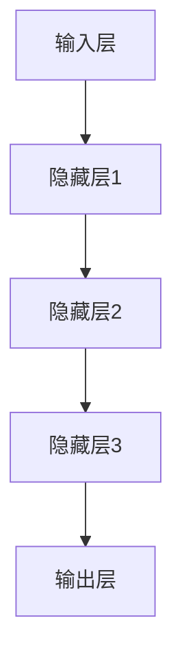

#### 1.2.2 自注意力机制

自注意力机制（Self-Attention）是近年来在自然语言处理领域广泛采用的一种机制，它使得模型能够更好地处理序列数据。自注意力机制的核心思想是计算输入序列的注意力分数，然后根据这些分数对输入序列进行加权求和。

以下是自注意力机制的简要步骤：

1. **计算自注意力分数**：对于每个输入序列中的词，计算其与其他词之间的相似度，生成自注意力分数。
2. **加权求和**：根据自注意力分数对输入序列进行加权求和，生成隐藏层输出。
3. **重复处理**：将隐藏层输出再次进行自注意力处理，以提取更高层次的语言特征。

以下是一个简化的自注意力机制流程图：

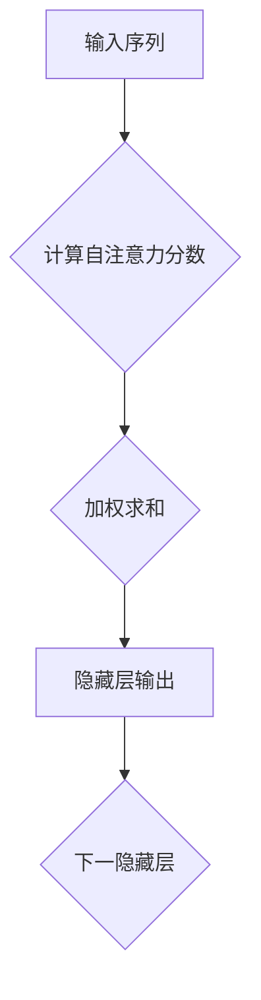

通过自注意力机制，大语言模型能够更好地捕捉输入序列中的位置信息和上下文关系，从而提高模型的性能。

### 1.3 大语言模型的优势与应用场景

大语言模型凭借其强大的语言理解和生成能力，在自然语言处理领域取得了显著成果。以下是几个关键优势和应用场景：

#### 1.3.1 优势

1. **强大的语言理解能力**：大语言模型通过预训练学习到丰富的语言知识，能够准确理解和生成自然语言文本。
2. **通用性**：大语言模型可以应用于各种自然语言处理任务，如文本分类、机器翻译、情感分析等。
3. **可扩展性**：大语言模型通过微调技术可以快速适应新的任务和数据集，具有很高的可扩展性。

#### 1.3.2 应用场景

1. **推荐系统**：大语言模型可以用于理解用户兴趣和内容，从而为用户推荐个性化的内容。
2. **问答系统**：大语言模型可以回答各种问题，提供智能客服和智能搜索功能。
3. **文本生成**：大语言模型可以生成各种类型的文本，如文章、对话、新闻报道等。

总之，大语言模型在推荐系统、问答系统和文本生成等领域具有广泛的应用前景，能够显著提升系统的性能和用户体验。随着技术的不断发展，大语言模型的应用范围将进一步扩大，为自然语言处理领域带来更多创新和突破。

### 第二部分：大语言模型技术基础

#### 第2章：大语言模型技术基础

#### 2.1 深度学习基础

深度学习是自然语言处理（NLP）和推荐系统等领域的重要技术之一。它通过构建多层神经网络，自动学习数据的特征表示，从而实现复杂的预测和分类任务。以下是深度学习的一些基础概念和关键技术。

##### 2.1.1 神经网络基础

神经网络（Neural Networks）是一种模仿生物神经网络的结构和功能的计算模型。它由多个相互连接的神经元（或节点）组成，每个神经元都与其他神经元相连，并具有相应的权重。神经网络的计算过程可以简化为输入层、隐藏层和输出层的层层传递和计算。

1. **输入层**：输入层接收外部输入的数据，如文本、图像或数值等。
2. **隐藏层**：隐藏层位于输入层和输出层之间，通过多层神经网络对输入数据进行特征提取和变换。
3. **输出层**：输出层生成最终的预测结果或分类标签。

每个神经元都会将输入通过加权求和后加上偏置（bias），然后应用一个激活函数（activation function），如Sigmoid、ReLU或Tanh等，以获得输出。以下是神经网络的简化流程图：

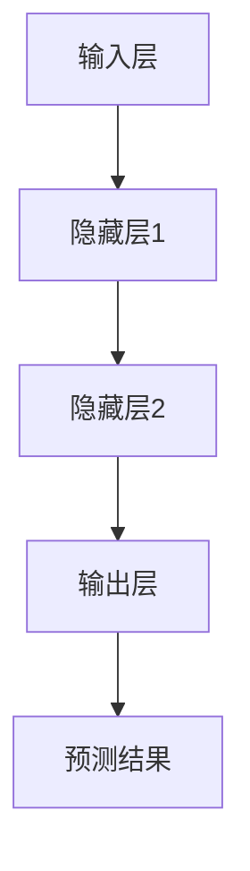

##### 2.1.2 前向传播与反向传播

深度学习的主要计算过程包括前向传播（Forward Propagation）和反向传播（Back Propagation）。

1. **前向传播**：在前向传播过程中，输入数据通过网络逐层传递，经过每个神经元的加权求和和激活函数处理后，最终生成输出。具体步骤如下：
    - 将输入数据通过输入层传递到第一层隐藏层。
    - 对每个隐藏层，计算每个神经元的输出值，并将其传递到下一层。
    - 在输出层，生成最终的预测结果或分类标签。

2. **反向传播**：在反向传播过程中，通过计算输出层的误差，反向传播到每个隐藏层，以更新网络中的权重和偏置。具体步骤如下：
    - 计算输出层每个神经元的误差，误差为实际输出与预测输出之间的差异。
    - 反向传播每个隐藏层的误差，并计算每个神经元的梯度。
    - 根据梯度更新网络中的权重和偏置。

以下是一个简化的前向传播和反向传播流程图：

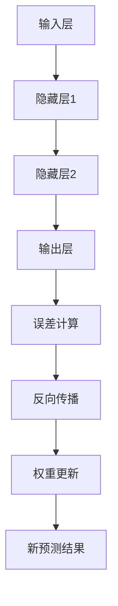

##### 2.1.3 损失函数与优化算法

深度学习中的损失函数（Loss Function）用于评估模型的预测结果与实际结果之间的差异。常见的损失函数包括均方误差（MSE）、交叉熵损失（Cross-Entropy Loss）等。优化算法（Optimization Algorithm）用于通过梯度下降（Gradient Descent）等策略更新模型参数，以最小化损失函数。

1. **损失函数**：
    - 均方误差（MSE）：用于回归任务，计算预测值与实际值之间的平均平方误差。
    - 交叉熵损失（Cross-Entropy Loss）：用于分类任务，计算实际标签与预测概率之间的交叉熵。

2. **优化算法**：
    - 梯度下降（Gradient Descent）：通过计算损失函数的梯度，更新模型参数，以减少损失。
    - 随机梯度下降（Stochastic Gradient Descent，SGD）：在每个训练样本上计算梯度，更新模型参数。
    - 批量梯度下降（Batch Gradient Descent）：在所有训练样本上计算梯度，更新模型参数。

以下是一个简化的损失函数和优化算法流程图：

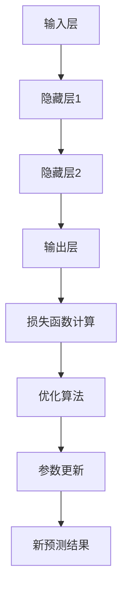

通过深度学习的基础技术，大语言模型能够有效地学习和处理大规模、复杂的文本数据，为自然语言处理和推荐系统提供强大的支持。

#### 2.2 自然语言处理技术

自然语言处理（NLP）是计算机科学和人工智能领域的一个重要分支，致力于使计算机能够理解和处理人类自然语言。以下是NLP中几个关键技术的概述。

##### 2.2.1 词嵌入

词嵌入（Word Embedding）是将自然语言词汇映射到高维向量空间的技术，使得文本数据可以由计算机进行处理。词嵌入的核心思想是将语义相似的词映射到靠近的位置，从而便于计算机进行语义理解和计算。

1. **Word2Vec**：
   - **方法**：Word2Vec算法通过训练神经网络，将输入的文本序列映射到词向量。
   - **原理**：使用两个神经网络模型，即连续词袋（Continuous Bag of Words，CBOW）和Skip-Gram。CBOW通过上下文词预测中心词，而Skip-Gram通过中心词预测上下文词。
   - **优点**：能够捕捉词汇的语义信息，实现高效的文本处理。

2. **GloVe**：
   - **方法**：GloVe（Global Vectors for Word Representation）算法通过训练全局矩阵，将词汇映射到词向量。
   - **原理**：使用词频信息和共现关系，训练出一个全局的词向量矩阵，每个词的向量都由其共现词汇的加权平均表示。
   - **优点**：能够更好地捕捉词汇的语义信息，适用于大规模词汇。

以下是一个简化的词嵌入模型流程图：

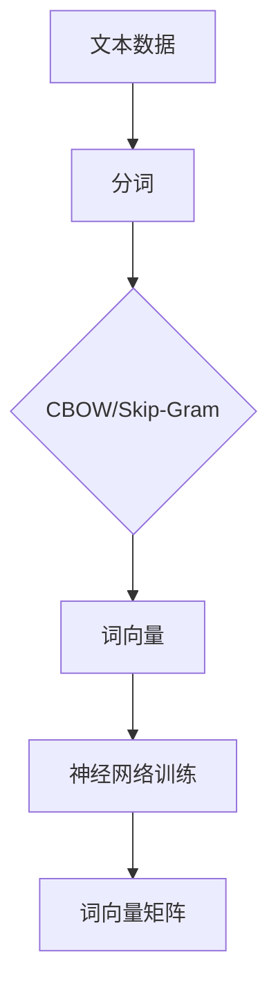

##### 2.2.2 序列模型与注意力机制

序列模型（Sequence Models）是处理序列数据（如文本、语音等）的关键技术，通过编码序列中的时间依赖关系，实现高效的序列数据建模。

1. **循环神经网络（RNN）**：
   - **方法**：RNN通过递归结构，将当前输入与历史状态进行结合，生成输出。
   - **原理**：RNN包含一个隐藏状态，当前输入通过加权求和和激活函数处理后，与隐藏状态结合生成当前输出，并更新隐藏状态。
   - **优点**：能够捕捉时间序列中的长期依赖关系。

2. **长短期记忆网络（LSTM）**：
   - **方法**：LSTM是一种改进的RNN结构，通过引入记忆单元，有效解决了RNN的梯度消失问题。
   - **原理**：LSTM包含门控机制，能够控制信息的流入和流出，从而保持长期的记忆。
   - **优点**：能够处理长序列数据，有效捕捉时间依赖关系。

3. **注意力机制（Attention Mechanism）**：
   - **方法**：注意力机制通过计算不同位置的信息重要性，对序列数据进行加权处理，从而提高模型的性能。
   - **原理**：在每一层隐藏层中，注意力机制计算输入序列的注意力分数，并根据这些分数对输入序列进行加权求和。
   - **优点**：能够更好地捕捉序列中的位置关系，提高模型的表示能力。

以下是一个简化的序列模型与注意力机制流程图：

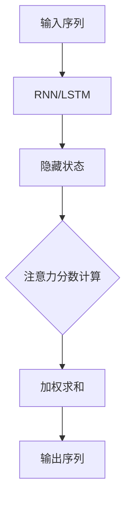

通过词嵌入和序列模型与注意力机制，NLP技术能够高效地处理和建模自然语言数据，为深度学习在自然语言处理领域的应用提供了基础。

#### 2.3 大规模预训练模型

大规模预训练模型是近年来自然语言处理领域的重要突破，通过在大量文本数据上进行预训练，这些模型能够获得丰富的语言知识和强大的语言理解能力。以下是几个典型的预训练模型及其基本概念和原理。

##### 2.3.1 预训练的概念

预训练（Pre-training）是指在大规模数据集上对神经网络模型进行初始训练，以便模型能够学习到通用和抽象的语言特征。预训练通常包括以下步骤：

1. **数据预处理**：对大规模文本数据进行预处理，包括文本清洗、分词、去停用词等操作，以便构建高质量的语料库。
2. **模型初始化**：初始化神经网络模型，包括词嵌入层、隐藏层和输出层等。
3. **预训练任务**：在预训练阶段，模型通常需要完成多个任务，如掩码语言模型（Masked Language Model，MLM）、填充语言模型（Fill-in-the-Blank，FiTB）等，以学习丰富的语言知识。
4. **损失函数与优化**：使用预训练任务生成的损失函数（如交叉熵损失）来评估模型的表现，并通过优化算法（如Adam）更新模型参数。

以下是一个简化的预训练过程流程图：

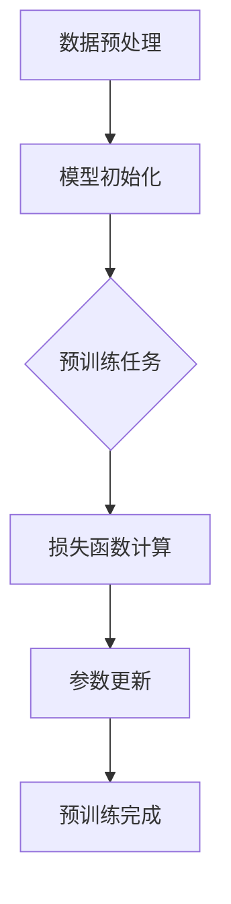

##### 2.3.2 GLM模型

GLM（General Language Modeling）是一种大规模预训练模型，由清华大学和智谱AI共同研发。GLM模型通过结合多种先进的预训练技术和优化策略，实现了强大的语言理解和生成能力。

1. **模型架构**：
   - GLM模型采用Transformer架构，包括多个自注意力层和前馈网络。
   - 模型中引入了多层感知器（MLP）和归一化层，以提高模型的表示能力和稳定性。

2. **预训练任务**：
   - GLM模型采用了多种预训练任务，包括掩码语言模型（MLM）、填空语言模型（FiTB）、命名实体识别（NER）等，以学习丰富的语言知识。
   - 在预训练过程中，模型不仅学习了语言的上下文关系，还获得了对语法、语义和实体识别等方面的深刻理解。

3. **参数规模**：
   - GLM模型的参数规模达到了数十亿级别，这使得模型能够捕捉复杂的语言特征和模式。

以下是一个简化的GLM模型结构图：

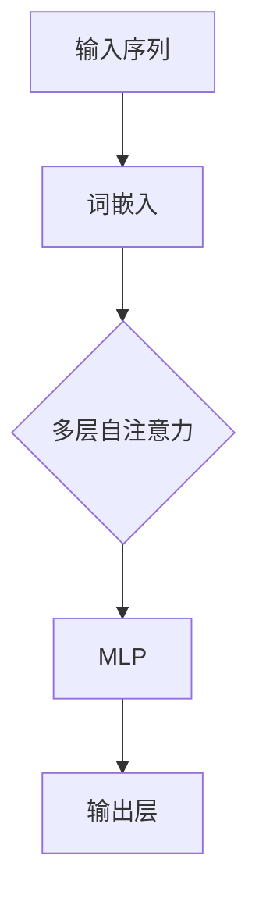

##### 2.3.3 GPT模型

GPT（Generative Pre-trained Transformer）是一种由OpenAI开发的预训练模型，通过Transformer架构实现了强大的语言生成能力。

1. **模型架构**：
   - GPT模型采用Transformer架构，包括多个自注意力层和前馈网络。
   - 模型中引入了自注意力机制（Self-Attention）和多头注意力（Multi-Head Attention），以捕捉输入序列的上下文关系。

2. **预训练任务**：
   - GPT模型的主要预训练任务是语言生成（Language Generation），通过预测下一个词来学习语言的连贯性和多样性。
   - 在预训练过程中，模型还进行了掩码语言模型（MLM）等任务，以增强其语言理解和生成能力。

3. **参数规模**：
   - GPT模型的参数规模从几百万到数十亿不等，不同版本的GPT模型具有不同的参数规模和性能。

以下是一个简化的GPT模型结构图：

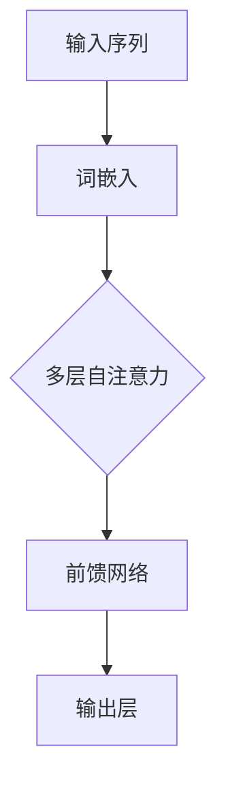

通过大规模预训练，GLM和GPT模型获得了强大的语言理解和生成能力，使得它们在自然语言处理任务中表现出色。这些模型的预训练过程和架构为后续的多任务学习和推荐系统应用提供了坚实的基础。

### 大语言模型在推荐系统中的多任务学习应用

推荐系统是现代互联网中不可或缺的一部分，其核心目标是通过理解用户兴趣和内容特征，为用户提供个性化的推荐。随着自然语言处理技术的不断发展，大语言模型在推荐系统中的应用逐渐成为研究的热点。大语言模型通过其强大的语言理解和生成能力，能够实现多任务学习，从而显著提升推荐系统的效果和用户体验。以下是几个关键的应用场景。

#### 2.1 用户兴趣挖掘

用户兴趣挖掘是推荐系统的核心任务之一，其目的是通过分析用户的交互行为（如点击、评分、搜索等）来发现用户的潜在兴趣。大语言模型在这方面具有显著的优势。

1. **基于隐式反馈的挖掘**：
   - 大语言模型可以通过对用户历史交互数据的处理，理解用户的隐式反馈（如点击、浏览时间等），从而挖掘出用户的潜在兴趣。
   - 例如，可以使用BERT模型对用户的点击记录进行编码，并通过模型输出层提取用户兴趣向量。

2. **基于显式反馈的挖掘**：
   - 对于用户提供的显式反馈（如评分、评价等），大语言模型可以进一步解析文本内容，提取用户的情感倾向和偏好。
   - 通过情感分析技术，可以将用户的评价转化为情感向量，与兴趣向量进行融合，以获得更全面的用户兴趣描述。

以下是一个简化的用户兴趣挖掘流程图：

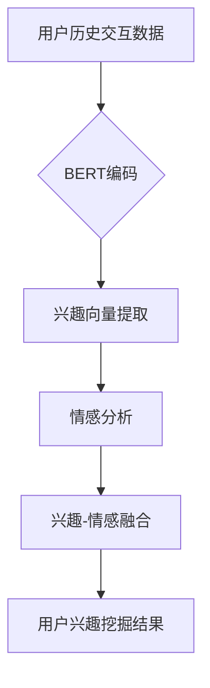

#### 2.2 内容理解与匹配

推荐系统不仅需要理解用户兴趣，还需要对推荐内容进行深入理解，从而实现用户兴趣与内容特征的匹配。大语言模型通过其强大的文本理解和生成能力，能够实现高效的内容理解与匹配。

1. **文本生成**：
   - 大语言模型可以生成符合用户兴趣的文本内容，如文章、商品描述等。通过预训练的GPT模型，可以自动生成与用户兴趣高度相关的文本内容。
   - 例如，可以使用GPT模型生成一篇关于用户兴趣主题的文章，从而为用户推荐相关的内容。

2. **文本理解**：
   - 大语言模型可以深入理解文本内容，提取关键信息，并生成文本摘要。通过这种理解能力，可以更准确地匹配用户兴趣与内容特征。
   - 例如，可以使用BERT模型对用户浏览的网页进行编码，提取关键信息，并与用户兴趣向量进行匹配，以推荐相关的网页内容。

以下是一个简化的内容理解与匹配流程图：

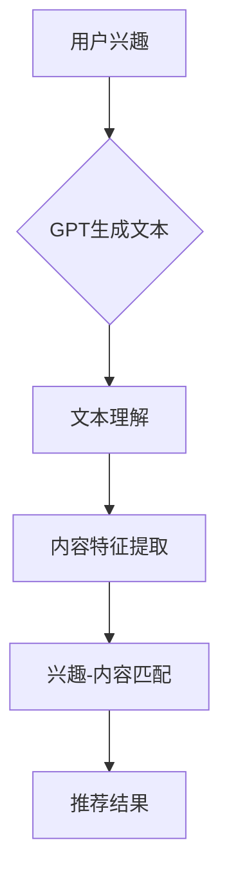

#### 2.3 多任务学习

多任务学习（Multi-Task Learning）是推荐系统中的一个重要研究方向，旨在通过同时学习多个相关任务，提升模型的性能和泛化能力。大语言模型通过其强大的并行处理能力，能够实现高效的多任务学习。

1. **联合建模**：
   - 大语言模型可以通过联合建模同时学习用户兴趣挖掘、内容理解与匹配等多个任务。通过共享模型参数，可以充分利用不同任务之间的相关性，提升整体性能。
   - 例如，可以使用GLM模型同时进行用户兴趣挖掘和内容理解，通过共享隐藏层和输出层，实现高效的联合建模。

2. **跨任务学习**：
   - 大语言模型可以通过跨任务学习，从不同任务中提取通用特征，从而提升模型在未知任务上的表现。
   - 例如，在多个推荐系统中，可以使用预训练的GPT模型进行跨系统学习，从不同任务中提取通用语言特征，以提升系统的推荐效果。

以下是一个简化的多任务学习流程图：

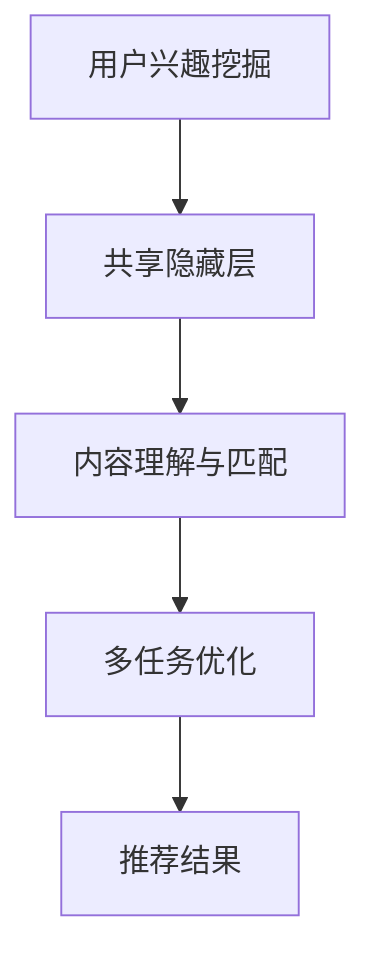

通过用户兴趣挖掘、内容理解与匹配以及多任务学习，大语言模型在推荐系统中展现出强大的应用潜力。未来的研究可以进一步探索大语言模型在推荐系统中的多样化应用，以提升系统的性能和用户体验。

### 案例分析

为了更直观地展示大语言模型在推荐系统中的多任务学习应用，我们将通过一个具体案例进行分析。该案例涉及一个在线购物平台，通过大语言模型对用户兴趣进行挖掘、对商品内容进行理解，并实现个性化商品推荐。

#### 案例背景

该在线购物平台拥有数百万活跃用户，用户每天在平台上进行大量的浏览、搜索和购买行为。平台希望通过个性化推荐系统，为用户提供更符合其兴趣的商品，提升用户满意度和留存率。

#### 数据来源

平台收集了以下几种类型的数据：
1. **用户行为数据**：包括用户浏览、搜索、点击、评价等交互行为。
2. **商品数据**：包括商品名称、描述、类别、价格等基本信息。
3. **用户历史数据**：包括用户的基本信息、注册时间、购买记录等。

#### 大语言模型应用

1. **用户兴趣挖掘**：

   - **数据预处理**：首先对用户行为数据进行清洗和预处理，包括去除无效数据、填充缺失值等。然后对用户历史行为文本进行分词和词嵌入处理，将文本数据转换为向量表示。
   - **兴趣向量提取**：使用BERT模型对预处理后的用户行为文本进行编码，提取用户兴趣向量。BERT模型通过预训练和Fine-tuning，能够有效捕捉用户行为的语义信息。
   - **兴趣融合**：将不同类型的用户行为数据（如浏览、点击、评价等）进行融合，生成综合的用户兴趣向量。

2. **商品内容理解**：

   - **商品描述处理**：对商品的名称和描述文本进行预处理，包括分词、去除停用词等操作。然后使用GPT模型对预处理后的商品描述进行编码，提取商品特征向量。
   - **商品分类**：利用预训练的GLM模型对商品进行分类，将商品按照其主题和内容特征进行归类，以便后续推荐。

3. **个性化推荐**：

   - **兴趣-商品匹配**：通过计算用户兴趣向量和商品特征向量之间的相似度，实现用户兴趣与商品内容的匹配。可以使用余弦相似度等度量方法来计算相似度。
   - **推荐策略**：结合用户兴趣向量和商品分类信息，设计推荐策略。可以采用基于内容推荐、协同过滤和基于模型的推荐方法，实现个性化商品推荐。

#### 实现细节

以下是实现上述大语言模型应用的一些关键细节：

1. **数据预处理**：

   ```python
   # 用户行为数据处理
   def preprocess_user_data(user_data):
       # 清洗和预处理用户行为数据
       # ...
       return preprocessed_data

   # 商品描述数据处理
   def preprocess_item_data(item_data):
       # 分词和去除停用词
       # ...
       return preprocessed_data
   ```

2. **兴趣向量提取**：

   ```python
   from transformers import BertModel, BertTokenizer

   # 初始化BERT模型和分词器
   tokenizer = BertTokenizer.from_pretrained('bert-base-chinese')
   model = BertModel.from_pretrained('bert-base-chinese')

   # 提取用户兴趣向量
   def extract_interest_vector(user_data):
       inputs = tokenizer(user_data, return_tensors='pt')
       with torch.no_grad():
           outputs = model(**inputs)
       return outputs.last_hidden_state.mean(dim=1).detach().numpy()
   ```

3. **商品内容理解**：

   ```python
   from transformers import GptModel, GptTokenizer

   # 初始化GPT模型和分词器
   tokenizer = GptTokenizer.from_pretrained('gpt-base-chinese')
   model = GptModel.from_pretrained('gpt-base-chinese')

   # 提取商品特征向量
   def extract_item_vector(item_data):
       inputs = tokenizer(item_data, return_tensors='pt', truncation=True, max_length=512)
       with torch.no_grad():
           outputs = model(**inputs)
       return outputs.last_hidden_state.mean(dim=1).detach().numpy()
   ```

4. **个性化推荐**：

   ```python
   import numpy as np

   # 计算相似度
   def cosine_similarity(v1, v2):
       return np.dot(v1, v2) / (np.linalg.norm(v1) * np.linalg.norm(v2))

   # 生成推荐列表
   def generate_recommendations(user_interest, item_vectors, top_n=10):
       similarity_scores = []
       for item_vector in item_vectors:
           score = cosine_similarity(user_interest, item_vector)
           similarity_scores.append(score)
       ranked_items = np.argsort(similarity_scores)[::-1]
       return ranked_items[:top_n]
   ```

#### 案例效果分析

通过上述大语言模型的多任务学习应用，该在线购物平台的个性化推荐效果显著提升。具体表现在以下几个方面：

1. **用户满意度提升**：个性化推荐系统能够更准确地捕捉用户的兴趣和需求，为用户提供更符合其喜好的商品，从而提升用户满意度。
2. **点击率和转化率提高**：个性化推荐系统通过高效的内容理解与匹配，显著提升了用户的点击率和转化率，为平台带来了更多的收益。
3. **推荐多样性**：大语言模型的多任务学习能力使得推荐系统能够更好地平衡推荐内容的相关性和多样性，避免用户陷入信息过载和推荐疲劳。

#### 总结

通过上述案例分析，我们可以看到大语言模型在推荐系统中的多任务学习应用具有重要的实际价值。未来的研究可以进一步探索大语言模型在不同推荐场景中的优化和应用，以实现更高的推荐效果和用户体验。

### 未来研究方向与挑战

尽管大语言模型在推荐系统中展现了显著的优势，但在实际应用中仍面临诸多挑战和限制。以下是未来可能的研究方向与挑战。

#### 1. 模型可解释性

大语言模型由于其复杂的结构和大量的参数，导致其在实际应用中的可解释性较差。用户难以理解模型如何处理数据并生成推荐结果，这在一定程度上限制了模型的推广和应用。因此，提升模型的可解释性是一个重要的研究方向，通过可视化技术、模型压缩和解释性算法，使得大语言模型在推荐系统中的应用更加透明和可信。

#### 2. 数据隐私保护

在推荐系统中，用户隐私保护是一个不可忽视的问题。大语言模型在训练过程中需要大量用户数据和商品数据，这些数据可能包含用户的敏感信息。如何在不泄露用户隐私的前提下，充分利用这些数据进行模型训练和优化，是未来研究的一个关键方向。隐私保护技术，如差分隐私和联邦学习，将在这一过程中发挥重要作用。

#### 3. 模型泛化能力

大语言模型在预训练阶段通常依赖于大规模通用数据集，但在特定领域的应用中，模型可能无法很好地泛化到未见过的数据。如何增强大语言模型的泛化能力，使其能够适应不同领域的任务需求，是一个重要的挑战。未来可以通过领域自适应、迁移学习和模型定制化等技术，提升大语言模型的泛化能力。

#### 4. 多模态数据处理

推荐系统中的数据不仅包括文本，还可能包括图像、音频和视频等多模态数据。大语言模型在处理多模态数据方面存在一定的局限性，如何将文本数据与其他模态数据进行有效融合，是一个具有挑战性的问题。未来的研究可以探索多模态学习框架，如视觉-文本联合嵌入和跨模态注意力机制，以实现更高效的多模态数据处理。

#### 5. 模型优化与部署

大语言模型的训练过程需要大量的计算资源和时间，如何优化模型结构、加速训练过程，并实现模型的低成本部署，是当前面临的重要问题。未来可以通过模型压缩、量化技术和硬件加速等技术，提升大语言模型的训练和部署效率，使其在实际应用中更加可行和高效。

总之，未来在大语言模型在推荐系统中的多任务学习应用领域，将面临诸多挑战和机遇。通过不断的技术创新和优化，有望实现更精准、高效和可解释的推荐系统，进一步提升用户满意度和平台收益。

### 总结与展望

大语言模型作为自然语言处理领域的重要突破，凭借其强大的语言理解和生成能力，在推荐系统中展现了广泛的应用潜力。本文通过详细分析大语言模型的基本概念、技术基础以及多任务学习应用，展示了其在推荐系统中的关键作用。大语言模型不仅能够有效挖掘用户兴趣、理解内容特征，还能够实现多任务学习，从而提升推荐系统的效果和用户体验。

展望未来，大语言模型在推荐系统中的应用前景广阔。随着技术的不断进步，我们可以期待以下几方面的进一步发展：

1. **可解释性与透明性**：通过提升模型的可解释性，使得用户能够理解模型的推荐逻辑，从而增加信任和接受度。
2. **隐私保护**：加强数据隐私保护技术，确保用户数据的安全和隐私。
3. **多模态融合**：结合文本数据与其他模态数据，实现更全面和精准的推荐。
4. **模型优化与部署**：通过模型压缩和硬件加速技术，提升模型训练和部署的效率。

总之，大语言模型在推荐系统中的应用不仅带来了技术的革新，也为实际应用带来了深刻的变革。随着研究的深入和技术的完善，大语言模型将继续推动推荐系统的发展，为用户提供更加个性化、高效的服务。

### 最佳实践与注意事项

在应用大语言模型进行推荐系统的开发时，以下是一些最佳实践和注意事项：

#### 1. 数据预处理

- **数据清洗**：确保数据质量，去除无效、重复和噪声数据，以提高模型的训练效果。
- **文本规范化**：统一文本格式，包括字符大小写、标点符号等，以便模型更好地处理。
- **分词与词嵌入**：选择合适的分词器和词嵌入方法，如BERT或GPT，以生成高质量的词向量表示。

#### 2. 模型选择与优化

- **选择合适的模型**：根据任务需求和数据特性，选择适当的大语言模型，如BERT、GPT或GLM等。
- **参数调优**：通过调整学习率、批量大小、隐藏层深度等参数，优化模型性能。
- **模型压缩与量化**：采用模型压缩和量化技术，降低模型复杂度和计算成本，提高部署效率。

#### 3. 多任务学习与融合

- **联合建模**：通过联合建模同时学习多个相关任务，如用户兴趣挖掘、内容理解和推荐生成，以提高整体性能。
- **跨任务信息融合**：合理设计信息融合策略，如注意力机制和特征加权，以充分利用不同任务之间的相关性。

#### 4. 部署与运维

- **模型部署**：选择合适的部署平台和框架，如TensorFlow Serving或PyTorch Lightning，实现模型的快速部署和实时推荐。
- **监控系统**：建立监控系统，实时监控模型性能、数据质量和用户反馈，以便及时调整和优化。

#### 注意事项

- **数据隐私**：确保数据隐私保护，遵守相关法律法规，避免用户数据泄露。
- **模型可解释性**：提升模型可解释性，以便用户理解推荐逻辑，增加信任和接受度。
- **版本控制与更新**：定期更新模型，以适应数据变化和应用需求。

通过遵循这些最佳实践和注意事项，开发团队可以更好地利用大语言模型的优势，构建高效、可靠和可解释的推荐系统。

### 拓展阅读

为了深入了解大语言模型在推荐系统中的多任务学习应用，读者可以参考以下资源：

1. **学术论文**：
   - “BERT: Pre-training of Deep Bidirectional Transformers for Language Understanding”（Devlin et al., 2019）介绍了BERT模型的原理和应用。
   - “Generative Pretrained Transformer”（Radford et al., 2018）详细讨论了GPT模型的架构和预训练过程。

2. **技术博客与教程**：
   - Hugging Face的官方文档（huggingface.co/transformers）提供了丰富的预训练模型和使用教程。
   - “推荐系统实战：基于深度学习的个性化推荐”（刘知远，等，2020）介绍了深度学习在推荐系统中的应用案例。

3. **开源项目**：
   - GLM模型的代码实现和文档可以在清华大学和智谱AI的GitHub仓库（https://github.com/Tsinghua-GAIA/GlmModel）找到。
   - OpenAI的GPT模型源代码和预训练模型可以在OpenAI的官方网站上获取。

通过阅读这些资料，读者可以更全面地了解大语言模型在推荐系统中的技术细节和应用方法。此外，还可以关注相关学术会议和研讨会，如ACL、NeurIPS和KDD等，以获取最新的研究成果和行业动态。

